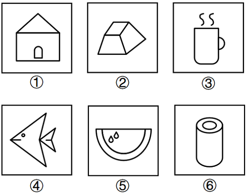
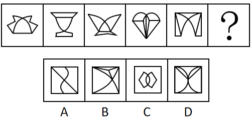
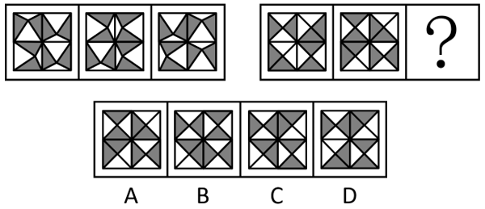
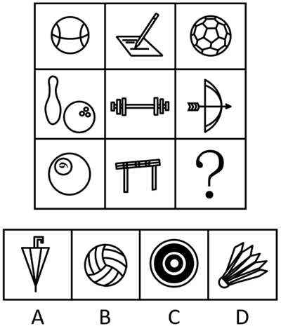
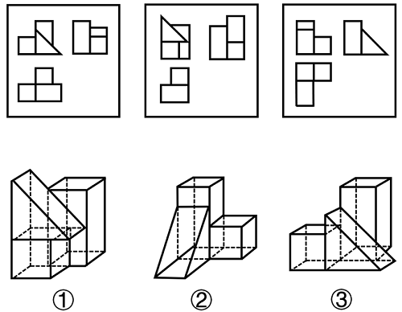

# 2025年山西省公务员录用考试《行测》题（网友回忆版）

> 判断推理 · 30 题 · 山西 2025

## 第 1 题　qid 12881897 · 图形推理

把下面的六个图形分为两类，使每一类图形都有各自的共同特征或规律，分类正确的一项是：

- **A**. ①③④，②⑤⑥
- **B**. ①②⑥，③④⑤　✅
- **C**. ①③⑤，②④⑥
- **D**. ①④⑥，②③⑤

**答案**：B

**官方解析**

元素组成不同，且无明显属性规律，考虑数量规律。题干图形出现“日”字变形图及出头端点，优先考虑笔画数。观察发现，图①②⑥均为2笔画图形，图③④⑤均为3笔画图形。即图①②⑥为一组，图③④⑤为一组。
故正确答案为B。

---

## 第 2 题　qid 13504504 · 图形推理

从所给的四个选项中，选择最合适的一个填入问号处，使之呈现一定的规律性。

- **A**. A
- **B**. B　✅
- **C**. C
- **D**. D

**答案**：B

**官方解析**

元素组成不同，无明显属性规律，考虑数量规律。观察发现，题干图形中出现明显曲线和多边形，考虑线的数量。题干图形中既有曲线又有直线，考虑曲线和直线分开数。题干图形中曲线数量均为2，所以“？”处图形的曲线数量应为2，排除A项；直线数量均为7，所以“？”处图形的直线数量应为7，只有B项符合。
故正确答案为B。

---

## 第 3 题　qid 13504515 · 图形推理

从所给的四个选项中，选择最合适的一个填入问号处，使之呈现一定的规律性。

- **A**. A
- **B**. B
- **C**. C　✅
- **D**. D

**答案**：C

**官方解析**

元素组成相同，考虑位置规律。观察第一组图形位置可知，从图一到图三，田字格中每一区域都是由前一幅图同位置顺时针旋转得到，第二组应遵循相同的旋转规律，田字格中每一区域都是由前一幅图同位置顺时针旋转得到，只有C项符合。

故正确答案为C。

---

## 第 4 题　qid 12881896 · 图形推理

从所给的四个选项中，选择最合适的一个填入问号处，使之呈现一定的规律性。

- **A**. A
- **B**. B
- **C**. C
- **D**. D　✅

**答案**：D

**官方解析**

元素组成不同，优先考虑属性规律。观察发现，题干出现全直线、全曲线图形，考虑曲直性。九宫格优先看横行，第一行图形分别为全曲线图形、全直线图形、有曲有直图形；经验证，第二行符合此规律；第三行应用此规律，故“？”处图形应是有曲有直图形，只有D项符合。
故正确答案为D。

---

## 第 5 题　qid 13504521 · 图形推理

下面三视图依次与三个几何图形对应，三个几何图形的正确顺序是：

- **A**. ②①③
- **B**. ②③①
- **C**. ①③②
- **D**. ③①②　✅

**答案**：D

**官方解析**

本题考查三视图。图一左上方是③的主视图，图一右上方是③的左视图，图一左下方是③的俯视图；图二左上方是①的主视图，图二右上方是①的左视图，图二左下方是①的俯视图；图三左上方是②的主视图，图三右上方是②的左视图，图三左下方是②的俯视图。
故正确答案为D。

---

## 第 6 题　qid 13504507 · 定义判断

马氏体相变是一种晶体结构变化。由于外界物理作用，比如温度、外力或者磁场的变化，一些材料的晶体结构会失去稳定性，原子发生短距离的移动，导致结构畸变。这种非原子扩散型的结构变化被称为马氏体相变。马氏体相变的一个重要特性是形状记忆效应，即基于两种结构相互转变和变体滑移，材料外形发生明显变化并能恢复原态。
根据上述定义，下列未体现马氏体相变的是：

- **A**. 将形状扭曲的别针放到热水里，别针立刻就能恢复原状
- **B**. 起扩张血管作用的心脏支架用在外周血管时，因为挤压而变形　✅
- **C**. 通过电流加热控制合金网状结构变化，制造了能模仿蠕虫前进的机器人
- **D**. 采用镍钛弓丝的牙齿矫形器受口腔温度影响，可产生形状恢复力，为牙齿矫形提供所需的力量

**答案**：B

**官方解析**

第一步：找出定义关键词。
“由于外界物理作用，比如温度、外力或者磁场的变化”、“材料外形发生明显变化并能恢复原态”。
第二步：逐一分析选项。
A项：形状扭曲的别针放到热水里，立刻就能恢复原状，说明由于温度的作用，别针的外形发生变化并恢复原状，符合“由于外界物理作用，比如温度、外力或者磁场的变化”、“材料外形发生明显变化并能恢复原态”，符合定义，排除；
B项：心脏支架因为挤压而变形，说明由于外力的作用，支架的外形发生变化，但未体现支架是否可以恢复原状，不符合“材料外形发生明显变化并能恢复原态”，不符合定义，当选；
C项：通过加热控制合金网状结构变化，制造了能模仿蠕虫前进的机器人，蠕虫的前进需要重复进行肢体的伸缩，说明由于温度的作用，机器人的外形发生变化并恢复原状，符合“由于外界物理作用，比如温度、外力或者磁场的变化”、“材料外形发生明显变化并能恢复原态”，符合定义，排除；
D项：镍钛弓丝的牙齿矫形器受口腔温度影响，可产生形状恢复力，说明由于温度的作用，牙齿矫形器的外形发生变化并恢复原状，符合“由于外界物理作用，比如温度、外力或者磁场的变化”、“材料外形发生明显变化并能恢复原态”，符合定义，排除。
本题为选非题，故正确答案为B。

---

## 第 7 题　qid 13504474 · 定义判断

物质循环是指在生态系统中，各种元素物质沿着特定途径从周围环境中被生物体吸收利用，再从生物体回到周围环境的循环变化过程，即各种元素物质在生物体和非生物环境之间的往复循环运转过程。
下列诗句中所描写的内容最能体现物质循环的是：

- **A**. 时有落花至，远随流水香
- **B**. 莫作绕山云，循环无定期
- **C**. 黄河之水天上来，奔流到海不复回
- **D**. 落红不是无情物，化作春泥更护花　✅

**答案**：D

**官方解析**

第一步：找出定义关键词。
“各种元素物质”、“在生物体和非生物环境之间”、“往复循环运转”。
第二步：逐一分析选项。
A项：选项意思是：不时有落花随溪水飘流而至，远远地就可闻到水中的芳香。表明落花及其香味在非生物环境中运转，但未提及生物体环境，不符合“在生物体和非生物环境之间”，不符合定义，排除；
B项：选项意思是：不要像绕山云般循环往复，没有固定的周期。表明云在非生物环境中循环运转，但未提及生物体环境，不符合“在生物体和非生物环境之间”，不符合定义，排除；
C项：选项意思是：那黄河之水犹如从天上倾泻而来，波涛翻滚直奔大海从来不会再往回流。表明黄河水在非生物环境中流动，但未提及生物体环境，且流动过程不是往复循环的，不符合“在生物体和非生物环境之间”、“往复循环运转”，不符合定义，排除；
D项：选项意思是：从枝头上掉下来的落花不是无情之物，即使化作春泥，也甘愿化作养料，滋养美丽的春花成长。表明落花的元素物质在生物体和非生物环境之间运转，符合“各种元素物质”、“在生物体和非生物环境之间”、“往复循环运转”，符合定义，当选。
故正确答案为D。

---

## 第 8 题　qid 13504502 · 定义判断

拓扑绝缘体是一种内部绝缘、界面允许电荷移动的材料，在拓扑绝缘体的内部，电子能带结构和常规的绝缘体相似，但在其表面或边界上存在特殊的量子态，这些量子态位于块体能带结构的带隙之中，从而能够导电。
根据上述定义，以下哪项是拓扑绝缘体?

- **A**. 量子点接触是一种纳米尺度的电子器件，其整体的导电性质可以通过调整器件的尺寸和形状来调控
- **B**. 氮化镓中由半导体异质结中的特殊电子结构形成的二维电子气，虽然其并不是一种材料，但在一定条件下能够导电
- **C**. 纯石墨烯本身不导电，但是经过一些工艺加工后，会表现出在一定条件下可以允许表面电荷移动形成导电能力的一种量子效应　✅
- **D**. 镧钡铜氧体系的超导陶瓷，是一类在临界温度时电阻为零的陶瓷材料，它还表现出完全抗磁性的行为，在传输过程中几乎没有能量消耗

**答案**：C

**官方解析**

第一步：找出定义关键词。
“内部绝缘、界面允许电荷移动的材料”。
第二步：逐一分析选项。
A项：量子点接触可以通过调整器件的尺寸和形状来调控整体的导电性，未提及其内部和外部的导电情况，不符合“内部绝缘、界面允许电荷移动的材料”，不符合定义，排除；
B项：氮化镓中的二维电子气在一定条件下能够导电，不符合“内部绝缘、界面允许电荷移动的材料”，不符合定义，排除；
C项：纯石墨烯本身不导电，符合“内部绝缘”，经过一些工艺加工后可以允许表面电荷移动形成导电能力，符合“界面允许电荷移动”，符合定义，当选；
D项：镧钡铜氧体系的超导陶瓷是一类在临界温度时电阻为零的陶瓷材料，没有提及其导电性，不符合“内部绝缘、界面允许电荷移动的材料”，不符合定义，排除。
故正确答案为C。

---

## 第 9 题　qid 12881894 · 定义判断

失眠是最常见的睡眠障碍，但生活中并不是所有的睡不着觉都叫做失眠，其必须包含三大要素，即持续的睡眠困难（入睡困难，即入睡时间超过三十分钟；睡眠维持障碍，即整夜觉醒次数不少于两次；早醒、睡眠质量下降以及总睡眠时间减少）、有充足的睡眠机会、出现相关的日间功能受损。可见，失眠不是因当前的客观条件让人无法睡觉，而是想睡却持续性睡不着，并且影响了日常的生活。
根据上述定义，下列诗句最能体现失眠的是：

- **A**. 官初罢后归来夜，天欲明前睡觉时
- **B**. 自经丧乱少睡眠，长夜沾湿何由彻　✅
- **C**. 暮归冲雨寒无睡，自把新诗百遍开
- **D**. 抱得秋情不忍眠，自向秋屏移泪烛

**答案**：B

**官方解析**

第一步：找出定义关键词。
“持续的睡眠困难（入睡困难，即入睡时间超过三十分钟；睡眠维持障碍，即整夜觉醒次数不少于两次；早醒、睡眠质量下降以及总睡眠时间减少）”、“有充足的睡眠机会”、“日间功能受损”、“不是因当前的客观条件让人无法睡觉”、“想睡却持续性睡不着”。
第二步：逐一分析选项。
A项：意思是“刚刚辞去官职回到家中时，已经是夜晚了，但在天色将明未明之时，诗人就已经醒来”，“官初罢后”不符合“持续性睡不着”，不符合定义，排除；
B项：意思是“自从安史之乱之后，我睡眠的时间很少，长夜漫漫，屋漏床湿，怎能挨到天亮”，“自经丧乱少睡眠”符合“持续的睡眠困难”，“长夜”符合“有充足的睡眠机会”，“丧乱”符合“不是因当前的客观条件让人无法睡觉”，符合定义，当选；
C项：意思是“此番风雨之夜辗转无眠，起来把新诗一遍一遍地写下”，是因为“风雨之夜”无法入眠，不符合“持续的睡眠困难”，不符合“不是因当前的客观条件让人无法睡觉”，不符合定义，排除；
D项：意思是“怀着秋日的感伤无法入眠，向着屏风移动流泪的蜡烛”，“不忍眠”体现的是不想睡，不符合“想睡却持续性睡不着”，不符合定义，排除。
故正确答案为B。

---

## 第 10 题　qid 13504508 · 定义判断

近零碳建筑是指建筑物通过适应气候特征和场地条件，最大幅度地降低建筑对能源的需求，运行过程中全电化，不使用燃气，建筑排放的碳量处于较低水平。近零碳建筑不仅利用各种方法减少自身产生的碳排放，还收集并利用雨水、太阳能等可再生能源，最终达到零废水、零能耗、零废弃物的理想状态。
下列做法不符合近零碳建筑理念的是：

- **A**. 加大物联网、大数据、人工智能等技术在建筑上的应用
- **B**. 淘汰预制模块化建筑技术，采用传热系数高的幕墙建材　✅
- **C**. 实现建筑内空调精细化运行，始终保持温湿度的独立控制
- **D**. 利用集成地源热泵、空气源热泵、光伏发电等可再生能源

**答案**：B

**官方解析**

第一步：找出定义关键词。
“建筑物通过适应气候特征和场地条件”、“最大幅度地降低建筑对能源的需求”、“运行过程中全电化，不使用燃气”、“建筑排放的碳量处于较低水平”、“利用雨水、太阳能等可再生能源”、“零废水、零能耗、零废弃物”。
第二步：逐一分析选项。
A项：加大物联网、大数据和人工智能技术在建筑上的应用，各项技术能够实现智能化识别、定位、跟踪、监管等功能，有利于能源管理和优化，符合“建筑物通过适应气候特征和场地条件”、“最大幅度地降低建筑对能源的需求”，符合定义，排除；
B项：建筑技术采用传热系数高的幕墙建材，会导致传热更快，保温隔热性能更差，反而增加建筑的能耗，不利于低碳，不符合“最大幅度地降低建筑对能源的需求”，不符合定义，当选；
C项：实现建筑内空调精细化运行，可以减少能源的消耗，符合“最大幅度地降低建筑对能源的需求”、“建筑排放的碳量处于较低水平”，符合定义，排除；
D项：利用集成地源热泵、空气源热泵、光伏发电等可再生能源，符合“建筑物通过适应气候特征和场地条件”、“利用雨水、太阳能等可再生能源”，符合定义，排除。
本题为选非题，故正确答案为B。

---

## 第 11 题　qid 13504455 · 定义判断

免疫电镜技术是将抗原抗体反应的特异性和电子显微镜的高分辨率相结合，在亚细胞和超微结构水平上对抗原进行定位分析的一种高精确度的技术。
根据上述定义，下列不属于免疫电镜技术的是：

- **A**. 酶的催化作用对其底物的反应可形成不同的电子密度，运用电子显微镜来观察，可确定酶的存在，从而对抗原进行定位
- **B**. 胶体金与铁蛋白一样具有高电子密度，将沙门氏菌的抗血清与胶体金颗粒结合，可以明确病原物抗原在电镜水平的定位
- **C**. 铁蛋白通过交联剂与抗体等物质的共价结合，其分辨率高、散射能力强，借助电镜可以准确描述抗原抗体复合物的定位
- **D**. 微流体检测芯片中的免疫电极体系有镀金基层、导电聚合物层和抗体层，三者自下而上依次贴合，提高检测定位的水平　✅

**答案**：D

**官方解析**

第一步：找出定义关键词。
“将抗原抗体反应的特异性和电子显微镜的高分辨率相结合”、“在亚细胞和超微结构水平上对抗原进行定位分析”。
第二步：逐一分析选项。
A项：该项中运用电子显微镜观察酶的催化作用，符合“将抗原抗体反应的特异性和电子显微镜的高分辨率相结合”，通过确定酶的存在来对抗原进行定位，符合“在亚细胞和超微结构水平上对抗原进行定位分析”，符合定义，排除；
B项：该项中将沙门氏菌的抗血清与胶体金颗粒结合，利用电子显微镜明确抗原定位，符合“将抗原抗体反应的特异性和电子显微镜的高分辨率相结合”、“在亚细胞和超微结构水平上对抗原进行定位分析”，符合定义，排除；
C项：该项中铁蛋白通过交联剂与抗体等物质的共价结合，借助电镜准确描述抗原抗体复合物的定位，符合“将抗原抗体反应的特异性和电子显微镜的高分辨率相结合”、“在亚细胞和超微结构水平上对抗原进行定位分析”，符合定义，排除；
D项：该项中只是提到微流体检测芯片中的免疫电极体系有不同的层结构来提高检测定位水平，但没有提及使用电子显微镜，不符合“将抗原抗体反应的特异性和电子显微镜的高分辨率相结合”，不符合定义，当选。
本题为选非题，故正确答案为D。

---

## 第 12 题　qid 12881898 · 定义判断

印客也称in客，指的是把自己在网络平台上所写的、画的、摘录的任何文字和图片整理成册，自己制作或请人制作成具有保存价值并体现个性的印刷品的人。
根据以上定义，下列属于印客的是：

- **A**. 小楠是某大学的特聘教师，撰写不少高水平学术文章，去年她将这些文章分类整理成册，目前正与出版社商量印刷排版事宜
- **B**. 小雪是某印刷服务社的美工，具备较高专业素养，业务内容是美化处理客户发来的图片和文字，成品在网络上得到海量好评
- **C**. 小影是某网站的专栏作家，在网络上发表多篇高阅读量和点赞量的文章，不少读者将她的文章打印出来，作为范本交流学习
- **D**. 小芳是某企业员工，经常在微博上用图片加文字的形式表达心灵感悟，她定期收集这些记录，请专业人士排版设计印刷成册　✅

**答案**：D

**官方解析**

第一步：找出定义关键词。
“把自己在网络平台上所写的、画的、摘录的任何文字和图片整理成册”、“自己制作或请人制作成印刷品”。
第二步：逐一分析选项。
A项：大学教师小楠将撰写的学术文章整理成册并准备印刷，但没有体现这些学术文章是在网络平台上写的，不符合“把自己在网络平台上所写的、画的、摘录的任何文字和图片整理成册”，不符合定义，排除；
B项：小雪是美化处理“客户”发来的图片和文字，并非是“自己”在网上写、画或摘录的文字和图片，不符合“把自己在网络平台上所写的、画的、摘录的任何文字和图片整理成册”，不符合定义，排除；
C项：读者将小影在网络平台上写的文章打印出来，并非小影自己将这些文章打印出来，也未体现小影请读者打印，不符合“自己制作或请人制作成印刷品”，不符合定义，排除；
D项：小芳定期收集自己在微博上用图片加文字所表达出来的内容，并请专业人士印刷成册，符合“把自己在网络平台上所写的、画的、摘录的任何文字和图片整理成册”、“自己制作或请人制作成印刷品”，符合定义，当选。
故正确答案为D。

---

## 第 13 题　qid 13504510 · 逻辑判断

假定有一个理想化的纯黑体，它能将所有吸收的能量以“光”的形式释放，则称之为绝对黑体，它从绝对零度（单位为“K”即开尔文，）开始被加热升温会由黑变为发红光、黄光、白光、蓝光。加热到N（K）时，绝对黑体发光所含的光谱成分就称N（K）色温；某发光物与N（K）温度下绝对黑体发光所含的光谱成分相同，就称其色温为N（K）。

以下关于色温的叙述正确的是：

- **A**. 
把红、黄划分为暖色调，白、蓝划分为冷色调是由色温而来的

- **B**. 
一天内，肉眼看到的太阳颜色的变化是温差引起的色温变化导致的

- **C**. 
某发光体的光谱成分与绝对黑体在时的相同，则它的色温是3000K
　✅
- **D**. 
某灯光的色温是1000K，则与之光谱成分相同的绝对黑体温度是

**答案**：C

**官方解析**

第一步：找出定义关键词。

绝对黑体：“能将所有吸收的能量以‘光’的形式释放”；

色温：“从绝对零度（单位为‘K’即开尔文，）开始被加热升温会由黑变为发红光、黄光、白光、蓝光”、“加热到N（K）时，绝对黑体发光所含的光谱成分就称N（K）色温”、“发光物与N（K）温度下绝对黑体发光所含的光谱成分相同”。

第二步：逐一分析选项。

A项：根据“从绝对零度开始被加热升温会由黑变为发红光、黄光、白光、蓝光”可以推出光的颜色与温度有关，但是并不能由此推出色温是否是划分冷、暖色调的依据，说法错误，排除；

B项：根据“从绝对零度开始被加热升温会由黑变为发红光、黄光、白光、蓝光”可知光的颜色与温度有关，但是选项并未提及一天内太阳具体的温差变化，实际上一天内太阳颜色的变化主要是由于大气散射引起的，并非色温变化导致，说法错误，排除；

C项：根据“从绝对零度（单位为‘K’即开尔文，）开始被加热升温会由黑变为发红光、黄光、白光、蓝光”、“发光物与N（K）温度下绝对黑体发光所含的光谱成分相同”，因此可知N（K）就是绝对黑体从加热到有光的色温，发光物和绝对黑体光谱相同时色温就是N（K），二者的换算关系为：，因此，某发光体相同的绝对温度在时，对应的色温为，说法正确，当选；

D项：根据“从绝对零度（单位为‘K’即开尔文，）开始被加热升温会由黑变为发红光、黄光、白光、蓝光”、“发光物与N（K）温度下绝对黑体发光所含的光谱成分相同”，因此可知N（K）就是绝对黑体从加热到有光的色温，发光物和绝对黑体光谱相同时色温就是N（K），二者的换算关系为：，某灯光的色温是1000K，则与之光谱成分相同的绝对黑体温度，并非，说法错误，排除。

故正确答案为C。

---

## 第 14 题　qid 13504511 · 定义判断

计算亲属关系亲疏远近的单位是亲等，国际最为通用的是罗马法亲等计算法和寺院法亲等计算法，二者关于旁系血亲的计算法有所不同：罗马法亲等计算法是从己身往上数至双方共同的直系血亲即同源人，每经一代为一亲等，再往下数至要计算的人，也是每经一代为一亲等，所有数字相加就是双方之间的亲等数；寺院法亲等计算法是从己身和所要计算的人分别往上数至血缘同源人，两边的亲等数相等时，就采用一边的亲等数，如果亲等数不等，则采用多的一方的亲等数。
根据上述定义，下列符合罗马法亲等计算法的是：

- **A**. 自己与外甥的女儿之间的亲等是三亲等
- **B**. 表妹与堂妹之间的亲等，都是四亲等
- **C**. 姑侄之间的亲等是二亲等
- **D**. 自己与伯父之间是三亲等　✅

**答案**：D

**官方解析**

第一步：找出定义关键词。

罗马法亲等计算法：“从己身往上数至双方共同的直系血亲即同源人，每经一代为一亲等”、“再往下数至要计算的人，也是每经一代为一亲等”、“所有数字相加”；

寺院法亲等计算法：“从己身和所要计算的人分别往上数至血缘同源人”、“两边的亲等数相等时，就采用一边的亲等数”、“亲等数不等，则采用多的一方的亲等数”。

第二步：逐一分析选项。

A项：自己与外甥的女儿的同源人是自己的父母，从自己到父母经过“自己父母”，共1代，从父母到外甥的女儿经过“父母姐姐/妹妹外甥外甥的女儿”，共3代，1+3=4，因此为四亲等，不符合定义，排除；

B项：当表妹为妈妈的兄弟姐妹的女儿时，与堂妹（父亲的兄弟的女儿）没有共同的直系血亲，无血缘关系和亲等关系，不符合定义，排除；

C项：姑姑和侄子的同源人是侄子的爷爷，从姑姑到侄子的爷爷经过“姑姑爷爷”，共1代，从爷爷到侄子经过“爷爷父亲侄子”，共2代，1+2=3，因此为三亲等，不符合定义，排除；

D项：自己与伯父的同源人是自己的爷爷，从自己到爷爷经过“自己父亲爷爷”，共2代，从爷爷到伯父经过“爷爷伯父”，共1代，2+1=3，因此为三亲等，符合定义，当选。

故正确答案为D。

---

## 第 15 题　qid 13504509 · 定义判断

合意是指当事人双方或者多方意思表示达成一致。决议是指多个主体根据表决原则做出的决定，是经由多数决策程序机制得出的意思表示，决议结果对团体内部全体成员都有效。
根据上述定义，下列属于决议的是：

- **A**. 李某、王某驾车和陈某的车相撞，经过调解员调解，李某、王某和陈某就交通事故的赔偿金额达成一致意见
- **B**. 某上市公司召开股东会就增加注册资本事宜进行投票，虽然有12%的股东投反对票，但仍通过了决定　✅
- **C**. 黄某要求解除婚姻关系，他的妻子坚决不同意：“离婚不是一个人说了算”
- **D**. 某学院组织全体50名教师投票推选年度优秀教师

**答案**：B

**官方解析**

第一步：找出定义关键词。
合意：“当事人双方或者多方意思表示达成一致”；
决议：“多个主体”、“根据表决原则做出的决定”、“经由多数决策程序机制得出的意思表示”、“决议结果对团体内部全体成员都有效”。
第二步：逐一分析选项。
A项：李某、王某驾车和陈某的车相撞，最后就交通事故赔偿金额达成一致意见，是当事人双方意思达成一致，并非由决策程序机制得出的意思表示，符合“当事人双方或者多方意思表示达成一致”，不符合“经由多数决策程序机制得出的意思表示”，符合合意的定义，不符合决议的定义，排除；
B项：上市公司召开股东会进行投票，最终通过了决定，是多个主体经过决策程序机制得出的结果，对团体内部成员都有效，符合“多个主体”、“根据表决原则做出的决定”、“经由多数决策程序机制得出的意思表示”、“决议结果对团体内部全体成员都有效”，符合决议的定义，当选；
C项：黄某要求解除婚姻关系，其妻子不同意，只是夫妻双方的意见分歧，并非是由多数决策程序机制得出的意思表示，不符合“经由多数决策程序机制得出的意思表示”，不符合决议的定义，排除；
D项：学院组织全体教师投票推选优秀教师，只是处在投票阶段，并未做出最后的决定，不符合“根据表决原则做出的决定”、“决议结果对团体内部全体成员都有效”，不符合决议的定义，排除。
故正确答案为B。

---

## 第 16 题　qid 13504429 · 类比推理

低碳排放：保护环境

- **A**. 候鸟迁徙：气候变化
- **B**. 昆虫叮咬：过敏反应
- **C**. 收集数据：调查研究　✅
- **D**. 滴水成冰：热胀冷缩

**答案**：C

**官方解析**

第一步：判断题干词语间逻辑关系。
低碳排放是为了保护环境，二者为方式目的的对应关系。
第二步：判断选项词语间逻辑关系。
A项：候鸟迁徙是因为气候变化，二者为因果的对应关系，与题干逻辑关系不一致，排除；
B项：昆虫叮咬会导致过敏反应，二者为因果的对应关系，与题干逻辑关系不一致，排除；
C项：收集数据是为了调查研究，二者为方式目的的对应关系，与题干逻辑关系一致，当选；
D项：滴水成冰意思是水滴下去就结成冰，形容天气十分寒冷；热胀冷缩指物体受热时会膨胀，遇冷时会收缩的特性，二者不是方式目的的对应关系，与题干逻辑关系不一致，排除。
故正确答案为C。

---

## 第 17 题　qid 13504483 · 类比推理

宜居带：液态水

- **A**. 舒适区： 页岩气
- **B**. 生物圈：有机物　✅
- **C**. 无人区：可燃冰
- **D**. 地震带：火山岩

**答案**：B

**官方解析**

第一步：判断题干词语间逻辑关系。
液态水是成为宜居带的必要条件，二者为必要条件的对应关系。
第二步：判断选项词语间逻辑关系。
A项：页岩气与舒适区没有必然关系，二者不是必要条件的对应关系，与题干逻辑关系不一致，排除；
B项：生物圈是地表有机体包括微生物及其自下而上环境的总称，是行星地球特有的圈层，有机物是生物圈的必要条件，二者为必要条件的对应关系，与题干逻辑关系一致，当选；
C项：可燃冰分布于深海或陆域永久冻土中，与无人区没有必然联系，二者不是必要条件的对应关系，与题干逻辑关系不一致，排除；
D项：地震带和火山岩都是板块运动形成的，火山岩经常分布在地震带上，但二者并非必要条件的对应关系，与题干逻辑关系不一致，排除。
故正确答案为B。

---

## 第 18 题　qid 13504485 · 类比推理

车辆：货车：运输

- **A**. 温室气体：甲烷：二氧化碳
- **B**. 未来产业：量子信息：研究监管
- **C**. 自我意识：人格：心理调节
- **D**. 绿色能源：太阳能：发电　✅

**答案**：D

**官方解析**

第一步：判断题干词语间逻辑关系。
货车是一种车辆，前两词为种属关系，货车可以用来运输，后两词为功能对应关系。
第二步：判断选项词语间逻辑关系。
A项：甲烷和二氧化碳均是一种温室气体，第一词与后两词分别构成种属关系，且后两词为并列关系，与题干逻辑关系不一致，排除；
B项：量子信息是一种未来产业，前两词为种属关系，研究监管不是量子信息的功能，后两词不是功能对应关系，与题干逻辑关系不一致，排除；
C项：自我意识对人格的形成、发展有作用，前两词不是种属关系，心理调节不是人格的功能，后两词不是功能对应关系，与题干逻辑关系不一致，排除；
D项：太阳能是一种绿色能源，前两词为种属关系，太阳能可以用来发电，后两词为功能对应关系，与题干逻辑关系一致，当选。
故正确答案为D。

---

## 第 19 题　qid 12881899 · 类比推理

名垂青史：光耀千秋：光前裕后

- **A**. 畏首畏尾：犹犹豫豫：瞻前顾后　✅
- **B**. 投鼠忌器：缩手缩脚：慎终追远
- **C**. 光宗耀祖：光耀门楣：落叶归根
- **D**. 空前绝后：开天辟地：继往开来

**答案**：A

**官方解析**

第一步：判断题干词语间逻辑关系。
“名垂青史”意思是好的名声和事迹载入史籍永远流传；“光耀千秋”意思是光辉照耀千年，形容功绩或荣耀长久流传，影响深远；“光前裕后”意思是给前人增光，为后代造福，多用来称颂他人功业隆盛。三者为近义关系。
第二步：判断选项词语间逻辑关系。
A项：“畏首畏尾”形容疑虑过多；“犹犹豫豫”形容拿不定主意；“瞻前顾后”意思是看看前面再看看后面，形容做事以前考虑周密谨慎，也指顾虑太多，犹豫不定。三者为近义关系，与题干逻辑关系一致，当选；
B项：“投鼠忌器”意思是要打老鼠又怕打坏了旁边的器物，比喻想打击坏人而又有所顾忌；“缩手缩脚”意思是因寒冷而四肢不能舒展的样子，也形容做事胆小，顾虑多，不敢放手；“慎终追远”旧指慎重地办理父母丧事，虔诚地祭祀远代祖先，后也指谨慎从事，追念前贤。第三个词与前两个词不是近义关系，与题干逻辑关系不一致，排除；
C项：“光宗耀祖”意思是为祖先、宗族增添光彩；“光耀门楣”意思是做出了让家门荣耀的事情；“落叶归根”比喻事物有一定的归宿，多指客居他乡的人终要回到本乡。第三个词与前两个词不是近义关系，与题干逻辑关系不一致，排除；
D项：“空前绝后”意思是从前没有过，以后也不会有，多用来形容非凡的成就或盛况；“开天辟地”比喻空前的，自古以来没有过的；“继往开来”意思是继承前人的事业，并为将来开辟道路。三者不是近义关系，与题干逻辑关系不一致，排除。
故正确答案为A。

---

## 第 20 题　qid 12881900 · 类比推理

（    ） 对于 众志成城 相当于 拒谏饰非 对于 （    ）

- **A**. 孤掌难鸣 广开言路　✅
- **B**. 寸积铢累 从谏如流
- **C**. 众擎易举 集思广益
- **D**. 独木难支 闭目塞听

**答案**：A

**官方解析**

逐一代入选项。
A项：孤掌难鸣指一个巴掌拍不响，比喻孤立无助，不能成事，众志成城指大家齐心协力，就像城墙一样地牢固，比喻众人团结一致，就能克服困难，二者为反义关系；拒谏饰非指拒绝规劝，掩饰错误或过失，广开言路指尽可能地让人们广泛发表意见，博采众议，二者为反义关系，前后逻辑关系一致，当选；
B项：寸积铢累指由很小的数量一点一滴地慢慢积累起来，众志成城指大家齐心协力，就像城墙一样地牢固，比喻众人团结一致，就能克服困难，二者无明显逻辑关系；拒谏饰非指拒绝规劝，掩饰错误或过失，从谏如流指听从善意的规劝，就像水从高处流下一样顺畅，形容乐意接受别人意见，二者为反义关系，前后逻辑关系不一致，排除；
C项：众擎易举指许多人一齐用力，容易把东西举起来，比喻大家同心协力就容易把事情办成，众志成城指大家齐心协力，就像城墙一样地牢固，比喻众人团结一致，就能克服困难，二者为近义关系；拒谏饰非指拒绝规劝，掩饰错误或过失，集思广益指集中群众的智慧，广泛吸收有益的意见，二者为反义关系，前后逻辑关系不一致，排除；
D项：独木难支指一根木头支持不住高大的房子，比喻一个人的力量难以支撑全局，也比喻艰巨的任务不是一个人所能胜任的，众志成城指大家齐心协力，就像城墙一样地牢固，比喻众人团结一致，就能克服困难，二者为反义关系；拒谏饰非指拒绝规劝，掩饰错误或过失，闭目塞听指闭着眼睛，堵住耳朵，形容对外界事物不闻不问或不了解，二者为近义关系，前后逻辑关系不一致，排除。
故正确答案为A。

---

## 第 21 题　qid 13504491 · 逻辑判断

某研究团队发布了一项关于睡眠习惯、时间与癌症风险的研究。研究分析了近1.5万人，发现睡眠时间短导致癌症风险升高，和睡眠时间为6-8小时的参与者相比，夜间睡眠时间少于6小时的人，患癌风险升高41%，和午睡时间多于60分钟的参与者相比，从不午睡的参与者患癌风险升高60%。
以下哪项如果为真，最能加强上述观点：

- **A**. 睡眠时间短会损害免疫功能、降低人体对肿瘤细胞的识别和消灭能力　✅
- **B**. 人类环境、卫生资源和睡眠习惯的变化，导致癌症发病原因发生了变化
- **C**. 夜间睡眠时间短或不午睡的参与者，大多年龄较大且缺少锻炼，健康状况不佳
- **D**. 和总睡眠时间为7-8小时的参与者相比，总睡眠时间少于7小时的男性，患癌风险升高69%

**答案**：A

**官方解析**

第一步：找出论点和论据。
论点：睡眠时间短导致癌症风险升高。
论据：和睡眠时间为6-8小时的参与者相比，夜间睡眠时间少于6小时的人，患癌风险升高41%，和午睡时间多于60分钟的参与者相比，从不午睡的参与者患癌风险升高60%。
论据在说夜间睡眠时间短和从不午睡的参与者患癌风险高，论点在说睡眠时间短导致癌症风险升高，二者话题一致，加强考虑补充论据。
第二步：逐一分析选项。
A项：该项指出“睡眠时间短会损害免疫功能、降低人体对肿瘤细胞的识别和消灭能力”，解释了睡眠时间短与患癌风险高之间的关系，补充论据，可以加强，保留；
B项：该项指出人类环境、卫生资源和睡眠习惯的变化使得癌症发病原因发生了变化，并未说明睡眠时间短和癌症风险高有关系，无法加强，排除；
C项：该项指出夜间睡眠时间短或不午睡的参与者，年龄较大且缺少锻炼，但并未说明年龄较大、缺少锻炼是否癌症风险就会高，为不明确项，无法加强，排除；
D项：该项指出睡眠时间短于7小时的男性患癌风险升高了69%，举例说明睡眠时间短与患癌风险高之间存在关系，补充论据，可以加强，保留。
比较A、D两项，A项是解释原因，D项举例，解释原因的加强力度大于举例，A项的加强力度更强。
故正确答案为A。

---

## 第 22 题　qid 13504470 · 逻辑判断

在长期的进化过程中，蝙蝠（狐蝠除外）获得了对夜间飞行十分有利的回声定位能力，可以将喉咙和鼻子处生成的超声波以短脉冲形式发射到周围，并且能用耳朵接收反射回的声波，以此来确定自身到物体的距离、物体所在方向以及物体形状等。一般来说，蝙蝠的寿命比其他相同体型的哺乳类动物要长3.5倍，有科学家推测，蝙蝠的夜行性和飞行能力可以降低它们被捕食的风险，这可能对其寿命的延长有所帮助。
以下哪项如果为真，最能加强上述科学家的推测：

- **A**. 在夜间飞行时，如果蝙蝠的耳朵被堵住，它们就无法顺利地躲避障碍物
- **B**. 倒挂姿势不仅有助于蝙蝠起飞，还可以使它们睡在洞穴顶部等隐蔽场所
- **C**. 黑暗中蝙蝠能够正确识别周围环境，这有助于它们成功躲避天敌的侵扰　✅
- **D**. 蝙蝠体内抑制病毒感染和增殖的蛋白质较多，即使感染病毒也不会发病

**答案**：C

**官方解析**

第一步：找出论点和论据。
论点：蝙蝠的夜行性和飞行能力可以降低它们被捕食的风险，这可能对其寿命的延长有所帮助。
论据：在长期的进化过程中，蝙蝠（狐蝠除外）获得了对夜间飞行十分有利的回声定位能力，可以将喉咙和鼻子处生成的超声波以短脉冲形式发射到周围，并且能用耳朵接收反射回的声波，以此来确定自身到物体的距离、物体所在方向以及物体形状等。一般来说，蝙蝠的寿命比其他相同体型的哺乳类动物要长3.5倍。
本题论点和论据均在讨论蝙蝠的夜行性、飞行能力及其寿命，论点和论据话题一致，加强优先考虑补充论据。
第二步：逐一分析选项。
A项：选项说的是在夜间飞行时，如果蝙蝠的耳朵被堵住，它们就无法顺利地躲避障碍物，说明蝙蝠的耳朵对其顺利地躲避障碍物的重要性，是在重复论据，与论点讨论的蝙蝠的夜行性和飞行能力是否可以降低它们被捕食的风险，以及这是否可能对其寿命的延长有所帮助无关，无关项，无法加强，排除；
B项：选项说的是倒挂姿势不仅有助于蝙蝠起飞，还可以使它们睡在洞穴顶部等隐蔽场所，是在讨论蝙蝠倒挂姿势的好处，但论点讨论的是蝙蝠的夜行性和飞行能力是否可以降低它们被捕食的风险，以及这是否可能对其寿命的延长有所帮助，话题不一致，无法加强，排除；
C项：选项说的是黑暗中蝙蝠能够正确识别周围环境，这有助于它们成功躲避天敌的侵扰，是在解释为什么蝙蝠的夜行性可以降低它们被捕食的风险，补充论据，可以加强，当选；
D项：选项说的是蝙蝠体内抑制病毒感染和增殖的蛋白质较多，即使感染病毒也不会发病，但论点讨论的是蝙蝠的夜行性和飞行能力是否可以降低它们被捕食的风险，以及这是否可能对其寿命的延长有所帮助，话题不一致，无法加强，排除。
故正确答案为C。

---

## 第 23 题　qid 13504487 · 逻辑判断

有研究人员针对素食对心血管疾病高危人群的影响进行数据分析发现，素食与低密度脂蛋白胆固醇、葡萄糖水平和体重的显著改善有关，因此，研究人员提出素食可有效降低胆固醇、血糖和体重。
以下哪项如果为真，不能削弱上述结论：

- **A**. 快餐店素食套餐含有精制碳水化合物、蔗糖、玉米糖浆等，热量更高
- **B**. 部分素食含有大量反式脂肪酸，反式脂肪酸的摄入会引起胆固醇升高
- **C**. 广义上的素食不仅包括蔬菜等纯素食，还包括鸡蛋、奶和乳制品　✅
- **D**. 素食中的蔬菜多是油炸的，这使素食者变胖的风险更大

**答案**：C

**官方解析**

第一步：找出论点和论据。
论点：素食可有效降低胆固醇、血糖和体重。
论据：素食与低密度脂蛋白胆固醇、葡萄糖水平和体重的显著改善有关。
本题论点和论据讨论的均是“素食”和“胆固醇、血糖和体重”的关系，二者话题一致，且本题为选非题，排除能够削弱的选项即可。
第二步：逐一分析选项。
A项：选项指出“快餐店素食套餐含有精制碳水化合物、蔗糖、玉米糖浆等，热量更高”，说明素食可能无法降低血糖和体重，削弱论点，可以削弱，排除；
B项：选项指出“部分素食含有大量反式脂肪酸，反式脂肪酸的摄入会引起胆固醇升高”，说明素食无法降低胆固醇，削弱论点，可以削弱，排除；
C项：选项指出“广义上的素食”包含哪些，但并未说明素食是否能够“有效降低胆固醇、血糖和体重”，话题不一致，为无关项，无法削弱，当选；
D项：选项指出“素食中的蔬菜多是油炸的，这使素食者变胖的风险更大”，说明素食无法降低体重，削弱论点，可以削弱，排除。
本题为选非题，故正确答案为C。

---

## 第 24 题　qid 12881901 · 逻辑判断

某地湖水水位的季节性变化显著，洪水期和枯水期的湖水面积和蓄水量相差悬殊，每到秋冬季节进入枯水期，湖水水位急剧下降，湖面沙洲裸露，仅剩几条蜿蜒的水道，对当地居民的生产生活造成不良影响。当地政府计划在湖泊口建设一道巨型水闸，可以在秋冬季节蓄住湖水，以满足灌溉、航运、生活等需求。生态专家认为，水闸不会对生态环境造成负面影响，甚至能够优化当地物种的生存环境。
以下哪项如果为真，最能削弱上述论证：

- **A**. 该湖泊是某些候鸟的栖息地，每年都会吸引它们来此越冬
- **B**. 蓄水会导致湖泊的冬季水位上涨，某些种类的候鸟喜爱浮水游动
- **C**. 水闸上会预留数个60米宽的洄游通道，供江豚等水生动物洄游觅食
- **D**. 湖泊周围主要的鸟类种群以水生植物块茎和底栖生物为食，需要栖息在较浅的水陆交错环境　✅

**答案**：D

**官方解析**

第一步：找出论点和论据。
论点：水闸不会对生态环境造成负面影响，甚至能够优化当地物种的生存环境。
论据：无。
本题只有论点，没有论据，削弱优先考虑削弱论点。
第二步：逐一分析选项。
A项：该项指出该湖泊是某些候鸟的栖息地，每年都会吸引它们来此越冬，而论点讨论的是水闸对生态环境、当地物种的影响，话题不一致，无法削弱，排除；
B项：该项指出蓄水会导致湖泊的冬季水位上涨，某些种类的候鸟喜爱浮水游动，说明水闸建设优化了候鸟的生存环境，为加强项，无法削弱，排除；
C项：该项指出水闸上会预留数个60米宽的洄游通道，供江豚等水生动物洄游觅食，说明水闸建设不会影响江豚等水生动物的生存环境，不会对生态环境造成负面影响，为加强项，无法削弱，排除；
D项：该项指出湖泊周围主要的鸟类种群需要栖息在较浅的水陆交错环境，说明水闸建设带来的高蓄水量不利于鸟类种群的栖息，削弱论点，可以削弱，当选。
故正确答案为D。

---

## 第 25 题　qid 13504503 · 逻辑判断

大蚕蛾具有其他昆虫无法比拟的巨大翅膀，长度可达28cm，是自然界中最为绚丽灿烂的昆虫之一。在自然界中，为了吸引异性，许多动物都拥有鲜艳美丽的外形，因此，科学家认为，大蚕蛾的“锦衣华服”是用于吸引异性，从而增加交配繁殖的几率。
以下哪项如果为真，最能削弱上述结论：

- **A**. 绝大部分种类的大蚕蛾生存繁衍于群山密林之中，昼伏夜出，无法看清同类的翅膀　✅
- **B**. 大蚕蛾翅膀的绚丽来自于鳞片的密集排布，能折射和衍射光线，从而让天敌分心或疑惑
- **C**. 大蚕蛾头顶的触角是重要的感觉器官，主要起到嗅觉和触觉作用，可以通过触角进行信息交流
- **D**. 大蚕蛾雌雄两性的色泽不同，雄性大体呈橘黄色，翅膀以杏黄色为主，雌性为青白色，翅膀以淡绿色为主

**答案**：A

**官方解析**

第一步：找出论点和论据。
论点：大蚕蛾的“锦衣华服”是用于吸引异性，从而增加交配繁殖的几率。
论据：在自然界中，为了吸引异性，许多动物都拥有鲜艳美丽的外形。
本题论点和论据均在讨论“外形”和“吸引异性”的关系，二者话题一致，削弱优先考虑削弱论点。
第二步：逐一分析选项。
A项：该项指出绝大部分种类的大蚕蛾生存繁衍于群山密林，无法看清同类的翅膀，说明大蚕蛾无法依靠外形吸引异性，增加交配繁殖的几率，削弱论点，可以削弱，当选；
B项：该项指出大蚕蛾翅膀绚丽的原因，绚丽的翅膀能让天敌分心或疑惑，但并未提及绚丽翅膀能否吸引异性，增加交配繁殖的几率，话题不一致，无法削弱，排除；
C项：该项指出大蚕蛾头顶的触角能起到哪些作用，而论点讨论的是大蚕蛾的绚丽翅膀能否吸引异性，增加交配繁殖的几率，话题不一致，无法削弱，排除；
D项：该项指出大蚕蛾雌雄两性的色泽区别，而论点讨论的是大蚕蛾的绚丽翅膀能否吸引异性，增加交配繁殖的几率，话题不一致，无法削弱，排除。
故正确答案为A。

---

## 第 26 题　qid 13504459 · 逻辑判断

景德镇是著名的瓷器之都，一条名为昌河的河流从景德镇北方流过。船通过昌河进入鄱阳湖再进入长江，最终入海把景德镇的瓷器行销世界。为什么瓷器的辉煌是在景德镇？专家认为，这与景德镇地处河流密布的水运区紧密相关。
要使上述结论成立，还需基于以下哪一前提：

- **A**. 昌河的水质适合烧制瓷器，为景德镇的瓷器提供了丰富水源
- **B**. 水运适合运输贵重物品，航行十分平稳，虽有摇晃，但无颠簸
- **C**. 有人考证外国人把中国称为“China”，音译是“昌南”，即昌江之南的意思
- **D**. 历史上，水路是中国贸易的重要渠道，瓷器大部分是通过水路运往全国乃至世界各地的　✅

**答案**：D

**官方解析**

第一步：找出论点和论据。
论点：这（瓷器的辉煌在景德镇）与景德镇地处河流密布的水运区紧密相关。
论据：景德镇是著名的瓷器之都，一条名为昌河的河流从景德镇北方流过。船通过昌河进入鄱阳湖再进入长江，最终入海把景德镇的瓷器行销世界。
本题论点和论据都在讨论景德镇瓷器的辉煌与水运密切相关，二者话题一致，提问为“前提”，加强优先考虑必要条件。
第二步：逐一分析选项。
A项：昌河为景德镇烧制瓷器提供了合适、丰富的水源，说明昌河水作为“原材料”有助于烧制景德镇瓷器，而论点讨论的是景德镇瓷器的辉煌是否与水运密切相关，话题不一致，为无关项，无法加强，排除；
B项：水运平稳的特点适合运输贵重物品，但并不清楚其中是否包含瓷器，为不明确项，无法加强，排除；
C项：有人考证China是昌江之南的音译，而论点讨论的是景德镇瓷器的辉煌是否与水运密切相关，话题不一致，为无关项，无法加强，排除；
D项：如果水路不是中国贸易的重要渠道，瓷器大部分不是通过水路运往全国乃至世界各地的，那么说明瓷器的贸易与水运关系不大，景德镇瓷器的辉煌就不可能与水运密切相关，论点无法成立，因此该项是论点成立的必要条件，可以加强，当选。
故正确答案为D。

---

## 第 27 题　qid 13504512 · 类比推理

某研究指出，阻力训练可以帮助预防或延缓阿尔茨海默病（AD）。研究者给小鼠的尾部绑上拉力带，将其放置在一个倾斜的木板上并训练向上爬，训练四周后，小鼠的血液样本分析表明，参与阻力训练小鼠的大脑中很少出现-淀粉样蛋白累积，皮质酮（相当于人类分泌的皮质醇）也处于正常水平。除此之外，阻力训练增加了小鼠大脑中小胶质细胞的数量，这种细胞在AD早期对大脑有重要保护作用，比如清除-淀粉样蛋白的多肽和细胞碎片，减轻大脑局部炎症。

以上论述如果为真，必须基于的前提是：

- **A**. 
皮质醇水平在AD早期阶段会呈现升高的趋势

- **B**. 
大脑中累积的-淀粉样蛋白是导致罹患AD的元凶
　✅
- **C**. 
阻力训练会使小胶质细胞从促炎状态转变成抗炎症状态

- **D**. 
皮质醇会在压力过大时生成并使得个体容易焦虑和躁动

**答案**：B

**官方解析**

第一步：找出论点和论据。

论点：阻力训练可以帮助预防或延缓阿尔茨海默病。

论据：研究者给小鼠的尾部绑上拉力带，将其放置在一个倾斜的木板上并训练向上爬，训练四周后，小鼠的血液样本分析表明，参与阻力训练小鼠的大脑中很少出现-淀粉样蛋白累积，皮质酮（相当于人类分泌的皮质醇）也处于正常水平。除此之外，阻力训练增加了小鼠大脑中小胶质细胞的数量，这种细胞在AD早期对大脑有重要保护作用。

本题论点讨论的是阻力训练可以帮助预防或延缓阿尔茨海默病（AD），论据讨论的是阻力训练可以减少-淀粉样蛋白累积、使皮质醇处于正常水平；同时阻力训练也可以增加小胶质细胞的数量，从而保护早期AD患者的大脑。其中，论据中的“减少-淀粉样蛋白累积、使皮质醇处于正常水平”与论点中的“帮助预防或延缓阿尔茨海默病（AD）”话题不一致，且提问方式为“前提”，优先考虑搭桥，即建立“减少-淀粉样蛋白累积、使皮质醇处于正常水平”与“帮助预防或延缓阿尔茨海默病（AD）”的联系。

第二步：逐一分析选项。

A项：指出皮质醇水平在AD早期阶段会呈现升高的趋势，但不明确使皮质醇处于正常水平是否有助于预防或延缓阿尔茨海默病，为不明确项，无法加强，排除；

B项：指出-淀粉样蛋白积累会导致罹患AD，说明-淀粉样蛋白是AD的病因，即减少-淀粉样蛋白有助于预防罹患AD，在“减少-淀粉样蛋白累积”与“帮助预防或延缓阿尔茨海默病”之间建立联系，为搭桥项，是论述成立的前提，当选；

C项：指出阻力训练会使小胶质细胞从促炎状态转变成抗炎症状态，而减少炎症在AD早期对大脑有保护作用，解释了阻力训练有可能帮助预防或延缓阿尔茨海默病，补充论据，但并非论述成立的前提，排除；

D项：指出皮质醇会在压力过大时生成并使得个体容易“焦虑和躁动”，与论点讨论的“阿尔茨海默病”无关，为无关项，无法加强，排除。

故正确答案为B。

---

## 第 28 题　qid 12881902 · 逻辑判断

人类的饮食需在更具营养的同时减少对气候的影响。因此，未来饮食策略应思考降低温室气体的排放，多考虑基于海产的“蓝色”饮食。海产品是良好的蛋白、脂肪酸、维生素和矿物质来源，其中有一半营养密度高于牛肉、猪肉和鸡肉。专家通过资料分析了全球野外捕捞和养殖的海产品营养密度及其对气候的影响发现，野外捕捞鲑鱼、鲱鱼及养殖贻贝、牡蛎等海产品温室气体排放量较低，对气候的影响也小。因此，可持续的海产品消费能够在为人类提供更多营养的同时减轻环境压力。
由此可以推出：

- **A**. 为进一步降低碳排放，渔业应采用节能高效的捕捞技术
- **B**. 未来，人们在饮食策略中将大量采用海产品替代其他肉类
- **C**. 每一物种的生产或捕获方法的差异，会给气候变化带来很大不同
- **D**. 鼓励以海产的“蓝色”饮食替代其他动物蛋白，或可帮助应对气候变化　✅

**答案**：D

**官方解析**

日常结论题，根据题干信息逐一分析选项。
A项：题干并未提及应采用哪种捕捞技术，无中生有，无法推出，排除；
B项：题干仅指出未来应“多考虑”基于海产的“蓝色”饮食，但这不意味着人们在饮食策略中将“大量采用”海产品替代其他肉类，建议不代表一定会发生，且表述过于绝对，无法推出，排除；
C项：题干仅针对野外捕捞鲑鱼、鲱鱼及养殖贻贝、牡蛎等部分海产品进行了温室气体排放量以及对气候影响的分析，并未提及“每一物种”的生产或捕获方法差异对气候变化有“很大不同”，范围扩大，且表述过于绝对，无法推出，排除；
D项：题干第二句指出降低温室气体排放应多考虑基于海产的“蓝色”饮食，题干的第四句指出部分海产品温室气体排放量较低，最后一句指出可持续的海产品消费能够减轻环境压力，说明鼓励以基于海产的“蓝色”饮食代替其他动物蛋白，可能能够帮助应对气候变化，可以推出，当选。
故正确答案为D。

---

## 第 29 题　qid 13504447 · 逻辑判断

与人类的眼球是一整个球形不同，鸟类眼球是由一大一小的两个半球构成，小的半球是角膜，大的半球是视网膜，在角膜周围有一圈小骨片形成的一个环状的支撑性的脊，这个骨片环即巩膜环，保护眼球的同时也限制了眼球的转动，人类在走路时，通过眼球的转动抵消走路时的振动来保持视觉的稳定，而鸟类无法大幅度地转动眼球。因此，很多鸟类走路时，让头部先移至前方保持稳定，身体再前进。保持不动的头部像是向后缩了一样，于是就成了脖子一伸一缩的样子。
由此可以推出：

- **A**. 鸟类的眼球构造有助于形成更锐利的远视力
- **B**. 鸟类走路时脖子的伸缩有助于维持身体的平衡
- **C**. 鸟类通过颈部运动让眼睛成像保持更持久的稳定　✅
- **D**. 鸟类通过运动头部来获得视差以增强空间的深度感知

**答案**：C

**官方解析**

日常结论题，根据题干信息逐一分析选项。
A项：题干中第一句介绍了鸟类的眼球构造，但没有提及此眼球构造有助于形成更锐利的远视力，无中生有，排除；
B项：题干中指出鸟类走路时脖子的伸缩有助于保持视觉的稳定，但没有提及有助于维持身体的平衡，无中生有，排除；
C项：题干中指出鸟类无法大幅度地转动眼球来保持视觉的稳定。因此，鸟类走路时，让头部先移至前方保持稳定，身体再前进，出现脖子一伸一缩的样子，可以推出鸟类是通过颈部运动让眼睛成像保持更持久的稳定，当选；
D项：题干中指出鸟类通过运动头部来保持视觉的稳定，但没有提及通过运动头部来获得视差以增强空间的深度感知，无中生有，排除。
故正确答案为C。

---

## 第 30 题　qid 13504432 · 类比推理

某市举办智能数控技能大赛，小周、小吴、小郑、小王、小钱进入了决赛。比赛后，有记者询问他们的感受，他们回答如下：
小周：小郑整场发挥得都很好，我觉得冠军非他莫属；
小吴：我觉得冠军一定会在我、小周、小钱三人之中产生；
小郑：我自我感觉不好，这次与冠军无缘了；
小钱：我连季军都拿不到；
小王：我不会是亚军。
已知本次比赛产生了冠军、亚军、季军各一人，且在五人中只有一个人的回答与比赛结果相符。那么，获得亚军的是：

- **A**. 小王　✅
- **B**. 小吴
- **C**. 小郑
- **D**. 小钱

**答案**：A

**官方解析**

第一步：找出题干矛盾命题。

小周：小郑冠军；

小吴：小吴冠军 或 小周冠军 或 小钱冠军；

小郑：小郑冠军；

小钱：小钱前三；

小王：小王亚军。

分析题干条件可知，小周和小郑说的话为矛盾关系，必有一真一假。

第二步：根据题干条件推理。

根据题干条件可知，只有一个人的回答为真，则回答为真的人一定在小周和小郑之间，小吴、小钱和小王的回答均为假。小王说自己不是亚军为假，则小王是亚军，对应A项。

故正确答案为A。

---
