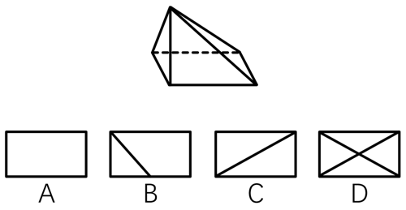
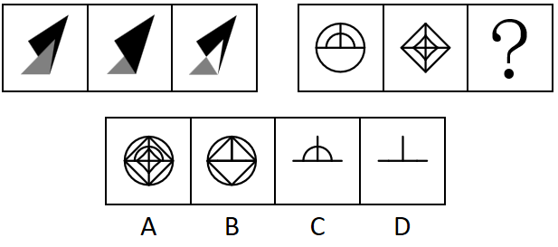
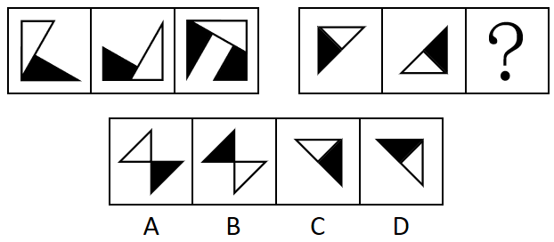
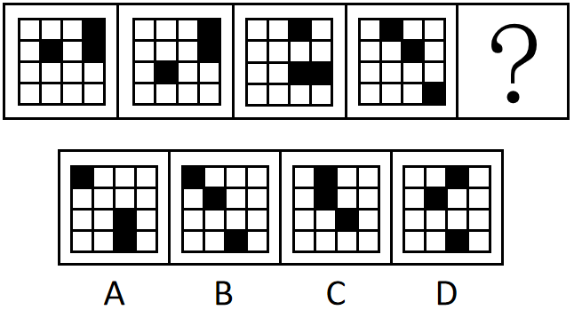
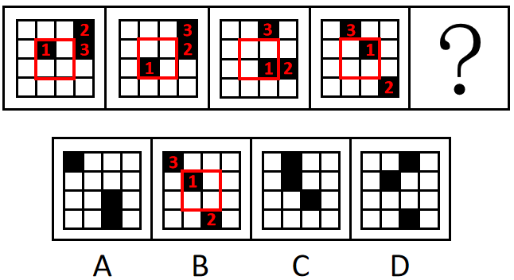
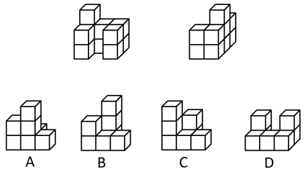
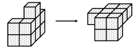
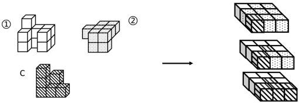

# 2025年广东省公务员录用考试《行测》题（网友回忆版）

> 判断推理 · 20 题 · 广东 2025

## 第 1 题　qid 12881941 · 类比推理

如图所示，四棱锥的底面为矩形，其中一条棱垂直于底面，那么该四棱锥的俯视图最有可能是（    ）。

- **A**. A
- **B**. B
- **C**. C　✅
- **D**. D

**答案**：C

**官方解析**

本题考查三视图中的俯视图，即从四棱锥的正上方向下观察得到的视图。已知四棱锥中有一条棱垂直于底面，其余三条棱与这条棱相交，因此从俯视角度观察，其余三条棱中应有两条棱与底面矩形边重合，另外一条棱为底面矩形的斜对角线，只有C项符合。
故正确答案为C。

---

## 第 2 题　qid 12881946 · 图形推理

下列选项中最符合所给图形规律的是（    ）。

- **A**. A
- **B**. B
- **C**. C
- **D**. D　✅

**答案**：D

**官方解析**

元素组成相似，优先考虑样式规律。观察第一组图形发现，图1与图2叠加后保留相同部分得到图3，第二组图形应用此规律，故？处图形应为图1与图2叠加后保留相同部分得到的图形，只有D项符合。
故正确答案为D。

---

## 第 3 题　qid 12881945 · 图形推理

下列选项中最符合所给图形规律的是（    ）。

- **A**. A
- **B**. B
- **C**. C
- **D**. D　✅

**答案**：D

**官方解析**

元素组成相似，且相同部分重复出现，优先考虑样式规律中的加减同异。第一组图中，图1顺时针旋转与图2逆时针旋转相加得到图3；第二组图也应满足此规律，图1顺时针旋转与图2逆时针旋转相加得到图3，只有D项符合。

故正确答案为D。

---

## 第 4 题　qid 12881947 · 图形推理

从所给的四个选项中，选择最合适的一个填在问号处，使之呈现一定的规律性（    ）。

- **A**. A
- **B**. B　✅
- **C**. C
- **D**. D

**答案**：B

**官方解析**

元素组成相同，优先考虑位置规律。题干图形均出现了十六宫格，考虑内外分开看。如下图所示，内圈的黑块1每次逆时针平移1格，外圈的黑块2每次顺时针平移1格，外圈的黑块3每次逆时针平移1格，只有B项符合。

故正确答案为B。

---

## 第 5 题　qid 12881949 · 图形推理

下列选项中，最有可能与所给的两个不规则立体图形形成正方体的是（    ）。

- **A**. A
- **B**. B
- **C**. C　✅
- **D**. D

**答案**：C

**官方解析**

本题考查立体拼合。先将图2进行旋转，如下图所示：

再和图1以及C项可以拼合形成正方体，如下图所示：

故正确答案为C。

---

## 第 6 题　qid 12881953 · 逻辑判断

具身智能是能感知决策并与物理世界互动的人工智能系统，目前具身智能机器人强调“大脑”和“小脑”的协同工作，它能精准的完成细节操作，且能合理规划任务。因此，外科手术机器人“达芬奇”，虽具备精密操作能力，但仍不能算是具身智能机器人。
要使上述结论成立，需要补充的前提是（    ）。

- **A**. 只有具备规划任务能力的机器人才是具身智能机器人
- **B**. 外科手术机器人“达芬奇”不能做到合理规划任务　✅
- **C**. 具身智能机器人的核心特征体现在能够感知并作出决策
- **D**. 具身智能赋予传统机器人“大脑”和“小脑”协同工作的能力

**答案**：B

**官方解析**

第一步：找出论点和论据。
论点：外科手术机器人“达芬奇”，虽具备精密操作能力，但仍不能算是具身智能机器人。
论据：目前具身智能机器人强调“大脑”和“小脑”的协同工作，它能精准的完成细节操作，且能合理规划任务。
论点说的是“外科手术机器人‘达芬奇’具备精密操作能力，但不是具身智能机器人”，论据说的是“具身智能机器人能精准的完成细节操作，且能合理规划任务”，二者话题不一致，且提问方式为“前提”，加强优先考虑搭桥，即在“合理规划任务”和“外科手术机器人‘达芬奇’”之间建立联系。
第二步：逐一分析选项。
A项：选项说的是只有具备规划任务能力的机器人才是具身智能机器人，说明具身智能机器人能规划任务，补充论据，可以加强，但不是论证成立的前提，排除；
B项：选项说的是外科手术机器人“达芬奇”不能做到合理规划任务，在“合理规划任务”和“外科手术机器人‘达芬奇’”之间建立联系，搭桥项，可以加强，当选；
C项：选项说的是具身智能机器人能够感知和作出决策，并未提及外科手术机器人，话题不一致，无法加强，排除；
D项：选项说的是具身智能赋予传统机器人“大脑”和“小脑”协同工作的能力，补充论据，可以加强，但不是论证成立的前提，排除。
故正确答案为B。

---

## 第 7 题　qid 12881956 · 逻辑判断

某地共享单车采用阶段收费模式，第一小时收费1.5元，其后每半小时收费1元。最近，共享单车运营商调整了收费标准，第一小时收费不变，其后每半小时收费2元，涨幅高达100%，但当地共享单车月均使用人次并未因价格调整而减少。
对上述现象，以下解释最为合理的是（    ）。

- **A**. 与多次换乘公交相比，使用共享单车的花费更低
- **B**. 随着生活水平的提高，人们的消费意愿逐步增强
- **C**. 单次使用共享单车时长超过一小时的当地市民微乎其微　✅
- **D**. 当地仅有一家共享单车运营商，市场缺乏竞争

**答案**：C

**官方解析**

第一步：找出题干矛盾。
某地共享单车一小时后的收费大幅上涨，但共享单车月均使用人次并未减少。
第二步：逐一分析选项。
A项：选项指出与多次换乘公交相比，使用共享单车的花费更低，但有可能还有其他比共享单车更便宜的交通工具，不能解释为什么共享单车收费大幅上涨后，月均使用人次并未减少，不能解释题干矛盾，排除；
B项：选项指出随着生活水平的提高，人们的消费意愿逐步增强，但不明确人们能否接受共享单车收费大幅上涨，不能解释为什么共享单车收费大幅上涨后，月均使用人次并未减少，不能解释题干矛盾，排除；
C项：选项指出单次使用共享单车时长超过一小时的当地市民微乎其微，说明共享单车一小时后的收费大幅上涨并不会对使用者产生影响，可以解释为什么共享单车一小时后的收费大幅上涨，但月均使用人次并未减少，能解释题干矛盾，当选；
D项：选项指出当地仅有一家共享单车运营商，市场缺乏竞争，但除了共享单车外，人们还可以选择其他交通工具，不能解释为什么共享单车收费大幅上涨后，月均使用人次并未减少，不能解释题干矛盾，排除。
故正确答案为C。

---

## 第 8 题　qid 12881962 · 类比推理

研究所计划从7名在读研究生中，推选2名男生、2名女生到企业实习。已知：（1）赵、钱、孙是男生；（2）李、刘、王、吴是女生；（3）如果推选刘、吴其中一人，那么孙也会被推选。
根据上述陈述，可以得知（    ）。

- **A**. 赵、李中至少有1人被推选
- **B**. 孙、王中至少有1人被推选　✅
- **C**. 钱、王中至少有1人被推选
- **D**. 孙、刘中至少有1人被推选

**答案**：B

**官方解析**

第一步：分析题干条件。

（1）赵、钱、孙是男生；

（2）李、刘、王、吴是女生；

（3）刘 或 吴孙；

（4）从7名在读研究生中，推选2名男生、2名女生到企业实习。

第二步：根据题干条件进行推理。

本题没有确定信息，可根据条件（3）进行假设。

情况一：推选刘或吴，结合条件（3）可得推选孙；

情况二：不推选刘也不推选吴，结合条件（2）（4）可得一定推选李和王。

综上，只有B项说法正确。

故正确答案为B。

---

## 第 9 题　qid 12881961 · 逻辑判断

某种贫血症属于遗传性疾病，患者的血红蛋白分子结构异常，从而影响红细胞正常功能。目前，科学家已能够利用基因组编辑技术，治疗因基因突变导致的遗传性疾病。因此，这种贫血症患者有望通过基因组编辑技术被治愈。
要使上述结论成立，需要补充的前提是（    ）。

- **A**. 血红蛋白分子结构异常是这种贫血症的主要表现
- **B**. 这种贫血症是一种由基因突变导致的遗传性疾病　✅
- **C**. 这种贫血症患者的红细胞可由直系亲属的代替
- **D**. 血红蛋白基因是导致这种贫血症的相关基因

**答案**：B

**官方解析**

第一步：找出论点和论据。
论点：这种贫血症患者有望通过基因组编辑技术被治愈。
论据：科学家已能够利用基因组编辑技术，治疗因基因突变导致的遗传性疾病。
本题论点讨论的是利用“基因组编辑技术”治疗“这种贫血症”，论据讨论的是利用“基因组编辑技术”治疗“因基因突变导致的遗传性疾病”，话题不一致，加强优先考虑搭桥，即在“这种贫血症”和“因基因突变导致的遗传性疾病”之间建立联系。
第二步：逐一分析选项。
A项：指出这种贫血症的主要表现，但论点讨论的是“这种贫血症患者有望通过基因组编辑技术被治愈”，话题不一致，不能加强，排除；
B项：指出这种贫血症是一种由基因突变导致的遗传性疾病，即在“这种贫血症”和“因基因突变导致的遗传性疾病”之间建立联系，为搭桥项，可以加强，当选；
C项：指出这种贫血症患者的红细胞可由直系亲属的代替，但论点讨论的是“这种贫血症患者有望通过基因组编辑技术被治愈”，话题不一致，不能加强，排除；
D项：指出血红蛋白基因是导致这种贫血症的相关基因，但并未提及“血红蛋白基因”是否受到基因突变的影响，也未提及“血红蛋白基因”能否被“基因组编辑技术”治愈，为不明确项，不能加强，排除。
故正确答案为B。

---

## 第 10 题　qid 12881960 · 逻辑判断

如果没有强健的体魄，就不会有好的学习状态，如果学习状态不好，学习成绩就不可能提升。因此，学校要提升学生的学习成绩，就必须开设体育课。
要使上述结论成立，必需补充的前提是（    ）。

- **A**. 体育课是增强学生体魄的必要途径　✅
- **B**. 所有学生都能通过体育课强健体魄
- **C**. 没有学生不希望提升自己的成绩
- **D**. 学生在课余时间也会进行体育锻炼

**答案**：A

**官方解析**

第一步：找出论点和论据。

论点：学校要提升学生的学习成绩，就必须开设体育课。翻译为：提升学习成绩开设体育课。

论据：如果没有强健的体魄，就不会有好的学习状态，如果学习状态不好，学习成绩就不可能提升。翻译为：①好的学习状态强健的体魄，②提升学习成绩好的学习状态，串联为：提升学习成绩好的学习状态强健的体魄。

本题需要找出论点成立的前提，优先考虑搭桥，即在“强健的体魄”与“开设体育课”之间建立联系。

第二步：逐一分析选项。

A项：该项翻译为：增强体魄开设体育课，论据已经推出“提升学习成绩强健的体魄”，根据该项可以推出“提升学习成绩开设体育课”，为搭桥项，是论点成立的前提，当选；

B项：该项翻译为：学生通过体育课增强体魄，论据已经推出“提升学习成绩强健的体魄”，此时无法根据该项得出“提升学习成绩开设体育课”，不是论点成立的前提，排除；

C项：该项讨论的是学生是否希望提升自己的成绩，而论点讨论的是学习成绩是否与开设体育课有关，话题不一致，不能加强，排除；

D项：该项说的是学生在课余时间会进行体育锻炼，讨论的是进行体育锻炼的时间，而论点讨论的是学习成绩是否与开设体育课有关，话题不一致，不能加强，排除。

故正确答案为A。

---

## 第 11 题　qid 12881958 · 类比推理

庑殿顶是中国古代建筑的一种屋顶形式，由一条正脊和四条垂脊组成，而中国古代许多皇宫大殿有庑殿顶，因此许多皇宫大殿的屋顶只有一条正脊。
以下选项的推理逻辑与题干最相似的是（    ）。

- **A**. 现代主义建筑通常没有复杂的装饰，追求功能属性与简约美，而西班牙的许多建筑造型奇特，装饰繁复，因此这些建筑不属于现代主义建筑
- **B**. 哥特式建筑都有尖形拱门，而欧洲中世纪的建筑多数属于哥特式建筑，因此部分欧洲中世纪的建筑有尖形拱门　✅
- **C**. 古罗马时期的建筑多数都有穹顶，而同一时期的建筑多为砖石结构，因此有的砖石结构建筑有穹顶
- **D**. 客家围屋都设有用于防御土匪侵扰的炮楼，因此有客家围屋的地区，都需要防御土匪侵扰

**答案**：B

**官方解析**

第一步：分析题干推理形式。

题干翻译为：庑殿顶一条正脊和四条垂脊，许多皇宫大殿庑殿顶，因此，许多皇宫大殿一条正脊，即12，31，因此32。

第二步：逐一分析选项。

A项：翻译为：现代主义建筑没有复杂的装饰，西班牙许多建筑装饰繁复，因此，西班牙许多建筑现代主义建筑，即12，32，因此31，与题干推理形式不一致，排除；

B项：翻译为：哥特式建筑尖形拱门，多数欧洲中世纪建筑哥特式建筑，因此，多数欧洲中世纪建筑尖形拱门，即12，31，因此32，与题干推理形式一致，当选；

C项：翻译为：多数古罗马时期的建筑有穹顶，多数古罗马时期的建筑砖石结构，因此，有的砖石结构有穹顶，即12，13，因此有的32，与题干推理形式不一致，排除；

D项：翻译为：客家围屋防御土匪侵扰的炮楼，因此，有客家围屋的地区防御土匪侵扰，即12，因此34，与题干推理形式不一致，排除。

故正确答案为B。

---

## 第 12 题　qid 12881959 · 逻辑判断

网络购物平台的数据分析显示，网店为商品提供免费的运费险能够增加销量，但其商品退费率远高于不提供这项服务的网店，从而增加了运营成本。但提供免费运费险的很多网店仍未关闭这一服务。
如果以下选项为真，最有可能解释这一现象的是（    ）。

- **A**. 提供这一服务的网店比其他网店获得了更高的净利润　✅
- **B**. 商品销量和运费成本是衡量网店经营状况的两项关键指标
- **C**. 人工、场地等成本不受退货率影响，且占运营成本的比重不低
- **D**. 提供免费的运费险能够显著提升消费者的信任度

**答案**：A

**官方解析**

第一步：找出题干矛盾。
网店为商品提供免费的运费险能够增加销量，但其商品退费率远高于不提供这项服务的网店，从而增加了运营成本。但提供免费运费险的很多网店仍未关闭这一服务。
第二步：逐一分析选项。
A项：该项指出提供这一服务的网店比其他网店获得了更高的净利润，所以即使成本增加，但整体上该服务带来的收益大于成本，很多网店也不会关闭这一服务，可以解释题干矛盾，当选；
B项：商品销量和运费成本是衡量网店经营状况的重要指标，但并未说明这两项指标与网店不关闭免费运费险服务之间的联系，不能解释为什么即使增加运营成本，很多网店仍未关闭这一服务，不能解释题干矛盾，排除；
C项：人工、场地等成本不受退货率影响，且占运营成本的比重不低，说明这些成本与免费运费险导致的退费率增加没有直接关系，不能解释为什么即使增加运营成本，很多网店仍未关闭这一服务，不能解释题干矛盾，排除；
D项：该项指出提供免费的运费险能够显著提升消费者的信任度，但是消费者的信任度提升未必可以转化成实际的利润，不能解释为什么即使增加运营成本，很多网店仍未关闭这一服务，不能解释题干矛盾，排除。
故正确答案为A。

---

## 第 13 题　qid 12881964 · 类比推理

古丝绸之路之所以举世闻名，靠的不仅是经济互利，更是丰富物产和多元文化交流，所以，只有经济互利，不可能重现古丝绸之路的辉煌。
以下选项推理逻辑与题干最相似的是（    ）。

- **A**. 我国要实现高水平科技自立自强，归根结底是要靠高水平创新人才，所以，创新能力培养应该成为人才培养的核心
- **B**. 粮食丰收，及时收割和晒干入库都是关键环节，所以，天气连续晴好有助于实现粮食丰收
- **C**. 高水平大学不仅要有完整的设施设备，更要有高水平的教师队伍，因此，仅靠完善设施设备并不能成为高水平大学　✅
- **D**. 体育活动需要合适的运动场所，因此，如果城市缺少合适的运动场所，居民就难以积极参加体育活动

**答案**：C

**官方解析**

第一步：分析题干的推理结构。
古丝绸之路之所以举世闻名（c），靠的不仅是经济互利（a），更是丰富物产和多元文化交流（b），所以，只有经济互利（a），不可能重现古丝绸之路的辉煌（c）。
题干论证结构为：经济互利（a）和物产、文化交流（b）两个原因共同影响了古丝绸之路举世闻名（c）这一个结果，所以，只有经济互利（a），没有物产、文化交流（b）无法重现古丝绸之路的辉煌（c）。
第二步：逐一分析选项。
A项：创新能力（a）能够影响高水平科技自立自强的实现（b），所以，创新能力（a）成为人才培养（c）的核心，与题干推理逻辑不同，排除；
B项：及时收割（a）和晒干入库（b）都能影响粮食丰收（c），所以，天气连续晴好（d）有助于实现粮食丰收（c），与题干推理逻辑不同，排除；
C项：完整的设施设备（a）和高水平的教师队伍（b）都能影响高水平大学的建设（c），因此，仅靠完善设施设备（a），没有高水平的教师队伍（b）并不能成为高水平大学（c），与题干推理逻辑最为相似，当选；
D项：合适的运动场所（a）能够影响体育活动的开展（b），因此，如果城市缺少合适的运动场所（a），居民就难以积极参加体育活动（b），与题干推理逻辑不同，排除。
故正确答案为C。

---

## 第 14 题　qid 12881963 · 类比推理

在一次技能竞赛中，甲、乙、丙、丁4人排名前四且无人并列，已知甲和第三名是好友且名次比该好友高；丁和甲不是好友但和第一名是好友；乙的名次比丙高。
根据上述信息，以下判断错误的是（    ）。

- **A**. 丙的名次不高于第三名
- **B**. 甲的名次一定高于丙
- **C**. 乙和丁是好友
- **D**. 乙不可能是第一名　✅

**答案**：D

**官方解析**

第一步：分析题干条件。
（1）甲和第三名是好友且名次比该好友高；
（2）丁和甲不是好友但和第一名是好友；
（3）乙的名次比丙高。
第二步：根据题干条件进行推理。
题干条件（1）和（2）均提到“甲”，可优先从“甲”入手进行推理。
由条件（1）可知，甲要么是第一名要么是第二名，结合条件（2）可知，甲不是第一名、丁不是第一名也不是第三名，则甲是第二名，丁是第四名，因此乙和丙只能是第一名和第三名，再结合条件（3）可知乙是第一名，丙是第三名。
综上所述，乙是第一名，甲是第二名，丙是第三名，丁是第四名，A、B、C三项判断正确，D项判断错误。
本题为选非题，故正确答案为D。

---

## 第 15 题　qid 12881965 · 逻辑判断

某研究者选取同一年级的两个班级进行教学实验，第一个班级的学生在听课过程中被鼓励随时提问，而第二个班级的学生没有受到同样的鼓励，结果显示，第一个班级学生的课堂专注度明显高于第二个班级。研究者据此建议在教学过程中学生应随时提问，以提升知识掌握效果。
如果以下选项为真，最能支持研究者建议的是（    ）。

- **A**. 学生在课堂上随时主动提问能活跃课堂气氛
- **B**. 课堂专注度是影响知识掌握效果的重要因素　✅
- **C**. 这两个班级的学生在实验前的学习成绩相当
- **D**. 随时提问能帮助学生增强自我认同感和自信

**答案**：B

**官方解析**

第一步：找出论点和论据。
论点：在教学过程中学生应随时提问，以提升知识掌握效果。
论据：第一个班级学生的课堂专注度明显高于第二个班级。
论据讨论的是 “随时提问的班级课堂专注度更高”，论点说的是“随时提问能提升知识掌握效果”，论点论据话题不一致，优先考虑搭桥，即建立“课堂专注度”和“知识掌握效果”的联系。
第二步：逐一分析选项。
A项：该项指出随时提问能活跃课堂气氛，而论点讨论的是知识掌握效果，话题不一致，无法加强，排除；
B项：该项指出课堂专注度是影响知识掌握效果的重要因素，建立了“课堂专注度”和“知识掌握效果”的联系，为搭桥项，可以加强，当选；
C项：该项指出两个班级实验前学习成绩相当，但论据讨论的是课堂专注度，话题不一致，无法加强，排除； 
D项：该项指出随时提问能增强自我认同感和自信，但自我认同感与知识掌握效果的关系不清楚，无法加强，排除。
故正确答案为B。

---

## 第 16 题　qid 12881966 · 逻辑判断

作为高端羽毛球的必备原料，羽毛切片是鸭鹅养殖的副产品，其供应量上要取决于养殖规模，如果养殖规模有所下降，羽毛切片价格将会一路走高，进而导致高端羽毛球生产成本高企、厂家将因此被迫提高出厂价格，所以，如果近期鸭鹅养殖规模保持平稳，则高端羽毛球的出厂价格将不会明显上涨。
上述论证的主要逻辑错误在于（    ）。

- **A**. 忽视了其他因素对高端羽毛球出厂价格的影响　✅
- **B**. 忽视了影响鸭鹅养殖规模的其他因素
- **C**. 默认了高端羽毛球生产所需的羽毛切片没有替代品
- **D**. 默认了鸭鹅养殖规模严重影响高端羽毛球的生产

**答案**：A

**官方解析**

第一步：找出论点和论据。
论点：如果近期鸭鹅养殖规模保持平稳，则高端羽毛球的出厂价格将不会明显上涨。
论据：作为高端羽毛球的必备原料，羽毛切片是鸭鹅养殖的副产品，其供应量上要取决于养殖规模，如果养殖规模有所下降，羽毛切片价格将会一路走高，进而导致高端羽毛球生产成本高企、厂家将因此被迫提高出厂价格。
本题论点和论据都说的是鸭鹅养殖规模会影响高端羽毛球的出厂价格，二者话题一致，要指出论证缺陷只要指出仅通过鸭鹅养殖规模无法决定高端羽毛球的出厂价格即可。
第二步：逐一分析选项。
A项：该项指出忽视了其他因素对高端羽毛球出厂价格的影响，提出会影响高端羽毛球出厂价格的其他因素，说明仅通过鸭鹅养殖规模无法决定高端羽毛球的出厂价格，可以指出论证缺陷，当选；
B项：该项指出忽视了影响鸭鹅养殖规模的其他因素，而题干论点讨论的是高端羽毛球出厂价格的影响因素，话题不一致，无法指出论证缺陷，排除；
C项：该项指出默认了高端羽毛球生产所需的羽毛切片没有替代品，是对题干第一句话的重复，无法指出论证缺陷，排除；
D项：该项指出默认了鸭鹅养殖规模严重影响高端羽毛球的生产，而题干论点讨论的是高端羽毛球的出厂价格，话题不一致，无法指出论证缺陷，排除。
故正确答案为A。

---

## 第 17 题　qid 12881967 · 类比推理

根据法律，公共场所禁止吸烟，因此，如果有人在某个区域吸烟却不违法，说明该区域不属于公共场所。
以下选项的推理逻辑与题干最相似的是（    ）。

- **A**. 长时间室内活动是近视的主要原因，因此近视的人都缺乏户外运动
- **B**. 优秀的工匠在学徒时期就追求精益求精，如果某学徒自我要求不高，那他就无法成为优秀的工匠　✅
- **C**. 超过9层的楼房都会配建电梯，因此，如果某住宅楼低于9层，那么住户只能走楼梯
- **D**. 织物表面的纳米涂层可以阻止液体渗入，因此，某种面料防水，说明它有纳米涂层

**答案**：B

**官方解析**

第一步：分析题干推理形式。

题干理解为：公共场所都满足吸烟违法，翻译为：公共场所吸烟违法，因此，吸烟违法公共场所，逻辑结构为“否后推否前”。

第二步：逐一分析选项。

A项：选项中未体现逻辑关联词，主要原因为因果关联词，不能翻译，若理解为：长时间室内活动都会导致近视，翻译为：长时间室内活动近视，因此，近视长时间室内活动，逻辑结构为“肯后推肯前”，与题干推理形式不一致，排除；

B项：选项理解为：在学徒时期追求精益求精才能成为优秀的工匠，翻译为：优秀的工匠学徒时期追求精益求精，因此，学徒时期追求精益求精优秀的工匠，逻辑结构为“否后推否前”，与题干推理形式一致，当选；

C项：选项翻译为：超过9层的楼房配建电梯，因此，超过9层的楼房配建电梯，逻辑结构为“否前推否后”，与题干推理形式不一致，排除；

D项：选项翻译为：有纳米涂层阻止液体渗入，因此，阻止液体渗入有纳米涂层，逻辑结构为“肯后推肯前”，与题干推理形式不一致，排除。

故正确答案为B。

---

## 第 18 题　qid 12881969 · 逻辑判断

某厂家用“除菌去残留，效果看得见”这一广告语，宣传其生产的果蔬清洗机，并展示该产品与其他果蔬清洗机清洗同一种水果的视频，视频显示，该清洗机清洗产生的泡沫最多。该厂家宣称泡沫是被清洗机清洗出来的有害残留，故其产品除菌去残留效果更好。
如果下列选项为真，最能反驳上述推论的是（    ）。

- **A**. 用果蔬清洗机清洗食材，不管清洗多少遍，都会出现泡沫
- **B**. 市面上绝大部分果蔬的农药残留均未超标，有害物质极少
- **C**. 用普通烹饪方式加工肉类食材，或多或少也会产生泡沫
- **D**. 专业化学检测是检验果蔬除菌去残留效果的唯一有效手段　✅

**答案**：D

**官方解析**

第一步：找出论点和论据。
论点：其产品（某厂家生产的果蔬清洗机）除菌去残留效果更好。
论据：某厂家用“除菌去残留，效果看得见”这一广告语，宣传其生产的果蔬清洗机，并展示该产品与其他果蔬清洗机清洗同一种水果的视频，视频显示，该清洗机清洗产生的泡沫最多，该厂家宣称泡沫是被清洗机清洗出来的有害残留。
本题论据讨论的是该厂家的果蔬清洗机产生的泡沫最多，而泡沫是清洗出的有害残留，论点说的是该产品除菌去残留效果更好，二者话题一致，削弱优先考虑削弱论点。
第二步：逐一分析选项。
A项：该项指出用果蔬清洗机清洗食材，不管清洗多少遍，都会出现泡沫，说明泡沫不一定能反映食材的有害残留情况，可以削弱，保留；
B项：该项指出市面上绝大部分果蔬的农药残留均未超标，有害物质极少，而论点说的是因为泡沫是清洗出的有害残留，所以该产品除菌去残留效果更好，话题不一致，无法削弱，排除；
C项：该项指出用普通烹饪方式加工肉类食材，也会有泡沫，而论点说的是因为泡沫是清洗出的有害残留，所以该产品除菌去残留效果更好，话题不一致，无法削弱，排除；
D项：该项指出专业化学检测是检验除菌去残留效果的唯一有效手段，说明清洗时有泡沫不能证明产品的除菌去残留效果更好，可以削弱，保留。
比较A、D两项，D项中有“唯一有效手段”，表述更绝对更明确，削弱力度更强。
故正确答案为D。

---

## 第 19 题　qid 12881968 · 逻辑判断

小陈计划假期前往某市旅游，他的设想如下：
①欢乐世界，动物园至少会去一个；
②艺术中心，欢乐世界和人民公园至少会去一个；
③动物园，人民公园和博物馆至少会去两个；
④如果去动物园，则不去艺术中心。
根据上述设想，可以得出小陈（    ）。

- **A**. 一定会去博物馆
- **B**. 动物园，艺术中心至少会去一个
- **C**. 人民公园，欢乐世界至少会去一个　✅
- **D**. 至少会去3个景点

**答案**：C

**官方解析**

第一步：分析题干条件。

①欢乐世界或动物园至少会去一个；

②艺术中心，欢乐世界和人民公园至少会去一个；

③动物园，人民公园和博物馆至少会去两个；

④去动物园不去艺术中心。

第二步：根据题干条件进行推理。

题干没有确定信息，且涉及多种情况，故考虑假设法。

题干中动物园出现次数最多，优先考虑假设去不去动物园。

关于是否去动物园有两种情况：

第一种情况：假设去动物园，根据条件④可知，不去艺术中心，再根据条件②可知，欢乐世界和人民公园至少会去一个，再根据条件③可知，人民公园和博物馆中至少去一个，此时不确定欢乐世界是否去；

第二种情况：假设不去动物园，根据条件①可知，一定去欢乐世界，再根据条件③可知，人民公园和博物馆都要去，此时不确定艺术中心是否去。

综合上述两种情况，可以推出人民公园和欢乐世界至少会去一个成立，对应C项。

故正确答案为C。

---

## 第 20 题　qid 12881971 · 逻辑判断

鉴于漂流项目偶尔会出现游客落水伤亡的情况，某旅游景区为每一位参加漂流项目的游客购买了意外保险，并要求游客必须穿上景区配备的救生衣，有游客对此提出疑问，既然景区已经购买了意外保险，游客出现意外伤亡由保险公司赔付，那么游客为寻求刺激的漂流体验，可以选择不穿救生衣。
如果以下选项为真，最能反驳这一质疑的是（    ）。

- **A**. 如果未穿救生衣的游客出现意外伤亡，保险公司将不予赔付　✅
- **B**. 该景区为参加蹦极、过山车等项目的游客也购买了意外保险
- **C**. 该景区在免费为游客提供了救生衣的同时，还配备了救生员
- **D**. 保障游客的人身安全是景区经营方的基本职责之一

**答案**：A

**官方解析**

第一步：找出论点和论据。
论点：游客为寻求刺激的漂流体验，可以选择不穿救生衣。
论据：景区已经购买了意外保险，游客出现意外伤亡由保险公司赔付。
本题论点说的是游客为寻求刺激的漂流体验，可以选择不穿救生衣，论据说的是景区已经购买了意外保险，游客出现意外伤亡由保险公司赔付，论点论据话题不一致，削弱优先考虑拆桥。
第二步：逐一分析选项。
A项：选项说的是如果未穿救生衣的游客出现意外伤亡，保险公司将不予赔付，说明虽然景区已经购买了意外保险，但漂流时必须穿救生衣，拆断了论据和论点间的联系，拆桥项，可以削弱，当选；
B项：选项说的是该景区为参加蹦极、过山车等项目的游客也购买了意外保险，但论点讨论的是漂流时是否穿救生衣，话题不一致，无法削弱，排除；
C项：选项说的是该景区在免费为游客提供了救生衣的同时，还配备了救生员，那漂流时是否还需要穿救生衣不明确，无法削弱，排除；
D项：选项说的是保障游客的人身安全是景区经营方的基本职责之一，但游客为寻求刺激的漂流体验是否还需要穿救生衣不明确，无法削弱，排除。
故正确答案为A。

---
