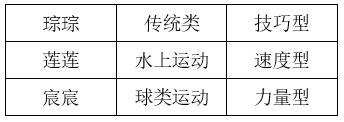
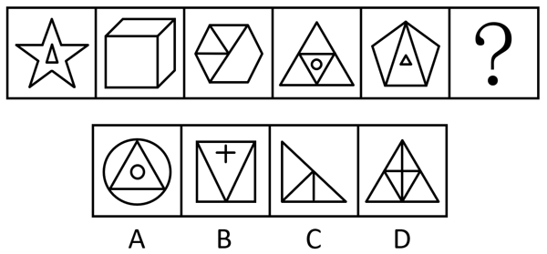
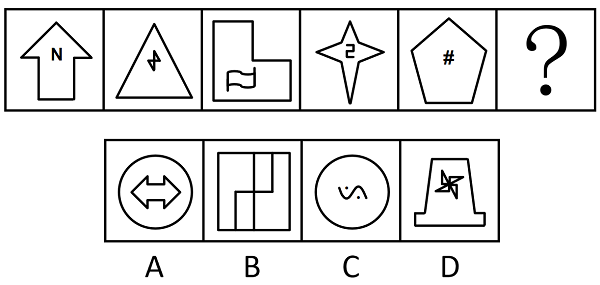
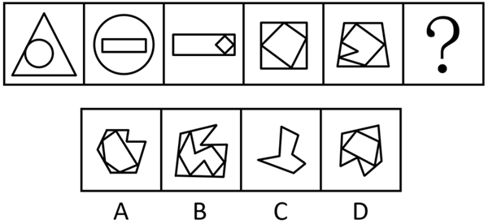
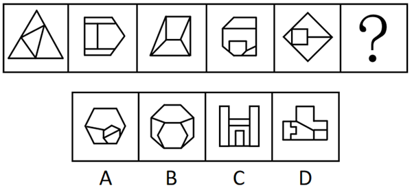
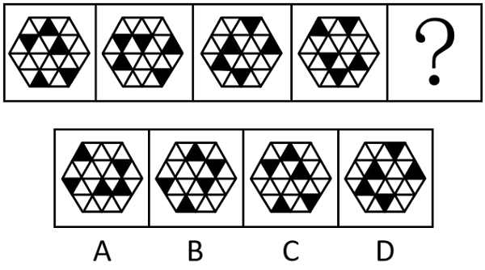
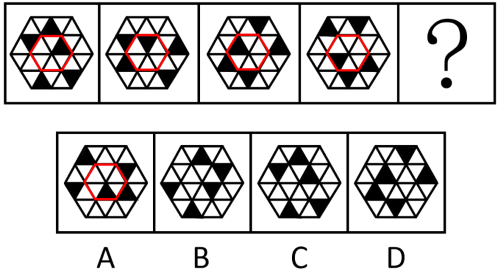

# 2025年江苏名校优生选调素质测试（网友回忆版）

> 判断推理 · 20 题 · 选调 2025

## 第 1 题　qid 19591547 · 类比推理

某学校开设甲、乙、丙、丁、戊、己、庚七门课程，需在三个学期内完成教学安排，且满足以下条件：
（1）庚在第一学期上；
（2）丁所在的学期有三门课程；
（3）丙之前的学期共开设了两门课程；
（4）戊学完之后的学期还有两门课程未学；
（5）每个学期至少开设一门课程，且同一门课程不能跨学期学习。
根据上述条件，下列说法一定正确的是：

- **A**. 第一学期开设的课程包括甲和庚
- **B**. 第二学期开设的课程包括丙、戊、丁　✅
- **C**. 庚和丁在第一学期共同开设
- **D**. 第三学期开设三门课程

**答案**：B

**官方解析**

第一步：分析题干条件。
（1）庚在第一学期上；
（2）丁所在的学期有三门课程；
（3）丙之前的学期共开设了两门课程；
（4）戊学完之后的学期还有两门课程未学；
（5）每个学期至少开设一门课程，且同一门课程不能跨学期学习。
第二步：根据题干条件进行推理。
根据条件（3）（5）可知，丙只能在第二学期或第三学期开设，分情况进行假设。
若丙在第二学期开设，则第一学期有两门课程；若丙在第三学期开设，则第一、二学期共开设了两门课程，说明第三学期有五门课程，与条件（2）矛盾，因此丙只能在第二学期开设，且第一学期有两门课程。
根据条件（4）（5）可知，戊只能在第一学期或第二学期开设，分情况进行假设。
若戊在第二学期开设，则第三学期有两门课程；若戊在第一学期开设，则第二、三学期共开设了两门课程，说明第一学期有五门课程，与条件（2）矛盾，因此戊只能在第二学期开设，且第三学期有两门课程。
综上，可以推出第一、三学期均有两门课程，第二学期有三门课程；结合条件（1）可知，庚在第一学期开设；再结合条件（2）可知，丙、丁、戊均在第二学期开设，B项当选。
故正确答案为B。

---

## 第 2 题　qid 19591550 · 逻辑判断

在市场上，存在一些增高药商品进行着看似反智的宣传，声称使用该药物后身高可以长高7cm，甚至连60岁的老人使用也能轻松长高。尽管这类广告内容明显缺乏科学依据且十分离谱，但仍有不少人愿意相信并购买。
对于商家推出这类反智宣传的增高药产品这一现象，以下哪种解释最为合理？

- **A**. 商家通过虚假宣传，常常借用一些看似科学的原理以及所谓专家的研究来证明产品效果，还会利用相关研究成果和专利证明等对产品进行包装，以此误导消费者
- **B**. 由于市场监督管理不够严格，未能对这类明显不合理的虚假宣传进行及时有效的监管和惩处，使得商家有机会进行此类反智宣传
- **C**. 部分群众的科学意识较为薄弱，缺乏对这类虚假宣传的辨别能力，容易轻信商家的夸大言辞，从而导致商家认为有市场可图
- **D**. 一些家长因过度担心孩子的身高问题而产生焦虑情绪，病急乱投医，在这种心理的驱使下，会轻易选择购买这类增高药产品，商家正是看中了这一消费心理，才敢于进行此类反智宣传　✅

**答案**：D

**官方解析**

第一步：找出题干矛盾。
根据问题可知，需要解释的现象是商家为什么推出这类反智宣传的增高药产品。
第二步：逐一分析选项。
A项：该项指出商家利用虚假宣传误导消费者，只能说明消费者可能会相信商家的宣传，但无法从商家的角度解释为什么会推出这类反智宣传的增高药产品，即没有指出是否有人会相信这类反智宣传进而购买该产品，无法解释题干矛盾，排除；
B项：该项指出市场监管不到位，导致商家有进行反智宣传的机会，但无法从商家的角度解释为什么会推出这类反智宣传的增高药产品，即没有指出是否有人会相信这类反智宣传进而购买该产品，无法解释题干矛盾，排除；
C项：该项指出群众科学意识较为薄弱，易相信商家的夸大言辞，只能说明有些群众可能会相信商家的宣传，但无法从商家的角度解释为什么会推出这类反智宣传的增高药产品，即没有指出是否有人会相信这类反智宣传进而购买该产品，无法解释题干矛盾，排除；
D项：该项指出一些家长因为焦虑情绪会轻易选择购买这类增高药产品，能够售卖出去获得利润是商家推出这类反智宣传的增高药产品的根本原因，可以解释题干矛盾，当选。
故正确答案为D。

---

## 第 3 题　qid 19591556 · 逻辑判断

研究发现，甲状腺激素水平的稳定与炎症的发生密切相关，当甲状腺激素分泌出现紊乱时，身体炎症风险显著增加。专家指出，保持适度早睡有助于维持甲状腺激素的正常稳定分泌，从而降低炎症发生几率。
以下哪项如果为真，最能支持专家的观点？

- **A**. 睡眠不足会促使促炎因子大量产生，是引发身体炎症的重要因素之一
- **B**. 早睡能够刺激甲状腺激素大量分泌
- **C**. 晚睡会干扰免疫系统正常运作
- **D**. 甲状腺激素水平与人体免疫能力存在关联　✅

**答案**：D

**官方解析**

第一步：找出论点和论据。
论点：保持适度早睡有助于维持甲状腺激素的正常稳定分泌，从而降低炎症发生几率。
论据：研究发现，甲状腺激素水平的稳定与炎症的发生密切相关，当甲状腺激素分泌出现紊乱时，身体炎症风险显著增加。
本题论据讨论的是甲状腺激素分泌紊乱会增加炎症风险，论点是基于此得出的“早睡”可以通过维持甲状腺激素的正常稳定分泌来降低炎症发生几率，可理解为话题一致，加强优先考虑补充论据。
第二步：逐一分析选项。
A项：该项指出“睡眠不足”是引发身体炎症的重要因素之一，但睡眠不足不等于没有早睡，也未提及“甲状腺分泌”，无法加强，排除；
B项：该项指出早睡能够刺激甲状腺激素“大量分泌”，但题干讨论的是甲状腺激素“正常稳定分泌”，“大量分泌”不代表“正常稳定分泌”，无法加强，排除；
C项：该项指出晚睡（不早睡）会干扰免疫系统正常运作，但没有提及免疫系统对甲状腺激素分泌是否存在影响，无法加强，排除；
D项：该项指出甲状腺激素水平与人体免疫能力“存在关联”，解释了如何通过甲状腺激素分泌来影响炎症发生的几率，支持了论点中“甲状腺”和“炎症”之间的关系，补充论据，当选。
故正确答案为D。
注：本题较为争议，C、D两项同时成立是对题目结论的最好支持，作为单选题，需要对二者进行比较，由于题干信息，尤其是论点中“甲状腺激素”是关键的因素，C项完全没有涉及，而D项涉及了，故粉笔更倾向于选择D项。

---

## 第 4 题　qid 19591553 · 逻辑判断

近年来，酸梅汤、菊花枸杞茶、陈皮山楂饮等兼具传统风味与养生功效的中药养生茶逐渐成为青年人日常饮品的热门选择。无论是办公室的工位上，还是休闲聚会的餐桌上，都能看到年轻人饮用中药养生茶的身影。这一原本被认为是中老年群体偏爱的饮品，却在青年群体中掀起了消费热潮。
以下哪项如果为真，最能解释上述现象?

- **A**. 中药文化历史悠久，其蕴含的养生理念在当代社会备受推崇
- **B**. 酸梅汤等饮品作为传统消暑饮料，长期以来深受大众喜爱
- **C**. 青年人在追求口感享受的同时，愈发重视健康养生，而中药养生茶恰好兼具好喝与养生双重属性　✅
- **D**. 现代茶饮市场竞争激烈，商家加大了对中药养生茶的宣传推广力度

**答案**：C

**官方解析**

第一步：找出题干矛盾。
中药养生茶原本被认为是中老年群体偏爱的饮品，却在青年群体中掀起了消费热潮。
第二步：逐一分析选项。
A项：该项指出中药养生理念在当代社会备受推崇，但未明确指出这一理念是否在青年群体中产生强烈影响，也没有提及中药养生茶的作用，不能解释题干矛盾，排除；
B项：选项指出酸梅汤等饮品长期深受大众喜爱，但没有提及青年群体对此类饮品的态度，不能解释题干矛盾，排除；
C项：该项指出青年人在追求口感享受的同时愈发重视健康养生，而中药养生茶恰好兼具双重属性，解释了为什么中药养生茶原本被认为是中老年群体偏爱的饮品，却在青年群体中掀起了消费热潮，可以解释题干矛盾，当选；
D项：该项指出商家加大了对中药养生茶的宣传推广力度，但宣传对象不明确，没有提及青年群体，不能解释题干矛盾，排除。
故正确答案为C。

---

## 第 5 题　qid 19591559 · 类比推理

在一次考试后，甲、乙、丙、丁四人讨论成绩高低。
甲说：“我的成绩比丁好。”
乙说：“我的成绩不如丙。”
丙说：“我的成绩比甲好。”
已知甲、乙、丙三人的陈述中，至少有两人说的是错误的。
那么，下列选项不可能成立的是：

- **A**. 丁>甲>丙>乙
- **B**. 甲>丙>乙>丁　✅
- **C**. 乙>甲>丙>丁
- **D**. 丁>乙>丙>甲

**答案**：B

**官方解析**

第一步：分析题干条件。
（1）甲说：甲&gt;丁；
（2）乙说：丙&gt;乙；
（3）丙说：丙&gt;甲；
（4）甲、乙、丙三人的陈述中，至少有两人说的是错误的。
第二步：根据题干条件进行推理。
提问方式为“不可能”，优先考虑代入法。
代入A项：条件（1）（3）错误，条件（2）正确，符合条件（4），该项可能成立，排除；
代入B项：条件（1）（2）正确，条件（3）错误，不符合条件（4），该项不可能成立，当选；
代入C项：条件（2）（3）错误，条件（1）正确，符合条件（4），该项可能成立，排除；
代入D项：条件（1）（2）错误，条件（3）正确，符合条件（4），该项可能成立，排除。
本题为选非题，故正确答案为B。

---

## 第 6 题　qid 19591560 · 类比推理

琮琮、莲莲、宸宸三人分别参与不同的运动项目，运动项目按照类型分为速度型、力量型、技巧型；运动项目按照类别分为传统类、水上运动、球类运动。已知以下条件：
（1）琮琮不搞球类运动；
（2）水上运动不是力量型；
（3）莲莲搞水上运动；
（4）琮琮是技巧型；
（5）宸宸搞球类运动。
请问莲莲对应的运动类型是：

- **A**. 速度型　✅
- **B**. 力量型
- **C**. 技巧型
- **D**. 球类运动

**答案**：A

**官方解析**

第一步：分析题干条件。

（1）琮琮：球类运动；

（2）水上运动：力量型；

（3）莲莲：水上运动；

（4）琮琮：技巧型；

（5）宸宸：球类运动；

（6）琮琮、莲莲、宸宸三人分别参与不同的运动项目。

第二步：根据题干条件进行推理。

根据条件（5）可知宸宸搞球类运动，可以推出莲莲不搞球类运动，排除D项；

根据条件（4）可知琮琮是技巧型，可以推出莲莲不是技巧型，排除C项；

根据条件（2）（3）可以推出莲莲不是力量型，排除B项。

综合上述推理，可以确定莲莲是速度型，对应A项。

故正确答案为A。

---

## 第 7 题　qid 19591561 · 逻辑判断

小朱计划冬季旅游，已知以下信息：
（1）小朱只有既去漠河又去长白山，才会去旅游，否则就不去旅游；
（2）只有与小贺一起，小朱才会去漠河或者北极村；
（3）小朱若与小贺一起旅游，就需要提前与小贺约好；
（4）小朱若提前和小贺约好，那么小贺冬天得有时间；
（5）小贺不能请假，即小贺没时间。
则以下哪项一定为真？

- **A**. 小朱去漠河
- **B**. 小朱去北极村
- **C**. 小朱不去旅游　✅
- **D**. 小朱去长白山

**答案**：C

**官方解析**

第一步：翻译题干。

（1）小朱去旅游小朱去漠河 且 小朱去长白山；

（2）小朱去漠河 或 小朱去北极村小朱与小贺一起旅游；

（3）小朱与小贺一起旅游小朱与小贺提前约好；

（4）小朱与小贺提前约好小贺冬天有时间；

（5）小贺没时间。

第二步：根据题干条件进行推理。

条件（5）小贺没时间是对条件（4）的否后，否后必否前，可以推出小朱没有与小贺提前约好；

小朱没有与小贺提前约好是对条件（3）的否后，否后必否前，可以推出小朱没有与小贺一起旅游；

小朱没有与小贺一起旅游是对条件（2）的否后，否后必否前，可以推出小朱不去漠河 且 小朱不去北极村；

否定且关系中的一项，即为对整体的否定，因此小朱不去漠河是对条件（1）的否后，否后必否前，可以推出小朱不去旅游，对应C项。

故正确答案为C。

---

## 第 8 题　qid 19591564 · 逻辑判断

近年来，城市早晚高峰交通拥堵问题日益严重，某专家指出快递运输车辆在早晚高峰时段频繁上路是造成拥堵的重要原因之一，因此提议利用高铁运输快递，认为这一举措能够有效提升地面通行效率。
以下哪项如果为真，最能削弱该专家的观点？

- **A**. 高铁运输快递前期建设成本高昂，需要投入大量资金
- **B**. 采用高铁运输快递后，大量快递分拣人员将面临岗位调整
- **C**. 用高铁运快递会增加地铁站内的人流量，导致乘客拥挤，存在安全隐患
- **D**. 目前快递运输车辆的运行时间已避开早晚高峰，主要在平峰时段进行配送　✅

**答案**：D

**官方解析**

第一步：找出论点和论据。
论点：利用高铁运输快递能够有效提升地面通行效率。
论据：快递运输车辆在早晚高峰时段频繁上路是造成拥堵的重要原因之一。
本题论点讨论的是“高铁运输快递”对“地面通行效率”的提升，论据讨论的是“快递运输车辆”在早晚高峰时段造成“地面道路拥堵”，二者话题一致，削弱优先考虑削弱论点，也可以考虑削弱论据。
第二步：逐一分析选项。
A项：该项指出高铁运输快递成本高，但未提及实施后对地面通行效率的影响，无法削弱，排除；
B项：该项指出高铁运输快递对快递分拣人员的影响，而论点说的是对地面通行效率的影响，话题不一致，无法削弱，排除；
C项：该项指出高铁运输对地铁站内通行的负面影响，而论点说的是对地面通行效率的影响，话题不一致，无法削弱，排除；
D项：该项指出快递运输车辆已经避开早晚高峰，不会在早晚高峰时段造成地面道路拥堵，削弱论据，当选。
故正确答案为D。

---

## 第 9 题　qid 19591563 · 逻辑判断

在某中学推行非文化课教师担任班主任的政策过程中，许多家长对此表示担忧，他们认为非文化课教师由于缺乏对高考核心科目的深入教学经验，难以有效指导学生备考，进而会影响孩子的高考成绩。
以下哪项如果为真，最能削弱家长的上述观点？

- **A**. 教育部明确下发文件，鼓励各地中小学积极探索非文化课教师担任班主任的管理模式
- **B**. 非文化课教师担任班主任后，原本兼任班主任的文化课教师将有更多时间投入学科教学　✅
- **C**. 近年来，教育愈发重视学生的综合素质，非文化课对学生综合能力的培养具有独特优势
- **D**. 部分学校的实践表明，由非文化课教师担任班主任的班级，学生高考平均分并未降低

**答案**：B

**官方解析**

第一步：找出论点和论据。
论点：非文化课教师担任班主任会影响孩子的高考成绩。
论据：非文化课教师由于缺乏对高考核心科目的深入教学经验，难以有效指导学生备考。
本题论据说的是非文化课教师缺乏高考核心科目教学经验，论点说的是非文化课教师担任班主任会影响高考成绩，由论据可以得到论点，二者话题一致，削弱优先考虑削弱论点。
第二步：逐一分析选项。
A项：该项说的是教育部鼓励非文化课教师担任班主任的管理模式，和论点中讨论的是否影响高考成绩无关，无关项，无法削弱，排除；
B项：该项说的是非文化课教师担任班主任后，文化课教师有更多时间投入教学，即文化课的质量非但没有受到影响，反而能够提升教学质量，进而保障甚至提高高考成绩，可以削弱，保留；
C项：该项说的是非文化课对学生综合素质的培养，和论点中讨论的是否影响高考成绩无关，无关项，无法削弱，排除；
D项：该项说的是部分学校的实践表明，非文化课教师担任班主任没有导致高考成绩下降，可以削弱，保留。
对比B、D两项，D项仅以“部分学校”的实践为例，样本代表性有限，为部分削弱，B项解释了成绩不受影响的原因，具有普遍适用性，削弱力度更强，B项当选。
故正确答案为B。

---

## 第 10 题　qid 19591573 · 逻辑判断

欧盟近年来积极推进绿色转型，于2019年正式提出并逐步实施CBAM（碳边境调节机制），又称“碳关税”政策。该机制要求对进口至欧盟的高碳排放商品（如钢铁、铝、水泥等）征收额外税费或实施碳排放配额限制，旨在通过市场手段迫使贸易伙伴减少温室气体排放，以契合欧盟“2050年碳中和”目标。针对这一政策，有专家指出，只有中国发展绿色经济，优化对外贸易结构，才能有效降低CBAM对中国的负面影响。
以下哪项如果为真，最能削弱专家的观点？

- **A**. 中国在全球碳排放贸易体系中的占比很低，CBAM政策对中国进出口贸易的实际影响有限
- **B**. CBAM政策的核心目的是防止欧盟高排放量的企业将生产转移到低排放量地区
- **C**. 通过与其他主要经济体建立碳排放议题联盟，共同与欧盟进行谈判协商，也能够有效化解CBAM政策带来的难题　✅
- **D**. CBAM政策仅对欧盟内部的冰岛等极少数国家实施免除，对中国等非欧盟国家普遍适用

**答案**：C

**官方解析**

第一步：找出论点和论据。

论点：只有中国发展绿色经济，优化对外贸易结构，才能有效降低CBAM对中国的负面影响。即：有效降低CBAM对中国的负面影响中国发展绿色经济 且 优化对外贸易结构。

论据：无。

本题只有论点，没有论据，削弱优先考虑削弱论点，即找到论点的矛盾命题。AB的矛盾命题为A 且 B。

第二步：逐一分析选项。

A项：该项指出CBAM政策对中国进出口贸易的实际影响有限，即CBAM政策对中国的影响情况，而论点讨论的是有效降低CBAM对中国的负面影响的措施及其必要性，话题不一致，无法削弱，排除；

B项：该项讨论的是欧盟实施CBAM政策的目的，而论点讨论的是有效降低CBAM对中国的负面影响的措施及其必要性，话题不一致，无法削弱，排除；

C项：该项指出“通过与其他主要经济体建立碳排放议题联盟，共同与欧盟进行谈判协商（B），也能够有效化解CBAM政策带来的难题（A）”，即存在其他方式也能“有效降低CBAM对中国的负面影响”，符合A 且 B的形式，直接削弱论点，可以削弱，当选；

D项：该项指出CBAM政策对中国等非欧盟国家普遍适用，强调的是“CBAM对中国的适用性”，说明中国需要应对该政策，而论点讨论的是有效降低CBAM对中国的负面影响的措施及其必要性，话题不一致，无法削弱，排除。

故正确答案为C。

---

## 第 11 题　qid 19591581 · 类比推理

潮汐：潮汐车道

- **A**. 黄金：黄金周　✅
- **B**. 日光：日光浴
- **C**. 梅花：梅花鹿
- **D**. 机器：机器人

**答案**：A

**官方解析**

第一步：判断题干词语间逻辑关系。
潮汐车道是指像潮汐一样，会随着时间变化而改变行驶方向的车道，后者是根据前者的内在特性进行命名的，二者为对应关系。
第二步：判断选项词语间逻辑关系。
A项：黄金周是形容像黄金一样珍贵、特别的一周假期，后者是根据前者的内在特性进行命名的，二者为对应关系，与题干逻辑关系一致，当选；
B项：日光浴是利用日光进行锻炼或防治慢性病的方法，后者是根据前者的功能进行命名的，与题干逻辑关系不一致，排除；
C项：梅花鹿体表特有的白色斑点排列像梅花花瓣，后者是根据前者的形态进行命名的，与题干逻辑关系不一致，排除；
D项：机器人是机器的一种，二者为种属关系，与题干逻辑关系不一致，排除。
故正确答案为A。

---

## 第 12 题　qid 19591577 · 类比推理

朝霞：晚霞

- **A**. 大米：小米
- **B**. 元音：辅音
- **C**. 朝阳：夕阳　✅
- **D**. 钝角：锐角

**答案**：C

**官方解析**

第一步：判断题干词语间逻辑关系。
朝霞和晚霞是两种不同的云霞，二者是并列关系。
第二步：判断选项词语间逻辑关系。
A项：大米和小米是两种不同的谷物，二者是并列关系，保留；
B项：元音和辅音是两种不同的音素，二者是并列关系，保留；
C项：朝阳和夕阳是不同时间段的太阳，二者是并列关系，保留；
D项：钝角和锐角是两种大小不同的角，二者是并列关系，保留。
比较四个选项，题干中“朝霞”出现在早晨，“晚霞”出现在傍晚，C项中“朝阳”出现在早晨，“夕阳”出现在傍晚，而A、B、D三项均不涉及时间先后顺序，故C项与题干逻辑关系更为一致，当选。
故正确答案为C。

---

## 第 13 题　qid 19591580 · 类比推理

出行：汽车：步行

- **A**. 跑步：跑鞋：长跑
- **B**. 独唱：伴奏：清唱　✅
- **C**. 游泳：泳池：野泳
- **D**. 阅读：书籍：晨读

**答案**：B

**官方解析**

第一步：判断题干词语间逻辑关系。
乘坐汽车和步行是实现出行的两种方式，且前者需要借助工具，后者不需要借助工具。
第二步：判断选项词语间逻辑关系。
A项：跑鞋是跑步时使用的工具，前两词为工具对应关系；长跑属于跑步，第一词和第三词为种属关系，与题干逻辑关系不一致，排除；
B项：带伴奏和清唱是实现独唱的两种方式，且前者需要借助工具，后者不需要借助工具，与题干逻辑关系一致，当选；
C项：泳池是游泳的地点，前两词为地点对应关系；野泳指在野外自然水域游泳，是游泳的一种类型，第一词和第三词为种属关系，与题干逻辑关系不一致，排除；
D项：阅读书籍，前两词为动宾结构；晨读即在早晨阅读，是阅读的一种类型，第一词和第三词为种属关系，与题干逻辑关系不一致，排除。
故正确答案为B。

---

## 第 14 题　qid 19591576 · 类比推理

本科生：考试：硕士生

- **A**. 缉毒犬：训练：工作犬
- **B**. 参赛者：比赛：优胜者　✅
- **C**. 运动员：退役：教练员
- **D**. 塑料袋：降解：环保袋

**答案**：B

**官方解析**

第一步：判断题干词语间逻辑关系。
有的本科生通过考试成为硕士生，三者构成对应关系。
第二步：判断选项词语间逻辑关系。
A项：缉毒犬是工作犬的一种，二者构成种属关系，与题干逻辑关系不一致，排除；
B项：有的参赛者通过比赛成为优胜者，三者构成对应关系，与题干逻辑关系一致，当选；
C项：运动员不是通过退役成为教练员，与题干逻辑关系不一致，排除；
D项：有的塑料袋（可降解塑料袋）是环保袋，有的塑料袋（普通塑料袋）不是环保袋，有的环保袋是塑料袋，有的环保袋不是塑料袋，二者构成交叉关系，与题干逻辑关系不一致，排除。
故正确答案为B。

---

## 第 15 题　qid 19591578 · 类比推理

未来产业：优势产业：传统产业

- **A**. 首发经济：首店经济：创意经济
- **B**. 科技人才：拔尖人才：管理人才
- **C**. 生态环境：人文环境：地理环境
- **D**. 智能客服：售后客服：人工客服　✅

**答案**：D

**官方解析**

第一步：判断题干词语间逻辑关系。
未来产业是具有前瞻性的新兴产业，传统产业是技术相对成熟、发展速度相对缓慢、商业模式相对比较陈旧的产业，二者属于产业的不同发展阶段，为并列关系中的反对关系，未来产业和传统产业是按照时间维度来划分的，优势产业是按照竞争地位来划分的，第二词分别与第一词和第三词构成交叉关系。
第二步：判断选项词语间逻辑关系。
A项：首发经济是企业发布新产品，推出新业态、新模式、新服务、新技术，开设首店等经济活动的总称，创意经济是以人的创造力、技能和天分获取发展动力的经济，首发经济是按照首次特性来划分的，创意经济是按照创新性来划分的，二者构成交叉关系，首店经济是首发经济的一种，第二词与第一词构成种属关系，与题干逻辑关系不一致，排除；
B项：科技人才是按照行业领域来划分的，拔尖人才是按照能力水平来划分的，管理人才是按照专业技能来划分的，三词之间分别构成交叉关系，与题干逻辑关系不一致，排除；
C项：地理环境是一定地理位置及自然条件的总和，包括生态环境和人文环境，第一词和第二词构成并列关系，分别与第三词构成种属关系，与题干逻辑关系不一致，排除；
D项：智能客服和人工客服是两种不同的客服，二者为并列关系中的反对关系，智能客服和人工客服是按照提供服务的主体来划分的，售后客服是按照服务产生的时间段来划分的，第二词分别与第一词和第三词构成交叉关系，与题干逻辑关系一致，当选。
故正确答案为D。

---

## 第 16 题　qid 19591589 · 图形推理

从所给的四个选项中，选择最合适的一个填入问号处，使之呈现一定的规律性：

- **A**. A　✅
- **B**. B
- **C**. C
- **D**. D

**答案**：A

**官方解析**

元素组成不同，优先考虑属性规律。观察发现，题干出现多个等腰元素，考虑对称性。题干图形均为轴对称图形，故？处也应为轴对称图形，排除C项。继续观察发现，图1出现五角星，图2和图3为“田”字变形图，考虑笔画数。题干图形均为两笔画图形，故？处也应为两笔画图形，只有A项符合。
故正确答案为A。

---

## 第 17 题　qid 19591588 · 图形推理

从所给的四个选项中，选择最合适的一个填入问号处，使之呈现一定的规律性：

- **A**. A
- **B**. B
- **C**. C
- **D**. D　✅

**答案**：D

**官方解析**

元素组成不同，优先考虑属性规律。观察发现，题干图形均分为内外两部分，可以考虑内外分开看。题干图形的外框均为仅轴对称图形，内部均为仅中心对称图形，故？处也应选择一个外框为仅轴对称图形，内部为仅中心对称图形的选项，只有D项符合。
故正确答案为D。

---

## 第 18 题　qid 19591586 · 图形推理

从所给的四个选项中，选择最合适的一个填入问号处，使之呈现一定的规律性：

- **A**. A
- **B**. B　✅
- **C**. C
- **D**. D

**答案**：B

**官方解析**

元素组成相似，优先考虑样式规律。题干图形均由外框和内部图形组成，且相同元素重复出现，考虑遍历。观察发现，图一的内部图形为图二的外框，图二的内部图形为图三的外框，图三的内部图形为图四的外框，图四的内部图形为图五的外框，依此类推，图五的内部图形应为“？”处图形的外框，只有B项符合。
故正确答案为B。

---

## 第 19 题　qid 19591590 · 图形推理

从所给的四个选项中，选择最合适的一个填入问号处，使之呈现一定的规律性：

- **A**. A
- **B**. B
- **C**. C
- **D**. D　✅

**答案**：D

**官方解析**

元素组成不同，且无明显属性规律，考虑数量规律。观察发现，题干图形封闭面明显，优先考虑面数量。题干图形的面数量均为4，C项面数量为5，排除C项。继续观察发现，题干每幅图中均有一个面的形状与外框轮廓形状相似，只有D项符合。
故正确答案为D。

---

## 第 20 题　qid 19591592 · 图形推理

从所给的四个选项中，选择最合适的一个填入问号处，使之呈现一定的规律性：

- **A**. A　✅
- **B**. B
- **C**. C
- **D**. D

**答案**：A

**官方解析**

元素组成相同，优先考虑位置规律。观察发现，题干图形内圈的黑色三角形数量均相同，故考虑内外分开看。如下图所示，题干图形内圈的黑色三角形依次沿内圈逆时针移动一格，外圈四个黑色三角形依次沿外圈逆时针移动三格，只有A项符合。

故正确答案为A。

---
