# 2025年江苏省公务员录用考试《行测》题（A类）（网友回忆版）

> 判断推理 · 45 题 · 江苏 2025

## 材料 1

在环太湖自行车比赛中，冲刺阶段排在前四位的是甲、乙、丙、丁四名选手（如图，圆圈表示选手），他们来自江苏、上海、浙江和安徽，所骑自行车颜色是蓝色、灰色、白色和黄色。已知：

（1）江苏选手在选手丙的东南面；

（2）上海选手在赛道的东部位置，他所骑自行车是蓝色的；

（3）骑灰色自行车的选手不是排在第四位；

（4）选手丁排在第三位，选手乙来自浙江；

（5）安徽选手排在骑黄色自行车的选手之前，排在选手甲之后。

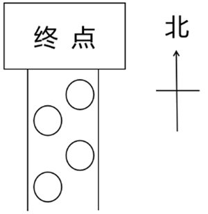

### 第 1 题　qid 11367790 · 逻辑判断

根据上述信息，可以推出以下哪项？

- **A**. 甲来自江苏，排第二位
- **B**. 乙来自浙江，排第四位　✅
- **C**. 丙来自安徽，排第一位
- **D**. 丁来自上海，排第三位

**答案**：B

**官方解析**

第一步：分析题干条件。

（1）江苏选手在选手丙的东南面；

（2）上海选手在赛道的东部位置，他所骑自行车是蓝色的；

（3）骑灰色自行车的选手不是排在第四位；

（4）选手丁排在第三位，选手乙来自浙江；

（5）安徽选手排在骑黄色自行车的选手之前，排在选手甲之后。

第二步：根据题干条件进行推理。

根据条件（1）江苏选手在丙的东南面，可以推出丙是第2名，江苏选手是第3名；

根据条件（2）上海选手在赛道东部以及江苏选手是第3名，可以推出上海选手是第1名，且自行车是蓝色的；

根据条件（3）以及第1名自行车是蓝色的，可以推出灰色自行车的选手不是第2名，就是第3名；

根据条件（4）以及江苏选手是第3名，可以推出丁是江苏选手；

根据条件（5）、上海选手是第1名以及江苏选手是第3名，可以推出安徽选手是第2名，甲是第1名，具体如下表所示。

综合上述结论，可以推出第4名是乙，来自浙江，B项当选。

故正确答案为B。

---

### 第 2 题　qid 11367792 · 逻辑判断

如果丙所骑自行车是白色，则可以推出以下哪项？

- **A**. 选手甲所骑自行车不是蓝色的
- **B**. 选手乙所骑自行车是灰色的
- **C**. 安徽选手所骑自行车是黄色的
- **D**. 江苏选手所骑自行车是灰色的　✅

**答案**：D

**官方解析**

第一步：分析题干条件。

（1）江苏选手在选手丙的东南面；

（2）上海选手在赛道的东部位置，他所骑自行车是蓝色的；

（3）骑灰色自行车的选手不是排在第四位；

（4）选手丁排在第三位，选手乙来自浙江；

（5）安徽选手排在骑黄色自行车的选手之前，排在选手甲之后；

（6）丙的自行车是白色的。

第二步：根据题干条件进行推理。

根据上一题的结论，第1名为选手甲，来自上海，自行车是蓝色的，排除A项；

根据条件（6）丙的自行车是白色的，结合上一题的结论可以推出第2名为选手丙，来自安徽，自行车是白色的，排除C项；

再根据条件（3）骑灰色自行车的选手不是排在第四位，结合上一题的结论可以推出第3名选手丁来自江苏，自行车是灰色的，那么第4名选手乙来自浙江，自行车是黄色的（具体如下表所示），D项当选。

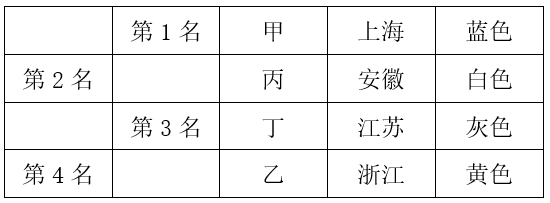

故正确答案为D。

---

### 第 3 题　qid 11367761 · 类比推理

元宇宙：虚拟性

- **A**. 实验：前瞻性
- **B**. 决策：可行性
- **C**. 宣传：普遍性
- **D**. 总结：概括性　✅

**答案**：D

**官方解析**

第一步：判断题干词语间逻辑关系。
元宇宙是通过虚拟增强的物理现实，是呈现收敛性和物理持久性特征的、基于未来互联网的具有链接感知和共享特征的3D虚拟空间。元宇宙一定具有虚拟性，二者是必然属性的对应关系。
第二步：判断选项词语间逻辑关系。
A项：实验不一定具有前瞻性，二者是或然属性的对应关系，与题干逻辑关系不一致，排除；
B项：决策不一定具有可行性，二者是或然属性的对应关系，与题干逻辑关系不一致，排除；
C项：宣传不一定具有普遍性，二者是或然属性的对应关系，与题干逻辑关系不一致，排除；
D项：总结指总结后概括出来的结论。总结一定具有概括性，二者是必然属性的对应关系，与题干逻辑关系一致，当选。
故正确答案为D。

---

### 第 4 题　qid 11367762 · 类比推理

舍本：逐末

- **A**. 买椟：还珠
- **B**. 取长：补短
- **C**. 避重：就轻　✅
- **D**. 趋炎：附势

**答案**：C

**官方解析**

第一步：判断题干词语间逻辑关系。
“舍本逐末”指舍弃事物的根本的、主要的部分，而去追求细枝末节，指轻重倒置。“舍本”和“逐末”是并列关系，且“舍”和“逐”、“本”和“末”均是反义关系。
第二步：判断选项词语间逻辑关系。
A项：“买椟还珠”指买了装了珍珠的木匣退还了珍珠。“买椟”和“还珠”是并列关系，但“买”和“还”、“椟”和“珠”均不是反义关系，与题干逻辑关系不一致，排除；
B项：“取长补短”指吸取别人的长处，弥补自己的短处。“取长”是为了“补短”，二者是方式目的的对应关系，且“取”和“补”不是反义关系，与题干逻辑关系不一致，排除；
C项：“避重就轻”指避开重要的而拣次要的来承担，也指回避主要的问题，只谈无关紧要的方面。“避重”和“就轻”是并列关系，其中“就”指凑近、靠近，“避”和“就”、“重”和“轻”均是反义关系，与题干逻辑关系一致，当选；
D项：“趋炎附势”指奉承、依附有权有势的人。“趋炎”和“附势”是并列关系，但“趋”和“附”、“炎”和“势”均不是反义关系，与题干逻辑关系不一致，排除。
故正确答案为C。

---

### 第 5 题　qid 11367764 · 类比推理

热极生风：穷极思变

- **A**. 鼓空声高：人狂话大
- **B**. 绳锯木断：水滴石穿
- **C**. 人闲生病：石闲生苔　✅
- **D**. 得道多助：失道寡助

**答案**：C

**官方解析**

第一步：判断题干词语间逻辑关系。
“热极生风”意思是一个地方热得太厉害，不久便会产生大风；“穷极思变”意思是在穷困艰难的时候，就要想办法改变现状。二者无明显语义关系，考虑拆分。因为“热极”所以“生风”，因为“穷极”所以“思变”，二者拆分之后均为因果关系，且“热极生风”和“穷极思变”均可指“事物在极端状态下会发生变化”。
第二步：判断选项词语间逻辑关系。
A项：“鼓空声高”意思是鼓里面是空的时候声音反而大；“人狂话大”意思是没有真才实学的人往往狂妄自大，好说大话，喜欢吹牛。因为“鼓空”所以“声高”，因为“人狂”所以“话大”，二者拆分之后均为因果关系，但“鼓空声高”无法指“事物在极端状态下会发生变化”，与题干逻辑关系不一致，排除；
B项：“绳锯木断”意思是以绳当锯，也能锯断木头；“水滴石穿”意思是水滴不断地滴，可以滴穿石头。因为“绳锯”所以“木断”，因为“水滴”所以“石穿”，二者拆分之后均为因果关系，但“绳锯木断”和“水滴石穿”均无法指“事物在极端状态下会发生变化”，与题干逻辑关系不一致，排除；
C项：“人闲生病”意思是人闲得无聊就容易生病；“石闲生苔”意思是闲置的石头很容易长出青苔。因为“人闲”所以“生病”，因为“石闲”所以“生苔”，二者拆分之后均为因果关系，且“人闲生病”和“石闲生苔”均可指“事物在极端状态下会发生变化”，与题干逻辑关系一致，当选；
D项：“得道多助”意思是坚持正义就能得到多方面的支持与帮助；“失道寡助”意思是违背正义必然陷于孤立。因为“得道”所以“多助”，因为“失道”所以“寡助”，二者拆分之后均为因果关系，但“得道多助”和“失道寡助”均无法指“事物在极端持续状态下会发生变化”，与题干逻辑关系不一致，排除。
故正确答案为C。
本题为争议题。若看题干第一个词“热极生风”与物有关，第二个词“穷极思变”与人有关；A项第一个词“鼓空声高”与物有关，第二个词“人狂话大”与人有关，C项刚好顺序反了，也有同学会选择A项，此考法历年真题也确实考过。两种理解方式均有合理之处，考生无需过于纠结不严谨的题，重点学习此类题的解题思路即可，这种同时涉及物和人的成语或诗句可能会考查的两个角度，一是具体意思的类似，二是由物到人或由人到物的类比。

---

### 第 6 题　qid 11367770 · 类比推理

苍鹰：鸿雁：书信

- **A**. 加油：注水：鼓劲
- **B**. 下海：上岸：录取　✅
- **C**. 须眉：巾帼：围脖
- **D**. 疆域：河山：国土

**答案**：B

**官方解析**

第一步：判断题干词语间逻辑关系。
“苍鹰”和“鸿雁”都是鸟类，二者为并列关系；“鸿雁”是书信的代称，可以比喻“书信”，第二词与第三词构成比喻象征义，且第一词与第三词无必然逻辑关系。
第二步：判断选项词语间逻辑关系。
A项：“加油”和“注水”都是动作，二者为并列关系；“加油”可用于支持，指勉励他人或自己，可以比喻“鼓劲”，第一个词与第三个词构成比喻象征义，词语顺序与题干不一致，与题干逻辑关系不一致，排除；
B项：“下海”和“上岸”都是动作，二者为并列关系；“上岸”指舍舟登陆，也指考生被录取，可以比喻“录取”，第二词与第三词构成比喻象征义，且第一词与第三词无必然逻辑关系，与题干逻辑关系一致，当选；
C项：“须眉”指胡须和眉毛，也可以比喻男子，“巾帼”指古代妇女的头巾和发饰，也可以比喻女子，二者为并列关系；但“巾帼”不能比喻“围脖”，与题干逻辑关系不一致，排除；
D项：“疆域”指国家领土，“河山”指国家的疆土，“国土”指国家的领土，第一个词和第三个词意思一致，二者为全同关系，与题干逻辑关系不一致，排除。
故正确答案为B。

---

### 第 7 题　qid 11367763 · 类比推理

购物：货币：购物车

- **A**. 攀登：山峰：手杖
- **B**. 垂钓：鱼竿：鱼钩
- **C**. 写作：文字：电脑　✅
- **D**. 旅游：景点：导游

**答案**：C

**官方解析**

第一步：判断题干词语间逻辑关系。
“货币”是“购物”的工具，且通常来说没有“货币”就无法“购物”，二者为必要工具的对应关系；“购物车”是“购物”的工具，但没有“购物车”也能“购物”，二者为非必要工具的对应关系。
第二步：判断选项词语间逻辑关系。
A项：“山峰”是“攀登”的对象而非工具，二者不是必要工具的对应关系，与题干逻辑关系不一致，排除；
B项：“鱼竿”和“鱼钩”都是“垂钓”的工具，且都是“垂钓”的必要工具，二者分别与“垂钓”构成必要工具的对应关系，与题干逻辑关系不一致，排除；
C项：“文字”是人类用符号记录表达信息以传之久远的方式和工具。“文字”是“写作”的工具，且没有“文字”就无法“写作”，二者为必要工具的对应关系；“电脑”是“写作”的工具，但没有“电脑”也能“写作”，二者为非必要工具的对应关系，与题干逻辑关系一致，当选；
D项：“景点”是“旅游”的对象而非工具，二者不是必要工具的对应关系，与题干逻辑关系不一致，排除。
故正确答案为C。

---

### 第 8 题　qid 11367768 · 类比推理

压舱石：就业：社会稳定

- **A**. 先手棋：专利：科技创新
- **B**. 基本盘：耕地：粮食生产　✅
- **C**. 晴雨表：管理：人才培养
- **D**. 主阵地：学校：知识传播

**答案**：B

**官方解析**

第一步：判断题干词语间逻辑关系。
“压舱石”本意为船舶、飞机等交通工具上为了保持平衡和稳定而放置的重物，后比喻对事物发展起到稳定、支撑作用的关键因素、重要力量或基础保障。“就业”是“社会稳定”的“压舱石”，三者为对应关系。
第二步：判断选项词语间逻辑关系。
A项：“先手棋”本来指围棋、象棋等棋类游戏中，先走的一方所下的第一步棋，具有争取主动的优势，后引申为在竞争、行动等过程中，为了占据主动地位而采取的第一步或关键的起始行动、策略等。“专利”不是“科技创新”的“先手棋”，三者不构成对应关系，与题干逻辑关系不一致，排除；
B项：“基本盘”指事物最基础、最根本的部分。“耕地”是“粮食生产”的“基本盘”，三者为对应关系，与题干逻辑关系一致，保留；
C项：“晴雨表”比喻能敏锐地反映某种变化或在事情发生前出现征兆的事物。“管理”不是“人才培养”的“晴雨表”，三者不构成对应关系，与题干逻辑关系不一致，排除；
D项：“主阵地”指在军事作战中，军队主要据守和作战的地区或位置，现在常用来指在某个领域、行业或工作中，起主导、核心作用，集中力量进行主要活动或发挥主要作用的地方、领域或平台等。“学校”是“知识传播”的“主阵地”，三者为对应关系，与题干逻辑关系一致，保留。
对比B、D两项，题干的“压舱石”强调“就业”是维持“社会稳定”的重要基础和关键因素，对“社会稳定”起着支撑作用，B项的“基本盘”强调“耕地”是“粮食生产”的根本和基础，对“粮食生产”起着支撑作用，而D项的“主阵地”没有体现这种基础和支撑作用。且题干的“压舱石”和B项的“基本盘”都是物品，而D项的“主阵地”为地点，故B项与题干逻辑关系更为一致，当选。
故正确答案为B。

---

### 第 9 题　qid 11367776 · 类比推理

温室效应：冰山融化：海面上升

- **A**. 博览群书：视野开阔：见解深刻
- **B**. 连日降雪：道路结冰：出行困难　✅
- **C**. 电闪雷鸣：狂风大作：沙尘肆虐
- **D**. 刻苦训练：技能提高：获得金牌

**答案**：B

**官方解析**

第一步：判断题干词语间逻辑关系。
因为“温室效应”，所以“冰山融化”；因为“冰山融化”，所以“海面上升”，三者为连续因果对应关系。
第二步：判断选项词语间逻辑关系。
A项：因为“博览群书”，所以“视野开阔”；因为“视野开阔”，所以“见解深刻”，三者为连续因果对应关系，与题干逻辑关系一致，保留；
B项：因为“连日降雪”，所以“道路结冰”；因为“道路结冰”，所以“出行困难”，三者为连续因果对应关系，与题干逻辑关系一致，保留；
C项：“电闪雷鸣”“狂风大作”“沙尘肆虐”是不同的天气现象，三者不是连续因果对应关系，与题干逻辑关系不一致，排除；
D项：因为“刻苦训练”，所以“技能提高”；因为“技能提高”，所以“获得金牌”，三者为连续因果对应关系，与题干逻辑关系一致，保留。
对比A、B、D三项，题干和B项的初始原因均为自然原因，带来的均为消极结果，但A、D两项初始原因为人为原因，带来的为积极结果，B项与题干逻辑关系更为一致，当选。
故正确答案为B。

---

### 第 10 题　qid 11367766 · 类比推理

本土药材：野生药材：名贵药材

- **A**. 沿海高铁：跨省高铁：城际高铁　✅
- **B**. 牛奶产业：传统产业：养殖产业
- **C**. 超限车辆：超载车辆：超重车辆
- **D**. 社区治理：社会治理：水土治理

**答案**：A

**官方解析**

第一步：判断题干词语间逻辑关系。
本土药材、野生药材、名贵药材是从不同的划分角度去命名的，三者互为交叉关系。
第二步：判断选项词语间逻辑关系。
A项：沿海高铁、跨省高铁、城际高铁是从不同的划分角度去命名的，三者互为交叉关系，与题干逻辑关系一致，当选；
B项：“传统产业”主要指劳动力密集型的、以制造加工为主的行业。“牛奶产业”是“传统产业”，二者为种属关系，与题干逻辑关系不一致，排除；
C项：“超限”是指车辆的轴载质量、车货总质量或装载总尺寸超过国家规定的限值；“超载”是指车辆载客或载货超过了其额定的承载能力；“超重”是指车辆的单轴或总质量超过了其设计或核定的最大重量，这是对车辆行驶管理的三个规定，三者为并列关系，与题干逻辑关系不一致，排除；
D项：“社区治理”是“社会治理”的一个重要组成部分，二者为组成关系，与题干逻辑关系不一致，排除。
故正确答案为A。

---

### 第 11 题　qid 11367767 · 类比推理

森林 之于 （    ） 相当于 （    ） 之于 社会

- **A**. 气候 法制　✅
- **B**. 氧气 自然
- **C**. 系统 国家
- **D**. 树木 家庭

**答案**：A

**官方解析**

逐一代入选项。
A项：森林会调节气候，二者为对应关系；法制会约束或调节社会，二者为对应关系，前后逻辑关系一致，当选；
B项：森林会释放氧气，二者为产物的对应关系；自然会影响社会，而社会也会改造自然，二者为互相影响的对应关系，前后逻辑关系不一致，排除；
C项：森林是一种生态系统，二者为种属关系；国家可以指阶级统治的工具，也可以指一个国家的整个区域，但国家不是一种社会，二者不是种属关系，前后逻辑关系不一致，排除；
D项：树木是森林的组成部分，二者为组成关系；家庭是社会的组成部分，二者为组成关系，但前后词语顺序相反，前后逻辑关系不一致，排除。
故正确答案为A。

---

### 第 12 题　qid 11367771 · 类比推理

生肖 之于 （    ） 相当于 （    ） 之于 禁行

- **A**. 飞禽 路口
- **B**. 走兽 信号
- **C**. 天干 通行
- **D**. 地支 红灯　✅

**答案**：D

**官方解析**

逐一代入选项。
A项：飞禽指会飞的鸟类，也泛指鸟类。有的生肖是飞禽（如，鸡），有的生肖不是飞禽，有的飞禽是生肖，有的飞禽不是生肖，二者为交叉关系；在路口可以禁行，二者为对应关系，前后逻辑关系不一致，排除；
B项：走兽泛指兽类。有的生肖是走兽（如，牛），有的生肖不是走兽，有的走兽是生肖，有的走兽不是生肖，二者为交叉关系；禁行是一种信号，二者为种属关系，前后逻辑关系不一致，排除；
C项：天干是对甲、乙、丙、丁、戊、己、庚、辛、壬、癸的统称，传统用作表示次序的符号，和生肖无明显逻辑关系；通行和禁行为反义关系，前后逻辑关系不一致，排除；
D项：地支是对子、丑、寅、卯、辰、巳、午、未、申、酉、戌、亥的统称，生肖是代表十二地支而用来记人的出生年的十二种动物，子属鼠、丑属牛、寅属虎、卯属兔、辰属龙、巳属蛇、午属马、未属羊、申属猴、酉属鸡、戌属狗、亥属猪，二者有紧密的对应关系；红灯指红色的交通信号灯，红灯亮时表示禁止通行，二者有紧密的对应关系，前后逻辑关系一致，当选。
故正确答案为D。

---

### 第 13 题　qid 11367775 · 图形推理

从所给的四个选项中，选出最合适的一个填入问号处，使图形呈现一定的规律性。

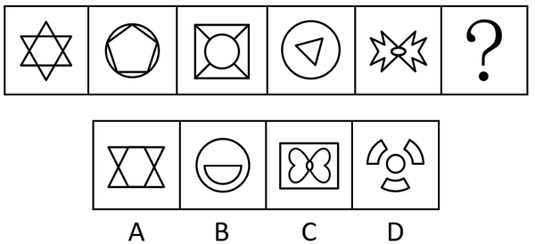

- **A**. A
- **B**. B　✅
- **C**. C
- **D**. D

**答案**：B

**官方解析**

元素组成不同，优先考虑属性规律。题干图形规整，且出现明显的等腰元素，考虑对称性。观察发现，题干图形均为轴对称图形，且对称轴数量分别是6、5、4、3、2，因此？处图形应仅有1条对称轴，只有B项符合。
故正确答案为B。

---

### 第 14 题　qid 11367781 · 图形推理

请从四个选项中选出最恰当的一项填入问号处，使题干图形呈现一定的规律性。

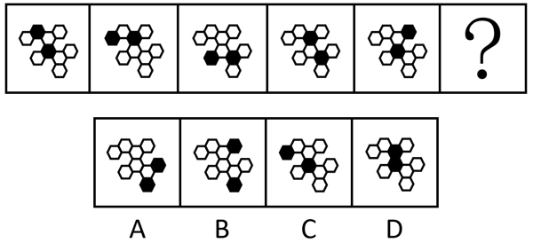

- **A**. A　✅
- **B**. B
- **C**. C
- **D**. D

**答案**：A

**官方解析**

元素组成相同，但无明显位置规律。观察发现，题干图形均出现两个黑块，且两个黑块之间均间隔一个白块，？处应用规律，只有A项符合。
故正确答案为A。

---

### 第 15 题　qid 11367769 · 图形推理

请从四个选项中选出最恰当的一项填入问号处，使题干图形呈现一定的规律性。

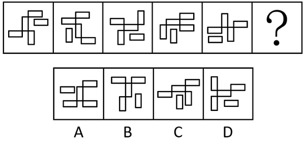

- **A**. A
- **B**. B
- **C**. C　✅
- **D**. D

**答案**：C

**官方解析**

题干中每幅图形均由1个单独小矩形和4个相连的小矩形构成。观察发现，单独小矩形的方向在每幅图中依次呈水平、竖直，交替放置，故？处应选择一个单独小矩形竖直放置的图形，排除A、D两项；继续观察发现，4个相连的小矩形中，与单独小矩形方向一致的数量依次为2、1、2、1、2，交替出现，只有C项符合。
故正确答案为C。

---

### 第 16 题　qid 11367773 · 图形推理

请从四个选项中选出最恰当的一项填入问号处，使题干图形呈现一定的规律性。

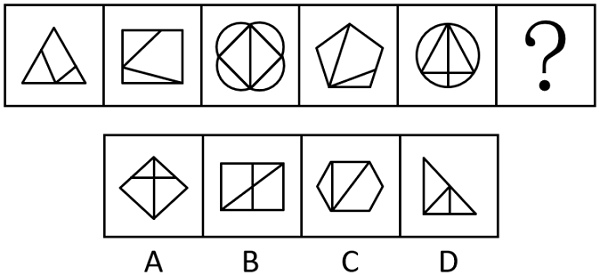

- **A**. A
- **B**. B
- **C**. C　✅
- **D**. D

**答案**：C

**官方解析**

元素组成不同，且无明显属性规律，考虑数量规律。观察发现，题干出现多个 “日”字变形图，考虑笔画数。题干图形均为一笔画图形，？处应用规律，排除A、B两项；继续观察发现，题干每幅图形均存在两个三角形面，故？处应选一个存在两个三角形面的图形，只有C项符合。
故正确答案为C。

---

### 第 17 题　qid 11367791 · 图形推理

请从四个选项中选出最恰当的一项填入问号处，使题干图形呈现一定的规律性。

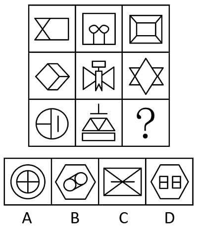

- **A**. A
- **B**. B
- **C**. C
- **D**. D　✅

**答案**：D

**官方解析**

元素组成不同，优先考虑属性规律。观察发现，题干图形出现明显的等腰元素，考虑对称性。九宫格优先看横行，第一行中，图一为横轴对称图形，图二为竖轴对称图形，图三为既轴对称又中心对称图形，且对称轴只有一条横轴和一条竖轴；第二行经验证符合此规律；第三行应用此规律，排除A、B两项。继续观察发现，题干图形封闭面明显，考虑面数量。第一行中，面数量依次为3、4、5；第二行经验证符合此规律；第三行应用此规律，故“？”处图形应有5个面，只有D项符合。
故正确答案为D。

---

### 第 18 题　qid 11367796 · 图形推理

左边给定的图形是由右边哪些图形拼合（只可平移，不可旋转和翻转）而成的？

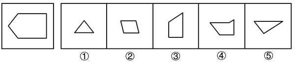

- **A**. ①②③④
- **B**. ①②③⑤
- **C**. ②③④⑤
- **D**. ①③④⑤　✅

**答案**：D

**官方解析**

本题考查平面拼合，可采用平行且等长相消的方式解题。左边给定的图形是由右边①③④⑤拼合而成的。平行且等长相消的方式如下图所示：

故正确答案为D。

---

### 第 19 题　qid 11367783 · 类比推理

上边四张纸片，每张纸片一面是黑色，另一面是白色，下边仅有一项能由它们拼合（可以平移、旋转、翻转）而成，请把它找出来。

- **A**. A
- **B**. B
- **C**. C　✅
- **D**. D

**答案**：C

**官方解析**

本题考查平面拼合，可以平移、旋转、翻转，且每张纸片一面是黑色，另一面是白色，需要考虑翻转后的颜色变化。将题干图形标上序号，如下图所示，逐一进行分析。

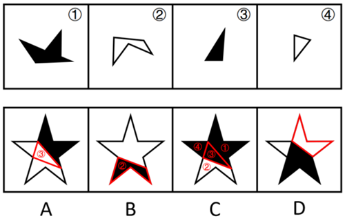

A项：中间的三角形是由图③旋转后平移过去的，颜色应该是黑色，而选项是白色，排除；

B项：下方的多边形是由图②旋转后平移过去的，颜色应该是白色，而选项是黑色，排除；

C项：可以由题干图形拼合而成，拼合方式如图所示，当选；

D项：右上角的多边形与题干四张纸片的形状均不相同，无法由题干图形拼合而成，排除。

故正确答案为C。

---

### 第 20 题　qid 11367785 · 图形推理

左边给定的是一个立方体，右边哪一项可能是它的外表面展开图？

- **A**. A
- **B**. B
- **C**. C
- **D**. D　✅

**答案**：D

**官方解析**

将题干立体图和选项展开图的面均标上序号，如下图所示，逐一进行分析。

A项：题干立体图中g面中箭头的箭尾对着e面，而选项中无论是g1面还是g2面，箭头的箭尾均对着f2面，选项展开图与题干立体图不一致，排除；

B项：题干立体图中e面中箭头指向f面中箭头的尖，而选项中无论是e1面还是e2面，箭头均指向f2面中箭头的箭身，选项展开图与题干立体图不一致，排除；

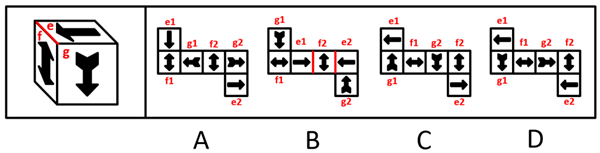

C项：以e面中单箭头尖指向的边为起始边，在题干立体图和选项展开图中进行顺时针画边（如下图所示），题干立体图中边4对应g面中的箭尾，而选项中无论是e1面还是e2面，边4均不对应g面中的箭尾，选项展开图与题干立体图不一致，排除；

D项：题干由e1面、g1面和f2面组成，选项展开图与题干立体图一致，当选。

故正确答案为D。

---

### 第 21 题　qid 11367779 · 图形推理

左边给定的是六面体的外表面展开图，右边哪一项是由它折叠而成？

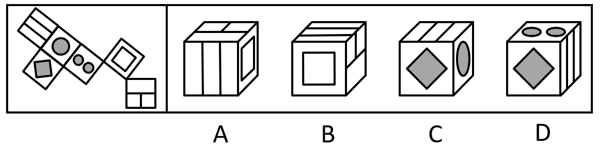

- **A**. A　✅
- **B**. B
- **C**. C
- **D**. D

**答案**：A

**官方解析**

本题为空间重构题。将题干展开图右侧的面进行移动，并为每个面标上序号，如下图所示，逐一分析选项。

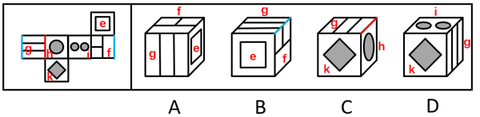

A项：选项由面e、面f和面g构成，选项与题干展开图一致，当选；

B项：选项由面e、面f和面g构成，题干展开图中面f和面g的公共边挨着面f中的大长方形，而选项中面f和面g的公共边不挨着面f中的大长方形，选项与题干展开图不一致，排除；

C项：选项由面g、面h和面k构成，题干展开图中面g和面h的公共边与面g中的线条垂直，而选项中面g和面h的公共边与面g中的线条平行，选项与题干展开图不一致，排除；

D项：选项由面g、面i和面k构成，题干展开图中面g和面i是相对面，两者不能同时出现，选项与题干展开图不一致，排除。

故正确答案为A。

---

### 第 22 题　qid 11367788 · 图形推理

下面4个立体图形均由大小相同的8个白色小立方体和4个灰色小立方体堆叠而成，其中一个立体图形的某一视图可能是由纯白小方格组成的，请把它找出来。

- **A**. A
- **B**. B
- **C**. C
- **D**. D　✅

**答案**：D

**官方解析**

本题考查三视图。A、B、C三项中的立体图形不可能某一视图由纯白小方格组成，排除。D项中，立体图形的正面能看到7个白色小立方体和3个灰色小立方体，所以其背面应还有1个白色小立方体和1个灰色小立方体。如下图所示，当灰色小立方体在最下层摆放，白色小立方体摆放在该灰色小立方体的上方时，其俯视图由纯白小方格组成。

故正确答案为D。

---

### 第 23 题　qid 11367777 · 逻辑判断

只有为了人民的现代化，才有意义；只有依靠人民的现代化，才有动力。新时代以来，我们坚持民生为大，书写了经济快速发展和社会长期稳定两大奇迹新篇章。只要坚持一切为了人民、一切依靠人民，就能充分调动广大人民的积极性。
根据以上信息，可以推出以下哪项？

- **A**. 不是为了人民的现代化，就是没有意义的现代化　✅
- **B**. 不坚持民生为大，就不能创造经济快速发展和社会长期稳定两大奇迹
- **C**. 如果没能调动广大人民的积极性，则没有坚持一切为了人民
- **D**. 只有坚持一切依靠人民，才能充分调动广大人民的积极性

**答案**：A

**官方解析**

第一步：翻译题干。

①现代化有意义为了人民的现代化；

②现代化有动力依靠人民的现代化；

③坚持一切为了人民 且 坚持一切依靠人民充分调动广大人民的积极性。

第二步：逐一分析选项。

A项：翻译为“为了人民的现代化现代化有意义”，是对①的否后，否后必否前，可以推出，当选；

B项：翻译为“坚持民生为大创造经济快速发展和社会长期稳定两大奇迹”，二者不存在逻辑关系，无法推出，排除；

C项：翻译为“调动广大人民的积极性坚持一切为了人民”，是对③的否后，否后必否前，即“充分调动广大人民的积极性坚持一切为了人民 或 坚持一切依靠人民”，无法得出“坚持一切为了人民”一定为真，无法推出，排除；

D项：翻译为“充分调动广大人民的积极性坚持一切依靠人民”，是对③的肯后，但肯后得不到确定性的结论，无法推出，排除。

故正确答案为A。

---

### 第 24 题　qid 11367795 · 类比推理

甲：在手机市场增长缓慢的大环境下，折叠屏手机销量连续多年保持两位数的增长，折叠屏手机将是手机研发的下一个风口
乙：折叠屏手机经历多年发展仍只占手机整体销量的1.6%，由此来看，折叠屏手机不值得手机厂商投入太多精力
以下哪项与上述对话方式最为相似？

- **A**. 
甲：2017年企业应用AI技术比例约为20%，到2023年提高至50%，AI技术将是国家经济发展的重点

乙：AI技术经历多年发展已经在社会方方面面起着重要作用，但传统行业仍是经济中的重要部分，同样需要重视

- **B**. 
甲：这次期末考试，张明的成绩平均每科提高了5分，这表明张明过去一年在学习上认真了许多

乙：这次期末考试比较简单，全班同学各科平均分都提高了10分之多，由此看来，张明在过去一年没有认真学习

- **C**. 
甲：过去三年某出版社的错别字检出量大大增加，必须增加相应的人手以避免错别字检出数量继续增加

乙：过去三年该出版社出版总量大大增加，但错别字检出率维持在万分之一左右，远低于国家标准，无需增加人手
　✅
- **D**. 
甲：一项调查显示，超过90%的大学生在不请假的情况下缺过课，这一现象说明课堂纪律没有得到很好的遵守

乙：这项调查主要针对大四学生，如果是大一学生，则缺过课的比例不超过20%，可见大学课堂纪律得到了很好的遵守

**答案**：C

**官方解析**

第一步：分析题干逻辑关系。
甲根据“折叠屏手机销量连续多年保持两位数的增长”的现象，得出“折叠屏手机将是手机研发的下一个风口”的结论，而乙提出“折叠屏手机经历多年发展仍只占手机整体销量的1.6%”，通过说明折叠屏手机在手机整体销量中的占比仍很低反驳了甲的结论。
第二步：逐一分析选项。
A项：甲根据“企业应用AI技术比例在2023年提高至50%”的现象，得出“AI技术将是国家经济发展的重点”的结论，乙提出“传统行业仍是经济中的重要部分，同样需要重视”，并未反驳甲的结论，与题干对话方式不一致，排除；
B项：甲根据“张明的成绩平均每科提高了5分”的现象，得出“张明过去一年在学习上认真了许多”的结论，而乙提出“全班同学各科平均分都提高了10分之多”，通过说明张明的成绩提升幅度小于全班同学的平均水平反驳了甲的结论，与题干对话方式不一致，排除；
C项：甲根据“过去三年某出版社的错别字检出量大大增加”的现象，得出“必须增加相应的人手以避免错别字检出数量继续增加”的结论，而乙提出“过去三年该出版社出版总量大大增加，但错别字检出率维持在万分之一左右”，通过说明错别字的数量占文本总字数的比例很低反驳了甲的结论，与题干对话方式一致，当选；
D项：甲根据“一项调查显示，超过90%的大学生在不请假的情况下缺过课”的现象，得出“课堂纪律没有得到很好的遵守”的结论，而乙提出“这项调查主要针对大四学生，如果是大一学生，则缺过课的比例不超过20%”，通过说明调查的样本不具代表性反驳了甲的结论，与题干对话方式不一致，排除。
故正确答案为C。

---

### 第 25 题　qid 11367772 · 逻辑判断

“露从今夜白，月是故乡明。”唐代诗人杜甫这一千古名句表达了诗人在秋天对故乡的思念和对亲人的牵挂。在国人心中，秋天总是和思乡联系在一起。对此，有学者称，相对于其他季节，秋天人们很容易想起家乡的种种美好，更容易产生思乡情绪。
以下哪项如果为真，最能支持上述学者的观点？

- **A**. 秋天大自然由生机勃勃转向秋风萧瑟，让人感受到时间的流逝和生命的脆弱
- **B**. 秋天正是收获的时节，那些从小经历的美好场景深深刻在每个人的心底　✅
- **C**. 中国历史上有无数文人骚客在秋天写下思乡的千古名篇，影响着一代又一代国人
- **D**. 每逢中秋，在外漂泊的游子会意识到已经离家很久，渴望和家人团聚

**答案**：B

**官方解析**

第一步：找出论点和论据。
论点：相对于其他季节，秋天人们很容易想起家乡的种种美好，更容易产生思乡情绪。
论据：无。
本题只有论点，没有论据，加强优先考虑补充论据。
第二步：逐一分析选项。
A项：该项指出秋天让人感受到“时间的流逝和生命的脆弱”，但并未说明此种感受是否会引发“思乡情绪”，话题不一致，无法加强，排除；
B项：该项指出秋天正是收获的时节，那些“从小经历的美好场景”深深刻在每个人的心底，解释了为什么秋天容易让人们想起“家乡的种种美好”，更容易让人们产生“思乡情绪”，补充论据，可以加强，保留；
C项：该项指出国人思乡是因为受到文人骚客写下的关于思乡的千古名篇的影响，解释了一代又一代国人思乡的原因，补充论据，可以加强，保留；
D项：该项指出“中秋”会触发游子的“思乡情绪”，“中秋”是秋天的一个节日，无法判断是节日还是秋天这个季节容易让人们产生思乡情绪，为不明确项，无法加强，排除。
对比B、C两项，B项解释了为什么每个人会发自心底的产生思乡之情，而C项只是在说思乡是受到了文人骚客的影响，但是发自心底的原因比他人带来的影响更为关键，因此B项加强力度更强。
故正确答案为B。

---

### 第 26 题　qid 11367778 · 逻辑判断

文学、经济学、历史学、社会学四个专业的学生甲、乙、丙、丁各自携带本专业的一本书参加读书会。读书会期间，四人交换了所带的书，已知：
（1）丙是历史学专业学生，丁是文学专业学生；
（2）交换书后，甲持有社会学书，乙不持有文学书；
（3）交换书后，每个人所持有的书不是原来所携带的专业书。
根据以上信息，不能推出以下哪项？

- **A**. 甲是经济学专业学生
- **B**. 丙持有文学书
- **C**. 乙是社会学专业学生
- **D**. 丁持有历史书　✅

**答案**：D

**官方解析**

第一步：分析题干条件。

（1）丙是历史学专业学生，丁是文学专业学生；

（2）交换书后，甲持有社会学书，乙不持有文学书；

（3）交换书后，每个人所持有的书不是原来所携带的专业书。

第二步：根据题干条件进行推理。

根据条件（2）（3）可以推出，甲不是社会学专业的学生；

再结合条件（1）可以推出，甲是经济学专业的学生，乙是社会学专业的学生。

根据条件（2）甲持有社会学书（不持有文学书）、乙不持有文学书，且丁是文学专业的学生，结合条件（3）可以推出，持有文学书的学生是丙；

综上，可以推出乙和丁持有经济学书或历史学书，但无法确定具体书籍，如下表所示，A、B、C三项均可推出。

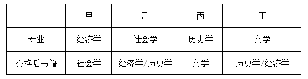

本题为选非题，故正确答案为D。

---

### 第 27 题　qid 11367774 · 逻辑判断

甲、乙、丙三人毕业后同时进入某单位实习，由于表现较好，实习结束后他们将分到人事处、财务处、办公室正式入职。有人对他们各自的工作部门进行了如下猜测：
（1）甲入职的部门是人事处；
（2）乙入职的部门不是财务处；
（3）丙入职的部门不是人事处。
实际上，上述三个猜测只有一个是对的。
根据上述信息，可以推出甲、乙、丙入职的部门依次为：

- **A**. 人事处 财务处 办公室
- **B**. 办公室 财务处 人事处
- **C**. 财务处 办公室 人事处　✅
- **D**. 人事处 办公室 财务处

**答案**：C

**官方解析**

第一步：分析题干条件。
（1）甲入职的部门是人事处；
（2）乙入职的部门不是财务处；
（3）丙入职的部门不是人事处；
（4）三个猜测只有一个是对的。
题干条件没有矛盾关系，也没有反对关系，考虑题干假设或选项代入，选项信息充分，优先考虑代入法。
第二步：逐一代入选项。
代入A项：条件（1）为真，条件（2）为假，条件（3）为真，有两个猜测为真，与条件（4）矛盾，排除；
代入B项：条件（1）为假，条件（2）为假，条件（3）为假，三个猜测均为假，与条件（4）矛盾，排除；
代入C项：条件（1）为假，条件（2）为真，条件（3）为假，只有一个猜测为真，符合条件（4），当选；
代入D项：条件（1）为真，条件（2）为真，条件（3）为真，三个猜测均为真，与条件（4）矛盾，排除。
故正确答案为C。

---

### 第 28 题　qid 11367789 · 类比推理

在下边5×5的表格中填入泰山、华山、衡山、恒山和嵩山5个词，要求每行、每列、每个粗线条框内均不能重复也不能遗漏，则依次填入序号①-④处的是：

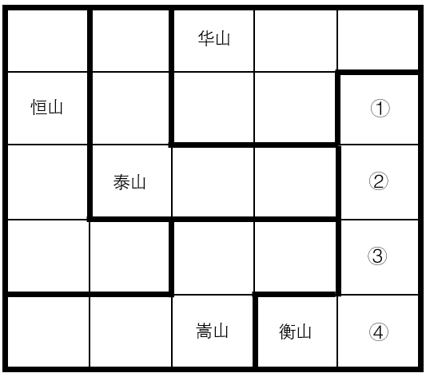

- **A**. 泰山 华山 嵩山 恒山
- **B**. 华山 恒山 嵩山 泰山
- **C**. 华山 嵩山 恒山 泰山　✅
- **D**. 嵩山 恒山 泰山 华山

**答案**：C

**官方解析**

本题属于数独型推理，优先考虑利用信息量最大法。

根据题干信息“每行、每列、每个粗线条框内均不能重复也不能遗漏”可知，信息量最大的空格为a、b。

根据最后一行中的“衡山”以及右下角粗线条框可知，①、②、③、④均不是衡山，所以a是衡山。

继续观察发现，考虑“每行、每列不能重复”，图形最下方的“Z型”粗线条框内的圆形位置均不能是衡山，所以b是衡山。

再根据第三行“泰山”所在的“L型”粗线条框，结合第三列中的“华山”“嵩山”和“b衡山”可知，c只能是恒山，则d一定是泰山，即①不能是泰山，②不能是恒山，排除A、B和D项三项。

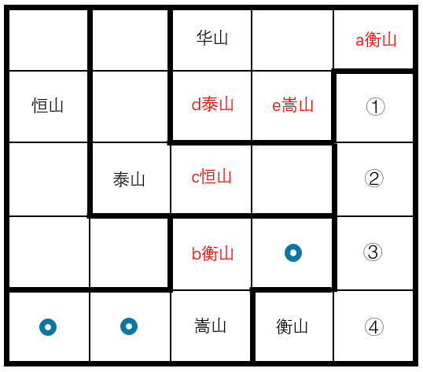

故正确答案为C。

---

### 第 29 题　qid 11367786 · 逻辑判断

海草是由陆地植物演化到适应海洋环境的高等植物。一种或几种海草连片生长，共同形成广袤柔软的“海草床”。海草床是最高效的碳捕获和碳封存系统之一，贮存碳的效率比森林高90倍，碳封存时间可达上千年。然而海草床是脆弱的生态系统，受自然环境变化和人类活动影响较大，全球范围内海草床正面临严峻退化趋势。基于如上原因，有专家建议，亟需开展“海底种草”生态修复工作，加强对海草床的保护。
以下哪项如果为真，最能支持上述专家的建议？

- **A**. 当前全球气候变暖日益加剧，科学家已发现人类生产生活排放的碳化合物是变暖的主要元凶　✅
- **B**. 海草床可以通过光合作用吸收环境中的无机碳，将其高效地固定、转化为有机碳并进行积累
- **C**. 有些地方海岸线侵蚀严重，加强海草床保护和修复，能有效防止或减缓海滩和海岸遭受侵蚀
- **D**. 海草床具有水质净化和调控功能，能吸收水体中的营养盐和重金属，降低海水悬浮物的浓度

**答案**：A

**官方解析**

第一步：找出论点和论据。
论点：亟需开展“海底种草”生态修复工作，加强对海草床的保护。
论据：海草床是最高效的碳捕获和碳封存系统之一，贮存碳的效率比森林高90倍，碳封存时间可达上千年。然而海草床是脆弱的生态系统，受自然环境变化和人类活动影响较大，全球范围内海草床正面临严峻退化趋势。
本题论点说的是亟需修复和保护海草床，论据说的是海草床是最高效的碳捕获和碳封存系统之一，但正面临严峻退化趋势，二者话题基本一致，加强优先考虑补充论据。
第二步：逐一分析选项。
A项：该项说的是全球气候变暖日益加剧，而其主要元凶是人类生产生活排放的碳化合物，那么固碳就显得尤为重要，而海草床可以固碳，故应亟需开展“海底种草”生态修复工作，该项指出目前碳排放问题较严重是填补了论据推出论点过程中的漏洞，补充论据，保留；
B项：该项说的是海草床可以将无机碳高效地固定、转化为有机碳并进行积累，说明海草床贮存碳的效率较高，是对论据的重复，可以加强，保留；
C项：该项说有些地方海岸线侵蚀严重，加强海草床保护和修复，能有效防止或减缓海滩和海岸遭受侵蚀，但未提及其与碳化合物的关系，话题不一致，无法加强，排除；
D项：该项说的是海草床具有水质净化和调控功能，但没有体现这些功能对碳化合物的作用，无法证明“亟需”修复和保护海草床，无法加强，排除。
对比A、B两项，A项填补了论据推出论点过程中的漏洞，而B项只是重复论据，因此A项的加强力度更强。
故正确答案为A。

---

### 第 30 题　qid 11367793 · 逻辑判断

一直以来，患者在初诊后第二天拿着检查报告找医生复诊时需要再挂号，这大大增加患者的就医负担。针对这一情况，某医院开始实施“一次挂号管三天”的做法，让当天不能完成检查或不能领取检查报告的患者，在三天内可携带报告到同一科室复诊，无需再次挂号。对此，有初诊患者担心，医院此举会延长他们的等待时间，挤压他们的就诊机会。
以下哪项如果为真，最能说明上述患者的担心是不必要的？

- **A**. 该做法实施后，医院将根据医生的接诊情况，合理安排初诊患者与复诊患者的接诊次序，尽量避免出现长时间排队现象　✅
- **B**. 无论是否需要再次挂号，患者都会去同一科室进行复诊，该做法的实施不会导致科室接诊的患者明显增多
- **C**. 该做法实施前，医生也会接待手持检查报告的复诊患者，但他们需要重新挂号，与初诊患者一起按挂号次序就诊
- **D**. 该做法实施后，患者可在挂号三天有效期内从容完成检查、治疗等就医环节，保障诊治的连续性和有效性

**答案**：A

**官方解析**

第一步：找出论点和论据。
论点：有初诊患者担心，医院此举（实施“一次挂号管三天”的做法）会延长他们的等待时间，挤压他们的就诊机会。
论据：无。
本题只有论点，没有论据，削弱优先考虑削弱论点。
第二步：逐一分析选项。
A项：该项说的是该做法实施后医院将根据情况合理安排初诊患者与复诊患者的接诊次序，这样就可以尽量避免出现长时间排队现象，不会延长初诊患者的等待时间，说明了他们的担心是不必要的，削弱论点，当选；
B项：该项说的是该做法不会导致科室接诊的患者明显增多，但在患者数量不增加的情况下，初诊患者与复诊患者的排队次序和等待时间不明确，复诊患者的就诊次序可能都排在初诊患者之前，仍然会延长初诊患者的等待时间，不能证明他们的担心是不必要的，无法削弱，排除；
C项：该项说的是该做法实施前的情况，无法判断实施后是否会延长初诊患者的等待时间，无法削弱，排除；
D项：该项说的是该做法对患者的好处，但与初诊患者等待时间和就诊机会无关，话题不一致，无法削弱，排除。
故正确答案为A。

---

### 第 31 题　qid 11367787 · 逻辑判断

对某项调查的“同意”票进行计数，甲、乙、丙、丁四人给出的结果分别是：9472、9496、9480、9502张。四人计数结果不一致后重新计数，发现有三人分别少计了17张、少计了9张、多计了13张，还有一人仅粗略估计出一个票数。
根据上述信息，可以推出粗略估计票数的人是：

- **A**. 甲
- **B**. 乙　✅
- **C**. 丙
- **D**. 丁

**答案**：B

**官方解析**

第一步：分析题干条件。
（1）甲9472、乙9496、丙9480、丁9502；
（2）1个人少计了17张；
（3）1个人少计了9张；
（4）1个人多计了13张；
（5）1个人仅粗略估计出一个票数。
第二步：根据题干条件进行推理。
根据条件（1）（2）可以推出四个人中数量最少的人少计了17张，即甲9472少计了17张，那正确票数应为9472+17=9489，排除A项；
结合条件（1）（3）可以推出丙9480少计了9张，排除C项；
结合条件（1）（4）可以推出票数最多的丁9502多计了13张，排除D项。
综上，乙9496是仅粗略估计出的一个票数，B项当选。
故正确答案为B。

---

### 第 32 题　qid 11367794 · 逻辑判断

买电影票前，去电影网站查看待映影片的评分；看电视剧前，要等到有评分后才决定是否观看······各种文化产品似乎都有了属于自己的分数。一个高分能为相关文化产品带来较高的关注度和较大的影响力，这反过来又影响文化产品的创作。然而，有专家表示，这样的评分很有可能影响文化产品的创新发展。
以下除哪项外，均能支持上述专家的观点？

- **A**. 那些试图突破常规、探索新风格或新形式的文化产品，往往会因为不符合评分者的偏好，而只得到较低的评分
- **B**. 新的文化产品往往需要一定的时间周期，才能培养出口碑和受众基础，而评分的即时性会抑制这种成长空间
- **C**. 在评分的过程中，粉丝群体会毫无理由地对自己喜爱的作品给出高分评价，从而影响评分的公正性和客观性　✅
- **D**. 为获得更高的评分和更多的市场认可，许多文化产品的创作者会迎合评分标准和大众喜好，重复已成功的模式和题材

**答案**：C

**官方解析**

第一步：找出论点和论据。
论点：这样的评分很有可能影响文化产品的创新发展。
论据：无。
本题只有论点，没有论据，加强优先考虑补充论据，且本题为选非题，排除三个能够加强的选项即可。
第二步：逐一分析选项。
A项：选项指出试图突破常规、探索新风格或新形式的文化产品往往只得到较低的评分，证明了评分会影响文化产品的创新发展，补充论据，可以加强，排除；
B项：选项指出评分的即时性会抑制新文化产品的成长空间，证明了评分会影响文化产品的创新发展，补充论据，可以加强，排除；
C项：选项指出粉丝群体打高分会影响公正性和客观性，而论点说的是评分对创新的影响，话题不一致，无法加强，当选；
D项：选项指出评分会让很多创作者重复已成功的模式和题材，这样不利于文化产品的创新发展，补充论据，可以加强，排除。
本题为选非题，故正确答案为C。

---

### 第 33 题　qid 11367780 · 逻辑判断

一项调查显示，某公司有70%的员工存在压力过大、健康隐患等问题。为此，公司计划建立一个“健康角”，提供瑜伽课程和心理咨询服务。公司管理层预测，设立“健康角”能改善员工的身心状态，提高整体工作效率。
回答以下哪个问题，最有助于评价公司管理层作出的上述预测？

- **A**. 员工是否有需求和兴趣参与“健康角”活动　✅
- **B**. 其他实施类似福利计划的公司是否取得了成效
- **C**. 该调查数据是否反映公司员工真实的身心状况
- **D**. 该公司是否有足够预算用于“健康角”长期运营

**答案**：A

**官方解析**

第一步：找出论点和论据。
论点：设立“健康角”能改善员工的身心状态，提高整体工作效率。
论据：无。
本题只有论点，没有论据，且提问方式为“最有助于”评价公司管理层作出的预测，问题对预测成立越重要越有帮助，可优先考虑必要条件。
第二步：逐一分析选项。
A项：该项讨论的是员工是否有需求和兴趣参与“健康角”，如果员工对“健康角”没有需求和兴趣，就不会参与该活动，那设立“健康角”就达不到预期效果，即该问题成立是预测成立的必要条件，有助于评价公司管理层的预测，当选；
B项：该项讨论的是其他公司，而论点讨论的是该公司，主体不一致，无助于评价公司管理层的预测，排除；
C项：该项讨论的是该调查数据是否反映公司员工真实的身心状况，即使该数据不能反映真实情况，也不代表该公司员工身心状况是良好的，因此无法据此判断“健康角”是否能实现预期效果，无助于评价公司管理层的预测，排除；
D项：该项讨论的是该公司是否有足够预算用于“健康角”长期运营，而论点讨论的是该公司设立“健康角”能否取得预期效果，话题不一致，无助于评价公司管理层的预测，排除。
故正确答案为A。

---

### 第 34 题　qid 11367782 · 逻辑判断

《百家姓》是一部关于汉字姓氏的作品，成文于北宋初期，原收集姓氏411个，后增补到504个，其中单姓444个，复姓60个。《百家姓》的内容没有文理，仅仅只是姓氏的合集，但却是古代中国儿童启蒙教育中不可或缺的经典作品，与《三字经》《千字文》并称为古代三大启蒙读物，在古代儿童教育中占据了重要地位。
以下除哪项外，均能解释《百家姓》在古代儿童教育中的重要地位？

- **A**. 姓氏可以反映出社会各阶层的权力传承和财产继承，《百家姓》中姓氏的逐步丰富反映了社会的发展和进步
- **B**. 姓氏的作用主要是区分血缘关系和婚姻关系，随着门阀政治的出现，《百家姓》中姓氏的排序反映了当时的政治和社会结构
- **C**. 姓氏文化不仅透露出家族的来源、迁徙历史和谱系，还包括了宗祠、名人和家训等方面的信息，承载着丰富的文化内涵
- **D**. 在南宋《百家姓》已经成为普及读物，历朝历代都编写了各种版本的《百家姓》，其中不乏名家编撰和御制的版本　✅

**答案**：D

**官方解析**

第一步：找出题干矛盾。
《百家姓》的内容没有文理，仅仅只是姓氏的合集，但却是古代中国儿童启蒙教育中不可或缺的经典作品，与《三字经》《千字文》并称为古代三大启蒙读物，在古代儿童教育中占据了重要地位。
第二步：逐一分析选项。
A项：选项指出《百家姓》中姓氏的逐步丰富反映了社会的发展和进步，解释了为什么《百家姓》没有文理却在古代儿童教育中占据了重要地位，可以解释题干矛盾，排除；
B项：选项指出《百家姓》中姓氏的排序反映了当时的政治和社会结构，解释了为什么《百家姓》没有文理却在古代儿童教育中占据了重要地位，可以解释题干矛盾，排除；
C项：选项指出姓氏文化不仅透露出家族的来源、迁徙历史和谱系，还包括了宗祠、名人和家训等方面的信息，承载着丰富的文化内涵，说明了姓氏文化的重要作用，解释了为什么《百家姓》没有文理却在古代儿童教育中占据了重要地位，可以解释题干矛盾，排除；
D项：选项指出在南宋《百家姓》已经成为普及读物，历朝历代都编写了各种版本的《百家姓》，但没有说明为什么会出现这种情况，无法解释题干矛盾，当选。
本题为选非题，故正确答案为D。

---

### 第 35 题　qid 11367784 · 逻辑判断

小全、大陈、小吴、大刘四人都是水上项目运动员，他们专攻的运动项目有游泳、跳水、水球、赛艇。已知：
（1）只有大陈不练跳水，小全才练游泳；
（2）只有大陈练跳水，大刘才练水球；
（3）或者小吴练游泳，或者小全练游泳，二者仅有其一；
（4）或者小全不练赛艇，或者大刘练水球，二者仅有其一。
增加以下哪个选项作为前提，可以推出小吴练游泳？

- **A**. 小全练赛艇　✅
- **B**. 大陈不练跳水
- **C**. 大陈练水球
- **D**. 大刘不练水球

**答案**：A

**官方解析**

第一步：翻译题干。

（1）小全游泳大陈跳水；

（2）大刘水球大陈跳水；

（3）要么小吴游泳，要么小全游泳；

（4）要么小全赛艇，要么大刘水球。

第二步：根据题干条件进行推理。

提问中给出了“小吴游泳”的结论，需要从结论出发倒推条件。

根据条件（3）可知，要想得到“小吴游泳”，需要“小全不游泳”成立；

根据条件（1）可知，要想得到“小全不游泳”，需要“大陈跳水”成立；

根据条件（2）可知，要想得到“大陈跳水”，需要“大刘水球”成立；

根据条件（4）可知，要想得到“大刘水球”，需要“小全赛艇”成立。

综上，要想得到“小吴游泳”的结论，需要满足“小全赛艇”这一前提，对应A项。

故正确答案为A。

---

### 第 36 题　qid 11367806 · 定义判断

多元共治：指针对社会运行中的复杂问题，由政府、社会组织、公民等主体共同参与，多方合作的社会治理模式。
下列属于多元共治的是：

- **A**. 针对辖区内河道持续多年的污染问题，某县水利、环保等部门成立联合工作小组，决心打赢河道污染治理的攻坚战
- **B**. 针对居民停车位、充电桩严重不足的问题，某街道统筹规划电动自行车停放充电区域，优化地下非机动车库安全设施，消除电动自行车“上楼入户”的隐患
- **C**. 某区政府在老旧小区改造、公共服务等社区工作中，鼓励业委会、志愿者充分发挥各自作用，遇到问题加强沟通，满足居民的合理诉求　✅
- **D**. 某村两面临山，农林交错，靠近交通要道，火灾防治压力巨大。村民自发组织巡查队，检测上报森林火情，有效遏制了火灾多发的势头

**答案**：C

**官方解析**

第一步：找出定义关键词。
“政府、社会组织、公民等主体共同参与”、“多方合作的社会治理模式”。
第二步：逐一分析选项。
A项：某县水利、环保等部门联合治理河道污染，不涉及社会组织和公民等主体，不符合“政府、社会组织、公民等主体共同参与”，不符合定义，排除；
B项：某街道统筹规划电动自行车停放充电区域，优化地下非机动车库安全设施，不涉及社会组织和公民等主体，不符合“政府、社会组织、公民等主体共同参与”、“多方合作的社会治理模式”，不符合定义，排除；
C项：某区政府在社区工作中，鼓励业委会、志愿者充分发挥各自作用，符合“政府、社会组织、公民等主体共同参与”、“多方合作的社会治理模式”，符合定义，当选；
D项：村民自发组织巡查队，检测上报森林火情，不涉及政府等主体，不符合“政府、社会组织、公民等主体共同参与”、“多方合作的社会治理模式”，不符合定义，排除。
故正确答案为C。

---

### 第 37 题　qid 11367799 · 定义判断

森林模式：指企业在发展过程中借助内外部竞争不断克服自身短板，带动行业和谐发展，最终形成群体优势的发展模式。
下列属于森林模式的是：

- **A**. 某家具厂针对市场动态需求，研发出一系列新产品，市场占有率不断攀升。本地其他厂家也加大了研发力度，家具行业很快成了当地的支柱产业　✅
- **B**. 某公司定期举办专题研讨会，让员工与国内外同行进行交流，开阔眼界，取长补短，提高业务素质
- **C**. 近年来，某林区大力推进“种、苗、造、抚、管”一体化生产经营模式，保持与周围环境和谐发展的良好势头，培育出了森林可持续经营的样板林区
- **D**. 某公司实行末位淘汰制，业绩排名靠后的员工将被调换工作岗位。每个人都感受到了巨大的压力，产品销售额直线上升，企业的规模和影响力越来越大

**答案**：A

**官方解析**

第一步：找出定义关键词。
“企业”、“借助内外部竞争不断克服自身短板”、“带动行业和谐发展、形成群体优势”。
第二步：逐一分析选项。
A项：某家具厂针对市场动态需求，研发出一系列新产品，本地其他厂家也加大了研发力度，符合“企业”、“借助内外部竞争不断克服自身短板”，家具行业成了当地的支柱产业，符合“带动行业和谐发展、形成群体优势”，符合定义，当选；
B项：某公司员工与国内外同行进行交流，取长补短，提高业务素质，符合“企业”，但不明确该公司是否带动了所在行业的发展，不符合“带动行业和谐发展、形成群体优势”，不符合定义，排除；
C项：某林区推进一体化生产经营模式，保持与周围环境和谐发展的良好势头，符合“企业”，该林区成为了样板林区，但不明确其是否带动了所在行业的发展，不符合“带动行业和谐发展、形成群体优势”，不符合定义，排除；
D项：某公司实行末位淘汰制，规模和影响力越来越大，符合“企业”、“借助内外部竞争不断克服自身短板”，但不明确该公司是否带动了所在行业的发展，不符合“带动行业和谐发展、形成群体优势”，不符合定义，排除。
故正确答案为A。

---

### 第 38 题　qid 11367801 · 定义判断

零糖社交：有意降低社交期望值，在互动过程中保持距离感和独立性，尽量减轻双方的精神负担，使心情更加轻松愉悦的社交方式。
下列属于零糖社交的是：

- **A**. 吴女士和好友多年未见，平时只是逢年过节发条问候短信。前几天，得知她生病的消息后，好友立刻放下工作赶了过来
- **B**. 李先生经常周末约上三五个骑友到附近城市游玩，每次当天往返，所有费用AA制，虽然大家只知道彼此的微信昵称，却玩得非常开心　✅
- **C**. 小王每天晚上都要和自家的AI对话机器人闲聊半个多小时，就像交往多年亲密无间的好友，他很享受这样的交流，没有一点心理包袱
- **D**. 小赵工作很忙，日常生活中也是个“独行侠”。收到母校的校庆邀请后，他毫不犹豫就婉言谢绝了。因为他不想跑去给人家增加招待负担

**答案**：B

**官方解析**

第一步：找出定义关键词。
“有意降低社交期望值”、“在互动过程中保持距离感和独立性”、“使心情更加轻松愉悦的社交方式”。
第二步：逐一分析选项。
A项：吴女士和好友虽多年未见，但在得知她生病的消息后，好友立刻放下工作赶了过来，说明双方互动过程中并未保持距离感和独立性，不符合“在互动过程中保持距离感和独立性”，不符合定义，排除；
B项：李先生经常周末约骑友游玩，当天往返且所有费用AA制，大家只知道彼此的微信昵称，说明李先生与骑友之间进行社交主要是为了游玩，互相保持着距离感和独立性，符合“有意降低社交期望值”、“在互动过程中保持距离感和独立性”，玩得非常开心，符合“使心情更加轻松愉悦的社交方式”，符合定义，当选；
C项：小王每天晚上都要和AI对话机器人闲聊，其中AI对话机器人不是人，不涉及人与人之间的社交，不符合“使心情更加轻松愉悦的社交方式”，不符合定义，排除；
D项：小赵因工作繁忙日常生活是“独行侠”，收到母校的校庆邀请，为了不增加招待负担便婉言谢绝了，未体现小赵的心情状态，不符合“使心情更加轻松愉悦的社交方式”，不符合定义，排除。
故正确答案为B。

---

### 第 39 题　qid 11367797 · 定义判断

创意环保教育：指为了培养青少年生态环保意识而开展的与单向教育模式不同的互动性课外活动。
下列属于创意环保教育的是：

- **A**. 每周六晚上，刘老师都会带领一群小小昆虫“发烧友”，在山林、草坪中探索奇妙的昆虫世界，探讨人与自然的和谐关系　✅
- **B**. 王先生发现儿子对地理、生物知识很感兴趣，就给他买了许多书。儿子在增长知识的同时也萌生了更强的环保意识
- **C**. 刘女士收到家长群的通知，要求学生提交用空牛奶盒完成的手工环保作业，她只好网购一些空盒子，因为家里几乎不喝牛奶
- **D**. 清江社区利用微信公众号、户外海报等载体，对废旧电池回收问题进行通俗易懂的讲解，居民纷纷表示再也不会随意乱扔电池

**答案**：A

**官方解析**

第一步：找出定义关键词。
“培养青少年生态环保意识”、“与单向教育模式不同”、“互动性课外活动”。
第二步：逐一分析选项。
A项：刘老师带领小小昆虫“发烧友”在山林、草坪中探索昆虫世界，是在户外由老师带领开展的活动，且探讨了人与自然的和谐关系，说明老师与学生之间存在互动，是为了培养生态环保意识，符合“培养青少年生态环保意识”、“与单向教育模式不同”、“互动性课外活动”，符合定义，当选；
B项：王先生给儿子买了许多书，儿子通过看书萌生了更强的环保意识，是儿子单向学习书籍知识，不符合“互动性课外活动”，不符合定义，排除；
C项：家长群的通知要求学生提交用空牛奶盒完成的手工环保作业，刘女士为了帮孩子完成作业网购空盒子，没有体现环保，且只是为了完成作业，也未体现互动性，不符合“培养青少年生态环保意识”、“互动性课外活动”，不符合定义，排除；
D项：清江社区对废旧电池回收问题进行讲解，居民表示再也不会乱扔电池，说明清江社区的讲解是针对居民，而非青少年，不符合“培养青少年生态环保意识”，不符合定义，排除。
故正确答案为A。

---

### 第 40 题　qid 11367798 · 定义判断

平台自我优待：指商业平台主体借助自身技术或数据优势地位，通过特定手段取得优惠待遇以获得竞争优势的行为。
下列不属于平台自我优待的是：

- **A**. 某电商平台利用从卖家经营过程中收集到的海量销售数据，优化了自家产品的推荐策略，并在平台搜索引擎中把它们排列在前面
- **B**. 某在线旅游平台在用户自行预订车票、门票时，默认搭售自己代理的旅游保险产品，却没有在显著位置提醒用户可以取消这项服务
- **C**. 某应用商店运营商对自家程序软件给了更高的评分星级，对第三方开发者则设置了更为严格的审核评级标准
- **D**. 某供水公司利用在区域供水市场的支配地位，要求用水单位必须邀请己方对供水工程进行勘察、施工和安装　✅

**答案**：D

**官方解析**

第一步：找出定义关键词。
“商业平台主体借助自身技术或数据优势地位”、“通过特定手段取得优惠待遇以获得竞争优势”。
第二步：逐一分析选项。
A项：相比其他卖家，该电商平台利用从卖家经营过程中收集到的海量销售数据，优化了自家产品的推荐策略，并在平台搜索引擎中把它们排列在前面，是借助自身技术和数据优势获得竞争优势，符合“商业平台主体借助自身技术或数据优势地位”、“通过特定手段取得优惠待遇以获得竞争优势”，符合定义，排除；
B项：相比其他的保险产品，该在线旅游平台默认搭售自己代理的旅游保险产品，却没有在显著位置提醒用户可以取消这项服务，是借助自身技术优势获得竞争优势，符合“商业平台主体借助自身技术或数据优势地位”、“通过特定手段取得优惠待遇以获得竞争优势”，符合定义，排除；
C项：该应用商店运营商对自家程序软件给了更高的评分星级，对第三方开发者则设置了更为严格的审核评级标准，是借助自身技术优势获得竞争优势，符合“商业平台主体借助自身技术或数据优势地位”、“通过特定手段取得优惠待遇以获得竞争优势”，符合定义，排除；
D项：该供水公司利用在区域供水市场的支配地位，要求用水单位必须邀请己方做事，是借助市场优势，不是借助自身技术或数据优势，不符合“商业平台主体借助自身技术或数据优势地位”，不符合定义，当选。
本题为选非题，故正确答案为D。

---

### 第 41 题　qid 11367800 · 定义判断

情感虹吸：指现实生活中难以得到心理慰藉的中老年人，在网络世界中因为受到情感诱导而盲目消费，导致个人钱财严重受损的现象。
下列属于情感虹吸的是：

- **A**. 在外地工作的朱先生发现母亲退休后将退休金的一大半都用于购买一种“三无”保健品，原来该产品的推销员几乎每周都会来陪母亲聊家常
- **B**. 酒店大厨赵先生在网络平台上免费教授烹饪知识，因其手艺精湛，说话幽默，嘴巴又甜，受到了无数妈妈级粉丝的喜爱，每天都能得到不少打赏
- **C**. 儿子考上大学后，刘女士每天晚上都会定时打开手机，在主播们的嘘寒问暖中感受一丝安慰，偶尔也为他们刷一些小礼物
- **D**. 独居的李奶奶每天都泡在“50后时光”直播间，为主播刷“火箭”“跑车”等礼物，成为了“榜一大哥”，两个月内花掉了多年的积蓄　✅

**答案**：D

**官方解析**

第一步：找出定义关键词。
“现实生活中难以得到心理慰藉的中老年人”、“在网络世界中”、“受到情感诱导而盲目消费”、“导致个人钱财严重受损”。
第二步：逐一分析选项。
A项：母亲退休后购买“三无”保健品，该产品的推销员几乎每周都会来陪母亲聊家常，没有体现利用“网络”，不符合“在网络世界中”，不符合定义，排除；
B项：赵先生每天都能得到不少来自妈妈级粉丝的打赏，但未提到这些妈妈级粉丝的钱财是否严重受损，不符合“导致个人钱财严重受损”，不符合定义，排除；
C项：刘女士每天晚上都会定时打开手机，偶尔为主播们刷一些小礼物，未提到刘女士的钱财是否严重受损，不符合“导致个人钱财严重受损”，不符合定义，排除；
D项：独居的李奶奶每天都泡在“50后时光”直播间，符合“现实生活中难以得到心理慰藉的中老年人”、“在网络世界中”，为主播刷礼物，两个月内花掉了多年的积蓄，符合“受到情感诱导而盲目消费”、“导致个人钱财严重受损”，符合定义，当选。
故正确答案为D。

---

### 第 42 题　qid 11367805 · 定义判断

正向情绪价值：指通过积极性的言语或行动，为他人带来舒服、愉悦、安全等良性感受的人际交往能力。
下列属于正向情绪价值的是：

- **A**. 林女士是一位经验丰富的住家月嫂，看到自己照护的孩子健康成长和新手父母们满意的笑容，她体会到了自己的价值
- **B**. 陈先生大学毕业后当过游戏主播、网络写手、保险推销员，不久前又在酒吧驻唱。父母很尊重他的选择，从不横加干涉
- **C**. 秦女士到时装店买衣服，刚一进门，几个营业员就围了上来，拼命夸她身材好，穿什么都好看。她虽然半信半疑，还是忍不住买了几件
- **D**. 赵先生是同事心目中的“显眼包”，每次聚会的时候，只要他一开口，大家就会笑得前仰后合，工作中的压力一扫而空　✅

**答案**：D

**官方解析**

第一步：找出定义关键词。
“通过积极性的言语或行动”、“为他人带来良性感受”、“人际交往能力”。
第二步：逐一分析选项。
A项：林女士是一位经验丰富的住家月嫂，她照护的孩子健康成长和新手父母们的满意说明林女士具备一定的专业能力，但没有体现“人际交往能力”，不符合定义，排除；
B项：陈先生大学毕业后做过多种工作，父母尊重他的选择而不加干涉，不符合“通过积极性的言语或行动”、“为他人带来良性感受”，不符合定义，排除；
C项：营业员拼命夸秦女士身材好，秦女士对此半信半疑，说明营业员的话没有给秦女士带来良性感受，不符合“为他人带来良性感受”，不符合定义，排除；
D项：赵先生在每次与同事的聚会中，都能让大家笑得前仰后合，工作压力一扫而空，体现了赵先生良好的人际交往能力，符合“通过积极性的言语或行动”、“为他人带来良性感受”、“人际交往能力”，符合定义，当选。
故正确答案为D。

---

### 第 43 题　qid 11367802 · 定义判断

灰度认知：指面对复杂多变、难以定性的客观事物或现象，采用弹性手法进行灵活应对，放弃非黑即白的思维方式。
下列属于灰度认知的是：

- **A**. 父母每次吵完架都会找小张评理，虽然清官难断家务事，他却有自己的绝招：听他们一个个地诉苦，然后坐在一块儿和稀泥，半天后肯定就会重归于好　✅
- **B**. 虽然多位老师认为小婷的论文“论点值得推敲、论证不够充分”，但她觉得一定会有编辑欣赏，于是她毫不犹豫直接投了稿
- **C**. 公司的设备在运行中突发故障，工程师小袁排查出造成故障的多种可能性，并对每一种可能性进行分析，很快就排除了故障
- **D**. 当下许多影视剧中的正面人物通常不再是“高大全”的形象，身上往往也存在一些无伤大雅的缺点，更贴近真实生活

**答案**：A

**官方解析**

第一步：找出定义关键词。
“面对复杂多变、难以定性的客观事物或现象”、“采用弹性手法灵活应对”。
第二步：逐一分析选项。
A项：小张面对的是父母吵架的事，且“清官难断家务事”，符合“面对复杂多变、难以定性的客观事物或现象”，坐在一块儿和稀泥，符合“采用弹性手法灵活应对”，符合定义，当选；
B项：多位老师对小婷论文的观点是一致的，说明小婷的论文好坏是可以定性的，不符合“面对复杂多变、难以定性的客观事物或现象”，不符合定义，排除；
C项：小袁排查多种故障可能性，并经过分析很快排除故障，说明故障并非难以定性，不符合“面对复杂多变、难以定性的客观事物或现象”，不符合定义，排除；
D项：当下许多影视剧中的正面人物形象更贴近真实生活，没有体现复杂多变、难以定性的事物或现象，也没有体现灵活应对，不符合“面对复杂多变、难以定性的客观事物或现象”、“采用弹性手法灵活应对”，不符合定义，排除。
故正确答案为A。

---

### 第 44 题　qid 11367803 · 定义判断

生态建筑诱导空间：指在建筑设计中巧妙利用自然元素构建出的具有引导性的空间布局，以促进建筑内外部的能量交换，引导建筑内部的人员流动，提升建筑物的生态效能及使用舒适度。
下列属于生态建筑诱导空间的是：

- **A**. 某办公大楼将空调出风口设置在走廊顶部，利用空气对流原理，使冷气能够在整层楼内均匀分布
- **B**. 某图书馆设置了巨大的玻璃穹顶，阳光直接透过穹顶洒在中庭绿植上，各个方向的读者都能自然而然进入中庭四周的阅读区域　✅
- **C**. 李先生的茶餐厅前面竖立着两个造型别致的霓虹灯招牌，灯光闪烁，五颜六色，周边街道的游客一眼就能看见
- **D**. 郑女士很喜欢自家的老屋，四周院墙上爬满了千姿百态的凌霄，阳光完全晒不进庭院，堂屋内仿佛自带空调

**答案**：B

**官方解析**

第一步：找出定义关键词。
“利用自然元素构建出的具有引导性的空间布局”、“促进建筑内外部的能量交换，引导建筑内部的人员流动，提升建筑物的生态效能及使用舒适度”。
第二步：逐一分析选项。
A项：将空调出风口设置在走廊顶部，利用空气对流原理，未体现引导人员流动，不符合“促进建筑内外部的能量交换，引导建筑内部的人员流动，提升建筑物的生态效能及使用舒适度”，不符合定义，排除；
B项：某图书馆设置了巨大的玻璃穹顶，阳光直接透过穹顶洒在中庭绿植上，符合“利用自然元素构建出的具有引导性的空间布局”，各个方向的读者都能自然而然进入中庭四周的阅读区域，符合“促进建筑内外部的能量交换，引导建筑内部的人员流动，提升建筑物的生态效能及使用舒适度”，符合定义，当选；
C项：茶餐厅前造型别致的霓虹灯招牌，未体现自然元素，不符合“利用自然元素构建出的具有引导性的空间布局”，不符合定义，排除；
D项：郑女士老屋外的院墙上爬满了千姿百态的凌霄，阳光完全晒不进庭院，不符合“促进建筑内外部的能量交换，引导建筑内部的人员流动，提升建筑物的生态效能及使用舒适度”，不符合定义，排除。
故正确答案为B。

---

### 第 45 题　qid 11367804 · 定义判断

数字意境：指通过数字技术赋能将优秀传统文化以沉浸式的艺术形式进行创新表达，凸显视觉效果呈现，以展现其文化韵味和审美意境。
下列属于数字意境的是：

- **A**. 某电视台文化节目中，大学生们来到文化古迹现场，与考古专家互动，在诵读、观察、探究中加深对中华传统文化的理解
- **B**. 某景区排练的舞蹈节目中，以当地石窟为真实背景，利用三维动画技术复原了壁画中飞天与金刚的舞蹈，使静止的文化符号变成了动感的形象　✅
- **C**. 某艺术研究院和多家企业合作，对古代编钟复制件进行高精细度的音源采集，最终实现对这一传统瑰宝的数字化复原
- **D**. 某博物馆从古代名画《千里江山图》《百花图卷》中选取“意象”元素，实景搭建了沉浸式体验展厅，观众犹如身临其境

**答案**：B

**官方解析**

第一步：找出定义关键词。
“通过数字技术赋能”、“将优秀传统文化以沉浸式的艺术形式进行创新表达”、“凸显视觉效果呈现”。
第二步：逐一分析选项。
A项：某电视台文化节目中，大学生们来到文化古迹现场，与考古专家互动，未体现数字技术，不符合“通过数字技术赋能”，不符合定义，排除；
B项：利用三维动画技术，体现了数字技术，符合“通过数字技术赋能”，复原了石窟壁画中飞天与金刚的舞蹈，使静止的文化符号变成了动感的形象，符合“将优秀传统文化以沉浸式的艺术形式进行创新表达”、“凸显视觉效果呈现”，符合定义，当选；
C项：对古代编钟复制件进行高精细度的音源采集，最终实现对这一传统瑰宝的数字化复原，只是对其音源进行复原，不涉及创新表达，不符合“将优秀传统文化以沉浸式的艺术形式进行创新表达”、“凸显视觉效果呈现”，不符合定义，排除；
D项：某博物馆从古代名画中选取“意象”元素，实景搭建了沉浸式体验展厅，观众犹如身临其境，不明确是否使用了数字技术，不符合“通过数字技术赋能”，不符合定义，排除。
故正确答案为B。

---
