# 2025年江苏省公务员录用考试《行测》题（B类）（网友回忆版）

> 判断推理 · 45 题 · 江苏 2025

## 材料 1

在环太湖自行车比赛中，冲刺阶段排在前四位的是甲、乙、丙、丁四名选手（如图，圆圈表示选手），他们来自江苏、上海、浙江和安徽，所骑自行车颜色是蓝色、灰色、白色和黄色。已知：

（1）江苏选手在选手丙的东南面；

（2）上海选手在赛道的东部位置，他所骑自行车是蓝色的；

（3）骑灰色自行车的选手不是排在第四位；

（4）选手丁排在第三位，选手乙来自浙江；

（5）安徽选手排在骑黄色自行车的选手之前，排在选手甲之后。

### 第 1 题　qid 11367790 · 逻辑判断

根据上述信息，可以推出以下哪项？

- **A**. 甲来自江苏，排第二位
- **B**. 乙来自浙江，排第四位　✅
- **C**. 丙来自安徽，排第一位
- **D**. 丁来自上海，排第三位

**答案**：B

**官方解析**

第一步：分析题干条件。

（1）江苏选手在选手丙的东南面；

（2）上海选手在赛道的东部位置，他所骑自行车是蓝色的；

（3）骑灰色自行车的选手不是排在第四位；

（4）选手丁排在第三位，选手乙来自浙江；

（5）安徽选手排在骑黄色自行车的选手之前，排在选手甲之后。

第二步：根据题干条件进行推理。

根据条件（1）江苏选手在丙的东南面，可以推出丙是第2名，江苏选手是第3名；

根据条件（2）上海选手在赛道东部以及江苏选手是第3名，可以推出上海选手是第1名，且自行车是蓝色的；

根据条件（3）以及第1名自行车是蓝色的，可以推出灰色自行车的选手不是第2名，就是第3名；

根据条件（4）以及江苏选手是第3名，可以推出丁是江苏选手；

根据条件（5）、上海选手是第1名以及江苏选手是第3名，可以推出安徽选手是第2名，甲是第1名，具体如下表所示。

综合上述结论，可以推出第4名是乙，来自浙江，B项当选。

故正确答案为B。

---

### 第 2 题　qid 11367792 · 逻辑判断

如果丙所骑自行车是白色，则可以推出以下哪项？

- **A**. 选手甲所骑自行车不是蓝色的
- **B**. 选手乙所骑自行车是灰色的
- **C**. 安徽选手所骑自行车是黄色的
- **D**. 江苏选手所骑自行车是灰色的　✅

**答案**：D

**官方解析**

第一步：分析题干条件。

（1）江苏选手在选手丙的东南面；

（2）上海选手在赛道的东部位置，他所骑自行车是蓝色的；

（3）骑灰色自行车的选手不是排在第四位；

（4）选手丁排在第三位，选手乙来自浙江；

（5）安徽选手排在骑黄色自行车的选手之前，排在选手甲之后；

（6）丙的自行车是白色的。

第二步：根据题干条件进行推理。

根据上一题的结论，第1名为选手甲，来自上海，自行车是蓝色的，排除A项；

根据条件（6）丙的自行车是白色的，结合上一题的结论可以推出第2名为选手丙，来自安徽，自行车是白色的，排除C项；

再根据条件（3）骑灰色自行车的选手不是排在第四位，结合上一题的结论可以推出第3名选手丁来自江苏，自行车是灰色的，那么第4名选手乙来自浙江，自行车是黄色的（具体如下表所示），D项当选。

故正确答案为D。

---

### 第 3 题　qid 12100994 · 类比推理

柿子：柿饼

- **A**. 土豆：土豆泥
- **B**. 花生：花生糖
- **C**. 椰子：椰子汁
- **D**. 葡萄：葡萄干　✅

**答案**：D

**官方解析**

第一步：判断题干词语间逻辑关系。
“柿子”是制作“柿饼”的原材料，二者为原材料与成品的对应关系。
第二步：判断选项词语间逻辑关系。
A项：“土豆”是制作“土豆泥”的原材料，二者为原材料与成品的对应关系，与题干逻辑关系一致，保留；
B项：“花生”是制作“花生糖”的原材料，二者为原材料与成品的对应关系，与题干逻辑关系一致，保留；
C项：“椰子”是制作“椰子汁”的原材料，二者为原材料与成品的对应关系，与题干逻辑关系一致，保留；
D项：“葡萄”是制作“葡萄干”的原材料，二者为原材料与成品的对应关系，与题干逻辑关系一致，保留。
对比A、B、C、D四项，题干“柿子”制成“柿饼”和D项“葡萄”制成“葡萄干”的过程中都需要经过“晾晒”，而A项“土豆”制成“土豆泥”、B项“花生”制成“花生糖”、C项“椰子”制成“椰子汁”均不需要经过“晾晒”，故D项与题干逻辑关系更为一致，当选。
故正确答案为D。

---

### 第 4 题　qid 11367762 · 类比推理

舍本：逐末

- **A**. 买椟：还珠
- **B**. 取长：补短
- **C**. 避重：就轻　✅
- **D**. 趋炎：附势

**答案**：C

**官方解析**

第一步：判断题干词语间逻辑关系。
“舍本逐末”指舍弃事物的根本的、主要的部分，而去追求细枝末节，指轻重倒置。“舍本”和“逐末”是并列关系，且“舍”和“逐”、“本”和“末”均是反义关系。
第二步：判断选项词语间逻辑关系。
A项：“买椟还珠”指买了装了珍珠的木匣退还了珍珠。“买椟”和“还珠”是并列关系，但“买”和“还”、“椟”和“珠”均不是反义关系，与题干逻辑关系不一致，排除；
B项：“取长补短”指吸取别人的长处，弥补自己的短处。“取长”是为了“补短”，二者是方式目的的对应关系，且“取”和“补”不是反义关系，与题干逻辑关系不一致，排除；
C项：“避重就轻”指避开重要的而拣次要的来承担，也指回避主要的问题，只谈无关紧要的方面。“避重”和“就轻”是并列关系，其中“就”指凑近、靠近，“避”和“就”、“重”和“轻”均是反义关系，与题干逻辑关系一致，当选；
D项：“趋炎附势”指奉承、依附有权有势的人。“趋炎”和“附势”是并列关系，但“趋”和“附”、“炎”和“势”均不是反义关系，与题干逻辑关系不一致，排除。
故正确答案为C。

---

### 第 5 题　qid 11367764 · 类比推理

热极生风：穷极思变

- **A**. 鼓空声高：人狂话大
- **B**. 绳锯木断：水滴石穿
- **C**. 人闲生病：石闲生苔　✅
- **D**. 得道多助：失道寡助

**答案**：C

**官方解析**

第一步：判断题干词语间逻辑关系。
“热极生风”意思是一个地方热得太厉害，不久便会产生大风；“穷极思变”意思是在穷困艰难的时候，就要想办法改变现状。二者无明显语义关系，考虑拆分。因为“热极”所以“生风”，因为“穷极”所以“思变”，二者拆分之后均为因果关系，且“热极生风”和“穷极思变”均可指“事物在极端状态下会发生变化”。
第二步：判断选项词语间逻辑关系。
A项：“鼓空声高”意思是鼓里面是空的时候声音反而大；“人狂话大”意思是没有真才实学的人往往狂妄自大，好说大话，喜欢吹牛。因为“鼓空”所以“声高”，因为“人狂”所以“话大”，二者拆分之后均为因果关系，但“鼓空声高”无法指“事物在极端状态下会发生变化”，与题干逻辑关系不一致，排除；
B项：“绳锯木断”意思是以绳当锯，也能锯断木头；“水滴石穿”意思是水滴不断地滴，可以滴穿石头。因为“绳锯”所以“木断”，因为“水滴”所以“石穿”，二者拆分之后均为因果关系，但“绳锯木断”和“水滴石穿”均无法指“事物在极端状态下会发生变化”，与题干逻辑关系不一致，排除；
C项：“人闲生病”意思是人闲得无聊就容易生病；“石闲生苔”意思是闲置的石头很容易长出青苔。因为“人闲”所以“生病”，因为“石闲”所以“生苔”，二者拆分之后均为因果关系，且“人闲生病”和“石闲生苔”均可指“事物在极端状态下会发生变化”，与题干逻辑关系一致，当选；
D项：“得道多助”意思是坚持正义就能得到多方面的支持与帮助；“失道寡助”意思是违背正义必然陷于孤立。因为“得道”所以“多助”，因为“失道”所以“寡助”，二者拆分之后均为因果关系，但“得道多助”和“失道寡助”均无法指“事物在极端持续状态下会发生变化”，与题干逻辑关系不一致，排除。
故正确答案为C。
本题为争议题。若看题干第一个词“热极生风”与物有关，第二个词“穷极思变”与人有关；A项第一个词“鼓空声高”与物有关，第二个词“人狂话大”与人有关，C项刚好顺序反了，也有同学会选择A项，此考法历年真题也确实考过。两种理解方式均有合理之处，考生无需过于纠结不严谨的题，重点学习此类题的解题思路即可，这种同时涉及物和人的成语或诗句可能会考查的两个角度，一是具体意思的类似，二是由物到人或由人到物的类比。

---

### 第 6 题　qid 12100995 · 类比推理

石刻：石头：木头

- **A**. 版画：铁板：竹板
- **B**. 根雕：树根：草根　✅
- **C**. 茶道：茶具：餐具
- **D**. 剧本：小说：评说

**答案**：B

**官方解析**

第一步：判断题干词语间逻辑关系。
“石刻”是运用雕刻的技法在石质材料上创造出具有实在体积的各类艺术品，“石刻”是在“石头”上进行雕刻，前两词是原材料与成品的对应关系，“石头”和“木头”是并列关系。
第二步：判断选项词语间逻辑关系。
A项：“版画”是以刀或化学药品等在木、石、麻胶、铜、锌等版面上雕刻或蚀刻后印刷出来的图画，“版画”可以在“铁板”上雕刻，也可以在“竹板”上雕刻，第二词和第三词均可以是第一词的原材料，与题干逻辑关系不一致，排除；
B项：“根雕”是在“树根”上进行雕刻，前两词是原材料与成品的对应关系，且“树根”和“草根”是并列关系，与题干逻辑关系一致，当选；
C项：“茶具”和“餐具”是并列关系，但“茶具”是“茶道”中使用的工具，前两词是工具的对应关系，与题干逻辑关系不一致，排除；
D项：“剧本”是戏剧作品，“小说”是一种叙事性的文学体裁，“评说”是指评论、评价，前两词不是原材料与成品的对应关系，且后两词并非并列关系，与题干逻辑关系不一致，排除。
故正确答案为B。

---

### 第 7 题　qid 11367768 · 类比推理

压舱石：就业：社会稳定

- **A**. 先手棋：专利：科技创新
- **B**. 基本盘：耕地：粮食生产　✅
- **C**. 晴雨表：管理：人才培养
- **D**. 主阵地：学校：知识传播

**答案**：B

**官方解析**

第一步：判断题干词语间逻辑关系。
“压舱石”本意为船舶、飞机等交通工具上为了保持平衡和稳定而放置的重物，后比喻对事物发展起到稳定、支撑作用的关键因素、重要力量或基础保障。“就业”是“社会稳定”的“压舱石”，三者为对应关系。
第二步：判断选项词语间逻辑关系。
A项：“先手棋”本来指围棋、象棋等棋类游戏中，先走的一方所下的第一步棋，具有争取主动的优势，后引申为在竞争、行动等过程中，为了占据主动地位而采取的第一步或关键的起始行动、策略等。“专利”不是“科技创新”的“先手棋”，三者不构成对应关系，与题干逻辑关系不一致，排除；
B项：“基本盘”指事物最基础、最根本的部分。“耕地”是“粮食生产”的“基本盘”，三者为对应关系，与题干逻辑关系一致，保留；
C项：“晴雨表”比喻能敏锐地反映某种变化或在事情发生前出现征兆的事物。“管理”不是“人才培养”的“晴雨表”，三者不构成对应关系，与题干逻辑关系不一致，排除；
D项：“主阵地”指在军事作战中，军队主要据守和作战的地区或位置，现在常用来指在某个领域、行业或工作中，起主导、核心作用，集中力量进行主要活动或发挥主要作用的地方、领域或平台等。“学校”是“知识传播”的“主阵地”，三者为对应关系，与题干逻辑关系一致，保留。
对比B、D两项，题干的“压舱石”强调“就业”是维持“社会稳定”的重要基础和关键因素，对“社会稳定”起着支撑作用，B项的“基本盘”强调“耕地”是“粮食生产”的根本和基础，对“粮食生产”起着支撑作用，而D项的“主阵地”没有体现这种基础和支撑作用。且题干的“压舱石”和B项的“基本盘”都是物品，而D项的“主阵地”为地点，故B项与题干逻辑关系更为一致，当选。
故正确答案为B。

---

### 第 8 题　qid 12100993 · 类比推理

沿海港口：上海港：国际大港

- **A**. 跨境班列：中欧班列：长途班列　✅
- **B**. 舆情监测：风险监测：环境监测
- **C**. 纳米技术：纳米科学：前沿科学
- **D**. 纸媒广告：传单广告：杂志广告

**答案**：A

**官方解析**

第一步：判断题干词语间逻辑关系。
“上海港”位于中国大陆海岸线中部，长江与东海交汇处，是中国沿海的主要枢纽港，也是中国对外开放，参与国际经济大循环的重要口岸。“上海港”既是“沿海港口”，又是“国际大港”，第二词分别与第一词、第三词构成种属关系，第一词和第三词构成交叉关系。
第二步：判断选项词语间逻辑关系。
A项：“中欧班列”既是“跨境班列”，又是“长途班列”，第二词分别与第一词、第三词构成种属关系，第一词和第三词构成交叉关系，与题干逻辑关系一致，当选；
B项：“舆情监测”和“环境监测”是两种不同类型的监测，二者为并列关系，与题干逻辑关系不一致，排除；
C项：“纳米科学”是“纳米技术”的基础，二者为对应关系，与题干逻辑关系不一致，排除；
D项：“传单广告”和“杂志广告”是广告的不同形式，二者为并列关系，与题干逻辑关系不一致，排除。
故正确答案为A。

---

### 第 9 题　qid 11367776 · 类比推理

温室效应：冰山融化：海面上升

- **A**. 博览群书：视野开阔：见解深刻
- **B**. 连日降雪：道路结冰：出行困难　✅
- **C**. 电闪雷鸣：狂风大作：沙尘肆虐
- **D**. 刻苦训练：技能提高：获得金牌

**答案**：B

**官方解析**

第一步：判断题干词语间逻辑关系。
因为“温室效应”，所以“冰山融化”；因为“冰山融化”，所以“海面上升”，三者为连续因果对应关系。
第二步：判断选项词语间逻辑关系。
A项：因为“博览群书”，所以“视野开阔”；因为“视野开阔”，所以“见解深刻”，三者为连续因果对应关系，与题干逻辑关系一致，保留；
B项：因为“连日降雪”，所以“道路结冰”；因为“道路结冰”，所以“出行困难”，三者为连续因果对应关系，与题干逻辑关系一致，保留；
C项：“电闪雷鸣”“狂风大作”“沙尘肆虐”是不同的天气现象，三者不是连续因果对应关系，与题干逻辑关系不一致，排除；
D项：因为“刻苦训练”，所以“技能提高”；因为“技能提高”，所以“获得金牌”，三者为连续因果对应关系，与题干逻辑关系一致，保留。
对比A、B、D三项，题干和B项的初始原因均为自然原因，带来的均为消极结果，但A、D两项初始原因为人为原因，带来的为积极结果，B项与题干逻辑关系更为一致，当选。
故正确答案为B。

---

### 第 10 题　qid 11367770 · 类比推理

苍鹰：鸿雁：书信

- **A**. 加油：注水：鼓劲
- **B**. 下海：上岸：录取　✅
- **C**. 须眉：巾帼：围脖
- **D**. 疆域：河山：国土

**答案**：B

**官方解析**

第一步：判断题干词语间逻辑关系。
“苍鹰”和“鸿雁”都是鸟类，二者为并列关系；“鸿雁”是书信的代称，可以比喻“书信”，第二词与第三词构成比喻象征义，且第一词与第三词无必然逻辑关系。
第二步：判断选项词语间逻辑关系。
A项：“加油”和“注水”都是动作，二者为并列关系；“加油”可用于支持，指勉励他人或自己，可以比喻“鼓劲”，第一个词与第三个词构成比喻象征义，词语顺序与题干不一致，与题干逻辑关系不一致，排除；
B项：“下海”和“上岸”都是动作，二者为并列关系；“上岸”指舍舟登陆，也指考生被录取，可以比喻“录取”，第二词与第三词构成比喻象征义，且第一词与第三词无必然逻辑关系，与题干逻辑关系一致，当选；
C项：“须眉”指胡须和眉毛，也可以比喻男子，“巾帼”指古代妇女的头巾和发饰，也可以比喻女子，二者为并列关系；但“巾帼”不能比喻“围脖”，与题干逻辑关系不一致，排除；
D项：“疆域”指国家领土，“河山”指国家的疆土，“国土”指国家的领土，第一个词和第三个词意思一致，二者为全同关系，与题干逻辑关系不一致，排除。
故正确答案为B。

---

### 第 11 题　qid 11367771 · 类比推理

生肖 之于 （    ） 相当于 （    ） 之于 禁行

- **A**. 飞禽 路口
- **B**. 走兽 信号
- **C**. 天干 通行
- **D**. 地支 红灯　✅

**答案**：D

**官方解析**

逐一代入选项。
A项：飞禽指会飞的鸟类，也泛指鸟类。有的生肖是飞禽（如，鸡），有的生肖不是飞禽，有的飞禽是生肖，有的飞禽不是生肖，二者为交叉关系；在路口可以禁行，二者为对应关系，前后逻辑关系不一致，排除；
B项：走兽泛指兽类。有的生肖是走兽（如，牛），有的生肖不是走兽，有的走兽是生肖，有的走兽不是生肖，二者为交叉关系；禁行是一种信号，二者为种属关系，前后逻辑关系不一致，排除；
C项：天干是对甲、乙、丙、丁、戊、己、庚、辛、壬、癸的统称，传统用作表示次序的符号，和生肖无明显逻辑关系；通行和禁行为反义关系，前后逻辑关系不一致，排除；
D项：地支是对子、丑、寅、卯、辰、巳、午、未、申、酉、戌、亥的统称，生肖是代表十二地支而用来记人的出生年的十二种动物，子属鼠、丑属牛、寅属虎、卯属兔、辰属龙、巳属蛇、午属马、未属羊、申属猴、酉属鸡、戌属狗、亥属猪，二者有紧密的对应关系；红灯指红色的交通信号灯，红灯亮时表示禁止通行，二者有紧密的对应关系，前后逻辑关系一致，当选。
故正确答案为D。

---

### 第 12 题　qid 12101002 · 类比推理

月饼 之于 （    ） 相当于 旅游 之于 （    ）

- **A**. 传统节日 高速公路
- **B**. 中式糕点 休闲活动　✅
- **C**. 手工食品 异国风情
- **D**. 家庭团圆 探索自然

**答案**：B

**官方解析**

逐一代入选项。
A项：“月饼”是“传统节日”中秋节的时节食品，二者是食品与节日场景的对应关系；“旅游”途中可能会经过“高速公路”，二者是休闲活动与道路建设的对应关系，前后逻辑关系不一致，排除；
B项：“月饼”是一种“中式糕点”，二者为种属关系；“旅游”是一种“休闲活动”，二者为种属关系，前后逻辑关系一致，当选；
C项：有的“月饼”是“手工食品”，有的“月饼”不是“手工食品”，有的“手工食品”是“月饼”，有的“手工食品”不是“月饼”，二者为交叉关系；“旅游”可以感受“异国风情”，二者是休闲活动与感受的对应关系，前后逻辑关系不一致，排除；
D项：“月饼”象征“家庭团圆”，二者为比喻象征义，“旅游”是为了“探索自然”，二者为方式目的的对应关系，前后逻辑关系不一致，排除。
故正确答案为B。

---

### 第 13 题　qid 12100999 · 图形推理

请从四个选项中选出最恰当的一项填入问号处，使题干图形呈现一定的规律性。

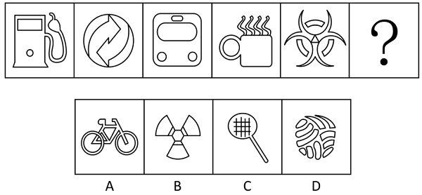

- **A**. A　✅
- **B**. B
- **C**. C
- **D**. D

**答案**：A

**官方解析**

元素组成不同，且无明显属性规律，考虑数量规律。题干均为封闭区域明显的生活化图形，考虑数面数量，面数量依次为3、4、5、6、7，故？处图形的面数量应为8，只有A项符合。
故正确答案为A。

---

### 第 14 题　qid 12100997 · 图形推理

请从四个选项中选出最恰当的一项填入问号处，使题干图形呈现一定的规律性。

- **A**. A
- **B**. B　✅
- **C**. C
- **D**. D

**答案**：B

**官方解析**

元素组成不同，且属性规律无答案，考虑数量规律。观察发现，题干图形中的曲线和直线均有明显相交，考虑曲直交点数。题干图形的曲直交点数均为1，故？处应选择有1个曲直交点的图形，只有B项符合。
故正确答案为B。

---

### 第 15 题　qid 12100996 · 图形推理

请从四个选项中选出最恰当的一项填入问号处，使题干图形呈现一定的规律性。

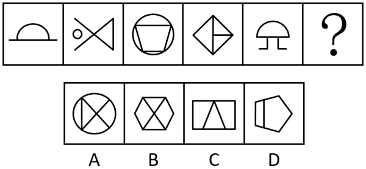

- **A**. A
- **B**. B
- **C**. C
- **D**. D　✅

**答案**：D

**官方解析**

元素组成不同，优先考虑属性规律。观察发现，题干图形出现明显等腰元素，优先考虑对称性。题干图形均只有一条对称轴，且对称轴方向依次为竖向、横向、竖向、横向、竖向，故“？”处图形应只有一条对称轴，且为横向，排除B、C两项；继续观察发现，题干图形线条交叉明显，考虑交点数，题干图形的交点数依次为2、3、4、5、6，故“？”处图形的交点数应为7，只有D项符合。
故正确答案为D。

---

### 第 16 题　qid 11367773 · 图形推理

请从四个选项中选出最恰当的一项填入问号处，使题干图形呈现一定的规律性。

- **A**. A
- **B**. B
- **C**. C　✅
- **D**. D

**答案**：C

**官方解析**

元素组成不同，且无明显属性规律，考虑数量规律。观察发现，题干出现多个 “日”字变形图，考虑笔画数。题干图形均为一笔画图形，？处应用规律，排除A、B两项；继续观察发现，题干每幅图形均存在两个三角形面，故？处应选一个存在两个三角形面的图形，只有C项符合。
故正确答案为C。

---

### 第 17 题　qid 12101004 · 图形推理

请从四个选项中选出最恰当的一项填入问号处，使题干图形呈现一定的规律性。

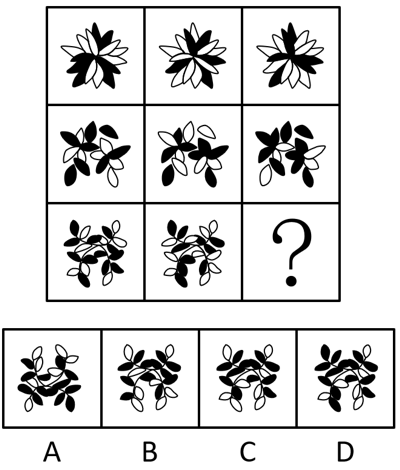

- **A**. A
- **B**. B
- **C**. C　✅
- **D**. D

**答案**：C

**官方解析**

元素组成相似，优先考虑样式规律。观察发现，题干图形轮廓和分割区域相同，考虑黑白运算。九宫格优先看横行，第一行运算规律为：黑+白=黑，白+黑=黑，黑+黑=白，白+白=白；第二行经验证符合此规律；第三行应用此规律，只有C项符合。
故正确答案为C。

---

### 第 18 题　qid 12100998 · 图形推理

左边给定的图形是由右边哪些图形拼合（只可平移，不可旋转和翻转）而成的？

- **A**. ①②③④
- **B**. ①②③⑤　✅
- **C**. ②③④⑤
- **D**. ①③④⑤

**答案**：B

**官方解析**

本题考查平面拼合，可采用平行且等长相消的方式解题。左边给定的图形是由右边①②③⑤拼合而成的。平行且等长相消的方式如下图所示：

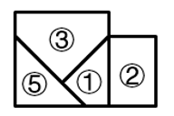

故正确答案为B。

---

### 第 19 题　qid 12101015 · 类比推理

上边四张纸片，每张纸片一面是黑色，另一面是白色，下边仅有一项能由它们拼合（可以平移、旋转、翻转）而成，请把它找出来。

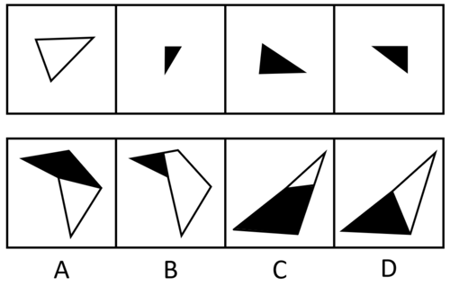 

- **A**. A　✅
- **B**. B
- **C**. C
- **D**. D

**答案**：A

**官方解析**

本题考查平面拼合，可以平移、旋转、翻转，且每张纸片一面是黑色，另一面是白色，需要考虑翻转后的颜色变化。将题干图形标上序号，如下图所示，逐一进行分析。

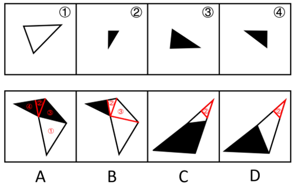

A项：可以由题干图形拼合而成，拼合方式如图所示，当选；

B项：右上角的两个三角形是由图②和图③旋转后平移过去的，颜色都应该是黑色，而选项是白色，排除；

C项：右上角的三角形是图②，颜色无误，但其下方的白块与题干图形的形状均不相同，无法由题干图形拼合而成，排除；

D项：右上角的三角形是图②，颜色无误，但其下方的白块无法由题干图形拼合而成，排除。

故正确答案为A。

---

### 第 20 题　qid 12101006 · 图形推理

左边给定的是六面体的外表面展开图，右边哪一项能由它折叠而成?

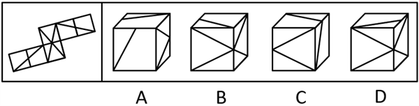

- **A**. A
- **B**. B
- **C**. C　✅
- **D**. D

**答案**：C

**官方解析**

将题干展开图标上序号，如下图所示，逐一进行分析。

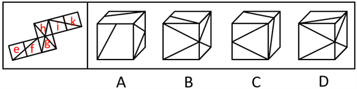

A项：选项的正面和顶面来自面e、面f、面i、面k，题干展开图中面e、面f、面i、面k任意面中的线条均与另一个面中的线条相交于公共边的中点，而选项中正面中的线条与顶面中的线条不相交，选项与题干展开图不一致，排除；

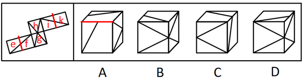

B项：选项一定有面g与面h，且选项中三个面的公共点挨着顶面中的线条，故选项由面f、面g与面h构成。题干展开图中面g中的直角三角形挨着面f中的直角梯形，而选项中面g中的直角三角形挨着面f中的直角三角形，选项与题干展开图不一致，排除；

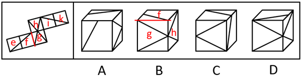

C项：选项由面g、面i与面k构成，选项与题干展开图一致，当选；

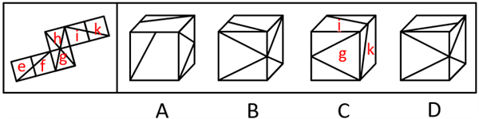

D项：选项一定有面g与面h，且选项中三个面的公共点不挨着顶面中的线条，故选项由面g、面h与面i构成。题干展开图中这三个面的公共点挨着面i中的直角梯形，而选项中这三个面的公共点挨着面i中的直角三角形，选项与题干展开图不一致，排除。

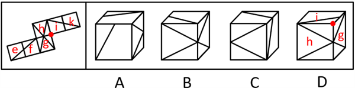

故正确答案为C。

---

### 第 21 题　qid 12101001 · 图形推理

左边给定的是六面体的外表面展开图，右边哪一项能由它折叠而成？

- **A**. A
- **B**. B　✅
- **C**. C
- **D**. D

**答案**：B

**官方解析**

本题考查六面体。将展开图中右下角的面移动，并给每个面标号，如下图所示，逐一进行分析。

A项：选项一定有面i和面f，右面为面e或面k，展开图中面f和面k为相对面，无法同时出现，故右面为面e。展开图中面e、面f和面i的公共点引出一条线，而选项中三个面的公共点引出两条线，选项与题干展开图不一致，排除；

B项：选项由面e、面g与面k构成，选项与题干展开图一致，当选；

C项：选项一定有面h和面i，展开图中面h与面i的公共边挨着面h中的两条线，而选项中两个面的公共边只挨着面h中的一条线，选项与题干展开图不一致，排除；

D项：选项由面f、面h和面i构成，展开图中三个面的公共点引出两条线，而选项中三个面的公共点只引出一条线，选项与题干展开图不一致，排除。

故正确答案为B。

---

### 第 22 题　qid 11367788 · 图形推理

下面4个立体图形均由大小相同的8个白色小立方体和4个灰色小立方体堆叠而成，其中一个立体图形的某一视图可能是由纯白小方格组成的，请把它找出来。

- **A**. A
- **B**. B
- **C**. C
- **D**. D　✅

**答案**：D

**官方解析**

本题考查三视图。A、B、C三项中的立体图形不可能某一视图由纯白小方格组成，排除。D项中，立体图形的正面能看到7个白色小立方体和3个灰色小立方体，所以其背面应还有1个白色小立方体和1个灰色小立方体。如下图所示，当灰色小立方体在最下层摆放，白色小立方体摆放在该灰色小立方体的上方时，其俯视图由纯白小方格组成。

故正确答案为D。

---

### 第 23 题　qid 11367777 · 逻辑判断

只有为了人民的现代化，才有意义；只有依靠人民的现代化，才有动力。新时代以来，我们坚持民生为大，书写了经济快速发展和社会长期稳定两大奇迹新篇章。只要坚持一切为了人民、一切依靠人民，就能充分调动广大人民的积极性。
根据以上信息，可以推出以下哪项？

- **A**. 不是为了人民的现代化，就是没有意义的现代化　✅
- **B**. 不坚持民生为大，就不能创造经济快速发展和社会长期稳定两大奇迹
- **C**. 如果没能调动广大人民的积极性，则没有坚持一切为了人民
- **D**. 只有坚持一切依靠人民，才能充分调动广大人民的积极性

**答案**：A

**官方解析**

第一步：翻译题干。

①现代化有意义为了人民的现代化；

②现代化有动力依靠人民的现代化；

③坚持一切为了人民 且 坚持一切依靠人民充分调动广大人民的积极性。

第二步：逐一分析选项。

A项：翻译为“为了人民的现代化现代化有意义”，是对①的否后，否后必否前，可以推出，当选；

B项：翻译为“坚持民生为大创造经济快速发展和社会长期稳定两大奇迹”，二者不存在逻辑关系，无法推出，排除；

C项：翻译为“调动广大人民的积极性坚持一切为了人民”，是对③的否后，否后必否前，即“充分调动广大人民的积极性坚持一切为了人民 或 坚持一切依靠人民”，无法得出“坚持一切为了人民”一定为真，无法推出，排除；

D项：翻译为“充分调动广大人民的积极性坚持一切依靠人民”，是对③的肯后，但肯后得不到确定性的结论，无法推出，排除。

故正确答案为A。

---

### 第 24 题　qid 11367772 · 逻辑判断

“露从今夜白，月是故乡明。”唐代诗人杜甫这一千古名句表达了诗人在秋天对故乡的思念和对亲人的牵挂。在国人心中，秋天总是和思乡联系在一起。对此，有学者称，相对于其他季节，秋天人们很容易想起家乡的种种美好，更容易产生思乡情绪。
以下哪项如果为真，最能支持上述学者的观点？

- **A**. 秋天大自然由生机勃勃转向秋风萧瑟，让人感受到时间的流逝和生命的脆弱
- **B**. 秋天正是收获的时节，那些从小经历的美好场景深深刻在每个人的心底　✅
- **C**. 中国历史上有无数文人骚客在秋天写下思乡的千古名篇，影响着一代又一代国人
- **D**. 每逢中秋，在外漂泊的游子会意识到已经离家很久，渴望和家人团聚

**答案**：B

**官方解析**

第一步：找出论点和论据。
论点：相对于其他季节，秋天人们很容易想起家乡的种种美好，更容易产生思乡情绪。
论据：无。
本题只有论点，没有论据，加强优先考虑补充论据。
第二步：逐一分析选项。
A项：该项指出秋天让人感受到“时间的流逝和生命的脆弱”，但并未说明此种感受是否会引发“思乡情绪”，话题不一致，无法加强，排除；
B项：该项指出秋天正是收获的时节，那些“从小经历的美好场景”深深刻在每个人的心底，解释了为什么秋天容易让人们想起“家乡的种种美好”，更容易让人们产生“思乡情绪”，补充论据，可以加强，保留；
C项：该项指出国人思乡是因为受到文人骚客写下的关于思乡的千古名篇的影响，解释了一代又一代国人思乡的原因，补充论据，可以加强，保留；
D项：该项指出“中秋”会触发游子的“思乡情绪”，“中秋”是秋天的一个节日，无法判断是节日还是秋天这个季节容易让人们产生思乡情绪，为不明确项，无法加强，排除。
对比B、C两项，B项解释了为什么每个人会发自心底的产生思乡之情，而C项只是在说思乡是受到了文人骚客的影响，但是发自心底的原因比他人带来的影响更为关键，因此B项加强力度更强。
故正确答案为B。

---

### 第 25 题　qid 12101007 · 类比推理

有些作家不用电脑写作，所有作家都不喜欢喧嚣。所以，有些用电脑写作的人喜欢喧嚣。
以下哪项与上述推理的结构和错误最为相似？

- **A**. 有些医生热爱运动，所有医生都不想损害健康。所以，有些不热爱运动的人不想损害健康
- **B**. 有些中年人不爱喝咖啡，所有中年人都不愿意频繁更换手机。所以，有些爱喝咖啡的人愿意频繁更换手机　✅
- **C**. 有些世界文学名著没有汉译本，所有世界文学名著都不是脱离现实的作品。所以，有些没有脱离现实的作品没有汉译本
- **D**. 有些网球运动员不是职业运动员，所有网球运动员都想获得冠军。所以，有些职业运动员想获得冠军

**答案**：B

**官方解析**

第一步：分析题干推理形式。

题干推理形式为：有些a（作家）非b（用电脑写作），所有a（作家）非c（喜欢喧嚣）。所以，有些b（用电脑写作）c（喜欢喧嚣）。

第二步：逐一分析选项。

A项：推理形式为：有些a（医生）b（热爱运动），所有a（医生）非c（损害健康）。所以，有些非b（热爱运动）非c（损害健康），与题干推理结构不同，排除；

B项：推理形式为：有些a（中年人）非b（爱喝咖啡），所有a（中年人）非c（愿意频繁更换手机）。所以，有些b（爱喝咖啡）c（愿意频繁更换手机），与题干推理结构相同，当选；

C项：推理形式为：有些a（世界文学名著）非b（有汉译本），所有a（世界文学名著）非c（脱离现实的作品）。所以，有些非c（脱离现实的作品）非b（有汉译本），与题干推理结构不同，排除；

D项：推理形式为：有些a（网球运动员）非b（职业运动员），所有a（网球运动员）c（想获得冠军）。所以，有些b（职业运动员）c（想获得冠军）”，与题干推理结构不同，排除。

故正确答案为B。

---

### 第 26 题　qid 12101000 · 逻辑判断

某品牌奶茶十年前以黑糖珍珠奶茶为招牌，赢得年轻顾客的青睐，在众多茶饮品牌中挣得相当大的市场份额。近年来，随着门店不断扩张，营收也不断增长，但是其招牌黑糖珍珠奶茶的销量却下降了。
以下除哪项外，均能解释上述现象？

- **A**. 该品牌的黑糖珍珠奶茶十年来未更新配方，味道没有变化　✅
- **B**. 黑糖珍珠奶茶现在已不是一款新颖且受到消费者欢迎的产品
- **C**. 由于熬制黑糖珍珠的人工成本增加，商家提高了这一产品的价格
- **D**. 近几年茶饮市场火爆，大多数品牌都推出了自己的黑糖珍珠奶茶

**答案**：A

**官方解析**

第一步：找出题干矛盾。
某品牌奶茶门店不断扩张，营收不断增长，但是其招牌黑糖珍珠奶茶的销量却下降了。
第二步：逐一分析选项。
A项：该项指出该品牌的黑糖珍珠奶茶十年来味道未变，但味道喜好因人而异，不确定现在消费者是否喜爱该口味，无法解释为何门店不断扩张、营收不断增长，但其招牌黑糖珍珠奶茶的销量却下降，无法解释题干矛盾，当选；
B项：该项指出黑糖珍珠奶茶现在不再新颖且不再受消费者欢迎，这会导致该品牌的黑糖珍珠奶茶销量下降，而门店不断扩张会带来其他产品营收的增长，从而整体营收依然增长，可以解释题干矛盾，排除；
C项：该项指出商家提高了黑糖珍珠奶茶的价格，这会导致该品牌的黑糖珍珠奶茶销量下降，而门店不断扩张会带来其他产品营收的增长，从而整体营收依然增长，可以解释题干矛盾，排除；
D项：该项指出大多数品牌都推出了自己的黑糖珍珠奶茶，市场竞争会更加激烈，这会导致该品牌的黑糖珍珠奶茶销量下降，而门店不断扩张会带来其他产品营收的增长，从而整体营收依然增长，可以解释题干矛盾，排除。
本题为选非题，故正确答案为A。

---

### 第 27 题　qid 11367774 · 逻辑判断

甲、乙、丙三人毕业后同时进入某单位实习，由于表现较好，实习结束后他们将分到人事处、财务处、办公室正式入职。有人对他们各自的工作部门进行了如下猜测：
（1）甲入职的部门是人事处；
（2）乙入职的部门不是财务处；
（3）丙入职的部门不是人事处。
实际上，上述三个猜测只有一个是对的。
根据上述信息，可以推出甲、乙、丙入职的部门依次为：

- **A**. 人事处 财务处 办公室
- **B**. 办公室 财务处 人事处
- **C**. 财务处 办公室 人事处　✅
- **D**. 人事处 办公室 财务处

**答案**：C

**官方解析**

第一步：分析题干条件。
（1）甲入职的部门是人事处；
（2）乙入职的部门不是财务处；
（3）丙入职的部门不是人事处；
（4）三个猜测只有一个是对的。
题干条件没有矛盾关系，也没有反对关系，考虑题干假设或选项代入，选项信息充分，优先考虑代入法。
第二步：逐一代入选项。
代入A项：条件（1）为真，条件（2）为假，条件（3）为真，有两个猜测为真，与条件（4）矛盾，排除；
代入B项：条件（1）为假，条件（2）为假，条件（3）为假，三个猜测均为假，与条件（4）矛盾，排除；
代入C项：条件（1）为假，条件（2）为真，条件（3）为假，只有一个猜测为真，符合条件（4），当选；
代入D项：条件（1）为真，条件（2）为真，条件（3）为真，三个猜测均为真，与条件（4）矛盾，排除。
故正确答案为C。

---

### 第 28 题　qid 12101003 · 逻辑判断

地名是一个社会的基本公共信息，是自然地理、生产生活、历史文化的重要载体，在经济社会发展中发挥着基础性作用。民政部印发通知，提出以乡村地名采集上图标注为牵引，全面推进乡村地名命名管理、地名标志设置维护。对此，有专家称这一举措有助于传承中华民族悠久的历史文化。
以下哪项如果为真，最能支持上述专家的论断？

- **A**. 地名作为一种蕴含丰富价值的资源，融入了人们的价值取向、文化思想观念等内容
- **B**. 地名属于专有名词，每个地名都有对应的读音和含义，体现了人们对美好生活的期盼
- **C**. 地名是人类历史“活化石”，在中华民族千百年的传承中被赋予更多含义，成为中华文明的独特载体　✅
- **D**. 一些地方存在着地名不规范的现象，给基层治理、公共服务以及人们的生产生活带来诸多困扰

**答案**：C

**官方解析**

第一步：找出论点和论据。
论点：这一举措（以乡村地名采集上图标注为牵引，全面推进乡村地名命名管理、地名标志设置维护）有助于传承中华民族悠久的历史文化。
论据：无。
本题只有论点，没有论据，加强优先考虑补充论据。
第二步：逐一分析选项。
A项：该项指出地名融入了人们的价值取向、文化思想观念等内容，人们的价值取向、文化思想观念等内容是中华民族历史文化的具体体现，补充论据，可以加强，保留；
B项：该项指出每个地名都有对应的读音和含义，体现了人们对美好生活的期盼，但无法证明地名命名管理是否有助于传承中华民族悠久的历史文化，无法加强，排除；
C项：该项指出地名在中华民族千百年的传承中被赋予更多含义，成为中华文明的独特载体，解释了为什么地名命名管理有助于传承中华民族悠久的历史文化，补充论据，可以加强，保留；
D项：该项指出一些地方存在着地名不规范的现象以及由此带来的困扰，而论点说的是地名命名管理有助于传承中华民族悠久的历史文化，话题不一致，无法加强，排除。
对比A、C两项，题干论点的关键词为“有助于传承中华民族悠久的历史文化”，A项说的是具体体现即“人们的价值取向、文化思想观念等内容”，而C项指出“地名在中华民族千百年的传承中被赋予更多含义”，C项表述的范围比A项更大、更全面，C项当选。
故正确答案为C。

---

### 第 29 题　qid 11367786 · 逻辑判断

海草是由陆地植物演化到适应海洋环境的高等植物。一种或几种海草连片生长，共同形成广袤柔软的“海草床”。海草床是最高效的碳捕获和碳封存系统之一，贮存碳的效率比森林高90倍，碳封存时间可达上千年。然而海草床是脆弱的生态系统，受自然环境变化和人类活动影响较大，全球范围内海草床正面临严峻退化趋势。基于如上原因，有专家建议，亟需开展“海底种草”生态修复工作，加强对海草床的保护。
以下哪项如果为真，最能支持上述专家的建议？

- **A**. 当前全球气候变暖日益加剧，科学家已发现人类生产生活排放的碳化合物是变暖的主要元凶　✅
- **B**. 海草床可以通过光合作用吸收环境中的无机碳，将其高效地固定、转化为有机碳并进行积累
- **C**. 有些地方海岸线侵蚀严重，加强海草床保护和修复，能有效防止或减缓海滩和海岸遭受侵蚀
- **D**. 海草床具有水质净化和调控功能，能吸收水体中的营养盐和重金属，降低海水悬浮物的浓度

**答案**：A

**官方解析**

第一步：找出论点和论据。
论点：亟需开展“海底种草”生态修复工作，加强对海草床的保护。
论据：海草床是最高效的碳捕获和碳封存系统之一，贮存碳的效率比森林高90倍，碳封存时间可达上千年。然而海草床是脆弱的生态系统，受自然环境变化和人类活动影响较大，全球范围内海草床正面临严峻退化趋势。
本题论点说的是亟需修复和保护海草床，论据说的是海草床是最高效的碳捕获和碳封存系统之一，但正面临严峻退化趋势，二者话题基本一致，加强优先考虑补充论据。
第二步：逐一分析选项。
A项：该项说的是全球气候变暖日益加剧，而其主要元凶是人类生产生活排放的碳化合物，那么固碳就显得尤为重要，而海草床可以固碳，故应亟需开展“海底种草”生态修复工作，该项指出目前碳排放问题较严重是填补了论据推出论点过程中的漏洞，补充论据，保留；
B项：该项说的是海草床可以将无机碳高效地固定、转化为有机碳并进行积累，说明海草床贮存碳的效率较高，是对论据的重复，可以加强，保留；
C项：该项说有些地方海岸线侵蚀严重，加强海草床保护和修复，能有效防止或减缓海滩和海岸遭受侵蚀，但未提及其与碳化合物的关系，话题不一致，无法加强，排除；
D项：该项说的是海草床具有水质净化和调控功能，但没有体现这些功能对碳化合物的作用，无法证明“亟需”修复和保护海草床，无法加强，排除。
对比A、B两项，A项填补了论据推出论点过程中的漏洞，而B项只是重复论据，因此A项的加强力度更强。
故正确答案为A。

---

### 第 30 题　qid 11367793 · 逻辑判断

一直以来，患者在初诊后第二天拿着检查报告找医生复诊时需要再挂号，这大大增加患者的就医负担。针对这一情况，某医院开始实施“一次挂号管三天”的做法，让当天不能完成检查或不能领取检查报告的患者，在三天内可携带报告到同一科室复诊，无需再次挂号。对此，有初诊患者担心，医院此举会延长他们的等待时间，挤压他们的就诊机会。
以下哪项如果为真，最能说明上述患者的担心是不必要的？

- **A**. 该做法实施后，医院将根据医生的接诊情况，合理安排初诊患者与复诊患者的接诊次序，尽量避免出现长时间排队现象　✅
- **B**. 无论是否需要再次挂号，患者都会去同一科室进行复诊，该做法的实施不会导致科室接诊的患者明显增多
- **C**. 该做法实施前，医生也会接待手持检查报告的复诊患者，但他们需要重新挂号，与初诊患者一起按挂号次序就诊
- **D**. 该做法实施后，患者可在挂号三天有效期内从容完成检查、治疗等就医环节，保障诊治的连续性和有效性

**答案**：A

**官方解析**

第一步：找出论点和论据。
论点：有初诊患者担心，医院此举（实施“一次挂号管三天”的做法）会延长他们的等待时间，挤压他们的就诊机会。
论据：无。
本题只有论点，没有论据，削弱优先考虑削弱论点。
第二步：逐一分析选项。
A项：该项说的是该做法实施后医院将根据情况合理安排初诊患者与复诊患者的接诊次序，这样就可以尽量避免出现长时间排队现象，不会延长初诊患者的等待时间，说明了他们的担心是不必要的，削弱论点，当选；
B项：该项说的是该做法不会导致科室接诊的患者明显增多，但在患者数量不增加的情况下，初诊患者与复诊患者的排队次序和等待时间不明确，复诊患者的就诊次序可能都排在初诊患者之前，仍然会延长初诊患者的等待时间，不能证明他们的担心是不必要的，无法削弱，排除；
C项：该项说的是该做法实施前的情况，无法判断实施后是否会延长初诊患者的等待时间，无法削弱，排除；
D项：该项说的是该做法对患者的好处，但与初诊患者等待时间和就诊机会无关，话题不一致，无法削弱，排除。
故正确答案为A。

---

### 第 31 题　qid 11367787 · 逻辑判断

对某项调查的“同意”票进行计数，甲、乙、丙、丁四人给出的结果分别是：9472、9496、9480、9502张。四人计数结果不一致后重新计数，发现有三人分别少计了17张、少计了9张、多计了13张，还有一人仅粗略估计出一个票数。
根据上述信息，可以推出粗略估计票数的人是：

- **A**. 甲
- **B**. 乙　✅
- **C**. 丙
- **D**. 丁

**答案**：B

**官方解析**

第一步：分析题干条件。
（1）甲9472、乙9496、丙9480、丁9502；
（2）1个人少计了17张；
（3）1个人少计了9张；
（4）1个人多计了13张；
（5）1个人仅粗略估计出一个票数。
第二步：根据题干条件进行推理。
根据条件（1）（2）可以推出四个人中数量最少的人少计了17张，即甲9472少计了17张，那正确票数应为9472+17=9489，排除A项；
结合条件（1）（3）可以推出丙9480少计了9张，排除C项；
结合条件（1）（4）可以推出票数最多的丁9502多计了13张，排除D项。
综上，乙9496是仅粗略估计出的一个票数，B项当选。
故正确答案为B。

---

### 第 32 题　qid 12101005 · 逻辑判断

某单位员工参加了光明区组织的一些活动。已知：
（1）所有不参加敬老院义工活动的员工都没参加运动会；
（2）所有参加读书会的员工都没有参加敬老院义工活动；
（3）员工张梅参加了敬老院义工活动，也参加了知识竞赛。
根据上述信息，可以推出以下哪项?

- **A**. 没有员工参加运动会
- **B**. 张梅没有参加运动会
- **C**. 参加读书会的员工没参加运动会　✅
- **D**. 有员工参加了读书会和知识竞赛

**答案**：C

**官方解析**

第一步：翻译题干。

（1）参加敬老院义工活动参加运动会；

（2）参加读书会参加敬老院义工活动；

（3）张梅参加了敬老院义工活动 且 参加了知识竞赛。

将（1）（2）串联可得：（4）参加读书会参加敬老院义工活动参加运动会。

第二步：逐一分析选项。

A项：该项为“没有员工参加运动会”，题干没有所有员工是否参加运动会的表述，无法推出，排除；

B项：该项为“张梅没有参加运动会”，条件（3）中“张梅参加敬老院义工活动”是对条件（1）的否前，否前无法推出确定性结论，是对条件（2）的否后，可以推出张梅没有参加读书会，均无法推出“张梅没有参加运动会”，无法推出，排除；

C项：翻译为“参加读书会参加运动会”，“参加读书会”是对条件（4）的肯前，肯前必肯后，可以推出“参加运动会”，当选；

D项：翻译为“有的员工参加读书会 且 参加知识竞赛”，根据条件（3）“张梅参加了知识竞赛”可以推出“有的员工参加了知识竞赛”，但无法推出参加了知识竞赛的人也同时参加了读书会，无法推出，排除。

故正确答案为C。

---

### 第 33 题　qid 12101008 · 逻辑判断

近年来，AI在世界范围内掀起一波接一波的热潮，它的颠覆性应用让许多行业受益。然而，今年4月发布的一份研究报告显示，近一年来，经济与企业类AI谣言量增速达99.91%。某权威调查机构称，生成虚假文章的网站数量自2023年5月以来激增1000%以上，涉及15种语言。据此，有专家预测，如果任由这种情况发展下去，AI输出内容的质量会呈现断崖式下降。
以下哪项如果为真，最能支持上述专家的预测？

- **A**. AI输出的内容虽然形式上非常合理，但是一旦深入分析，就会发现很多地方站不住脚
- **B**. 缺乏批判性思维的情况下，AI可能让人陷入认知幻觉，扭曲公众对现实和科学共识的集体理解
- **C**. AI生成的大量虚假、垃圾内容会源源不断地回流互联网，“污染”训练AI模型的数据　✅
- **D**. AI生成、伪造或篡改文本、图片、音频和视频的现象越来越普遍，产生了大量信息垃圾

**答案**：C

**官方解析**

第一步：找出论点和论据。
论点：如果任由这种情况发展下去，AI输出内容的质量会呈现断崖式下降。
论据：今年4月发布的一份研究报告显示，近一年来，经济与企业类AI谣言量增速达99.91%。某权威调查机构称，生成虚假文章的网站数量自2023年5月以来激增1000%以上，涉及15种语言。
本题论据和论点都在讨论AI输出质量的情况，话题一致，加强优先考虑补充论据。
第二步：逐一分析选项。
A项：该项指出AI输出的内容深入分析后就会发现很多地方站不住脚，说的是AI输出的内容存在问题，但没有提及“AI谣言、虚假信息”对“AI输出内容的质量”的影响，话题不一致，无法加强，排除；
B项：该项指出AI可能对人产生的负面影响，但没有提及“AI谣言、虚假信息”对“AI输出内容的质量”的影响，话题不一致，无法加强，排除；
C项：该项指出AI生成的大量虚假、垃圾内容会源源不断地回流互联网，“污染”训练AI模型的数据，进而导致AI输出内容的质量变差，补充论据，可以加强，当选；
D项：该项指出AI生成、伪造或篡改文本、图片、音频和视频的现象越来越普遍，产生了大量信息垃圾，属于重复论据，没有提及“AI输出内容的质量断崖式下降”，无法加强，排除。
故正确答案为C。

---

### 第 34 题　qid 12101013 · 逻辑判断

滨海大学选派小赵、小钱、小孙、小李、小周组成辩论队，参加滨海市组织的大学生辩论赛。已知：
（1）如果小赵是哲学专业的，那么小周就不是经济学专业的；
（2）或者小钱是法医专业的，或者小赵是哲学专业的；
（3）小李和小孙至少有一人是计算机专业的；
（4）如果小孙是计算机专业的，那么小钱不是法医专业的。
增加以下哪项作为前提，可以推出“小李是计算机专业的”？

- **A**. 小钱不是法医专业的
- **B**. 小孙是计算机专业的
- **C**. 小赵是哲学专业的
- **D**. 小周是经济学专业的　✅

**答案**：D

**官方解析**

第一步：翻译题干。

①小赵哲学小周经济学；

②小钱法医 或 小赵哲学；

③小李计算机 或 小孙计算机；

④小孙计算机小钱法医。

第二步：根据题干条件进行推理。

提问为“推出‘小李是计算机专业的’”，本题给出了结论，需要从结论出发倒推条件。

根据条件③可知：想要推出“小李是计算机专业的”，根据“否一推一”，需要“小孙不是计算机专业的”成立；

根据条件④可知：想要推出“小孙不是计算机专业的”，根据“逆否等价”，需要“小钱是法医专业的”成立；

根据条件②可知：想要推出“小钱是法医专业的”，根据“否一推一”，需要“小赵不是哲学专业的”成立；

根据条件①可知：想要推出“小赵不是哲学专业的”，根据“逆否等价”，需要“小周是经济学专业的”成立，对应D项。

故正确答案为D。

---

### 第 35 题　qid 12101017 · 逻辑判断

在某校法学院的一次模拟竞赛中，冯明、范华、朱丽、赵刚、吴勇等5位同学参加模拟民事诉讼、刑事诉讼、行政诉讼和劳动争议仲裁4项比赛，每位同学参加1项比赛，每项比赛都有1-2位同学参加。已知：
（1）如果冯明和朱丽之中至少有1位同学参加模拟劳动争议仲裁，那么范华参加模拟民事诉讼，而赵刚参加模拟劳动争议仲裁；
（2）如果范华和赵刚之中至少有1位同学参加模拟劳动争议仲裁，那么朱丽和吴勇都参加模拟民事诉讼。
若吴勇未参加模拟劳动争议仲裁，则可以推出以下哪项?

- **A**. 范华参加模拟行政诉讼
- **B**. 赵刚参加模拟刑事诉讼
- **C**. 冯明参加模拟劳动争议仲裁
- **D**. 朱丽参加模拟民事诉讼　✅

**答案**：D

**官方解析**

第一步：分析题干条件。

（1）冯明劳动争议仲裁 或 朱丽劳动争议仲裁范华民事诉讼 且 赵刚劳动争议仲裁；

（2）范华劳动争议仲裁 或 赵刚劳动争议仲裁朱丽民事诉讼 且 吴勇民事诉讼；

（3）5位同学每位同学参加1项比赛，4项比赛每项比赛都有1-2位同学参加，即仅有1项比赛有2位同学参加；

（4）吴勇劳动争议仲裁。

第二步：根据题干条件进行推理。

根据条件（3）、（4）可知，吴勇未参加模拟劳动争议仲裁，则参加模拟劳动争议仲裁的是冯明、范华、朱丽、赵刚中的1-2人。

假设冯明或朱丽参加模拟劳动争议仲裁，根据条件（1）可以推出，范华参加模拟民事诉讼，赵刚参加模拟劳动争议仲裁；再根据条件（2）以及赵刚参加模拟劳动争议仲裁，可以推出朱丽和吴勇都参加模拟民事诉讼，此时参加模拟民事诉讼的有3人，与条件（3）矛盾，故假设不成立，即冯明和朱丽都没有参加模拟劳动争议仲裁，那么参加模拟劳动争议仲裁的是范华或赵刚，再根据条件（2）可以推出朱丽和吴勇都参加模拟民事诉讼，D项为真，当选。

故正确答案为D。

---

### 第 36 题　qid 11367806 · 定义判断

多元共治：指针对社会运行中的复杂问题，由政府、社会组织、公民等主体共同参与，多方合作的社会治理模式。
下列属于多元共治的是：

- **A**. 针对辖区内河道持续多年的污染问题，某县水利、环保等部门成立联合工作小组，决心打赢河道污染治理的攻坚战
- **B**. 针对居民停车位、充电桩严重不足的问题，某街道统筹规划电动自行车停放充电区域，优化地下非机动车库安全设施，消除电动自行车“上楼入户”的隐患
- **C**. 某区政府在老旧小区改造、公共服务等社区工作中，鼓励业委会、志愿者充分发挥各自作用，遇到问题加强沟通，满足居民的合理诉求　✅
- **D**. 某村两面临山，农林交错，靠近交通要道，火灾防治压力巨大。村民自发组织巡查队，检测上报森林火情，有效遏制了火灾多发的势头

**答案**：C

**官方解析**

第一步：找出定义关键词。
“政府、社会组织、公民等主体共同参与”、“多方合作的社会治理模式”。
第二步：逐一分析选项。
A项：某县水利、环保等部门联合治理河道污染，不涉及社会组织和公民等主体，不符合“政府、社会组织、公民等主体共同参与”，不符合定义，排除；
B项：某街道统筹规划电动自行车停放充电区域，优化地下非机动车库安全设施，不涉及社会组织和公民等主体，不符合“政府、社会组织、公民等主体共同参与”、“多方合作的社会治理模式”，不符合定义，排除；
C项：某区政府在社区工作中，鼓励业委会、志愿者充分发挥各自作用，符合“政府、社会组织、公民等主体共同参与”、“多方合作的社会治理模式”，符合定义，当选；
D项：村民自发组织巡查队，检测上报森林火情，不涉及政府等主体，不符合“政府、社会组织、公民等主体共同参与”、“多方合作的社会治理模式”，不符合定义，排除。
故正确答案为C。

---

### 第 37 题　qid 12101016 · 定义判断

预期管理：指政府部门通过发布会、社交媒体等方式，与社会公众进行互动性交流，以提高政策接受度，塑造稳定的运行环境，确保预期目标实现的管理方式。
下列属于预期管理的是：

- **A**. 进入冬季后，市生态环境局每天通过电视台实时发布空气质量监测数据，市民出门前都会随时收看
- **B**. 县文旅局为了促进旅游业发展，制作了上百个短视频，在多个社交平台上宣传当地的美景和特色文化
- **C**. 针对野猪频繁出没危害居民生命财产安全的事件，区农业农村局出台了补偿规定，并在听证会上答复了广大市民的提问　✅
- **D**. 某电商平台公布了平台补贴与政府“以旧换新”补贴叠加使用的申领方案，收到网民提出的各种建议后，又进行了多处修改

**答案**：C

**官方解析**

第一步：找出定义关键词。
“政府部门”、“通过发布会、社交媒体等方式”、“与社会公众进行互动性交流”、“提高政策接受度，塑造稳定的运行环境，确保预期目标实现”。
第二步：逐一分析选项。
A项：市生态环境局通过电视台发布空气质量监测数据，只是市生态环境局发布信息的方式，并未体现与社会公众的互动性交流，不符合“与社会公众进行互动性交流”，不符合定义，排除；
B项：县文旅局制作了上百个短视频，在多个社交平台上宣传当地的美景和特色文化，未体现与社会公众的互动性交流，不符合“与社会公众进行互动性交流”，不符合定义，排除；
C项：区农业农村局针对野猪危害居民生命财产安全的事件出台了补偿规定，并在听证会上答复了广大市民的提问，符合“政府部门”、“通过发布会、社交媒体等方式”、“与社会公众进行互动性交流”、“提高政策接受度，塑造稳定的运行环境，确保预期目标实现”，符合定义，当选；
D项：某电商平台公布了平台补贴及政府补贴的申领方案，但电商平台不属于政府部门，不符合“政府部门”，不符合定义，排除。
故正确答案为C。

---

### 第 38 题　qid 12101025 · 定义判断

达人探店：指网络博主为了打通商品与消费者的信息隔膜，以直播、视频等形式展示真实的产品体验和消费场景，并在网络平台上发布个人评价的行为。
下列属于达人探店的是：

- **A**. 高先生是网上小有名气的食评家，直播时常常让老板和大厨当场下不了台，被网友称为“六亲不认”，收获了大量粉丝，很多餐馆因此改进了菜品和服务　✅
- **B**. 某知名穿搭博主经常购买各品牌的当季新款时装，在各种社交媒体发布变装视频，其穿搭风格被一些网友模仿
- **C**. 健身教练石先生录制了健身教学网课，为提升课程销量，在社交平台上发布了包含大量学员体验及评价的推介视频
- **D**. 带爸妈外出游玩时，胡女士有时会对当地景点的适老性设施情况进行评价，拍摄成攻略短视频，被网民赞誉为史上最靠谱的老年旅游活地图

**答案**：A

**官方解析**

第一步：找出定义关键词。
“网络博主”、“为了打通商品与消费者的信息隔膜”、“以直播、视频等形式展示真实的产品体验和消费场景”、“在网络平台上发布个人评价”。
第二步：逐一分析选项。
A项：高先生是网上小有名气的食评家，符合“网络博主”、“在网络平台上发布个人评价”，他在直播时常常让老板和大厨当场下不了台，符合“以直播、视频等形式展示真实的产品体验和消费场景”，符合定义，当选；
B项：某知名穿搭博主经常购买各品牌的当季新款时装，并在各种社交媒体发布变装视频，这属于自身穿搭风格的展示，并非为了让消费者了解商品本身的情况，不符合“为了打通商品与消费者的信息隔膜”，不符合定义，排除；
C项：健身教练石先生在社交平台上发布包含大量学员体验及评价的推介视频是为了提升课程销量，不符合“为了打通商品与消费者的信息隔膜”，不符合定义，排除；
D项：带爸妈外出游玩时，胡女士会拍摄攻略短视频，并对当地景点的适老性设施情况进行评价，主要针对的是适老性设施而非景点本身，并非为了让消费者了解商品本身的情况，不符合“为了打通商品与消费者的信息隔膜”，不符合定义，排除。
故正确答案为A。

---

### 第 39 题　qid 12101018 · 定义判断

精神股东：指对特定企业或产品没有实际投资，也不追求实质性回报，却长期关注企业经营发展状况，为其成败感到骄傲或失落的客户群体。
下列属于精神股东的是：

- **A**. 乔先生五年前买入了某药企的股票后，三天两头登录该公司网站浏览企业发展的各种信息，每次看到企业的利好消息就会感到很开心
- **B**. 郑先生是一位太空探索迷，十多年来时刻关注着某公司的火星移民计划，收集了所有的火箭发射视频，哪怕看到一点点进展都会非常兴奋　✅
- **C**. 周女士喜欢某品牌手机，多年来一直关注、购买它的各种新产品，提出改进建议，最近该品牌又推出了一款十分先进的新手机，周女士逢人就夸
- **D**. 刘女士很早以前就关注了某景区推出的影视体验项目，打算国庆假期去游玩，但由于节日游客爆满，她没有买到票，最终无法成行，有些郁闷

**答案**：B

**官方解析**

第一步：找出定义关键词。
“对特定企业或产品没有实际投资，也不追求实质性回报”、“长期关注企业经营发展状况，为其成败感到骄傲或失落”。
第二步：逐一分析选项。
A项：乔先生五年前买入了某药企的股票，说明乔先生对该企业有实际投资，不符合“对特定企业或产品没有实际投资，也不追求实质性回报”，不符合定义，排除；
B项：郑先生“时刻关注”某公司的火星移民计划，只是关注，没有体现实际投资，符合“对特定企业或产品没有实际投资”，哪怕看到一点点进展都会非常兴奋，符合“长期关注企业经营发展状况，为其成败感到骄傲或失落”，符合定义，当选；
C项：周女士多年来一直关注、购买该品牌的各种新产品，对特定企业的产品有实际的消费与投资，不符合“对特定企业或产品没有实际投资”，不符合定义，排除；
D项：刘女士因想去游玩而关注了某景区推出的影视体验项目，并非是对企业经营发展状况的长期关注，不符合“长期关注企业经营发展状况，为其成败感到骄傲或失落”，不符合定义，排除。
故正确答案为B。

---

### 第 40 题　qid 11367798 · 定义判断

平台自我优待：指商业平台主体借助自身技术或数据优势地位，通过特定手段取得优惠待遇以获得竞争优势的行为。
下列不属于平台自我优待的是：

- **A**. 某电商平台利用从卖家经营过程中收集到的海量销售数据，优化了自家产品的推荐策略，并在平台搜索引擎中把它们排列在前面
- **B**. 某在线旅游平台在用户自行预订车票、门票时，默认搭售自己代理的旅游保险产品，却没有在显著位置提醒用户可以取消这项服务
- **C**. 某应用商店运营商对自家程序软件给了更高的评分星级，对第三方开发者则设置了更为严格的审核评级标准
- **D**. 某供水公司利用在区域供水市场的支配地位，要求用水单位必须邀请己方对供水工程进行勘察、施工和安装　✅

**答案**：D

**官方解析**

第一步：找出定义关键词。
“商业平台主体借助自身技术或数据优势地位”、“通过特定手段取得优惠待遇以获得竞争优势”。
第二步：逐一分析选项。
A项：相比其他卖家，该电商平台利用从卖家经营过程中收集到的海量销售数据，优化了自家产品的推荐策略，并在平台搜索引擎中把它们排列在前面，是借助自身技术和数据优势获得竞争优势，符合“商业平台主体借助自身技术或数据优势地位”、“通过特定手段取得优惠待遇以获得竞争优势”，符合定义，排除；
B项：相比其他的保险产品，该在线旅游平台默认搭售自己代理的旅游保险产品，却没有在显著位置提醒用户可以取消这项服务，是借助自身技术优势获得竞争优势，符合“商业平台主体借助自身技术或数据优势地位”、“通过特定手段取得优惠待遇以获得竞争优势”，符合定义，排除；
C项：该应用商店运营商对自家程序软件给了更高的评分星级，对第三方开发者则设置了更为严格的审核评级标准，是借助自身技术优势获得竞争优势，符合“商业平台主体借助自身技术或数据优势地位”、“通过特定手段取得优惠待遇以获得竞争优势”，符合定义，排除；
D项：该供水公司利用在区域供水市场的支配地位，要求用水单位必须邀请己方做事，是借助市场优势，不是借助自身技术或数据优势，不符合“商业平台主体借助自身技术或数据优势地位”，不符合定义，当选。
本题为选非题，故正确答案为D。

---

### 第 41 题　qid 11367800 · 定义判断

情感虹吸：指现实生活中难以得到心理慰藉的中老年人，在网络世界中因为受到情感诱导而盲目消费，导致个人钱财严重受损的现象。
下列属于情感虹吸的是：

- **A**. 在外地工作的朱先生发现母亲退休后将退休金的一大半都用于购买一种“三无”保健品，原来该产品的推销员几乎每周都会来陪母亲聊家常
- **B**. 酒店大厨赵先生在网络平台上免费教授烹饪知识，因其手艺精湛，说话幽默，嘴巴又甜，受到了无数妈妈级粉丝的喜爱，每天都能得到不少打赏
- **C**. 儿子考上大学后，刘女士每天晚上都会定时打开手机，在主播们的嘘寒问暖中感受一丝安慰，偶尔也为他们刷一些小礼物
- **D**. 独居的李奶奶每天都泡在“50后时光”直播间，为主播刷“火箭”“跑车”等礼物，成为了“榜一大哥”，两个月内花掉了多年的积蓄　✅

**答案**：D

**官方解析**

第一步：找出定义关键词。
“现实生活中难以得到心理慰藉的中老年人”、“在网络世界中”、“受到情感诱导而盲目消费”、“导致个人钱财严重受损”。
第二步：逐一分析选项。
A项：母亲退休后购买“三无”保健品，该产品的推销员几乎每周都会来陪母亲聊家常，没有体现利用“网络”，不符合“在网络世界中”，不符合定义，排除；
B项：赵先生每天都能得到不少来自妈妈级粉丝的打赏，但未提到这些妈妈级粉丝的钱财是否严重受损，不符合“导致个人钱财严重受损”，不符合定义，排除；
C项：刘女士每天晚上都会定时打开手机，偶尔为主播们刷一些小礼物，未提到刘女士的钱财是否严重受损，不符合“导致个人钱财严重受损”，不符合定义，排除；
D项：独居的李奶奶每天都泡在“50后时光”直播间，符合“现实生活中难以得到心理慰藉的中老年人”、“在网络世界中”，为主播刷礼物，两个月内花掉了多年的积蓄，符合“受到情感诱导而盲目消费”、“导致个人钱财严重受损”，符合定义，当选。
故正确答案为D。

---

### 第 42 题　qid 11367805 · 定义判断

正向情绪价值：指通过积极性的言语或行动，为他人带来舒服、愉悦、安全等良性感受的人际交往能力。
下列属于正向情绪价值的是：

- **A**. 林女士是一位经验丰富的住家月嫂，看到自己照护的孩子健康成长和新手父母们满意的笑容，她体会到了自己的价值
- **B**. 陈先生大学毕业后当过游戏主播、网络写手、保险推销员，不久前又在酒吧驻唱。父母很尊重他的选择，从不横加干涉
- **C**. 秦女士到时装店买衣服，刚一进门，几个营业员就围了上来，拼命夸她身材好，穿什么都好看。她虽然半信半疑，还是忍不住买了几件
- **D**. 赵先生是同事心目中的“显眼包”，每次聚会的时候，只要他一开口，大家就会笑得前仰后合，工作中的压力一扫而空　✅

**答案**：D

**官方解析**

第一步：找出定义关键词。
“通过积极性的言语或行动”、“为他人带来良性感受”、“人际交往能力”。
第二步：逐一分析选项。
A项：林女士是一位经验丰富的住家月嫂，她照护的孩子健康成长和新手父母们的满意说明林女士具备一定的专业能力，但没有体现“人际交往能力”，不符合定义，排除；
B项：陈先生大学毕业后做过多种工作，父母尊重他的选择而不加干涉，不符合“通过积极性的言语或行动”、“为他人带来良性感受”，不符合定义，排除；
C项：营业员拼命夸秦女士身材好，秦女士对此半信半疑，说明营业员的话没有给秦女士带来良性感受，不符合“为他人带来良性感受”，不符合定义，排除；
D项：赵先生在每次与同事的聚会中，都能让大家笑得前仰后合，工作压力一扫而空，体现了赵先生良好的人际交往能力，符合“通过积极性的言语或行动”、“为他人带来良性感受”、“人际交往能力”，符合定义，当选。
故正确答案为D。

---

### 第 43 题　qid 11367801 · 定义判断

零糖社交：有意降低社交期望值，在互动过程中保持距离感和独立性，尽量减轻双方的精神负担，使心情更加轻松愉悦的社交方式。
下列属于零糖社交的是：

- **A**. 吴女士和好友多年未见，平时只是逢年过节发条问候短信。前几天，得知她生病的消息后，好友立刻放下工作赶了过来
- **B**. 李先生经常周末约上三五个骑友到附近城市游玩，每次当天往返，所有费用AA制，虽然大家只知道彼此的微信昵称，却玩得非常开心　✅
- **C**. 小王每天晚上都要和自家的AI对话机器人闲聊半个多小时，就像交往多年亲密无间的好友，他很享受这样的交流，没有一点心理包袱
- **D**. 小赵工作很忙，日常生活中也是个“独行侠”。收到母校的校庆邀请后，他毫不犹豫就婉言谢绝了。因为他不想跑去给人家增加招待负担

**答案**：B

**官方解析**

第一步：找出定义关键词。
“有意降低社交期望值”、“在互动过程中保持距离感和独立性”、“使心情更加轻松愉悦的社交方式”。
第二步：逐一分析选项。
A项：吴女士和好友虽多年未见，但在得知她生病的消息后，好友立刻放下工作赶了过来，说明双方互动过程中并未保持距离感和独立性，不符合“在互动过程中保持距离感和独立性”，不符合定义，排除；
B项：李先生经常周末约骑友游玩，当天往返且所有费用AA制，大家只知道彼此的微信昵称，说明李先生与骑友之间进行社交主要是为了游玩，互相保持着距离感和独立性，符合“有意降低社交期望值”、“在互动过程中保持距离感和独立性”，玩得非常开心，符合“使心情更加轻松愉悦的社交方式”，符合定义，当选；
C项：小王每天晚上都要和AI对话机器人闲聊，其中AI对话机器人不是人，不涉及人与人之间的社交，不符合“使心情更加轻松愉悦的社交方式”，不符合定义，排除；
D项：小赵因工作繁忙日常生活是“独行侠”，收到母校的校庆邀请，为了不增加招待负担便婉言谢绝了，未体现小赵的心情状态，不符合“使心情更加轻松愉悦的社交方式”，不符合定义，排除。
故正确答案为B。

---

### 第 44 题　qid 11367804 · 定义判断

数字意境：指通过数字技术赋能将优秀传统文化以沉浸式的艺术形式进行创新表达，凸显视觉效果呈现，以展现其文化韵味和审美意境。
下列属于数字意境的是：

- **A**. 某电视台文化节目中，大学生们来到文化古迹现场，与考古专家互动，在诵读、观察、探究中加深对中华传统文化的理解
- **B**. 某景区排练的舞蹈节目中，以当地石窟为真实背景，利用三维动画技术复原了壁画中飞天与金刚的舞蹈，使静止的文化符号变成了动感的形象　✅
- **C**. 某艺术研究院和多家企业合作，对古代编钟复制件进行高精细度的音源采集，最终实现对这一传统瑰宝的数字化复原
- **D**. 某博物馆从古代名画《千里江山图》《百花图卷》中选取“意象”元素，实景搭建了沉浸式体验展厅，观众犹如身临其境

**答案**：B

**官方解析**

第一步：找出定义关键词。
“通过数字技术赋能”、“将优秀传统文化以沉浸式的艺术形式进行创新表达”、“凸显视觉效果呈现”。
第二步：逐一分析选项。
A项：某电视台文化节目中，大学生们来到文化古迹现场，与考古专家互动，未体现数字技术，不符合“通过数字技术赋能”，不符合定义，排除；
B项：利用三维动画技术，体现了数字技术，符合“通过数字技术赋能”，复原了石窟壁画中飞天与金刚的舞蹈，使静止的文化符号变成了动感的形象，符合“将优秀传统文化以沉浸式的艺术形式进行创新表达”、“凸显视觉效果呈现”，符合定义，当选；
C项：对古代编钟复制件进行高精细度的音源采集，最终实现对这一传统瑰宝的数字化复原，只是对其音源进行复原，不涉及创新表达，不符合“将优秀传统文化以沉浸式的艺术形式进行创新表达”、“凸显视觉效果呈现”，不符合定义，排除；
D项：某博物馆从古代名画中选取“意象”元素，实景搭建了沉浸式体验展厅，观众犹如身临其境，不明确是否使用了数字技术，不符合“通过数字技术赋能”，不符合定义，排除。
故正确答案为B。

---

### 第 45 题　qid 12101019 · 定义判断

错位沟通：指在日常交流中，由于对彼此的意图和情感理解不一致，导致沟通效果不佳或产生误解。
下列属于错位沟通的是：

- **A**. 小杨希望给同事留下沉稳的印象，在单位总是言辞谨慎，很少和同事闲聊，大家都以为他不愿意和人接触
- **B**. 李老师在公开课上讲解一道专业难题，由于相应的背景知识不足，听众始终无法听明白李老师的意思
- **C**. 小张夫妇就孩子的教育问题发生了激烈的争吵，小张认为孩子应该多做课外习题提升成绩，而妻子认为童年就该无忧无虑尽情玩耍
- **D**. 小王打电话告诉女友，临时又要加班，没法一起去看电影。女友冷淡地回复“你去工作吧，我不重要的”，小王一下子就无心工作了　✅

**答案**：D

**官方解析**

第一步：找出定义关键词。
“在日常交流中”、“对彼此的意图和情感理解不一致”、“导致沟通效果不佳或产生误解”。
第二步：逐一分析选项。
A项：小杨希望给同事留下沉稳的印象，在单位总是很少和同事交流，而同事都以为他不愿意和人接触，这个误解并不是在日常交流中产生的误会，不符合“在日常交流中”，不符合定义，排除；
B项：李老师在公开课上讲解专业难题，听众因相应的背景知识不足而无法听懂，听不懂是听众的知识储备不足导致的，不符合“在日常交流中”、“对彼此的意图和情感理解不一致”，不符合定义，排除；
C项：小张夫妇就孩子的教育问题发生了激烈的争吵，是夫妻二人对于孩子教育观念的不同，不符合“对彼此的意图和情感理解不一致”，不符合定义，排除；
D项：小王打电话告诉女友，临时又要加班，没法一起去看电影，女友冷淡地回复“你去工作吧，我不重要的”，说明双方在沟通中产生了误解，符合“在日常交流中”、“对彼此的意图和情感理解不一致”、“导致沟通效果不佳或产生误解”，符合定义，当选。
故正确答案为D。

---
