# 2025年河南省公务员录用考试《行测》题（网友回忆版）

> 判断推理 · 30 题 · 河南 2025

## 第 1 题　qid 13504539 · 图形推理

下图为给定的多面体，将其沿a、b、c三个顶点所在的平面切开，其截面是（    ）。

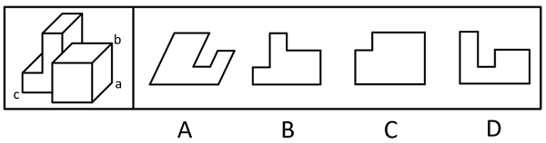

- **A**. A
- **B**. B　✅
- **C**. C
- **D**. D

**答案**：B

**官方解析**

本题考查截面图。根据平面公理“过不在一条直线上的三点，有且只有一个平面”可以得出，经过a、b、c三点可以确定唯一的平面，即所得截面为B项，如下图所示：

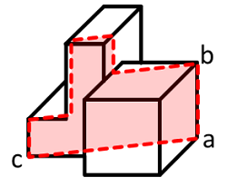

故正确答案为B。

---

## 第 2 题　qid 13504530 · 图形推理

从所给的四个选项中，选择最合适的一个填入问号处，使之呈现一定规律性。

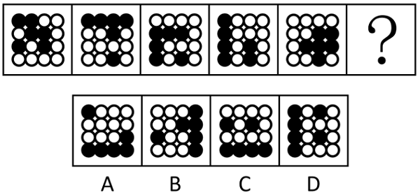

- **A**. A
- **B**. B
- **C**. C　✅
- **D**. D

**答案**：C

**官方解析**

元素组成相同，但无明显位置规律，考虑属性规律。观察发现，题干所有图形均由黑球和白球构成，考虑黑白球分开看，且题干图形的黑球或白球部分较为规整，考虑对称性。图1、图3、图5的黑球部分均为轴对称图形，图2、图4的白球部分均为轴对称图形，故？处图形的白球部分应为轴对称图形，排除A、B两项；继续观察发现，题干已知图形中轴对称部分的对称轴方向依次顺时针旋转，故？处图形中轴对称部分的对称轴方向应为水平，只有C项符合。

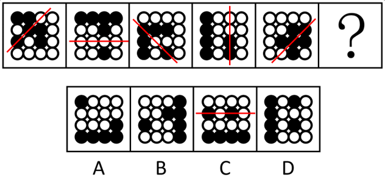

故正确答案为C。

---

## 第 3 题　qid 13504266 · 图形推理

从所给的四个选项中，选择最合适的一个填入问号处，使之呈现一定规律性：

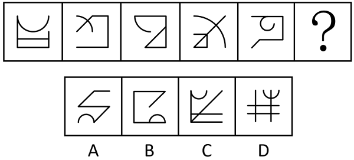

- **A**. A
- **B**. B
- **C**. C
- **D**. D　✅

**答案**：D

**官方解析**

解析一：元素组成不同，且无明显属性规律，考虑数量规律。观察发现，图形线条交叉明显，且每幅图均出现明显的弧线，考虑数曲直交点。曲直交点数均为1，排除B项；继续观察发现，题干图形曲直交点的特征依次为：曲线的端点与直线交叉、曲线的中段与直线“十字交叉”、曲线的端点与直线交叉、曲线的中段与直线“十字交叉”、曲线的端点与直线交叉，故？处图形的曲直交点应为曲线的中段与直线“十字交叉”，只有D项符合。
故正确答案为D。
解析二：
元素组成不同，且无明显属性规律，考虑数量规律。观察发现，图形线条交叉明显，且每幅图均出现明显的弧线，考虑曲直交点。曲直交点数均为1，排除B项；继续观察发现，题干图形曲直交点的特征为：曲线与直线（横线或竖线）相交、曲线与斜线相交、曲线与直线（横线或竖线）相交、曲线与斜线相交、曲线与直线（横线或竖线）相交，故？处图形的曲直交点应为曲线与斜线相交，只有A项符合。
故正确答案为A。
注：本题粉笔倾向于解析一。因为题干图形均只有一条曲线，曲线的端点或中段与直线相交的特征更明确；另外，解析二中图1为曲线与竖线相交，图3和图5为曲线与横线相交，其直线方向不完全一样。

---

## 第 4 题　qid 13504389 · 图形推理

把下面的六个图形分为两类，使每一类图形都有各自的共同特征或规律，分类正确的一项是：

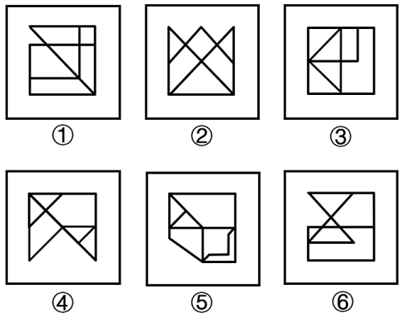

- **A**. ①③④，②⑤⑥
- **B**. ①②④，③⑤⑥　✅
- **C**. ①②⑤，③④⑥
- **D**. ①④⑥，②③⑤

**答案**：B

**官方解析**

本题为分组分类题目。元素组成不同，且无明显属性规律，考虑数量规律。观察发现，题干图形被分割，考虑面数量，但面数量无规律，且框内有明显一笔构成的线条，考虑笔画数。图①②④均为两笔画图形，图③⑤⑥均为一笔画图形，即图①②④为一组，图③⑤⑥为一组。
故正确答案为B。

---

## 第 5 题　qid 13504534 · 图形推理

从所给的四个选项中，选择最合适的一个填入问号处，使之呈现一定规律性。

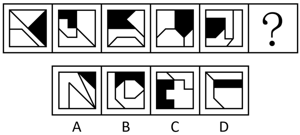

- **A**. A　✅
- **B**. B
- **C**. C
- **D**. D

**答案**：A

**官方解析**

元素组成不同，优先考虑属性规律。观察发现，题干已知图形的黑块均为轴对称图形，且都只有一条对称轴，而D项的黑块有两条对称轴，排除；继续观察发现，题干已知图形中都只有一个轴对称的空白面，该空白面也只有一条对称轴，且该空白面的对称轴与所在图形中黑块的对称轴从左到右依次呈垂直、平行位置关系交替，故？处图形黑块的对称轴与轴对称空白面的对称轴应为平行关系，只有A项符合。

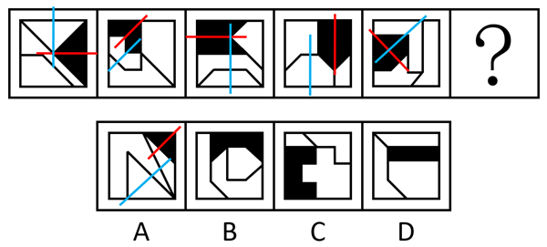

故正确答案为A。

---

## 第 6 题　qid 13504533 · 图形推理

从所给的四个选项中，选择最合适的一个填入问号处，使之呈现一定规律性。

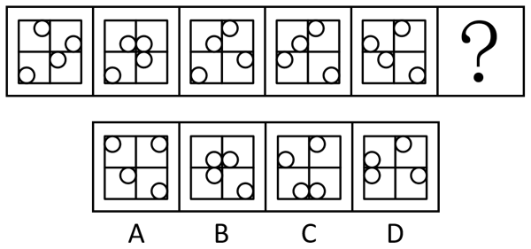

- **A**. A　✅
- **B**. B
- **C**. C
- **D**. D

**答案**：A

**官方解析**

元素组成相同，优先考虑位置规律。观察发现，图1与图2下侧两个白球位置没有发生变化，图2与图3左侧两个白球位置没有发生变化，图3与图4上侧两个白球位置没有发生变化，图4与图5右侧两个白球位置没有发生变化，按照此规律，图5与？处图形下侧两个白球位置应该没有发生变化，排除C、D两项；继续观察发现，每个图形中位置发生变化的两个白球在各自的框内顺时针平移1步，排除B项，只有A项符合。

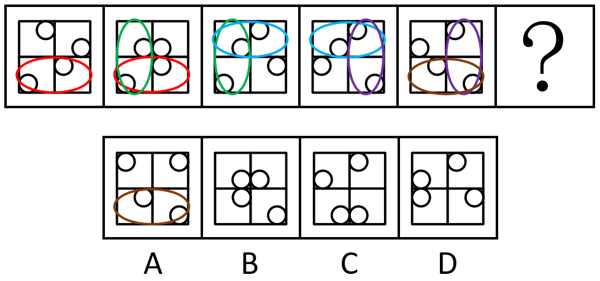

故正确答案为A。

---

## 第 7 题　qid 13504268 · 图形推理

从所给的四个选项中，选择最合适的一个填入问号处，使之呈现一定规律性：

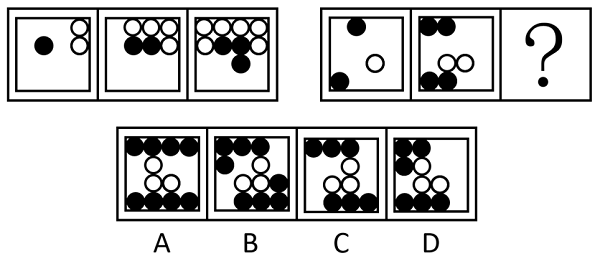

- **A**. A
- **B**. B
- **C**. C
- **D**. D　✅

**答案**：D

**官方解析**

元素组成不同，且无明显属性规律，考虑数量规律。观察发现，题干图形均由黑白球组成，第一组图形黑球每次增加1个，白球每次增加2个；第二组图形黑球每次增加2个，白球每次增加1个，故？处图形应该包含6个黑球、3个白球，排除A、B两项；再次观察发现，题干图形都是由不同颜色的球组成，且明显分为内外两圈，考虑分开看。第一组图中，内圈的黑球依次顺时针增加1个，外圈的白球依次逆时针增加2个；第二组图中，前两幅图内圈的白球依次顺时针增加1个，外圈的两部分黑球各依次逆时针增加1个，？处图形应用此规律，只有D项符合。
故正确答案为D。

---

## 第 8 题　qid 13504321 · 图形推理

左下图为15个白色和3个灰色正方体组合而成的多面体，其可以由以下4项中除哪项外的3个小多面体组合而成？

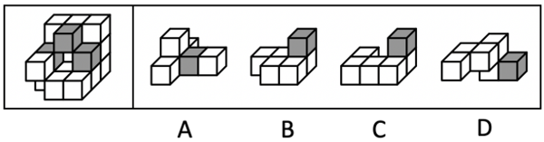

- **A**. A
- **B**. B
- **C**. C
- **D**. D　✅

**答案**：D

**官方解析**

本题考查立体拼合。题干多面体可以由A、B、C中的小多面体（A、C 两项中的小多面体需要先旋转）拼合而成，具体拼合过程如下图所示。

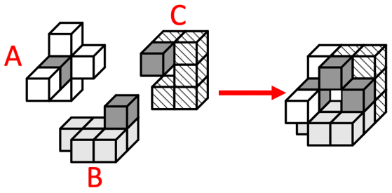

本题为选非题，故正确答案为D。

---

## 第 9 题　qid 13504536 · 图形推理

左图为正方体纸盒的外表面展开图，以下4个部分中，哪两个可以组合成同样正方体的外表面展开图？

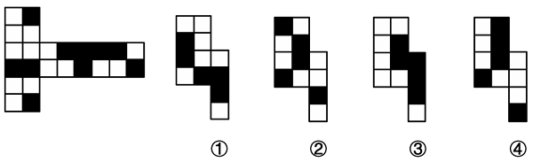

- **A**. ①和②
- **B**. ③和④　✅
- **C**. ①和④
- **D**. ②和③

**答案**：B

**官方解析**

如下图所示，将部分③进行拆分，将部分④先顺时针旋转并拆分后，再进行拼合，即可得到题干外表面展开图，其中g1和g2拼成了原展开图中的面g，f1和f2拼成了原展开图中的面f。

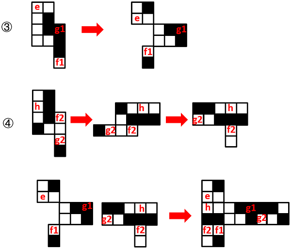

故正确答案为B。

---

## 第 10 题　qid 13504273 · 图形推理

把下面的六个图形分为两类，使每一类图形都有各自的共同特征或规律，分类正确的一项是：

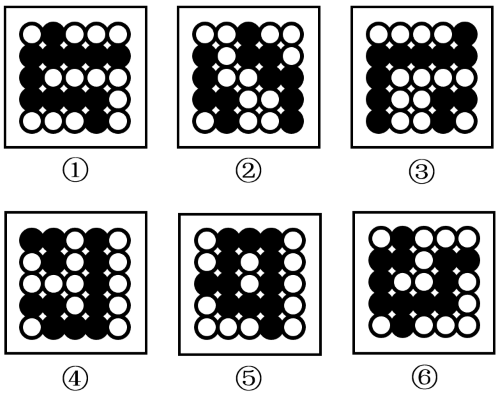

- **A**. ①③④，②⑤⑥
- **B**. ①②④，③⑤⑥
- **C**. ①⑤⑥，②③④　✅
- **D**. ①②⑥，③④⑤

**答案**：C

**官方解析**

本题为分组分类题目。元素组成相同，但无位置规律和属性规律，考虑数量规律。观察发现，题干图形黑球和白球分堆明显，考虑部分数。图①⑤⑥中黑球部分数均为1，白球部分数均为4，图②③④中黑球部分数均为2，白球部分数均为3，故图①⑤⑥为一组，图②③④为一组。
故正确答案为C。

---

## 第 11 题　qid 13504387 · 类比推理

覆：盖：覆盖

- **A**. 寒：酸：寒酸
- **B**. 厚：重：厚重
- **C**. 喉：舌：喉舌
- **D**. 抚：摸：抚摸　✅

**答案**：D

**官方解析**

第一步：判断题干词语间逻辑关系。
“覆”、“盖”、“覆盖”均指遮盖，三者是近义关系。
第二步：判断选项词语间逻辑关系。
A项：“寒”指冷、穷困，“酸”指像醋的气味或味道，二者不是近义关系，与题干逻辑关系不一致，排除；
B项：“厚”指扁平物体上下两个面的距离大，“重”指分量较大、程度深，二者不是近义关系，与题干逻辑关系不一致，排除；
C项：“喉”指介于咽和气管之间的部分，“舌”指舌头，二者不是近义关系，与题干逻辑关系不一致，排除；
D项：“抚”、“摸”、“抚摸”均指用手指轻轻触摸，三者是近义关系，与题干逻辑关系一致，当选。
故正确答案为D。

---

## 第 12 题　qid 13504269 · 类比推理

欲穷千里目：更上一层楼

- **A**. 为唤春来争艳朵：甘将香化育花泥　✅
- **B**. 不经一番寒彻骨：怎得梅花扑鼻香
- **C**. 欲上高楼去避愁：愁还随我上高楼
- **D**. 抛开俗事陪山坐：才得闲心听水歌

**答案**：A

**官方解析**

第一步：判断题干词语间逻辑关系。
“欲穷千里目，更上一层楼”的意思是想要看到千里之外的风光，那就要再登上更高的一层城楼，其中“欲穷千里目”是目的，“更上一层楼”是方式，二者为方式目的的对应关系。
第二步：判断选项词语间逻辑关系。
A项：“为唤春来争艳朵，甘将香化育花泥”的意思是为了春天的花朵绽放，甘愿化作花泥，其中“为唤春来争艳朵”是目的，“甘将香化育花泥”是方式，二者为方式目的的对应关系，与题干逻辑关系一致，当选；
B项：“不经一番寒彻骨，怎得梅花扑鼻香”的意思是只有经历艰苦（寒彻骨），才能获得美好的结果（梅花香），二者不是方式目的的对应关系，与题干逻辑关系不一致，排除；
C项：“欲上高楼去避愁，愁还随我上高楼”的意思是心想到高楼上观看美景躲避忧愁，忧愁还是跟着我上了高楼，二者不是方式目的的对应关系，与题干逻辑关系不一致，排除；
D项：“抛开俗事陪山坐，才得闲心听水歌”的意思是放下世俗的琐事、烦恼和欲望，与山为伴，亲近自然，才能获得内心的闲适与安宁，聆听流水的声音，感受自然的美好，二者为条件结果的对应关系，不是方式目的的对应关系，与题干逻辑关系不一致，排除。
故正确答案为A。

---

## 第 13 题　qid 13504529 · 类比推理

灌木树：银杏树：观叶树

- **A**. 风景画：工笔画：中国画
- **B**. 国内法：诉讼法：程序法
- **C**. 燕尾服：体操服：运动服　✅
- **D**. 学术会：咨询会：线上会

**答案**：C

**官方解析**

第一步：判断题干词语间逻辑关系。
灌木树是指没有明显的主干、呈丛生状态比较矮小的树木，银杏树是乔木树而不是灌木树，前两词是反向种属关系。观叶树是指叶形和叶色美丽的植物，银杏树树叶具有很高的观赏价值，是观叶树，后两词是种属关系。
第二步：判断选项词语间逻辑关系。
A项：风景画和工笔画是从不同的划分角度去命名的，二者为交叉关系，与题干逻辑关系不一致，排除；
B项：国内法和诉讼法是从不同的划分角度去命名的，二者为交叉关系，与题干逻辑关系不一致，排除；
C项：体操服不是燕尾服，前两词是反向种属关系，体操服是运动服，后两词是种属关系，与题干逻辑关系一致，当选；
D项：学术会和咨询会是从不同的划分角度去命名的，二者为交叉关系，与题干逻辑关系不一致，排除。
故正确答案为C。

---

## 第 14 题　qid 13504307 · 类比推理

法定节日：传统节日：纪念节日

- **A**. 国家秘密：商业秘密：工作秘密
- **B**. 劳动产品：手工产品：文创产品
- **C**. 儿童医院：公立医院：私立医院
- **D**. 帆布书包：双肩书包：学生书包　✅

**答案**：D

**官方解析**

第一步：判断题干词语间逻辑关系。
法定节日是由国家法律、法规统一规定的用以开展纪念、庆祝活动的节日；传统节日是一个民族或地区在长期历史发展中形成的、具有特定文化内涵和社会功能的节日；纪念节日一般是指某个国家为了纪念重大事件、伟人、先烈等特定的节日。三者是从不同的划分角度去命名的，互为交叉关系。
第二步：判断选项词语间逻辑关系。
A项：国家秘密是指关系国家安全和利益，依照法定程序确定，在一定时间内只限一定范围的人员知悉的事项；商业秘密是指能给权利人带来经济利益，且已采取保密措施的技术信息和经营信息，主体是企业、个体工商户等市场主体；工作秘密是指机关单位在公务活动里产生的内部事项。三者是针对三个不同的主体，互为并列关系，与题干逻辑关系不一致，排除；
B项：手工产品、文创产品均属于劳动产品，后两词与第一词均为种属关系，与题干逻辑关系不一致，排除；
C项：公立医院与私立医院为并列关系，与题干逻辑关系不一致，排除；
D项：帆布书包是根据书包的材质来划分，双肩书包是根据书包的背负方式来划分，学生书包是根据背负书包的主体来划分，三者是从不同的划分角度去命名的，互为交叉关系，与题干逻辑关系一致，当选。
故正确答案为D。

---

## 第 15 题　qid 13504405 · 类比推理

刑罚：改造罪犯：处罚

- **A**. 格言：指导言行：语句　✅
- **B**. 审计：收入分配：监督
- **C**. 比喻：生动描写：借喻
- **D**. 科研：本质规律：活动

**答案**：A

**官方解析**

第一步：判断题干词语间逻辑关系。
刑罚是指审判机关依据刑事法律对罪犯所施行的法律制裁。刑罚是处罚的一种，二者为种属关系；刑罚的功能是改造罪犯，二者为功能的对应关系。
第二步：判断选项词语间逻辑关系。
A项：格言是指含有劝诫和教育意义的话。格言是语句的一种，二者为种属关系；格言的功能是指导言行，二者为功能的对应关系，与题干逻辑关系一致，当选；
B项：审计是指由专设机关依照法律对国家各级政府及金融机构、企业事业组织的重大项目和财务收支进行事前和事后的监督、检查。审计是监督的一种具体形式，二者为种属关系；但审计的功能是监督和检查收入分配，收入分配是审计的对象，二者为作用对象的对应关系，与题干逻辑关系不一致，排除；
C项：借喻是比喻的一种，直接借比喻的事物来代替被比喻的事物，被比喻的事物和比喻词都不出现。借喻和比喻是种属关系，但词语顺序与题干相反；比喻的功能是生动描写，二者为功能的对应关系，与题干逻辑关系不一致，排除；
D项：科研是活动的一种，二者为种属关系；但科研的功能是探索本质规律，本质规律是科研的对象，二者为作用对象的对应关系，与题干逻辑关系不一致，排除。
故正确答案为A。

---

## 第 16 题　qid 13504373 · 逻辑判断

汉朝建立后，在秦咸阳故都的基础上建立了长安城。经过西汉末年、东汉末年和魏晋南北朝期间的长期战乱，长安城日益凋敝。城门、宫殿、武库及城南的礼制建筑等都在战火中被毁，唐朝建立后，虽然汉都长安已破败不堪，但是唐长安城仍与其关联密切。有学者认为，汉长安城实际上成为了唐长安城的一部分。
以下哪项如果为真，最能支持上述学者的观点？

- **A**. 汉长安城的渭南内城被划入了唐长安城西北角的禁苑，成为专供皇室游猎的场所　✅
- **B**. 唐朝政府设有专门的机构管理汉长安城的主要遗迹，还曾对汉未央宫进行过修葺扩建
- **C**. 至唐朝时，汉长安城的城墙城门、部分宫殿、武库、官署和角楼等建筑及道路都还保留完好
- **D**. 隋朝建立都城时，曾从汉长安城的宫室建筑拆取了一些大型建材，这些都为后世的唐朝所继承

**答案**：A

**官方解析**

第一步：找出论点和论据。
论点：汉长安城实际上成为了唐长安城的一部分。
论据：无。
本题只有论点，没有论据，加强优先考虑补充论据。
第二步：逐一分析选项。
A项：汉长安城的渭南内城被划入了唐长安城西北角的禁苑，说明汉长安城确实成为了唐长安城的一部分，补充论据，可以加强，当选；
B项：唐朝政府会管理汉长安城的主要遗迹并修葺扩建过汉未央宫，但汉长安城的主要遗迹和汉未央宫是否被纳入了唐长安城并不清楚，为不明确项，无法加强，排除；
C项：汉长安城的部分建筑及道路至唐朝时仍保留完好，但其是否被纳入了唐长安城并不清楚，为不明确项，无法加强，排除；
D项：唐朝部分建筑的“建材”来自汉长安城的宫室建筑，而论点讨论的是汉长安“城”实际上成为了唐长安城的一部分，建材无法代表城池，话题不一致，无法加强，排除。
故正确答案为A。

---

## 第 17 题　qid 13504380 · 逻辑判断

某公司举办年会，所有表演街舞的员工都表演了民族舞，所有表演民族舞的员工都表演了唱歌，有些表演吉他演奏的员工表演了诗朗诵，所有表演吉他演奏的员工都没有表演唱歌。
根据上述陈述，不能推出以下哪项？

- **A**. 所有表演街舞的员工都表演了唱歌
- **B**. 有些表演街舞的员工表演了吉他演奏　✅
- **C**. 有的表演诗朗诵的员工没有表演唱歌
- **D**. 所有表演吉他演奏的员工都没有表演民族舞

**答案**：B

**官方解析**

第一步：翻译题干。

①表演街舞表演民族舞；

②表演民族舞表演唱歌；

③有的表演吉他演奏表演诗朗诵；

④表演吉他演奏表演唱歌；

条件③可换位为：⑤有的表演诗朗诵表演吉他演奏；

可将条件①②逆否后和条件④⑤串联推出：⑥有的表演诗朗诵表演吉他演奏表演唱歌表演民族舞表演街舞。

第二步：逐一分析选项。

A项：翻译为表演街舞表演唱歌，“表演街舞”是对条件⑥的否后，否后必否前，可以推出，排除；

B项：翻译为有的表演街舞表演吉他演奏，根据条件⑥可知，表演吉他演奏表演街舞，将其逆否后为，表演街舞表演吉他演奏，“所有A不是B”与“有的A是B”互为矛盾关系，无法推出，当选；

C项：翻译为有的表演诗朗诵表演唱歌，根据条件⑥可以推出，排除；

D项：翻译为表演吉他演奏表演民族舞，“表演吉他演奏”是对条件⑥的肯前，肯前必肯后，可以推出，排除。

本题为选非题，故正确答案为B。

---

## 第 18 题　qid 13504386 · 逻辑判断

紫外线照射会使黑色素过度积累，早前使用的一些抑制黑色素合成的化合物，如对苯二酚，对人类皮肤有毒性，已不再推荐作为美白剂使用，为此研究人员纷纷寻找应用在化妆品行业中更安全的美白剂。近日，研究人员从一种常见的寄居于人类皮肤上的细菌——结核硬脂酸棒状杆菌中，发现了酪氨酸酶抑制剂。实验证实，酪氨酸酶对人体细胞无毒，适合用于对抗色素沉着。研究人员认为，酪氨酸酶是一种安全有效的美白剂。
以下哪项如果为真，最能支持上述结论？

- **A**. 除了酪氨酸酶，在天然细菌中暂时还没找到其他能替代对苯二酚的物质
- **B**. 酪氨酸酶具有抗菌、抗癌等有益特性，进一步增强了其在各种治疗应用中的潜力
- **C**. 结核硬脂酸棒状杆菌是寄居在皮肤上的细菌，通常会成为与人体共生的细菌，其衍生产物毒性低　✅
- **D**. 结核硬脂酸棒状杆菌是人类皮肤表面的正常菌群，在一般情况下并不致病，即使致病也可使用抗生素治疗

**答案**：C

**官方解析**

第一步：找出论点和论据。
论点：酪氨酸酶是一种安全有效的美白剂。
论据：研究人员从一种常见的寄居于人类皮肤上的细菌——结核硬脂酸棒状杆菌中，发现了酪氨酸酶抑制剂。实验证实，酪氨酸酶对人体细胞无毒，适合用于对抗色素沉着。
本题论据说的是“酪氨酸酶对人体细胞无毒，适合用于对抗色素沉着”，进而得出论点“酪氨酸酶是一种安全有效的美白剂”，二者话题一致，加强优先考虑补充论据。
第二步：逐一分析选项。
A项：指出在天然细菌中暂时还没找到其他能替代对苯二酚的物质，但论点讨论的是酪氨酸酶是否是安全有效的美白剂，话题不一致，无法加强，排除；
B项：指出酪氨酸酶具有抗菌、抗癌等有益特性，但论点讨论的是酪氨酸酶是否是安全有效的美白剂，抗菌、抗癌等特性与美白剂的安全性和有效性没有直接关联，无法加强，排除；
C项：指出结核硬脂酸棒状杆菌是寄居在皮肤上的细菌，通常会成为与人体共生的细菌，其衍生产物毒性低，而酪氨酸酶是从结核硬脂酸棒状杆菌中发现的，说明酪氨酸酶具有安全性，补充论据，可以加强，当选；
D项：指出结核硬脂酸棒状杆菌在一般情况下并不致病，即使致病也可使用抗生素治疗，但并没有提到结核硬脂酸棒状杆菌中的酪氨酸酶是否可以作为安全有效的美白剂，话题不一致，无法加强，排除。
故正确答案为C。
特别说明：
本题文段用词不够精准，混淆了“酪氨酸酶”和“酪氨酸酶抑制剂”，文段想表达的意思是“酪氨酸酶”会催化黑色素合成，而“酪氨酸酶抑制剂”可以抑制黑色素合成，从而美白。
所以最后论点讨论“酪氨酸酶抑制剂”美白是否安全有效。只有C项说结核硬脂酸棒状杆菌的“衍生产物”（即“酪氨酸酶抑制剂”）毒性低，即相对来说是安全的，择优选择C项。

---

## 第 19 题　qid 13504381 · 逻辑判断

为研究雄性小鼠肠道微生物组对后代健康的影响，研究人员给雄性小鼠注射了6周抗生素，导致它们肠道微生物多样性和丰富度下降，结果发现这些小鼠的后代出生时体重较轻、生长严重受限以及过早死亡的概率更高，研究人员认为，这一效应与雄性生殖系统对微生物组失衡的反应有关，这种反应可能会增加胎盘功能不全的风险，因此，雄性小鼠肠道微生物组紊乱可能会影响后代健康。
以下哪项如果为真，最能支持上述结论？

- **A**. 在雌性小鼠受孕前，若紊乱的雄性小鼠肠道微生物组得到恢复，则能降低后代不健康的风险　✅
- **B**. 研究中雄性小鼠生殖系统对微生物组失衡的反应包括激素信号受损和睾丸代谢物特征改变
- **C**. 导致雄性小鼠肠道微生物组紊乱的环境因素会引发宿主的生理和疾病反应
- **D**. 对哺乳动物而言，雄性的健康状况很有可能会遗传给后代

**答案**：A

**官方解析**

第一步：找出论点和论据。
论点：雄性小鼠肠道微生物组紊乱可能会影响后代健康。
论据：研究人员给雄性小鼠注射了6周抗生素，导致它们肠道微生物多样性和丰富度下降，结果发现这些小鼠的后代出生时体重较轻、生长严重受限以及过早死亡的概率更高，研究人员认为，这一效应与雄性生殖系统对微生物组失衡的反应有关，这种反应可能会增加胎盘功能不全的风险。
本题论点和论据均在讨论雄性小鼠肠道微生物对后代健康的影响，论点论据话题一致，加强优先考虑补充论据。
第二步：逐一分析选项。
A项：选项说在雌性小鼠受孕前，紊乱的雄性小鼠肠道微生物组如果恢复，则能降低后代不健康的风险，补充反面论据说明雄性小鼠肠道微生物组紊乱确实会影响后代健康，补充论据，可以加强，当选；
B项：选项说研究中雄性小鼠生殖系统对微生物组失衡的反应包括哪些特征改变，但论点讨论的是雄性小鼠肠道微生物组紊乱是否会影响后代健康，话题不一致，无法加强，排除；
C项：选项说导致雄性小鼠肠道微生物组紊乱的环境因素会引发宿主的生理和疾病反应，但论点讨论的是雄性小鼠肠道微生物组紊乱是否会影响后代健康，话题不一致，无法加强，排除；
D项：选项说哺乳动物雄性的健康状况很有可能会遗传给后代，但是不确定雄性小鼠肠道微生物组紊乱是否会影响后代健康，为不明确选项，无法加强，排除。
故正确答案为A。

---

## 第 20 题　qid 13504393 · 逻辑判断

一项有关办公模式的研究中，研究机构选择了全球最大在线旅行社之一的M公司员工进行了实验，该公司员工约有1600人，研究发现，与每天到办公室工作相比，每周居家办公两天的混合办公模式不仅没有影响员工的工作表现，还能有效降低人力成本。因此，研究机构认为：混合办公模式是公司运营的有效模式。
以下哪项如果为真，最能支持上述结论？

- **A**. M公司推行混合办公模式后，员工辞职率下降了33%　✅
- **B**. M公司中，采用混合办公模式人员和非混合办公模式人员在晋升方面机会均等
- **C**. 近几年来全球约1亿员工采用混合工作制，M公司所在国有很多企业都赞成该模式
- **D**. 如果员工每周5天不在办公室工作，员工培训指导以及公司文化都会受到较大影响

**答案**：A

**官方解析**

第一步：找出论点和论据。
论点：混合办公模式是公司运营的有效模式。
论据：一项对M公司员工约1600人进行的实验发现，与每天到办公室工作相比，每周居家办公两天的混合办公模式不仅没有影响员工的工作表现，还能有效降低人力成本。
本题论据说的是混合办公模式的一些优势，论点说的是混合办公模式是公司运营的有效模式，二者话题一致，加强优先考虑补充论据。
第二步：逐一分析选项。
A项：该项说的是混合办公模式降低了M公司的辞职率，提升了员工的稳定性，有利于公司运营，补充论据，可以加强，当选；
B项：该项说的是混合办公模式对“人员晋升”的影响，不涉及公司运营，话题不一致，无法加强，排除；
C项：该项说的是混合办公模式的使用情况和其他企业的态度，不涉及公司运营，话题不一致，无法加强，排除；
D项：该项说的是混合办公模式产生的负面影响，不利于公司运营，具有削弱作用，排除。
故正确答案为A。

---

## 第 21 题　qid 13504369 · 逻辑判断

研究人员比较了过去几年自动驾驶车辆和人类驾驶车辆的相关数据发现，一般情况下，与人类驾驶相比，自动驾驶车辆在执行常规驾驶任务，如保持车道位置和根据车流调整位置时更安全，研究人员认为，以自动驾驶车辆代替人类驾驶车辆上路可以大大减少交通事故。
上述结论需要补充以下哪项作为前提？

- **A**. 当前交通事故主要发生在常规驾驶任务中　✅
- **B**. 过去几年自动驾驶车辆技术水平发展迅速
- **C**. 自动驾驶车辆可以为道路交通提供精准导航
- **D**. 自动驾驶车辆和人类驾驶车辆存在风险差异

**答案**：A

**官方解析**

第一步：找出论点和论据。
论点：以自动驾驶车辆代替人类驾驶车辆上路可以大大减少交通事故。
论据：一般情况下，与人类驾驶相比，自动驾驶车辆在执行常规驾驶任务，如保持车道位置和根据车流调整位置时更安全。
论据和论点都在说自动驾驶车辆比人类驾驶更安全，二者话题一致，且提问方式为“前提”，加强优先考虑补充必要条件。
第二步：逐一分析选项。
A项：选项表明当前交通事故主要发生在常规驾驶任务中，如果该项不成立，即交通事故大多都不是发生在常规驾驶任务中，那么就无法根据论据“在执行常规驾驶任务时，自动驾驶车辆比人类驾驶更安全”得出论点，因此该项是论点成立的必要条件，可以加强，当选；
B项：选项表明过去几年自动驾驶车辆技术水平发展迅速，但不明确以自动驾驶车辆代替人类驾驶车辆上路是否可以减少交通事故，无法加强，排除；
C项：选项表明自动驾驶车辆可以为道路交通提供精准导航，说的是自动驾驶车辆的导航能力，而论点说的是自动驾驶车辆的安全性，话题不一致，无法加强，排除；
D项：选项表明自动驾驶车辆和人类驾驶车辆存在风险差异，但不明确以自动驾驶车辆代替人类驾驶车辆上路是否可以减少交通事故，无法加强，排除。
故正确答案为A。

---

## 第 22 题　qid 13504367 · 逻辑判断

某商场发生了一起电梯坠落事故，对于事故发生的原因，甲、乙二人展开了讨论。甲说：此次电梯坠落事故的责任在于电梯维保单位，事故电梯维保单位没有严格按照安全技术规范要求对电梯进行实质性维保。乙说：此次电梯坠落事故的发生与事故电梯维保单位没有关系，事故电梯向下运行过程中，对重反绳轮滚动轴承因疲劳剥落失效，出现了卡死现象，这才是导致事故发生的原因。
以下哪项如果为真，最能削弱乙的意见？

- **A**. 事故电梯维保单位负责保养的其他电梯并没有出现类似事故，目前都在正常运行
- **B**. 由于安全监管等相关部门的重视，对所有电梯元件的生产、安装、维保都有严格的规定，由此导致的事故数量呈现逐年下降趋势
- **C**. 当前出现的电梯事故的主要原因是人的不安全行为，如超载、反复开关梯门、在电梯运行过程中蹦跳等，而非电梯本身的不安全状态
- **D**. 事故电梯维保单位没有严格按照安全技术规范要求对电梯进行实质性维保，导致对重反绳轮滚动轴承老化，出现卡死现象　✅

**答案**：D

**官方解析**

第一步：找出论点和论据。
论点：此次电梯坠落事故的发生与事故电梯维保单位没有关系，事故电梯向下运行过程中，对重反绳轮滚动轴承因疲劳剥落失效，出现了卡死现象，这才是导致事故发生的原因。
论据：无。
本题只有论点没有论据，削弱优先考虑削弱论点。
第二步：逐一分析选项。
A项：该项说的是事故电梯维保单位负责保养的“其他电梯”正常运行，但不能说明题干商场发生事故的电梯问题与维保单位无关，无法削弱，排除；
B项：该项说的是安全监管等相关部门对电梯元件的规定及事故数量下降趋势，与论点讨论的此次电梯坠落事故发生的原因无关，为无关项，无法削弱，排除；
C项：该项说的是电梯事故的主要原因是人的不安全行为，而非电梯本身的不安全状态，但不明确人的不安全行为与论点讨论的原因之间的关系，为不明确项，无法削弱，排除；
D项：该项说的是事故电梯维保单位没有严格按照要求对电梯进行实质性维保，导致对重反绳轮滚动轴承老化，出现卡死现象，说明从根本上来说，是电梯维保单位没有严格按照要求对电梯进行实质性维保导致了事故的发生，直接削弱了乙的观点，可以削弱，当选。
故正确答案为D。

---

## 第 23 题　qid 13504365 · 逻辑判断

金鹃是具有巢寄生习性的一种鸟类，它们不会自己筑巢孵卵，而是把蛋产在其他种类鸟类（寄主）的巢中，由寄主代孵和育雏，但金鹃雏鸟一旦孵出，会将寄主的蛋从巢中清除出去。在研究金鹃与其非巢寄生的近亲物种后发现，金鹃在基因上分化的速度更快，形成了更多的物种群类。可见，巢寄生有助于促进具有这一习性鸟类的多样性。
以下哪项如果为真，最能支持上述结论？

- **A**. 与金鹃相比，金鹃的近亲鸟类物种大多进化缓慢，对环境的适应力较弱
- **B**. 寄主的雏鸟比金鹃的雏鸟出壳晚，金鹃雏鸟破壳后便本能地将寄主的蛋拱出巢外
- **C**. 在金鹃产蛋的过程中，某些寄主鸟类无法有效应对金鹃的巢寄生行为，数量出现锐减
- **D**. 金鹃雏鸟影响寄主自身的繁殖，为此寄主要识别并排除金鹃，促使金鹃不断进化出与寄主雏鸟更接近的能力　✅

**答案**：D

**官方解析**

第一步：找出论点和论据。
论点：巢寄生有助于促进具有这一习性鸟类的多样性。
论据：在研究金鹃与其非巢寄生的近亲物种后发现，金鹃在基因上分化的速度更快，形成了更多的物种群类。
本题论点和论据都在讨论“巢寄生有助于这一习性鸟类的多样性”，二者话题一致，加强优先考虑补充论据。
第二步：逐一分析选项。
A项：指出金鹃的近亲鸟类物种大多进化缓慢，但未提及这些鸟类是否为巢寄生，也未明确提及这些鸟类的基因分化速度，为不明确项，无法加强，排除；
B项：指出金鹃雏鸟会将寄主的蛋拱出巢外，但论点讨论的是“巢寄生有助于这一习性鸟类的多样性”，话题不一致，无法加强，排除；
C项：指出金鹃的某些寄主因无法有效应对金鹃的巢寄生行为而数量锐减，但论点讨论的是“巢寄生有助于这一习性鸟类的多样性”，话题不一致，无法加强，排除；
D项：指出寄主的识别促使金鹃不断进化出与寄主雏鸟更接近的能力，解释了为什么金鹃会在基因上分化的速度变快，补充论据，可以加强，当选。
故正确答案为D。

---

## 第 24 题　qid 13504368 · 逻辑判断

研究人员调查了负面情绪（包括愤怒、焦虑和悲伤）是否会对人体产生不利影响。研究中，280名成年人被随机分配4项情绪任务之一，包括回忆让他们愤怒的个人经历；回忆令自己感到焦虑的事件；阅读一系列引发悲伤的令人沮丧的句子；或者反复从1数到100以诱发中性情绪状态。研究发现，从任务完成后的0分钟到40分钟，回忆愤怒经历会导致血管舒张能力受损。40分钟后，这种状况才消失，而相较于愤怒，焦虑和悲伤情绪并没有引发血管内壁功能的显著变化。研究人员据此认为，愤怒会增加患动脉粥样硬化的风险。
上述论证的成立需要补充以下哪项作为前提？

- **A**. 血管舒张能力受损引发血管内壁功能的显著变化
- **B**. 回忆愤怒的经历与心血管疾病之间存在显著关联
- **C**. 血管舒张能力受损会增加患动脉粥样硬化的风险　✅
- **D**. 研究开始前，受试者都未检出血管舒张能力受损

**答案**：C

**官方解析**

第一步：找出论点和论据。
论点：愤怒会增加患动脉粥样硬化的风险。
论据：回忆愤怒经历会导致血管舒张能力受损，而焦虑和悲伤情绪并没有引发血管内壁功能的显著变化。
本题论点说的是“愤怒”与“患动脉粥样硬化的风险”之间的关系，论据说的是“愤怒”与“血管舒张能力受损”之间的关系，二者话题不一致，且提问方式为“前提”，加强优先考虑搭桥，即在“血管舒张能力受损”与“患动脉粥样硬化的风险”之间建立联系。
第二步：逐一分析选项。
A项：指出血管舒张能力受损引发血管内壁功能的显著变化，但不明确是否会增加患动脉粥样硬化的风险，不明确选项，无法加强，排除；
B项：指出回忆愤怒经历与心血管疾病之间存在关联，但不明确是否会增加患动脉粥样硬化的风险，不明确选项，无法加强，排除；
C项：指出血管舒张能力受损会增加患动脉粥样硬化的风险，在“血管舒张能力受损”与“患动脉粥样硬化的风险”之间建立了联系，搭桥选项，是论证成立的前提，当选；
D项：指出实验前受试者都未检出血管舒张能力受损，说明实验具有科学性，但论点讨论的是患动脉粥样硬化的风险，所以不是论证成立的前提，排除。
故正确答案为C。

---

## 第 25 题　qid 13504366 · 逻辑判断

深度睡眠阶段，人体会从大脑中移除不想要的或可能有害的物质，包括阿尔茨海默病中聚集的主要蛋白质，如Tau蛋白。阿尔茨海默病患者的一种病理变化是脑内Tau蛋白过度磷酸化，在细胞内堆积形成神经原纤维缠结。因此有研究者认为，深度睡眠不足会增加罹患阿尔茨海默病的风险。
以下哪项如果为真，最能削弱上述结论?

- **A**. 神经原纤维缠结与神经细胞死亡和认知功能障碍密切相关
- **B**. 携带阿尔茨海默病高风险基因的人更可能出现深度睡眠不足　✅
- **C**. 精神刺激、创伤、神经系统疾病等因素都可诱发阿尔茨海默病
- **D**. 年轻人的深度睡眠占睡眠时间的20%~25%，老年人只占5%~7%

**答案**：B

**官方解析**

第一步：找出论点和论据。
论点：深度睡眠不足会增加罹患阿尔茨海默病的风险。
论据：深度睡眠阶段，人体会从大脑中移除不想要的或可能有害的物质，包括阿尔茨海默病中聚集的主要蛋白质，如Tau蛋白。阿尔茨海默病患者的一种病理变化是脑内Tau蛋白过度磷酸化，在细胞内堆积形成神经原纤维缠结。
本题论点和论据讨论的都是深度睡眠和患阿尔茨海默病的风险之间的关系，二者话题一致，优先考虑削弱论点，且论点包含因果关系，还可以考虑因果倒置或他因削弱。
第二步：逐一分析选项。
A项：该项指出神经原纤维缠结与神经细胞死亡和认知功能障碍密切相关，但是，由于认知功能障碍包含的疾病类型诸多，不一定只有阿尔茨海默病，因此选项不明确，无法削弱，排除；
B项：该项指出携带阿尔茨海默病高风险基因的人更可能出现深度睡眠不足，说明深度睡眠不足可能是由阿尔茨海默病的遗传风险（高风险基因）引起的，而不是深度睡眠不足导致了阿尔茨海默病，因此选项为因果倒置，可以削弱，当选；
C项：该项说明精神刺激、创伤、神经系统疾病等因素都可诱发阿尔茨海默病，提出了其他可能的阿尔茨海默病的风险因素，但并未说明这些因素与深度睡眠的关系，因此无法削弱深度睡眠不足和阿尔茨海默病之间的关系，话题不一致，无法削弱，排除；
D项：该项指出年轻人和老年人深度睡眠在睡眠时间中的占比，说明深度睡眠的比例随着年龄的增长而减少，但它并没有说明年轻人和老年人中患阿尔茨海默病的占比，因此无法直接削弱深度睡眠不足和阿尔茨海默病之间的关系，话题不一致，无法削弱，排除。
故正确答案为B。

---

## 第 26 题　qid 13504350 · 定义判断

通常把公开出版发行的文献称为白色文献，把涉及机密无法公开出版发行的文献称为黑色文献。灰色文献是指采用访问、会议、报告、通信等非正式科学交流方式传播的、尚未正式出版的文献。灰色文献介于白色和黑色文献之间，已经发行但不易通过一般销售渠道购得。
根据上述定义，下列不属于灰色文献的是：

- **A**. 某行业协会印刷的提供给协会会员使用的技术规范
- **B**. 某高校文学院为召开某次学术会议印刷的会议论文集
- **C**. 某考古学杂志社每期印刷的受众极小的专业类学术期刊　✅
- **D**. 某企业印刷的在其内部流通的塑造企业文化的内部刊物

**答案**：C

**官方解析**

第一步：找出定义关键词。
白色文献：“公开出版发行的文献”；
黑色文献：“涉及机密无法公开出版发行的文献”；
灰色文献：“采用访问、会议、报告、通信等非正式科学交流方式传播的、尚未正式出版的文献”、“已经发行但不易通过一般销售渠道购得”。
第二步：逐一分析选项。
A项：行业协会印刷的提供给协会会员使用的技术规范，是在协会的内部传播，不易通过一般销售渠道购得，符合“采用访问、会议、报告、通信等非正式科学交流方式传播的、尚未正式出版的文献”、“已经发行但不易通过一般销售渠道购得”，符合灰色文献的定义，排除；
B项：高校文学院为学术会议印刷的会议论文集，只适用在学术会议这一特定场合，尚未正式出版，也不能通过一般销售渠道购得，符合“采用访问、会议、报告、通信等非正式科学交流方式传播的、尚未正式出版的文献”、“已经发行但不易通过一般销售渠道购得”，符合灰色文献的定义，排除；
C项：考古学杂志社每期印刷的受众极小的学术期刊，虽然受众小，但也属于正式出版发行的文献，符合“公开出版发行的文献”，不符合“采用访问、会议、报告、通信等非正式科学交流方式传播的、尚未正式出版的文献”，符合白色文献的定义，不符合灰色文献的定义，当选；
D项：企业印刷的内部刊物只在其内部流通，并未正式出版，也不能通过一般销售渠道购得，符合“采用访问、会议、报告、通信等非正式科学交流方式传播的、尚未正式出版的文献”、“已经发行但不易通过一般销售渠道购得”，符合灰色文献的定义，排除。
本题为选非题，故正确答案为C。

---

## 第 27 题　qid 13504323 · 定义判断

情绪爆发策略是指在谈判过程中，当双方在某一个问题上相持不下，或者对方的态度、行为欠妥，要求不太合理时，通过情绪爆发、大发脾气等手段有意制造僵局逼迫对方，从而使对方被迫让步的谈判策略。
根据上述定义，下列符合情绪爆发策略的是：

- **A**. 小强脾气很是暴躁，做事没有耐心，经常一遇到不顺心的事就生气发火，家里人都不敢和他亲近
- **B**. 老王作为公司负责人经常出去谈判，有时遇到对方提出无理要求，他总会大发脾气直接离席，不再与对方谈判
- **C**. 谈判时，双方在某原则性问题上讨论了两天毫无进展，老周率领代表团临时离席表达自己的不满，最终对方作出了让步　✅
- **D**. 多多与父母沟通，要求买新手机，但被父母拒绝了，多多以离家出走要挟父母必须给他买，父母坚决不同意并对他进行了批评教育

**答案**：C

**官方解析**

第一步：找出定义关键词。
“在谈判过程中”、“双方在某一个问题上相持不下，或者对方的态度、行为欠妥，要求不太合理”、“通过情绪爆发、大发脾气等手段有意制造僵局逼迫对方”、“使对方被迫让步”。
第二步：逐一分析选项。
A项：小强脾气很是暴躁，做事没有耐心，遇到不顺心的事就生气发火，是日常做事的态度和行为，不符合“在谈判过程中”，家里人都不敢和他亲近，不符合“使对方被迫让步”，不符合定义，排除；
B项：老王在谈判过程中，遇到对方提出无理要求，不再与对方谈判，直接终止谈判而不是在继续的谈判中迫使对方让步，不符合“使对方被迫让步”，不符合定义，排除；
C项：谈判时，双方在某原则性问题上讨论了两天毫无进展，符合“在谈判过程中”、“双方在某一个问题上相持不下”，老周率领代表团临时离席表达自己的不满，最终对方作出了让步，符合“通过情绪爆发、大发脾气等手段有意制造僵局逼迫对方”、“使对方被迫让步”，符合定义，当选；
D项：多多以离家出走要挟父母必须给他买手机，但父母坚决不同意并对他进行了批评教育，证明父母没有让步，不符合“使对方被迫让步”，不符合定义，排除。
故正确答案为C。

---

## 第 28 题　qid 13504537 · 定义判断

词间相关关系是指语义上或概念上有一定程度关联的一对概念。包括以下几种相关关系：
（1）行为或过程或活动与行为者或工具或产物或属性或对象；
（2）物体或材料或事件或事物与其属性；
（3）因果依赖关联；
（4）物体或现象或行为与其反作用者；
（5）原料与产品、理论与应用；
（6）事件、机构与相关人。
根据上述定义，下列词间相关关系与其所属类型对应正确的有几项？
①“桑蚕丝”与“丝绸”——（5）
②“磁铁”与“铁磁性”——（1）
③“炎症”与“消炎药”——（4）
④“戊戌变法”与“康有为”——（6）
⑤“收割”与“谷类作物”——（2）
⑥“侵权”与“名誉受损”——（3）

- **A**. 2
- **B**. 3
- **C**. 4　✅
- **D**. 5

**答案**：C

**官方解析**

第一步：找出定义关键词。
“语义上或概念上有一定程度关联”、“一对概念”、“（1）行为或过程或活动与行为者或工具或产物或属性或对象”、“（2）物体或材料或事件或事物与其属性”、“（3）因果依赖关联”、“（4）物体或现象或行为与其反作用者”、“（5）原料与产品、理论与应用”、“（6）事件、机构与相关人”。
第二步：逐一进行分析。
①：“桑蚕丝”是制作“丝绸”的原材料，符合“（5）原料与产品”，符合定义，对应正确；
②：“磁铁”具有“铁磁性”，二者为物体与其属性对应关系，符合“（2）物体或材料或事件或事物与其属性”，不符合“（1）行为或过程或活动与行为者或工具或产物或属性或对象”，对应错误；
③：“消炎药”可以消除“炎症”，符合“（4）物体或现象或行为与其反作用者”，符合定义，对应正确；
④：“康有为”是“戊戌变法”的代表人物之一，符合“（6）事件、机构与相关人”，符合定义，对应正确；
⑤：“收割”是一个行为，“谷类作物”是此行为的作用对象，符合“（1）行为或过程或活动与行为者或工具或产物或属性或对象”，不符合“（2）物体或材料或事件或事物与其属性”，对应错误；
⑥：“侵权”可能会导致“名誉受损”，符合“（3）因果依赖关联”，符合定义，对应正确。
综上，词间相关关系与其所属类型对应正确的有4项。
故正确答案为C。

---

## 第 29 题　qid 13504322 · 定义判断

在经济学当中，运动防御是指企业不仅要坚守原有市场阵地，还要将业务范围扩展到新的有潜力的领域，以作为将来防御和进攻的中心。
根据上述定义，下列不属于运动防御的是：

- **A**. 某石油公司转型为能源公司，市场范围扩展到煤炭、核能、水利和化学等多方面
- **B**. 某饮料公司发现许多人都在控制糖类摄入，于是推出了不少低糖饮料，以此来稳固市场　✅
- **C**. 某手机公司除了钻研提升手机性能以外，近几年还推出了智能穿戴、新能源汽车等多类产品
- **D**. 某白酒公司认识到年轻人对白酒的消费意愿不强，于是拓展进入了冷冻食品等其他行业，实行多元化经营

**答案**：B

**官方解析**

第一步：找出定义关键词。
“企业不仅要坚守原有市场阵地，还要将业务范围扩展到新的有潜力的领域”。
第二步：逐一分析选项。
A项：石油公司将业务扩展至煤炭、核能、水利和化学等新的领域，符合“企业不仅要坚守原有市场阵地，还要将业务范围扩展到新的有潜力的领域”，符合定义，排除；
B项：低糖饮料属于饮料行业的细分产品，饮料公司并未向新的领域扩展业务，不符合“企业不仅要坚守原有市场阵地，还要将业务范围扩展到新的有潜力的领域”，不符合定义，当选；
C项：手机公司将业务扩展至智能穿戴、新能源汽车等新的领域，符合“企业不仅要坚守原有市场阵地，还要将业务范围扩展到新的有潜力的领域”，符合定义，排除；
D项：白酒公司将业务扩展至冷冻食品等新的领域，符合“企业不仅要坚守原有市场阵地，还要将业务范围扩展到新的有潜力的领域”，符合定义，排除。
本题为选非题，故正确答案为B。

---

## 第 30 题　qid 13504341 · 定义判断

校友经济是指在校友的社会活动中以母校为核心，通过母校与校友、校友与校友、母校与社会之间所产生的物质、文化、人才等方面的交流，从而给母校、校友以及社会带来客观收益的经济活动。校友经济以母校和校友为载体，目的是通过校友与母校之间天然的纽带，长期不断循环推动相关经济活动的发展。
根据上述定义，下列属于校友经济的是：

- **A**. 某大学校友会举办了校园招聘活动，23家校友企业出席并提供了超100个就业岗位　✅
- **B**. 某自媒体博主将自己赚的第一桶金捐给了贫困山区的学校，为他们购买了学习物资，助力乡村教育发展
- **C**. 某高校给予对学校建设和发展作出突出贡献的校友精神奖励，包括但不限于授予荣誉称号，聘请担任名誉职务等
- **D**. 某高校定期举办成功校友与在校学生座谈活动，让校友现身说法，通过典型宣传，进一步做实大学生思想政治工作

**答案**：A

**官方解析**

第一步：找出定义关键词。
“校友的社会活动中以母校为核心”、“以母校和校友为载体”、“给母校、校友以及社会带来客观收益的经济活动”。
第二步：逐一分析选项。
A项：校友会举办了校园招聘活动，校友企业提供了就业岗位，符合“校友的社会活动中以母校为核心”、“以母校和校友为载体”、“给母校、校友以及社会带来客观收益的经济活动”，符合定义，当选；
B项：某自媒体博主将自己赚的第一桶金捐给了贫困山区的学校，并没有体现母校与校友的核心主体，不符合“校友的社会活动中以母校为核心”、“以母校和校友为载体”、“给母校、校友以及社会带来客观收益的经济活动”，不符合定义，排除；
C项：某高校给予对学校建设和发展作出突出贡献的校友精神奖励，并未体现校友给母校带来的客观收益的经济活动，不符合“给母校、校友以及社会带来客观收益的经济活动”，不符合定义，排除；
D项：某高校定期举办成功校友与在校学生座谈活动，进一步做实大学生思想政治工作，属于教育引导，并没有涉及经济活动，不符合“给母校、校友以及社会带来客观收益的经济活动”，不符合定义，排除。
故正确答案为A。

---
