# 2025年浙江省公务员录用考试《行测》题（C类）（网友回忆版）

> 判断推理 · 35 题 · 浙江 2025

## 第 1 题　qid 10297314 · 图形推理

从所给的四个选项中，选择最合适的一个填入问号处，使之呈现一定的规律性。

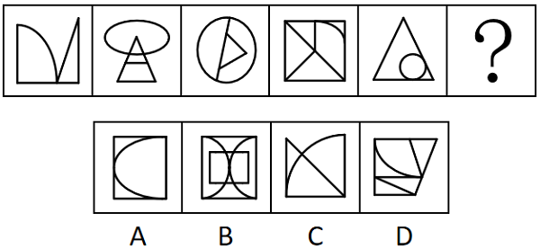

- **A**. A
- **B**. B
- **C**. C
- **D**. D　✅

**答案**：D

**官方解析**

元素组成不同，且无明显属性规律，考虑数量规律。观察发现，题干图形均由直线和曲线构成，且直线和曲线出现明显相交，考虑曲直交点数。题干图形的曲直交点数均为2，故？处应选择有2个曲直交点的图形，只有D项符合。
故正确答案为D。

---

## 第 2 题　qid 10297305 · 图形推理

从所给的四个选项中，选择最合适的一个填入问号处，使之呈现一定的规律性：

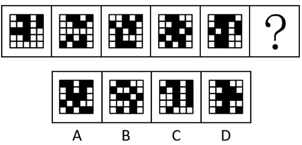

- **A**. A　✅
- **B**. B
- **C**. C
- **D**. D

**答案**：A

**官方解析**

元素组成不同，且无明显属性规律，考虑数量规律。观察发现，题干图形中黑块的数量依次为9、10、11、12、13，故“？”处图形黑块数量应为14个，只有A项符合。
故正确答案为A。

---

## 第 3 题　qid 10297326 · 图形推理

从所给的四个选项中，选择最合适的一个填入问号处，使之呈现一定的规律性。

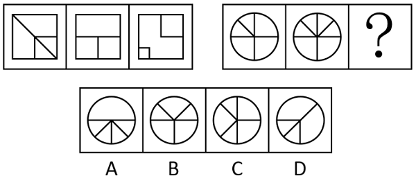

- **A**. A
- **B**. B
- **C**. C
- **D**. D　✅

**答案**：D

**官方解析**

元素组成不同，优先考虑属性规律。观察发现，题干出现等腰元素，优先考虑对称性。题干图形均只有一条对称轴，且第一组图形的对称轴方向依次顺时针旋转，第二组图形遵循此规律，故？处图形的对称轴方向应从左下至右上，只有D项符合。

故正确答案为D。

---

## 第 4 题　qid 10297349 · 图形推理

从所给的四个选项中，选择最合适的一个填入问号处，使之呈现一定的规律性。

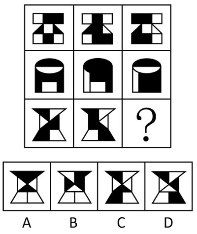

- **A**. A　✅
- **B**. B
- **C**. C
- **D**. D

**答案**：A

**官方解析**

图形元素组成相似，优先考虑样式规律。观察发现，题干图形均由黑块和白块构成，考虑黑白运算。九宫格优先横向看，第一行图形的黑白运算规律为：白+白=黑，黑+黑=黑，黑+白=白，白+黑=白；第二行图形经验证符合此规律；第三行图形应用此规律，只有A项符合。
故正确答案为A。

---

## 第 5 题　qid 10297358 · 图形推理

从所给的四个选项中，选择最合适的一个填入问号处，使之呈现一定的规律性。

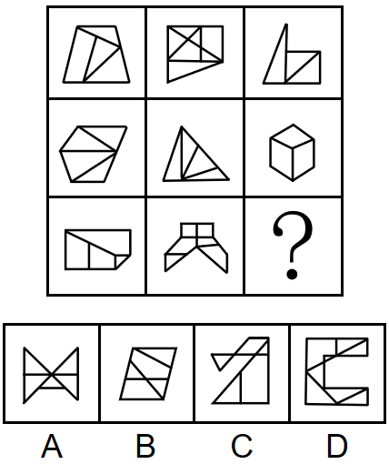

- **A**. A
- **B**. B　✅
- **C**. C
- **D**. D

**答案**：B

**官方解析**

元素组成不同，且无明显属性规律，考虑数量规律。观察发现，题干图形被分割，考虑面数量，但面数量无规律，且第一行图形的外框内有明显一笔构成的线条，可以考虑笔画数。九宫格优先横向看，第一行图形的笔画数均为1，第二行图形的笔画数均为2，第三行前两幅图的笔画数均为3，故？处应选择一个三笔画图形，只有B项符合。
故正确答案为B。

---

## 第 6 题　qid 10297248 · 图形推理

把下面的六个图形分为两类，使每一类图形都有各自的共同特征或规律，分类正确的一项是：

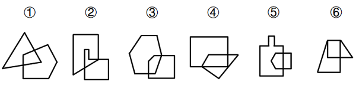

- **A**. ①②③，④⑤⑥
- **B**. ①②⑥，③④⑤
- **C**. ①④⑥，②③⑤　✅
- **D**. ①⑤⑥，②③④

**答案**：C

**官方解析**

元素组成不同，且每幅图均为两个封闭图形相交而成，考虑图形间关系。观察发现，题干图形均相交于面，考虑相交面的形状。图①④⑥相交面为四边形，图②③⑤相交面为五边形，即图①④⑥为一组，图②③⑤为一组。
故正确答案为C。

---

## 第 7 题　qid 10297338 · 图形推理

左图为一个实心长方体、一个挖孔长方体和一个四面体组合成的多面体，问下列哪一个不可能是其视图？

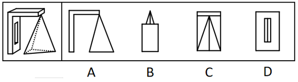

- **A**. A
- **B**. B
- **C**. C
- **D**. D　✅

**答案**：D

**官方解析**

本题考查三视图。

如下图所示：

A项按照箭头所指示方向，可从正面观察，为题干多面体的主视图，排除；

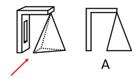

B项按照箭头所指示方向，可从上往下观察，为题干多面体的俯视图，排除；

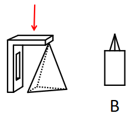

C项按照箭头所指示方向，可从右往左观察，为题干多面体的右视图，排除；

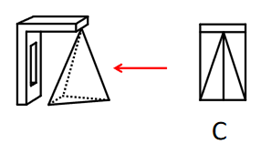

D项按照箭头所指示方向，应是从左往右观察题干所得图形，最中间四边形内部不存在竖线，不可能为题干多面体的视图，当选。

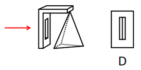

本题为选非题，故正确答案为D。

---

## 第 8 题　qid 10297350 · 类比推理

墙角堆码共计15个纸箱，左侧为堆码的效果图，堆码纸箱的俯视图可能是：

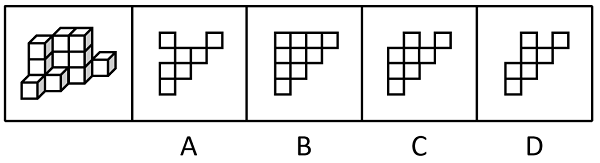

- **A**. A
- **B**. B
- **C**. C　✅
- **D**. D

**答案**：C

**官方解析**

给定堆码可看作由从上往下3层小正方体纸箱组成。上层只有3个，中间层至少3个，最下层至少6个，暴露在视野内的共计12个，总共15个纸箱，还有3个纸箱需要合理放置在视野看不到的地方。上层的信息完全能看到，因此剩余3个纸箱只能放在中间层或最下层。同时由于纸箱堆码不能悬空，纸箱如果放在中间层的某个位置，在相同位置的最下层一定要有纸箱支撑。

视野中能看到的已知纸箱的俯视图为下图中的1、2、3、4、5、6，共计六个区域的集合。

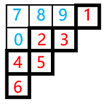

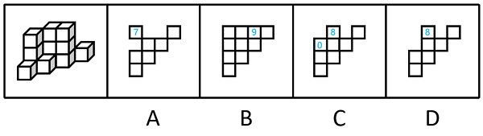

A项：对比已知俯视图，仅在7号区域多了纸箱，最多在7号区域对应的最下层和中间层堆放2个纸箱，无法堆放剩余3个纸箱，排除；

B项：对比已知俯视图，在9号区域多了纸箱，而题干中9号区域并无纸箱，排除；

C项：对比已知俯视图，在8号和0号区域多了纸箱，可以在8号区域对应的最下层和中间层堆放2个纸箱，同时在0号区域对应的最下层堆放1个纸箱；或者在8号区域对应的最下层堆放1个纸箱，同时在0号区域对应的最下层和中间层堆放2个纸箱，以上两种方式均能堆放剩余的3个纸箱，当选；

D项：对比已知俯视图，仅在8号区域多了纸箱，最多在8号区域对应的最下层和中间层堆放2个纸箱，无法堆放剩余3个纸箱，排除。

故正确答案为C。

---

## 第 9 题　qid 10297247 · 类比推理

台灯：装饰

- **A**. 脸盆：洗漱
- **B**. 空调：风扇
- **C**. 食醋：除垢　✅
- **D**. 蜡烛：氛围

**答案**：C

**官方解析**

第一步：判断题干词语间逻辑关系。
台灯的主要功能是照明，次要功能是装饰，二者为次要功能的对应关系。
第二步：判断选项词语间逻辑关系。
A项：脸盆的主要功能是洗漱，二者为主要功能的对应关系，与题干逻辑关系不一致，排除；
B项：空调和风扇是可以用于降温的两种电器，二者是并列关系，与题干逻辑关系不一致，排除；
C项：食醋的主要功能是调味，次要功能是除垢，二者为次要功能的对应关系，与题干逻辑关系一致，当选；
D项：蜡烛的主要功能是照明，次要功能是营造氛围，而不是氛围，二者不是次要功能的对应关系，与题干逻辑关系不一致，排除。
故正确答案为C。

---

## 第 10 题　qid 10297250 · 类比推理

装订：成册

- **A**. 考试：学习
- **B**. 灌溉：收割
- **C**. 煅烧：打磨
- **D**. 调解：止争　✅

**答案**：D

**官方解析**

第一步：判断题干词语间逻辑关系。
通过“装订”的方式，以达到将散乱的纸张整理“成册”的目的，二者为方式目的的对应关系。
第二步：判断选项词语间逻辑关系。
A项：“考试”是为了检测学习的成果，而并非是“学习”，与题干逻辑关系不一致，排除；
B项：先对农作物进行“灌溉”，等其成熟后进行“收割”，二者为时间先后的对应关系，与题干逻辑关系不一致，排除；
C项：先对金属进行“煅烧”，使其内部结构更加紧实，性能更加优越，再对其进行精致“打磨”使其美观，二者为时间先后的对应关系，与题干逻辑关系不一致，排除；
D项：通过“调解”的方式，以达到停止争端的目的，即为“止争”，二者为方式目的的对应关系，与题干逻辑关系一致，当选。
故正确答案为D。

---

## 第 11 题　qid 10297265 · 类比推理

铁皮桶：油桶

- **A**. 汤勺：漏勺
- **B**. 金饰：手镯　✅
- **C**. 党费：工资
- **D**. 章鱼：鱿鱼

**答案**：B

**官方解析**

第一步：判断题干词语间逻辑关系。
铁皮桶是指由铁皮制作而成的桶，油桶是指装油的桶。有的铁皮桶是油桶，有的铁皮桶不是油桶，有的油桶是铁皮桶，有的油桶不是铁皮桶，二者为交叉关系。
第二步：判断选项词语间逻辑关系。
A项：汤勺是指盛汤的勺子，漏勺是做饭用工具，呈勺子形状，但勺面中间有很多小孔，用来捞东西的，汤勺和漏勺是不同的勺子，二者为并列关系，与题干逻辑关系不一致，排除；
B项：金饰是指用金子制作而成的首饰，手镯是戴在人手腕上的环形装饰品，有的金饰是手镯，有的金饰不是手镯，有的手镯是金饰，有的手镯不是金饰，二者为交叉关系，与题干逻辑关系一致，当选；
C项：党费是指党员向党组织缴纳的用于党的事业和党的活动的经费，工资是指劳动者提供劳动后，用人单位依据国家相关规定和合同的约定，以货币形式直接支付给劳动者的劳动报酬，通常党费是按照党员的工资收入的一定比例来缴纳的，二者不涉及交叉关系，与题干逻辑关系不一致，排除；
D项：章鱼属于头足纲八腕总目，有八条触手，鱿鱼属于头足纲十腕总目，有十条触手，章鱼和鱿鱼是不同的软体动物，二者为并列关系，与题干逻辑关系不一致，排除。
故正确答案为B。

---

## 第 12 题　qid 10297245 · 类比推理

消毒水：消毒

- **A**. 部队锅：部队
- **B**. 橄榄球：橄榄
- **C**. 葡萄酒：葡萄
- **D**. 减脂餐：减脂　✅

**答案**：D

**官方解析**

第一步：判断题干词语间逻辑关系。
消毒水具有消毒的功能，二者为功能对应关系。
第二步：判断选项词语间逻辑关系。
A项：部队锅是因其起源与部队物资相关而得名，二者不是功能对应关系，与题干逻辑关系不一致，排除；
B项：橄榄球的外形类似橄榄，二者不是功能对应关系，与题干逻辑关系不一致，排除；
C项：葡萄酒是以葡萄为原材料而制成的，二者为原材料对应关系，与题干逻辑关系不一致，排除；
D项：减脂餐具有减脂的功能，二者为功能对应关系，与题干逻辑关系一致，当选。
故正确答案为D。

---

## 第 13 题　qid 10297252 · 类比推理

撕心裂肺：眉开眼笑

- **A**. 推心置腹：尔虞我诈　✅
- **B**. 鸡鸣狗吠：不毛之地
- **C**. 亦步亦趋：人云亦云
- **D**. 称雨道晴：如胶似漆

**答案**：A

**官方解析**

第一步：判断题干词语间逻辑关系。
撕心裂肺形容某事令人极度悲伤，有时也可作疼痛到了极点；眉开眼笑是指眉头舒展，眼含笑意，形容高兴愉快的样子，二者为反义关系。
第二步：判断选项词语间逻辑关系。
A项：推心置腹是指真心诚意地待人；尔虞我诈是指你欺骗我，我欺骗你，指彼此玩弄欺诈手段，互相欺骗，二者为反义关系，与题干逻辑关系一致，当选；
B项：鸡鸣狗吠是指鸡啼狗叫彼此都听得到，比喻聚居在一处的人口稠密；不毛之地是指寸草不生的荒地，形容贫瘠荒凉不长庄稼的地方、废弃的土地，二者不是反义关系，与题干逻辑关系不一致，排除；
C项：亦步亦趋是指人家慢走我也慢走，人家快走我也快走，形容事事处处都模仿和追随别人，自己没有主见或创造性；人云亦云是指别人怎么说，自己也跟着怎么说，形容随声附和，没有主见或创见，二者为近义关系，与题干逻辑关系不一致，排除；
D项：称雨道晴是指一个人说下雨，一个人说天晴，比喻说话说不到一块；如胶似漆意思是指像胶和漆那样黏结，形容感情炽烈，难舍难分，二者不是反义关系，与题干逻辑关系不一致，排除。
故正确答案为A。

---

## 第 14 题　qid 10297249 · 类比推理

锂电池：芯片：充电宝

- **A**. 马车：蒸汽机：机车
- **B**. 炒锅：铁铲：炊具
- **C**. 无纺布：皮筋：口罩　✅
- **D**. 应用软件：屏幕：手机

**答案**：C

**官方解析**

第一步：判断题干词语间逻辑关系。
锂电池和芯片均为充电宝的组成部分，前两词与第三词构成组成关系。
第二步：判断选项词语间逻辑关系。
A项：机车是牵引或推送铁路车辆运行，而本身不装载营业载荷的自推进车辆，俗称火车头，马车不是机车的组成部分，与题干逻辑关系不一致，排除；
B项：炒锅、铁铲均属于炊具，前两词与第三词构成种属关系，与题干逻辑关系不一致，排除；
C项：无纺布和皮筋均为口罩的组成部分，前两词与第三词构成组成关系，与题干逻辑关系一致，当选；
D项：手机中会安装应用软件，但应用软件不是手机的组成部分，与题干逻辑关系不一致，排除。
故正确答案为C。

---

## 第 15 题　qid 10297251 · 类比推理

青山 对于 （    ）相当于 教室 对于 （    ）

- **A**. 绿水 操场　✅
- **B**. 郊游 实践
- **C**. 树木 电脑
- **D**. 白云 教师

**答案**：A

**官方解析**

逐一代入选项。
A项：青山是青翠的山，绿水是碧绿的水，二者为并列关系；教室和操场是学校的两个不同地点，二者为并列关系，前后逻辑关系一致，保留；
B项：青山是郊游的地点，二者为地点对应关系；教室是学习理论的地点，而不是实践操作的地点，二者不为地点对应关系，前后逻辑关系不一致，排除；
C项：树木长在青山上，二者为地点对应关系；电脑放置在教室里，二者为地点对应关系，前后逻辑关系一致，保留；
D项：青山是青翠的山，白云是白色的云，二者为并列关系；教师在教室上课，二者为地点对应关系，前后逻辑关系不一致，排除。
比较A、C两项，A项中青山和绿水都属于自然环境，教室和操场都属于教学环境，前后项联系的更为紧密，故A项前后逻辑关系更为一致。
故正确答案为A。

---

## 第 16 题　qid 10297346 · 定义判断

照护综合征是指一个人因专注于照护生病、受伤或残疾的亲人而过度劳累或精神上陷于压抑状态，导致身心健康受损的病症。
根据上述定义，下列不属于照护综合征的是：

- **A**. “照顾生病的父母半年，我感觉整个人都陷入了黑暗，现在还没缓过劲来，电话铃声一响整个人就哆嗦。”
- **B**. “这家坐轮椅的老爷子太难伺候了，累死累活照顾他还经常挨骂，还要被扣工资，我受不了了，不想干了。”　✅
- **C**. “我起早贪黑照顾了瘫痪在床的父亲两年，他还总不满意，经常训斥我。现在好了，我也累倒了，住院了。”
- **D**. “昨天奶奶说，她一个人照顾双目失明的爷爷太累了，要么儿女们轮流来照顾，要么找个专职保姆，反正她受不了，不管了。”

**答案**：B

**官方解析**

第一步：找出定义关键词。
“专注于照护生病、受伤或残疾的亲人”、“过度劳累或精神上陷于压抑状态，导致身心健康受损”。
第二步：逐一分析选项。
A项：照顾生病的父母半年，符合“专注于照护生病、受伤或残疾的亲人”，照护者整个人都陷入了黑暗，现在还没缓过劲来，电话铃声一响整个人就哆嗦，符合“过度劳累或精神上陷于压抑状态，导致身心健康受损”，符合定义，排除；
B项：这家坐轮椅的老爷子太难伺候了，还要被扣工资，说明被照护者并不是照护者的亲人，不符合“专注于照护生病、受伤或残疾的亲人”，不符合定义，当选；
C项：起早贪黑照顾了瘫痪在床的父亲两年，符合“专注于照护生病、受伤或残疾的亲人”，照护者还经常被训斥，累倒并且住院了，符合“过度劳累或精神上陷于压抑状态，导致身心健康受损”，符合定义，排除；
D项：奶奶照顾双目失明的爷爷，符合“专注于照护生病、受伤或残疾的亲人”，奶奶感到太累了，受不了，符合“过度劳累或精神上陷于压抑状态，导致身心健康受损”，符合定义，排除。
本题为选非题，故正确答案为B。

---

## 第 17 题　qid 10297277 · 定义判断

史翠珊效应是指试图阻止大众了解某些内容，或压制特定的网络信息，结果适得其反，使该内容或信息被更多人所了解。
根据上述定义，下列体现史翠珊效应的是：

- **A**. 某煤矿老板为掩盖事故真相，向调查记者行贿，行贿过程被酒店监控全程记录下来
- **B**. 某自媒体散布当地某企业偷税漏税的谣言，该企业随即在网上发布辟谣视频，引发了更多关注
- **C**. 某明星丑闻被一家媒体掌握，该明星威胁媒体不许曝光此事，被媒体将威胁短信和丑闻一并曝光，结果上了热搜　✅
- **D**. 某网红故意与人发生冲突并将冲突视频发布到网上，视频爆火之后因害怕承担刑事责任，该网红主动删除视频

**答案**：C

**官方解析**

第一步：找出定义关键词。
“试图阻止大众了解某些内容，或压制特定的网络信息”、“结果适得其反，使该内容或信息被更多人所了解”。
第二步：逐一分析选项。
A项：某煤矿老板为掩盖事故真相，向调查记者行贿，符合“试图阻止大众了解某些内容，或压制特定的网络信息”，但行贿过程只是被酒店监控全程记录下来，未提及事故真相被扩散给了更多人，不符合“结果适得其反，使该内容或信息被更多人所了解”，不符合定义，排除；
B项：某自媒体散布当地某企业偷税漏税的谣言，该企业随即在网上发布辟谣视频，该企业是为了使更多人了解真相而主动辟谣，不符合“试图阻止大众了解某些内容，或压制特定的网络信息”，不符合定义，排除；
C项：某明星威胁媒体不许曝光其丑闻，符合“试图阻止大众了解某些内容，或压制特定的网络信息”，结果被媒体将威胁短信和丑闻一并曝光，上了热搜，符合“结果适得其反，使该内容或信息被更多人所了解”，符合定义，当选；
D项：某网红因害怕承担刑事责任主动删除冲突视频，说明其不希望被更多人看到该视频，符合“试图阻止大众了解某些内容，或压制特定的网络信息”，但并未提及删除视频之后的结果如何，不符合“结果适得其反，使该内容或信息被更多人所了解”，不符合定义，排除。
故正确答案为C。

---

## 第 18 题　qid 10297359 · 定义判断

《通用规范汉字表》将收录的汉字分为三个等级：一级字为常用字，主要满足基础教育和文化普及的基本用字需要；二级字的使用度仅次于一级字，主要满足出版印刷、辞书编纂和信息处理等方面的一般用字需要；三级字是姓氏人名、地名、科学技术术语和中小学语文教材文言文用字中未进入一、二级字表的较通用的字，主要满足信息化时代与大众生活密切相关的专门领域的用字需要。
根据上述定义，下列汉字分级最有可能正确的是：

- **A**. 一级字：秀；二级字：砫；三级字：闸
- **B**. 一级字：甩；二级字：偻；三级字：昄　✅
- **C**. 一级字：坋；二级字：苓；三级字：蒄
- **D**. 一级字：焘；二级字：泻；三级字：兀

**答案**：B

**官方解析**

第一步：找出定义关键词。

一级字：“常用字”、“主要满足基础教育和文化普及的基本用字需要”；

二级字：“主要满足出版印刷、辞书编纂和信息处理等方面的一般用字需要”；

三级字：“姓氏人名、地名、科学技术术语和中小学语文教材文言文用字中未进入一、二级字表的较通用的字”、“主要满足信息化时代与大众生活密切相关的专门领域的用字需要”。

第二步：逐一分析选项。

A项：“秀”为常用字，符合“主要满足基础教育和文化普及的基本用字需要”，为一级字；“砫”读（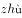），为地名用字，符合“姓氏人名、地名、科学技术术语和中小学语文教材文言文用字中未进入一、二级字表的较通用的字”，为三级字，该项汉字分级不正确，排除；

B项：“甩”为常用字，符合“主要满足基础教育和文化普及的基本用字需要”，为一级字；“偻”可以指身体弯曲，为书面用语，符合“主要满足出版印刷、辞书编纂和信息处理等方面的一般用字需要”，为二级字；“昄”读（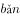），表示大的意思，组词为“昄大”时表示地名，符合“姓氏人名、地名、科学技术术语和中小学语文教材文言文用字中未进入一、二级字表的较通用的字”，为三级字，该项汉字分级正确，当选；

C项：“坋”读作（）时用于地名，读作坋（）时指尘埃、撒粉末，符合“姓氏人名、地名、科学技术术语和中小学语文教材文言文用字中未进入一、二级字表的较通用的字”，为三级字，该项汉字分级不正确，排除；

D项：“焘”读作（或），意为覆盖，常用于正式的书面表达，符合“主要满足出版印刷、辞书编纂和信息处理等方面的一般用字需要”，为二级字，该项汉字分级不正确，排除。

故正确答案为B。

---

## 第 19 题　qid 10297336 · 定义判断

三明治法则是指在批评他人时把批评夹在表扬或期待中间，从而使被批评者更好地接受批评和建议。
根据上述定义，下列没有体现三明治法则的是：

- **A**. “看得出你调研下了很大功夫，但在撰写正文时分析角度过于单一，可惜了你辛苦调研得来的宝贵数据。”
- **B**. “这项业务你一向做得不错，这次怎么完成得这么马虎？我相信以你的能力一定可以想出妥当的补救办法。”
- **C**. “你以前总喜欢打断别人说话，今天竟然能够等她表达完意见再发言，我真感到惊讶。你今后要是能一直这样就好了。”　✅
- **D**. “人格独立是你的优点，但这件事如果你当时解释一下大家就理解了，我们都不想因为一个误会而失去你这么好的朋友。”

**答案**：C

**官方解析**

第一步：找出定义关键词。
“在批评他人时”、“把批评夹在表扬或期待中间”、“使被批评者更好地接受批评和建议”
第二步：逐一分析选项。
A项：先提出“下了很大功夫”进行表扬，再提出“分析角度过于单一”进行批评，最后用“宝贵数据”进行表扬，符合“在批评他人时”、“把批评夹在表扬或期待中间”，符合定义，排除；
B项：先提出“这项业务你一向做得不错”进行表扬，再提出“这次完成得马虎”进行批评，最后用“你一定可以想出补救办法”进行期待，符合“在批评他人时”、“把批评夹在表扬或期待中间”，符合定义，排除；
C项：直接提出“以前总喜欢打断别人说话”，再提出“今天竟然能够等她表达完意见再发言”进行表扬，主要目的就是表扬而不是批评，不符合“在批评他人时”、“把批评夹在表扬或期待中间”，不符合定义，当选；
D项：先提出“人格独立是你的优点”进行表扬，再提出“如果你当时解释一下”进行批评，最后用“不想失去你这么好的朋友”进行期待，符合“在批评他人时”、“把批评夹在表扬或期待中间”，符合定义，排除。
本题为选非题，故正确答案为C。

---

## 第 20 题　qid 10297335 · 定义判断

汉语中有一类名词连名词的复合词，其词素组合顺序为，前一个词素是被修饰、被限定的成分，后一个词素是修饰、限定成分，称为“正偏式”名-名复合词。
根据上述定义，下列属于“正偏式”名-名复合词的是：

- **A**. 火舌　✅
- **B**. 布衣
- **C**. 兄弟
- **D**. 车速

**答案**：A

**官方解析**

第一步：找出定义关键词。
“名词连名词的复合词”、“前一个词素是被修饰、被限定的成分”、“后一个词素是修饰、限定成分”。
第二步：逐一分析选项。
A项：火舌指比较高的火苗，由“火”“舌”两个名词复合而成，符合“名词连名词的复合词”，其中“舌”用来修饰“火”，符合“前一个词素是被修饰、被限定的成分”、“后一个词素是修饰、限定成分”，符合定义，当选；
B项：布衣指用布做的衣服，由“布”“衣”两个名词复合而成，符合“名词连名词的复合词”，其中“布”用来修饰“衣”，不符合“前一个词素是被修饰、被限定的成分”、“后一个词素是修饰、限定成分”，不符合定义，排除；
C项：兄弟指哥哥和弟弟，由“兄”“弟”两个名词复合而成，符合“名词连名词的复合词”，其中“兄”和“弟”为并列关系，不存在修饰关系，不符合“前一个词素是被修饰、被限定的成分”、“后一个词素是修饰、限定成分”，不符合定义，排除；
D项：车速指车辆运行的速度，由“车”“速”两个名词复合而成，符合“名词连名词的复合词”，其中“车”用来修饰“速”，不符合“前一个词素是被修饰、被限定的成分”、“后一个词素是修饰、限定成分”，不符合定义，排除。
故正确答案为A。

---

## 第 21 题　qid 10297360 · 定义判断

节能诊断是指根据企业工艺流程及流程中每个生产节点上的能源消耗状况和能源利用率等情况，发现问题，并用系统学方法找出问题的根本，预测节能潜力，提出具体技术措施的过程。
根据上述定义，下列可能属于节能诊断的是：

- **A**. 某机构按照国家标准对某建筑的能源利用率进行计算评估
- **B**. 某政府部门组织专家对其办公大楼新建的供暖设备进行验收
- **C**. 某机构对一企业工艺流程中的工业固废综合利用情况进行评估
- **D**. 某咨询机构根据一钢铁企业工艺流程中能耗情况提出节能建议　✅

**答案**：D

**官方解析**

第一步：找出定义关键词。
“根据企业工艺流程及流程中每个生产节点上的能源消耗状况和能源利用率等情况，发现问题”、“找出问题的根本，预测节能潜力，提出具体技术措施”。
第二步：逐一分析选项。
A项：某机构按照国家标准对某建筑的能源利用率进行计算评估，是对建筑进行评估，不是从企业的工艺流程发现问题，不符合“根据企业工艺流程及流程中每个生产节点上的能源消耗状况和能源利用率等情况，发现问题”，不符合定义，排除；
B项：某政府部门组织专家对其办公大楼新建的供暖设备进行验收，对供暖设备进行验收，不是从企业的工艺流程发现问题，不符合“根据企业工艺流程及流程中每个生产节点上的能源消耗状况和能源利用率等情况，发现问题”，不符合定义，排除；
C项：某机构对一企业工艺流程中的工业固废综合利用情况进行评估，对工业固废的利用情况进行评估，没有对节能提出具体的技术措施，不符合“找出问题的根本，预测节能潜力，提出具体技术措施”，不符合定义，排除；
D项：某咨询机构根据一钢铁企业工艺流程中能耗情况提出节能建议，是根据企业工艺流程中的能源消耗情况，提出具体技术措施，符合“根据企业工艺流程及流程中每个生产节点上的能源消耗状况和能源利用率等情况，发现问题”、“找出问题的根本，预测节能潜力，提出具体技术措施”，符合定义，当选。
故正确答案为D。

---

## 第 22 题　qid 10297337 · 定义判断

词语遮蔽效应是指当需要记忆的事件难以用语言来把握时，词语化可能反而会有损记忆，导致记忆错觉的现象。
根据上述定义，下列体现词语遮蔽效应的是：

- **A**. 在学习新课文时反复朗读背诵的学生比未反复朗读背诵的学生默写成绩更好
- **B**. 在外出采风时认真临摹风景的人比用语言文字将风景描写出来的人对风景细节的记忆更为深刻
- **C**. 初次品酒时用语言描述不同白酒味道的人，对白酒的再认好于那些没有对酒味进行语言描述的人
- **D**. 两个人同时目击犯罪过程，用语言复述现场情况的人对犯罪过程的记忆比另一个没有用语言复述的人更不准确　✅

**答案**：D

**官方解析**

第一步：找出定义关键词。
“当需要记忆的事件难以用语言来把握时”、“词语化可能反而会有损记忆，导致记忆错觉的现象”。
第二步：逐一分析选项。
A项：学习新课文属于容易用语言记忆的事件，不符合“当需要记忆的事件难以用语言来把握时”，反复朗读背诵的学生比未反复朗读背诵的学生默写成绩更好，说明语言记忆效果更好，不符合“词语化可能反而会有损记忆，导致记忆错觉的现象”，不符合定义，排除；
B项：认真临摹风景的人比用语言文字将风景描写出来的人对风景细节的记忆更为深刻，但记忆相较而言不够深刻并不等同于出现记忆错觉，不符合“词语化可能反而会有损记忆，导致记忆错觉的现象”，不符合定义，排除；
C项：初次品酒时用语言描述不同白酒味道的人，对白酒的再认好于那些没有对酒味进行语言描述的人，说明用语言描述过记忆效果更好，不符合“词语化可能反而会有损记忆，导致记忆错觉的现象”，不符合定义，排除；
D项：用语言复述现场情况的人对犯罪过程的记忆比另一个没有用语言复述的人更不准确，说明用语言复述反而会有损记忆，符合“词语化可能反而会有损记忆，导致记忆错觉的现象”，符合定义，当选。
故正确答案为D。

---

## 第 23 题　qid 10297313 · 定义判断

角误差是指被评价者在某一方面表现不佳，导致评价者对此人其他所有方面均给予较低的评价。
根据上述定义，下列属于角误差的是：

- **A**. 甲匆忙参加一项面试，没准备正式的服装，尽管面试表现优异，但最终面试分数很低　✅
- **B**. 乙的单位在年度绩效考核中，考核组给全单位员工的评语相差不多，全部员工都被评为“合格”
- **C**. 丙在公司的比赛中获得技能大奖，部门领导给予其能力突出、团结同事、爱岗敬业的评价，丙因此获得部门年度优秀员工荣誉
- **D**. 丁在单位参加了一个核心技术攻关组并与同组的同事一起取得了理想的成果，但其他组员太出色了，导致丁的绩效评价低于应有等级

**答案**：A

**官方解析**

第一步：找出定义关键词。
“被评价者在某一方面表现不佳，导致评价者对此人其他所有方面均给予较低的评价”。
第二步：逐一分析选项。
A项：该项指出甲虽然在面试中表现优异，但因为在着装方面表现不佳，导致面试分数很低，符合“被评价者在某一方面表现不佳，导致评价者对此人其他所有方面均给予较低的评价”，符合定义，当选；
B项：该项指出乙的单位对员工的评价均为合格，没有涉及因某一方面表现不佳而导致其他方面评价均较低的情况，不符合“被评价者在某一方面表现不佳，导致评价者对此人其他所有方面均给予较低的评价”，不符合定义，排除；
C项：该项指出丙获奖并受到表扬，没有涉及表现不佳的方面和低评价，不符合“被评价者在某一方面表现不佳，导致评价者对此人其他所有方面均给予较低的评价”，不符合定义，排除；
D项：该项指出因为组队的同事都很优秀，所以丁绩效评价较低，这不是因为丁的某一方面表现不佳，不符合“被评价者在某一方面表现不佳，导致评价者对此人其他所有方面均给予较低的评价”，不符合定义，排除。
故正确答案为A。

---

## 第 24 题　qid 10297355 · 定义判断

无意识代偿是指人在无意识状态下通过寻求某方面的满足或成就，来弥补或掩盖自己在另一方面的弱点、缺陷或挫败感的策略。
根据上述定义，下列属于无意识代偿的是：

- **A**. 穷困潦倒的老张，靠给村里人做短工维持生计，但在与别人闲聊时，总是会不经意提起自己祖上是大官　✅
- **B**. 一出生就没有双臂的小王，从小就自立自强，她学会用脚料理自己的生活，用脚写字，不仅顺利读完高中，还考上了大学
- **C**. 智商低于常人的阿甘，学业不佳，且因背部畸形在腿部装有金属支架，但一次被追逐的经历却意外开启了他惊人的运动天赋
- **D**. 长期忍受丈夫肢体与语言暴力的小赛，为维持亲朋好友对自己婚姻美满的印象，常在社交平台上晒出与丈夫摆拍的合影“秀恩爱”

**答案**：A

**官方解析**

第一步：找出定义关键词。
“人在无意识状态下”、“通过寻求某方面的满足或成就”、“来弥补或掩盖自己在另一方面的弱点、缺陷或挫败感的策略”。
第二步：逐一分析选项。
A项：老张总是不经意的，符合“人在无意识状态下”，通过提起自己祖上是大官，来弥补自己穷困潦倒的挫败感，符合“通过寻求某方面的满足或成就”、“来弥补或掩盖自己在另一方面的弱点、缺陷或挫败感的策略”，符合定义，当选；
B项：小王虽然出生就没有双臂，但是从小自立自强，完成了学业，这是有意识的弥补自身一方面的不足，不符合“人在无意识状态下”，不符合定义，排除；
C项：阿甘虽然智商和身体均不佳，但是在一次偶然的经历中发现自己的天赋，这是偶然之中发现的，且也没有无意识之中通过运动的天赋来弥补自己智商和身体的不佳，不符合“人在无意识状态下”，也不符合“通过寻求某方面的满足或成就”、“来弥补或掩盖自己在另一方面的弱点、缺陷或挫败感的策略”，不符合定义，排除；
D项：小赛长期忍受丈夫肢体与语言暴力，还在社交平台秀恩爱，是为了维持亲朋好友对自己婚姻美满的印象，不符合“人在无意识状态下”，且选项仅表现了小赛在婚姻这一个方面表里不一，不符合“通过寻求某方面的满足或成就”、“来弥补或掩盖自己在另一方面的弱点、缺陷或挫败感的策略”，不符合定义，排除。
故正确答案为A。

---

## 第 25 题　qid 10297352 · 定义判断

第三航权是一个国家授予另一个国家定期或不定期国际航班在其领土内卸下来自承运人本国的旅客或货物的权利。第四航权是一个国家授予另一个国家定期或不定期国际航班在其领土内装上前往承运人本国的旅客或货物的权利。
根据上述定义，下列体现了第四航权的是：

- **A**. 加拿大航空在洛杉矶与墨西哥城的航线市场上提供服务
- **B**. 新加坡民航飞机在飞往芝加哥航线上经停厦门，上下客货
- **C**. 中国民航飞机从北京运载货物在东京进港，然后运载乘客返回　✅
- **D**. 美国民航飞机承运旧金山-上海航线，中间在安克雷奇加油维修

**答案**：C

**官方解析**

第一步：找出定义关键词。
第三航权：“一个国家授予另一个国家”、“在其领土内卸下来自承运人本国的旅客或货物的权利”；
第四航权：“一个国家授予另一个国家”、“在其领土内装上前往承运人本国的旅客或货物的权利”。
第二步：逐一分析选项。
A项：“加拿大”航空在洛杉矶（美国城市）与墨西哥城（墨西哥城市）的航线市场上提供服务，只体现了该航空在两个外国的城市之间提供服务，并没有体现该航空载着外国客货返回承运人本国（即加拿大），不符合“在其领土内装上前往承运人本国的旅客或货物的权利”，不符合“第四航权”定义，排除；
B项：“新加坡”民航飞机在飞往芝加哥（美国城市）航线上经停厦门（中国城市），上下客货，说明该民航飞机装载客货后前往的目的地是美国，而非返回承运人本国（即新加坡），不符合“在其领土内装上前往承运人本国的旅客或货物的权利”，不符合“第四航权”定义，排除；
C项：“中国”民航飞机从北京（中国城市）运载货物在东京（日本城市）进港，然后运载乘客返回，说明日本授权了该中国民航飞机可以在日本运载客货，符合“一个国家授予另一个国家”，“运载乘客返回”说明“中国”民航飞机在日本装载了乘客返回承运人本国（即中国），符合“在其领土内装上前往承运人本国的旅客或货物的权利”，符合“第四航权”定义，当选；
D项：“美国”民航飞机承运旧金山（美国城市）-上海（中国城市）航线，中间在安克雷奇（美国城市）加油维修，只体现了该民航飞机要前往国外，并没有体现该民航飞机载着客货返回承运人本国（即美国），不符合“在其领土内装上前往承运人本国的旅客或货物的权利”，不符合“第四航权”定义，排除。
故正确答案为C。

---

## 第 26 题　qid 10297282 · 逻辑判断

某单位所有正式编制员工都参加了周末举办的团建活动，该单位后勤部门所有员工都不是正式编制员工，综合部门有的员工没有参加周末举办的团建活动。
由此可以推出该单位：

- **A**. 综合部门有的员工不是正式编制员工　✅
- **B**. 有的正式编制员工不是综合部门的员工
- **C**. 后勤部门有的员工没有参加周末举办的团建活动
- **D**. 后勤部门所有员工都参加了周末举办的团建活动

**答案**：A

**官方解析**

第一步：翻译题干。

（1）正式编制员工团建活动；

（2）后勤部门员工正式编制员工；

（3）有的综合部门员工团建活动。

将（1）（3）串联可得：（4）有的综合部门员工团建活动正式编制员工。

第二步：逐一分析选项。

A项：翻译为“有的综合部门员工正式编制员工”，与条件（4）推理一致，可以推出，当选；

B项：翻译为“有的正式编制员工综合部门员工”，条件（4）中“有的不是”无法直接换位，无法得到“有的正式编制员工不是综合部门员工”，无法推出，排除；

C项：翻译为“有的后勤部门员工团建活动”，题干中不涉及“后勤部门员工”与“团建活动”之间的逻辑关系，无法推出，排除；

D项：翻译为“后勤部门员工团建活动”，题干中不涉及“后勤部门员工”与“团建活动”之间的逻辑关系，无法推出，排除。

故正确答案为A。

---

## 第 27 题　qid 10297302 · 逻辑判断

小贾、小易、小白、小单4人参加夏令营，每人先从雏鹰行动营、精英成长营、综合素质营3类中选择1类，再从该类别中选择1-3个夏令营。已知：
（1）小贾和小单选择的夏令营种类和数量均不同；
（2）有1人选择了1个夏令营，有2人选择了2个夏令营；
（3）小白选择综合素质营中的3个夏令营；
（4）每类夏令营都有人选择，小易和小单选择了雏鹰行动营。
由此可以推出：

- **A**. 小易选择了2个夏令营　✅
- **B**. 小贾和小白选择了同一类夏令营
- **C**. 有人与小白选择了相同的类别或数量
- **D**. 小单选择了雏鹰行动营中的2个夏令营

**答案**：A

**官方解析**

第一步：分析题干条件。
（1）小贾和小单选择的夏令营种类和数量均不同；
（2）有1人选择了1个夏令营，有2人选择了2个夏令营；
（3）小白选择综合素质营中的3个夏令营；
（4）每类夏令营都有人选择，小易和小单选择了雏鹰行动营；
（5）每人先从3类夏令营中选择1类，再从该类别中选择1-3个夏令营。
第二步：根据题干条件进行推理。
根据条件（2）（3）可知，小白选择了3个夏令营，则小贾、小易、小单中有1人选择了1个夏令营，有2人选择了2个夏令营；结合条件（1）可知，小贾和小单中有1人选择了1个夏令营，有1人选择了2个夏令营，则小易只能选择2个夏令营，对应A项。
故正确答案为A。

---

## 第 28 题　qid 10297348 · 逻辑判断

一场歌唱比赛，甲、乙、丙、丁4人包揽前四名。关于排名情况，4名观众的猜测如下：
观众1：只要乙获得亚军，甲就能获得季军；
观众2：丙获得冠军，或者丁不是第四名；
观众3：甲未获得季军；
观众4：丙获得亚军。
结果发现只有1名观众的猜测为真，由此可以推出：

- **A**. 甲获得冠军　✅
- **B**. 乙获得第四名
- **C**. 丙获得亚军
- **D**. 丁获得季军

**答案**：A

**官方解析**

第一步：分析题干条件。

（1）乙亚军甲季军，等价于：乙亚军 或 甲季军；

（2）丙冠军 或 丁第四；

（3）甲季军；

（4）丙亚军。

第二步：根据题干条件进行推理。

条件中不存在明显的矛盾和反对关系，考虑假设。条件（1）和条件（3）中都出现了对于甲是否为季军的判定，如果甲获得季军，那么条件（1）为真，如果甲没有获得季军，那么条件（3）为真，所以条件（1）和条件（3）必有一真，又由于只有1个条件为真，故条件（2）和条件（4）均为假。

根据条件（2）为假可知，丙没有获得冠军且丁是第四名，根据条件（4）为假可知，丙没有获得亚军，因此丙是季军。此时条件（3）为真，那么条件（1）为假，可以推出乙获得亚军，故甲为冠军，只有A项符合。

故正确答案为A。

---

## 第 29 题　qid 10297353 · 类比推理

小李和小王玩石头剪刀布，有人赢两次就获胜。已知他们分出了胜负，且到结束时小李一共出了9个手指，小王一共出了5个手指。
问以下哪个选项不可能发生？

- **A**. 小李连赢两次并获胜
- **B**. 两人连续三次没分出胜负
- **C**. 小李一度落后情况下逆转获胜
- **D**. 小王一度落后情况下逆转获胜　✅

**答案**：D

**官方解析**

第一步：分析题干条件。
（1）有人赢两次就获胜；
（2）小李和小王分出了胜负；
（3）小李一共出了9个手指，小王一共出了5个手指。
第二步：根据题干条件进行推理。
根据石头剪刀布游戏内容可知：石头为0个手指、剪刀为2个手指、布为5个手指；
根据石头剪刀布游戏输赢规则可知：石头赢剪刀、剪刀赢布、布赢石头，即0赢2、2赢5、5赢0；
根据条件（3）小李出9个手指可知，至少完成了3局游戏，且其中三局小李一定出剪刀2、剪刀2和布5，即522组合（顺序不定）；
根据上述推理和条件（3）小王出5个手指可知，其中三局小王一定出石头0、石头0和布5，即500组合（顺序不定）；
此外，上述三局确定发生外，还可能存在其他双方都出石头0的对局。
本题提问方式为“不可能”，可以考虑代入法解题。
代入A项：小李连赢两次并获胜，假设小李出的顺序为252，小王出的顺序为005，此时选项成立，排除；
代入B项：两人连续三次没分出胜负，假设小李和小王在前三局中双方均出石头0，三局均打平，后续局数可以满足题干其他条件，此时选项成立，排除；
代入C项：小李一度落后情况下逆转获胜，A项中“小李出的顺序为252，小王出的顺序为005”的情况满足“小李一度落后情况下逆转获胜”，此时选项成立，排除；
代入D项：小王一度落后情况下逆转获胜，根据题干条件可知，小李出的组合为522（顺序不定），小王出的组合为500（顺序不定），可以推出小王不可能出2，不存在赢5的可能，且小王只有1个5，也不能连续赢00，所以小王要想连赢两局，就只能在最后的两局中赢“22”、“02”或“20”。
第一种情况：最后的两局中赢“22”，那么小李出“2”的时候小王必须出“0”，此时之前的局数中小王只能出0或5，小李也只能出0或5，如果两人同时出0和5，此前局数均为平手，不满足“一度落后情况下逆转获胜”，如果小李出5的情况下，小王出0，小李赢小王，那必然至少还有一局，小王出5，小李出0，此时小王赢小李，也不满足“一度落后情况下逆转获胜”，此种情况选项不可能成立；
第二种情况：最后的两局中赢“02”或“20”，那么小王只能出“50”或“05”，此时之前的局数中小王只能出0，小李则至少出一个2、一个5，那么小王在之前的局数中至少赢一局，输一局，不满足“一度落后情况下逆转获胜”，此种情况选项不可能成立；
综合上述情况，D项均不可能成立，当选。
本题为选非题，故正确答案为D。
注：本题D项验证过程较为复杂，建议排除ABC三项后直接选择D项。

---

## 第 30 题　qid 10297347 · 逻辑判断

某研究团队在2013-2020年对分布在德国南部和奥地利的白鹳进行技术跟踪，收集的跟踪数据能确定白鹳的迁徙路线。结果显示，白鹳的飞行路线在不断变化，路过一些新地方。专家认为白鹳通过学习不断完善迁徙路线。
以下哪项如果为真，最有可能是专家得出结论的论据?

- **A**. 成年白鹳会教幼鸟各种捕食技能
- **B**. 白鹳在迁徙目的地附近会探索一些新地方，更好地过冬
- **C**. 迁徙途中遇到突发的危险，白鹳会绕路避险，但不会改变目的地
- **D**. 随着迁徙次数增多，白鹳迁徙路线更优，完成时间更短，耗费能量更少　✅

**答案**：D

**官方解析**

第一步：找出论点和论据。
论点：白鹳通过学习不断完善迁徙路线。
论据：白鹳的飞行路线在不断变化，路过一些新地方。
本题的论据是发现“白鹳的飞行路线会变化”这一现象，论点说的是“白鹳通过学习不断完善迁徙路线”，论点和论据都在说“白鹳飞行路线变化”，从论据可以合理推出论点，故论据和论点话题一致，加强优先考虑补充论据，即解释白鹳通过学习完善迁徙路线的原因或举例证明。
第二步：逐一分析选项。
A项：该项说的是白鹳的捕食技能，而论点说的是白鹳通过学习完善迁徙路线，话题不一致，无法加强，排除；
B项：该项说的是白鹳在“目的地”周围的行为，而论点说的是白鹳通过学习完善迁徙路线，话题不一致，无法加强，排除；
C项：该项说的是白鹳会绕路避险，而论点说的是白鹳通过学习完善迁徙路线，话题不一致，无法加强，排除；
D项：该项说的是随着迁徙次数增多，白鹳的迁徙路线是在不断优化的，解释了为什么白鹳是通过学习来完善迁徙路线的，补充论据，可以加强，当选。
故正确答案为D。

---

## 第 31 题　qid 10297362 · 逻辑判断

金伯利岩是一种稀有的火山岩。从这些岩石上能看出火山曾猛烈喷发的痕迹，其化学和矿物成分也有别于地球上其他岩浆岩。尤其是有些金伯利岩包含厘米级大小的稀有矿物晶体，如铁尖晶橄榄石和布氏岩等。因此，人们推测这一类含有稀有矿物晶体的金伯利岩很可能来自地幔。 
以下哪项如果为真，最能支持上述结论？

- **A**. 布氏岩是下地幔的一种主要矿物
- **B**. 铁尖晶橄榄石只能形成于上、下地幔之间的过渡带　✅
- **C**. 有些金伯利岩中的矿物成分在地球表面无法稳定存在
- **D**. 这类金伯利岩和原始地幔中都含有锶和钕这两种元素

**答案**：B

**官方解析**

第一步：找出论点和论据。
论点：这一类含有稀有矿物晶体的金伯利岩很可能来自地幔。
论据：这些岩石上能看出火山曾猛烈喷发的痕迹，其化学和矿物成分也有别于地球上其他岩浆岩。尤其是有些金伯利岩包含厘米级大小的稀有矿物晶体，如铁尖晶橄榄石和布氏岩。
论据讨论的是 “这类金伯利岩与地球上其他岩浆岩有区别，尤其是包含厘米级大小的稀有矿物晶体，如铁尖晶橄榄石和布氏岩”，论点说的是“这一类含有稀有矿物晶体的金伯利岩很可能来自地幔”，论据说的是包含成分，论点说来源，故论据和论点话题不一致，加强优先考虑搭桥。
第二步：逐一分析选项。
A项：该项说明在下地幔中含有丰富的布氏岩，但并未说明地球的其他层布氏岩的分布情况，因此无法直接得出布氏岩来自地幔层的结论，为不明确项，无法加强，排除；
B项：该项通过“只能形成于”建立起铁尖晶橄榄石和地幔间的联系，且是具有唯一性的联系，为搭桥项，当选；
C项：论点说这类金伯利岩可能来自地幔，该项说其中的有些矿物成分在地球表面无法稳定存在，话题不一致，排除； 
D项：该项说都含有锶和钕这两种元素，但这类金伯利岩是否来自于地幔不确定，为不明确项，无法加强，排除。
故正确答案为B。

---

## 第 32 题　qid 10297365 · 逻辑判断

某单位即将组织员工进行常规体检，小张说：“上周老王刚被查出了癌症晚期，单位年年组织做体检都没查出来，说明这个体检根本没用！我还是不去了。”
以下哪项如果为真，不能反驳小张的观点？

- **A**. 老王患的是肝癌，早期发展到晚期只需数月
- **B**. 单位组织的常规体检项目难以查出早期癌症　✅
- **C**. 单位在今年的体检项目中新增了癌症筛查项目
- **D**. 常规体检可以提前发现一些疾病，有助于及早治疗

**答案**：B

**官方解析**

第一步：找出论点和论据。
论点：这个（某单位组织的）体检没有用。
论据：上周老王刚被查出了癌症晚期，单位年年组织做体检都没查出来。
本题论点说的是单位组织的体检是否有用，而论据说的是上周老王患了癌症去年体检未被检出。论点论据话题不一致，因为本题是选非题，找到可削弱的选项排除即可。
第二步：逐一分析选项。
A项：该项指出老王患的病较为特殊，早期发展到晚期只需数月，而单位组织的是年度体检，某个特殊情况不代表单位组织的体检没用，为拆桥项，可以削弱，排除；
B项：该项指出单位组织的体检难以查出早期癌症，说明单位组织的体检确实没用，可以加强，不能削弱，当选；
C项：该项指出单位组织的体检项目新增了癌症筛查，说明不能用往年的事例说明这次新的单位体检没用，为拆桥项，可以削弱，排除；
D项：该项指出单位的常规体检可以提前发现一些疾病并治疗，说明单位的体检还是有用的，削弱论点，可以削弱，排除。
本题为选非题，故正确答案为B。

---

## 第 33 题　qid 10297354 · 逻辑判断

某研究发现，连续8周每天服用450-900毫克茶氨酸后，被试的睡眠满意度显著提高。某厂商因此推出一款含有茶氨酸的饮料，并以该研究为主要内容拍摄广告，声称这款饮料有助于缓解失眠、促进睡眠。
以下哪项如果为真，最能质疑该厂商的说法？

- **A**. 该饮料茶氨酸含量较低，要达到450毫克的实验剂量，一天需要饮用4-5瓶
- **B**. 茶氨酸可通过影响大脑中的神经传导物质来减缓神经冲动，帮助缓解紧张情绪
- **C**. 茶氨酸易溶于水，能够消减咖啡碱引起的苦涩味并增强鲜味和甜味，使饮料味道更好
- **D**. 参与该研究的被试均患有症状为持续紧张不安的广泛焦虑症，且实验期间服用了抗抑郁药物　✅

**答案**：D

**官方解析**

第一步：找出论点和论据。

论点：这款饮料有助于缓解失眠、促进睡眠。

论据：连续8周每天服用450-900毫克茶氨酸后，被试的睡眠满意度显著提高。某厂商因此推出一款含有茶氨酸的饮料。

本题论点讨论的是含有茶氨酸的饮料有助于缓解失眠、促进睡眠，论据讨论的是茶氨酸能够有助于睡眠，二者话题不一致，削弱优先考虑拆桥，也可以考虑削弱论点或他因削弱。

第二步：逐一分析选项。

A项：该项说的是该饮料茶氨酸的含量较低，一天需要饮用4-5瓶，“4-5瓶”并不是完全不可实现的天文数字，部分人可以每天饮用4-5瓶饮料，所以该项削弱力度比较弱，保留；

B项：该项说的是茶氨酸能够帮助缓解紧张情绪，从而可能让入睡前的心情更平静，解释了茶氨酸能够助眠的原因，加强项，无法削弱，排除；

C项：该项说的是茶氨酸易溶于水，能消减咖啡碱引起的苦涩味且增加鲜味和甜味，让饮料的味道更好，与论点讨论的含有茶氨酸的饮料能否有助于缓解失眠、促进睡眠无关，话题不一致，无法削弱，排除；

D项：该项说的是参与研究的被试者均患有焦虑症，且在“实验期间”服用了抗抑郁的药物，说明有可能是“抗抑郁的药物“ 起到了缓解失眠、促进睡眠的作用，他因削弱，可以削弱，保留；

对比A、D两项，可能有部分小伙伴认为A项是拆桥，但结合实际情况后可以发现，“每天需要饮用4-5瓶饮料”这个方式对于部分人是可以实现的，因此就无法通过“量”来拆断“茶氨酸”和“含茶氨酸的饮料”之间的联系。且查阅原文后得知，本题A项中出题人将原文中的“每天至少喝150瓶”缩减为“一天需要饮用4-5瓶”，可能也是有意为之，意在通过数量之间的巨大差异极大降低A项的削弱力度。

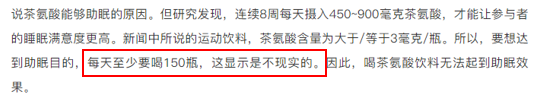

故正确答案为D。

---

## 第 34 题　qid 10297345 · 逻辑判断

某新闻媒体报道，某厂家生产的洗洁精含有甲醛，会危害人体健康。厂家对此回应：我厂生产的洗洁精确实含有甲醛，但不会对使用者的健康构成威胁。
以下哪项如果为真，最能支持厂家的说法？

- **A**. 甲醛常作为洗洁精的防腐抗菌剂使用
- **B**. 厂家已采用其他成分替代甲醛，这种新成分对人体无害
- **C**. 正常使用该洗洁精不会产生甲醛残留，不存在健康隐患　✅
- **D**. 经有关部门多次检测，该洗洁精都未检出甲醛含量超标

**答案**：C

**官方解析**

第一步：找出论点和论据。
论点：我厂生产的洗洁精确实含有甲醛，但不会对使用者的健康构成威胁。
论据：无。
本题只有论点，没有论据，加强优先考虑补充论据。
第二步：逐一分析选项。
A项：该项指出甲醛常作为洗洁精的防腐抗菌剂使用，但不确定甲醛本身是否会对使用者的健康构成威胁，为不明确项，无法加强，排除；
B项：该项指出厂家已采用其他成分替代甲醛，这种新成分对人体无害，与甲醛是否会对使用者的健康构成威胁无关，为无关项，无法加强，排除；
C项：该项指出正常使用该洗洁精不会产生甲醛残留，不存在健康隐患，说明即使洗洁精本身含有甲醛，但清洗物品后无甲醛残留，也不会对使用者的健康构成威胁，补充论据，可以加强，当选；
D项：该项指出经有关部门多次检测，该洗洁精都未检出甲醛含量超标，但不确定含量未超标的甲醛是否会对使用者的健康构成威胁，为不明确项，无法加强，排除。
故正确答案为C。

---

## 第 35 题　qid 10297317 · 逻辑判断

一种观点认为，癌症可能具有传染性。一些患者罹患癌症后，其家人往往在不久之后也会查出相同的癌症。因此，一旦发现家人患了癌症，应该做好隔离措施，以防传染。
以下哪项如果为真，最能质疑上述观点？

- **A**. 感染乙型或丙型肝炎病毒会增加患肝癌的风险
- **B**. 目前还没有任何研究表明癌症可以通过接触或空气传染
- **C**. 类似的生活饮食习惯是家庭成员患同类癌症的主要外因
- **D**. 家庭成员先后患同类癌症的案例中，大多数是因为家族遗传　✅

**答案**：D

**官方解析**

第一步：找出论点和论据。
论点：癌症可能具有传染性。
论据：一些患者罹患癌症后，其家人往往在不久之后也会查出相同的癌症。
本题论点和论据都是在讨论癌症的传染性，二者话题一致，削弱优先考虑削弱论点。
第二步：逐一分析选项。
A项：该项说感染乙型或丙型肝炎病毒会增加患肝癌的风险，是病毒对患癌的影响，与论点讨论的癌症是否具有传染性无关，为无关项，无法削弱，排除；
B项：该项说目前没有任何研究表明癌症可通过接触或空气传染，没有研究表明不代表癌症就不具有传染性，为不明确项，无法削弱，排除；
C项：该项说类似的生活饮食习惯是家庭成员患同类癌症的主要外因，但未提及癌症本身是否具有传染性，为无关项，无法削弱，排除；
D项：该项说家庭成员先后患同类癌症的案例大多数是因为家族遗传，说明家人患相同的癌症是因为家族遗传，而不是患癌之后相互传染的，即癌症可能不具有传染性，削弱论点，当选。
故正确答案为D。

---
