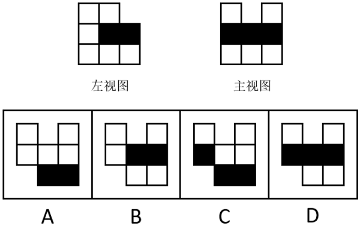
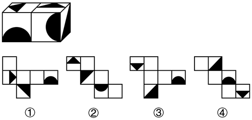
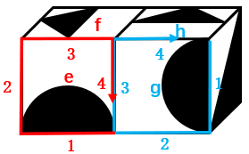
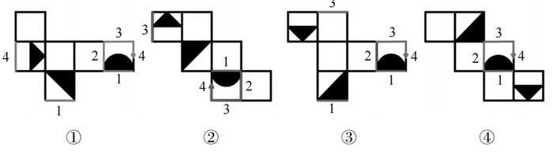

# 2025年海南省公务员录用考试《行测》题（网友回忆版）

> 判断推理 · 25 题 · 海南 2025

## 第 1 题　qid 13504266 · 图形推理

从所给的四个选项中，选择最合适的一个填入问号处，使之呈现一定规律性：

- **A**. A
- **B**. B
- **C**. C
- **D**. D　✅

**答案**：D

**官方解析**

解析一：元素组成不同，且无明显属性规律，考虑数量规律。观察发现，图形线条交叉明显，且每幅图均出现明显的弧线，考虑数曲直交点。曲直交点数均为1，排除B项；继续观察发现，题干图形曲直交点的特征依次为：曲线的端点与直线交叉、曲线的中段与直线“十字交叉”、曲线的端点与直线交叉、曲线的中段与直线“十字交叉”、曲线的端点与直线交叉，故？处图形的曲直交点应为曲线的中段与直线“十字交叉”，只有D项符合。
故正确答案为D。
解析二：
元素组成不同，且无明显属性规律，考虑数量规律。观察发现，图形线条交叉明显，且每幅图均出现明显的弧线，考虑曲直交点。曲直交点数均为1，排除B项；继续观察发现，题干图形曲直交点的特征为：曲线与直线（横线或竖线）相交、曲线与斜线相交、曲线与直线（横线或竖线）相交、曲线与斜线相交、曲线与直线（横线或竖线）相交，故？处图形的曲直交点应为曲线与斜线相交，只有A项符合。
故正确答案为A。
注：本题粉笔倾向于解析一。因为题干图形均只有一条曲线，曲线的端点或中段与直线相交的特征更明确；另外，解析二中图1为曲线与竖线相交，图3和图5为曲线与横线相交，其直线方向不完全一样。

---

## 第 2 题　qid 13504539 · 图形推理

下图为给定的多面体，将其沿a、b、c三个顶点所在的平面切开，其截面是（    ）。

- **A**. A
- **B**. B　✅
- **C**. C
- **D**. D

**答案**：B

**官方解析**

本题考查截面图。根据平面公理“过不在一条直线上的三点，有且只有一个平面”可以得出，经过a、b、c三点可以确定唯一的平面，即所得截面为B项，如下图所示：

故正确答案为B。

---

## 第 3 题　qid 12882042 · 图形推理

下面为15个白色块和3个黑色块立体图的左视图和主视图，那么俯视图应该是（    ）。

- **A**. A　✅
- **B**. B
- **C**. C
- **D**. D

**答案**：A

**官方解析**

本题考查三视图。左视图最右列上方有1个黑色正方形，且该黑色正方形正上方为空白，则对应俯视图最下方一行中必有小黑色正方形，排除B、D两项。左视图、主视图结合选项俯视图可以确定立体图形，逐一分析A、C选项。

A项：结合题干两个视图和A项，确定立体图形如下图所示（注意底层是7个白色块），立体图形有15个白色块和3个黑色块，符合题干要求；

C项：结合题干两个视图和C项，确定立体图形如下图所示（注意底层是7个白色块），立体图形有14个白色块和3个黑色块，不符合题干要求。

故正确答案为A。

---

## 第 4 题　qid 13504268 · 图形推理

从所给的四个选项中，选择最合适的一个填入问号处，使之呈现一定规律性：

- **A**. A
- **B**. B
- **C**. C
- **D**. D　✅

**答案**：D

**官方解析**

元素组成不同，且无明显属性规律，考虑数量规律。观察发现，题干图形均由黑白球组成，第一组图形黑球每次增加1个，白球每次增加2个；第二组图形黑球每次增加2个，白球每次增加1个，故？处图形应该包含6个黑球、3个白球，排除A、B两项；再次观察发现，题干图形都是由不同颜色的球组成，且明显分为内外两圈，考虑分开看。第一组图中，内圈的黑球依次顺时针增加1个，外圈的白球依次逆时针增加2个；第二组图中，前两幅图内圈的白球依次顺时针增加1个，外圈的两部分黑球各依次逆时针增加1个，？处图形应用此规律，只有D项符合。
故正确答案为D。

---

## 第 5 题　qid 13504308 · 图形推理

左下图为两个正方体组合而成的长方体，这两个正方体的外表面展开图分别可能是：

- **A**. ①和②　✅
- **B**. ③和④
- **C**. ①和④
- **D**. ②和③

**答案**：A

**官方解析**

将题干两个正方体的面标上字母序号，并在立体图形和外表面展开图的黑色半圆形面（面e和面g）中以黑色半圆形的直径所在的边为起始边，顺时针描边标号，如下图所示。

图①中，标出黑色半圆形面中对应的边1和边4后发现，二者与题干右侧正方体中面g的边1和边4对应一致，可能是题干右侧正方体的外表面展开图。

图②中，标出黑色半圆形面与小直角三角形面的公共边（即边3）后发现，边3与题干左侧正方体中面e和面f的公共边对应一致，可能是题干左侧正方体的外表面展开图。

图③中，标出黑色半圆形面中对应的边1和边3后发现，边1与题干右侧正方体中面g的边1不对应一致，不可能是题干右侧正方体的外表面展开图；边3与题干左侧正方体中面e的边3不对应一致，不可能是题干左侧正方体的外表面展开图。故图③不可能是组成长方体的任一正方体的外表面展开图。

图④中，黑色半圆形面中对应的边1与题干右侧正方体中面g的边1不对应一致，不可能是题干右侧正方体的外表面展开图；黑色半圆形面中对应的边3与题干左侧正方体中面e的边3不对应一致，不可能是题干左侧正方体的外表面展开图。故图④不可能是组成长方体的任一正方体的外表面展开图。

综上，两个正方体的外表面展开图可能是①和②，对应A项。

故正确答案为A。

---

## 第 6 题　qid 13504323 · 定义判断

情绪爆发策略是指在谈判过程中，当双方在某一个问题上相持不下，或者对方的态度、行为欠妥，要求不太合理时，通过情绪爆发、大发脾气等手段有意制造僵局逼迫对方，从而使对方被迫让步的谈判策略。
根据上述定义，下列符合情绪爆发策略的是：

- **A**. 小强脾气很是暴躁，做事没有耐心，经常一遇到不顺心的事就生气发火，家里人都不敢和他亲近
- **B**. 老王作为公司负责人经常出去谈判，有时遇到对方提出无理要求，他总会大发脾气直接离席，不再与对方谈判
- **C**. 谈判时，双方在某原则性问题上讨论了两天毫无进展，老周率领代表团临时离席表达自己的不满，最终对方作出了让步　✅
- **D**. 多多与父母沟通，要求买新手机，但被父母拒绝了，多多以离家出走要挟父母必须给他买，父母坚决不同意并对他进行了批评教育

**答案**：C

**官方解析**

第一步：找出定义关键词。
“在谈判过程中”、“双方在某一个问题上相持不下，或者对方的态度、行为欠妥，要求不太合理”、“通过情绪爆发、大发脾气等手段有意制造僵局逼迫对方”、“使对方被迫让步”。
第二步：逐一分析选项。
A项：小强脾气很是暴躁，做事没有耐心，遇到不顺心的事就生气发火，是日常做事的态度和行为，不符合“在谈判过程中”，家里人都不敢和他亲近，不符合“使对方被迫让步”，不符合定义，排除；
B项：老王在谈判过程中，遇到对方提出无理要求，不再与对方谈判，直接终止谈判而不是在继续的谈判中迫使对方让步，不符合“使对方被迫让步”，不符合定义，排除；
C项：谈判时，双方在某原则性问题上讨论了两天毫无进展，符合“在谈判过程中”、“双方在某一个问题上相持不下”，老周率领代表团临时离席表达自己的不满，最终对方作出了让步，符合“通过情绪爆发、大发脾气等手段有意制造僵局逼迫对方”、“使对方被迫让步”，符合定义，当选；
D项：多多以离家出走要挟父母必须给他买手机，但父母坚决不同意并对他进行了批评教育，证明父母没有让步，不符合“使对方被迫让步”，不符合定义，排除。
故正确答案为C。

---

## 第 7 题　qid 13504331 · 定义判断

主动收入就是用时间来换取金钱，它最大的特点就是必须花费时间和精力去获得，它是一种临时性收入，做一次工作得到一次回报。被动收入是不需要花费多少时间和精力，也不需要照看，就可以自动获得的收入。
根据上述定义，下列各项收入中不属于被动收入的是：

- **A**. 银行存款的收益
- **B**. 授权专利的许可费
- **C**. 每月固定的兼职工资　✅
- **D**. 退休后每月领到的退休金

**答案**：C

**官方解析**

第一步：找出定义关键词。
主动收入：“用时间来换取金钱”、“最大的特点就是必须花费时间和精力去获得”、“一种临时性收入，做一次工作得到一次回报”；
被动收入：“不需要花费多少时间和精力，也不需要照看，就可以自动获得的收入”。
第二步：逐一分析选项。
A项：银行存款的收益无需花费额外的时间和精力，就可自动获得利息，符合“不需要花费多少时间和精力，也不需要照看，就可以自动获得的收入”，符合“被动收入”定义，排除；
B项：授权专利的许可费无需花费额外的时间和精力，只要有人使用专利，就可获得许可费用，符合“不需要花费多少时间和精力，也不需要照看，就可以自动获得的收入”，符合“被动收入”定义，排除；
C项：每月固定的兼职工资是需要花费时间和精力的，也是做一次工作得到一次回报，符合“用时间来换取金钱”、“最大的特点就是必须花费时间和精力去获得”、“一种临时性收入，做一次工作得到一次回报”，符合“主动收入”定义，不符合“被动收入”定义，当选；
D项：退休后每月领到的退休金无需花费额外的时间和精力，是按照当前的相关制度，每月自动发放的，符合“不需要花费多少时间和精力，也不需要照看，就可以自动获得的收入”，符合“被动收入”定义，排除。
本题为选非题，故正确答案为C。

---

## 第 8 题　qid 13504340 · 定义判断

非组织公众就是在公共关系对象中，处于无组织状态的个体的总和，非组织公众一般包括流散型公众、聚散型公众、周期型公众和固定型公众。①流散型公众：极为分散的最不稳定的公众；②聚散型公众：因某一临时事件、活动或某一共同问题临时聚集在一起的公众；③周期型公众：按一定的规律聚集在一起的公众；④固定型公众：由于兴趣、爱好、习惯的影响，比较集中地与某些组织、社团、商店、杂志社或某种商品生产厂家保持稳定联系的公众。
根据上述定义，下列对应正确的是：

- **A**. 乘坐北京开往上海高铁的旅客——④
- **B**. 定期来某学校上课的函授班学员——③　✅
- **C**. 经常来社区棋牌室打牌的退休人员——②
- **D**. 奥运会期间来田径体育场观看比赛的观众——①

**答案**：B

**官方解析**

第一步：找出定义关键词。
①流散型公众：“极为分散”、“不稳定”；
②聚散型公众：“因某一临时事件、活动或某一共同问题”、“临时聚集”；
③周期型公众：“按一定的规律聚集在一起”；
④固定型公众：“由于兴趣、爱好、习惯的影响”、“与某些组织、社团、商店、杂志社或某种商品生产厂家保持稳定联系”。
第二步：逐一分析选项。
A项：乘坐北京开往上海高铁的旅客，“乘坐高铁”不符合“由于兴趣、爱好、习惯的影响”、“与某些组织、社团、商店、杂志社或某种商品生产厂家保持稳定联系”，不符合“固定型公众”定义，对应错误，排除；
B项：定期来某学校上课的函授班学员，“定期”符合“按一定的规律聚集在一起”，符合“周期型公众”定义，对应正确，当选；
C项：经常来社区棋牌室打牌的退休人员，“打牌”符合“由于兴趣、爱好、习惯的影响”，“经常来社区棋牌室”符合“与某些组织、社团、商店、杂志社或某种商品生产厂家保持稳定联系”，符合“固定型公众”定义，不符合“聚散型公众”定义，对应错误，排除；
D项：奥运会期间来田径体育场观看比赛的观众，“奥运会期间”“看比赛”符合“因某一临时事件、活动或某一共同问题”、“临时聚集”，符合“聚散型公众”定义，不符合“流散型公众”定义，对应错误，排除。
故正确答案为B。

---

## 第 9 题　qid 13504350 · 定义判断

通常把公开出版发行的文献称为白色文献，把涉及机密无法公开出版发行的文献称为黑色文献。灰色文献是指采用访问、会议、报告、通信等非正式科学交流方式传播的、尚未正式出版的文献。灰色文献介于白色和黑色文献之间，已经发行但不易通过一般销售渠道购得。
根据上述定义，下列不属于灰色文献的是：

- **A**. 某行业协会印刷的提供给协会会员使用的技术规范
- **B**. 某高校文学院为召开某次学术会议印刷的会议论文集
- **C**. 某考古学杂志社每期印刷的受众极小的专业类学术期刊　✅
- **D**. 某企业印刷的在其内部流通的塑造企业文化的内部刊物

**答案**：C

**官方解析**

第一步：找出定义关键词。
白色文献：“公开出版发行的文献”；
黑色文献：“涉及机密无法公开出版发行的文献”；
灰色文献：“采用访问、会议、报告、通信等非正式科学交流方式传播的、尚未正式出版的文献”、“已经发行但不易通过一般销售渠道购得”。
第二步：逐一分析选项。
A项：行业协会印刷的提供给协会会员使用的技术规范，是在协会的内部传播，不易通过一般销售渠道购得，符合“采用访问、会议、报告、通信等非正式科学交流方式传播的、尚未正式出版的文献”、“已经发行但不易通过一般销售渠道购得”，符合灰色文献的定义，排除；
B项：高校文学院为学术会议印刷的会议论文集，只适用在学术会议这一特定场合，尚未正式出版，也不能通过一般销售渠道购得，符合“采用访问、会议、报告、通信等非正式科学交流方式传播的、尚未正式出版的文献”、“已经发行但不易通过一般销售渠道购得”，符合灰色文献的定义，排除；
C项：考古学杂志社每期印刷的受众极小的学术期刊，虽然受众小，但也属于正式出版发行的文献，符合“公开出版发行的文献”，不符合“采用访问、会议、报告、通信等非正式科学交流方式传播的、尚未正式出版的文献”，符合白色文献的定义，不符合灰色文献的定义，当选；
D项：企业印刷的内部刊物只在其内部流通，并未正式出版，也不能通过一般销售渠道购得，符合“采用访问、会议、报告、通信等非正式科学交流方式传播的、尚未正式出版的文献”、“已经发行但不易通过一般销售渠道购得”，符合灰色文献的定义，排除。
本题为选非题，故正确答案为C。

---

## 第 10 题　qid 13504324 · 定义判断

文化再生产是指文化模式、信仰、价值观、习俗、语言和其他社会行为在时间上的持续性和在不同社会成员之间的传递，通常通过教育系统、家庭、媒体、宗教机构和其他社会机构来实现。这些机构通过传授知识、规范和行为模式，帮助新一代成员学习并内化其文化。
根据上述定义，下列一定属于文化再生产的是：

- **A**. 小王在单亲家庭长大，从小养成了独立的性格
- **B**. 在公司聚会上，小李向同事介绍自己的女朋友
- **C**. 某小学开设了具有当地特色的民俗课，深受学生喜爱　✅
- **D**. 电视上不断滚动播放着某品牌家用饮水设备的广告语

**答案**：C

**官方解析**

第一步：找出定义关键词。
“文化模式、信仰、价值观、习俗、语言和其他社会行为”、“时间上的持续性”、“不同社会成员之间的传递”。
第二步：逐一分析选项。
A项：单亲家庭中长大的小王，养成了独立的性格，性格是一个人对现实的相对稳定的态度，不符合“文化模式、信仰、价值观、习俗、语言和其他社会行为”，养成独立的性格也不符合“不同社会成员之间的传递”，不符合定义，排除；
B项：小李在公司聚会上向同事们介绍自己的女朋友，传递给同事的信息是关于女朋友的基本情况，不符合“文化模式、信仰、价值观、习俗、语言和其他社会行为”，不符合定义，排除；
C项：某小学开设了具有当地特色的民俗课，民俗课可以将当地特色的民间文化通过课程的形式传递给同学们，符合“文化模式、信仰、价值观、习俗、语言和其他社会行为”、“不同社会成员之间的传递”，课程深受学生喜爱，同学们通过学习逐渐了解并认同这些民俗，有利于把当地特色民俗传承下去，符合“时间上的持续性”，符合定义，当选；
D项：某品牌家用饮水设备的广告语不断在电视上滚动播放，电视广告传递的是饮水设备的产品信息，不符合“文化模式、信仰、价值观、习俗、语言和其他社会行为”，不符合定义，排除。
故正确答案为C。

---

## 第 11 题　qid 13504341 · 定义判断

校友经济是指在校友的社会活动中以母校为核心，通过母校与校友、校友与校友、母校与社会之间所产生的物质、文化、人才等方面的交流，从而给母校、校友以及社会带来客观收益的经济活动。校友经济以母校和校友为载体，目的是通过校友与母校之间天然的纽带，长期不断循环推动相关经济活动的发展。
根据上述定义，下列属于校友经济的是：

- **A**. 某大学校友会举办了校园招聘活动，23家校友企业出席并提供了超100个就业岗位　✅
- **B**. 某自媒体博主将自己赚的第一桶金捐给了贫困山区的学校，为他们购买了学习物资，助力乡村教育发展
- **C**. 某高校给予对学校建设和发展作出突出贡献的校友精神奖励，包括但不限于授予荣誉称号，聘请担任名誉职务等
- **D**. 某高校定期举办成功校友与在校学生座谈活动，让校友现身说法，通过典型宣传，进一步做实大学生思想政治工作

**答案**：A

**官方解析**

第一步：找出定义关键词。
“校友的社会活动中以母校为核心”、“以母校和校友为载体”、“给母校、校友以及社会带来客观收益的经济活动”。
第二步：逐一分析选项。
A项：校友会举办了校园招聘活动，校友企业提供了就业岗位，符合“校友的社会活动中以母校为核心”、“以母校和校友为载体”、“给母校、校友以及社会带来客观收益的经济活动”，符合定义，当选；
B项：某自媒体博主将自己赚的第一桶金捐给了贫困山区的学校，并没有体现母校与校友的核心主体，不符合“校友的社会活动中以母校为核心”、“以母校和校友为载体”、“给母校、校友以及社会带来客观收益的经济活动”，不符合定义，排除；
C项：某高校给予对学校建设和发展作出突出贡献的校友精神奖励，并未体现校友给母校带来的客观收益的经济活动，不符合“给母校、校友以及社会带来客观收益的经济活动”，不符合定义，排除；
D项：某高校定期举办成功校友与在校学生座谈活动，进一步做实大学生思想政治工作，属于教育引导，并没有涉及经济活动，不符合“给母校、校友以及社会带来客观收益的经济活动”，不符合定义，排除。
故正确答案为A。

---

## 第 12 题　qid 13504349 · 定义判断

组合是指把多项看似不相关的事物通过想象加以联接，从而使之变成新的整体。按照组合方式不同，组合可分为三种：同类组合是指若干相同事物的组合；异类组合是指两种或两种以上不同事物的组合；重组组合是指分解事物的原来组合，再按照新的目标重新组合。
根据上述定义，下列属于重组组合的是：

- **A**. 在手机壳背后安一个钢圈，制成带支架的手机壳
- **B**. 用100根雪糕棍制作成房子、坦克等手工艺制品
- **C**. 在台灯底座安装紫外线灭蚊装置，设计出灭蚊灯
- **D**. 将原来拼装成大风车的积木拆开，再拼装成飞机　✅

**答案**：D

**官方解析**

第一步：找出定义关键词。
组合：“把多项看似不相关的事物”、“通过想象加以联接”；
同类组合：“若干相同事物的组合”；
异类组合：“两种或两种以上不同事物的组合”；
重组组合：“分解事物的原来组合，再按照新的目标重新组合”。
第二步：逐一分析选项。
A项：在手机壳背后安装一个钢圈，是在原有的基础上加上一个东西，并未分解事物的原来组合，不符合“分解事物的原来组合，再按照新的目标重新组合”，不符合“重组组合”定义，排除；
B项：用100根雪糕棍制作成房子等手工艺制品，是同一种事物的组合，符合“若干相同事物的组合”，符合“同类组合”定义，不符合“重组组合”定义，排除；
C项：在台灯底座安装紫外线灭蚊装置，是在台灯底座原有的基础上安装，并未分解事物的原来组合，不符合“分解事物的原来组合，再按照新的目标重新组合”，不符合“重组组合”定义，排除；
D项：将原来拼装成大风车的积木拆开，符合“分解事物的原来组合”，再拼装成飞机，符合“再按照新的目标重新组合”，符合“重组组合”定义，当选。
故正确答案为D。

---

## 第 13 题　qid 13504269 · 类比推理

欲穷千里目：更上一层楼

- **A**. 为唤春来争艳朵：甘将香化育花泥　✅
- **B**. 不经一番寒彻骨：怎得梅花扑鼻香
- **C**. 欲上高楼去避愁：愁还随我上高楼
- **D**. 抛开俗事陪山坐：才得闲心听水歌

**答案**：A

**官方解析**

第一步：判断题干词语间逻辑关系。
“欲穷千里目，更上一层楼”的意思是想要看到千里之外的风光，那就要再登上更高的一层城楼，其中“欲穷千里目”是目的，“更上一层楼”是方式，二者为方式目的的对应关系。
第二步：判断选项词语间逻辑关系。
A项：“为唤春来争艳朵，甘将香化育花泥”的意思是为了春天的花朵绽放，甘愿化作花泥，其中“为唤春来争艳朵”是目的，“甘将香化育花泥”是方式，二者为方式目的的对应关系，与题干逻辑关系一致，当选；
B项：“不经一番寒彻骨，怎得梅花扑鼻香”的意思是只有经历艰苦（寒彻骨），才能获得美好的结果（梅花香），二者不是方式目的的对应关系，与题干逻辑关系不一致，排除；
C项：“欲上高楼去避愁，愁还随我上高楼”的意思是心想到高楼上观看美景躲避忧愁，忧愁还是跟着我上了高楼，二者不是方式目的的对应关系，与题干逻辑关系不一致，排除；
D项：“抛开俗事陪山坐，才得闲心听水歌”的意思是放下世俗的琐事、烦恼和欲望，与山为伴，亲近自然，才能获得内心的闲适与安宁，聆听流水的声音，感受自然的美好，二者为条件结果的对应关系，不是方式目的的对应关系，与题干逻辑关系不一致，排除。
故正确答案为A。

---

## 第 14 题　qid 13504281 · 类比推理

加大培训：稳定就业：扩充岗位

- **A**. 预防流感：接种疫苗：增强体质
- **B**. 增加营收：提高利润：降低成本　✅
- **C**. 建立信任：有效沟通：促成合作
- **D**. 浸泡催芽：翻土播种：浇水追肥

**答案**：B

**官方解析**

第一步：判断题干词语间逻辑关系。
加大培训和扩充岗位都是为了稳定就业，第一词和第三词都与第二词构成方式目的对应关系。
第二步：判断选项词语间逻辑关系。
A项：接种疫苗和增强体质都是为了预防流感，第二词和第三词都与第一词构成方式目的对应关系，与题干逻辑关系不一致，排除；
B项：增加营收和降低成本都是为了提高利润，第一词和第三词都与第二词构成方式目的对应关系，与题干逻辑关系一致，当选；
C项：建立信任和有效沟通都是为了促成合作，第一词和第二词都与第三词构成方式目的对应关系，与题干逻辑关系不一致，排除；
D项：先浸泡催芽，然后翻土播种，最后浇水追肥，三者为动作先后的对应关系，与题干逻辑关系不一致，排除。
故正确答案为B。

---

## 第 15 题　qid 13504387 · 类比推理

覆：盖：覆盖

- **A**. 寒：酸：寒酸
- **B**. 厚：重：厚重
- **C**. 喉：舌：喉舌
- **D**. 抚：摸：抚摸　✅

**答案**：D

**官方解析**

第一步：判断题干词语间逻辑关系。
“覆”、“盖”、“覆盖”均指遮盖，三者是近义关系。
第二步：判断选项词语间逻辑关系。
A项：“寒”指冷、穷困，“酸”指像醋的气味或味道，二者不是近义关系，与题干逻辑关系不一致，排除；
B项：“厚”指扁平物体上下两个面的距离大，“重”指分量较大、程度深，二者不是近义关系，与题干逻辑关系不一致，排除；
C项：“喉”指介于咽和气管之间的部分，“舌”指舌头，二者不是近义关系，与题干逻辑关系不一致，排除；
D项：“抚”、“摸”、“抚摸”均指用手指轻轻触摸，三者是近义关系，与题干逻辑关系一致，当选。
故正确答案为D。

---

## 第 16 题　qid 13504307 · 类比推理

法定节日：传统节日：纪念节日

- **A**. 国家秘密：商业秘密：工作秘密
- **B**. 劳动产品：手工产品：文创产品
- **C**. 儿童医院：公立医院：私立医院
- **D**. 帆布书包：双肩书包：学生书包　✅

**答案**：D

**官方解析**

第一步：判断题干词语间逻辑关系。
法定节日是由国家法律、法规统一规定的用以开展纪念、庆祝活动的节日；传统节日是一个民族或地区在长期历史发展中形成的、具有特定文化内涵和社会功能的节日；纪念节日一般是指某个国家为了纪念重大事件、伟人、先烈等特定的节日。三者是从不同的划分角度去命名的，互为交叉关系。
第二步：判断选项词语间逻辑关系。
A项：国家秘密是指关系国家安全和利益，依照法定程序确定，在一定时间内只限一定范围的人员知悉的事项；商业秘密是指能给权利人带来经济利益，且已采取保密措施的技术信息和经营信息，主体是企业、个体工商户等市场主体；工作秘密是指机关单位在公务活动里产生的内部事项。三者是针对三个不同的主体，互为并列关系，与题干逻辑关系不一致，排除；
B项：手工产品、文创产品均属于劳动产品，后两词与第一词均为种属关系，与题干逻辑关系不一致，排除；
C项：公立医院与私立医院为并列关系，与题干逻辑关系不一致，排除；
D项：帆布书包是根据书包的材质来划分，双肩书包是根据书包的背负方式来划分，学生书包是根据背负书包的主体来划分，三者是从不同的划分角度去命名的，互为交叉关系，与题干逻辑关系一致，当选。
故正确答案为D。

---

## 第 17 题　qid 12882040 · 类比推理

（    ） 对于 泄洪 相当于 挂号 对于 （    ）

- **A**. 水库；问诊
- **B**. 开闸；看病　✅
- **C**. 防溃坝；查病历
- **D**. 减水压；开药方

**答案**：B

**官方解析**

逐一代入选项。
A项：水库有泄洪的功能，二者为功能对应关系；先挂号，再问诊，二者为时间先后顺序对应关系，前后逻辑关系不一致，排除；
B项：开闸是为了泄洪，二者为方式目的对应关系；挂号是为了看病，二者为方式目的对应关系，前后逻辑关系一致，当选；
C项：泄洪是为了防溃坝，二者为方式目的对应关系；查病历与挂号无明显逻辑关系，前后逻辑关系不一致，排除；
D项：泄洪有减水压的作用，二者为功能对应关系；先挂号，再开药方，二者为时间先后顺序对应关系，前后逻辑关系不一致，排除。
故正确答案为B。

---

## 第 18 题　qid 13504406 · 类比推理

大天白日 对于 （    ） 相当于 （    ） 对于 月黑风高

- **A**. 昼伏夜行；光天化日
- **B**. 更深露重；日上三竿　✅
- **C**. 月明星稀；夜深人静
- **D**. 白日当空；夙兴夜寐

**答案**：B

**官方解析**

逐一代入选项。
A项：“大天白日”指白天，“昼伏夜行”指白天隐藏起来，晚上出来赶路，为避免被敌人发现所采取的秘密活动，二者无明显逻辑关系；“光天化日”指大家看得很清楚的地方，“月黑风高”比喻没有月光风也很大的夜晚，二者无明显逻辑关系，前后逻辑关系不一致，排除；
B项：“大天白日”指白天，“更深露重”指夜深后，外面很冷，开始有露水，二者形容的时间相反；“日上三竿”形容太阳升得很高，天已大亮，“月黑风高”比喻没有月光风也很大的夜晚，二者形容的时间相反，前后逻辑关系一致，当选；
C项：“大天白日”指白天，“月明星稀”指月亮明亮时，星星就显得稀疏了，二者形容的时间相反；“夜深人静”指深夜没有人声，非常寂静，“月黑风高”比喻没有月光风也很大的夜晚，二者形容的时间相近，前后逻辑关系不一致，排除；
D项：“大天白日”指白天，“白日当空”指太阳高悬天空，二者形容的时间相近；“夙兴夜寐”指早起晚睡，形容勤劳，“月黑风高”比喻没有月光风也很大的夜晚，二者无明显逻辑关系，前后逻辑关系不一致，排除。
故正确答案为B。

---

## 第 19 题　qid 13504380 · 逻辑判断

某公司举办年会，所有表演街舞的员工都表演了民族舞，所有表演民族舞的员工都表演了唱歌，有些表演吉他演奏的员工表演了诗朗诵，所有表演吉他演奏的员工都没有表演唱歌。
根据上述陈述，不能推出以下哪项？

- **A**. 所有表演街舞的员工都表演了唱歌
- **B**. 有些表演街舞的员工表演了吉他演奏　✅
- **C**. 有的表演诗朗诵的员工没有表演唱歌
- **D**. 所有表演吉他演奏的员工都没有表演民族舞

**答案**：B

**官方解析**

第一步：翻译题干。

①表演街舞表演民族舞；

②表演民族舞表演唱歌；

③有的表演吉他演奏表演诗朗诵；

④表演吉他演奏表演唱歌；

条件③可换位为：⑤有的表演诗朗诵表演吉他演奏；

可将条件①②逆否后和条件④⑤串联推出：⑥有的表演诗朗诵表演吉他演奏表演唱歌表演民族舞表演街舞。

第二步：逐一分析选项。

A项：翻译为表演街舞表演唱歌，“表演街舞”是对条件⑥的否后，否后必否前，可以推出，排除；

B项：翻译为有的表演街舞表演吉他演奏，根据条件⑥可知，表演吉他演奏表演街舞，将其逆否后为，表演街舞表演吉他演奏，“所有A不是B”与“有的A是B”互为矛盾关系，无法推出，当选；

C项：翻译为有的表演诗朗诵表演唱歌，根据条件⑥可以推出，排除；

D项：翻译为表演吉他演奏表演民族舞，“表演吉他演奏”是对条件⑥的肯前，肯前必肯后，可以推出，排除。

本题为选非题，故正确答案为B。

---

## 第 20 题　qid 13504379 · 逻辑判断

自己烧水喝与直接喝包装水，哪一种更健康？一种观点认为，包装水中含有大量的微塑料，直接喝包装水会使微塑料进入体内，危害健康，因此自己烧水喝比直接喝包装水健康，另一种观点则认为，当前微塑料污染无处不在，海洋、污水、淡水、饮用水中均含有微塑料，因此自己烧水喝与直接喝包装水对健康的影响是一样的。
以下哪项如果为真，最能削弱第二种观点？

- **A**. 在日常饮食中应尽量减少微塑料进入体内
- **B**. 把水烧开后，可以除去高达84%的微塑料　✅
- **C**. 自然水域中的微塑料已危害到野生动物健康
- **D**. 微塑料可以进入血液，甚至抵达心脏和大脑

**答案**：B

**官方解析**

第一步：找出论点和论据。
论点：自己烧水喝与直接喝包装水对健康的影响是一样的。
论据：当前微塑料污染无处不在，海洋、污水、淡水、饮用水中均含有微塑料。
本题论点讨论是自己烧水喝与直接喝包装水对健康的影响相同，论据讨论的是所有水中都含有微塑料，二者话题一致，削弱优先考虑削弱论点。
第二步：逐一分析选项。
A项：指出日常饮食中应该减少微塑料的摄入，与论点讨论的自己烧水喝与直接喝包装水对健康的影响相同无关，话题不一致，无法削弱，排除；
B项：指出水烧开后可以除去84%的微塑料，说明自己烧水喝比直接喝包装水摄入的微塑料少，因此自己烧水喝与直接喝包装水对健康的影响不一样，削弱论点，可以削弱，当选；
C项：指出自然水域中的微塑料危害到“野生动物”的健康，与论点讨论的“人体健康”无关，话题不一致，无法削弱，排除；
D项：指出微塑料的危害，但不清楚自己烧的水与直接饮用包装水中的微塑料含量是否相同，为不明确项，无法削弱，排除。
故正确答案为B。

---

## 第 21 题　qid 13504386 · 逻辑判断

紫外线照射会使黑色素过度积累，早前使用的一些抑制黑色素合成的化合物，如对苯二酚，对人类皮肤有毒性，已不再推荐作为美白剂使用，为此研究人员纷纷寻找应用在化妆品行业中更安全的美白剂。近日，研究人员从一种常见的寄居于人类皮肤上的细菌——结核硬脂酸棒状杆菌中，发现了酪氨酸酶抑制剂。实验证实，酪氨酸酶对人体细胞无毒，适合用于对抗色素沉着。研究人员认为，酪氨酸酶是一种安全有效的美白剂。
以下哪项如果为真，最能支持上述结论？

- **A**. 除了酪氨酸酶，在天然细菌中暂时还没找到其他能替代对苯二酚的物质
- **B**. 酪氨酸酶具有抗菌、抗癌等有益特性，进一步增强了其在各种治疗应用中的潜力
- **C**. 结核硬脂酸棒状杆菌是寄居在皮肤上的细菌，通常会成为与人体共生的细菌，其衍生产物毒性低　✅
- **D**. 结核硬脂酸棒状杆菌是人类皮肤表面的正常菌群，在一般情况下并不致病，即使致病也可使用抗生素治疗

**答案**：C

**官方解析**

第一步：找出论点和论据。
论点：酪氨酸酶是一种安全有效的美白剂。
论据：研究人员从一种常见的寄居于人类皮肤上的细菌——结核硬脂酸棒状杆菌中，发现了酪氨酸酶抑制剂。实验证实，酪氨酸酶对人体细胞无毒，适合用于对抗色素沉着。
本题论据说的是“酪氨酸酶对人体细胞无毒，适合用于对抗色素沉着”，进而得出论点“酪氨酸酶是一种安全有效的美白剂”，二者话题一致，加强优先考虑补充论据。
第二步：逐一分析选项。
A项：指出在天然细菌中暂时还没找到其他能替代对苯二酚的物质，但论点讨论的是酪氨酸酶是否是安全有效的美白剂，话题不一致，无法加强，排除；
B项：指出酪氨酸酶具有抗菌、抗癌等有益特性，但论点讨论的是酪氨酸酶是否是安全有效的美白剂，抗菌、抗癌等特性与美白剂的安全性和有效性没有直接关联，无法加强，排除；
C项：指出结核硬脂酸棒状杆菌是寄居在皮肤上的细菌，通常会成为与人体共生的细菌，其衍生产物毒性低，而酪氨酸酶是从结核硬脂酸棒状杆菌中发现的，说明酪氨酸酶具有安全性，补充论据，可以加强，当选；
D项：指出结核硬脂酸棒状杆菌在一般情况下并不致病，即使致病也可使用抗生素治疗，但并没有提到结核硬脂酸棒状杆菌中的酪氨酸酶是否可以作为安全有效的美白剂，话题不一致，无法加强，排除。
故正确答案为C。
特别说明：
本题文段用词不够精准，混淆了“酪氨酸酶”和“酪氨酸酶抑制剂”，文段想表达的意思是“酪氨酸酶”会催化黑色素合成，而“酪氨酸酶抑制剂”可以抑制黑色素合成，从而美白。
所以最后论点讨论“酪氨酸酶抑制剂”美白是否安全有效。只有C项说结核硬脂酸棒状杆菌的“衍生产物”（即“酪氨酸酶抑制剂”）毒性低，即相对来说是安全的，择优选择C项。

---

## 第 22 题　qid 13504369 · 逻辑判断

研究人员比较了过去几年自动驾驶车辆和人类驾驶车辆的相关数据发现，一般情况下，与人类驾驶相比，自动驾驶车辆在执行常规驾驶任务，如保持车道位置和根据车流调整位置时更安全，研究人员认为，以自动驾驶车辆代替人类驾驶车辆上路可以大大减少交通事故。
上述结论需要补充以下哪项作为前提？

- **A**. 当前交通事故主要发生在常规驾驶任务中　✅
- **B**. 过去几年自动驾驶车辆技术水平发展迅速
- **C**. 自动驾驶车辆可以为道路交通提供精准导航
- **D**. 自动驾驶车辆和人类驾驶车辆存在风险差异

**答案**：A

**官方解析**

第一步：找出论点和论据。
论点：以自动驾驶车辆代替人类驾驶车辆上路可以大大减少交通事故。
论据：一般情况下，与人类驾驶相比，自动驾驶车辆在执行常规驾驶任务，如保持车道位置和根据车流调整位置时更安全。
论据和论点都在说自动驾驶车辆比人类驾驶更安全，二者话题一致，且提问方式为“前提”，加强优先考虑补充必要条件。
第二步：逐一分析选项。
A项：选项表明当前交通事故主要发生在常规驾驶任务中，如果该项不成立，即交通事故大多都不是发生在常规驾驶任务中，那么就无法根据论据“在执行常规驾驶任务时，自动驾驶车辆比人类驾驶更安全”得出论点，因此该项是论点成立的必要条件，可以加强，当选；
B项：选项表明过去几年自动驾驶车辆技术水平发展迅速，但不明确以自动驾驶车辆代替人类驾驶车辆上路是否可以减少交通事故，无法加强，排除；
C项：选项表明自动驾驶车辆可以为道路交通提供精准导航，说的是自动驾驶车辆的导航能力，而论点说的是自动驾驶车辆的安全性，话题不一致，无法加强，排除；
D项：选项表明自动驾驶车辆和人类驾驶车辆存在风险差异，但不明确以自动驾驶车辆代替人类驾驶车辆上路是否可以减少交通事故，无法加强，排除。
故正确答案为A。

---

## 第 23 题　qid 13504365 · 逻辑判断

金鹃是具有巢寄生习性的一种鸟类，它们不会自己筑巢孵卵，而是把蛋产在其他种类鸟类（寄主）的巢中，由寄主代孵和育雏，但金鹃雏鸟一旦孵出，会将寄主的蛋从巢中清除出去。在研究金鹃与其非巢寄生的近亲物种后发现，金鹃在基因上分化的速度更快，形成了更多的物种群类。可见，巢寄生有助于促进具有这一习性鸟类的多样性。
以下哪项如果为真，最能支持上述结论？

- **A**. 与金鹃相比，金鹃的近亲鸟类物种大多进化缓慢，对环境的适应力较弱
- **B**. 寄主的雏鸟比金鹃的雏鸟出壳晚，金鹃雏鸟破壳后便本能地将寄主的蛋拱出巢外
- **C**. 在金鹃产蛋的过程中，某些寄主鸟类无法有效应对金鹃的巢寄生行为，数量出现锐减
- **D**. 金鹃雏鸟影响寄主自身的繁殖，为此寄主要识别并排除金鹃，促使金鹃不断进化出与寄主雏鸟更接近的能力　✅

**答案**：D

**官方解析**

第一步：找出论点和论据。
论点：巢寄生有助于促进具有这一习性鸟类的多样性。
论据：在研究金鹃与其非巢寄生的近亲物种后发现，金鹃在基因上分化的速度更快，形成了更多的物种群类。
本题论点和论据都在讨论“巢寄生有助于这一习性鸟类的多样性”，二者话题一致，加强优先考虑补充论据。
第二步：逐一分析选项。
A项：指出金鹃的近亲鸟类物种大多进化缓慢，但未提及这些鸟类是否为巢寄生，也未明确提及这些鸟类的基因分化速度，为不明确项，无法加强，排除；
B项：指出金鹃雏鸟会将寄主的蛋拱出巢外，但论点讨论的是“巢寄生有助于这一习性鸟类的多样性”，话题不一致，无法加强，排除；
C项：指出金鹃的某些寄主因无法有效应对金鹃的巢寄生行为而数量锐减，但论点讨论的是“巢寄生有助于这一习性鸟类的多样性”，话题不一致，无法加强，排除；
D项：指出寄主的识别促使金鹃不断进化出与寄主雏鸟更接近的能力，解释了为什么金鹃会在基因上分化的速度变快，补充论据，可以加强，当选。
故正确答案为D。

---

## 第 24 题　qid 13504366 · 逻辑判断

深度睡眠阶段，人体会从大脑中移除不想要的或可能有害的物质，包括阿尔茨海默病中聚集的主要蛋白质，如Tau蛋白。阿尔茨海默病患者的一种病理变化是脑内Tau蛋白过度磷酸化，在细胞内堆积形成神经原纤维缠结。因此有研究者认为，深度睡眠不足会增加罹患阿尔茨海默病的风险。
以下哪项如果为真，最能削弱上述结论?

- **A**. 神经原纤维缠结与神经细胞死亡和认知功能障碍密切相关
- **B**. 携带阿尔茨海默病高风险基因的人更可能出现深度睡眠不足　✅
- **C**. 精神刺激、创伤、神经系统疾病等因素都可诱发阿尔茨海默病
- **D**. 年轻人的深度睡眠占睡眠时间的20%~25%，老年人只占5%~7%

**答案**：B

**官方解析**

第一步：找出论点和论据。
论点：深度睡眠不足会增加罹患阿尔茨海默病的风险。
论据：深度睡眠阶段，人体会从大脑中移除不想要的或可能有害的物质，包括阿尔茨海默病中聚集的主要蛋白质，如Tau蛋白。阿尔茨海默病患者的一种病理变化是脑内Tau蛋白过度磷酸化，在细胞内堆积形成神经原纤维缠结。
本题论点和论据讨论的都是深度睡眠和患阿尔茨海默病的风险之间的关系，二者话题一致，优先考虑削弱论点，且论点包含因果关系，还可以考虑因果倒置或他因削弱。
第二步：逐一分析选项。
A项：该项指出神经原纤维缠结与神经细胞死亡和认知功能障碍密切相关，但是，由于认知功能障碍包含的疾病类型诸多，不一定只有阿尔茨海默病，因此选项不明确，无法削弱，排除；
B项：该项指出携带阿尔茨海默病高风险基因的人更可能出现深度睡眠不足，说明深度睡眠不足可能是由阿尔茨海默病的遗传风险（高风险基因）引起的，而不是深度睡眠不足导致了阿尔茨海默病，因此选项为因果倒置，可以削弱，当选；
C项：该项说明精神刺激、创伤、神经系统疾病等因素都可诱发阿尔茨海默病，提出了其他可能的阿尔茨海默病的风险因素，但并未说明这些因素与深度睡眠的关系，因此无法削弱深度睡眠不足和阿尔茨海默病之间的关系，话题不一致，无法削弱，排除；
D项：该项指出年轻人和老年人深度睡眠在睡眠时间中的占比，说明深度睡眠的比例随着年龄的增长而减少，但它并没有说明年轻人和老年人中患阿尔茨海默病的占比，因此无法直接削弱深度睡眠不足和阿尔茨海默病之间的关系，话题不一致，无法削弱，排除。
故正确答案为B。

---

## 第 25 题　qid 13504393 · 逻辑判断

一项有关办公模式的研究中，研究机构选择了全球最大在线旅行社之一的M公司员工进行了实验，该公司员工约有1600人，研究发现，与每天到办公室工作相比，每周居家办公两天的混合办公模式不仅没有影响员工的工作表现，还能有效降低人力成本。因此，研究机构认为：混合办公模式是公司运营的有效模式。
以下哪项如果为真，最能支持上述结论？

- **A**. M公司推行混合办公模式后，员工辞职率下降了33%　✅
- **B**. M公司中，采用混合办公模式人员和非混合办公模式人员在晋升方面机会均等
- **C**. 近几年来全球约1亿员工采用混合工作制，M公司所在国有很多企业都赞成该模式
- **D**. 如果员工每周5天不在办公室工作，员工培训指导以及公司文化都会受到较大影响

**答案**：A

**官方解析**

第一步：找出论点和论据。
论点：混合办公模式是公司运营的有效模式。
论据：一项对M公司员工约1600人进行的实验发现，与每天到办公室工作相比，每周居家办公两天的混合办公模式不仅没有影响员工的工作表现，还能有效降低人力成本。
本题论据说的是混合办公模式的一些优势，论点说的是混合办公模式是公司运营的有效模式，二者话题一致，加强优先考虑补充论据。
第二步：逐一分析选项。
A项：该项说的是混合办公模式降低了M公司的辞职率，提升了员工的稳定性，有利于公司运营，补充论据，可以加强，当选；
B项：该项说的是混合办公模式对“人员晋升”的影响，不涉及公司运营，话题不一致，无法加强，排除；
C项：该项说的是混合办公模式的使用情况和其他企业的态度，不涉及公司运营，话题不一致，无法加强，排除；
D项：该项说的是混合办公模式产生的负面影响，不利于公司运营，具有削弱作用，排除。
故正确答案为A。

---
