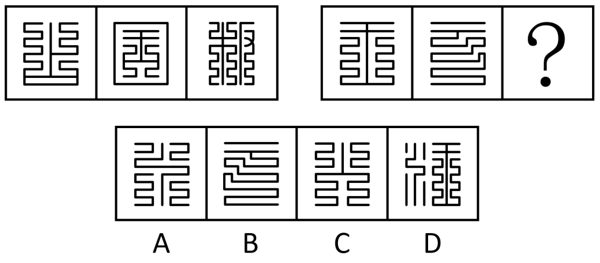
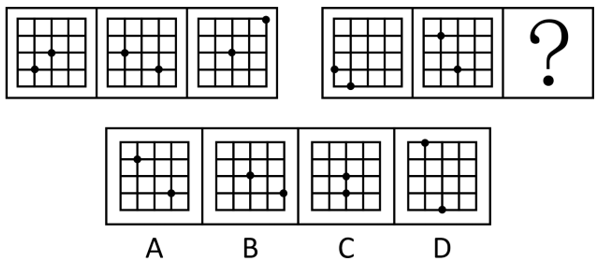
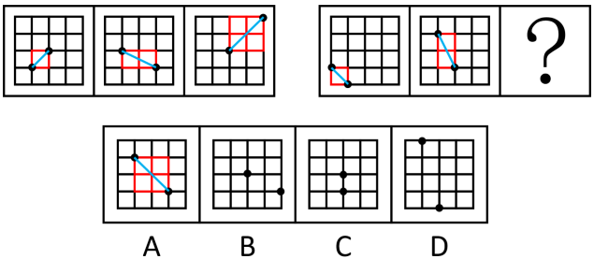
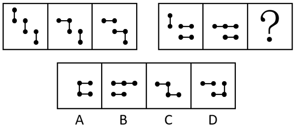
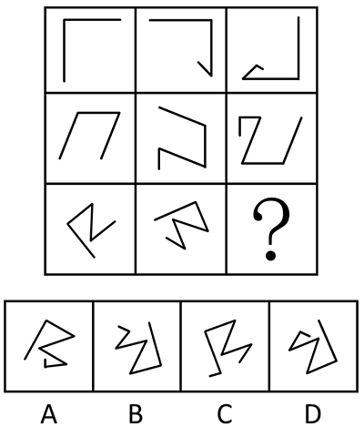
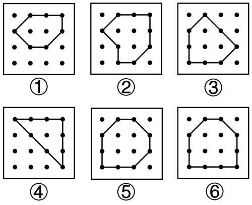

# 2025年深圳市考公务员录用考试《行测》试题（网友回忆版）

> 判断推理 · 20 题 · 深圳市考 2025

## 第 1 题　qid 13432347 · 图形推理

从四个选项中选择一个替代问号，使之呈现一定规律性，最合适的是（    ）。

- **A**. A
- **B**. B
- **C**. C　✅
- **D**. D

**答案**：C

**官方解析**

元素组成不同，且无明显属性规律，考虑数量规律。观察发现，题干出现类似迷宫的生活化图形，且第一组图形图3出现一条线隔开其余两部分的图形，考虑部分数。第一组图形的部分数依次为1、2、3，依次递增；第二组图形前两幅图的部分数依次为1、2，则？处应该选择部分数为3的图形，只有C项符合。
故正确答案为C。

---

## 第 2 题　qid 13432276 · 图形推理

从四个选项中选择一个替代问号，使之呈现一定规律性，最合适的是（    ）。

- **A**. A　✅
- **B**. B
- **C**. C
- **D**. D

**答案**：A

**官方解析**

元素组成相同，但无明显位置规律。观察发现，题干第一组图形均由两个小球组成，且图一到图三中两个小球的距离逐渐变远，观察两个小球的连接方式发现，两个小球依次分别在“一个单独格子”、“两个相邻方块构成的‘日’字形格子”和“四个相邻方块构成的‘田’字形格子”的对角线两端的顶点上；第二组图形前两幅图也满足该规律，故？处图形应为两个小球分别在“四个相邻方块构成的‘田’字形格子”的对角线两端的顶点上，只有A项符合。

故正确答案为A。

---

## 第 3 题　qid 13432345 · 图形推理

从四个选项中选择一个替代问号，使之呈现一定规律性，最适合的是（    ）。

- **A**. A
- **B**. B
- **C**. C　✅
- **D**. D

**答案**：C

**官方解析**

元素组成相同，优先考虑位置规律。观察发现，第一组图中，从图1到图2只有最左边的短线顺时针旋转，其他短线位置不动，从图2到图3只有最中间的短线顺时针旋转，其他短线位置不动。第二组图应用此规律，从图1到图2只有最左边的短线顺时针旋转，其他短线位置不动，那么从图2到问号处图形应该只有最中间的短线顺时针旋转，其他短线位置不动，只有C项符合。

故正确答案为C。

---

## 第 4 题　qid 13432277 · 图形推理

从所给的四个选项中，选择最合适的一个填入问号处，使之呈现一定的规律性。

- **A**. A
- **B**. B
- **C**. C
- **D**. D　✅

**答案**：D

**官方解析**

元素组成基本相同，优先考虑位置规律。九宫格优先看横行，第一行中，图1顺时针旋转且在端点处增加1条直线得到图2，图2顺时针旋转且在端点处增加1条直线得到图3，第二行符合此规律，因此第三行中问号处图形应该由图2顺时针旋转且在端点处增加1条直线得到，据此可以排除A、C两项。继续观察发现，第一行在端点处是沿顺时针方向增加直线，第二行在端点处是沿逆时针方向增加直线，第三行图1在端点处沿顺时针方向增加直线得到图2，因此问号处图形也应该由图2在端点处沿顺时针方向增加直线得到，只有D项符合。

故正确答案为D。

---

## 第 5 题　qid 13432364 · 图形推理

把下面的六个图形分为两类，使每一类都有各自的共同特征或规律，分类正确的一项是（    ）。

- **A**. ①③⑤，②④⑥
- **B**. ①②⑤，③④⑥
- **C**. ①④⑤，②③⑥
- **D**. ①⑤⑥，②③④　✅

**答案**：D

**官方解析**

本题为分组分类题目。元素组成不同，且无明显属性规律，考虑数量规律。观察发现，题干均有线条围成的封闭图形，且封闭图形内外都有小黑点，考虑素数量，封闭图形内部小黑点的个数分别为2、3、3、1、4、4，其中图①⑤⑥封闭图形内部小黑点个数均为偶数，图②③④封闭图形内部的小黑点个数均为奇数，即图①⑤⑥为一组，图②③④为一组。
故正确答案为D。
注：封闭图形外部的黑点分为多个部分，故优先考虑封闭图形内部的黑点数量。

---

## 第 6 题　qid 13432322 · 类比推理

（1）副高推动雨带北进
（2）雨带滞留降雨持续
（3）形成汛期特大洪涝
（4）北半球进入夏半年
（5）冷暖气团汇于江淮

- **A**. 4-5-1-3-2
- **B**. 5-1-2-4-3
- **C**. 4-1-5-2-3　✅
- **D**. 4-5-1-2-3

**答案**：C

**官方解析**

第一步：先确定逻辑关系最为明显的逻辑顺序。
观察题干，五个事件主要是围绕着“北半球夏半年的雨季变化”开展的。逻辑关系的先后顺序比较明显的是事件（4），北半球先进入夏半年，再发生后续的气候变化，排除B项。
第二步：逐一对照选项并判断正确答案。
根据第一步的结果可以判断A、C、D三项均符合，通过分析事件（1）和事件（5）可知，应先“副高推动雨带北进”，再发生“冷暖气团汇于江淮”，进而发生后续的降雨持续、汛期特大洪涝，因此事件（1）应该在事件（5）前面，排除A、D两项。
故正确答案为C。

---

## 第 7 题　qid 13432273 · 类比推理

（1）群众反映强烈盼改善
（2）成立共建共治委员会
（3）老旧社区环境脏乱差
（4）居民幸福感显著增强
（5）基层党组织牵头抓总

- **A**. 1-3-5-2-4
- **B**. 3-5-1-4-2
- **C**. 4-1-5-2-3
- **D**. 3-1-5-2-4　✅

**答案**：D

**官方解析**

第一步：先确定逻辑关系最为明显的逻辑顺序。
观察题干，五个事件主要围绕“老旧社区环境改善”展开。逻辑关系的先后顺序比较明显的是事件（1）和事件（3），只有先出现“老旧社区环境脏乱差”，才会有“群众反映强烈盼改善”，所以事件（3）应排在事件（1）前面，排除A、C两项。
第二步：逐一对照选项并判断正确答案。
根据第一步的结果可以判断只有B、D两项符合。结合选项进行进一步分析，在“群众反映强烈盼改善”后，需要“基层党组织牵头抓总”来解决问题，所以事件（1）应排在事件（5）之前，排除B项。
故正确答案为D。

---

## 第 8 题　qid 13432327 · 类比推理

（1）覆纸干刷成页
（2）刊刻阳纹凸字
（3）均匀涂布油墨
（4）打磨雕版木材
（5）反贴图文纸稿

- **A**. 4-5-2-3-1　✅
- **B**. 4-5-3-2-1
- **C**. 5-4-2-3-1
- **D**. 5-2-3-1-4

**答案**：A

**官方解析**

第一步：先确定逻辑关系最为明显的逻辑顺序。
观察题干，五个事件主要是围绕着“雕版印刷工艺”开展的。逻辑关系的先后顺序比较明显的是事件（4），要先选择雕版印刷的版料木材，然后再有后续制作流程，排除C、D两项。
第二步：逐一对照选项并判断正确答案。
根据第一步的结果可以判断A、B两项均符合，打磨雕版木材后，应该是先反贴图文纸稿，然后据此刊刻阳纹凸字，再均匀涂布油墨后，实现覆纸干刷成页，即顺序应为4-5-2-3-1，排除B项。
故正确答案为A。

---

## 第 9 题　qid 13432272 · 类比推理

（1）解衣欲睡，月色入户
（2）友亦未寝，相与漫步
（3）幸会佳景，悠然忘机
（4）月映竹柏，庭下如水
（5）欣然起行，深夜访友

- **A**. 1-5-2-3-4
- **B**. 5-2-1-3-4
- **C**. 1-5-2-4-3　✅
- **D**. 5-1-2-4-3

**答案**：C

**官方解析**

第一步：先确定逻辑关系最为明显的逻辑顺序。
观察题干，五个事件主要围绕着“深夜访友赏美景”开展的。逻辑关系的先后顺序比较明显的是事件（1）和事件（5），要先“解衣欲睡，月色入户”，随后才能“欣然起行，深夜访友”，因此事件（1）应排在事件（5）前面，排除B、D两项。
第二步：逐一对照选项并判断正确答案。
根据第一步得到的结果可以判断只有A、C两项符合，通过分析事件（2）、事件（3）和事件（4）可知，应先“友亦未寝，相与漫步”，随后才会看到“月映竹柏，庭下如水”的景色，随之产生“幸会佳景，悠然忘机”的感受，三个事件的顺序应为2-4-3，排除A项。
故正确答案为C。

---

## 第 10 题　qid 13432281 · 类比推理

（1）“三北”工程启动，生态效益显著
（2）签署《巴黎协定》，彰显大国担当
（3）保护环境成为国策，社会意识提高
（4）全面建立河湖长制，守护河湖健康
（5）提出“双碳”目标，能源绿色转型

- **A**. 1-3-2-4-5　✅
- **B**. 1-2-4-3-5
- **C**. 1-5-2-3-4
- **D**. 5-1-3-2-4

**答案**：A

**官方解析**

观察题干，五个事件围绕我国关于环保的具有重要历史意义的事件展开。
（1）中国政府为改善生态环境，于1978年决定把“三北”工程列为国家经济建设的重要项目；
（2）2016年中国签署《巴黎协定》；
（3）1983年第二次全国环境保护会议，把保护环境确立为基本国策；
（4）我国在2018年6月底全面建立河长制，并在2018年底全面建立湖长制；
（5）2020年9月中国明确提出2030年“碳达峰”与2060年“碳中和”目标，即“双碳”目标。
根据时间先后排序应该是1-3-2-4-5，对应A项。
故正确答案为A。

---

## 第 11 题　qid 13432367 · 逻辑判断

近年来，宠物食品厂商争相推出“高端猫粮”，号称采用区别于普通猫粮的优质原料，添加更全营养素，如高比例添加去骨鲜肉、加入维生素或益生菌等，其售价往往也远高于普通猫粮。不少宠物医院建议，为更好呵护猫咪健康，有条件的家庭最好购买高端猫粮。
以下选项如果为真，最能反驳宠物医院建议的是（    ）。

- **A**. 商业数据表明，高端猫粮的市场占有率和用户青睐度日趋走低
- **B**. 据统计，日常饮食引发的肠道问题是猫咪健康的首要危害因素
- **C**. 不同品种、成长阶段、健康状态的猫咪，其营养需求存在差异　✅
- **D**. 尚无权威研究证明对人类有益的维生素等对猫咪也有同样功效

**答案**：C

**官方解析**

第一步：找出论点和论据。
论点：为更好呵护猫咪健康，有条件的家庭最好购买高端猫粮。
论据：宠物食品厂商争相推出“高端猫粮”，号称采用区别于普通猫粮的优质原料，添加更全营养素，如高比例添加去骨鲜肉、加入维生素或益生菌等。
本题论据说的是高端猫粮的优势，论点说的是最好购买高端猫粮，论据可以合理得到论点，因此二者话题一致，削弱优先考虑削弱论点。
第二步：逐一分析选项。
A项：该项说的是高端猫粮的市场占有率和用户青睐度走低，和论点中讨论的是否要购买高端猫粮无关，无法削弱，排除；
B项：该项说的是日常饮食引发的肠道问题是猫咪健康的首要危害因素，但不明确食用高端猫粮能否避免这个问题，无法削弱，排除；
C项：该项说的是不同品种、成长阶段、健康状态的猫咪，其营养需求存在差异，说明在不同情况下应当选择不同营养素配比的猫粮，而不是购买含有更全营养素的高端猫粮，削弱论点，可以削弱，当选；
D项：该项说的是无权威证明对人类有益的维生素对猫咪也有效，说明添加了维生素的高端猫粮是否比普通猫粮更好是不明确的，但在高端猫粮中还含有其他营养素，如高比例去骨鲜肉、益生菌等，这些营养素如果能更好呵护猫咪健康，那么高端猫粮也是值得购买的，无法削弱，排除。
故正确答案为C。

---

## 第 12 题　qid 13432349 · 逻辑判断

时间贫困正成为当代青年最普遍的体验之一，简单来说是在日常工作生活中产生的时间不够用的感受，也即要做的事情太多，但可支配的时间太少。一项关于当代青年时间贫困的调查研究显示，六成以上的受访青年感觉时间贫困，且随着城市线级的变化，受访青年时间贫困的比例也有所变化。一线城市受访青年感觉时间贫困的比例最高，四线、五线城市则相对更低。调查认为，城市线级与青年时间贫困率直接正相关。
下列说法如果为真，有助于得出调查结论的是（    ）。

- **A**. 城市线级越高，新产业、新业态越集聚，青年面临更多的工作机遇和挑战
- **B**. 城市线级越高，平均通勤时间往往越长，大大挤压了青年人的可支配时间　✅
- **C**. 从人口年龄结构来看，城市线级越高，青年人口在城市总人口中的占比越高
- **D**. 城市线级越高，物质精神生活越丰富，会有更多消磨青年时间的“时间杀手”

**答案**：B

**官方解析**

第一步：找出论点和论据。
论点：城市线级与青年时间贫困率直接正相关。
论据：六成以上的受访青年感觉时间贫困，且随着城市线级的变化，受访青年时间贫困的比例也有所变化。一线城市受访青年感觉时间贫困的比例最高，四线、五线城市则相对更低。
本题论点和论据都在讨论城市线级和青年时间贫困率之间的关系，话题一致，加强优先考虑补充论据。
第二步：逐一分析选项。
A项：该项说的是城市线级和青年工作机遇和挑战之间的关系，但论点讨论的是城市线级与青年时间贫困率之间的关系，话题不一致，无法加强，排除；
B项：该项说的是城市线级越高，平均通勤时间往往越长，大大挤压了青年人的可支配时间，说明青年的可支配时间确实会受到城市线级的影响，即城市线级与青年时间贫困率正相关，补充论据，可以加强，当选；
C项：该项说的是城市线级越高，青年人口在城市总人口中的占比越高，但论点讨论的是城市线级与青年时间贫困率之间的关系，话题不一致，无法加强，排除；
D项：该项说的是城市线级越高，物质精神生活越丰富，会有更多消磨青年时间的“时间杀手”，说明城市线级越高，可供青年选择消遣时间的方式就越多，但不明确青年是否会因此感觉到可支配的时间变少，为不明确项，无法加强，排除。
故正确答案为B。

---

## 第 13 题　qid 13432346 · 逻辑判断

甲、乙两国交战超过半个世纪，战火迄今未休。多年前，为了防御甲国的攻击，乙国投入巨资开发了一套全天候机动式防空系统，用于拦截射程范围在5-70公里的火箭弹。乙国对外宣称，该系统能计算出目标的弹道、落点，拦截率达90%。该系统目前仍在服役中。然而，新近解密的文件披露，十年前甲国发起的某次攻击中，实际上只有50%的火箭弹被该系统拦截。
以下选项如果为真，无助于解释以上矛盾的是（    ）。

- **A**. 因长年作战，乙国国力严重损耗，十年前采取了主动限制作战规模的措施　✅
- **B**. 该次攻击中，甲国火力异常集中，该系统用来拦截火箭弹的弹药短时耗尽
- **C**. 绝大多数未被拦截的火箭弹都落在百公里外的荒野地区
- **D**. 90%的拦截率来自作战模型推论而非真实作战环境数据

**答案**：A

**官方解析**

第一步：找出题干矛盾。
乙国对外宣称其开发的全天候机动式防空系统的拦截率达90%，而十年前甲国发起的某次攻击中，实际上只有50%的火箭弹被该系统拦截。
第二步：逐一分析选项。
A项：该项强调乙国主动“限制作战规模”，但未明确说明是限制了乙国对甲国的打击，还是限制了乙国对甲国的防御，因此无法解释乙国防空系统的拦截能力为何减弱，无法解释题干矛盾，当选；
B项：该项说明甲国火力集中导致用来拦截火箭弹的弹药耗尽，解释了实际拦截率下降的原因，即拦截能力受限于弹药数量，非系统本身拦截效率问题，可以解释题干矛盾，排除；
C项：该项说明绝大多数未被拦截的火箭弹落在“百公里外”，结合题干说的乙国防空系统拦截范围为5-70公里可知，绝大多数未被拦截的火箭弹超出了射程范围，在射程范围内的火箭弹只有极少数未被拦截，因此该系统的实际拦截率很高，并非只有50％，可以解释题干矛盾，排除；
D项：该项直接指出宣称数据是理论模型推算，而非实战结果，说明真实拦截率可能因实战环境（如干扰、火力密度、操作失误等）低于理论值，可以解释题干矛盾，排除。
本题为选非题，故正确答案为A。

---

## 第 14 题　qid 13432333 · 定义判断

人们在进行决策或辩护某个观点或结论的时候，一般是有理由的。所谓理由，就是用来支撑或证明某种观点或结论的信念、证据、类比或其他陈述。
根据上述定义，以下选项不包含“理由”的是（    ）。

- **A**. 低空经济的发展可以降低物流成本。数据显示，2024年社会物流总费用19.0万亿元，较上年回落0.3个百分点
- **B**. 有人认为阅读纸质书比电子书的效果好，电子书缺乏纸质书的触感，削弱了阅读体验
- **C**. 正如植物需要阳光和水分才能茁壮成长，孩子也需要教育和关爱才能成长为有用之才
- **D**. 有钱出钱，有力出力，“力”可能是多方面的，“钱”的用途也是多方面的　✅

**答案**：D

**官方解析**

第一步：找出定义关键词。
“支撑或证明某种观点或结论的信念、证据、类比或其他陈述”。
第二步：逐一分析选项。
A项：“2024年社会物流总费用19.0万亿元，较上年回落0.3个百分点”是用具体的数据作为证据来支撑“低空经济的发展可以降低物流成本”的观点，符合“支撑或证明某种观点或结论的信念、证据、类比或其他陈述”，是该观点的“理由”，符合定义，排除；
B项：“电子书缺乏纸质书的触感，削弱了阅读体验”是通过说明电子书的缺点来证明“阅读纸质书比电子书的效果好”的观点，符合“支撑或证明某种观点或结论的信念、证据、类比或其他陈述”，是该观点的“理由”，符合定义，排除；
C项：将“孩子”类比为“植物”，通过“植物需要阳光和水分才能茁壮成长”来证明“孩子需要教育和关爱才能成长为有用之才”的观点，符合“支撑或证明某种观点或结论的信念、证据、类比或其他陈述”，是该观点的“理由”，符合定义，排除；
D项：只是说明“钱”和“力”的用途是多方面的，但没有证明“钱”和“力”的具体用途，以及为何得出了“有钱出钱，有力出力”这个观点，不符合“支撑或证明某种观点或结论的信念、证据、类比或其他陈述”，不是该观点的“理由”，不符合定义，当选。
本题为选非题，故正确答案为D。

---

## 第 15 题　qid 13432369 · 类比推理

六名棋手小王、小安、小杨、小李、小张、小刘参加围棋积分赛。积分赛分为三轮，每轮比赛开三台“一对一”的棋局，三轮共9局，但三轮中任意两名棋手最多只对弈一局。棋手的个人积分规则为：赢一局计1分，输一局计-1分，平局计0.5分。每局棋开始前，都以抽签方式决定谁执黑棋谁执白棋。关于比赛结果，已知如下信息：
（1）第三轮结束后，三台棋局中6位棋手的个人总积分依次是2.5比0.5，3比-1，-1比-3；
（2）小安在对局中没有赢过，也没有执过白棋；
（3）凡执过白棋的棋手都没有全胜；
（4）小李输赢的局数相同，且执过2局黑棋；
（5）小王执过黑棋；
（6）某一局中，执黑棋的小张输给了小杨。
由此可推知，积分最高的棋手是（    ）。

- **A**. 小王　✅
- **B**. 小杨
- **C**. 小刘
- **D**. 小张

**答案**：A

**官方解析**

第一步：分析题干条件。
（1）第三轮结束后，三台棋局中6位棋手的个人总积分依次是2.5比0.5，3比-1，-1比-3；
（2）小安在对局中没有赢过，也没有执过白棋；
（3）凡执过白棋的棋手都没有全胜；
（4）小李输赢的局数相同，且执过2局黑棋；
（5）小王执过黑棋；
（6）某一局中，执黑棋的小张输给了小杨。
第二步：根据题干条件进行推理。
根据条件（1）和条件（3）可知，最高分为3分，即该棋手全胜，并且积3分的棋手3局执的都是黑棋，故3局均执黑棋的棋手即为积分最高的棋手；
根据条件（2）可知，小安在对局中没有赢过，则小安的积分应为-3，故积分最高的不是小安；
根据条件（4）可知，小李有胜有负，不可能全胜，故积分最高的不是小李；
根据条件（6）可知，执黑棋的小张输给了小杨，则小杨执过白棋，再根据条件（3）可知，小杨的积分不可能为3分，且小张输给了小杨，故积分最高的不是小张和小杨。
综合上述推理可知，小王和小刘中必有一人积分最高，即两人中有一人3局均执黑棋，已知共9局比赛，结合条件（2）可知，小安执3局黑棋，结合条件（4）可知，小李执2局黑棋，结合条件（6）可知，小张至少执1局黑棋，此时共出现至少6局黑棋，结合条件（3）可知，全胜的人均执黑棋，即剩下3局黑棋只能均由1人执，结合条件（5）可知，此人是小王，故积分最高的是小王，对应A项。
故正确答案为A。

---

## 第 16 题　qid 13432360 · 逻辑判断

微型塑料是指粒径小于5毫米的塑料颗粒，其理化性质稳定、来源广泛，在海洋、大气及土壤等环境中普遍存在，进入人体后，可能在消化系统、呼吸系统、循环系统等部位蓄积。卫生领域权威国际组织发布报告指出，目前还没有足够数据来全面了解微型塑料对人类健康的影响。因此，一些媒体宣称微型塑料不会对人体产生危害。
以下选项如果为真，最能反驳上述结论的是（    ）。

- **A**. 许多国家和地区已在限塑禁塑方面展开积极行动，未来将加速推进全球塑料条约谈判
- **B**. 人们无时无刻不暴露在微型塑料环境中，人口密集和活动频繁的地区，微型塑料浓度更高
- **C**. 动物研究表明，海洋高等哺乳动物脏器内偶见微型塑料颗粒，其肠道菌群发生显著改变
- **D**. 微型塑料吸附环境中的其他分子后形成稳定的化合物，成为有害物质进入人体的重要载体　✅

**答案**：D

**官方解析**

第一步：找出论点和论据。
论点：微型塑料不会对人体产生危害。
论据：卫生领域权威国际组织发布报告指出，目前还没有足够数据来全面了解微型塑料对人类健康的影响。
本题论点讨论的是微型塑料不会对人体产生危害，论据讨论的是没有足够数据来全面了解微型塑料对人类健康的影响，因为没有足够的数据了解微型塑料对人类影响，所以它不会对人体产生危害，论点论据话题一致，削弱优先考虑削弱论点，即微型塑料会对人体产生危害。
第二步：逐一分析选项。
A项：指出各地在限塑禁塑方面展开积极行动，但没有体现限塑的原因是否与微型塑料对人体的影响有关，话题不一致，不能削弱，排除；
B项：指出人们暴露在浓度较高的微型塑料环境中，与微型塑料是否会对人体产生危害无关，话题不一致，不能削弱，排除；
C项：指出微型塑料会改变海洋高等哺乳动物的肠道菌群，而论点说的是微型塑料对人体的危害，主体不一致，不能削弱，排除；
D项：指出微型塑料是有害物质进入人体的重要载体，说明微型塑料会对人体产生危害，削弱论点，可以削弱，当选。
故正确答案为D。

---

## 第 17 题　qid 13432358 · 逻辑判断

相传，在一场关于“琴的声音从何而来”的辩论中，有人认为琴声在琴上，有人认为琴声在琴师的手指上，苏轼听后赋诗一首：“若言琴上有琴声，放在匣中何不鸣？若言声在指头上，何不于君指上听？”
以下选项中，与苏轼的论证方式不同的是（    ）。

- **A**. 有人认为，李贺应当避讳其父“晋肃”名号，不宜考取进士，韩愈称：“父名晋肃，子不得举进士；若父名仁，子不得为人乎？”
- **B**. 甲：“语言可以创造财富。”乙：“如果语言可以创造财富，那么，夸夸其谈的人就可以成为世界首富了。”
- **C**. 甲：“神是全知、全能、全善的。”乙：“神若愿阻恶但无力，则非全能；若能阻恶但不愿，则非全善；若既愿又能，那为何恶仍在？”　✅
- **D**. 家国兴亡自有时，吴人何苦怨西施。西施若解倾吴国，越国亡来又是谁？

**答案**：C

**官方解析**

第一步：分析题干论证方式。
苏轼没有直接反对“琴声在琴上”“琴声在琴师的手指上”这两个观点，而是假设了“如果琴声来自于琴，那么放在琴匣里为什么发不出声音？如果琴声发自手指，那么为什么不在手指上听琴声？”，推出了荒谬的结论，从而证明观点是错误的。
第二步：逐一分析选项。
A项：韩愈没有直接反对“父名晋肃子不得举进士”这一观点，而是假设了“父亲名叫晋肃，因为父亲的名字，儿子就不能参加进士考试，那么如果父亲名‘仁’，难道儿子就不能做人了吗？”，推出了荒谬的结论，从而证明观点是错误的，与苏轼的论证方式相同，排除；
B项：乙没有直接反对“语言可以创造财富”这一观点，而是假设了“如果语言可以创造财富，那夸夸其谈的人就可以成为世界首富”，推出了荒谬的结论，从而证明观点是错误的，与苏轼的论证方式相同，排除；
C项：乙是在解释为什么“神不是全知、全能、全善的”，并非先假设其观点再推出荒谬的结论，与苏轼的论证方式不同，当选；
D项：该项没有直接反对“西施能导致吴国灭亡”这一观点，而是反问“越国的灭亡又是由谁导致的呢？”，即假设了“如果西施能使吴国灭亡，那越国灭亡又是因为谁呢？”从而证明观点是错误的，与苏轼的论证方式相同，排除。
本题为选非题，故正确答案为C。

---

## 第 18 题　qid 13432352 · 类比推理

同住一间宿舍的甲、乙、丙、丁四人即将大学毕业，面临考研、考公、应聘国企、自主创业四种意向选择，四人的规划如下：
（1）甲希望为家乡发展作贡献，只考虑返乡考公或者应聘国企；
（2）乙和丙是挚友，除非与丙一起自主创业，否则乙会考研；
（3）丙不想考研，也不打算应聘国企，如果甲考公，他会和甲一同备考；
（4）丁为人特立独行，希望和甲、乙、丙作出不同的选择。
如果四人的规划都得以实现，以下情况不可能发生的是（    ）。

- **A**. 四人的选择各不相同
- **B**. 甲、乙、丙作出同种选择　✅
- **C**. 丁选择考研
- **D**. 丁选择应聘国企

**答案**：B

**官方解析**

第一步：分析题干条件。

（1）甲考公或者应聘国企；

（2）乙考研乙和丙一起创业；

（3）丙考研 且 丙应聘国企；

（4）甲考公丙考公；

（5）丁与甲、乙、丙的选择不同。

第二步：根据题干条件进行推理。

题干条件中提到甲考公两次，可由此入手进行假设。

假如甲选择考公，根据条件（4），肯前推肯后，丙也选择考公，根据条件（2），否后推否前，乙选择考研，再根据条件（5）丁与甲、乙、丙的选择不同，则丁可以选择应聘国企或者自主创业，排除D项；

假如甲不选择考公，根据条件（1），或关系否一推一，甲选择应聘国企。此时存在两种情况：假如乙不考研，根据条件（2），肯前推肯后，乙和丙一起自主创业，再根据条件（5）丁与甲、乙、丙的选择不同，则丁可以选择考公或者考研，排除C项；假如乙考研，根据条件（3）丙考研 且 丙应聘国企，丙可以选择考公或者自主创业，再根据条件（5）丁与甲、乙、丙的选择不同，则丁可以选择自主创业或者考公，四人的选择可以各不相同，排除A项。

综上所述，甲、乙、丙不可能作出同种选择。

本题为选非题，故正确答案为B。

---

## 第 19 题　qid 13432275 · 逻辑判断

折柳赠别这一习俗由来已久，古代诗歌中柳树与离别之情常相伴出现。提及柳树，人们往往首先想到它繁茂的青色。因此，有学者认为，古代诗人写柳是借柳色之“青”来寄寓其“情”。
以下选项如果为真，不能支持学者观点的是（    ）。

- **A**. 不少诗歌直接点明柳之“青”继而引出人“情”，如“依依袅袅复青青，勾引春风无限情”
- **B**. 柳树与离别最早的关联，可以追溯至《诗经》：“昔我往矣，杨柳依依。今我来思，雨雪霏霏。”　✅
- **C**. 在古代诗歌中，柳树可用来寄寓离别情之外的其他感情，如“无情最是台城柳，依旧烟笼十里堤”
- **D**. 古代诗歌也常用柳树之外的青植物寄寓别情，如“江春不肯留行客，草色青青送马蹄”

**答案**：B

**官方解析**

第一步：找出论点和论据。
论点：古代诗人写柳是借柳色之“青”来寄寓其“情”。
论据：折柳赠别这一习俗由来已久，古代诗歌中柳树与离别之情常相伴出现。提及柳树，人们往往首先想到它繁茂的青色。
本题论点和论据讨论的都是柳树“青”与“情”之间的关系，二者话题一致，加强优先考虑补充论据，且本题为选非题，将可以加强的选项排除即可。
第二步：逐一分析选项。
A项：选项指出不少诗歌直接点明柳之“青”继而引出人“情”，并进行了举例，补充论据，可以加强，排除；
B项：选项指出柳树与离别最早的关联可以追溯至《诗经》，但没有说明古代诗人写柳是否是借柳色之“青”来寄寓其“情”，无法加强，当选；
C项：选项指出在古代诗歌中，柳树可用来寄寓离别情之外的其他感情，说明古代诗人会通过写柳寄情，且所举诗句将柳树比作“青色的烟雾”，借柳色之“青”来寄寓其“情”，可以加强，排除；
D项：选项指出古代诗歌也常用柳树之外的青植物寄寓别情，说明“青”和“情”之间确实存在关联，可以加强，排除。
本题为选非题，故正确答案为B。

---

## 第 20 题　qid 13432361 · 定义判断

在日常语言中，条件句可以分为直陈条件句和虚拟条件句两类。反事实条件句属于虚拟条件句。一个反事实条件句应满足三个条件：
（1）表示条件的判断通常事实上为假；
（2）表示条件的判断和依赖条件而存在的判断之间有着意义、内容方面的密切联系；
（3）如果前一判断得到满足，那么后一判断所表达的事物情况就会发生或有可能发生。
根据上述定义，下列选项不属于反事实条件句的是（    ）。

- **A**. 东风不与周郎便，铜雀春深锁二乔
- **B**. 功名富贵若长在，汉水亦应西北流
- **C**. 但使龙城飞将在，不教胡马度阴山
- **D**. 安得广厦千万间，大庇天下寒士俱欢颜　✅

**答案**：D

**官方解析**

第一步：找出定义关键词。
“表示条件的判断通常事实上为假”、“表示条件的判断和依赖条件而存在的判断之间有着意义、内容方面的密切联系”、“如果前一判断得到满足，那么后一判断所表达的事物情况就会发生或有可能发生”。
第二步：逐一分析选项。
A项：“东风不与周郎便，铜雀春深锁二乔”意思是如果当年东风不帮助周瑜，那么铜雀台就会深深地锁住东吴的二乔，但是实际上，赤壁之战中东风帮助了周瑜，所以“东风不与周郎便”在事实上为假，符合“表示条件的判断通常事实上为假”；并且如果“东风不与周郎便”，那么就会“铜雀春深锁二乔”，二者之间存在条件关系，符合“表示条件的判断和依赖条件而存在的判断之间有着意义、内容方面的密切联系”、“如果前一判断得到满足，那么后一判断所表达的事物情况就会发生或有可能发生”，符合定义，排除；
B项：“功名富贵若长在，汉水亦应西北流”意思是如果功名富贵能够长久存在，那么汉水也应该向西北流去，但是实际上，功名富贵不会长久的存在，所以“功名富贵长在”在事实上为假，符合“表示条件的判断通常事实上为假”；并且如果“功名富贵长在”，那么“汉水亦应西北流”（实际上功名富贵不会长在，汉水本应向东南流，西北流也是不可能的，隐藏的含义是一件不可能的事情发生，那么另一件不可能的事情也可能会发生），二者之间存在条件关系，符合“表示条件的判断和依赖条件而存在的判断之间有着意义、内容方面的密切联系”、“如果前一判断得到满足，那么后一判断所表达的事物情况就会发生或有可能发生”，符合定义，排除；
C项：“但使龙城飞将在，不教胡马度阴山”意思是倘若龙城的飞将李广如今还在，绝不许匈奴南下牧马度过阴山，但是实际上，李广当时已经不在了，所以“龙城飞将在”在事实上为假，符合“表示条件的判断通常事实上为假”；并且如果“龙城飞将在”，那么就会“不教胡马度阴山”，二者之间存在条件关系，符合“表示条件的判断和依赖条件而存在的判断之间有着意义、内容方面的密切联系”、“如果前一判断得到满足，那么后一判断所表达的事物情况就会发生或有可能发生”，符合定义，排除；
D项：“安得广厦千万间，大庇天下寒士俱欢颜”意思是如何能得到千万间宽敞的房屋，普遍庇护天下贫寒的士人，让他们都能欢笑，其中“安得广厦千万间”并非条件句，不存在事实上为假的情况，不符合“表示条件的判断通常事实上为假”，不符合定义，当选。
本题为选非题，故正确答案为D。

---
