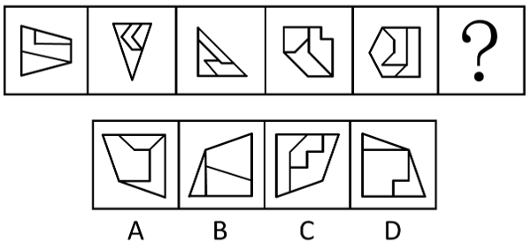
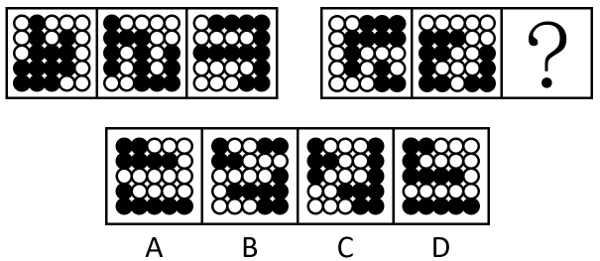

# 2025年湖北省选调生招录考试综合知识和行政职业能力测验试卷（网友回忆版）

> 判断推理 · 40 题 · 湖北 2025

## 第 1 题　qid 15419028 · 图形推理

从所给的四个选项中，选择最合适的一个填入问号处，使之呈现一定的规律性：

- **A**. A
- **B**. B
- **C**. C
- **D**. D　✅

**答案**：D

**官方解析**

元素组成不同，优先考虑属性规律。观察发现，每幅图形内部均存在一个轴对称的面，且外框也均为轴对称图形，分别画出两者的对称轴，发现两条对称轴的关系为平行、垂直交替出现，则？处两条对称轴的关系应为垂直，只有D项符合。

故正确答案为D。

---

## 第 2 题　qid 15419024 · 图形推理

从所给的四个选项中，选择最合适的一个填入问号处，使之呈现一定的规律性：

- **A**. A　✅
- **B**. B
- **C**. C
- **D**. D

**答案**：A

**官方解析**

元素组成基本相同，但位置规律不明显，考虑相邻比较。观察发现，如下图所示，图1和图2有5个位置的黑三角形相同，图2和图3有5个位置的黑三角形相同，题干其他图形也均满足此规律，故？处图形应该和图5有5个位置的黑三角形相同（且题干所有图形左下角和右上角的黑三角形均相同），只有A项符合。

故正确答案为A。

---

## 第 3 题　qid 15419020 · 图形推理

从所给的四个选项中，选择最合适的一个填入问号处，使之呈现一定的规律性：

- **A**. A
- **B**. B
- **C**. C
- **D**. D　✅

**答案**：D

**官方解析**

元素组成相同，但无位置规律和属性规律，考虑数量规律。观察发现，题干图形中黑白球分堆明显，考虑部分数。第一组图中，白球的部分数均为2，每一部分的个数分别为（3、9），（4、8），（5、7）；第二组图中，前两幅图黑球的部分数均为2，每一部分的个数分别为（3、9），（4、8），故？处图形的黑球也应该为两个部分，且每一部分的个数分别为（5、7），只有D项符合。
故正确答案为D。

---

## 第 4 题　qid 15419022 · 图形推理

从所给的四个选项中，选择最合适的一个填入问号处，使之呈现一定的规律性：

- **A**. A
- **B**. B　✅
- **C**. C
- **D**. D

**答案**：B

**官方解析**

解析一：元素组成不同，且无明显属性规律，考虑数量规律。观察发现，题干图形分割明显，考虑面数量，但没规律；继续观察发现，题干图形均由多个面拼接而成，考虑图形间关系。第一组图中，面彼此挨在一起，第二组图形中，面①将其中1个面和另外3个面完全隔开，只有B项符合。

解析二：元素组成不同，且无明显属性规律，考虑数量规律。观察发现，题干图形分割明显，考虑面数量，但没规律；继续观察发现，只考虑内部线条的情况下，第一组图的内部线条为一部分，第二组图的内部线条为两部分，且有一部分线条是一笔画，只有B项符合。

故正确答案为B。

---

## 第 5 题　qid 15419026 · 图形推理

以下除哪一项外，均为同一正方体纸盒的外表面展开图？

- **A**. A
- **B**. B
- **C**. C
- **D**. D　✅

**答案**：D

**官方解析**

各选项面都相同，如下图所示，在四个选项中，均以黑色方块的直角顶点为起始点，沿着黑色方块所在面顺时针画边，逐一进行分析。

A项：边1挨着白色直角三角形；

B项：边1挨着白色直角三角形；

C项：边1挨着白色直角三角形；

D项：边1没有挨着白色直角三角形。

综上，只有D项与其他三项不同。

本题为选非题，故正确答案为D。

---

## 第 6 题　qid 15419025 · 定义判断

有氧运动是人体以有氧代谢为主要供能方式，在较长时间里有节奏地锻炼躯干、四肢等部位大肌群的全身运动。
根据上述定义，以下属于有氧运动的是：

- **A**. 老王每周一、三、五慢跑40分钟，二、四、六游泳50分钟以上　✅
- **B**. 小王几乎每天都要拉十几下单杠，然后操起哑铃或杠铃进行力量训练
- **C**. 小刘上大学以来坚持每天早上做20个俯卧撑，晚上做20次仰卧起坐
- **D**. 老张坚持单脚站立、提踵踮脚尖等身体运动，每周3次，每次30分钟

**答案**：A

**官方解析**

第一步：找出定义关键词。
“以有氧代谢为主要供能方式”、“在较长时间里有节奏地锻炼躯干、四肢等部位大肌群的全身运动”。
第二步：逐一分析选项。
A项：慢跑和游泳是以有氧代谢为主的运动，符合“以有氧代谢为主要供能方式”，老王每次运动时间均超过40分钟，且慢跑和游泳属于全身运动，符合“在较长时间里有节奏地锻炼躯干、四肢等部位大肌群的全身运动”，符合定义，当选；
B项：拉单杠、举哑铃和杠铃主要锻炼的是上肢力量，不符合“在较长时间里有节奏地锻炼躯干、四肢等部位大肌群的全身运动”，不符合定义，排除；
C项：俯卧撑主要锻炼上肢力量，仰卧起坐主要锻炼腹部力量，不符合“在较长时间里有节奏地锻炼躯干、四肢等部位大肌群的全身运动”，不符合定义，排除；
D项：单脚站立和提踵踮脚尖主要锻炼的是下肢力量，不符合“在较长时间里有节奏地锻炼躯干、四肢等部位大肌群的全身运动”，不符合定义，排除。
故正确答案为A。

---

## 第 7 题　qid 15419032 · 定义判断

封山育林是利用森林自我更新能力，对林区实行划界封禁，在一定时间内禁止垦荒、放牧、采伐、砍柴等人为活动，以保证林木繁殖生长的育林方式，有三种封法，一是全封，即较长时间（5至10年）的全林区封育；二是半封，在林木主要生长季节封育；三是轮封，将整个林区划片分段，实行轮流封育。
根据上述定义，以下为半封的是：

- **A**. Q省30个国有林场封山育林9千多万公顷，争取用5年建成现代林场
- **B**. S市长乐林区所辖西山林场正值封育时期，林区树木苍翠植被恢复良好
- **C**. H省大青山有10万亩原始次生林，每年10月至次年6月实行封山防火　✅
- **D**. J市在郊区5座连绵起伏的山上，新造幼林并建立林长和护林员巡护制

**答案**：C

**官方解析**

第一步：找出定义关键词。
封山育林：“利用森林自我更新能力，对林区实行划界封禁”、“在一定时间内禁止垦荒、放牧、采伐、砍柴等人为活动”、“以保证林木繁殖生长的育林方式”；
全封：“较长时间（5至10年）的全林区封育”；
半封：“在林木主要生长季节封育”；
轮封：“将整个林区划片分段，实行轮流封育”。
第二步：逐一分析选项。
A项：国有林场封山育林，争取用5年建成现代林场，符合“较长时间（5至10年）的全林区封育”，符合“全封”定义，不符合“半封”定义，排除；
B项：西山林场封育时期林区树木苍翠植被恢复良好，没有明确说明封育时间，不符合“在林木主要生长季节封育”，不符合“半封”定义，排除；
C项：大青山每年10月至次年6月实行封山防火，给出了封山的具体时间段，符合“在林木主要生长季节封育”，符合“半封”定义，当选；
D项：新造幼林并建立林长和护林员巡护制，并未提及封育，不符合“在林木主要生长季节封育”，不符合“半封”定义，排除。
故正确答案为C。

---

## 第 8 题　qid 15419036 · 定义判断

内容管理是指在信息时代，借助信息技术，对各种形式的内容进行创建、存储、分享、应用、检索，并在个人、企业、组织、业务、战略等方面产生价值的过程。内容管理涉及的内容可以是文本、图形图像、Web页面、业务文档、数据库表单、视频、声音等多种形式的数字信息。
根据上述定义，下列不属于内容管理的是：

- **A**. 企业官网发布产品介绍、新闻资讯、企业动态等，确保网站信息的时效性和准确性
- **B**. 电子商务网站频繁更新商品信息、促销活动和用户评价等内容，以提升用户体验
- **C**. 个人博客更新博客文章、评论互动和社交媒体分享等内容，提升博客的吸引力和互动性
- **D**. 信息技术课上，学生对作业本上记录的PPT上的概念、公式、定理等内容进行归纳、分类　✅

**答案**：D

**官方解析**

第一步：找到定义关键词。
“借助信息技术”、“对各种形式的内容进行创建、存储、分享、应用、检索”、“在个人、企业、组织、业务、战略等方面产生价值”。
第二步：逐一分析选项。
A项：企业官网发布产品介绍等内容，符合“借助信息技术”、“对各种形式的内容进行创建、存储、分享、应用、检索”，确保网站信息的时效性和准确性，符合“在个人、企业、组织、业务、战略等方面产生价值”，符合定义，排除；
B项：电子商务网站更新商品信息等内容，符合“借助信息技术”、“对各种形式的内容进行创建、存储、分享、应用、检索”，提升用户体验，符合“在个人、企业、组织、业务、战略等方面产生价值”，符合定义，排除；
C项：个人博客更新博客文章等内容，符合“借助信息技术”、“对各种形式的内容进行创建、存储、分享、应用、检索”，提升博客的吸引力和互动性，符合“在个人、企业、组织、业务、战略等方面产生价值”，符合定义，排除；
D项：学生只是在课堂上对作业本上记录的PPT上的概念等内容进行归纳、分类，并未涉及信息技术，不符合“借助信息技术”，不符合定义，当选。
本题为选非题，故正确答案为D。

---

## 第 9 题　qid 15419030 · 定义判断

封闭疗法是将一定剂量、浓度的麻醉、消炎等特定药物注射到身体特定部位或病变组织周围，用来阻断神经传导并改善局部营养，发挥消炎止痛等作用的一种治疗方法。封闭疗法对全身各部位的肌肉、韧带、筋膜、腱鞘、滑膜的急慢性损伤或退行性病变、骨关节病都适用。
根据上述定义，以下最可能为封闭疗法的是：

- **A**. 麻醉师为小刘右脚拇指注射麻醉剂后，医生为其拇指做手术
- **B**. 鱼刺卡在了小王喉咙处，医生取刺前，先给小王口腔喷麻药
- **C**. 医生将特定药液注入痛点周围，以此治疗老李的肩周炎　✅
- **D**. 医生为缓解老赵术后疼痛，给他上止痛泵

**答案**：C

**官方解析**

第一步：找出定义关键词。
“将一定剂量、浓度的麻醉、消炎等特定药物注射到身体特定部位或病变组织周围”、“用来阻断神经传导并改善局部营养，发挥消炎止痛等作用”。
第二步：逐一分析选项。
A项：麻醉师是为了手术给小刘注射麻醉剂，不符合“用来阻断神经传导并改善局部营养，发挥消炎止痛等作用”，不符合定义，排除；
B项：医生是为了取刺给小王口腔喷麻药，不是“注射”，不符合“将一定剂量、浓度的麻醉、消炎等特定药物注射到身体特定部位或病变组织周围”，不符合定义，排除；
C项：医生是为了治疗老李的肩周炎，将特定的药液注射到痛点周围，符合“将一定剂量、浓度的麻醉、消炎等特定药物注射到身体特定部位或病变组织周围”、“用来阻断神经传导并改善局部营养，发挥消炎止痛等作用”，符合定义，当选；
D项：医生为了缓解术后的疼痛给老赵上止痛泵，不符合“将一定剂量、浓度的麻醉、消炎等特定药物注射到身体特定部位或病变组织周围”，不符合定义，排除。
故正确答案为C。

---

## 第 10 题　qid 15419019 · 定义判断

非职务发明指企事业单位、社会团体、国家机关的工作人员没有利用本单位物质条件，在业余时间所完成的发明创造。
根据上述定义，以下属于非职务发明的是：

- **A**. 王医生旅游途中构思“多功能喉镜”后，用草图申请并获得发明专利　✅
- **B**. 陈工利用单位实验室设备研制“电缆穿管保护器”
- **C**. 张教授团队研发的“大气多参数探测光量子激光雷达”获得发明金奖
- **D**. 林场职工在单位制作的“果柄高效水果采摘器”获国家发明专利

**答案**：A

**官方解析**

第一步：找出定义关键词。
“没有利用本单位物质条件在业余时间所完成的发明创造”。
第二步：逐一分析选项。
A项：王医生“旅游途中”构思且用草图申请并获得发明专利，利用的是业余时间，且没有体现利用单位资源进行发明，符合“没有利用本单位物质条件在业余时间所完成的发明创造”，符合定义，当选；
B项：陈工使用的实验室设备是本单位资源，不符合“没有利用本单位物质条件在业余时间所完成的发明创造”，不符合定义，排除；
C项：张教授团队研发成果获得金奖，属于张教授团队的工作成果，不符合“没有利用本单位物质条件在业余时间所完成的发明创造”，不符合定义，排除；
D项：林场职工是在单位进行的发明，不符合“没有利用本单位物质条件在业余时间所完成的发明创造”，不符合定义，排除。
故正确答案为A。

---

## 第 11 题　qid 15419034 · 定义判断

两用物项是指既有民事用途，又有军事用途或者有助于提升军事潜力，特别是可以用于设计、开发、生产或者使用大规模杀伤性武器及其运载工具的货物、技术和服务，包括相关的技术资料等数据。
根据上述定义，以下不涉及两用物项的是：

- **A**. 我国涡轴发动机AES100，是为满足商用直升机动力需求研制的　✅
- **B**. 稀土有许多优良性能，能广泛运用于机械、电子、国防等领域
- **C**. 到目前为止，北斗系统服务及相关产品已输出到130余个国家
- **D**. 我国航发维修业能够为各种航空发动机提供高质量的维修服务

**答案**：A

**官方解析**

第一步：找出定义关键词。
“既有民事用途，又有军事用途或者有助于提升军事潜力”。
第二步：逐一分析选项。
A项：该项中发动机只是为了满足商用直升机动力需求而研制的，没有涉及军事用途，不符合“既有民事用途，又有军事用途或者有助于提升军事潜力”，不符合定义，当选；
B项：该项中稀土广泛运用于机械、电子、国防等领域，这些领域既有民事用途，又有军事用途，符合“既有民事用途，又有军事用途或者有助于提升军事潜力”，符合定义，排除；
C项：该项中北斗系统服务及相关产品输出到130余个国家，可能符合“既有民事用途，又有军事用途或者有助于提升军事潜力”，可能符合定义，排除；
D项：该项中航发维修业能够为“各种”航空发动机提供高质量的维修服务，“各种”航空发动机既包括民用设备，又包括军用设备，符合“既有民事用途，又有军事用途或者有助于提升军事潜力”，符合定义，排除。
本题为选非题，故正确答案为A。

---

## 第 12 题　qid 15419045 · 定义判断

绝对年代和相对年代是古今历史的纪年法，是历史学与考古学测定和记载人文时序的基本标志。历史上可以确定的具体年代，称为绝对年代。不能确定具体年代而仅能比较或推定先后时序者，称为相对年代。
根据上述定义，以下涉及相对年代的是：

- **A**. 秦始皇（前259-前210年）于公元前221年统一中国
- **B**. 孔子（前551-前479年）是中国古代伟大思想家和教育家
- **C**. 旧石器时代于距今约300万年始，于距今10000年左右止
- **D**. 特洛伊城陷落后约60年，彼阿提亚人定居于现在的彼阿提亚　✅

**答案**：D

**官方解析**

第一步：找出定义关键词。
绝对年代：“历史上可以确定的具体年代”；
相对年代：“不能确定具体年代而仅能比较或推定先后时序”。
第二步：逐一分析选项。
A项：秦始皇的生卒年份（前259-前210年）是一个具体的时间段，统一中国的时间（公元前221年）是一个具体的时间点，符合“历史上可以确定的具体年代”，符合“绝对年代”的定义，不符合“相对年代”的定义，排除；
B项：孔子的生卒年份（前551-前479年）是一个具体的时间段，符合“历史上可以确定的具体年代”，符合“绝对年代”的定义，不符合“相对年代”的定义，排除；
C项：旧石器时代的起（距今约300万年）止（距今10000年）时间是一个具体的时间段，符合“历史上可以确定的具体年代”，符合“绝对年代”的定义，不符合“相对年代”的定义，排除；
D项：彼阿提亚人定居发生在特洛伊城陷落后的约60年，60年是一个相对时间，且特洛伊城陷落在前，彼阿提亚人定居在后，符合“不能确定具体年代而仅能比较或推定先后时序”，符合“相对年代”的定义，当选。
故正确答案为D。

---

## 第 13 题　qid 15419055 · 定义判断

跨流域调水是从一个流域往另一个流域调水，以解决缺水地区水资源需求的一项措施。由于天然降水分布不均，不同流域的水量盈缺差距大，缺水流域的经济社会发展和居民生活受到水资源制约。可从丰水流域调出部分水量以调节缺水流域的用水，促进该流域经济社会可持续发展。
根据上述定义，以下不属于跨流域调水的是：

- **A**. 将长江江水引入黄河、淮河和海河
- **B**. 三峡水库在旱季向长江中下游输水　✅
- **C**. 让滦河河水穿越燕山山脉流入海河
- **D**. 丹江口水库一直把汉江水输往北方

**答案**：B

**官方解析**

第一步：找出定义关键词。
“从一个流域往另一个流域调水”、“解决缺水地区水资源需求的一项措施”。
第二步：逐一分析选项。
A项：从“长江流域”向“黄河流域、淮河流域和海河流域”调水，符合“从一个流域往另一个流域调水”，符合定义，排除；
B项：三峡水库处于长江上游，旱季向长江中下游输水，属于同一个流域，不符合“从一个流域往另一个流域调水”，不符合定义，当选；
C项：从“滦河流域”向“海河流域”调水，符合“从一个流域往另一个流域调水”，符合定义，排除；
D项：从“汉江流域”向“北方流域”调水，符合“从一个流域往另一个流域调水”，符合定义，排除。
本题为选非题，故正确答案为B。

---

## 第 14 题　qid 15419060 · 定义判断

碳足迹是用来衡量个体、组织或国家在一定时间内直接或间接导致的二氧化碳排放的指标。碳足迹的计算涵盖了产品或服务从生产、运输、最终使用到废弃处理的整个生命周期的排放。
根据上述定义，下列行为不利于减少碳足迹的是：

- **A**. 小陈放弃自己开车，选择公共交通出行
- **B**. 小李开车上下班，为了避开堵车高峰，提前两小时出门
- **C**. 小王在新家装修时选择密闭性良好的门窗，以减少家中气流和漏气情况
- **D**. ​小张认为吃牛肉比较耐饿，减少蔬菜、水果食用量，增加餐食中的牛肉　✅

**答案**：D

**官方解析**

第一步：找出定义关键词。
“衡量个体、组织或国家在一定时间内直接或间接导致的二氧化碳排放的指标”。
第二步：逐一分析选项。
A项：小陈放弃自己开车选择公共交通出行，可减少汽车尾气排放，减少了二氧化碳排放量，有利于减少碳足迹，排除；
B项：小李提前两小时出门避开堵车高峰，缩短了开车的时间，减少了二氧化碳排放量，有利于减少碳足迹，排除；
C项：密闭性良好的门窗可减少室内热量散失，降低取暖或制冷能源消耗，减少了二氧化碳排放量，有利于减少碳足迹，排除；
D项：小张增加牛肉的食用量，减少蔬菜、水果的食用量，牛肉在养殖等环节上会比种植蔬菜、水果等产生更多的二氧化碳，即增加了二氧化碳排放量，不利于减少碳足迹，当选。
故正确答案为D。

---

## 第 15 题　qid 15419061 · 定义判断

“列车效应”是指有多个对流云团依次经过某地时其所产生的降水量累积起来，就会导致大暴雨甚至特大暴雨，就像人站在一节节经过的列车面前一般，接连不断地感受到一节节车厢经过时带来的巨大声音和冲力，影响效果不断叠加，导致灾害加剧。
根据上述定义，以下属于列车效应的是：

- **A**. 某地因地势低洼，排水不畅，遭遇暴雨时经常发生城市内涝灾害
- **B**. 某地因强台风过境，短时产生大量降水，且降雨量明显高于往年同期水平
- **C**. 某地遭遇罕见特大暴雨天气，暴雨导致的山体滑坡、泥石流等次生灾害造成部分人员伤亡
- **D**. 某地进入梅雨季后天气阴晴不定，前一日艳阳高照，后又连续多日暴雨，拉响暴雨红色警报　✅

**答案**：D

**官方解析**

第一步：找出定义关键词。
“多个对流云团依次经过某地时其所产生的降水量累积起来”、“影响效果不断叠加”、“导致灾害加剧”。
第二步：逐一分析选项。
A项：某地因地势低洼，排水不畅，遭遇暴雨时经常发生城市内涝灾害，但没有说连续多次暴雨，不符合“多个对流云团依次经过某地时其所产生的降水量累积起来”、“影响效果不断叠加”，不符合定义，排除；
B项：某地因强台风过境，短时产生大量降水，强台风是一次影响，不符合“多个对流云团依次经过某地时其所产生的降水量累积起来”、“影响效果不断叠加”，不符合定义，排除；
C项：某地遭遇特大暴雨导致多种灾害，特大暴雨是一次影响，不符合“多个对流云团依次经过某地时其所产生的降水量累积起来”、“影响效果不断叠加”，不符合定义，排除；
D项：某地连续多日暴雨，符合“多个对流云团依次经过某地时其所产生的降水量累积起来”，拉响暴雨红色警报，符合“影响效果不断叠加”、“导致灾害加剧”，符合定义，当选。
故正确答案为D。

---

## 第 16 题　qid 15419102 · 类比推理

手机：扫码：支付

- **A**. 按键：开机：通话
- **B**. 煮饭：吃饭：洗碗
- **C**. 茶杯：泡茶：喝茶　✅
- **D**. 学习：看书：写字

**答案**：C

**官方解析**

第一步：判断题干词语间逻辑关系。
手机是用来扫码和支付的工具，第一词分别和后两词构成工具对应关系，且先扫码，再支付，后两词为时间先后顺序的对应关系。
第二步：判断选项词语间逻辑关系。
A项：按键是通话工具的组成部分，不是开机和通话的工具，与题干逻辑关系不一致，排除；
B项：先煮饭，再吃饭，最后洗碗，三者为时间先后顺序的对应关系，与题干逻辑关系不一致，排除；
C项：茶杯是用来泡茶和喝茶的工具，第一词分别和后两词构成工具对应关系，且先泡茶，再喝茶，后两词为时间先后顺序的对应关系，与题干逻辑关系一致，当选；
D项：看书和写字都是学习的方式，第一词分别和后两词构成方式目的对应关系，与题干逻辑关系不一致，排除。
故正确答案为C。

---

## 第 17 题　qid 15419099 · 类比推理

导诊：挂号：治疗

- **A**. 上班：打卡：同事
- **B**. 恋爱：订亲：结婚　✅
- **C**. 旅游：购票：交通
- **D**. 购房：交税：财产

**答案**：B

**官方解析**

第一步：判断题干词语间逻辑关系。
先“导诊”，再“挂号”，最后“治疗”，三者为时间先后顺序的对应关系。
第二步：判断选项词语间逻辑关系。
A项：打卡一般是在上班时进行的一个行为动作，同事是一起工作的人，三者没有明显的时间先后顺序，与题干逻辑关系不一致，排除；
B项：先“恋爱”，再“订亲”，最后“结婚”，三者为时间先后顺序的对应关系，与题干逻辑关系一致，当选；
C项：“交通”是旅游过程中涉及的一个方面，其与“购票”和“旅游”没有明确的时间先后顺序，与题干逻辑关系不一致，排除；
D项：先“购房”，再“交税”，但前两词均与“财产”不存在明确的时间先后顺序，与题干逻辑关系不一致，排除。
故正确答案为B。

---

## 第 18 题　qid 15419101 · 类比推理

太阳能：路灯：风能

- **A**. 燃气：热水器：电能　✅
- **B**. 自动：汽车：手动
- **C**. 竹子：洞箫：木头
- **D**. 机械：手表：发条

**答案**：A

**官方解析**

第一步：判断题干词语间逻辑关系。
太阳能和风能是两种不同的能源，且二者均可以作为路灯的动力来源，第一词和第三词为并列关系，分别与第二词构成动力来源的对应关系。
第二步：判断选项词语间逻辑关系。
A项：燃气和电能是两种不同的能源，且二者均可以作为热水器的动力来源，第一词和第三词为并列关系，分别与第二词构成动力来源的对应关系，与题干逻辑关系一致，当选；
B项：自动和手动是两种不同的汽车变速方式，第一词和第三词为并列关系，但与第二词不构成动力来源的对应关系，与题干逻辑关系不一致，排除；
C项：竹子和木头是两种不同的制作洞箫的原材料，第一词和第三词为并列关系，分别与第二词构成原材料的对应关系，与题干逻辑关系不一致，排除；
D项：发条是手表的组成部分，第三词与第二词为组成关系，与题干逻辑关系不一致，排除。
故正确答案为A。

---

## 第 19 题　qid 15419096 · 类比推理

水稻：小麦：玉米：粮食

- **A**. 白菜：萝卜：青椒：蔬菜　✅
- **B**. 溪涧：池塘：沟渠：流水
- **C**. 聊天：支付：定位：微信
- **D**. 善良：宽厚：诚实：人性

**答案**：A

**官方解析**

第一步：判断题干词语间逻辑关系。
水稻、小麦、玉米都是粮食，前三个词是并列关系，且均和第四个词构成种属关系。
第二步：判断选项词语间逻辑关系。
A项：白菜、萝卜、青椒都是蔬菜，前三个词是并列关系，且均和第四个词构成种属关系，与题干逻辑关系一致，保留；
B项：溪涧是指夹在两山中间的小河沟，溪涧、池塘、沟渠都是水域，都由流水组成，前三个词均和第四个词构成组成关系，与题干逻辑关系不一致，排除；
C项：聊天、支付、定位都是微信具有的功能，前三个词是并列关系，且均和第四个词构成功能对应关系，与题干逻辑关系不一致，排除；
D项：善良、宽厚、诚实都是人性，前三个词是并列关系，且均和第四个词构成种属关系，与题干逻辑关系一致，保留。
比较A、D两项，题干和A项中的词语都是具体事物，且都是自然产物，而D项中的词语都是抽象事物，且不是自然产物，故A项与题干逻辑关系更为一致，当选。
故正确答案为A。

---

## 第 20 题　qid 15419097 · 类比推理

筑堤：拦水：养鱼

- **A**. 春播：夏种：秋收
- **B**. 开荒：造田：种粮　✅
- **C**. 吐丝：结茧：丝绸
- **D**. 研墨：铺纸：书法

**答案**：B

**官方解析**

第一步：判断题干词语间逻辑关系。
筑堤是为了拦水，拦水是为了养鱼，分别构成方式目的的对应关系。
第二步：判断选项词语间逻辑关系。
A项：春播、夏种和秋收是农业生产中的不同阶段，三者为并列关系，且存在时间上的先后顺序，与题干逻辑关系不一致，排除；
B项：开荒是为了造田，造田是为了种粮，三者为方式目的的对应关系，与题干逻辑关系一致，当选；
C项：吐丝和结茧是蚕生长中的两个过程，二者为并列关系，且存在时间上的先后顺序，丝绸是由蚕吐出的丝加工而成的，与题干逻辑关系不一致，排除；
D项：研墨和铺纸是书法创作中的准备工作，二者为并列关系，均与第三个词构成对应关系，与题干逻辑关系不一致，排除。
故正确答案为B。

---

## 第 21 题　qid 15419098 · 类比推理

桥墩：桥面：桥

- **A**. 路标：路面：路
- **B**. 车轮：车身：车　✅
- **C**. 门框：门锁：门
- **D**. 房顶：房型：房

**答案**：B

**官方解析**

第一步：判断题干词语间逻辑关系。
桥墩和桥面都是桥的组成部分，前两词和第三词分别构成组成关系。
第二步：判断选项词语间逻辑关系。
A项：路面是路的组成部分，路标是一种交通标志，路标设置在路上，二者为地点的对应关系，与题干逻辑关系不一致，排除；
B项：车轮和车身都是车的组成部分，前两词和第三词分别构成组成关系，与题干逻辑关系一致，保留；
C项：门框和门锁都是门的组成部分，前两词和第三词分别构成组成关系，与题干逻辑关系一致，保留；
D项：房顶是房的组成部分，但房型一是指面积大小不等、基本平面功能分区各异的单元住宅系列；二是指在同一总面积水平下，每户使用面积内部的功能组合和面积安排以及各分区的朝向、通风、采光情况等，与房不构成组成关系，与题干逻辑关系不一致，排除。
对比B、C两项，题干中桥墩是在桥面的下方，B项中车轮是在车身的下方，而C项中门框并不在门锁的下方，故B项与题干逻辑关系更为一致，当选。
故正确答案为B。

---

## 第 22 题　qid 15419100 · 类比推理

汉剧：川剧：传统戏剧

- **A**. 诗词：散文：古典文学
- **B**. 山歌：民歌：经典情歌
- **C**. 劲舞：街舞：广场舞蹈
- **D**. 唢呐：二胡：民族乐器　✅

**答案**：D

**官方解析**

第一步：判断题干词语间逻辑关系。
汉剧和川剧是两种不同的传统戏剧，前两词为并列关系，且分别与第三词构成种属关系。
第二步：判断选项词语间逻辑关系。
A项：诗词和散文是两种不同的文学体裁，前两词为并列关系，古典文学泛指各民族的古代文学作品，前两词分别与第三词构成交叉关系，与题干逻辑关系不一致，排除；
B项：山歌是中国民歌的基本体裁之一，前两词为种属关系，与题干逻辑关系不一致，排除；
C项：街舞是一种起源于美国街头的舞蹈，是一种体育与街头表演相结合的舞蹈。劲舞是指节奏强烈有力的现代舞蹈，街舞是劲舞，前两词为种属关系，与题干逻辑关系不一致，排除；
D项：唢呐和二胡是两种不同的民族乐器，前两词为并列关系，且分别与第三词构成种属关系，与题干逻辑关系一致，当选。
故正确答案为D。

---

## 第 23 题　qid 15419103 · 类比推理

建筑：设计：施工

- **A**. 项目：规划：实施　✅
- **B**. 文章：构思：写作
- **C**. 药品：配方：成分
- **D**. 实验：守则：报告

**答案**：A

**官方解析**

第一步：判断题干词语间逻辑关系。
建筑应先设计，再施工，后两词与第一词分别构成对应关系，且后两词存在时间的先后顺序。
第二步：判断选项词语间逻辑关系。
A项：项目应先规划，再实施，后两词与第一词分别构成对应关系，且后两词存在时间的先后顺序，与题干逻辑关系一致，保留；
B项：文章应先构思，再写作，后两词与第一词分别构成对应关系，且后两词存在时间的先后顺序，与题干逻辑关系一致，保留；
C项：药品配方、药品成分，后两词与第一词分别构成偏正关系，且后两词不存在时间的先后顺序，与题干逻辑关系不一致，排除；
D项：实验守则、实验报告，后两词与第一词分别构成偏正关系，且后两词不存在时间的先后顺序，与题干逻辑关系不一致，排除。
对比A、B两项，题干中，设计方设计方案，施工方根据方案施工，两个行为的主体不一致；A项中，规划方规划方案，实施方根据方案实施，两个行为的主体不一致；而B项中，构思和写作的主体均是作者，两个行为的主体一致，因此A项与题干逻辑关系更为一致，当选。
故正确答案为A。

---

## 第 24 题　qid 15419104 · 类比推理

（    ） 对于 遇事 相当于 朝气 对于 （    ）

- **A**. 静气；干事　✅
- **B**. 沉着；人生
- **C**. 担当；事业
- **D**. 无惧；开拓

**答案**：A

**官方解析**

逐一代入选项。
A项：遇事要有静气，干事要有朝气，二者均为情境和心态的对应关系，前后逻辑关系一致，保留；
B项：遇事需要沉着，前者为情境和心态的对应关系；朝气可用来形容人生状态，二者为描述对象和状态的对应关系，前后逻辑关系不一致，排除；
C项：遇事要有担当，二者为情境和心态的对应关系；朝气可用来形容事业状态，二者为描述对象和状态的对应关系，前后逻辑关系不一致，排除；
D项：遇事要无惧，开拓要有朝气，二者均为情境和心态的对应关系，前后逻辑关系一致，保留。
对比A、D两项，A项中“遇事”和“干事”均为动宾结构，而D项中“开拓”是动词，故A项前后逻辑关系更为一致，当选。
故正确答案为A。

---

## 第 25 题　qid 15419106 · 类比推理

铁三角 对于 （    ） 相当于 （    ） 对于 老谋深算

- **A**. 患难之交；老黄牛
- **B**. 金兰之交；和事佬
- **C**. 泛泛之交；愣头青　✅
- **D**. 总角之交；老江湖

**答案**：C

**官方解析**

逐一代入选项。
A项：铁三角比喻牢固可靠的三方组合，患难之交指在一起经历过忧患和危难的朋友，二者是近义关系；老黄牛比喻老老实实、勤勤恳恳工作的人，老谋深算指周密的筹划、深远的打算，形容人办事精明老练，二者不是近义关系，前后逻辑关系不一致，排除；
B项：铁三角比喻牢固可靠的三方组合，金兰之交指十分亲密的朋友或结拜兄弟，二者是近义关系；和事佬指调停争端的人，特指无原则地进行调节的人，老谋深算指周密的筹划、深远的打算，形容人办事精明老练，二者不是近义关系，前后逻辑关系不一致，排除；
C项：铁三角比喻牢固可靠的三方组合，泛泛之交指普通朋友，二者是反义关系；愣头青指鲁莽的人，老谋深算指周密的筹划、深远的打算，形容人办事精明老练，二者是反义关系，前后逻辑关系一致，当选；
D项：铁三角比喻牢固可靠的三方组合，总角之交指小时候很要好的朋友，即前者指“关系牢固”的朋友，后者指“小时候很要好”的朋友，二者无明显逻辑关系；老江湖指在外多年，很有阅历，处事圆滑的人，老谋深算指周密的筹划、深远的打算，形容人办事精明老练，二者是近义关系，前后逻辑关系不一致，排除。
故正确答案为C。

---

## 第 26 题　qid 15419143 · 逻辑判断

在一项研究中，将睡眠不足定义为每晚睡眠时间少于7小时。研究者选择存在这种情况的受试者19816名，14年后随访，发现周末补偿性睡眠的受试者比没有补偿性睡眠的受试者患心血管疾病的可能性低19%，这一比率不存在男女差异。可见，充足的补偿性睡眠与罹患心血管疾病风险的降低有关。
以下各项如果为真，最能支持上述结论的是：

- **A**. 另一项有90903名受试者参与的研究也得出了相同的结论
- **B**. 每天平均睡眠时间少于7小时，确实会增加患心血管疾病的风险
- **C**. 充足的补偿性睡眠对心血管健康至关重要，也对整个机体健康至关重要
- **D**. 每天平均睡眠时间7小时以上，能有效保护心脏生理机制的复杂平衡　✅

**答案**：D

**官方解析**

第一步：找出论点和论据。
论点：充足的补偿性睡眠与罹患心血管疾病风险的降低有关。
论据：研究者选择存在这种情况的受试者19816名，14年后随访，发现周末补偿性睡眠的受试者比没有补偿性睡眠的受试者患心血管疾病的可能性低19%，这一比率不存在男女差异。
本题论点和论据讨论的都是“充足的补偿性睡眠”和“罹患心血管疾病风险”之间的关系，话题一致，加强优先考虑补充论据。
第二步：逐一分析选项。
A项：该项指出另一项研究也得出了相同的结论，通过补充其他研究的结果来证明“充足的补偿性睡眠与罹患心血管疾病风险的降低有关”，补充论据，可以加强，保留；
B项：该项指出每天平均睡眠时间少于7小时，确实会增加患心血管疾病的风险，但并没有提到是否有充足的补偿性睡眠，而论点讨论的是充足的补偿性睡眠是否与罹患心血管疾病风险的降低有关，话题不一致，不能加强，排除；
C项：该项指出充足的补偿性睡眠对心血管健康至关重要，也对整个机体健康至关重要，与论点表述的意思一致，可以加强，保留；
D项：该项指出“平均”每天睡眠时间7小时以上对心脏的好处，根据题干第一句可知“睡眠不足指每晚睡眠时间少于7小时”，那么“充足的”补偿性睡眠应当指“平均到”每晚睡眠时间不少于7小时， 而每天平均睡眠时间7小时以上是能有效保护心脏生理机制的，所以需要通过周末的补偿性睡眠，来使“平均睡眠”达到7小时以上，这就解释了为什么“充足的”补偿性睡眠可以降低罹患心血管疾病的风险，补充论据，可以加强，保留；
对比A、C、D三项，A项通过补充另外一个例子来证明论点成立，C项只是在重复论点，D项设置的很巧妙， 解释了为什么睡得少时要补偿性睡眠，因为当补到每天“平均”睡眠时间达到7小时时，能降低患心血管疾病的风险，解释了论点成立的原因，对比之后，D项解释原因的力度&gt;A项举例子&gt;C项重复论点，因此，D项加强力度更大，当选。
故正确答案为D。

---

## 第 27 题　qid 15419137 · 逻辑判断

数据显示，2024年1至7月，我国服务贸易进出口总额42301.8亿元，同比增长14.7%，其中出口17325亿元，增长12.4%，显著超过同期货物贸易出口增幅。服务贸易中的知识产权使用费、文化娱乐服务出口增长较快，增幅分别达到15.7%、16.3%。服务贸易数字化、科技化、便利化和高附加值化趋势明显。
根据以上叙述，最能推出的结论是：

- **A**. 中国服务贸易实现高水平对外开放
- **B**. 中国服务贸易国际竞争力全面提升
- **C**. 中国服务贸易呈量增质优发展态势　✅
- **D**. 中国服务贸易已在国际上崭露头角

**答案**：C

**官方解析**

日常结论题，根据题干信息逐一分析选项。
A项：题干内容不涉及“对外开放”，无中生有，无法推出，排除；
B项：根据第二句话“服务贸易中的知识产权使用费、文化娱乐服务出口增长较快，增幅分别达到15.7%、16.3%”可知，讨论的是部分重点领域的服务贸易情况，不涉及“国际竞争力全面提升”，无中生有，无法推出，排除；
C项：根据第一句话“我国服务贸易进出口总额42301.8亿元，同比增长14.7%，其中出口17325亿元，增长12.4%，显著超过同期货物贸易出口增幅”和最后一句话“服务贸易数字化、科技化、便利化和高附加值化趋势明显”可知，中国服务贸易呈量增质优发展态势，可以推出，当选；
D项：题干讨论的是“我国服务贸易进出口数量和质量的提升”，但该项讨论的是“中国服务贸易已在国际上崭露头角”，无中生有，无法推出，排除。
故正确答案为C。

---

## 第 28 题　qid 15419138 · 逻辑判断

科学界认为弗洛勒斯人是目前已知的体形最小人种，弗洛勒斯人的祖先是在约100万年前登上印尼弗洛勒斯岛的。研究人员最近在弗洛勒斯岛发现了一块70万年前的古弗洛勒斯成年人的肱骨化石，只有88毫米长。研究结论是，弗洛勒斯人的祖先在抵达弗洛勒斯岛后的30万年里进化得更矮小了。
以下各项如果为真，最能支持上述结论的是：

- **A**. 弗洛勒斯人的祖先应该是体形较大的古人类，或因风暴被冲上弗洛勒斯岛
- **B**. 研究早就证明，动物被困在岛屿上都会进化出更小体形，这叫岛屿侏儒症
- **C**. 因为岛屿上食物或被捕食威胁减少，人和动物的体形都会进化得更加矮小
- **D**. 这根肱骨的大小是更早前弗洛勒斯成年人肱骨化石的9%至16%，且更细　✅

**答案**：D

**官方解析**

第一步：找出论点和论据。
论点：弗洛勒斯人的祖先在抵达弗洛勒斯岛后的30万年里进化得更矮小了。
论据：弗洛勒斯人的祖先是在约100万年前登上印尼弗洛勒斯岛的。研究人员最近在弗洛勒斯岛发现了一块70万年前的古弗洛勒斯成年人的肱骨化石，只有88毫米长。
本题论点讨论的是“弗洛勒斯人抵达岛后的30万年里进化得更矮小了”，论据讨论的是“发现70万年前的古弗洛勒斯成年人的肱骨化石，长度只有88毫米”，二者话题不一致，加强优先考虑搭桥，即建立“70万年前的这块肱骨化石”与“抵达岛后变得更矮小”之间的联系。
第二步：逐一分析选项。
A项：该项指出弗洛勒斯人的祖先应该是体形较大的古人类，或因风暴被冲上弗洛勒斯岛，讨论的是“弗洛勒斯人的祖先如何登上弗洛勒斯岛”，与论点讨论的“弗洛勒斯人的祖先在抵达弗洛勒斯岛后的30万年里进化得更矮小了”话题不一致，不能加强，排除；
B项：该项指出动物被困在岛屿上都会进化出更小体形，可以在一定程度上解释为什么“弗洛勒斯人的祖先在抵达弗洛勒斯岛后的30万年里进化得更矮小了”，可以加强，但没有建立“70万年前的这块肱骨化石”与“抵达岛后变得更矮小”之间的联系，不是搭桥项，排除；
C项：该项指出因为岛屿上食物或被捕食威胁减少，人和动物的体形都会进化得更加矮小，可以解释为什么“弗洛勒斯人的祖先在抵达弗洛勒斯岛后的30万年里进化得更矮小了”，可以加强，但没有建立“70万年前的这块肱骨化石”与“抵达岛后变得更矮小”之间的联系，不是搭桥项，排除；
D项：该项指出这根肱骨的大小是更早前弗洛勒斯成年人肱骨化石的9%至16%，且更细，说明发现的这根70万年前的肱骨比更早前的弗洛勒斯成年人肱骨化石要小得多，可以说明“弗洛勒斯人的祖先在抵达弗洛勒斯岛后的30万年里进化得更矮小了”，建立了“70万年前的这块肱骨化石”与“抵达岛后变得更矮小”之间的联系，搭桥项，可以加强，当选。
故正确答案为D。

---

## 第 29 题　qid 15419148 · 逻辑判断

在研究石英与黄金形成的关系时，科研人员发现：石英是压电矿物，它在地震产生的应力作用下会产生电荷；热液流体将金原子从地壳深处带入石英脉（石英岩缝）中，使石英脉充满溶解金；石英产生的电荷，与溶解金发生反应，让金析出并凝固成金块。因此，研究人员断定：地震促使黄金在石英中形成。
研究人员的观点若要更具说服力，最需补充的前提是：

- **A**. 地震让石英产生电荷的同时造成石英岩断裂，让热液流体将金原子带入石英脉　✅
- **B**. 金原子充当一个电极，通过吸收石英产生的电荷在石英脉中展开反应凝固成团
- **C**. 实验室模拟的地震波让石英产生足够大的电压，使金从溶液中析出凝固成金块
- **D**. 科学家已能在实验室里模拟地震环境，利用石英和含金原子的液体制造大金块

**答案**：A

**官方解析**

第一步：找出论点和论据。
论点：地震促使黄金在石英中形成。
论据：石英是压电矿物，它在地震产生的应力作用下会产生电荷；热液流体将金原子从地壳深处带入石英脉（石英岩缝）中，使石英脉充满溶解金；石英产生的电荷，与溶解金发生反应，让金析出并凝固成金块。
本题论据讨论地震时石英产生电荷，与溶解金反应形成黄金，论点讨论地震促使黄金在石英中形成，话题一致，问法为“前提”，加强优先考虑必要条件。
第二步：逐一分析选项。
A项：指出地震使得热液流体将金原子带入石英脉，如果该项不成立，那么石英中就不存在金原子，地震时就无法与电荷发生反应、形成黄金，论点就无法成立，是论点成立的必要条件，当选；
B项：指出金原子通过吸收石英产生的电荷在石英脉中展开反应凝固成团，解释了地震时石英中黄金是如何形成的，补充论据，可以加强，但不是论点成立的前提，排除；
C项：指出实验室模拟的地震波让石英产生足够大的电压，使金从溶液中析出凝固成金块，说明地震确实可以促使黄金在石英中形成，补充论据，可以加强，但不是论点成立的前提，排除；
D项：指出科学家已能在实验室里模拟地震环境，利用石英和含金原子的液体制造大金块，说明地震确实可以促使黄金在石英中形成，补充论据，可以加强，但不是论点成立的前提，排除。
故正确答案为A。

---

## 第 30 题　qid 15419154 · 逻辑判断

寝室里住着甲、乙、丙、丁四位大学生。他们当中一人是班长，一人是院男篮队员，一人选修了逻辑学，一人刚参加完数学建模比赛，且四人均不兼项。其中，甲不是班长也没参加数学建模比赛，乙没选修逻辑学也不是班长，丁没有参加数学建模比赛也不是班长。另外还知道，如果甲没有选修逻辑学，那么丙也不是班长。
根据以上叙述，可推出的结论是：

- **A**. 甲是院男篮队员
- **B**. 丁选修了逻辑学
- **C**. 乙参加了数学建模比赛　✅
- **D**. 丙或乙选修了逻辑学

**答案**：C

**官方解析**

第一步：分析题干条件。

（1）甲、乙、丙、丁中一人是班长，一人是院男篮队员，一人选修了逻辑学，一人刚参加完数学建模比赛，且四人均不兼项；

（2）甲班长，甲数学建模比赛；

（3）乙逻辑学，乙班长；

（4）丁数学建模比赛，丁班长；

（5）甲选修逻辑学丙是班长。

第二步：根据题干条件进行推理。

题干条件中“班长”提及次数最多，可优先从此处入手进行推理。

根据条件（2）（3）（4）可知，甲、乙、丁都不是班长，结合条件（1）可知，丙是班长。这是对条件（5）的否后，否后必否前，可得甲选修逻辑学。根据（4）可知，丁没有参加数学建模比赛，那么丁是院男篮队员，乙参加了数学建模比赛，只有C项符合。

故正确答案为C。

---

## 第 31 题　qid 15419144 · 逻辑判断

干眼症是一种常见病。研究人员选择了300名年龄在18至45岁之间的干眼症患者，在8周时间里，一半人每天接受4次、每次5分钟笑疗，另一半人每天接受滴眼液治疗，笑疗包括各种让人发笑的干预手段。结果发现，两种治疗方法对两组患者的干眼症都有疗效。研究结论是，滴眼液在改善干眼症症状方面不逊于笑疗。
以下哪项如果为真，最能削弱上述结论？

- **A**. 上述研究没揭示出“笑”治疗干眼症的生物学机制
- **B**. 使用滴眼液实验组的患者，大多数都是乐观爱笑的　✅
- **C**. 笑疗仅是一种比较安全、环保且低成本的干预措施
- **D**. 有些生性开朗活泼、笑容常挂脸上的人也患干眼症

**答案**：B

**官方解析**

第一步：找出论点和论据。
论点：滴眼液在改善干眼症症状方面不逊于笑疗。
论据：研究人员选择了300名年龄在18至45岁之间的干眼症患者，在8周时间里，一半人每天接受4次、每次5分钟笑疗，另一半人每天接受滴眼液治疗，笑疗包括各种让人发笑的干预手段。结果发现，两种治疗方法对两组患者的干眼症都有疗效。
本题论据讨论的是对300名干眼症患者的研究发现，滴眼液治疗和笑疗对干眼症都有疗效，论点讨论的是滴眼液在改善干眼症症状方面不逊于笑疗，二者话题一致，削弱优先考虑削弱论点，还可考虑削弱论据等。
第二步：逐一分析选项。
A项：该项说的是上述研究没揭示出“笑”治疗干眼症的生物学机制，而论点讨论的是滴眼液治疗和笑疗的效果，话题不一致，无法削弱，排除；
B项：该项说的是使用滴眼液实验组的患者大多数乐观爱笑，说明该组患者的疗效不一定是因为滴眼液，还可能是因为患者乐观爱笑，即滴眼液在改善干眼症症状方面不一定优于笑疗，削弱论据，可以削弱，当选；
C项：该项说的是笑疗仅是一种比较安全、环保且低成本的干预措施，不涉及笑疗的效果，而论点讨论的是滴眼液治疗和笑疗的效果，话题不一致，无法削弱，排除；
D项：该项说的是有些生性开朗活泼、笑容常挂脸上的人也患干眼症，不涉及干眼症的治疗，而论点讨论的是滴眼液治疗和笑疗的效果，话题不一致，无法削弱，排除。
故正确答案为B。

---

## 第 32 题　qid 15419142 · 逻辑判断

烹饪使人类祖先的大脑得以进化。研究人员在一个古老洞穴中发现了一座30万年前的炉灶，旁边是被屠宰动物的遗骸；在一处遗址中发现存在了78万年的石垒炉灶及被加热过的一些鱼骨；还有证据表明，早在160万年前，肯尼亚地区的早期人类就学会了使用火。研究结论是：烹饪至少发明于160万年前。
以下各项如果为真，最能质疑上述结论的是：

- **A**. 目前有关考古学和生物学的已有证据，不一定能确定人类何时开始烹饪
- **B**. 生物学证据表明，人类约在200万年前就可能失去生食动物的生理特征
- **C**. 人类学会使用火不一定学会烹饪，因为使用火可能只是取暖或制造工具　✅
- **D**. 人类祖先到底什么时候学会控制和使用火的，考古界对此还没有定论

**答案**：C

**官方解析**

第一步：找出论点和论据。
论点：烹饪至少发明于160万年前。
论据：研究人员在一个古老洞穴中发现了一座30万年前的炉灶，旁边是被屠宰动物的遗骸；在一处遗址中发现存在了78万年的石垒炉灶及被加热过的一些鱼骨；还有证据表明，早在160万年前，肯尼亚地区的早期人类就学会了使用火。
本题论点讨论的是烹饪是否发明于160万年前，论据讨论的是人类在160万年前就学会了使用火，二者话题不一致，削弱优先考虑拆桥，即拆断“会使用火”与“发明烹饪”之间的联系。
第二步：逐一分析选项。
A项：该项指出已有证据不一定能确定人类何时开始烹饪，即不明确人类是否在160万年前就发明了烹饪，为不明确项，无法削弱，排除；
B项：该项指出有证据表明人类约在200万年前就可能失去生食动物的生理特征，但失去生食动物的特征不一定是由于人类学会了烹饪，与题干话题不一致，无法削弱，排除；
C项：该项指出人类学会使用火不一定学会烹饪，拆断了“会使用火”与“发明烹饪”之间的联系，为拆桥项，可以削弱，当选；
D项：该项指出考古界尚不清楚人类是什么时候学会控制和使用火的，为不明确项，无法削弱，排除。
故正确答案为C。

---

## 第 33 题　qid 15419141 · 逻辑判断

生物工程师一直在努力运用微生物制造塑料，以取代造成全球塑料污染的石油基料。研究人员最近实现了一项技术突破，使细菌产生一种含有环状结构的N聚合物，用它制造的塑料更加坚硬和耐热。研究人员指出，利用N聚合物制造的塑料一旦大规模商业化运用，就能缓解全球性塑料污染危机。
研究人员的观点若要增强说服力，最需要补充的前提是：

- **A**. 实验证明，N聚合物能自行生物降解，不会形成污染　✅
- **B**. 研究和生产人员正努力提高N聚合物合成塑料的产量
- **C**. 实验证明，N聚合物还特别适合药物在人体内的输送
- **D**. 研究人员正努力提高N聚合物塑料回收率，缓解污染

**答案**：A

**官方解析**

第一步：找出论点和论据。
论点：利用N聚合物制造的塑料一旦大规模商业化运用，就能缓解全球性塑料污染危机。
论据：研究人员最近实现了一项技术突破，使细菌产生一种含有环状结构的N聚合物，用它制造的塑料更加坚硬和耐热。
本题论点和论据都在讨论用N聚合物制造的塑料的优点，话题一致，且提问方式为“前提”，加强优先考虑必要条件。
第二步：逐一分析选项。
A项：该项指出N聚合物不会形成污染，如果N聚合物会形成污染，那大规模使用了利用N聚合物制造的塑料就会产生更多的污染，就不能用它来缓解全球性塑料污染危机，即否定该项后论点不能成立，该项为论点成立的必要条件，可以加强，当选；
B项：该项指出人们正努力提高N聚合物合成塑料的产量，而论点讨论的是大规模使用N聚合物制造的塑料，能否缓解全球性塑料污染危机，话题不一致，无法加强，排除；
C项：该项指出N聚合物还特别适合药物在人体内的输送，而论点讨论的是大规模使用N聚合物制造的塑料，能否缓解全球性塑料污染危机，话题不一致，无法加强，排除；
D项：该项指出研究人员正努力提高N聚合物塑料回收率，但不确定是否能提升N聚合物塑料回收率，也不确定大规模使用了利用N聚合物制造的塑料能否缓解全球性塑料污染，为不明确项，无法加强，排除。
故正确答案为A。

---

## 第 34 题　qid 15419151 · 逻辑判断

一项研究分析了飞机产生的航迹云与全球变暖的关系。航迹云是由喷气发动机排放的烟尘凝结水蒸气形成的云，更持久的航迹云会造成更多的全球变暖。研究人员认为，飞机飞行高度越高，带来的气候变暖越严重。
以下哪项如果为真，最能支持研究人员的观点?

- **A**. 飞机飞行的高度越高，就会有越多的烟尘排放
- **B**. 航空业多达一半的变暖效应是由航迹云引起的
- **C**. 高空飞行的飞机对气候的非二氧化碳影响同样重大
- **D**. 飞机飞行的高度越高，产生的航迹云持续时间越长　✅

**答案**：D

**官方解析**

第一步：找出论点和论据。
论点：飞机飞行高度越高，带来的气候变暖越严重。
论据：航迹云是由喷气发动机排放的烟尘凝结水蒸气形成的云，更持久的航迹云会造成更多的全球变暖。
本题论点说的是“飞机飞行高度”和“气候变暖”之间的关系，论据说的是“航迹云持续时间”和“气候变暖”之间的关系，二者话题不一致，加强优先考虑搭桥，即建立“航迹云持续时间”与“飞机飞行高度”之间的联系。
第二步：逐一分析选项。
A项：该项指出飞机飞行的高度越高，就会有越多的烟尘排放，排放的烟尘不明确是否会形成航迹云，为不明确项，无法加强，排除；
B项：该项指出航空业多达一半的变暖效应是由航迹云引起的，说的是“航迹云”与“变暖效应”之间的关系，而论点讨论的是“飞机飞行高度”与“气候变暖”之间的关系，话题不一致，无法加强，排除；
C项：该项指出高空飞行的飞机对气候的非二氧化碳影响同样重大，讨论的是对“气候的非二氧化碳”的影响，而论点讨论的是对“气候变暖”的影响，话题不一致，无法加强，排除；
D项：该项指出飞机飞行的高度越高，产生的航迹云持续时间越长，建立了“航迹云持续时间”与“飞机飞行高度”之间的联系，为搭桥项，可以加强，当选。
故正确答案为D。

---

## 第 35 题　qid 15419146 · 逻辑判断

近代历史上火星至少发生过10次大规模撞击，大量物质在撞击过程中被高速抛向太空，其中一些可能会作为陨石落到地球上。最新研究揭示，地球上约有200颗陨石的来源，可追溯到火星上的塔尔西斯和埃律西昂这两个火山区的5个撞击坑。研究报告声称，地球上的部分陨石确实来自火星。
以下各项如果为真，最能支持上述结论的是：

- **A**. 科学家现在可根据上述200颗陨石曾在火星表面的位置对它们进行分组
- **B**. 火星探测器探明，上述200颗陨石和两个火山区5个撞击坑物质成分相同　✅
- **C**. 火星探测器发现火星大气成分与上述200颗陨石中所包含气体成分相同
- **D**. 科学家现在能模拟陨石与上述5个撞击坑的撞击以及特定陨石群的抛射过程

**答案**：B

**官方解析**

第一步：找出论点和论据。
论点：地球上的部分陨石确实来自火星。
论据：地球上约有200颗陨石的来源，可追溯到火星上的塔尔西斯和埃律西昂这两个火山区的5个撞击坑。
本题论点和论据都在讨论地球上部分陨石来自火星，二者话题一致，加强优先考虑补充论据。
第二步：逐一分析选项。
A项：该项指出可根据上述200颗陨石曾在火星表面的位置对它们进行分组，说明这些陨石曾在火星表面，提供了陨石来自火星的证据，补充论据，可以加强，保留；
B项：该项指出上述200颗陨石和两个火山区5个撞击坑物质成分相同，说明这些陨石来自撞击坑，提供了陨石来自火星的证据，补充论据，可以加强，保留；
C项：该项指出火星大气成分与上述200颗陨石中所包含气体成分相同，提供了陨石来自火星的证据，补充论据，可以加强，保留；
D项：该项指出科学家能模拟陨石与上述5个撞击坑的撞击以及特定陨石群的抛射过程，与论点说的地球上的部分陨石来自火星无关，为无关项，无法加强，排除。
对比A、B、C三项，A项说的是陨石与火星表面的关系，C项说的是陨石与火星大气的关系，只有B项明确提到陨石与火星撞击坑的关系，故B项与题干关键词更为一致，当选。
故正确答案为B。

---

## 第 36 题　qid 15419140 · 逻辑判断

血糖生成指数（GI）较高的食物进入人体后对血糖的不良影响大，是糖尿病和肥胖症的主要诱因。高GI食物指高糖和高碳水、低蛋白和低纤维的食物。传统大米是一种高GI的食物。一个国际研究团队最近通过基因改造的方法，种植出一种大米，这种大米的GI低于45（为低血糖生成指数），蛋白质含量接近16%，是传统大米的5倍多。

根据以上叙述，最能推出的结论是：

- **A**. 这种营养丰富的水稻新品种将为实现关键粮食和营养安全目标铺平道路
- **B**. 全球约有5.37亿成年人罹患糖尿病，这与饮食有关，如吃高GI的大米
- **C**. 上述研究结果凸显低GI和高蛋白大米的巨大潜力，定会很快推广上市
- **D**. 研究成果有助于降低糖尿病发病率，并满足人们摄入充足蛋白质的需求　✅

**答案**：D

**官方解析**

日常结论题，根据题干信息逐一分析选项。
A项：题干最后一句话中仅指出新大米的GI值和蛋白质含量，并未提及“关键粮食和营养安全目标”，无中生有，无法推出，排除；
B项：题干中只提到高GI的食物是糖尿病和肥胖症的主要诱因，而大米是一种高GI的食物，但不明确全球成年人患糖尿病是否与饮食有关，无法推出，排除；
C项：题干最后一句话中说明了新大米在GI值和蛋白质含量方面的优势，但不明确这种大米是否会很快被推广上市，无法推出，排除；
D项：题干中指出“新大米的GI低于45”，属于低GI食物，而高GI食物是糖尿病的主要诱因，所以新大米有助于降低糖尿病发病率，且“新大米蛋白质含量接近16%，是传统大米的5倍多”，说明新大米能满足人们摄入充足蛋白质的需求，可以推出，当选。
故正确答案为D。

---

## 第 37 题　qid 15419139 · 逻辑判断

珠穆朗玛峰为什么会成为世界最高峰呢？研究发现，大约89万年前，发源于喜马拉雅山脉的阿润河受大洪水作用，河流改道，由北向南在珠穆朗玛峰附近切割出一条峡谷，汇入巨大的科西河。这一过程侵蚀带走了大量岩石和土壤，研究人员认为，这是珠峰成为世界最高峰的一个原因。
以下各项如果为真，最能支持研究人员观点的是：

- **A**. 阿润河迅速侵蚀河道，带走大量沉积物，使地壳从中释放出来
- **B**. 另一项研究指出，阿润河与科西河汇合过程，最终使珠峰隆升50米
- **C**. 河流侵蚀对珠峰成为世界之巅有影响，并且对其他山峰的高度有影响
- **D**. 大量岩石和土壤被侵蚀带走，珠峰因附近地球外壳质量少而缓慢上升　✅

**答案**：D

**官方解析**

第一步：找出论点和论据。
论点：阿润河受大洪水作用改道汇入科西河，这一过程侵蚀带走大量岩石和土壤，是珠峰成为世界最高峰的一个原因。
论据：无。
本题只有论点没有论据，加强优先考虑补充论据。
第二步：逐一分析选项。
A项：指出阿润河侵蚀河道带走沉积物使地壳释放，但不明确地壳释放与珠峰成为世界最高峰之间的关系，为不明确项，无法加强，排除；
B项：指出阿润河与科西河汇合过程使珠峰隆升50米，说明阿润河与科西河的汇合过程增加了珠峰的高度，可能使得珠峰成为世界最高峰，补充论据，可以加强，保留；
C项：指出河流侵蚀对珠峰成为世界之巅有影响，但未提及影响具体有哪些、影响有多大，为不明确项，无法加强，排除；
D项：指出大量岩石和土壤被侵蚀带走，珠峰因附近地球外壳质量少而缓慢上升，说明河流侵蚀作用与珠峰高度上升之间的因果关系，解释了为什么河流改道侵蚀带走大量岩石和土壤是珠峰成为世界最高峰的一个原因，补充论据，可以加强，保留。
对比B、D两项，B项只说明了阿润河与科西河汇合过程使珠峰隆升50米，这可能是珠峰成为世界最高峰的一个原因，而D项明确指出了河流侵蚀作用与珠峰高度上升之间的因果关系，因此D项加强的力度更大，当选。
故正确答案为D。

---

## 第 38 题　qid 15419149 · 逻辑判断

巴黎协定时对全球升温的乐观限制是只能比工业化前气温升高。最近有学者提出了气候过冲论，其认为，不必太固执于的升温限制，可以暂时性超过这一目标，然后再通过减少二氧化碳排放让升温回到以下。

以下各项如果为真，最能质疑上述观点的是：

- **A**. 
升温以上，地球系统会形成较强的变暖放大效应，会造成长期大幅升温
　✅
- **B**. 
过冲后，地球系统的物种丰度、碳储量和陆地生物多样性等回不到之前的水平

- **C**. 
现在切实降低全球气温比尝试过冲后让全球升温稳定下来更易避免气候风险

- **D**. 
不能对过冲后的可控性过度自信，快速减少排放才是限制气候变化的有效手段

**答案**：A

**官方解析**

第一步：找出论点和论据。

论点：不必太固执于的升温限制，可以暂时性超过这一目标，然后再通过减少二氧化碳排放让升温回到以下。

论据：无。

本题只有论点没有论据，削弱优先考虑削弱论点。

第二步：逐一分析选项。

A项：指出升温以上，地球系统会形成较强的变暖放大效应，会造成长期大幅升温，说明升温以上不是暂时性的，很难再让升温回到以下，削弱论点，可以削弱，当选；

B项：指出过冲后，地球系统的物种丰度、碳储量和陆地生物多样性等回不到之前的水平，但论点讨论的是能否让升温回到以下，话题不一致，无法削弱，排除；

C项：指出现在切实降低全球气温比尝试过冲后让全球升温稳定下来更易避免气候风险，但论点讨论的是能否让升温回到以下，话题不一致，无法削弱，排除；

D项：指出不能对过冲后的可控性过度自信，快速减少排放才是限制气候变化的有效手段，但不明确过冲后能否让升温回到以下，为不明确项，无法削弱，排除。

故正确答案为A。

---

## 第 39 题　qid 15419150 · 逻辑判断

水果里的酸是有机酸，比如柠檬中含有的柠檬酸。有机酸还包括苹果酸、水杨酸等。水果中酸含量高出含糖量，吃起来酸味就比较浓，反之甜味则比较浓，水果中有机酸含量和维生素C含量之间并没有必然联系，比如很酸的柠檬，实际上维生素C含量并不高，而大枣、猕猴桃等维生素C含量则很高。
以上叙述如果为真，最能质疑以下的哪一项？

- **A**. 想补充维生素C可以多吃水果
- **B**. 酸甜水果多含有大量维生素C
- **C**. 水果的酸味由有机酸含量决定
- **D**. 水果越酸，维生素C含量越高　✅

**答案**：D

**官方解析**

第一步：分析题干。
问法为用题干叙述来削弱选项论点，所以题干叙述内容可视为论据。
论据：水果里的酸是有机酸，水果中酸含量高出含糖量，吃起来酸味就比较浓，反之甜味则比较浓，水果中有机酸含量和维生素C含量之间并没有必然联系。
第二步：逐一分析选项。
A项：提出论点“想补充维生素C可以多吃水果”，题干论据只提到了大枣、猕猴桃的维生素C含量高，但不明确其他水果是否也可以用来补充维生素C，无法削弱选项论点，排除；
B项：提出论点“酸甜水果多含有大量维生素C”，题干论据说“水果中有机酸含量和维生素C含量之间并没有必然联系”，因此不明确酸甜水果中是否多含有大量维生素C，无法削弱选项论点，排除；
C项：提出论点“水果的酸味由有机酸含量决定”，题干论据说“水果里的酸是有机酸，水果中酸含量高出含糖量，吃起来酸味就比较浓，反之甜味则比较浓”，可以说明水果的酸味是由有机酸含量决定的，可以加强，无法削弱选项论点，排除；
D项：提出论点“水果越酸，维生素C含量越高”，即论点认为“水果中有机酸含量越高，维生素C含量就越高，二者有联系”，而题干论据说“水果中有机酸含量和维生素C含量之间并没有必然联系”，可以削弱选项论点，当选。
故正确答案为D。

---

## 第 40 题　qid 15419147 · 逻辑判断

多年来，站着工作一直备受推崇。专家们认为，久坐会损害员工健康，建议人们站着回复电子邮件、开会或处理文件······有些人甚至把办公桌换成了加高的。然而在研究分析了8万多名成年人的数据后发现，站立时间过长并不能弥补久坐不动的损害。研究结论为，长时间站立工作会加剧血液循环系统患静脉曲张或静脉炎等风险，损害身体健康。
上述结论若要增强说服力，最需补充的前提是：

- **A**. 久坐不动对大多数人来说会有风险，但比站着办公带来的风险可能要小得多
- **B**. 站立时间超过两小时后，每增加半小时，患循环系统疾病的风险增加11%　✅
- **C**. 长时间站立工作的人，不进行适当运动锻炼都不会降低患心血管疾病的风险
- **D**. 即使在一天中进行了运动锻炼，长期站立工作也存在患心血管疾病的风险

**答案**：B

**官方解析**

第一步：找出论点和论据。
论点：长时间站立工作会加剧血液循环系统患静脉曲张或静脉炎等风险，损害身体健康。
论据：站立时间过长并不能弥补久坐不动的损害。
本题论点和论据均重点讨论的是长时间站立对身体的损害，话题一致，加强可以考虑必要条件、补充论据。
第二步：逐一分析选项。
A项：指出站着办公的风险比久坐不动要大，但并未提及是否会“加剧血液循环系统患静脉曲张或静脉炎”的风险，为不明确项，无法加强，排除；
B项：指出站立时间超过两小时后，每增加半小时，患循环系统疾病的风险增加11%，说明长时间站立工作会损害身体健康，补充论据，可以加强，当选；
C项：指出长时间站立工作的人，不进行适当运动锻炼都不会降低患心血管疾病的风险，说明长时间站立工作中，适当运动锻炼和降低患心血管疾病的风险之间存在联系，但不明确长时间站立工作和患心血管疾病的风险之间的关系，为不明确项，无法加强，排除；
D项：指出即使在一天中进行了运动锻炼，长期站立工作也存在患心血管疾病的风险，说明长时间站立工作中，运动锻炼并不会影响患心血管疾病的风险，但不明确长时间站立工作和患心血管疾病的风险之间的关系，为不明确项，无法加强，排除。
故正确答案为B。

---
