# 2025年重庆市定向选调优秀大学生到基层工作考试《行测》题

> 判断推理 · 30 题 · 选调 2025

## 第 1 题　qid 18649981 · 图形推理

从所给的四个选项中，选择最合适的一个填入问号处，使之呈现一定的规律性（    ）。

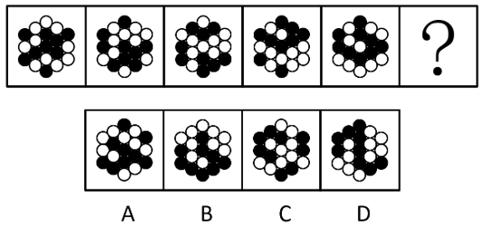

- **A**. A
- **B**. B　✅
- **C**. C
- **D**. D

**答案**：B

**官方解析**

元素组成相同，优先考虑位置规律。观察题干图形发现，所有黑球依次向下平移一格（走到头循环走），因此？处也应满足此规律，只有B项符合。
故正确答案为B。

---

## 第 2 题　qid 18649982 · 图形推理

从所给的四个选项中，选择最合适的一个填入问号处，使之呈现一定的规律性（    ）。

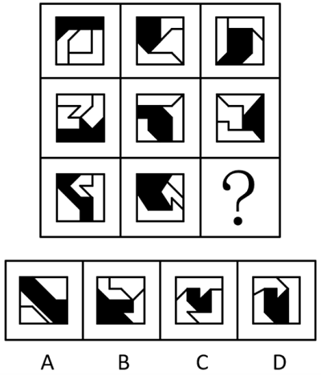

- **A**. A
- **B**. B
- **C**. C
- **D**. D　✅

**答案**：D

**官方解析**

元素组成不同，且无明显属性规律，考虑数量规律。观察发现，题干图形明显被分割，考虑面数量，题干图形和选项均由1个黑色面和3个空白面组成，无法选出唯一答案。继续观察发现，题干图形均由几个图形拼接而成，还可以考虑图形间关系。九宫格优先横向看，第一行中，黑色面与外框的公共边数分别为3、2、1，经验证，第二行也满足此规律，第三行应用此规律，故？处应选择一个黑色面与外框有1条公共边的图形，只有D项符合。
故正确答案为D。

---

## 第 3 题　qid 18649984 · 图形推理

从所给的四个选项中，选择最合适的一个填入问号处，使之呈现一定的规律性（    ）。

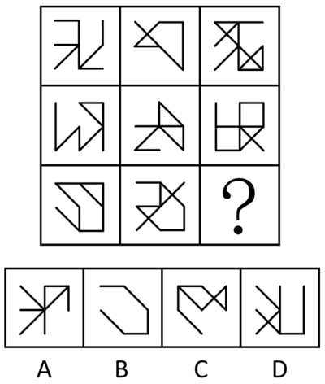

- **A**. A　✅
- **B**. B
- **C**. C
- **D**. D

**答案**：A

**官方解析**

元素组成相似，且相同线条重复出现，优先考虑样式规律中的加减同异。九宫格优先横向看，第一行图形中图1与图2求异得到图3；经验证，第二行满足此规律；第三行应用此规律，因此？处图形应由图1与图2求异得到，只有A项符合。
故正确答案为A。

---

## 第 4 题　qid 18649983 · 图形推理

把下面的六个图形分成两类，使每一类图形都有各自的共同特征或规律，分类正确的一项是（    ）。

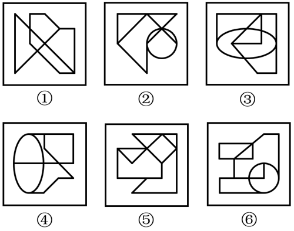

- **A**. ①②③，④⑤⑥　✅
- **B**. ①②④，③⑤⑥
- **C**. ①③⑤，②④⑥
- **D**. ①④⑥，②③⑤

**答案**：A

**官方解析**

本题为分组分类题目。元素组成不同，且无明显属性规律，考虑数量规律。题干图形出现明显多圆相切或相交的变形图，优先考虑笔画数。观察发现，图①②③均为一笔画图形，图④⑤⑥均为两笔画图形，即图①②③为一组，图④⑤⑥为一组。
故正确答案为A。

---

## 第 5 题　qid 18649988 · 图形推理

把下面的六个图形分为两类，使每一类图形都有各自的共同特征或规律，分类正确的一项是（    ）。

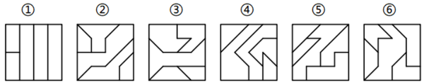

- **A**. ①②③，④⑤⑥
- **B**. ①②④，③⑤⑥　✅
- **C**. ①③⑤，②④⑥
- **D**. ①⑤⑥，②③④

**答案**：B

**官方解析**

解析一：本题为分组分类题目。元素组成不同，且无明显属性规律，考虑数量规律。观察发现，题干图形分割明显，考虑面数量，但没规律；继续观察发现，题干图形均由多个面拼接而成，考虑图形间关系。图①②④中，面a将其中1个面与另外3个面完全分隔开，且同侧的3个面相交；图③⑤⑥中，面b将与之相交的4个面两两分隔开，且同侧的2个面相交。即图①②④为一组，图③⑤⑥为一组。

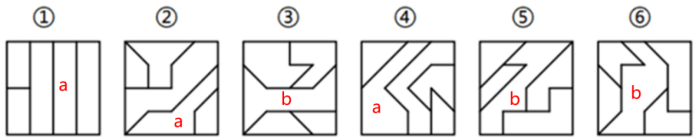

解析二：本题为分组分类题目。元素组成不同，且无明显属性规律，考虑数量规律。观察发现，题干图形分割明显，考虑面数量，但没规律；继续观察发现，只考虑内部线条的情况下，图①②④的内部线条为三部分，图③⑤⑥的内部线条为两部分。即图①②④为一组，图③⑤⑥为一组。

解析三：本题为分组分类题目。元素组成不同，且无明显属性规律，考虑数量规律。观察发现，题干每幅图形都有外框，且内部线条与外框有明显相交，考虑数内部直线和外框的交点，图①②④框上交点数均为7，图③⑤⑥框上交点数均为6，即图①②④为一组，图③⑤⑥为一组。

故正确答案为B。

---

## 第 6 题　qid 18650003 · 图形推理

以下为纸盒的外表面展开图，问哪一个折叠成的纸盒和其他三个不一样？（    ）

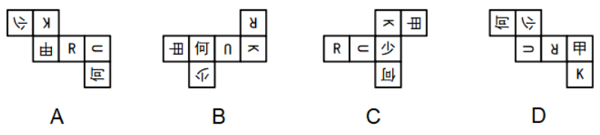

- **A**. A
- **B**. B
- **C**. C
- **D**. D　✅

**答案**：D

**官方解析**

A项：内部为“少”和“R”的两个面为相对面，内部为“何”和“K”的两个面为相对面，内部为“由”和“U”的两个面为相对面；
B项：内部为“少”和“R”的两个面为相对面，内部为“何”和“K”的两个面为相对面，内部为“由”和“U”的两个面为相对面；
C项：内部为“少”和“R”的两个面为相对面，内部为“何”和“K”的两个面为相对面，内部为“由”和“U”的两个面为相对面；
D项：内部为“少”和“K”的两个面为相对面，内部为“何”和“R”的两个面为相对面，内部为“由”和“U”的两个面为相对面。
综上，D项的两组相对面与其他三项不同。
本题为选非题，故正确答案为D。

---

## 第 7 题　qid 18649987 · 图形推理

左边的多面体由15个白色和3个灰色正方体堆叠而成，其可以拆分为①、②和③三个多面体的组合。问③代表的多面体是（    ）。

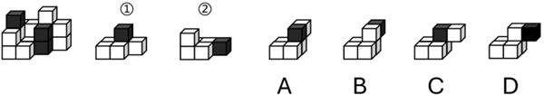

- **A**. A
- **B**. B
- **C**. C
- **D**. D　✅

**答案**：D

**官方解析**

本题考查立体拼合。题干立体图形可以由①旋转后、②以及D项旋转后拼合而成，如下图所示：

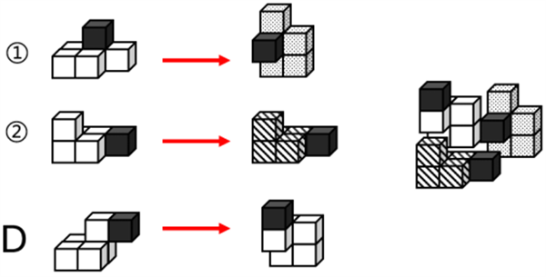

故正确答案为D。

---

## 第 8 题　qid 18649985 · 图形推理

下图为15个白色和5个灰色正方体组合而成的多面体，将其经A、B、C三个顶点切开后，正确的截面是（    ）。

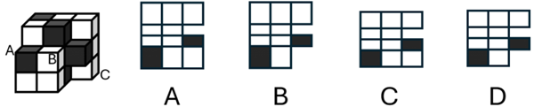

- **A**. A
- **B**. B　✅
- **C**. C
- **D**. D

**答案**：B

**官方解析**

本题选项不严谨，没有正确选项。

本题考查截面图。根据平面公理“过不在一条直线上的三点，有且只有一个平面”可以得出，A、B、C三个顶点可以确定一个唯一的截面，将图形拆分后，如下图所示：

 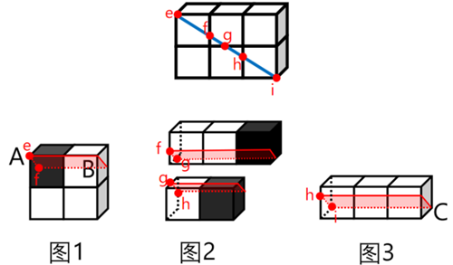

由于图中是斜切，因此在经过点A所在的小立方体时，该小立方体所在的截面应为长方形，此时由于ef的长度大于小立方体的棱长，因此在长方形截面中横边长度应小于竖边长度，排除C、D两项；又由于点A所在的小立方体为灰色，点B所在的白色小立方体的右边不存在其他小立方体，因此在选项中最后一行的截面图中应只存在一个灰色长方形和一个白色长方形，排除A项。

故正确答案为B。

注：本题出题不严谨，由上面拆分后的图形可知，本题B项中的截面图也存在问题，正确的截面应如下图所示，因此考生可以侧重学习解题思路。

---

## 第 9 题　qid 18649991 · 图形推理

以下4个图形中，哪一个是由2×2×2的白色小正方体拼成的大正方体的外表面展开图？（    ）

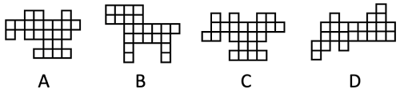

- **A**. A
- **B**. B
- **C**. C　✅
- **D**. D

**答案**：C

**官方解析**

本题考查空间重构。由题干可知，该大正方体由8个小正方体组成，因此，大正方体每个外表面由4个小正方形组成，其6个外表面一共应包括24个小正方形，A、B两项均只有23个小正方形，排除。继续分析C、D两项。

C项：如下图所示，标有序号的小正方形可拼合在对应相同序号的位置，该项可以拼成，当选；

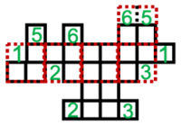

D项：如图一所示，左下角存在构成L型的三个小正方形，如果将展开图中间部分分割出完整的4个2×2的面（红色虚线框所示），最左边下方2个小正方形将和其他小正方形重叠，只能如图二所示，将展开图中间部分分割出完整的3个2×2的面（红色虚线框所示），2号和3号小正方形拼合在对应相同序号的位置，此时两个1号小正方形所在的大正方形面重叠，该项不可以拼成，排除。

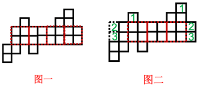

故正确答案为C。

---

## 第 10 题　qid 18649997 · 图形推理

下图中第一行的图形为给定的长方体某个角度的视图。问第二行的4个图形中，有几个是同一长方体的不同视图（该长方体仅有2个面不为纯白色）？（    ）

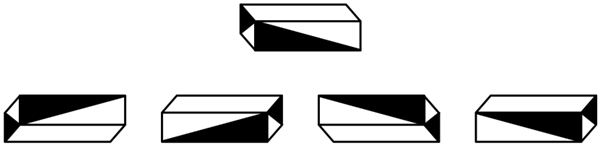

- **A**. 1　✅
- **B**. 2
- **C**. 3
- **D**. 4

**答案**：A

**官方解析**

逐一分析第二行的4个图形是否与第一行图形为同一长方体的不同视图：

图1：由该图形的正面和左侧面不是纯白色，且能看到底面可知，该图形可能为第一行图形的左前方仰视视角的视图，但该视角的视图应如下图所示；

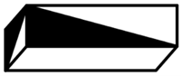

图2：由该图形的正面和右侧面不是纯白色，且能看到顶面可知，该图形可能为第一行图形整体旋转后的右前方俯视视角的视图，但该视角的视图应如下图所示；

图3：由该图形的正面和右侧面不是纯白色，且能看到底面可知，该图形与第一行图形整体旋转后的右前方仰视视角的视图一致；

图4：由该图形的正面和右侧面不是纯白色，且能看到顶面可知，该图形可能为第一行图形整体旋转后的右前方俯视视角的视图，但该视角的视图应如下图所示。

综上，第二行的4个图形中只有图3与第一行图形为同一长方体的不同视图，即只有1个。

故正确答案为A。

---

## 第 11 题　qid 18649992 · 定义判断

分层随机是指在医学临床研究中，使用随机化原则进行实验设计时，首先根据患者进入试验时某些重要的临床特征或危险因素将患者分为若干层，再在每一层内执行简单随机分配方法形成实验组和对照组，最后总的合成实验组和对照组的方法。
根据上述定义，下列采用了分层随机的是：

- **A**. 在对阿尔茨海默症发病进展的研究中，先将患者按照年龄分为不同组，每组内按性别再分为不同亚组，再按照是否经常运动分别进入实验组和对照组
- **B**. 在四种降脂药物疗效的研究中，先将患者按用药时间的不同分为四组，每组内按性别再分为两个亚组，再将每个亚组患者随机分为实验组和对照组
- **C**. 在糖尿病发展进程的观察研究中，有100名患者入试，先拟定100个序号，让其随机抽取，单号进入实验组，双号进入对照组
- **D**. 在进行原发性高血压治疗性研究中，先将患者按病情分为1级、2级和3级高血压，再将每级患者随机分为实验组和对照组　✅

**答案**：D

**官方解析**

第一步：找出定义关键词。
“根据患者进入试验时某些重要的临床特征或危险因素将患者分为若干层”、“在每一层内执行简单随机分配方法形成实验组和对照组”。
第二步：逐一分析选项。
A项：先将患者按照年龄分为不同组，每组按性别再分为不同亚组，最后按照是否经常运动分为实验组和对照组，不属于随机分配，不符合“在每一层内执行简单随机分配方法形成实验组和对照组”，不符合定义，排除；
B项：将患者按用药时间的不同进行分组，其中用药时间既不属于患者的临床特征也不属于危险因素，不符合“根据患者进入试验时某些重要的临床特征或危险因素将患者分为若干层”，不符合定义，排除；
C项：将进入试验的100名患者拟定100个序号，再让其随机抽取，单号进入实验组，双号进入对照组，是直接通过序号随机分配，不符合“根据患者进入试验时某些重要的临床特征或危险因素将患者分为若干层”，不符合定义，排除；
D项：将患者按病情分为1级、2级和3级高血压，是根据临床特征进行的分组，符合“根据患者进入试验时某些重要的临床特征或危险因素将患者分为若干层”，再将每级患者随机分为实验组和对照组，符合“在每一层内执行简单随机分配方法形成实验组和对照组”，符合定义，当选。
故正确答案为D。

---

## 第 12 题　qid 18649995 · 定义判断

成本按是否与特定决策相关，可以分为相关成本和非相关成本。相关成本是指与特定决策相关的、决策时必须加以考虑的成本。非相关成本是指与特定决策不相关的、决策时可不予考虑的成本。
根据上述定义，下列说法正确的是（    ）。

- **A**. 企业决定淘汰旧包装，采用新型包装而增加的生产成本属于相关成本　✅
- **B**. 企业决定接收加急订单，在此期间支付管理人员工资而产生的成本属于相关成本
- **C**. 企业决定增加产品的广告投入，因制作和投放广告而增加的成本属于非相关成本
- **D**. 企业决定接收海外订单，与此同时在海外建设仓库而支付的成本属于非相关成本

**答案**：A

**官方解析**

第一步：找出定义关键词。
相关成本：“与特定决策相关”、“决策时必须加以考虑”；
非相关成本：“与特定决策不相关”、“决策时可不予考虑”。
第二步：逐一分析选项。
A项：采用新型包装而增加的生产成本，是“淘汰旧包装、采用新型包装”这一决策直接导致的额外支出，符合“与特定决策相关”、“决策时必须加以考虑”，符合“相关成本”定义，说法正确，当选；
B项：支付管理人员工资而产生的成本，通常是企业的固定运营成本，无论是否有“接收加急订单”这一决策，该工资成本均需支付，符合“与特定决策不相关”、“决策时可不予考虑”，符合“非相关成本”定义，不符合“相关成本”定义，说法错误，排除；
C项：因制作和投放广告而增加的成本，是“增加广告投入”这一决策直接产生的费用，符合“与特定决策相关”、“决策时必须加以考虑”，符合“相关成本”定义，不符合“非相关成本”定义，说法错误，排除；
D项：在海外建设仓库而支付的成本，是直接由“接收海外订单”这一决策所产生的，符合“与特定决策相关”、“决策时必须加以考虑”，符合“相关成本”定义，不符合“非相关成本”定义，说法错误，排除。
故正确答案为A。

---

## 第 13 题　qid 18649989 · 定义判断

注意分配是指在同一时间内，把注意集中到两种或几种不同的事物或者活动上。注意分配的条件在于有熟练的技能技巧和有赖于同时进行的几种活动之间的关系。
根据上述定义，下列属于注意分配的是（    ）。

- **A**. 驾驶员在开车时，在观察前方道路的状况时，同时想着晚餐吃什么
- **B**. 李律师同时接了两起民事案件，近段时间忙于对两起案件材料的整理
- **C**. 外科医生长时间专注于一台手术，既要观察仪器数据，又要留心手术刀的操作　✅
- **D**. 教室内幼儿正聚精会神地听老师讲故事，忽然从窗外飞进来一只小鸟，大家都去看小鸟

**答案**：C

**官方解析**

第一步：找出定义关键词。
“同一时间内”、“把注意集中到两种或几种不同的事物或者活动上”、“有熟练的技能技巧”、“有赖于同时进行的几种活动之间的关系”。
第二步：逐一分析选项。
A项：驾驶员在开车时，观察前方道路状况的同时想着晚餐吃什么，虽然是在同一时间内，但“观察道路状况”与“想晚餐吃什么”之间没有关系，不符合“有赖于同时进行的几种活动之间的关系”，不符合定义，排除；
B项：李律师同时接了两起民事案件，近段时间忙于整理两起案件的材料，“近段时间”是一个时间段，说明是在一段时间内处理两件事，而非在“同一时间内”同时进行，不符合“同一时间内”，不符合定义，排除；
C项：外科医生在进行一台手术时，同一时间内既要观察仪器数据，又要操作手术刀，“观察仪器数据”与“操作手术刀”这两种活动都需要高度熟练的专业技能，且两者密切相关，符合“同一时间内”、“把注意集中到两种或几种不同的事物或者活动上”、“有熟练的技能技巧”、“有赖于同时进行的几种活动之间的关系”，符合定义，当选；
D项：幼儿从听故事转向看小鸟，属于注意力从一项活动转移到另一项活动，不符合“同一时间内”、“把注意集中到两种或几种不同的事物或者活动上”，不符合定义，排除。
故正确答案为C。

---

## 第 14 题　qid 18649994 · 定义判断

意见证据规则是指证人只能陈述自己亲身感受和经历的事实，而不得陈述对该事实的意见或者结论。意见证据规则有两个例外：一是有关专家证人的例外，即一个具有适当资格的专家可以就他拥有相应专业知识且需要专家意见的事实陈述其意见；二是有关普通证人的例外，即作为表述曾亲身感知的事实的方式，一个非专家证人可以就那些不需要任何特殊的专业知识的事实陈述其意见。
根据上述定义，下列证人的陈述违反了意见证据规则的是（    ）。

- **A**. 我进门后，就看见甲一边擦着鼻血，一边怒视着乙，乙应该是打了甲　✅
- **B**. 天很黑，我没有看清行凶者的长相，但是从声音辨认他应该年龄很大
- **C**. 案发当晚，被告人后半夜才回到宿舍，他脱衣服时，我闻到了类似火药的味道
- **D**. 我们在尸检的过程中发现死者身上尸斑的发展速度，比正常情况下缓慢，根据检测，我们认定死者的死亡时间已经超过12个小时

**答案**：A

**官方解析**

第一步：找出定义关键词。
“证人只能陈述自己亲身感受和经历的事实”、“不得陈述对该事实的意见或者结论”、“具有适当资格的专家可以就他拥有相应专业知识且需要专家意见的事实陈述其意见”、“作为表述曾亲身感知的事实的方式，非专家证人可以就那些不需要任何特殊的专业知识的事实陈述其意见”。
第二步：逐一分析选项。
A项：证人陈述“乙应该是打了甲”，这是一个基于观察的推断或结论，而非直接亲身感知的事实，不符合“证人只能陈述自己亲身感受和经历的事实”、“具有适当资格的专家可以就他拥有相应专业知识且需要专家意见的事实陈述其意见”、“作为表述曾亲身感知的事实的方式，非专家证人可以就那些不需要任何特殊的专业知识的事实陈述其意见”，不符合定义，当选；
B项：证人陈述“从声音辨认他应该年龄很大”，通过声音判断年龄无需特殊专业知识，是对亲身感知事实陈述的合理意见，符合“作为表述曾亲身感知的事实的方式，非专家证人可以就那些不需要任何特殊的专业知识的事实陈述其意见”，符合定义，排除；
C项：证人陈述“案发当晚，被告人后半夜才回到宿舍，他脱衣服时，我闻到了类似火药的味道”，均为亲身感知的事实，不涉及意见或结论，符合“证人只能陈述自己亲身感受和经历的事实”，符合定义，排除；
D项：证人陈述“我们在尸检的过程中发现死者身上尸斑的发展速度，比正常情况下缓慢，根据检测，我们认定死者的死亡时间已经超过12个小时”，说明是具有专业资格的人员基于检测陈述的意见，符合“具有适当资格的专家可以就他拥有相应专业知识且需要专家意见的事实陈述其意见”，符合定义，排除。
本题为选非题，故正确答案为A。

---

## 第 15 题　qid 18650002 · 定义判断

对于行为者的某种行为，其基本信息有三条：（1）独特性，指行为者的这种行为是特殊的，还是在多数情况下一直如此；（2）一致性，指行为者的这种行为是否与其他行为者相一致；（3）一贯性，指行为者对行为对象的这种行为一贯如此，还是偶然为之。所谓三维归因是指根据行为者的上述行为信息，可将其行为原因归因于如下图所示的三个维度：

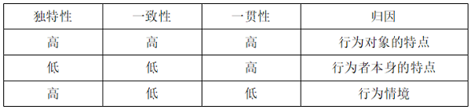

一日，王某就工作分配问题与张经理发生争吵，通过分析发现，王某经常在工作分配上与他人争吵，王某的其他同事都未曾就工作分配问题与张经理发生争吵，王某在其他场合多次就工作分配问题与张经理发生争吵。

根据上述定义，王某当日的行为应归因于（    ）。

- **A**. 行为对象的特点
- **B**. 行为者本身的特点　✅
- **C**. 行为情境
- **D**. 无法确定

**答案**：B

**官方解析**

第一步：找出定义关键词。
“独特性：行为者的这种行为是特殊的，还是在多数情况下一直如此”、“一致性：行为者的这种行为是否与其他行为者相一致”、“一贯性：行为者对行为对象的这种行为一贯如此，还是偶然为之”。
第二步：分析并匹配选项。
根据“王某就工作分配问题与张经理发生争吵”，且“王某经常在工作分配上与他人争吵”，说明王某与他人争吵的行为，符合“在多数情况下一直如此”，属于独特性低；根据“王某的其他同事都未曾就工作分配问题与张经理发生争吵”，说明王某与他人争吵的行为，符合“行为者的这种行为与其他行为者不一致”，属于一致性低；根据“王某在其他场合多次就工作分配问题与张经理发生争吵”，说明王某与他人争吵的行为，符合“行为者对行为对象的这种行为一贯如此”，属于一贯性高；因此王某与他人争吵的行为属于独特性低、一致性低、一贯性高，应归因于行为者本身的特点，对应B项。
故正确答案为B。

---

## 第 16 题　qid 18649998 · 类比推理

故人：客人

- **A**. 原告：被告
- **B**. 行人：路人
- **C**. 董事：监事
- **D**. 名人：文人　✅

**答案**：D

**官方解析**

第一步：判断题干词语间逻辑关系。
“故人”和“客人”分别是从熟悉程度、来访身份的角度对人进行划分的，二者为交叉关系。
第二步：判断选项词语间逻辑关系。
A项：“原告”和“被告”是法律诉讼中的不同主体，二者为并列关系，与题干逻辑关系不一致，排除；
B项：“路人”指路上的行人，“行人”指路上走的人，二者不是交叉关系，与题干逻辑关系不一致，排除；
C项：“董事”是指由公司股东会选举产生的具有实际权力和权威的管理公司事务的人员，“监事”是公司中常设的监察机关的成员，二者为并列关系，与题干逻辑关系不一致，排除；
D项：“名人”和“文人”分别是从知名程度、从事领域的角度对人进行划分的，二者为交叉关系，与题干逻辑关系一致，当选。
故正确答案为D。

---

## 第 17 题　qid 18650000 · 类比推理

松鼠鳜鱼：孜然牛肉：干烧大虾

- **A**. 凤尾腰花：红油鸡丁：炭烤生蚝　✅
- **B**. 五彩时蔬：酸辣粉丝：香煎藕盒
- **C**. 百花豆腐：松仁玉米：爆炒扇贝
- **D**. 水晶肘子：咖喱土豆：姜汁豇豆

**答案**：A

**官方解析**

第一步：判断题干词语间逻辑关系。
“松鼠鳜鱼”、“孜然牛肉”和“干烧大虾”是三种不同的菜肴，三者为并列关系，且“松鼠鳜鱼”因形似松鼠而得名，是根据外形进行命名的，“孜然牛肉”是根据使用的主要调味料进行命名的，“干烧大虾”是根据烹饪方式进行命名的。
第二步：判断选项词语间逻辑关系。
A项：“凤尾腰花”、“红油鸡丁”和“炭烤生蚝”是三种不同的菜肴，三者为并列关系，且“凤尾腰花”是将腰花切成凤凰尾羽形状而得名的，是根据外形进行命名的，“红油鸡丁”是根据使用的主要调味料进行命名的，“炭烤生蚝”是根据烹饪方式进行命名的，与题干逻辑关系一致，当选；
B项：“五彩时蔬”、“酸辣粉丝”和“香煎藕盒”是三种不同的菜肴，三者为并列关系，但“五彩时蔬”是根据颜色，而非形状进行命名的，与题干逻辑关系不一致，排除；
C项：“百花豆腐”、“松仁玉米”和“爆炒扇贝”是三种不同的菜肴，三者为并列关系，但“松仁玉米”是根据主要食材，而非使用的主要调味料进行命名的，与题干逻辑关系不一致，排除；
D项：“水晶肘子”、“咖喱土豆”和“姜汁豇豆”是三种不同的菜肴，三者为并列关系，但“姜汁豇豆”是根据主要调味料，而非烹饪方式进行命名的，与题干逻辑关系不一致，排除。
故正确答案为A。

---

## 第 18 题　qid 18650004 · 类比推理

水质净化：静置沉淀：过滤消毒

- **A**. 补充营养：肉蛋鲜奶：水果蔬菜
- **B**. 化解矛盾：居中调解：沟通合作　✅
- **C**. 实地观察：调查研究：访谈问卷
- **D**. 教学方法：实地教学：现场教学

**答案**：B

**官方解析**

第一步：判断题干词语间逻辑关系。
“静置沉淀”和“过滤消毒”都是“水质净化”的方式，后两词为并列关系，二者分别与第一词构成方式目的的对应关系。
第二步：判断选项词语间逻辑关系。
A项：“肉蛋鲜奶”和“水果蔬菜”是不同的食物，均具有“补充营养”的功能，后两词均与第一词构成功能对应关系，与题干逻辑关系不一致，排除；
B项：“居中调解”和“沟通合作”都是“化解矛盾”的方式，后两词为并列关系，二者分别与第一词构成方式目的的对应关系，与题干逻辑关系一致，当选；
C项：“实地观察”是“调查研究”的方式，二者为方式目的的对应关系，“访谈问卷”是“调查研究”中用到的物品，二者为使用物品的对应关系，与题干逻辑关系不一致，排除；
D项：“实地教学”是“现场教学”的通俗名称，二者为全同关系，且“现场教学”是一种“教学方法”，二者为种属关系，与题干逻辑关系不一致，排除。
故正确答案为B。

---

## 第 19 题　qid 18650006 · 类比推理

丸剂：试剂：冲剂

- **A**. 美梦：睡梦：噩梦
- **B**. 初审：外审：复审　✅
- **C**. 笔算：演算：珠算
- **D**. 古物：器物：礼物

**答案**：B

**官方解析**

第一步：判断题干词语间逻辑关系。
“丸剂”指以药材细粉或提取物加入粘合剂制成的球形或类球形中药制剂，“冲剂”指以药物提取物与适宜的辅料或药材细粉制成的颗粒状或块状制剂。二者是不同的药物剂型，为并列关系。“试剂”是用于实验或检测的化学物质，“丸剂”不是“试剂”，“冲剂”也不是“试剂”。
第二步：判断选项词语间逻辑关系。
A项：“美梦”和“噩梦”是不同的“睡梦”，第一个词和第三个词构成并列关系，分别与第二个词构成种属关系，与题干逻辑关系不一致，排除；
B项：“初审”和“复审”是审核过程中的两个阶段，二者为并列关系，“外审”又称外部审计，是由独立于被审计单位的国家审计机关或会计师事务所等社会审计机构，对其经济活动的合理性、合法性、准确性、真实性和效益性进行审查的监督机制；“初审”不是“外审”，“复审”也不是“外审”，与题干逻辑关系一致，当选；
C项：“笔算”和“珠算”是不同的“演算”方式，第一个词和第三个词构成并列关系，分别与第二个词构成种属关系，与题干逻辑关系不一致，排除；
D项：“古物”是一种“器物”，二者为种属关系，“礼物”与前两词无明显逻辑关系，与题干逻辑关系不一致，排除。
故正确答案为B。
注：本题B项中的“外审”存在送外审查和外部审计两种含义，若理解为送外审查，此时外审与复审为交叉关系，但这样分析无答案匹配。因此在本题中需将外审理解为外部审计，且大多数情况外审都为外部审计的意思，此时外审与复审无明显关系，复审不是外审，对应B项。

---

## 第 20 题　qid 18650013 · 类比推理

医疗保险：财产保险：责任保险

- **A**. 政府债券：金融债券：企业债券　✅
- **B**. 公众人物：新闻人物：政治人物
- **C**. 报刊杂志：书法绘画：出版书籍
- **D**. 笔墨纸砚：文房四宝：文书工具

**答案**：A

**官方解析**

第一步：判断题干词语间逻辑关系。
“医疗保险”、“财产保险”和“责任保险”是三种不同类型的保险，都是根据保险保障范围进行划分的，三者为并列关系。
第二步：判断选项词语间逻辑关系。
A项：“政府债券”是政府为筹集资金而向出资者出具并承诺在一定时期支付利息和偿还本金的债务凭证；“金融债券”是银行及非银行金融机构在全国银行间债券市场发行的按约定还本付息的有价证券；“企业债券”是非金融企业依照法定程序发行，约定在一定期限内还本付息的债券，三者是不同类型的债券，都是根据发行主体进行划分的，为并列关系，与题干逻辑关系一致，当选；
B项：“公众人物”是根据公众知晓度进行划分的、“新闻人物”是根据是否具有新闻价值进行划分的，“政治人物”是根据所属领域进行划分的，三者互为交叉关系，与题干逻辑关系不一致，排除；
C项：“书法绘画”是“报刊杂志”和“出版书籍”的内容，第二个词分别与第一个词和第三个词构成内容与载体的对应关系，与题干逻辑关系不一致，排除；
D项：“笔墨纸砚”是“文房四宝”，前两个词是全同关系，“文房四宝”是中国古代传统文化中的“文书工具”，后两个词是种属关系，与题干逻辑关系不一致，排除。
故正确答案为A。
注：本题题干中的“财产保险”有广义与狭义之分。其中“广义财产保险”是指以财产及其有关的经济利益和损害赔偿责任为保险标的的保险；“狭义财产保险”则是指以物质财产为保险标的的保险。
若按照“广义财产保险”来理解，“责任保险”属于“财产保险”，题干的后两词应为种属关系，但这样分析无答案可以匹配，故本解析按照“狭义财产保险”来理解，即“以物质财产为保险标的的保险”，此时“医疗保险”、“财产保险”和“责任保险”都是根据保险保障范围进行划分的，三者可以看作并列中的反对关系，对应A项。

---

## 第 21 题　qid 18650014 · 逻辑判断

现代社会飞速发展，人们生活压力越来越大，睡眠问题愈发突出。据统计，中国约有30%的人曾发生不同程度的失眠症状，发病年龄呈年轻化趋势。证据表明，失眠会降低生活质量，增加精神疾病、糖尿病、心血管疾病等风险。国际指南建议，失眠的第一线疗法是失眠认知行为疗法，但世界范围内来看失眠患者获得该治疗的机会极其有限，取而代之的是提供睡眠卫生建议，开催眠药物或超适应症的镇静抗抑郁药物等，但这些都不是长期治疗失眠的方法，因此科学家指出需要创设新的治疗和护理模式。
以下哪项如果为真，最能支持上述结论?（    ）

- **A**. 催眠药物或镇静抗抑郁药物可能存在一系列的副作用
- **B**. 失眠认知行为疗法最成熟，但需丰富的医疗资源支持
- **C**. 实验表明存在成本效益可控且可广泛实施的失眠疗法　✅
- **D**. 心理健康问题和失眠的高共患病率需要引入药物治疗

**答案**：C

**官方解析**

第一步：找出论点和论据。
论点：科学家指出（治疗失眠）需要创设新的治疗和护理模式。
论据：国际指南建议，失眠的第一线疗法是失眠认知行为疗法，但世界范围内来看失眠患者获得该治疗的机会极其有限，取而代之的是提供睡眠卫生建议，开催眠药物或超适应症的镇静抗抑郁药物等，但这些都不是长期治疗失眠的方法。
本题论点讨论的是需要创设新的治疗和护理模式，论据讨论的是两种现有治疗方法的缺点，话题一致，加强优先考虑补充论据。
第二步：逐一分析选项。
A项：催眠药物或镇静抗抑郁药物可能存在一系列的副作用，指出现有治疗方法的缺点，说明确实需要新的治疗方法，补充论据，可以加强，保留；
B项：失眠认知行为疗法需丰富的医疗资源支持，解释了为什么世界范围内来看失眠患者获得该治疗的机会极其有限，说明确实需要新的治疗方法，补充论据，可以加强，保留；
C项：实验表明存在成本效益可控且可广泛实施的失眠疗法，说明确实存在新的治疗方法能够解决现有方法存在的问题，解释说明需要创设新的治疗方法是可行的，补充论据，可以加强，保留；
D项：心理健康问题和失眠的高共患病率需要引入药物治疗，解释了现有治疗方法的合理性，而论点讨论的是需要新的治疗方法，话题不一致，无法加强，排除。
对比A、B、C三项，A项是或然性表述，并且只能说明药物疗法确实有缺点，间接证明需要新的治疗方法，力度较弱；B项只能说明失眠认知行为疗法确实有缺点，间接证明需要新的治疗方法，力度较弱；而C项说明确实存在新的治疗方法能够解决目前的问题，直接证明可以创设新的治疗方法，直接证明的力度强于间接证明，C项当选。
故正确答案为C。

---

## 第 22 题　qid 18650018 · 逻辑判断

数据显示，Y国肉类的冷链流通率为30%，果蔬的冷链流通率不到20%，相比之下，发达国家的冷链流通率达到90%以上。对于Y国冷链物流相对落后的原因，一种观点认为是由技术落后造成的。目前冷链物流企业所采用的制冷工艺和技术方法都较为滞后，导致损耗过高，另一种观点则认为，相比普通物流，冷链运输的成本要高出一倍以上，这也导致很多企业仍然采用传统手段进行生鲜配送。
以下哪项如果为真，最能削弱第二种观点？（    ）

- **A**. Y国冷链物流技术落后导致了该国冷链运输的成本过高　✅
- **B**. 物流成本最终都会转嫁到下游产业，最终由消费者买单
- **C**. Y国基础设施较为发达，普通物流的运输成本比发达国家都要低
- **D**. 为节约成本，Y国一些冷链司机主动关闭制冷机，导致耗损大幅增加

**答案**：A

**官方解析**

第一步：找出论点和论据。
论点：相比普通物流，冷链运输的成本要高出一倍以上，这也导致很多企业仍然采用传统手段进行生鲜配送。
论据：无。
本题论点讨论Y国冷链运输成本高导致冷链物流相对落后，只有论点，没有论据，削弱优先考虑削弱论点。
第二步：逐一分析选项。
A项：该项指出Y国冷链物流技术落后导致了该国冷链运输的成本过高，说明冷链物流相对落后的根本原因是技术落后，而非成本过高，直接削弱论点，可以削弱，当选；
B项：该项指出物流成本最终会转嫁到消费者，讨论的是物流成本最终由谁承担，与论点讨论的企业为何不采用冷链运输话题不一致，为无关项，无法削弱，排除；
C项：该项指出Y国普通的物流运输成本比发达国家低，证明普通物流的运输成本确实低，可以加强，无法削弱，排除；
D项：该项指出Y国一些冷链司机的错误做法导致耗损大幅增加，但并不清楚这些司机占比如何，因此无法确定Y国企业是否会因损耗大而避免采用冷链运输，为不明确项，无法削弱，排除。
故正确答案为A。

---

## 第 23 题　qid 18650022 · 逻辑判断

相较于传统肉类，目前市场上以植物蛋白为原料的“人造肉”自带健康、环保等光环，但是，无论是在国内还是国外，“人造肉”的市场效益均不佳。有人认为，消费者对新上市的产品有一个认识、认知和认可的过程，目前消费者对“人造肉”的认知度还不高，更遑论认可度了，这是消费者对“人造肉”消费意愿不强的原因。
以下除哪项外，均能削弱上述论证？（    ）

- **A**. “人造肉”的价格是普通肉类的2到3倍，即使想反复购买，消费者也很难消费得起
- **B**. 多数消费者认为，“人造肉”是人工合成的，吃“人造肉”有害身体健康　✅
- **C**. 目前“人造肉”的产品种类还较为单一，不能满足消费者日常饮食需求
- **D**. 有74%的消费者表示不愿意复购“人造肉”，是因为其口感不如普通肉类

**答案**：B

**官方解析**

第一步：找出论点和论据。
论点：消费者对新上市的产品有一个认识、认知和认可的过程，目前消费者对“人造肉”的认知度还不高，更遑论认可度了，这是消费者对“人造肉”消费意愿不强的原因。
论据：无。
本题论点讨论的是消费者对“人造肉”的认知度和认可度低导致消费意愿不强，只有论点没有论据，本题为选非题，排除能削弱的选项即可。
第二步：逐一分析选项。
A项：消费者消费不起价格更高的“人造肉”，说明消费者消费意愿不强是因为“人造肉”价格高，而非对“人造肉”的认知度和认可度低，可以削弱，排除；
B项：多数消费者认为吃人工合成的“人造肉”有害健康，这正是消费者对“人造肉”认知度和认可度低的体现，说明确实是消费者的认知度和认可度影响了消费意愿，为加强项，无法削弱，当选；
C项：“人造肉”产品种类单一，无法满足消费者日常饮食需求，说明消费者消费意愿不强是因为“人造肉”种类单一，而非对“人造肉”的认知度和认可度低，可以削弱，排除；
D项：74%的消费者因“人造肉”口感不如普通肉类而不愿复购，说明消费者消费意愿不强是因为“人造肉”口感差，而非对“人造肉”的认知度和认可度低，可以削弱，排除。
本题为选非题，故正确答案为B。

---

## 第 24 题　qid 18650027 · 逻辑判断

推动特殊教育优质融合发展，需要多方位推进。特殊教育的发展必须以教育整体改革发展为前提，并且必将有利于教育整体改革发展。推动特殊教育优质融合发展，还需要持续扩优提质。资源是发展的保障，质量是永恒的话题，这两点对于当前特殊教育的发展都是必不可少、缺一不可的。
由此可以推出的是（    ）。

- **A**. 有了资源和质量必将推动当前特殊教育的发展
- **B**. 没有教育整体改革发展就不会有特殊教育的发展　✅
- **C**. 有了多方位推进就能推动特殊教育优质融合发展
- **D**. 没有持续扩优提质也能推动特殊教育优质融合发展

**答案**：B

**官方解析**

第一步：翻译题干。

（1）推动特殊教育优质融合发展多方位推进；

（2）特殊教育的发展教育整体改革发展；

（3）特殊教育的发展有利于教育整体改革发展；

（4）推动特殊教育优质融合发展持续扩优提质；

（5）特殊教育的发展资源 且 质量。

第二步：逐一分析选项。

A项：翻译为“资源 且 质量特殊教育的发展”，是对条件（5）的肯后，肯后推不出确定性结论，无法推出，排除；

B项：翻译为“特殊教育的发展教育整体改革发展”，是对条件（2）的肯前，肯前必肯后，可以推出，当选；

C项：翻译为“多方位推进推动特殊教育优质融合发展”，是对条件（1）的肯后，肯后推不出确定性结论，无法推出，排除；

D项：翻译为“持续扩优提质 且 推动特殊教育优质融合发展”，与条件（4）矛盾，无法推出，排除。

故正确答案为B。

---

## 第 25 题　qid 18650033 · 逻辑判断

一项报告显示，尽管R国有着全球最大的科研队伍之一，但其高质量科研产出的数量却在持续下降。对于R国高质量科研产出下降的原因，有不少学者认为是由科研经费不足导致的。在过去的20年间，R国的科研经费仅增长了10%，远远低于其他很多国家的水平。但实际上，科研经费不足只会导致科研人员投入科研工作的时间减少，其并不是高质量科研产出下降的原因。
以下哪项如果为真，最能削弱上述结论?（    ）

- **A**. R国高质量科研产出占世界总量的比重并没有下降
- **B**. 科研人员的科研工作时间减少是高质量科研产出下降的原因　✅
- **C**. 科研人员岗位不稳定，使其无法安心工作，产出高质量科研成果
- **D**. 科研人员参与教学和产业合作，虽然减少了其科研时间，但却很有意义

**答案**：B

**官方解析**

第一步：找出论点和论据。
论点：科研经费不足只会导致科研人员投入科研工作的时间减少，其并不是高质量科研产出下降的原因。
论据：无。
本题只有论点没有论据，削弱优先考虑削弱论点，即“科研经费不足是高质量科研产出下降的原因”。
第二步：逐一分析选项。
A项：R国高质量科研产出占世界总量的“比重”并没有下降，而论点讨论的是高质量科研产出的“数量”下降的原因，话题不一致，为无关项，无法削弱，排除；
B项：科研人员的科研工作时间减少会导致高质量科研产出下降，而科研经费不足会导致科研工作时间减少，因此科研经费不足会导致高质量科研产出下降，削弱论点，可以削弱，当选；
C项：科研人员“岗位不稳定”使其无法产出高质量科研成果，但并不清楚“科研经费不足”是否会导致高质量科研产出下降，无法削弱，排除；
D项：科研人员参与教学和产业合作很有意义，而论点讨论的是科研经费不足不会导致高质量科研产出下降，话题不一致，为无关项，无法削弱，排除。
故正确答案为B。

---

## 第 26 题　qid 18650031 · 逻辑判断

品牌电动汽车深受消费者喜爱，其生产的纯电动汽车连续几年在全球销量领先。从今年1月开始，该品牌掀起了一轮前所未有的降价风暴，一度吸引了大量消费者，并在前两个季度创下销量历史新高。但是进入三季度之后，销量却开始持续下滑。有分析人士认为，这是由于最初的低价推出后，刺激了销量，但是在经历了两个季度之后降价效应减弱，导致销量下滑，并非像有些人认为的是由该品牌的竞争对手蚕食市场导致的。
以下哪项如果为真，最能削弱上述结论？（    ）

- **A**. 尽管销量下滑，但该品牌表示仍然会继续降价
- **B**. 竞争对手蚕食电动车市场导致该品牌的降价效应减弱　✅
- **C**. 其他品牌的电动车目前还无法撼动该品牌的市场地位
- **D**. 该品牌降价销售极大地挤压了利润，不利于企业后期的技术更新

**答案**：B

**官方解析**

第一步：找出论点和论据。
论点：进入三季度之后，销量开始持续下滑是由于最初的低价推出后，刺激了销量，但是在经历了两个季度之后降价效应减弱，导致销量下滑，并非像有些人认为的是由该品牌的竞争对手蚕食市场导致的。
论据：从今年1月开始，该品牌掀起了一轮前所未有的降价风暴，一度吸引了大量消费者，并在前两个季度创下销量历史新高。但是进入三季度之后，销量却开始持续下滑。
本题的论点、论据讨论的都是该品牌纯电动汽车销量进入三季度之后持续下滑的原因，二者话题一致，削弱优先考虑削弱论点。
第二步：逐一分析选项。
A项：该项指出该品牌即使销量下滑也会继续降价，讨论的是该品牌后续如何定价，而论点讨论的是该品牌纯电动汽车销量下滑的原因，二者话题不一致，无法削弱，排除；
B项：该项指出竞争对手蚕食电动车市场导致该品牌的降价效应减弱，进而导致汽车销量下滑，说明竞争对手蚕食电动车市场才是该品牌纯电动汽车销量下滑的根本原因，直接削弱论点，可以削弱，当选；
C项：该项指出其他品牌目前还无法撼动该品牌的市场地位，讨论的是该品牌的市场地位如何，而论点讨论的是该品牌纯电动汽车销量下滑的原因，二者话题不一致，无法削弱，排除；
D项：该项指出该品牌的降价销售不利于企业技术更新，讨论的是降价销售有哪些影响，而论点讨论的是该品牌纯电动汽车销量下滑的原因，二者话题不一致，无法削弱，排除。
故正确答案为B。

---

## 第 27 题　qid 18650034 · 逻辑判断

研究人员发现，许多鸟类的体型在进化过程中正在逐渐变小，罪魁祸首是全球气候变暖。研究人员在30个不同地点捕捉到40只成年麻雀，通过比较和测量发现，对它们的体型尺寸而言，其所生活的区域夏季最高温的影响远远大于冬季最低温，而夏季正是它们繁殖的季节。在炎热夏季出生的雏鸟更可能成长为体型较小的成鸟。研究人员认为，鸟类体型变小，是其适应气候变暖的结果。
以下哪项如果为真，最能支持上述结论？（    ）

- **A**. 与温暖地区相比，寒冷地区的生物体型会更大，以利于保温
- **B**. 在全球变暖的过程中，鸟类通过改变体型大小以适应这一过程　✅
- **C**. 气候变暖使禽疟疾北移，这种血液寄生虫病会更严重影响鸟类的健康
- **D**. 气候变暖导致食物减少，鸟类通过减少种群规模的方式适应这种变化

**答案**：B

**官方解析**

第一步：找出论点和论据。
论点：鸟类体型变小，是其适应气候变暖的结果。
论据：研究人员发现，许多鸟类的体型在进化过程中正在逐渐变小，罪魁祸首是全球气候变暖。
本题的论点和论据都在讨论“气候变暖”与“鸟类体型变小”之间的关系，二者话题一致，加强可以考虑补充论据。
第二步：逐一分析选项。
A项：该项指出寒冷地区生物体型更大以利于保温，讨论的是“温暖地区和寒冷地区生物体型存在差异”，而论点讨论的是“鸟类体型变小”的原因，话题不一致，无法加强，排除；
B项：该项指出鸟类通过改变体型大小以适应全球变暖这一过程，说明全球变暖确实会导致鸟类体型变小，补充论据，可以加强，当选；
C项：该项指出气候变暖导致禽疟疾北移影响鸟类健康，讨论的是“气候变暖对鸟类健康的危害”，而论点讨论的是“鸟类体型变小”的原因，话题不一致，无法加强，排除；
D项：该项指出气候变暖导致食物减少，鸟类通过减少种群规模适应，说明鸟类适应气候变暖的方式是“减少种群规模”，而非“体型变小”，与论点讨论的“体型变小”无关，话题不一致，无法加强，排除。
故正确答案为B。

---

## 第 28 题　qid 18650039 · 逻辑判断

法律和道德都是调整社会关系、维护社会秩序的重要手段。法律调整那些对建立正常社会秩序具有比较重要意义的社会关系。从这一点上讲，在调整社会关系方面，法律和道德调整的范围不同。
上述论证的成立需要补充以下哪项作为前提？（    ）

- **A**. 法律调整的范围不是固定不变的，会随着社会生活的变化发生变化
- **B**. 法律作用于人的外部行为，道德则主要作用于人的内心世界
- **C**. 道德调整的范围几乎涉及到社会关系的各个领域和方面　✅
- **D**. 道德对法律的漏洞或者空白之处具有弥补作用

**答案**：C

**官方解析**

第一步：找出论点和论据。
论点：在调整社会关系方面，法律和道德调整的范围不同。
论据：法律和道德都是调整社会关系、维护社会秩序的重要手段。法律调整那些对建立正常社会秩序具有比较重要意义的社会关系。
本题论点讨论的是“法律与道德调整的范围不同”，论据讨论的是“法律只调整重要的社会关系”，二者话题不一致，加强优先考虑搭桥，需要说明在调整社会关系方面，道德的范围不同于法律。
第二步：逐一分析选项。
A项：该项指出法律调整的范围会随社会生活的变化而变化，而题干论点讨论的是法律和道德调整社会关系的范围是否相同，话题不一致，无法加强，排除；
B项：该项指出法律作用于人的外部行为，而道德则作用于人的内心世界，说明法律和道德的作用对象不同，而题干论点讨论的是法律和道德调整社会关系的范围是否相同，话题不一致，无法加强，排除；
C项：该项指出道德调整的范围几乎涉及到社会关系的各个领域和方面，而法律调整的只是具有重要意义的社会关系，这说明道德与法律的调整范围不同，为搭桥项，可以加强，当选；
D项：该项指出道德对法律的漏洞或者空白之处具有弥补作用，但并不明确这种弥补作用是否与调整社会关系有关，不明确项，无法加强，排除。
故正确答案为C。

---

## 第 29 题　qid 18650037 · 逻辑判断

研究人员分析了4大洲113种鸟类、蝙蝠和蜥蜴等食虫动物栖息地被剥夺后的情况，并对昆虫数量和植物生长的影响进行了量化。研究结果表明，这些食虫动物有效减少了植物天敌的数量，对植物的生长具有正面影响，研究人员据此认为，鸟类、蝙蝠和蜥蜴等食虫动物可减缓全球气候变暖。
上述论证的成立需要补充以下哪项作为前提？（    ）

- **A**. 一些昆虫本身就会释放可加速全球气候变暖的温室气体
- **B**. 植物吸收二氧化碳并释放氧气的过程可减缓全球气候变暖　✅
- **C**. 这些食虫动物的存在改变了森林系统气体循环时二氧化碳的比例
- **D**. 食虫动物、植物和昆虫的数量保持平衡可对全球气候变化起到积极作用

**答案**：B

**官方解析**

第一步：找出论点和论据。
论点：鸟类、蝙蝠和蜥蜴等食虫动物可减缓全球气候变暖。
论据：研究人员分析了4大洲113种鸟类、蝙蝠和蜥蜴等食虫动物栖息地被剥夺后的情况，并对昆虫数量和植物生长的影响进行了量化。研究结果表明，这些食虫动物有效减少了植物天敌的数量，对植物的生长具有正面影响。
本题论点讨论的是“食虫动物可减缓全球气候变暖”，论据讨论的是“食虫动物对植物的生长有正面影响”，论点论据话题不一致，加强优先考虑搭桥，即建立“植物生长”与“减缓全球变暖”之间的联系。
第二步：逐一分析选项。
A项：该项指出一些昆虫本身会释放温室气体，因此食虫动物可以通过减少这些昆虫数量，进而减少温室气体，最终减缓全球气候变暖，补充论据，可以加强，保留；
B项：该项指出植物吸收二氧化碳并释放氧气的过程可减缓全球气候变暖，建立了“植物生长”与“减缓全球变暖”之间的联系，为搭桥项，可以加强，保留；
C项：该项指出这些食虫动物的存在改变了森林系统气体循环时二氧化碳的比例，但不明确二氧化碳的比例是升高了还是降低了，对减缓全球气候变暖是否具有正向作用，为不明确项，无法加强，排除；
D项：该项指出食虫动物、植物和昆虫的数量保持平衡可对全球气候变化起到积极作用，而题干论点论据讨论的是食虫动物对植物生长以及减缓全球气候变暖的作用，并非食虫动物、植物和昆虫三者数量间的关系，话题不一致，无法加强，排除。
对比A、B两项，B项的搭桥力度大于A项的补充论据，B项当选。
故正确答案为B。

---

## 第 30 题　qid 18650042 · 逻辑判断

研究人员招募了1600名年龄在50~80岁之间的男性，他们的生活方式使他们有罹患肠癌的风险。研究人员先采集这些人的初始血样，然后让他们在室内自行车上以中等强度骑行3分钟，结束后立即采集第二份血样。结果发现，与静息样本相比，运动后直接采集的血样中抑制某些癌细胞生长的IL-6蛋白增加了。随后研究人员在血样内加入肠癌细胞，发现与静息样本相比，运动后直接采集的血样减缓了癌细胞的生长速度。研究人员认为，适度锻炼可降低罹患肠癌的风险。
以下哪项如果为真，最能支持上述结论？（    ）

- **A**. 受到肠癌细胞攻击的健康细胞，其受损DNA在一定的疗法下可以修复
- **B**. 研究人员让参与者高强度锻炼60分钟，没有发现血样中IL-6蛋白增加
- **C**. 进行适度锻炼还可增强肌体免疫力，降低肺癌、肝癌的患病风险
- **D**. 实验中发现，经过适度锻炼后，IL-6蛋白能够释放到血液中去　✅

**答案**：D

**官方解析**

第一步：找出论点和论据。
论点：适度锻炼可降低罹患肠癌的风险。
论据：研究人员招募了1600名年龄在50~80岁之间的男性，他们的生活方式使他们有罹患肠癌的风险。研究人员先采集这些人的初始血样，然后让他们在室内自行车上以中等强度骑行3分钟，结束后立即采集第二份血样。结果发现，与静息样本相比，运动后直接采集的血样中抑制某些癌细胞生长的IL-6蛋白增加了。随后研究人员在血样内加入肠癌细胞，发现与静息样本相比，运动后直接采集的血样减缓了癌细胞的生长速度。
本题论点和论据均在讨论“适度锻炼”与“降低罹患肠癌风险”之间的关系，二者话题一致，加强优先考虑补充论据。
第二步：逐一分析选项。
A项：该项指出受到肠癌细胞攻击的健康细胞可以修复，而论点讨论的是适度锻炼能否降低罹患肠癌的风险，话题不一致，无法加强，排除；
B项：该项指出“高强度锻炼”不能使血样中IL-6蛋白增加，而论点讨论的是“适度锻炼”，话题不一致，无法加强，排除；
C项：该项指出适度锻炼可以降低“肺癌、肝癌”的患病风险，而论点讨论的是适度锻炼能否降低罹患“肠癌”的风险，话题不一致，无法加强，排除；
D项：该项指出经过适度锻炼后，IL-6蛋白能够释放到血液中去，说明适度锻炼可以抑制血液中肠癌细胞的生长，从而降低罹患肠癌的风险，补充论据，可以加强，当选。
故正确答案为D。

---
