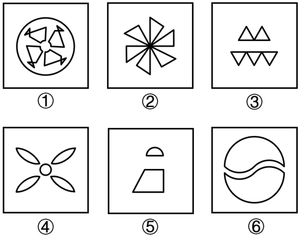
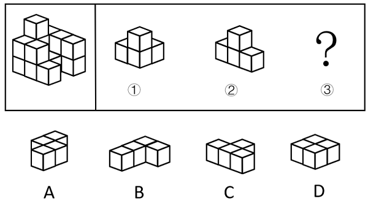
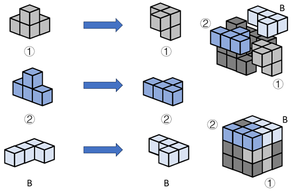
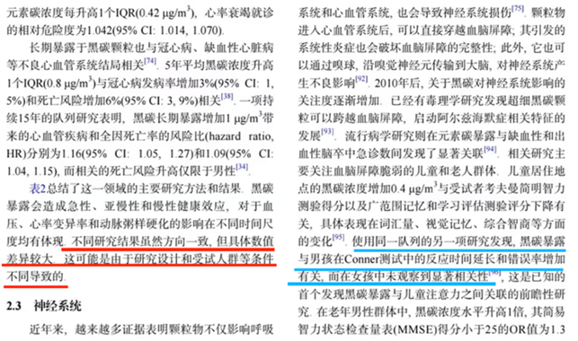

# 2025年青海省公务员录用考试《行测》题（网友回忆版）

> 判断推理 · 29 题 · 青海 2025

## 第 1 题　qid 13504460 · 图形推理

把下面的六个图形分为两类，使每一类图形都有各自的共同特征或规律，分类正确的一项是：

- **A**. ①④⑤，②③⑥　✅
- **B**. ①②⑥，③④⑤
- **C**. ①④⑥，②③⑤
- **D**. ①②⑤，③④⑥

**答案**：A

**官方解析**

本题为分组分类题目。元素组成不同，且无明显属性规律，考虑数量规律。题干图形均由多个小元素组成，考虑元素的种类或个数。观察发现，图①④⑤中元素种类均为2，图②③⑥中元素种类均为1，即图①④⑤为一组，图②③⑥为一组。
故正确答案为A。

---

## 第 2 题　qid 13504504 · 图形推理

从所给的四个选项中，选择最合适的一个填入问号处，使之呈现一定的规律性。

- **A**. A
- **B**. B　✅
- **C**. C
- **D**. D

**答案**：B

**官方解析**

元素组成不同，无明显属性规律，考虑数量规律。观察发现，题干图形中出现明显曲线和多边形，考虑线的数量。题干图形中既有曲线又有直线，考虑曲线和直线分开数。题干图形中曲线数量均为2，所以“？”处图形的曲线数量应为2，排除A项；直线数量均为7，所以“？”处图形的直线数量应为7，只有B项符合。
故正确答案为B。

---

## 第 3 题　qid 13504521 · 图形推理

下面三视图依次与三个几何图形对应，三个几何图形的正确顺序是：

- **A**. ②①③
- **B**. ②③①
- **C**. ①③②
- **D**. ③①②　✅

**答案**：D

**官方解析**

本题考查三视图。图一左上方是③的主视图，图一右上方是③的左视图，图一左下方是③的俯视图；图二左上方是①的主视图，图二右上方是①的左视图，图二左下方是①的俯视图；图三左上方是②的主视图，图三右上方是②的左视图，图三左下方是②的俯视图。
故正确答案为D。

---

## 第 4 题　qid 13504515 · 图形推理

从所给的四个选项中，选择最合适的一个填入问号处，使之呈现一定的规律性。

- **A**. A
- **B**. B
- **C**. C　✅
- **D**. D

**答案**：C

**官方解析**

元素组成相同，考虑位置规律。观察第一组图形位置可知，从图一到图三，田字格中每一区域都是由前一幅图同位置顺时针旋转得到，第二组应遵循相同的旋转规律，田字格中每一区域都是由前一幅图同位置顺时针旋转得到，只有C项符合。

故正确答案为C。

---

## 第 5 题　qid 13504506 · 图形推理

下图左侧给定的是3×3×3的正方体被分解后的多面体，切去的部分可以由给定的①、②和③三个多面体组合而成。以下哪项能填入问号处？

- **A**. A
- **B**. B　✅
- **C**. C
- **D**. D

**答案**：B

**官方解析**

本题考查立体拼合。题干正方体中切去的部分可以由①、②以及B项三个多面体旋转后拼合而成，具体拼合过程如下图所示：

故正确答案为B。

---

## 第 6 题　qid 13504502 · 定义判断

拓扑绝缘体是一种内部绝缘、界面允许电荷移动的材料，在拓扑绝缘体的内部，电子能带结构和常规的绝缘体相似，但在其表面或边界上存在特殊的量子态，这些量子态位于块体能带结构的带隙之中，从而能够导电。
根据上述定义，以下哪项是拓扑绝缘体?

- **A**. 量子点接触是一种纳米尺度的电子器件，其整体的导电性质可以通过调整器件的尺寸和形状来调控
- **B**. 氮化镓中由半导体异质结中的特殊电子结构形成的二维电子气，虽然其并不是一种材料，但在一定条件下能够导电
- **C**. 纯石墨烯本身不导电，但是经过一些工艺加工后，会表现出在一定条件下可以允许表面电荷移动形成导电能力的一种量子效应　✅
- **D**. 镧钡铜氧体系的超导陶瓷，是一类在临界温度时电阻为零的陶瓷材料，它还表现出完全抗磁性的行为，在传输过程中几乎没有能量消耗

**答案**：C

**官方解析**

第一步：找出定义关键词。
“内部绝缘、界面允许电荷移动的材料”。
第二步：逐一分析选项。
A项：量子点接触可以通过调整器件的尺寸和形状来调控整体的导电性，未提及其内部和外部的导电情况，不符合“内部绝缘、界面允许电荷移动的材料”，不符合定义，排除；
B项：氮化镓中的二维电子气在一定条件下能够导电，不符合“内部绝缘、界面允许电荷移动的材料”，不符合定义，排除；
C项：纯石墨烯本身不导电，符合“内部绝缘”，经过一些工艺加工后可以允许表面电荷移动形成导电能力，符合“界面允许电荷移动”，符合定义，当选；
D项：镧钡铜氧体系的超导陶瓷是一类在临界温度时电阻为零的陶瓷材料，没有提及其导电性，不符合“内部绝缘、界面允许电荷移动的材料”，不符合定义，排除。
故正确答案为C。

---

## 第 7 题　qid 13504507 · 定义判断

马氏体相变是一种晶体结构变化。由于外界物理作用，比如温度、外力或者磁场的变化，一些材料的晶体结构会失去稳定性，原子发生短距离的移动，导致结构畸变。这种非原子扩散型的结构变化被称为马氏体相变。马氏体相变的一个重要特性是形状记忆效应，即基于两种结构相互转变和变体滑移，材料外形发生明显变化并能恢复原态。
根据上述定义，下列未体现马氏体相变的是：

- **A**. 将形状扭曲的别针放到热水里，别针立刻就能恢复原状
- **B**. 起扩张血管作用的心脏支架用在外周血管时，因为挤压而变形　✅
- **C**. 通过电流加热控制合金网状结构变化，制造了能模仿蠕虫前进的机器人
- **D**. 采用镍钛弓丝的牙齿矫形器受口腔温度影响，可产生形状恢复力，为牙齿矫形提供所需的力量

**答案**：B

**官方解析**

第一步：找出定义关键词。
“由于外界物理作用，比如温度、外力或者磁场的变化”、“材料外形发生明显变化并能恢复原态”。
第二步：逐一分析选项。
A项：形状扭曲的别针放到热水里，立刻就能恢复原状，说明由于温度的作用，别针的外形发生变化并恢复原状，符合“由于外界物理作用，比如温度、外力或者磁场的变化”、“材料外形发生明显变化并能恢复原态”，符合定义，排除；
B项：心脏支架因为挤压而变形，说明由于外力的作用，支架的外形发生变化，但未体现支架是否可以恢复原状，不符合“材料外形发生明显变化并能恢复原态”，不符合定义，当选；
C项：通过加热控制合金网状结构变化，制造了能模仿蠕虫前进的机器人，蠕虫的前进需要重复进行肢体的伸缩，说明由于温度的作用，机器人的外形发生变化并恢复原状，符合“由于外界物理作用，比如温度、外力或者磁场的变化”、“材料外形发生明显变化并能恢复原态”，符合定义，排除；
D项：镍钛弓丝的牙齿矫形器受口腔温度影响，可产生形状恢复力，说明由于温度的作用，牙齿矫形器的外形发生变化并恢复原状，符合“由于外界物理作用，比如温度、外力或者磁场的变化”、“材料外形发生明显变化并能恢复原态”，符合定义，排除。
本题为选非题，故正确答案为B。

---

## 第 8 题　qid 13504484 · 逻辑判断

在某个定义域上有加减乘除等多种二元运算（用★代表其中一种），如果在定义域内存在一个数w，对于定义域范围内的每个数m（包括w），都有w★m=m，则称w为该种二元运算上的左幺元。
以下关于左幺元的叙述正确的是：

- **A**. 在整数范围内的乘法运算中，1是左幺元　✅
- **B**. 在整数范围内的加法运算中，1是左幺元
- **C**. 在整数范围内的减法运算中，0是左幺元
- **D**. 在整数范围内的除法运算中，0是左幺元

**答案**：A

**官方解析**

第一步：找出定义关键词。
“如果w，对于定义域范围内的每个数m（包括w），都有w★m=m”。
第二步：逐一分析选项。
A项：1乘以任何整数都等于原来的数，符合“如果w，对于定义域范围内的每个数m（包括w），都有w★m=m”，符合定义，当选；
B项：1加任何整数都不等于原来的数，不符合“如果w，对于定义域范围内的每个数m（包括w），都有w★m=m”，不符合定义，排除；
C项：0减去除0外的任何整数都不等于原来的数，不符合“如果w，对于定义域范围内的每个数m（包括w），都有w★m=m”，不符合定义，排除；
D项：0除以除0外的任何整数都不等于原来的数，不符合“如果w，对于定义域范围内的每个数m（包括w），都有w★m=m”，不符合定义，排除。
故正确答案为A。

---

## 第 9 题　qid 13504474 · 定义判断

物质循环是指在生态系统中，各种元素物质沿着特定途径从周围环境中被生物体吸收利用，再从生物体回到周围环境的循环变化过程，即各种元素物质在生物体和非生物环境之间的往复循环运转过程。
下列诗句中所描写的内容最能体现物质循环的是：

- **A**. 时有落花至，远随流水香
- **B**. 莫作绕山云，循环无定期
- **C**. 黄河之水天上来，奔流到海不复回
- **D**. 落红不是无情物，化作春泥更护花　✅

**答案**：D

**官方解析**

第一步：找出定义关键词。
“各种元素物质”、“在生物体和非生物环境之间”、“往复循环运转”。
第二步：逐一分析选项。
A项：选项意思是：不时有落花随溪水飘流而至，远远地就可闻到水中的芳香。表明落花及其香味在非生物环境中运转，但未提及生物体环境，不符合“在生物体和非生物环境之间”，不符合定义，排除；
B项：选项意思是：不要像绕山云般循环往复，没有固定的周期。表明云在非生物环境中循环运转，但未提及生物体环境，不符合“在生物体和非生物环境之间”，不符合定义，排除；
C项：选项意思是：那黄河之水犹如从天上倾泻而来，波涛翻滚直奔大海从来不会再往回流。表明黄河水在非生物环境中流动，但未提及生物体环境，且流动过程不是往复循环的，不符合“在生物体和非生物环境之间”、“往复循环运转”，不符合定义，排除；
D项：选项意思是：从枝头上掉下来的落花不是无情之物，即使化作春泥，也甘愿化作养料，滋养美丽的春花成长。表明落花的元素物质在生物体和非生物环境之间运转，符合“各种元素物质”、“在生物体和非生物环境之间”、“往复循环运转”，符合定义，当选。
故正确答案为D。

---

## 第 10 题　qid 13504455 · 定义判断

免疫电镜技术是将抗原抗体反应的特异性和电子显微镜的高分辨率相结合，在亚细胞和超微结构水平上对抗原进行定位分析的一种高精确度的技术。
根据上述定义，下列不属于免疫电镜技术的是：

- **A**. 酶的催化作用对其底物的反应可形成不同的电子密度，运用电子显微镜来观察，可确定酶的存在，从而对抗原进行定位
- **B**. 胶体金与铁蛋白一样具有高电子密度，将沙门氏菌的抗血清与胶体金颗粒结合，可以明确病原物抗原在电镜水平的定位
- **C**. 铁蛋白通过交联剂与抗体等物质的共价结合，其分辨率高、散射能力强，借助电镜可以准确描述抗原抗体复合物的定位
- **D**. 微流体检测芯片中的免疫电极体系有镀金基层、导电聚合物层和抗体层，三者自下而上依次贴合，提高检测定位的水平　✅

**答案**：D

**官方解析**

第一步：找出定义关键词。
“将抗原抗体反应的特异性和电子显微镜的高分辨率相结合”、“在亚细胞和超微结构水平上对抗原进行定位分析”。
第二步：逐一分析选项。
A项：该项中运用电子显微镜观察酶的催化作用，符合“将抗原抗体反应的特异性和电子显微镜的高分辨率相结合”，通过确定酶的存在来对抗原进行定位，符合“在亚细胞和超微结构水平上对抗原进行定位分析”，符合定义，排除；
B项：该项中将沙门氏菌的抗血清与胶体金颗粒结合，利用电子显微镜明确抗原定位，符合“将抗原抗体反应的特异性和电子显微镜的高分辨率相结合”、“在亚细胞和超微结构水平上对抗原进行定位分析”，符合定义，排除；
C项：该项中铁蛋白通过交联剂与抗体等物质的共价结合，借助电镜准确描述抗原抗体复合物的定位，符合“将抗原抗体反应的特异性和电子显微镜的高分辨率相结合”、“在亚细胞和超微结构水平上对抗原进行定位分析”，符合定义，排除；
D项：该项中只是提到微流体检测芯片中的免疫电极体系有不同的层结构来提高检测定位水平，但没有提及使用电子显微镜，不符合“将抗原抗体反应的特异性和电子显微镜的高分辨率相结合”，不符合定义，当选。
本题为选非题，故正确答案为D。

---

## 第 11 题　qid 13504508 · 定义判断

近零碳建筑是指建筑物通过适应气候特征和场地条件，最大幅度地降低建筑对能源的需求，运行过程中全电化，不使用燃气，建筑排放的碳量处于较低水平。近零碳建筑不仅利用各种方法减少自身产生的碳排放，还收集并利用雨水、太阳能等可再生能源，最终达到零废水、零能耗、零废弃物的理想状态。
下列做法不符合近零碳建筑理念的是：

- **A**. 加大物联网、大数据、人工智能等技术在建筑上的应用
- **B**. 淘汰预制模块化建筑技术，采用传热系数高的幕墙建材　✅
- **C**. 实现建筑内空调精细化运行，始终保持温湿度的独立控制
- **D**. 利用集成地源热泵、空气源热泵、光伏发电等可再生能源

**答案**：B

**官方解析**

第一步：找出定义关键词。
“建筑物通过适应气候特征和场地条件”、“最大幅度地降低建筑对能源的需求”、“运行过程中全电化，不使用燃气”、“建筑排放的碳量处于较低水平”、“利用雨水、太阳能等可再生能源”、“零废水、零能耗、零废弃物”。
第二步：逐一分析选项。
A项：加大物联网、大数据和人工智能技术在建筑上的应用，各项技术能够实现智能化识别、定位、跟踪、监管等功能，有利于能源管理和优化，符合“建筑物通过适应气候特征和场地条件”、“最大幅度地降低建筑对能源的需求”，符合定义，排除；
B项：建筑技术采用传热系数高的幕墙建材，会导致传热更快，保温隔热性能更差，反而增加建筑的能耗，不利于低碳，不符合“最大幅度地降低建筑对能源的需求”，不符合定义，当选；
C项：实现建筑内空调精细化运行，可以减少能源的消耗，符合“最大幅度地降低建筑对能源的需求”、“建筑排放的碳量处于较低水平”，符合定义，排除；
D项：利用集成地源热泵、空气源热泵、光伏发电等可再生能源，符合“建筑物通过适应气候特征和场地条件”、“利用雨水、太阳能等可再生能源”，符合定义，排除。
本题为选非题，故正确答案为B。

---

## 第 12 题　qid 13504472 · 定义判断

意思主义和表示主义是解释确定语言含义的两种方法。当语言发生歧义时，意思主义认为应当按照言语者内心所欲表达的真实意思来确定语言含义，而无需在意别人如何理解；反之，表示主义主张语言一旦表达出来便与言语者没有关系了，应当按照社会公众的通常理解来确定语言的含义。
根据上述定义，下列说法最能体现意思主义的是：

- **A**. 误载不害真意　✅
- **B**. 人同此心，心同此理
- **C**. 一千个读者有一千个哈姆雷特
- **D**. 横看成岭侧成峰，远近高低各不同

**答案**：A

**官方解析**

第一步：找出定义关键词。
意思主义：“按照言语者内心所欲表达的真实意思来确定语言含义”；
表示主义：“按照社会公众的通常理解来确定语言的含义”。
第二步：逐一分析选项。
A项：“误载不害真意”指表意人与相对人已达成意思表示一致，不因合同文本中出现的用词错误而影响双方已经达成的真实合意，强调要按照表意人（言语者）内心真实的意思来确定，符合“按照言语者内心所欲表达的真实意思来确定语言含义”，符合“意思主义”定义，当选；
B项：“人同此心，心同此理”的意思是合情合理的事，大家想法都会相同，不符合“按照言语者内心所欲表达的真实意思来确定语言含义”，不符合“意思主义”定义，排除；
C项：“一千个读者有一千个哈姆雷特”指人们对同一艺术作品的解读因个体差异而呈现多样性，不符合“按照言语者内心所欲表达的真实意思来确定语言含义”，不符合“意思主义”定义，排除；
D项：“横看成岭侧成峰，远近高低各不同”的意思是从正面、侧面看庐山山岭连绵起伏、山峰耸立，从远处、近处、高处、低处看庐山，庐山呈现各种不同的样子，不符合“按照言语者内心所欲表达的真实意思来确定语言含义”，不符合“意思主义”定义，排除。
故正确答案为A。

---

## 第 13 题　qid 13504510 · 逻辑判断

假定有一个理想化的纯黑体，它能将所有吸收的能量以“光”的形式释放，则称之为绝对黑体，它从绝对零度（单位为“K”即开尔文，）开始被加热升温会由黑变为发红光、黄光、白光、蓝光。加热到N（K）时，绝对黑体发光所含的光谱成分就称N（K）色温；某发光物与N（K）温度下绝对黑体发光所含的光谱成分相同，就称其色温为N（K）。

以下关于色温的叙述正确的是：

- **A**. 
把红、黄划分为暖色调，白、蓝划分为冷色调是由色温而来的

- **B**. 
一天内，肉眼看到的太阳颜色的变化是温差引起的色温变化导致的

- **C**. 
某发光体的光谱成分与绝对黑体在时的相同，则它的色温是3000K
　✅
- **D**. 
某灯光的色温是1000K，则与之光谱成分相同的绝对黑体温度是

**答案**：C

**官方解析**

第一步：找出定义关键词。

绝对黑体：“能将所有吸收的能量以‘光’的形式释放”；

色温：“从绝对零度（单位为‘K’即开尔文，）开始被加热升温会由黑变为发红光、黄光、白光、蓝光”、“加热到N（K）时，绝对黑体发光所含的光谱成分就称N（K）色温”、“发光物与N（K）温度下绝对黑体发光所含的光谱成分相同”。

第二步：逐一分析选项。

A项：根据“从绝对零度开始被加热升温会由黑变为发红光、黄光、白光、蓝光”可以推出光的颜色与温度有关，但是并不能由此推出色温是否是划分冷、暖色调的依据，说法错误，排除；

B项：根据“从绝对零度开始被加热升温会由黑变为发红光、黄光、白光、蓝光”可知光的颜色与温度有关，但是选项并未提及一天内太阳具体的温差变化，实际上一天内太阳颜色的变化主要是由于大气散射引起的，并非色温变化导致，说法错误，排除；

C项：根据“从绝对零度（单位为‘K’即开尔文，）开始被加热升温会由黑变为发红光、黄光、白光、蓝光”、“发光物与N（K）温度下绝对黑体发光所含的光谱成分相同”，因此可知N（K）就是绝对黑体从加热到有光的色温，发光物和绝对黑体光谱相同时色温就是N（K），二者的换算关系为：，因此，某发光体相同的绝对温度在时，对应的色温为，说法正确，当选；

D项：根据“从绝对零度（单位为‘K’即开尔文，）开始被加热升温会由黑变为发红光、黄光、白光、蓝光”、“发光物与N（K）温度下绝对黑体发光所含的光谱成分相同”，因此可知N（K）就是绝对黑体从加热到有光的色温，发光物和绝对黑体光谱相同时色温就是N（K），二者的换算关系为：，某灯光的色温是1000K，则与之光谱成分相同的绝对黑体温度，并非，说法错误，排除。

故正确答案为C。

---

## 第 14 题　qid 13504509 · 定义判断

合意是指当事人双方或者多方意思表示达成一致。决议是指多个主体根据表决原则做出的决定，是经由多数决策程序机制得出的意思表示，决议结果对团体内部全体成员都有效。
根据上述定义，下列属于决议的是：

- **A**. 李某、王某驾车和陈某的车相撞，经过调解员调解，李某、王某和陈某就交通事故的赔偿金额达成一致意见
- **B**. 某上市公司召开股东会就增加注册资本事宜进行投票，虽然有12%的股东投反对票，但仍通过了决定　✅
- **C**. 黄某要求解除婚姻关系，他的妻子坚决不同意：“离婚不是一个人说了算”
- **D**. 某学院组织全体50名教师投票推选年度优秀教师

**答案**：B

**官方解析**

第一步：找出定义关键词。
合意：“当事人双方或者多方意思表示达成一致”；
决议：“多个主体”、“根据表决原则做出的决定”、“经由多数决策程序机制得出的意思表示”、“决议结果对团体内部全体成员都有效”。
第二步：逐一分析选项。
A项：李某、王某驾车和陈某的车相撞，最后就交通事故赔偿金额达成一致意见，是当事人双方意思达成一致，并非由决策程序机制得出的意思表示，符合“当事人双方或者多方意思表示达成一致”，不符合“经由多数决策程序机制得出的意思表示”，符合合意的定义，不符合决议的定义，排除；
B项：上市公司召开股东会进行投票，最终通过了决定，是多个主体经过决策程序机制得出的结果，对团体内部成员都有效，符合“多个主体”、“根据表决原则做出的决定”、“经由多数决策程序机制得出的意思表示”、“决议结果对团体内部全体成员都有效”，符合决议的定义，当选；
C项：黄某要求解除婚姻关系，其妻子不同意，只是夫妻双方的意见分歧，并非是由多数决策程序机制得出的意思表示，不符合“经由多数决策程序机制得出的意思表示”，不符合决议的定义，排除；
D项：学院组织全体教师投票推选优秀教师，只是处在投票阶段，并未做出最后的决定，不符合“根据表决原则做出的决定”、“决议结果对团体内部全体成员都有效”，不符合决议的定义，排除。
故正确答案为B。

---

## 第 15 题　qid 13504511 · 定义判断

计算亲属关系亲疏远近的单位是亲等，国际最为通用的是罗马法亲等计算法和寺院法亲等计算法，二者关于旁系血亲的计算法有所不同：罗马法亲等计算法是从己身往上数至双方共同的直系血亲即同源人，每经一代为一亲等，再往下数至要计算的人，也是每经一代为一亲等，所有数字相加就是双方之间的亲等数；寺院法亲等计算法是从己身和所要计算的人分别往上数至血缘同源人，两边的亲等数相等时，就采用一边的亲等数，如果亲等数不等，则采用多的一方的亲等数。
根据上述定义，下列符合罗马法亲等计算法的是：

- **A**. 自己与外甥的女儿之间的亲等是三亲等
- **B**. 表妹与堂妹之间的亲等，都是四亲等
- **C**. 姑侄之间的亲等是二亲等
- **D**. 自己与伯父之间是三亲等　✅

**答案**：D

**官方解析**

第一步：找出定义关键词。

罗马法亲等计算法：“从己身往上数至双方共同的直系血亲即同源人，每经一代为一亲等”、“再往下数至要计算的人，也是每经一代为一亲等”、“所有数字相加”；

寺院法亲等计算法：“从己身和所要计算的人分别往上数至血缘同源人”、“两边的亲等数相等时，就采用一边的亲等数”、“亲等数不等，则采用多的一方的亲等数”。

第二步：逐一分析选项。

A项：自己与外甥的女儿的同源人是自己的父母，从自己到父母经过“自己父母”，共1代，从父母到外甥的女儿经过“父母姐姐/妹妹外甥外甥的女儿”，共3代，1+3=4，因此为四亲等，不符合定义，排除；

B项：当表妹为妈妈的兄弟姐妹的女儿时，与堂妹（父亲的兄弟的女儿）没有共同的直系血亲，无血缘关系和亲等关系，不符合定义，排除；

C项：姑姑和侄子的同源人是侄子的爷爷，从姑姑到侄子的爷爷经过“姑姑爷爷”，共1代，从爷爷到侄子经过“爷爷父亲侄子”，共2代，1+2=3，因此为三亲等，不符合定义，排除；

D项：自己与伯父的同源人是自己的爷爷，从自己到爷爷经过“自己父亲爷爷”，共2代，从爷爷到伯父经过“爷爷伯父”，共1代，2+1=3，因此为三亲等，符合定义，当选。

故正确答案为D。

---

## 第 16 题　qid 13504429 · 类比推理

低碳排放：保护环境

- **A**. 候鸟迁徙：气候变化
- **B**. 昆虫叮咬：过敏反应
- **C**. 收集数据：调查研究　✅
- **D**. 滴水成冰：热胀冷缩

**答案**：C

**官方解析**

第一步：判断题干词语间逻辑关系。
低碳排放是为了保护环境，二者为方式目的的对应关系。
第二步：判断选项词语间逻辑关系。
A项：候鸟迁徙是因为气候变化，二者为因果的对应关系，与题干逻辑关系不一致，排除；
B项：昆虫叮咬会导致过敏反应，二者为因果的对应关系，与题干逻辑关系不一致，排除；
C项：收集数据是为了调查研究，二者为方式目的的对应关系，与题干逻辑关系一致，当选；
D项：滴水成冰意思是水滴下去就结成冰，形容天气十分寒冷；热胀冷缩指物体受热时会膨胀，遇冷时会收缩的特性，二者不是方式目的的对应关系，与题干逻辑关系不一致，排除。
故正确答案为C。

---

## 第 17 题　qid 13504453 · 类比推理

言之无文：行之不远

- **A**. 一叶障目：不见泰山　✅
- **B**. 宁为玉碎：不为瓦全
- **C**. 藏诸名山：传之其人
- **D**. 取之不尽：用之不竭

**答案**：A

**官方解析**

第一步：判断题干词语间逻辑关系。
“言之无文，行之不远”的意思是说话没有文采，就传播不远，因为“言之无文”，所以“行之不远”，二者为因果关系。
第二步：判断选项词语间逻辑关系。
A项：“一叶障目，不见泰山”的意思是一片树叶挡住了眼睛，连面前高大的泰山都看不见，因为“一叶障目”，所以“不见泰山”，二者为因果关系，与题干逻辑关系一致，当选；
B项：“宁为玉碎，不为瓦全”的意思是指宁愿做高贵的玉器而破碎，也不愿做低贱的瓦器得以保全，二者不是因果关系，与题干逻辑关系不一致，排除；
C项：“藏诸名山，传之其人”的意思是指把著作藏在名山，传给后来志趣相投的人，二者不是因果关系，与题干逻辑关系不一致，排除；
D项：“取之不尽，用之不竭”的意思是指拿不完用不尽，二者为并列关系，与题干逻辑关系不一致，排除。
故正确答案为A。

---

## 第 18 题　qid 13504483 · 类比推理

宜居带：液态水

- **A**. 舒适区： 页岩气
- **B**. 生物圈：有机物　✅
- **C**. 无人区：可燃冰
- **D**. 地震带：火山岩

**答案**：B

**官方解析**

第一步：判断题干词语间逻辑关系。
液态水是成为宜居带的必要条件，二者为必要条件的对应关系。
第二步：判断选项词语间逻辑关系。
A项：页岩气与舒适区没有必然关系，二者不是必要条件的对应关系，与题干逻辑关系不一致，排除；
B项：生物圈是地表有机体包括微生物及其自下而上环境的总称，是行星地球特有的圈层，有机物是生物圈的必要条件，二者为必要条件的对应关系，与题干逻辑关系一致，当选；
C项：可燃冰分布于深海或陆域永久冻土中，与无人区没有必然联系，二者不是必要条件的对应关系，与题干逻辑关系不一致，排除；
D项：地震带和火山岩都是板块运动形成的，火山岩经常分布在地震带上，但二者并非必要条件的对应关系，与题干逻辑关系不一致，排除。
故正确答案为B。

---

## 第 19 题　qid 13504482 · 类比推理

细菌：真菌

- **A**. 鸳：鸯
- **B**. 地下水：饮用水
- **C**. 原子：电子
- **D**. 蛾眉月：下弦月　✅

**答案**：D

**官方解析**

第一步：判断题干词语间逻辑关系。
细菌和真菌都是微生物的一种，细菌是原核微生物，真菌为真核微生物，除此之外还有非细胞类微生物，比如病毒，二者为并列关系中的反对关系。
第二步：判断选项词语间逻辑关系。
A项：鸳鸯中的鸳意指雄鸟，鸯意指雌鸟，二者为并列关系中的矛盾关系，与题干逻辑关系不一致，排除；
B项：地下水是指赋存于地面以下岩石空隙中的水，饮用水是指可以不经处理、直接供给人体饮用的水，有的地下水是饮用水，有的地下水不是饮用水，有的饮用水是地下水，有的饮用水不是地下水，二者为交叉关系，与题干逻辑关系不一致，排除；
C项：原子包含带一个基本电荷的正电的质子和不带电的中子组成的原子核以及与质子数相同的核外电子，二者为组成关系，与题干逻辑关系不一致，排除；
D项：蛾眉月，农历月底和月初的月亮或月相，下弦月，农历每月二十二、二十三日的月亮或月相，除此之外还有上弦月等，二者为并列关系中的反对关系，与题干逻辑关系一致，当选。
故正确答案为D。

---

## 第 20 题　qid 13504485 · 类比推理

车辆：货车：运输

- **A**. 温室气体：甲烷：二氧化碳
- **B**. 未来产业：量子信息：研究监管
- **C**. 自我意识：人格：心理调节
- **D**. 绿色能源：太阳能：发电　✅

**答案**：D

**官方解析**

第一步：判断题干词语间逻辑关系。
货车是一种车辆，前两词为种属关系，货车可以用来运输，后两词为功能对应关系。
第二步：判断选项词语间逻辑关系。
A项：甲烷和二氧化碳均是一种温室气体，第一词与后两词分别构成种属关系，且后两词为并列关系，与题干逻辑关系不一致，排除；
B项：量子信息是一种未来产业，前两词为种属关系，研究监管不是量子信息的功能，后两词不是功能对应关系，与题干逻辑关系不一致，排除；
C项：自我意识对人格的形成、发展有作用，前两词不是种属关系，心理调节不是人格的功能，后两词不是功能对应关系，与题干逻辑关系不一致，排除；
D项：太阳能是一种绿色能源，前两词为种属关系，太阳能可以用来发电，后两词为功能对应关系，与题干逻辑关系一致，当选。
故正确答案为D。

---

## 第 21 题　qid 13504491 · 逻辑判断

某研究团队发布了一项关于睡眠习惯、时间与癌症风险的研究。研究分析了近1.5万人，发现睡眠时间短导致癌症风险升高，和睡眠时间为6-8小时的参与者相比，夜间睡眠时间少于6小时的人，患癌风险升高41%，和午睡时间多于60分钟的参与者相比，从不午睡的参与者患癌风险升高60%。
以下哪项如果为真，最能加强上述观点：

- **A**. 睡眠时间短会损害免疫功能、降低人体对肿瘤细胞的识别和消灭能力　✅
- **B**. 人类环境、卫生资源和睡眠习惯的变化，导致癌症发病原因发生了变化
- **C**. 夜间睡眠时间短或不午睡的参与者，大多年龄较大且缺少锻炼，健康状况不佳
- **D**. 和总睡眠时间为7-8小时的参与者相比，总睡眠时间少于7小时的男性，患癌风险升高69%

**答案**：A

**官方解析**

第一步：找出论点和论据。
论点：睡眠时间短导致癌症风险升高。
论据：和睡眠时间为6-8小时的参与者相比，夜间睡眠时间少于6小时的人，患癌风险升高41%，和午睡时间多于60分钟的参与者相比，从不午睡的参与者患癌风险升高60%。
论据在说夜间睡眠时间短和从不午睡的参与者患癌风险高，论点在说睡眠时间短导致癌症风险升高，二者话题一致，加强考虑补充论据。
第二步：逐一分析选项。
A项：该项指出“睡眠时间短会损害免疫功能、降低人体对肿瘤细胞的识别和消灭能力”，解释了睡眠时间短与患癌风险高之间的关系，补充论据，可以加强，保留；
B项：该项指出人类环境、卫生资源和睡眠习惯的变化使得癌症发病原因发生了变化，并未说明睡眠时间短和癌症风险高有关系，无法加强，排除；
C项：该项指出夜间睡眠时间短或不午睡的参与者，年龄较大且缺少锻炼，但并未说明年龄较大、缺少锻炼是否癌症风险就会高，为不明确项，无法加强，排除；
D项：该项指出睡眠时间短于7小时的男性患癌风险升高了69%，举例说明睡眠时间短与患癌风险高之间存在关系，补充论据，可以加强，保留。
比较A、D两项，A项是解释原因，D项举例，解释原因的加强力度大于举例，A项的加强力度更强。
故正确答案为A。

---

## 第 22 题　qid 13504470 · 逻辑判断

在长期的进化过程中，蝙蝠（狐蝠除外）获得了对夜间飞行十分有利的回声定位能力，可以将喉咙和鼻子处生成的超声波以短脉冲形式发射到周围，并且能用耳朵接收反射回的声波，以此来确定自身到物体的距离、物体所在方向以及物体形状等。一般来说，蝙蝠的寿命比其他相同体型的哺乳类动物要长3.5倍，有科学家推测，蝙蝠的夜行性和飞行能力可以降低它们被捕食的风险，这可能对其寿命的延长有所帮助。
以下哪项如果为真，最能加强上述科学家的推测：

- **A**. 在夜间飞行时，如果蝙蝠的耳朵被堵住，它们就无法顺利地躲避障碍物
- **B**. 倒挂姿势不仅有助于蝙蝠起飞，还可以使它们睡在洞穴顶部等隐蔽场所
- **C**. 黑暗中蝙蝠能够正确识别周围环境，这有助于它们成功躲避天敌的侵扰　✅
- **D**. 蝙蝠体内抑制病毒感染和增殖的蛋白质较多，即使感染病毒也不会发病

**答案**：C

**官方解析**

第一步：找出论点和论据。
论点：蝙蝠的夜行性和飞行能力可以降低它们被捕食的风险，这可能对其寿命的延长有所帮助。
论据：在长期的进化过程中，蝙蝠（狐蝠除外）获得了对夜间飞行十分有利的回声定位能力，可以将喉咙和鼻子处生成的超声波以短脉冲形式发射到周围，并且能用耳朵接收反射回的声波，以此来确定自身到物体的距离、物体所在方向以及物体形状等。一般来说，蝙蝠的寿命比其他相同体型的哺乳类动物要长3.5倍。
本题论点和论据均在讨论蝙蝠的夜行性、飞行能力及其寿命，论点和论据话题一致，加强优先考虑补充论据。
第二步：逐一分析选项。
A项：选项说的是在夜间飞行时，如果蝙蝠的耳朵被堵住，它们就无法顺利地躲避障碍物，说明蝙蝠的耳朵对其顺利地躲避障碍物的重要性，是在重复论据，与论点讨论的蝙蝠的夜行性和飞行能力是否可以降低它们被捕食的风险，以及这是否可能对其寿命的延长有所帮助无关，无关项，无法加强，排除；
B项：选项说的是倒挂姿势不仅有助于蝙蝠起飞，还可以使它们睡在洞穴顶部等隐蔽场所，是在讨论蝙蝠倒挂姿势的好处，但论点讨论的是蝙蝠的夜行性和飞行能力是否可以降低它们被捕食的风险，以及这是否可能对其寿命的延长有所帮助，话题不一致，无法加强，排除；
C项：选项说的是黑暗中蝙蝠能够正确识别周围环境，这有助于它们成功躲避天敌的侵扰，是在解释为什么蝙蝠的夜行性可以降低它们被捕食的风险，补充论据，可以加强，当选；
D项：选项说的是蝙蝠体内抑制病毒感染和增殖的蛋白质较多，即使感染病毒也不会发病，但论点讨论的是蝙蝠的夜行性和飞行能力是否可以降低它们被捕食的风险，以及这是否可能对其寿命的延长有所帮助，话题不一致，无法加强，排除。
故正确答案为C。

---

## 第 23 题　qid 13504487 · 逻辑判断

有研究人员针对素食对心血管疾病高危人群的影响进行数据分析发现，素食与低密度脂蛋白胆固醇、葡萄糖水平和体重的显著改善有关，因此，研究人员提出素食可有效降低胆固醇、血糖和体重。
以下哪项如果为真，不能削弱上述结论：

- **A**. 快餐店素食套餐含有精制碳水化合物、蔗糖、玉米糖浆等，热量更高
- **B**. 部分素食含有大量反式脂肪酸，反式脂肪酸的摄入会引起胆固醇升高
- **C**. 广义上的素食不仅包括蔬菜等纯素食，还包括鸡蛋、奶和乳制品　✅
- **D**. 素食中的蔬菜多是油炸的，这使素食者变胖的风险更大

**答案**：C

**官方解析**

第一步：找出论点和论据。
论点：素食可有效降低胆固醇、血糖和体重。
论据：素食与低密度脂蛋白胆固醇、葡萄糖水平和体重的显著改善有关。
本题论点和论据讨论的均是“素食”和“胆固醇、血糖和体重”的关系，二者话题一致，且本题为选非题，排除能够削弱的选项即可。
第二步：逐一分析选项。
A项：选项指出“快餐店素食套餐含有精制碳水化合物、蔗糖、玉米糖浆等，热量更高”，说明素食可能无法降低血糖和体重，削弱论点，可以削弱，排除；
B项：选项指出“部分素食含有大量反式脂肪酸，反式脂肪酸的摄入会引起胆固醇升高”，说明素食无法降低胆固醇，削弱论点，可以削弱，排除；
C项：选项指出“广义上的素食”包含哪些，但并未说明素食是否能够“有效降低胆固醇、血糖和体重”，话题不一致，为无关项，无法削弱，当选；
D项：选项指出“素食中的蔬菜多是油炸的，这使素食者变胖的风险更大”，说明素食无法降低体重，削弱论点，可以削弱，排除。
本题为选非题，故正确答案为C。

---

## 第 24 题　qid 13504516 · 类比推理

有研究发现，儿童受试者考夫曼简明智力测验得分下降与其居住地点黑碳浓度的提高有关。此外，在老年男性群体中，黑碳浓度水平升高1倍，其简易智力状态检查量表（MMSE）得分小于25的OR值为1.3，相当于衰老1.9年。由此，专家认为，黑碳暴露会导致神经系统损伤。
以下哪项如果为真，最能削弱上述论证：

- **A**. 相关研究所关注的儿童和老人群体本身血脑屏障较脆弱，易受黑碳暴露影响
- **B**. 颗粒物可以通过嗅球，沿嗅觉神经元传输到大脑，对神经系统产生不良影响
- **C**. 最新研究表明，黑碳因其特有的物化属性可能具有比细颗粒物更大的健康影响
- **D**. 黑碳暴露与男孩在考夫曼简明智力测验中的反应时间延长和错误率增加有关，而在女孩中未观察到显著相关性　✅

**答案**：D

**官方解析**

第一步：找出论点和论据。

论点：黑碳暴露会导致神经系统损伤。

论据：有研究发现，儿童受试者考夫曼简明智力测验得分下降与其居住地点黑碳浓度的提高有关。此外，在老年男性群体中，黑碳浓度水平升高1倍，其简易智力状态检查量表（MMSE）得分小于25的OR值为1.3，相当于衰老1.9年。

论据说的是“黑碳暴露与智力下降有关”，进而得出论点“黑碳暴露会导致神经系统损伤”，话题一致，削弱优先考虑削弱论点。

第二步：逐一分析选项。

A项：该项指出论据中的儿童和老人群体的血脑屏障较为脆弱，易受黑碳暴露影响，解释了为什么这些人容易受到黑碳暴露的影响，具有加强作用，无法削弱，排除；

B项：指出颗粒物可以通过嗅球，沿嗅觉神经元传输到大脑，对神经系统产生不良影响，黑碳属于颗粒物，解释了黑碳暴露会导致神经系统损伤的原因，属于加强项，无法削弱，排除；

C项：指出黑碳因其特有的物化属性可能具有比细颗粒物更大的健康影响，但不知道是什么样的影响，不明确是否会导致神经系统损伤，无法削弱，排除；

D项：指出黑碳暴露与男孩在考夫曼简明智力测验中的反应时间延长和错误率增加有关，而在女孩中未观察到显著相关性，补充女孩的反例，说明该结论不具有普遍性，削弱论点，当选。

故正确答案为D。

备注：以下为已查询到的原文，D项在原文中明确作为例证出现，供大家参考。

---

## 第 25 题　qid 13504503 · 逻辑判断

大蚕蛾具有其他昆虫无法比拟的巨大翅膀，长度可达28cm，是自然界中最为绚丽灿烂的昆虫之一。在自然界中，为了吸引异性，许多动物都拥有鲜艳美丽的外形，因此，科学家认为，大蚕蛾的“锦衣华服”是用于吸引异性，从而增加交配繁殖的几率。
以下哪项如果为真，最能削弱上述结论：

- **A**. 绝大部分种类的大蚕蛾生存繁衍于群山密林之中，昼伏夜出，无法看清同类的翅膀　✅
- **B**. 大蚕蛾翅膀的绚丽来自于鳞片的密集排布，能折射和衍射光线，从而让天敌分心或疑惑
- **C**. 大蚕蛾头顶的触角是重要的感觉器官，主要起到嗅觉和触觉作用，可以通过触角进行信息交流
- **D**. 大蚕蛾雌雄两性的色泽不同，雄性大体呈橘黄色，翅膀以杏黄色为主，雌性为青白色，翅膀以淡绿色为主

**答案**：A

**官方解析**

第一步：找出论点和论据。
论点：大蚕蛾的“锦衣华服”是用于吸引异性，从而增加交配繁殖的几率。
论据：在自然界中，为了吸引异性，许多动物都拥有鲜艳美丽的外形。
本题论点和论据均在讨论“外形”和“吸引异性”的关系，二者话题一致，削弱优先考虑削弱论点。
第二步：逐一分析选项。
A项：该项指出绝大部分种类的大蚕蛾生存繁衍于群山密林，无法看清同类的翅膀，说明大蚕蛾无法依靠外形吸引异性，增加交配繁殖的几率，削弱论点，可以削弱，当选；
B项：该项指出大蚕蛾翅膀绚丽的原因，绚丽的翅膀能让天敌分心或疑惑，但并未提及绚丽翅膀能否吸引异性，增加交配繁殖的几率，话题不一致，无法削弱，排除；
C项：该项指出大蚕蛾头顶的触角能起到哪些作用，而论点讨论的是大蚕蛾的绚丽翅膀能否吸引异性，增加交配繁殖的几率，话题不一致，无法削弱，排除；
D项：该项指出大蚕蛾雌雄两性的色泽区别，而论点讨论的是大蚕蛾的绚丽翅膀能否吸引异性，增加交配繁殖的几率，话题不一致，无法削弱，排除。
故正确答案为A。

---

## 第 26 题　qid 13504512 · 类比推理

某研究指出，阻力训练可以帮助预防或延缓阿尔茨海默病（AD）。研究者给小鼠的尾部绑上拉力带，将其放置在一个倾斜的木板上并训练向上爬，训练四周后，小鼠的血液样本分析表明，参与阻力训练小鼠的大脑中很少出现-淀粉样蛋白累积，皮质酮（相当于人类分泌的皮质醇）也处于正常水平。除此之外，阻力训练增加了小鼠大脑中小胶质细胞的数量，这种细胞在AD早期对大脑有重要保护作用，比如清除-淀粉样蛋白的多肽和细胞碎片，减轻大脑局部炎症。

以上论述如果为真，必须基于的前提是：

- **A**. 
皮质醇水平在AD早期阶段会呈现升高的趋势

- **B**. 
大脑中累积的-淀粉样蛋白是导致罹患AD的元凶
　✅
- **C**. 
阻力训练会使小胶质细胞从促炎状态转变成抗炎症状态

- **D**. 
皮质醇会在压力过大时生成并使得个体容易焦虑和躁动

**答案**：B

**官方解析**

第一步：找出论点和论据。

论点：阻力训练可以帮助预防或延缓阿尔茨海默病。

论据：研究者给小鼠的尾部绑上拉力带，将其放置在一个倾斜的木板上并训练向上爬，训练四周后，小鼠的血液样本分析表明，参与阻力训练小鼠的大脑中很少出现-淀粉样蛋白累积，皮质酮（相当于人类分泌的皮质醇）也处于正常水平。除此之外，阻力训练增加了小鼠大脑中小胶质细胞的数量，这种细胞在AD早期对大脑有重要保护作用。

本题论点讨论的是阻力训练可以帮助预防或延缓阿尔茨海默病（AD），论据讨论的是阻力训练可以减少-淀粉样蛋白累积、使皮质醇处于正常水平；同时阻力训练也可以增加小胶质细胞的数量，从而保护早期AD患者的大脑。其中，论据中的“减少-淀粉样蛋白累积、使皮质醇处于正常水平”与论点中的“帮助预防或延缓阿尔茨海默病（AD）”话题不一致，且提问方式为“前提”，优先考虑搭桥，即建立“减少-淀粉样蛋白累积、使皮质醇处于正常水平”与“帮助预防或延缓阿尔茨海默病（AD）”的联系。

第二步：逐一分析选项。

A项：指出皮质醇水平在AD早期阶段会呈现升高的趋势，但不明确使皮质醇处于正常水平是否有助于预防或延缓阿尔茨海默病，为不明确项，无法加强，排除；

B项：指出-淀粉样蛋白积累会导致罹患AD，说明-淀粉样蛋白是AD的病因，即减少-淀粉样蛋白有助于预防罹患AD，在“减少-淀粉样蛋白累积”与“帮助预防或延缓阿尔茨海默病”之间建立联系，为搭桥项，是论述成立的前提，当选；

C项：指出阻力训练会使小胶质细胞从促炎状态转变成抗炎症状态，而减少炎症在AD早期对大脑有保护作用，解释了阻力训练有可能帮助预防或延缓阿尔茨海默病，补充论据，但并非论述成立的前提，排除；

D项：指出皮质醇会在压力过大时生成并使得个体容易“焦虑和躁动”，与论点讨论的“阿尔茨海默病”无关，为无关项，无法加强，排除。

故正确答案为B。

---

## 第 27 题　qid 13504447 · 逻辑判断

与人类的眼球是一整个球形不同，鸟类眼球是由一大一小的两个半球构成，小的半球是角膜，大的半球是视网膜，在角膜周围有一圈小骨片形成的一个环状的支撑性的脊，这个骨片环即巩膜环，保护眼球的同时也限制了眼球的转动，人类在走路时，通过眼球的转动抵消走路时的振动来保持视觉的稳定，而鸟类无法大幅度地转动眼球。因此，很多鸟类走路时，让头部先移至前方保持稳定，身体再前进。保持不动的头部像是向后缩了一样，于是就成了脖子一伸一缩的样子。
由此可以推出：

- **A**. 鸟类的眼球构造有助于形成更锐利的远视力
- **B**. 鸟类走路时脖子的伸缩有助于维持身体的平衡
- **C**. 鸟类通过颈部运动让眼睛成像保持更持久的稳定　✅
- **D**. 鸟类通过运动头部来获得视差以增强空间的深度感知

**答案**：C

**官方解析**

日常结论题，根据题干信息逐一分析选项。
A项：题干中第一句介绍了鸟类的眼球构造，但没有提及此眼球构造有助于形成更锐利的远视力，无中生有，排除；
B项：题干中指出鸟类走路时脖子的伸缩有助于保持视觉的稳定，但没有提及有助于维持身体的平衡，无中生有，排除；
C项：题干中指出鸟类无法大幅度地转动眼球来保持视觉的稳定。因此，鸟类走路时，让头部先移至前方保持稳定，身体再前进，出现脖子一伸一缩的样子，可以推出鸟类是通过颈部运动让眼睛成像保持更持久的稳定，当选；
D项：题干中指出鸟类通过运动头部来保持视觉的稳定，但没有提及通过运动头部来获得视差以增强空间的深度感知，无中生有，排除。
故正确答案为C。

---

## 第 28 题　qid 13504446 · 逻辑判断

某公园计划从桃树、李树、杨树、柳树、松树中选择几种树种植，树种的选择满足下列条件：
（1）如果选桃树，那么不选松树； 
（2）要么选桃树，要么选李树；
（3）至少选3种树种植；
（4）桃树和杨树至多选1种；
（5）李树和柳树至多选1种。
由此可以推出：

- **A**. 种李树和桃树，不种松树
- **B**. 种桃树和柳树，不种杨树
- **C**. 种李树和杨树，不种松树
- **D**. 种杨树和松树，不种桃树　✅

**答案**：D

**官方解析**

第一步：分析题干条件。

（1）桃树松树；

（2）要么选桃树，要么选李树；

（3）至少选3种树种植；

（4）桃树 或 杨树；

（5）李树 或 柳树。

第二步：根据题干条件进行推理。

题干条件中“桃树”提及次数最多，可优先从此处入手进行推理。

若种桃树，结合条件（1）（2）（4）可得，不能种松树、李树和杨树，结合题干信息共有“桃树、李树、杨树、柳树、松树”这5种树，则此时只能种桃树和柳树这两种树，与条件（3）矛盾，故不能种桃树。

不种桃树，结合条件（2）可得，要种植李树；结合条件（5）否一推一可得，不种柳树。结合题干信息共有“桃树、李树、杨树、柳树、松树”这5种树，根据上述结论“不种桃树”和“不种柳树”，结合条件（3）可得，种李树、杨树和松树，只有D项说法完全正确。

故正确答案为D。

---

## 第 29 题　qid 13504432 · 类比推理

某市举办智能数控技能大赛，小周、小吴、小郑、小王、小钱进入了决赛。比赛后，有记者询问他们的感受，他们回答如下：
小周：小郑整场发挥得都很好，我觉得冠军非他莫属；
小吴：我觉得冠军一定会在我、小周、小钱三人之中产生；
小郑：我自我感觉不好，这次与冠军无缘了；
小钱：我连季军都拿不到；
小王：我不会是亚军。
已知本次比赛产生了冠军、亚军、季军各一人，且在五人中只有一个人的回答与比赛结果相符。那么，获得亚军的是：

- **A**. 小王　✅
- **B**. 小吴
- **C**. 小郑
- **D**. 小钱

**答案**：A

**官方解析**

第一步：找出题干矛盾命题。

小周：小郑冠军；

小吴：小吴冠军 或 小周冠军 或 小钱冠军；

小郑：小郑冠军；

小钱：小钱前三；

小王：小王亚军。

分析题干条件可知，小周和小郑说的话为矛盾关系，必有一真一假。

第二步：根据题干条件推理。

根据题干条件可知，只有一个人的回答为真，则回答为真的人一定在小周和小郑之间，小吴、小钱和小王的回答均为假。小王说自己不是亚军为假，则小王是亚军，对应A项。

故正确答案为A。

---
