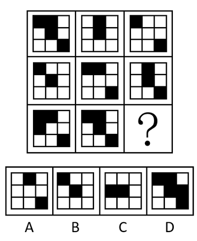
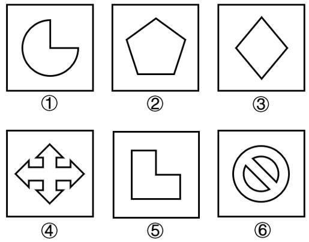
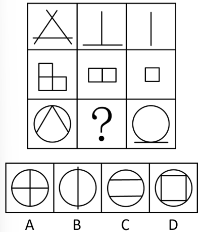
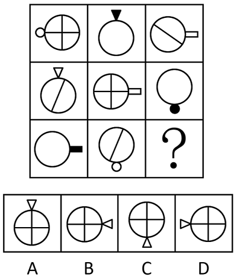
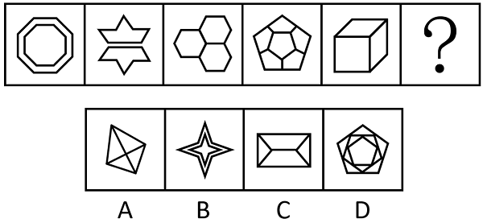

# 2025年黑龙江公务员录用考试《行测》题（网友回忆版）

> 判断推理 · 30 题 · 黑龙江 2025

## 第 1 题　qid 13504585 · 图形推理

从所给的四个选项中，选择最合适的一个填入问号处，使之呈现一定的规律性：

- **A**. A
- **B**. B
- **C**. C　✅
- **D**. D

**答案**：C

**官方解析**

元素组成相似，优先考虑样式规律。题干图形轮廓和分割区域相同，且黑块数量不成规律，考虑黑白运算。九宫格优先看横行，前两行图形的运算规律为：黑+黑=白，白+白=白，黑+白=黑，白+黑=黑；第三行应用此规律，只有C项符合。
故正确答案为C。

---

## 第 2 题　qid 12882156 · 图形推理

把下面的六个图形分为两类，使每一类都有各自的共同特征或规律，分类正确的一项是：

- **A**. ①②③，④⑤⑥
- **B**. ①②⑤，③④⑥　✅
- **C**. ①③⑥，②④⑤
- **D**. ①④⑥，②③⑤

**答案**：B

**官方解析**

本题为分组分类题目。元素组成不同，优先考虑属性规律。观察发现，题干出现多个等腰元素，考虑对称性。图①②⑤均是轴对称图形，图③④⑥均是既轴对称又中心对称图形，即图①②⑤为一组，图③④⑥为一组。
故正确答案为B。

---

## 第 3 题　qid 13504598 · 图形推理

从所给的四个选项中，选择最合适的一个填入问号处，使之呈现一定的规律性：

- **A**. A
- **B**. B　✅
- **C**. C
- **D**. D

**答案**：B

**官方解析**

元素组成不同，且无明显属性规律，考虑数量规律。九宫格优先看横行，观察发现，第一行图形直线数依次为3、2、1，第二行图形面数量依次为3、2、1，第三行的第一幅图和第三幅图的交点数分别为3和1，故？处应选择交点数为2的图形，只有B项符合。
故正确答案为B。

---

## 第 4 题　qid 13504591 · 图形推理

从所给的四个选项中，选择最合适的一个填入问号处，使之呈现一定的规律性：

- **A**. A
- **B**. B
- **C**. C
- **D**. D　✅

**答案**：D

**官方解析**

元素组成相似，且相同元素重复出现，优先考虑样式规律中的遍历。九宫格优先看横行，观察发现，第一行图形中，圆形内部的空白、斜线和“十”字各出现一次，圆形外部的小圆、三角形和矩形各出现一次；经验证，第二行符合此规律；第三行应用此规律，故？处图形圆形内部应为“十”字，圆形外部应为三角形，但据此无法排除选项。继续观察发现，题干图形圆形外部小元素的位置不同，第一行图形中，圆形外部小元素依次顺时针移动个圆；经验证，第二行符合此规律；第三行应用此规律，故？处图形圆形外部的三角形应位于圆形的左侧，只有D项符合。

故正确答案为D。

---

## 第 5 题　qid 13504600 · 图形推理

从所给的四个选项中，选择最合适的一个填入问号处，使之呈现一定的规律性：

- **A**. A　✅
- **B**. B
- **C**. C
- **D**. D

**答案**：A

**官方解析**

元素组成不同，且无明显属性规律，考虑数量规律。题干图形均由边数相同的多边形元素构成，观察发现，每幅图中这些相同的多边形元素依次仅为八边形、七边形、六边形、五边形、四边形、？，因此构成问号处图形的多边形元素应仅为三角形，只有A项符合。
故正确答案为A。

---

## 第 6 题　qid 13504605 · 定义判断

艺术考辨是对艺术作品、艺术文献的考察辨证，即指充分根据资料来考核、证实和说明与艺术相关的问题，经常运用于艺术品真伪、年代、作者、内容、流传等的鉴别，出土文物的断代、文化归属等考证，以及艺术文献的考订和艺术事件的考察等。
根据上述定义，下列属于艺术考辨的是：

- **A**. 某文物鉴定专家使用手持式显微镜发现某件明代瓷器表面有漏釉和伤釉的现象
- **B**. 某书画鉴定专家根据多年的鉴定经验，一眼便看出一幅落款为张大千的画作为赝品
- **C**. 研究人员通过翻阅大量文献，认为某书画著录并非唐代所作，而是明清时期的伪书　✅
- **D**. 某收藏者一直珍藏着某位近代雕塑大师的一件作品，他认为根据市场价格的波动，这件作品目前已价值百万

**答案**：C

**官方解析**

第一步：找出定义关键词。
“充分根据资料”、“经常运用于艺术品真伪、年代、作者、内容、流传等的鉴别，出土文物的断代、文化归属等考证，以及艺术文献的考订和艺术事件的考察”。
第二步：逐一分析选项。
A项：某文物鉴定专家使用手持式显微镜，不符合“充分根据资料”，发现瓷器表面有漏釉和伤釉的现象，不符合“经常运用于艺术品真伪、年代、作者、内容、流传等的鉴别，出土文物的断代、文化归属等考证，以及艺术文献的考订和艺术事件的考察”，不符合定义，排除；
B项：某书画鉴定专家根据多年的鉴定经验看出一幅落款为张大千的画作为赝品，方式为多年的经验，不符合“充分根据资料”，不符合定义，排除；
C项：研究人员通过翻阅大量文献，符合“充分根据资料”，认为某书画是明清时期的伪书，符合“经常运用于艺术品真伪、年代、作者、内容、流传等的鉴别，出土文物的断代、文化归属等考证，以及艺术文献的考订和艺术事件的考察”，符合定义，当选；
D项：某收藏者认为根据市场价格的波动，这件近代雕塑大师的作品目前已价值百万，依据为市场价格，不符合“充分根据资料”，结论为作品的价格，不符合“经常运用于艺术品真伪、年代、作者、内容、流传等的鉴别，出土文物的断代、文化归属等考证，以及艺术文献的考订和艺术事件的考察”，不符合定义，排除。
故正确答案为C。

---

## 第 7 题　qid 13504596 · 定义判断

条块关系是指在中国行政组织体系中，中央的各个职能部门及其所属的地区机构系统与各级地方政府系统相互之间的基本结构性关系。条块是在中央最高领导层之下设立的两套平行的行政系统。其中，条是指中央的各个职能部门及其所属的地区机构；块是由不同职能部门组合而成的各级地方政府。条块关系主要有以下3个层面：（1）上级条条与下级块块关系；（2）上下级条条关系；（3）上下级块块关系。
根据上述定义，下列对应正确的是：

- **A**. 科技部与科技厅的关系——（1）
- **B**. 县政府与乡政府的关系——（3）　✅
- **C**. 教育部与省政府的关系——（2）
- **D**. 省政府与司法厅的关系——（1）

**答案**：B

**官方解析**

第一步：找出定义关键词。
条块关系：“中国行政组织体系中”、“中央的各个职能部门及其所属的地区机构系统与各级地方政府系统相互之间的基本结构性关系”；
条块：“在中央最高领导层之下设立的两套平行的行政系统”；
条：“中央的各个职能部门及其所属的地区机构”；
块：“由不同职能部门组合而成的各级地方政府”。
条块关系的3个层面：（1）上级条条与下级块块关系；（2）上下级条条关系；（3）上下级块块关系。
第二步：逐一分析选项。
A项：科技部是中央的职能部门，科技厅是其所属的地区机构，符合“上下级条条关系”，对应（2），不对应（1），对应错误，排除；
B项：县政府和乡政府都是地方政府，符合“上下级块块关系”，对应（3），对应正确，当选；
C项：教育部是中央职能部门，省政府是地方政府，符合“上级条条与下级块块关系”，对应（1），不对应（2），对应错误，排除；
D项：省政府是地方政府，司法厅是省级政府的职能部门，不符合“上级条条与下级块块关系”，不对应（1），对应错误，排除。
故正确答案为B。

---

## 第 8 题　qid 13504593 · 定义判断

使动用法和意动用法都是文言文中常见的词类活用现象。使动用法是指谓语动词具有“使之怎么样”的意思，即此时谓语动词表示的动作不是主语发出的，而是由宾语发出的。意动用法是指谓语动词具有“以之为何”的意思，即认为宾语怎样或把宾语当作怎样。
根据上述定义，下列画线的字与其他三项用法不同的是：

- **A**. 
直可<u>惊</u>天地，<u>泣</u>鬼神
　✅
- **B**. 
且庸人尚<u>羞</u>之，况于将相乎

- **C**. 
渔人甚<u>异</u>之

- **D**. 
故人不独<u>亲</u>其亲，不独<u>子</u>其子

**答案**：A

**官方解析**

第一步：找出定义关键词。
使动用法：“谓语动词具有‘使之怎么样’的意思”、“谓语动词表示的动作不是主语发出的，而是由宾语发出的”；
意动用法：“谓语动词具有‘以之为何’的意思”、“认为宾语怎样或把宾语当作怎样”。
第二步：逐一分析选项。
A项：“直可惊天地，泣鬼神”的意思是简直使天地为之震惊，使鬼神为之哭泣，其中“惊”“泣”为谓语动词，“天地”“鬼神”为宾语，“惊”“泣”表示的动作是由“天地”“鬼神”发出的，符合“谓语动词具有‘使之怎么样’的意思”、“谓语动词表示的动作不是主语发出的，而是由宾语发出的”，符合使动用法；
B项：“且庸人尚羞之，况于将相乎”的意思是况且一般百姓尚且为它感到羞耻，更何况作为将相的人呢？其中“羞”为谓语动词，意思是认为羞耻，即“以之为羞”，符合“谓语动词具有‘以之为何’的意思”、“认为宾语怎样或把宾语当作怎样”，符合意动用法；
C项：“渔人甚异之”的意思是即使是渔夫也感到非常惊异，其中“异”是谓语动词，意思是认为奇怪，即“以之为异”，符合“谓语动词具有‘以之为何’的意思”、“认为宾语怎样或把宾语当作怎样”，符合意动用法；
D项：“故人不独亲其亲，不独子其子”的意思是因此人们不仅仅关爱自己的亲人，也不仅仅爱护自己的孩子，其中“亲其亲”中第一个“亲”是谓语动词，意思是亲近、关爱，即当作亲人、“以之为亲”；“子其子”中第一个“子”是谓语动词，意思是爱护、养育，即当作孩子、“以之为子”，符合“谓语动词具有‘以之为何’的意思”、“认为宾语怎样或把宾语当作怎样”，符合意动用法。
其中A项为使动用法，B、C、D三项为意动用法，A项与其他三项用法不同。
本题为选非题，故正确答案为A。

---

## 第 9 题　qid 13504597 · 定义判断

构性关系是指物质的结构与性质之间的本质关系。构性关系是材料科学研究的核心内容之一，它涉及材料的化学组成、晶体结构、微观组织等结构特征与其物理、化学、力学等性能之间的关系。
根据上述定义，下列没有涉及构性关系的是：

- **A**. 聚苯乙烯的分子链的主链呈刚性或侧基位阻较大使得单键旋转困难，材料加工成型后一般表现为无定形态，具有较好的透光性
- **B**. 通过对烷烃、环烷烃等177个有机化合物的研究发现，分子的几何形状对其粘度有一定影响，但是影响不是很大
- **C**. 比较几种乙烯砜型活性染料发现，当染料分子体系中位于苯环或萘环一侧的供电基供电子能力较强、另一侧的吸电基吸电子能力较强时，其水解反应速率较大
- **D**. 金刚石、碳化硅和晶体硅都是原子晶体，相邻原子间通过共价键形成立体网状结构，它们的结构相似，但是原子晶体的半径、键长和键能却不相同　✅

**答案**：D

**官方解析**

第一步：找出定义关键词。
“物质的结构与性质之间的本质关系”、“涉及材料的化学组成、晶体结构、微观组织等结构特征与其物理、化学、力学等性能之间的关系”。
第二步：逐一分析选项。
A项：聚苯乙烯分子链的结构特征导致聚苯乙烯加工成型后一般表现为无定形态、透光性较好，体现了聚苯乙烯的结构特征和其性能的关系，符合“物质的结构与性质之间的本质关系”、“涉及材料的化学组成、晶体结构、微观组织等结构特征与其物理、化学、力学等性能之间的关系”，符合定义，排除；
B项：通过对有机化合物的研究发现，分子的几何形状对其粘度有一定影响，体现了分子的形状和其性能的关系，符合“物质的结构与性质之间的本质关系”、“涉及材料的化学组成、晶体结构、微观组织等结构特征与其物理、化学、力学等性能之间的关系”，符合定义，排除；
C项：比较乙烯砜型活性染料发现，分子体系中供电基、吸电基能力均较强时，水解反应速率大，说明染料分子的结构特征会影响其水解反应速率，体现了乙烯砜型活性染料的结构特征和其性能的关系，符合“物质的结构与性质之间的本质关系”、“涉及材料的化学组成、晶体结构、微观组织等结构特征与其物理、化学、力学等性能之间的关系”，符合定义，排除；
D项：金刚石、碳化硅和晶体硅都是原子晶体，它们的结构相似，但是半径、键长和键能却不相同，没有提到它们的结构特征与性能之间的关系，不符合“物质的结构与性质之间的本质关系”、“涉及材料的化学组成、晶体结构、微观组织等结构特征与其物理、化学、力学等性能之间的关系”，不符合定义，当选。
本题为选非题，故正确答案为D。

---

## 第 10 题　qid 13504625 · 定义判断

缩喻是比喻的一种，是指喻词不出现，本体与喻体以修饰或并列的形式出现的一种修辞方式。从语法结构来看，缩喻主要有两种形式：（1）偏正式：喻体修饰本体；（2）并列式：喻体与本体形成并列关系。
根据上述定义，下列属于偏正式缩喻的是：

- **A**. 黄金季节　✅
- **B**. 人高马大
- **C**. 祖国母亲
- **D**. 弯弯的月儿小小的船

**答案**：A

**官方解析**

第一步：找出定义关键词。
缩喻：“喻词不出现，本体与喻体以修饰或并列的形式出现”；
偏正式缩喻：“喻体修饰本体”；
并列式缩喻：“喻体与本体形成并列关系”。
第二步：逐一分析选项。
A项：“黄金季节”比喻像黄金一样宝贵的时间段，其中“黄金”是喻体，“季节”是本体，“黄金”修饰“季节”，符合“喻体修饰本体”，符合偏正式缩喻定义，当选；
B项：“人高马大”比喻人生得高大壮实身材魁梧，其中“人高”指的是个子高挑，“马大”则用马的高大雄壮来比喻人身材的高挑魁梧，“人高”是本体，“马大”是喻体，但“马大”不修饰“人高”，不符合“喻体修饰本体”，不符合偏正式缩喻定义，排除；
C项：“祖国母亲”中，“祖国”是本体，“母亲”是喻体，但“母亲”不修饰“祖国”，不符合“喻体修饰本体”，不符合偏正式缩喻定义，排除；
D项：“弯弯的月儿小小的船”中，“弯弯的月儿”是本体，“小小的船”是喻体，但“小小的船”不修饰“弯弯的月儿”，不符合“喻体修饰本体”，不符合偏正式缩喻定义，排除。
故正确答案为A。

---

## 第 11 题　qid 13504636 · 定义判断

反事实思维是指在心理上对过去已经发生的事实进行否定，进而建构一种新的可能性假设的思维活动。反事实思维在头脑中主要以条件命题的形式来表征，包括前提（例：我要拿把伞）和结论（例：今天就不会淋雨了）两部分。反事实思维分为三种结构：（1）加法式，在前提中添加事实上未发生的事件或未采取的行动而对事实进行否定和重建；（2）减法式，假定某个既定事件并没有发生，从而对事实进行否定和重建；（3）替代式，假定在前提中发生的是另一个事件，从而对事实进行否定和重建。
根据上述定义，下列对应正确的是：

- **A**. 如果我多加小心，就不会上当———（2）
- **B**. 如果我不是多买了点食物，我们几个就不够吃了———（1）
- **C**. 如果我面对工作中的困难没有退缩的话，今天在事业上也能取得成绩———（1）
- **D**. 如果我平时好好学习而不是只顾着玩的话，这次考试就能取得高分了———（3）　✅

**答案**：D

**官方解析**

第一步：找出定义关键词。
反事实思维：“对过去已经发生的事实进行否定”、“新的可能性假设”、“包括前提和结论”；
（1）加法式：“添加事实上未发生的事件或未采取的行动”；
（2）减法式：“假定某个既定事件并没有发生”；
（3）替代式：“假定在前提中发生的是另一个事件”。
第二步：逐一分析选项。
A项：前提为“如果我多加小心”，说明事实上没有小心，是在原有事实的基础上“添加事实上未发生的事件或未采取的行动”，不符合“假定某个既定事件并没有发生”，不符合“（2）减法式”定义，排除；
B项：前提为“如果我不是多买了点食物”，说明事实上是多买了食物的，符合“假定某个既定事件并没有发生”，不符合“添加事实上未发生的事件或未采取的行动”，不符合“（1）加法式”定义，排除；
C项：前提为“如果我面对工作中的困难没有退缩的话”，说明事实上是退缩了的，符合“假定某个既定事件并没有发生”，不符合“添加事实上未发生的事件或未采取的行动”，不符合“（1）加法式”定义，排除；
D项：前提为“如果我平时好好学习而不是只顾着玩的话”，说明事实上是只顾着玩，而提出的“平时好好学习”是另一个事件，符合“假定在前提中发生的是另一个事件”，符合“（3）替代式”定义，当选。
故正确答案为D。

---

## 第 12 题　qid 13504629 · 定义判断

共同海损是海商法中最古老并适用至今的法律制度之一，是指在船舶、货物和其他财产遭遇共同危险时，为了共同的安全，主动采取抢救措施所造成的新的损失，由因采取该措施而获救的财产的受益各方，在航程结束时共同分摊。共同海损的成立必须具备以下要件：（1）海上危险必须是危及船方与货方共同利益而且是真实的危险；（2）共同海损措施必须是有意的、合理的、有效的；（3）共同海损的损失必须是由共同海损措施所直接造成的。
根据上述定义，下列属于共同海损的是：

- **A**. 由于驾驶人员的疏忽致使船舶搁浅，船底受损
- **B**. 为免受海盗侵袭，重金聘请安保船只与货船伴行
- **C**. 海上起风浪时，堆积在甲板上的货物被海浪卷入海中
- **D**. 船舶触礁后为减轻船舶载重，将部分货物抛入海中　✅

**答案**：D

**官方解析**

第一步：找出定义关键词。
“船舶、货物和其他财产遭遇共同危险时”、“为了共同的安全，主动采取抢救措施所造成的新的损失”、“危险必须是危及船方与货方共同利益而且是真实的危险”、“措施必须是有意的、合理的、有效的”、“损失必须是由共同海损措施所直接造成”。
第二步：逐一分析选项。
A项：驾驶人员的疏忽致使船舶搁浅，此时船底受损是由于驾驶人员的粗心大意，不符合“船舶、货物和其他财产遭遇共同危险时”、“为了共同的安全，主动采取抢救措施所造成的新的损失”、“损失必须是由共同海损措施所直接造成”，不符合定义，排除；
B项：重金聘请安保船只与货船伴行以避免海盗侵袭，此时海盗的侵扰并未发生，不符合“船舶、货物和其他财产遭遇共同危险时”、“危险必须是危及船方与货方共同利益而且是真实的危险”，不符合定义，排除；
C项：堆积在甲板上的货物被海浪卷入海中，货物损失是风浪造成的，而非人员操作所致，不符合“为了共同的安全，主动采取抢救措施所造成的新的损失”，不符合定义，排除；
D项：船舶触礁说明船舶在行驶过程中已经遇到危害共同利益的危险，符合“船舶、货物和其他财产遭遇共同危险时”、“危险必须是危及船方与货方共同利益而且是真实的危险”，将部分货物抛入海中是船员主动采取的行动，符合“为了共同的安全，主动采取抢救措施所造成的新的损失”，将部分货物抛入海中是为了减轻船舶载重，从而避免更大的损失，符合“措施必须是有意的、合理的、有效的”、“损失必须是由共同海损措施所直接造成”，符合定义，当选。
故正确答案为D。

---

## 第 13 题　qid 13504609 · 定义判断

公共产品是一种具有非竞争性和非排他性的产品，也即一个人享有这种产品的好处时并不会减少其他人对它们的享有，同时一个人享有公共产品的好处时也不会排除其他人享有它们的好处。
根据上述定义，下列属于公共产品的是：

- **A**. 电视新闻节目　✅
- **B**. 公共图书馆的图书
- **C**. 公共停车场
- **D**. 公立医院的医疗

**答案**：A

**官方解析**

第一步：找出定义关键词。
“具有非竞争性和非排他性”、“一个人享有这种产品的好处时并不会减少其他人对它们的享有，同时一个人享有公共产品的好处时也不会排除其他人享有它们的好处”。
第二步：逐一分析选项。
A项：电视新闻节目不会因为一个人的观看而减少其他人观看的机会，具有非竞争性和非排他性，符合“具有非竞争性和非排他性”、“一个人享有这种产品的好处时并不会减少其他人对它们的享有，同时一个人享有公共产品的好处时也不会排除其他人享有它们的好处”，符合定义，当选；
B项：公共图书馆的图书会因为一个人的借阅而减少他人借阅的可能性，具有排他性，不符合“具有非竞争性和非排他性”、“一个人享有这种产品的好处时并不会减少其他人对它们的享有，同时一个人享有公共产品的好处时也不会排除其他人享有它们的好处”，不符合定义，排除；
C项：公共停车场停车的车位是有限的，一个人占用某个停车位可能会使得他人无法停车，具有排他性，不符合“具有非竞争性和非排他性”、“一个人享有这种产品的好处时并不会减少其他人对它们的享有，同时一个人享有公共产品的好处时也不会排除其他人享有它们的好处”，不符合定义，排除；
D项：公立医院的医疗资源是有限的，一个人占用某种医疗资源会影响他人的使用，不符合“具有非竞争性和非排他性”、“一个人享有这种产品的好处时并不会减少其他人对它们的享有，同时一个人享有公共产品的好处时也不会排除其他人享有它们的好处”，不符合定义，排除。
故正确答案为A。

---

## 第 14 题　qid 12882034 · 定义判断

水体自净是指受污染的水体，在物理、化学、生物等作用下，污染物浓度逐渐降低，经一段时间后自行恢复到受污染前的状态。
根据上述定义，下列不属于水体自净的是：

- **A**. 污水或污染物被排入水体后，悬浮体、胶体和溶解性污染物因混合稀释而逐渐降低浓度
- **B**. 当受污染的水体中含有可溶的二价铁时，向水体中加入化学制剂，将其转化为不溶性的三价铁而沉淀到水底　✅
- **C**. 水体中的硅、铝氧化物胶体或蒙脱土、高岭土一类胶体物质，能吸附各种阳离子或阴离子而与污染物凝聚并沉淀
- **D**. 悬浮和溶解于水体中的有机污染物被水体中微生物利用，进一步分解为二氧化碳和水

**答案**：B

**官方解析**

第一步：找出定义关键词。
“受污染的水体”、“物理、化学、生物等作用下”、“污染物浓度逐渐降低”、“自行恢复到受污染前的状态”。
第二步：逐一分析选项。
A项：“污水或污染物”符合“受污染的水体”，“因混合稀释”符合“物理、化学、生物等作用下”，“逐渐降低浓度”符合“污染物浓度逐渐降低”，符合定义，排除；
B项：“向水体中加入化学制剂”是人为加入，不是自行恢复，不符合“自行恢复到受污染前的状态”，不符合定义，当选；
C项：水体中的物质可以吸附离子，与污染物凝聚，符合“物理、化学、生物等作用下”、“污染物浓度逐渐降低”，符合定义，排除；
D项：“有机污染物被水体中微生物利用”符合“受污染的水体”、“物理、化学、生物等作用下”，“分解为二氧化碳和水”符合“污染物浓度逐渐降低”、“自行恢复到受污染前的状态”，符合定义，排除。
本题为选非题，故正确答案为B。

---

## 第 15 题　qid 13504604 · 定义判断

按照运输支出与运输量的关系，运输成本可分为运输可变成本和运输固定成本。运输可变成本是指随运输量的变化而变动的成本；运输固定成本是指短期内不随运输量变化而变动的成本。
根据上述定义，下列属于运输固定成本的是：

- **A**. 运输车辆燃油费用
- **B**. 运输车辆车库建设费用　✅
- **C**. 运输车辆损耗费用
- **D**. 运输工具路桥通行费用

**答案**：B

**官方解析**

第一步：找出定义关键词。
运输可变成本：“随运输量的变化而变动的成本”；
运输固定成本：“短期内不随运输量变化而变动的成本”。
第二步：逐一分析选项。
A项：随着运输数量的增加，车辆的燃油量会增加，车辆的燃油费用也会随之增加，不符合“短期内不随运输量变化而变动的成本”，不符合运输固定成本的定义，排除；
B项：车库的建设费用主要取决于车库的面积大小，和车辆的运输数量无关，符合“短期内不随运输量变化而变动的成本”，符合运输固定成本的定义，当选；
C项：随着运输数量的增加，车辆的损耗会增加，车辆损耗费用也会随之增加，不符合“短期内不随运输量变化而变动的成本”，不符合运输固定成本的定义，排除；
D项：随着运输数量的增加，车辆通过路桥次数会增多，通过路桥的费用也会随之增加，不符合“短期内不随运输量变化而变动的成本”，不符合运输固定成本的定义，排除。
故正确答案为B。

---

## 第 16 题　qid 13504620 · 类比推理

明确招聘岗位：确定招聘渠道：招聘程序

- **A**. 信件分拣：信件运输：信件邮递　✅
- **B**. 年终总结：工作回顾：反思不足
- **C**. 偷换概念：自相矛盾：逻辑错误
- **D**. 工程设计：工程施工：工程验收

**答案**：A

**官方解析**

第一步：判断题干词语间逻辑关系。
招聘程序包括明确招聘岗位和确定招聘渠道，前两个词与第三个词构成组成关系；且一般先明确招聘岗位，再确定招聘渠道，前两个词构成时间先后顺序的对应关系。
第二步：判断选项词语间逻辑关系。
A项：信件邮递过程包括信件分拣和信件运输，前两个词与第三个词构成组成关系；且一般先进行信件分拣，再进行信件运输，前两个词构成时间先后顺序的对应关系，与题干逻辑关系一致，当选；
B项：年终总结包括工作回顾和反思不足，第一个词与后两个词构成组成关系，与题干逻辑关系不一致，排除；
C项：偷换概念、自相矛盾都属于逻辑错误的类型，前两个词为并列关系，均与第三个词构成种属关系，与题干逻辑关系不一致，排除；
D项：一般先进行工程设计，再进行工程施工，最后工程验收，三者构成时间先后顺序的对应关系，与题干逻辑关系不一致，排除。
故正确答案为A。

---

## 第 17 题　qid 13504616 · 类比推理

不根之论：凿空之论：言论

- **A**. 八斗之才：不羁之才：才华
- **B**. 得意之作：一家之作：作品
- **C**. 二姓之好：秦晋之好：和谐
- **D**. 俯仰之间：喘息之间：时间　✅

**答案**：D

**官方解析**

第一步：判断题干词语间逻辑关系。
不根之论指没有根据的言论，凿空之论指毫无根据、凭空乱说的言论，前两词为近义关系，均可用来形容言论，与第三词均为形容对象的对应关系。
第二步：判断选项词语间逻辑关系。
A项：八斗之才比喻人富有才华，强调的是才华高，不羁之才指非凡的、不可拘束的才华，强调的是才华不受拘束，二者侧重点不同，前两词并非近义关系，与题干逻辑关系不一致，排除；
B项：得意之作指自己认为非常满意的作品，一家之作指自成一家的作品，前两词并非近义关系，与题干逻辑关系不一致，排除；
C项：二姓之好指两家因婚姻关系而成为亲戚，秦晋之好指两姓联姻的关系，前两词为近义关系，但不能用来形容“和谐”，与第三词均非形容对象的对应关系，与题干逻辑关系不一致，排除；
D项：俯仰之间指在一低头一抬头的时间里，形容时间极短暂，喘息之间指喘一口气的功夫，比喻时间短，前两词为近义关系，均可用来形容时间，与第三词均为形容对象的对应关系，与题干逻辑关系一致，当选。
故正确答案为D。

---

## 第 18 题　qid 12882036 · 类比推理

购票：自助购票：窗口购票

- **A**. 卖货：寄卖货物：赊卖货物
- **B**. 灾害：抵御灾害：躲避灾害
- **C**. 救助：提供现金：发放实物　✅
- **D**. 公司：银行贷款：股票筹资

**答案**：C

**官方解析**

第一步：判断题干词语间逻辑关系。
自助购票与窗口购票是两种不同的购票方式，二者为并列关系，与购票分别构成种属关系。
第二步：判断选项词语间逻辑关系。
A项：寄卖是指委托人将自己欲出售的物品交付受托人，让其按指定价格代为出售；赊卖是指买卖货物时，卖方延时收款，二者为交叉关系，与题干逻辑关系不一致，排除；
B项：抵御灾害与躲避灾害是两种不同的防灾减灾方式，二者为并列关系，但与灾害不是种属关系，与题干逻辑关系不一致，排除；
C项：提供现金、发放实物是两种不同的救助方式，二者为并列关系，与救助分别构成种属关系，与题干逻辑关系一致，当选；
D项：银行贷款、股票筹资是两种不同的融资方式，二者为并列关系，但公司是银行贷款、股票筹资的主体，而非种属关系，与题干逻辑关系不一致，排除。
故正确答案为C。

---

## 第 19 题　qid 13504611 · 类比推理

专业：学位：学位证

- **A**. 身份号码：登记日期：身份证
- **B**. 所有权人：房屋坐落：房产证　✅
- **C**. 准驾车型：品牌型号：驾驶证
- **D**. 健康状况：国籍信息：结婚证

**答案**：B

**官方解析**

第一步：判断题干词语间逻辑关系。
“学位证”可以反映出“专业”和“学位”两个信息，第三个词与前两个词均构成对应关系。
第二步：判断选项词语间逻辑关系。
A项：“身份证”可以反映出“身份号码”的信息，第三个词与第一个词构成对应关系，但“身份证”上只有“有效期限”的信息，并无“登记日期”的信息，第三个词与第二个词不构成对应关系，与题干逻辑关系不一致，排除；  
B项：“房产证”可以反映出“所有权人”和“房屋坐落”两个信息，第三个词与前两个词均构成对应关系，与题干逻辑关系一致，当选； 
C项：“驾驶证”可以反映出“准驾车型”的信息，第三个词与第一个词构成对应关系，但“驾驶证”无法反映“品牌型号”的信息，第三个词与第二个词不构成对应关系，与题干逻辑关系不一致，排除；  
D项：“结婚证”可以反映出“国籍信息”，第三个词与第二个词构成对应关系，但“结婚证”无法反映“健康状况”的信息，第三个词与第一个词不构成对应关系，与题干逻辑关系不一致，排除。
故正确答案为B。

---

## 第 20 题　qid 12882037 · 类比推理

自主学习：知识学习：技术学习

- **A**. 插入页码：插入页眉：插入页脚
- **B**. 手术治疗：局部麻醉：药物麻醉
- **C**. 亲子沟通：语言沟通：手势沟通　✅
- **D**. 房屋租赁：直接租赁：短期租赁

**答案**：C

**官方解析**

第一步：判断题干词语间逻辑关系。
自主学习是按照学习主动性划分，而知识学习和技术学习是按照学习内容划分，与自主学习的划分标准不一致，知识学习和技术学习分别与自主学习构成交叉关系，二者构成并列关系。
第二步：判断选项词语间逻辑关系。
A项：插入页码、插入页眉、插入页脚三者均为Word操作的功能，三者为并列关系，与题干逻辑关系不一致，排除；
B项：局部麻醉是按照麻醉作用部位划分的，药物麻醉是按照让人失去知觉的方式划分，二者划分标准不一致，为交叉关系，但都属于手术治疗的一个环节，分别与手术治疗构成组成关系，与题干逻辑关系不一致，排除；
C项：亲子沟通是指家庭中父母、子女之间交换信息、观点、意见、情感和态度，以达到共同的了解、信任与互相合作的过程。语言沟通和手势沟通是按照沟通方式划分的沟通，与亲子沟通划分标准不一致，分别与亲子沟通构成交叉关系，二者是并列关系，与题干逻辑关系一致，当选；
D项：房屋租赁是按照租赁内容划分的，直接租赁按照租赁形式划分，而短期租赁按照租赁时间划分，三者划分标准不一致，三者互为交叉关系，与题干逻辑关系不一致，排除。
故正确答案为C。

---

## 第 21 题　qid 13504641 · 逻辑判断

在一项研究中，研究人员对2767名71岁或以上的某国老年人进行了认知检查和三项视力障碍测试：近视力，即近距离看物体的能力；远视力，即看远处物体的能力；对比敏感度，即感知小物体清楚轮廓的能力。研究发现：19%的痴呆症病例可能与至少一种视力障碍相关。因此，研究人员认为，如果消除视力障碍，该国71岁或以上的老年人中近五分之一的痴呆症病例都是可以避免的。
以下哪项如果为真，最能削弱上述结论？

- **A**. 上述研究的参与者，大多是71岁以上的老年男性，不具代表性
- **B**. 上述研究的发现是基于关联性，无法证明视力障碍会导致痴呆症　✅
- **C**. 视力障碍值得作为预防老年人痴呆症的干预方法进行审查和研究
- **D**. 在上述研究中，仅仅有2767名参与者，其样本的数量相对较少

**答案**：B

**官方解析**

第一步：找出论点和论据。
论点：如果消除视力障碍，该国71岁或以上的老年人中近五分之一的痴呆症病例都是可以避免的。
论据：19%的痴呆症病例可能与至少一种视力障碍相关。
论据和论点讨论的都是“视力障碍”与“痴呆症”的关系，二者话题一致，削弱优先考虑削弱论点。
第二步：逐一分析选项。
A项：研究对象大多为老年男性，不具有代表性，说明该实验设置不合理，实验结论可能不准确，削弱论据，可以削弱，保留；
B项：上述研究的发现是基于关联性，无法证明视力障碍会导致痴呆症，说明视力障碍不一定是导致痴呆症的原因，那么就无法通过消除视力障碍来避免痴呆症，削弱论点，可以削弱，保留；
C项：视力障碍值得作为预防痴呆症的干预方法进行研究，仅指出该项目值得研究，未明确指出研究结论，为不明确项，无法削弱，排除；
D项，研究对象的数量相对较少，说明该实验设置不合理，实验结论可能不准确，削弱论据，可以削弱，保留。
对比A、B、D三项，B项为削弱论点，力度高于A、D两项的削弱论据，故B项削弱力度更强，B项当选。
故正确答案为B。

---

## 第 22 题　qid 13504624 · 逻辑判断

在一项对小鼠的研究中，对被诱导患上2型哮喘的小鼠注射一种基因改造细胞CAR-T细胞，就能在实验持续时间中阻止哮喘症状继续出现。研究人员认为该CAR-T细胞可以杀死引发哮喘发作的无赖免疫细胞。因此，CAR-T细胞将大规模用于治疗哮喘。
以下哪项如果为真，最能削弱上述结论？

- **A**. 大多数哮喘患者用吸入器就够了，但每年都有约25万人死于严重哮喘
- **B**. 在上述治愈哮喘的实验过程中，小鼠身上并没有产生明显的副作用
- **C**. 哮喘作为一种慢性疾病，其病因复杂，市面上的药物都无法根治
- **D**. 生成CAR-T细胞的费用极其昂贵，预计治疗费用将在三百万元左右　✅

**答案**：D

**官方解析**

第一步：找出论点和论据。
论点：CAR-T细胞将大规模用于治疗哮喘。
论据：在一项对小鼠的研究中，对被诱导患上2型哮喘的小鼠注射一种基因改造细胞CAR-T细胞，就能在实验持续时间中阻止哮喘症状继续出现。研究人员认为该CAR-T细胞可以杀死引发哮喘发作的无赖免疫细胞。
本题的论点讨论的是CAR-T细胞会大规模用于治疗哮喘，论据是通过对小鼠的研究实验讨论CAR-T细胞可以杀死引发哮喘发作的无赖免疫细胞，从而治疗哮喘，论点与论据话题一致，削弱可优先考虑削弱论点。
第二步：逐一分析选项。
A项：该项指出大多数哮喘患者虽用吸入器即可，但每年仍然有大量患者死于严重哮喘，但论点讨论的是CAR-T细胞是否可大规模用于治疗哮喘，话题不一致，无关项，无法削弱，排除；
B项：该项指出在实验过程中小鼠未出现明显副作用，但没有提及是否对哮喘有治疗作用，而论点讨论的是CAR-T细胞是否可大规模用于治疗哮喘，无关项，无法削弱，排除；
C项：该项指出市面上的药物无法根治哮喘，而论点讨论的是CAR-T细胞是否可大规模用于治疗哮喘，话题不一致，无关项，无法削弱，排除；
D项：该项指出生成CAR-T细胞的费用“极其昂贵”，治疗费用将在三百万元左右，因此很多患者可能会由于其治疗成本高而无法接受该治疗，故CAR-T细胞无法“大规模”用于治疗哮喘，直接削弱论点，可以削弱，当选。
故正确答案为D。

---

## 第 23 题　qid 13504618 · 逻辑判断

一项对平均年龄为30岁的109名男性和116名女性的肌肉活检的分析研究发现：男性和女性肌肉对第一次运动的反应存在差异。男性的肌肉显示出更多的细胞压力证据，这表明他们的肌肉比女性的肌肉更难以适应运动。因此，女性比男性更适应运动。
以下哪项如果为真，最能削弱上述论证？

- **A**. 反复锻炼可以消除男性和女性对运动反应的最初差异　✅
- **B**. 与女性相比，男性一般具有较强的负重能力
- **C**. 两性肌肉用于将食物转化成能量的蛋白质也存在一定的差异
- **D**. 男性肌肉利用葡萄糖进行运动的能力更强，女性则使用更多脂肪酸

**答案**：A

**官方解析**

第一步：找出论点和论据。
论点：女性比男性更适应运动。
论据：一项对平均年龄为30岁的109名男性和116名女性的肌肉活检的分析研究发现：男性和女性肌肉对第一次运动的反应存在差异。男性的肌肉显示出更多的细胞压力证据，这表明他们的肌肉比女性的肌肉更难以适应运动。
本题论点说的是“女性比男性更适应运动”，论据说的是“男性肌肉比女性肌肉更难以适应第一次运动”，论点是对女性和男性谁更适应运动的整体情况的比较，而论据只比较了女性和男性第一次运动的情况，二者所讨论的话题范围不一致，削弱优先考虑拆桥，即证明“第一次运动”不能代表“整体”情况。
第二步：逐一分析选项。
A项：选项说的是反复锻炼可以消除男性和女性对运动反应的最初差异，说明虽然男性比女性更难以适应第一次运动，但通过反复锻炼可以消除差异，即反复锻炼后，男性和女性对于运动的反应相同，说明“第一次运动”不能代表“整体”情况，为拆桥项，可以削弱，当选；
B项：选项说的是男性比女性负重能力强，论点说的是女性比男性更适应运动，话题不一致，无关选项，无法削弱，排除；
C项：选项说的是两性肌肉用于将食物转化成能量的蛋白质也存在一定的差异，论点说的是女性比男性更适应运动，话题不一致，无关选项，无法削弱，排除；
D项：选项说的是男性肌肉利用葡萄糖进行运动的能力更强，女性则使用更多脂肪酸，但并不明确利用葡萄糖进行运动的能力和运用脂肪酸进行运动的能力谁更强，不明确选项，无法削弱，排除。
故正确答案为A。

---

## 第 24 题　qid 13504615 · 逻辑判断

科学家通过整合数十年来对全球海洋的多次调查观测结果，并运用计算机进行气候变化模拟后发现，包含细菌和另一种单细胞生物“古生菌”的原核生物对气候变化的适应力最强。因此，原核生物有可能成为气候变化的赢家。
以下哪项如果为真，最能削弱上述论证？

- **A**. 原核生物在全球食物链中发挥着至关重要的作用
- **B**. 海洋每变暖1摄氏度，其中的生物量将减少约1.5%
- **C**. 原核生物在数周内就可以发展出使它们更容易生存的特征
- **D**. 气候变化可能在以计算机模拟中没有捕捉到的方式在改变　✅

**答案**：D

**官方解析**

第一步：找出论点和论据。
论点：原核生物有可能成为气候变化的赢家。
论据：科学家通过整合数十年来对全球海洋的多次调查观测结果，并运用计算机进行气候变化模拟后发现，包含细菌和另一种单细胞生物“古生菌”的原核生物对气候变化的适应力最强。
论点和论据讨论的都是原核生物对气候变化的适应能力，二者话题一致，考虑削弱论点或削弱论据。
第二步：逐一分析选项。
A项：指出原核生物在食物链中发挥着重要作用，与论点讨论的“气候变化”无关，话题不一致，不能削弱，排除；
B项：指出海洋变暖会使生物量减少，但不明确气候变化是否使海洋变暖，也不明确减少的生物是否包括原核生物，不明确项，不能削弱，排除；
C项：指出原核生物发展出更容易生存的特征的速度很快，说明原核生物确实有很强的适应能力，为加强项，无法削弱，排除；
D项：指出气候变化可能在以计算机模拟中没有捕捉到的方式在改变，说明用计算机模拟气候变化可能并不准确，削弱论据，可以削弱，当选。
故正确答案为D。

---

## 第 25 题　qid 13504639 · 逻辑判断

科学家尝试利用细菌从旧电池和废弃电子设备中提取锂、钴、锰等稀有金属。目前，科学家在实验中已成功提取了锰和锂：细菌会抓住金属原子，然后将其作为纳米粒子吐出来，进而沉淀形成固体化学品。科学家因此认为细菌将助力这些稀有金属的循环利用。
上述论证的成立需要补充以下哪项作为前提？

- **A**. 稀有金属对光伏电池、风力发电机等都是至关重要的
- **B**. 上述研究中提取这些稀有金属的细菌是能自然产生的
- **C**. 细菌从旧设备中提取出来的金属可以用作新设备的制作　✅
- **D**. 人类可能会耗尽制造风力发电机、光伏电池的金属材料

**答案**：C

**官方解析**

第一步：找出论点和论据。
论点：细菌将助力这些稀有金属的循环利用。
论据：科学家在实验中已成功提取了锰和锂：细菌会抓住金属原子，然后将其作为纳米粒子吐出来，进而沉淀形成固体化学品。
本题的论据和论点均讨论的是细菌可以提取稀有金属，让稀有金属可以循环利用，二者话题一致，提问为“前提”，可优先考虑必要条件。
第二步：逐一分析选项。
A项：该项说的是稀有金属对光伏电池和风力发电机等的重要性，并未提及细菌是否能助力稀有金属的循环利用，话题不一致，无法加强，排除；
B项：该项说提取稀有金属的细菌能自然产生，但未提及细菌是否能助力稀有金属的循环利用，话题不一致，无法加强，排除；
C项：如果细菌从旧设备中提取出来的金属不可以用作新设备的制作，那么细菌就不能助力稀有金属的循环利用，论点就不成立，故该项为论点成立的必要条件，可以加强，当选；
D项：该项说人类可能会耗尽制造风力发电机、光伏电池的金属材料，但未提及细菌是否能助力稀有金属的循环利用，话题不一致，无法加强，排除。
故正确答案为C。

---

## 第 26 题　qid 12882157 · 逻辑判断

某大型学术会议参与者中，有知名教授是大会主题报告人。因此，有文科生是大会主题报告人。
上述论证若要成立，需要补充哪项作为前提？

- **A**. 没有知名教授不是学文科的　✅
- **B**. 没有知名教授是学文科的
- **C**. 有些知名教授不是学文科的
- **D**. 有些知名教授是学文科的

**答案**：A

**官方解析**

第一步：找出论点和论据。
论点：有文科生是大会主题报告人。
论据：有知名教授是大会主题报告人。
本题论点说的是“文科生”与“大会主题报告人”之间的关系，论据说的是“知名教授”与“大会主题报告人”之间的关系，二者话题不一致，且问题为“前提”，优先考虑搭桥，即在“知名教授”与“文科生”之间建立联系。
第二步：逐一分析选项。
A项：选项可理解为“所有的知名教授都是文科生”，在“知名教授”与“文科生”之间建立联系，与论据“有知名教授是大会主题报告人”结合，可以推出论点成立，搭桥项，当选；
B项：选项可理解为“所有的知名教授都不是文科生”，证明“知名教授”与“文科生”不存在联系，具有削弱作用，排除；
C项：选项指出“有些知名教授不是学文科的”，无法确定成为大会主题报告人的知名教授是不是文科生，不明确选项，排除；
D项：选项指出“有些知名教授是学文科的”，无法确定成为大会主题报告人的知名教授是不是文科生，不明确选项，排除。
故正确答案为A。

---

## 第 27 题　qid 13504642 · 逻辑判断

研究人员分析了生物库中26000多名53岁至86岁成年人的数据，以调查睡眠时间、模式和质量等各方面对人们精神敏锐度和认知能力的影响。受试者完成了各种认知测试，包括记忆力、反应时间和流体智力测试。研究结果表明，与早起者相比，晚睡者在认知测试中表现更好。在一个小组中，晚睡者的得分比早起者的得分高出约13.5%；在另一个小组中则高出7.5%。研究人员据此得出结论，晚睡者一般比早起者的头脑更敏锐。
以下哪项如果为真，最能削弱上述结论？

- **A**. 研究中认知测试得分高的人，其睡眠质量高，他们不需要太早进入睡眠　✅
- **B**. 既不能睡得太多，也不能睡得太少，这对保证大脑的敏锐思考至关重要
- **C**. 无论是晚睡还是早起，都是个人的生活习惯，受到多重因素影响而形成
- **D**. 晚睡者有夜间活动的习惯，他们也难以早起，且起床后会感到精力不济

**答案**：A

**官方解析**

第一步：找出论点和论据。
论点：晚睡者一般比早起者的头脑更敏锐。
论据：研究结果表明，与早起者相比，晚睡者在认知测试中表现更好。在一个小组中，晚睡者的得分比早起者的得分高出约13.5%；在另一个小组中则高出7.5%。
本题论点说的是晚睡者的头脑更敏锐，论据说的是晚睡者在认知测试中表现更好，二者话题一致，削弱优先考虑削弱论点，因论据为实验，故也可以考虑削弱论据。
第二步：逐一分析选项。
A项：该项说的是认知测试得分高的人其睡眠质量高，说明这些人是因为自身睡眠质量高而晚睡的，晚睡并不会影响其认知测试得分，实验结果可能不成立，削弱论据，当选；
B项：该项说的是睡眠时长对大脑敏锐思考的重要性，而论点讨论的是晚睡和早起的情况，话题不一致，无法削弱，排除；
C项：该项说的是影响晚睡和早起习惯形成的因素有多种，而论点讨论的是晚睡者和早起者谁的头脑更敏锐，话题不一致，无法削弱，排除；
D项：该项说的是晚睡者有夜间活动的习惯，难以早起且起床后会感到精力不济，而论点讨论的是晚睡者和早起者谁的头脑更敏锐，话题不一致，无法削弱，排除。
故正确答案为A。

---

## 第 28 题　qid 13504638 · 逻辑判断

多年来，专家们一致认为，久坐会损害员工的健康，增加患心血管疾病的风险，因此站着工作一直备受推崇。然而，最新的一项研究结果却与这一观点相悖。研究发现，站立时间超过两小时后，每增加半小时，患循环系统疾病的风险就会增加11%。研究人员据此认为，站着工作也有健康风险。
以下哪项如果为真，最能支持上述结论？

- **A**. 站立会加剧血液循环不良问题，导致静脉曲张或深静脉血栓　✅
- **B**. 在工作中，站立时间过长并不能弥补久坐不动带来的损害
- **C**. 久坐之后增加一些运动，有助于降低患心脏病的风险
- **D**. 站着工作实际上并不会降低患心血管疾病的风险

**答案**：A

**官方解析**

第一步：找出论点和论据。
论点：站着工作也有健康风险。
论据：研究发现，站立时间超过两小时后，每增加半小时，患循环系统疾病的风险就会增加11%。
本题论点和论据都在讨论站着与健康风险的关系，二者话题一致，加强优先考虑补充论据。
第二步：逐一分析选项。
A项：该项指出站立会加剧血液循环不良问题，导致静脉曲张或深静脉血栓，说明站着工作确实也有健康风险，补充论据，可以加强，当选；
B项：该项指出站立时间过长不能弥补久坐不动带来的损害，但无法确定站着工作有没有健康风险，话题不一致，无法加强，排除；
C项：该项指出久坐之后增加一些运动有助于降低患心脏病的风险，与论点讨论的站着工作有健康风险无关，话题不一致，无法加强，排除；
D项：该项指出站着工作并不会降低患心血管疾病的风险，但无法确定站着工作会不会增加健康风险，为不明确项，无法加强，排除。
故正确答案为A。

---

## 第 29 题　qid 13504626 · 逻辑判断

近期，某国一品牌评级权威机构发布了该国品牌力指数（C-BPI）品牌排名和分析报告。报告指出，受近年来该国经济和消费环境的影响，该国品牌力整体发展处于下行周期。从数据看，年度C-BPI得分增长品牌的平均增长分数在急速下滑。但是，也有分析人士对此表示反对，他们认为近年来企业在整体上采用的收缩战略，对品牌力整体发展造成了冲击。
以下哪项如果为真，最能削弱上述分析人士的观点？

- **A**. 一些品牌由于有固定的消费群体，并未采用品牌收缩战略
- **B**. 受经济和消费环境的影响，各企业在品牌端采用了收缩战略　✅
- **C**. 尽管品牌力整体发展处于下行周期，但也有品牌保持了强劲的发展态势
- **D**. 对于品牌而言，无论何种情况下竞争从未停止，越是处于下行周期，竞争愈显激烈

**答案**：B

**官方解析**

第一步：找出论点和论据。
论点：近年来企业在整体上采用的收缩战略，对品牌力整体发展造成了冲击。
论据：无。
本题只有论点，没有论据，考虑削弱论点。
第二步：逐一分析选项。
A项：该项指出一些品牌并未采用品牌收缩战略，而论点讨论的是采用品牌收缩战略的企业，主体不一致，无法削弱，排除；
B项：该项指出受经济和消费环境的影响，各企业在品牌端采用了收缩战略，而论点说的是企业采用的收缩战略影响了品牌力整体发展，因此品牌力整体发展下行的根本原因还是受经济和消费环境影响，直接削弱论点，可以削弱，当选；
C项：该项指出有品牌保持了强劲的发展态势，而论点讨论的是企业采用的收缩战略是否影响了品牌力整体发展，话题不一致，无关项，无法削弱，排除；
D项：该项指出处于下行周期时，品牌竞争愈显激烈，而论点讨论的是企业采用的收缩战略是否影响了品牌力整体发展，话题不一致，无关项，无法削弱，排除。
故正确答案为B。

---

## 第 30 题　qid 13504640 · 逻辑判断

研究人员发现，乳杆菌能将色氨酸代谢为吲哚，并激活肿瘤相关巨噬细胞中的芳香烃受体，从而抑制肿瘤免疫并促进胰腺导管腺癌的生长。巨噬细胞负责先天性免疫和适应性免疫反应。然而，当这些巨噬细胞浸润到肿瘤组织中，就会转变为肿瘤相关巨噬细胞，它们可能为肿瘤的生长提供支持，并抵抗化疗的效果。研究人员认为，乳杆菌在特定条件下可能会成为肿瘤的助推器。
以下除哪一项外，均能支持上述论证？

- **A**. 乳杆菌与肿瘤之间具有极其复杂的关系，市面上销售的乳杆菌产品并不一定都能显现出积极的效果　✅
- **B**. 在使用抗生素氨苄西林的情况下，乳杆菌受到抑制，会使小鼠体内的肿瘤重量减轻，显示出抑制肿瘤的潜力
- **C**. 胰腺导管腺癌患者体内的巨噬细胞表达了多个与肿瘤生长相关的基因，并且芳香烃受体的活性显著增强
- **D**. 芳香烃受体的功能是调节免疫反应，而其激活又依赖于微生物代谢产物，特别是乳杆菌代谢产生的吲哚

**答案**：A

**官方解析**

第一步：找出论点和论据。
论点：乳杆菌在特定条件下可能会成为肿瘤的助推器。
论据：乳杆菌能将色氨酸代谢为吲哚，并激活肿瘤相关巨噬细胞中的芳香烃受体，从而抑制肿瘤免疫并促进胰腺导管腺癌的生长。巨噬细胞负责先天性免疫和适应性免疫反应。然而，当这些巨噬细胞浸润到肿瘤组织中，就会转变为肿瘤相关巨噬细胞，它们可能为肿瘤的生长提供支持，并抵抗化疗的效果。
本题论点和论据都在讨论乳杆菌可能会促进肿瘤生长，论点和论据话题一致，加强优先考虑补充论据，且本题为选非题，将可以加强的选项排除即可。
第二步：逐一分析选项。
A项：该项说乳杆菌与肿瘤之间具有极其复杂的关系，但并没有说明乳杆菌是否会促进肿瘤生长，为不明确项，无法加强，当选；
B项：该项以小鼠为例，当乳杆菌受到抑制时，小鼠体内肿瘤重量减轻，肿瘤被抑制，通过反面举例论证，证明乳杆菌会促进肿瘤生长，补充论据，可以加强，排除；
C项：该项说的是胰腺导管腺癌患者体内的巨噬细胞表达了多个与肿瘤生长相关的基因，并且芳香烃受体的活性显著增强，说明巨噬细胞的芳香烃受体与胰腺导管腺癌有关，而论据中提到乳杆菌能激活肿瘤相关巨噬细胞中的芳香烃受体，从而证明乳杆菌确实会促进肿瘤生长，补充论据，可以加强，排除；
D项：该项说的是芳香烃受体的激活依赖乳杆菌代谢产生的吲哚，而论据中提到芳香烃受体激活后，会促进胰腺导管腺癌的生长，证明了乳杆菌确实会促进肿瘤生长，补充论据，可以加强，排除。
本题为选非题，故正确答案为A。

---
