# 2026年上海市公务员录用考试《行测》题（网友回忆版）

> 判断推理 · 24 题 · 上海 2026

## 材料 1

毕业自哲学、物理和历史3个专业的大学生甲、乙、丙、丁4人被某单位录用分配至信息处、研发处和办公室3个部门，每个部门至少1人。已知：

（1）若乙、丁中至少有1人被分配至研发处，则哲学专业的和物理专业的均被分配至办公室；

（2）若物理、历史专业的至少有1人被分配至办公室，则哲学专业的乙被分配至研发处。

### 第 1 题　qid 19452448 · 类比推理

根据以上信息，可以得出以下        。

- **A**. 只有哲学专业的被分配至办公室　✅
- **B**. 只有物理专业的被分配至研发处
- **C**. 只有哲学专业的被分配至研发处
- **D**. 只有物理专业的被分配至信息处

**答案**：A

**官方解析**

第一步：分析题干条件。

（1）乙 或 丁被分配至研发处哲学专业的 且 物理专业的被分配至办公室；

（2）物理专业的 或 历史专业的被分配至办公室哲学专业的乙被分配至研发处；

（3）毕业自哲学、物理和历史3个专业的大学生甲、乙、丙、丁4人被某单位录用分配至信息处、研发处和办公室3个部门，每个部门至少1人。

第二步：根据题干条件进行推理。

题干中条件（1）（2）均涉及乙是否被分配至研发处，故以此进行假设。

假设乙被分配至研发处。这是对条件（1）的肯前，肯前必肯后，可得“哲学专业的 且 物理专业的被分配至办公室”，这是对条件（2）的肯前，肯前必肯后，可得“哲学专业的乙被分配至研发处”，自相矛盾，故该假设不成立。

根据上述推理可得乙没被分配至研发处。这是对条件（2）的否后，否后必否前，可得“物理专业的 且 历史专业的没被分配至办公室”，结合条件（3）可得“只有哲学专业的被分配至办公室”，对应A项。

故正确答案为A。

---

### 第 2 题　qid 17056528 · 图形推理

下列选项中，符合所给图形变化规律的是（    ）。

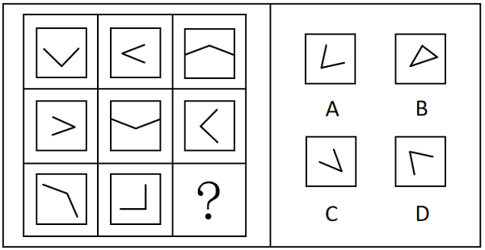

- **A**. A　✅
- **B**. B
- **C**. C
- **D**. D

**答案**：A

**官方解析**

观察发现，题干每幅图形均是由两条直线组成的“V”和正方形外框构成，元素组成相同，优先考虑位置规律。九宫格优先看横行，第一行图形中“V”的开口方向分别为上、右、下，即每次顺时针旋转；经验证，第二行图形符合此规律；第三行图形应用此规律，只有A项符合。

故正确答案为A。

---

### 第 3 题　qid 17056527 · 图形推理

下列选项中，符合所给图形变化规律的是（    ）。

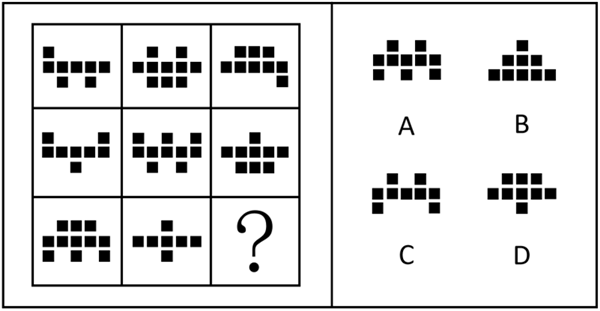

- **A**. A
- **B**. B
- **C**. C　✅
- **D**. D

**答案**：C

**官方解析**

观察发现，题干每幅图形均由3层小黑块组成，其中第二层数量均相同，第一层和第三层数量不同，考虑小黑块的数量。九宫格优先看横行，第一行第一层小黑块的个数分别为1、2、3，第三层小黑块的个数分别为2、3、1，即1、2、3在第一、三层均出现一次；经验证，第二行三幅图形满足此规律；第三行应用此规律，故“？”处图形第一层和第三层小黑块的个数均为2，只有C项符合。
故正确答案为C。

---

### 第 4 题　qid 17056533 · 类比推理

下列选项中，可以由左图给定的同一个六面体展开而成的是（    ）。

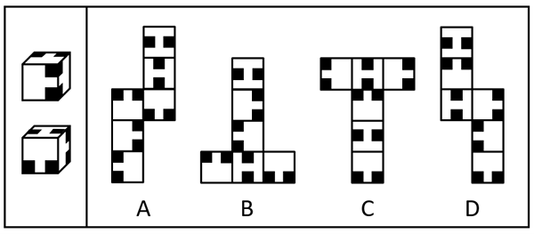

- **A**. A　✅
- **B**. B
- **C**. C
- **D**. D

**答案**：A

**官方解析**

将题干立体图形能够识别的面标注序号（如下图所示），已知面e、面f和面g两两相邻，那么这三个面中必有一个面与面h为相对面，逐一分析选项。

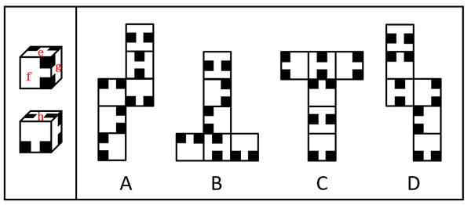

A项：选项展开图与题干一致，当选；

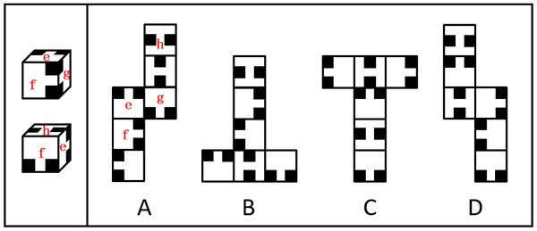

B项：题干下面的立体图形中，正面内的黑块与面h不相邻，但选项展开图中无论面1还是面2，与正面相同的面内黑块均与面1或面2相邻，即面1和面2都不是面h，选项展开图与题干不一致，排除；

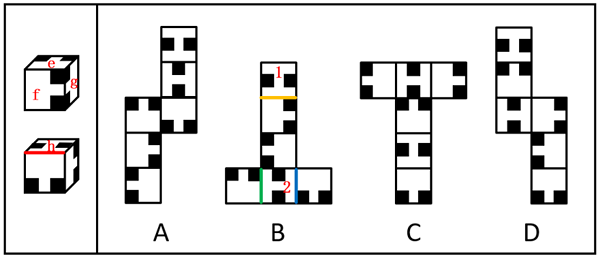

C项：选项展开图中，面1和面2为相对面，二者均不与面e、面f和面g中的任一个构成相对面，因此面1和面2都不是面h，选项展开图与题干不一致，排除；

D项：选项展开图中，面1和面2为相对面，二者均不与面e、面f和面g中的任一个构成相对面，因此面1和面2都不是面h，选项展开图与题干不一致，排除。

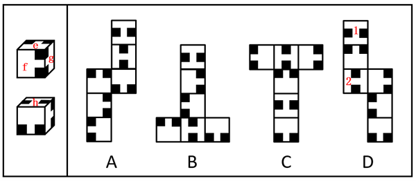

故正确答案为A。

---

### 第 5 题　qid 17056529 · 图形推理

下列选项中，符合所给图形变化规律的是（    ）。

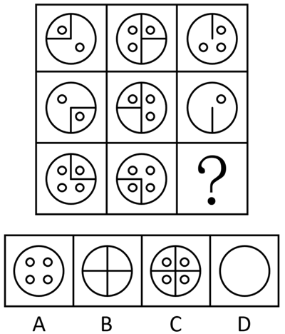

- **A**. A
- **B**. B
- **C**. C
- **D**. D　✅

**答案**：D

**官方解析**

元素组成相似，优先考虑样式规律。题干图形相同线条重复出现，考虑加减同异。九宫格优先看横行，第一行图1和图2外框和框内直线求同、小圆圈求异得到图3；经验证，第二行满足此规律；第三行应用此规律，故？处应选择由第三行图1和图2外框和框内直线求同、小圆圈求异得到的图形，只有D项符合。
故正确答案为D。

---

### 第 6 题　qid 19452436 · 图形推理

下列选项中，符合所给图形变化规律的是<u>        </u>。

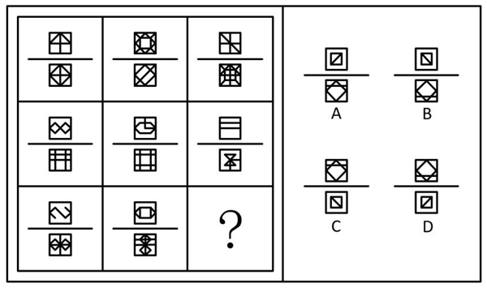

- **A**. A
- **B**. B
- **C**. C
- **D**. D　✅

**答案**：D

**官方解析**

元素组成相似，且相同线条重复出现，优先考虑样式规律中的加减同异。九宫格优先看横行，第一行中，图1和图2上半部分、下半部分的正方形均外框线条求同、内部线条求异，然后图形整体上下翻转得到图3；经验证，第二行满足此规律；第三行应用此规律，只有D项符合。
故正确答案为D。

---

### 第 7 题　qid 19452425 · 图形推理

下列选项中，符合所给图形变化规律的是<u>        </u>。

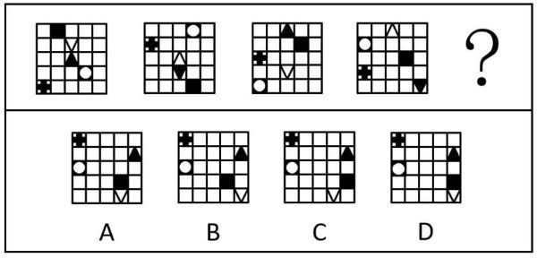

- **A**. A
- **B**. B　✅
- **C**. C
- **D**. D

**答案**：B

**官方解析**

元素组成相同，优先考虑位置规律。观察发现，题干图形每次先上下翻转，然后位于第一行和第三行的元素每次向下平移一格，位于第二行和第四行的元素每次向上平移一格，位于第五行的元素每次向右平移两格（到头循环走），故？处图形也应符合此规律，只有B项符合。

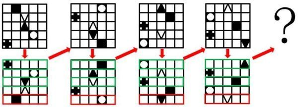

故正确答案为B。

---

### 第 8 题　qid 19452428 · 图形推理

下列选项中，符合所给图形变化规律的是<u>        </u>。

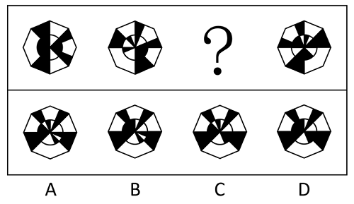

- **A**. A　✅
- **B**. B
- **C**. C
- **D**. D

**答案**：A

**官方解析**

元素组成基本相同，优先考虑位置规律。为了方便理解，可先将题干图形的轮廓进行等分，将题干黑块区分为斜杠图形及灰色图形（如下图所示）。观察发现，斜杠图形依次逆时针移动两格，灰色图形依次顺时针移动一格：

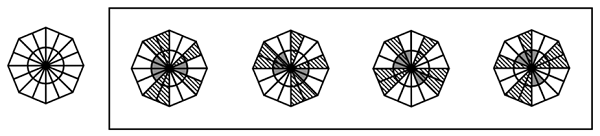

再次观察发现，当斜杠图形及灰色图形重合时，重合部分变为白色，如下图所示：

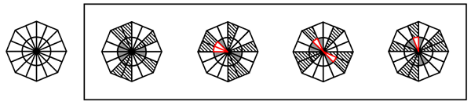

故正确答案为A。

---

### 第 9 题　qid 17056530 · 图形推理

下列选项中，符合所给图形变化规律的是（    ）。

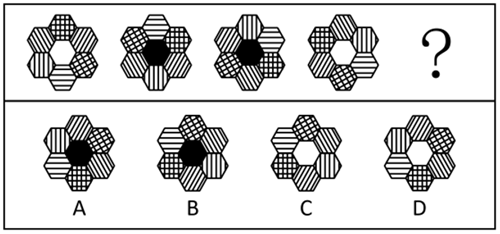

- **A**. A
- **B**. B
- **C**. C　✅
- **D**. D

**答案**：C

**官方解析**

元素组成基本相同，优先考虑位置规律。题干图形均由外圈的6个六边形元素和内圈的1个六边形元素组成，且外圈元素组成相同，内圈元素颜色不同，考虑内外分开看。外圈考虑位置规律，给外圈的6个六边形元素的位置依次标为1、2、3、4、5、6，比较图一和图二发现，1号移动至2号位置、2号移动至3号位置、3号移动至6号位置、4号移动至1号位置、5号移动至4号位置、6号移动至5号位置。经验证，图二到图三、图三到图四均符合该规律，故图四到图五也应符合该规律，排除A、D两项；内圈考虑颜色变化，对比题干的内圈颜色后发现，当两个网格状元素（如图一的1和3）之间为斜向相对位置时内圈颜色为白色，当两个网格状元素之间为横向相对位置时内圈颜色为黑色，？处两个网格状元素之间为斜向相对位置，故？处内圈颜色应为白色，只有C项符合。

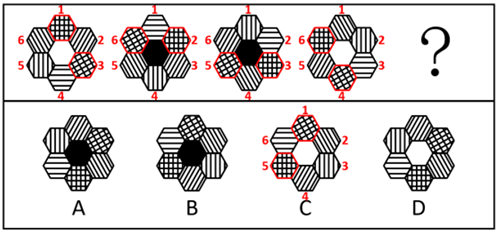

故正确答案为C。

---

### 第 10 题　qid 17056531 · 图形推理

下列选项中，可以由左图折叠而成的是（    ）。

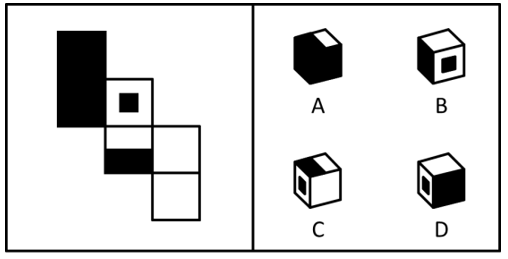

- **A**. A
- **B**. B　✅
- **C**. C
- **D**. D

**答案**：B

**官方解析**

将题干展开图标上序号，如下图所示，逐一进行分析。

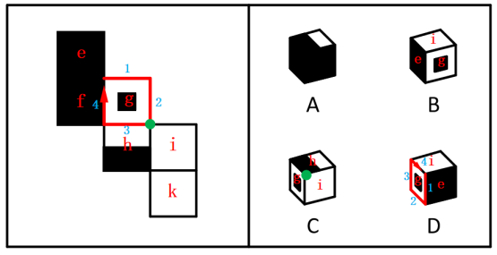

A项：选项由面e、面f和面h构成，题干展开图中，面e和面h为相对面，二者不能同时出现，选项与题干展开图不一致，排除；

B项：选项由面e、面g和面i构成，选项与题干展开图一致，当选；

C项：选项出现面g，而面g和面k为相对面，二者不能同时出现，因此选项由面g、面h和面i构成，题干展开图中，三个面的公共点挨着面h中的白色矩形，而选项中三个面的公共点挨着面h中的黑色矩形，选项与题干展开图不一致，排除；

D项：选项出现面g，而面g和面k为相对面，二者不能同时出现，因此选项顶面为面i，而面i和面f为相对面，二者不能同时出现，故选项由面g、面i和面e构成，在题干展开图和选项中，同时以面e和面g的公共边为起始边顺时针画边，题干展开图中边2对应面i，选项中边4对应面i，选项与题干展开图不一致，排除。

故正确答案为B。

---

### 第 11 题　qid 19452426 · 类比推理

下列选项中，与其它三项不同的是<u>        </u>。

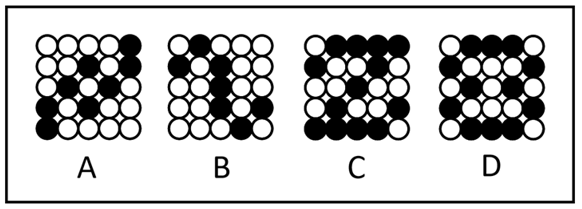

- **A**. A
- **B**. B
- **C**. C
- **D**. D　✅

**答案**：D

**官方解析**

元素组成不同，优先考虑属性规律。观察发现，每幅图均由黑球和白球组成，且黑白球整体分布比较规整，考虑对称性。A、B、C三项均为仅中心对称图形，而D项为轴+中心对称图形，故只有D项与其它三项不同。
本题为选非题，故正确答案为D。

---

### 第 12 题　qid 17056535 · 图形推理

下列选项中，符合所给图形变化规律的是（    ）。

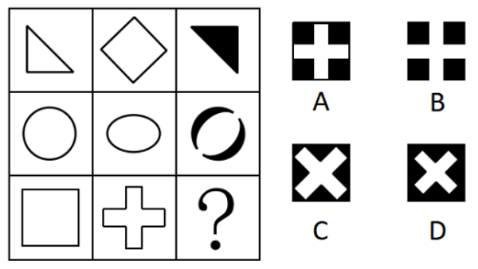

- **A**. A
- **B**. B
- **C**. C　✅
- **D**. D

**答案**：C

**官方解析**

元素组成相似，且相似线条重复出现，优先考虑样式规律中的加减同异。九宫格优先看横行，第一行中，将图2顺时针或逆时针旋转后与图1求异，求异后的部分变成黑色得到图3；经验证，第二行中，将图2逆时针旋转后与图1求异，求异后的部分变成黑色得到图3；第三行应用此规律，将图2逆时针旋转后与图1求异，求异的部分变成黑色，只有C项符合。

故正确答案为C。

---

### 第 13 题　qid 17056532 · 图形推理

下列选项中，符合所给图形变化规律的是（    ）。

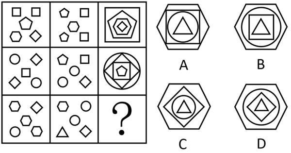

- **A**. A
- **B**. B
- **C**. C
- **D**. D　✅

**答案**：D

**官方解析**

元素组成相似，但无明显样式规律，且出现多个独立小图形，优先考虑素数量。九宫格优先横向看，观察发现，第一行的图1和图2中，共出现了4次，在图3中其出现在由内向外数的第4层，共出现了3次，在图3中其出现在由内向外数的第3层，共出现了2次，在图3中其出现在由内向外数的第2层，共出现了1次，在图3中其出现在由内向外数的第1层，即规律为：图1和图2中相同元素共出现了几次，在图3中该元素就出现在由内向外数的第几层；经验证，第二行符合此规律；第三行应用此规律，图1和图2中相同元素出现的次数从1-4排序依次为、、、，故？处图形由内向外的分布应依次为、、、，只有D项符合。

故正确答案为D。

---

### 第 14 题　qid 19452423 · 逻辑判断

趋势外推法是指以时间为基本参数，通过归纳分析过去和当前某一事物的数据，推断未来该事物的发展趋势或预测将来可能出现的事件的方法。 
以下使用了趋势外推法的是______。

- **A**. 为了分析新能源汽车在发展初期的市场渗透率，假设新能源汽车与智能手机均为颠覆性技术，参考智能手机曲线，预测新能源汽车的渗透率
- **B**. 为了预测未来全球人工智能市场规模，邀请多位行业专家独立预估市场规模及依据，汇总结果后匿名反馈给专家，重复多轮，直至专家意见趋于一致
- **C**. 为了分析某产品的留存率，将用户信息按照地区进行分组，得出华东地区的用户留存率最高的结论
- **D**. 为了预测某市人口数量，收集过去几年的人口数量，绘制成图表，观察到人口呈现线性增长趋势，计算出未来的人口数量　✅

**答案**：D

**官方解析**

第一步：找出定义关键词。
“以时间为基本参数”、“通过归纳分析过去和当前某一事物的数据”、“推断未来该事物的发展趋势或预测将来可能出现的事件”。
第二步：逐一分析选项。
A项：假设新能源汽车与智能手机均为颠覆性技术，通过类比智能手机曲线预测新能源汽车渗透率，并未归纳分析新能源汽车自身过去和当前的数据，不符合“以时间为基本参数”、“通过归纳分析过去和当前某一事物的数据”，不符合定义，排除；
B项：为了预测未来全球人工智能市场规模，邀请多位行业专家独立预估市场规模及依据，汇总专家意见并多轮反馈，依赖主观判断而非历史数据，不符合“以时间为基本参数”、“通过归纳分析过去和当前某一事物的数据”，不符合定义，排除；
C项：为了分析某产品的留存率，将用户信息按照地区进行分组，得出华东地区的用户留存率最高的结论，分析的是当前不同地区的留存率差异，没有以时间为基本参数，也未涉及对未来趋势的推断，不符合“以时间为基本参数”、“推断未来该事物的发展趋势或预测将来可能出现的事件”，不符合定义，排除；
D项：为了预测某市人口数量，收集过去几年的人口数量，绘制成图表，观察到人口呈现线性增长趋势，计算出未来的人口数量，符合“以时间为基本参数”、“通过归纳分析过去和当前某一事物的数据”、“推断未来该事物的发展趋势或预测将来可能出现的事件”，符合定义，当选。
故正确答案为D。

---

### 第 15 题　qid 19452432 · 逻辑判断

沙迦在荒漠地区成功培育出“沙迦1号”创新小麦，蛋白质含量达19.3%。该品种借助高精尖技术优化产品品质并能应对环境波动，其年产量充分满足了当地需求，降低了进口依赖。该品种已广泛用于本地食品加工，并获多项国际认证。因此，“沙迦1号”可以称得上农业创新领域的重大突破。
上述材料在论证其结论时，采用的思路是：

- **A**. 通过构建包含技术创新、产品指标、市场应用的三维论证体系，以“沙迦1号”在各维度的具体数据为支撑，形成相互印证的立体论证结构
- **B**. 采用问题导向型论证，以荒漠种植的先天劣势为逻辑起点，阐述“沙迦1号”培育过程中技术方案与成果指标的递进关系，证明创新突破的必然性
- **C**. 运用多维度交叉验证法，将农业技术创新的理论可行性、实际应用效果、经济效益指标进行交叉比对，强化论点的可信度
- **D**. 建立基于成果导向的论证模型，通过呈现“沙迦1号”在技术突破、产量提升、市场认可等方面的成果，直接支撑论点　✅

**答案**：D

**官方解析**

第一步：找出论点和论据，并梳理题干论证思路。
论点：“沙迦1号”可以称得上农业创新领域的重大突破。
论据：“沙迦1号”创新小麦蛋白质含量达19.3%。该品种借助高精尖技术优化产品品质并能应对环境波动，其年产量充分满足了当地需求，降低了进口依赖。该品种已广泛用于本地食品加工，并获多项国际认证。
题干是通过论据中“蛋白质含量达19.3%”“借助高精尖技术优化产品品质并能应对环境波动，其年产量充分满足了当地需求”“广泛用于本地食品加工，并获多项国际认证”等方面的信息来支撑论点成立。
第二步：逐一分析选项。
A项：题干中仅有“蛋白质含量达19.3%”一个具体数据，在技术创新和市场应用方面并没有具体的数据支撑，没有体现各维度相互印证，不是题干采用的论证思路，排除；
B项：题干不是问题导向型论证，没有将荒漠种植的先天劣势作为逻辑起点展开论述，不是题干采用的论证思路，排除；
C项：题干中未提及农业技术创新的理论可行性，不是题干采用的论证思路，排除；
D项：题干通过呈现“沙迦1号”借助高精尖技术优化产品品质（技术突破）、年产量充分满足当地需求（产量提升）、广泛用于本地食品加工，并获多项国际认证（市场认可）等方面的成果，直接支撑“‘沙迦1号’称得上农业创新领域的重大突破”的成立，是题干采用的论证思路，当选。
故正确答案为D。

---

### 第 16 题　qid 19452433 · 逻辑判断

上海科技企业在整个2024年共发生融资997起，居全国首位。据披露，总融资金额为966.38亿元，且呈现单笔融资金额连续三年递增。早期融资占比66%，同比提高了14个百分点。同时，生物医药、集成电路、人工智能三大先导产业融资占比超半数，国资参投占比达34.2%并加大早期投资力度。
以下选项里，最能准确归纳2024年上海科技企业投融资生态核心特点的是：

- **A**. 单笔融资额增长，早期融资占比提升，科技赛道突出，国资投入增加　✅
- **B**. 融资数量全国第一，对科技行业的早期投资占比高，国资支撑强
- **C**. 硬科技产业融资高，单笔融资金额及早期融资占比高，国资作用关键
- **D**. 融资规模小且分散，硬科技领域融资占比低，国资成为早期投资主力

**答案**：A

**官方解析**

日常结论题，根据题干信息逐一分析选项。
A项：根据题干中“单笔融资金额连续三年递增”可以推出单笔融资额增长，根据“早期融资占比66%，同比提高了14个百分点”可以推出早期融资占比提升，根据“生物医药、集成电路、人工智能三大先导产业融资占比超半数”可以推出科技赛道突出，根据“国资参投占比达34.2%并加大早期投资力度”可以推出国资投入增加，可以推出，当选；
B项：根据题干最后一句“国资参投占比达34.2%并加大早期投资力度”，无法直接推出国资的支撑能力强，无法推出，排除；
C项：根据题干中“单笔融资金额连续三年递增”可以推出单笔融资额增长，无法推出“单笔融资金额占比高”，无法推出，排除；
D项：根据题干内容无法推出“融资规模小且分散”，无法推出，排除。
故正确答案为A。

---

### 第 17 题　qid 19452424 · 逻辑判断

随着云南西双版纳地区生态保护力度加大，亚洲象种群数量从20世纪80年代的180头左右增长至2022年的300余头。为了缓解“人象冲突”，相关保护机构推行亚洲象食物源基地建设，通过种植大象喜食作物提供替代食物，有效降低大象侵扰农田的频率。反对者提出质疑：若大象已形成固定的农田觅食习性，即便存在食物源基地，其仍可能因“路径依赖”持续进入人类区域，因此缓解冲突需结合栖息地连通等长期手段。
若反对者的质疑成立，必须补充的前提是：

- **A**. 大象的觅食行为主要受既往觅食路径影响而非食物可获得性　✅
- **B**. 食物源基地的作物种植规模无法覆盖所有亚洲象活动区域
- **C**. 栖息地连通工程能显著提升亚洲象对自然栖息地的偏好
- **D**. 农田作物与食物源基地作物的营养差异对大象觅食选择无影响

**答案**：A

**官方解析**

第一步：找出论点和论据。
论点：若大象已形成固定的农田觅食习性，即便存在食物源基地，其仍可能因“路径依赖”持续进入人类区域，因此缓解冲突需结合栖息地连通等长期手段。
论据：无。
本题只有论点没有论据，且提问方式为“前提”，加强优先考虑必要条件。
第二步：逐一分析选项。
A项：该项说的是大象的觅食行为主要受既往觅食路径影响而非食物可获得性，如果大象觅食不受既往路径主导，那么食物源基地就能够吸引大象，论点就不成立，该项是论点成立的必要条件，当选；
B项：该项说的是食物源基地的作物种植规模，即使种植范围实现全覆盖，只要大象觅食受既往路径主导，就依然会无视食物源基地，继续进入农田觅食，该项不是论点成立的必要条件，排除；
C项：该项说的是栖息地连通工程的作用，而论点讨论的是大象的觅食习性和路径依赖，话题不一致，无法加强，排除；
D项：该项说的是营养差异对大象觅食选择无影响，即使营养差异对大象觅食选择有影响，也没有与“路径依赖”对大象觅食选择的影响进行比较，为不明确项，无法加强，排除。
故正确答案为A。

---

### 第 18 题　qid 19452427 · 逻辑判断

某研究指出，各国数字化转型显著提升了公共服务效率，但政府治理效能提升幅度差异较大，技术应用与公民参与度存在显著相关性。基于此，该研究提出数字化转型治理的“协同增效假说”：数字社会治理效能的提升需通过制度适配和公民积极参与，实现仅依赖技术工具而忽视社会参与，可能导致“数字形式主义”，削弱治理效率。
以下哪项为真，最能支持上述假说？

- **A**. 加拿大近几年投入数亿美元建设智能政务系统，但公民对政府服务的满意度同比下降5%
- **B**. 瑞典通过立法强制要求数字政务平台嵌入公民协商模块，使得政府决策效率提升20%　✅
- **C**. 国际电信联盟数据显示，发展中国家数字政务覆盖率已达75%，但公民投诉处理周期仍长达30天
- **D**. 韩国首尔市推行“数字市民议事厅”项目，允许公民实时参与预算审议，次年政府信任度跃升12%

**答案**：B

**官方解析**

第一步：找出论点和论据。
论点：数字社会治理效能的提升需通过制度适配和公民积极参与，实现仅依赖技术工具而忽视社会参与，可能导致“数字形式主义”，削弱治理效率。
论据：某研究指出，各国数字化转型显著提升了公共服务效率，但政府治理效能提升幅度差异较大，技术应用与公民参与度存在显著相关性。
本题论点和论据都在讨论“数字社会治理效能”和“公民参与度”之间的关系，二者话题一致，加强优先考虑补充论据。
第二步：逐一分析选项。
A项：该项指出加拿大建设智能政务系统后，公民的满意度下降，未提及制度、治理效能以及公民参与度之间的关系，话题不一致，无法加强，排除；
B项：该项中“立法强制”体现了制度，“公民协商模块”体现了公民参与度，“政府决策效率提升20%”体现了治理效能，即通过瑞典这个例子证明了数字社会治理效能的提升需通过制度适配和公民积极参与，补充论据，可以加强，当选；
C项：该项指出发展中国家数字政务覆盖率高，但投诉处理周期长，未提及制度对数字社会治理效能的提升的影响，话题不一致，无法加强，排除；
D项：该项指出首尔推行“数字市民议事厅”项目，政府信任度跃升，未提及制度对数字社会治理效能的提升的影响，话题不一致，无法加强，排除。
故正确答案为B。

---

### 第 19 题　qid 19452434 · 逻辑判断

随着人工智能、大数据、量子计算等新兴技术的爆发式发展，哲学研究的底层范式正经历前所未有的结构性变革。当下，科技革命正不断解构传统哲学命题（如自由意志、伦理责任、知识确证），变革技术实践的检验场域，迫使哲学研究者突破概念分析的传统范式，转而与计算机科学、神经科学、认知心理学等展开深度对话。在此背景下，有学者认为，哲学与科技的融合发展不再是边缘性探索，而是哲学研究的重要趋势，哲学范式革新的核心驱动力。
以下        项无法为这一趋势提供支撑。

- **A**. 某高校哲学系与计算机系合作，开展人工智能伦理研究，取得了丰硕成果
- **B**. 传统哲学研究方法在发展过程中，存在一定的局限性和不足　✅
- **C**. 哲学为人工智能的发展提供了伦理指导，推动了科技向善
- **D**. 哲学与科技融合的研究，获得了越来越多的学术资源和政策支持

**答案**：B

**官方解析**

第一步：找出论点和论据。
论点：哲学与科技的融合发展不再是边缘性探索，而是哲学研究的重要趋势，哲学范式革新的核心驱动力。
论据：无。
本题只有论点没有论据，加强优先考虑补充论据，且本题为选非题，找出可以加强的选项排除即可。
第二步：逐一分析选项。
A项：该项指出某高校哲学系与计算机系合作取得了丰硕成果，通过举例说明哲学与科技的融合发展是有效的，融合发展是重要趋势，补充论据，可以加强，排除；
B项：该项指出传统哲学研究方法存在一定的局限性和不足，仅说明了传统哲学的局限，与论点讨论的哲学与科技是否融合发展无关，为无关项，无法加强，当选；
C项：该项指出哲学为人工智能的发展提供了伦理指导，说明哲学对科技有积极作用，融合发展是重要趋势，补充论据，可以加强，排除；
D项：该项指出哲学与科技融合的研究获得越来越多的学术资源和政策支持，说明哲学与科技的融合发展受到了多方面的重视，为融合的趋势提供了条件，补充论据，可以加强，排除。
本题为选非题，故正确答案为B。

---

### 第 20 题　qid 19452431 · 逻辑判断

一项关于自闭症的研究表明，自闭症患者携带的异常基因组中与小胶质细胞功能异常相关的基因多达十余种，而药物分子BMS265246修复小胶质细胞功能异常后，小鼠的自闭症症状有所缓解。因此有不少人认为药物分子BMS265246可能成为治疗人类自闭症的有效药物。
根据上面的陈述，以下        项问题的答案最能对这一结论作出评价。

- **A**. 小胶质细胞功能异常是否一定会导致自闭症？　✅
- **B**. 服用BMS265246药物分子是否会引起其它副症状？
- **C**. BMS265246药物分子对其它原因引起的自闭症是否具有治疗效果？
- **D**. 是否所有自闭症患者都具有小胶质细胞功能异常的情况？

**答案**：A

**官方解析**

第一步：找出论点和论据。
论点：药物分子BMS265246可能成为治疗人类自闭症的有效药物。
论据：自闭症患者携带的异常基因组中与小胶质细胞功能异常相关的基因多达十余种，而药物分子BMS265246修复小胶质细胞功能异常后，小鼠的自闭症症状有所缓解。
本题论点讨论的是“药物分子BMS265246”与“人类自闭症”之间的关系，论据讨论的是“药物分子BMS265246”与“小胶质细胞功能异常”之间的关系，二者话题不一致，且提问方式为“最能对这一结论作出评价”，问题对结论成立越关键就越有帮助，可优先考虑搭桥。
第二步：逐一分析选项。
A项：该项讨论的是小胶质细胞功能异常是否一定会导致自闭症，如果小胶质细胞功能异常一定会导致自闭症，说明二者存在必然的因果联系，那么修复该异常的药物就能成为治疗人类自闭症的有效药物，即观点成立，反之观点就不成立，有助于评价结论，当选；
B项：该项讨论的是服用BMS265246药物分子是否会引起其它副症状，关注的是药物的安全性，而论点讨论的是药物的有效性，安全性与有效性无直接关联，话题不一致，无助于评价结论，排除；
C项：该项讨论的是BMS265246药物分子对其它原因引起的自闭症是否具有治疗效果，而论点讨论的是该药物针对小胶质细胞功能异常相关的自闭症的治疗效果，即便药物对其它原因引起的自闭症无效，只要对小胶质细胞功能异常相关的自闭症有效，仍可成为治疗人类自闭症的有效药物，无助于评价结论，排除；
D项：该项讨论的是是否所有自闭症患者都具有小胶质细胞功能异常的情况，即便不是所有患者都存在该异常，只要小胶质细胞功能异常必然导致自闭症，药物分子BMS265246针对这部分患者具备治疗效果，仍可能成为治疗人类自闭症的有效药物，无助于评价结论，排除。
故正确答案为A。

---

### 第 21 题　qid 19452435 · 定义判断

沉默的螺旋是指与媒介中的主流观点持相反或不同意见的人，由于害怕被排斥和孤立而趋于保持沉默，使得被认为属于“主流”的意见越来越强势，而属于“少数”或“另类”的意见就愈发衰退，形成所谓“螺旋”效果。
以下属于沉默的螺旋的是：

- **A**. 在校园内是否允许电动自行车行驶的问题上，校内师生形成了“安全优先”和“便捷优先”两大阵营，彼此展开激烈的讨论
- **B**. 张教授在课程群里征求对考试形式的意见，最先留言的十多位同学都主张闭卷考，部分想开卷考的同学担心被人说“太菜”，选择不留言　✅
- **C**. 社交媒体用户通过算法推荐，长期接触单一立场的新闻，逐渐强化对自己观点的认同，思想变得极端偏激
- **D**. 某段时间内媒体密集报道“食品安全问题”，如添加剂超标、过期食品等，导致公众对食品安全的担忧大幅上升，甚至产生集体焦虑

**答案**：B

**官方解析**

第一步：找出定义关键词。
“与媒介中的主流观点持相反或不同意见的人”、“由于害怕被排斥和孤立而趋于保持沉默”、“使得被认为属于‘主流’的意见越来越强势”。
第二步：逐一分析选项。
A项：校内师生形成了“安全优先”和“便捷优先”两大阵营，彼此展开激烈的讨论，并未体现有人因害怕被排斥和孤立而保持沉默，不符合“由于害怕被排斥和孤立而趋于保持沉默”，不符合定义，排除；
B项：最先留言的十多位同学都主张闭卷考，部分想开卷考的同学属于与主流观点持相反意见的人，符合“与媒介中的主流观点持相反或不同意见的人”，担心被人说“太菜”从而选择不留言，符合“由于害怕被排斥和孤立而趋于保持沉默”、“使得被认为属于‘主流’的意见越来越强势”，符合定义，当选；
C项：社交媒体用户长期接触单一立场的新闻，逐渐强化对自己观点的认同，只体现了用户个人的变化，不符合“与媒介中的主流观点持相反或不同意见的人”、“由于害怕被排斥和孤立而趋于保持沉默”，不符合定义，排除；
D项：媒体密集报道“食品安全问题”，导致公众对食品安全的担忧大幅上升，并未提及持相反意见的人的情况，不符合“与媒介中的主流观点持相反或不同意见的人”、“由于害怕被排斥和孤立而趋于保持沉默”，不符合定义，排除。
故正确答案为B。

---

### 第 22 题　qid 19452430 · 逻辑判断

所有威胁人类生存根基的问题都需全球共同面对。环境问题引发的气候异常、资源枯竭等，正直接破坏人类赖以生存的生态系统，威胁粮食安全与居住环境，因此环境问题是威胁人类生存根基的关键问题。所有需全球共同面对的关键问题中，影响范围最广、紧迫性最强的是首要问题。环境问题的影响已高度跨国界，若不及时应对将引发不可逆后果。由此可推，环境问题是当今世界最需共同面对的首要问题。
以下        项如果为真，最能质疑上述论证。

- **A**. 环境问题的解决需依赖技术突破，而各国技术水平差异较大
- **B**. 经济发展问题对人类生存的威胁是比环境问题更广泛、紧迫性更强的全球问题　✅
- **C**. 和平与发展是比环境问题更受重视的全球性问题
- **D**. 部分国家对环境问题的重视程度远低于经济发展问题

**答案**：B

**官方解析**

第一步：找出论点和论据。
论点：环境问题是当今世界最需共同面对的首要问题。
论据：所有威胁人类生存根基的问题都需全球共同面对。环境问题引发的气候异常、资源枯竭等，正直接破坏人类赖以生存的生态系统，威胁粮食安全与居住环境，因此环境问题是威胁人类生存根基的关键问题。所有需全球共同面对的关键问题中，影响范围最广、紧迫性最强的是首要问题。环境问题的影响已高度跨国界，若不及时应对将引发不可逆后果。
本题论点和论据均在讨论环境问题是否为当今世界最需共同面对的首要问题。二者话题一致，削弱优先考虑削弱论点。
第二步：逐一分析选项。
A项：该项指出环境问题的解决依赖技术突破且各国技术水平差异大，讨论的是解决环境问题的难度，与论点“环境问题是否为最需共同面对的首要问题”无关，无法削弱，排除；
B项：该项指出经济发展问题是比环境问题影响更广泛、紧迫性更强的全球问题，直接否定了环境问题是当今世界最需共同面对的首要问题，削弱论点，可以削弱，当选；
C项：该项指出和平与发展比环境问题更受重视，“受重视”与是否是“首要问题”无关，话题不一致，无法削弱，排除；
D项：该项指出部分国家对环境问题的重视程度低于经济发展问题，体现的是部分国家的态度差异，与“环境问题是否为最需共同面对的首要问题”无关，无法削弱，排除。
故正确答案为B。

---

### 第 23 题　qid 19452440 · 定义判断

社区参与是指以居民关注的社区公共事务为焦点，结合社区居民的共同利益，吸引居民参与，通过有目标、有组织的行动过程和投入，解决社区问题，满足社区需要，凝聚社区意识，提升居民生活质量的过程。
以下属于社区参与的是：

- **A**. 某城市老旧小区改造前，社区组织居民代表、物业、街道办召开改造方案听证会，居民就停车位规划、加装电梯、绿化布局等问题提出意见　✅
- **B**. 在“免费午餐”公益计划中，来自全国各地的志愿者通过线上捐款、线下探访等方式支持偏远地区儿童餐饮
- **C**. 某社区开展人大代表补选工作，该社区居民通过无记名投票和等额选举的方式，最终产生一名人大代表
- **D**. 某街道办事处在社区内开展“敲门行动”，组织工作人员走访高龄独居老人、残障人士等特殊群体

**答案**：A

**官方解析**

第一步：找出定义关键词。
“以居民关注的社区公共事务为焦点”、“结合社区居民的共同利益，吸引居民参与”、“有目标、有组织的行动过程和投入”、“解决社区问题，满足社区需要，凝聚社区意识，提升居民生活质量”。
第二步：逐一分析选项。
A项：某城市老旧小区改造前，社区组织居民代表、物业、街道办召开改造方案听证会，符合“以居民关注的社区公共事务为焦点”、“有目标、有组织的行动过程和投入”，居民就停车位规划、加装电梯、绿化布局等问题提出意见，符合“结合社区居民的共同利益，吸引居民参与”、“解决社区问题，满足社区需要，凝聚社区意识，提升居民生活质量”，符合定义，当选；
B项：来自全国各地的志愿者通过线上捐款、线下探访等方式支持偏远地区儿童餐饮，说明不是社区居民参与，解决的也不是社区公共事务，不符合“以居民关注的社区公共事务为焦点”、“结合社区居民的共同利益，吸引居民参与”、“解决社区问题，满足社区需要，凝聚社区意识，提升居民生活质量”，不符合定义，排除；
C项：某社区开展人大代表补选工作，是政治选举活动，虽在社区内进行，但不是针对社区具体问题或需求的活动，不符合“解决社区问题，满足社区需要，凝聚社区意识，提升居民生活质量”，不符合定义，排除；
D项：“敲门行动”是组织工作人员走访特殊群体，说明居民是被走访的对象，而非主动参与者，不符合“以居民关注的社区公共事务为焦点”、“结合社区居民的共同利益，吸引居民参与”，不符合定义，排除。
故正确答案为A。

---

### 第 24 题　qid 19452437 · 逻辑判断

在2025年荷兰北约峰会上，上任北约秘书长延斯·斯托尔滕贝格在发言时，将美国总统称为“美国爸爸”（America Daddy），此举引发广泛争议。许多媒体和观察者据此认为，“爸爸策略”已从美国对非北约盟国延伸至北约核心圈，他们进一步推论称，欧洲在对美关系中根本无法实现自主，只能继续追随美国决策，毫无改善前景。
如果以下选项都为真，        ，最能削弱上述推论。

- **A**. 延斯·斯托尔滕贝格在会后接受采访时澄清“爸爸”一词只是幽默用语，未表达任何政治意涵
- **B**. 法国、德国等欧洲大国呼吁重建以欧洲利益为核心的防务机制，加速推进欧盟武器系统开发项目　✅
- **C**. 美国在峰会期间要求欧洲国家增加军费，并威胁对未达标国家施加贸易限制，引发部分国家反弹
- **D**. 历史上也曾多次出现美欧在防务议题上的分歧，但最终仍通过妥协实现合作

**答案**：B

**官方解析**

第一步：找出论点和论据。
论点：欧洲在对美关系中根本无法实现自主，只能继续追随美国决策，毫无改善前景。
论据：在2025年荷兰北约峰会上，北约秘书长延斯·斯托尔滕贝格在发言时，将美国总统称为“美国爸爸”（America Daddy），此举引发广泛争议。许多媒体和观察者据此认为，“爸爸策略”已从美国对非北约盟国延伸至北约核心圈。
本题的论点和论据均在讨论欧洲在对美关系中无法实现自主，只能继续追随美国的决策，二者话题一致，削弱优先考虑削弱论点。
第二步：逐一分析选项。
A项：该项讨论的是延斯·斯托尔滕贝格澄清了“爸爸”一词仅是幽默用语，和政治无关，并未提及欧洲是否在对美关系中能够实现自主，话题不一致，为无关项，无法削弱，排除；
B项：该项指出法国、德国等欧洲大国呼吁重建以欧洲利益为核心的防务机制，并且加速推进欧盟武器系统开发项目，说明这些欧洲大国正在计划重建以欧洲利益为核心的防务机制来实现自主，并正在努力改善追随美国决策的状况，削弱论点，可以削弱，当选；
C项：该项讨论的是美国在峰会期间对欧洲国家的要求和威胁引发了部分国家反弹，未提及这些反弹的国家是否可以让欧洲掌握在对美关系中的自主权，也未提及这些国家反弹的行为是否可以改善欧洲追随美国决策的状况，为不明确项，无法削弱，排除；
D项：该项讨论的是历史上也曾出现过美欧在防务议题上的分歧，但最终仍通过妥协实现合作，说明欧洲以往在对美关系中确实缺乏自主权，但未提及欧洲能否拿回自主权并改善追随美国决策的状况，为无关项，无法削弱，排除。
故正确答案为B。

---
