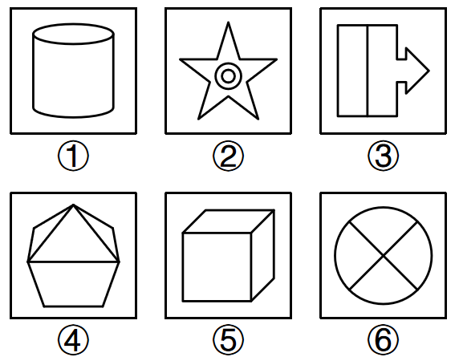
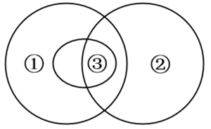

# 2026年内蒙古公务员录用考试《行测》题（网友回忆版）

> 判断推理 · 32 题 · 内蒙古 2026

## 第 1 题　qid 15833789 · 图形推理

从所给的四个选项中，选择最合适的一个填入问号处，使之呈现一定的规律性：

- **A**. A　✅
- **B**. B
- **C**. C
- **D**. D

**答案**：A

**官方解析**

元素组成不同，且无明显属性规律，考虑数量规律。观察发现，题干每幅图黑块包围的白块数量依次递增，故“？”处的白块数应为6，排除B、D两项；继续观察发现，其余没有包围白块的黑块数依次递增，故“？”处应选择一个没有包围白块的黑块数为6的图形，只有A项符合。

故正确答案为A。

---

## 第 2 题　qid 15833644 · 图形推理

从所给的四个选项中，选择最合适的一个填入问号处，使之呈现一定的规律性：

- **A**. A
- **B**. B　✅
- **C**. C
- **D**. D

**答案**：B

**官方解析**

元素组成相同，优先考虑位置规律。九宫格优先横向看，第一行中，内部的图形依次逆时针旋转，外圈的图形依次顺时针旋转，第二行中，上层的图形依次逆时针旋转，下层的图形依次顺时针旋转。第三行应用此规律，内部的半圆依次逆时针旋转，其余线条依次顺时针旋转，对应B项。 

故正确答案为B。

---

## 第 3 题　qid 15833882 · 图形推理

把下面的六个图形分为两类，使每一类图形都有各自的共同特征或规律，分类正确的一项是：

- **A**. ①②③，④⑤⑥
- **B**. ①③④，②⑤⑥
- **C**. ①④⑤，②③⑥
- **D**. ①②⑥，③④⑤　✅

**答案**：D

**官方解析**

本题为分组分类题目。元素组成不同，优先考虑属性规律。观察发现，题干出现全直线图形以及明显的曲线，考虑曲直性。图①②⑥均为有曲有直图形，图③④⑤均为全直线图形。即图①②⑥为一组，图③④⑤为一组。
故正确答案为D。

---

## 第 4 题　qid 15833787 · 图形推理

把下面的六个图形分为两类，使每一类图形都有各自的共同特征或规律，分类正确的一项是：

- **A**. ①②③，④⑤⑥
- **B**. ①③④，②⑤⑥
- **C**. ①④⑤，②③⑥　✅
- **D**. ①②⑥，③④⑤

**答案**：C

**官方解析**

本题为分组分类题目。元素组成不同，且属性规律无答案，考虑数量规律。观察发现，图④、图⑥为圆相切的变形图，图①、图⑤为“田”字变形图，考虑笔画数。图①④⑤为两笔画图形，图②③⑥笔画数依次为9、8（汉字笔画数）、3，为非两笔画图形。即①④⑤一组，②③⑥一组。
故正确答案为C。

---

## 第 5 题　qid 15833781 · 图形推理

把下面的六个图形分为两类，使每一类图形都有各自的共同特征或规律，分类正确的一项是：

- **A**. ①②③，④⑤⑥
- **B**. ①③④，②⑤⑥
- **C**. ①④⑤，②③⑥　✅
- **D**. ①②⑥，③④⑤

**答案**：C

**官方解析**

本题为分组分类题目。元素组成不同，优先考虑属性规律。观察发现，题干图形均较为规整，考虑对称性。图①④⑤均为既轴对称又中心对称的图形，图②③⑥均为仅轴对称图形，即图①④⑤为一组，图②③⑥为一组。
故正确答案为C。

---

## 第 6 题　qid 15833785 · 图形推理

左图为3个白色正方体和4个灰色正方体粘接而成的多面体，将其从任一方向剖开，下面哪一项不可能是该立体图形的截面？

- **A**. A
- **B**. B　✅
- **C**. C
- **D**. D

**答案**：B

**官方解析**

本题考查截面图，如下图所示，A、C、D三项均可截出，只有B项无法截出。

本题为选非题，故正确答案为B。

---

## 第 7 题　qid 15833795 · 图形推理

从所给的四个选项中，选择最合适的一个填入问号处，使之呈现一定的规律性：

- **A**. A　✅
- **B**. B
- **C**. C
- **D**. D

**答案**：A

**官方解析**

元素组成相似，但无明显样式规律，考虑位置规律。九宫格优先看横行，观察发现，第一行图形中，黑块均向右上角平移一格，且去除移出框外的黑块；经验证，第二行符合此规律；第三行应用此规律，对应A项。
故正确答案为A。

---

## 第 8 题　qid 15833758 · 图形推理

左图的立体图形，将其展开后，右边哪一项可能是该立体图形的展开图？

- **A**. A
- **B**. B　✅
- **C**. C
- **D**. D

**答案**：B

**官方解析**

本题考查多面体的空间重构。

观察发现，若将题干多面体展开成平面图，应该合计有13个黑色方块面、11个白色方块面。A项展开图中有12个黑色方块面、12个白色方块面，排除；对比B、C、D三项，发现仅左右两侧的“十字形”结构不同，该“十字形”结构共5个方块面，说明展开图中左右两侧的“十字形”结构，折叠后分别对应立体图形左右两侧的单独突出小方块。观察题干立体图形，左侧单独突出的小方块为纯白色，对应展开图左侧“十字形”的5个方块面也应为纯白色；右侧单独突出的小方块为纯黑色，对应展开图右侧“十字形”的5个方块面也应为纯黑色，排除C、D两项。

故正确答案为B。

---

## 第 9 题　qid 15833777 · 类比推理

与“制片主任：剧组人员”在逻辑关系上最相近的是：

- **A**. 科长：科员
- **B**. 花瓣：花束
- **C**. 语文书：教科书　✅
- **D**. 发电机：发电机组

**答案**：C

**官方解析**

第一步：判断题干词语间逻辑关系。
制片主任是剧组人员的一种，二者为种属关系。
第二步：判断选项词语间逻辑关系。
A项：科长与科员是两个不同的职位，二者为并列关系，与题干逻辑关系不一致，排除；
B项：花瓣是花束的组成部分，二者为组成关系，与题干逻辑关系不一致，排除；
C项：语文书是教科书的一种，二者为种属关系，与题干逻辑关系一致，当选；
D项：发电机是发电机组的组成部分，二者为组成关系，与题干逻辑关系不一致，排除。
故正确答案为C。

---

## 第 10 题　qid 15833778 · 类比推理

与“因特网：国际互联网”在逻辑关系上最相近的是：

- **A**. 拙荆：妻子
- **B**. 瑶琴：古琴
- **C**. 姑爷：女婿
- **D**. 巴士：公共汽车　✅

**答案**：D

**官方解析**

第一步：判断题干词语间逻辑关系。
“因特网”即“国际互联网”，二者为全同关系，且“因特网”为音译词。
第二步：判断选项词语间逻辑关系。
A项：“拙荆”是对“妻子”的谦称，二者为全同关系，但“拙荆”不是音译词，与题干逻辑关系不一致，排除；
B项：“瑶琴”是“古琴”的别称，二者为全同关系，但“瑶琴”不是音译词，与题干逻辑关系不一致，排除；
C项：“姑爷”是对“女婿”的口语化称谓，二者为全同关系，但“姑爷”不是音译词，与题干逻辑关系不一致，排除；
D项：“巴士”即“公共汽车”，二者为全同关系，且“巴士”为音译词，与题干逻辑关系一致，当选。
故正确答案为D。

---

## 第 11 题　qid 15833884 · 类比推理

恐：惧：害怕

- **A**. 寒：暑：冬夏
- **B**. 温：婉：贤淑
- **C**. 恭：敬：态度
- **D**. 和：睦：融洽　✅

**答案**：D

**官方解析**

第一步：判断题干词语间逻辑关系。
“恐”指严重害怕与惊恐，“惧”指害怕、恐惧，“害怕”指因遇到危险、困难而畏惧或发慌的心理状态，三者为近义关系。
第二步：判断选项词语间逻辑关系。
A项：“寒”指寒冷，“暑”指天气炎热，二者为反义关系，且“寒”对应“冬”，“暑”对应“夏”，与题干逻辑关系不一致，排除；
B项：“温”指不冷不热，“婉”指温顺，“贤淑”指女子具有善良温厚、德行优良的品质，也可引申代指具备此类品质的女子，第一个词与后两个词不构成近义关系，与题干逻辑关系不一致，排除；
C项：“恭”指恭敬，谦逊有礼，“敬”指尊重，有礼貌地对待，前两个词为近义关系，“恭敬”是一种“态度”，前两个词与第三个词不构成近义关系，与题干逻辑关系不一致，排除；
D项：“和”指和谐，“睦”指相互看得顺眼，后引申指融洽、友爱，“融洽”指彼此感情好，没有隔阂和抵触，三者为近义关系，与题干逻辑关系一致，当选。
故正确答案为D。

---

## 第 12 题　qid 15833655 · 类比推理

教师人数：生师比：学生人数

- **A**. 产品总数：合格率：合格产品数　✅
- **B**. 溶剂质量：浓度：溶质质量
- **C**. 租金：租售比：售价
- **D**. 税额：利润率：利润总额

**答案**：A

**官方解析**

第一步：判断题干词语间逻辑关系。

生师比，三词为分子分母比率的对应关系。

第二步：判断选项词语间逻辑关系。

A项：合格率，与题干逻辑关系一致，当选；

B项：浓度，与题干逻辑关系不一致，排除；

C项：租售比=租金÷售价，第一词和第三词顺序与题干相反，与题干逻辑关系不一致，排除；

D项：税额与利润率、利润总额无关系，与题干逻辑关系不一致，排除。

故正确答案为A。

---

## 第 13 题　qid 15833657 · 类比推理

算法偏见 对于（    ）相当于（    ）对于 动脉堵塞

- **A**. 歧视：静脉堵塞
- **B**. 信息茧房：心梗
- **C**. 数据污染：肺功能
- **D**. 不公平：血栓脱落　✅

**答案**：D

**官方解析**

逐一代入选项。
A项：算法偏见会导致歧视，二者为因果关系，静脉堵塞和动脉堵塞为并列关系，前后逻辑关系不一致，排除；
B项：算法偏见会导致信息茧房，二者为因果关系，动脉堵塞会导致心梗，二者为因果关系，但前后顺序不一致，前后逻辑关系不一致，排除；
C项：数据污染指在数据采集、传输、存储等环节中，因人为失误、系统误差、恶意篡改或噪声干扰，导致数据出现错误、失真、缺失、重复、偏差或被无关信息干扰，使其质量下降、失去真实性与可用性的现象，数据污染会导致算法偏见，二者为因果关系，肺功能和动脉堵塞无明显逻辑关系，前后逻辑关系不一致，排除；
D项：算法偏见易导致不公平，血栓脱落易导致动脉堵塞，前后均为因果关系，前后逻辑关系一致，当选。
故正确答案为D。

---

## 第 14 题　qid 15833886 · 类比推理

金文 对于 （    ） 相当于 （    ） 对于 银行

- **A**. 楷书；柜员
- **B**. 铭文；信用社
- **C**. 青铜器；街道
- **D**. 行书；钱庄　✅

**答案**：D

**官方解析**

逐一代入选项。
A项：金文和楷书均为一种字体，二者为并列关系中的反对关系，柜员在银行工作，二者为主体与工作地点的对应关系，前后逻辑关系不一致，排除；
B项：金文是一种铭文，二者为种属关系，信用社是一种特殊的金融机构，常被与商业银行、投资银行等传统银行类型并列讨论，信用社与银行均为金融机构，二者为并列关系中的反对关系，前后逻辑关系不一致，排除；
C项：金文是铸造在殷商与周朝青铜器上的铭文，二者为文字与载体的对应关系，银行在街道旁，二者为机构与所处区域的对应关系，前后逻辑关系不一致，排除；
D项：金文产生于商代；行书产生于汉代。二者均是字体的一种，为并列关系，且金文的产生时间早于行书；钱庄是古代的金融机构，银行是现代的金融机构，二者为并列关系，且钱庄的产生时间早于银行，前后逻辑关系一致，当选。
故正确答案为D。

---

## 第 15 题　qid 15833663 · 定义判断

如果用圆圈表示概念的外延，下列符合上述概念外延关系的是：

- **A**. 青铜鼎③是一种重要的青铜器①，有些鼎可作为食器②使用　✅
- **B**. 教研室中有些老师①具有高级职称③，他们中的一些人还是工会积极分子②
- **C**. 文学类书籍①是图书馆里借阅率最高的书籍，当代小说③是最受欢迎的，艺术类书籍②相对受冷落
- **D**. 水杉是一种落叶乔木①，也是一种生活在湿润多雨环境中的植物②，每年秋冬季节或干旱季节落叶乔木的叶子③会全部脱落

**答案**：A

**官方解析**

第一步：根据题干图示判断逻辑关系。
①和②部分重叠，①和②为交叉关系，②和③部分重叠，②和③为交叉关系，③被①全部包含在内，①和③为包容关系。
第二步：判断选项词语间逻辑关系。
A项：青铜鼎是一种青铜器，青铜鼎③和青铜器①为包容关系，有的青铜器是食器，有的青铜器不是食器，有的食器是青铜器，有的食器不是青铜器，因此青铜器①与食器②是交叉关系，有的青铜鼎是食器，有的青铜鼎不是食器，有的食器是青铜鼎，有的食器不是青铜鼎，因此青铜鼎③与食器②是交叉关系，与题干逻辑关系一致，当选；
B项：有些老师①具有高级职称③，高级职称是衡量老师教学水平的，有些老师①和高级职称③不是包容关系，与题干逻辑关系不一致，排除；
C项：当代小说③是文学类书籍①，当代小说③和文学类书籍①是包容关系，文学类书籍①和艺术类书籍②无重叠部分，不是交叉关系，与题干逻辑关系不一致，排除；
D项：落叶乔木是植物，落叶乔木①和植物②是包容关系，与题干逻辑关系不一致，排除。
故正确答案为A。

---

## 第 16 题　qid 15833767 · 逻辑判断

动词可以分为以下几类：断言类，表示说话人对某事做出一定程度上的表态，对话语所表达的命题内容做出真假判断；指令类，表示说话人不同程度地指使听话人做某事；承诺类，指说话人对未来的行为做出不同程度的承诺；表达类，指说话人在表达话语命题内容的同时所表达的某种心理状态；宣告类，指话语所表达的命题内容与客观现实之间的一致。
根据上述内容，下列选项表述错误的是：

- **A**. “否认”是断言类，“要求”是指令类
- **B**. “保证”是承诺类，“宣布”是宣告类
- **C**. “请求”“敦促”“命令”都是指令类
- **D**. “道歉”“夸耀”“通知”都是表达类　✅

**答案**：D

**官方解析**

第一步：找出定义关键词。
断言类：“表态”、“真假判断”；
指令类：“指使”；
承诺类：“对未来的行为做出承诺”；
表达类：“表达某种心理状态”；
宣告类：“话语所表达的命题内容与客观现实之间的一致”。
第二步：逐一分析选项。
A项：“否认”指不承认，符合“表态”、“真假判断”，属于断言类；“要求”指提出具体愿望或条件，希望得到满足或实现，符合“指使”，属于指令类，说法正确，排除；
B项：“保证”指确保既定的要求和标准，不打折扣，符合“对未来的行为做出承诺”，属于承诺类；“宣布”指向听众宣读某个决定、信息，符合“话语所表达的命题内容与客观现实之间的一致”，属于宣告类，说法正确，排除；
C项：“请求”指提出要求，希望得到满足，“敦促”指催促，“命令”指上级对下级有所指示，均符合“指使”，均属于指令类，说法正确，排除；
D项：“道歉”指表示歉意，特指认错，“夸耀”指向他人显示自己的长处或优势，均符合“表达某种心理状态”，均属于表达类；“通知”指把事项告诉人知道，符合“话语所表达的命题内容与客观现实之间的一致”，属于宣告类，并非表达类，说法错误，当选。
本题为选非题，故正确答案为D。

---

## 第 17 题　qid 15833645 · 类比推理

半公开信息源是指需要特定权限或身份认证等才可以获得相应信息的信息源。半公开信息源只能在一定范围内公开、共享、使用，大多数是在机构内部。
根据上述内容，不属于半公开信息源的是：

- **A**. 党政机关不公开发行的内部刊物
- **B**. 公司内网发布的公司内部财务状况报告
- **C**. 高校内部传达的有关重点实验室管理的文件
- **D**. 研究所内部仅涉密人员知晓的科学技术秘密　✅

**答案**：D

**官方解析**

第一步：找出定义关键词。
“需要特定权限或身份认证等才可以获得相应信息”、“只能在一定范围内公开、共享、使用”。
第二步：逐一分析选项。
A项：党政机关不公开发行的内部刊物，仅对党政机关内部的工作人员公开，符合“需要特定权限或身份认证等才可以获得相应信息”、“只能在一定范围内公开、共享、使用”，符合定义，排除；
B项：公司内网发布的公司内部财务状况报告，仅对公司内部的工作人员公开，符合“需要特定权限或身份认证等才可以获得相应信息”、“只能在一定范围内公开、共享、使用”，符合定义，排除；
C项：高校内部传达的有关重点实验室管理的文件，仅对高校内部相关人员公开，符合“需要特定权限或身份认证等才可以获得相应信息”、“只能在一定范围内公开、共享、使用”，符合定义，排除；
D项：研究所内部仅涉密人员知晓的科学技术秘密，该科学技术秘密为涉密信息，需要严格保密，不能公开、共享，不符合“只能在一定范围内公开、共享、使用”，不符合定义，当选。
本题为选非题，故正确答案为D。

---

## 第 18 题　qid 15833704 · 定义判断

在统计学中，总体是客观存在的，具有某种共同性质的许多个别事物构成的整体，构成总体的个别事物叫总体单位。总体和总体单位都是客观存在的事物，是统计研究的客体。
根据上述定义，若要了解某省高校仪器设备情况，则总体单位是：

- **A**. 该省每一所高校
- **B**. 该省高校的全部仪器设备
- **C**. 该省高校的每一台仪器设备　✅
- **D**. 该省每一所高校的全部仪器设备

**答案**：C

**官方解析**

第一步：找出定义关键词。
总体：“具有某种共同性质的许多个别事物构成的整体”；
总体单位：“构成总体的个别事物”。
第二步：逐一分析选项。
A项：想要了解某省高校仪器设备情况，“该省高校的全部仪器设备”为总体，构成总体的个别事物并非高校，因此该省每一所高校，不符合“构成总体的个别事物”，不符合定义，排除；
B项：该省高校的“全部”仪器设备，不属于个别事物，不符合“构成总体的个别事物”，不符合定义，排除；
C项：想要了解某省高校仪器设备情况，“该省高校的全部仪器设备”为总体，“该省高校的每一台仪器设备”是组成“该省高校的全部仪器设备”的个别事物，符合“构成总体的个别事物”，符合定义，当选；
D项：该省每一所高校的“全部”仪器设备，不属于个别事物，不符合“构成总体的个别事物”，不符合定义，排除。
故正确答案为C。

---

## 第 19 题　qid 15833642 · 定义判断

注意力经济是指商家最大限度地吸引用户或消费者的注意力，通过培养潜在的消费群体，以期获得最大的未来商业利益的经济模式。
根据上述定义，不涉及注意力经济的是：

- **A**. 某汽车品牌在新品发布前，连续在社交媒体平台发布“新品悬念海报”，每天公布一个产品核心功能亮点，积累潜在购买用户
- **B**. 某用户在社交平台晒出的自家萌娃的一则短视频吸引了大量关注，视频中萌娃的同款玩具在购物平台爆火　✅
- **C**. 某超市为处理临期食品，不定期在门口设置“特价区”，通过低价吸引周边居民抢购
- **D**. 某美妆品牌在短视频平台发起“素颜”挑战，邀约网红达人分享使用该品牌的素颜霜的前后对比视频，引导用户了解信息

**答案**：B

**官方解析**

第一步：找出定义关键词。
“商家最大限度地吸引用户或消费者的注意力”、“培养潜在的消费群体，以期获得最大的未来商业利益的经济模式”。
第二步：逐一分析选项。
A项：某汽车品牌发布“新品悬念海报”用来吸引、积累潜在购买用户，符合“商家最大限度地吸引用户或消费者的注意力”、“培养潜在的消费群体，以期获得最大的未来商业利益的经济模式”，符合定义，排除；
B项：某用户晒萌娃视频被广泛关注，主体并非是商家，不符合“商家最大限度地吸引用户或消费者的注意力”、“培养潜在的消费群体，以期获得最大的未来商业利益的经济模式”，不符合定义，当选；
C项：某超市设置特价区，用低价吸引居民来购物，符合“商家最大限度地吸引用户或消费者的注意力”、“培养潜在的消费群体，以期获得最大的未来商业利益的经济模式”，符合定义，排除；
D项：某美妆品牌发起挑战并邀请网红达人使用该品牌产品后分享视频，引导用户了解信息，符合“商家最大限度地吸引用户或消费者的注意力”、“培养潜在的消费群体，以期获得最大的未来商业利益的经济模式”，符合定义，排除。
本题为选非题，故正确答案为B。

---

## 第 20 题　qid 15833658 · 定义判断

或然性推理是指尽管在推理形式符合要求的情况下，前提为真时，结论未必就为真；即便结论不真，也不意味着就否定了其前提为真的推理。这种推理的前提，只是为它的结论提供了一定程度的支持强度。
下列不属于或然性推理的是：

- **A**. 教研室里的张老师是教授，李老师和赵老师是副教授，教研室只有3位老师，所以该教研室的老师都拥有高级职称　✅
- **B**. 自18世纪末至今，人类遭受过12次遍及全球的流感袭击，其中11次都出现在太阳黑子活动的高峰年份，所以太阳黑子活动的高峰年份都是流感猖獗的年份
- **C**. 医生在给病人做手术时可看X光片，律师在为被告人辩护时查看辩护书，建筑师在盖房子时可以对照设计图，所以学生考试时也可以看教科书
- **D**. 某村种植的多种农作物相继枯萎，这些农作物的品种、种植地点、病虫害防治方法等都不相同，但都用同一条河水灌溉，所以水源是这些农作物枯萎的原因

**答案**：A

**官方解析**

第一步：找出定义关键词。
“前提为真时，结论未必就为真”、“即便结论不真，也不意味着就否定了其前提为真的推理” 。
第二步：逐一分析选项。
A项：由教研室仅有3位教授或副教授推出该教研室的老师都拥有高级职称，这是能够确定推出的必然结论，不符合“前提为真时，结论未必就为真”，不符合定义，当选；
B项：由18世纪末至今12次全球流感中有11次出现在太阳黑子活动的高峰年份，只能得出全球流感爆发年份与太阳黑子活动的高峰年份有重合，但无法确定得出“太阳黑子活动的高峰年份都是流感猖獗的年份”这一结论，符合“前提为真时，结论未必就为真”，符合定义，排除；
C项：分别由医生做手术时看X光片、律师辩护时看辩护书、建筑师盖房时看设计图推出学生考试时也可以看教科书，本质是通过不同职业工作时可以参考工具来类比学生考试时也可以参考工具，无法得出确定性结论，符合“前提为真时，结论未必就为真”，符合定义，排除；
D项：由某村多种农作物枯萎，并且农作物的品种、种植地点、病虫害防治方法等都不同，但都用同一条河水灌溉，从而推出水源是这些农作物枯萎的原因，忽略了还有其他共有因素的影响，如气温、光照等，因此无法确定农作物枯萎一定与水源有关，符合“前提为真时，结论未必就为真”，符合定义，排除。
本题为选非题，故正确答案为A。

---

## 第 21 题　qid 15833887 · 定义判断

连接号是标号的一种，标示某些相关联成分之间的连接。连接号的形式有短横线“-”、一字线“—”和浪纹线“~”三种。标示下列各种情况，均用短横线：(1)化合物的名称或表格、插图的编号。(2)连接号码，包括门牌号码、电话号码，以及用阿拉伯数字表示年月日等。(3)在复合名词中起连接作用。(4)某些产品的名称和型号。(5)汉语拼音、外来语内部的分合。标示下列各种情况，一般用一字线，有时也可用浪纹线：(1)标示相关项目(如时间、地域等)的起止。(2)标示数值范围(由阿拉伯数字或汉字数字构成)的起止。
根据上述定义，下列连接号用法错误的是：

- **A**. 沈括(1031—1095)，宋朝人
- **B**. 参见下页表2-8、表2-9
- **C**. 今天第五~八节课是英语课
- **D**. 2025年8月10日-20日　✅

**答案**：D

**官方解析**

第一步：找出定义关键词。
短横线“-”用法：“化合物的名称或表格、插图的编号”、“连接号码，包括门牌号码、电话号码，以及用阿拉伯数字表示年月日等”、“在复合名词中起连接作用”、“某些产品的名称和型号”、“汉语拼音、外来语内部的分合”；
一字线“—”或浪纹线“~”用法：“标示相关项目（如时间、地域等）的起止”、“标示数值范围（由阿拉伯数字或汉字数字构成）的起止”。
第二步：逐一分析选项。
A项：“沈括(1031—1095)，宋朝人”，“1031—1095”表示沈括的人生在世时间跨度，属于时间起止，按照定义，标示时间起止一般用一字线，有时也可用浪纹线，连接号用法正确，排除；
B项：“参见下页表2-8、表2-9”，“表2-8、表2-9”为表格编号，按照定义，化合物的名称或表格、插图的编号应使用短横线，连接号用法正确，排除；
C项：“今天第五~八节课是英语课”，“第五~八节课”表示课程节数的数值范围，按照定义，标示数值范围的起止一般用一字线，有时也可用浪纹线，连接号用法正确，排除；
D项：“2025年8月10日-20日”，表示日期的起止，按照定义，标示时间起止一般用一字线，有时也可用浪纹线，但此处用的是短横线，连接号用法错误，当选。
本题为选非题，故正确答案为D。

---

## 第 22 题　qid 15833883 · 定义判断

票根经济是以各类票根为核心载体，通过二次开发、文化赋能或场景延伸，将已使用过的票根转化为具有商业价值、文化记忆或社交属性的新产品或服务的经济模式。票根经济以实体票根为原始材料，强调文化内涵挖掘与再创造，目标为延长票根生命周期，与原消费场景形成关联或互补。
根据上述定义，下列属于票根经济的是：

- **A**. 某博物馆将未使用的过期门票重新印刷，作为文创纪念品在礼品店销售
- **B**. 某演唱会结束后，主办方将未售出的门票低价出售给二手平台，供粉丝收藏留念
- **C**. 某地铁公司将废旧的地铁票根加工成微型城市模型，并在地铁站内举办票根艺术展　✅
- **D**. 某旅游平台推出电子票根收藏功能，用户可上传景区电子门票生成数字纪念册

**答案**：C

**官方解析**

第一步：找出定义关键词。
“已使用过的票根”、“转化为具有商业价值、文化记忆或社交属性的新产品或服务”、“以实体票根为原始材料”。
第二步：逐一分析选项。
A项：博物馆将未使用的过期门票重新印刷，不符合“已使用过的票根”，不符合定义，排除；
B项：主办方将未售出的门票低价出售给二手平台，不符合“已使用过的票根”，不符合定义，排除；
C项：地铁公司将废旧的地铁票根加工成微型城市模型，废旧的地铁票符合“已使用过的票根”、“以实体票根为原始材料”，在地铁站内举办票根艺术展供乘客参观，符合“转化为具有商业价值、文化记忆或社交属性的新产品或服务”，符合定义，当选；
D项：旅游平台推出电子票根收藏功能，不符合“以实体票根为原始材料”，不符合定义，排除。
故正确答案为C。

---

## 第 23 题　qid 15833656 · 定义判断

包装色彩效应是指商品包装色彩对消费者心理的影响，其主要表现为两方面：（1）吸引与诱发作用，即容易引起消费者的联想，诱发消费者的情感，并在一定程度上左右消费者对商品的印象。（2）强化商品的特征，提高商品色彩效应。
根据上述定义，下列体现包装色彩效应的是：

- **A**. 将白色商品装在底衬较暗的盒子里会更醒目　✅
- **B**. 深色衣服会比浅色衣服给人更暖和的感觉
- **C**. 方形和矩形包装给人以稳重可靠的感觉
- **D**. 黑色或深色的电子产品可能会令人感觉更高级

**答案**：A

**官方解析**

第一步：找出定义关键词。
“商品包装色彩对消费者心理的影响”、“引起消费者的联想，诱发情感并左右对商品的印象”、“强化商品的特征”。
第二步：逐一分析选项。
A项：将白色商品装在底衬暗的盒子里，让商品更加醒目，是利用包装的色彩来强化商品白色的特征，从而让消费者更容易看到，符合“商品包装色彩对消费者心理的影响”、“强化商品的特征”，符合定义，当选；
B项：深色的衣服给人更暖和的感觉，但深色是衣物本身的颜色，并非包装的颜色，不符合“商品包装色彩对消费者心理的影响”，不符合定义，排除；
C项：方形和矩形的包装给人稳重可靠的感觉，仅涉及包装的形状，并未提及包装的颜色，不符合“商品包装色彩对消费者心理的影响”，不符合定义，排除；
D项：黑色或深色的电子产品会让人感觉更高级，其中黑色和深色只是电子产品本身的颜色，并非包装的颜色，不符合“商品包装色彩对消费者心理的影响”，不符合定义，排除。
故正确答案为A。

---

## 第 24 题　qid 15833888 · 逻辑判断

冬天白昼变短，温度下降，阳光变得弥足珍贵。这种情况本应让我们每天都睡不醒，至少也要多睡一会儿。然而，我们的睡眠质量往往在每年的这个时候变差。医学专家认为，冬季所经历的光照不足是原因之一，因为光线通过眼睛内的感光器帮助人体设定昼夜节律，从而影响我们的睡眠-觉醒周期。
以下哪项如果为真，最能支持医学专家的观点?

- **A**. 睡眠质量也受到冬季食用高糖、高脂食物影响
- **B**. 冬季使用暖气导致空气干燥，会影响睡眠质量
- **C**. 眼睛内的感光器能检测周围环境中的明暗周期　✅
- **D**. 冬季较低的光照水平可能导致季节性情感障碍

**答案**：C

**官方解析**

第一步：找出论点和论据。
论点：冬季所经历的光照不足是这个时候睡眠质量变差的原因之一。
论据：光线通过眼睛内的感光器帮助人体设定昼夜节律，从而影响我们的睡眠-觉醒周期。
本题论点讨论的是光照和睡眠质量之间的关系，而论据讨论的是眼睛内的感光器和睡眠质量之间的关系，论点和论据话题不一致，加强优先考虑搭桥，即在“光照”和“眼睛内的感光器”之间建立联系。
第二步：逐一分析选项。
A项：该项指出睡眠质量也受到冬季食用高糖、高脂食物影响，即说明有冬季有其他原因会导致睡眠质量变差，而论点说的是冬季所经历的光照不足是睡眠质量变差的原因之一，话题不一致，无法加强，排除；
B项：该项指出冬季使用暖气导致空气干燥，会影响睡眠质量，即说明有冬季有其他原因会导致睡眠质量变差，而论点说的是冬季所经历的光照不足是睡眠质量变差的原因之一，话题不一致，无法加强，排除；
C项：该项指出眼睛内的感光器能检测周围环境中的明暗周期，环境中的明暗和光照有关，是在“光照”与“眼睛内的感光器”之间建立联系，为搭桥项，可以加强，当选；
D项：该项指出冬季较低的光照水平可能导致季节性情感障碍，而论点说的是冬季所经历的光照不足是睡眠质量变差的原因之一，话题不一致，无法加强，排除。
故正确答案为C。

---

## 第 25 题　qid 15833780 · 逻辑判断

历史和实践充分证明，只有高质量精神生产与高质量精神消费都搞好，才能提升人民群众的精神世界。一方面，精神生产决定精神消费，充分享有高质量的精神产品是人民群众进行高质量精神消费的必要前提，也是使人民群众精神获得感成色更足、幸福感品位更高、安全感更可持续的重要条件。另一方面，精神消费反作用于精神生产，高质量的精神消费有利于激发人民群众更深层次的精神需求，并推动更高质量的精神生产。
由此一定可以推出的是：

- **A**. 有了高质量的精神消费，说明有了高质量的精神产品　✅
- **B**. 有了高质量的精神消费，就能激发人民群众更深层次的精神需求
- **C**. 高质量精神生产与高质量精神消费都搞好了，人民群众的精神世界就能提升
- **D**. 没有高质量的精神产品，就不能使人民群众精神获得感成色更足、幸福感品位更高、安全感更可持续

**答案**：A

**官方解析**

第一步：翻译题干。

①提升人民群众的精神世界高质量精神生产搞好 且 高质量精神消费搞好；

②人民群众进行高质量精神消费充分享有高质量的精神产品。

第二步：逐一分析选项。

A项：翻译为：有了高质量的精神消费有了高质量的精神产品，是对②的肯前，肯前必肯后，可以推出，当选；

B项：翻译为：有了高质量的精神消费激发人民群众更深层次的精神需求，题干中二者无推出关系，无法推出，排除；

C项：翻译为：高质量精神生产搞好 且 高质量精神消费搞好提升人民群众的精神世界，是对①的肯后，肯后得不到确定性结论，无法推出，排除；

D项：翻译为：高质量的精神产品使人民群众精神获得感成色更足、幸福感品位更高、安全感更可持续，题干中二者无推出关系，无法推出，排除。

故正确答案为A。

---

## 第 26 题　qid 15833783 · 逻辑判断

近期某国北部地区暴雨不断，较常年同期偏多近三成。对此，有专家表示，北部地区强降水过程与副热带高气压带活动紧密相关，这主要是因为西太平洋副热带高压势力偏强且位置偏北，其边缘的暖湿气流向北部地区输送大量水汽，为强降水提供了充足的水汽条件。
以下哪项如果为真，最能削弱上述专家的论证？

- **A**. 副热带高气压带大气不稳定性强，导致降水对流性特征突出，局部地区降雨量大、持续时间长
- **B**. 自20世纪90年代后，科学家根据气候模式就预测出，随着气候变暖，全球极端降水的强度将有可能增大
- **C**. 历史数据显示，每当西太平洋副热带高压位置偏北且势力偏强时，该国北部地区的降水量往往显著高于常年同期
- **D**. 此次极端强降雨主要发生在北方山区，山地对降水有明显的增幅效应，在副热带高压和地形的共同作用下形成了强降雨　✅

**答案**：D

**官方解析**

第一步：找出论点和论据。
论点：北部地区强降水过程与副热带高气压带活动紧密相关。
论据：西太平洋副热带高压势力偏强且位置偏北，其边缘的暖湿气流向北部地区输送大量水汽，为强降水提供了充足的水汽条件。
本题论点和论据均在讨论北部地区强降水与副热带高压之间的关系，二者话题一致，且论点中存在因果关系，削弱可以考虑削弱论点、因果倒置和他因削弱。
第二步：逐一分析选项。
A项：指出副热带高气压带大气不稳定性强，导致局部地区降雨量大、持续时间长，解释了副热带高气压带活动导致北部地区强降水的原因，加强选项，无法削弱，排除；
B项：指出随着气候变暖，全球极端降水的强度将有可能增大，与论点讨论的副热带高气压带活动是否导致北部地区强降水无关，无关选项，无法削弱，排除；
C项：指出副热带高压位置偏北且势力偏强时，北部地区的降水量显著高于常年同期，用历史数据印证专家观点，加强选项，无法削弱，排除；
D项：指出北方山区的山地对降水有明显的增幅效应，在副热带高压和地形的共同作用下形成了强降雨，说明降雨的形成并非主要因为副热带高压作用，是副热带高压和地形的共同作用，直接削弱论点，可以削弱，当选。
故正确答案为D。

---

## 第 27 题　qid 15833659 · 逻辑判断

99%的人工智能聊天机器人在对话中存在奉承、迎合用户的倾向，会不断强化用户的错误信念与偏执想法。研究据此认为，这种交互模式会诱发精神病。
以下哪项如果为真，最能削弱上述论证？

- **A**. 已有AI公司开始改进聊天机器人的基本指令，要求机器人理性指出用户的事实错误与逻辑偏差，不再一味迎合
- **B**. 部分聊天机器人系统新增使用时长警报功能，用户连续使用时间过长时会主动提示休息
- **C**. 目前科学家仍需进一步开展针对人工智能与心理健康关联的实证研究
- **D**. 人工智能只会强化用户已有的偏执或妄想，并不会凭空诱发精神病　✅

**答案**：D

**官方解析**

第一步：找出论点和论据。
论点：这种交互模式会诱发精神病。
论据：99%的人工智能聊天机器人在对话中存在奉承、迎合用户的倾向，会不断强化用户的错误信念与偏执想法。
本题论点说的是该“交互模式”会“诱发精神病”，论据说的是“人工智能的交互”会“强化用户的信念与偏执想法”，二者话题不一致，削弱优先考虑拆桥，即断开“强化用户的信念与偏执想法”和“诱发精神病”之间的联系。
第二步：逐一分析选项。
A项：该项指出已有AI公司改进机器人指令，要求机器人理性指出用户的事实错误与逻辑偏差，讨论的是AI聊天机器人的改进方向，与论点讨论的当前这种迎合交互模式本身是否会诱发精神病的话题无关，无关选项，无法削弱，排除；
B项：该项指出部分聊天机器人新增使用时长警报功能，讨论的是控制用户使用时长的措施，与论点讨论的当前这种迎合交互模式是否会诱发精神病的话题无关，无关选项，无法削弱，排除；
C项：该项指出科学家仍需进一步开展人工智能与心理健康关联的实证研究，但不明确当前这种交互模式是否会诱发精神病，不明确选项，无法削弱，排除；
D项：该项明确指出人工智能只会强化用户已有的偏执或妄想，并不会凭空诱发精神病，断开了“强化用户的信念与偏执想法”和“诱发精神病”之间的联系，拆桥项，可以削弱，当选。
故正确答案为D。

---

## 第 28 题　qid 15833670 · 逻辑判断

研究发现，口腔中某些特定微生物含量异常升高的人群，其在数年后患上胰腺癌的风险会相应增加。因此，研究人员认为口腔微生物群可能增加胰腺癌风险。 
以下哪项如果为真，最能削弱上述论证？

- **A**. 口腔微生物在此之前并未被视作重要的癌症预测指标
- **B**. 生活习惯、饮食、疾病等多种因素，都会对人体微生物群产生影响
- **C**. 这些被检测出口腔微生物异常的患者，体内可能已经存在早期胰腺癌病灶　✅
- **D**. 不同研究中口腔微生物与胰腺癌的关联差异，这可能是由不同的样本采集方法导致的

**答案**：C

**官方解析**

第一步：找出论点和论据。
论点：口腔微生物群可能增加胰腺癌风险。
论据：口腔中某些特定微生物含量异常升高的人群，其在数年后患上胰腺癌的风险会相应增加。
本题论点论据都在讨论口腔微生物和胰腺癌发病风险的关系，论据和论点话题一致，且论点中存在因果关系，削弱可优先考虑因果倒置或他因削弱。
第二步：逐一分析选项。
A项：该项指出口腔微生物在此之前并未被视作重要的癌症预测指标，但不能代表现在的情况，不明确口腔微生物群是否会增加胰腺癌风险，无法削弱，排除；
B项：该项指出多种因素都会对人体微生物群产生影响，与论点讨论的口腔微生物群是否会增加胰腺癌风险无关，话题不一致，无法削弱，排除；
C项：该项指出这些被检测出口腔微生物异常的患者，体内可能已经存在早期胰腺癌病灶，即先有早期胰腺癌病灶，才导致了口腔微生物异常，属于因果倒置，可以削弱，当选；
D项：该项指出不同研究中口腔微生物与胰腺癌的关联差异，可能是由不同的样本采集方法导致的，讨论的是关联差异产生的原因，而与论点讨论的口腔微生物群是否会增加胰腺癌风险无关，话题不一致，无法削弱，排除。
故正确答案为C。

---

## 第 29 题　qid 15833720 · 逻辑判断

研究显示，出现蟑螂但从未接受灭蟑螂服务的公寓，自始至终都保持很高的过敏原及内毒素水平；而采取灭蟑措施的公寓，相关指标明显下降。因此，研究团队认为：灭蟑螂或有助于防过敏。
以下哪项如果为真，最能支持上述论证？

- **A**. 过敏原和内毒素水平会随环境湿度、温度发生波动
- **B**. 蟑螂会通过粪便、尸体、分泌物等排放出大量内毒素与过敏原　✅
- **C**. 灭蟑前，公寓内其他过敏原及内毒素水平基本一致
- **D**. 蟑螂过敏原与室内尘螨相互作用可能加重哮喘症状

**答案**：B

**官方解析**

第一步：找出论点和论据。
论点：灭蟑螂或有助于防过敏。
论据：出现蟑螂但从未接受灭蟑螂服务的公寓，自始至终都保持很高的过敏原及内毒素水平；而采取灭蟑措施的公寓，相关指标明显下降。
本题论点和论据都在讨论灭蟑螂能有效降低过敏原等相关指标，从而有助于防过敏，二者话题一致，加强可以考虑补充论据等。
第二步：逐一分析选项。
A项：该项指出过敏原和内毒素水平会受到湿度、温度的影响，而论点说的是灭蟑螂有助于防过敏，话题不一致，无法加强，排除；
B项：该项指出蟑螂会通过粪便、尸体、分泌物等排放出大量内毒素与过敏原，列举了蟑螂排放内毒素与过敏原的一些途径，说明蟑螂确实会增加过敏原等相关指标，即灭蟑螂有助于防过敏，补充论据，可以加强，当选；
C项：该项指出灭蟑前，公寓内其他过敏原及内毒素水平基本一致，但题干研究的是不同时间段单个公寓与其自身情况的比较，不需要保持两组公寓内其他过敏原及内毒素的初始水平一致，没有B项好，排除；
D项：该项指出蟑螂过敏原与室内尘螨相互作用可能加重哮喘症状，而论点说的是灭蟑螂有助于防过敏，话题不一致，无法加强，排除。
故正确答案为B。

---

## 第 30 题　qid 15833669 · 逻辑判断

有研究表明，20世纪80年代以来，沙漠新月形沙丘的移动速度持续下降。对于沙丘移动速度下降的原因，有学者认为是风速下降导致的，因为从理论上说，风速下降能减弱风蚀作用，减缓沙丘移动，并降低沙尘暴频率，但也有学者反对上述观点，他们认为输沙率持续减弱才是沙丘移动速度下降的真正原因。从分析来看，近40年来沙尘在沙丘不同部位的迁移和堆积速度有显著降低的趋势，单位时间内能够搬运的沙粒数量减少。
以下哪项如果为真，最能削弱第二种观点？

- **A**. 气候变暖导致全球风速都有下降的趋势
- **B**. 沙漠地区风速下降是输沙率持续减弱的原因　✅
- **C**. 风速下降能够减弱风蚀作用，并降低沙尘暴频率
- **D**. 输沙率减弱意味着沙丘被侵蚀的部分无法得到足够补充

**答案**：B

**官方解析**

第一步：找出论点和论据。
论点：沙丘移动速度下降并不是风速下降导致的，输沙率持续减弱才是沙丘移动速度下降的真正原因。
论据：从分析来看，近40年来沙尘在沙丘不同部位的迁移和堆积速度有显著降低的趋势，单位时间内能够搬运的沙粒数量减少。
本题论点和论据都在说沙丘不同部位的迁移和堆积速度有显著降低的趋势，所以输沙率持续减弱才是沙丘移动速度下降的真正原因，论点与论据话题一致，削弱优先考虑削弱论点，即指出输沙率持续减弱不是沙丘移动速度下降的真正原因。
第二步：逐一分析选项。
A项：指出气候变暖导致全球风速都有下降的趋势，而论点讨论的是沙丘移动速度下降的原因，话题不一致，无法削弱，排除；
B项：指出沙漠地区风速下降是输沙率持续减弱的原因，说明沙丘移动速度下降的真正原因不是输沙率持续减弱，而是风速下降，削弱论点，可以削弱，保留；
C项：指出风速下降能够减弱风蚀作用，并降低沙尘暴频率，是对于第一种观点分析部分的重复，加强了第一种观点，间接否定了第二种观点，可以削弱，保留；
D项：指出输沙率减弱意味着沙丘被侵蚀的部分无法得到足够补充，而论点讨论的是沙丘移动速度下降的原因，话题不一致，无法削弱，排除。
对比B、C两项，B项是对于第二种观点中的内容直接削弱，话题更为紧密，而C项仅为第一种观点分析部分的重复，所以B项的削弱力度要强于C项，当选。
故正确答案为B。

---

## 第 31 题　qid 15833711 · 逻辑判断

黄斑变性是导致老年人失明常见的原因之一。在一项临床试验中，6名几乎完全失明的患者在接受眼部干细胞移植治疗后，突然又能辨认出视力表上的字母了。因此，研究人员认为移植干细胞能让黄斑变性失明的人重见光明。
以下哪项如果为真，无法支持上述论证？

- **A**. 黄斑变性疾病的自然病程通常会导致视力进一步丧失
- **B**. 在当前研究中，移植的干细胞活性能保持多久是未知的　✅
- **C**. 在当前研究中，移植的干细胞材料保持稳定，未出现炎症或排异反应
- **D**. 移植的干细胞能替代已死亡的细胞，并与其上方的感光细胞重新建立通信

**答案**：B

**官方解析**

第一步：找出论点和论据。
论点：移植干细胞能让黄斑变性失明的人重见光明。
论据：在一项临床试验中，6名几乎完全失明的患者在接受眼部干细胞移植治疗后，突然又能辨认出视力表上的字母了。
本题论点讨论的是移植干细胞对黄斑变性失明患者视力恢复的作用，论据是部分患者接受干细胞移植后的视力改善情况，论点和论据话题一致，加强优先考虑补充论据。本题为选非题，排除可以加强的选项即可。
第二步：逐一分析选项。
A项：该项指出黄斑变性疾病的自然病程通常会导致视力进一步丧失，这意味着在正常疾病发展情况下，患者视力会更差，但接受干细胞移植后的患者却能辨认视力表字母，通过对比突出了干细胞移植对视力的积极影响，补充论据，可以加强，排除；
B项：该项指出在当前研究中，移植的干细胞活性能保持多久是未知的，由于不确定干细胞活性的持续时间，就无法确定其能否持续有效地帮助患者重见光明，不明确选项，无法加强，当选；
C项：该项指出在当前研究中，移植的干细胞材料保持稳定，未出现炎症或排异反应，这为干细胞移植成功发挥恢复视力的作用提供了保障，因为稳定且无不良反应有助于干细胞正常发挥功能，补充论据，可以加强，排除；
D项：该项指出移植的干细胞能替代已死亡的细胞，并与其上方的感光细胞重新建立通信，从原理层面解释了干细胞移植为什么能让患者重见光明，补充论据，可以加强，排除。
本题为选非题，故正确答案为B。

---

## 第 32 题　qid 15833733 · 逻辑判断

某学校组织开展象棋、围棋、五子棋比赛的初赛，初赛为淘汰赛，且每人仅比赛一场，获胜者即可进入复赛，甲班中张、李、王、赵报名参加了比赛。已知：
（1）如果张进入象棋复赛，那么赵进入五子棋复赛；
（2）只有李进入围棋复赛，王才不会进入象棋复赛；
（3）除非赵没进入五子棋复赛，否则李不进入围棋复赛。
由此可以推出（    ）。

- **A**. 张进入象棋复赛，或者王进入象棋复赛
- **B**. 张进入象棋复赛，或者王没进入象棋复赛
- **C**. 张没进入象棋复赛，或者王进入象棋复赛　✅
- **D**. 张没进入象棋复赛，或者王没进入象棋复赛

**答案**：C

**官方解析**

第一步：翻译题干。

（1）张进入象棋复赛赵进入五子棋复赛；

（2）王进入象棋复赛李进入围棋复赛；

（3）李进入围棋复赛赵进入五子棋复赛；

（4）初赛为淘汰赛，且每人仅比赛一场，获胜者即可进入复赛。

第二步：根据题干条件进行推理。

题干没有确定信息，但条件和选项中反复出现了“象棋复赛”，可以优先考虑从此入手进行推理。将条件（2）（3）逆否后与条件（1）进行串联，可得：张进入象棋复赛赵进入五子棋复赛李进入围棋复赛王进入象棋复赛。即张进入象棋复赛王进入象棋复赛，根据，可得：张没进入象棋复赛或者王进入象棋复赛，对应C项。

故正确答案为C。

---
