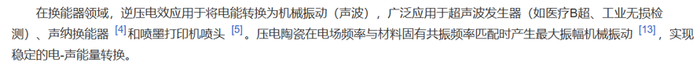

# 2026年吉林省公务员录用考试《行测》题（网友回忆版）

> 判断推理 · 25 题 · 吉林 2026

## 第 1 题　qid 16070186 · 定义判断

可编程物质是指一种可以根据用户输入或自主感应而以编程方式来改变自身物理性质的物质。
根据上述定义，下列不涉及可编程物质的是：

- **A**. 某智能水泥通过内嵌的传感器，自主控制水泥应力的释放以保持建筑物结构稳定
- **B**. 某智能布料由高分子复合纤维织成，输入不同电压会改变其电场，从而根据预设编码显现不同图案
- **C**. 通过添加纳米颗粒和化学反应物，某新型水泥可以实现自动修复裂缝和损坏，从而延长建筑的寿命　✅
- **D**. 某智能玻璃使用Socket网络编程技术，可根据外部光照强度和内部信号来改变透明度，调节室内光线以节省能源

**答案**：C

**官方解析**

第一步：找出定义关键词。
“根据用户输入或自主感应”、“以编程方式”、“改变自身物理性质”。
第二步：逐一分析选项。
A项：智能水泥通过内嵌的传感器自主控制应力的释放来保持建筑物结构稳定，属于“自主感应”、“以编程方式”、“改变自身物理性质”，符合定义，排除；
B项：智能布料通过输入不同电压改变电场，根据预设编码显现不同图案，属于“用户输入”、“以编程方式”、“改变自身物理性质”，符合定义，排除；
C项：新型水泥通过添加纳米颗粒和化学反应物实现自动修复，属于材料本身的化学特性，不符合“根据用户输入或自主感应”、“以编程方式”，不符合定义，当选；
D项：智能玻璃通过网络编程技术，根据外部光照强度和内部信号来改变透明度，属于“自主感应”、“以编程方式”、“改变自身物理性质”，符合定义，排除。
本题为选非题，故正确答案为C。

---

## 第 2 题　qid 16070188 · 定义判断

凯伊效应是指当一束高粘度的假塑性流体倾倒至固体表面时，固体表面会把液束向上反弹出去。其原理为快速下落的液束冲击下方堆积的黏性流体，流体表面因为受到冲击粘度变小，受到撞击后形成一个酒窝状的凹坑，同时粘度降低的表面充当了润滑剂的作用，最终使得下落的液束被反弹出去。
根据上述定义，下列属于凯伊效应的是：

- **A**. 用肥皂水冲洗勺子，肥皂水碰到勺子后会沿着勺子曲面流下去
- **B**. 在喷水池喷出的水柱上放乒乓球，水柱会托举乒乓球向上跳跃
- **C**. 水流冲过土壤中的孔隙或裂缝时，形成了类似管道的水流通道
- **D**. 将洗发水从高处快速倒向桌面，堆积的洗发水会突然跳起一束　✅

**答案**：D

**官方解析**

第一步：找出定义关键词。
“高粘度的假塑性流体倾倒至固体表面”、“液束向上反弹出去”。
第二步：逐一分析选项。
A项：肥皂水碰到勺子后沿着勺子曲面流下去，液束没有反弹，不符合“液束向上反弹出去”，不符合定义，排除；
B项：水柱托举乒乓球向上跳跃，不涉及液束反弹，不符合“液束向上反弹出去”，不符合定义，排除；
C项：水流冲过孔隙或裂缝形成类似管道的水流通道，不涉及液束反弹，不符合“液束向上反弹出去”，不符合定义，排除；
D项：将洗发水从高处快速倒向桌面，洗发水是高粘度假塑性流体，符合“高粘度的假塑性流体倾倒至固体表面”，堆积的洗发水突然跳起一束，符合“液束向上反弹出去”，符合定义，当选。
故正确答案为D。

---

## 第 3 题　qid 16070198 · 定义判断

某些电介质在沿一定方向上受到外力的作用而变形时，其内部会产生极化现象，同时在它的两个相对表面上出现正负相反的电荷。当外力去掉后，它又会恢复到不带电的状态，这种现象被称为正压电效应。相反，当在电介质的极化方向上施加电场，电介质会发生变形，电场去掉后，电介质的变形随之消失，这种现象被称为逆压电效应。
根据上述定义，下列体现了逆压电效应的是：

- **A**. 超声波清洗是利用超声波的机械振动来清洗物体表面　✅
- **B**. 液晶显示器利用液晶材料改变光通过的方向和强度，从而显示动态图像
- **C**. 打火机的打火器被按下后能瞬间产生高压，在极小的间隙下击穿空气，点燃气体
- **D**. 风力发电机工作时将风的动能转化为风轮轴的机械能，发电机在风轮轴的带动下旋转发电

**答案**：A

**官方解析**

第一步：找出定义关键词。

正压电效应：“电介质受外力作用变形”、“内部产生极化现象”、“两个相对表面出现正负相反电荷”、“外力去掉后恢复不带电状态”；

逆压电效应：“在电介质的极化方向上施加电场”、“电介质发生变形”、“电场去掉后，变形随之消失”。

第二步：逐一分析选项。

A项：超声波清洗是利用超声波的机械振动来清洗物体表面，超声波发生器在电介质极化方向施加电场，使电介质发生变形产生机械振动，符合“在电介质的极化方向上施加电场”、“电介质发生变形”，符合“逆压电效应”的定义，当选；

B项：液晶显示器利用液晶材料改变光通过的方向和强度，从而显示动态图像，液晶显示器仅通过电场改变液晶分子排列来控光，未涉及电介质的变形，不符合“在电介质的极化方向上施加电场”、“电介质发生变形”，不符合“逆压电效应”的定义，排除；

C项：打火机的打火器被按下后能瞬间产生高压，是对压电材料施加外力使其产生电荷，符合“电介质受外力作用变形”、“内部产生极化现象”、“两个相对表面出现正负相反电荷”，压力去掉后，电介质不带电，符合“外力去掉后恢复不带电状态”，符合“正压电效应”的定义，不符合“逆压电效应”的定义，排除；

D项：风力发电机将“风的动能”转化为“机械能”，发电机在风轮轴的带动下旋转发电，没有在电介质的极化方向上施加电场，不符合“在电介质的极化方向上施加电场”、“电介质发生变形”、“电场去掉后，变形随之消失”，不符合“逆压电效应”的定义，排除。

故正确答案为A。

本题定义内容专业性较强，选项也涉及专业领域知识，仅靠常识较难直接判断。在结合下图资料表述进行匹配，综合关键限定条件比对后，A项更符合定义要求，优选A项。

---

## 第 4 题　qid 17467530 · 定义判断

复冰现象是指当冰的表面受压，压力令其熔点降低，使得冰化成水，一旦压力消失，熔点提高至原来的水平，水又变为冰的现象。
根据上述定义，下列不属于复冰现象的是：

- **A**. 将两块水平放置的冰砖面对面压实，松手后两块冰砖粘在了一起
- **B**. 在一块很大的冰上放一条金属线，金属线两端分别连着两个重物，金属线缓慢穿越冰块而且不会将其切开
- **C**. 在滑冰场上滑冰时，冰刀留下道道痕迹，但很快刀痕会全部消失，留下完好如初的冰面
- **D**. 水结冰时，所释放的热量在其内部形成压力、产生气泡，这使得结成的冰看上去不透明　✅

**答案**：D

**官方解析**

第一步：找出定义关键词。
“冰受压化成水”、“压力消失水又变为冰”。
第二步：逐一分析选项。
A项：两块冰砖压实，说明冰在受压时先化成了水，松开粘一块说明刚刚化的水又结冰了，符合“冰受压化成水”、“压力消失水又变为冰”，符合定义，排除；
B项：金属线能够穿过冰，说明冰受压化成了水，金属线穿过之后压力解除，但冰不会被切开，说明水又结冰，符合“冰受压化成水”、“压力消失水又变为冰”，符合定义，排除；
C项：刀痕消失，说明冰刀离开冰面后，压力消失，水膜重新结冰，冰面恢复平整，符合“冰受压化成水”、“压力消失水又变为冰”，符合定义，排除；
D项：水结冰时内部产生压力和气泡，仅仅是水结冰的单向凝固过程，并没有体现冰化水现象，不符合“冰受压化成水”、“压力消失水又变为冰”，不符合定义，当选。
本题为选非题，故正确答案为D。

---

## 第 5 题　qid 17467562 · 定义判断

疤痕效应是指人在遭受创伤后，伤口经过一段时间的恢复会愈合，但留下的疤痕会时刻提醒人们过去的伤痛，并对人的心理造成持续的影响。在社会学中，疤痕效应泛指重大事件会使人们的行为模式趋于保守，更加厌恶风险，进而导致人们对于事物的看法和决策产生偏差。
根据上述定义，下列未体现疤痕效应的是：

- **A**. 一朝被蛇咬，十年怕井绳
- **B**. 经历台风袭击后，老刘会经常囤积一些非必要生活用品，以备不时之需
- **C**. 五年前老陈投资失败后，将所有积蓄存入银行，不再选择其他理财方式
- **D**. 杨教授儿时经历过饥荒，深刻理解粮食的重要性，矢志培育优质高产的小麦种子　✅

**答案**：D

**官方解析**

第一步：找出定义关键词。
“重大事件”、“趋于保守”、“更加厌恶风险”、“人们对于事物的看法和决策产生偏差”。
第二步：逐一分析选项。
A项：意思是被蛇咬伤的创伤事件后，长达十年里看到外形相似的绳子都会心生恐惧，被蛇咬属于重大创伤事件，怕井绳是行为上的风险回避，符合“重大事件”、“趋于保守”、“更加厌恶风险”、“人们对于事物的看法和决策产生偏差”，符合定义，排除；
B项：经历台风袭击后，符合“重大事件”，老刘经常囤积非必要生活用品，说明行为模式转为保守，决策因过往创伤出现偏差，符合“趋于保守”、“更加厌恶风险”、“人们对于事物的看法和决策产生偏差”，符合定义，排除；
C项：五年前投资失败后，符合“重大事件”，老陈将所有积蓄存银行，不再选择其他理财方式，说明他厌恶风险，决策因过往创伤发生根本性的保守转变，符合“趋于保守”、“更加厌恶风险”、“人们对于事物的看法和决策产生偏差”，符合定义，排除；
D项：杨教授儿时经历过饥荒，矢志培育优质高产的小麦种子，说明他主动投身科研，并未厌恶风险，而是将经历转化为解决问题的动力，不符合“趋于保守”、“更加厌恶风险”、“人们对于事物的看法和决策产生偏差”，不符合定义，当选。
本题为选非题，故正确答案为D。

---

## 第 6 题　qid 16070200 · 逻辑判断

端粒是染色体末端的一段重复的核苷酸序列。当端粒长度变得非常短时，就更容易导致细胞的衰老和凋亡。有研究发现，每天每增加一杯速溶咖啡摄入量，端粒长度对应的等效年龄减少0.38年，因而速溶咖啡摄入量与端粒长度呈负相关。不过，研究结果也显示，研磨咖啡摄入量与端粒长度的相关性没有统计学意义，不能证实研磨咖啡也会减少端粒长度对应的等效年龄。该研究认为，饮用速溶咖啡会导致衰老，饮用研磨咖啡则不会，因而后者更健康。
以下哪项如果为真，不能支持上述结论？

- **A**. 速溶咖啡中往往会添加白砂糖、乳粉等，这些成分容易导致衰老
- **B**. 实验中使用的部分速溶咖啡样本，其实是现场研磨咖啡豆制作的　✅
- **C**. 与相同量的研磨咖啡相比较，速溶咖啡中导致衰老的铅含量更高
- **D**. 制作研磨咖啡时，会使用滤纸吸附咖啡白醇等对人体有害的物质

**答案**：B

**官方解析**

第一步：找出论点和论据。
论点：饮用速溶咖啡会导致衰老，饮用研磨咖啡则不会，因而后者更健康。
论据：每天每增加一杯速溶咖啡摄入量，端粒长度对应的等效年龄减少0.38年，因而速溶咖啡摄入量与端粒长度呈负相关。不过，研究结果也显示，研磨咖啡摄入量与端粒长度的相关性没有统计学意义，不能证实研磨咖啡也会减少端粒长度对应的等效年龄。
本题论点与论据都在说饮用速溶咖啡会导致衰老，但饮用研磨咖啡则不会。论点和论据话题一致，加强优先考虑补充论据，即解释原因或举例子，且本题为选非题，将可以加强的选项排除即可。
第二步：逐一分析选项。
A项：该项讨论的是速溶咖啡中往往会添加白砂糖、乳粉等，这些成分容易导致衰老，解释了为什么饮用速溶咖啡会导致衰老，补充论据，可以加强，排除；
B项：该项讨论的是实验中使用的部分速溶咖啡样本，其实是现场研磨咖啡豆制作的，那么就不确定造成衰老的是否为速溶咖啡，说明实验不科学、不准确，可以削弱，不能加强，当选；
C项：该项讨论的是与相同量的研磨咖啡相比较，速溶咖啡中导致衰老的铅含量更高，说明饮用速溶咖啡会导致衰老，饮用研磨咖啡则相较不会，补充论据，可以加强，排除；
D项：该项讨论的是制作研磨咖啡时，会使用滤纸吸附咖啡白醇等对人体有害的物质，解释了为什么饮用研磨咖啡会更加健康，补充论据，可以加强，排除。
本题为选非题，故正确答案为B。

---

## 第 7 题　qid 16070197 · 逻辑判断

鱼通过鳃的呼吸作用，从水中吸收钙离子，进入耳石囊内与碳酸根离子结合形成碳酸钙、随后沉积形成耳石，它具有维持鱼身平衡及辅助听觉的作用。鱼耳石的日周轮、年轮和产卵轮等时间记号，记录了鱼类生长过程中的环境信息。通过分析鱼耳石形态和化学组成等方式，我们可以了解鱼类生活史特征及其栖息环境的变化。
以下哪项如果为真，最能加强上述论证？

- **A**. 许多鱼类的寿命可长达数十年之久
- **B**. 环境污染可能导致鱼停止生长甚至死亡
- **C**. 不同鱼类的耳石大小不同，难以据此判断鱼类的生长环境情况
- **D**. 相对于鳞片、鳍条，鱼耳石的形态结构和化学组成更稳定，保存时间更长　✅

**答案**：D

**官方解析**

第一步：找出论点和论据。
论点：通过分析鱼耳石形态和化学组成等方式，我们可以了解鱼类生活史特征及其栖息环境的变化。
论据：鱼耳石的日周轮、年轮和产卵轮等时间记号，记录了鱼类生长过程中的环境信息。
本题论点和论据均在讨论“分析鱼耳石有助于了解鱼类生活的环境”，二者话题一致，加强可以考虑补充论据。
第二步：逐一分析选项。
A项：该项说的是许多鱼类的寿命很长，而论点讨论的是分析鱼耳石有助于了解鱼类生活的环境，话题不一致，不能加强，排除;
B项：该项说的是环境污染对鱼的不良影响，而论点讨论的是分析鱼耳石有助于了解鱼类生活的环境，话题不一致，不能加强，排除;
C项：该项说的是根据耳石难以判断鱼类的生长环境，是对论点进行削弱，不能加强，排除;
D项：该项说的是鱼耳石形态结构和化学组成更稳定，保存时间更长，补充论据说明鱼耳石在了解鱼类的生活史特征及其栖息环境的变化方面更有优势，可以加强，当选。
故正确答案为D。

---

## 第 8 题　qid 16070203 · 逻辑判断

一项关于离子通道Piezo2的介导性慢性疼痛超敏反应功能的研究表明，Piezo2是一个机械敏感通道，会在压力的刺激下激活伤害性感受器，当Piezo2发生功能丧失型突变时，患者对轻微的触摸或振动不再敏感；当它发生功能获得型突变时，患者通常被诊断为其它疾病。
以下哪项如果为真，最能削弱上述结论？

- **A**. 有的慢性疼痛综合征患者的伤害性感受器在无机械刺激时仍然活跃
- **B**. 有的Piezo2功能丧失型突变患者在强烈挤压皮肤时激活了伤害性感受器
- **C**. 有的患者发生Piezo2功能获得型突变，被诊断出患有复杂发育障碍疾病
- **D**. 有的患者发生Piezo2功能丧失型突变，伤害性感受器对机械刺激更敏感　✅

**答案**：D

**官方解析**

第一步：找出论点和论据。
论点：Piezo2是一个机械敏感通道，会在压力的刺激下激活伤害性感受器，当Piezo2发生功能丧失型突变时，患者对轻微的触摸或振动不再敏感；当它发生功能获得型突变时，患者通常被诊断为其它疾病。
论据：无。
本题论点讨论的是Piezo2会在压力的刺激下激活伤害性感受器，并给出Piezo2功能丧失型突变和功能获得型突变的两种表现。只有论点，没有论据，削弱优先考虑削弱论点。
第二步：逐一分析选项。
A项：该项指出有的慢性疼痛综合征患者伤害性感受器在“无机械刺激时”仍活跃，而论点讨论的是Piezo2通道在“压力刺激时”的表现，话题不一致，无法削弱，排除；
B项：该项指出有的Piezo2功能丧失型突变患者在“强烈挤压皮肤时”激活了伤害性感受器，但不明确其在“轻微的触摸或振动时”是否能激活伤害性感受器，不明确选项，无法削弱，排除；
C项：该项指出有的患者发生Piezo2功能获得型突变，被诊断出患有复杂发育障碍疾病，对论点中“发生功能获得型突变时，患者通常被诊断为其它疾病”进行支持，具有一定加强力度，无法削弱，排除；
D项：该项指出有的患者发生Piezo2功能丧失型突变，伤害性感受器对机械刺激更敏感，举例削弱论点中“Piezo2发生功能丧失型突变时，患者对轻微的触摸或振动不再敏感”，削弱论点，可以削弱，当选。
故正确答案为D。

---

## 第 9 题　qid 16070202 · 逻辑判断

近年来，东海海域经常出现鲸搁浅现象，海洋学家推测是因为东海海岸线很长，而且这里拥有丰富的浮游生物和鱼类资源，容易引鲸洄游至此，进而导致鲸搁浅的现象发生。
以下描写鲸搁浅的选项中，最能支持上述结论的是（    ）。

- **A**. 闰鱼，无定形，闰年秋潮，飓风推出海，其大吞舟也
- **B**. 房鱼，出海，极大，如房。或随潮汐陷沙上，土人割脂熬油
- **C**. 大凡东海有巨鱼流入内地者，必无目，无目，故随潮而进也
- **D**. 见大鲸驱群鲛，逐肥鱼于渤澥之尾······贪而不能止，北蹙于碣石，槁焉　✅

**答案**：D

**官方解析**

第一步：找出论点和论据。
论点：东海海岸线很长，且拥有丰富的浮游生物和鱼类资源，容易引鲸洄游至此，进而导致鲸搁浅的现象发生。
论据：无。
本题只有论点，没有论据，加强优先考虑补充论据。
第二步：逐一分析选项。
A项：该项翻译为：一种只在闰年出现的、形态不定的鱼（闰鱼），在闰年秋季的大潮期间，被风暴推上海岸，其体型巨大到足以吞没船只。该项表明巨鱼是被飓风推上岸的，与论点中“食物吸引洄游导致搁浅”无关，话题不一致，无法加强，排除；
B项：该项翻译为：房鱼，出现在海里，体型极大，如同房屋一般。有时会随着潮汐搁浅在沙滩上，当地人便割取其脂肪来熬油。该项表明巨鱼因潮汐被困沙滩，与论点中“食物吸引洄游导致搁浅”无关，话题不一致，无法加强，排除；
C项：该项翻译为：凡是东海有巨大的鱼流入内陆水域的，必定没有眼睛，因为没有眼睛，所以只能随着潮水进退。该项表明巨鱼因无目才随潮水进入内地搁浅，与论点中“食物吸引洄游导致搁浅”无关，话题不一致，无法加强，排除；
D项：该项翻译为：看到大鲸驱赶一群鲨鱼，追逐肥美的鱼群于渤海近海区域······因为贪食无法停止，最终向北困于碣石一带，最终干涸搁浅。该项表明鲸鱼是追逐食物（鱼类资源）而来，最终搁浅，补充论据，可以加强，当选。
故正确答案为D。

---

## 第 10 题　qid 16070201 · 图形推理

近日，考古学家发现了一块展示约1.25亿年前肉食性哺乳动物爬兽袭击较大植食性恐龙鹦鹉嘴龙的化石。化石中，鹦鹉嘴龙呈俯卧姿态，后肢折叠在身体两侧；爬兽的身体向右盘绕，俯坐在鹦鹉嘴龙背侧，抓扒着猎物的下巴并撕咬肋骨，其小腿则被鹦鹉嘴龙的后腿夹住。研究者认为，这一发现挑战了“恐龙在白垩纪期间几乎没有受到同时代哺乳动物威胁”的观点。
以下哪项如果为真，最不能支持上述研究者的结论？

- **A**. 已能够确认爬兽与鹦鹉嘴龙纠缠在一起并同时葬身于火山喷发　✅
- **B**. 在发现该标本前就有其他观点认为爬兽会捕食鹦鹉嘴龙等恐龙
- **C**. 通过恐龙骨架上的牙印证明了爬兽当时正啃食鹦鹉嘴龙的尸体
- **D**. 在一块爬兽标本的胃中曾发现有鹦鹉嘴龙幼年个体的骨骼残留

**答案**：A

**官方解析**

第一步：找出论点和论据。

论点：恐龙在白垩纪期间受到过同时代哺乳动物威胁。

论据：考古学家发现了一块展示约1.25亿年前肉食性哺乳动物爬兽袭击较大植食性恐龙鹦鹉嘴龙的化石。化石中，鹦鹉嘴龙呈俯卧姿态，后肢折叠在身体两侧；爬兽的身体向右盘绕，俯坐在鹦鹉嘴龙背侧，抓扒着猎物的下巴并撕咬肋骨，其小腿则被鹦鹉嘴龙的后腿夹住。

从论据“化石显示二者身体纠缠在一起”到论点“恐龙受到过威胁”，注意身体纠缠威胁，所以论据到论点的推理是有漏洞的，可以补充论据填补漏洞，也可以直接加强论点。

第二步：逐一分析选项。

A项：该项指出能够确认爬兽与鹦鹉嘴龙纠缠在一起，论据讨论的也是二者在化石中呈现的纠缠在一起的形态，所以该项的表述是对论据内容的重复，保留；

B项：该项指出在发现该标本前就有其他观点认为爬兽会捕食恐龙，补充了其他观点的论据说明哺乳动物对恐龙有威胁，保留；

C项：该项指出可证明爬兽当时正啃食鹦鹉嘴龙的尸体，结合论据中“二者身体纠缠在一起”的表述，说明在鹦鹉嘴龙死之前有和爬兽纠缠的过程，可体现出哺乳动物对恐龙的威胁，保留；

D项：该项指出在爬兽标本的胃中发现有鹦鹉嘴龙幼年个体的骨骼残留，结合论据中“二者身体纠缠在一起”的表述，说明爬兽对恐龙有威胁，保留；

对比四个选项，从论据“纠缠”到论点“威胁”，

A还在说纠缠，重复论据

B举例加强论点，确实在捕食，有威胁

论据（纠缠）+C（捕食），可以推出论点（威胁）

论据（纠缠）+D（捕食），可以推出论点（威胁）

B、C、D三项均从其他角度补充了论据，证明了可能有“威胁”，只有A项是对题干论据的重复，对于加强而言，补充其他角度的论据比单纯重复题干论据更有说服力，因此，对比择优，A项最不能支持。

本题为选非题，故正确答案为A。

---

## 第 11 题　qid 16070289 · 逻辑判断

紫杉醇是治疗癌症的明星药物。紫杉醇通过作用于细胞内的微管蛋白，保持微管的稳定性来抑制细胞的有丝分裂，控制癌细胞发展，从而达到治疗目的。香榧中含有紫杉醇，因此，有观点认为，多食用香榧可以治疗癌症。
以下哪项如果为真，最能削弱上述结论？

- **A**. 紫杉醇对正常细胞产生的影响目前还未可知
- **B**. 香榧中紫杉醇含量微乎其微，几乎可以忽略不计　✅
- **C**. 香榧含有丰富的蛋白质，可以增强癌症患者的免疫力
- **D**. 对于分裂速度比正常细胞快的癌细胞，紫杉醇表现出更明显的抑制作用

**答案**：B

**官方解析**

第一步：找出论点和论据。
论点：多食用香榧可以治疗癌症。
论据：香榧中含有紫杉醇，紫杉醇通过作用于细胞内的微管蛋白，保持微管的稳定性来抑制细胞的有丝分裂，控制癌细胞发展，从而达到治疗目的。
本题论点在讨论“多食用香榧可以治疗癌症”，论据在讨论“香榧中的紫杉醇能治疗癌症”，论点和论据话题不一致，削弱优先考虑拆桥，即拆断“食用香榧”和“紫杉醇”之间的联系。
第二步：逐一分析选项。
A项：该项指出“紫杉醇对正常细胞产生的影响目前还未可知”，而题干讨论的是“紫杉醇对癌细胞的影响”，话题不一致，无法削弱，排除；
B项：论点讨论的是“多食用香榧可以治疗癌症”，原因是“香榧中的紫杉醇能治疗癌症”，该项指出“香榧中紫杉醇含量微乎其微，几乎可以忽略不计”，即不能通过日常食用香榧取得治疗癌症的效果，断开了论点和论据之间的联系，为拆桥项，可以削弱，当选；
C项：该项指出“香榧可以增强癌症患者的免疫力”，但增强免疫力不等于可以治疗癌症，话题不一致，无法削弱，排除；
D项：该项指出“紫杉醇能抑制癌细胞”，补充论据，为加强项，无法削弱，排除。
故正确答案为B。

---

## 第 12 题　qid 17467563 · 类比推理

小王把仙女座、猎户座、大熊座、人马座、狮子座五个星座在星空图上的位置用A、B、C、D、E随机标记。已知：如果仙女座或猎户座中有一个在位置C上，则大熊座在位置B上；如果狮子座在位置C上，则人马座在位置E上。
如果人马座在位置B上，那么下列哪项必然为真？

- **A**. 大熊座在位置C上　✅
- **B**. 狮子座在位置C上
- **C**. 仙女座在位置C上
- **D**. 猎户座在位置C上

**答案**：A

**官方解析**

第一步：翻译题干条件。

（1）仙女座在位置C 或 猎户座在位置C大熊座在位置B；

（2）狮子座在位置C人马座在位置E；

（3）人马座在位置B。

第二步：根据题干条件进行推理。

根据条件（3）人马座在位置B，可知大熊座不在位置B，是对条件（1）的否后，根据否后必否前，可以推出仙女座不在位置C且猎户座不在位置C，排除C、D两项；

根据条件（3）人马座在位置B，可知人马座不在位置E，是对条件（2）的否后，根据否后必否前，可以推出狮子座不在位置C，排除B项。

故正确答案为A。

---

## 第 13 题　qid 16070213 · 逻辑判断

某研究团队发布了一项关于视觉感知对热舒适判断影响机制的研究，研究选取典型景观实景照片在实验室进行视觉刺激实验，从心理、行为、生理三个维度展开互证，发现人们通过快速扫视捕获热环境相关景观要素信息，视觉感知信息结合个体热联想经验会转换为热舒适判断，且视觉刺激引发的皮电变化率与阴影、植物总体占比率呈显著正相关，说明阴影和植物总体占比率可能是影响公园热舒适体验的关键因素。
要使上述结论成立，还需基于以下哪一前提?

- **A**. 光照强度变化不会通过非视觉途径影响皮电反应及热舒适判断
- **B**. 阴影和植物总体占比率高的区域，实际热环境温度通常更低
- **C**. 个体热联想经验主要源于日常生活中的户外环境体验
- **D**. 皮电变化率可作为衡量人体热舒适感受的指标　✅

**答案**：D

**官方解析**

第一步：找出论点和论据。
论点：阴影和植物总体占比率可能是影响公园热舒适体验的关键因素。
论据：人们通过快速扫视捕获热环境相关景观要素信息，视觉感知信息结合个体热联想经验会转换为热舒适判断，且视觉刺激引发的皮电变化率与阴影、植物总体占比率呈显著正相关。
本题论点讨论的是“阴影和植物总体占比率”和“热舒适体验”之间的关系，论据讨论的是“皮电变化率”和“阴影和植物总体占比率”之间的关系，二者话题不一致，加强优先考虑搭桥，即在“热舒适体验”和“皮电变化率”之间建立联系。
第二步：逐一分析选项。
A项：该项强调的是光照强度变化不会通过非视觉途径影响皮电反应及热舒适判断，说明实验中关于视觉感知对热舒适判断的影响研究是严谨的，有一定的加强力度，但不是上述论证成立的前提，排除；
B项：该项强调的是阴影和植物总体占比率高的区域实际温度反而更低，而论点讨论的是影响公园热舒适体验的关键因素是阴影和植物总体占比率，话题不一致，无法加强，排除；
C项：该项指出个体热联想经验的来源是户外环境体验，而论点讨论的是影响公园热舒适体验的关键因素是阴影和植物总体占比率，话题不一致，无法加强，排除；
D项：该项指出衡量人体热舒适感受的指标是皮电变化率，建立了“皮电变化率”和“热舒适体验”之间的联系，为搭桥项，是论证成立的前提，当选。
故正确答案为D。

---

## 第 14 题　qid 16070293 · 逻辑判断

研究人员发现，与摄入盐水的对照组小鼠相比，摄入葡萄球菌肠毒素SEA的小鼠会出现明显干呕现象。人类癌症患者使用化疗药物也会有类似的恶心和呕吐反应。研究显示，小鼠肠道内的SEA毒素激活了肠内壁的肠嗜铬细胞，释放出血清素，血清素又与肠道的感觉神经元受体结合，将信号传递到脑干中的特定神经元从而引发干呕，当特定神经元被灭活后，小鼠干呕显著减少。研究还发现，特定神经元被灭活后，其他动物的干呕也会显著减少。
由此可以推出：

- **A**. 如果不摄入葡萄球菌肠毒素，那么小鼠就不会出现干呕现象
- **B**. 开发出灭活特定神经元的药物或能帮助化疗病人减少呕吐　✅
- **C**. SEA毒素与肠道的感觉神经元受体结合会引发动物的干呕
- **D**. 切断小鼠脑干中特定神经元的信号传递或能引发干呕

**答案**：B

**官方解析**

日常结论题，根据题干信息逐一分析选项。
A项：题干指出“摄入葡萄球菌肠毒素SEA的小鼠会出现明显干呕现象”，并未提到不摄入葡萄球菌肠毒素的情况，无法推出，排除；
B项：题干指出“人类癌症患者使用化疗药物也会有类似的恶心和呕吐反应”和“当特定神经元被灭活后，小鼠干呕显著减少。研究还发现，特定神经元被灭活后，其他动物的干呕也会显著减少”，说明灭活特定神经元能减少动物干呕，而化疗呕吐与此相似，因此开发出灭活特定神经元的药物有可能帮助化疗病人减少呕吐，可以推出，当选；
C项：题干指出“小鼠肠道内的SEA毒素激活了肠内壁的肠嗜铬细胞，释放出血清素，血清素又与肠道的感觉神经元受体结合，将信号传递到脑干中的特定神经元从而引发干呕”，说明与受体结合的是血清素，并非SEA毒素，无法推出，排除；
D项：题干指出“当特定神经元被灭活后，小鼠干呕显著减少”，说明切断信号传递能够减少干呕，而非引发干呕，无法推出，排除。
故正确答案为B。

---

## 第 15 题　qid 17467534 · 逻辑判断

青藏高原被誉为“亚洲水塔”，是全球气候变化敏感区和指示区。这里分布着地球海拔最高数量最多的高原湖泊群，面积约占全国的百分之五十，对区域水循环、生态环境和气候调节具有重要意义。如果青藏高原降水增加或者冰川加速消融，那么青藏高原的湖泊将会持续扩张，并且导致潜在的流域合并或重组，威胁到该地区的基础设施和生态安全。由此可以推出：

- **A**. 如果青藏高原的湖泊没有持续扩张，那么青藏高原的降水没有增加且冰川并没有加速消融　✅
- **B**. 如果青藏高原降水增加或者冰川加速消融，将会导致其潜在的流域合并
- **C**. 如果青藏高原降水没有增加，那么其潜在的流域没有合并和重组
- **D**. 如果青藏高原的流域合并或重组，那么青藏高原降水增加

**答案**：A

**官方解析**

第一步：翻译题干。

青藏高原降水增加 或 冰川加速消融（青藏高原的湖泊将会持续扩张） 且 （潜在的流域合并 或 重组）。

第二步：逐一分析选项。

A项：翻译为：青藏高原的湖泊将会持续扩张青藏高原降水增加 且 冰川加速消融，是否定题干箭头后“且关系”的一部分，否后必否前，可以推出，当选；

B项：翻译为：青藏高原降水增加 或 冰川加速消融潜在的流域合并，是对题干的肯前，肯前必肯后，应推出“潜在的流域合并 或 重组”，而非“潜在的流域合并”，不能推出，排除；

C项：翻译为：青藏高原降水增加潜在的流域合并和重组，是否定题干箭头前“或关系”的一部分，不是否前，且否前得不到确定结论，不能推出，排除；

D项：翻译为：青藏高原的流域合并 或 重组青藏高原降水增加，是肯定题干箭头后“且关系”的一部分，不是肯后，且肯后得不到确定结论，不能推出，排除。

故正确答案为A。

---

## 第 16 题　qid 17467529 · 图形推理

从所给的四个选项中，选择最合适的一个填入问号处，使之呈现一定的规律性。

- **A**. A
- **B**. B　✅
- **C**. C
- **D**. D

**答案**：B

**官方解析**

元素组成不同，且无明显属性规律，考虑数量规律。观察发现，题干图形出现明显封闭区域，优先考虑数面。题干图形的面数量依次为10、9、8、？、6、5，故“？”处图形的面数量应为7，只有B项符合。
故正确答案为B。

---

## 第 17 题　qid 16070180 · 图形推理

把下面的六个图形分为两类，使每一类图形都有各自的共同特征或规律，分类正确的一项是：

- **A**. ①②④，③⑤⑥
- **B**. ①②⑥，③④⑤
- **C**. ①③⑥，②④⑤　✅
- **D**. ①④⑥，②③⑤

**答案**：C

**官方解析**

本题为分组分类题目。元素组成相似，且相同元素“圆”重复出现，优先考虑样式规律中的遍历。观察发现，图①③⑥中的圆均位于图形内部，图②④⑤中的圆均位于图形外部，即图①③⑥为一组，图②④⑤为一组。
故正确答案为C。

---

## 第 18 题　qid 16070177 · 图形推理

从所给的四个选项中，选择最合适的一个填入问号处，使之呈现一定的规律：

- **A**. A
- **B**. B
- **C**. C
- **D**. D　✅

**答案**：D

**官方解析**

元素组成不同，且无明显属性规律，考虑数量规律。观察发现，题干图形均由黑块和白块构成，且分堆明显，考虑部分数。第一组图，黑块部分数明显无规律，白块部分数为2、3、4，依次递增1；第二组图，前两幅图白块部分数依次为2、3，故问号处图形白块部分数应为4，对应D项。
故正确答案为D。

---

## 第 19 题　qid 16070182 · 图形推理

左图是一个带把手的立方体纸盒，右边哪项可能是其外表面展开图？

- **A**. A
- **B**. B　✅
- **C**. C
- **D**. D

**答案**：B

**官方解析**

A项：数字1的面和数字4的面为相对面，相对面不能同时出现，选项展开图与题干立体图不一致，排除；
B项：选项展开图与题干立体图一致，当选；
C项：题干立体图中，数字4的面和数字6的面中的数字书写方向是一致的，而选项中这两个面中的数字书写方向不一致，选项展开图与题干立体图不一致，排除；
D项：题干立体图中，数字4的面和数字6的面中的数字书写方向是一致的，而选项中这两个面中的数字书写方向不一致，选项展开图与题干立体图不一致，排除。
故正确答案为B。

---

## 第 20 题　qid 16070184 · 图形推理

从所给的四个选项中，选择最合适的一个填入问号处，使之呈现一定的规律性：

- **A**. A
- **B**. B　✅
- **C**. C
- **D**. D

**答案**：B

**官方解析**

本题考查立体拼合。第一组图的图一由图二和图三拼合而成，第二组图的图一也应由图二与“？”处图形拼合而成，对应B项。 

故正确答案为B。

---

## 第 21 题　qid 16069970 · 类比推理

寓意：寓言

- **A**. 序言：正文
- **B**. 情节：童话　✅
- **C**. 报告文学：新闻
- **D**. 著作：诗集

**答案**：B

**官方解析**

第一步：判断题干词语间逻辑关系。
寓言是用假托的故事或自然物的拟人手法来说明某个道理或教训的文学作品，寓意是寓言所包含的核心内涵，二者是组成关系。
第二步：判断选项词语间逻辑关系。
A项：序言和正文是同一篇作品里的两个组成部分，二者是并列关系，与题干逻辑关系不一致，排除；
B项：童话是通过丰富的想象、幻想和夸张来编写的适合于儿童欣赏的故事，情节是童话的核心组成部分，二者是组成关系，与题干逻辑关系一致，当选；
C项：报告文学是一种散文体裁，以现实生活中具有典型意义的真人真事为题材,经过适当的艺术加工而成,兼有新闻报道特点，报告文学和新闻不是组成关系，与题干逻辑关系不一致，排除；
D项：所有诗集都是著作，二者是种属关系，与题干逻辑关系不一致，排除。
故正确答案为B。

---

## 第 22 题　qid 16069965 · 类比推理

照相机：凸透镜：照相

- **A**. 火炕：煤炭：取暖
- **B**. 潜水艇：鱼鳔：潜水
- **C**. 飞机：起落架：飞行
- **D**. 微波炉：磁控管：烹饪　✅

**答案**：D

**官方解析**

第一步：判断题干词语间逻辑关系。
凸透镜是照相机的组成部分，二者为组成关系；照相是照相机的功能，且该功能依靠凸透镜实现。
第二步：判断选项词语间逻辑关系。
A项：煤炭在火炕里，二者为地点对应关系，不是组成关系，与题干逻辑关系不一致，排除；
B项：鱼鳔是潜水艇设计灵感的来源，二者为仿生对应关系，不是组成关系，与题干逻辑关系不一致，排除；
C项：起落架是飞机的组成部分，二者为组成关系；飞行是飞机的功能，但起落架的主要功能是帮助飞机起落，而非在飞行过程中使用，因此飞行功能不依靠起落架实现，与题干逻辑关系不一致，排除；
D项：磁控管是微波炉的组成部分，二者为组成关系；烹饪是微波炉的功能，且该功能依靠磁控管实现，与题干逻辑关系一致，当选。
故正确答案为D。

---

## 第 23 题　qid 16070195 · 类比推理

（    ）对于 庐山 相当于 车水马龙 对于（    ）

- **A**. 游人如织 街市　✅
- **B**. 惊鸿一瞥 人群
- **C**. 天然画卷 剧场
- **D**. 鬼斧神工 陋巷

**答案**：A

**官方解析**

逐一代入选项。
A项：游人如织形容游人多得像织布的线一样，密密麻麻，可以用来形容庐山的景象，二者为特点与描述对象的对应关系；车水马龙指车如流水，马如游龙一般，形容热闹繁华的景象，可以用来形容街市，二者为特点与描述对象的对应关系，前后逻辑关系一致，当选；
B项：惊鸿一瞥指人只是匆匆看了一眼，却给人留下极深的印象，与庐山无明显逻辑关系；车水马龙指车如流水，马如游龙一般，形容热闹繁华的景象，不能用来形容人群，前后逻辑关系不一致，排除；
C项：天然画卷指自然形成的、未经人工加工修饰的美丽景观，可以用来形容庐山的景象；车水马龙指车如流水，马如游龙一般，形容热闹繁华的景象，不能用来形容剧场，前后逻辑关系不一致，排除；
D项：鬼斧神工原意是像鬼神制作出来的，形容艺术技巧高超，不像是人力所能达到的，可以用来形容庐山的景象；车水马龙指车如流水，马如游龙一般，形容热闹繁华的景象，不能用来形容陋巷，前后逻辑关系不一致，排除。
故正确答案为A。

---

## 第 24 题　qid 17467537 · 类比推理

光刻机 对于 （    ） 相当于 （    ） 对于 核燃料

- **A**. 芯片  离心机　✅
- **B**. 计算器  核电站
- **C**. 光盘  压铸机
- **D**. 紫外线光源  核裂变

**答案**：A

**官方解析**

逐一代入选项。
A项：光刻机是生产芯片的设备，二者为生产设备与产品的对应关系；离心机是生产核燃料的设备，二者为生产设备与产品的对应关系，前后逻辑关系一致，当选；
B项：光刻机是生产计算器中的芯片的设备，二者对应关系；核燃料是核电站的能量来源，二者为能量来源的对应关系，前后逻辑关系不一致，排除；
C项：光刻机是生产芯片的设备，光盘是一种利用激光扫描记录和读取信息的光学存储介质，二者没有明显逻辑关系；压铸机是用于压力铸造的机器，核燃料是可在核反应堆中通过核裂变或核聚变释放核能的材料，二者没有明显逻辑关系，前后逻辑关系不一致，排除；
D项：紫外线光源是光刻机的组成部分，二者为组成关系；核裂变是核燃料释放能量的方式，二者为对应关系，前后逻辑关系不一致，排除。
故正确答案为A。

---

## 第 25 题　qid 17467543 · 类比推理

清明：传统节日：春节

- **A**. 神话：民间文学：舞蹈
- **B**. 手机：家用电器：冰箱
- **C**. 电话：通讯工具：快递
- **D**. 足球：体育用品：哑铃　✅

**答案**：D

**官方解析**

第一步：判断题干词语间逻辑关系。
清明和春节都是传统节日，二者为并列关系中的反对关系，且均与第二个词构成包容关系中的种属关系。
第二步：判断选项词语间逻辑关系。
A项：舞蹈不是民间文学，后两词不构成种属关系，与题干逻辑关系不一致，排除；
B项：手机不是家用电器，前两词不构成种属关系，与题干逻辑关系不一致，排除；
C项：快递不是通讯工具，后两词不构成种属关系，与题干逻辑关系不一致，排除；
D项：足球和哑铃都是体育用品，二者为反对关系，且均与第二个词构成种属关系，与题干逻辑关系一致，当选。
故正确答案为D。

---
