# 2026年四川省考/选调公务员录用考试《行测》试题（网友回忆版）

> 判断推理 · 30 题 · 四川 2026

## 第 1 题　qid 18643911 · 图形推理

从所给的四个选项中，选择最合适的一个填入问号处，使之呈现一定的规律性：

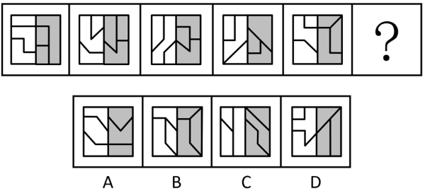

- **A**. A
- **B**. B
- **C**. C
- **D**. D　✅

**答案**：D

**官方解析**

元素组成不同，且无明显属性规律，考虑数量规律。观察发现，题干图形分割明显，可考虑面数量，但题干及所有选项均为3个白色面和3个灰色面，无法排除。继续观察发现，题干图形均由多个面拼接而成，可考虑图形间关系。题干图形均可划分为左侧白色区域与右侧灰色区域，分别观察，左侧白色区域内均存在一个面将另外两个面完全分隔开，即有两个面相离，其余面两两相交于边，排除B、C两项；右侧灰色区域内所有面均两两相交于边，只有D项符合。
故正确答案为D。

---

## 第 2 题　qid 18643912 · 图形推理

从所给的四个选项中，选择最合适的一个填入问号处，使之呈现一定的规律性:

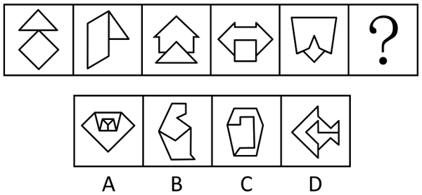

- **A**. A
- **B**. B
- **C**. C
- **D**. D　✅

**答案**：D

**官方解析**

元素组成不同，且每幅图均为两个图形拼合而成，优先考虑图形间关系。观察发现，图1中两个图形相交于点，而图2、3、4、5中两个图形均相交于线，且相交于线的数量依次为1、2、3、4。由此可知，题干中两个图形的公共边数量依次为0、1、2、3、4，故问号处两个图形公共边的数量应为5，只有D项符合。
故正确答案为D。

---

## 第 3 题　qid 18643914 · 图形推理

从所给的四个选项中，选择最合适的一个填入问号处，使之呈现一定的规律性： 

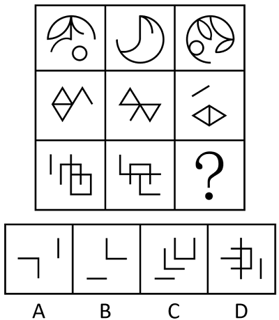

- **A**. A
- **B**. B　✅
- **C**. C
- **D**. D

**答案**：B

**官方解析**

元素组成相似，优先考虑样式规律。图形中有相同线条重复出现，考虑加减同异。九宫格优先看横行，第一行中，图1和图2求异后再顺时针旋转得到图3；经验证，第二行满足此规律；第三行应用此规律，故“？”处应选择一个图1和图2先求异再顺时针旋转得到的图形，只有B项符合。

故正确答案为B。

---

## 第 4 题　qid 18643890 · 图形推理

下面四个图形，可以拼合（只可上下左右平移）成选项中的哪一个图形？

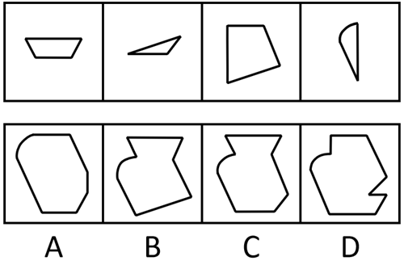

- **A**. A
- **B**. B
- **C**. C　✅
- **D**. D

**答案**：C

**官方解析**

本题考查平面拼合，可采用平行且等长相消的方式解题。消去平行且等长的线段后进行组合即可得到轮廓图，即为C项。平行且等长相消的方式如下图所示：

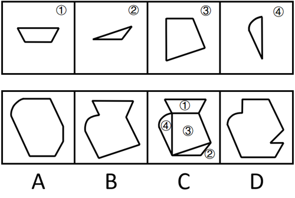

故正确答案为C。

---

## 第 5 题　qid 18643899 · 图形推理

左图给定的是纸盒的外表面，下列哪一项能由它所折叠而成？

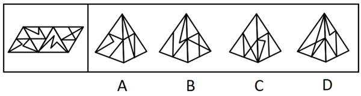

- **A**. A
- **B**. B
- **C**. C　✅
- **D**. D

**答案**：C

**官方解析**

将题干展开图标上序号，如下图所示，逐一进行分析。

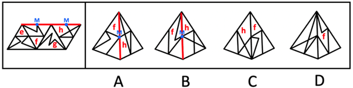

A项：选项由面f和面h组成，将两个面公共边的中点标记为M点，选项中面f的M点引出的线与题干展开图不一致，排除；

B项：选项由面f和面h组成，将两个面公共边的中点标记为M点，选项中面h的M点引出的线与题干展开图不一致，排除；

C项：选项由面f和面h组成，选项与题干展开图一致，当选；

D项：选项左侧面在题干展开图中未出现，选项与题干展开图不一致，排除。

故正确答案为C。

---

## 第 6 题　qid 18643913 · 图形推理

下图为给定的多面体及其外表面展开图，问数字1、2、3、4、5、6、7、8代表的棱的对应关系为：

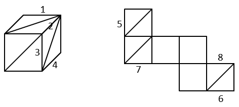

- **A**. 1——7，2——5，3——6，4——8
- **B**. 1——6，2——5，3——8，4——7
- **C**. 1——7，2——6，3——5，4——8　✅
- **D**. 1——8，2——6，3——5，4——7

**答案**：C

**官方解析**

将多面体的面分别标为e、f、g，如下图所示：

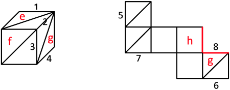

在多面体中g面中有两条边2、4为相对边关系，展开图中只有6、8在同一个面中且符合相对边关系，因而6、8所在面即为g面，且2、4与6、8对应，展开图中8与h面的空白边是公共边，而多面体中2与e面的边是公共边，所以8应该对应4，6应该对应2，观察选项，只有C项满足。

故正确答案为C。

---

## 第 7 题　qid 18643877 · 图形推理

把下面的六个图形分为两类，使每一类图形都有各自的共同特征或规律，分类正确的一项是：

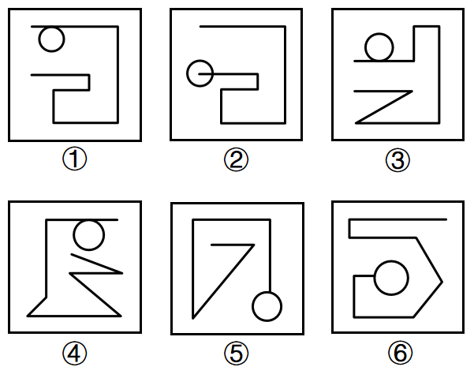

- **A**. ①④⑤，②③⑥
- **B**. ①③④，②⑤⑥　✅
- **C**. ①②⑤，③④⑥
- **D**. ①②⑥，③④⑤

**答案**：B

**官方解析**

本题为分组分类题目。元素组成不同，且无明显属性规律，考虑数量规律。观察发现，每幅图形均有曲线与直线，且题干图形相切明显，考虑切点数量。图①③④的切点数均为1，图②⑤⑥的切点数均为0。即图①③④为一组，图②⑤⑥为一组。
故正确答案为B。

---

## 第 8 题　qid 18643898 · 图形推理

把下面的六个图形分为两类，使每一类图形都有各自的共同特征或规律，分类正确的一项是：

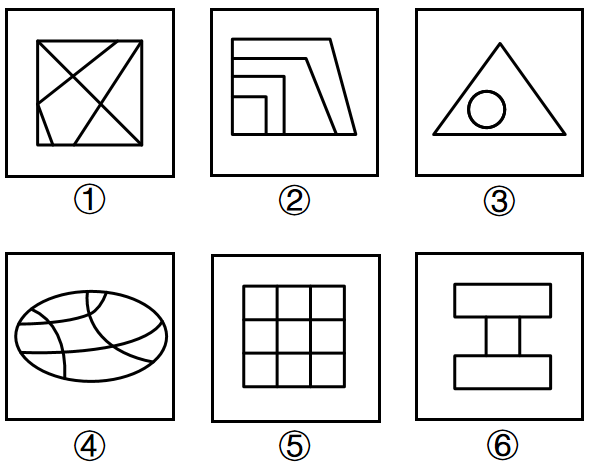

- **A**. ①②⑥，③④⑤　✅
- **B**. ①②⑤，③④⑥
- **C**. ①③⑤，②④⑥
- **D**. ①⑤⑥，②③④

**答案**：A

**官方解析**

本题为分组分类题目。元素组成不同，且无明显属性规律，考虑数量规律。观察发现，题干图形均存在多个面，图①②⑥中，所有面都与外框有公共边，图③④⑤中，中间的1个面与外框没有公共边，其余面都与外框有公共边，即图①②⑥为一组，图③④⑤为一组。

故正确答案为A。

注：图6外框可以理解为：，因此其三个面均与外框有公共边。

---

## 第 9 题　qid 18643897 · 定义判断

长期岛屿化效应是指随着自然保护区日益变成岛屿状以及种源地日益变得稀少和遥远，生物迁入率会随之减少，迁入和绝灭的平衡被打破，可能导致一些物种的绝灭，直到迁入和绝灭再次达到平衡。
根据上述定义，下列属于长期岛屿化效应的是：

- **A**. 千岛湖名胜区有上千个岛屿，岛屿边缘的环境为喜高温、多湿的乌桕种群的存活提供了良好条件。但岛屿内部，马尾松的荫蔽作用使得乌桕种群很难生存
- **B**. 国家自然保护区内次生林在10年时间内被农田、村落等隔离，形成面积不一的“岛屿”，原先生活在大面积“斑块”中的松鸦等鸟类逐渐难寻踪迹　✅
- **C**. 红树林保护区每年有数十万只候鸟停留，数量多时有的候鸟只能栖息到保护区红线边缘。但近几年周边噪音影响鸟儿栖息，保护区逐渐不复往日热闹
- **D**. 各级政府在横断山地区建立了大量自然保护区，但河谷和边缘带没有得到相关保护，在过度放牧的影响下，许多物种濒临灭绝

**答案**：B

**官方解析**

第一步：找出定义关键词。
“自然保护区日益变成岛屿状以及种源地日益变得稀少和遥远”、“生物迁入率会随之减少”、“迁入和绝灭的平衡被打破”、“可能导致一些物种的绝灭”、“直到迁入和绝灭再次达到平衡”。
第二步：逐一分析选项。
A项：岛屿边缘的环境为乌桕种群的存活提供了良好条件，但岛屿内部环境使得乌桕种群很难生存，强调的是边缘和内部坏境对乌桕种群生存的影响，未体现保护区的改变和生物迁入率的变化，不符合“自然保护区日益变成岛屿状以及种源地日益变得稀少和遥远”、“生物迁入率会随之减少”，不符合定义，排除；
B项：自然保护区内次生林被农田、村落等隔离成“岛屿”，符合“自然保护区日益变成岛屿状以及种源地日益变得稀少和遥远”，原先生活在大面积“斑块”中的松鸦等鸟类变少，符合“生物迁入率会随之减少”、“迁入和绝灭的平衡被打破”、“可能导致一些物种的绝灭”、“直到迁入和绝灭再次达到平衡”，符合定义，当选；
C项：红树林周边噪音影响了候鸟的栖息，未涉及保护区变成岛屿状，不符合“自然保护区日益变成岛屿状以及种源地日益变得稀少和遥远”，不符合定义，排除；
D项：因未保护好河谷和边缘带，过度放牧导致草场退化，从而影响了珍稀物种的生存空间，未涉及保护区变成岛屿状，不符合“自然保护区日益变成岛屿状以及种源地日益变得稀少和遥远”，不符合定义，排除。
故正确答案为B。

---

## 第 10 题　qid 18643887 · 定义判断

互惠焦虑是指在接受别人的帮助或恩惠后，出于礼尚往来的想法，会感到“欠了人情债”，从而产生焦虑情绪。
根据上述定义，下列没有体现互惠焦虑的是：

- **A**. 小王和几个新入职的同事聚餐时，有人抢先买了单，他感到有些局促
- **B**. 小刘经常开车顺路送同事回家，有次因为加班让同事等了很久，他感到很不好意思　✅
- **C**. 小林收到朋友送的昂贵礼物，但因自己经济条件欠佳担心无法回赠价值相当的礼物，感到非常自卑
- **D**. 小吴在某餐厅用餐时受到服务员的热情服务，临走时感觉过意不去，于是给了其小费

**答案**：B

**官方解析**

第一步：找出定义关键词。
“在接受别人的帮助或恩惠后”、“出于礼尚往来的想法”、“产生焦虑情绪”。
第二步：逐一分析选项。
A项：小王因被新同事抢先买单而感到局促，符合“在接受别人的帮助或恩惠后”、“出于礼尚往来的想法”、“产生焦虑情绪”，符合定义，排除；
B项：小刘经常开车送同事回家，有次因加班让同事等了很久而感到不好意思，小刘是提供帮助的一方，并未接受该同事的帮助或恩惠，不符合“在接受别人的帮助或恩惠后”，不符合定义，当选；
C项：小林因收到朋友送的昂贵礼物并担心自己无法回赠价值相当的礼物，而感到自卑，符合“在接受别人的帮助或恩惠后”、“出于礼尚往来的想法”、“产生焦虑情绪”，符合定义，排除；
D项：小吴因在餐厅接受了服务员的热情服务而感到过意不去并给了其小费，符合“在接受别人的帮助或恩惠后”、“出于礼尚往来的想法”、“产生焦虑情绪”，符合定义，排除。
本题为选非题，故正确答案为B。

---

## 第 11 题　qid 18643874 · 定义判断

相关群体是指能够直接或间接影响消费者购买行为的群体。相关群体有三种形式：一是主要团体，即对消费者的购买行为发生直接和主要影响的亲近群体；二是次要团体，即消费者所参加的社会团体和业余组织；三是期望群体，虽然消费者一般不属于这一群体，但这一群体成员的态度或行为对消费者有着很大影响。
根据上述定义，下列相关群体中属于期望群体的是：

- **A**. 独立开展商品测评的网络博主　✅
- **B**. 教育子女要节俭消费的父母
- **C**. 消费者自主加入的网上团购群
- **D**. 经常一起购物的同事和朋友

**答案**：A

**官方解析**

第一步：找出定义关键词。
相关群体：“能够直接或间接影响消费者购买行为的群体”；
主要团体：“对消费者的购买行为发生直接和主要影响的亲近群体”；
次要团体：“消费者所参加的社会团体和业余组织”；
期望群体：“消费者一般不属于这一群体，但这一群体成员的态度或行为对消费者有着很大影响”。
第二步：逐一分析选项。
A项：独立开展商品测评的网络博主，测评博主关于商品的评价通常会对消费者产生影响，符合“消费者一般不属于这一群体，但这一群体成员的态度或行为对消费者有着很大影响”，符合“期望群体”定义，当选；
B项：教育子女要节俭消费的父母，父母属于会影响子女消费习惯的亲人，符合“对消费者的购买行为发生直接和主要影响的亲近群体”，符合“主要团体”定义，不符合“期望群体”定义，排除；
C项：消费者自主加入的网上团购群，购物群是消费者自发参加的业余组织，符合“消费者所参加的社会团体和业余组织”，符合“次要团体”定义，不符合“期望群体”定义，排除；
D项：经常一起购物的同事和朋友，同事和朋友属于影响消费者购买行为的亲近群体，符合“对消费者的购买行为发生直接和主要影响的亲近群体”，符合“主要团体”定义，不符合“期望群体”定义，排除。
故正确答案为A。

---

## 第 12 题　qid 18643891 · 定义判断

在企业公共关系领域，外部监察法是指聘请企业外部专家对本企业公共关系活动进行调查和评价的方法，通过调查、访问和分析，对企业公共关系活动及其效果给予较客观的衡量和评价，并就未来的活动提出建议和咨询；内部监察法是指由企业内部人员，如公共关系部的负责人或上级负责人对公共关系部的表现进行调查和评价的方法，范围涉及现行工作和成果、存在问题、将来的计划安排等。
根据上述定义，下列最能体现内部监察法的是：

- **A**. 公司经理就公共关系部本季度的工作情况询问客户　✅
- **B**. 汽车行业协会人员对某汽车公司公共关系开展访谈
- **C**. 公共关系部总监对本部门下年度工作任务做出计划
- **D**. 管理专家访问企业后，对其公共关系活动给予指导

**答案**：A

**官方解析**

第一步：找出定义关键词。
外部监察法：“聘请企业外部专家对本企业公共关系活动进行调查和评价”、“对企业公共关系活动及其效果给予较客观的衡量和评价”、“就未来的活动提出建议和咨询”；
内部监察法：“企业内部人员，如公共关系部的负责人或上级负责人”、“对公共关系部的表现进行调查和评价”、“范围涉及现行工作和成果、存在问题、将来的计划安排等”。
第二步：逐一分析选项。
A项：公司经理可能是该公司公共关系部的负责人或上级负责人，可能符合“企业内部人员，如公共关系部的负责人或上级负责人”，就公共关系部本季度的工作情况询问客户，符合“对公共关系部的表现进行调查”、“范围涉及现行工作”，符合定义，当选；
B项：汽车行业协会人员不属于企业内部人员，不符合“企业内部人员，如公共关系部的负责人或上级负责人”，不符合定义，排除；
C项：公共关系部总监，符合“企业内部人员，如公共关系部的负责人或上级负责人”，但是该总监只是做出计划，并没有调查和评价，不符合“对公共关系部的表现进行调查和评价”，不符合定义，排除；
D项：管理学家不属于企业内部人员，不符合“企业内部人员，如公共关系部的负责人或上级负责人”，不符合定义，排除。
故正确答案为A。

---

## 第 13 题　qid 18643893 · 定义判断

冷读术是一种心理学技巧，它基于人类心理的共同点，利用言语和非言语信息，推测出对方可能感兴趣的话题、潜在的心理需求以及他们可能认同的观点。
根据上述定义，下列最能体现冷读术的是：

- **A**. 小肖刚认识了一个朋友，想知道对方的工作，于是说：“你在软件园上班吗？”对方脱口而出：“不，我在金融街上班。”
- **B**. 小杨为探知客户是否想要购买产品，说：“根据贵公司情况，先订4套就差不多了。”客户接过话题说：“要不先订1套吧。”
- **C**. 小曹和客户见面时，发现客户穿了一件球衣，于是主动聊起上周末的球赛，成功打开了话题　✅
- **D**. 小杜对朋友说：“打网球要重视体能训练，不然打不好拉锯战。”朋友从此就注意加强体能训练

**答案**：C

**官方解析**

第一步：找出定义关键词。
“基于人类心理的共同点，利用言语和非言语信息”、“推测出对方可能感兴趣的话题、潜在的心理需求以及他们可能认同的观点”。
第二步：逐一分析选项。
A项：小肖是直接询问对方的工作，并不是基于心理上的共同点而给出推测，不符合“基于人类心理的共同点”，也没有体现“推测出对方可能感兴趣的话题、潜在的心理需求以及他们可能认同的观点”，不符合定义，排除；
B项：小杨根据已知的对方公司情况而给出建议，并不是基于心理上的共同点而给出推测，不符合“基于人类心理的共同点，利用言语和非言语信息”、“推测出对方可能感兴趣的话题、潜在的心理需求以及他们可能认同的观点”，不符合定义，排除；
C项：小曹通过观察对方穿着球衣，属于非言语信息，推测对方可能对球赛感兴趣，从而主动聊起球赛，打开话题，符合“基于人类心理的共同点，利用言语和非言语信息”、“推测出对方可能感兴趣的话题、潜在的心理需求以及他们可能认同的观点”，符合定义，当选；
D项：小杜建议朋友加强体能训练，对方听从了他的建议，没有体现“基于人类心理的共同点，利用言语和非言语信息”，也没有体现“推测出对方可能感兴趣的话题、潜在的心理需求以及他们可能认同的观点”，不符合定义，排除。
故正确答案为C。

---

## 第 14 题　qid 18643900 · 定义判断

划界谬误是一种非形式逻辑谬误，即在事实上并无必要精确划线的场合，坚持认为要在某个精确的点上划这样一条线，以此实现划界的目的。如果不能精确划线，就认为事物没有变化。
根据上述定义，下列不属于划界谬误的是：

- **A**. 如果我们一块钱一块钱地连续给某个不富有的人，也不可能使他变得富有。因为我们无论给他多少钱，都不能精确指出是哪一块钱使其富有，因此他也不可能富有起来
- **B**. 一头骆驼不可能因为最后一根稻草而被压垮，因为我们不能精确指出哪根稻草压垮骆驼，其实前面压在它背上的稻草也起了作用　✅
- **C**. 一个习惯在黑夜里长时间看手机的人不可能因此而变得视力差。因为我们不能精确指出是哪一天夜里看手机导致其视力差，因此他的视力就不会差
- **D**. 一个长期懒惰的人不会因为不锻炼而变得肥胖，因为我们不能精确指出是哪一天不锻炼导致其肥胖，所以他就不会变得肥胖

**答案**：B

**官方解析**

第一步：找出定义关键词。

“如果不能精确划线，就认为事物没有变化”。

第二步：逐一分析选项。

A项：不能精确指出哪一块钱使其富有，认为他不可能富有，其逻辑是“找不到精确点直接否认会发生”，符合“如果不能精确划线，就认为事物没有变化”，符合定义，排除；

B项：不能精确指出哪根稻草压垮骆驼，认为前面压的稻草也起了作用，其逻辑是“找不到精确点承认有作用”，不符合“如果不能精确划线，就认为事物没有变化”，不符合定义，当选；

C项：不能精确指出哪一天夜里看手机导致视力差，认为他的视力就不会差，其逻辑是“找不到精确点直接否认会发生”，符合“如果不能精确划线，就认为事物没有变化”，符合定义，排除；

D项：不能精确指出哪一天不锻炼导致肥胖，认为他不会变肥胖，其逻辑是“找不到精确点直接否认会发生”，符合“如果不能精确划线，就认为事物没有变化”，符合定义，排除。

本题为选非题，故正确答案为B。

---

## 第 15 题　qid 18643882 · 定义判断

有限空间是指封闭或者部分封闭，未被设计为固定工作场所，人员可以进入作业，自然通风不良，易造成有毒有害、易燃易爆物质积聚或者氧含量不足的空间。
根据上述定义，下列不属于有限空间的是：

- **A**. 种植蔬菜的温室
- **B**. 大型建筑的烟道
- **C**. 煤矿的地下矿洞
- **D**. 仅有观察孔的储罐　✅

**答案**：D

**官方解析**

第一步：找出定义关键词。
“封闭或者部分封闭”、“人员可以进入作业”、“易造成有毒有害、易燃易爆物质积聚或者氧含量不足”。
第二步：逐一分析选项。
A项：种植蔬菜的温室，通常出入口较为狭窄，符合“封闭或者部分封闭”，人员可以进入温室进行工作，符合“人员可以进入作业”，如果通风不畅，会导致氧气浓度降低或有害气体积聚，符合“易造成有毒有害、易燃易爆物质积聚或者氧含量不足”，符合定义，排除；
B项：大型建筑的烟道，通常是封闭的管道结构，符合“封闭或者部分封闭”，人员可以进入烟道进行清理工作，符合“人员可以进入作业”，烟道本身通风不良，会导致氧气不足及一氧化碳、二氧化碳等有害气体积聚，符合“易造成有毒有害、易燃易爆物质积聚或者氧含量不足”，符合定义，排除；
C项：煤矿的地下矿洞，位于地下空间，出入口受限，符合“封闭或者部分封闭”，人员可以进入矿洞进行工作，符合“人员可以进入作业”，矿洞往往自然通风不良，容易积聚有害气体、出现缺氧以及发生燃爆，符合“易造成有毒有害、易燃易爆物质积聚或者氧含量不足”，符合定义，排除；
D项：仅有观察孔的储罐，只有观察孔，开口尺寸不足以让人员进入，不符合“人员可以进入作业”，不符合定义，当选。
本题为选非题，故正确答案为D。

---

## 第 16 题　qid 18643829 · 定义判断

现状偏好指的是人类倾向于维持现有的状态，即便当现状客观上劣于其他选项或者信息不完整时，人们还是会作出维持现状的决定，而且倾向于将任何改变都视为一种损失。
根据上述定义，下列不属于现状偏好现象的是：

- **A**. 小明的数学成绩在班级排名中游，虽然他也很努力学习数学，可是考试成绩仍没有明显提升　✅
- **B**. 汽车销售商允许顾客免费试用一个月，满意才付款，不满意则支付使用费后退货，即便部分消费者并不满意，但仍最终选择购买了该汽车
- **C**. 调查发现，某市各个小区的业主虽然对物业服务评价普遍偏低，但是通过投票表示主动更换物业的不多
- **D**. 小强虽然对现在工作不满意，但是考虑到重新找工作还需适应新环境，遂打消了跳槽想法

**答案**：A

**官方解析**

第一步：找出定义关键词。
“倾向于维持现有的状态”、“当现状客观上劣于其他选项或者信息不完整时”、“还是会作出维持现状的决定”、“而且倾向于将任何改变都视为一种损失”。
第二步：逐一分析选项。
A项：小明很努力学习数学，考试成绩仍没有明显提升，“很努力学习数学”说明他希望改变现状，不符合“倾向于维持现有的状态”和“还是会作出维持现状的决定”，不符合定义，当选；
B项：部分消费者试用汽车，虽然并不满意，但仍最终选择购买了该汽车，说明现状是正在使用车辆，且最终购买车辆，符合“倾向于维持现有的状态”、“还是会作出维持现状的决定”，符合定义，排除；
C项：业主对物业服务评价普遍偏低，但是通过投票表示主动更换物业的不多，说明物业服务现状较差，但是依然不更换物业，符合“倾向于维持现有的状态”、“当现状客观上劣于其他选项或者信息不完整时”、“还是会作出维持现状的决定”，符合定义，排除；
D项：小强虽然对现在工作不满意，但是考虑到重新找工作还需适应新环境，后打消跳槽想法，说明对现在工作不满，重新找工作需要付出更多，符合“倾向于维持现有的状态”、“当现状客观上劣于其他选项或者信息不完整时”、“还是会作出维持现状的决定”、“而且倾向于将任何改变都视为一种损失”，符合定义，排除。
本题为选非题，故正确答案为A。

---

## 第 17 题　qid 18643894 · 定义判断

第三方利他行为是指与事件无直接关系的旁观者付出一定的代价去惩罚违规者，或者利用自身资源对受害者提供支持和帮助的行为。
根据上述定义，下列属于第三方利他行为的是：

- **A**. 甲在其组织的足球比赛中义务当裁判
- **B**. 乙在其朋友圈里转发寻找走失儿童的新闻链接　✅
- **C**. 某保险公司为被保险人赔付巨额保险金
- **D**. 某餐饮协会负责人谴责当地个别餐馆的宰客行为

**答案**：B

**官方解析**

第一步：找出定义关键词。
“与事件无直接关系的旁观者”、“付出一定的代价去惩罚违规者”、“利用自身资源对受害者提供支持和帮助”。
第二步：逐一分析选项。
A项：甲在其组织的足球比赛中义务当裁判，甲是足球比赛的组织者，不符合“与事件无直接关系的旁观者”，不符合定义，排除；
B项：乙在其朋友圈里转发寻找走失儿童的新闻链接，乙与走失儿童并无直接关系，符合“与事件无直接关系的旁观者”，且通过在朋友圈转发链接帮助受害者，符合“利用自身资源对受害者提供支持和帮助”，符合定义，当选；
C项：某保险公司为被保险人赔付巨额保险金，保险公司与被保险人存在合同关系，不符合“与事件无直接关系的旁观者”，不符合定义，排除；
D项：某餐饮协会负责人谴责当地个别餐馆的宰客行为，餐饮协会与餐馆是行业组织与成员的关系，不符合“与事件无直接关系的旁观者”，不符合定义，排除。
故正确答案为B。

---

## 第 18 题　qid 18643830 · 类比推理

整理收纳师：新兴职业

- **A**. 五公里越野：军事演习
- **B**. 高人气主播：网络营销
- **C**. 高科技人才：人才资源　✅
- **D**. 中小学教育：义务教育

**答案**：C

**官方解析**

第一步：判断题干词语间逻辑关系。
整理收纳师是新兴职业，二者为种属关系。
第二步：判断选项词语间逻辑关系。
A项：军事演习是想定情况诱导下进行的作战指挥和行动的演练，是部队在完成理论学习和基础训练之后实施的，近似实战的综合性训练。五公里越野和军事演习不是种属关系，与题干逻辑关系不一致，排除；
B项：网络营销是以现代营销理论为基础，借助网络、通信和数字媒体技术等实现营销目标的商务活动。高人气主播和网络营销不是种属关系，与题干逻辑关系不一致，排除；
C项：高科技人才是人才资源，二者为种属关系，与题干逻辑关系一致，当选；
D项：中小学教育包含初小、高小、初中、高中四个学段，义务教育阶段是指从小学到初中九年教育阶段，二者不是种属关系，与题干逻辑关系不一致，排除。
故正确答案为C。

---

## 第 19 题　qid 18643895 · 类比推理

喉：舌：喉舌

- **A**. 领：袖：领袖　✅
- **B**. 色：彩：色彩
- **C**. 音：乐：音乐
- **D**. 房：屋：房屋

**答案**：A

**官方解析**

第一步：判断题干词语间逻辑关系。
喉和舌是人体的两个器官，二者为并列关系。喉舌泛指说话的器官，也比喻发表言论的工具或人，含有比喻象征义。
第二步：判断选项词语间逻辑关系。
A项：领和袖是衣服的领子和袖子，为衣服的两个不同部分，二者为并列关系。领袖指能为人表率的人，也比喻同类人或物中之突出者，含有比喻象征义，与题干逻辑关系一致，当选；
B项：色和彩都表达颜色，二者为近义关系，与题干逻辑关系不一致，排除；
C项：音是乐的基础，乐是经过道德和秩序提升后的音，二者不是并列关系，且音乐不含有比喻象征义，与题干逻辑关系不一致，排除；
D项：房和屋都指屋子，二者为近义关系，且房屋不含有比喻象征义，与题干逻辑关系不一致，排除。
故正确答案为A。

---

## 第 20 题　qid 18643831 · 类比推理

纸币：纸张：货币

- **A**. 木椅：木材：椅子　✅
- **B**. 电扇：电器：扇子
- **C**. 陶瓷：陶土：白瓷
- **D**. 面食：面粉：美食

**答案**：A

**官方解析**

第一步：判断题干词语间逻辑关系。
纸张是制作纸币的原材料，二者为原材料和成品的对应关系；纸币是货币的一种，二者为种属关系。
第二步：判断选项词语间逻辑关系。
A项：木材是制作木椅的原材料，二者为原材料和成品的对应关系；木椅是椅子的一种，二者为种属关系，与题干逻辑关系一致，当选；
B项：电扇是电器的一种，二者为种属关系；电扇和扇子为并列关系，与题干逻辑关系不一致，排除；
C项：陶土是制作陶瓷的原材料，二者为原材料和成品的对应关系；白瓷是陶瓷的一种，二者为种属关系，但词语顺序相反，与题干逻辑关系不一致，排除；
D项：面粉是制作面食的原材料，二者为原材料和成品的对应关系；但面食和美食为交叉关系，与题干逻辑关系不一致，排除。
故正确答案为A。

---

## 第 21 题　qid 18643832 · 类比推理

交通标志：疏散图示：指示

- **A**. 隐形眼镜：近视眼镜：装饰
- **B**. 会议纪要：课堂笔记：记录　✅
- **C**. 借记卡：信用卡：储蓄
- **D**. 暖水瓶：热水器：保温

**答案**：B

**官方解析**

第一步：判断题干词语间逻辑关系。
交通标志是用文字或符号传递引导、限制、警告或指示信息的道路设施；疏散图示是用图示的方式标出建筑物内的安全通道、出口、疏散路线以及各类紧急设备位置的平面图。交通标志和疏散图示都可以用来指示，前两词为并列关系，与第三词均为功能对应关系，且为主要功能。
第二步：判断选项词语间逻辑关系。
A项：隐形眼镜和近视眼镜为交叉关系，与题干逻辑关系不一致，排除；
B项：会议纪要和课堂笔记都可以用来记录，前两词为并列关系，与第三词均为功能对应关系，且为主要功能，与题干逻辑关系一致，当选；
C项：借记卡和信用卡为并列关系，但储蓄不是信用卡的功能，第二词与第三词不是功能对应关系，与题干逻辑关系不一致，排除；
D项：暖水瓶和热水器为并列关系，与第三词为功能对应关系，但保温不是热水器的主要功能，与题干逻辑关系不一致，排除。
故正确答案为B。

---

## 第 22 题　qid 18643833 · 类比推理

（    ） 对于 蒙昧时代 相当于 机器生产 对于 （    ）

- **A**. 启蒙运动；现代社会
- **B**. 偏远地区；文明城市
- **C**. 氏族部落；蒸汽时代　✅
- **D**. 科技时代；手工作坊

**答案**：C

**官方解析**

逐一代入选项。
A项：启蒙运动是蒙昧时代下进步的思想运动，二者为变革运动和时代的对应关系；机器生产是现代社会的生产方式，二者为生产方式和时代的对应关系，前后逻辑关系不一致，排除；
B项：蒙昧时代指原始社会早期阶段，对应旧石器时代至中石器时代，与偏远地区没有必然的逻辑关系；机器生产形成时期主要在18世纪下半期，与文明城市没有必然的逻辑关系，前后逻辑关系不一致，排除；
C项：氏族部落指以血缘关系为纽带结成的原始社会组织，是蒙昧时代的典型社会形态，二者为典型事物和时代的对应关系；机器生产指以机器体系为核心工具进行商品制造的生产方式，是蒸汽时代的典型生产方式，二者为典型事物和时代的对应关系，前后逻辑关系一致，保留；
D项：蒙昧时代和科技时代是两种不同的时代，二者为并列关系；机器生产和手工作坊是两种不同的生产模式，二者为并列关系，前后逻辑关系一致，保留。
比较C、D两项，C项中氏族部落是蒙昧时代的典型事物，机器生产是蒸汽时代的典型事物，二者从典型事物和时代上对应一致，而D项中蒙昧时代是按社会发展阶段划分，科技时代是按科技发展水平划分，机器生产和手工作坊都是按生产方式划分，前后对应的不如C项更好，因此择优选择C项。
故正确答案为C。

---

## 第 23 题　qid 18643834 · 逻辑判断

研究者发现，习惯食用腌制菜地区的人患食道癌的风险是其他地区的2倍，而腌制菜中检测出亚硝酸盐的含量较高。由此，有科学家推断腌制菜中亚硝酸盐是导致习惯食用腌制菜地区食道癌高发的主要原因，建议减少腌制菜的食用。
以下哪项如果为真，最能支持上述论证？

- **A**. 腌制菜中含有丰富的活性乳酸菌，可抑制肠道中腐败菌的生长，有助于消化，防便秘的作用
- **B**. 腌制菜属于高盐食物，频繁食用高盐食物会损伤胃黏膜和食管黏膜，诱发癌症
- **C**. 亚硝酸盐可与胃中蛋白质的分解产物胺类反应生成具有极强致癌性、致病性的亚硝胺类化合物　✅
- **D**. 腌制菜的亚硝酸盐含量在十天左右最高，二十五至三十天后含量会大幅降低

**答案**：C

**官方解析**

第一步：找出论点和论据。
论点：腌制菜中亚硝酸盐是导致习惯食用腌制菜地区食道癌高发的主要原因，建议减少腌制菜的食用。
论据：习惯食用腌制菜地区的人患食道癌的风险是其他地区的2倍，而腌制菜中检测出亚硝酸盐的含量较高。
本题论点和论据都在讨论“腌制菜中的亚硝酸盐”和“食道癌”之间的关系，二者话题一致，加强优先考虑补充论据。
第二步：逐一分析选项。
A项：该项指出腌制菜中的活性乳酸菌助消化、防便秘，而论点说的是亚硝酸盐导致食道癌，话题不一致，无法加强，排除；
B项：该项指出频繁食用腌制菜这种高盐食物会致癌，但没有明确指出是腌制菜中的亚硝酸盐还是其他盐类成分会致癌，为不明确项，无法加强，排除；
C项：该项指出亚硝酸盐可与胃中蛋白质的分解产物反应生成极强致癌性物质，解释了腌制菜中的亚硝酸盐确实会导致食道癌，补充论据，可以加强，当选；
D项：该项指出腌制菜的亚硝酸盐含量随时间变化的关系，而论点说的是亚硝酸盐导致食道癌，话题不一致，无法加强，排除。
故正确答案为C。

---

## 第 24 题　qid 18643836 · 逻辑判断

随着人工智能的快速发展，数学家们开始探索人工智能如何帮助他们完成工作，机器学习等AI工具已经帮助数学家创建新的理论并解决棘手的问题，也正以超越单纯计算的方式改变数学领域，有学者认为，这可能会使一些数学家失业。
以下哪项如果为真，最能反驳部分学者的观点？

- **A**. AI可能会更好地给出正确的数学陈述和证明，但其中大多数陈述和证明会令人不感兴趣或者无法理解
- **B**. 当前对于“机器是否会改变数学”的问题研究热度空前，已经引起许多著名数学家的浓厚兴趣和高度关注
- **C**. AI无法从具体信息中提取抽象概念，无法识别数学背后的定律，更无法识别数学与其他科学之间的关系　✅
- **D**. 2020年，德国著名数学家、菲尔兹奖得主彼得·舒尔茨遇到的难题被数学定理证明器Lean证明了，Lean如今已经得到许多数学家的支持

**答案**：C

**官方解析**

第一步：找出论点和论据。
论点：AI可能会使一些数学家失业。
论据：机器学习等AI工具已经帮助数学家创建新的理论并解决棘手的问题，也正以超越单纯计算的方式改变数学领域。
本题论点和论据均在讨论AI对数学家和数学领域的影响，二者话题一致，削弱优先考虑削弱论点。
第二步：逐一分析选项。
A项：该项指出AI的大多数陈述和证明会令人不感兴趣或者无法理解，与论点讨论的AI是否会使一些数学家失业无关，话题不一致，无法削弱，排除；
B项：该项指出数学家对“机器是否会改变数学”这个问题的关注，与论点讨论的AI是否会使一些数学家失业无关，话题不一致，无法削弱，排除；
C项：该项指出AI在数学领域的一些局限性，说明AI确实无法完全替代数学家的工作，即AI的使用不会使一些数学家失业，削弱论点，可以削弱，当选；
D项：该项指出德国数学家遇到的难题被数学定理证明器证明了，举例说明AI确实能帮助数学家解决一些复杂的问题，加强项，无法削弱，排除。
故正确答案为C。

---

## 第 25 题　qid 18643835 · 逻辑判断

沙漠蝗自古便是北非、西亚和印度等热带荒漠地区河谷和绿洲上的农业害虫。某年阿拉伯半岛沙漠蝗数量在6个月内暴涨了400倍。由于强降雨过后地表植被大量增加，沙漠蝗会更容易获取充足的食物，因此有专家认为，沙漠蝗的数量激增可能与阿拉伯半岛去年先后2次遭遇飓风带来的强降雨有关。
以下哪项如果为真，最能削弱上述结论？

- **A**. 强降雨导致沙漠蝗的天敌数量大量减少
- **B**. 没有遭遇强降雨的地区也出现了沙漠蝗数量激增的现象　✅
- **C**. 沙漠蝗经常会为了寻找食物而迁飞至食物充足的地区
- **D**. 全球气候变暖致使沙漠蝗迁飞范围明显扩大

**答案**：B

**官方解析**

第一步：找出论点和论据。
论点：沙漠蝗的数量激增可能与阿拉伯半岛去年先后2次遭遇飓风带来的强降雨有关。
论据：某年阿拉伯半岛沙漠蝗数量在6个月内暴涨了400倍。由于强降雨过后地表植被大量增加，沙漠蝗会更容易获取充足的食物。
本题论据在分析沙漠蝗数量增加和强降雨的关系，论点在分析沙漠蝗的数量激增和强降雨的关系，论点与论据话题一致，削弱优先考虑削弱论点。
第二步：逐一分析选项。
A项：选项指出强降雨会导致沙漠蝗天敌数量大量减少，而天敌数量大量减少会导致沙漠蝗数量激增，说明沙漠蝗数量激增可能与强降雨有关，加强选项，无法削弱，排除；
B项：选项指出没有强降雨的地区，也出现了沙漠蝗数量激增的现象，说明强降雨并不是沙漠蝗数量激增的原因，削弱论点，可以削弱，当选；
C项：选项指出沙漠蝗会为了寻找食物而迁飞至食物充足的地区，而强降雨过后地表植被大量增加，沙漠蝗会更容易获取充足的食物，说明沙漠蝗数量激增可能与强降雨有关，加强选项，无法削弱，排除；
D项：选项指出全球变暖致使沙漠蝗迁飞范围明显扩大，而论点讨论的是沙漠蝗数量激增与强降雨的关系，无关选项，无法削弱，排除。
故正确答案为B。

---

## 第 26 题　qid 18643916 · 逻辑判断

推行“共享病历”，虽然可以让医生实现跨医院、跨地域调取患者信息，减少无谓的重复登记、检查、诊疗手续，提高看病效率，降低患者看病费用，减轻医疗负担，但将患者数据分享给其他医疗机构，意味着存在多个调阅环节，增加了患者信息被泄露、盗取的风险。有信息安全专家指出：保护患者信息数据的安全关键在于加强医疗机构对信息系统的管理。
以下哪项如果为真，最能支持专家的观点？

- **A**. 某医院的医疗服务信息系统遭“黑客”入侵，大量患者信息被泄露
- **B**. 医疗系统涉及到数据泄露的漏洞多属于高级漏洞，不容易遭到外部攻击
- **C**. 泄露、盗取患者信息事件的发生，多是医疗机构对信息数据管理不严所致　✅
- **D**. “共享病历”普及后，医疗机构普遍增加了对信息安全系统的资金投入

**答案**：C

**官方解析**

第一步：找出论点和论据。
论点：保护患者信息数据的安全关键在于加强医疗机构对信息系统的管理。
论据：将患者数据分享给其他医疗机构，意味着存在多个调阅环节，增加了患者信息被泄露、盗取的风险。
论据讨论的是 “患者数据分享存在信息泄露盗取的风险”，论点说的是“保护患者信息数据的安全关键在于加强医疗机构对信息系统的管理”，论点是针对于论据的问题提出的解决对策，论点与论据联系较为紧密，故论据和论点话题一致，加强优先考虑补充论据，即优先考虑解释原因或举例证明。
第二步：逐一分析选项。
A项：该项指出某医疗服务信息系统遭到入侵，导致信息泄露，举例说明医疗服务信息系统存在问题确实会对患者信息安全造成影响，举例证明，可以加强，保留；
B项：该项指出外部攻击漏洞的方式不易获得患者信息，不存在安全问题，无法说明保护患者信息数据的安全为什么关键在于加强医疗机构对信息系统的管理，无法加强，排除；
C项：该项指出确实是因为信息数据管理不严，患者信息才被泄露、盗取，加强对信息系统的管理，可以从根源解决问题，解释了为什么保护患者信息数据的安全关键在于加强医疗机构对信息系统的管理，解释原因，可以加强，保留； 
D项：该项指出医疗机构增加了对信息安全系统的资金投入，并不能说明加强信息系统管理能否解决信息泄露、盗取问题，话题不一致，无法加强，排除。
对比A、C两项，A项为举例加强，C项为解释原因，解释原因力度大于举例加强，C项当选。
故正确答案为C。

---

## 第 27 题　qid 18643889 · 类比推理

低温下人体胃黏膜小血管先痉挛后扩张会导致出血，所以冻死的尸体的胃黏膜下有帽针头至豌豆大弥漫性斑点状出血，呈褐色或深褐色。某具遗体经检查后发现胃黏膜下有褐色或深褐色出血点，因此，这个人一定是被冻死的。
以下哪项所包含的推理错误与上述推理最为相似？

- **A**. 正如静置不动的水容易变臭一样，没有活力的店铺也会衰败。这家店铺经常用特价优惠等活动带动店铺的人气和销售，所以这家店铺肯定不会衰败
- **B**. 包容度高的城市必然能吸引各类人才聚集，某市人才吸引力指数连年名列前茅，所以该市的包容度一定很高　✅
- **C**. 人经常饮酒会导致咽喉痛及消化道患病率明显增加，老李因生意失败沉迷喝酒，身体抵抗力下降，一定是得了咽喉炎或消化道疾病
- **D**. 成熟的西瓜一般花纹更清晰，这些西瓜花纹整齐且界限清晰，所以这些西瓜很有可能是熟了

**答案**：B

**官方解析**

第一步：分析题干推理形式。

题干翻译为：冻死的尸体胃黏膜下有褐色或深褐色出血；

推理为：某具遗体胃黏膜下有褐色或深褐色出血点，因此，这个人一定是被冻死的。

推理形式是“肯后推肯前”。

第二步：逐一分析选项。

A项：翻译为：没有活力的店铺会衰败，这家店铺经常用特价优惠等活带动店铺的人气和销售（说明有活力），所以这家店铺肯定不会衰败，推理形式是“否前推否后”，与题干推理形式不一致，排除；

B项：翻译为：包容度高的城市吸引各类人才聚集，某市人才吸引力指数连年名列前茅，所以该市的包容度一定很高，推理形式是“肯后推肯前”，与题干推理形式一致，当选；

C项：翻译为：人经常饮酒咽喉痛及消化道患病率明显增加，老李因生意失败沉迷喝酒，身体抵抗力下降，一定是得了咽喉炎或消化道疾病，“患病率增加”不等同于“一定得病”，偷换概念，与题干推理形式不一致，排除；

D项：翻译为：成熟的西瓜花纹更清晰，这些西瓜花纹整齐且界限清晰，所以这些西瓜很有可能是熟了，结论为“可能性判断”，而题干是“必然性判断”，与题干推理形式不一致，排除。

故正确答案为B。

---

## 第 28 题　qid 18643871 · 逻辑判断

睡眠类型或昼夜节律偏好，指的是一个人偏好的睡觉和醒来时间。有的人是“早起鸟”，喜欢早睡早起，而有的人是“夜猫子”，喜欢晚睡晚起，一项研究认为，与那些拥有早睡早起习惯的人相比，晚睡晚起的人患糖尿病的风险增加了19%。
以下哪项如果为真，不能支持上述观点？

- **A**. 晚睡晚起的人中大多有不规律的睡眠模式，睡眠模式不规律的人患糖尿病和心血管疾病的风险更高
- **B**. 晚睡晚起的人更多地存在饮酒量较高、饮食质量较低、体重超标等情况，而存在这些情况都已被证明患糖尿病的风险更高
- **C**. 早睡早起或晚睡晚起在一定程度上是由基因决定的，个人很难改变，而患糖尿病的风险与遗传因素有很大的关联　✅
- **D**. 生活方式最健康的人中，只有6%的人属于晚睡晚起型；生活方式最不健康的人中，35%是晚睡晚起型，而健康的生活方式能有效预防糖尿病

**答案**：C

**官方解析**

第一步：找出论点和论据。
论点：与那些拥有早睡早起习惯的人相比，晚睡晚起的人患糖尿病的风险更高。
论据：无。
本题只有论点没有论据，加强优先考虑补充论据，且本题为选非题，排除可以加强的选项即可。
第二步：逐一分析选项。
A项：该项指出晚睡晚起的人中大多有不规律的睡眠模式，这样的人患糖尿病和心血管疾病的风险更高，解释了为什么晚睡晚起的人患糖尿病的风险更高，解释原因，可以加强，排除；
B项：该项指出晚睡晚起的人存在饮酒量高、饮食质量低、体重超标等情况，这些情况会导致患糖尿病的风险更高，解释了为什么晚睡晚起的人患糖尿病的风险更高，解释原因，可以加强，排除；
C项：该项指出患糖尿病的风险与遗传因素有关，而不是因为睡眠与起床的早晚，属于削弱项，不能加强，当选；
D项：该项指出生活方式最不健康的人中，35%是晚睡晚起型，而健康的生活方式能有效预防糖尿病，说明晚睡晚起确实会增加患糖尿病的风险，补充论据，可以加强，排除。
本题为选非题，故正确答案为C。

---

## 第 29 题　qid 18643842 · 逻辑判断

研究者招募40名大学生志愿者做隔离实验。志愿者需待在校园里一间没有窗户的房间里10小时，期间志愿者不允许使用手机，在实验中也见不到其他人。研究发现，那些在实验前就长期感觉孤单的人，在隔离期后会表现出更弱的社交欲望。而对于那些原本感觉生活中充满了令人满意的社交活动的人，他们在隔离期后产生了更强的社交欲望。
由此可以推出：

- **A**. 隔离对志愿者的社交行为都产生了正向影响作用
- **B**. 隔离使得平常感觉孤单的志愿者更渴望社交活动
- **C**. 人们平常的社交状况会影响他们在隔离后的反应　✅
- **D**. 大学生对隔离的反应具有不同于其他群体的特点

**答案**：C

**官方解析**

日常结论题，根据题干信息逐一分析选项。
A项：根据题干中“那些在实验前就长期感觉孤单的人，在隔离期后会表现出更弱的社交欲望”可知，隔离对长期感觉孤单的志愿者的社交行为产生了消极的影响作用，无法推出，排除；
B项：根据题干中“那些在实验前就长期感觉孤单的人，在隔离期后会表现出更弱的社交欲望”可知，隔离使得平常感觉孤单的志愿者更不渴望社交活动，无法推出，排除；
C项：根据题干中“那些在实验前就长期感觉孤单的人，在隔离期后会表现出更弱的社交欲望”“而对于那些原本感觉生活中充满了令人满意的社交活动的人，他们在隔离期后产生了更强的社交欲望”可知，平常社交状况不同的志愿者在隔离之后有不同的社交欲望，说明人们平常的社交状况确实会影响他们在隔离后的反应，可以推出，当选；
D项：题干中只涉及到大学生志愿者一个群体，不清楚其他群体对隔离的反应，无法推出，排除。
故正确答案为C。

---

## 第 30 题　qid 18643883 · 类比推理

中秋节快到了，老江去超市购买月饼，他在五仁、蛋黄、云腿、果脯、豆沙5种月饼中选购了3种。他在选购时有如下考虑：
（1）如果购买五仁月饼，就购买蛋黄月饼；
（2）如果购买云腿月饼，就购买蛋黄月饼和果脯月饼；
（3）如果购买五仁月饼或购买云腿月饼，就购买豆沙月饼。
根据上述信息，可以得出老江购买的月饼至少有：

- **A**. 蛋黄月饼和豆沙月饼　✅
- **B**. 五仁月饼和果脯月饼
- **C**. 蛋黄月饼和云腿月饼
- **D**. 果脯月饼和豆沙月饼

**答案**：A

**官方解析**

第一步：分析题干条件。

（1）购买五仁月饼购买蛋黄月饼；

（2）购买云腿月饼购买蛋黄月饼 且 购买果脯月饼；

（3）购买五仁月饼 或 购买云腿月饼购买豆沙月饼；

（4）在五仁、蛋黄、云腿、果脯、豆沙5种月饼中选购了3种。

第二步：根据题干条件进行推理。

题干条件中，“五仁月饼”和“云腿月饼”提及次数最多，因此可优先从这两个信息入手进行推理。

根据条件（2）（3）可知，如果购买云腿月饼，那么购买蛋黄月饼、果脯月饼、豆沙月饼，共购买4种月饼，与条件（4）矛盾，因此一定不会购买云腿月饼。

根据条件（1）（3）分情况进行假设。

情况一：购买五仁月饼。结合条件（1）可得，购买蛋黄月饼；结合条件（3）可得，购买豆沙月饼，此时购买的是五仁月饼、蛋黄月饼、豆沙月饼；

情况二：不购买五仁月饼。已知一定不会购买云腿月饼，结合条件（4）可得，此时购买的是蛋黄月饼、果脯月饼、豆沙月饼。

综上，老江购买的月饼至少有蛋黄月饼、豆沙月饼。

故正确答案为A。

---
