# 2026年国家公务员录用考试《行测》题（副省级网友回忆版）

> 判断推理 · 35 题 · 国考 2026

## 第 1 题　qid 19526294 · 图形推理

从所给的四个选项中，选择最合适的一个填入问号处，使之呈现一定的规律性：

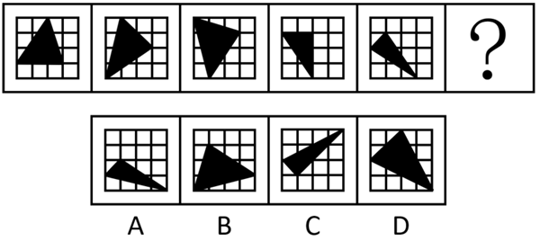

- **A**. A　✅
- **B**. B
- **C**. C
- **D**. D

**答案**：A

**官方解析**

元素组成基本相同，优先考虑位置规律。题干图形出现十六宫格，可以优先考虑内外分开看。观察发现，题干图形中黑色三角形均存在三个顶点，其中外圈的两个顶点在外圈依次逆时针平移一格，内圈的顶点在内圈依次逆时针平移一格，故？处图形也应符合此规律，只有A项符合。

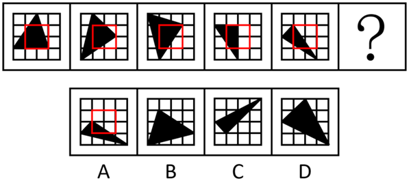

故正确答案为A。

---

## 第 2 题　qid 19526400 · 图形推理

从所给的四个选项中，选择最合适的一个填入问号处，使之呈现一定的规律性：

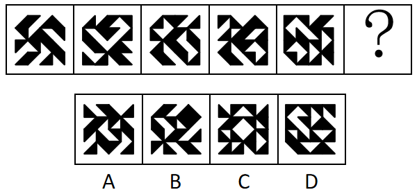

- **A**. A
- **B**. B
- **C**. C
- **D**. D　✅

**答案**：D

**官方解析**

元素组成相同，但无明显位置规律和属性规律，考虑数量规律。观察发现，题干图形均由不同形状小黑块连接而成，且黑色块之间围成封闭面，考虑面数量。题干图形面数量依次为0、1、2、3、4，故？处图形面数量应为5，只有D项符合。
故正确答案为D。

---

## 第 3 题　qid 19526427 · 图形推理

从所给四个选项中，选择最合适的一个填入问号处，使之呈现一定的规律性：

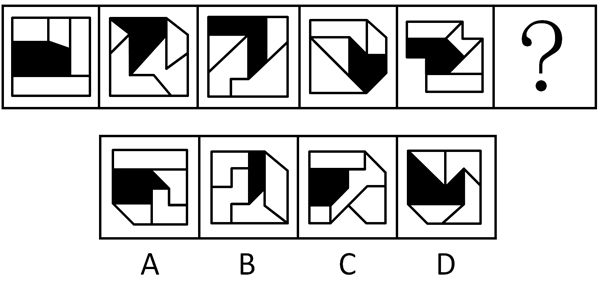

- **A**. A
- **B**. B
- **C**. C
- **D**. D　✅

**答案**：D

**官方解析**

元素组成不同，且每幅图均由几个图形拼接而成，考虑图形间关系。观察发现，题干图形均有一个黑块，黑块与4个白块共有4条公共边，且与每个白块均存在1条公共边，A项黑块与白块共有5条公共边，B项黑块与白块共有3条公共边，C项中黑块与右下角白块不存在公共边，排除A、B、C三项，只有D项符合。
故正确答案为D。

---

## 第 4 题　qid 19526396 · 图形推理

从所给的四个选项中，选择最合适的一个填入问号处，使之呈现一定的规律性：

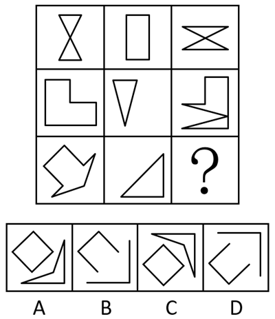

- **A**. A
- **B**. B
- **C**. C　✅
- **D**. D

**答案**：C

**官方解析**

元素组成相似，且有相同线条重复出现，优先考虑样式规律中的加减同异。九宫格优先看横行，观察发现，第一行中，图1和图2先求异，再逆时针旋转，即可得到图3；经验证，第二行满足此规律；第三行应用此规律，只有C项符合。

故正确答案为C。

---

## 第 5 题　qid 19526311 · 图形推理

从所给的四个选项中，选择最合适的一个填入问号处，使之呈现一定的规律性：

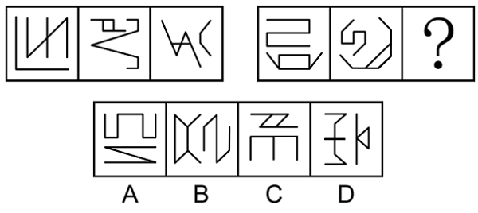

- **A**. A
- **B**. B　✅
- **C**. C
- **D**. D

**答案**：B

**官方解析**

元素组成不同，优先考虑属性规律。观察发现，题干图形均由2个图形组成，且出现等腰元素，考虑对称性，题干均由1个中心对称图形和1个轴对称图形构成，排除D项；继续观察发现，题干图形出现明显的多端点图形，考虑笔画数，题干第一组图形笔画数均为3，其中轴对称图形为一笔画，中心对称图形为两笔画，第二组前两个图形笔画数均为3，其中中心对称图形为一笔画，轴对称图形为两笔画，故？处图形的笔画数应为3，且中心对称图形为一笔画，轴对称图形为两笔画，只有B项符合。
故正确答案为B。

---

## 第 6 题　qid 19526397 · 图形推理

左边为由15个白色正方体和3个黑色正方体组合而成的多面体俯视图和左视图，其正视图可能是：

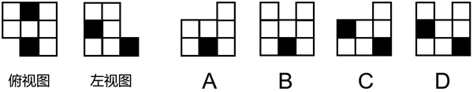

- **A**. A
- **B**. B　✅
- **C**. C
- **D**. D

**答案**：B

**官方解析**

本题考查三视图。题干中俯视图中间一列最下方为黑色正方形，左视图最右列只有最下方一个黑色正方形，则对应选项中正视图中间一列最下方为黑色正方形，排除C、D两项。

俯视图、左视图结合选项主视图可以确定立体图形，逐一分析A、B选项。

A项：结合题干两个视图和A项，可能的立体图形有以下5种情况（注意图④和图⑤两个箭头指向的正方体的下方为黑色正方体），如下图所示。此时在所有情况下，立体图形均只有12个白色正方体，而题干中所给为15个白色正方体，不符合题干要求，排除；

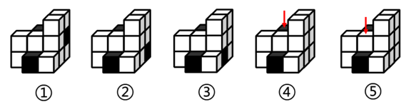

B项：结合题干两个视图和B项，可以确定立体图形（注意第二层左上角为黑色正方体），如下图所示。此时立体图形有15个白色正方体和3个黑色正方体，符合题干要求，当选。

故正确答案为B。

---

## 第 7 题　qid 19526329 · 图形推理

下图为由2个正方体组合而成的长方体，问这2个正方体的外表面展开图可能分别是：

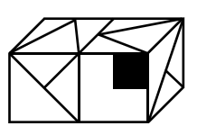

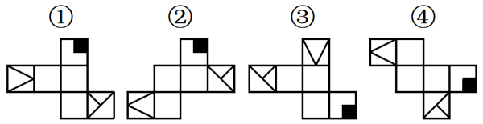

- **A**. ②和④
- **B**. ②和③
- **C**. ①和④
- **D**. ①和③　✅

**答案**：D

**官方解析**

将题干2个正方体的面标上字母序号，并在立体图形和外表面展开图的“T”字形面（面e和面g）中以“T”字形中线端点为起始点，顺时针描边标号，如下图所示。

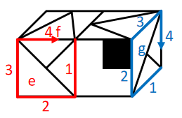

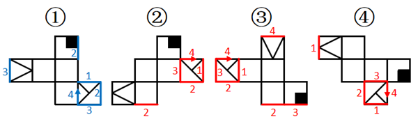

图①中，标出“T字形”面中对应的边2和边3后发现，二者与题干右侧正方体中面g的边2和边3对应一致，故图①可能是题干右侧正方体的外表面展开图；

图②中，标出“T字形”面中对应的边2和边3后发现，二者与题干右侧正方体中面g的边2和边3对应不一致，故图②不可能是题干右侧正方体的外表面展开图，标出“T字形”面中对应的边4后发现，与题干左侧正方体中面e的边4对应不一致，故图②不可能是题干左侧正方体的外表面展开图；

图③中，标出“T字形”面中对应的边4后发现，该公共边与题干左侧正方体中面e的边4对应一致，故图③可能是题干左侧正方体的外表面展开图；

图④中，标出“T字形”面中对应的边2和边3后发现，二者与题干右侧正方体中面g的边2和边3对应不一致，故图④不可能是题干右侧正方体的外表面展开图，标出“T字形”面中对应的边4后发现，与题干左侧正方体中面e的边4对应不一致，故图④不可能是题干左侧正方体的外表面展开图。

综上，2个正方体的外表面展开图可能是①和③，对应D项。

故正确答案为D。

---

## 第 8 题　qid 19526428 · 图形推理

左边为由12个白色正方体和3个灰色正方体组合而成的多面体前后两面直观图，问其可以由除哪项外的三个多面体组合而成？

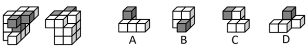

- **A**. A
- **B**. B　✅
- **C**. C
- **D**. D

**答案**：B

**官方解析**

本题考查立体拼合。题干立体图形可以由A、C、D三项旋转后拼合而成，具体过程如下图所示：

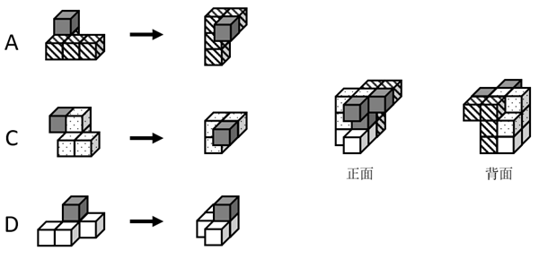

本题为选非题，故正确答案为B。

---

## 第 9 题　qid 19526253 · 图形推理

把下面的六个图形分为两类，使每一类图形都有各自的共同特征或规律，分类正确的一项是：

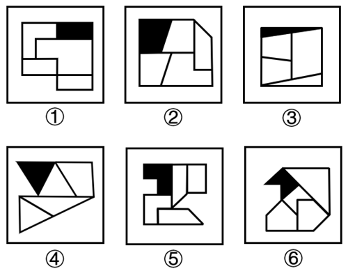

- **A**. ①②⑥，③④⑤
- **B**. ①②④，③⑤⑥　✅
- **C**. ①⑤⑥，②③④
- **D**. ①④⑥，②③⑤

**答案**：B

**官方解析**

元素组成不同，且无明显属性规律，优先考虑数量规律。观察发现，题干每幅图中均存在一个黑色面和四个白色面，但根据面的数量无法分组分类，故考虑面的细化。再次观察发现，每幅图中均有1-2个白色面形状与黑色面形状相同，故考虑相同形状的面，图①②④中黑色面的形状与2个白色面形状一致，图③⑤⑥中黑色面的形状与1个白色面形状一致，故图①②④为一组，图③⑤⑥为一组。
故正确答案为B。

---

## 第 10 题　qid 19526391 · 图形推理

把下面的六个图形分为两类，使每一类图形都有各自的共同特征或规律，分类正确的一项是：

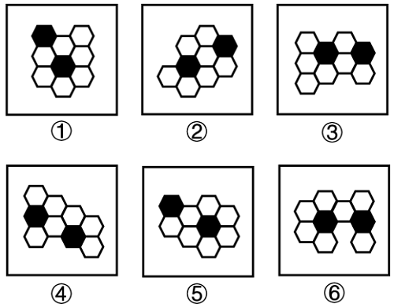

- **A**. ①②③，④⑤⑥
- **B**. ①③④，②⑤⑥
- **C**. ①③⑥，②④⑤　✅
- **D**. ①⑤⑥，②③④

**答案**：C

**官方解析**

本题为分组分类题目。元素组成相同，但无明显位置规律。观察发现，题干图形均出现两个黑块，在连接两个黑块的最短路径中，且图①③⑥中两个黑块均通过一条线连接，图②④⑤中两个黑块均通过一个面连接，即图①③⑥为一组，图②④⑤为一组。
故正确答案为C。

---

## 第 11 题　qid 19526243 · 定义判断

均变论认为，支配各种地质过程的法则在地质历史上没有发生过变化，现在起作用的各种自然营力在漫长的地质过程中具有普遍的均一性，即地质演变是一个渐变的过程，具有相同方式和相同的强度；地球上生物的种与种之间有过渡关系，生物进化过程是极其漫长的。灾变论认为，在整个地质发展的过程中，地球经常发生各种突如其来的、短暂的全球性灾难性变化，这些变化强烈地改变了地球的面貌；地球上生物的变化是反复多次灾变的结果。
根据上述定义，下列说法最能体现灾变论观点的是：

- **A**. “我们找不到开始的痕迹，也看不到结束的迹象”
- **B**. “地质记录是一部被鲜血和火焰写成的史诗”　✅
- **C**. “现在是通往过去的一把钥匙”
- **D**. “自然界里没有飞跃”

**答案**：B

**官方解析**

第一步：找出定义关键词。
均变论：“支配各种地质过程的法则在地质历史上没有发生过变化”、“现在起作用的各种自然营力在漫长的地质过程中具有普遍的均一性”、“地球上生物的种与种之间有过渡关系，生物进化过程是极其漫长的”。
灾变论：“地球经常发生各种突如其来的、短暂的全球性灾难性变化，这些变化强烈地改变了地球的面貌”、“地球上生物的变化是反复多次灾变的结果”。
第二步：逐一分析选项。
A项：“我们找不到开始的痕迹，也看不到结束的迹象”，体现了“支配各种地质过程的法则在地质历史上没有发生过变化”、“地球上生物的种与种之间有过渡关系，生物进化过程是极其漫长的”，符合“均变论”定义，不符合“灾变论”定义，排除；
B项：“地质记录是一部被鲜血和火焰写成的史诗”，“鲜血和火焰”隐喻的是灾难，体现了“地球经常发生各种突如其来的、短暂的全球性灾难性变化，这些变化强烈地改变了地球的面貌”，符合“灾变论”定义，当选；
C项：“现在是通往过去的一把钥匙”，体现了“支配各种地质过程的法则在地质历史上没有发生过变化”、“现在起作用的各种自然营力在漫长的地质过程中具有普遍的均一性”、“地球上生物的种与种之间有过渡关系，生物进化过程是极其漫长的”，符合“均变论”定义，不符合“灾变论”定义，排除；
D项：“自然界里没有飞跃”，体现了“地球上生物的种与种之间有过渡关系，生物进化过程是极其漫长的”，符合“均变论”定义，不符合“灾变论”定义，排除。
故正确答案为B。

---

## 第 12 题　qid 19526274 · 定义判断

波特五力模型是一种竞争分析工具，用于评估一个行业的竞争力和吸引力。该模型通过对同行业竞争对手的威胁、潜在进入者的威胁、替代品的威胁、上游供应商的议价能力和下游购买者的议价能力这五个方面的分析，帮助企业了解其所处行业的竞争环境，以制定相应的竞争策略。
根据上述定义，关于康复机器人行业，对下列问题的分析不能归入波特五力模型的是：

- **A**. 康复机器人行业准入门槛高吗？需要强大的技术能力和创新能力吗？
- **B**. 医院和康复中心患者规模如何？对于康复机器人的需求有多大？
- **C**. 与传统物理治疗等康复治疗方法相比，康复机器人有竞争力吗？
- **D**. 康复机器人企业内部各部门之间的协同合作程度高吗？　✅

**答案**：D

**官方解析**

第一步：找出定义关键词。
“同行业竞争对手的威胁”、“潜在进入者的威胁”、“替代品的威胁”、“上游供应商的议价能力”、“下游购买者的议价能力”、“帮助企业了解其所处行业的竞争环境，以制定相应的竞争策略”。
第二步：逐一分析选项。
A项：康复机器人行业准入门槛高吗？需要强大的技术能力和创新能力吗？问题中的“准入门槛”、“技术能力和创新能力”直接关系到潜在企业能否进入康复机器人行业，符合波特五力模型中的“潜在进入者的威胁”，符合定义，排除；
B项：医院和康复中心患者规模如何？对于康复机器人的需求有多大？问题中的“医院”和“康复中心”是康复机器人的“下游购买者”，“患者规模”与“需求程度”会直接影响购买者采购时的“议价能力”，符合波特五力模型中的“下游购买者的议价能力”，符合定义，排除；
C项：与传统物理治疗等康复治疗方法相比，康复机器人有竞争力吗？问题中的“传统物理治疗”是康复机器人的“替代方案”，是在分析“替代品”的竞争力对行业的威胁，符合波特五力模型中的“替代品的威胁”，符合定义，排除；
D项：康复机器人企业内部各部门之间的协同合作程度高吗？问题中的“企业内部各部门之间的协同合作程度”属于企业“内部管理”的范畴，不符合波特五力模型中的任何一个，不符合定义，当选。
本题为选非题，故正确答案为D。

---

## 第 13 题　qid 19526261 · 定义判断

选矿是指用物理、化学或者物理与化学相结合的方法，将原矿中的有用矿物与伴生的无用固定物质（脉石）或有害矿物分开的过程。选矿可显著提高矿石的质量，减少运输费用，降低冶炼成本，进而实现综合利用。
根据上述定义，下列没有体现选矿过程的是：

- **A**. 利用矿物颗粒电性的差别，在高压电场中挑选出白钨矿、赤铁矿等，通过电机分离除尘
- **B**. 利用水枪和洗矿槽等设备，将锡矿石中的泥土等杂质洗去，同时也可以将部分轻矿物冲走，实现锡石初步富集
- **C**. 经验丰富的老师傅通过敲击、光照、观察皮壳等方法对开采的翡翠原石进行筛选，挑选优质原石　✅
- **D**. 将铜矿矿石破碎到一定的粒度后，混以少量的食盐和煤粉隔氧加热，矿石中的铜便以金属状态析出，由此获得铜精矿

**答案**：C

**官方解析**

第一步：找出定义关键词。
“用物理、化学或者物理与化学相结合的方法”、“将原矿中的有用矿物与伴生的无用固定物质（脉石）或有害矿物分开的过程”。
第二步：逐一分析选项。
A项：利用矿物颗粒电性的差别，属于物理方法，符合“用物理、化学或者物理与化学相结合的方法”，在高压电场中挑选出白钨矿、赤铁矿等（有用物质），通过电机分离除尘（伴生的无用固定物质），符合“将原矿中的有用矿物与伴生的无用固定物质（脉石）或有害矿物分开的过程”，符合定义，排除；
B项：利用水枪和洗矿槽等设备清洗锡矿石，属于物理方法，符合“用物理、化学或者物理与化学相结合的方法”，将锡矿石中的泥土等杂质（伴生的无用固定物质）洗去，同时也可以将部分轻矿物冲走，实现锡石（有用矿物）初步富集，符合“将原矿中的有用矿物与伴生的无用固定物质（脉石）或有害矿物分开的过程”，符合定义，排除；
C项：通过敲击、光照、观察皮壳等方法对开采的翡翠原石进行筛选，挑选优质原石，仅是对原石整体品质进行判断与挑选，不涉及对原石中的物质分开的过程，不符合“将原矿中的有用矿物与伴生的无用固定物质（脉石）或有害矿物分开的过程”，不符合定义，当选；
D项：将铜矿矿石破碎到一定的粒度后，属于物理方法，混以少量的食盐和煤粉隔氧加热，属于化学方法，符合“用物理、化学或者物理与化学相结合的方法”，矿石中的铜（有用矿物）便以金属状态析出，由此获得铜精矿，符合“将原矿中的有用矿物与伴生的无用固定物质（脉石）或有害矿物分开的过程”，符合定义，排除。
本题为选非题，故正确答案为C。

---

## 第 14 题　qid 19526392 · 定义判断

根据动词对其后所接的宾语小句（作宾语的句子）真值的不同预设能力可以把现代汉语中的相关动词分为叙实动词、非叙实动词和反叙实动词。叙实动词的肯定式和否定式都预设其宾语小句为真；非叙实动词的肯定式和否定式都不预设其宾语小句为真，也不预设其宾语小句为假；反叙实动词的肯定式和否定式都预设其宾语小句为假。
根据上述定义，下列画线的动词属于非叙实动词的是：

- **A**. 
我<u>听说</u>他来过这里
　✅
- **B**. 
我<u>庆幸</u>听了你的建议

- **C**. 
我<u>知道</u>你帮助过我

- **D**. 
我<u>幻想</u>成为一只小鸟

**答案**：A

**官方解析**

第一步：找出定义关键词。
叙实动词：“肯定式和否定式都预设其宾语小句为真”；
非叙实动词：“肯定式和否定式都不预设其宾语小句为真，也不预设其宾语小句为假”；
反叙实动词：“肯定式和否定式都预设其宾语小句为假”。
第二步：逐一分析选项。
A项：“我听说他来过这里”中的“听说”只是陈述信息的来源，没有预设“来过这里”为真或为假，符合“肯定式和否定式都不预设其宾语小句为真，也不预设其宾语小句为假”，符合“非叙实动词”定义，当选；
B项：“我庆幸听了你的建议”中的“庆幸”意味着听了建议是已经发生的事实，是预设其为真，符合“肯定式和否定式都预设其宾语小句为真”，符合“叙实动词”定义，不符合“非叙实动词”定义，排除；
C项：“我知道你帮助过我”中的“知道”意味着帮助过我是真实存在的事实，是预设其为真，符合“肯定式和否定式都预设其宾语小句为真”，符合“叙实动词”定义，不符合“非叙实动词”定义，排除；
D项：“我幻想成为一只小鸟”中的“幻想”是不可能发生的事，是预设其为假，符合“肯定式和否定式都预设其宾语小句为假”，符合“反叙实动词”定义，不符合“非叙实动词”定义，排除。
故正确答案为A。

---

## 第 15 题　qid 19526298 · 定义判断

动作预期是指运动员在比赛过程中，根据已有信息，对即将发生的动作结果进行预测的过程。在这一过程中，运动员主要依赖两类信息：运动学信息和情境先验信息。运动学信息包括对手的动作、器材的运动轨迹或队员之间的相对位置，情境先验信息则涉及比赛情境中事件发生的概率。
根据上述定义，下列不涉及上述任何一种信息的是：

- **A**. 篮球队员甲在双方比分紧咬的情况下，基于对手今日比赛罚篮命中率不高，在对手投篮时选择直接犯规
- **B**. 网球运动员乙知道对手在比赛前有一系列习惯性动作，包括整理球衣、球裤、头发等，暗自提醒自己不要被其干扰　✅
- **C**. 羽毛球双打运动员丙发现对方准备接发球的球员位置稍微靠前，可能来不及转身或后退接球，便发了个后场球
- **D**. 乒乓球运动员丁发现对方发过来的球位置较低、速度较慢，极有可能擦网变线，便没有后退，向前伸拍做好接球准备

**答案**：B

**官方解析**

第一步：找出定义关键词。
动作预期：“运动员”、“在比赛过程中”、“根据已有信息，对即将发生的动作结果进行预测”；
运动学信息：“对手的动作”、“器材的运动轨迹”、“队员之间的相对位置”；
情境先验信息：“比赛情境中事件发生的概率”。
第二步：逐一分析选项。
A项：篮球队员甲，符合“运动员”，根据对手今日比赛罚篮命中率不高，在对手投篮时选择直接犯规，即预测犯规后对手会罚篮不中，符合“在比赛过程中”、“根据已有信息，对即将发生的动作结果进行预测”、“比赛情境中事件发生的概率”，符合“情境先验信息”定义，排除；
B项：网球运动员乙知道对手在比赛前有一系列习惯性动作，不符合“在比赛过程中”，且乙是暗自提醒自己不要被干扰，未利用这些信息进行预测，不符合“对即将发生的动作结果进行预测”，不符合“动作预期”定义，进而也不符合“运动学信息”定义和“情境先验信息”定义，当选；
C项：羽毛球双打运动员丙，符合“运动员”，根据对方准备接发球的球员位置稍微靠前，预测对方来不及转身或后退接球，符合“在比赛过程中”、“根据已有信息，对即将发生的动作结果进行预测”、“比赛情境中事件发生的概率”，符合“情境先验信息”定义，排除；
D项：乒乓球运动员丁，符合“运动员”，根据对方发过来的球位置较低、速度较慢，预测球会擦网变线，符合“在比赛过程中”、“根据已有信息，对即将发生的动作结果进行预测”、“器材的运动轨迹”、“比赛情境中事件发生的概率”，符合“运动学信息”定义，也符合“情境先验信息”定义，排除。
本题为选非题，故正确答案为B。

---

## 第 16 题　qid 19526430 · 定义判断

设备利用率是指每年度设备实际使用时间占计划用时的百分比。设备完好率是根据各类设备完好标准，对企业设备进行逐台检查所确定的完好台数与设备总台数之比。设备总台数是指企业在用的、备用的、停用的以及正在检修的全部生产设备台数，完好台数是指设备性能良好、运转正常，且原料、燃料、油料等消耗正常的设备台数。设备负荷率是指设备需要台数与实际选用设备的台数之比。设备闲置率是指闲置不用的设备台数与设备总台数的比值。
根据上述定义，下列说法错误的是：

- **A**. 若年度设备实际使用时间为9个月、设备利用率为75%，则计划用时为12个月
- **B**. 企业正在检修的、零部件出现磨损或腐蚀的设备应当纳入设备总台数的计算中
- **C**. 设备负荷率可用来考核设备选用的合理性程度，可用于量化分析设备运行状态
- **D**. 设备闲置率可以反映出设备资产投资的回报程度，其数值一般小于设备完好率　✅

**答案**：D

**官方解析**

第一步：找出定义关键词。
设备利用率：“每年度设备实际使用时间占计划用时的百分比”；
设备完好率：“完好台数与设备总台数之比”；
设备总台数：“企业在用的、备用的、停用的以及正在检修的全部生产设备台数”；
完好台数：“设备性能良好、运转正常，且原料、燃料、油料等消耗正常的设备台数”；
设备负荷率：“设备需要台数与实际选用设备的台数之比”；
设备闲置率：“闲置不用的设备台数与设备总台数的比值”。
第二步：逐一分析选项。
A项：年度设备实际使用时间为9个月、设备利用率为75%，根据设备利用率为“每年度设备实际使用时间占计划用时的百分比”，计划用时应为9个月/75%=12个月，说法正确，排除；
B项：设备总台数为“企业在用的、备用的、停用的以及正在检修的全部生产设备台数”，所以设备总台数包括正在检修的设备台数，即使零部件出现磨损或腐蚀，也应计入设备总台数，说法正确，排除；
C项：设备负荷率为“设备需要台数与实际选用设备的台数之比”，这个比率可以反映设备选用是否合理，该比率大于1表示设备不足，该比率小于1表示设备有余，可用于量化分析设备运行状态，说法正确，排除；
D项：设备闲置率=闲置台数/总台数,设备完好率=完好台数/总台数，完好设备可能闲置，不完好设备也可能在用（例：10台设备中，闲置8台（3台完好+5台不完好），完好台数共5台，此时设备闲置率80%＞设备完好率50%），所以设备闲置率与设备完好率没有必然的数值大小关系，说法错误，当选。
本题为选非题，故正确答案为D。

---

## 第 17 题　qid 19526309 · 定义判断

分项累进淘汰法是指在对植株进行选种时，根据性状的相对重要性顺序排列，先按第一重要性状进行选择，然后在入选株内按第二重要性状进行选择，依此顺次累进的一种选种方法。
根据上述定义，下列对南瓜的选种方法属于分项累进淘汰法的是：

- **A**. 按株选目标性状出现的先后顺序，先淘汰蔓生植株，然后淘汰第一雌花节位高的植株，再淘汰单瓜重量低的植株
- **B**. 首先在群体内选择无病植株，再在这些无病植株内选择丰产性好的植株，再根据产量性状顺次进行选择　✅
- **C**. 在收获时按照果实的大小、果型等性状初选，在初选瓜内再按照综合性状入选标准进行复选
- **D**. 将需要鉴定的性状，如蔓长、单瓜重、果实籽粒数、籽粒长等，分别规定一个最低的入选标准，将低于入选标准的淘汰

**答案**：B

**官方解析**

第一步：找出定义关键词。
“根据性状的相对重要性顺序排列进行选择”、“先按第一重要性状进行选择，然后在入选株内按第二重要性状进行选择”、“顺次累进”。
第二步：逐一分析选项。
A项：按株选目标性状出现的先后顺序进行淘汰，并非根据性状的相对重要性顺序排列进行选择，不符合“根据性状的相对重要性顺序排列进行选择”，不符合定义，排除；
B项：群体内的植株中无病是存活的基础，是第一重要性状，丰产性好体现经济价值，是第二重要性状，再根据产量性状顺次进行选择，在群体内先选择无病植株，再在这些无病植株内选择丰产性好的植株，最后根据产量性状顺次进行选择，是根据性状的相对重要性顺序排列进行选择，符合“根据性状的相对重要性顺序排列进行选择”、“先按第一重要性状进行选择，然后在入选株内按第二重要性状进行选择”、“顺次累进”，符合定义，当选；
C项：按照果实的大小、果型等性状初选，没有明确体现第一重要性状，且再按照综合性状入选标准进行复选，并非按照性状的相对重要性顺序排列进行选择，不符合“根据性状的相对重要性顺序排列进行选择”、“先按第一重要性状进行选择，然后在入选株内按第二重要性状进行选择”，不符合定义，排除；
D项：将需要鉴定的多个性状分别规定最低的入选标准，将低于入选标准的淘汰，没有明确体现性状的重要性顺序，并非按照性状的相对重要性顺序排列进行选择，不符合“根据性状的相对重要性顺序排列进行选择”、“先按第一重要性状进行选择，然后在入选株内按第二重要性状进行选择”，不符合定义，排除。
故正确答案为B。

---

## 第 18 题　qid 19526398 · 定义判断

组织结构可以划分为以下几种类型：（1）直线型组织结构，即每一个部门只对其直接的下属部门下达工作指令，不能越级指挥，每一个部门也只有一个直接的上级部门；（2）职能型组织结构，即每一个部门都可对其下属部门下达工作指令，每一个下属部门可能得到不同上级部门下达的多个工作指令；（3）直线职能型组织结构，即在主管之下设置相应的职能部门，实行主管统一指挥与职能部门参谋指导相结合的管理方式，各部门既受上级的管理，又受同级职能管理部门的业务指导和监督；（4）事业部组织结构，即由相对独立的事业部组成的组织结构，通常按照地区或项目来划分事业部，每个事业部拥有较大的自主权。

根据上述定义，下列组织结构图代表的组织结构类型属于：

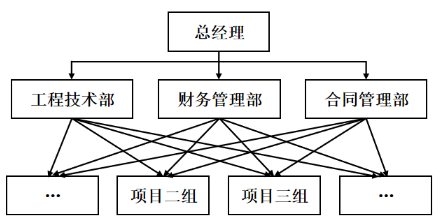

- **A**. 直线型组织结构
- **B**. 职能型组织结构　✅
- **C**. 直线职能型组织结构
- **D**. 事业部组织结构

**答案**：B

**官方解析**

第一步：找出定义关键词。
直线型组织结构：“每一个部门只对其直接的下属部门下达工作指令”、“不能越级指挥”、“每一个部门也只有一个直接的上级部门”；
职能型组织结构：“每一个部门都可对其下属部门下达工作指令”、“每一个下属部门可能得到不同上级部门下达的多个工作指令”；
直线职能型组织结构：“在主管之下设置相应的职能部门，实行主管统一指挥与职能部门参谋指导相结合的管理方式”、“各部门既受上级的管理，又受同级职能管理部门的业务指导和监督”；
事业部组织结构：“由相对独立的事业部组成的组织结构”、“通常按照地区或项目来划分事业部”、“每个事业部拥有较大的自主权”。
第二步：逐一分析选项。
A项：结构图中项目二组和项目三组等存在多个上级部门下达指令，不符合“每一个部门也只有一个直接的上级部门”，不符合“直线型组织结构”定义，排除；
B项：结构图中的每一个部门都有上级部门，且项目二组和项目三组等存在多个上级部门下达工作指令，符合“每一个部门都可对其下属部门下达工作指令”、“每一个下属部门可能得到不同上级部门下达的多个工作指令”，符合“职能型组织结构”定义，当选；
C项：结构图中的每个部门都不存在同级职能管理部门的业务指导和监督，不符合“各部门既受上级的管理，又受同级职能管理部门的业务指导和监督”，不符合“直线职能型组织结构”定义，排除；
D项：结构图中工程技术部、财务管理部、合同管理部以及项目二组、项目三组等都需要按照上级下达的指令工作，不符合“每个事业部拥有较大的自主权”，不符合“事业部组织结构”定义，排除。
故正确答案为B。

---

## 第 19 题　qid 19526356 · 定义判断

《中国共产党纪律处分条例》规定，主动交代本人应当受到党纪处分的问题，可以从轻或者减轻处分。这里所称的主动交代主要包括两种情况：一是涉嫌违纪的党员在组织谈话函询、初步核实前向有关组织交代自己的问题。二是在谈话函询、初步核实和立案审查期间交代组织未掌握的问题。
假定下列人员均受该条例约束，根据上述定义，下列属于主动交代的是：

- **A**. 甲在参加违纪违法典型案例警示教育大会后，主动找到单位领导反映同事的违纪问题
- **B**. 乙在组织对其进行廉政谈话时，组织举证一项他才承认一项，对未涉及的情况闭口不谈
- **C**. 丙在纪委对其个人财产有关事项进行函询时，将其利用职权为自己和他人谋利的情况如实交代　✅
- **D**. 丁在纪委对其立案审查期间，面对确凿的证据，交代了之前没有交代的收受大额礼金的问题

**答案**：C

**官方解析**

第一步：找出定义关键词。
“主动交代本人应当受到党纪处分的问题”、“涉嫌违纪的党员在组织谈话函询、初步核实前向有关组织交代自己的问题”、“在谈话函询、初步核实和立案审查期间交代组织未掌握的问题”。
第二步：逐一分析选项。
A项：甲主动找到单位领导反映同事的违纪问题，并非交代本人的违纪问题，不符合“主动交代本人应当受到党纪处分的问题”，不符合定义，排除；
B项：乙在组织对其进行廉政谈话时，组织举证一项他才承认一项，不符合“主动交代本人应当受到党纪处分的问题”，不符合定义，排除；
C项：丙在纪委对其个人财产有关事项进行函询时，如实交代了自己利用职权谋利的问题，符合“在谈话函询、初步核实和立案审查期间交代组织未掌握的问题”，符合定义，当选；
D项：丁在纪委立案审查期间，面对确凿证据才交代了之前未交代的收受大额礼金的问题，不符合“主动交代本人应当受到党纪处分的问题”、“在谈话函询、初步核实和立案审查期间交代组织未掌握的问题”，不符合定义，排除。
故正确答案为C。

---

## 第 20 题　qid 19526431 · 定义判断

心理护理是指在护理过程中，护士发现了影响患者治疗及康复的心理问题后，运用心理学的理论作指导，通过自身的语言、态度和行为等，或通过改善环境（包括人文环境及物理环境）去影响或调整患者的心理状态和行为，进而帮助患者康复的护理方法。
根据上述定义，下列没有体现心理护理的是：

- **A**. 护士协助医生让青少年患者进行心理量表的测试，进而评估患者心理问题的类型　✅
- **B**. 护士发现患儿害怕用药后，在更换伤口敷料时动作轻柔、耐心细致，使患儿不再抵触换药
- **C**. 护士建议家属及时安抚患者的消极情绪并多加陪伴，以增强患者战胜疾病的信心
- **D**. 针对患者手术前的紧张情绪，护士教会患者放松的技巧，帮助患者正确对待手术

**答案**：A

**官方解析**

第一步：找出定义关键词。
“在护理过程中，护士发现了影响患者治疗及康复的心理问题后”、“通过自身的语言、态度和行为等，或通过改善环境（包括人文环境及物理环境）去影响或调整患者的心理状态和行为”、“帮助患者康复”。
第二步：逐一分析选项。
A项：护士协助医生让青少年患者进行心理量表测试，评估心理问题类型，是心理问题的评估和发现过程，不符合“通过自身的语言、态度和行为等，或通过改善环境（包括人文环境及物理环境）去影响或调整患者的心理状态和行为”、“帮助患者康复”，不符合定义，当选；
B项：护士发现患儿害怕用药，符合“在护理过程中，护士发现了影响患者治疗及康复的心理问题后”，在更换伤口敷料时动作轻柔、耐心细致，使患儿不再抵触换药，符合“通过自身的语言、态度和行为等，或通过改善环境（包括人文环境及物理环境）去影响或调整患者的心理状态和行为”、“帮助患者康复”，符合定义，排除；
C项：护士建议家属及时安抚患者的消极情绪并多加陪伴，以增强患者战胜疾病的信心，符合“在护理过程中，护士发现了影响患者治疗及康复的心理问题后”、“通过自身的语言、态度和行为等，或通过改善环境（包括人文环境及物理环境）去影响或调整患者的心理状态和行为”、“帮助患者康复”，符合定义，排除；
D项：针对患者手术前的紧张情绪，护士教会患者放松的技巧，帮助患者正确对待手术，符合“在护理过程中，护士发现了影响患者治疗及康复的心理问题后”，“通过自身的语言、态度和行为等，或通过改善环境（包括人文环境及物理环境）去影响或调整患者的心理状态和行为”、“帮助患者康复”，符合定义，排除。
本题为选非题，故正确答案为A。

---

## 第 21 题　qid 19526432 · 类比推理

与“军事演习：作战能力”在逻辑关系上最相近的是：

- **A**. 正当防卫：人身危险
- **B**. 定速巡航：车辆速度
- **C**. 财政赤字：通货膨胀
- **D**. 土壤改良：作物产量　✅

**答案**：D

**官方解析**

第一步：判断题干词语间逻辑关系。
军事演习的目的是提升作战能力，二者为方式目的对应关系。
第二步：判断选项词语间逻辑关系。
A项：正当防卫的目的是防御人身危险，并非提升人身危险，与题干逻辑关系不一致，排除；
B项：定速巡航的目的是控制并维持车辆速度，并非提升车辆速度，与题干逻辑关系不一致，排除；
C项：财政赤字可能会导致通货膨胀，二者为因果对应关系，与题干逻辑关系不一致，排除；
D项：土壤改良的目的是提升作物产量，二者为方式目的对应关系，与题干逻辑关系一致，当选。
故正确答案为D。

---

## 第 22 题　qid 19526290 · 类比推理

与“口腔：唾液：淀粉酶”在逻辑关系上最相近的是：

- **A**. 种子：孜然：调味品
- **B**. 叶片：叶肉：叶绿体
- **C**. 松树：松脂：树脂醇　✅
- **D**. 试剂：试纸：pH试纸

**答案**：C

**官方解析**

第一步：判断题干词语间逻辑关系。
唾液是口腔的分泌物，前两词是对应关系，淀粉酶是唾液的组成成分，后两词是组成关系。
第二步：判断选项词语间逻辑关系。
A项：孜然是一种常用的中草药，其种子可以制作为调味品，与题干逻辑关系不一致，排除；
B项：叶肉是叶片的组成部分，前两词是组成关系，与题干逻辑关系不一致，排除；
C项：松脂是松树的分泌物，前两词是对应关系，树脂醇是松脂的组成成分，后两词是组成关系，与题干逻辑关系一致，当选；
D项：试纸是一种浸渍化学试剂的纸质检测工具，试剂和试纸是配套使用的对应关系，与题干逻辑关系不一致，排除。
故正确答案为C。

---

## 第 23 题　qid 19526433 · 类比推理

与“减数：被减数：差”在逻辑关系上最相近的是：

- **A**. 粮食产量：播种面积：粮食单产
- **B**. 溶质质量：溶液质量：溶剂质量　✅
- **C**. 可售天数：库存总量：日均销量
- **D**. 间隔天数：结束日期：开始日期

**答案**：B

**官方解析**

第一步：判断题干词语间逻辑关系。
被减数-减数=差，三者为减法运算的对应关系。
第二步：判断选项词语间逻辑关系。
A项：粮食单产×播种面积=粮食产量，三者为乘法运算的对应关系，与题干逻辑关系不一致，排除；
B项：溶液质量-溶质质量=溶剂质量，三者为减法运算的对应关系，与题干逻辑关系一致，当选；
C项：库存总量÷日均销量=可售天数，三者为除法运算的对应关系，与题干逻辑关系不一致，排除；
D项：当结束日期和开始日期在同一月份时，结束日期-间隔天数-1=开始日期；当结束日期和开始日期不在同一月份时，计算间隔天数不能直接相减，三者不是减法运算的对应关系，与题干逻辑关系不一致，排除。
故正确答案为B。

---

## 第 24 题　qid 19526255 · 类比推理

颅内疾病 对于 （    ） 相当于 （    ） 对于 岩石断裂
依次填入括号中最恰当的是：

- **A**. 颅内感染；岩石熔融
- **B**. 机体疾病；地壳应力
- **C**. 核磁共振；地下采样
- **D**. 视野缺失；冰川运动　✅

**答案**：D

**官方解析**

逐一代入选项。
A项：颅内感染是颅内疾病的一种，二者为种属关系；岩石熔融和岩石断裂是两种不同的地质现象，二者为并列关系，前后逻辑关系不一致，排除；
B项：颅内疾病是机体疾病的一种，二者为种属关系；地壳应力是导致岩石断裂的原因，二者为因果关系，前后逻辑关系不一致，排除；
C项：核磁共振是用来诊断颅内疾病的方法，二者为诊断方法与疾病的对应关系；地下采样可以判断岩石是否有断裂，但顺序反了，前后逻辑关系不一致，排除；
D项：颅内疾病会导致视野缺失，二者为因果对应关系；冰川运动会导致岩石断裂，二者为因果对应关系，前后逻辑关系一致，当选。
故正确答案为D。

---

## 第 25 题　qid 19526268 · 逻辑判断

如果用一个圆来表示词语所指称的对象的集合，那么以下哪项中画横线词语之间的关系符合下图？

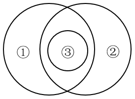

- **A**. 
船舶按用途分为<u>军用船舶</u>（①）和民用船舶两大类，潜艇、<u>航空母舰</u>（③）、驱逐舰等都属于军用船舶；按推进动力分为机动船和<u>非机动船</u>（②）

- **B**. 
<u>水杉</u>（③）是我国的特有树种，属于<u>落叶树</u>（①），是一种高大的<u>乔木</u>（②），是世界上珍稀的“活化石”植物
　✅
- **C**. 
图书按照读者群可分为<u>少儿读物</u>（③）和成人读物等；按照载体可分为纸质书和<u>电子书</u>（②）等；按照学科可分为历史书、文学书和<u>哲学书</u>（①）等

- **D**. 
大熊猫属于<u>哺乳动物</u>（①），是<u>中国特有动物</u>（②），被列为<u>中国国家一级保护野生动物</u>（③）

**答案**：B

**官方解析**

第一步：判断题干词语间逻辑关系。
根据题干图形可知，①和②是交叉关系；③属于①，③和①是种属关系；③属于②，③和②是种属关系。
第二步：判断选项词语间逻辑关系。
A项：航空母舰（③）是指军队专用的机动船只，与非机动船（②）不是种属关系，与题干逻辑关系不一致，排除；
B项：落叶树（①）和乔木（②）是交叉关系；水杉（③）属于落叶树（①），③和①是种属关系；水杉（③）属于乔木（②），③和②是种属关系，与题干逻辑关系一致，当选；
C项：少儿读物（③）和电子书（②）是交叉关系，不是种属关系，与题干逻辑关系不一致，排除；
D项：中国国家一级保护野生动物（③）和哺乳动物（①）是交叉关系，不是种属关系，与题干逻辑关系不一致，排除。
故正确答案为B。

---

## 第 26 题　qid 19526435 · 逻辑判断

研究发现，受人喜爱、知名度高的物种更易成为科研人员研究的对象。有观点认为，每一物种都有研究的意义和价值，科研人员不应对研究对象差别对待，但反对者却认为，科学研究进行重点突破比“一视同仁”更有意义，因为把有限的科研资源用在合适的地方，才能更好地平衡投入与回报。
以下哪项如果为真，没有支持反对者的观点？

- **A**. 关系人类基本需求的粮食作物，家禽家畜等产能的不断增长，得益于当初人们对其进行选择性的专门研究
- **B**. 对那些生长周期短、基因组简单且分布广泛的模式生物进行重点研究更易揭示生命科学的普通规律
- **C**. 由于文化、知名度等原因，对某些物种的保护性研究对唤醒人们的生态保护意识具有特殊的号召力和吸引力
- **D**. 网络上搜索到关于树袋熊的相关论文有5000多篇，而更为濒危的昆士兰毛吻袋熊的论文则不到1000篇　✅

**答案**：D

**官方解析**

第一步：找出论点和论据。
论点：科学研究进行重点突破比“一视同仁”更有意义。
论据：把有限的科研资源用在合适的地方，才能更好地平衡投入与回报。
本题论据说的是“把有限的科研资源用在合适地方才能更好地平衡投入与回报”，论点说的是“科学研究进行重点突破更有意义”，从论据可以合理推出论点，因此论据和论点话题一致，加强优先考虑补充论据，且本题为选非题，将可以加强的选项排除即可。
第二步：逐一分析选项。
A项：该项指出人类需求的粮食作物、家禽家畜等产能的增长得益于对其进行的专门研究，举例说明科学研究进行重点突破比“一视同仁”确实更有意义，补充论据，可以加强，排除；
B项：该项指出对生长周期短、基因组简单且分布广泛的模式生物进行重点研究更易揭示生命科学的普通规律，解释了为什么科学研究进行重点突破比“一视同仁”更有意义，补充论据，可以加强，排除；
C项：该项指出因文化、知名度等原因，对某些物种的保护性研究对唤醒人们的生态保护意识具有特殊的号召力和吸引力，解释了为什么科学研究进行重点突破比“一视同仁”更有意义，补充论据，可以加强，排除；
D项：该项指出濒危昆士兰毛吻袋熊的相关论文相比于树袋熊的相关论文更少，未提及科学研究是否要进行重点突破，与论点说的科学研究进行重点突破更有意义无关，话题不一致，无法加强，当选。
本题为选非题，故正确答案为D。

---

## 第 27 题　qid 19526390 · 逻辑判断

部分研究认为，白垩纪陆地生态系统的变革是由植物、昆虫、脊椎动物与地质过程等多个要素相互作用推动的，形成了一个高度协同演化的系统结构。鉴于这一机制在当时造就了复杂而稳定的生态格局，有学者提出，现代陆地生态系统的高度复杂性，正是这种古老协同机制延续和演化的结果。
以下哪项如果为真，最能削弱上述学者的观点？

- **A**. 在地质记录中，白垩纪末期的生态危机主要影响海洋系统，而陆地系统显示出相对稳定的演替趋势
- **B**. 对白垩纪地层的系统分析表明，植物、昆虫、脊椎动物与地质过程的演化几乎是在同一时期进行的
- **C**. 现代陆地生态系统的复杂性主要受群落内部随机扰动、自组织演化和外源干扰的共同影响，与白垩纪显著不同　✅
- **D**. 被子植物的全球扩张早于部分动物类群多样化，其当时对生态结构的主导作用可能被高估

**答案**：C

**官方解析**

第一步：找出论点和论据。

论点：现代陆地生态系统的高度复杂性，正是这种古老协同机制延续和演化的结果。

论据：白垩纪陆地生态系统的变革是由植物、昆虫、脊椎动物与地质过程等多个要素相互作用推动的，形成了一个高度协同演化的系统结构。鉴于这一机制在当时造就了复杂而稳定的生态格局。

从论据“白垩纪”高度协同演化的系统结构造就了复杂而稳定的生态格局，推出“现代”也是同样的情况，在这种“时期不同”的文段结构下，可以考拆桥，即“白垩纪的情况现代”。

第二步：逐一分析选项。

A项：指出白垩纪末期的生态危机对海洋系统和陆地系统的不同影响，与论点讨论的“白垩纪时期陆地生态系统高度协同演化的机制影响了现代陆地生态系统”无关，无法削弱，排除；

B项：指出白垩纪时期植物、昆虫、脊椎动物与地质过程的演化几乎是在同一时期进行的，说明白垩纪时期陆地生态系统高度协同演化，与论点讨论的“白垩纪时期陆地生态系统高度协同演化的机制影响了现代陆地生态系统”无关，无法削弱，排除；

C项：指出现代陆地生态系统的复杂性与白垩纪显著不同，说明不能根据白垩纪的情况推出现代，拆桥项，可以削弱，当选；

D项：指出被子植物的全球扩张对生态结构的主导作用可能被高估，与论点讨论的“白垩纪时期陆地生态系统高度协同演化的机制影响了现代陆地生态系统”无关，无法削弱，排除。

故正确答案为C。

---

## 第 28 题　qid 19526434 · 逻辑判断

近年来，盲盒等“非确定性产品”的市场规模迅速扩张，有分析人士指出，非确定性产品的热销说明有相当一部分消费者受到感受性消费动机的驱动，不同于实用性消费动机对商品实用价值的看重，感受性消费动机更看重商品带来的主观体验。
以下哪项如果为真，不能支持上述分析人士的观点？

- **A**. 盲盒等产品通常设计精美，能够给消费者带来愉悦的审美体验
- **B**. 限量款盲盒产品吸引许多消费者以投资为目的购买并加价转手　✅
- **C**. 许多盲盒产品设计有隐藏款，消费者开出时会感受到惊喜、满足
- **D**. 非确定性产品制造的信息缺口能够激发部分消费者强烈的好奇心

**答案**：B

**官方解析**

第一步：找出论点和论据。
论点：非确定性产品的热销说明有相当一部分消费者受到感受性消费动机的驱动，不同于实用性消费动机对商品实用价值的看重，感受性消费动机更看重商品带来的主观体验。
论据：无。
本题只有论点，没有论据，加强优先考虑补充论据。本题为选非题，找出可以加强的选项排除即可。
第二步：逐一分析选项。
A项：选项指出盲盒能够给消费者带来愉悦的审美体验，说明盲盒等“非确定性产品”能提供主观审美体验，即有消费者受到感受性消费动机的驱动而购买盲盒，补充论据，可以加强，排除；
B项：选项指出限量款盲盒吸引许多消费者以投资为目的购买并加价转手，说明消费者购买限量款盲盒的动机是获利，而不是受到感受性消费动机的驱动，无法加强，当选；
C项：选项指出消费者开出隐藏款盲盒时会感受到惊喜、满足，说明盲盒等“非确定性产品”能提供惊喜等主观情绪体验，即有消费者受到感受性消费动机的驱动而购买盲盒，补充论据，可以加强，排除；
D项：选项指出非确定性产品制造的信息缺口能够激发部分消费者的好奇心，说明非确定性产品能激发好奇心等主观心理感受，即有消费者受到感受性消费动机的驱动而购买盲盒，补充论据，可以加强，排除。
本题为选非题，故正确答案为B。

---

## 第 29 题　qid 19526437 · 逻辑判断

在过去几十年，某大型沿海河口的河岸和沼泽边缘不断被侵蚀且侵蚀速度逐渐加快，这使得河口的湿地退化，生态环境变得脆弱。同时，人们发现该河口中沼泽蟹的数量持续增加，这加剧了沼泽边缘的退缩。因此，可以适度引入海獭来减缓沼泽边缘的侵蚀。
以下除哪项外，均能支持上述论证？

- **A**. 沼泽蟹会在泥沙中挖掘洞穴，这是导致沼泽边缘不断退缩的主要原因
- **B**. 该地区原有的海獭曾因人类活动而消失，重新引入不易引发生态失衡
- **C**. 近年来，受海平面上升和潮汐冲刷的影响，许多河口都出现了湿地退化　✅
- **D**. 海獭是沼泽蟹的天敌，包括沼泽蟹在内的无脊椎动物是海獭的主要食物

**答案**：C

**官方解析**

第一步：找出论点和论据。
论点：可以适度引入海獭来减缓沼泽边缘的侵蚀。
论据：某大型沿海河口的河岸和沼泽边缘不断被侵蚀且侵蚀速度逐渐加快，这使得河口的湿地退化，生态环境变得脆弱。同时，人们发现该河口中沼泽蟹的数量持续增加，这加剧了沼泽边缘的退缩。
本题论点说的是引入海獭来减缓沼泽边缘的侵蚀，而论据说的是河岸和沼泽边缘不断被侵蚀且侵蚀速度逐渐加快，同时沼泽蟹数量增加，加剧了沼泽边缘退缩，论点和论据话题不一致，加强优先考虑搭桥，且本题为选非题，将可以加强的选项排除即可。
第二步：逐一分析选项。
A项：选项指出了沼泽蟹导致沼泽边缘不断退缩的主要原因，补充论据，可以加强，排除；
B项：选项指出该地区重新引入海獭不易引发生态失衡，说明引入海獭的措施可行，补充论据，可以加强，排除；
C项：选项指出河口出现湿地退化的其他原因，与论点讨论的引入海獭是否能减缓沼泽边缘的侵蚀无关，无关项，无法加强，当选；
D项：选项指出海獭是沼泽蟹的天敌，说明引入海獭可以控制沼泽蟹的数量，建立了“沼泽蟹”与“海獭”之间的联系，搭桥项，可以加强，排除。
本题为选非题，故正确答案为C。

---

## 第 30 题　qid 19526436 · 类比推理

某学术会议共有甲、乙、丙、丁、戊、己、庚7名代表参加，在专题讨论环节，受时间限制，对于代表发言的安排，有如下考虑：
（1）甲、丁至多安排其中一人发言；
（2）如果丙、戊至少安排其一，则安排甲而不安排己发言；
（3）如果乙、庚至少安排其一，则安排丁而不安排甲发言。
专题讨论最终安排了4名代表发言，上述考虑均被满足。下列说法正确的是：

- **A**. 安排了乙、庚发言　✅
- **B**. 安排了丙、丁发言
- **C**. 安排了己、戊发言
- **D**. 安排了甲、乙发言

**答案**：A

**官方解析**

第一步：分析题干条件。

（1）甲 或 丁；

（2）丙 或 戊甲 且 己；

（3）乙 或 庚丁 且 甲；

（4）甲、乙、丙、丁、戊、己、庚7名代表选4名发言。

第二步：根据题干条件进行推理。

本题没有确定信息，且题干条件中“甲”提及次数最多，可优先从甲入手进行假设。

假设安排甲发言，根据条件（1）和或关系中的否一推一可知，没有安排丁发言。再根据条件（3）和否后必否前可知，没有安排乙和庚发言，结合条件（4）可知，应安排甲、丙、戊、己发言，此时与条件（2）矛盾，故假设不成立，可推出没有安排甲发言。根据条件（2）和和否后必否前可知，没有安排丙和戊发言，因此应安排乙、丁、己、庚发言，只有A项符合。

故正确答案为A。

---

## 第 31 题　qid 19526453 · 逻辑判断

“三医”是医疗、医保、医药的简称，只有提高卫生事业发展水平，且相关部门密切合作、同向发力，才能促进“三医”协同发展和治理。只有深化医改领导体制和工作推进机制，才能促进“三医”协同发展和治理。深化医改领导体制和工作推进机制，必须强化区域医疗卫生规划和医疗机构设置规划的刚性约束。只有深化医改领导体制和工作推进机制，才能更好满足人民群众对美好生活的新期待，进而提高人民群众的获得感、幸福感和安全感。
由此可以推出：

- **A**. 只要提高卫生事业发展水平，就能使相关部门密切合作、同向发力
- **B**. 只有强化区域医疗卫生规划和医疗机构设置规划的刚性约束，才能提高人民群众的获得感、幸福感和安全感　✅
- **C**. 要深化医改领导体制和工作推进机制，就必须促进“三医”协同发展和治理
- **D**. 如果不能更好满足人民群众对美好生活的新期待，就不能促进“三医”协同发展和治理

**答案**：B

**官方解析**

第一步：翻译题干。

（1）促进“三医”协同发展和治理提高卫生事业发展水平 且 相关部门密切合作、同向发力；

（2）促进“三医”协同发展和治理深化医改领导体制和工作推进机制；

（3）深化医改领导体制和工作推进机制强化区域医疗卫生规划和医疗机构设置规划的刚性约束；

（4）提高人民群众的获得感、幸福感和安全感更好满足人民群众对美好生活的新期待深化医改领导体制和工作推进机制；

（2）和（3）可串联为：

（5）促进“三医”协同发展和治理深化医改领导体制和工作推进机制强化区域医疗卫生规划和医疗机构设置规划的刚性约束；

（3）和（4）可串联为：

（6）提高人民群众的获得感、幸福感和安全感更好满足人民群众对美好生活的新期待深化医改领导体制和工作推进机制强化区域医疗卫生规划和医疗机构设置规划的刚性约束。

第二步：逐一分析选项。

A项：翻译为：提高卫生事业发展水平相关部门密切合作、同向发力，均是条件（1）的后半部分，二者为且关系，无法推出，排除；

B项：翻译为：提高人民群众的获得感、幸福感和安全感强化区域医疗卫生规划和医疗机构设置规划的刚性约束，是对条件（6）的肯前，肯前必肯后，可以推出，当选；

C项：翻译为：深化医改领导体制和工作推进机制促进“三医”协同发展和治理，是对条件（2）的肯后，肯后无必然结论，无法推出，排除；

D项：翻译为：更好满足人民群众对美好生活的新期待促进“三医”协同发展和治理，是对条件（4）的否前，否前无必然结论，无法推出，排除。

故正确答案为B。

---

## 第 32 题　qid 19526438 · 逻辑判断

抓挠是对皮肤瘙痒感觉的一种反应。一般来说，抓挠会激活皮肤中表达TRPV1的痛觉神经元，促进其释放P物质，激活肥大细胞，增强炎症反应，而最近的研究发现，皮肤瘙痒的小鼠抓挠皮肤后，相比未抓挠的皮肤，抓挠处的皮肤更少受到细菌感染。因此研究人员认为，抓挠皮肤并非毫无益处，这一行为可以增强该部位皮肤对细菌的防御能力。
以下哪项如果为真，最能支持上述研究人员的观点？

- **A**. 抓挠激活肥大细胞后，肥大细胞可在局部召集免疫细胞，进而抵抗病原菌的侵害　✅
- **B**. 近期一项研究发现，抓挠仅增加了皮肤的损伤程度，而并未加剧皮肤的炎症反应
- **C**. 抓挠产生的痛感强度低于大脑疼痛阈值时，大脑会分泌血清素，让人产生愉悦感
- **D**. 抓挠耳廓或耳垂能够刺激外耳皮肤中的迷走神经小分支，有助于增强神经活跃度

**答案**：A

**官方解析**

第一步：找出论点和论据。
论点：抓挠皮肤并非毫无益处，这一行为可以增强该部位皮肤对细菌的防御能力。
论据：皮肤瘙痒的小鼠抓挠皮肤后，相比未抓挠的皮肤、抓挠处的皮肤更少受到细菌感染。
本题论点和论据都在说抓挠皮肤可以增强皮肤对细菌的防御能力，话题一致，加强优先考虑补充论据。
第二步：逐一分析选项。
A项：选项指出抓挠激活肥大细胞后，肥大细胞可在局部召集免疫细胞，进而抵抗病原菌的侵害，解释了为什么抓挠皮肤可以增强皮肤对细菌的防御能力，补充论据，可以加强，当选；
B项：选项指出抓挠仅增加了皮肤的损伤程度，并未加剧皮肤的炎症反应，而论点说的是抓挠可以增强皮肤对细菌的防御能力，话题不一致，无关项，无法加强，排除；
C项：选项指出抓挠产生的痛感较低时，会让人产生愉悦感，而论点说的是抓挠可以增强皮肤对细菌的防御能力，话题不一致，无关项，无法加强，排除；
D项：选项指出抓挠耳廓或耳垂有助于增强神经活跃度，而论点说的是抓挠可以增强皮肤对细菌的防御能力，话题不一致，无关项，无法加强，排除。
故正确答案为A。

---

## 第 33 题　qid 19526441 · 逻辑判断

数据显示，当前我国的宠物数量已超过1.2亿只，养宠家庭规模破亿。在整体上升的趋势中，猫狗的数量增长并不同步，宠物猫的增速远高于宠物狗，尤其是在大城市，宠物猫的数量上升得更快。部分人士认为，随着城市化进程的加快，城市居民的居住空间越来越有限，养狗可能会面临空间不足的问题，而猫体型小巧，对空间的要求不高。因此居住空间受限是城市中的人们更倾向于养宠物猫的主要原因。
以下除哪项外，均能削弱上述观点？

- **A**. 狗易吠叫且更具人身危险性，容易引发邻里矛盾，有些居民担心养狗会带来麻烦
- **B**. 猫不需每天遛，也不需花费大量时间陪伴，这对于上班族来说更具吸引力
- **C**. 人们饲养宠物猫后，增加了与其他猫主人之间的交流，拓展了社交圈　✅
- **D**. 相比宠物狗，猫体型较小且食量也较少，食物和日常用品的开支较低

**答案**：C

**官方解析**

第一步：找出论点和论据。
论点：居住空间受限是城市中的人们更倾向于养宠物猫的主要原因。
论据：随着城市化进程的加快，城市居民的居住空间越来越有限，养狗可能会面临空间不足的问题，而猫体型小巧，对空间的要求不高。
本题论点和论据讨论的都是居住空间受限与人们倾向于养宠物猫的关系，论点论据话题一致，本题为削弱选非题，排除能够削弱的选项即可。
第二步：逐一分析选项。
A项：该项通过比较指出养狗更容易产生噪音问题以及安全隐患问题，说明人们更倾向于养猫存在其他原因，他因削弱，排除；
B项：该项通过比较强调养猫具有陪伴时间需求较少的优势，说明人们更倾向于养猫存在其他原因，他因削弱，排除；
C项：该项说明养猫具有可以拓展社交圈的优点，但是该项并未在养猫与养狗之间作比较，即不明确养狗是否具有此优点，不能削弱，当选；
D项：该项通过养猫与养狗作比较，指出宠物猫体型小、食量小且养猫开支较少等优点，说明人们更倾向于养猫存在其他原因，他因削弱，排除。
本题为选非题，故正确答案为C。

---

## 第 34 题　qid 19526266 · 逻辑判断

一项针对中学生的研究发现：直接使用通用AI工具可短暂提高学生数学测试成绩，但最终削弱了学生的数学学习能力。研究持续一学期，学生被分为三组，分别在课堂练习阶段使用不同工具：①组使用标准课本和笔记；②组使用通用AI工具，可以直接查询答案；③组使用特别设计的AI工具，指导而不直接给出答案。随堂考核发现，②组和③组学生比①组学生的成绩高出48％和127％。但期末考试时，②组比①组成绩低了17%；而③组和①组无明显差异。
以下除哪项外，均能削弱上述结论？

- **A**. 研究中未对学生做AI工具使用培训，研究结果不能说明正确使用AI工具的效果
- **B**. 学生的数学基础水平、学习动机、课后自主练习等变量都会影响考试成绩
- **C**. 研究仅针对数学学科，不能说明AI工具辅助教学对其他学科的影响　✅
- **D**. 研究持续时间不够，不足以说明长期使用AI工具可能带来的效果

**答案**：C

**官方解析**

第一步：找出论点和论据。
论点：直接使用通用AI工具可短暂提高学生数学测试成绩，但最终削弱了学生的数学学习能力。
论据：研究持续一学期，学生被分为三组，分别在课堂练习阶段使用不同工具：①组使用标准课本和笔记；②组使用通用AI工具，可以直接查询答案；③组使用特别设计的AI工具，指导而不直接给出答案。随堂考核发现，②组和③组学生比①组学生的成绩高出48％和127％。但期末考试时，②组比①组成绩低了17%；而③组和①组无明显差异。
本题论点和论据都在讨论使用AI工具对数学学习能力的影响，二者话题一致，且本题为削弱选非题，排除能削弱的选项即可。
第二步：逐一分析选项。
A项：该项指出研究结果不能说明正确使用AI工具的效果，说明实验过程存在漏洞，质疑了实验结果，削弱论据，可以削弱，排除；
B项：该项指出学生的数学基础水平、学习动机、课后自主练习等变量都会影响考试成绩，说明存在其他会影响学生成绩的因素，他因削弱，可以削弱，排除；
C项：该项指出本研究无法说明AI工具辅助教学对其他学科的影响，即使用AI工具对学生学习能力的影响范围有限，但不清楚使用AI工具是否会削弱学生的数学学习能力，无法削弱，当选；
D项：该项指出研究持续时间不够，不足以说明长期使用AI工具可能带来的效果，说明实验过程存在漏洞，质疑了实验结果，削弱论据，可以削弱，排除。
本题为选非题，故正确答案为C。

---

## 第 35 题　qid 19526440 · 类比推理

R市最近出现较强降雨。因为冷空气与暖湿气流交汇时会产生强降雨，可见R市最近出现了冷空气与暖湿气流的交汇。
以下哪项与上述论证方式最为相似？

- **A**. 某草场今年牧草稀疏，因为牧草稀疏时绵羊无法摄入足够的营养，进而影响生长发育，所以该草场今年绵羊的生长发育会受到影响
- **B**. 某地图书馆春节期间图书借阅量减少，因为旅游人数增加不会导致图书借阅量减少，可见该地图书馆图书借阅量减少与旅游人数增加无关
- **C**. 由于地质松软会导致建设隧道时工期延长，某区域建设隧道时工期延长，所以该区域的地质松软　✅
- **D**. 因为小质量恒星坍缩后大多会变成白矮星，科学家发现某个小质量恒星正在发生坍缩，所以这个小质量恒星会变成白矮星

**答案**：C

**官方解析**

第一步：分析题干论证方式。
指出两个现象（强降雨、冷空气与暖湿气流的交汇）之间存在因果关系，根据结果（强降雨）已发生，得到原因（冷空气与暖湿气流的交汇）已发生的结论。
第二步：逐一分析选项。
A项：指出两个现象（牧草稀疏、影响绵羊的生长发育）之间存在因果关系，根据原因（牧草稀疏）已发生，得到结果（影响绵羊的生长发育）会发生的结论，与题干论证方式不一致，排除；
B项：指出两个现象（旅游人数、图书借阅量）之间不存在因果关系，根据结果（图书借阅量）已发生，得到不是该原因（旅游人数）导致的结论，与题干论证方式不一致，排除；
C项：指出两个现象（地质松软、工期延长）之间存在因果关系，根据结果（工期延长）已发生，得到原因（地质松软）已发生的结论，与题干论证方式一致，当选；
D项：指出两个现象（小质量恒星坍缩、变成白矮星）之间存在因果关系，根据原因（小质量恒星坍缩）已发生，得到结果（变成白矮星）会发生的结论，与题干论证方式不一致，排除。
故正确答案为C。

---
