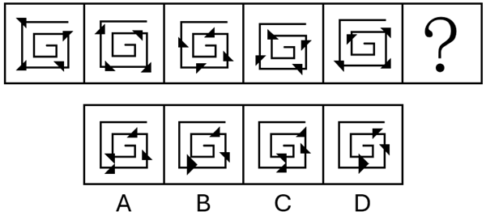
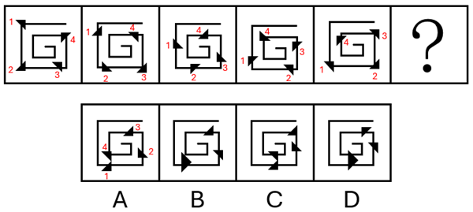
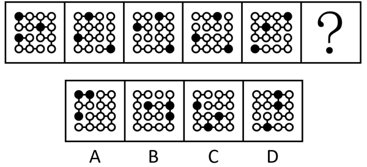
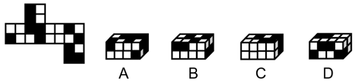
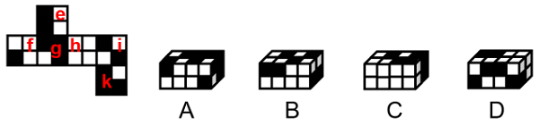
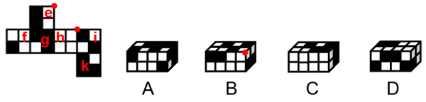
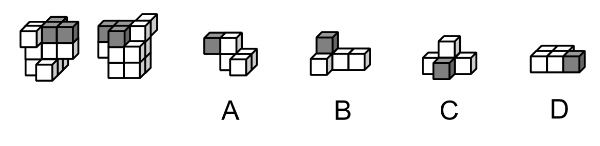
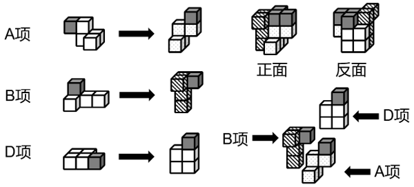
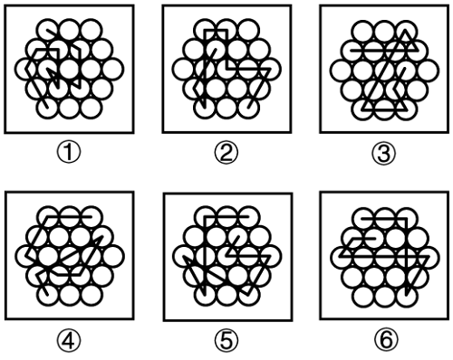

# 2026年国家公务员录用考试《行测》题（地市级网友回忆版）

> 判断推理 · 35 题 · 国考 2026

## 材料 1

为倡导团结合作精神，某单位举办了若干项目的双打比赛。该单位后勤部由王、吴、韩和宋4人组成网球、乒乓球和羽毛球3支双打队伍参赛，每支队伍由其中2人组成，4人均至少参加了其中的一支队伍。已知：

（1）王和韩没有参加同一个项目；

（2）若韩参加羽毛球项目，则宋参加网球项目；

（3）若王参加乒乓球项目，则吴参加网球项目，若王不参加乒乓球项目，则吴也不参加网球项目。

### 第 1 题　qid 19526277 · 逻辑判断

对于3支双打队伍的组成情况，以下哪项是可能的？

- **A**. 网球——王、宋；乒乓球——吴、宋；羽毛球——王、韩
- **B**. 网球——吴、韩；乒乓球——吴、王；羽毛球——韩、宋
- **C**. 网球——韩、宋；乒乓球——吴、王；羽毛球——王、宋
- **D**. 网球——王、宋；乒乓球——吴、韩；羽毛球——王、吴　✅

**答案**：D

**官方解析**

第一步：分析题干条件。

（1）王、韩没有参加同一个项目；

（2）韩羽毛球宋网球；

（3）王乒乓球吴网球，王乒乓球吴网球；

（4）每支队伍由其中2人组成，4人均至少参加了其中的一支队伍。

第二步：根据题干条件进行推理。

本题题干信息确定，选项信息充分，优先考虑排除法。

由条件（1）可知，王、韩没有参加同一个项目，排除A项；

由条件（2）可知，韩参加羽毛球，则宋参加网球，排除B项；

由条件（3）可知，王参加乒乓球，则吴参加网球，排除C项。

经验证，D项满足题干所有条件，当选。

故正确答案为D。

---

### 第 2 题　qid 19526278 · 逻辑判断

若宋和韩组队网球双打，则以下哪项一定正确？

- **A**. 吴参加乒乓球项目
- **B**. 王参加羽毛球项目　✅
- **C**. 宋参加乒乓球项目
- **D**. 吴参加羽毛球项目

**答案**：B

**官方解析**

第一步：分析题干条件。

（1）王、韩没有参加同一个项目；

（2）韩羽毛球宋网球；

（3）王乒乓球吴网球，王乒乓球吴网球；

（4）每支队伍由其中2人组成，4人均至少参加了其中的一支队伍；

（5）宋和韩组队网球。

第二步：根据题干条件进行推理。

根据条件（1）和（5）可知，王不参加网球；根据条件（4）和（5）可知，宋和韩组队网球，队伍已满2人，所以吴不参加网球，结合条件（3）可知，王不参加乒乓球；再结合条件（4）4人均至少参加了其中的一支队伍可知，王参加羽毛球。

故正确答案为B。

---

### 第 3 题　qid 19526279 · 逻辑判断

若吴参加3个项目，则以下哪项是可能的？

- **A**. 宋参加网球项目　✅
- **B**. 王参加网球项目
- **C**. 宋参加乒乓球项目
- **D**. 王参加羽毛球项目

**答案**：A

**官方解析**

第一步：分析题干条件。

（1）王、韩没有参加同一个项目；

（2）韩羽毛球宋网球；

（3）王乒乓球吴网球，王乒乓球吴网球；

（4）每支队伍由其中2人组成，4人均至少参加了其中的一支队伍；

（5）吴参加了3个项目。

第二步：根据题干条件进行推理。

根据条件（4）和（5）可知，吴参加了网球、乒乓球和羽毛球3个项目，王、韩和宋每人均只参加1个项目，结合条件（3）“王乒乓球吴网球”可知，王参加乒乓球项目，此时，韩和宋只需要分别参加羽毛球和网球中的1个项目即可。综上所述，选项中只有A项可能正确。

故正确答案为A。

---

### 第 4 题　qid 19526280 · 逻辑判断

以下哪项中的两人可能同时组队网球和羽毛球双打？

- **A**. 王和吴
- **B**. 王和宋　✅
- **C**. 吴和宋
- **D**. 韩和宋

**答案**：B

**官方解析**

第一步：分析题干条件。

（1）王、韩没有参加同一个项目；

（2）韩羽毛球宋网球；

（3）王乒乓球吴网球，王乒乓球吴网球；

（4）每支队伍由其中2人组成，4人均至少参加了其中的一支队伍。

第二步：根据题干条件进行推理。

题干问法为“可能”，优先使用代入法。

代入A项：王和吴同时组队网球和羽毛球双打，根据条件（4）可知，韩和宋组队乒乓球双打，此时与条件（3）的后一个推出关系矛盾，不满足题干条件，不可能为真，排除；

代入B项：王和宋同时组队网球和羽毛球双打，根据条件（4）可知，吴和韩组队乒乓球双打，此时满足题干所有条件，可能为真，当选；

代入C项：吴和宋同时组队网球和羽毛球双打，根据条件（4）可知，王和韩组队乒乓球双打，此时与条件（1）矛盾，不满足题干条件，不可能为真，排除；

代入D项：韩和宋同时组队网球和羽毛球双打，王和吴组队乒乓球双打，此时与条件（3）的前一个推出关系矛盾，不满足题干条件，不可能为真，排除；

故正确答案为B。

---

### 第 5 题　qid 19526281 · 逻辑判断

若宋和韩组队乒乓球双打，则以下哪项是可能的？

- **A**. 吴和韩组队网球双打
- **B**. 吴和宋组队网球双打
- **C**. 宋和韩组队羽毛球双打
- **D**. 吴和宋组队羽毛球双打　✅

**答案**：D

**官方解析**

第一步：分析题干条件。

（1）王、韩没有参加同一个项目；

（2）韩羽毛球宋网球；

（3）王乒乓球吴网球，王乒乓球吴网球；

（4）每支队伍由其中2人组成，4人均至少参加了其中的一支队伍；

（5）宋和韩组队乒乓球双打。

第二步：根据题干条件进行推理。

根据条件（4）与（5），可知乒乓球队人已满，则王与吴均不能参加乒乓球项目，结合条件（3），肯前必肯后，可得吴不参加网球项目，排除A、B两项；

根据吴不参加乒乓球项目，也不参加网球项目，结合条件（4），4人均至少参加了其中的一支队伍，可得吴必须参加羽毛球项目，那么宋和韩不可能同时参加羽毛球项目，排除C项。

故正确答案为D。

---

### 第 6 题　qid 19526387 · 图形推理

从所给的四个选项中，选择最合适的一个填入问号处，使之呈现一定的规律性：

- **A**. A　✅
- **B**. B
- **C**. C
- **D**. D

**答案**：A

**官方解析**

元素组成相同，优先考虑位置规律。观察发现，题干每幅图形中四个黑色三角形均沿着折线逆时针方向每次走一步，且每次自身顺时针旋转，如下图所示。

因此？处图形也应满足此规律，只有A项符合。

故正确答案为A。

---

### 第 7 题　qid 19526295 · 图形推理

从所给的四个选项中，选择最合适的一个填入问号处，使之呈现一定的规律性：

- **A**. A
- **B**. B
- **C**. C
- **D**. D　✅

**答案**：D

**官方解析**

元素组成不同，且无明显属性规律，考虑数量规律。观察发现，题干每幅图形均分为2个部分，且其中一个部分有1个黑球，另一个部分有2个黑球，只有D项符合规律。
故正确答案为D。

---

### 第 8 题　qid 19526400 · 图形推理

从所给的四个选项中，选择最合适的一个填入问号处，使之呈现一定的规律性：

- **A**. A
- **B**. B
- **C**. C
- **D**. D　✅

**答案**：D

**官方解析**

元素组成相同，但无明显位置规律和属性规律，考虑数量规律。观察发现，题干图形均由不同形状小黑块连接而成，且黑色块之间围成封闭面，考虑面数量。题干图形面数量依次为0、1、2、3、4，故？处图形面数量应为5，只有D项符合。
故正确答案为D。

---

### 第 9 题　qid 19526396 · 图形推理

从所给的四个选项中，选择最合适的一个填入问号处，使之呈现一定的规律性：

- **A**. A
- **B**. B
- **C**. C　✅
- **D**. D

**答案**：C

**官方解析**

元素组成相似，且有相同线条重复出现，优先考虑样式规律中的加减同异。九宫格优先看横行，观察发现，第一行中，图1和图2先求异，再逆时针旋转，即可得到图3；经验证，第二行满足此规律；第三行应用此规律，只有C项符合。

故正确答案为C。

---

### 第 10 题　qid 19526397 · 图形推理

左边为由15个白色正方体和3个黑色正方体组合而成的多面体俯视图和左视图，其正视图可能是：

- **A**. A
- **B**. B　✅
- **C**. C
- **D**. D

**答案**：B

**官方解析**

本题考查三视图。题干中俯视图中间一列最下方为黑色正方形，左视图最右列只有最下方一个黑色正方形，则对应选项中正视图中间一列最下方为黑色正方形，排除C、D两项。

俯视图、左视图结合选项主视图可以确定立体图形，逐一分析A、B选项。

A项：结合题干两个视图和A项，可能的立体图形有以下5种情况（注意图④和图⑤两个箭头指向的正方体的下方为黑色正方体），如下图所示。此时在所有情况下，立体图形均只有12个白色正方体，而题干中所给为15个白色正方体，不符合题干要求，排除；

B项：结合题干两个视图和B项，可以确定立体图形（注意第二层左上角为黑色正方体），如下图所示。此时立体图形有15个白色正方体和3个黑色正方体，符合题干要求，当选。

故正确答案为B。

---

### 第 11 题　qid 19526393 · 图形推理

左边为给定的正方体纸盒的外表面展开图，由2个该正方体纸盒组合而成的长方体可能是：

- **A**. A　✅
- **B**. B
- **C**. C
- **D**. D

**答案**：A

**官方解析**

将原展开图标上序号如下图，逐一进行分析。

A项：选项中左侧正方体纸盒由面f和面i构成，右侧正方体纸盒由面f、面g和面k构成，选项与题干展开图一致，当选；

B项：选项中右侧正方体纸盒由面e、面h和面i构成，题干展开图中三个面的公共点与面i上黑块的顶点重合，而选项中三个面的公共点与面i上的黑块不相交，选项与题干展开图不一致，排除；

C项：选项中左侧正方形纸盒由面f和面h构成，题干展开图中面f和面h为相对面，不能同时出现，选项与题干展开图不一致，排除；

D项：选项中右侧正方形纸盒由面f、面h和面i构成，题干展开图中面f和面h为相对面，不能同时出现，选项与题干展开图不一致，排除。

故正确答案为A。

---

### 第 12 题　qid 19526323 · 图形推理

左边为由12个白色正方体和3个灰色正方体组合而成的多面体前后两面直观图，问其可以由除哪项外的三个多面体组合而成？

- **A**. A
- **B**. B
- **C**. C　✅
- **D**. D

**答案**：C

**官方解析**

本题考查立体拼合。题干多面体可以由A、B、D三项中的立体图形拼合而成，具体拼合过程如下图所示：

本题为选非题，故正确答案为C。

---

### 第 13 题　qid 19526391 · 图形推理

把下面的六个图形分为两类，使每一类图形都有各自的共同特征或规律，分类正确的一项是：

- **A**. ①②③，④⑤⑥
- **B**. ①③④，②⑤⑥
- **C**. ①③⑥，②④⑤　✅
- **D**. ①⑤⑥，②③④

**答案**：C

**官方解析**

本题为分组分类题目。元素组成相同，但无明显位置规律。观察发现，题干图形均出现两个黑块，在连接两个黑块的最短路径中，且图①③⑥中两个黑块均通过一条线连接，图②④⑤中两个黑块均通过一个面连接，即图①③⑥为一组，图②④⑤为一组。
故正确答案为C。

---

### 第 14 题　qid 19526253 · 图形推理

把下面的六个图形分为两类，使每一类图形都有各自的共同特征或规律，分类正确的一项是：

- **A**. ①②⑥，③④⑤
- **B**. ①②④，③⑤⑥　✅
- **C**. ①⑤⑥，②③④
- **D**. ①④⑥，②③⑤

**答案**：B

**官方解析**

元素组成不同，且无明显属性规律，优先考虑数量规律。观察发现，题干每幅图中均存在一个黑色面和四个白色面，但根据面的数量无法分组分类，故考虑面的细化。再次观察发现，每幅图中均有1-2个白色面形状与黑色面形状相同，故考虑相同形状的面，图①②④中黑色面的形状与2个白色面形状一致，图③⑤⑥中黑色面的形状与1个白色面形状一致，故图①②④为一组，图③⑤⑥为一组。
故正确答案为B。

---

### 第 15 题　qid 19526305 · 图形推理

把下面6个图形分为两类，使每一类图形都有各自的共同特征或规律，分类正确的一项是：

- **A**. ①④⑤，②③⑥　✅
- **B**. ①③⑥，②④⑤
- **C**. ①②⑥，③④⑤
- **D**. ①②④，③⑤⑥

**答案**：A

**官方解析**

题干图形均由正六边形宫格及若干线条组成，且线条之间都存在一个十字交叉点，观察十字交叉点的位置，图①④⑤中十字交叉点位于白球外部，图②③⑥中十字交叉点位于白球内部，故图①④⑤为一组，图②③⑥为一组，只有A项符合。
故正确答案为A。

---

### 第 16 题　qid 19526356 · 定义判断

《中国共产党纪律处分条例》规定，主动交代本人应当受到党纪处分的问题，可以从轻或者减轻处分。这里所称的主动交代主要包括两种情况：一是涉嫌违纪的党员在组织谈话函询、初步核实前向有关组织交代自己的问题。二是在谈话函询、初步核实和立案审查期间交代组织未掌握的问题。
假定下列人员均受该条例约束，根据上述定义，下列属于主动交代的是：

- **A**. 甲在参加违纪违法典型案例警示教育大会后，主动找到单位领导反映同事的违纪问题
- **B**. 乙在组织对其进行廉政谈话时，组织举证一项他才承认一项，对未涉及的情况闭口不谈
- **C**. 丙在纪委对其个人财产有关事项进行函询时，将其利用职权为自己和他人谋利的情况如实交代　✅
- **D**. 丁在纪委对其立案审查期间，面对确凿的证据，交代了之前没有交代的收受大额礼金的问题

**答案**：C

**官方解析**

第一步：找出定义关键词。
“主动交代本人应当受到党纪处分的问题”、“涉嫌违纪的党员在组织谈话函询、初步核实前向有关组织交代自己的问题”、“在谈话函询、初步核实和立案审查期间交代组织未掌握的问题”。
第二步：逐一分析选项。
A项：甲主动找到单位领导反映同事的违纪问题，并非交代本人的违纪问题，不符合“主动交代本人应当受到党纪处分的问题”，不符合定义，排除；
B项：乙在组织对其进行廉政谈话时，组织举证一项他才承认一项，不符合“主动交代本人应当受到党纪处分的问题”，不符合定义，排除；
C项：丙在纪委对其个人财产有关事项进行函询时，如实交代了自己利用职权谋利的问题，符合“在谈话函询、初步核实和立案审查期间交代组织未掌握的问题”，符合定义，当选；
D项：丁在纪委立案审查期间，面对确凿证据才交代了之前未交代的收受大额礼金的问题，不符合“主动交代本人应当受到党纪处分的问题”、“在谈话函询、初步核实和立案审查期间交代组织未掌握的问题”，不符合定义，排除。
故正确答案为C。

---

### 第 17 题　qid 19526274 · 定义判断

波特五力模型是一种竞争分析工具，用于评估一个行业的竞争力和吸引力。该模型通过对同行业竞争对手的威胁、潜在进入者的威胁、替代品的威胁、上游供应商的议价能力和下游购买者的议价能力这五个方面的分析，帮助企业了解其所处行业的竞争环境，以制定相应的竞争策略。
根据上述定义，关于康复机器人行业，对下列问题的分析不能归入波特五力模型的是：

- **A**. 康复机器人行业准入门槛高吗？需要强大的技术能力和创新能力吗？
- **B**. 医院和康复中心患者规模如何？对于康复机器人的需求有多大？
- **C**. 与传统物理治疗等康复治疗方法相比，康复机器人有竞争力吗？
- **D**. 康复机器人企业内部各部门之间的协同合作程度高吗？　✅

**答案**：D

**官方解析**

第一步：找出定义关键词。
“同行业竞争对手的威胁”、“潜在进入者的威胁”、“替代品的威胁”、“上游供应商的议价能力”、“下游购买者的议价能力”、“帮助企业了解其所处行业的竞争环境，以制定相应的竞争策略”。
第二步：逐一分析选项。
A项：康复机器人行业准入门槛高吗？需要强大的技术能力和创新能力吗？问题中的“准入门槛”、“技术能力和创新能力”直接关系到潜在企业能否进入康复机器人行业，符合波特五力模型中的“潜在进入者的威胁”，符合定义，排除；
B项：医院和康复中心患者规模如何？对于康复机器人的需求有多大？问题中的“医院”和“康复中心”是康复机器人的“下游购买者”，“患者规模”与“需求程度”会直接影响购买者采购时的“议价能力”，符合波特五力模型中的“下游购买者的议价能力”，符合定义，排除；
C项：与传统物理治疗等康复治疗方法相比，康复机器人有竞争力吗？问题中的“传统物理治疗”是康复机器人的“替代方案”，是在分析“替代品”的竞争力对行业的威胁，符合波特五力模型中的“替代品的威胁”，符合定义，排除；
D项：康复机器人企业内部各部门之间的协同合作程度高吗？问题中的“企业内部各部门之间的协同合作程度”属于企业“内部管理”的范畴，不符合波特五力模型中的任何一个，不符合定义，当选。
本题为选非题，故正确答案为D。

---

### 第 18 题　qid 19526398 · 定义判断

组织结构可以划分为以下几种类型：（1）直线型组织结构，即每一个部门只对其直接的下属部门下达工作指令，不能越级指挥，每一个部门也只有一个直接的上级部门；（2）职能型组织结构，即每一个部门都可对其下属部门下达工作指令，每一个下属部门可能得到不同上级部门下达的多个工作指令；（3）直线职能型组织结构，即在主管之下设置相应的职能部门，实行主管统一指挥与职能部门参谋指导相结合的管理方式，各部门既受上级的管理，又受同级职能管理部门的业务指导和监督；（4）事业部组织结构，即由相对独立的事业部组成的组织结构，通常按照地区或项目来划分事业部，每个事业部拥有较大的自主权。

根据上述定义，下列组织结构图代表的组织结构类型属于：

- **A**. 直线型组织结构
- **B**. 职能型组织结构　✅
- **C**. 直线职能型组织结构
- **D**. 事业部组织结构

**答案**：B

**官方解析**

第一步：找出定义关键词。
直线型组织结构：“每一个部门只对其直接的下属部门下达工作指令”、“不能越级指挥”、“每一个部门也只有一个直接的上级部门”；
职能型组织结构：“每一个部门都可对其下属部门下达工作指令”、“每一个下属部门可能得到不同上级部门下达的多个工作指令”；
直线职能型组织结构：“在主管之下设置相应的职能部门，实行主管统一指挥与职能部门参谋指导相结合的管理方式”、“各部门既受上级的管理，又受同级职能管理部门的业务指导和监督”；
事业部组织结构：“由相对独立的事业部组成的组织结构”、“通常按照地区或项目来划分事业部”、“每个事业部拥有较大的自主权”。
第二步：逐一分析选项。
A项：结构图中项目二组和项目三组等存在多个上级部门下达指令，不符合“每一个部门也只有一个直接的上级部门”，不符合“直线型组织结构”定义，排除；
B项：结构图中的每一个部门都有上级部门，且项目二组和项目三组等存在多个上级部门下达工作指令，符合“每一个部门都可对其下属部门下达工作指令”、“每一个下属部门可能得到不同上级部门下达的多个工作指令”，符合“职能型组织结构”定义，当选；
C项：结构图中的每个部门都不存在同级职能管理部门的业务指导和监督，不符合“各部门既受上级的管理，又受同级职能管理部门的业务指导和监督”，不符合“直线职能型组织结构”定义，排除；
D项：结构图中工程技术部、财务管理部、合同管理部以及项目二组、项目三组等都需要按照上级下达的指令工作，不符合“每个事业部拥有较大的自主权”，不符合“事业部组织结构”定义，排除。
故正确答案为B。

---

### 第 19 题　qid 19526243 · 定义判断

均变论认为，支配各种地质过程的法则在地质历史上没有发生过变化，现在起作用的各种自然营力在漫长的地质过程中具有普遍的均一性，即地质演变是一个渐变的过程，具有相同方式和相同的强度；地球上生物的种与种之间有过渡关系，生物进化过程是极其漫长的。灾变论认为，在整个地质发展的过程中，地球经常发生各种突如其来的、短暂的全球性灾难性变化，这些变化强烈地改变了地球的面貌；地球上生物的变化是反复多次灾变的结果。
根据上述定义，下列说法最能体现灾变论观点的是：

- **A**. “我们找不到开始的痕迹，也看不到结束的迹象”
- **B**. “地质记录是一部被鲜血和火焰写成的史诗”　✅
- **C**. “现在是通往过去的一把钥匙”
- **D**. “自然界里没有飞跃”

**答案**：B

**官方解析**

第一步：找出定义关键词。
均变论：“支配各种地质过程的法则在地质历史上没有发生过变化”、“现在起作用的各种自然营力在漫长的地质过程中具有普遍的均一性”、“地球上生物的种与种之间有过渡关系，生物进化过程是极其漫长的”。
灾变论：“地球经常发生各种突如其来的、短暂的全球性灾难性变化，这些变化强烈地改变了地球的面貌”、“地球上生物的变化是反复多次灾变的结果”。
第二步：逐一分析选项。
A项：“我们找不到开始的痕迹，也看不到结束的迹象”，体现了“支配各种地质过程的法则在地质历史上没有发生过变化”、“地球上生物的种与种之间有过渡关系，生物进化过程是极其漫长的”，符合“均变论”定义，不符合“灾变论”定义，排除；
B项：“地质记录是一部被鲜血和火焰写成的史诗”，“鲜血和火焰”隐喻的是灾难，体现了“地球经常发生各种突如其来的、短暂的全球性灾难性变化，这些变化强烈地改变了地球的面貌”，符合“灾变论”定义，当选；
C项：“现在是通往过去的一把钥匙”，体现了“支配各种地质过程的法则在地质历史上没有发生过变化”、“现在起作用的各种自然营力在漫长的地质过程中具有普遍的均一性”、“地球上生物的种与种之间有过渡关系，生物进化过程是极其漫长的”，符合“均变论”定义，不符合“灾变论”定义，排除；
D项：“自然界里没有飞跃”，体现了“地球上生物的种与种之间有过渡关系，生物进化过程是极其漫长的”，符合“均变论”定义，不符合“灾变论”定义，排除。
故正确答案为B。

---

### 第 20 题　qid 19526275 · 定义判断

商品动销率是指在售的商品品种数与库存商品总品种数的比率。商品库销比是指商品库存量与销售额的比率。商品滞销率是指滞销的商品品种数占库存商品总品种数的比率。商品损耗率是指在一定的保管条件下，某商品在储存保管期间，其自然损耗量与商品在库总量的比例。
根据上述定义，下列说法正确的是：

- **A**. 若商品动销率超过100%，说明商品在售品种数高于库存商品总品种数　✅
- **B**. 商品损耗率高表明有库存积压风险，商品损耗率低表明销售态势良好
- **C**. 库存商品数一定时，商品滞销率越高，说明滞销的商品越多
- **D**. 当商品库存量越大，销售额越高时，商品库销比就会越大

**答案**：A

**官方解析**

第一步：找出定义关键词。

商品动销率：“在售的商品品种数与库存商品总品种数的比率”；

商品库销比：“商品库存量与销售额的比率”；

商品滞销率：“滞销的商品品种数占库存商品总品种数的比率”；

商品损耗率：“一定的保管条件下，某商品在储存保管期间”、“自然损耗量与商品在库总量的比例”。

第二步：逐一分析选项。

A项：根据商品动销率，若商品动销率超过100%，说明商品在售品种数高于库存商品总品种数，说法正确，当选；

B项：根据商品损耗率，若商品损耗率高，表明商品自然损耗量相对升高或者商品在库总量相对降低，无法必然得到库存积压情况或销售态势情况，说法错误，排除；

C项：根据商品滞销率，若库存商品数一定时，商品滞销率越高，说明滞销的“商品品种数”越多，而不是滞销的“商品”越多（可能仅指商品数量），说法错误，排除；

D项：根据商品库销比，当商品库存量越大，销售额越高时，因无法确定比值的大小关系，所以无法得知商品库销比一定会越大，说法错误，排除。

故正确答案为A。

---

### 第 21 题　qid 19526392 · 定义判断

根据动词对其后所接的宾语小句（作宾语的句子）真值的不同预设能力可以把现代汉语中的相关动词分为叙实动词、非叙实动词和反叙实动词。叙实动词的肯定式和否定式都预设其宾语小句为真；非叙实动词的肯定式和否定式都不预设其宾语小句为真，也不预设其宾语小句为假；反叙实动词的肯定式和否定式都预设其宾语小句为假。
根据上述定义，下列画线的动词属于非叙实动词的是：

- **A**. 
我<u>听说</u>他来过这里
　✅
- **B**. 
我<u>庆幸</u>听了你的建议

- **C**. 
我<u>知道</u>你帮助过我

- **D**. 
我<u>幻想</u>成为一只小鸟

**答案**：A

**官方解析**

第一步：找出定义关键词。
叙实动词：“肯定式和否定式都预设其宾语小句为真”；
非叙实动词：“肯定式和否定式都不预设其宾语小句为真，也不预设其宾语小句为假”；
反叙实动词：“肯定式和否定式都预设其宾语小句为假”。
第二步：逐一分析选项。
A项：“我听说他来过这里”中的“听说”只是陈述信息的来源，没有预设“来过这里”为真或为假，符合“肯定式和否定式都不预设其宾语小句为真，也不预设其宾语小句为假”，符合“非叙实动词”定义，当选；
B项：“我庆幸听了你的建议”中的“庆幸”意味着听了建议是已经发生的事实，是预设其为真，符合“肯定式和否定式都预设其宾语小句为真”，符合“叙实动词”定义，不符合“非叙实动词”定义，排除；
C项：“我知道你帮助过我”中的“知道”意味着帮助过我是真实存在的事实，是预设其为真，符合“肯定式和否定式都预设其宾语小句为真”，符合“叙实动词”定义，不符合“非叙实动词”定义，排除；
D项：“我幻想成为一只小鸟”中的“幻想”是不可能发生的事，是预设其为假，符合“肯定式和否定式都预设其宾语小句为假”，符合“反叙实动词”定义，不符合“非叙实动词”定义，排除。
故正确答案为A。

---

### 第 22 题　qid 19526359 · 定义判断

自主动机是指人们出于兴趣或内在满足感而从事某种活动，外部动机是指人们为获得外部奖励或避免惩罚而从事某种活动，这些动机背后的心理需求又分为三种：（1）自主性需求，即人们希望自己能控制和选择自己的行为，而不是受到外部强制；（2）胜任性需求，即人们希望能在自己做的事上获得成就感和自我效能感；（3）归属感需求，即人们希望与他人建立有意义的联系，感受到归属和支持。
根据上述定义，下列说法错误的是：

- **A**. 小张参加了一项感兴趣的社交活动，他认为这能帮助自己结交新朋友。这体现了自主动机和归属感需求
- **B**. 小李参加公司的培训课程，虽然对课程内容不感兴趣，但他担心如果不参加就会被扣绩效。这体现了外部动机和自主性需求　✅
- **C**. 小王每天晨跑，很享受锻炼带来的满足感，也坚信这是促进健康的必要努力。这体现了自主动机和胜任性需求
- **D**. 小陈和队友为实现团体奖牌零的突破一直在努力，在艰苦的训练中与队友相互鼓励。这体现了胜任性需求和归属感需求

**答案**：B

**官方解析**

第一步：找出定义关键词。
自主动机：“出于兴趣或内在满足感”、“从事某种活动”；
外部动机：“为获得外部奖励或避免惩罚”、“从事某种活动”；
自主性需求：“希望自己能控制和选择自己的行为，而不是受到外部强制”；
胜任性需求：“希望能在自己做的事上获得成就感和自我效能感”；
归属感需求：“希望与他人建立有意义的联系，感受到归属和支持”。
第二步：逐一分析选项。
A项：小张参加了一项感兴趣的社交活动，符合“出于兴趣或内在满足感”、“从事某种活动”，体现了自主动机；他认为这能帮助自己结交新朋友，符合“希望与他人建立有意义的联系，感受到归属和支持”，体现了归属感需求，说法正确，排除；
B项：小李担心不参加被扣绩效，符合“为获得外部奖励或避免惩罚”、“从事某种活动”，体现了外部动机；但小李担心如果不参加就会被扣绩效，说明其受到外部约束，不符合“希望自己能控制和选择自己的行为，而不是受到外部强制”，没有体现自主性需求，说法错误，当选；
C项：小王每天晨跑，很享受锻炼带来的满足感，符合“出于兴趣或内在满足感”、“从事某种活动”，体现了自主动机；他坚信这是促进健康的必要努力，符合“希望能在自己做的事上获得成就感和自我效能感”，体现了胜任性需求，说法正确，排除；
D项：小陈和队友为实现团体奖牌零的突破而努力，追求的是成就感，符合“希望能在自己做的事上获得成就感和自我效能感”，体现了胜任性需求；他与队友相互鼓励，符合“希望与他人建立有意义的联系，感受到归属和支持”，体现了归属感需求，说法正确，排除。
本题为选非题，故正确答案为B。

---

### 第 23 题　qid 19526298 · 定义判断

动作预期是指运动员在比赛过程中，根据已有信息，对即将发生的动作结果进行预测的过程。在这一过程中，运动员主要依赖两类信息：运动学信息和情境先验信息。运动学信息包括对手的动作、器材的运动轨迹或队员之间的相对位置，情境先验信息则涉及比赛情境中事件发生的概率。
根据上述定义，下列不涉及上述任何一种信息的是：

- **A**. 篮球队员甲在双方比分紧咬的情况下，基于对手今日比赛罚篮命中率不高，在对手投篮时选择直接犯规
- **B**. 网球运动员乙知道对手在比赛前有一系列习惯性动作，包括整理球衣、球裤、头发等，暗自提醒自己不要被其干扰　✅
- **C**. 羽毛球双打运动员丙发现对方准备接发球的球员位置稍微靠前，可能来不及转身或后退接球，便发了个后场球
- **D**. 乒乓球运动员丁发现对方发过来的球位置较低、速度较慢，极有可能擦网变线，便没有后退，向前伸拍做好接球准备

**答案**：B

**官方解析**

第一步：找出定义关键词。
动作预期：“运动员”、“在比赛过程中”、“根据已有信息，对即将发生的动作结果进行预测”；
运动学信息：“对手的动作”、“器材的运动轨迹”、“队员之间的相对位置”；
情境先验信息：“比赛情境中事件发生的概率”。
第二步：逐一分析选项。
A项：篮球队员甲，符合“运动员”，根据对手今日比赛罚篮命中率不高，在对手投篮时选择直接犯规，即预测犯规后对手会罚篮不中，符合“在比赛过程中”、“根据已有信息，对即将发生的动作结果进行预测”、“比赛情境中事件发生的概率”，符合“情境先验信息”定义，排除；
B项：网球运动员乙知道对手在比赛前有一系列习惯性动作，不符合“在比赛过程中”，且乙是暗自提醒自己不要被干扰，未利用这些信息进行预测，不符合“对即将发生的动作结果进行预测”，不符合“动作预期”定义，进而也不符合“运动学信息”定义和“情境先验信息”定义，当选；
C项：羽毛球双打运动员丙，符合“运动员”，根据对方准备接发球的球员位置稍微靠前，预测对方来不及转身或后退接球，符合“在比赛过程中”、“根据已有信息，对即将发生的动作结果进行预测”、“比赛情境中事件发生的概率”，符合“情境先验信息”定义，排除；
D项：乒乓球运动员丁，符合“运动员”，根据对方发过来的球位置较低、速度较慢，预测球会擦网变线，符合“在比赛过程中”、“根据已有信息，对即将发生的动作结果进行预测”、“器材的运动轨迹”、“比赛情境中事件发生的概率”，符合“运动学信息”定义，也符合“情境先验信息”定义，排除。
本题为选非题，故正确答案为B。

---

### 第 24 题　qid 19526389 · 定义判断

在制品控制是企业生产控制的基础工作，是企业对生产运作过程中各工序原材料、半成品等按照位置、数量、质量及车间之间的物料转运等进行的控制。
根据上述定义，下列没有直接体现在制品控制的是：

- **A**. 服装厂梳理了运动裤制作流程并制定规范，确保衣料在不同流水线上流转有序
- **B**. 食品厂设立质检员，定时对各个工序的食材抽样进行微生物检测，剔除不良品
- **C**. 制药厂规定员工进入洁净区后，每两小时洗手一次，避免药品生产环境被污染　✅
- **D**. 家具厂对板材进行定期盘点，并合理摆放，确保板材库存合理且满足生产需要

**答案**：C

**官方解析**

第一步：找出定义关键词。
“企业对生产运作过程中各工序原材料、半成品”、“按照位置、数量、质量及车间之间的物料转运等进行的控制”。
第二步：逐一分析选项。
A项：服装厂确保衣料在不同流水线上流转有序，其中衣料属于生产运作过程中的原材料，符合“企业对生产运作过程中各工序原材料、半成品”，在流水线上流转属于在车间内的物料转运，符合“按照位置、数量、质量及车间之间的物料转运等进行的控制”，符合定义，排除；
B项：食品厂设立质检员，定时对各个工序的食材抽样进行衍生物检测，剔除不良品，其中对各个工序的食材抽样属于在生产运作过程中的原材料、半成品，符合“企业对生产运作过程中各工序原材料、半成品”，质检员抽样检测是对产品质量的把控，符合“按照位置、数量、质量及车间之间的物料转运等进行的控制”，符合定义，排除；
C项：制药厂规定员工进入洁净区后需每两小时洗手一次，这是对员工进行要求，并非对原材料、半成品进行把控，不符合“企业对生产运作过程中各工序原材料、半成品”进行控制，不符合定义，当选；
D项：家具厂对板材进行定期盘点，并合理摆放，体现了企业对在生产过程中的板材进行数量把控，符合“企业对生产运作过程中各工序原材料、半成品”、“按照位置、数量、质量及车间之间的物料转运等进行的控制”，符合定义，排除。
本题为选非题，故正确答案为C。

---

### 第 25 题　qid 19526362 · 定义判断

预防性维修是指在机械设备没有发生故障或尚未造成损坏的前提下，通过对产品的系统性检查、设备测试或更换以防止设备发生故障，使其保持在正常状态所进行的全部活动。
根据上述定义，下列属于预防性维修的是：

- **A**. 公路管理部门定期巡视道路两旁护栏并涂刷、除锈，发现护栏松动、断裂时进行修复
- **B**. 某车间在正式制造某种设备前，测量将要安装在该设备中的关键零部件是否符合相应标准
- **C**. 某数控车床突然发生摇动，无法切削物品，检查后发现电机出现故障，更换电机后车床可正常运行
- **D**. 雨季来临前，供电公司对辖区内变压器、配电盘、电缆线路等电力设备设施隐患进行专项排查　✅

**答案**：D

**官方解析**

第一步：找出定义关键词。
“机械设备没有发生故障或尚未造成损坏”、“对产品的系统性检查、设备测试或更换以防止设备发生故障”。
第二步：逐一分析选项。
A项：道路两旁护栏不是机械设备，且发现护栏松动、断裂时进行修复，是护栏出现问题之后的维修，不符合“机械设备没有发生故障或尚未造成损坏”，不符合定义，排除；
B项：正式制造某种设备前的测量，是生产环节的质量检查，不是对已有设备的维护，不符合“机械设备没有发生故障或尚未造成损坏”、“对产品的系统性检查、设备测试或更换以防止设备发生故障”，不符合定义，排除；
C项：某数控车床突然发生摇动，检查后发现电机出现故障，更换电机后车床可正常运行，说明是电机出现问题之后的维修，不符合“机械设备没有发生故障或尚未造成损坏”，不符合定义，排除；
D项：对辖区内变压器、配电盘、电缆线路等电力设备设施隐患进行专项排查，符合“机械设备没有发生故障或尚未造成损坏”、“对产品的系统性检查、设备测试或更换以防止设备发生故障”，符合定义，当选。
故正确答案为D。

---

### 第 26 题　qid 19526246 · 类比推理

与“经年：积岁”在逻辑关系上最相近的是：

- **A**. 善本：版本
- **B**. 秘方：偏方
- **C**. 仲夏：夏季
- **D**. 黎民：百姓　✅

**答案**：D

**官方解析**

第一步：判断题干词语间逻辑关系。
“经年”指经过一年或若干年，“积岁”指累积多年，二者均可指经过多年，为近义关系。
第二步：判断选项词语间逻辑关系。
A项：“善本”指古代书籍中文字讹误较少、学术或艺术价值上比一般本子优异的刻本或写本，“版本”指同一部书因编辑、传抄、刻版、排版或装订形式等的不同而产生的不同的本子，“善本”是“版本”的一种类型，二者不是近义关系，与题干逻辑关系不一致，排除；
B项：“秘方”指不公开的有显著医疗效果的药方，“偏方”指民间流传不见于古典医学著作的中药方，前者从是否公开角度划分，后者从是否正规角度划分，二者为交叉关系，与题干逻辑关系不一致，排除；
C项：“仲夏”指夏季的第二个月，是“夏季”的一部分，二者为组成关系，与题干逻辑关系不一致，排除；
D项：“黎民”指平民、民众，“百姓”指军人和官员以外的人，二者均可指普通民众，为近义关系，与题干逻辑关系一致，当选。
故正确答案为D。

---

### 第 27 题　qid 19526395 · 类比推理

与“细胞凋亡：基因调控：细胞增殖”在逻辑关系上最相近的是：

- **A**. 成本降低：税率调整：成本增加　✅
- **B**. 经济萧条：经济周期：经济复苏
- **C**. 价格尺度：货币职能：流通手段
- **D**. 人工智能：智能时代：具身智能

**答案**：A

**官方解析**

第一步：判断题干词语间逻辑关系。
基因调控是控制细胞凋亡和细胞增殖的机制，细胞凋亡和细胞增殖是两种相反的细胞过程，第一个词和第三个词为并列关系，均与第二个词构成影响因素的对应。
第二步：判断选项词语间逻辑关系。
A项：税率调整是影响成本降低和成本增加的机制，成本降低和成本增加是两种相反的结果，第一个词和第三个词为并列关系，均与第二个词构成影响因素的对应，与题干逻辑关系一致，当选；
B项：经济萧条和经济复苏是经济周期中的不同阶段，是经济周期的组成部分，第一个词和第三个词为并列关系，均与第二个词构成组成关系，与题干逻辑关系不一致，排除；
C项：价格尺度和流通手段均属于货币职能，第一个词和第三个词为并列关系，均与第二个词构成种属关系，与题干逻辑关系不一致，排除；
D项：具身智能就是具身化的人工智能，具身智能属于人工智能，智能时代是所处的背景，第一个词和第三个词为种属关系，均与第二个词构成所处背景的对应关系，与题干逻辑关系不一致，排除。
故正确答案为A。

---

### 第 28 题　qid 19526272 · 类比推理

与“护士人数：护患比：患者人数”在逻辑关系上最相近的是：

- **A**. 理赔总额：平均理赔金额：理赔次数　✅
- **B**. 签收率：实际签收数量：应签收数量
- **C**. 流动资产：流动负债：流动比率
- **D**. 旅客数：入住率：客房数

**答案**：A

**官方解析**

第一步：判断题干词语间逻辑关系。

护患比=护士人数/患者人数，三者满足公式关系。

第二步：判断选项词语间逻辑关系。

A项：平均理赔金额=理赔总额/理赔次数，与题干逻辑关系一致，当选；

B项：签收率=实际签收数量/应签收数量，但词语顺序与题干不一致，排除；

C项：流动比率=流动资产/流动负债，但词语顺序与题干不一致，排除；

D项：入住率=入住客房数/客房数，而入住客房数旅客数，每间客房入住的旅客数可能不同，与题干逻辑关系不一致，排除。

故正确答案为A。

---

### 第 29 题　qid 19526255 · 类比推理

颅内疾病 对于 （    ） 相当于 （    ） 对于 岩石断裂
依次填入括号中最恰当的是：

- **A**. 颅内感染；岩石熔融
- **B**. 机体疾病；地壳应力
- **C**. 核磁共振；地下采样
- **D**. 视野缺失；冰川运动　✅

**答案**：D

**官方解析**

逐一代入选项。
A项：颅内感染是颅内疾病的一种，二者为种属关系；岩石熔融和岩石断裂是两种不同的地质现象，二者为并列关系，前后逻辑关系不一致，排除；
B项：颅内疾病是机体疾病的一种，二者为种属关系；地壳应力是导致岩石断裂的原因，二者为因果关系，前后逻辑关系不一致，排除；
C项：核磁共振是用来诊断颅内疾病的方法，二者为诊断方法与疾病的对应关系；地下采样可以判断岩石是否有断裂，但顺序反了，前后逻辑关系不一致，排除；
D项：颅内疾病会导致视野缺失，二者为因果对应关系；冰川运动会导致岩石断裂，二者为因果对应关系，前后逻辑关系一致，当选。
故正确答案为D。

---

### 第 30 题　qid 19526268 · 逻辑判断

如果用一个圆来表示词语所指称的对象的集合，那么以下哪项中画横线词语之间的关系符合下图？

- **A**. 
船舶按用途分为<u>军用船舶</u>（①）和民用船舶两大类，潜艇、<u>航空母舰</u>（③）、驱逐舰等都属于军用船舶；按推进动力分为机动船和<u>非机动船</u>（②）

- **B**. 
<u>水杉</u>（③）是我国的特有树种，属于<u>落叶树</u>（①），是一种高大的<u>乔木</u>（②），是世界上珍稀的“活化石”植物
　✅
- **C**. 
图书按照读者群可分为<u>少儿读物</u>（③）和成人读物等；按照载体可分为纸质书和<u>电子书</u>（②）等；按照学科可分为历史书、文学书和<u>哲学书</u>（①）等

- **D**. 
大熊猫属于<u>哺乳动物</u>（①），是<u>中国特有动物</u>（②），被列为<u>中国国家一级保护野生动物</u>（③）

**答案**：B

**官方解析**

第一步：判断题干词语间逻辑关系。
根据题干图形可知，①和②是交叉关系；③属于①，③和①是种属关系；③属于②，③和②是种属关系。
第二步：判断选项词语间逻辑关系。
A项：航空母舰（③）是指军队专用的机动船只，与非机动船（②）不是种属关系，与题干逻辑关系不一致，排除；
B项：落叶树（①）和乔木（②）是交叉关系；水杉（③）属于落叶树（①），③和①是种属关系；水杉（③）属于乔木（②），③和②是种属关系，与题干逻辑关系一致，当选；
C项：少儿读物（③）和电子书（②）是交叉关系，不是种属关系，与题干逻辑关系不一致，排除；
D项：中国国家一级保护野生动物（③）和哺乳动物（①）是交叉关系，不是种属关系，与题干逻辑关系不一致，排除。
故正确答案为B。

---

### 第 31 题　qid 19526386 · 逻辑判断

科技行业越来越多地使用合成数据来满足AI模型数据训练的需要。合成数据是通过算法和统计模型人为创建的数据，在理论上可以无限供应。但合成数据存在一个关键问题：当AI模型过于依赖合成数据时，它们会产生更多“幻觉”，编造看似合理可信但实际上并不存在的信息。可见，合成数据的使用会影响AI的准确性。
以下哪项如果为真，最能支持上述结论？

- **A**. 即使经过处理，合成数据仍然可能泄露敏感信息，从而引发隐私风险
- **B**. 合成数据存在过于简单化的风险，无法完全模拟真实世界的复杂性
- **C**. 合成数据会放大源数据本身的错误或偏差，导致“失之毫厘，差之千里”　✅
- **D**. 合成数据的多样性可能不如真实数据，限制了AI模型的泛化能力

**答案**：C

**官方解析**

第一步：找出论点和论据。
论点：合成数据的使用会影响AI的准确性。
论据：当AI模型过于依赖合成数据时，它们会产生更多“幻觉”，编造看似合理可信但实际上并不存在的信息。
本题论点和论据都在讨论“合成数据”与“AI准确性”之间的关系，二者话题一致，加强优先考虑补充论据。
第二步：逐一分析选项。
A项：该项指出合成数据可能泄露敏感信息，引发“隐私风险”，而论点讨论的是合成数据对“AI准确性”的影响，二者话题不一致，无法加强，排除；
B项：该项指出合成数据存在过于简单化的风险，无法完全模拟真实世界的复杂性，并不明确“无法模拟复杂性”是否会影响“AI的准确性”，为不明确项，无法加强，排除；
C项：该项指出合成数据会放大源数据的错误或偏差，导致“失之毫厘，差之千里”，说明合成数据会放大错误，最终导致AI输出不准确，解释了为何“合成数据”会影响“AI准确性”，补充论据，可以加强，当选；
D项：该项指出合成数据“多样性不足，限制泛化能力”，并不明确“数据多样性不足”、“限制AI模型的泛化能力”是否会影响“AI的准确性”，为不明确项，无法加强，排除。
故正确答案为C。

---

### 第 32 题　qid 19526390 · 逻辑判断

部分研究认为，白垩纪陆地生态系统的变革是由植物、昆虫、脊椎动物与地质过程等多个要素相互作用推动的，形成了一个高度协同演化的系统结构。鉴于这一机制在当时造就了复杂而稳定的生态格局，有学者提出，现代陆地生态系统的高度复杂性，正是这种古老协同机制延续和演化的结果。
以下哪项如果为真，最能削弱上述学者的观点？

- **A**. 在地质记录中，白垩纪末期的生态危机主要影响海洋系统，而陆地系统显示出相对稳定的演替趋势
- **B**. 对白垩纪地层的系统分析表明，植物、昆虫、脊椎动物与地质过程的演化几乎是在同一时期进行的
- **C**. 现代陆地生态系统的复杂性主要受群落内部随机扰动、自组织演化和外源干扰的共同影响，与白垩纪显著不同　✅
- **D**. 被子植物的全球扩张早于部分动物类群多样化，其当时对生态结构的主导作用可能被高估

**答案**：C

**官方解析**

第一步：找出论点和论据。

论点：现代陆地生态系统的高度复杂性，正是这种古老协同机制延续和演化的结果。

论据：白垩纪陆地生态系统的变革是由植物、昆虫、脊椎动物与地质过程等多个要素相互作用推动的，形成了一个高度协同演化的系统结构。鉴于这一机制在当时造就了复杂而稳定的生态格局。

从论据“白垩纪”高度协同演化的系统结构造就了复杂而稳定的生态格局，推出“现代”也是同样的情况，在这种“时期不同”的文段结构下，可以考拆桥，即“白垩纪的情况现代”。

第二步：逐一分析选项。

A项：指出白垩纪末期的生态危机对海洋系统和陆地系统的不同影响，与论点讨论的“白垩纪时期陆地生态系统高度协同演化的机制影响了现代陆地生态系统”无关，无法削弱，排除；

B项：指出白垩纪时期植物、昆虫、脊椎动物与地质过程的演化几乎是在同一时期进行的，说明白垩纪时期陆地生态系统高度协同演化，与论点讨论的“白垩纪时期陆地生态系统高度协同演化的机制影响了现代陆地生态系统”无关，无法削弱，排除；

C项：指出现代陆地生态系统的复杂性与白垩纪显著不同，说明不能根据白垩纪的情况推出现代，拆桥项，可以削弱，当选；

D项：指出被子植物的全球扩张对生态结构的主导作用可能被高估，与论点讨论的“白垩纪时期陆地生态系统高度协同演化的机制影响了现代陆地生态系统”无关，无法削弱，排除。

故正确答案为C。

---

### 第 33 题　qid 19526297 · 逻辑判断

完善城乡融合发展体制机制是破除我国城乡二元结构、拓展高质量发展空间的必要举措。只有完善农业农村优先发展的投入保障机制，并且优化城乡公共资源配置机制，才能完善城乡融合发展体制机制。只有加大中央预算内投资和地方政府专项债券支持力度，并且提高土地出让收入用于农业农村的比例，才能完善农业农村优先发展的投入保障机制。只有推进户籍制度改革，才能优化城乡公共资源配置机制。
由此可以推出的是（    ）。

- **A**. 如果推进户籍制度改革，就能优化城乡公共资源配置机制
- **B**. 只要完善农业农村优先发展的投入保障机制，就能完善城乡融合发展体制机制
- **C**. 除非完善农业农村优先发展的投入保障机制，否则不能提高土地出让收入用于农业农村的比例
- **D**. 加大中央预算内投资和地方政府专项债券支持力度是破除我国城乡二元结构、拓展高质量发展空间的必要前提　✅

**答案**：D

**官方解析**

第一步：翻译题干。

①破除我国城乡二元结构、拓展高质量发展空间完善城乡融合发展体制机制；

②完善城乡融合发展体制机制完善农业农村优先发展的投入保障机制 且 优化城乡公共资源配置机制；

③完善农业农村优先发展的投入保障机制加大中央预算内投资和地方政府专项债券支持力度 且 提高土地出让收入用于农业农村的比例；

④优化城乡公共资源配置机制推进户籍制度改革。

①②③可串联得到：⑤破除我国城乡二元结构、拓展高质量发展空间完善城乡融合发展体制机制完善农业农村优先发展的投入保障机制加大中央预算内投资和地方政府专项债券支持力度 且 提高土地出让收入用于农业农村的比例；

①②④可串联得到：⑥破除我国城乡二元结构、拓展高质量发展空间完善城乡融合发展体制机制优化城乡公共资源配置机制推进户籍制度改革。

第二步：逐一分析选项。

A项：该项翻译为“推进户籍制度改革优化城乡公共资源配置机制”，是对④的肯后，肯后得不到确定性的结论，无法推出，排除；

B项：该项翻译为“完善农业农村优先发展的投入保障机制完善城乡融合发展体制机制”，是肯定②箭头后“且关系”中的一部分，肯后得不到确定性的结论，不能推出，排除；

C项：该项翻译为“提高土地出让收入用于农业农村的比例完善农业农村优先发展的投入保障机制”，是肯定③箭头后“且关系”中的一部分，肯后得不到确定性的结论，不能推出，排除；

D项：该项翻译为“破除我国城乡二元结构、拓展高质量发展空间加大中央预算内投资和地方政府专项债券支持力度”，是对⑤的肯前，肯前必肯后，可以推出，当选。

故正确答案为D。

---

### 第 34 题　qid 19526265 · 逻辑判断

平台企业依赖金融资本投资，需要迎合金融市场的估值逻辑，通过轻资产运营、扩大市场规模和用户数据挖掘与开发等，来提升自身在金融市场上的估值。随着平台企业金融化程度的日益加深，平台劳动者的具体劳动和生产过程也在发生变化。研究者认为，平台企业金融化程度的加深使得平台劳动者的劳动权益保护问题日益突出。
以下哪项如果为真，最能支持上述研究者的观点？

- **A**. 为扩大市场规模、争夺消费者注意力，平台企业在资金投入和服务提升方面容易陷入无序竞争
- **B**. 为塑造轻资产企业形象、摆脱劳动密集型标签，平台企业采用弹性用工制，增加劳动者就业不稳定性　✅
- **C**. 越来越多的平台企业日益注重用户数据挖掘，以增加企业竞争力，为此更加注重员工培训
- **D**. 部分平台企业以缴纳保证金、押金或其他名义向劳动者收取财物，限制劳动者在多平台就业

**答案**：B

**官方解析**

第一步：找出论点和论据。
论点：平台企业金融化程度的加深使得平台劳动者的劳动权益保护问题日益突出。
论据：无。
本题只有论点，没有论据，加强优先考虑补充论据。
第二步：逐一分析选项。
A项：选项指出为扩大市场规模、争夺消费者注意力，平台企业容易陷入无序竞争，与论点讨论的平台企业金融化程度加深是否会导致平台劳动者的劳动权益保护问题日益突出无关，无关项，无法加强，排除；
B项：选项指出为塑造轻资产企业形象、摆脱劳动密集型标签，说明平台企业金融化程度在加深，平台企业采用弹性用工制，增加劳动者就业不稳定性，说明平台劳动者的具体劳动和生产过程发生了变化，且增加了平台劳动者的劳动权益保护问题，补充论据，可以加强，当选；
C项：选项指出平台企业越来越注重员工培训，与论点讨论的平台企业金融化程度加深是否会导致平台劳动者的劳动权益保护问题无关，无关项，无法加强，排除；
D项：选项指出部分平台企业以缴纳保证金、押金或其他名义向劳动者收取财物，限制劳动者在多平台就业，但是不明确这些平台是否存在企业金融化程度的加深，不明确选项，无法加强，排除。
故正确答案为B。

---

### 第 35 题　qid 19526315 · 逻辑判断

考古人员在某地发掘出一些似鸟动物化石，同位素测年显示这些动物生存于中侏罗世晚期（距今1.72亿～1.64亿年）。经考古推算，这些似鸟动物体型与现代鸟类大致接近，尾巴很短，最重要的是它们都具有愈合的尾综骨。考古人员据此认为，这些动物一定属于鸟类。
以下哪项最有可能是考古人员论证的前提？

- **A**. 这些似鸟动物长有与现代鸟类相似的脚骨，可以在陆地上行走
- **B**. 这些化石保存了诸如肩胛骨、乌喙骨、尾综骨等骨骼，形态清晰
- **C**. 鸟类与爬行动物最显著的区别就是鸟类最后几枚尾椎愈合成为尾综骨　✅
- **D**. 尾综骨结构的出现对似鸟动物后肢和尾骨的独立运动及飞行能力的完善至关重要

**答案**：C

**官方解析**

第一步：找出论点和论据。
论点：这些动物一定属于鸟类。
论据：这些似鸟动物体型与现代鸟类大致接近，尾巴很短，最重要的是它们都具有愈合的尾综骨。
本题论点讨论的是这些似鸟动物属于鸟类，论据讨论的是这些似鸟动物有愈合的尾综骨，二者话题不一致，加强优先考虑搭桥，即在“鸟类”和“愈合的尾综骨”之间建立联系。
第二步：逐一分析选项。
A项：该项指出这些似鸟动物与现代鸟类具有相似的脚骨，但是不明确脚骨是否能够判断这些似鸟动物为鸟类，属于不明确选项，无法加强，排除；
B项：该项强调这些化石保存的尾综骨等形态清晰，说明这些动物确实具有尾综骨，可以加强论据，但不是论证成立的前提，排除；
C项：该项指出鸟类与爬行动物的显著区别是鸟类最后几枚尾椎愈合成为尾综骨，建立了“鸟类”和“愈合的尾综骨”之间的联系，为搭桥项，是论证成立的前提，当选； 
D项：该项强调尾综骨结构对似鸟动物独立运动以及飞行能力的重要性，但不能判断其是否属于鸟类，属于不明确选项，无法加强，排除。
故正确答案为C。

---
