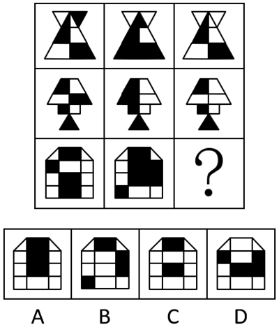
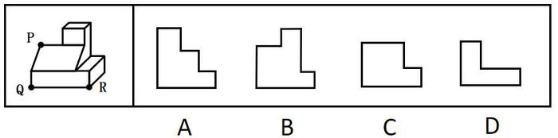
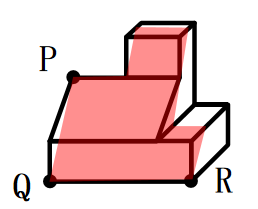
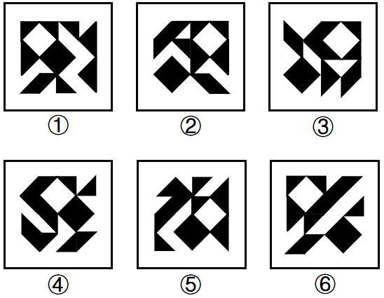

# 2026年国家公务员录用考试《行测》题（行政执法卷网友回忆版）

> 判断推理 · 35 题 · 国考 2026

## 材料 1

为倡导团结合作精神，某单位举办了若干项目的双打比赛。该单位后勤部由王、吴、韩和宋4人组成网球、乒乓球和羽毛球3支双打队伍参赛，每支队伍由其中2人组成，4人均至少参加了其中的一支队伍。已知：

（1）王和韩没有参加同一个项目；

（2）若韩参加羽毛球项目，则宋参加网球项目；

（3）若王参加乒乓球项目，则吴参加网球项目，若王不参加乒乓球项目，则吴也不参加网球项目。

### 第 1 题　qid 19526277 · 逻辑判断

对于3支双打队伍的组成情况，以下哪项是可能的？

- **A**. 网球——王、宋；乒乓球——吴、宋；羽毛球——王、韩
- **B**. 网球——吴、韩；乒乓球——吴、王；羽毛球——韩、宋
- **C**. 网球——韩、宋；乒乓球——吴、王；羽毛球——王、宋
- **D**. 网球——王、宋；乒乓球——吴、韩；羽毛球——王、吴　✅

**答案**：D

**官方解析**

第一步：分析题干条件。

（1）王、韩没有参加同一个项目；

（2）韩羽毛球宋网球；

（3）王乒乓球吴网球，王乒乓球吴网球；

（4）每支队伍由其中2人组成，4人均至少参加了其中的一支队伍。

第二步：根据题干条件进行推理。

本题题干信息确定，选项信息充分，优先考虑排除法。

由条件（1）可知，王、韩没有参加同一个项目，排除A项；

由条件（2）可知，韩参加羽毛球，则宋参加网球，排除B项；

由条件（3）可知，王参加乒乓球，则吴参加网球，排除C项。

经验证，D项满足题干所有条件，当选。

故正确答案为D。

---

### 第 2 题　qid 19526278 · 逻辑判断

若宋和韩组队网球双打，则以下哪项一定正确？

- **A**. 吴参加乒乓球项目
- **B**. 王参加羽毛球项目　✅
- **C**. 宋参加乒乓球项目
- **D**. 吴参加羽毛球项目

**答案**：B

**官方解析**

第一步：分析题干条件。

（1）王、韩没有参加同一个项目；

（2）韩羽毛球宋网球；

（3）王乒乓球吴网球，王乒乓球吴网球；

（4）每支队伍由其中2人组成，4人均至少参加了其中的一支队伍；

（5）宋和韩组队网球。

第二步：根据题干条件进行推理。

根据条件（1）和（5）可知，王不参加网球；根据条件（4）和（5）可知，宋和韩组队网球，队伍已满2人，所以吴不参加网球，结合条件（3）可知，王不参加乒乓球；再结合条件（4）4人均至少参加了其中的一支队伍可知，王参加羽毛球。

故正确答案为B。

---

### 第 3 题　qid 19526279 · 逻辑判断

若吴参加3个项目，则以下哪项是可能的？

- **A**. 宋参加网球项目　✅
- **B**. 王参加网球项目
- **C**. 宋参加乒乓球项目
- **D**. 王参加羽毛球项目

**答案**：A

**官方解析**

第一步：分析题干条件。

（1）王、韩没有参加同一个项目；

（2）韩羽毛球宋网球；

（3）王乒乓球吴网球，王乒乓球吴网球；

（4）每支队伍由其中2人组成，4人均至少参加了其中的一支队伍；

（5）吴参加了3个项目。

第二步：根据题干条件进行推理。

根据条件（4）和（5）可知，吴参加了网球、乒乓球和羽毛球3个项目，王、韩和宋每人均只参加1个项目，结合条件（3）“王乒乓球吴网球”可知，王参加乒乓球项目，此时，韩和宋只需要分别参加羽毛球和网球中的1个项目即可。综上所述，选项中只有A项可能正确。

故正确答案为A。

---

### 第 4 题　qid 19526280 · 逻辑判断

以下哪项中的两人可能同时组队网球和羽毛球双打？

- **A**. 王和吴
- **B**. 王和宋　✅
- **C**. 吴和宋
- **D**. 韩和宋

**答案**：B

**官方解析**

第一步：分析题干条件。

（1）王、韩没有参加同一个项目；

（2）韩羽毛球宋网球；

（3）王乒乓球吴网球，王乒乓球吴网球；

（4）每支队伍由其中2人组成，4人均至少参加了其中的一支队伍。

第二步：根据题干条件进行推理。

题干问法为“可能”，优先使用代入法。

代入A项：王和吴同时组队网球和羽毛球双打，根据条件（4）可知，韩和宋组队乒乓球双打，此时与条件（3）的后一个推出关系矛盾，不满足题干条件，不可能为真，排除；

代入B项：王和宋同时组队网球和羽毛球双打，根据条件（4）可知，吴和韩组队乒乓球双打，此时满足题干所有条件，可能为真，当选；

代入C项：吴和宋同时组队网球和羽毛球双打，根据条件（4）可知，王和韩组队乒乓球双打，此时与条件（1）矛盾，不满足题干条件，不可能为真，排除；

代入D项：韩和宋同时组队网球和羽毛球双打，王和吴组队乒乓球双打，此时与条件（3）的前一个推出关系矛盾，不满足题干条件，不可能为真，排除；

故正确答案为B。

---

### 第 5 题　qid 19526281 · 逻辑判断

若宋和韩组队乒乓球双打，则以下哪项是可能的？

- **A**. 吴和韩组队网球双打
- **B**. 吴和宋组队网球双打
- **C**. 宋和韩组队羽毛球双打
- **D**. 吴和宋组队羽毛球双打　✅

**答案**：D

**官方解析**

第一步：分析题干条件。

（1）王、韩没有参加同一个项目；

（2）韩羽毛球宋网球；

（3）王乒乓球吴网球，王乒乓球吴网球；

（4）每支队伍由其中2人组成，4人均至少参加了其中的一支队伍；

（5）宋和韩组队乒乓球双打。

第二步：根据题干条件进行推理。

根据条件（4）与（5），可知乒乓球队人已满，则王与吴均不能参加乒乓球项目，结合条件（3），肯前必肯后，可得吴不参加网球项目，排除A、B两项；

根据吴不参加乒乓球项目，也不参加网球项目，结合条件（4），4人均至少参加了其中的一支队伍，可得吴必须参加羽毛球项目，那么宋和韩不可能同时参加羽毛球项目，排除C项。

故正确答案为D。

---

### 第 6 题　qid 19526295 · 图形推理

从所给的四个选项中，选择最合适的一个填入问号处，使之呈现一定的规律性：

- **A**. A
- **B**. B
- **C**. C
- **D**. D　✅

**答案**：D

**官方解析**

元素组成不同，且无明显属性规律，考虑数量规律。观察发现，题干每幅图形均分为2个部分，且其中一个部分有1个黑球，另一个部分有2个黑球，只有D项符合规律。
故正确答案为D。

---

### 第 7 题　qid 19526294 · 图形推理

从所给的四个选项中，选择最合适的一个填入问号处，使之呈现一定的规律性：

- **A**. A　✅
- **B**. B
- **C**. C
- **D**. D

**答案**：A

**官方解析**

元素组成基本相同，优先考虑位置规律。题干图形出现十六宫格，可以优先考虑内外分开看。观察发现，题干图形中黑色三角形均存在三个顶点，其中外圈的两个顶点在外圈依次逆时针平移一格，内圈的顶点在内圈依次逆时针平移一格，故？处图形也应符合此规律，只有A项符合。

故正确答案为A。

---

### 第 8 题　qid 19526311 · 图形推理

从所给的四个选项中，选择最合适的一个填入问号处，使之呈现一定的规律性：

- **A**. A
- **B**. B　✅
- **C**. C
- **D**. D

**答案**：B

**官方解析**

元素组成不同，优先考虑属性规律。观察发现，题干图形均由2个图形组成，且出现等腰元素，考虑对称性，题干均由1个中心对称图形和1个轴对称图形构成，排除D项；继续观察发现，题干图形出现明显的多端点图形，考虑笔画数，题干第一组图形笔画数均为3，其中轴对称图形为一笔画，中心对称图形为两笔画，第二组前两个图形笔画数均为3，其中中心对称图形为一笔画，轴对称图形为两笔画，故？处图形的笔画数应为3，且中心对称图形为一笔画，轴对称图形为两笔画，只有B项符合。
故正确答案为B。

---

### 第 9 题　qid 19526251 · 图形推理

从所给的四个选项中，选择最合适的一个填入问号处，使之呈现一定的规律性：

- **A**. A
- **B**. B
- **C**. C　✅
- **D**. D

**答案**：C

**官方解析**

元素组成相似，优先考虑样式规律。观察发现，九宫格每行图形轮廓和分割区域相同，优先考虑黑白运算。第一行图形的运算规律为：白+黑=白，白+白=白，黑+白=白，黑+黑=黑；经验证，第二行图形符合此规律；第三行图形应用此规律，只有C项符合。
故正确答案为C。

---

### 第 10 题　qid 19526333 · 图形推理

左边为给定的多面体，现用经P、Q、R三点的平面对其进行切割，切面为：

- **A**. A
- **B**. B　✅
- **C**. C
- **D**. D

**答案**：B

**官方解析**

本题考查截面图。根据平面公理“过不在一条直线上的三点，有且只有一个平面”可以得出，经过P、Q、R三点可以确定唯一的切面（即截面），即为B项，如下图所示：

故正确答案为B。

---

### 第 11 题　qid 19526329 · 图形推理

下图为由2个正方体组合而成的长方体，问这2个正方体的外表面展开图可能分别是：

- **A**. ②和④
- **B**. ②和③
- **C**. ①和④
- **D**. ①和③　✅

**答案**：D

**官方解析**

将题干2个正方体的面标上字母序号，并在立体图形和外表面展开图的“T”字形面（面e和面g）中以“T”字形中线端点为起始点，顺时针描边标号，如下图所示。

图①中，标出“T字形”面中对应的边2和边3后发现，二者与题干右侧正方体中面g的边2和边3对应一致，故图①可能是题干右侧正方体的外表面展开图；

图②中，标出“T字形”面中对应的边2和边3后发现，二者与题干右侧正方体中面g的边2和边3对应不一致，故图②不可能是题干右侧正方体的外表面展开图，标出“T字形”面中对应的边4后发现，与题干左侧正方体中面e的边4对应不一致，故图②不可能是题干左侧正方体的外表面展开图；

图③中，标出“T字形”面中对应的边4后发现，该公共边与题干左侧正方体中面e的边4对应一致，故图③可能是题干左侧正方体的外表面展开图；

图④中，标出“T字形”面中对应的边2和边3后发现，二者与题干右侧正方体中面g的边2和边3对应不一致，故图④不可能是题干右侧正方体的外表面展开图，标出“T字形”面中对应的边4后发现，与题干左侧正方体中面e的边4对应不一致，故图④不可能是题干左侧正方体的外表面展开图。

综上，2个正方体的外表面展开图可能是①和③，对应D项。

故正确答案为D。

---

### 第 12 题　qid 19526323 · 图形推理

左边为由12个白色正方体和3个灰色正方体组合而成的多面体前后两面直观图，问其可以由除哪项外的三个多面体组合而成？

- **A**. A
- **B**. B
- **C**. C　✅
- **D**. D

**答案**：C

**官方解析**

本题考查立体拼合。题干多面体可以由A、B、D三项中的立体图形拼合而成，具体拼合过程如下图所示：

本题为选非题，故正确答案为C。

---

### 第 13 题　qid 19526250 · 图形推理

把下面的六个图形分为两类，使每一类图形都有各自的共同特征或规律，分类正确的一项是：

- **A**. ①④⑤，②③⑥　✅
- **B**. ①③⑤，②④⑥
- **C**. ①③④，②⑤⑥
- **D**. ①②④，③⑤⑥

**答案**：A

**官方解析**

本题为分组分类题目。元素组成相同，但整体看没有明显的位置规律。观察发现，题干每幅图中均有一个黑菱形和一个白菱形，且图①④⑤中的黑菱形和白菱形相交于线，图②③⑥中的黑菱形和白菱形不相交。故图①④⑤为一组，图②③⑥为一组。
故正确答案为A。

---

### 第 14 题　qid 19526253 · 图形推理

把下面的六个图形分为两类，使每一类图形都有各自的共同特征或规律，分类正确的一项是：

- **A**. ①②⑥，③④⑤
- **B**. ①②④，③⑤⑥　✅
- **C**. ①⑤⑥，②③④
- **D**. ①④⑥，②③⑤

**答案**：B

**官方解析**

元素组成不同，且无明显属性规律，优先考虑数量规律。观察发现，题干每幅图中均存在一个黑色面和四个白色面，但根据面的数量无法分组分类，故考虑面的细化。再次观察发现，每幅图中均有1-2个白色面形状与黑色面形状相同，故考虑相同形状的面，图①②④中黑色面的形状与2个白色面形状一致，图③⑤⑥中黑色面的形状与1个白色面形状一致，故图①②④为一组，图③⑤⑥为一组。
故正确答案为B。

---

### 第 15 题　qid 19526305 · 图形推理

把下面6个图形分为两类，使每一类图形都有各自的共同特征或规律，分类正确的一项是：

- **A**. ①④⑤，②③⑥　✅
- **B**. ①③⑥，②④⑤
- **C**. ①②⑥，③④⑤
- **D**. ①②④，③⑤⑥

**答案**：A

**官方解析**

题干图形均由正六边形宫格及若干线条组成，且线条之间都存在一个十字交叉点，观察十字交叉点的位置，图①④⑤中十字交叉点位于白球外部，图②③⑥中十字交叉点位于白球内部，故图①④⑤为一组，图②③⑥为一组，只有A项符合。
故正确答案为A。

---

### 第 16 题　qid 19526261 · 定义判断

选矿是指用物理、化学或者物理与化学相结合的方法，将原矿中的有用矿物与伴生的无用固定物质（脉石）或有害矿物分开的过程。选矿可显著提高矿石的质量，减少运输费用，降低冶炼成本，进而实现综合利用。
根据上述定义，下列没有体现选矿过程的是：

- **A**. 利用矿物颗粒电性的差别，在高压电场中挑选出白钨矿、赤铁矿等，通过电机分离除尘
- **B**. 利用水枪和洗矿槽等设备，将锡矿石中的泥土等杂质洗去，同时也可以将部分轻矿物冲走，实现锡石初步富集
- **C**. 经验丰富的老师傅通过敲击、光照、观察皮壳等方法对开采的翡翠原石进行筛选，挑选优质原石　✅
- **D**. 将铜矿矿石破碎到一定的粒度后，混以少量的食盐和煤粉隔氧加热，矿石中的铜便以金属状态析出，由此获得铜精矿

**答案**：C

**官方解析**

第一步：找出定义关键词。
“用物理、化学或者物理与化学相结合的方法”、“将原矿中的有用矿物与伴生的无用固定物质（脉石）或有害矿物分开的过程”。
第二步：逐一分析选项。
A项：利用矿物颗粒电性的差别，属于物理方法，符合“用物理、化学或者物理与化学相结合的方法”，在高压电场中挑选出白钨矿、赤铁矿等（有用物质），通过电机分离除尘（伴生的无用固定物质），符合“将原矿中的有用矿物与伴生的无用固定物质（脉石）或有害矿物分开的过程”，符合定义，排除；
B项：利用水枪和洗矿槽等设备清洗锡矿石，属于物理方法，符合“用物理、化学或者物理与化学相结合的方法”，将锡矿石中的泥土等杂质（伴生的无用固定物质）洗去，同时也可以将部分轻矿物冲走，实现锡石（有用矿物）初步富集，符合“将原矿中的有用矿物与伴生的无用固定物质（脉石）或有害矿物分开的过程”，符合定义，排除；
C项：通过敲击、光照、观察皮壳等方法对开采的翡翠原石进行筛选，挑选优质原石，仅是对原石整体品质进行判断与挑选，不涉及对原石中的物质分开的过程，不符合“将原矿中的有用矿物与伴生的无用固定物质（脉石）或有害矿物分开的过程”，不符合定义，当选；
D项：将铜矿矿石破碎到一定的粒度后，属于物理方法，混以少量的食盐和煤粉隔氧加热，属于化学方法，符合“用物理、化学或者物理与化学相结合的方法”，矿石中的铜（有用矿物）便以金属状态析出，由此获得铜精矿，符合“将原矿中的有用矿物与伴生的无用固定物质（脉石）或有害矿物分开的过程”，符合定义，排除。
本题为选非题，故正确答案为C。

---

### 第 17 题　qid 19526274 · 定义判断

波特五力模型是一种竞争分析工具，用于评估一个行业的竞争力和吸引力。该模型通过对同行业竞争对手的威胁、潜在进入者的威胁、替代品的威胁、上游供应商的议价能力和下游购买者的议价能力这五个方面的分析，帮助企业了解其所处行业的竞争环境，以制定相应的竞争策略。
根据上述定义，关于康复机器人行业，对下列问题的分析不能归入波特五力模型的是：

- **A**. 康复机器人行业准入门槛高吗？需要强大的技术能力和创新能力吗？
- **B**. 医院和康复中心患者规模如何？对于康复机器人的需求有多大？
- **C**. 与传统物理治疗等康复治疗方法相比，康复机器人有竞争力吗？
- **D**. 康复机器人企业内部各部门之间的协同合作程度高吗？　✅

**答案**：D

**官方解析**

第一步：找出定义关键词。
“同行业竞争对手的威胁”、“潜在进入者的威胁”、“替代品的威胁”、“上游供应商的议价能力”、“下游购买者的议价能力”、“帮助企业了解其所处行业的竞争环境，以制定相应的竞争策略”。
第二步：逐一分析选项。
A项：康复机器人行业准入门槛高吗？需要强大的技术能力和创新能力吗？问题中的“准入门槛”、“技术能力和创新能力”直接关系到潜在企业能否进入康复机器人行业，符合波特五力模型中的“潜在进入者的威胁”，符合定义，排除；
B项：医院和康复中心患者规模如何？对于康复机器人的需求有多大？问题中的“医院”和“康复中心”是康复机器人的“下游购买者”，“患者规模”与“需求程度”会直接影响购买者采购时的“议价能力”，符合波特五力模型中的“下游购买者的议价能力”，符合定义，排除；
C项：与传统物理治疗等康复治疗方法相比，康复机器人有竞争力吗？问题中的“传统物理治疗”是康复机器人的“替代方案”，是在分析“替代品”的竞争力对行业的威胁，符合波特五力模型中的“替代品的威胁”，符合定义，排除；
D项：康复机器人企业内部各部门之间的协同合作程度高吗？问题中的“企业内部各部门之间的协同合作程度”属于企业“内部管理”的范畴，不符合波特五力模型中的任何一个，不符合定义，当选。
本题为选非题，故正确答案为D。

---

### 第 18 题　qid 19526245 · 定义判断

假对是指借用同音或多义的字或词作形（音）此义彼的表达，构成形式上相对的一种修辞方式。假对也是对偶的形式之一，多用于古汉语作品中。根据其构成方式，假对可以分为谐音假对和衍义假对两类：谐音假对是利用语音的相同或相近构成的假对，衍义假对是利用字或词的一形多义现象构成的假对。
根据上述定义，下列对偶句中的一对画线字属于衍义假对的是：

- **A**. 
明月<u>松</u>间照，清泉<u>石</u>上流

- **B**. 
厨人具<u>鸡</u>黍，稚子摘<u>杨</u>梅

- **C**. 
本无<u>丹</u>灶术，那免<u>白</u>头翁
　✅
- **D**. 
<u>枸</u>杞因吾有，<u>鸡</u>栖奈汝何

**答案**：C

**官方解析**

第一步：找出定义关键词。
假对：“同音或多义的字或词作形（音）此义彼的表达”、“构成形式上相对”；
谐音假对：“利用语音的相同或相近构成的假对”；
衍义假对：“利用字或词的一形多义现象构成的假对”。
第二步：逐一分析选项。
A项：该句意思为，明月透过松林洒落斑驳的静影，清泉轻轻地在大石上叮咚流淌，“松”“石”二字均没有利用其一字多义的现象，不符合“利用字或词的一形多义现象构成的假对”，不符合定义，排除；
B项：该句意思为，厨房里的仆人准备了鸡肉和黍米，年幼的孩子采摘了杨梅，“鸡”“杨”二字均没有利用其一字多义的现象，不符合“利用字或词的一形多义现象构成的假对”，不符合定义，排除；
C项：该句意思为，我本来就没有炼丹求仙的方术，又怎能避免成为白头老翁呢？其中“丹”字在这句诗中意为“依成方制成的颗粒状或粉末状的中药”，同时取其另外的含义“红色”与“白”对应，符合“利用字或词的一形多义现象构成的假对”，符合定义，当选；
D项：该句意思为，枸杞树因为我才得以留存下来，鸡栖木啊，又能把你怎么样呢？“枸”“鸡”二字均没有利用其一字多义的现象，不符合“利用字或词的一形多义现象构成的假对”，不符合定义，排除。
故正确答案为C。

---

### 第 19 题　qid 19526247 · 定义判断

药学服务是指药师应用药学专业知识向公众（包括医护人员、患者及家属）提供直接的、负责任的、与药物使用有关的服务，以提高药物治疗的安全性、有效性和经济性。
根据上述定义，下列没有体现药学服务的是：

- **A**. 药师与主治医生协商，调整了某患者的用药方案，并给予其相应的用药教育和指导
- **B**. 药师在社区药房开展咨询活动，为长期服药的慢病患者提供个性化的健康用药建议
- **C**. 药师给去药房拿药的患者一个条码，患者扫码后手机就会显示出药物的使用医嘱　✅
- **D**. 药师在调剂工作中审核某患者处方的合法性，评估病情与用药匹配度及疗程合理性

**答案**：C

**官方解析**

第一步：找出定义关键词。
“药师应用药学专业知识”、“向公众（包括医护人员、患者及家属）提供直接的、负责任的、与药物使用有关的服务”、“提高药物治疗的安全性、有效性和经济性”。
第二步：逐一分析选项。
A项：该项说的是药师与主治医生协商调整了患者的用药方案，并给予其相应的用药教育和指导，说明药师向患者直接提供了药物相关指导，符合“药师应用药学专业知识”、“向公众（包括医护人员、患者及家属）提供直接的、负责任的、与药物使用有关的服务”、“提高药物治疗的安全性、有效性和经济性”，符合定义，排除；
B项：该项说的是药师在社区药房为长期服药的患者提供健康用药建议，说明药师用专业知识直接向患者提供健康用药建议，符合“药师应用药学专业知识”、“向公众（包括医护人员、患者及家属）提供直接的、负责任的、与药物使用有关的服务”、“提高药物治疗的安全性、有效性和经济性”，符合定义，排除；
C项：该项说的是药师给患者条码，患者扫码后会显示药物的使用医嘱，首先药师提供给患者的是条码，而非直接提供药物相关服务，不符合“药师应用药学专业知识”、“向公众（包括医护人员、患者及家属）提供直接的、负责任的、与药物使用有关的服务”，不符合定义，当选；
D项：该项说的是药师审核某患者处方的合法性，评估病情与用药匹配度及疗程合理性，说明药师用专业知识直接向患者提供了用药匹配度的建议，能够提升药物的安全性和有效性，符合“药师应用药学专业知识”、“向公众（包括医护人员、患者及家属）提供直接的、负责任的、与药物使用有关的服务”、“提高药物治疗的安全性、有效性和经济性”，符合定义，排除。
本题为选非题，故正确答案为C。

---

### 第 20 题　qid 19526243 · 定义判断

均变论认为，支配各种地质过程的法则在地质历史上没有发生过变化，现在起作用的各种自然营力在漫长的地质过程中具有普遍的均一性，即地质演变是一个渐变的过程，具有相同方式和相同的强度；地球上生物的种与种之间有过渡关系，生物进化过程是极其漫长的。灾变论认为，在整个地质发展的过程中，地球经常发生各种突如其来的、短暂的全球性灾难性变化，这些变化强烈地改变了地球的面貌；地球上生物的变化是反复多次灾变的结果。
根据上述定义，下列说法最能体现灾变论观点的是：

- **A**. “我们找不到开始的痕迹，也看不到结束的迹象”
- **B**. “地质记录是一部被鲜血和火焰写成的史诗”　✅
- **C**. “现在是通往过去的一把钥匙”
- **D**. “自然界里没有飞跃”

**答案**：B

**官方解析**

第一步：找出定义关键词。
均变论：“支配各种地质过程的法则在地质历史上没有发生过变化”、“现在起作用的各种自然营力在漫长的地质过程中具有普遍的均一性”、“地球上生物的种与种之间有过渡关系，生物进化过程是极其漫长的”。
灾变论：“地球经常发生各种突如其来的、短暂的全球性灾难性变化，这些变化强烈地改变了地球的面貌”、“地球上生物的变化是反复多次灾变的结果”。
第二步：逐一分析选项。
A项：“我们找不到开始的痕迹，也看不到结束的迹象”，体现了“支配各种地质过程的法则在地质历史上没有发生过变化”、“地球上生物的种与种之间有过渡关系，生物进化过程是极其漫长的”，符合“均变论”定义，不符合“灾变论”定义，排除；
B项：“地质记录是一部被鲜血和火焰写成的史诗”，“鲜血和火焰”隐喻的是灾难，体现了“地球经常发生各种突如其来的、短暂的全球性灾难性变化，这些变化强烈地改变了地球的面貌”，符合“灾变论”定义，当选；
C项：“现在是通往过去的一把钥匙”，体现了“支配各种地质过程的法则在地质历史上没有发生过变化”、“现在起作用的各种自然营力在漫长的地质过程中具有普遍的均一性”、“地球上生物的种与种之间有过渡关系，生物进化过程是极其漫长的”，符合“均变论”定义，不符合“灾变论”定义，排除；
D项：“自然界里没有飞跃”，体现了“地球上生物的种与种之间有过渡关系，生物进化过程是极其漫长的”，符合“均变论”定义，不符合“灾变论”定义，排除。
故正确答案为B。

---

### 第 21 题　qid 19526248 · 定义判断

联想的相似律是指两种在性质、特征上相似的事物或属性可形成联想；对比律是指具有相反特点的事物或属性可形成联想；接近律是指在空间与时间上接近的事物或属性可形成联想。
根据上述定义，下列说法正确的是：

- **A**. 由树木想到森林、由蓝天想到飞机，都运用了对比律
- **B**. 由狐狸想到狡猾、由电灯想到房间，都运用了相似律
- **C**. 由钢铁想到坚强、由酷暑想到严寒，分别运用了接近律和对比律
- **D**. 由黑暗想到光明、由花圃想到蝴蝶，分别运用了对比律和接近律　✅

**答案**：D

**官方解析**

第一步：找出定义关键词。
相似律：“两种在性质、特征上相似的事物或属性可形成联想”；
对比律：“具有相反特点的事物或属性可形成联想”；
接近律：“在空间与时间上接近的事物或属性可形成联想”。
第二步：逐一分析选项。
A项：由树木想到森林，森林由树木组成，空间上接近，符合“在空间与时间上接近的事物或属性可形成联想”，符合“接近律”定义。由蓝天想到飞机，飞机在天空中飞，符合“在空间与时间上接近的事物或属性可形成联想”，符合“接近律”定义，二者均不符合“对比律”定义，说法错误，排除；
B项：由狐狸想到狡猾，狐狸的特征是狡猾，符合“两种在性质、特征上相似的事物或属性可形成联想”，符合“相似律”定义。由电灯想到房间，电灯安装在房间里，空间接近，符合“在空间与时间上接近的事物或属性可形成联想”，符合“接近律”定义，不符合“相似律”定义，说法错误，排除；
C项：由钢铁想到坚强，钢铁性质坚硬，用来比喻坚强，符合“两种在性质、特征上相似的事物或属性可形成联想”，符合“相似律”定义，不符合“接近律”定义。由酷暑想到严寒，酷暑和严寒在温度上相反，符合“具有相反特点的事物或属性可形成联想”，符合“对比律”定义，说法错误，排除；
D项：由黑暗想到光明，黑暗与光明是相反概念，符合“具有相反特点的事物或属性可形成联想”，符合“对比律”定义。由花圃想到蝴蝶，花圃里有蝴蝶，空间接近，符合“在空间与时间上接近的事物或属性可形成联想”，符合“接近律”定义，说法正确，当选。
故正确答案为D。

---

### 第 22 题　qid 19526275 · 定义判断

商品动销率是指在售的商品品种数与库存商品总品种数的比率。商品库销比是指商品库存量与销售额的比率。商品滞销率是指滞销的商品品种数占库存商品总品种数的比率。商品损耗率是指在一定的保管条件下，某商品在储存保管期间，其自然损耗量与商品在库总量的比例。
根据上述定义，下列说法正确的是：

- **A**. 若商品动销率超过100%，说明商品在售品种数高于库存商品总品种数　✅
- **B**. 商品损耗率高表明有库存积压风险，商品损耗率低表明销售态势良好
- **C**. 库存商品数一定时，商品滞销率越高，说明滞销的商品越多
- **D**. 当商品库存量越大，销售额越高时，商品库销比就会越大

**答案**：A

**官方解析**

第一步：找出定义关键词。

商品动销率：“在售的商品品种数与库存商品总品种数的比率”；

商品库销比：“商品库存量与销售额的比率”；

商品滞销率：“滞销的商品品种数占库存商品总品种数的比率”；

商品损耗率：“一定的保管条件下，某商品在储存保管期间”、“自然损耗量与商品在库总量的比例”。

第二步：逐一分析选项。

A项：根据商品动销率，若商品动销率超过100%，说明商品在售品种数高于库存商品总品种数，说法正确，当选；

B项：根据商品损耗率，若商品损耗率高，表明商品自然损耗量相对升高或者商品在库总量相对降低，无法必然得到库存积压情况或销售态势情况，说法错误，排除；

C项：根据商品滞销率，若库存商品数一定时，商品滞销率越高，说明滞销的“商品品种数”越多，而不是滞销的“商品”越多（可能仅指商品数量），说法错误，排除；

D项：根据商品库销比，当商品库存量越大，销售额越高时，因无法确定比值的大小关系，所以无法得知商品库销比一定会越大，说法错误，排除。

故正确答案为A。

---

### 第 23 题　qid 19526298 · 定义判断

动作预期是指运动员在比赛过程中，根据已有信息，对即将发生的动作结果进行预测的过程。在这一过程中，运动员主要依赖两类信息：运动学信息和情境先验信息。运动学信息包括对手的动作、器材的运动轨迹或队员之间的相对位置，情境先验信息则涉及比赛情境中事件发生的概率。
根据上述定义，下列不涉及上述任何一种信息的是：

- **A**. 篮球队员甲在双方比分紧咬的情况下，基于对手今日比赛罚篮命中率不高，在对手投篮时选择直接犯规
- **B**. 网球运动员乙知道对手在比赛前有一系列习惯性动作，包括整理球衣、球裤、头发等，暗自提醒自己不要被其干扰　✅
- **C**. 羽毛球双打运动员丙发现对方准备接发球的球员位置稍微靠前，可能来不及转身或后退接球，便发了个后场球
- **D**. 乒乓球运动员丁发现对方发过来的球位置较低、速度较慢，极有可能擦网变线，便没有后退，向前伸拍做好接球准备

**答案**：B

**官方解析**

第一步：找出定义关键词。
动作预期：“运动员”、“在比赛过程中”、“根据已有信息，对即将发生的动作结果进行预测”；
运动学信息：“对手的动作”、“器材的运动轨迹”、“队员之间的相对位置”；
情境先验信息：“比赛情境中事件发生的概率”。
第二步：逐一分析选项。
A项：篮球队员甲，符合“运动员”，根据对手今日比赛罚篮命中率不高，在对手投篮时选择直接犯规，即预测犯规后对手会罚篮不中，符合“在比赛过程中”、“根据已有信息，对即将发生的动作结果进行预测”、“比赛情境中事件发生的概率”，符合“情境先验信息”定义，排除；
B项：网球运动员乙知道对手在比赛前有一系列习惯性动作，不符合“在比赛过程中”，且乙是暗自提醒自己不要被干扰，未利用这些信息进行预测，不符合“对即将发生的动作结果进行预测”，不符合“动作预期”定义，进而也不符合“运动学信息”定义和“情境先验信息”定义，当选；
C项：羽毛球双打运动员丙，符合“运动员”，根据对方准备接发球的球员位置稍微靠前，预测对方来不及转身或后退接球，符合“在比赛过程中”、“根据已有信息，对即将发生的动作结果进行预测”、“比赛情境中事件发生的概率”，符合“情境先验信息”定义，排除；
D项：乒乓球运动员丁，符合“运动员”，根据对方发过来的球位置较低、速度较慢，预测球会擦网变线，符合“在比赛过程中”、“根据已有信息，对即将发生的动作结果进行预测”、“器材的运动轨迹”、“比赛情境中事件发生的概率”，符合“运动学信息”定义，也符合“情境先验信息”定义，排除。
本题为选非题，故正确答案为B。

---

### 第 24 题　qid 19526303 · 定义判断

在民法理论上，可以将条件划分为随意条件、混合条件与偶成条件。随意条件又分为纯粹随意条件和非纯粹随意条件。纯粹随意条件的成就与否完全由一方当事人的意思决定；非纯粹随意条件的成就与否除一方当事人的意思外，尚须另一方当事人发生某种事件；混合条件的成就与否取决于一方当事人与第三人的意思；偶成条件的成就与否无关当事人的意思，但可能受制于第三人的意思。
根据上述定义，下列属于混合条件的是：

- **A**. 小王与爸爸约定，如果小王考上的研究生院校让爸爸满意，爸爸就资助其旅游经费
- **B**. 某店铺与供应商约定，如果三伏的第一天下雨，则今年的雨伞就多进货30%
- **C**. 甲厂与乙厂约定，如果甲厂能与丙公司签订承揽合同，甲厂就在乙厂购置原料板材　✅
- **D**. 小李与哥哥约定，如果小李能在开学前考取驾照，哥哥就把现在开的这台车赠送给小李

**答案**：C

**官方解析**

第一步：找出定义关键词。
纯粹随意条件：“成就与否完全由一方当事人的意思决定”；
非纯粹随意条件：“成就与否除一方当事人的意思外，尚须另一方当事人发生某种事件”；
混合条件：“成就与否取决于一方当事人与第三人的意思”；
偶成条件：“成就与否无关当事人的意思，但可能受制于第三人的意思”。
第二步：逐一分析选项。
A项：小王与爸爸约定，如果小王考上的研究生院校让爸爸满意，爸爸就资助其旅游经费，双方约定的达成完全取决于爸爸是否满意，符合“成就与否完全由一方当事人的意思决定”，符合“纯粹随意条件”定义，不符合“混合条件”定义，排除；
B项：某店铺与供应商约定，如果三伏的第一天下雨，则今年的雨伞就多进货30%，是否多进货30%取决于天气，与双方当事人无关，符合“成就与否无关当事人的意思，但可能受制于第三人的意思”，符合“偶成条件”定义，不符合“混合条件”定义，排除；
C项：甲厂与乙厂约定，如果甲厂能与丙公司签订承揽合同，甲厂就在乙厂购置原料板材，甲厂与乙厂达成合作，需要甲厂（一方当事人）有签订意愿，丙公司（第三人）同意签订，符合“成就与否取决于一方当事人与第三人的意思”，符合“混合条件”定义，当选；
D项：小李与哥哥约定，如果小李能在开学前考取驾照，哥哥就把现在开的这台车赠送给小李，哥哥有赠送车给小李的意愿，且需要小李在开学前考取驾照，符合“成就与否除一方当事人的意思外，尚须另一方当事人发生某种事件”，符合“非纯粹随意条件”定义，不符合“混合条件”定义，排除。
故正确答案为C。

---

### 第 25 题　qid 19526309 · 定义判断

分项累进淘汰法是指在对植株进行选种时，根据性状的相对重要性顺序排列，先按第一重要性状进行选择，然后在入选株内按第二重要性状进行选择，依此顺次累进的一种选种方法。
根据上述定义，下列对南瓜的选种方法属于分项累进淘汰法的是：

- **A**. 按株选目标性状出现的先后顺序，先淘汰蔓生植株，然后淘汰第一雌花节位高的植株，再淘汰单瓜重量低的植株
- **B**. 首先在群体内选择无病植株，再在这些无病植株内选择丰产性好的植株，再根据产量性状顺次进行选择　✅
- **C**. 在收获时按照果实的大小、果型等性状初选，在初选瓜内再按照综合性状入选标准进行复选
- **D**. 将需要鉴定的性状，如蔓长、单瓜重、果实籽粒数、籽粒长等，分别规定一个最低的入选标准，将低于入选标准的淘汰

**答案**：B

**官方解析**

第一步：找出定义关键词。
“根据性状的相对重要性顺序排列进行选择”、“先按第一重要性状进行选择，然后在入选株内按第二重要性状进行选择”、“顺次累进”。
第二步：逐一分析选项。
A项：按株选目标性状出现的先后顺序进行淘汰，并非根据性状的相对重要性顺序排列进行选择，不符合“根据性状的相对重要性顺序排列进行选择”，不符合定义，排除；
B项：群体内的植株中无病是存活的基础，是第一重要性状，丰产性好体现经济价值，是第二重要性状，再根据产量性状顺次进行选择，在群体内先选择无病植株，再在这些无病植株内选择丰产性好的植株，最后根据产量性状顺次进行选择，是根据性状的相对重要性顺序排列进行选择，符合“根据性状的相对重要性顺序排列进行选择”、“先按第一重要性状进行选择，然后在入选株内按第二重要性状进行选择”、“顺次累进”，符合定义，当选；
C项：按照果实的大小、果型等性状初选，没有明确体现第一重要性状，且再按照综合性状入选标准进行复选，并非按照性状的相对重要性顺序排列进行选择，不符合“根据性状的相对重要性顺序排列进行选择”、“先按第一重要性状进行选择，然后在入选株内按第二重要性状进行选择”，不符合定义，排除；
D项：将需要鉴定的多个性状分别规定最低的入选标准，将低于入选标准的淘汰，没有明确体现性状的重要性顺序，并非按照性状的相对重要性顺序排列进行选择，不符合“根据性状的相对重要性顺序排列进行选择”、“先按第一重要性状进行选择，然后在入选株内按第二重要性状进行选择”，不符合定义，排除。
故正确答案为B。

---

### 第 26 题　qid 19526246 · 类比推理

与“经年：积岁”在逻辑关系上最相近的是：

- **A**. 善本：版本
- **B**. 秘方：偏方
- **C**. 仲夏：夏季
- **D**. 黎民：百姓　✅

**答案**：D

**官方解析**

第一步：判断题干词语间逻辑关系。
“经年”指经过一年或若干年，“积岁”指累积多年，二者均可指经过多年，为近义关系。
第二步：判断选项词语间逻辑关系。
A项：“善本”指古代书籍中文字讹误较少、学术或艺术价值上比一般本子优异的刻本或写本，“版本”指同一部书因编辑、传抄、刻版、排版或装订形式等的不同而产生的不同的本子，“善本”是“版本”的一种类型，二者不是近义关系，与题干逻辑关系不一致，排除；
B项：“秘方”指不公开的有显著医疗效果的药方，“偏方”指民间流传不见于古典医学著作的中药方，前者从是否公开角度划分，后者从是否正规角度划分，二者为交叉关系，与题干逻辑关系不一致，排除；
C项：“仲夏”指夏季的第二个月，是“夏季”的一部分，二者为组成关系，与题干逻辑关系不一致，排除；
D项：“黎民”指平民、民众，“百姓”指军人和官员以外的人，二者均可指普通民众，为近义关系，与题干逻辑关系一致，当选。
故正确答案为D。

---

### 第 27 题　qid 19526290 · 类比推理

与“口腔：唾液：淀粉酶”在逻辑关系上最相近的是：

- **A**. 种子：孜然：调味品
- **B**. 叶片：叶肉：叶绿体
- **C**. 松树：松脂：树脂醇　✅
- **D**. 试剂：试纸：pH试纸

**答案**：C

**官方解析**

第一步：判断题干词语间逻辑关系。
唾液是口腔的分泌物，前两词是对应关系，淀粉酶是唾液的组成成分，后两词是组成关系。
第二步：判断选项词语间逻辑关系。
A项：孜然是一种常用的中草药，其种子可以制作为调味品，与题干逻辑关系不一致，排除；
B项：叶肉是叶片的组成部分，前两词是组成关系，与题干逻辑关系不一致，排除；
C项：松脂是松树的分泌物，前两词是对应关系，树脂醇是松脂的组成成分，后两词是组成关系，与题干逻辑关系一致，当选；
D项：试纸是一种浸渍化学试剂的纸质检测工具，试剂和试纸是配套使用的对应关系，与题干逻辑关系不一致，排除。
故正确答案为C。

---

### 第 28 题　qid 19526272 · 类比推理

与“护士人数：护患比：患者人数”在逻辑关系上最相近的是：

- **A**. 理赔总额：平均理赔金额：理赔次数　✅
- **B**. 签收率：实际签收数量：应签收数量
- **C**. 流动资产：流动负债：流动比率
- **D**. 旅客数：入住率：客房数

**答案**：A

**官方解析**

第一步：判断题干词语间逻辑关系。

护患比=护士人数/患者人数，三者满足公式关系。

第二步：判断选项词语间逻辑关系。

A项：平均理赔金额=理赔总额/理赔次数，与题干逻辑关系一致，当选；

B项：签收率=实际签收数量/应签收数量，但词语顺序与题干不一致，排除；

C项：流动比率=流动资产/流动负债，但词语顺序与题干不一致，排除；

D项：入住率=入住客房数/客房数，而入住客房数旅客数，每间客房入住的旅客数可能不同，与题干逻辑关系不一致，排除。

故正确答案为A。

---

### 第 29 题　qid 19526255 · 类比推理

颅内疾病 对于 （    ） 相当于 （    ） 对于 岩石断裂
依次填入括号中最恰当的是：

- **A**. 颅内感染；岩石熔融
- **B**. 机体疾病；地壳应力
- **C**. 核磁共振；地下采样
- **D**. 视野缺失；冰川运动　✅

**答案**：D

**官方解析**

逐一代入选项。
A项：颅内感染是颅内疾病的一种，二者为种属关系；岩石熔融和岩石断裂是两种不同的地质现象，二者为并列关系，前后逻辑关系不一致，排除；
B项：颅内疾病是机体疾病的一种，二者为种属关系；地壳应力是导致岩石断裂的原因，二者为因果关系，前后逻辑关系不一致，排除；
C项：核磁共振是用来诊断颅内疾病的方法，二者为诊断方法与疾病的对应关系；地下采样可以判断岩石是否有断裂，但顺序反了，前后逻辑关系不一致，排除；
D项：颅内疾病会导致视野缺失，二者为因果对应关系；冰川运动会导致岩石断裂，二者为因果对应关系，前后逻辑关系一致，当选。
故正确答案为D。

---

### 第 30 题　qid 19526268 · 逻辑判断

如果用一个圆来表示词语所指称的对象的集合，那么以下哪项中画横线词语之间的关系符合下图？

- **A**. 
船舶按用途分为<u>军用船舶</u>（①）和民用船舶两大类，潜艇、<u>航空母舰</u>（③）、驱逐舰等都属于军用船舶；按推进动力分为机动船和<u>非机动船</u>（②）

- **B**. 
<u>水杉</u>（③）是我国的特有树种，属于<u>落叶树</u>（①），是一种高大的<u>乔木</u>（②），是世界上珍稀的“活化石”植物
　✅
- **C**. 
图书按照读者群可分为<u>少儿读物</u>（③）和成人读物等；按照载体可分为纸质书和<u>电子书</u>（②）等；按照学科可分为历史书、文学书和<u>哲学书</u>（①）等

- **D**. 
大熊猫属于<u>哺乳动物</u>（①），是<u>中国特有动物</u>（②），被列为<u>中国国家一级保护野生动物</u>（③）

**答案**：B

**官方解析**

第一步：判断题干词语间逻辑关系。
根据题干图形可知，①和②是交叉关系；③属于①，③和①是种属关系；③属于②，③和②是种属关系。
第二步：判断选项词语间逻辑关系。
A项：航空母舰（③）是指军队专用的机动船只，与非机动船（②）不是种属关系，与题干逻辑关系不一致，排除；
B项：落叶树（①）和乔木（②）是交叉关系；水杉（③）属于落叶树（①），③和①是种属关系；水杉（③）属于乔木（②），③和②是种属关系，与题干逻辑关系一致，当选；
C项：少儿读物（③）和电子书（②）是交叉关系，不是种属关系，与题干逻辑关系不一致，排除；
D项：中国国家一级保护野生动物（③）和哺乳动物（①）是交叉关系，不是种属关系，与题干逻辑关系不一致，排除。
故正确答案为B。

---

### 第 31 题　qid 19526315 · 逻辑判断

考古人员在某地发掘出一些似鸟动物化石，同位素测年显示这些动物生存于中侏罗世晚期（距今1.72亿～1.64亿年）。经考古推算，这些似鸟动物体型与现代鸟类大致接近，尾巴很短，最重要的是它们都具有愈合的尾综骨。考古人员据此认为，这些动物一定属于鸟类。
以下哪项最有可能是考古人员论证的前提？

- **A**. 这些似鸟动物长有与现代鸟类相似的脚骨，可以在陆地上行走
- **B**. 这些化石保存了诸如肩胛骨、乌喙骨、尾综骨等骨骼，形态清晰
- **C**. 鸟类与爬行动物最显著的区别就是鸟类最后几枚尾椎愈合成为尾综骨　✅
- **D**. 尾综骨结构的出现对似鸟动物后肢和尾骨的独立运动及飞行能力的完善至关重要

**答案**：C

**官方解析**

第一步：找出论点和论据。
论点：这些动物一定属于鸟类。
论据：这些似鸟动物体型与现代鸟类大致接近，尾巴很短，最重要的是它们都具有愈合的尾综骨。
本题论点讨论的是这些似鸟动物属于鸟类，论据讨论的是这些似鸟动物有愈合的尾综骨，二者话题不一致，加强优先考虑搭桥，即在“鸟类”和“愈合的尾综骨”之间建立联系。
第二步：逐一分析选项。
A项：该项指出这些似鸟动物与现代鸟类具有相似的脚骨，但是不明确脚骨是否能够判断这些似鸟动物为鸟类，属于不明确选项，无法加强，排除；
B项：该项强调这些化石保存的尾综骨等形态清晰，说明这些动物确实具有尾综骨，可以加强论据，但不是论证成立的前提，排除；
C项：该项指出鸟类与爬行动物的显著区别是鸟类最后几枚尾椎愈合成为尾综骨，建立了“鸟类”和“愈合的尾综骨”之间的联系，为搭桥项，是论证成立的前提，当选； 
D项：该项强调尾综骨结构对似鸟动物独立运动以及飞行能力的重要性，但不能判断其是否属于鸟类，属于不明确选项，无法加强，排除。
故正确答案为C。

---

### 第 32 题　qid 19526262 · 逻辑判断

S遗址近年来出土了大量与众不同的奇特文物，不少人认定S遗址展现了一个特色鲜明且区域封闭的南部地方文化。然而最新研究发现，在距离S遗址较远的北部Y遗址，出土的青铜器曾大量使用了来自S遗址附近矿床的铅铜矿料，在S遗址文化消亡后，Y遗址出土的青铜器基本不再含有这种矿料。这说明S遗址不是封闭区域，其所在的古国曾与Y遗址的古国或其他区域存在着交流互动。
以下哪项如果为真，没有支持上述结论？

- **A**. S遗址的青铜器制造业在当时非常发达，出土的青铜器含有多种不同的铅铜矿料　✅
- **B**. 随着考古发掘的深入，S遗址出土了越来越多带有明显Y遗址文化元素的青铜器
- **C**. 在铸造工艺上，S遗址出土的部分文物采用了Y遗址多见的“泥模块铸法”
- **D**. 原本流行于东部地区的牙璋、铜牌饰、陶盉等也在位于南部的S遗址中大量出现

**答案**：A

**官方解析**

第一步：找出论点和论据。
论点：S遗址不是封闭区域，其所在的古国曾与Y遗址的古国或其他区域存在着交流互动。
论据：在距离S遗址较远的北部Y遗址，出土的青铜器曾大量使用了来自S遗址附近矿床的铅铜矿料，在S遗址文化消亡后，Y遗址出土的青铜器基本不再含有这种矿料。
本题为选非题，将可以加强的选项排除即可。
第二步：逐一分析选项。
A项：该项说的是S遗址的青铜器制造业在当时非常发达，但没有说明S遗址是否和其他区域存在交流互动，无法加强，当选；
B项：该项说的是S遗址出土了很多带有明显Y遗址文化元素的青铜器，说明S遗址所在的古国与Y遗址的古国存在着交流互动，补充论据，可以加强，排除；
C项：该项说的是S遗址出土的部分文物采用了Y遗址多见的“泥模块铸法”，说明S遗址所在的古国与Y遗址的古国存在着交流互动，补充论据，可以加强，排除；
D项：该项说的是原本流行于东部地区的牙璋、铜牌饰、陶盉等也在位于南部的S遗址中大量出现，说明S遗址所在的古国与其他区域存在着交流互动，补充论据，可以加强，排除。
本题为选非题，故正确答案为A。

---

### 第 33 题　qid 19526297 · 逻辑判断

完善城乡融合发展体制机制是破除我国城乡二元结构、拓展高质量发展空间的必要举措。只有完善农业农村优先发展的投入保障机制，并且优化城乡公共资源配置机制，才能完善城乡融合发展体制机制。只有加大中央预算内投资和地方政府专项债券支持力度，并且提高土地出让收入用于农业农村的比例，才能完善农业农村优先发展的投入保障机制。只有推进户籍制度改革，才能优化城乡公共资源配置机制。
由此可以推出的是（    ）。

- **A**. 如果推进户籍制度改革，就能优化城乡公共资源配置机制
- **B**. 只要完善农业农村优先发展的投入保障机制，就能完善城乡融合发展体制机制
- **C**. 除非完善农业农村优先发展的投入保障机制，否则不能提高土地出让收入用于农业农村的比例
- **D**. 加大中央预算内投资和地方政府专项债券支持力度是破除我国城乡二元结构、拓展高质量发展空间的必要前提　✅

**答案**：D

**官方解析**

第一步：翻译题干。

①破除我国城乡二元结构、拓展高质量发展空间完善城乡融合发展体制机制；

②完善城乡融合发展体制机制完善农业农村优先发展的投入保障机制 且 优化城乡公共资源配置机制；

③完善农业农村优先发展的投入保障机制加大中央预算内投资和地方政府专项债券支持力度 且 提高土地出让收入用于农业农村的比例；

④优化城乡公共资源配置机制推进户籍制度改革。

①②③可串联得到：⑤破除我国城乡二元结构、拓展高质量发展空间完善城乡融合发展体制机制完善农业农村优先发展的投入保障机制加大中央预算内投资和地方政府专项债券支持力度 且 提高土地出让收入用于农业农村的比例；

①②④可串联得到：⑥破除我国城乡二元结构、拓展高质量发展空间完善城乡融合发展体制机制优化城乡公共资源配置机制推进户籍制度改革。

第二步：逐一分析选项。

A项：该项翻译为“推进户籍制度改革优化城乡公共资源配置机制”，是对④的肯后，肯后得不到确定性的结论，无法推出，排除；

B项：该项翻译为“完善农业农村优先发展的投入保障机制完善城乡融合发展体制机制”，是肯定②箭头后“且关系”中的一部分，肯后得不到确定性的结论，不能推出，排除；

C项：该项翻译为“提高土地出让收入用于农业农村的比例完善农业农村优先发展的投入保障机制”，是肯定③箭头后“且关系”中的一部分，肯后得不到确定性的结论，不能推出，排除；

D项：该项翻译为“破除我国城乡二元结构、拓展高质量发展空间加大中央预算内投资和地方政府专项债券支持力度”，是对⑤的肯前，肯前必肯后，可以推出，当选。

故正确答案为D。

---

### 第 34 题　qid 19526265 · 逻辑判断

平台企业依赖金融资本投资，需要迎合金融市场的估值逻辑，通过轻资产运营、扩大市场规模和用户数据挖掘与开发等，来提升自身在金融市场上的估值。随着平台企业金融化程度的日益加深，平台劳动者的具体劳动和生产过程也在发生变化。研究者认为，平台企业金融化程度的加深使得平台劳动者的劳动权益保护问题日益突出。
以下哪项如果为真，最能支持上述研究者的观点？

- **A**. 为扩大市场规模、争夺消费者注意力，平台企业在资金投入和服务提升方面容易陷入无序竞争
- **B**. 为塑造轻资产企业形象、摆脱劳动密集型标签，平台企业采用弹性用工制，增加劳动者就业不稳定性　✅
- **C**. 越来越多的平台企业日益注重用户数据挖掘，以增加企业竞争力，为此更加注重员工培训
- **D**. 部分平台企业以缴纳保证金、押金或其他名义向劳动者收取财物，限制劳动者在多平台就业

**答案**：B

**官方解析**

第一步：找出论点和论据。
论点：平台企业金融化程度的加深使得平台劳动者的劳动权益保护问题日益突出。
论据：无。
本题只有论点，没有论据，加强优先考虑补充论据。
第二步：逐一分析选项。
A项：选项指出为扩大市场规模、争夺消费者注意力，平台企业容易陷入无序竞争，与论点讨论的平台企业金融化程度加深是否会导致平台劳动者的劳动权益保护问题日益突出无关，无关项，无法加强，排除；
B项：选项指出为塑造轻资产企业形象、摆脱劳动密集型标签，说明平台企业金融化程度在加深，平台企业采用弹性用工制，增加劳动者就业不稳定性，说明平台劳动者的具体劳动和生产过程发生了变化，且增加了平台劳动者的劳动权益保护问题，补充论据，可以加强，当选；
C项：选项指出平台企业越来越注重员工培训，与论点讨论的平台企业金融化程度加深是否会导致平台劳动者的劳动权益保护问题无关，无关项，无法加强，排除；
D项：选项指出部分平台企业以缴纳保证金、押金或其他名义向劳动者收取财物，限制劳动者在多平台就业，但是不明确这些平台是否存在企业金融化程度的加深，不明确选项，无法加强，排除。
故正确答案为B。

---

### 第 35 题　qid 19526266 · 逻辑判断

一项针对中学生的研究发现：直接使用通用AI工具可短暂提高学生数学测试成绩，但最终削弱了学生的数学学习能力。研究持续一学期，学生被分为三组，分别在课堂练习阶段使用不同工具：①组使用标准课本和笔记；②组使用通用AI工具，可以直接查询答案；③组使用特别设计的AI工具，指导而不直接给出答案。随堂考核发现，②组和③组学生比①组学生的成绩高出48％和127％。但期末考试时，②组比①组成绩低了17%；而③组和①组无明显差异。
以下除哪项外，均能削弱上述结论？

- **A**. 研究中未对学生做AI工具使用培训，研究结果不能说明正确使用AI工具的效果
- **B**. 学生的数学基础水平、学习动机、课后自主练习等变量都会影响考试成绩
- **C**. 研究仅针对数学学科，不能说明AI工具辅助教学对其他学科的影响　✅
- **D**. 研究持续时间不够，不足以说明长期使用AI工具可能带来的效果

**答案**：C

**官方解析**

第一步：找出论点和论据。
论点：直接使用通用AI工具可短暂提高学生数学测试成绩，但最终削弱了学生的数学学习能力。
论据：研究持续一学期，学生被分为三组，分别在课堂练习阶段使用不同工具：①组使用标准课本和笔记；②组使用通用AI工具，可以直接查询答案；③组使用特别设计的AI工具，指导而不直接给出答案。随堂考核发现，②组和③组学生比①组学生的成绩高出48％和127％。但期末考试时，②组比①组成绩低了17%；而③组和①组无明显差异。
本题论点和论据都在讨论使用AI工具对数学学习能力的影响，二者话题一致，且本题为削弱选非题，排除能削弱的选项即可。
第二步：逐一分析选项。
A项：该项指出研究结果不能说明正确使用AI工具的效果，说明实验过程存在漏洞，质疑了实验结果，削弱论据，可以削弱，排除；
B项：该项指出学生的数学基础水平、学习动机、课后自主练习等变量都会影响考试成绩，说明存在其他会影响学生成绩的因素，他因削弱，可以削弱，排除；
C项：该项指出本研究无法说明AI工具辅助教学对其他学科的影响，即使用AI工具对学生学习能力的影响范围有限，但不清楚使用AI工具是否会削弱学生的数学学习能力，无法削弱，当选；
D项：该项指出研究持续时间不够，不足以说明长期使用AI工具可能带来的效果，说明实验过程存在漏洞，质疑了实验结果，削弱论据，可以削弱，排除。
本题为选非题，故正确答案为C。

---
