# 2026年天津市公务员录用考试《行测》题（网友回忆版）

> 判断推理 · 35 题 · 天津 2026

## 第 1 题　qid 18643643 · 图形推理

从所给的四个选项中，选择最合适的一个填入问号处，使之呈现一定的规律性：

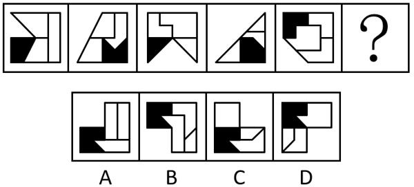

- **A**. A　✅
- **B**. B
- **C**. C
- **D**. D

**答案**：A

**官方解析**

元素组成不同，且无明显属性规律，考虑数量规律。观察发现，题干图形均由一个黑色面和三个白色面组成，优先考虑数面，但整体数面无唯一答案。继续观察发现，前一幅图形中的黑色面形状旋转之后，与后一幅图的外框形状相同，满足这一规律的只有A项。

故正确答案为A。

---

## 第 2 题　qid 18643708 · 图形推理

从所给的四个选项中，选择最合适的一个填入问号处，使之呈现一定的规律性：

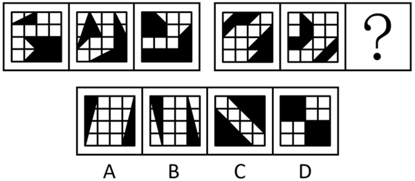

- **A**. A
- **B**. B
- **C**. C　✅
- **D**. D

**答案**：C

**官方解析**

元素组成不同，且无明显数量规律。观察发现，题干均由两个黑色图形构成，且第一组图中两个黑色图形的最小间隔距离相同，第二组前两幅图中两个黑色图形的最小间隔距离也相同，故？处图形中两个黑色图形的最小间隔距离应与第二组前两幅图相同，只有C项符合。

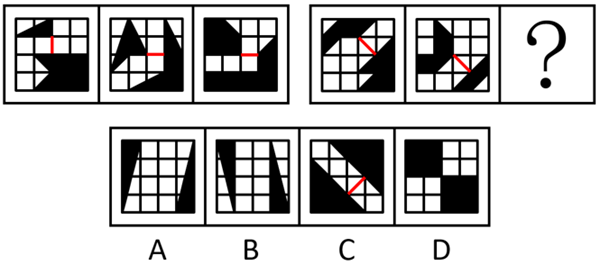

故正确答案为C。

---

## 第 3 题　qid 18643704 · 图形推理

把下面的六个图形分成两类，使每一类图形都有各自的共同特征或规律，分类正确的一项是：

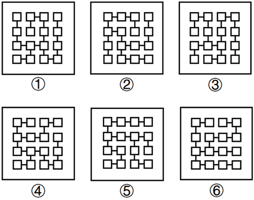

- **A**. ①②⑤，③④⑥
- **B**. ①②⑥，③④⑤
- **C**. ①③⑥，②④⑤　✅
- **D**. ①④⑤，②③⑥

**答案**：C

**官方解析**

元素组成相同，但无明显位置规律，考虑特殊规律。观察发现，题干中每幅图形都只有两个小方块连接三条短线，且图①③⑥中两个小方块直接相连，图②④⑤中两个小方块中间隔着一个小方块，如下图所示，故图①③⑥为一组，图②④⑤为一组。

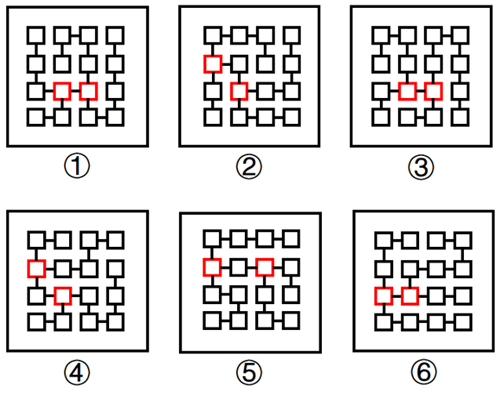

故正确答案为C。

---

## 第 4 题　qid 18643670 · 图形推理

把下面的六个图形分为两类，使每一类图形都有各自的共同特征或规律，分类正确的一项是：

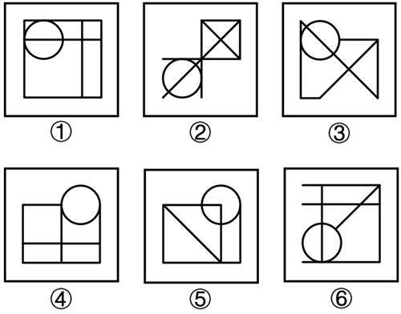

- **A**. ①②③，④⑤⑥
- **B**. ①②④，③⑤⑥　✅
- **C**. ①④⑥，②③⑤
- **D**. ①⑤⑥，②③④

**答案**：B

**官方解析**

本题为分组分类题目。元素组成不同，无明显属性规律，优先考虑数量规律。观察发现，每幅图形均由1个圆和若干直线组成，且相切明显，考虑切点数。图①②④中均有2个切点，图③⑤⑥中均有1个切点，即图①②④为一组，图③⑤⑥为一组。
故正确答案为B。

---

## 第 5 题　qid 18643710 · 图形推理

以下为22个白色、5个灰色正方体组合成的三阶魔方，问哪一项不可能是该魔方拧动1次（位于同一平面上的9个小正方体平行于该平面整体转动、或）后某一面的视图？

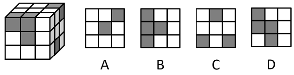

- **A**. A
- **B**. B
- **C**. C
- **D**. D　✅

**答案**：D

**官方解析**

本题考查三视图。

A项：将该魔方最上面一层整体水平逆时针旋转，其正视图为A项，排除；

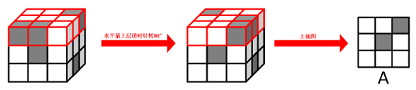

B项：将该魔方最右侧一层整体竖直逆时针旋转，其正视图旋转后可得B项，排除；

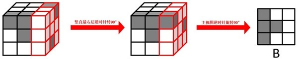

C项：将该魔方最左侧一层整体竖直顺时针旋转后，其俯视图旋转后可得C项，排除；

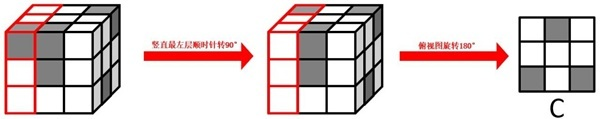

D项：该魔方拧动1次后无法得到该视图，当选。

本题为选非题，故正确答案为D。

---

## 第 6 题　qid 18643631 · 定义判断

气象旅游资源是指大气中的冷、热、风、云、雨、雪、霜、雾、雷、电、光等各种物理现象和物理过程所构成的旅游资源。一般来说，气象旅游资源必须在特定的地域和时期才会出现。
根据上述定义，下列没有体现气象旅游资源的是：

- **A**. 4月的阳朔，游客来到钟乳石溶洞，观看石灰岩历经亿万年形成的钟乳石景观，如“海上明月”“水晶龙宫”等　✅
- **B**. 6月的蓬莱阁，游人立于阁前，凝望雾气蒸腾的海面，会看到海市蜃楼的幻景，它由隐达显，由显转隐，持续几分钟到几十分钟
- **C**. 1月的松花湖，由于气温低，湿度高，街道两旁出现了洁白冰莹的雾凇，姿态各异，引来游人驻足观赏
- **D**. 9月的泰山，游客漫步泰山极顶，往西望去，朵朵残云如风似峦，一道道金光穿云破雾，直泄人间，形成“晚霞夕照”的奇观

**答案**：A

**官方解析**

第一步：找出定义关键词。
“大气中的冷、热、风、云、雨、雪、霜、雾、雷、电、光等各种物理现象和物理过程”。
第二步：逐一分析选项。
A项：游客在钟乳石溶洞中观看的是钟乳石景观，属于地质景观，不涉及大气中的各种物理现象和物理过程，不符合“大气中的冷、热、风、云、雨、雪、霜、雾、雷、电、光等各种物理现象和物理过程”，不符合定义，当选；
B项：海市蜃楼是光线经过不同密度的空气层发生折射的物理现象，涉及大气中的光，折射是物理现象，符合“大气中的冷、热、风、云、雨、雪、霜、雾、雷、电、光等各种物理现象和物理过程”，符合定义，排除；
C项：雾凇是过冷却雾滴在物体表面凝华形成冰晶的现象，涉及大气中的雾，凝华是物理现象，符合“大气中的冷、热、风、云、雨、雪、霜、雾、雷、电、光等各种物理现象和物理过程”，符合定义，排除；
D项：“晚霞夕照”是太阳光在大气中散射形成的现象，涉及大气中的光，散射是物理现象，符合“大气中的冷、热、风、云、雨、雪、霜、雾、雷、电、光等各种物理现象和物理过程”，符合定义，排除。
本题为选非题，故正确答案为A。

---

## 第 7 题　qid 18643635 · 定义判断

社会环境调查是指能获得有关企业与环境之间的关系状态、环境对企业的影响度、企业对环境的适应度等方面的信息，寻找自身的最佳立足点的调查。
根据上述定义，下列没有体现社会环境调查的是：

- **A**. 调查近10年GDP增长率、人均可支配收入变化，推测企业未来的发展机会
- **B**. 调查当地税收政策、环保政策的调整情况，分析企业生产技术与政策的适配情况
- **C**. 调查企业生产活动中固体废弃物的处理方式，判断企业的做法是否符合国家标准
- **D**. 调查现有污染源的位置和污染物环境输送规律，确定大气、土壤采样的布点原则　✅

**答案**：D

**官方解析**

第一步：找出定义关键词。
“企业与环境之间的关系状态、环境对企业的影响度、企业对环境的适应度”、“寻找自身的最佳立足点”。
第二步：逐一分析选项。
A项：通过调查“GDP增长率、人均可支配收入变化”来推测“企业未来的发展机会”，体现了经济环境对企业的影响，符合“环境对企业的影响度、企业对环境的适应度”、“寻找自身的最佳立足点”，符合定义，排除；
B项：通过调查“税收政策、环保政策的调整情况”来分析“企业生产技术与政策的适配情况”，体现了企业对社会政治法律环境的适应度，符合“环境对企业的影响度、企业对环境的适应度”、“寻找自身的最佳立足点”，符合定义，排除；
C项：通过调查“企业生产活动中固体废弃物的处理方式”来判断“企业的做法是否符合国家标准”，体现了企业对社会政治法律环境的适应度，符合“环境对企业的影响度、企业对环境的适应度”、“寻找自身的最佳立足点”，符合定义，排除；
D项：通过调查“现有污染源的位置和污染物环境输送规律”来确定“大气、土壤采样的布点原则”，没有体现企业与环境之间的关系，不符合“企业与环境之间的关系状态、环境对企业的影响度、企业对环境的适应度”，不符合定义，当选。
本题为选非题，故正确答案为D。

---

## 第 8 题　qid 18643639 · 定义判断

情绪理解指个体识别、标签和理解自己及他人情绪状态的能力，包括识别情绪表情、理解情绪产生的原因和预测情绪可能引发的结果。这是一种认知能力。情绪调节指个体管理和改变自己或他人情绪反应的过程、策略和能力，旨在使情绪反应在强度、持续时间和表达方式上更为适应当前情境。
根据上述定义，下列主要体现了情绪调节的是：

- **A**. 小华看到同桌眉头紧锁、沉默不语，判断他可能是因考试没考好而心情沮丧
- **B**. 小美在感到非常愤怒时，会独自去做一会儿运动，让愤怒情绪慢慢平息下来　✅
- **C**. 幼儿园老师指着图片上的各种面孔，教孩子们辨别什么是高兴、什么是悲伤
- **D**. 咨询师帮助某来访者分析，其焦虑情绪往往在任务时间节点即将到来时出现

**答案**：B

**官方解析**

第一步：找出定义关键词。
情绪理解：“个体识别、标签和理解自己及他人情绪状态的能力”；
情绪调节：“个体管理和改变自己或他人情绪反应的过程、策略和能力”。
第二步：逐一分析选项。
A项：小华通过眉头紧锁、沉默不语判断出同桌的沮丧情绪，体现了“个体识别、标签和理解自己及他人情绪状态的能力”，符合“情绪理解”定义，不符合“情绪调节”定义，排除；
B项：小美通过独自去做一会儿运动平息了（即改变）愤怒情绪，体现了“个体管理和改变自己或他人情绪反应的过程、策略和能力”，符合“情绪调节”定义，当选；
C项：老师教导孩子通过图片上的面孔辨别不同情绪，体现了“个体识别、标签和理解自己及他人情绪状态的能力”，符合“情绪理解”定义，不符合“情绪调节”定义，排除；
D项：咨询师帮助某来访者分析其焦虑情绪出现的时机，体现了“个体识别、标签和理解自己及他人情绪状态的能力”，符合“情绪理解”定义，不符合“情绪调节”定义，排除。
故正确答案为B。

---

## 第 9 题　qid 18643709 · 定义判断

信息规制是指规制机构通过信息公开的方式纠正风险和相关市场不完全的行为。从具体实施上，信息规制可分为对信息的规制和通过信息规制两种，前者是指由主管机关对相对人披露有关信息的强制性要求，后者是指在现代网络资讯背景下，由主管机关通过公布一定的信息来实现对相对人的规制和惩罚。
根据上述定义，下列不属于信息规制的是：

- **A**. 甲国的一些社交平台为防止不良信息传播，采用过滤系统对不良信息进行分级、监管并及时过滤这些信息　✅
- **B**. 乙国颁布《网络安全法》，规定了网络运营者收集、使用个人信息的基本规则，确保网络信息的合法性
- **C**. 丙国《儿童在线隐私保护法》规定，知名网站不得向13周岁以下儿童开放
- **D**. 丁国推出《在线隐私保护法案》，要求媒体平台应采取一切措施核实用户年龄。某网站违反该法案后，被处高额罚款

**答案**：A

**官方解析**

第一步：找出定义关键词。
信息规制：“规制机构”、“信息公开的方式”、“纠正风险和相关市场不完全的行为”；
对信息的规制：“主管机关”、“对相对人披露有关信息”、“强制性要求”；
通过信息规制：“在现代网络资讯背景下”、“主管机关公布一定的信息”、“实现对相对人的规制和惩罚”。
第二步：逐一分析选项。
A项：社交平台，不符合“规制机构”，对信息进行分级，过滤，不符合“信息公开的方式”，不符合信息规制定义，当选；
B项：乙国颁布《网络安全法》，符合“规制机构”，规定了网络运营者收集、使用个人信息的基本规则，符合“纠正风险和相关市场不完全的行为”，并且符合“对相对人披露有关信息”、“强制性要求”，符合对信息的规制，排除；
C项：丙国《儿童在线隐私保护法》，符合“规制机构”，规定知名网站不得向13周岁以下儿童开放，符合“纠正风险和相关市场不完全的行为”，并且符合“对相对人披露有关信息”、“强制性要求”，符合对信息的规制，排除；
D项：丁国推出《在线隐私保护法案》，符合“规制机构”，某网站违反该法案后，被处高额罚款，符合“纠正风险和相关市场不完全的行为”，并且符合“实现对相对人的规制和惩罚”，符合通过信息规制，排除。
本题为选非题，故正确答案为A。

---

## 第 10 题　qid 18643706 · 定义判断

医疗伦理损害是指医疗机构及医务人员从事各种医疗行为时，未对病患充分告知或者说明其病情，未对病患提供及时有用的医疗建议，未保守与病情有关的各种秘密，或未取得病患同意即采取某种医疗措施或停止继续治疗等，而违反医疗职业良知或职业伦理上应遵守的规则的过失行为。
根据上述定义，下列涉及了医疗伦理损害的是：

- **A**. 患者在治疗期间发现医院对其病历进行了篡改和伪造，导致其在后续治疗中受到误导
- **B**. 患者因咳嗽住院，医生对其使用了昂贵且非必要的抗生素，并延长其住院时间，患者感到疑惑，但医生未给予充分解释　✅
- **C**. 患者因外伤处于不可逆的昏迷状态，医生在告知家属情况后，家属选择撤离呼吸机，停止进一步的生命支持
- **D**. 患者因身体不适前往一家无证诊所就诊，在接受治疗后，患者病情加重并出现并发症

**答案**：B

**官方解析**

第一步：找出定义关键词。
“从事各种医疗行为时”、“未对病患充分告知或者说明其病情，未提供及时有用的医疗建议······等”、“违反医疗职业良知或职业伦理”。
第二步：逐一分析选项。
A项：患者被篡改和伪造的是其治疗期间的病历，医生对患者的具体病情、医疗建议是否充分告知，是否保守秘密等问题并未涉及，不符合“未对病患充分告知或者说明其病情，未提供及时有用的医疗建议······等”，不符合定义，排除；
B项：医生在患者感到疑惑时并未充分解释，符合“未对病患充分告知或者说明其病情”，使用昂贵且非必要的抗生素并延长住院时间，符合“违反医疗职业良知或职业伦理”，符合定义，当选；
C项：医生在告知家属情况后，家属选择撤离呼吸机，医生并不存在过失行为，不符合“违反医疗职业良知或职业伦理”，不符合定义，排除；
D项：患者在接受治疗后病情加重并出现并发症，不符合“未对病患充分告知或者说明其病情，未提供及时有用的医疗建议······等”，不符合定义，排除。
故正确答案为B。

---

## 第 11 题　qid 18643711 · 定义判断

民航运输生产指标中，民航客座率指的是实际承运人数与可供座位数的百分比。民航载运率包括航站始发载运率和航线载运率两个指标，其中航站始发载运率是实际载运量与飞机最大载运能力之比；航线载运率是实际总周转量与最大周转量之比。飞行小时生产率指的是每一运输飞行小时平均完成的吨公里数，以“吨公里/时”为计量单位。其计算采用两种等效公式：基于运输总周转量与飞行时间的比值（运输总周转量/运输飞行小时），或每班最大业载与航速的乘积（每班最大业载×航速）。
根据上述定义，下列说法错误的是：

- **A**. 航线载运率可反映飞机在一条航线上载运能力的利用程度，也反映客货源的变动情况
- **B**. 每班最大业载越高，航速越快，运输总周转量就越高，运输飞行小时也越多　✅
- **C**. 客座率可以反映航班座位资源的使用效率，该指标会受到市场需求、票价策略的影响
- **D**. 航站始发载运率反映了航站对飞机载运能力的利用程度和航班组织的合理性，是调整航班、编制发送量的依据

**答案**：B

**官方解析**

第一步：找出定义关键词。
民航客座率：“实际承运人数与可供座位数的百分比”；
航站始发载运率：“实际载运量与飞机最大载运能力之比”；
航线载运率：“实际总周转量与最大周转量之比”；
飞行小时生产率：“每一运输飞行小时平均完成的吨公里数”、“运输总周转量/运输飞行小时”、“每班最大业载×航速”。
第二步：逐一分析选项。
A项：航线载运率的定义为“实际总周转量与最大周转量之比”，周转量是指一定时期内，实际运送的旅客人数或货物吨量与其运输距离的乘积。实际总周转量与最大周转量之比直接反映飞机在航线上的载运能力利用程度，而实际总周转量受客货源影响（客货源充足则实际总周转量高），因此也能反映客货源变动情况，说法正确，排除；
B项：根据飞行小时生产率的两种等效公式“运输总周转量／运输飞行小时”、“每班最大业载×航速”可以得出：“运输总周转量／运输飞行小时=每班最大业载×航速”，可推导得出“运输总周转量=每班最大业载×航速×运输飞行小时”。当每班最大业载越高，航速越快时，但运输飞行小时未知，则运输总周转量不一定越高；同理，运输总周转量未知，则运输飞行小时也不一定越多，说法错误，当选；
C项：根据民航客座率的定义“实际承运人数与可供座位数的百分比”，可知民航客座率可以直接反映航班座位资源的使用效率。当市场需求旺盛或票价便宜时实际承运人数可能会增多，当市场需求冷淡或票价昂贵时实际承运人数可能会减少，因此民航客座率会受到市场需求、票价策略的影响，说法正确，排除；
D项：根据航站始发载运率的定义“实际载运量与飞机最大载运能力之比”，可知航站始发载运率可以直接反映航站对飞机载运能力的利用程度和航班组织的合理性，比值越高（低于100%时）说明航站对飞机载运能力利用越充分、航班组织越合理，因此可将其作为调整航班、编制发送量的依据，说法正确，排除。
本题为选非题，故正确答案为B。

---

## 第 12 题　qid 18643638 · 定义判断

断裂带理论认为团队内部因成员多重特征（如年龄、专业背景）差异形成隐性分界线，这些分界线被称为“断裂带”，导致子群体间冲突或协同障碍，其强度由特征重叠度与子群体对立程度决定。断裂带可能促进或阻碍团队的创新、沟通和绩效。
根据上述定义，下列情形体现了断裂带理论的是：

- **A**. 研发团队因技术路线分歧分成两派，但最终通过实验数据达成共识
- **B**. 高管团队中60后成员偏好稳健战略，80后成员主张激进创新，二者之间形成决策僵局　✅
- **C**. 销售部按区域划分小组，华北组与华南组定期交换市场策略
- **D**. 项目组通过匿名投票消除职称差异对方案选择的影响

**答案**：B

**官方解析**

第一步：找出定义关键词。
“团队内部因成员多重特征（如年龄、专业背景）差异形成隐性分界线”、“子群体间冲突或协同障碍”。
第二步：逐一分析选项。
A项：研发团队因技术路线分歧分成两派，是技术路线分歧，不符合“团队内部因成员多重特征（如年龄、专业背景）差异形成隐性分界线”，最终达成共识，不符合“子群体间冲突或协同障碍”，不符合定义，排除；
B项：高管团队中60后成员偏好稳健战略，而80后成员主张激进创新，符合“团队内部因成员多重特征（如年龄、专业背景）差异形成隐性分界线”，最终形成决策僵局，符合“子群体间冲突或协同障碍”，符合定义，当选；
C项：销售部按区域划分小组，不符合“团队内部因成员多重特征（如年龄、专业背景）差异形成隐性分界线”，不同小组定期交换市场策略，不符合“子群体间冲突或协同障碍”，不符合定义，排除；
D项：项目组通过匿名投票消除职称差异对方案选择的影响，不符合“团队内部因成员多重特征（如年龄、专业背景）差异形成隐性分界线”、“子群体间冲突或协同障碍”，不符合定义，排除。
故正确答案为B。

---

## 第 13 题　qid 18643637 · 定义判断

广告语言的语音“陌生化”是指通过语音韵律和常规语言的相异来求得广告语言的陌生化效果，其可分为两种方式：①声韵“陌生化”，即借助语言的音韵来实现广告语言特殊的“声韵结构”，这里较常见的是语言的押韵，即通过语句句尾韵母的相同或相近来获得与日常语言的相异效果。②节律“陌生化”，即借助语音的节奏、格律（如复叠、对仗等）来区别于日常语言，从而赋予广告以语音上的“陌生化”。
根据上述定义，下列广告语言只体现了节律“陌生化”的是：

- **A**. 酒业广告语——五月黄梅天，三星白兰地　✅
- **B**. 洗衣粉广告语——从这一面到那一面，认真生活每一面
- **C**. 自行车广告语——“骑”乐无穷，乐在“骑”中
- **D**. 纸尿裤广告语——天才第一步，X牌纸尿裤

**答案**：A

**官方解析**

第一步：找出定义关键词。
广告语言的语音“陌生化”：“通过语音韵律和常规语言的相异”、“求得广告语言的陌生化效果”；
声韵“陌生化”：“通过语句句尾韵母的相同或相近”、“获得与日常语言的相异效果”；
节律“陌生化”：“借助语音的节奏、格律（如复叠、对仗等）”、“区别于日常语言”。
第二步：逐一分析选项。
A项：“五月黄梅天”的句尾韵母是“an”，“三星白兰地”的句尾韵母是“i”，不符合“通过语句句尾韵母的相同或相近”，没有体现声韵“陌生化”，同时“五月黄梅天，三星白兰地”中“五”对“三”、“月”对“星”、“黄”对“白”、“梅”对“兰”、“天”对“地”，诗句对仗工整，符合“借助语音的节奏、格律（如复叠、对仗等）”，只体现了节律“陌生化”，当选；
B项：“从这一面到那一面”的句尾韵母是“an”，“认真生活每一面”的句尾韵母是“an”，符合“通过语句句尾韵母的相同或相近”，符合声韵“陌生化”定义，并非只体现了节律“陌生化”，排除；
C项：“‘骑’乐无穷”的句尾韵母是“ong”，“乐在‘骑’中”的句尾韵母是“ong”，符合“通过语句句尾韵母的相同或相近”，符合声韵“陌生化”定义，并非只体现了节律“陌生化”，排除；
D项：“天才第一步”的句尾韵母是“u”，“X牌纸尿裤”的句尾韵母是“u”，符合“通过语句句尾韵母的相同或相近”，符合声韵“陌生化”定义，并非只体现了节律“陌生化”，排除。
故正确答案为A。

---

## 第 14 题　qid 18643646 · 定义判断

生物污损是指生物在人工材料或设施上附着、生长，使其性能下降或损坏的自然现象。
根据上述定义，下列体现了生物污损的是：

- **A**. 藤壶、贻贝、藻类等海洋生物通过分泌粘性物质附着于船壳表面，附着层厚度每增加1毫米，船舶燃料消耗量将提升约3％　✅
- **B**. 在潮间带上建造的大桥，为了防止其被硫酸盐还原细菌等腐蚀，会在其桥段上喷碱性涂料，使细菌等生物避而远之
- **C**. 诺如病毒附着在生鲜水果上，被人们食用后在体内不断繁殖，进而引发胃肠道感染
- **D**. 森林公园通过建设刺猬屋、蚯蚓塔、昆虫旅馆等设施，为生物的生长提供了栖息地

**答案**：A

**官方解析**

第一步：找出定义关键词。
“生物在人工材料或设施上附着、生长”、“使其性能下降或损坏的自然现象”。
第二步：逐一分析选项。
A项：海洋生物通过分泌粘性物质附着于船壳表面，船舶是人造物品，符合“生物在人工材料或设施上附着、生长”，附着层厚度每增加1毫米，船舶燃料消耗量将提升约3％，船舶燃料消耗量的提升说明了船舶本身的动力性能下降，符合“使其性能下降或损坏的自然现象”，符合定义，当选；
B项：在大桥上喷碱性涂料，使细菌等生物避而远之，说明生物没有在大桥上附着、生长，不符合“生物在人工材料或设施上附着、生长”，不符合定义，排除；
C项：诺如病毒附着在生鲜水果上，生鲜水果不属于人工材料或设施，不符合“生物在人工材料或设施上附着、生长”，不符合定义，排除；
D项：森林公园通过人工设施为生物生长提供栖息地，这有利于公园生态环境发展，不符合“使其性能下降或损坏的自然现象”，不符合定义，排除。
故正确答案为A。

---

## 第 15 题　qid 18643669 · 定义判断

在心理学领域，否认是指无意识地拒绝承认那些不愉快的现实以保护自我，它是最原始、最简单的心理防卫机制。歪曲是把外界事实加以曲解、变化以符合内心的需要，其属于精神病性的心理防卫机制，因歪曲作用而表现的精神病现象，以妄想或幻觉最为常见。反作用形成是指有意识地采取某种与潜意识完全相反的看法和行动，因为真实意识表现出来不符合社会道德规范或引起内心焦虑，故而朝着相反的途径释放。
根据上述定义，下列说法正确的是：

- **A**. 医生诊断赵华患有胃癌，但赵华难以接受，认为自己没有得癌症，赵华的这种行为属于反作用形成
- **B**. 对丈夫前妻留下的孩子怀有敌意的继母，往往特别溺爱孩子，企图证明她没有敌视孩子，继母的这种行为属于歪曲
- **C**. 小宋昨天和女朋友分手，却自以为要和女朋友结婚，甚至还到处向亲朋好友发喜帖，小宋的这种行为属于反作用形成
- **D**. 2岁的小明在家里玩耍时常会不小心打碎东西，发生这种事时，他往往用手把眼睛蒙起来，小明的这种行为属于否认　✅

**答案**：D

**官方解析**

第一步：找出定义关键词。
否认：“无意识地拒绝承认那些不愉快的现实以保护自我”；
歪曲：“把外界事实加以曲解、变化以符合内心的需要”；
反作用形成：“有意识地采取某种与潜意识完全相反的看法和行动”。
第二步：逐一分析选项。
A项：医生诊断赵华患有胃癌，但赵华难以接受，认为自己没有得癌症，说明赵华无意识地拒绝相信自己患病这一事实，符合“无意识地拒绝承认那些不愉快的现实以保护自我”，符合“否认”定义，不符合“反作用形成”定义，说法错误，排除；
B项：怀有敌意的继母，特别溺爱孩子，企图证明她没有敌视孩子，说明继母有意识地采取与自己真实想法相反的方式对待孩子，符合“有意识地采取某种与潜意识完全相反的看法和行动”，符合“反作用形成”定义，不符合“歪曲”定义，说法错误，排除；
C项：小宋和女朋友已经分手了，却还向亲朋好友发喜帖，说明小宋把分手的事实歪曲为要结婚，符合“把外界事实加以曲解、变化以符合内心的需要”，符合“歪曲”定义，不符合“反作用形成”定义，说法错误，排除；
D项：小明不小心打碎东西时，用手把眼睛蒙起来，说明小明拒绝看到打碎东西这一事实，符合“无意识地拒绝承认那些不愉快的现实以保护自我”，符合“否认”定义，说法正确，当选。
故正确答案为D。

---

## 第 16 题　qid 18643656 · 类比推理

旧友：故友

- **A**. 惯犯：累犯　✅
- **B**. 开端：事端
- **C**. 出现：再现
- **D**. 消退：倒退

**答案**：A

**官方解析**

第一步：判断题干词语间逻辑关系。
旧友意思为从前结交的朋友，故友意思为死去了的朋友或旧日的朋友，二者都有旧时结交的朋友的意思，为近义关系。
第二步：判断选项词语间逻辑关系。
A项：惯犯是指经常犯罪而屡教不改的罪犯，累犯是指被判处有期徒刑以上刑罚，刑罚执行完毕或者赦免后，在法定期限内又犯必须判处有期徒刑以上刑罚的罪犯，二者都强调再次犯罪的意思，为近义关系，与题干逻辑关系一致，当选；
B项：开端指（事情的）起头，开头，事端指纠纷，二者不是近义关系，与题干逻辑关系不一致，排除；
C项：出现意思为显露出来，再现指过去的事情再次出现，二者不是近义关系，与题干逻辑关系不一致，排除；
D项：消退意思为减退、逐渐消失，倒退意思为往后退，退回（后面的地方、过去的年代、以往的发展阶段），二者不是近义关系，与题干逻辑关系不一致，排除。
故正确答案为A。

---

## 第 17 题　qid 18643649 · 类比推理

审计局：财务监督

- **A**. 气象局：防灾救灾
- **B**. 档案馆：史料编研
- **C**. 监察委：纪律审查　✅
- **D**. 信访局：矛盾调解

**答案**：C

**官方解析**

第一步：判断题干词语间逻辑关系。
审计局主要任务是依照国家的法律以及财政经济规章制度和行政法规，在政府和国家审计署领导下，行使审计监督权。财务监督是审计局的职责，二者为职责对应的关系。
第二步：判断选项词语间逻辑关系。
A项：气象局的主要职责包括气象观测、预报预警、防灾减灾、气候服务以及气象行政执法等，救灾不是气象局的职责，二者不是职责对应的关系，与题干逻辑关系不一致，排除；
B项：档案馆的主要职责是管理档案和史料，而不是编研，二者不是职责对应的关系，与题干逻辑关系不一致，排除；
C项：监察委对所有行使公权力的公职人员进行监察，调查职务违法和职务犯罪，纪律审查是监察委的职责，与题干逻辑关系一致，当选；
D项：信访局负责处理群众来信来访、转送交办信访事项，协调重要信访问题，开展调研并提出政策建议，承担信访工作等，矛盾调解不是信访局的职责，二者不是职责对应的关系，与题干逻辑关系不一致，排除。
故正确答案为C。

---

## 第 18 题　qid 18643654 · 类比推理

撕：扯：撕扯

- **A**. 攀：登：攀登
- **B**. 抛：掷：抛掷　✅
- **C**. 研：磨：研磨
- **D**. 裁：剪：裁剪

**答案**：B

**官方解析**

第一步：判断题干词语间逻辑关系。
“撕”和“扯”均是手部动作，且都是提手旁；第三个字“撕扯”是由前两个字组合而成，同样强调手部动作。
第二步：判断选项词语间逻辑关系。
A项：“攀”和“登”中，“攀”包含手部动作，但“登”与足部相关，与题干逻辑关系不一致，排除；
B项：“抛”和“掷”均是手部动作，且都是提手旁；第三个字“抛掷”是由前两个字组合而成，同样强调手部动作，与题干逻辑关系一致，当选；
C项：“研”和“磨”均是手部动作，“研”为石字旁‌，“磨”为麻字旁，偏旁与题干不一致，排除；
D项：“裁”和“剪”均是手部动作，“裁”为衣字旁，“剪”为刀字旁，偏旁与题干不一致，排除。
故正确答案为B。

---

## 第 19 题　qid 18643650 · 类比推理

囹圄：囚犯：监狱

- **A**. 庙主：僧人：寺庙
- **B**. 庠序：学生：学校　✅
- **C**. 朝廷：皇帝：皇宫
- **D**. 陷阵：士兵：兵营

**答案**：B

**官方解析**

第一步：判断题干词语间逻辑关系。
囹圄指监禁场所，是古时监狱的别称，与监狱构成全同关系，囚犯被关押在监狱里，二者为对象与场所的对应关系。
第二步：判断选项词语间逻辑关系。
A项：庙主指主持庙中事物的和尚或道士，与寺庙构成对应关系，与题干逻辑关系不一致，排除；
B项：庠序指古代的地方学校，后也泛称学校，与学校构成全同关系，学生在学校里学习，二者为对象与场所的对应关系，与题干逻辑关系一致，当选；
C项：朝廷指君主接受朝见并处理政事的场所，也指以君主为首的中央统治机构，皇宫是皇帝居住的地方，“朝廷”和“皇宫”不是全同关系，与题干逻辑关系不一致，排除；
D项：陷阵指冲入敌阵，与兵营无法构成全同关系，与题干逻辑关系不一致，排除。
故正确答案为B。

---

## 第 20 题　qid 18643657 · 类比推理

疾步：奔走：风驰电掣

- **A**. 迅速：高效：风风火火
- **B**. 忧心：惴惴：惶惶不可终日　✅
- **C**. 向往：热衷：唯恐避之不及
- **D**. 认可：享受：甘之如饴

**答案**：B

**官方解析**

第一步：判断题干词语间逻辑关系。
“疾步”指快速的行走步伐，“奔走”指急走、跑，二者为近义关系；“风驰电掣”意思是像刮风和闪电那样迅速，可以用来形容第一词和第二词的状态。
第二步：判断选项词语间逻辑关系。
A项：“迅速”侧重速度快，“高效”侧重效率高，二者不是近义关系，与题干逻辑关系不一致，排除；
B项：“忧心”指忧虑、担心，“惴惴”形容又发愁又害怕，二者为近义关系；“惶惶不可终日”意思是惊慌得连一天都过不下去，可以用来形容第一词和第二词的状态，与题干逻辑关系一致，当选；
C项：“向往”指因热爱、羡慕某种事物或境界而希望得到或达到，“热衷”指急切盼望得到，二者为近义关系；“唯恐避之不及”意思是生怕躲避得不够快、不够及时，不能用来形容“向往”和“热衷”的状态，与题干逻辑关系不一致，排除；
D项：“认可”指许可、同意，“享受”指物质上或精神上得到满足，二者不是近义关系，与题干逻辑关系不一致，排除。
故正确答案为B。

---

## 第 21 题　qid 18643658 · 类比推理

酸败：乳酸菌：牛奶

- **A**. 发霉：木质家具：潮湿
- **B**. 溶蚀：地下水：石灰岩　✅
- **C**. 变味：冰箱冷藏：饭菜
- **D**. 缺氮：枯黄：绿植叶片

**答案**：B

**官方解析**

第一步：判断题干词语间逻辑关系。
“乳酸菌”导致“酸败”，二者构成因果对应关系，产生酸败现象的主体是牛奶，二者构成对应关系。
第二步：判断选项词语间逻辑关系。
A项：“潮湿”导致“发霉”，二者构成因果对应关系，但词语顺序与题干不一致，与题干逻辑关系不一致，排除；
B项：“地下水”导致“溶蚀”，二者构成因果对应关系，产生溶蚀现象的主体是石灰岩，二者构成对应关系，与题干逻辑关系一致，当选；
C项：“冰箱冷藏”是为了防止“变味”，二者是方式目的对应关系，与题干逻辑关系不一致，排除；
D项：“缺氮”导致“枯黄”，二者构成因果对应关系，但词语顺序与题干不一致，与题干逻辑关系不一致，排除。
故正确答案为B。

---

## 第 22 题　qid 18643662 · 类比推理

电磁感应：发电机：电能转换

- **A**. 光电效应：太阳能电池：光能转换　✅
- **B**. 压电效应：传感器：振动检测
- **C**. 热电效应：温差发电：热能转换
- **D**. 磁滞现象：变压器：能量损耗

**答案**：A

**官方解析**

第一步：判断题干词语间逻辑关系。
电磁感应是发电机的工作原理，前两词是工作原理与设备的对应关系，发电机的功能是实现电能转换，后两词是功能的对应关系。
第二步：判断选项词语间逻辑关系。
A项：光电效应是太阳能电池的工作原理，前两词是工作原理与设备的对应关系，太阳能电池的功能是实现光能转换，后两词是功能的对应关系，与题干逻辑关系一致，保留；
B项：压电效应是传感器的工作原理，前两词是工作原理与设备的对应关系，传感器具有振动检测的功能，后两词是功能的对应关系，与题干逻辑关系一致，保留；
C项：热电效应是温差发电的工作原理，但温差发电不是设备，二者不是工作原理与设备的对应关系，与题干逻辑关系不一致，排除；
D项：变压器的工作原理是电磁感应，不是磁滞现象，且变压器的功能是进行电压变换、电流变换和阻抗变换，能量损耗不是变压器的功能，与题干逻辑关系不一致，排除。
对比A、B两项，题干与A项中的功能均是能量的转换，而B项中的功能不是能量转换，A项的逻辑关系与题干更为一致。
故正确答案为A。

---

## 第 23 题　qid 18643661 · 类比推理

探测仪器：地质勘查：寻找矿产

- **A**. 声呐设备：海洋探测：高精准度
- **B**. 激光雷达：地形测绘：清晰成像
- **C**. 高空探测：气象气球：收集数据
- **D**. 采样机器：环境检测：评估污染　✅

**答案**：D

**官方解析**

第一步：判断题干词语间逻辑关系。
探测仪器用来地质勘查和寻找矿产，第二词和第三词分别与第一词构成功能对应关系。
第二步：判断选项词语间逻辑关系。
A项：声呐设备用来海洋探测，前两词构成功能对应关系，高精准度是声呐设备的特点，第一词与第三词构成属性对应关系，与题干逻辑关系不一致，排除；
B项：激光雷达用来地形测绘，前两词构成功能对应关系，清晰成像是激光雷达的特点，第一词与第三词构成属性对应关系，与题干逻辑关系不一致，排除；
C项：气象气球用来高空探测，前两词构成功能对应关系，但词语顺序与题干不同，与题干逻辑关系不一致，排除；
D项：采样机器用来环境检测和评估污染，第二词和第三词分别与第一词构成功能对应关系，与题干逻辑关系一致，当选。
故正确答案为D。

---

## 第 24 题　qid 18643663 · 类比推理

车位共享 对于 （    ） 相当于 （    ） 对于 基层自治

- **A**. 共享经济；社区治理　✅
- **B**. 公共服务；公共事务
- **C**. 停车难题；人民民主
- **D**. 资源统筹；业主议事

**答案**：A

**官方解析**

逐一代入选项。
A项：车位共享是共享经济的一种体现方式，二者为种属关系；社区治理是基层自治的一种体现方式，二者为种属关系，前后逻辑关系一致，当选；
B项：车位共享是市场化的共享经济行为，与公共服务无明显逻辑关系；公共事务是基层自治的管理内容，二者为对应关系，前后逻辑关系不一致，排除；
C项：车位共享的目的是解决停车难题，二者为方式目的对应关系；基层自治是人民民主在基层的具体体现形式，二者不是方式目的对应关系，前后逻辑关系不一致，排除；
D项：车位共享是资源统筹的一种体现方式，二者为种属关系；业主议事通常指的是业主大会或业主委员会为共同管理物业区域而进行的议事活动，与基层自治无明显逻辑关系，前后逻辑关系不一致，排除。
故正确答案为A。

---

## 第 25 题　qid 18643664 · 类比推理

政策试点 对于 （    ） 相当于 可行性研究 对于 （    ）

- **A**. 经验总结 项目论证
- **B**. 全面推广 立项批复　✅
- **C**. 问题反馈 预算编制
- **D**. 立法保障 投资决策

**答案**：B

**官方解析**

逐一代入选项。
A项：先政策试点，再经验总结，二者构成先后顺序的对应关系，项目论证指项目的鉴定和可行性研究，可行性研究是项目论证的一部分，二者构成组成关系，前后逻辑关系不一致，排除；
B项：先政策试点，再全面推广，二者构成先后顺序的对应关系，先可行性研究，再立项批复，二者构成先后顺序的对应关系，前后逻辑关系一致，当选；
C项：先政策试点，再问题反馈，二者构成先后顺序的对应关系，可行性研究报告和预算编制是现代企业发展和管理中的两个关键环节，二者构成并列关系，前后逻辑关系不一致，排除；
D项：政策试点与立法保障，二者无明显逻辑关系，可行性研究是投资决策的依据，二者构成依据对应关系，前后逻辑关系不一致，排除。
故正确答案为B。

---

## 第 26 题　qid 18643667 · 逻辑判断

甑皮岩遗址位于广西桂林的独山，考古人员从该遗址中发掘出距今12000年前的陶器，还在遗址中发现大量完整的螺、蚌等介壳，由于螺、蚌等食物只有经水煮加热之后，才能在不打碎介壳的前提下，顺利取食其中的肉。因此，研究人员认为：当时的人们已经开始食用螺、蚌，陶器的出现很可能与人们食用螺、蚌有关。
以下哪项如果为真，最能支持上述观点？

- **A**. 这些陶器多采用原始的捏制方法制作而成，具有非常原始的特征
- **B**. 桂林地区的地理环境和气候条件为陶器的出现提供了稳定的原料
- **C**. 螺、蚌介壳等遗存的发现，显示出旧石器晚期人群食物的复杂性
- **D**. 在桂林其他地区，人们也发现了陶器中残留有螺、蚌介壳的迹象　✅

**答案**：D

**官方解析**

第一步：找出论点和论据。
论点：当时的人们已经开始食用螺、蚌，陶器的出现很可能与人们食用螺、蚌有关。
论据：从该遗址中发掘出距今12000年前的陶器，还在遗址中发现大量完整的螺、蚌等介壳，由于螺、蚌等食物只有经水煮加热之后，才能在不打碎介壳的前提下，顺利取食其中的肉。
本题论点说的是当时人们已经开始食用螺、蚌，且陶器因此而出现，论据说的是在遗址中发现完整的螺、蚌以及陶器，且螺、蚌需加热才能取出肉而不破坏其完整性，可以合理推出人们当时可能用陶器烹煮螺、蚌来食用，故论据和论点话题一致，加强优先考虑补充论据。
第二步：逐一分析选项。
A项：该项说的是陶器多采用原始的捏制方法制作而成，未提及陶器的出现是否与食用螺、蚌有关，话题不一致，无法加强，排除；
B项：该项说的是桂林的地理环境和气候条件能提供陶器制作的原料，但当时陶器的出现是否与食用螺、蚌有关并未提及，话题不一致，无法加强，排除；
C项：该项说的是旧石器晚期人群食物具有复杂性，但当时人们是否开始食用螺、蚌，以及陶器的出现是否与食用螺、蚌有关均不明确，无法加强，排除；
D项：该项说的是在桂林其他地区发现陶器中残留有螺、蚌介壳的迹象，直接证明陶器可能曾被用于烹煮螺、蚌，补充论据，可以加强，当选。
故正确答案为D。

---

## 第 27 题　qid 18643668 · 逻辑判断

过敏是儿童常见的一种疾病。在遇到环境、食物中的过敏原，儿童常常会因为过敏而出现皮肤瘙痒、呼吸不畅等症状。研究发现，相比不过敏的同龄儿童，容易过敏的儿童会经常感到不适且无法用言语准确表达，出现焦虑情绪的比例显著上升。因此，研究人员认为：长期过敏的儿童，更可能产生不良情绪，引发交际和心理问题。
以下哪项如果为真，最能削弱上述观点？

- **A**. 过敏带来的瘙痒、鼻塞等问题会分散儿童注意力，使其难以专注于学习、玩耍等活动
- **B**. 原本具有焦虑倾向或情绪调节能力较差的儿童，免疫系统更易对环境过敏原过度反应　✅
- **C**. 曾经因为吃某种食物过敏而呼吸困难的儿童，往往在之后看到这类食物就会心生恐惧
- **D**. 过敏儿童若得到家庭充分的情感支持和过敏管理，其焦虑水平与正常儿童无显著差异

**答案**：B

**官方解析**

第一步：找出论点和论据。
论点：长期过敏的儿童，更可能产生不良情绪，引发交际和心理问题。
论据：相比不过敏的同龄儿童，容易过敏的儿童会经常感到不适且无法用言语准确表达，出现焦虑情绪的比例显著上升。
本题论点和论据讨论的都是过敏的儿童更可能产生不良情绪，二者话题一致，削弱优先考虑削弱论点，且论点包含因果关系，还可以考虑因果倒置或他因削弱。
第二步：逐一分析选项。
A项：该项指出过敏会带来分散儿童注意力的结果，与题干中产生不良情绪无关，为无关项，无法削弱，排除；
B项：该项指出原本具有焦虑倾向或情绪调节能力较差的儿童，免疫系统更易对环境过敏原过度反应，说明是“不良情绪导致了过敏反应”，因果倒置，可以削弱，当选；
C项：该项指出曾经因为吃某种食物过敏而呼吸困难的儿童，往往在之后看到这类食物就会心生恐惧，主体不符合长期过敏的儿童，且心生恐惧不代表焦虑，为无关项，无法削弱，排除；
D项：该项指出过敏儿童若得到家庭充分的情感支持和过敏管理，其焦虑水平与正常儿童无显著差异，但无法确定过敏儿童是否比不过敏儿童更容易产生不良情绪，为不明确项，无法削弱，排除。
故正确答案为B。

---

## 第 28 题　qid 18643721 · 逻辑判断

某市近年来陆续开设了许多社区图书室，通常来说，社区图书室离家近，看书方便，应该受到居民的热捧，然而调查发现：不少社区图书室冷冷清清，与省、市图书馆里读者众多、一座难求的情形形成了鲜明对比。有人认为，目前，社区图书室的活动过少，只有更多地举办富有吸引力的文化活动，社区图书室才能有效吸引读者。
以下哪项如果为真，最能反驳上述观点？

- **A**. 社区图书室中图书的更新相对缓慢，这使得一些居民不愿走进社区图书室
- **B**. 很多居民并不知道社区设有图书室，通过举办活动可以对图书室进行宣传
- **C**. 当下，一些举办了各类趣味文化活动的社区图书室依然读者稀少，门庭冷落
- **D**. 居民下班回到小区时，社区图书室也下班关闭，时间不匹配影响了读者来访　✅

**答案**：D

**官方解析**

第一步：找出论点和论据。
论点：只有更多地举办富有吸引力的文化活动，社区图书室才能有效吸引读者。
论据：不少社区图书室冷冷清清，与省、市图书馆里读者众多、一座难求的情形形成了鲜明对比。
本题论点和论据都在讨论“社区图书室”和“读者”的关系，二者话题一致，削弱可以考虑削弱论点。
第二步：逐一分析选项。
A项：社区图书室中图书的更新相对缓慢，这使得一些居民不愿走进社区图书室，举例说明社区图书室读者稀少的真实原因是图书更新缓慢，举例子削弱，可以削弱，保留;
B项：通过举办活动可以对图书室进行宣传，但是不明确宣传是否能吸引读者，无法削弱，排除；
C项：一些举办了各类趣味文化活动的社区图书室依然读者稀少，举例说明举办文化活动，社区图书室读者依然稀少，举例子削弱，可以削弱，保留;
D项：社区图书室开放时间和居民回家的时间不匹配影响了读者来访，说明社区图书室读者稀少的真实原因是其开放时间与读者的空闲时间不匹配，直接否定论点，可以削弱，保留。
比较A、C、D三项，A、C两项为举例子否定论点，D项为直接否定论点，直接否定论点的削弱力度强于举例子否定论点，故D项更为合适。
故正确答案为D。

---

## 第 29 题　qid 18643671 · 逻辑判断

人工湿地尾水处理模式是一种通过模拟天然湿地系统结构和功能而建设的污水处理技术，是融合了饱和基质、水生植被、动物和水体等多个要素的生态系统。在农村地区建造人工湿地，与传统污水处理厂相比可节省30％的投资成本，且在处理过程中基本无能耗，运行费用低。因此在农村地区，建立人工湿地比传统污水处理厂更经济、更环保。
以下哪项如果为真，最能削弱上述结论？

- **A**. 人工湿地的污水处理效率受气候条件影响很大，在冬季低温时净化效果显著下降，难以稳定达到排放标准
- **B**. 传统污水处理厂近年来技术升级，已出现模块化、低能耗的新型处理设备，在农村地区也可实现低成本运行
- **C**. 某些人工湿地在运行数年后会出现基质堵塞问题，疏通或更换基质的费用高昂，甚至接近重新建造的成本
- **D**. 人工湿地需要占用大量土地，而在某些土地机会成本较高的农村地区，导致总体成本反而超过传统污水处理厂　✅

**答案**：D

**官方解析**

第一步：找出论点和论据。
论点：在农村地区，建立人工湿地比传统污水处理厂更经济、更环保。
论据：在农村地区建造人工湿地，与传统污水处理厂相比可节省30％的投资成本，且在处理过程中基本无能耗，运行费用低。
本题论据和论点均讨论在农村地区建造人工湿地比传统污水处理厂更经济、环保，二者话题一致，削弱优先考虑削弱论点。
第二步：逐一分析选项。
A项：指出人工湿地在冬季净化效果下降，难以稳定达到排放标准，可能会不环保，但该项没有指出传统污水处理厂是否可以稳定达到排放标准，无法比较二者谁更经济、环保，无法削弱，排除；
B项：指出传统污水处理厂在农村地区可低成本运行，但该项没有说明人工湿地的运行成本，无法比较二者谁更经济、环保，无法削弱，排除；
C项：指出某些人工湿地在运行数年后维护成本高昂，但该项没有说明传统污水处理厂的运行和维护费用，无法比较二者谁更经济、环保，无法削弱，排除；
D项：指出人工湿地在某些土地机会成本较高的农村地区，总体成本超过传统污水处理厂，直接说明了在某些农村地区，人工湿地没有比传统污水处理厂更经济，削弱论点，可以削弱，当选。
故正确答案为D。

---

## 第 30 题　qid 18643673 · 逻辑判断

作为一种在全球范围内广泛使用的非生物降解塑料，聚苯乙烯在日常生活中极为常见。为了研究聚苯乙烯对动物的影响，科研人员对斑马鱼进行了试验，发现长期暴露于聚苯乙烯环境中，斑马鱼会表现出视动反应、趋光行为的迟缓，并出现视力下降。这让科研人员认为：长期接触聚苯乙烯会干扰视觉功能，造成动物的视力损伤。
以下哪项如果为真，最能支持上述科研人员的结论？

- **A**. 试验结果显示，聚苯乙烯浓度越高，斑马鱼的视网膜色素上皮受到的结构性损伤就越显著
- **B**. 500nm的聚苯乙烯会影响光传导信号通路，使动物视觉感知失调并影响晶状体发育
- **C**. 荧光观察发现，聚苯乙烯在视网膜层积累后，视神经细胞转录因子减少，视力障碍开始出现　✅
- **D**. 试验同时评估了80、200、500nm的聚苯乙烯对斑马鱼行为的影响，并测量了它们的游泳距离

**答案**：C

**官方解析**

第一步：找出论点和论据。
论点：长期接触聚苯乙烯会干扰视觉功能，造成动物的视力损伤。
论据：长期暴露于聚苯乙烯环境中，斑马鱼会表现出视动反应、趋光行为的迟缓，并出现视力下降。
本题论点和论据都在讨论长期接触聚苯乙烯会造成动物视力损伤，二者话题一致，加强优先考虑补充论据。
第二步：逐一分析选项。
A项：该项指出聚苯乙烯浓度越高，斑马鱼的视网膜色素上皮受到的结构性损伤就越显著，说明聚苯乙烯会损伤斑马鱼的视力，举例子补充论据，可以加强，保留；
B项：该项指出500nm的聚苯乙烯会影响光传导信号通路，使动物视觉感知失调并影响晶状体发育，说明500nm的聚苯乙烯的确会损伤动物的视力，举例子补充论据，可以加强，保留；
C项：该项指出聚苯乙烯在视网膜层积累后，视神经细胞转录因子减少，视力障碍开始出现，说明长期接触聚苯乙烯会减少视神经细胞转录因子，出现视力障碍，解释了为何长期接触聚苯乙烯会造成动物视力损伤，解释原因补充论据，可以加强，保留；
D项：该项指出试验同时评估了80、200、500nm的聚苯乙烯对斑马鱼行为的影响，并测量了它们的游泳距离，告知了试验的具体条件和过程，而论点讨论的是长期接触聚苯乙烯会造成动物视力损伤，二者话题不一致，无法加强，排除。
对比A、B、C三项，C项为解释原因，加强的力度大于A、B两项的举例子，C项当选。
故正确答案为C。

---

## 第 31 题　qid 18643672 · 逻辑判断

某研究团队以36名大学生为被试，比较手写与打字时的大脑活动。脑电图结果显示，手写可显著增强大脑多区域的功能连通性，而用同一根手指反复敲击键盘的简单打字动作对大脑的刺激较小。研究人员据此认为，手写在学习阅读和识别字母形状方面更具认知优势。
以下哪项如果为真，最可能是上述研究人员预设的前提？

- **A**. 手写与使用手指敲击键盘打字所激活的神经机制不同
- **B**. 所有参与实验的受试者均能正确识别屏幕上显示的单词
- **C**. 大学生在实验中的手写与打字活动能代表一般学习者的情况
- **D**. 大脑功能连通性越强，学习阅读和识别字母形状的能力就越强　✅

**答案**：D

**官方解析**

第一步：找出论点和论据。
论点：手写在学习阅读和识别字母形状方面更具认知优势。
论据：以36名大学生为被试，比较手写与打字时的大脑活动。脑电图结果显示，手写可显著增强大脑多区域的功能连通性，而用同一根手指反复敲击键盘的简单打字动作对大脑的刺激较小。
本题论点说的是“手写比打字在学习阅读和识别字母形状方面更具认知优势”，论据说的是“手写比打字更能增强大脑功能连通性”（对大脑刺激小即功能连通性弱），话题不一致，且提问方式为“前提”，加强优先考虑搭桥，即证明“大脑功能连通性更强”与“学习阅读和识别字母形状方面更具认知优势”之间有关系。
第二步：逐一分析选项。
A项：选项说明手写和打字两者激活的神经机制有差异，但未解释神经机制和功能连通性是否有关，也没有说激活的神经机制不同能否带来认知的差异，无法加强，排除；
B项：选项指出受试者有共同情况，即都认识实验的单词，但是实验核心是比较“手写和打字”分别对大脑的刺激，即无论受试者是否能正确识别单词，只要脑电图能反映大脑功能连通性的差异，实验结果就有效，因此受试者是否都认识实验的单词不会影响题干实验，无法加强，排除；
C项：选项说明“实验样本具有代表性”，是对题干论据的加强，补充论据，但是论点并未特意指出对象是一般学习者，所以即使样本仅代表大学生，只要大学生群体中“功能连通性强就代表认知优势”成立，则题干论点依然成立，因此C项不是论证成立的前提，排除；
D项：选项说明增强大脑多区域的功能连通性就能在学习阅读和识别字母形状方面更具优势，在论据和论点的话题之间直接搭桥，是论证成立的前提，当选。
故正确答案为D。

---

## 第 32 题　qid 18643684 · 类比推理

来自同一个班级的六位小伙伴（赵、钱、孙、李、周、吴）从前到后排队依次领军训服装。其中，赵排在第一位或最后一位；孙和李顺序相邻；钱排在周的前面且二人不相邻；李和赵的距离比他与周的距离更近。则排在倒数第二位的可能是：

- **A**. 孙
- **B**. 李　✅
- **C**. 周
- **D**. 钱

**答案**：B

**官方解析**

第一步：分析题干条件。

（1）赵排在第一位或最后一位；

（2）孙和李顺序相邻；

（3）钱排在周的前面且二人不相邻；

（4）李和赵的距离比他与周的距离更近。

第二步：根据题干条件进行推理。

提问方式为“可能”，优先考虑代入法。

代入A项：根据条件（2）可知，李排在第四或者第六。假设李排在第四，结合条件（4）和条件（1）可知，赵只能排在第六，周排在第一，此时与条件（3）相悖，该情况不成立。假设李排在第六，结合条件（1）可知，赵排在第一。此时李和赵的距离是最远的，与条件（4）相悖，该情况不成立。故该项不可能为真，排除；

代入B项：根据条件（4）和条件（1）可知，赵排在第六，结合条件（2）可知，孙排在第四。结合条件（3）可知，钱在第一，周在第三，那么吴在第二，该情况符合题干所有条件。故该项可能为真，当选；

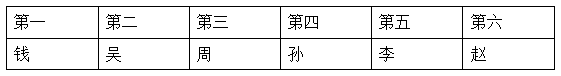

代入C项：根据条件（1）可知，赵排在第一或者第六。假设赵排在第一，根据条件（4）可知，李排在第二，结合条件（2）可知，孙排在第三，此时不管钱排在第四或第六，均与条件（3）相悖，该情况不成立。假设赵排在第六，与条件（4）相悖，该情况不成立。故该项不可能为真，排除；

代入D项：与条件（3）相悖，故该项不可能为真，排除。

故正确答案为B。

---

## 第 33 题　qid 18643692 · 逻辑判断

小张、小刘、小黄准备于国庆假期去天津学习杨柳青年画和泥人张彩塑两个非遗技艺，每人学且只学一个非遗技艺，有如下5个预测：
（1）小张和小刘至多有一人去学习杨柳青年画；
（2）小刘和小黄至少有一人去学习泥人张彩塑；
（3）小张、小刘和小黄都不去学习泥人张彩塑；
（4）小张和小刘去学习杨柳青年画；
（5）小黄不去学习杨柳青年画并且小张去学习泥人张彩塑。
结果发现，只有1个预测正确，由此可以推出：

- **A**. 小黄去学习杨柳青年画　✅
- **B**. 小黄去学习泥人张彩塑
- **C**. 小刘不去学习杨柳青年画
- **D**. 小张不去学习泥人张彩塑

**答案**：A

**官方解析**

第一步：找出题干矛盾命题。

（1）小张杨柳青年画 或 小刘杨柳青年画；

（2）小刘泥人张彩塑 或 小黄泥人张彩塑；

（3）小张泥人张彩塑 且 小刘泥人张彩塑 且 小黄泥人张彩塑；

（4）小张杨柳青年画 且 小刘杨柳青年画；

（5）小黄杨柳青年画 且 小张泥人张彩塑。

分析题干条件可知，（1）和（4）的说法为矛盾关系，必有一真一假。

第二步：根据题干条件推理。

根据题干条件可知，只有1个预测正确，则说法为真的人一定在（1）和（4）之间，可知（2）（3）（5）的说法为假，则（2）（3）（5）的矛盾为真；根据（2）的矛盾为真，即“小刘泥人张彩塑 且 小黄泥人张彩塑”为真，结合题干“每人学且只学一个非遗技艺”可知，小刘杨柳青年画 且 小黄杨柳青年画；又根据（3）的矛盾为真，即“小张泥人张彩塑 或 小刘泥人张彩塑 或 小黄泥人张彩塑”为真可知，小张学习泥人张彩塑。

综上可知，小刘学习杨柳青年画、小黄学习杨柳青年画、小张学习泥人张彩塑。对应A项。

故正确答案为A。

---

## 第 34 题　qid 18643693 · 逻辑判断

为了丰富社区的精神文化生活，幸福社区计划设置五个活动室，分别是象棋、书法、太极拳、剪纸、国画，并对居民的意见进行了汇总，得出了以下结论：
（1）只有设置书法活动室，才不会设置象棋活动室；
（2）不会同时设置太极拳活动室和国画活动室；
（3）如果设置了书法活动室，就不会设置剪纸活动室；
（4）只要设置象棋活动室，就会设置国画活动室。
已知，该社区一定不设置书法活动室，则以下一定正确的是：

- **A**. 设置剪纸活动室
- **B**. 不设置太极拳活动室　✅
- **C**. 不设置国画活动室
- **D**. 不设置象棋活动室

**答案**：B

**官方解析**

第一步：翻译题干。

①象棋活动室书法活动室

②太极拳活动室 或 国画活动室

③书法活动室剪纸活动室

④象棋活动室国画活动室

第二步：根据题干条件进行推理。

从确定信息入手开始推理，已知一定不设置书法活动室，根据条件①，否后必否前，可知设置象棋活动室，根据条件④，肯前必肯后，可知设置国画活动室，根据条件②，或关系否一推一，可知不设置太极拳活动室。

故正确答案为B。

---

## 第 35 题　qid 18643705 · 逻辑判断

为制定农村发展政策，各单位纷纷下到各镇进行调研，已知调研情况如下：
（1）每个单位至多在光武镇和中兴镇中调研一个；
（2）若某个单位不调研光武镇，则该单位也不调研辰星镇；
（3）每个单位至少在辰星镇和天河镇中调研一个；
（4）财政局调研了辰星镇。
小王知道了上述情况后断定，财政局也调研了天河镇。
以下哪项如果为真，可以成为小王断定所需的前提？

- **A**. 财政局没有调研中兴镇
- **B**. 不调研中兴镇的必须调研天河镇　✅
- **C**. 财政局没有调研光武镇
- **D**. 调研中兴镇的都不调研天河镇

**答案**：B

**官方解析**

第一步：找出论点和论据。

论点：财政局也调研了天河镇。

论据：（1）光武镇 或 中兴镇；

（2）光武镇辰星镇；

（3）辰星镇 或 天河镇；

（4）财政局调研了辰星镇。

论据（4）“财政局调研了辰星镇”是对论据（2）“光武镇辰星镇”的否后，根据“否后必否前”可知，财政局调研了光武镇，结合论据（1）“光武镇 或 中兴镇”，根据“或关系否一推一”可知，财政局不调研中兴镇。

本题需要找出论点成立的前提，可优先考虑搭桥，即建立“财政局不调研中兴镇”和“财政局也调研了天河镇”之间的联系。

第二步：逐一分析选项。

A项：“财政局没有调研中兴镇”，根据上述推理可知，“财政局不调研中兴镇”，不能推出财政局也调研了天河镇，不是论点成立的前提，排除；

B项：该项翻译为：“中兴镇天河镇”，根据上述推理可知，“财政局不调研中兴镇”，根据该项可以推出财政局调研了天河镇，为搭桥项，是论点成立的前提，当选；

C项：“财政局没有调研光武镇”，根据上述推理可知，“财政局调研了光武镇”，出现矛盾，不是论点成立的前提，排除；

D项：该项翻译为：“中兴镇天河镇”，根据上述推理可知，“财政局不调研中兴镇”，根据该项不能推出财政局也调研了天河镇，不是论点成立的前提，排除。

故正确答案为B。

---
