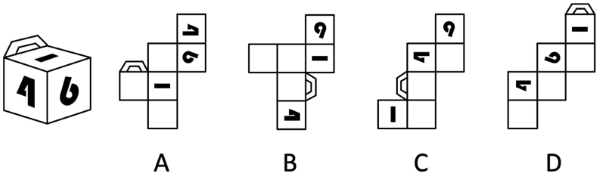

# 2026年安徽省公务员录用考试《行测》题（网友回忆版）

> 判断推理 · 35 题 · 安徽 2026

## 第 1 题　qid 16070185 · 定义判断

回归效应，是指极端样本在后续观测中更接近总体均值的趋势，表现为个体极端特征随时间推移逐渐减弱。
根据上述定义，下列体现了回归效应的是：

- **A**. 龙生龙，凤生凤，老鼠的儿子会打洞
- **B**. 尺寸小的豌豆子代会变大，尺寸大的豌豆子代会变小　✅
- **C**. 一对父母身高近两米，他们的孩子成年后身高也近两米
- **D**. 某篮球运动员平均每场得分为20分，但在某场比赛中得了40分

**答案**：B

**官方解析**

第一步：找出定义关键词。
“更接近总体均值”、“个体极端特征”、“随时间推移逐渐减弱”。
第二步：逐一分析选项。
A项：龙生龙、凤生凤强调的是遗传稳定性，个体极端特征没有减弱，反而保持，不符合定义，排除；
B项：尺寸小（极端偏小）的豌豆子代变大，尺寸大（极端偏大）的豌豆子代变小，个体极端特征随时间推移逐渐减弱，都向中间的总体尺寸均值靠拢，符合定义，当选；
C项：父母身高近两米，孩子身高也近两米，个体极端特征没有减弱，反而保持，不符合定义，排除；
D项：只说了一场得40分（极端高分），但没有后续数据说明得分向20分的均值回归，不符合定义，排除。
故正确答案为B。

---

## 第 2 题　qid 16070186 · 定义判断

可编程物质是指一种可以根据用户输入或自主感应而以编程方式来改变自身物理性质的物质。
根据上述定义，下列不涉及可编程物质的是：

- **A**. 某智能水泥通过内嵌的传感器，自主控制水泥应力的释放以保持建筑物结构稳定
- **B**. 某智能布料由高分子复合纤维织成，输入不同电压会改变其电场，从而根据预设编码显现不同图案
- **C**. 通过添加纳米颗粒和化学反应物，某新型水泥可以实现自动修复裂缝和损坏，从而延长建筑的寿命　✅
- **D**. 某智能玻璃使用Socket网络编程技术，可根据外部光照强度和内部信号来改变透明度，调节室内光线以节省能源

**答案**：C

**官方解析**

第一步：找出定义关键词。
“根据用户输入或自主感应”、“以编程方式”、“改变自身物理性质”。
第二步：逐一分析选项。
A项：智能水泥通过内嵌的传感器自主控制应力的释放来保持建筑物结构稳定，属于“自主感应”、“以编程方式”、“改变自身物理性质”，符合定义，排除；
B项：智能布料通过输入不同电压改变电场，根据预设编码显现不同图案，属于“用户输入”、“以编程方式”、“改变自身物理性质”，符合定义，排除；
C项：新型水泥通过添加纳米颗粒和化学反应物实现自动修复，属于材料本身的化学特性，不符合“根据用户输入或自主感应”、“以编程方式”，不符合定义，当选；
D项：智能玻璃通过网络编程技术，根据外部光照强度和内部信号来改变透明度，属于“自主感应”、“以编程方式”、“改变自身物理性质”，符合定义，排除。
本题为选非题，故正确答案为C。

---

## 第 3 题　qid 16070190 · 定义判断

心理学中的自我关怀，也被称作自我怜悯、自我同情，指能够保护个体远离自我批评、反刍思维的一种积极的自我认知态度。当个体处在困难、挫折、痛苦、失望等情景中时，对自己消极的状态能够保持开放和友善的态度，能够安抚和关心自己。
根据上述定义，下列未体现自我关怀的是：

- **A**. 此情可待成追忆，只是当时已惘然　✅
- **B**. 僵卧孤村不自哀，尚思为国戍轮台
- **C**. 丈夫生世会几时，安能蹀躞垂羽翼
- **D**. 莫因诗卷愁成谶，春鸟秋虫自作声

**答案**：A

**官方解析**

第一步：找出定义关键词。
“能够保护个体远离自我批评、反刍思维的一种积极的自我认知态度”、“当个体处在困难、挫折、痛苦、失望等情景中时”、“对自己消极的状态能够保持开放和友善的态度”、“能够安抚和关心自己”。
第二步：逐一分析选项。
A项：意思是“此时此景为什么要现在才追忆，只因为当时心中只是一片茫然。”说明诗人沉浸在过去的遗憾、消极情绪中反复回味，是典型的反刍思维，不符合“能够保护个体远离自我批评、反刍思维的一种积极的自我认知态度”、“当个体处在困难、挫折、痛苦、失望等情景中时”、“对自己消极的状态能够保持开放和友善的态度”、“能够安抚和关心自己”，不符合定义，当选；
B项：意思是“穷居孤村，躺卧不起，不为自己的处境而感到哀伤，心中还想着替国家戍守边疆。”其中“僵卧孤村”体现出诗人目前处于挫折和困难中，但“不自哀”体现出诗人身处逆境却不自我哀怜、不自我批评，是一种积极的态度，符合“能够保护个体远离自我批评、反刍思维的一种积极的自我认知态度”、“当个体处在困难、挫折、痛苦、失望等情景中时”，符合定义，排除；
C项：意思是“大丈夫一辈子能有多长时间，怎么能畏缩不前、垂头丧气，像鸟儿收起翅膀那样憋屈？”体现出诗人面对挫折时的不甘心和对自己的鼓励，是一种积极的态度，符合“当个体处在困难、挫折、痛苦、失望等情景中时”、“对自己消极的状态能够保持开放和友善的态度”，符合定义，排除；
D项：意思是“不要忧愁自己写的愁苦之诗会成为吉凶的预言，春天的鸟儿和秋天的虫儿都会发出自己的声音。”体现出诗人面对愁绪、消极状态时，不自我批评，能够接纳并安抚自己，符合“能够保护个体远离自我批评、反刍思维的一种积极的自我认知态度”、“当个体处在困难、挫折、痛苦、失望等情景中时”、“对自己消极的状态能够保持开放和友善的态度”、“能够安抚和关心自己”，符合定义，排除。
本题为选非题，故正确答案为A。

---

## 第 4 题　qid 16070188 · 定义判断

凯伊效应是指当一束高粘度的假塑性流体倾倒至固体表面时，固体表面会把液束向上反弹出去。其原理为快速下落的液束冲击下方堆积的黏性流体，流体表面因为受到冲击粘度变小，受到撞击后形成一个酒窝状的凹坑，同时粘度降低的表面充当了润滑剂的作用，最终使得下落的液束被反弹出去。
根据上述定义，下列属于凯伊效应的是：

- **A**. 用肥皂水冲洗勺子，肥皂水碰到勺子后会沿着勺子曲面流下去
- **B**. 在喷水池喷出的水柱上放乒乓球，水柱会托举乒乓球向上跳跃
- **C**. 水流冲过土壤中的孔隙或裂缝时，形成了类似管道的水流通道
- **D**. 将洗发水从高处快速倒向桌面，堆积的洗发水会突然跳起一束　✅

**答案**：D

**官方解析**

第一步：找出定义关键词。
“高粘度的假塑性流体倾倒至固体表面”、“液束向上反弹出去”。
第二步：逐一分析选项。
A项：肥皂水碰到勺子后沿着勺子曲面流下去，液束没有反弹，不符合“液束向上反弹出去”，不符合定义，排除；
B项：水柱托举乒乓球向上跳跃，不涉及液束反弹，不符合“液束向上反弹出去”，不符合定义，排除；
C项：水流冲过孔隙或裂缝形成类似管道的水流通道，不涉及液束反弹，不符合“液束向上反弹出去”，不符合定义，排除；
D项：将洗发水从高处快速倒向桌面，洗发水是高粘度假塑性流体，符合“高粘度的假塑性流体倾倒至固体表面”，堆积的洗发水突然跳起一束，符合“液束向上反弹出去”，符合定义，当选。
故正确答案为D。

---

## 第 5 题　qid 17467530 · 定义判断

复冰现象是指当冰的表面受压，压力令其熔点降低，使得冰化成水，一旦压力消失，熔点提高至原来的水平，水又变为冰的现象。
根据上述定义，下列不属于复冰现象的是：

- **A**. 将两块水平放置的冰砖面对面压实，松手后两块冰砖粘在了一起
- **B**. 在一块很大的冰上放一条金属线，金属线两端分别连着两个重物，金属线缓慢穿越冰块而且不会将其切开
- **C**. 在滑冰场上滑冰时，冰刀留下道道痕迹，但很快刀痕会全部消失，留下完好如初的冰面
- **D**. 水结冰时，所释放的热量在其内部形成压力、产生气泡，这使得结成的冰看上去不透明　✅

**答案**：D

**官方解析**

第一步：找出定义关键词。
“冰受压化成水”、“压力消失水又变为冰”。
第二步：逐一分析选项。
A项：两块冰砖压实，说明冰在受压时先化成了水，松开粘一块说明刚刚化的水又结冰了，符合“冰受压化成水”、“压力消失水又变为冰”，符合定义，排除；
B项：金属线能够穿过冰，说明冰受压化成了水，金属线穿过之后压力解除，但冰不会被切开，说明水又结冰，符合“冰受压化成水”、“压力消失水又变为冰”，符合定义，排除；
C项：刀痕消失，说明冰刀离开冰面后，压力消失，水膜重新结冰，冰面恢复平整，符合“冰受压化成水”、“压力消失水又变为冰”，符合定义，排除；
D项：水结冰时内部产生压力和气泡，仅仅是水结冰的单向凝固过程，并没有体现冰化水现象，不符合“冰受压化成水”、“压力消失水又变为冰”，不符合定义，当选。
本题为选非题，故正确答案为D。

---

## 第 6 题　qid 16070189 · 定义判断

印随效应是一种特殊的学习方式，与一般的条件反射或习惯形成不同，它只在动物幼雏智力发展的一个特定阶段内发生，这个阶段被称为敏感期或关键期。如果错过了这个短暂时期，动物就很难或者无法学习到相应的行为。印随效应的发生有两个必要条件：一是刺激物必须是活动的，二是刺激物必须与动物幼雏有一定的亲缘关系或相似性。印随效应不仅存在于动物幼雏中，也存在于人类婴儿中。
根据上述定义，下列体现了印随效应的是：

- **A**. 小婷读小学时被寄养在二姨家，她对二姨有深深的依恋和信任感
- **B**. 退役的搜救犬在被陈大爷收养后，每天都忠诚地跟在陈大爷身边
- **C**. 小花从小睡觉都要抱一个布娃娃，如果离了布娃娃她就哭闹不止
- **D**. 刚孵出的雏鹅先看到一只鸭子，随后鸭子去哪里它就会跟到哪里　✅

**答案**：D

**官方解析**

第一步：找出定义关键词。
“是一种特殊的学习方式”、“只在动物幼雏智力发展的敏感期或关键期内发生”、“一是刺激物必须是活动的”、“二是刺激物必须与动物幼雏有一定的亲缘关系或相似性”、“也存在于人类婴儿中”。
第二步：逐一分析选项。
A项：寄养在二姨家的小婷已经读小学，不属于婴儿阶段，不符合“也存在于人类婴儿中”，不符合定义，排除；
B项：退役的搜救犬已是成年犬，不属于动物幼雏，不符合“只在动物幼雏智力发展的敏感期或关键期内发生”，不符合定义，排除；
C项：小花离了布娃娃就哭闹不止，布娃娃不是活物，不符合“一是刺激物必须是活动的”，不符合定义，排除；
D项：刚孵出的雏鹅，符合“只在动物幼雏智力发展的敏感期或关键期内发生”，雏鹅先看到一只鸭子后跟随鸭子，符合“是一种特殊的学习方式”、“一是刺激物必须是活动的”、“二是刺激物必须与动物幼雏有一定的亲缘关系或相似性”，符合定义，当选。
故正确答案为D。

---

## 第 7 题　qid 16070191 · 定义判断

偏序集是一个集合与其上元素之间的一种关系组成的整体，该关系需满足三个条件：
①自反性：集合中每个元素与自身有此关系
②反对称性：若元素A与B，B与A互有此关系，则A与B必为同一元素
③传递性：若A与B，B与C有此关系，则A与C有此关系
根据上述定义，下列属于偏序集的是：

- **A**. 设集合为一天中所有的时间点，定义集合上的关系为某时间点不晚于另一时间点　✅
- **B**. 设集合为书架上所有的书，定义集合上的关系为某本书与另一本书摆在同一层
- **C**. 设集合为某班级的所有同学，定义集合上的关系为朋友关系
- **D**. 设集合为所有整数，定义集合上的关系为不等于

**答案**：A

**官方解析**

第一步：找出定义关键词。
“集合中每个元素与自身有此关系”、“若元素A与B，B与A互有此关系，则A与B必为同一元素”、“若A与B，B与C有此关系，则A与C有此关系”。
第二步：逐一分析选项。
A项：设A、B、C为一天中的三个时间点，即有“A不晚于A，B不晚于B，C不晚于C”，符合“集合中每个元素与自身有此关系”，若“A不晚于B且B不晚于A，可以得到A=B”，符合“若元素A与B，B与A互有此关系，则A与B必为同一元素”，若“A不晚于B，B不晚于C，则A不晚于C”，符合“若A与B，B与C有此关系，则A与C有此关系”，符合定义，当选；
B项：设A、B为书架上的两本书，通过“A与B在同一层，B与A在同一层，无法得到A和B一定是同一本书”，不符合“若元素A与B，B与A互有此关系，则A与B必为同一元素”，不符合定义，排除；
C项：设A、B、C为班级中的三位同学，若“A和B是朋友，B和C是朋友，无法得到A和C一定是朋友”，不符合“若A与B，B与C有此关系，则A与C有此关系”，不符合定义，排除；
D项：任意整数都等于自身，即任意整数和自身都没有“不等于”关系，不符合“集合中每个元素与自身有此关系”，不符合定义，排除。
故正确答案为A。

---

## 第 8 题　qid 17467562 · 定义判断

疤痕效应是指人在遭受创伤后，伤口经过一段时间的恢复会愈合，但留下的疤痕会时刻提醒人们过去的伤痛，并对人的心理造成持续的影响。在社会学中，疤痕效应泛指重大事件会使人们的行为模式趋于保守，更加厌恶风险，进而导致人们对于事物的看法和决策产生偏差。
根据上述定义，下列未体现疤痕效应的是：

- **A**. 一朝被蛇咬，十年怕井绳
- **B**. 经历台风袭击后，老刘会经常囤积一些非必要生活用品，以备不时之需
- **C**. 五年前老陈投资失败后，将所有积蓄存入银行，不再选择其他理财方式
- **D**. 杨教授儿时经历过饥荒，深刻理解粮食的重要性，矢志培育优质高产的小麦种子　✅

**答案**：D

**官方解析**

第一步：找出定义关键词。
“重大事件”、“趋于保守”、“更加厌恶风险”、“人们对于事物的看法和决策产生偏差”。
第二步：逐一分析选项。
A项：意思是被蛇咬伤的创伤事件后，长达十年里看到外形相似的绳子都会心生恐惧，被蛇咬属于重大创伤事件，怕井绳是行为上的风险回避，符合“重大事件”、“趋于保守”、“更加厌恶风险”、“人们对于事物的看法和决策产生偏差”，符合定义，排除；
B项：经历台风袭击后，符合“重大事件”，老刘经常囤积非必要生活用品，说明行为模式转为保守，决策因过往创伤出现偏差，符合“趋于保守”、“更加厌恶风险”、“人们对于事物的看法和决策产生偏差”，符合定义，排除；
C项：五年前投资失败后，符合“重大事件”，老陈将所有积蓄存银行，不再选择其他理财方式，说明他厌恶风险，决策因过往创伤发生根本性的保守转变，符合“趋于保守”、“更加厌恶风险”、“人们对于事物的看法和决策产生偏差”，符合定义，排除；
D项：杨教授儿时经历过饥荒，矢志培育优质高产的小麦种子，说明他主动投身科研，并未厌恶风险，而是将经历转化为解决问题的动力，不符合“趋于保守”、“更加厌恶风险”、“人们对于事物的看法和决策产生偏差”，不符合定义，当选。
本题为选非题，故正确答案为D。

---

## 第 9 题　qid 16070192 · 定义判断

新污染物筛查主要有两类：非靶向筛查是不针对特定的目标污染物，基于全扫描分析获取对样品成分的表达；疑似筛查是根据先验的化学结构信息和质谱采集的特征发现样品中可能存在的化学物质。
根据上述定义，下列最能体现疑似筛查的是：

- **A**. 小肖利用全二维气相色谱—质谱法分析废水样品，发现污水处理过程中产生了苯并三唑类化合物
- **B**. 课题组筛查化工园区土壤中的污染物，对识别到的化合物的检测频率和相对含量进行打分，最终选出了36种优先污染物
- **C**. 研究小组筛查了潜在内分泌干扰物列表中的化学物，发现一半以上的个人护理产品中含有与发育损害或内分泌干扰有关的成分　✅
- **D**. 吴教授采用效应导向分析方法筛查出石油和香烟浸出液中导致芳基烃受体（AhR）反应的组分，并鉴定出这些组分中导致AhR反应的化合物

**答案**：C

**官方解析**

第一步：找出定义关键词。
非靶向筛查：“不针对特定的目标污染物”、“基于全扫描分析获取对样品成分的表达”；
疑似筛查：“根据先验的化学结构信息和质谱采集的特征”、“发现样品中可能存在的化学物质”。
第二步：逐一分析选项。
A项：小肖利用全二维气相色谱—质谱法分析废水样品发现了苯并三唑类化合物，符合“不针对特定的目标污染物”、“基于全扫描分析获取对样品成分的表达”，符合非靶向筛查定义，不符合疑似筛查定义，排除；
B项：对识别到的化合物的检测频率和相对含量进行打分，最终“选出”了36种优先污染物，“选出”意味着不是新发现的，是对已有识别结果的后续处理，不符合“发现样品中可能存在的化学物质”，不符合疑似筛查定义，排除；
C项：筛查潜在内分泌干扰物列表中的化学物，符合“根据先验的化学结构信息和质谱采集的特征”，发现一半以上的个人护理产品中含有与发育损害或内分泌干扰有关的成分，符合“发现样品中可能存在的化学物质”，符合疑似筛查定义，当选；
D项：吴教授采用“效应导向”分析方法筛查出石油和香烟浸出液中导致芳基烃受体（AhR）反应的组分，是从效应倒推成分，不符合“根据先验的化学结构信息和质谱采集的特征”，不符合疑似筛查定义，排除。
故正确答案为C。

---

## 第 10 题　qid 16070199 · 定义判断

敏化电极法指的是在指示电极上覆盖一层物质，使电极能提高或改变其选择性，进而检测物质的方法，包括气敏电极法、酶电极法等。其中，气敏电极法在指示电极上覆盖的是特殊的透气膜或空隙间隔，使待测气体可以通过。酶电极法在电极敏感膜上覆盖的是含酶凝胶或悬浮液，待测物可以向酶膜扩散。
根据上述定义，下列属于气敏电极法的是：

- **A**. 
在pH电极上覆盖乙烯材料，气体穿过覆盖物进入中介溶液，引起化学平衡移动，进而计算出浓度
　✅
- **B**. 
某种能将乙醇转化为电流的微生物经培养后可形成微生物膜，当电极放置在膜上时可检测出乙醇的浓度

- **C**. 
给pH电极装上葡萄糖氧化酶膜，当电极插入待测溶液时，酶催化产生化学反应，进而测定葡萄糖含量

- **D**. 
在植株鲜样中加偏磷酸溶液，打碎成浆后，取样品滤液加活性炭及硼酸钠溶液，进而测定抗坏血酸含量

**答案**：A

**官方解析**

第一步：找出定义关键词。

敏化电极法：“指示电极上覆盖一层物质”、“电极能提高或改变其选择性”、“检测物质”；

气敏电极法：“指示电极上覆盖的是特殊的透气膜或空隙间隔”、“待测气体可以通过”；

酶电极法：“电极敏感膜上覆盖的是含酶凝胶或悬浮液”、“待测物可以向酶膜扩散”。

第二步：逐一分析选项。

A项：在pH电极上覆盖乙烯材料，符合“指示电极上覆盖的是特殊的透气膜或空隙间隔”，气体穿过覆盖物进入中介溶液，从而计算出浓度，符合“待测气体可以通过”，符合“气敏电极法”定义，当选；

B项：电极放置在微生物膜上检测出乙醇的浓度，乙醇不属于气体，不符合“待测气体可以通过”，不符合“气敏电极法”定义，排除；

C项：给pH电极装上葡萄糖氧化酶膜，符合“电极敏感膜上覆盖的是含酶凝胶或悬浮液”，电极插入待测溶液时，酶催化产生化学反应，进而测定葡萄糖含量，符合“待测物可以向酶膜扩散”，符合“酶电极法”定义，不符合“气敏电极法”定义，排除；

D项：在植株鲜样中加偏磷酸溶液，取样品滤液加活性炭及硼酸钠溶液来测定抗坏血酸含量，不涉及电极，不符合“指示电极上覆盖一层物质”，不符合“敏化电极法”，不符合定义，排除。

故正确答案为A。

---

## 第 11 题　qid 16070200 · 逻辑判断

端粒是染色体末端的一段重复的核苷酸序列。当端粒长度变得非常短时，就更容易导致细胞的衰老和凋亡。有研究发现，每天每增加一杯速溶咖啡摄入量，端粒长度对应的等效年龄减少0.38年，因而速溶咖啡摄入量与端粒长度呈负相关。不过，研究结果也显示，研磨咖啡摄入量与端粒长度的相关性没有统计学意义，不能证实研磨咖啡也会减少端粒长度对应的等效年龄。该研究认为，饮用速溶咖啡会导致衰老，饮用研磨咖啡则不会，因而后者更健康。
以下哪项如果为真，不能支持上述结论？

- **A**. 速溶咖啡中往往会添加白砂糖、乳粉等，这些成分容易导致衰老
- **B**. 实验中使用的部分速溶咖啡样本，其实是现场研磨咖啡豆制作的　✅
- **C**. 与相同量的研磨咖啡相比较，速溶咖啡中导致衰老的铅含量更高
- **D**. 制作研磨咖啡时，会使用滤纸吸附咖啡白醇等对人体有害的物质

**答案**：B

**官方解析**

第一步：找出论点和论据。
论点：饮用速溶咖啡会导致衰老，饮用研磨咖啡则不会，因而后者更健康。
论据：每天每增加一杯速溶咖啡摄入量，端粒长度对应的等效年龄减少0.38年，因而速溶咖啡摄入量与端粒长度呈负相关。不过，研究结果也显示，研磨咖啡摄入量与端粒长度的相关性没有统计学意义，不能证实研磨咖啡也会减少端粒长度对应的等效年龄。
本题论点与论据都在说饮用速溶咖啡会导致衰老，但饮用研磨咖啡则不会。论点和论据话题一致，加强优先考虑补充论据，即解释原因或举例子，且本题为选非题，将可以加强的选项排除即可。
第二步：逐一分析选项。
A项：该项讨论的是速溶咖啡中往往会添加白砂糖、乳粉等，这些成分容易导致衰老，解释了为什么饮用速溶咖啡会导致衰老，补充论据，可以加强，排除；
B项：该项讨论的是实验中使用的部分速溶咖啡样本，其实是现场研磨咖啡豆制作的，那么就不确定造成衰老的是否为速溶咖啡，说明实验不科学、不准确，可以削弱，不能加强，当选；
C项：该项讨论的是与相同量的研磨咖啡相比较，速溶咖啡中导致衰老的铅含量更高，说明饮用速溶咖啡会导致衰老，饮用研磨咖啡则相较不会，补充论据，可以加强，排除；
D项：该项讨论的是制作研磨咖啡时，会使用滤纸吸附咖啡白醇等对人体有害的物质，解释了为什么饮用研磨咖啡会更加健康，补充论据，可以加强，排除。
本题为选非题，故正确答案为B。

---

## 第 12 题　qid 16070197 · 逻辑判断

鱼通过鳃的呼吸作用，从水中吸收钙离子，进入耳石囊内与碳酸根离子结合形成碳酸钙、随后沉积形成耳石，它具有维持鱼身平衡及辅助听觉的作用。鱼耳石的日周轮、年轮和产卵轮等时间记号，记录了鱼类生长过程中的环境信息。通过分析鱼耳石形态和化学组成等方式，我们可以了解鱼类生活史特征及其栖息环境的变化。
以下哪项如果为真，最能加强上述论证？

- **A**. 许多鱼类的寿命可长达数十年之久
- **B**. 环境污染可能导致鱼停止生长甚至死亡
- **C**. 不同鱼类的耳石大小不同，难以据此判断鱼类的生长环境情况
- **D**. 相对于鳞片、鳍条，鱼耳石的形态结构和化学组成更稳定，保存时间更长　✅

**答案**：D

**官方解析**

第一步：找出论点和论据。
论点：通过分析鱼耳石形态和化学组成等方式，我们可以了解鱼类生活史特征及其栖息环境的变化。
论据：鱼耳石的日周轮、年轮和产卵轮等时间记号，记录了鱼类生长过程中的环境信息。
本题论点和论据均在讨论“分析鱼耳石有助于了解鱼类生活的环境”，二者话题一致，加强可以考虑补充论据。
第二步：逐一分析选项。
A项：该项说的是许多鱼类的寿命很长，而论点讨论的是分析鱼耳石有助于了解鱼类生活的环境，话题不一致，不能加强，排除;
B项：该项说的是环境污染对鱼的不良影响，而论点讨论的是分析鱼耳石有助于了解鱼类生活的环境，话题不一致，不能加强，排除;
C项：该项说的是根据耳石难以判断鱼类的生长环境，是对论点进行削弱，不能加强，排除;
D项：该项说的是鱼耳石形态结构和化学组成更稳定，保存时间更长，补充论据说明鱼耳石在了解鱼类的生活史特征及其栖息环境的变化方面更有优势，可以加强，当选。
故正确答案为D。

---

## 第 13 题　qid 14143246 · 图形推理

近日，考古学家发现了一块展示约1.25亿年前肉食性哺乳动物爬兽袭击较大植食性恐龙鹦鹉嘴龙的化石。化石中，鹦鹉嘴龙呈俯卧姿态，后肢折叠在身体两侧；爬兽的身体向右盘绕，俯坐在鹦鹉嘴龙背侧，抓扒着猎物的下巴并撕咬肋骨，其小腿则被鹦鹉嘴龙的后腿夹住。研究者认为，这一发现首次挑战了“恐龙在白垩纪期间几乎没有受到同时代哺乳动物威胁”的观点。
以下哪项如果为真，最不能支持上述研究者的结论？

- **A**. 已能够确认爬兽与鹦鹉嘴龙纠缠在一起并同时葬身于火山喷发
- **B**. 在发现该标本前就有其他观点认为爬兽会捕食鹦鹉嘴龙等恐龙　✅
- **C**. 通过恐龙骨架上的牙印证明了爬兽当时正啃食鹦鹉嘴龙的尸体
- **D**. 在一块爬兽标本的胃中曾发现有鹦鹉嘴龙幼年个体的骨骼残留

**答案**：B

**官方解析**

第一步：找出论点和论据。

论点：这一发现首次挑战了“恐龙在白垩纪期间受到过同时代哺乳动物威胁”的观点。

论据：考古学家发现了一块展示约1.25亿年前肉食性哺乳动物爬兽袭击较大植食性恐龙鹦鹉嘴龙的化石。化石中，鹦鹉嘴龙呈俯卧姿态，后肢折叠在身体两侧；爬兽的身体向右盘绕，俯坐在鹦鹉嘴龙背侧，抓扒着猎物的下巴并撕咬肋骨，其小腿则被鹦鹉嘴龙的后腿夹住。

从论据“化石显示二者身体纠缠在一起”到论点“恐龙受到过威胁”，注意身体纠缠威胁，所以论据到论点的推理是有漏洞的，可以补充论据填补漏洞，也可以直接加强论点，且本题为选非题，排除可以加强的选项即可。

第二步：逐一分析选项。

A项：该项指出能够确认爬兽与鹦鹉嘴龙纠缠在一起，论据讨论的也是二者在化石中呈现的纠缠在一起的形态，所以该项的表述是对论据内容的重复，具有一定的加强力度，可以加强，排除；

B项：该项指出在发现该标本前就有其他观点认为爬兽会捕食恐龙，说明此次考古研究并非“首次”发现恐龙在白垩纪期间受到过同时代哺乳动物威胁，直接削弱论点，无法加强，当选；

C项：该项指出可证明爬兽当时正啃食鹦鹉嘴龙的尸体，结合论据中“二者身体纠缠在一起”的表述，说明在鹦鹉嘴龙死之前有和爬兽纠缠的过程，可体现出哺乳动物对恐龙的威胁，可以加强，排除；

D项：该项指出在爬兽标本的胃中发现有鹦鹉嘴龙幼年个体的骨骼残留，结合论据中“二者身体纠缠在一起”的表述，说明爬兽对恐龙有威胁，可以加强，排除。

本题为选非题，故正确答案为B。

---

## 第 14 题　qid 16070289 · 逻辑判断

紫杉醇是治疗癌症的明星药物。紫杉醇通过作用于细胞内的微管蛋白，保持微管的稳定性来抑制细胞的有丝分裂，控制癌细胞发展，从而达到治疗目的。香榧中含有紫杉醇，因此，有观点认为，多食用香榧可以治疗癌症。
以下哪项如果为真，最能削弱上述结论？

- **A**. 紫杉醇对正常细胞产生的影响目前还未可知
- **B**. 香榧中紫杉醇含量微乎其微，几乎可以忽略不计　✅
- **C**. 香榧含有丰富的蛋白质，可以增强癌症患者的免疫力
- **D**. 对于分裂速度比正常细胞快的癌细胞，紫杉醇表现出更明显的抑制作用

**答案**：B

**官方解析**

第一步：找出论点和论据。
论点：多食用香榧可以治疗癌症。
论据：香榧中含有紫杉醇，紫杉醇通过作用于细胞内的微管蛋白，保持微管的稳定性来抑制细胞的有丝分裂，控制癌细胞发展，从而达到治疗目的。
本题论点在讨论“多食用香榧可以治疗癌症”，论据在讨论“香榧中的紫杉醇能治疗癌症”，论点和论据话题不一致，削弱优先考虑拆桥，即拆断“食用香榧”和“紫杉醇”之间的联系。
第二步：逐一分析选项。
A项：该项指出“紫杉醇对正常细胞产生的影响目前还未可知”，而题干讨论的是“紫杉醇对癌细胞的影响”，话题不一致，无法削弱，排除；
B项：论点讨论的是“多食用香榧可以治疗癌症”，原因是“香榧中的紫杉醇能治疗癌症”，该项指出“香榧中紫杉醇含量微乎其微，几乎可以忽略不计”，即不能通过日常食用香榧取得治疗癌症的效果，断开了论点和论据之间的联系，为拆桥项，可以削弱，当选；
C项：该项指出“香榧可以增强癌症患者的免疫力”，但增强免疫力不等于可以治疗癌症，话题不一致，无法削弱，排除；
D项：该项指出“紫杉醇能抑制癌细胞”，补充论据，为加强项，无法削弱，排除。
故正确答案为B。

---

## 第 15 题　qid 17467563 · 类比推理

小王把仙女座、猎户座、大熊座、人马座、狮子座五个星座在星空图上的位置用A、B、C、D、E随机标记。已知：如果仙女座或猎户座中有一个在位置C上，则大熊座在位置B上；如果狮子座在位置C上，则人马座在位置E上。
如果人马座在位置B上，那么下列哪项必然为真？

- **A**. 大熊座在位置C上　✅
- **B**. 狮子座在位置C上
- **C**. 仙女座在位置C上
- **D**. 猎户座在位置C上

**答案**：A

**官方解析**

第一步：翻译题干条件。

（1）仙女座在位置C 或 猎户座在位置C大熊座在位置B；

（2）狮子座在位置C人马座在位置E；

（3）人马座在位置B。

第二步：根据题干条件进行推理。

根据条件（3）人马座在位置B，可知大熊座不在位置B，是对条件（1）的否后，根据否后必否前，可以推出仙女座不在位置C且猎户座不在位置C，排除C、D两项；

根据条件（3）人马座在位置B，可知人马座不在位置E，是对条件（2）的否后，根据否后必否前，可以推出狮子座不在位置C，排除B项。

故正确答案为A。

---

## 第 16 题　qid 16070292 · 逻辑判断

我国幅员辽阔，物产丰富。2022年海洋原油产量5800万吨，但是缺少高精度海洋勘测设备和技术，这严重制约了国家海洋油气勘探开发进程。2023年我国自主研发的海底地震勘探采集设备——“海脉”在渤海投入使用，这将极大提升我国海洋油气藏勘探精度。由此可以预期我国海洋原油产量将会提升。
以下哪项是上述论证成立的必要前提？

- **A**. 
“海脉”可以“看”清埋藏几千米深的陆地油气储层

- **B**. 
“海脉”能捕捉到海底相当于蚊子声大小的信号

- **C**. 
当前我国已经具有开采海洋原油的各项技术、设备和能力
　✅
- **D**. 
成千上万个“海脉”节点采集的数据信息可以处理成地震剖面

**答案**：C

**官方解析**

第一步：找出论点和论据。
论点：我国海洋原油产量将会提升。
论据：“海脉”在渤海投入使用，这将极大提升我国海洋油气藏勘探精度。
本题论点讨论的是我国海洋原油产量将会提升，论据讨论的是“海脉”的使用将极大提升我国海洋油气藏勘探精度，二者话题不一致，提问为“必要前提”，加强优先考虑搭桥和补充必要条件。
A项：该项指出“海脉”可以“看”清陆地油气储层，但并未说明“看”清陆地油气储层是否能提升我国海洋原油产量，为不明确项，无法加强，排除；
B项：该项指出“海脉”能捕捉到海底的微弱信号，但并未说明捕捉到海底的微弱信号是否能提升我国海洋原油产量，为不明确项，无法加强，排除；
C项：该项指出我国已经具有开采海洋原油的各项技术、设备和能力，只有具备开采能力，勘探精度提升才能带来产量提升，如果我国不具备开采海洋原油的各项技术、设备和能力，那么即使勘探精度提升，产量也无法提升，因此该项是论点成立的必要条件，当选；
D项：该项指出成千上万个“海脉”节点采集的数据信息可以处理成地震剖面，但并未说明得到的地震剖面是否能提升我国海洋原油产量，为不明确项，无法加强，排除。
故正确答案为C。

---

## 第 17 题　qid 16070213 · 逻辑判断

某研究团队发布了一项关于视觉感知对热舒适判断影响机制的研究，研究选取典型景观实景照片在实验室进行视觉刺激实验，从心理、行为、生理三个维度展开互证，发现人们通过快速扫视捕获热环境相关景观要素信息，视觉感知信息结合个体热联想经验会转换为热舒适判断，且视觉刺激引发的皮电变化率与阴影、植物总体占比率呈显著正相关，说明阴影和植物总体占比率可能是影响公园热舒适体验的关键因素。
要使上述结论成立，还需基于以下哪一前提?

- **A**. 光照强度变化不会通过非视觉途径影响皮电反应及热舒适判断
- **B**. 阴影和植物总体占比率高的区域，实际热环境温度通常更低
- **C**. 个体热联想经验主要源于日常生活中的户外环境体验
- **D**. 皮电变化率可作为衡量人体热舒适感受的指标　✅

**答案**：D

**官方解析**

第一步：找出论点和论据。
论点：阴影和植物总体占比率可能是影响公园热舒适体验的关键因素。
论据：人们通过快速扫视捕获热环境相关景观要素信息，视觉感知信息结合个体热联想经验会转换为热舒适判断，且视觉刺激引发的皮电变化率与阴影、植物总体占比率呈显著正相关。
本题论点讨论的是“阴影和植物总体占比率”和“热舒适体验”之间的关系，论据讨论的是“皮电变化率”和“阴影和植物总体占比率”之间的关系，二者话题不一致，加强优先考虑搭桥，即在“热舒适体验”和“皮电变化率”之间建立联系。
第二步：逐一分析选项。
A项：该项强调的是光照强度变化不会通过非视觉途径影响皮电反应及热舒适判断，说明实验中关于视觉感知对热舒适判断的影响研究是严谨的，有一定的加强力度，但不是上述论证成立的前提，排除；
B项：该项强调的是阴影和植物总体占比率高的区域实际温度反而更低，而论点讨论的是影响公园热舒适体验的关键因素是阴影和植物总体占比率，话题不一致，无法加强，排除；
C项：该项指出个体热联想经验的来源是户外环境体验，而论点讨论的是影响公园热舒适体验的关键因素是阴影和植物总体占比率，话题不一致，无法加强，排除；
D项：该项指出衡量人体热舒适感受的指标是皮电变化率，建立了“皮电变化率”和“热舒适体验”之间的联系，为搭桥项，是论证成立的前提，当选。
故正确答案为D。

---

## 第 18 题　qid 16070293 · 逻辑判断

研究人员发现，与摄入盐水的对照组小鼠相比，摄入葡萄球菌肠毒素SEA的小鼠会出现明显干呕现象。人类癌症患者使用化疗药物也会有类似的恶心和呕吐反应。研究显示，小鼠肠道内的SEA毒素激活了肠内壁的肠嗜铬细胞，释放出血清素，血清素又与肠道的感觉神经元受体结合，将信号传递到脑干中的特定神经元从而引发干呕，当特定神经元被灭活后，小鼠干呕显著减少。研究还发现，特定神经元被灭活后，其他动物的干呕也会显著减少。
由此可以推出：

- **A**. 如果不摄入葡萄球菌肠毒素，那么小鼠就不会出现干呕现象
- **B**. 开发出灭活特定神经元的药物或能帮助化疗病人减少呕吐　✅
- **C**. SEA毒素与肠道的感觉神经元受体结合会引发动物的干呕
- **D**. 切断小鼠脑干中特定神经元的信号传递或能引发干呕

**答案**：B

**官方解析**

日常结论题，根据题干信息逐一分析选项。
A项：题干指出“摄入葡萄球菌肠毒素SEA的小鼠会出现明显干呕现象”，并未提到不摄入葡萄球菌肠毒素的情况，无法推出，排除；
B项：题干指出“人类癌症患者使用化疗药物也会有类似的恶心和呕吐反应”和“当特定神经元被灭活后，小鼠干呕显著减少。研究还发现，特定神经元被灭活后，其他动物的干呕也会显著减少”，说明灭活特定神经元能减少动物干呕，而化疗呕吐与此相似，因此开发出灭活特定神经元的药物有可能帮助化疗病人减少呕吐，可以推出，当选；
C项：题干指出“小鼠肠道内的SEA毒素激活了肠内壁的肠嗜铬细胞，释放出血清素，血清素又与肠道的感觉神经元受体结合，将信号传递到脑干中的特定神经元从而引发干呕”，说明与受体结合的是血清素，并非SEA毒素，无法推出，排除；
D项：题干指出“当特定神经元被灭活后，小鼠干呕显著减少”，说明切断信号传递能够减少干呕，而非引发干呕，无法推出，排除。
故正确答案为B。

---

## 第 19 题　qid 16070296 · 逻辑判断

甲、乙、丙、丁、戊、己、庚7人分别去P、Q、R、S四个不同的值班点，根据工作安排，每个值班点至少有1人，至多有3人；每个人只能去1个值班点；要求Q值班点有3人值班。同时，还需满足下列条件：
（1）去R值班点的人数与去P值班点的人数一样
（2）如果甲、乙、丙中至多2人去Q值班点，那么只有丁去S值班点
（3）只有乙和庚去S值班点，丁或戊才不去S值班点
根据上述信息，下列哪项必然为真？

- **A**. 乙去Q值班点，戊去S值班点　✅
- **B**. 甲去Q值班点，丁去P值班点
- **C**. 己去P值班点，庚去R值班点
- **D**. 丙去P值班点，戊去S值班点

**答案**：A

**官方解析**

第一步：分析题干条件。

（1）甲、乙、丙、丁、戊、己、庚7人去P、Q、R、S四个值班点，每个值班点至少有1人，至多有3人，每个人只能去1个值班点，Q值班点有3人；

（2）R值班点人数=P值班点人数；

（3）甲、乙、丙至多2人去Q值班点只有丁去S值班点；

（4）丁 或 戊不去S值班点乙和庚去S值班点。

第二步：根据题干条件进行推理。

由条件（1）（2）可确定各值班点的人数为Q值班点3人、S值班点2人、P值班点1人、R值班点1人。S值班点2人是对条件（3）的否后，否后必否前，可推知甲、乙、丙3人均去Q值班点。乙去Q值班点，就不能再去S值班点，是对条件（4）的否后，否后必否前，可推知丁、戊均去S值班点。己、庚的值班点无法确定，只有A项必然为真。

故正确答案为A。

---

## 第 20 题　qid 17467534 · 逻辑判断

青藏高原被誉为“亚洲水塔”，是全球气候变化敏感区和指示区。这里分布着地球海拔最高数量最多的高原湖泊群，面积约占全国的百分之五十，对区域水循环、生态环境和气候调节具有重要意义。如果青藏高原降水增加或者冰川加速消融，那么青藏高原的湖泊将会持续扩张，并且导致潜在的流域合并或重组，威胁到该地区的基础设施和生态安全。由此可以推出：

- **A**. 如果青藏高原的湖泊没有持续扩张，那么青藏高原的降水没有增加且冰川并没有加速消融　✅
- **B**. 如果青藏高原降水增加或者冰川加速消融，将会导致其潜在的流域合并
- **C**. 如果青藏高原降水没有增加，那么其潜在的流域没有合并和重组
- **D**. 如果青藏高原的流域合并或重组，那么青藏高原降水增加

**答案**：A

**官方解析**

第一步：翻译题干。

青藏高原降水增加 或 冰川加速消融（青藏高原的湖泊将会持续扩张） 且 （潜在的流域合并 或 重组）。

第二步：逐一分析选项。

A项：翻译为：青藏高原的湖泊将会持续扩张青藏高原降水增加 且 冰川加速消融，是否定题干箭头后“且关系”的一部分，否后必否前，可以推出，当选；

B项：翻译为：青藏高原降水增加 或 冰川加速消融潜在的流域合并，是对题干的肯前，肯前必肯后，应推出“潜在的流域合并 或 重组”，而非“潜在的流域合并”，不能推出，排除；

C项：翻译为：青藏高原降水增加潜在的流域合并和重组，是否定题干箭头前“或关系”的一部分，不是否前，且否前得不到确定结论，不能推出，排除；

D项：翻译为：青藏高原的流域合并 或 重组青藏高原降水增加，是肯定题干箭头后“且关系”的一部分，不是肯后，且肯后得不到确定结论，不能推出，排除。

故正确答案为A。

---

## 第 21 题　qid 17467529 · 图形推理

从所给的四个选项中，选择最合适的一个填入问号处，使之呈现一定的规律性。

- **A**. A
- **B**. B　✅
- **C**. C
- **D**. D

**答案**：B

**官方解析**

元素组成不同，且无明显属性规律，考虑数量规律。观察发现，题干图形出现明显封闭区域，优先考虑数面。题干图形的面数量依次为10、9、8、？、6、5，故“？”处图形的面数量应为7，只有B项符合。
故正确答案为B。

---

## 第 22 题　qid 16070178 · 图形推理

从所给的四个选项中，选择最合适的一个填入问号处，使之呈现一定的规律性：

- **A**. A
- **B**. B
- **C**. C　✅
- **D**. D

**答案**：C

**官方解析**

元素组成相似，且相同线条重复出现，优先考虑样式规律中的加减同异。九宫格优先横向看，观察发现，第二行图形只能先将图2左右翻转，然后与图1求异，才可得到图3；经验证，第一行也符合此规律；第三行应用此规律，因此？处图形应将图2左右翻转，然后与图1求异得到，只有C项符合。
故正确答案为C。

---

## 第 23 题　qid 16070177 · 图形推理

从所给的四个选项中，选择最合适的一个填入问号处，使之呈现一定的规律：

- **A**. A
- **B**. B
- **C**. C
- **D**. D　✅

**答案**：D

**官方解析**

元素组成不同，且无明显属性规律，考虑数量规律。观察发现，题干图形均由黑块和白块构成，且分堆明显，考虑部分数。第一组图，黑块部分数明显无规律，白块部分数为2、3、4，依次递增1；第二组图，前两幅图白块部分数依次为2、3，故问号处图形白块部分数应为4，对应D项。
故正确答案为D。

---

## 第 24 题　qid 16070182 · 图形推理

左图是一个带把手的立方体纸盒，右边哪项可能是其外表面展开图？

- **A**. A
- **B**. B　✅
- **C**. C
- **D**. D

**答案**：B

**官方解析**

A项：数字1的面和数字4的面为相对面，相对面不能同时出现，选项展开图与题干立体图不一致，排除；
B项：选项展开图与题干立体图一致，当选；
C项：题干立体图中，数字4的面和数字6的面中的数字书写方向是一致的，而选项中这两个面中的数字书写方向不一致，选项展开图与题干立体图不一致，排除；
D项：题干立体图中，数字4的面和数字6的面中的数字书写方向是一致的，而选项中这两个面中的数字书写方向不一致，选项展开图与题干立体图不一致，排除。
故正确答案为B。

---

## 第 25 题　qid 16070184 · 图形推理

从所给的四个选项中，选择最合适的一个填入问号处，使之呈现一定的规律性：

- **A**. A
- **B**. B　✅
- **C**. C
- **D**. D

**答案**：B

**官方解析**

本题考查立体拼合。第一组图的图一由图二和图三拼合而成，第二组图的图一也应由图二与“？”处图形拼合而成，对应B项。 

故正确答案为B。

---

## 第 26 题　qid 16069970 · 类比推理

寓意：寓言

- **A**. 序言：正文
- **B**. 情节：童话　✅
- **C**. 报告文学：新闻
- **D**. 著作：诗集

**答案**：B

**官方解析**

第一步：判断题干词语间逻辑关系。
寓言是用假托的故事或自然物的拟人手法来说明某个道理或教训的文学作品，寓意是寓言所包含的核心内涵，二者是组成关系。
第二步：判断选项词语间逻辑关系。
A项：序言和正文是同一篇作品里的两个组成部分，二者是并列关系，与题干逻辑关系不一致，排除；
B项：童话是通过丰富的想象、幻想和夸张来编写的适合于儿童欣赏的故事，情节是童话的核心组成部分，二者是组成关系，与题干逻辑关系一致，当选；
C项：报告文学是一种散文体裁，以现实生活中具有典型意义的真人真事为题材,经过适当的艺术加工而成,兼有新闻报道特点，报告文学和新闻不是组成关系，与题干逻辑关系不一致，排除；
D项：所有诗集都是著作，二者是种属关系，与题干逻辑关系不一致，排除。
故正确答案为B。

---

## 第 27 题　qid 17467541 · 类比推理

星期：星期一

- **A**. 年：正月　✅
- **B**. 细胞：培养基
- **C**. 牙齿：牙龈
- **D**. 节能灯：电源

**答案**：A

**官方解析**

第一步：判断题干词语间逻辑关系。
星期包含星期一，星期一是星期中的其中一天，二者为组成关系。
第二步：判断选项词语间逻辑关系。
A项：年包含正月，正月是农历一年中的第一个月，二者为组成关系，与题干逻辑关系一致，当选；
B项：细胞在培养基中培养，二者为对应关系，与题干逻辑关系不一致，排除；
C项：牙齿和牙龈是口腔内不同的结构，二者为并列关系，与题干逻辑关系不一致，排除；
D项：节能灯工作需要电源供电，二者为条件对应关系，与题干逻辑关系不一致，排除。
故正确答案为A。

---

## 第 28 题　qid 17467545 · 类比推理

蛋白质：有机物

- **A**. 故宫：北京
- **B**. 5G基站：通讯设施　✅
- **C**. 显示屏：折叠屏
- **D**. 固态硬盘：台式机硬盘

**答案**：B

**官方解析**

第一步：判断题干词语间逻辑关系。
蛋白质是有机物，二者为种属关系。
第二步：判断选项词语间逻辑关系。
A项：故宫在北京，二者为地点对应关系，与题干逻辑关系不一致，排除；
B项：5G基站是通讯设施，二者为种属关系，与题干逻辑关系一致，当选；
C项：折叠屏是显示屏，二者为种属关系，但顺序与题干相反，与题干逻辑关系不一致，排除；
D项：有的固态硬盘是台式机硬盘，有的固态硬盘不是台式机硬盘，有的台式机硬盘是固态硬盘，有的台式机硬盘不是固态硬盘，二者为交叉关系，与题干逻辑关系不一致，排除。
故正确答案为B。

---

## 第 29 题　qid 17467528 · 类比推理

随波逐流：盲从

- **A**. 杯水车薪：坚持
- **B**. 心不在焉：专注
- **C**. 临渊羡鱼：空想　✅
- **D**. 据理力争：反驳

**答案**：C

**官方解析**

第一步：判断题干词语间逻辑关系。
“随波逐流”意思是随着波浪起伏，跟着流水漂荡，比喻没有坚定的立场和主见，随大流；“盲从”意思是盲目地附和、随从别人，二者为近义关系。
第二步：判断选项词语间逻辑关系。
A项：“杯水车薪”意思是用一杯水去救一车着了火的柴草，比喻力量太小或东西太少，无济于事，与“坚持”不是近义关系，与题干逻辑关系不一致，排除；
B项：“心不在焉”意思是心思不在这里，思想不集中；“专注”指专心注意，二者是反义关系，与题干逻辑关系不一致，排除；
C项：“临渊羡鱼”意思是面对着深渊，希望得到鱼，比喻仅有空想而无实际行动，与“空想”是近义关系，与题干逻辑关系一致，当选；
D项：“据理力争”意思是依据道理，竭力维护自己方面的权益、观点等；“反驳”指说出自己的理由来否定别人不同的意见，二者不是近义关系，与题干逻辑关系不一致，排除。
故正确答案为C。

---

## 第 30 题　qid 16069962 · 类比推理

鸡犬不宁：安居乐业

- **A**. 羊质虎皮：色厉内荏
- **B**. 莺歌燕舞：鸟语花香
- **C**. 海底捞针：探囊取物　✅
- **D**. 蝇营狗苟：寡廉鲜耻

**答案**：C

**官方解析**

第一步：判断题干词语间逻辑关系。
“鸡犬不宁”意思是连鸡狗都不得安宁，形容搅扰得很厉害，“安居乐业”意思是安定地生活，愉快地工作，二者为反义关系。
第二步：判断选项词语间逻辑关系。
A项：“羊质虎皮”意思是羊虽然披上虎皮，但怯弱的本性不变，比喻外强内弱，虚有其表，“色厉内荏”意思是外表强横，内心怯懦，形容外表凶恶强横，实际上内心虚弱怯懦，二者为近义关系，与题干逻辑关系不一致，排除；
B项：“莺歌燕舞”意思是黄莺歌唱，燕子飞舞，形容大好春光或大好形势，“鸟语花香”意思是鸟儿叫，花儿飘香，多形容春天魅人的景象，二者为近义关系，与题干逻辑关系不一致，排除；
C项：“海底捞针”比喻极难找到，“探囊取物”意思是伸手到袋子里取东西，比喻能够轻而易举地办成某件事情，二者为反义关系，与题干逻辑关系一致，当选；
D项：“蝇营狗苟”意思是像苍蝇那样飞来飞去，像狗那样苟且偷生，形容人不顾廉耻，到处钻营，“寡廉鲜耻”意思是不廉洁，不知羞耻，二者为近义关系，与题干逻辑关系不一致，排除。
故正确答案为C。

---

## 第 31 题　qid 14143348 · 类比推理

树枝：秸秆：柴火

- **A**. 石斛：沉香：中药　✅
- **B**. 尘土：烟雾：污染
- **C**. 蚕蛾：蚊子：成虫
- **D**. 火车：汽车：车厢

**答案**：A

**官方解析**

第一步：判断题干词语间逻辑关系。
树枝和秸秆都是柴火，前两词为并列关系，均与第三词构成种属关系，且树枝、秸秆均为植物类。
第二步：判断选项词语间逻辑关系。
A项：石斛和沉香都是中药，前两词为并列关系，均与第三词构成种属关系，且石斛、沉香均为植物类，与题干逻辑关系一致，当选；
B项：尘土和烟雾都是污染物，会导致污染，前两词为并列关系，均与第三词构成因果对应关系，与题干逻辑关系不一致，排除；
C项：蚕和蚊子是完全变态昆虫，完全变态昆虫的发育需要经历卵、幼虫、蛹、成虫四个时期，蚕蛾和蚊子均是成虫，前两词为并列关系，均与第三词构成种属关系，但蚕和蚊子均为动物类，与题干逻辑关系不一致，排除；
D项：火车和汽车都是交通工具，二者为并列关系，车厢为火车和汽车的组成部分，前两词均与第三词构成组成关系，与题干逻辑关系不一致，排除。
故正确答案为A。

---

## 第 32 题　qid 14142894 · 类比推理

照相机：凸透镜：照相

- **A**. 火炕：煤炭：取暖
- **B**. 潜水艇：鱼鳔：潜水
- **C**. 飞机：起落架：飞行
- **D**. 微波炉：磁控管：加热　✅

**答案**：D

**官方解析**

第一步：判断题干词语间逻辑关系。
凸透镜是照相机的组成部分，二者为组成关系；照相是照相机的功能，且该功能依靠凸透镜实现。
第二步：判断选项词语间逻辑关系。
A项：煤炭在火炕里，二者为地点对应关系，不是组成关系，与题干逻辑关系不一致，排除；
B项：鱼鳔是潜水艇设计灵感的来源，二者为仿生对应关系，不是组成关系，与题干逻辑关系不一致，排除；
C项：起落架是飞机的组成部分，二者为组成关系；飞行是飞机的功能，但起落架的主要功能是帮助飞机起落，而非在飞行过程中使用，因此飞行功能不依靠起落架实现，与题干逻辑关系不一致，排除；
D项：磁控管是微波炉的组成部分，二者为组成关系；加热是微波炉的功能，且该功能依靠磁控管实现，与题干逻辑关系一致，当选。
故正确答案为D。

---

## 第 33 题　qid 17467547 · 类比推理

杏仁：腰果：坚果

- **A**. 餐具：饭碗：饭勺
- **B**. 门框：门楣：门扇
- **C**. 礼单：礼帖：礼仪
- **D**. 火枪：火炮：火器　✅

**答案**：D

**官方解析**

第一步：判断题干词语间逻辑关系。
杏仁和腰果都是坚果，二者为并列关系中的反对关系，均与第三个词语构成包容关系中的种属关系。
第二步：判断选项词语间逻辑关系。
A项：饭碗和饭勺都是餐具，二者为反对关系，均与第一个词语构成种属关系，词语顺序不同，与题干逻辑关系不一致，排除；
B项：门楣是门框上部的横梁结构，二者为包容关系中的组成关系，与题干逻辑关系不一致，排除；
C项：礼单和礼帖都是传统礼仪文书‌，二者为反对关系，但礼单和礼帖均是礼仪的体现，与第三个词语构成对应关系，与题干逻辑关系不一致，排除；
D项：火枪和火炮都是火器，二者为反对关系，均与第三个词语构成种属关系，与题干逻辑关系一致，当选。
故正确答案为D。

---

## 第 34 题　qid 14142904 · 类比推理

（    ）对于 景点 相当于 车水马龙 对于（    ）

- **A**. 游人如织 街市　✅
- **B**. 惊鸿一瞥 人群
- **C**. 天然画卷 剧场
- **D**. 鬼斧神工 陋巷

**答案**：A

**官方解析**

逐一代入选项。
A项：游人如织形容游人多得像织布的线一样，密密麻麻，可以用来形容景点，二者为特点与描述对象的对应关系；车水马龙指车如流水，马如游龙一般，形容热闹繁华的景象，可以用来形容街市，二者为特点与描述对象的对应关系，前后逻辑关系一致，当选；
B项：惊鸿一瞥指人只是匆匆看了一眼，却给人留下极深的印象，与景点无明显逻辑关系；车水马龙指车如流水，马如游龙一般，形容热闹繁华的景象，不能用来形容人群，前后逻辑关系不一致，排除；
C项：天然画卷指自然形成的、未经人工加工修饰的美丽景观，可以用来形容景点；车水马龙指车如流水，马如游龙一般，形容热闹繁华的景象，不能用来形容剧场，前后逻辑关系不一致，排除；
D项：鬼斧神工原意是像鬼神制作出来的，形容艺术技巧高超，不像是人力所能达到的，可以用来形容景点（如景点的建筑）；车水马龙指车如流水，马如游龙一般，形容热闹繁华的景象，不能用来形容陋巷，前后逻辑关系不一致，排除。
故正确答案为A。

---

## 第 35 题　qid 16070194 · 类比推理

龙葵碱 对于 （    ） 相当于 （    ） 对于 面团发酵

- **A**. 芝麻开花；无氧呼吸
- **B**. 土豆发芽；二氧化碳　✅
- **C**. 冬瓜落霜；线粒体
- **D**. 香蕉成熟；葡萄糖

**答案**：B

**官方解析**

逐一代入选项。
A项：“芝麻开花”是芝麻植株生长的一个自然阶段，与“龙葵碱”无明显逻辑关系；“无氧呼吸”是“面团发酵”过程中酵母等微生物所采用的一种生理过程，二者为对应关系，前后逻辑关系不一致，排除；
B项：“土豆发芽”会产生“龙葵碱”，二者为活动与其产物的对应关系；“面团发酵”过程中酵母等微生物代谢会产生“二氧化碳”，二者为活动与其产物的对应关系，前后逻辑关系一致，当选；
C项：“冬瓜落霜”是指冬瓜在成熟的时候，表面会生出一层白霜，和“龙葵碱”无明显逻辑关系；“线粒体”是酵母菌的细胞器，酵母菌可以用来“面团发酵”，二者为对应关系，前后逻辑关系不一致，排除；
D项：“香蕉成熟”与“龙葵碱”无明显逻辑关系；“葡萄糖”是“面团发酵”过程中酵母进行发酵作用的重要能量来源和底物，二者为对应关系，前后逻辑关系不一致，排除。
故正确答案为B。

---
