# 2026年广东省公务员录用考试《行测》题（网友回忆版）

> 判断推理 · 20 题 · 广东 2026

## 第 1 题　qid 18643986 · 图形推理

下列选项中最符合所给图形规律的是（    ）。

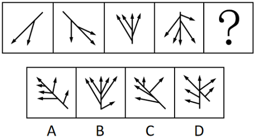

- **A**. A　✅
- **B**. B
- **C**. C
- **D**. D

**答案**：A

**官方解析**

元素组成不同，且无属性规律，优先考虑数量规律。观察发现，题干图形均存在1个长箭头和若干个小箭头。以中间长箭头为标记，图形依次在长箭头右侧增加1个小箭头、左侧增加1个小箭头，左右两侧交替增加，故“？”处图形应在图4基础上左侧增加1个小箭头，由1个长箭头和5个小箭头。B项是右侧增加1个小箭头，C项只有4个小箭头，D项有2个长箭头，且小箭头没有都在1个长箭头上，只有A项符合。

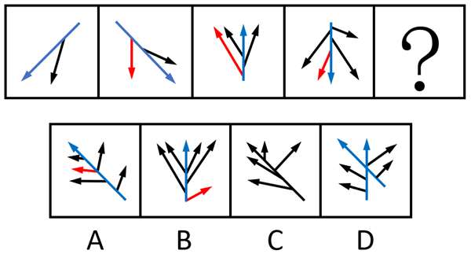

故正确答案为A。

---

## 第 2 题　qid 18643988 · 图形推理

下列选项中最符合所给图形规律的是（    ）。

- **A**. A
- **B**. B
- **C**. C　✅
- **D**. D

**答案**：C

**官方解析**

元素组成不同，优先考虑属性规律。观察发现，题干出现全直线、全曲线图形，考虑曲直性。九宫格优先看横行，第一行图形均为全直线图形，第二行图形均为全曲线图形，第三行前两幅图形均为有曲有直图形，故“？”处图形应是有曲有直图形，只有C项符合。
故正确答案为C。

---

## 第 3 题　qid 18643983 · 图形推理

下列4个所给图形不经过旋转或翻转，可以拼接构成（    ）。

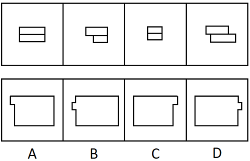

- **A**. A　✅
- **B**. B
- **C**. C
- **D**. D

**答案**：A

**官方解析**

本题考查平面拼合，可采用平行且等长相消的方式解题。4个所给图形不经过旋转或翻转，可以拼接构成A项，如下图所示：

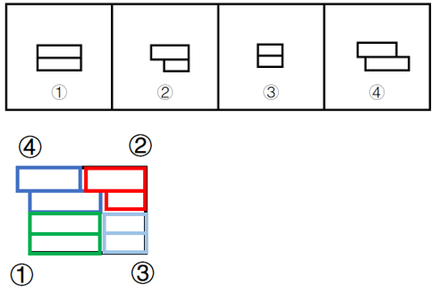

故正确答案为A。

---

## 第 4 题　qid 18643993 · 图形推理

下列选项中最符合所给图形规律的是（    ）。

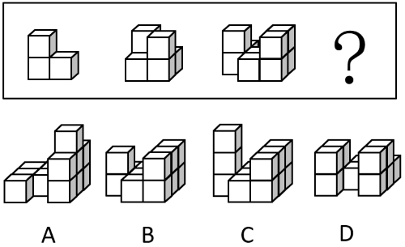

- **A**. A
- **B**. B　✅
- **C**. C
- **D**. D

**答案**：B

**官方解析**

本题考查立体拼合。题干立体图形分别是由1个、2个、3个图1的“L”型小方块拼合而成，故？处应由4个图1的“L”型小方块拼合而成，只有B项符合。具体拼合方式如下图所示：

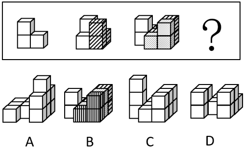

故正确答案为B。

---

## 第 5 题　qid 12019707 · 图形推理

下列选项中，可以由给定平面图折叠而成的是（    ）。

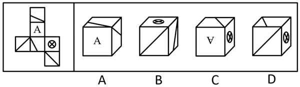

- **A**. A
- **B**. B
- **C**. C
- **D**. D　✅

**答案**：D

**官方解析**

将题干展开图标上序号，如下图所示，逐一进行分析。

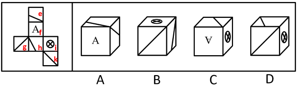

A项：选项由面e、面f和面h构成，题干展开图中，面e和面h为相对面，二者不能同时出现，选项与题干展开图不一致，排除；

B项：选项一定有面i，面i和面g为相对面，所以正面为面k。以面i和面k公共边中引出斜线的点为起点，对面k进行顺时针画边，如下图所示，题干展开图中，边1挨着面i，选项中，边1没有挨着面i，选项与题干展开图不一致，排除；

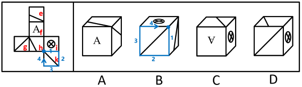

C项：选项一定有面f和面i，若顶面为面e，则题干展开图中，三者的公共点挨着面f的字母“A”的尖，选项中，三者的公共点远离面f的字母“A”的尖；若顶面为面h，则选项中，三者的公共点引出了面h中的斜线，题干展开图中，三者的公共点没有引出面h中的斜线，选项与题干展开图不一致，排除；

D项：选项由面h、面i和面k构成，选项与题干展开图一致，当选。

故正确答案为D。

---

## 第 6 题　qid 18643984 · 逻辑判断

如果一座城市采用集约高效的发展方式，那么其资源消耗量必然会减少。只要这种减少速度非常缓慢，就不会对城市经济发展造成负面影响。
由此可以推出：

- **A**. 如果资源消耗量没有减少，说明该城市没有采用集约高效的发展方式　✅
- **B**. 如果城市没有采用集约高效的发展方式，其资源消耗量必然没有减少
- **C**. 如果资源消耗量减少，说明该城市采用了集约高效的发展方式
- **D**. 如果资源消耗量减少的速度很快，必然会对该城市的经济发展造成负面影响

**答案**：A

**官方解析**

第一步：翻译题干。

①采用集约高效的发展方式资源消耗量减少；

②减少速度缓慢对经济发展造成负面影响。

第二步：逐一分析选项。

A项：该项翻译为“资源消耗量减少采用集约高效的发展方式”，是对①的否后，否后必否前，可以推出，当选；

B项：该项翻译为“采用集约高效的发展方式资源消耗量减少”，是对①的否前，否前得不到确定性的结论，不能推出，排除；

C项：该项翻译为“资源消耗量减少采用集约高效的发展方式”，是对①的肯后，肯后得不到确定性的结论，不能推出，排除；

D项：该项翻译为“减少速度缓慢对经济发展造成负面影响”，是对②的否前，否前得不到确定性的结论，不能推出，排除。

故正确答案为A。

---

## 第 7 题　qid 18643982 · 逻辑判断

甘蔗是生产加工食糖的重要原料。近年来，世界范围内甘蔗种植面积不断扩大，在一定程度上改变了土地利用的格局。由于全球食糖需求不断增长，有人因此认为，随着食糖的生产加工规模进一步扩大，甘蔗种植会进一步改变土地利用的格局。
要使上述推论成立，需要补充的前提是（    ）。

- **A**. 甘蔗种植用水量较大，会给当地水资源造成压力
- **B**. 甘蔗的种植周期较短，能够为食糖的生产快速提供原料
- **C**. 随着全球食糖需求的增长，种植者会扩大甘蔗的种植面积　✅
- **D**. 适宜种植甘蔗的区域，其土壤条件也适合种植其他富含糖分的作物

**答案**：C

**官方解析**

第一步：找出论点和论据。
论点：由于全球食糖需求不断增长，随着食糖的生产加工规模进一步扩大，甘蔗种植会进一步改变土地利用的格局。
论据：近年来，世界范围内甘蔗种植面积不断扩大，在一定程度上改变了土地利用的格局。
本题论点讨论的是“食糖需求”和“改变土地利用格局”之间的关系，论据讨论的是“甘蔗种植面积”和“改变土地利用格局”之间的关系，二者话题不一致，且提问方式为“前提”，加强优先搭桥，即建立“食糖需求”和“甘蔗种植面积”之间的联系。
第二步：逐一分析选项。
A项：该项指出甘蔗种植会给当地水资源造成压力，而论点说的是甘蔗种植会改变土地利用格局，话题不一致，无法加强，排除；
B项：该项指出甘蔗的种植周期短，能够为食糖的生产快速提供原料，而论点说的是甘蔗种植会改变土地利用格局，话题不一致，无法加强，排除；
C项：该项指出随着食糖需求增长，种植者会扩大甘蔗种植面积，建立了“食糖需求”和“甘蔗种植面积”之间的联系，搭桥项，可以加强，当选；
D项：该项指出适宜种甘蔗的土地也适合种植其他富含糖分的作物，而论点说的是甘蔗种植会改变土地利用格局，话题不一致，无法加强，排除。
故正确答案为C。

---

## 第 8 题　qid 18643985 · 逻辑判断

某种水毛茛是A市特有的野生植物，对水质要求极高，其仅生长于清澈、流动的水体中，因此被誉为优良水质的“指示物种”。2023年受特大暴雨影响，A市某自然保护区内的水毛茛大面积消失，其所依赖的自然条件难以自行恢复，因而面临灭绝的风险。但在今年春季，有人发现，该自然保护区内重新出现了这种水毛茛，且群落规模远超以往。
下列选项如果为真，最能解释上述现象的是（    ）。

- **A**. 这种水毛茛的分布范围已扩展至与自然保护区相邻的多处水域
- **B**. 即使经历了暴雨，该自然保护区的水质仍然优于周边河流水域
- **C**. 这种水毛茛同时具备有性繁殖和无性繁殖的能力，繁殖能力较强
- **D**. 近两年，通过水系修复等人工措施，该自然保护区的水质大幅提高了　✅

**答案**：D

**官方解析**

第一步：找出题干矛盾。
水毛茛对水质要求极高，2023年受特大暴雨影响，A市某自然保护区内的水毛茛大面积消失，其所依赖的自然条件难以自行恢复，因而面临灭绝的风险。但在今年春季，有人发现，该自然保护区内重新出现了这种水毛茛，且群落规模远超以往。
第二步：逐一分析选项。
A项：选项指出水毛茛的分布范围已扩展至与自然保护区相邻的多处水域，而题干讨论的是本该灭绝的水毛茛为何又重新出现在了该自然保护区内，无法解释题干矛盾，排除；
B项：选项指出该自然保护区的水质优于周边河流水域，即使该自然保护区的水质比周边好，但如果未达到水毛茛生存的最低要求，水毛茛仍然无法存活，无法解释题干矛盾，排除；
C项：选项指出水毛茛繁殖能力较强，但如果未改善水质，再强的繁殖能力也无法让已濒临灭绝的水毛茛重新出现，无法解释题干矛盾，排除；
D项：选项指出近两年，通过水系修复等人工措施，该自然保护区的水质大幅提高，而水质大幅提高不仅能让水毛茛重现，还能为其提供更优越的生长环境，使得群落规模远超以往，可以解释题干矛盾，当选。
故正确答案为D。

---

## 第 9 题　qid 18643987 · 逻辑判断

某单位计划组织职工参观科技馆、文化馆、博物馆和美术馆。但由于时间有限，这4个场馆不能都去。有职工提出了如下建议并被采纳：
（1）由于相距较远，不建议既去文化馆又去博物馆；
（2）美术馆和文化馆的展览都很有吸引力，至少参观其中的一个；
（3）去年已经去过美术馆，今年就不去了。
补充下列选项中的（    ），可以得出“该单位一定会去科技馆”的结论。

- **A**. 如果不去科技馆，就去博物馆　✅
- **B**. 只有不去科技馆，才去博物馆
- **C**. 只有不去博物馆，才不去科技馆
- **D**. 如果要去博物馆，不去科技馆

**答案**：A

**官方解析**

第一步：翻译题干。

（1）文化馆 或 博物馆；

（2）美术馆 或 文化馆；

（3）不去美术馆。

第二步：根据题干条件进行推理。

题干条件（3）不去美术馆，是对条件（2）或关系其中一项的否定，根据否一推一，得出去文化馆；去文化馆是对条件（1）或关系其中一项的否定，根据否一推一，得出不去博物馆。

提问为“得出‘该单位一定会去科技馆’的结论”，本题给出了结论，需要补充条件，代入选项分析。

A项：翻译为：科技馆博物馆，根据题干信息不去博物馆，是对选项的否后，否后必否前，能够推出一定去科技馆，可以推出，当选；

B项：翻译为：博物馆科技馆，根据题干信息不去博物馆，是对选项的否前，否前无必然结论，无法推出，排除；

C项：翻译为：科技馆博物馆，根据题干信息不去博物馆，是对选项的肯后，肯后无必然结论，无法推出，排除；

D项：翻译为：博物馆科技馆，根据题干信息不去博物馆，是对选项的否前，否前无必然结论，无法推出，排除。

故正确答案为A。

---

## 第 10 题　qid 18643991 · 逻辑判断

太空环境具有高真空、高辐射、微重力、极端温度变化等特点，对人造卫星的材料和电子元件提出了极高的要求。近日，我国成功发射了太空计算卫星。由于太空计算卫星具备强大的数据实时处理能力，有专家据此认为，未来太空计算卫星将广泛应用于应急安全、城市治理等领域。
下列选项最有可能是上述推论暗含前提的是（    ）。

- **A**. 太空计算卫星能够同时适应地面环境和太空环境
- **B**. 太空计算卫星在太空中的数据处理速度显著快于地面
- **C**. 我国目前亟需采集应急安全、城市治理等领域的实时数据
- **D**. 应急安全、城市治理等领域存在大量需要实时处理的数据　✅

**答案**：D

**官方解析**

第一步：找出论点和论据。
论点：未来太空计算卫星将广泛应用于应急安全、城市治理等领域。
论据：太空计算卫星具备强大的数据实时处理能力。
本题论点讨论的是未来太空计算卫星将广泛应用于应急安全、城市治理等领域，论据讨论的是太空计算卫星具备强大的数据实时处理能力，二者话题不一致，加强优先考虑搭桥，即在“应急安全、城市治理等领域”和“强大的数据实时处理能力”之间建立联系。
第二步：逐一分析选项。
A项：选项指出太空计算卫星能够同时适应地面环境和太空环境，但题干没有涉及该卫星是否需要适应地面环境（比如可以在太空接收地面数据并传输结果），无关选项，不能加强，排除；
B项：选项指出太空计算卫星在太空中的数据处理速度显著快于地面，这和它能否应用于应急安全、城市治理等领域无关，无关选项，不能加强，排除；
C项：选项指出我国目前亟需采集应急安全、城市治理等领域的实时数据，但不清楚太空卫星是否可以胜任此工作，无关选项，不能加强，排除；
D项：选项指出应急安全、城市治理等领域存在大量需要实时处理的数据，建立了“应急安全、城市治理等领域”和“强大的数据实时处理能力”之间的联系，为搭桥项，可以加强，当选。
故正确答案为D。

---

## 第 11 题　qid 18643989 · 逻辑判断

针对某款即将上市的新产品，商家开展了预售活动，预订的人数远超预期。但在产品正式发货前，许多顾客却取消了该产品的预订。
下列选项如果为真，最不能解释上述现象的是（    ）。

- **A**. 因为产能问题，该产品发货日期一再延后
- **B**. 收到货后，许多顾客反映该产品质量欠佳　✅
- **C**. 预售还未结束，商家就对新预订的用户给予了更大的优惠
- **D**. 产品预售期间，其他商家推出了多款设计接近但价格更低的竞品

**答案**：B

**官方解析**

第一步：找出题干矛盾。
某款新产品预售时预订人数远超预期，但在产品正式发货前，许多顾客却取消了该产品的预订。
第二步：逐一分析选项。
A项：选项指出该产品因产能问题发货日期一再延后，发货延迟会导致顾客耐心耗尽，可能在发货前取消预订，可以解释题干矛盾，排除；
B项：选项指出收到货后许多顾客反映该产品质量欠佳，但题干明确顾客取消预订的时间是“正式发货前”，顾客取消了该产品的预订，不能解释题干矛盾，当选；
C项：选项指出预售未结束时商家对新预订用户给予更大优惠，早期预订用户可能会因未享受同等优惠而感觉吃亏，进而导致发货前取消预订，可以解释题干矛盾，排除；
D项：选项指出预售期间其他商家推出设计接近且价格更低的竞品，可能导致客户在发货前取消原预订，转而选择其他商家的竞品，可以解释题干矛盾，排除。
本题为选非题，故正确答案为B。

---

## 第 12 题　qid 18643992 · 类比推理

不建立主体明确、要求清晰的责任体系，就不能压紧压实安全生产责任。当前主体明确、要求清晰的责任体系已经建立，因此安全生产责任已经压紧压实。
下列选项与题干逻辑结构最为相似的是（    ）。

- **A**. 只有实行多元共治，才能构建和谐社区。某社区建成了和谐社区，因此该社区实行了多元共治
- **B**. 不实现教育资源的公平分配，就无法提高全民素质。当前全民素质还有待提高，所以教育资源的公平分配还未实现
- **C**. 如果某地区深入推进生态文明建设，那么该地区已经实现了资源循环利用。这是因为不深入推进生态文明建设，就无法实现资源循环利用　✅
- **D**. 如果合理开采资源，就能实现自然资源的可持续利用。多地政府已经出台法律法规禁止过度开采，因此许多地区已经实现了自然资源的可持续利用

**答案**：C

**官方解析**

第一步：分析题干推理形式。

题干翻译为：不建立主体明确、要求清晰的责任体系（a）不能压紧压实安全生产责任（b）。

推理为：建立了主体明确、要求清晰的责任体系（a），因此安全生产责任已经压紧压实（b），逻辑结构为“否前推否后”。

第二步：逐一分析选项。

A项：翻译为：构建和谐社区（a）实行多元共治（b）。推理为：某社区建成了和谐社区（a），因此实行了多元共治（b），逻辑结构为“肯前推肯后”，与题干逻辑关系不一致，排除；

B项：翻译为：不实现教育资源的公平分配（a）无法提高全民素质（b）。推理为：当前全民素质有待提高，即无法提高全民素质（b），因此未实现教育资源的公平分配（a），逻辑结构为“肯后推肯前”，与题干逻辑关系不一致，排除；

C项：翻译为：不深入推进生态文明建设（a）无法实现资源循环利用（b）。推理为：某地区深入推进生态文明建设（a），因此实现了资源循环利用（b），逻辑结构为“否前推否后”，与题干逻辑关系一致，当选；

D项：翻译为：合理开采资源（a）实现自然资源的可持续利用（b）。推理为：多地政府禁止过度开采，即合理开采资源（a），因此实现了自然资源的可持续利用（b），逻辑结构为“肯前推肯后”，与题干逻辑关系不一致，排除；

故正确答案为C。

---

## 第 13 题　qid 18643994 · 逻辑判断

湖泊在北极的面积占比达到四成，为动植物生存提供了不可或缺的淡水资源。近年来，全球变暖使得北极的永冻土层逐渐融化，融化的水随之流入湖泊和海洋。有人据此推测，北极现存的湖泊面积应该扩张，然而观测数据显示，大部分北极湖泊面积都有所缩减。
下列选项如果为真，最能解释上述现象的是（    ）。

- **A**. 据统计，大部分处于逐渐融化状态的冰山位于海洋中
- **B**. 近年来北极动植物数量不断增加，淡水资源的需求量不断增大
- **C**. 由于冰川消融，北极地区的部分湖泊相互连接成了一个更大的湖泊
- **D**. 永冻土层消融使北极地区的湖泊底部出现大量孔隙，湖水从孔隙渗漏　✅

**答案**：D

**官方解析**

第一步：找出题干矛盾。
近年来，全球变暖使得北极的永冻土层逐渐融化，融化的水随之流入湖泊和海洋。有人据此推测，北极现存的湖泊面积应该扩张，然而观测数据显示，大部分北极湖泊面积都有所缩减。
第二步：逐一分析选项。
A项：选项指出大部分处于逐渐融化状态的冰山位于海洋中，无法解释为什么大部分北极湖泊面积都有所缩减，不能解释题干矛盾，排除；
B项：选项指出近年来北极动植物数量不断增加，淡水资源的需求量不断增大，但不明确增大的需求量是否足以导致大部分湖泊面积缩减，不能解释题干矛盾，排除；
C项：选项指出由于冰川消融，北极地区的部分湖泊相互连接成了一个更大的湖泊，无法解释为什么大部分北极湖泊面积都有所缩减，不能解释题干矛盾，排除；
D项：选项指出永冻土层消融使北极地区的湖泊底部出现大量孔隙，湖水从孔隙渗漏，解释了为什么大部分北极湖泊面积都有所缩减，可以解释题干矛盾，当选。
故正确答案为D。

---

## 第 14 题　qid 18643990 · 逻辑判断

对于研发型企业来说，获得突破性的研发成果至关重要。某研发型企业在回顾其发展历程后发现，企业大多数突破性的研发成果都源自新手研发人员。该企业因此认为，要想获得更多的突破性研发成果，在组建新的研发团队时应当只考虑新手研发人员。
以下选项如果为真，最能反驳这一结论的是（    ）。

- **A**. 该企业现有的多数重要研发成果尚未成功转化应用
- **B**. 对于大多数的新手研发人员，该企业目前的薪资吸引力不高
- **C**. 突破性的研究设想都需要经过经验丰富的研发人员改进才能实现　✅
- **D**. 将新手研发人员培养成经验丰富的研发人员需要投入大量的资源

**答案**：C

**官方解析**

第一步：找出论点和论据。
论点：要想获得更多的突破性研发成果，在组建新的研发团队时应当只考虑新手研发人员。
论据：企业大多数突破性的研发成果都源自新手研发人员。
本题论点和论据讨论的都是“突破性研发成果”和“新手研发人员”之间的关系，话题一致，优先考虑削弱论点。
第二步：逐一分析选项。
A项：选项指出该企业现有的多数重要研发成果尚未成功转化应用，讨论的是“现有的研发成果”，而论点讨论的是怎样能获得更多的“突破性研发成果”，话题不一致，无法削弱，排除；
B项：选项指出对于大多数的新手研发人员而言，该企业目前的薪资吸引力不高，讨论的是该企业对新手研发人员的吸引力，而论点讨论的是只有新手研发人员的团队能否获得更多的突破性研发成果，话题不一致，无法削弱，排除；
C项：选项指出突破性的研究设想都需要经过经验丰富的研发人员改进才能实现，说明如果组建的研发团队只有新手研发人员的话，将无法改进并实现突破性的研究设想，即只有新手研发人员无法获得更多的突破性研发成果，削弱论点，可以削弱，当选；
D项：选项指出将新手研发人员培养成经验丰富的研发人员需要投入大量的资源，讨论的是新手研发人员的培养成本，而论点讨论的是只有新手研发人员的团队能否获得更多的突破性研发成果，话题不一致，无法削弱，排除。
故正确答案为C。

---

## 第 15 题　qid 18643997 · 逻辑判断

研究团队开发了一种新型抗衰老水凝胶材料，为了验证这一材料的实际效果，研究团队开展了系列实验。结果发现，与未注入该材料的实验鼠相比，注入该材料的实验鼠肌肉组织中细胞的代谢水平显著提高，细胞端粒长度平均延长15%，且肌肉再生能力提升40%。由此可以推断，该材料能在一定程度上抗衰老。
以下选项如果为真，最不能支持这一结论的是（    ）。

- **A**. 细胞的代谢水平往往与其衰老程度呈负相关
- **B**. 老年动物的肌肉再生能力显著低于青壮年动物
- **C**. 将该材料注入小鼠体内后，小鼠未产生明显的免疫反应　✅
- **D**. 端粒长度延长是细胞分裂激活的伴随现象，表明细胞恢复了“年轻”

**答案**：C

**官方解析**

第一步：找出论点和论据。
论点：该材料能在一定程度上抗衰老。
论据：与未注入该材料的实验鼠相比，注入该材料的实验鼠肌肉组织中细胞的代谢水平显著提高，细胞端粒长度平均延长15%，且肌肉再生能力提升40%。
本题论点说的是该材料能在一定程度上抗衰老，论据说的是该材料提高细胞的代谢水平，延长15%细胞端粒长度，提升40%肌肉再生能力。论点、论据话题不一致，可以考虑搭桥来加强，且本题为选非题，排除加强项即可。
第二步：逐一分析选项。
A项：细胞代谢水平与衰老程度呈负相关，说明细胞的代谢水平提高则衰老程度就会降低，在论点和论据之间建立了联系，属于搭桥项，可以加强，排除；
B项：老年动物的肌肉再生能力显著低于青壮年动物，说明肌肉再生能力高的动物比肌肉再生能力低的动物年轻，在论点和论据之间建立了联系，属于搭桥项，可以加强，排除；
C项：将该材料注入小鼠体内后，小鼠未产生明显的免疫反应，说明注入该材料不会发生明显的免疫反应，而论点讨论的是该材料是否能抗衰老，话题不一致，无法加强，当选；
D项：端粒长度延长是细胞分裂激活的伴随现象，表明细胞恢复了“年轻”，说明延长细胞端粒代表了细胞更年轻，在论点和论据之间建立了联系，属于搭桥项，可以加强，排除。
本题为选非题，故正确答案为C。

---

## 第 16 题　qid 18644000 · 类比推理

绿化率高的小区，居民幸福感强。居民幸福感强的小区，环境卫生状况好。因此，绿化率高的小区环境卫生状况好。
下列选项与上述推理的逻辑结构最为相似的是（    ）。

- **A**. 粉尘浓度高的区域遇明火易发生爆炸，易发生爆炸的区域都应严禁烟火。因此粉尘浓度不高的区域无需禁止烟火
- **B**. 员工满意度较高的公司离职率较低，而绩效考核合理的公司员工满意度较高。因此绩效考核合理的公司离职率较低　✅
- **C**. 利润增长快的企业都进行了技术创新，这是因为企业通过技术创新可以提高生产效率，而生产效率的提高可以促进利润增长
- **D**. 双减政策的落实减轻了学生的学习压力，课外活动时间的增加也减轻了学生的学习压力。因此，课外活动时间的增加体现了双减政策的落实

**答案**：B

**官方解析**

第一步：分析题干推理形式。

翻译为：绿化率高的小区居民幸福感强，居民幸福感强环境卫生状况好，将二者串联可以得到：绿化率高的小区居民幸福感强环境卫生状况好，因此，绿化率高的小区环境卫生状况好，逻辑结构为“肯前推肯后”。

第二步：逐一分析选项。

A项：翻译为粉尘浓度高的区域易发生爆炸，易发生爆炸应严禁烟火，将二者串联可以得到：粉尘浓度高的区域易发生爆炸应严禁烟火，因此，粉尘浓度不高的区域无需禁止烟火，逻辑结构为“否前推否后”，与题干推理形式不一致，排除；

B项：翻译为员工满意度较高的公司离职率较低，绩效考核合理的公司员工满意度较高，将二者串联可以得到：绩效考核合理的公司员工满意度较高离职率较低，因此，绩效考核合理的公司离职率较低，逻辑结构为“肯前推肯后”，与题干推理形式一致，当选；

C项：翻译为企业通过技术创新可以提高生产效率，生产效率的提高可以促进利润增长，将二者串联可以得到：企业通过技术创新可以提高生产效率可以促进利润增长，因此，利润增长快的企业进行了技术创新，逻辑结构为“肯后推肯前”，与题干推理形式不一致，排除；

D项：翻译为双减政策的落实减轻了学生的学习压力，课外活动时间的增加减轻了学生的学习压力，因此，课外活动时间的增加体现了双减政策的落实，逻辑结构不是“肯前推肯后”，与题干推理形式不一致，排除。

故正确答案为B。

---

## 第 17 题　qid 18643999 · 类比推理

某市召开年度经济工作会议，根据安排，某一排是教育局、住建局、交通局、农业局、人社局、财政局6个职能局的座位。已知：
①财政局在人社局的右手边并与之相邻，在住建局的左手边但与之不相邻；
②教育局与交通局之间隔着一个职能局。
如果农业局和财政局相邻，则下列选项必然正确的是（    ）。

- **A**. 教育局在从右到左第三位
- **B**. 住建局在从右到左第二位　✅
- **C**. 交通局在从左到右第三位
- **D**. 人社局在从左到右第二位

**答案**：B

**官方解析**

第一步：分析题干条件。

（1）财政局在人社局的右手边并与之相邻，在住建局的左手边但与之不相邻；

（2）教育局与交通局之间隔着一个职能局；

（3）农业局和财政局相邻。

第二步：根据题干条件进行推理。

题干条件（1）和（3）均提到“财政局”，可优先从“财政局”入手进行推理。

根据条件（1）和（3）可知，财政局两侧分别为人社局和农业局，且按照从左到右的顺序依次为人社局、财政局、农业局；结合条件（2）教育局与交通局之间隔着一个职能局可知，中间的只能是住建局，故教育局、交通局、住建局按照从左到右的顺序依次为教育局、住建局、交通局或者交通局、住建局、教育局。又根据条件（1），财政局在住建局的左手边，可推出各职能局的座位顺序如下图所示：

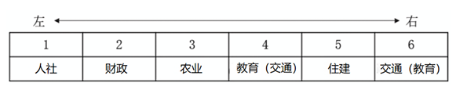

住建局在从右到左第二位，B项当选。

故正确答案为B。

---

## 第 18 题　qid 18644002 · 类比推理

某次“特色示范村”评选活动设立了文化旅游、非遗传承、生态农业、数字农业示范村4个奖项，甲、乙、丙、丁4个村庄各获其中之一。已知：
①文化旅游示范村的经济收入高于丙村；
②甲村和数字农业示范村的经济收入相当，且都不是最高的；
③生态农业示范村的经济收入比丁村高；
④丙村的经济收入高于非遗传承示范村。
根据上述条件，下列选项必然正确的是（    ）。

- **A**. 甲村的经济收入在4个村庄中位列第二
- **B**. 乙村获评文化旅游示范村　✅
- **C**. 丙村获评数字农业示范村
- **D**. 丁村获评非遗传承示范村

**答案**：B

**官方解析**

第一步：分析题干条件。

（1）文化旅游＞丙；

（2）甲数字农业，且都不是最高的；

（3）生态农业＞丁；

（4）丙＞非遗传承。

第二步：根据题干条件进行推理。

题干条件中“丙”提及次数最多，可优先从此处入手推理。

根据条件（1）和（4）可知，文化旅游＞丙＞非遗传承，结合条件（2）可知，甲和丙的经济收入关系有3种可能性，①甲＞丙，②甲丙，③丙＞甲，对此可进行假设：

假设①甲＞丙：

根据条件（2）可知，甲数字农业＞丙，结合已推出的“文化旅游＞丙＞非遗传承”，可知甲数字农业＞丙＞非遗传承，此时甲和数字农业的经济收入为4个村中最高的，与条件（2）矛盾，该假设不成立；

假设②甲丙：

根据条件（2）可知，丙是数字农业，结合已推出的“文化旅游＞丙＞非遗传承”可知，甲是生态农业，结合条件（3）可知，丁是非遗传承，剩下的乙是文化旅游，如下图所示：

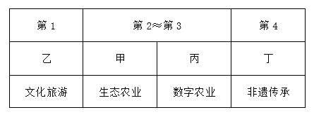

假设③丙＞甲：

根据条件（2）和已推出的“文化旅游＞丙＞非遗传承”，可知甲是非遗传承，结合条件（3）可知，丙是生态农业，丁是数字农业，剩下的乙是文化旅游，如下图所示：

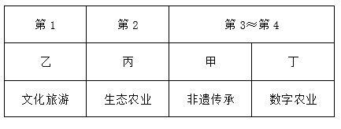

综上，只有B项必然正确。

故正确答案为B。

---

## 第 19 题　qid 18644001 · 逻辑判断

某古生物学研究小组在一处白垩纪晚期地层中发现了保存完整的恐龙皮肤化石。通过高分辨率显微镜，研究人员发现该恐龙皮肤表面存在大量微小的中空管状结构。由于这些结构类似于现代鸟类羽毛中用于体温调节的羽茎，研究人员推测，这些微小的中空管状结构是恐龙用于调节体温的特殊结构。
以下选项如果为真，最能支持上述推测的是（    ）。

- **A**. 这些中空管状结构能够增强生物体表的散热能力　✅
- **B**. 其他恐龙化石之中也发现了类似的中空管状结构
- **C**. 现代爬行类动物的皮肤表面不存在类似的中空管状结构
- **D**. 由于白垩纪晚期气候异常，恐龙需要体温调节机制维持生存

**答案**：A

**官方解析**

第一步：找出论点和论据。
论点：这些微小的中空管状结构是恐龙用于调节体温的特殊结构。
论据：通过高分辨率显微镜，研究人员发现该恐龙皮肤表面存在大量微小的中空管状结构。由于这些结构类似于现代鸟类羽毛中用于体温调节的羽茎。
本题通过恐龙皮肤上的中空管状结构与现代鸟类羽茎相似，就推断二者功能相同，此处有漏洞，结构相似也不一定功能一致，所以加强优先考虑搭桥，建立“结构”和“功能”的必然关系。
第二步：逐一分析选项。
A项：该项指出中空管状结构具有增强生物体表的散热能力，结合散热本身就是温度调节的重要表现，说明结构相似必然功能相似，即建立了“恐龙的中空管状结构”与“温度调节”的必然联系，搭桥项，保留；
（注：A项的“散热”并不是片面，“散热”是“温度调节”的重要表现，皮肤不能散热就不能进行温度调节了，所以A项的散热能力，是想表达中空管状结构是有温度调节的能力。）
B项：该项指出其他恐龙具有类似的中空管状结构，没有说明该结构能否调节体温，且论点说的是该结构是恐龙用于调节体温的特殊结构，话题不一致，无法加强，排除；
C项：该项指出现代爬行类动物的皮肤表面不存在类似的中空管状结构，而论点说的是该结构是恐龙用于调节体温的特殊结构，话题不一致，无法加强，排除；
D项：该项指出由于白垩纪晚期气候异常，恐龙需要体温调节机制维持生存，若恐龙不需要体温调节，则中空管状结构就不是恐龙用于调节体温的，此项为论点成立的必要条件，可以加强，保留。
对比A、D两项，A项搭桥是对整个论证的加强，与题干关联度更高，优于D项必要条件，择优选择A项。
故正确答案为A。

---

## 第 20 题　qid 18644004 · 类比推理

企业节能减排必须通过购买碳配额或自主开发减排项目实现。某企业未购买碳配额，因此该企业要节能减排需自主开发减排项目。
下列选项与题干逻辑结构最为相似的是（    ）。

- **A**. 申请绿色产品认证的公司需通过专家评审或提交检测报告。某公司未提交过检测报告，因此该公司应当组织开展专家评审
- **B**. 有的地区支持企业购买碳汇，有的地区则支持企业使用清洁能源。某地区支持企业使用清洁能源，因此该地区不支持企业购买碳汇
- **C**. 企业申请创业补贴或者通过线上申请，或者通过线下窗口办理。某企业已经通过线上渠道提交了申请，因此无需前往线下窗口办理
- **D**. 重点排放单位应通过安装监测设备或委托第三方核查排放情况。某企业属重点排放单位且未委托第三方核查排放情况，因此该企业需安装监测设备核查排放情况　✅

**答案**：D

**官方解析**

第一步：分析题干推理形式。

题干翻译为：企业节能减排通过购买碳配额 或 自主开发减排项目实现（即12 或 3），某企业未购买碳配额（即2），因此该企业要节能减排需自主开发减排项目（即要想1必须3），故逻辑结构为：12 或 3，当2时，要想1必须3。

第二步：逐一分析选项。

A项：选项翻译为：申请绿色产品认证的公司通过专家评审 或 提交检测报告（即12 或 3），某公司未提交过检测报告（即3），因此该公司应当组织开展专家评审（即2），逻辑结构为：12 或 3，32，与题干推理形式不一致，排除；

B项：选项翻译为：有的地区支持企业购买碳汇，有的地区则支持企业使用清洁能源（即有的1，有的2），某地区支持企业使用清洁能源（即2），因此该地区不支持企业购买碳汇（即1），逻辑结构为：有的1、有的2，21，与题干推理形式不一致，排除；

C项：选项翻译为：企业申请创业补贴通过线上申请 或者 通过线下窗口办理（即12 或 3），某企业已经通过线上渠道提交了申请（即2），因此无需前往线下窗口办理（即3），逻辑结构为：12 或 3，23，与题干推理形式不一致，排除；

D项：选项翻译为：重点排放单位核查排放情况委托第三方 或 通过安装监测设备（即12 或 3），某企业属重点排放单位未委托第三方核查排放情况（即2），因此该企业需安装监测设备核查排放情况（即要想1必须3），故逻辑结构为：12 或 3，当2时，要想1必须3，与题干推理形式一致，当选。

（题干逻辑结构为要实现某个目标，必须采用两种方式之一，已知未采取一种方式，因此必须要采取另一种方式，D项中两种方式的换位是为了将逻辑结构更加清晰的呈现出来。）

故正确答案为D。

---
