# 2026年浙江省公务员录用考试《行测》题（A类）（网友回忆版）

> 判断推理 · 40 题 · 浙江 2026

## 第 1 题　qid 12019729 · 图形推理

从所给的四个选项中，选择最合适的一个填入问号处，使之呈现一定的规律：

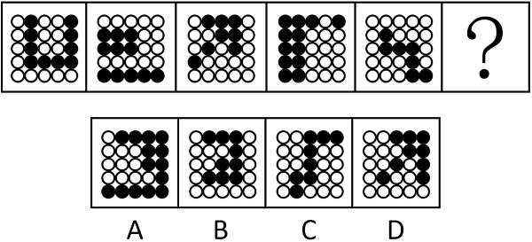

- **A**. A　✅
- **B**. B
- **C**. C
- **D**. D

**答案**：A

**官方解析**

元素组成不同，优先考虑属性规律。黑白色区域分布相对比较规整，优先考虑对称性。图1黑色区域为轴对称图形，图2白色区域为轴对称图形，图3黑色区域为轴对称图形，图4白色区域为轴对称图形，图5黑色区域为轴对称图形，因此“？”处应该是白色区域为轴对称图形，只有A项符合。
故正确答案为A。

---

## 第 2 题　qid 12019740 · 图形推理

从所给的四个选项中，选择最合适的一个填入问号处，使之呈现一定的规律性：

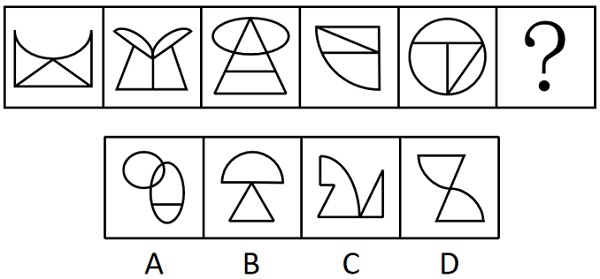

- **A**. A
- **B**. B
- **C**. C
- **D**. D　✅

**答案**：D

**官方解析**

元素组成不同，且无明显属性规律，考虑数量规律。观察发现，题干图形均由直线和曲线构成，且直线和曲线出现明显相交，考虑曲直交点数。题干图形的曲直交点数均为3，故“？”处应选择有3个曲直交点的图形，只有D项符合。
故正确答案为D。

---

## 第 3 题　qid 12019751 · 图形推理

从所给的四个选项中，选择最合适的一个填入问号处，使之呈现一定的规律性：

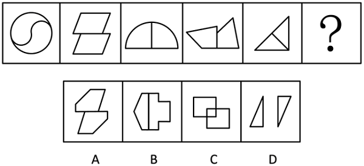

- **A**. A　✅
- **B**. B
- **C**. C
- **D**. D

**答案**：A

**官方解析**

元素组成不同，且每幅图均由两个图形拼接而成，考虑图形间关系。观察发现，题干两个面均是以边相连，排除C、D两项；继续观察发现，每幅图均为形状、大小相同的两个图形，排除B项。
故正确答案为A。

---

## 第 4 题　qid 12019730 · 图形推理

从所给的四个选项中，选择最合适的一项填入问号处，使之呈现一定的规律性：

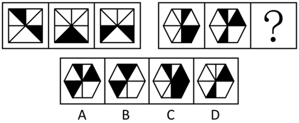

- **A**. A
- **B**. B　✅
- **C**. C
- **D**. D

**答案**：B

**官方解析**

元素组成不同，且无明显属性规律，观察发现，题干图形均由黑块和白块组成，且色块分布均匀，优先考虑黑白块面积。第一组图形中，黑块面积均为整个图形面积的，第二组图形中，前两幅图形的黑块面积均为整个图形面积的，故？处图形的黑块面积应为整个图形面积的，只有B项符合。

故正确答案为B。

---

## 第 5 题　qid 12019768 · 图形推理

从所给的四个选项中，选择最合适的一个填入问号处，使之呈现一定的规律性：

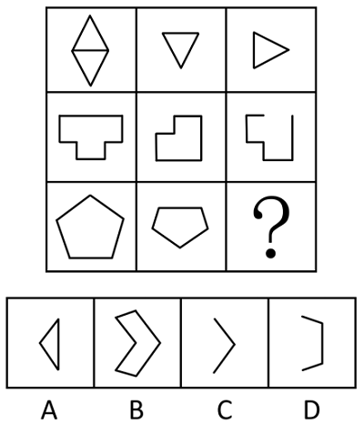

- **A**. A
- **B**. B
- **C**. C　✅
- **D**. D

**答案**：C

**官方解析**

元素组成相似，优先考虑样式规律，且相同线条重复出现，故考虑样式规律中的加减同异。九宫格优先看横行，第一行中，图1顺时针旋转，图2逆时针旋转，旋转后的图1和图2求同得到图3；经验证，第二行也满足此规律；第三行应用此规律，将图1顺时针旋转，图2逆时针旋转，然后图1和图2求同，得到的图应为C项。

故正确答案为C。

---

## 第 6 题　qid 12019732 · 图形推理

把下面的六个图形分为两类，使每一类图形都有各自的共同特征或规律，分类正确的一项是：

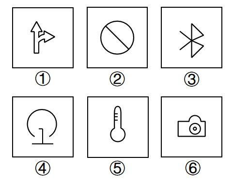

- **A**. ①②③，④⑤⑥　✅
- **B**. ①②⑤，③④⑥
- **C**. ①③⑥，②④⑤
- **D**. ①④⑤，②③⑥

**答案**：A

**官方解析**

本题为分组分类题目。元素组成不同，且无明显属性规律，考虑数量规律。观察发现，题干多幅图形出现“日”字变形图、明显出头端点，考虑笔画数。图①②③均为一笔画图形，图④⑤⑥均为三笔画图形，即图①②③为一组，图④⑤⑥为一组。
故正确答案为A。

---

## 第 7 题　qid 12019817 · 图形推理

从所给的四个选项中，选择最合适的一个填入问号处，使之呈现一定的规律性：

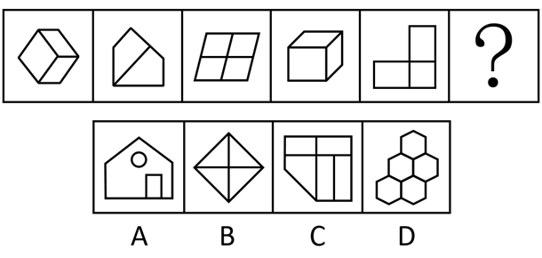

- **A**. A
- **B**. B
- **C**. C　✅
- **D**. D

**答案**：C

**官方解析**

元素组成不同，且无明显属性规律，考虑数量规律。观察发现，题干图形封闭区域明显，考虑面数量，但总体数面无明显规律。继续观察发现，题干所有面的形状均为四边形，故？处图形中所有面的形状也应均为四边形，只有C项符合。
故正确答案为C。

---

## 第 8 题　qid 12019737 · 图形推理

把下面的六个图形分为两类，使每一类图形都有各自的共同特征或规律，分类正确的一项是：

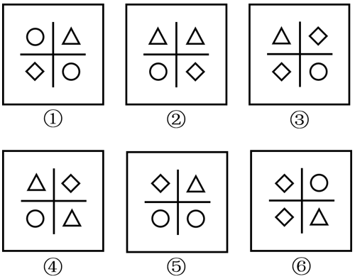

- **A**. ①②④，③⑤⑥
- **B**. ①③④，②⑤⑥　✅
- **C**. ①③⑤，②④⑥
- **D**. ①④⑥，②③⑤

**答案**：B

**官方解析**

本题为分组分类题目。元素组成不同，且无明显属性规律，考虑数量规律。观察发现，每幅图均有4个元素，且均存在2个相同元素，图①③④中相同元素位置相对，图②⑤⑥中相同元素位置相邻。即图①③④为一组，图②⑤⑥为一组。
故正确答案为B。

---

## 第 9 题　qid 12019748 · 图形推理

左边给定的是纸盒外表面的展开图，右边哪一项能由它折叠而成？

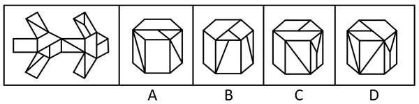

- **A**. A
- **B**. B
- **C**. C
- **D**. D　✅

**答案**：D

**官方解析**

本题为空间重构类题目，将题干展开图标上序号，如下图所示，逐一进行分析。

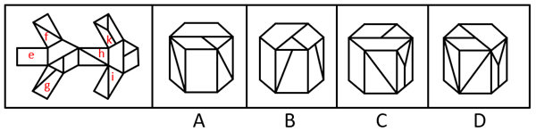

A项：选项正面为面e，题干展开图中面e的两侧分别与面f和面g相邻，而选项中面e的两侧相邻面中没有面g，选项与题干展开图不一致，排除；

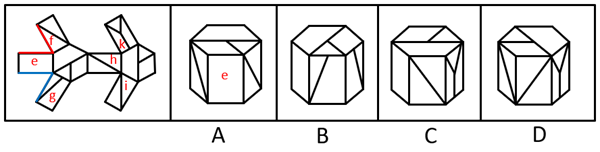

B项：选项正面为面g，右侧面与面g形状相同，但题干展开图中面g形状的面只有1个，故选项右侧面为无中生有的面，选项与题干展开图不一致，排除；

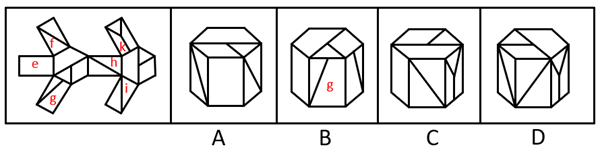

C项：选项右侧面为面k，题干展开图中面k与其左侧相邻面上方的公共点引出两条面上的线，而选项中面k与其左侧相邻面上方的公共点只引出一条面上的线，选项与题干展开图不一致，排除；

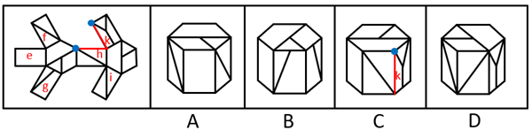

D项：选项与题干展开图一致，当选。

故正确答案为D。

---

## 第 10 题　qid 12019797 · 图形推理

下面是某立体图形的正面和后面，它由三个完全相同的小立体图形组成，该小立体图形是：

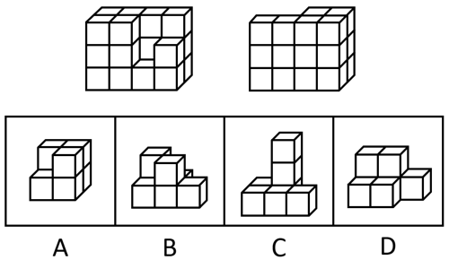

- **A**. A
- **B**. B
- **C**. C
- **D**. D　✅

**答案**：D

**官方解析**

本题考查立体拼合，题干立体图形可由3个完全相同的D项图形拼合而成，具体拼合方式如下图所示。

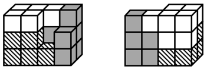

故正确答案为D。

---

## 第 11 题　qid 12019733 · 类比推理

板鞋：鞋

- **A**. 青海：海
- **B**. 土匪：匪　✅
- **C**. 河马：马
- **D**. 水银：银

**答案**：B

**官方解析**

第一步：判断题干词语间逻辑关系。
“板鞋”是“鞋”的一种，二者为种属关系。
第二步：判断选项词语间逻辑关系。
A项：“青海”一般指“青海省”，是中国西部的省级行政区，不是“海”的一种，二者不是种属关系，与题干逻辑关系不一致，排除；
B项：“土匪”是指在地方上抢劫财物、为非作歹、严重扰乱社会治安的武装匪徒，“匪”是指强盗，抢劫财务的坏人，“土匪”是“匪”的一种，二者为种属关系，与题干逻辑关系一致，当选；
C项：“河马”与“马”是两种不同的哺乳动物，二者为并列关系，与题干逻辑关系不一致，排除；
D项：“水银”和“银”是两种不同的金属，二者为并列关系，与题干逻辑关系不一致，排除。
故正确答案为B。

---

## 第 12 题　qid 12019749 · 类比推理

抗日战争时期：解放战争时期

- **A**. 日新：月异
- **B**. 秋收冬藏：春生夏长
- **C**. 弱冠之年：而立之年　✅
- **D**. 朝饮木兰之坠露：夕餐秋菊之落英

**答案**：C

**官方解析**

第一步：判断题干词语间逻辑关系。
抗日战争发生在1931年至1945年之间，而解放战争则发生在1946年至1950年之间，二者是中国历史上两个重要的时间阶段，构成并列关系，且二者存在时间上的延续。
第二步：判断选项词语间逻辑关系。
A项：日新月异即每日每月都出现新的情况，呈现新的面貌，日新和月异不是两个并列的时间阶段，与题干逻辑关系不一致，排除；
B项：秋收冬藏指秋天收获，冬天储藏；春生夏长指春天萌生，夏天滋长，前后共描述了四个时间阶段及对应的行为，并非单纯的时间阶段的并列，与题干逻辑关系不一致，排除；
C项：弱冠之年指代男子年满二十岁行加冠礼后进入成年的人生阶段；而立之年指代三十岁时心智成熟、具备独立判断能力的人生阶段，二者均是人生两个重要的时间阶段，构成并列关系，且二者存在时间上的延续，与题干逻辑关系一致，当选；
D项：朝饮木兰之坠露，即早晨我饮木兰上的露滴；夕餐秋菊之落英，即晚上我用菊花残瓣充饥，二者体现了两个时间阶段及对应的行为，并非单纯的时间阶段的并列，与题干逻辑关系不一致，排除。
故正确答案为C。

---

## 第 13 题　qid 12019731 · 类比推理

鸭绒被：卤鸭头

- **A**. 棉花：棉被
- **B**. 铅笔芯：钻石
- **C**. 人参：西洋参
- **D**. 牛排：牛角梳　✅

**答案**：D

**官方解析**

第一步：判断题干词语间逻辑关系。
鸭绒被和卤鸭头的原材料都来自鸭子，二者原材料一致。
第二步：判断选项词语间逻辑关系。
A项：棉花可以用来做棉被，二者为原材料与成品的对应关系，与题干逻辑关系不一致，排除；
B项：铅笔芯的原材料是石墨，钻石的原材料是金刚石，二者原材料不一致，与题干逻辑关系不一致，排除；
C项：人参和西洋参是两种不同的药材，二者为并列关系，与题干逻辑关系不一致，排除；
D项：牛排和牛角梳的原材料都来自牛，二者原材料一致，与题干逻辑关系一致，当选。
故正确答案为D。

---

## 第 14 题　qid 12019773 · 类比推理

天下大事：必作于细

- **A**. 积善之家：必有余庆
- **B**. 工欲善其事：必先利其器　✅
- **C**. 治国有常：利民为本
- **D**. 有朋自远方来：不亦乐乎

**答案**：B

**官方解析**

第一步：判断题干词语间逻辑关系。
天下大事，必作于细指天下的大事都是从细小的地方一步步形成的，必作于细是达成天下大事的必要条件，同时也是必要对策。
第二步：判断选项词语间逻辑关系。
A项：积善之家，必有余庆指修善积德的个人和家庭，必然有更多的吉庆，二者是条件关系，但必有余庆不是达成积善之家的必要对策，与题干逻辑关系不一致，排除；
B项：工欲善其事，必先利其器指工匠要想做好活儿，一定先要把工具整治得锐利精良，必先利其器是工欲善其事的必要条件，同时也是必要对策，与题干逻辑关系一致，当选；
C项：治国有常，利民为本指治理国家的根本途径是利民，二者是条件关系，但利民是一种途径，不是具体对策，与题干逻辑关系不一致，排除；
D项：有朋自远方来，不亦乐乎指有志同道合的人从远方来，不是很令人高兴的吗，二者并非条件关系，与题干逻辑关系不一致，排除。
故正确答案为B。

---

## 第 15 题　qid 12019738 · 类比推理

举手：示意：点头

- **A**. 握手：礼仪：敬礼　✅
- **B**. 义务：纳税：选举
- **C**. 罢工：游行：抗议
- **D**. 界限：界碑：界河

**答案**：A

**官方解析**

第一步：判断题干词语间逻辑关系。
举手和点头都是一种示意方式，第一个词和第三个词是并列关系，且均与第二个词构成种属关系。
第二步：判断选项词语间逻辑关系。
A项：握手和敬礼都是一种礼仪行为，第一个词和第三个词是并列关系，且均与第二个词构成种属关系，与题干逻辑关系一致，当选；
B项：纳税是一种义务，选举是公民权利，而不是义务，与题干逻辑关系不一致，排除；
C项：罢工和游行都是一种抗议方式，第一个词和第二个词是并列关系，且均与第三个词构成种属关系，与题干逻辑关系不一致，排除；
D项：界碑和界河都代表“界限”，第二个词和第三个词是并列关系，与题干逻辑关系不一致，排除。
故正确答案为A。

---

## 第 16 题　qid 12019774 · 类比推理

实现：现实

- **A**. 适合：合适　✅
- **B**. 代替：替代
- **C**. 离别：别离
- **D**. 积累：累积

**答案**：A

**官方解析**

第一步：判断题干词语间逻辑关系。
题干两词没有必然语义关系，看相同单字也选不出唯一答案，因此考虑词性，实现是动词，现实是形容词。
第二步：判断选项词语间逻辑关系。
A项：适合是动词，合适是形容词，与题干词性一致，当选；
B项：代替和替代都是动词，与题干词性不一致，排除；
C项：离别和别离都是动词，与题干词性不一致，排除；
D项：积累和累积都是动词，与题干词性不一致，排除。
故正确答案为A。

---

## 第 17 题　qid 12019739 · 类比推理

消防栓：按摩椅

- **A**. 火山口：三江源
- **B**. 金钟罩：铁布衫
- **C**. 传染病：急救车
- **D**. 助听器：防晒霜　✅

**答案**：D

**官方解析**

第一步：判断题干词语间逻辑关系。
从微观的角度来讲，“消防栓”与“按摩椅”一个是消防设施一个是保健设备，关联不大。但二者都是物品，可以考虑命名方式，消防栓是因其具有消防的功能而命名，按摩椅是因其具有按摩的功能而命名。
第二步：判断选项词语间逻辑关系。
A项：火山口是火山喷发时岩浆及其他碎屑物喷出的裂口，三江源因其是长江、黄河和澜沧江的发源地而得名，二者均不是因其具有的功能而命名，与题干逻辑关系不一致，排除；
B项：金钟罩和铁布衫是中国传统武术项目，命名源于其独特的练成效果和形象比喻，二者均不是因其具有的功能而命名，与题干逻辑关系不一致，排除；
C项：传染病是因其具有传染的属性而命名，不是因其具有的功能而命名，与题干逻辑关系不一致，排除；
D项：助听器是因其具有助听的功能而命名，防晒霜是因其具有防晒的功能而命名，与题干逻辑关系一致，当选。
故正确答案为D。

---

## 第 18 题　qid 12019771 · 类比推理

结婚登记：身份证：户口本

- **A**. 睡觉：床：枕头
- **B**. 成功：运气：努力
- **C**. 登山：鞋子：登山杖
- **D**. 考试：准考证：签字笔　✅

**答案**：D

**官方解析**

第一步：判断题干词语间逻辑关系。
结婚登记时身份证是证明身份的必要凭证，但不一定需要户口本，前两词为必要条件对应关系，第一词和第三词为非必要条件对应关系。
第二步：判断选项词语间逻辑关系。
A项：睡觉不一定需要床，前两词并非必要条件对应关系，与题干逻辑关系不一致，排除；
B项：成功不一定需要运气，前两词并非必要条件对应关系，与题干逻辑关系不一致，排除；
C项：登山不一定需要鞋子，前两词并非必要条件对应关系，与题干逻辑关系不一致，排除；
D项：考试时准考证是证明身份的必要凭证，但不一定需要签字笔，前两词为必要条件对应关系，第一词和第三词为非必要条件对应关系，与题干逻辑关系一致，当选。
故正确答案为D。

---

## 第 19 题　qid 12019742 · 类比推理

物理学家：化学家：居里夫人

- **A**. 整数：正数：质数　✅
- **B**. 硫酸：铜：硫酸铜
- **C**. 办公室：卧室：电脑
- **D**. 公司职员：自媒体博主：文艺青年

**答案**：A

**官方解析**

第一步：判断题干词语间逻辑关系。
有的物理学家是化学家，有的物理学家不是化学家，有的化学家是物理学家，有的化学家不是物理学家，二者为交叉关系；居里夫人是物理学家，也是化学家，第三个词与前两个词均构成种属关系。
第二步：判断选项词语间逻辑关系。
A项：有的整数是正数，有的整数不是正数，有的正数是整数，有的正数不是整数，二者为交叉关系；质数是整数，也是正数，第三个词与前两个词均构成种属关系，与题干逻辑关系一致，当选；
B项：硫酸和铜在一定条件下发生化学反应生成硫酸铜，三者是化学产物的对应关系，与题干逻辑关系不一致，排除；
C项：电脑可以在办公室，也可以在卧室，第三个词与前两个词均构成地点的对应关系，与题干逻辑关系不一致，排除；
D项：公司职员、自媒体博主、文艺青年是人的三种不同身份，且用“四个有的”造句造得通，三者两两之间互为交叉关系，与题干逻辑关系不一致，排除。
故正确答案为A。

---

## 第 20 题　qid 12019743 · 类比推理

（    ） 对于 木雕 相当于 花雕酒 对于 （    ）

- **A**. 黄杨木 糯米
- **B**. 装饰 陪嫁
- **C**. 石雕 莲子酒　✅
- **D**. 雕塑艺术 发酵

**答案**：C

**官方解析**

逐一代入选项。
A项：黄杨木是制作木雕的原材料，二者为原材料对应，糯米是制作花雕酒的原材料，二者为原材料对应，但词语前后顺序相反，前后逻辑关系不一致，排除；
B项：木雕是一种建筑装饰，二者为种属关系，花雕酒经常作为女儿陪嫁中的特定物品，二者为对应关系，前后逻辑关系不一致，排除；
C项：石雕和木雕都是建筑装饰，二者为并列关系，花雕酒是使用糯米为主要原料发酵而得的酒，花雕酒和莲子酒是两种不同的酒，二者为并列关系，前后逻辑关系一致，当选；
D项：木雕是一种雕塑艺术，二者为种属关系，糯米经过发酵制作成花雕酒，发酵与花雕酒为工艺对应，前后逻辑关系不一致，排除。
故正确答案为C。

---

## 第 21 题　qid 12019752 · 定义判断

表层扮演是情绪劳动的一种策略，指个体隐藏真实情绪，按照工作要求伪装出特定外在情绪表现的行为模式；深层扮演指个体通过调整内在真实情感以符合工作要求的情绪表达方式，它强调内在情绪体验与外在表现的一致性。
根据上述定义，下列体现深层扮演的是：

- **A**. 服务员面对顾客投诉强忍怒火保持职业微笑
- **B**. 护士换位思考理解患者焦虑后主动安抚情绪　✅
- **C**. 客服人员机械背诵标准化礼貌用语应对咨询
- **D**. 销售员因业绩压力自发对产品产生强烈信心

**答案**：B

**官方解析**

第一步：找出定义关键词。
表层扮演：“个体隐藏真实情绪”、“按照工作要求伪装出特定外在情绪表现”；
深层扮演：“个体通过调整内在真实情感以符合工作要求的情绪表达方式”、“强调内在情绪体验与外在表现的一致性”。
第二步：逐一分析选项。
A项：服务员面对顾客投诉强忍怒火保持职业微笑，符合“个体隐藏真实情绪”、“按照工作要求伪装出特定外在情绪表现”，符合“表层扮演”定义，不符合“深层扮演”定义，排除；
B项：护士换位思考理解患者焦虑后主动安抚情绪，护士能够换位思考并主动安抚，说明其从内心理解了患者的情绪并且体现在了外在表现上，符合“个体通过调整内在真实情感以符合工作要求的情绪表达方式”、“强调内在情绪体验与外在表现的一致性”，符合“深层扮演”定义，当选；
C项：客服人员机械背诵标准化礼貌用语应对咨询，未体现其内在情绪，不符合“个体通过调整内在真实情感以符合工作要求的情绪表达方式”、“强调内在情绪体验与外在表现的一致性”，不符合“深层扮演”定义，排除；
D项：销售员因业绩压力自发对产品产生强烈信心，未体现其情绪的外在表现，不符合“个体通过调整内在真实情感以符合工作要求的情绪表达方式”、“强调内在情绪体验与外在表现的一致性”，不符合“深层扮演”定义，排除。
故正确答案为B。

---

## 第 22 题　qid 12019750 · 定义判断

无边界组织指打破传统组织内部的横向（部门间）、纵向（层级间）、外部（与客户/供应商间）的预设边界，以灵活授权团队取代固定部门，加强信息自由流通与资源动态配置的组织设计模式。
根据上述定义，下列属于无边界组织的是：

- **A**. 连锁餐饮企业通过标准化流程管理各分店运营
- **B**. 政府机构采用垂直管理体系确保政策统一执行
- **C**. 公司根据项目需要进行跨职能部门团队动态组合　✅
- **D**. 企业通过部门分工和逐级审批制度保障运营效率

**答案**：C

**官方解析**

第一步：找出定义关键词。
“打破传统组织内部的横向（部门间）、纵向（层级间）、外部（与客户/供应商间）的预设边界”、“以灵活授权团队取代固定部门”。
第二步：逐一分析选项。
A项：通过标准化流程管理各分店运营，强调的是标准化和统一控制，未体现边界打破或团队灵活授权，不符合“打破传统组织内部的横向（部门间）、纵向（层级间）、外部（与客户/供应商间）的预设边界”、“以灵活授权团队取代固定部门”，不符合定义，排除；
B项：政府机构采用垂直管理体系确保政策统一执行，不符合“打破传统组织内部的横向（部门间）、纵向（层级间）、外部（与客户/供应商间）的预设边界”、“以灵活授权团队取代固定部门”，不符合定义，排除；
C项：公司根据项目需要进行跨职能部门团队动态组合，符合“打破传统组织内部的横向（部门间）、纵向（层级间）、外部（与客户/供应商间）的预设边界”、“以灵活授权团队取代固定部门”，符合定义，当选；
D项：企业通过部门分工和逐级审批制度保障运营效率，强化了部门分工和层级审批，不符合“打破传统组织内部的横向（部门间）、纵向（层级间）、外部（与客户/供应商间）的预设边界”、“以灵活授权团队取代固定部门”，不符合定义，排除。
故正确答案为C。

---

## 第 23 题　qid 12019747 · 定义判断

情境变量是实验或自然环境中可影响个体行为或心理过程的外部因素，如物理距离、社会文化背景等。
根据上述定义，下列属于情境变量的是：

- **A**. 实验中恒定的光照强度
- **B**. 被试完成问卷时的情绪状态
- **C**. 企业员工绩效考核的量化指标
- **D**. 跨文化研究中不同国家的礼仪规范差异　✅

**答案**：D

**官方解析**

第一步：找出定义关键词。
“影响个体行为或心理过程的外部因素”、“物理距离、社会文化背景”。
第二步：逐一分析选项。
A项：恒定的光照强度，光照强度是外部因素，符合“影响个体行为或心理过程的外部因素”，符合定义，保留；
B项：被试完成问卷时的情绪状态，情绪状态是自身的心理状态，不符合“影响个体行为或心理过程的外部因素”，不符合定义，排除；
C项：企业员工绩效考核的量化指标，量化指标是客观评价标准，可以是外部因素，符合“影响个体行为或心理过程的外部因素”，符合定义，保留；
D项：跨文化研究中不同国家的礼仪规范差异，礼仪规范是外部因素，符合“影响个体行为或心理过程的外部因素”、“物理距离、社会文化背景”，符合定义，保留。
对比A、C、D三项，A项的光照强度是“恒定”的，不符合“变量”的特质，C项的量化指标不是“物理距离、社会文化背景”，故D项更符合题干定义。
故正确答案为D。

---

## 第 24 题　qid 12019762 · 定义判断

光杆动词式把字句，是指“把+名词+光杆动词”，即动词后无任何附加成分的句子；动趋式把字句，是指“把+名词+动趋式动补短语”的句子，其中动趋式动补短语表达了行为发生的趋势。
根据上述定义，下列属于动趋式把字句的是：

- **A**. 你别把家门上锁
- **B**. 母亲把剩菜带回来　✅
- **C**. 你别把小问题复杂化
- **D**. 我建议大会把这个提案取消

**答案**：B

**官方解析**

第一步：找出定义关键词。
光杆动词式把字句：“把+名词+光杆动词”、“动词后无任何附加成分”；
动趋式把字句：“把+名词+动趋式动补短语（表达了行为发生的趋势）”。
第二步：逐一分析选项。
A项：“你别把家门上锁”的结构是“把+家门+上锁”，“上锁”并非行为趋势，不符合“把+名词+动趋式动补短语（表达了行为发生的趋势）”，不符合“动趋式把字句”定义，排除；
B项：“母亲把剩菜带回来”的结构是“把+剩菜+带回来”，“带回来”表达了行为发生的趋势，符合“把+名词+动趋式动补短语（表达了行为发生的趋势）”，符合“动趋式把字句”定义，当选；
C项：“你别把小问题复杂化”的结构是“把+小问题+复杂化”，“复杂化”并非行为趋势，不符合“把+名词+动趋式动补短语（表达了行为发生的趋势）”，不符合“动趋式把字句”定义，排除；
D项：“我建议大会把这个提案取消”的结构是“把+提案+取消”，“取消”为动词，其后无附加成分，符合“把+名词+光杆动词”、“动词后无任何附加成分”，符合“光杆动词式把字句”定义，不符合“动趋式把字句”定义，排除。
故正确答案为B。

---

## 第 25 题　qid 12019758 · 定义判断

转口贸易是指商品生产国与消费国通过第三国（或地区）转手进行的贸易活动，生产国和消费国不直接进行买卖，货物在第三国不经过加工或仅进行简单分类、包装等非本质改变。
根据上述定义，下列属于转口贸易的是：

- **A**. 迪拜将伊朗原油提炼成成品油后销往欧洲
- **B**. 新加坡从中国进口手机零部件，组装后出口至印度
- **C**. 智利铜矿经秘鲁港口卸货后，直接原箱装船运往日本
- **D**. 中国纺织品出口至荷兰，荷兰贸易商更换原产地证明文件后转卖至英国　✅

**答案**：D

**官方解析**

第一步：找出定义关键词。
“商品生产国与消费国”、“通过第三国（或地区）转手进行的贸易”、“在第三国不经过加工或仅进行简单分类、包装等非本质改变”。
第二步：逐一分析选项。
A项：该项中的伊朗为“生产国”，欧洲为“消费国”，迪拜为“第三国（或地区）”，但是迪拜将伊朗原油提炼成成品油，说明第三国（或地区）对商品进行了加工，不符合“在第三国不经过加工或仅进行简单分类、包装等非本质改变”，不符合定义，排除；
B项：该项中的中国为“生产国”，印度为“消费国”，新加坡为“第三国（或地区）”，但新加坡将手机零部件组装后进行出口，说明第三国对商品进行了加工，不符合“在第三国不经过加工或进行简单分类、包装等非本质改变”，不符合定义，排除；
C项：该项中的智利为“生产国”，日本为“消费国”，秘鲁为“第三国（或地区）”，智利铜矿经过秘鲁港口卸货后，直接原箱装船运往日本，即只是在秘鲁进行停靠转运，未体现在此进行贸易，不符合“通过第三国（或地区）转手进行的贸易”，不符合定义，排除；
D项：该项中的中国为“生产国”，英国为“消费国”，荷兰为“第三国（或地区）”，荷兰贸易商“更换”原产地证明文件后“转卖”至英国，符合“通过第三国”（或地区）转手进行的贸易”、“在第三国不经过加工或仅进行简单分类、包装等非本质改变”，符合定义，当选。
故正确答案为D。

---

## 第 26 题　qid 12019753 · 定义判断

剪切增稠是指剪切速率或者剪切应力增加到某一个数值时，液体中形成了新的结构，引起了阻力的增加，导致液体的表观黏度增大，同时伴随着体积胀大的现象。
根据上述定义，下列现象属于剪切增稠的是：

- **A**. 块状的老酸奶经搅拌后变成较稀的液体
- **B**. 陷入沼泽时，快速挣扎会让沼泽变稀，下陷速度加快
- **C**. 液体防弹衣中的液体被高速的子弹击中时会迅速膨胀变硬　✅
- **D**. 敲击瓶底或大力甩瓶身可以让粘在瓶底的剩余番茄酱流出

**答案**：C

**官方解析**

第一步：找出定义关键词。
“液体形成新的结构”、“液体表观黏度增大，体积胀大”。
第二步：逐一分析选项。
A项：老酸奶搅拌后变稀，不符合“液体表观黏度增大，体积胀大”，不符合定义，排除；
B项：快速挣扎让沼泽变稀，不符合“液体表观黏度增大，体积胀大”，不符合定义，排除；
C项：液体防弹衣中的液体被子弹击中时会迅速膨胀变硬，符合“液体形成新的结构”、“液体表观黏度增大，体积胀大”，符合定义，当选；
D项：敲击瓶底或大力甩瓶身让粘在瓶底的番茄酱流出，不符合“液体形成新的结构”、“液体表观黏度增大，体积胀大”，不符合定义，排除。
故正确答案为C。

---

## 第 27 题　qid 12019759 · 定义判断

随机变量X1和X2独立，是指X1的取值不影响X2的取值，X2的取值也不影响X1的取值；随机变量X1和X2服从同一分布，是指X1和X2在取值范围内的概率分布一致。如果一些随机变量服从同一分布，并且互相独立，那么这些随机变量是独立同分布。
根据上述定义，下列随机变量是独立同分布的是：

- **A**. 甲、乙两人先后抽奖，甲、乙抽中奖的情况
- **B**. 甲、乙两人先后掷骰子，甲、乙掷出点数的情况　✅
- **C**. 实力差距悬殊的甲、乙两棋手进行比赛，甲、乙的胜负情况
- **D**. 在街上随机选择一名男性甲和一名女性乙，甲、乙的身高情况

**答案**：B

**官方解析**

第一步：找出定义关键词。

独立：“X1的取值不影响X2的取值，X2的取值也不影响X1的取值”；

同一分布：“X1和X2在取值范围内的概率分布一致”；

独立同分布：“服从同一分布”且“互相独立”。

第二步：逐一分析选项。

A项：甲、乙两人“先后”抽奖，因此甲抽中的结果会影响乙抽中的概率，不符合“X1和X2在取值范围内的概率分布一致”，不符合“服从同一分布”，不符合“独立同分布”定义，排除；

B项：甲、乙两人先后掷骰子，骰子的点数取值范围均为1-6，且每个点数出现的概率均为，符合“X1和X2在取值范围内的概率分布一致”，同时甲掷出的点数不会对乙掷出的点数产生任何影响，符合“互相独立”，符合“独立同分布”定义，当选；

C项：甲、乙两棋手实力差距悬殊，甲获胜的概率远高于乙，二者的胜负概率分布不一致，不符合“X1和X2在取值范围内的概率分布一致”，不符合“服从同一分布”，不符合“独立同分布”定义，排除；

D项：随机选择的男性甲和女性乙，二者的身高概率分布存在明显差异，不符合“X1和X2在取值范围内的概率分布一致”，不符合“服从同一分布”，不符合“独立同分布”定义，排除。

故正确答案为B。

---

## 第 28 题　qid 12019764 · 定义判断

求同求异并用法是探求现象间因果联系的一种方法，是指在被研究现象出现的若干正面场合中，都有一个相同的先行情况出现，而在被研究现象不出现的若干反面场合中，该先行情况都不出现，则该先行情况就是被研究现象的原因。
根据上述定义，下列体现求同求异并用法的是：

- **A**. 世界杯期间，小明第一晚边看边喝浓茶，失眠了；第二晚边看边喝咖啡，失眠了；第三晚边看边吸烟，失眠了。可见吸烟、喝咖啡和喝浓茶是失眠的原因
- **B**. 体质相同的双胞胎兄弟在饭店用餐，一个吃了冰激凌后出现腹痛；另一个没吃冰激凌未出现腹痛，两人吃的其他食物完全相同。可见吃冰激凌是腹痛的原因
- **C**. 电脑维修店接待了几位因电脑中毒前来维修的顾客，他们的电脑品牌、型号各有不同，但他们的电脑在中毒前都运行了同一个软件。可见该软件可能存在木马程序
- **D**. 失足青年的家庭一般都不稳定，有的父母离异，有的父母对孩子关心帮助不够；而没有失足的青年家庭较为稳定，父母经常关心和帮助他们。可见家庭不稳定是青年失足的重要原因　✅

**答案**：D

**官方解析**

第一步：找出定义关键词。
“在被研究现象出现的若干正面场合中，都有一个相同的先行情况出现”、“在被研究现象不出现的若干反面场合中，该先行情况都不出现”、“该先行情况就是被研究现象的原因”。
第二步：逐一分析选项。
A项：小明第一晚边看边喝浓茶，第二晚边看边喝咖啡，第三晚边看边吸烟，三晚做的事不相同，不是同一个先行情况，不符合“在被研究现象出现的若干正面场合中，都有一个相同的先行情况出现”，不符合定义，排除；
B项：双胞胎兄弟在饭店用餐，一个吃了冰激凌，另一个没吃冰激凌，只有兄弟两个人，不符合“在被研究现象出现的若干正面场合中，都有一个相同的先行情况出现”、“在被研究现象不出现的若干反面场合中，该先行情况都不出现”，不符合定义，排除；
C项：几位顾客电脑在中毒前都运行了同一个软件，未提及“在被研究现象不出现的若干反面场合中，该先行情况都不出现”，不符合定义，排除；
D项：失足青年的家庭一般都不稳定，符合“在被研究现象出现的若干正面场合中，都有一个相同的先行情况出现”，没有失足的青年家庭较为稳定，符合“在被研究现象不出现的若干反面场合中，该先行情况都不出现”，可见家庭不稳定是青年失足的重要原因，符合“该先行情况就是被研究现象的原因”，符合定义，当选。
故正确答案为D。

---

## 第 29 题　qid 12019760 · 定义判断

具身智能是指智能体（如机器人、无人机、智能汽车等）通过物理实体与环境实时交互，不断修正自身模型和策略，在不断变化的环境中做出实时反应，实现感知、认知、决策和行动一体化。
根据上述定义，下列场景中没有体现具身智能的是：

- **A**. 无人机按计划路线对稻田进行农药喷洒，实现“科技助农”　✅
- **B**. 作战机器人实时分析环境数据，在复杂地形中自主行走和避障
- **C**. 自动驾驶汽车在绿灯变红前3秒钟，做出“加速驶过路口”的决策
- **D**. 人形机器人“消防员”正在灭火，突然看到被困群众，立马上前安抚他们

**答案**：A

**官方解析**

第一步：找出定义关键词。
“智能体”、“物理实体与环境实时交互，不断修正自身模型和策略”、“在不断变化的环境中做出实时反应”、“实现感知、认知、决策和行动一体化”。
第二步：逐一分析选项。
A项：无人机符合“智能体”，按计划路线对稻田进行农药喷洒，不符合“在不断变化的环境中做出实时反应”，不符合定义，当选；
B项：作战机器人符合“智能体”，实时分析环境数据，符合“物理实体与环境实时交互”，在复杂地形中自主行走和避障，符合“在不断变化的环境中做出实时反应”，符合定义，排除；
C项：自动驾驶汽车符合“智能体”，在绿灯变红前3秒钟，做出“加速驶过路口”的决策，符合“在不断变化的环境中做出实时反应”，符合定义，排除；
D项：人形机器人符合“智能体”，突然看到被困群众，立马上前安抚他们，符合“在不断变化的环境中做出实时反应”，符合定义，排除。
本题为选非题，故正确答案为A。

---

## 第 30 题　qid 12019763 · 定义判断

片面谬误是指用特例为自己的错误开脱。人们都不喜欢被证明自己的言行是错误的，所以当他们被证明是错误的时候，总会想办法给自己找理由。
根据上述定义，下列属于片面谬误的是：

- **A**. 领导指出小王工作出了差错，小王说那天自己身体刚好不舒服　✅
- **B**. 小赵年终考核垫底，他自我安慰道，不管怎么考核，总有人是最差的
- **C**. 老师批评小孙考试经常出现计算错误，小孙妈妈说孩子一着急就这样
- **D**. 小李超常发挥获得比赛二等奖，他心里想，再多答对一题就能得一等奖了

**答案**：A

**官方解析**

第一步：找出定义关键词。
“用特例”、“为自己的错误开脱”。
第二步：逐一分析选项。
A项：小王以那天自己身体不舒服为借口，为工作出差错开脱，符合“用特例”、“为自己的错误开脱”，符合定义，当选； 
B项：小赵用总有人是最差的来安慰年终考核垫底的自己，不是特例，不符合“用特例”，不符合定义，排除；
C项：小孙妈妈用孩子着急来解释小孙考试经常出现计算错误，不符合“为自己的错误开脱”，不符合定义，排除；
D项：小李比赛获得二等奖，心里想再多答对一题就能获得一等奖，不符合“用特例”、“为自己的错误开脱”，不符合定义，排除。
故正确答案为A。

---

## 第 31 题　qid 12019761 · 逻辑判断

某单位拟对辖区内酒店进行升级提星，要求酒店必须基本设施完备，并且要通过卫生部门的严格考核。
以下哪项为真，说明升级提星这项工作没有遵守要求？
（1）酒店成功升级提星，但没有通过卫生部门的严格考核
（2）酒店成功升级提星，但酒店内没有空调、吹风机等基本设施
（3）酒店基本设施完备，且通过了卫生部门的严格考核，但是没有升级提星

- **A**. （1）（2）　✅
- **B**. （2）（3）
- **C**. （3）
- **D**. （1）（2）（3）

**答案**：A

**官方解析**

第一步：翻译题干。

升级提星基本设施完备 且 通过卫生部门的严格考核。

第二步：逐一分析。

（1）翻译为：升级提星 且 通过卫生部门的严格考核，“升级提星”是对题干条件的肯前，肯前必肯后，可以推出“通过卫生部门的严格考核”，说明（1）没有遵守要求；

（2）翻译为：升级提星 且 基本设施完备（没有空调、吹风机等基本设施），“升级提星”是对题干条件的肯前，肯前必肯后，可以推出“基本设施完备”，说明（2）没有遵守要求；

（3）翻译为：基本设施完备 且 通过卫生部门的严格考核 且 升级提星，“基本设施完备 且 通过卫生部门的严格考核”是对题干条件的肯后，“升级提星”是对题干条件的否前，否前肯后无必然结论，无法明确（3）是否遵守要求。

综上，可以说明升级提星这项工作没有遵守要求的是（1）（2）。

故正确答案为A。

---

## 第 32 题　qid 12019765 · 逻辑判断

某商店现有歌手甲的专辑A、B各一张，歌手乙的专辑C、D各一张，歌手丙的专辑E、F各一张，共6张专辑，需将它们放在横向排列的1~6号货架，每个货架摆放一张。已知：（1）A和C不相邻；（2）F和C不相邻；（3）有且仅有一张甲的专辑在最边上的货架。
如果C在2号货架，E在4号货架，那么以下哪项可能为真？

- **A**. B在1号货架　✅
- **B**. B在5号货架
- **C**. D在5号货架
- **D**. D在6号货架

**答案**：A

**官方解析**

第一步：分析题干条件。

（1）A和C不相邻；

（2）F和C不相邻；

（3）有且仅有一张甲的专辑在最边上的货架；

（4）C在2号货架；

（5）E在4号货架；

（6）歌手甲为专辑A和B、歌手乙为专辑C和D、歌手丙为专辑E和F，共6张专辑，需将它们放在横向排列的1~6号货架。

第二步：根据题干条件进行推理。

根据条件（4）、（5）可知C在2号货架，E在4号货架，又根据条件（1）、（2）、（6）可知专辑A和专辑F均不能放在1号、3号货架，因此专辑A和专辑F只能放在5号或6号货架，此时分两种情况假设：

（1）假设A在5号货架，F在6号货架，根据条件（3）、（6）可知，B只能在1号货架，那么D只能在3号货架，如下表第一行所示；

（2）假设A在6号货架，F在5号货架，根据条件（3）、（6）可知，B只能在3号货架，那么D只能在1号货架，如下表第二行所示。

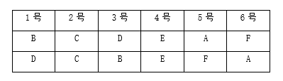

故正确答案为A。

---

## 第 33 题　qid 12019766 · 逻辑判断

某校举办演讲比赛，琪琪、依依、冰冰、鑫鑫、磊磊、静静6人均获了奖，其中一等奖1人，二等奖2人，三等奖3人。已知：
(1)除非琪琪获得二等奖，否则冰冰获得一等奖；
(2)只有鑫鑫获得三等奖且静静获得二等奖，琪琪和依依才能至少有一人获得二等奖；
(3)如果鑫鑫获得三等奖，那么冰冰获得二等奖，且依依不是三等奖。
根据上述信息，以下哪项一定为真？

- **A**. 冰冰未获得一等奖
- **B**. 琪琪获得二等奖
- **C**. 鑫鑫未获得一等奖　✅
- **D**. 磊磊获得三等奖

**答案**：C

**官方解析**

第一步：分析题干条件。

①冰冰获得一等奖琪琪获得二等奖；

②琪琪获得二等奖 或 依依获得二等奖鑫鑫获得三等奖 且 静静获得二等奖；

③鑫鑫获得三等奖冰冰获得二等奖 且 依依获得三等奖；

④6人均获奖，其中一等奖1人，二等奖2人，三等奖3人。

第二步：根据题干条件进行推理。

①②③可以递推出⑤：冰冰获得一等奖琪琪获得二等奖鑫鑫获得三等奖 且 静静获得二等奖冰冰获得二等奖 且 依依获得三等奖。

此时，假设“冰冰获得一等奖”成立，则可得出“琪琪获得二等奖 且 静静获得二等奖 且 冰冰获得二等奖”，和条件④“二等奖2人”自相矛盾，所以假设的“冰冰获得一等奖”不成立，即冰冰获得一等奖。

结合条件④“一等奖1人，二等奖2人，三等奖3人”，其中冰冰获得一等奖，所以其他人都未获得一等奖，C项一定为真。

故正确答案为C。

---

## 第 34 题　qid 12019770 · 类比推理

下列诗句中描述的两者逻辑关系，与“但使龙城飞将在，不教胡马度阴山”中“龙城飞将在”与“胡马度阴山”关系一致的是：

- **A**. “黄沙百战穿金甲，不破楼兰终不还”中“破楼兰”与“还”
- **B**. “问渠那得清如许？为有源头活水来”中“清如许”与“源头活水来”
- **C**. “不畏浮云遮望眼，自缘身在最高层”中“浮云遮望眼”与“身在最高层”
- **D**. “若非群玉山头见，会向瑶台月下逢”中“群玉山头见”与“瑶台月下逢”　✅

**答案**：D

**官方解析**

第一步：分析题干推理形式。

题干诗句可翻译为：龙城飞将在（A）不教胡马度阴山（B），所以“龙城飞将在”与“胡马度阴山”的推理形式为：有A没B，包含二者不共存的情况。

第二步：逐一分析选项。

A项：诗句可翻译为：不破楼兰（A）不还（B），所以“破楼兰”与“还”的推理形式为：没A没B，与题干推理形式不同，排除；

B项：诗句可翻译为：清如许（A）是因为源头活水来（B），所以“清如许”与“源头活水来”的推理形式为：A是因为B，与题干推理形式不同，排除；

C项：诗句可翻译为：不畏浮云遮望眼（A）是因为身在最高层（B），所以“浮云遮望眼”与“身在最高层”的推理形式为：A是因为B，与题干推理形式不同，排除；

D项：诗句可翻译为：非群玉山头见（A）瑶台月下逢（B），所以“群玉山头见”与“瑶台月下逢”的推理形式为：没A有B，包含二者不共存的情况，与题干推理形式相同，当选。

故正确答案为D。

---

## 第 35 题　qid 12019767 · 逻辑判断

穗行数指玉米果穗上籽粒的行数。近日，有自媒体称，可以通过观察穗行数来判断玉米是否为转基因产品：从玉米底部看穗行数，正好12行的是非转基因玉米，多于12行的就是转基因玉米。
以下哪项如果为真，不能反驳该自媒体的观点？

- **A**. 调控玉米产量性状的过程非常复杂，当前技术难以通过转基因改变玉米穗行数
- **B**. 转基因玉米转入的基因一般为抗虫、抗倒、抗旱、耐涝相关基因，不会影响玉米外观
- **C**. 穗行数性状受到遗传和环境等多重因素影响，同一品种在不同单株之间也存在穗行数波动
- **D**. 玉米穗行数由其遗传基因决定，玉米穗轴上的小花是成对排列的，因此玉米穗行数始终为双数　✅

**答案**：D

**官方解析**

第一步：找出论点和论据。
论点：从玉米底部看穗行数，正好12行的是非转基因玉米，多于12行的就是转基因玉米。
论据：无。
本题论点讨论的是通过观察玉米穗行数是否超过12行来判断是否为转基因玉米，只有论点没有论据，本题为选非题，排除能削弱的选项即可。
第二步：逐一分析选项。
A项：该项指出当前技术难以通过转基因改变玉米穗行数，说明转基因不会影响玉米穗行数，即不能通过观察玉米穗行数来判断是否为转基因玉米，可以削弱，排除；
B项：该项指出转基因玉米转入的基因不影响玉米外观，说明转基因不会改变玉米穗行数，即不能通过观察玉米穗行数来判断是否为转基因玉米，可以削弱，排除；
C项：该项指出穗行数受多重因素影响，即使同一品种在不同单株之间也存在穗行数波动，说明穗行数不能作为判断依据，即不能通过观察玉米穗行数来判断是否为转基因玉米，可以削弱，排除；
D项：该项指出玉米穗行数由遗传基因决定且始终为双数，但并没有说明转基因是否会影响玉米穗行数，与论点讨论的通过观察玉米穗行数是否超过12行来判断是否为转基因玉米无关，为无关项，无法削弱，当选。
本题为选非题，故正确答案为D。

---

## 第 36 题　qid 12019776 · 逻辑判断

动物毛发的自我更新和生长依赖于毛囊干细胞的周期性增殖和分化，年龄增长会使毛囊干细胞变僵硬，妨碍毛发再生。近日有研究发现，当毛囊干细胞中由肌动球蛋白组成的细胞骨架软化时，细胞会膨大并发生一系列反应，成功促使老龄小鼠毛发再生。因此，增强毛囊干细胞中微核糖核酸分子miR-205的表达可使细胞软化并促进毛发生长。
上述结论的成立需要补充以下哪项作为前提?

- **A**. miR-205影响着毛发的软硬程度
- **B**. 可以通过基因手段增强miR-205表达
- **C**. miR-205能抑制毛囊干细胞增殖和分化
- **D**. miR-205对软化细胞骨架起着重要作用　✅

**答案**：D

**官方解析**

第一步：找出论点和论据。
论点：增强毛囊干细胞中微核糖核酸分子miR-205的表达可使细胞软化并促进毛发生长。
论据：当毛囊干细胞中由肌动球蛋白组成的细胞骨架软化时，细胞会膨大并发生一系列反应，成功促使老龄小鼠毛发再生。
本题论点讨论的是“miR-205”和“细胞软化促进毛发生长”之间的关系，论据讨论的是“细胞骨架软化”和“毛发再生”之间的关系，二者话题不一致，加强优先考虑搭桥，即在“miR-205”与“细胞骨架软化”之间建立联系。
第二步：逐一分析选项。
A项：该项指出miR-205影响着毛发的软硬程度，但是不明确毛发的软硬程度和毛发生长之间的关系，属于不明确选项，无法加强，排除；
B项：该项强调可以通过基因手段增强miR-205表达，但是不明确增强miR-205表达后能否让细胞骨架软化并促进毛发生长，属于不明确选项，无法加强，排除；
C项：该项指出miR-205能抑制毛囊干细胞增殖和分化，毛囊干细胞增殖和分化的功能被抑制，有可能不利于细胞骨架软化和毛发生长，有削弱力度，无法加强，排除；
D项：该项指出miR-205对软化细胞骨架起着重要作用，即在“miR-205”与“细胞骨架软化”之间建立了联系，属于搭桥项，可以加强，当选。
故正确答案为D。

---

## 第 37 题　qid 12019769 · 逻辑判断

1970年联合国教科文组织规定，自1970年以后，凡是通过非法渠道从一些国家走私文物的，一经查明，就要无条件退还。我国文物主要是在清末和民国时期流失，不符合“1970年以后”的条件；且时过境迁，文物几经转手，哪个环节属于合法收购，哪些属于战争掠夺，异国博物馆收购时是否合法等，早已没有清晰的证据链；再加上部分国家的博物馆傲慢无礼，极大地增加了追索难度。因此，跨境文物追索几乎是不可能完成的任务。
以下哪项如果为真，最能质疑上述观点?

- **A**. 除了按照国际公约，还可通过条约、协议等其他方法来追索流失文物　✅
- **B**. 历史上，文物的大规模流失源自于数百年来不公正的国际政治经济秩序
- **C**. 按国际公约精神和伦理道德原则解决文物归属争议纠纷有很大局限性
- **D**. 从全球范围来看，文物走私是仅次于毒品走私和武器走私的第三大非法贸易

**答案**：A

**官方解析**

第一步：找出论点和论据。
论点：跨境文物追索几乎是不可能完成的任务。
论据：1970年联合国教科文组织规定，自1970年以后，凡是通过非法渠道从一些国家走私文物的，一经查明，就要无条件退还。我国文物主要是在清末和民国时期流失，不符合“1970年以后”的条件；且时过境迁，文物几经转手，哪个环节属于合法收购，哪些属于战争掠夺，异国博物馆收购时是否合法等，早已没有清晰的证据链；再加上部分国家的博物馆傲慢无理，极大地增加了追索难度。
本题论据讨论的是跨境文物追索的难点，论点是基于这些难点得出“跨境文物追索几乎是不可能完成的任务”的结论，通过论据可以合理得到论点，因此二者话题一致，削弱优先考虑削弱论点。
第二步：逐一分析选项。
A项：该项指出除了按照国际公约，还可通过条约、协议等其他方法来追索流失文物，说明还有其他方法可以跨境追索文物，削弱论点，可以削弱，当选；
B项：该项指出历史上文物大规模流失的原因，与论点讨论的跨境文物追索是否有可能完成无关，无关项，无法削弱，排除；
C项：该项指出按国际公约精神和伦理道德原则解决文物归属争议纠纷有很大局限性，但并没有说明是否还有其他方法可以解决文物归属争议纠纷，不明确选项，无法削弱，排除；
D项：该项指出文物走私是仅次于毒品走私和武器走私的第三大非法贸易，与论点讨论的跨境文物追索是否有可能完成无关，无关项，无法削弱，排除。
故正确答案为A。

---

## 第 38 题　qid 12019778 · 逻辑判断

人类的大脑在进化的过程中，发展出了一套完全不以逻辑推理、仅仅耗费少量心理资源就能迅速作出决策的决策系统。该系统有助于人类祖先在纷繁复杂的外部环境中迅速作出对自身和种群生存有利的决策，人类的情绪在这个过程中扮演了重要角色。与依靠逻辑规则的理性分析相比，我们对刺激所产生的情绪反应更加迅速，这种即时的情绪反应有助于我们更加快速地规避风险。因此，任何情绪反应对人来说都是有意义的。
以下哪项如果为真，不能支持上述结论？

- **A**. 情绪反应的是内心的需求，每一种情绪都有其价值
- **B**. 许多疾病都与情绪相关，坏情绪直接损害人的健康　✅
- **C**. 大脑在决策时进行理性分析，会耗费大量的能量和时间
- **D**. 不被我们喜欢的负面情绪是在提示风险，有利于人的生存

**答案**：B

**官方解析**

第一步：找出论点和论据。
论点：任何情绪反应对人来说都是有意义的。
论据：与依靠逻辑规则的理性分析相比，我们对刺激所产生的情绪反应更加迅速，这种即时的情绪反应有助于我们更加快速地规避风险。
本题论点和论据都在讨论情绪反应是有意义的，话题一致，加强优先考虑补充论据。本题为选非题，排除三个能够加强的选项即可。
第二步：逐一分析选项。
A项指出每一种情绪都有其价值，直接补充论据，可以加强，排除；
B项指出疾病与情绪的关系，而论点和论据讨论的是情绪反应有助于更快地规避风险以及情绪反应有意义，话题不一致，无法加强，当选；
C项指出理性分析会耗费大量能量和时间，说明情绪反应耗时更短更快速，补充论据，可以加强，排除；
D项指出即使是负面情绪也是有意义的，补充论据，可以加强，排除。
本题为选非题，故正确答案为B。

---

## 第 39 题　qid 12019772 · 逻辑判断

当人体摄入过多的蛋白质时，肾脏必须更加努力工作以清除额外产生的含氮废物。长此以往可能会导致肾小球滤过率升高，从而增加肾脏的工作负担，加速肾脏损伤。因此有人认为，健身人群长期喝蛋白粉会伤肾。
以下哪项如果为真，最能反驳上述观点？

- **A**. 熬夜、劳累、高油高盐饮食等是导致肾病的主要原因
- **B**. 运动会使肌肉纤维发生损伤，需要更多蛋白质来修复　✅
- **C**. 比起欧美国家，我国人均每日蛋白质摄入量要低不少
- **D**. 研究表明，喝蛋白粉与其他摄入蛋白质方式无明显区别

**答案**：B

**官方解析**

第一步：找出论点和论据。
论点：健身人群长期喝蛋白粉会伤肾。
论据：当人体摄入过多的蛋白质时，肾脏必须更加努力工作以清除额外产生的含氮废物。长此以往可能会导致肾小球滤过率升高，从而增加肾脏的工作负担，加速肾脏损伤。
本题论点和论据都在讨论喝蛋白粉会伤肾，二者话题一致，削弱优先考虑削弱论点。
第二步：逐一分析选项。
A项：指出熬夜、劳累、高油高盐饮食等是导致肾病的主要原因，没有提及喝蛋白粉和肾病的关系，与论点讨论的健身人群长期喝蛋白粉会伤肾的话题不一致，无关选项，无法削弱，排除；
B项：指出运动会使肌肉纤维发生损伤，需要更多蛋白质来修复，说明健身人群本身就需要摄入更多的蛋白质，喝蛋白粉不会给肾脏增加工作负担，也就不会伤肾，削弱论点，可以削弱，当选；
C项：指出我国比欧美国家人均每日蛋白质摄入量要低，与论点讨论的健身人群长期喝蛋白粉会伤肾的话题不一致，无关选项，无法削弱，排除；
D项：指出喝蛋白粉与其他摄入蛋白质方式无明显区别，只是在对比蛋白质摄入方式，没有提及和肾病的关系，与论点讨论的健身人群长期喝蛋白粉会伤肾的话题不一致，无关选项，无法削弱，排除。
故正确答案为B。

---

## 第 40 题　qid 12019775 · 类比推理

王妈妈：“我家孩子今天没写作业又被老师批评了。”
夏妈妈：“他今天不写作业，明天就不想上学，后天就会辍学走向犯罪，要好好教训一下了。”
下列对话中所犯的逻辑错误与题干最相似的是：

- **A**. 
小刘：“这款无糖奶茶，甜吗？”

店员：“无糖就是没放糖，你怕太甜就选这个。”

- **B**. 
小张：“应该适当减少塑料的使用，保护环境。”

小陈：“取消塑料使用会导致工厂停产，带来更大的危害。”

- **C**. 
小李：“我不太喜欢爬山，怕膝盖受力太大。”

小赵：“你不喜欢爬山，就是不爱大自然，就会错过生活中的美好。”
　✅
- **D**. 
小周：“我觉得神不存在，没有证据能证明神存在。”

小林：“钟表有构造有规律，是人造出来的；世界也有构造有规律，就一定是神造出来的。”

**答案**：C

**官方解析**

第一步：分析题干中的逻辑错误。
夏妈妈从“今天不写作业”推出“明天不想上学”，再推出“后天辍学走向犯罪”，这是一种夸大的连锁因果推论，缺乏合理依据，属于滑坡谬误。
第二步：逐一分析选项。
A项：小刘问“无糖奶茶甜吗”，关心的是口味，而店员回答“无糖就是没放糖”，没有直接回答是否甜，解释的是无糖奶茶的概念，但无糖奶茶可能含有除糖之外的其它甜味剂，属于概念混淆，与题干所犯逻辑错误不一致，排除；
B项：小张说“适当减少塑料的使用”，而小陈说“取消塑料使用会导致工厂停产”，小陈将小张说的“适当减少”夸大为“取消塑料使用”，即歪曲对方论点，然后攻击这个被歪曲的论点，属于稻草人谬误，与题干所犯逻辑错误不一致，排除；
C项：小赵从“不喜欢爬山”推出“不爱大自然”，再推出“错过美好”，这是一种夸大的连锁因果推论，缺乏合理依据，属于滑坡谬误，与题干所犯逻辑错误一致，当选；
D项：小周说“神不存在因为没有证据证明存在”，小林用钟表类比世界，认为世界有规律所以是神造的，属于类比不当，与题干所犯逻辑错误不一致，排除。
故正确答案为C。

---
