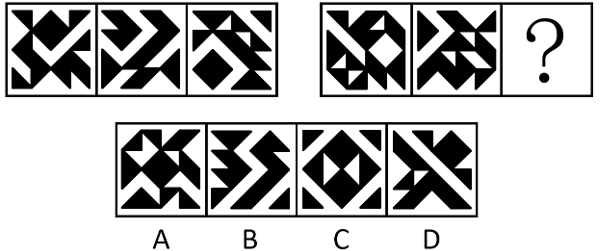
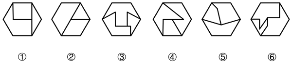
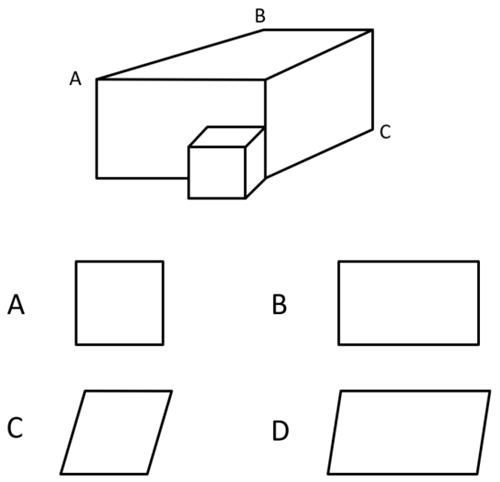
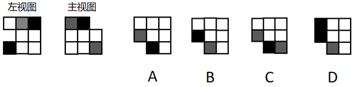

# 2026年海南省公务员录用考试《行测》题（网友回忆版）

> 判断推理 · 24 题 · 海南 2026

## 第 1 题　qid 16069886 · 图形推理

从所给的四个选项中，选择最合适的一个填入问号处，使之呈现一定规律性：

- **A**. A
- **B**. B　✅
- **C**. C
- **D**. D

**答案**：B

**官方解析**

元素组成相同，但无明显位置规律，也无明显属性规律，考虑数量规律。观察发现，题干图形均存在大面积黑块，且黑块有明显分堆，优先考虑黑白块的部分数。第一组图形中，黑块部分数依次为1、2、3，第二组前两幅图形的黑块部分数依次为1、2，故“？”处图形的黑块部分数应为3，只有B项符合。
故正确答案为B。

---

## 第 2 题　qid 16069776 · 图形推理

从所给的四个选项中，选择最合适的一个填入问号处，使之呈现一定规律性：

- **A**. A
- **B**. B
- **C**. C　✅
- **D**. D

**答案**：C

**官方解析**

元素组成不同，且无明显属性规律，考虑数量规律。观察发现，题干图形封闭面明显，优先考虑面数量。题干图形的面数量均为7，因此“？”处图形的面数量应为7，D项图形的面数量为8，排除。继续观察发现，题干图形内部均由直线和曲线构成，其中全直线面数量依次为5、4、3、2、1，呈递减规律，故“？”处图形的全直线面数量应为0，只有C项符合。
故正确答案为C。

---

## 第 3 题　qid 16069800 · 图形推理

以下哪两个图形交换位置之后，整个图形序列将呈现一定的规律性？

- **A**. ②和③
- **B**. ③和④
- **C**. ④和⑤
- **D**. ⑤和⑥　✅

**答案**：D

**官方解析**

解析一：元素组成不同，且无明显属性规律，考虑数量规律。观察发现，题干每幅图形的内部线条均与外框相交，且内部线条与外框的交点数均为3。继续观察发现，图①到图④的3个框上交点每次沿顺时针方向移动一个边，交换图⑤和图⑥后，六个图形交点移动规律连贯，对应D项。
解析二：元素组成不同，且无明显属性规律，考虑数量规律。观察发现，题干每幅图都是一个六边形被内部线条分割成3个面，其中有且只有一个面与外边框有3条边重合，观察这3条重合边，图①到图④的3条重合边每次沿顺时针方向移动一个边，交换图⑤和图⑥后，六个图形的3条重合边移动规律连贯，对应D项。
故正确答案为D。

---

## 第 4 题　qid 15833801 · 图形推理

经过A、B、C三点所截出的图形为：

- **A**. A
- **B**. B
- **C**. C
- **D**. D　✅

**答案**：D

**官方解析**

本题考查截面图。根据小正方体与大多面体的接触方式可发现，大多面体的e、f面的夹角为钝角，所以经过A、B、C三点不能截出矩形面，排除A、B项，再根据边的比例关系排除C项(截面如图1所示)。

故正确答案为D。

---

## 第 5 题　qid 16070128 · 图形推理

左下图为14个白色、2个灰色和2个黑色正方体组成的多面体的左视图和主视图，问哪一项可能是其正确的俯视图？（    ）

- **A**. A　✅
- **B**. B
- **C**. C
- **D**. D

**答案**：A

**官方解析**

本题考查三视图。根据主视图可知，该多面体的右上方没有正方体；根据左视图可知，该多面体的中后方没有正方体；根据所有选项俯视图可知，该多面体的左前方没有正方体，此时对于3×3×3形式的大立方体来说，该多面体应缺失9个小正方体。又已知该多面体有14个白色、2个灰色和2个黑色共计18个小正方体，故该多面体的其他位置均应存在小正方体。

结合左视图、主视图，可以确定符合要求的立体图形如下图所示。

立体图形对应的俯视图如下图所示，对应A项。

故正确答案为A。

---

## 第 6 题　qid 16070026 · 定义判断

情绪方言是特定文化或亚文化群体中形成的社会性情绪表达系统，其通过共享的符号规则、行为模式及认知框架，在群体内部传递、识别并规范情绪体验，具有地域性、传承性，且能与其他文化群体的情绪表达模式形成显著区分。
根据上述定义，下列不属于情绪方言的是（    ）。

- **A**. 北极圈某游牧部落的成员通过凝视积雪反光角度的细微变化，传递对猎物的敬畏等复杂情绪
- **B**. 某沙漠贸易群体在扎营时，用靴尖绘制族群特定沙纹图案表达情绪，如螺旋表交易诚意，折线表怀疑等
- **C**. 某海岛社群在集体捕鱼前吟唱特定旋律，代表对海洋风险的集体忧虑，而外来者常误以为是普通劳作号子
- **D**. 某公司业务分淡季、旺季，公司员工也逐渐形成了喝浓缩咖啡代表旺季工作压力大，喝奶茶代表淡季工作舒心的职场亚文化默契　✅

**答案**：D

**官方解析**

第一步：找出定义关键词。
“特定文化或亚文化群体中形成的社会性情绪表达系统”、“通过共享的符号规则、行为模式及认知框架，在群体内部传递、识别并规范情绪体验”、“具有地域性、传承性，且能与其他文化群体的情绪表达模式形成显著区分”。
第二步：逐一分析选项。
A项：北极圈某游牧部落的成员通过凝视积雪反光角度的细微变化传递复杂情绪，属于特定地域文化群体的符号化情绪表达，具有鲜明传承性和文化区分性，符合“特定文化或亚文化群体中形成的社会性情绪表达系统”、“通过共享的符号规则、行为模式及认知框架，在群体内部传递、识别并规范情绪体验”、“具有地域性、传承性，且能与其他文化群体的情绪表达模式形成显著区分”，符合定义，排除；
B项：某沙漠贸易群体用特定沙纹图案表达情绪，是群体内部共享的符号系统，具有地域性、传承性和文化特异性，符合“特定文化或亚文化群体中形成的社会性情绪表达系统”、“通过共享的符号规则、行为模式及认知框架，在群体内部传递、识别并规范情绪体验”、“具有地域性、传承性，且能与其他文化群体的情绪表达模式形成显著区分”，符合定义，排除；
C项：某海岛社群以吟唱特定旋律传递集体忧虑，是群体内部传承的情绪表达模式，外来者难以理解，体现文化区分性，符合“特定文化或亚文化群体中形成的社会性情绪表达系统”、“通过共享的符号规则、行为模式及认知框架，在群体内部传递、识别并规范情绪体验”、“具有地域性、传承性，且能与其他文化群体的情绪表达模式形成显著区分”，符合定义，排除；
D项：某公司员工以饮品习惯隐喻工作压力，虽是职场亚文化中的情绪默契，但缺乏地域性、传承性及显著的文化区分特征，更接近临时性、情境化的职场习惯，不符合“具有地域性、传承性，且能与其他文化群体的情绪表达模式形成显著区分”，不符合定义，当选。
本题为选非题，故正确答案为D。

---

## 第 7 题　qid 16070062 · 定义判断

环境福利绩效是衡量经济活动主体在实现经济目标过程中，对生态环境带来积极影响程度的综合指标。它涵盖资源利用效率、污染减排成效、生态系统保护成果等多个维度，评估在获取经济收益的同时，为生态环境创造的福利增值，旨在全面反映经济活动对环境改善的贡献，以推动可持续发展模式的构建。
根据上述定义，下列不属于环境福利绩效的是（    ）。

- **A**. 某大型企业在塌陷区铺设光伏板，年发电4.8亿度，与此同时还雇佣了300名失业矿工担任运维人员
- **B**. 某企业车队将车辆全部更换为纯电动车，虽然因购车支出挤占培训经费3亿元，但同时可降低碳排放15%
- **C**. 某市划拨经费改造透水路面等生态设施，大大降低了内涝发生率，同时减少排水管网维修支出1.2亿元/年　✅
- **D**. 某钢铁厂将余热接入市政供暖，替代燃煤锅炉，减少PM2.5排放41%，覆盖区域冬季呼吸道疾病就诊量下降29%

**答案**：C

**官方解析**

第一步：找出定义关键词。
“在实现经济目标过程中”、“对生态环境带来积极影响”。
第二步：逐一分析选项。
A项：某大型企业在塌陷区铺设光伏板以此发电，符合“在实现经济目标过程中”，光伏是清洁能源，减少了化石能源的使用，同时塌陷区得到开发利用，符合“对生态环境带来积极影响”，符合定义，排除；
B项：某企业车队将车辆全部更换为纯电动车，符合“在实现经济目标过程中”，降低碳排放15%，符合“对生态环境带来积极影响”，符合定义，排除；
C项：某市划拨经费改造透水路面等生态设施，属于城市公共基础设施与生态治理工程，并非经济活动主体追求经济目标的行为，不符合“在实现经济目标过程中”，不符合定义，当选；
D项：某钢铁厂将余热接入市政供暖，符合“在实现经济目标过程中”，减少PM2.5排放41%，符合“对生态环境带来积极影响”，符合定义，排除。
本题为选非题，故正确答案为C。

---

## 第 8 题　qid 16069992 · 定义判断

人口粘性是以人口迁移惰性与地理空间稳定性为核心特征的社会地理现象，指特定区域内居民因资源依赖、社会交往、文化认同或制度约束等因素，形成对原居地的长期驻留倾向，抑制人口外迁动力，从而维持或强化区域人口规模与结构稳定性。
根据上述定义，下列属于人口粘性的是（    ）。

- **A**. 老刘退休后搬迁至深圳和子女一起生活，但每年清明节都会返乡扫墓
- **B**. 在上海打工的赵某十年来一直租住在房租低廉的城中村，虽然日均通勤3小时，但仍不打算迁离
- **C**. 山东农户李某每年冬季赴海南种植反季瓜菜，春季返乡务农，虽然每年往返，但多了一份额外收入
- **D**. 煤矿工人孙某因国企改制获得矿区住房产权，子女教育依托企业附属学校，尽管薪资偏低仍拒绝南下务工　✅

**答案**：D

**官方解析**

第一步：找出定义关键词。
“资源依赖、社会交往、文化认同或制度约束”、“对原居地的长期驻留倾向”。
第二步：逐一分析选项。
A项：老刘退休后搬去深圳，每年清明节返乡扫墓，说明老刘已经搬走、定居外地，只是偶尔回去，不符合“对原居地的长期驻留倾向”，不符合定义，排除；
B项：赵某在上海城中村租房，说明赵某并非长期驻留原居地，不符合“对原居地的长期驻留倾向”，不符合定义，排除；
C项：李某冬季去海南，春季回山东务农，说明李某并非长期驻留原居地，不符合“对原居地的长期驻留倾向”，不符合定义，排除；
D项：孙某有矿区住房产权、子女在企业附属学校上学，薪资低也不南下，说明是对矿区住房产权及子女企业附属学校有资源依赖，符合“资源依赖、社会交往、文化认同或制度约束”，且薪资偏低也拒绝南下，说明确实存在长期驻留倾向，符合“对原居地的长期驻留倾向”，符合定义，当选。
故正确答案为D。

---

## 第 9 题　qid 16069978 · 定义判断

种间互作是一种以跨物种直接或间接影响为核心特征的生态学现象，不同物种通过竞争、捕食、互利共生等关系，在资源利用、空间分配或生理功能上产生动态关联，驱动群落结构演化、物种适应性分化及生态系统功能维持，其作用机制可表现为促进、抑制或协同进化。
根据上述定义，下列属于种间互作的是（    ）。

- **A**. 一西伯利亚狼群中的两只公狼因争夺头狼地位发生争斗，导致群体内部等级重构
- **B**. 酸雨导致土壤pH值下降，间接影响蚯蚓与植物根系之间通过养分循环的共生关系
- **C**. 旱季来临，持续的干旱导致塞伦盖蒂草原的羚羊与斑马同时向植物茂盛的水源地迁徙
- **D**. 兔子感染某类寄生虫后行动迟缓更易被郊狼捕食，郊狼继而成为了寄生虫的新宿主，该类寄生虫由此提高了传播效率　✅

**答案**：D

**官方解析**

第一步：找出定义关键词。
“跨物种直接或间接影响”、“不同物种”、“竞争、捕食、互利共生等关系”、“资源利用、空间分配或生理功能上产生动态关联”、“驱动群落结构演化、物种适应性分化及生态系统功能维持”。
第二步：逐一分析选项。
A项：西伯利亚狼群中的两只公狼属于同一物种，不符合“不同物种”，不符合定义，排除；
B项：酸雨导致土壤pH值下降，间接影响蚯蚓与植物的共生关系，是外在环境因素对这两个物种的关系产生了影响，并非物种之间的直接或间接相互作用，不符合“跨物种直接或间接影响”、“资源利用、空间分配或生理功能上产生动态关联”、“驱动群落结构演化、物种适应性分化及生态系统功能维持”，不符合定义，排除；
C项：羚羊与斑马同时向植物茂盛的水源地迁徙，是受干旱环境影响的被动行为，并非物种之间的直接或间接相互作用，不符合“跨物种直接或间接影响”、“资源利用、空间分配或生理功能上产生动态关联”、“驱动群落结构演化、物种适应性分化及生态系统功能维持”，不符合定义，排除；
D项：兔子、寄生虫、郊狼，符合“不同物种”，寄生虫感染兔子使得兔子更易被郊狼捕食，郊狼捕食兔子后成为寄生虫新宿主提升了寄生虫的传播效率，符合“跨物种直接或间接影响”、“竞争、捕食、互利共生等关系”、“资源利用、空间分配或生理功能上产生动态关联”、“驱动群落结构演化、物种适应性分化及生态系统功能维持”，符合定义，当选。
故正确答案为D。

---

## 第 10 题　qid 16069983 · 定义判断

差错导向是指个体对错误本身以及应对错误方式的主观看法，差错掩盖导向指个体出于自我形象或短期利益的维护而产生对负面评价或惩罚的恐惧，倾向于通过否认、隐藏或推卸责任等方式掩盖错误，避免他人察觉。差错学习导向指个体以开放的心态将错误视为改进机会，主动反思错误原因、总结经验并积极调整行为以实现自我提升。
根据上述定义，下列属于差错学习导向的是（    ）。

- **A**. 某餐厅食材变质导致多名顾客食物中毒，餐厅经理把原因归结为“厨师与采购沟通不足，导致食材新鲜度不达标”
- **B**. 某三甲医院建立“无惩罚差错上报系统”，医护人员可匿名分享失误案例以供全院学习　✅
- **C**. 小赵在考试失利后大量刷题，但拒绝分析错题原因导致相同知识点反复出错
- **D**. 某企业宣称“已从用户数据泄露事件中汲取教训”，但并未升级安全系统

**答案**：B

**官方解析**

第一步：找出定义关键词。
差错导向：“个体对错误本身以及应对错误方式”、“主观看法”；
差错掩盖导向：“个体出于自我形象或短期利益的维护”、“对负面评价或惩罚的恐惧”、“通过否认、隐藏或推卸责任等方式掩盖错误”、“避免他人察觉”；
差错学习导向：“个体以开放的心态将错误视为改进机会”、“主动反思并积极调整行为”、“以实现自我提升”。
第二步：逐一分析选项。
A项：餐厅经理将中毒事件简单归咎于沟通不足，未主动反思问题根源、未总结经验、未采取改进措施，不符合“主动反思并积极调整行为”、“以实现自我提升”，不符合“差错学习导向”定义，排除；
B项：医院建立无惩罚差错上报系统，医护人员可匿名分享失误案例以供学习，符合“个体以开放的心态将错误视为改进机会”、“主动反思并积极调整行为”、“以实现自我提升”，符合“差错学习导向”定义，当选；
C项：小赵拒绝分析错题原因，不符合“主动反思并积极调整行为”，不符合“差错学习导向”定义，排除；
D项：企业未升级安全系统，不符合“主动反思并积极调整行为”，不符合“差错学习导向”定义，排除。
故正确答案为B。

---

## 第 11 题　qid 16069990 · 定义判断

解构式技能重组是一种主动的学习策略，指学习者为突破复杂技能的学习瓶颈，有意识地将目标技能分解为若干个独立的、可单独训练的核心子模块，然后对这些子模块进行高强度的专项练习，待各模块熟练后，再将其重新整合，最终实现对整体技能的精通。
根据上述定义，下列属于解构式技能重组的是（    ）。

- **A**. 某厨师学徒严格按照菜谱，从食材处理到火候掌握一步步学习制作一道新派融合菜，最终成功复刻了这道菜肴
- **B**. 小赵为准备一场重要演讲，将自己以往演讲中反响最好的几个案例和金句进行重新编排和串联，形成了一套全新的演讲稿
- **C**. 为提高百米自由泳成绩，某游泳运动员聘请体能师进行为期三个月的核心力量与腿部爆发力专项训练，有效增强划水与打腿效果
- **D**. 小高为提升篮球突破能力，认真练习了变向运球、篮下脚步和非惯用手上篮动作，并在对抗训练中流畅组合运用，得分效率大增　✅

**答案**：D

**官方解析**

第一步：找出定义关键词。
“学习者为突破复杂技能的学习瓶颈”、“将目标技能分解为若干个独立的、可单独训练的核心子模块”、“对这些子模块进行高强度的专项练习”、“各模块熟练后，再将其重新整合”、“最终实现对整体技能的精通”。
第二步：逐一分析选项。
A项：厨师学徒严格按照菜谱，从食材处理到火候掌握一步步学习，是按流程顺序模仿学习，并非将复杂技能分解、专项训练再整合，不符合“将目标技能分解为若干个独立的、可单独训练的核心子模块”、“对这些子模块进行高强度的专项练习”、“各模块熟练后，再将其重新整合”，不符合定义，排除；
B项：小赵只是将以往演讲中反响最好的几个案例和金句重新编排和串联，仅是对内容的重组，并非对演讲技能进行分解、专项训练再整合，不符合“将目标技能分解为若干个独立的、可单独训练的核心子模块”、“对这些子模块进行高强度的专项练习”、“各模块熟练后，再将其重新整合”，不符合定义，排除；
C项：游泳运动员进行了核心力量与腿部爆发力的专项训练后，有效增强划水与打腿效果，但未体现两个模块的整合，不符合“各模块熟练后，再将其重新整合”，不符合定义，排除；
D项：小高以篮球突破这一整体技能为目标，将其拆解为变向运球、篮下脚步、非惯用手上篮动作3个独立可训练的核心子模块，认真练习后，在对抗训练中流畅组合运用，得分效率大增，符合“学习者为突破复杂技能的学习瓶颈”、“将目标技能分解为若干个独立的、可单独训练的核心子模块”、“对这些子模块进行高强度的专项练习”、“各模块熟练后，再将其重新整合”、“最终实现对整体技能的精通”，符合定义，当选。
故正确答案为D。

---

## 第 12 题　qid 16069973 · 定义判断

分权时序是指政府或组织在权力分配过程中，依据特定逻辑，分阶段、按顺序逐步下放权力的策略，其核心逻辑是通过“时序规划”降低分权风险，确保权力下放与承接能力、管理成熟度相匹配。
根据上述定义，下列属于分权时序的是：

- **A**. 某企业市场部根据产品推广计划安排不同地区的促销活动时间
- **B**. 某政府部门在公共设施建设中，根据项目进度和资金安排分阶段推进不同区域的设施建设
- **C**. 某公司研发团队在产品研发过程中，根据项目进度安排团队不同成员的工作任务和时间顺序
- **D**. 某矿区开展生态修复项目时，地方政府优先赋予矿区环境监管权，但未同步下放排污费征收权　✅

**答案**：D

**官方解析**

第一步：找出定义关键词。
“政府或组织在权力分配过程中”、“分阶段、按顺序逐步下放权力”。
第二步：逐一分析选项。
A项：某企业市场部根据产品推广计划安排不同地区的促销活动时间，属于工作时间安排，没有体现权力分配与下放权力，不符合“政府或组织在权力分配过程中”、“分阶段、按顺序逐步下放权力”，不符合定义，排除；
B项：某政府部门根据项目进度和资金安排分阶段推进公共设施建设，属于项目建设推进，没有体现权力分配与下放权力，不符合“政府或组织在权力分配过程中”、“分阶段、按顺序逐步下放权力”，不符合定义，排除；
C项：某公司研发团队根据项目进度安排成员工作任务和时间顺序，属于工作分工与进度安排，没有体现权力分配与下放权力，不符合“政府或组织在权力分配过程中”、“分阶段、按顺序逐步下放权力”，不符合定义，排除；
D项：地方政府优先赋予矿区环境监管权，未同步下放排污费征收权，体现权力分配与下放权力，符合“政府或组织在权力分配过程中”、“分阶段、按顺序逐步下放权力”，符合定义，当选。
故正确答案为D。

---

## 第 13 题　qid 15833802 · 类比推理

瑟：磬

- **A**. 针灸：推拿　✅
- **B**. 书法：茶道
- **C**. 鲁班：庖丁
- **D**. 梨园：杏坛

**答案**：A

**官方解析**

第一步：判断题干词语间逻辑关系。
瑟是一种中国古代汉族弹拨乐器；磬是一种中国古代汉族石制打击乐器，二者属于同一类别下的两种事物，构成并列关系。
第二步：判断选项词语间逻辑关系。
A项：针灸和推拿是两种不同的中医传统疗法，二者属于同一类别下的两种事物，与题干逻辑关系一致，当选；
B项：书法特指用毛笔写汉字的艺术，茶道指通过沏茶、品茶以及相关的礼节来陶冶性情的饮茶技艺，二者不属于同一类别的不同事物，与题干逻辑关系不一致，排除；
C项：庖丁泛指厨师，与鲁班不是并列关系，与题干逻辑关系不一致，排除；
D项：梨园为戏院或戏曲界的别称；杏坛原指孔子聚徒讲学之处，后泛称教育场所，二者不属于同一类别的不同事物，与题干逻辑关系不一致，排除。
故正确答案为A。

---

## 第 14 题　qid 16069769 · 类比推理

江山：画卷

- **A**. 琴弦：心声
- **B**. 节气：农事
- **C**. 火药：军事
- **D**. 春雨：甘露　✅

**答案**：D

**官方解析**

第一步：判断题干词语间逻辑关系。
江山可以被比喻为画卷，二者为比喻象征义。
第二步：判断选项词语间逻辑关系。
A项：琴弦是传递心声的工具，二者不是比喻象征义，与题干逻辑关系不一致，排除；
B项：农事活动依据节气，二者为依据对应关系，与题干逻辑关系不一致，排除；
C项：火药可用于军事领域，二者为应用领域对应关系，与题干逻辑关系不一致，排除；
D项：春雨可以被比喻为甘露，二者为比喻象征义，与题干逻辑关系一致，当选。
故正确答案为D。

---

## 第 15 题　qid 17467572 · 类比推理

暴雨：洪水预警：加高堤坝

- **A**. 地震：余震监测：稳固房屋　✅
- **B**. 旱灾：人工降雨：水库蓄水
- **C**. 台风：航线取消：航班延误
- **D**. 寒潮：供暖启动：道路结冰

**答案**：A

**官方解析**

第一步：判断题干词语间逻辑关系。
洪水预警是暴雨发生以后的监控手段，加高堤坝是防灾措施。
第二步：判断选项词语间逻辑关系。
A项：余震监测是地震发生以后的监控手段，稳固房屋是防灾措施，与题干逻辑关系一致，当选；
B项：人工降雨不是旱灾发生以后的监控手段，与题干逻辑关系不一致，排除；
C项：航线取消不是台风发生以后的监控手段，与题干逻辑关系不一致，排除；
D项：供暖启动不是寒潮发生以后的监控手段，与题干逻辑关系不一致，排除。
故正确答案为A。

---

## 第 16 题　qid 15833805 · 类比推理

故事：寓言：格言

- **A**. 地形：平原：山地
- **B**. 住宅：别墅：厂房　✅
- **C**. 钟表：指针：发条
- **D**. 地区：盆地：山川

**答案**：B

**官方解析**

第一步：判断题干词语间逻辑关系。
寓言是假托故事说明道理或教训的文学作品，寓言是故事，第二词与第一词构成种属关系；格言是可作为行为准则、蕴含教育意义的精练定型语句，格言不是故事，第三词与第一词构成反向种属关系。
第二步：判断选项词语间逻辑关系。
A项：平原和山地都是地形，后两词与第一词均构成种属关系，与题干逻辑关系不一致，排除；
B项：别墅是住宅，第二词与第一词构成种属关系；厂房不是住宅，第三词与第一词构成反向种属关系，与题干逻辑关系一致，当选；
C项：指针和发条都是钟表的组成部分，后两词与第一词均构成组成关系，与题干逻辑关系不一致，排除；
D项：盆地是地形，不是地区，第二词与第一词构成反向种属关系，与题干逻辑关系不一致，排除。
故正确答案为B。

---

## 第 17 题　qid 16070051 · 类比推理

移动支付 对于 （    ） 相当于 （    ） 对于 资源优化

- **A**. 手机操作；平台运营
- **B**. 远程购物；通讯网络
- **C**. 便捷交易；共享单车　✅
- **D**. 电子支付；汽车租赁

**答案**：C

**官方解析**

逐一代入选项。
A项：移动支付需要通过手机操作实现，二者为条件对应关系；平台运营实现了资源优化，二者为方式与结果对应关系，前后逻辑关系不一致，排除；
B项：远程购物需要通过移动支付实现，二者为条件对应关系；通讯网络与资源优化没有必然关联，前后逻辑关系不一致，排除；
C项：移动支付实现了便捷交易，共享单车实现了资源优化，二者均为方式与结果对应关系，前后逻辑关系一致，当选；
D项：移动支付是电子支付的一种，二者为种属关系；汽车租赁实现了资源优化，二者为方式与结果对应关系，前后逻辑关系不一致，排除。
故正确答案为C。

---

## 第 18 题　qid 16069773 · 类比推理

（    ） 对于 轨道 相当于 候鸟 对于 （    ）

- **A**. 卫星；迁徙路线　✅
- **B**. 车道；大雁
- **C**. 汽车；湿地公园
- **D**. 马路；丹顶鹤

**答案**：A

**官方解析**

逐一代入选项。
A项：卫星沿着轨道运行，二者是主体与运动轨迹的对应关系；候鸟沿着迁徙路线飞行，二者是主体与运动轨迹的对应关系，前后逻辑关系一致，当选；
B项：车道和轨道是两种不同的道路设施，二者是并列关系；大雁是一种候鸟，二者是种属关系，前后逻辑关系不一致，排除；
C项：某些特殊的轨道汽车可以在轨道上行驶，二者是主体与运动轨迹的对应关系；湿地公园是候鸟的栖息地，二者是地点的对应关系，前后逻辑关系不一致，排除；
D项：马路和轨道是两种不同的道路设施，二者是并列关系；丹顶鹤是一种候鸟，二者是种属关系，前后逻辑关系不一致，排除。
故正确答案为A。

---

## 第 19 题　qid 16069794 · 逻辑判断

某大学研发的B系列首颗卫星B-1正常在轨运行时间达到了其设计寿命。但是，第二批3颗B系列卫星（B-2/3/4）仅运行2个月便坠入大气层，远低于其设计寿命。对于B系列卫星在轨寿命短的原因，有研究人员认为B-1发射于2021年，整体处于太阳活动周的上升初期，空间天气水平相对较低；而B-2/3/4发射于2024年，其运行期间处于太阳活动高年，空间天气急剧增强，导致B系列卫星寿命缩短。但也有科学家认为，低轨大气密度大幅增加引发了B-2/3/4卫星的加速陨落。
以下哪项如果为真，最能质疑上述科学家的观点？

- **A**. 空间天气的急剧增强会导致低轨大气密度大幅度增加　✅
- **B**. 低轨大气密度增加会对卫星产生阻力，使卫星轨道高度衰减
- **C**. 太阳活动在上升期、峰值期和下降期的太阳辐射指数不同
- **D**. 低轨大气密度受到地磁活动和地球自转、公转等因素影响

**答案**：A

**官方解析**

第一步：找出论点和论据。
论点：低轨大气密度大幅增加引发了B-2/3/4卫星的加速陨落。
论据：无。
本题只有论点没有论据，削弱优先考虑削弱论点，即说明卫星的加速陨落并非由低轨大气密度大幅增加导致的。
第二步：逐一分析选项。
A项：该项说的是空间天气的急剧增强会导致低轨大气密度大幅度增加，即导致B-2/3/4卫星加速陨落的根本原因是空间天气的急剧增强，而非低轨大气密度大幅增加，削弱论点，可以削弱，当选；
B项：该项说的是低轨大气密度增加会对卫星产生阻力，使卫星轨道高度衰减，解释了低轨大气密度增加如何导致卫星加速陨落，为加强项，无法削弱，排除；
C项：该项说的是太阳活动在不同时期的太阳辐射指数不同，与论点讨论的低轨大气密度大幅增加是否会导致卫星加速陨落无关，为无关项，无法削弱，排除；
D项：该项说的是低轨大气密度受到地磁活动和地球自转、公转等因素影响，讨论的是影响低轨大气密度的原因，与论点讨论的低轨大气密度大幅增加是否会导致卫星加速陨落无关，为无关项，无法削弱，排除。
故正确答案为A。

---

## 第 20 题　qid 16070053 · 类比推理

最近，落地护眼灯受到家长们追捧。它高达2米左右，外形酷似街边路灯，所以又被称为“大路灯”。“大路灯”采用上下双光源设计，一个光源照向书桌，另一个照向天花板，相当于把台灯和顶灯融为一盏灯，让室内光照更明亮柔和。一些商家据此宣称，“大路灯”能护眼、防近视。
以下哪项如果为真，最能质疑商家观点？

- **A**. 目前无直接临床证据证明“大路灯”对近视防控有效果　✅
- **B**. “大路灯”不是医疗器械，具有医疗效果的宣传不可信
- **C**. 在模拟太阳光光谱环境下学习的学生，近视发生率较低
- **D**. 家长只需注意“大路灯”是否明确标注执行了行业标准

**答案**：A

**官方解析**

第一步：找出论点和论据。
论点：“大路灯”能护眼、防近视。
论据：“大路灯”采用上下双光源设计，一个光源照向书桌，另一个照向天花板，相当于把台灯和顶灯融为一盏灯，让室内光照更明亮柔和。
本题论点讨论“大路灯”能护眼、防近视，论据讨论“大路灯”的照明效果明亮柔和，因为照明效果明亮柔和，所以能护眼、防近视，论点与论据话题一致，削弱优先考虑削弱论点。
第二步：逐一分析选项。
A项：选项指出目前无直接临床证据证明“大路灯”对近视防控有效果，说明商家宣称的内容并没有科学证据，削弱论点，可以削弱，当选；
B项：选项指出“大路灯”具有医疗效果的宣传不可信，而医疗效果指医疗技术人员依据相关法律法规和医疗卫生相关标准和规定，运用医学科学技术对患某种疾病的病人进行诊断、检查、治疗，使其机体和心理恢复到正常状态，即题干论点中提到的“能护眼、防近视”并不属于医疗效果，因此无法直接说明“大路灯”是否能护眼、防近视，不明确项，无法削弱，排除；
C项：选项指出在模拟太阳光光谱环境下学习的学生，近视发生率较低，不明确“大路灯”模拟的灯光是否为太阳光光谱环境，无法削弱，排除；
D项：选项指出家长只需注意“大路灯”是否执行了行业标准，行业标准的严格执行与“大路灯”能护眼、防近视无关，无法削弱，排除。
故正确答案为A。

---

## 第 21 题　qid 16070027 · 逻辑判断

儿童安全座椅可以在碰撞发生或急停时防止或最大限度减轻对儿童的伤害，同时还能有效降低非碰撞场景下的伤害风险，例如车辆突发制动、行驶过程中车门意外开启等。在2021年修订的《中华人民共和国未成年人保护法》中，儿童安全座椅首次被写入全国性法律。然而，该法实行至今，儿童安全座椅的配备情况仍不容乐观。
以下哪项如果为真，最能解释上述现象？

- **A**. 目前，在0至6岁儿童的家长中，仅有67.53%的受访者为儿童配备了儿童安全座椅
- **B**. 有调查显示，大部分已配备儿童安全座椅的家庭，仅在长途出行时才会使用该座椅
- **C**. 行车时“大人抱着孩子最安全”“车速慢就没事”等错误观念在人们心目中根深蒂固　✅
- **D**. 上述法律规定应当配备儿童安全座椅，这是当前对未使用儿童安全座椅的行为作出处罚的主要依据

**答案**：C

**官方解析**

第一步：找出题干矛盾。
儿童安全座椅能有效保护儿童，且已被写入全国性法律，但儿童安全座椅的配备情况仍不容乐观。
第二步：逐一分析选项。
A项：指出儿童安全座椅的配备比例数据，仅说明配备情况不容乐观，并未解释出现这一现象的原因，不能解释题干矛盾，排除；
B项：指出大部分已配备儿童安全座椅的家庭，仅在长途出行时才会使用该座椅，讨论的是已配备儿童安全座椅的家庭的使用情况，而题干讨论的是儿童安全座椅的配备情况，话题不一致，不能解释题干矛盾，排除；
C项：指出行车时“大人抱着孩子最安全”“车速慢就没事”等错误观念在人们心目中根深蒂固，直接说明即使法律有规定、产品有作用，很多人仍因观念问题不主动配备，能够解释为何儿童安全座椅的配备情况仍不容乐观，可以解释题干矛盾，当选；
D项：指出该法律是对未使用儿童安全座椅的行为作出处罚的主要依据，但不能解释为何该法实行至今，儿童安全座椅的配备情况仍不容乐观，不能解释题干矛盾，排除。
‌故正确答案为C。

---

## 第 22 题　qid 16070140 · 逻辑判断

近年来，不少高校在课程论文、毕业论文中明确列出AI工具的“可用清单”与“禁用边界”，要求学生声明是否使用AI。国际主流学术期刊与出版机构也相继更新投稿须知，强调AI不得署名为作者，要求披露AI使用情况，并重申作者对论文内容的最终责任。面对AI的迅猛发展，这些规范回应迅速，态度审慎，体现了学术共同体对伦理风险的高度重视。因此，这些AI使用规范的出台，有利于防止学术不端的出现。
以下哪项如果为真，最能削弱上述论证？

- **A**. 无论是教学科研，还是论文写作与数据处理，在当前的学术界，AI的使用已经成为常态
- **B**. 除了作者自我披露，目前不存在可靠的AI检测工具来检测是否使用以及在多大程度上使用了AI　✅
- **C**. 在学术实践中，AI不只被用于代写等极端场景，还参与到梳理论证结构、优化逻辑衔接、润色语言表达等各个环节
- **D**. 上述规则只是在形式上作了更新，但其核心依然延续了传统学术不端治理的路径，即划定允许与禁止的边界并加以惩戒

**答案**：B

**官方解析**

第一步：找出论点和论据。
论点：这些AI使用规范的出台，有利于防止学术不端的出现。
论据：不少高校在课程论文、毕业论文中明确列出AI工具的“可用清单”与“禁用边界”，要求学生声明是否使用AI。国际主流学术期刊与出版机构也相继更新投稿须知，强调AI不得署名为作者，要求披露AI使用情况，并重申作者对论文内容的最终责任。面对AI的迅猛发展，这些规范回应迅速，态度审慎，体现了学术共同体对伦理风险的高度重视。
本题论点与论据均在讨论AI使用规范与防止学术不端的关系，二者话题一致，削弱可以优先考虑削弱论点。 
第二步：逐一分析选项。
A项：指出学术界AI使用已成为常态，只能说明用的多，无法说明AI使用规范能否防止学术不端，无关选项，无法削弱，排除；
B项：指出除了作者自我披露，目前不存在可靠的AI检测工具来检测是否使用以及在多大程度上使用了AI，说明是否使用AI只能靠作者的自我披露，并没有有效的监测方式，那么想学术不端的人可以用了AI却不声明，AI使用规范就失去了作用，进而无法防止学术不端行为，削弱论点，可以削弱，当选；
C项：指出AI用途广泛，无法说明AI使用规范能否防止学术不端，无关选项，无法削弱，排除；
D项：指出AI使用规范只在形式上作了更新，其核心依然延续了传统学术不端治理的路径，只能说明AI使用规范与传统方式一致，但这无法说明AI使用规范能否防止学术不端，无法削弱，排除。
故正确答案为B。

---

## 第 23 题　qid 16069781 · 逻辑判断

继黄金、白银价格大幅拉涨后，近日期货市场上铂金价格也出现了上涨。作为有色金属，铂、钯等铂族金属可吸收氢气，是汽车尾气催化剂以及氢能等新兴应用场景的关键原材料。有专家认为，此轮铂金行情看涨并非短期情绪驱动，铂金价格将持续走高。
以下除哪一项外，均能支持上述专家的观点？

- **A**. 由于国际市场的需要，未来燃油汽车产业和清洁能源行业对铂金的需求会持续扩大
- **B**. 在美元信用走弱的趋势下，交易市场基于稳定预期，会将投资目光转向黄金、白银、铂金等贵金属
- **C**. 铂金具有化学稳定性、催化活性和生物相容性，一直以来被广泛应用于航空航天、生物医药等现代高科技产业　✅
- **D**. N国拥有全球70%以上铂金产量，但该国近期面临电力短缺、矿体老化和运营成本上升等情况，导致全球铂金供应不足进一步加剧

**答案**：C

**官方解析**

第一步：找出论点和论据。
论点：此轮铂金行情看涨并非短期情绪驱动，铂金价格将持续走高。
论据：近日期货市场上铂金价格也出现了上涨。作为有色金属，铂、钯等铂族金属可吸收氢气，是汽车尾气催化剂以及氢能等新兴应用场景的关键原材料。
本题论点与论据都在说铂族金属是新兴应用场景的关键原材料，所以后续价格会持续走高，论点和论据话题一致，加强优先考虑补充论据，即解释原因或举例子，且本题为选非题，将可以加强的选项排除即可。
第二步：逐一分析选项。
A项：该项讨论的是燃油汽车产业和清洁能源行业对铂金的需求会持续扩大，而需求扩大会带来铂金价格的持续走高，补充论据，可以加强，排除；
B项：该项讨论的是美元信用走弱，使得资金流向黄金、白银、铂金等贵金属，资金流入铂族金属时会增加铂族金属的需求，而需求增加会带来铂金价格的持续走高，补充论据，可以加强，排除；
C项：该项讨论的是铂金因化学稳定性、催化活性等，一直被广泛应用于航空航天、生物医药等高科技产业，只能表明其用途广泛，并未提到其未来需求增加或供给减少，不能证明其价格是否会持续走高，为不明确项，无法加强，当选；
D项：该项讨论的是N国铂金产量占全球70%以上，但其面临电力短缺、矿体老化、运营成本上升等情况导致全球铂金供应不足加剧，说明铂金供给减少，而供给减少会带来铂金价格的持续走高，补充论据，可以加强，排除。
本题为选非题，故正确答案为C。

---

## 第 24 题　qid 16069793 · 逻辑判断

近期的一项研究发现，氢排放会间接加剧全球变暖，1990年至2020年累积的氢排放为工业化后的全球平均气温上升“贡献”了0.02摄氏度。氢气间接加剧全球变暖的主要原因是它会消耗大气中能够分解温室气体甲烷的天然净化物质，大气中的氢气越多，这类天然净化物质就越少，从而延长甲烷在大气中的留存时间，加剧升温。此外，另有研究发现，近三十年人类活动在整体规模、强度与对全球影响范围上显著增强。由此可见，人类活动加剧了全球变暖。
上述论证的成立，必须基于以下哪一前提？

- **A**. 人类活动排放的大量二氧化碳是推动全球变暖的元凶
- **B**. 1990年至2020年间，全球氢气排放量的增加主要由于人类活动　✅
- **C**. 氢气与这类天然净化物质的反应会生成臭氧、水蒸气等温室气体
- **D**. 氢气排放会对人类的工业、农业等活动产生直接或间接不利影响

**答案**：B

**官方解析**

第一步：找出论点和论据。
论点：人类活动加剧了全球变暖。
论据：氢排放会间接加剧全球变暖，1990年至2020年累积的氢排放为工业化后的全球平均气温上升“贡献”了0.02摄氏度。氢气间接加剧全球变暖的主要原因是它会消耗大气中能够分解温室气体甲烷的天然净化物质，大气中的氢气越多，这类天然净化物质就越少，从而延长甲烷在大气中的留存时间，加剧升温。此外，另有研究发现，近三十年人类活动在整体规模、强度与对全球影响范围上显著增强。
本题论点讨论的是人类活动加剧了全球变暖，论据讨论的是氢排放加剧全球变暖，且近三十年人类活动增强。论点和论据有话题不一致的地方，加强可考虑搭桥，即建立“人类活动”与“氢排放”之间的联系。
第二步：逐一分析选项。
A项：该项说人类活动排放的大量二氧化碳是推动全球变暖的元凶，补充论据说明人类活动加剧了全球变暖，可以加强，保留；
B项：该项说1990年至2020年间（即近三十年），全球氢气排放量的增加主要由于人类活动，建立了“人类活动”与“氢排放”之间的联系，搭桥项，可以加强，保留；
C项：该项说氢气会通过反应生成温室气体，但没有提及人类活动，无法说明是否是人类活动加剧了全球变暖，话题不一致，无法加强，排除；
D项：该项说氢气排放会对人类活动产生影响，没有提及全球变暖，与论点讨论的人类活动加剧全球变暖话题不一致，无法加强，排除。
对比A、B两项，B项搭桥的加强力度大于A项补充论据，当选。
故正确答案为B。

---
