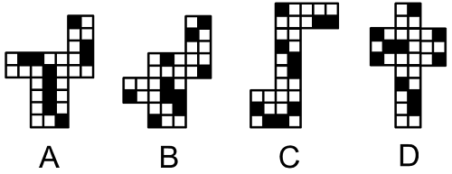
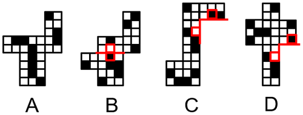
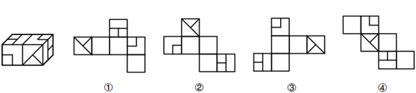
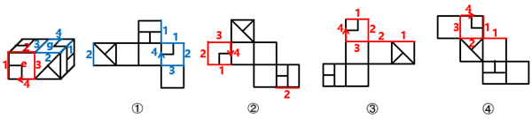

# 2026年福建省公务员录用考试《行测》题（网友回忆版）

> 判断推理 · 30 题 · 福建 2026

## 第 1 题　qid 16069886 · 图形推理

从所给的四个选项中，选择最合适的一个填入问号处，使之呈现一定规律性：

- **A**. A
- **B**. B　✅
- **C**. C
- **D**. D

**答案**：B

**官方解析**

元素组成相同，但无明显位置规律，也无明显属性规律，考虑数量规律。观察发现，题干图形均存在大面积黑块，且黑块有明显分堆，优先考虑黑白块的部分数。第一组图形中，黑块部分数依次为1、2、3，第二组前两幅图形的黑块部分数依次为1、2，故“？”处图形的黑块部分数应为3，只有B项符合。
故正确答案为B。

---

## 第 2 题　qid 16069776 · 图形推理

从所给的四个选项中，选择最合适的一个填入问号处，使之呈现一定规律性：

- **A**. A
- **B**. B
- **C**. C　✅
- **D**. D

**答案**：C

**官方解析**

元素组成不同，且无明显属性规律，考虑数量规律。观察发现，题干图形封闭面明显，优先考虑面数量。题干图形的面数量均为7，因此“？”处图形的面数量应为7，D项图形的面数量为8，排除。继续观察发现，题干图形内部均由直线和曲线构成，其中全直线面数量依次为5、4、3、2、1，呈递减规律，故“？”处图形的全直线面数量应为0，只有C项符合。
故正确答案为C。

---

## 第 3 题　qid 16069800 · 图形推理

以下哪两个图形交换位置之后，整个图形序列将呈现一定的规律性？

- **A**. ②和③
- **B**. ③和④
- **C**. ④和⑤
- **D**. ⑤和⑥　✅

**答案**：D

**官方解析**

解析一：元素组成不同，且无明显属性规律，考虑数量规律。观察发现，题干每幅图形的内部线条均与外框相交，且内部线条与外框的交点数均为3。继续观察发现，图①到图④的3个框上交点每次沿顺时针方向移动一个边，交换图⑤和图⑥后，六个图形交点移动规律连贯，对应D项。
解析二：元素组成不同，且无明显属性规律，考虑数量规律。观察发现，题干每幅图都是一个六边形被内部线条分割成3个面，其中有且只有一个面与外边框有3条边重合，观察这3条重合边，图①到图④的3条重合边每次沿顺时针方向移动一个边，交换图⑤和图⑥后，六个图形的3条重合边移动规律连贯，对应D项。
故正确答案为D。

---

## 第 4 题　qid 16069767 · 图形推理

以下四个选项中，哪一个是由8个白色、4个黑色正方体组合而成的长方体的外表面展开图？

- **A**. A　✅
- **B**. B
- **C**. C
- **D**. D

**答案**：A

**官方解析**

本题为空间重构题，可以通过公共边进行判断，由构成直角的两条边为公共边可知，公共边两侧对应的黑白块颜色应相同，逐一分析选项。

A项：所有公共边两侧黑白块颜色均相同；

B项：公共边两侧黑白块颜色不同；

C项：公共边两侧黑白块颜色不同；

D项：公共边两侧黑白块颜色不同。

因此只有A项是由8个白色、4个黑色正方体组合而成的长方体的外表面展开图。

故正确答案为A。

---

## 第 5 题　qid 16069844 · 图形推理

左图为两个正方体组合而成的长方体，则这两个正方体的外表面展开图分别是：

- **A**. ①和②　✅
- **B**. ③和④
- **C**. ①和④
- **D**. ②和③

**答案**：A

**官方解析**

将题干两个正方体的面标上字母序号，并在立体图形和外表面展开图的“小正方形”面（面e和面g）中以“小正方形”与外框的公共顶点为起始点，顺时针画边标号，如下图所示：

图①中，标出“小正方形”面中对应的边1和边2后发现，二者与题干右侧正方体中面g的边1和边2对应一致，故图①可能是题干右侧正方体的外表面展开图；

图②中，标出“小正方形”面中对应的边2后发现，该公共边与题干左侧正方体中面e的边2对应一致，故图②可能是题干左侧正方体的外表面展开图；

图③中，标出“小正方形”面中对应的边1和边2后发现，二者与题干右侧正方体中面g的边1和边2对应不一致，故图③不可能是题干右侧正方体的外表面展开图，且与题干左侧正方体中面e的边2也对应不一致，故图③不可能是题干左侧正方体的外表面展开图；

图④中，标出“小正方形”面中对应的边1和边2后发现，二者与题干右侧正方体中面g的边1和边2对应不一致，故图④不可能是题干右侧正方体的外表面展开图，且与题干左侧正方体中面e的边2也对应不一致，故图④不可能是题干左侧正方体的外表面展开图。

综上，两个正方体的外表面展开图可能是①和②，对应A项。

故正确答案为A。

---

## 第 6 题　qid 16069973 · 定义判断

分权时序是指政府或组织在权力分配过程中，依据特定逻辑，分阶段、按顺序逐步下放权力的策略，其核心逻辑是通过“时序规划”降低分权风险，确保权力下放与承接能力、管理成熟度相匹配。
根据上述定义，下列属于分权时序的是：

- **A**. 某企业市场部根据产品推广计划安排不同地区的促销活动时间
- **B**. 某政府部门在公共设施建设中，根据项目进度和资金安排分阶段推进不同区域的设施建设
- **C**. 某公司研发团队在产品研发过程中，根据项目进度安排团队不同成员的工作任务和时间顺序
- **D**. 某矿区开展生态修复项目时，地方政府优先赋予矿区环境监管权，但未同步下放排污费征收权　✅

**答案**：D

**官方解析**

第一步：找出定义关键词。
“政府或组织在权力分配过程中”、“分阶段、按顺序逐步下放权力”。
第二步：逐一分析选项。
A项：某企业市场部根据产品推广计划安排不同地区的促销活动时间，属于工作时间安排，没有体现权力分配与下放权力，不符合“政府或组织在权力分配过程中”、“分阶段、按顺序逐步下放权力”，不符合定义，排除；
B项：某政府部门根据项目进度和资金安排分阶段推进公共设施建设，属于项目建设推进，没有体现权力分配与下放权力，不符合“政府或组织在权力分配过程中”、“分阶段、按顺序逐步下放权力”，不符合定义，排除；
C项：某公司研发团队根据项目进度安排成员工作任务和时间顺序，属于工作分工与进度安排，没有体现权力分配与下放权力，不符合“政府或组织在权力分配过程中”、“分阶段、按顺序逐步下放权力”，不符合定义，排除；
D项：地方政府优先赋予矿区环境监管权，未同步下放排污费征收权，体现权力分配与下放权力，符合“政府或组织在权力分配过程中”、“分阶段、按顺序逐步下放权力”，符合定义，当选。
故正确答案为D。

---

## 第 7 题　qid 16069992 · 定义判断

人口粘性是以人口迁移惰性与地理空间稳定性为核心特征的社会地理现象，指特定区域内居民因资源依赖、社会交往、文化认同或制度约束等因素，形成对原居地的长期驻留倾向，抑制人口外迁动力，从而维持或强化区域人口规模与结构稳定性。
根据上述定义，下列属于人口粘性的是（    ）。

- **A**. 老刘退休后搬迁至深圳和子女一起生活，但每年清明节都会返乡扫墓
- **B**. 在上海打工的赵某十年来一直租住在房租低廉的城中村，虽然日均通勤3小时，但仍不打算迁离
- **C**. 山东农户李某每年冬季赴海南种植反季瓜菜，春季返乡务农，虽然每年往返，但多了一份额外收入
- **D**. 煤矿工人孙某因国企改制获得矿区住房产权，子女教育依托企业附属学校，尽管薪资偏低仍拒绝南下务工　✅

**答案**：D

**官方解析**

第一步：找出定义关键词。
“资源依赖、社会交往、文化认同或制度约束”、“对原居地的长期驻留倾向”。
第二步：逐一分析选项。
A项：老刘退休后搬去深圳，每年清明节返乡扫墓，说明老刘已经搬走、定居外地，只是偶尔回去，不符合“对原居地的长期驻留倾向”，不符合定义，排除；
B项：赵某在上海城中村租房，说明赵某并非长期驻留原居地，不符合“对原居地的长期驻留倾向”，不符合定义，排除；
C项：李某冬季去海南，春季回山东务农，说明李某并非长期驻留原居地，不符合“对原居地的长期驻留倾向”，不符合定义，排除；
D项：孙某有矿区住房产权、子女在企业附属学校上学，薪资低也不南下，说明是对矿区住房产权及子女企业附属学校有资源依赖，符合“资源依赖、社会交往、文化认同或制度约束”，且薪资偏低也拒绝南下，说明确实存在长期驻留倾向，符合“对原居地的长期驻留倾向”，符合定义，当选。
故正确答案为D。

---

## 第 8 题　qid 16069978 · 定义判断

种间互作是一种以跨物种直接或间接影响为核心特征的生态学现象，不同物种通过竞争、捕食、互利共生等关系，在资源利用、空间分配或生理功能上产生动态关联，驱动群落结构演化、物种适应性分化及生态系统功能维持，其作用机制可表现为促进、抑制或协同进化。
根据上述定义，下列属于种间互作的是（    ）。

- **A**. 一西伯利亚狼群中的两只公狼因争夺头狼地位发生争斗，导致群体内部等级重构
- **B**. 酸雨导致土壤pH值下降，间接影响蚯蚓与植物根系之间通过养分循环的共生关系
- **C**. 旱季来临，持续的干旱导致塞伦盖蒂草原的羚羊与斑马同时向植物茂盛的水源地迁徙
- **D**. 兔子感染某类寄生虫后行动迟缓更易被郊狼捕食，郊狼继而成为了寄生虫的新宿主，该类寄生虫由此提高了传播效率　✅

**答案**：D

**官方解析**

第一步：找出定义关键词。
“跨物种直接或间接影响”、“不同物种”、“竞争、捕食、互利共生等关系”、“资源利用、空间分配或生理功能上产生动态关联”、“驱动群落结构演化、物种适应性分化及生态系统功能维持”。
第二步：逐一分析选项。
A项：西伯利亚狼群中的两只公狼属于同一物种，不符合“不同物种”，不符合定义，排除；
B项：酸雨导致土壤pH值下降，间接影响蚯蚓与植物的共生关系，是外在环境因素对这两个物种的关系产生了影响，并非物种之间的直接或间接相互作用，不符合“跨物种直接或间接影响”、“资源利用、空间分配或生理功能上产生动态关联”、“驱动群落结构演化、物种适应性分化及生态系统功能维持”，不符合定义，排除；
C项：羚羊与斑马同时向植物茂盛的水源地迁徙，是受干旱环境影响的被动行为，并非物种之间的直接或间接相互作用，不符合“跨物种直接或间接影响”、“资源利用、空间分配或生理功能上产生动态关联”、“驱动群落结构演化、物种适应性分化及生态系统功能维持”，不符合定义，排除；
D项：兔子、寄生虫、郊狼，符合“不同物种”，寄生虫感染兔子使得兔子更易被郊狼捕食，郊狼捕食兔子后成为寄生虫新宿主提升了寄生虫的传播效率，符合“跨物种直接或间接影响”、“竞争、捕食、互利共生等关系”、“资源利用、空间分配或生理功能上产生动态关联”、“驱动群落结构演化、物种适应性分化及生态系统功能维持”，符合定义，当选。
故正确答案为D。

---

## 第 9 题　qid 16069989 · 定义判断

语法惊异是指刻意违反语法规则以触发认知冲突与情感共鸣，在特定语境中制造“预期与现实”的认知落差，从而引发短暂而强烈的惊异体验的语言创新机制。这种体验不但能清除既有认知干扰，又能通过唤起兴趣促进认知重构，最终实现语言表达的戏剧化效果或语义增殖。
根据上述定义，下列不属于语法惊异的是（    ）。

- **A**. “梦，涂鸦了现实的画布”将“梦”比作人进行涂鸦，带来新奇感受　✅
- **B**. 广告文案“好喝到哭，这奶茶！”打破常规语序，强化情感强度，制造消费冲动
- **C**. 社交媒体中流行“被幸福”等表达，将“被”强行与抽象名词组合，制造反讽效果
- **D**. “风，温柔了田野”赋予“温柔”动作意味，使风的形象更加生动鲜活，不再是抽象的自然现象

**答案**：A

**官方解析**

第一步：找出定义关键词。
“刻意违反语法规则”、“以触发认知冲突与情感共鸣”。
第二步：逐一分析选项。
A项：“梦，涂鸦了现实的画布”将“梦”比作人，使用了拟人的修辞手法，但并未违反语法规则，“梦”是主语，“涂鸦”是谓语，“画布”是宾语，句子整体遵循“主谓宾”的常规语法规则，不符合“刻意违反语法规则”，不符合定义，当选；
B项：“好喝到哭，这奶茶！”将主语“这奶茶”后置，违反“主谓宾”的常规语序（常规语序应为“这奶茶好喝到哭！”），强化情感强度，制造消费冲动，符合“刻意违反语法规则”、“以触发认知冲突与情感共鸣”，符合定义，排除；
C项：“被幸福”将“被”强行与抽象名词“幸福”组合（“被”通常用于被动句，后接及物动词，如“被爱”，“幸福”是抽象名词，不能作“被”的宾语），制造反讽效果，符合“刻意违反语法规则”、“以触发认知冲突与情感共鸣”，符合定义，排除；
D项：“风，温柔了田野”将形容词“温柔”用作动词，带宾语“田野”（违反“形容词不能带宾语”的语法规则），使风的形象更加生动鲜活，符合“刻意违反语法规则”、“以触发认知冲突与情感共鸣”，符合定义，排除。
本题为选非题，故正确答案为A。

---

## 第 10 题　qid 16069990 · 定义判断

解构式技能重组是一种主动的学习策略，指学习者为突破复杂技能的学习瓶颈，有意识地将目标技能分解为若干个独立的、可单独训练的核心子模块，然后对这些子模块进行高强度的专项练习，待各模块熟练后，再将其重新整合，最终实现对整体技能的精通。
根据上述定义，下列属于解构式技能重组的是（    ）。

- **A**. 某厨师学徒严格按照菜谱，从食材处理到火候掌握一步步学习制作一道新派融合菜，最终成功复刻了这道菜肴
- **B**. 小赵为准备一场重要演讲，将自己以往演讲中反响最好的几个案例和金句进行重新编排和串联，形成了一套全新的演讲稿
- **C**. 为提高百米自由泳成绩，某游泳运动员聘请体能师进行为期三个月的核心力量与腿部爆发力专项训练，有效增强划水与打腿效果
- **D**. 小高为提升篮球突破能力，认真练习了变向运球、篮下脚步和非惯用手上篮动作，并在对抗训练中流畅组合运用，得分效率大增　✅

**答案**：D

**官方解析**

第一步：找出定义关键词。
“学习者为突破复杂技能的学习瓶颈”、“将目标技能分解为若干个独立的、可单独训练的核心子模块”、“对这些子模块进行高强度的专项练习”、“各模块熟练后，再将其重新整合”、“最终实现对整体技能的精通”。
第二步：逐一分析选项。
A项：厨师学徒严格按照菜谱，从食材处理到火候掌握一步步学习，是按流程顺序模仿学习，并非将复杂技能分解、专项训练再整合，不符合“将目标技能分解为若干个独立的、可单独训练的核心子模块”、“对这些子模块进行高强度的专项练习”、“各模块熟练后，再将其重新整合”，不符合定义，排除；
B项：小赵只是将以往演讲中反响最好的几个案例和金句重新编排和串联，仅是对内容的重组，并非对演讲技能进行分解、专项训练再整合，不符合“将目标技能分解为若干个独立的、可单独训练的核心子模块”、“对这些子模块进行高强度的专项练习”、“各模块熟练后，再将其重新整合”，不符合定义，排除；
C项：游泳运动员进行了核心力量与腿部爆发力的专项训练后，有效增强划水与打腿效果，但未体现两个模块的整合，不符合“各模块熟练后，再将其重新整合”，不符合定义，排除；
D项：小高以篮球突破这一整体技能为目标，将其拆解为变向运球、篮下脚步、非惯用手上篮动作3个独立可训练的核心子模块，认真练习后，在对抗训练中流畅组合运用，得分效率大增，符合“学习者为突破复杂技能的学习瓶颈”、“将目标技能分解为若干个独立的、可单独训练的核心子模块”、“对这些子模块进行高强度的专项练习”、“各模块熟练后，再将其重新整合”、“最终实现对整体技能的精通”，符合定义，当选。
故正确答案为D。

---

## 第 11 题　qid 16070003 · 定义判断

资产轻量化重组是一种企业财务与运营策略，指企业为了优化资本结构和聚焦核心业务，将自身拥有的、运营所必需的重资产出售给第三方，同时通过签订长期租赁或服务协议的方式，保留对这些资产的持续使用权，从而将固产转化为运营现金流，实现从“持有资产”向“使用资产”的模式转变。
根据上述定义，下列属于资产轻量化重组的是（    ）。

- **A**. 某连锁酒店集团为快速扩张，放弃自建的模式，转为长期租赁城市核心区现有的商业楼宇，并将其改造为旗下品牌酒店进行运营
- **B**. 某制造企业为实现技术升级，将位于市中心的老旧厂房整体出售，并用所得款项在高新产业园建设了一座全新的智能化工厂
- **C**. 为改善现金流状况，某航空公司将一批客机出售给一家金融公司，随即又从该公司租回同批客机，继续用于其航线运营　✅
- **D**. 某高科技公司为盘活资产，将其为员工提供的宿舍楼整体出售，并随即签订长期包租协议，继续将其作为员工福利

**答案**：C

**官方解析**

第一步：找出定义关键词。
“将自身拥有的、运营所必需的重资产出售给第三方”、“通过签订长期租赁或服务协议的方式，保留持续使用权”、“将固产转化为运营现金流”。
第二步：逐一分析选项。
A项：某连锁酒店集团放弃自建的模式，转为长期租赁的方式，并未将重资产出售，不符合“将自身拥有的、运营所必需的重资产出售给第三方”，不符合定义，排除；
B项：某制造企业将位于市中心的老旧厂房整体出售，并用所得款项建设了全新的工厂，不符合“通过签订长期租赁或服务协议的方式，保留持续使用权”，不符合定义，排除；
C项：为改善现金流状况，某航空公司将一批客机出售给一家金融公司，符合“将自身拥有的、运营所必需的重资产出售给第三方”，随即又从该公司租回同批客机，继续用于其航线运营，符合“通过签订长期租赁或服务协议的方式，保留持续使用权”、“将固产转化为运营现金流”，符合定义，当选；
D项：某高科技公司为员工提供的宿舍楼，并不是运营所必需的重资产，不符合“将自身拥有的、运营所必需的重资产出售给第三方”，不符合定义，排除。
故正确答案为C。

---

## 第 12 题　qid 16069976 · 定义判断

表现反弹效应是一种心理现象，指个体在某项有明确目标的任务中遭遇失败或挫折后，并未陷入沮丧，而是将该挫折归因于可控的外部因素或自身可修正的具体行为，并由此激发出一股强烈的补偿性动机，在另一项性质不同但领域相关的任务中，表现出远超其通常水准的卓越绩效。
根据上述定义，下列属于表现反弹效应的是（    ）。

- **A**. 小张在模拟考试中因时间分配不当而成绩不佳，他并未气馁，而是立即模拟考场环境重做了一遍试卷，最终取得了高分
- **B**. 程序员小许因项目需求频繁变更导致返工，深感烦躁，下班后他通过打篮球的方式发泄了情绪，并发现投篮准确率显著提高
- **C**. 推销员小王因准备不充分丢掉一笔大订单后并未灰心，而是立刻找到另一位潜在客户，凭借出色的发挥成功签下了一份价值不菲的合同
- **D**. 棋手小庄在正式比赛中因开局策略失误而憾负对手，赛后他立刻登录在线对战平台，在快棋挑战赛中发挥神勇，刷新了个人最高等级分　✅

**答案**：D

**官方解析**

第一步：找出定义关键词。
“在某项有明确目标的任务中遭遇失败或挫折”、“并未陷入沮丧”、“将该挫折归因于可控的外部因素或自身可修正的具体行为”、“在另一项性质不同但领域相关的任务中”、“远超其通常水准的卓越绩效”。
第二步：逐一分析选项。
A项：小张因时间分配不当模拟考试失利，重做同一份试卷取得高分，说明前后任务均为完成该份试卷，属于同一项任务，不符合“在另一项性质不同但领域相关的任务中”，不符合定义，排除；
B项：程序员小许因项目需求变更返工，下班后打篮球发泄，投篮准确率提高，说明前后任务分别是项目开发与打篮球，领域完全无关，不符合“在另一项性质不同但领域相关的任务中”，不符合定义，排除；
C项：推销员小王因准备不足丢了一笔大订单，随即签下另一位客户的大额合同，说明前后任务均为向客户推销并签下订单，仅更换了客户，任务性质完全相同，不符合“在另一项性质不同但领域相关的任务中”，不符合定义，排除；
D项：棋手小庄在正式比赛中因开局策略失误憾负，符合“在某项有明确目标的任务中遭遇失败或挫折”，他将失利归因于自己开局准备不足这一可修正问题，符合“并未陷入沮丧”、“将该挫折归因于可控的外部因素或自身可修正的具体行为”，赛后在在线快棋挑战赛中发挥神勇，刷新个人最高等级分，正式慢棋赛事与在线快棋挑战赛均属于棋类竞技领域，但赛事性质不同，符合“在另一项性质不同但领域相关的任务中”、“远超其通常水准的卓越绩效”，符合定义，当选。
故正确答案为D。

---

## 第 13 题　qid 16069994 · 定义判断

梯度循环转化是指根据不同生产环节对物质能量需求的差异，将前一生产过程产生的废弃物或副产物直接作为后一生产过程的核心原材料，通过多个连续的转化链条，依次提取物质价值，实现资源多级、深度循环利用的过程。
根据上述定义，下列属于梯度循环转化的是（    ）。

- **A**. 某生态农场在水稻田中同时套养鱼类和鸭子，鱼和鸭能够捕虫肥田，而水稻则为鱼和鸭提供遮阴避敌的场所
- **B**. 某酒厂将酿酒剩下的窖糟用于栽培食用菌，栽培后的菌渣接着用于养殖蚯蚓，最终将蚓粪作为有机肥用于酿酒高粱的种植　✅
- **C**. 某化工厂在生产硫酸的过程中，利用反应释放的高温余热进行蒸汽发电，并收集尾气中的二氧化硫用于制造另一种精细化工产品
- **D**. 某林场在春夏季节利用林间空地种植草本药材，秋季采摘药材后，将枯枝落叶粉碎发酵，为冬季温室橱内的花卉提供基肥和热量

**答案**：B

**官方解析**

第一步：找出定义关键词。
“根据不同生产环节对物质能量需求的差异”、“前一生产过程产生的废弃物或副产物直接作为后一生产过程的核心原材料”、“通过多个连续的转化链条”、“依次提取物质价值，实现资源多级、深度循环利用”。
第二步：逐一分析选项。
A项：某生态农场在水稻田中同时套养鱼类和鸭子，鱼和鸭捕虫肥田，水稻为鱼和鸭提供遮阴避敌场所，“同时套养”说明三者是同时存在的，不存在“多个连续的转化链条”，也没有“前一生产过程产生的废弃物或副产物直接作为后一生产过程的核心原材料”，不符合定义，排除；
B项：某酒厂将酿酒剩下的窖糟用于栽培食用菌，栽培后的菌渣接着用于养殖蚯蚓，最终将蚓粪作为有机肥用于酿酒高粱的种植，窖糟、菌渣、蚓粪依次作为后一生产环节的核心原材料，形成连续转化链条，符合“前一生产过程产生的废弃物或副产物直接作为后一生产过程的核心原材料”、“通过多个连续的转化链条”、“依次提取物质价值，实现资源多级、深度循环利用”，符合定义，当选；
C项：某化工厂在生产硫酸的过程中，利用反应释放的高温余热进行蒸汽发电，并收集尾气中的二氧化硫用于制造另一种精细化工产品，余热属于能源而非“废弃物或副产物”，并且没有作为“前一生产过程产生的废弃物或副产物直接作为后一生产过程的核心原材料”、只是用于另一种化工产品的生产，不符合定义，排除；
D项：某林场在春夏季节利用林间空地种植草本药材，秋季采摘药材后，将枯枝落叶粉碎发酵，枯枝落叶并非药材种植环节的“核心副产物”，并且只是不同的季节做不同的事情，没有“多个连续的转化链条”，不符合“通过多个连续的转化链条”、“依次提取物质价值，实现资源多级、深度循环利用”，不符合定义，排除。
故正确答案为B。

---

## 第 14 题　qid 16069983 · 定义判断

差错导向是指个体对错误本身以及应对错误方式的主观看法，差错掩盖导向指个体出于自我形象或短期利益的维护而产生对负面评价或惩罚的恐惧，倾向于通过否认、隐藏或推卸责任等方式掩盖错误，避免他人察觉。差错学习导向指个体以开放的心态将错误视为改进机会，主动反思错误原因、总结经验并积极调整行为以实现自我提升。
根据上述定义，下列属于差错学习导向的是（    ）。

- **A**. 某餐厅食材变质导致多名顾客食物中毒，餐厅经理把原因归结为“厨师与采购沟通不足，导致食材新鲜度不达标”
- **B**. 某三甲医院建立“无惩罚差错上报系统”，医护人员可匿名分享失误案例以供全院学习　✅
- **C**. 小赵在考试失利后大量刷题，但拒绝分析错题原因导致相同知识点反复出错
- **D**. 某企业宣称“已从用户数据泄露事件中汲取教训”，但并未升级安全系统

**答案**：B

**官方解析**

第一步：找出定义关键词。
差错导向：“个体对错误本身以及应对错误方式”、“主观看法”；
差错掩盖导向：“个体出于自我形象或短期利益的维护”、“对负面评价或惩罚的恐惧”、“通过否认、隐藏或推卸责任等方式掩盖错误”、“避免他人察觉”；
差错学习导向：“个体以开放的心态将错误视为改进机会”、“主动反思并积极调整行为”、“以实现自我提升”。
第二步：逐一分析选项。
A项：餐厅经理将中毒事件简单归咎于沟通不足，未主动反思问题根源、未总结经验、未采取改进措施，不符合“主动反思并积极调整行为”、“以实现自我提升”，不符合“差错学习导向”定义，排除；
B项：医院建立无惩罚差错上报系统，医护人员可匿名分享失误案例以供学习，符合“个体以开放的心态将错误视为改进机会”、“主动反思并积极调整行为”、“以实现自我提升”，符合“差错学习导向”定义，当选；
C项：小赵拒绝分析错题原因，不符合“主动反思并积极调整行为”，不符合“差错学习导向”定义，排除；
D项：企业未升级安全系统，不符合“主动反思并积极调整行为”，不符合“差错学习导向”定义，排除。
故正确答案为B。

---

## 第 15 题　qid 16069977 · 定义判断

推理句是基于已知信息、知识或前提，通过逻辑推导得出结论的语句，属于逻辑思维在语言中的体现，它凭借合理的推理规则，从给定条件推导出可能性或必然性的结果，其结论的成立依赖于前提的真实性及逻辑有效性，核心功能在于论证观点或预测可能性，因果句是指通过显性逻辑连接词或隐性语义关联，明确表达一个事件导致另一个事件的发生，前后分句间存在客观的事理关联，其核心功能在于解释现象成因或行为动机。
根据上述定义，下列属于因果句的有几项？
①因为合同明确约定违约条款，所以甲方就应承担赔偿责任
②因为玉米价格持续下跌，所以农民明年可能改种大豆
③因为服务器散热系统故障，所以网站瘫痪3小时
④因为听到外面雨声很大，所以地面肯定湿了

- **A**. 1　✅
- **B**. 2
- **C**. 3
- **D**. 4

**答案**：A

**官方解析**

第一步：找出定义关键词。
推理句：“基于已知信息、知识或前提”、“通过逻辑推导得出结论的语句”、“它凭借合理的推理规则，从给定条件推导出可能性或必然性的结果”、“其结论的成立依赖于前提的真实性及逻辑有效性，核心功能在于论证观点或预测可能性”；
因果句：“通过显性逻辑连接词或隐性语义关联，明确表达一个事件导致另一个事件的发生”、“前后分句间存在客观的事理关联”、“其核心功能在于解释现象成因或行为动机”。
第二步：逐一进行分析。
①因为合同明确约定违约条款，所以甲方就应承担赔偿责任，“就应”表示“应该”出现某个结果，符合“它凭借合理的推理规则，从给定条件推导出可能性或必然性的结果”，属于推理句，不符合“明确表达一个事件导致另一个事件的发生”，也不符合“前后分句间存在客观的事理关联”，符合推理句定义，不符合因果句定义；
②因为玉米价格持续下跌，所以农民明年可能改种大豆，是基于经验的预测，符合“它凭借合理的推理规则，从给定条件推导出可能性或必然性的结果”、“其结论的成立依赖于前提的真实性及逻辑有效性，核心功能在于论证观点或预测可能性”，符合推理句定义，不符合因果句定义；
③因为服务器散热系统故障，所以网站瘫痪3小时，“服务器散热系统故障”直接导致“网站瘫痪3小时”的发生，符合“通过显性逻辑连接词或隐性语义关联，明确表达一个事件导致另一个事件的发生”、“前后分句间存在客观的事理关联”、“其核心功能在于解释现象成因或行为动机”，符合因果句定义；
④因为听到外面雨声很大，所以地面肯定湿了，是基于经验的预测，符合“它凭借合理的推理规则，从给定条件推导出可能性或必然性的结果”、“其结论的成立依赖于前提的真实性及逻辑有效性，核心功能在于论证观点或预测可能性”，符合推理句定义，不符合因果句定义。
综上，属于因果句的只有③，共1项。
故正确答案为A。

---

## 第 16 题　qid 16069769 · 类比推理

江山：画卷

- **A**. 琴弦：心声
- **B**. 节气：农事
- **C**. 火药：军事
- **D**. 春雨：甘露　✅

**答案**：D

**官方解析**

第一步：判断题干词语间逻辑关系。
江山可以被比喻为画卷，二者为比喻象征义。
第二步：判断选项词语间逻辑关系。
A项：琴弦是传递心声的工具，二者不是比喻象征义，与题干逻辑关系不一致，排除；
B项：农事活动依据节气，二者为依据对应关系，与题干逻辑关系不一致，排除；
C项：火药可用于军事领域，二者为应用领域对应关系，与题干逻辑关系不一致，排除；
D项：春雨可以被比喻为甘露，二者为比喻象征义，与题干逻辑关系一致，当选。
故正确答案为D。

---

## 第 17 题　qid 16069772 · 类比推理

直径：最长弦

- **A**. 半圆：半周长
- **B**. 正方形：菱形
- **C**. 公里：千米　✅
- **D**. 梯形：长方形

**答案**：C

**官方解析**

第一步：判断题干词语间逻辑关系。
弦是圆上任意两点连起来的线段，连接圆上两点并通过圆心的线段是圆中的最长弦，也称直径，二者为全同关系。
第二步：判断选项词语间逻辑关系。
A项：半圆是圆的一半，是平面图形，半周长是闭合几何图形周长的一半，是长度，二者无明显逻辑关系，与题干逻辑关系不一致，排除；
B项：菱形是有一组邻边长度相等的平行四边形，正方形是一种特殊的菱形，二者为种属关系，与题干逻辑关系不一致，排除；
C项：千米是长度计量单位，俗称公里，二者为全同关系，与题干逻辑关系一致，当选；
D项：梯形与长方形是两种不同的平面图形，二者为并列关系，与题干逻辑关系不一致，排除。
故正确答案为C。

---

## 第 18 题　qid 16069764 · 类比推理

输液泵：病房：精准给药

- **A**. 雷达站：机场：情报传输
- **B**. 变压器：电网：电压调节
- **C**. 消防栓：街道：应急供水　✅
- **D**. 服务器：硬盘：数据存储

**答案**：C

**官方解析**

第一步：判断题干词语间逻辑关系。
输液泵是作用于输液导管以控制输液速度、严格控制输液量和药量的机械或电子装置，输液泵可在病房内使用，具有精准给药的功能，前两词是事物与地点的对应关系，第一词与第三词是功能的对应关系。
第二步：判断选项词语间逻辑关系。
A项：雷达站可放置在机场内，但其作用是通过探测来保障飞行安全和进行空中交通管制，并非传输情报，第一词与第三词并非功能的对应关系，与题干逻辑关系不一致，排除；
B项：变压器是电网中不可或缺的核心设备，前两词是组成关系，与题干逻辑关系不一致，排除；
C项：消防栓可放在街道中，且消防栓在特定条件下，具有应急供水的功能，前两词是事物与地点的对应关系，第一词与第三词是功能的对应关系，与题干逻辑关系一致，当选；
D项：服务器是在网络环境中提供计算能力并运行软件应用程序的特定IT设备，硬盘是服务器的重要组成部分，前两词是组成关系，与题干逻辑关系不一致，排除。
故正确答案为C。

---

## 第 19 题　qid 16069805 · 类比推理

原料采购：模具设计：成品出厂

- **A**. 市场调研：产品开发：用户反馈
- **B**. 土地审批：建筑设计：房屋交付　✅
- **C**. 货物装载：运输规划：仓储管理
- **D**. 原型测试：功能优化：专利申报

**答案**：B

**官方解析**

第一步：判断题干词语间逻辑关系。
原料采购、模具设计、成品出厂是先后顺序的对应关系，且成品出厂是最终目的。
第二步：判断选项词语间逻辑关系。
A项：市场调研、产品开发、用户反馈是先后顺序的对应关系，但用户反馈不是最终目的，与题干逻辑关系不一致，排除；
B项：土地审批、建筑设计、房屋交付是先后顺序的对应关系，且房屋交付是最终目的，与题干逻辑关系一致，当选；
C项：运输规划应在货物装载之前，与题干逻辑关系不一致，排除；
D项：功能优化与专利申报时间先后顺序不明确，与题干逻辑关系不一致，排除。
故正确答案为B。

---

## 第 20 题　qid 16069773 · 类比推理

（    ） 对于 轨道 相当于 候鸟 对于 （    ）

- **A**. 卫星；迁徙路线　✅
- **B**. 车道；大雁
- **C**. 汽车；湿地公园
- **D**. 马路；丹顶鹤

**答案**：A

**官方解析**

逐一代入选项。
A项：卫星沿着轨道运行，二者是主体与运动轨迹的对应关系；候鸟沿着迁徙路线飞行，二者是主体与运动轨迹的对应关系，前后逻辑关系一致，当选；
B项：车道和轨道是两种不同的道路设施，二者是并列关系；大雁是一种候鸟，二者是种属关系，前后逻辑关系不一致，排除；
C项：某些特殊的轨道汽车可以在轨道上行驶，二者是主体与运动轨迹的对应关系；湿地公园是候鸟的栖息地，二者是地点的对应关系，前后逻辑关系不一致，排除；
D项：马路和轨道是两种不同的道路设施，二者是并列关系；丹顶鹤是一种候鸟，二者是种属关系，前后逻辑关系不一致，排除。
故正确答案为A。

---

## 第 21 题　qid 16069794 · 逻辑判断

某大学研发的B系列首颗卫星B-1正常在轨运行时间达到了其设计寿命。但是，第二批3颗B系列卫星（B-2/3/4）仅运行2个月便坠入大气层，远低于其设计寿命。对于B系列卫星在轨寿命短的原因，有研究人员认为B-1发射于2021年，整体处于太阳活动周的上升初期，空间天气水平相对较低；而B-2/3/4发射于2024年，其运行期间处于太阳活动高年，空间天气急剧增强，导致B系列卫星寿命缩短。但也有科学家认为，低轨大气密度大幅增加引发了B-2/3/4卫星的加速陨落。
以下哪项如果为真，最能质疑上述科学家的观点？

- **A**. 空间天气的急剧增强会导致低轨大气密度大幅度增加　✅
- **B**. 低轨大气密度增加会对卫星产生阻力，使卫星轨道高度衰减
- **C**. 太阳活动在上升期、峰值期和下降期的太阳辐射指数不同
- **D**. 低轨大气密度受到地磁活动和地球自转、公转等因素影响

**答案**：A

**官方解析**

第一步：找出论点和论据。
论点：低轨大气密度大幅增加引发了B-2/3/4卫星的加速陨落。
论据：无。
本题只有论点没有论据，削弱优先考虑削弱论点，即说明卫星的加速陨落并非由低轨大气密度大幅增加导致的。
第二步：逐一分析选项。
A项：该项说的是空间天气的急剧增强会导致低轨大气密度大幅度增加，即导致B-2/3/4卫星加速陨落的根本原因是空间天气的急剧增强，而非低轨大气密度大幅增加，削弱论点，可以削弱，当选；
B项：该项说的是低轨大气密度增加会对卫星产生阻力，使卫星轨道高度衰减，解释了低轨大气密度增加如何导致卫星加速陨落，为加强项，无法削弱，排除；
C项：该项说的是太阳活动在不同时期的太阳辐射指数不同，与论点讨论的低轨大气密度大幅增加是否会导致卫星加速陨落无关，为无关项，无法削弱，排除；
D项：该项说的是低轨大气密度受到地磁活动和地球自转、公转等因素影响，讨论的是影响低轨大气密度的原因，与论点讨论的低轨大气密度大幅增加是否会导致卫星加速陨落无关，为无关项，无法削弱，排除。
故正确答案为A。

---

## 第 22 题　qid 16069810 · 逻辑判断

一项随机对照研究以某地区90余名36~66岁的肥胖人群作为研究对象，实验组每天早餐前喝220克酸奶，对照组喝相同量的牛奶。该实验持续24周，结果发现，与对照组相比，实验组受试者的身体脂肪平均减少了2.26公斤。研究者认为，喝酸奶可以降低体脂率。
以下哪项如果为真，最能削弱题干中研究者的结论？

- **A**. 市场上的许多酸奶产品添加了糖分以提升口感，但也增加了热量摄入
- **B**. 实验期间除规律饮食外，实验组有人每天保持了一定强度的有氧锻炼　✅
- **C**. 酸奶富含钙质及蛋白质等营养成分，餐前半小时喝酸奶可减轻饥饿感
- **D**. 酸奶中的益生菌对于改善消化功能有显著效果，有助于身体新陈代谢

**答案**：B

**官方解析**

第一步：找出论点和论据。
论点：喝酸奶可以降低体脂率。
论据：一项随机对照研究以某地区90余名36~66岁的肥胖人群作为研究对象，实验组每天早餐前喝220克酸奶，对照组喝相同量的牛奶。该实验持续24周，结果发现，与对照组相比，实验组受试者的身体脂肪平均减少了2.26公斤。
本题论点说的是“喝酸奶”可以“降低体脂率”，论据通过实验证明“喝酸奶”可以“减少身体脂肪”，二者话题一致，削弱可以考虑削弱论点，且论点中存在因果关系，削弱还可以考虑他因削弱和因果倒置。
第二步：逐一分析选项。
A项：选项指出市场上的许多酸奶因添加糖分会增加热量摄入，但不清楚实验中所选酸奶的糖分情况，且并未直接削弱实验组喝酸奶可以降低体脂率的结论，无法削弱，排除；
B项：选项指出实验组除规律饮食外，部分人每天还保持了一定强度的有氧锻炼，说明实验组的这部分人也可能是通过有氧锻炼而降低了体脂率，他因削弱，可以削弱，当选；
C项：选项指出在餐前喝酸奶可以减轻饥饿感，解释了为什么喝酸奶可以降低体脂率，为加强项，无法削弱，排除；
D项：选项指出酸奶有助于改善消化功能和身体的新陈代谢，解释了为什么喝酸奶可以降低体脂率，为加强项，无法削弱，排除。
故正确答案为B。

---

## 第 23 题　qid 16069861 · 逻辑判断

冻雨是冬季常见的灾害性天气之一，它落地凝结成冰，给生产生活带来不小威胁。Z地区冻雨分布呈现“西部多、东部少，中部多、南北少”的鲜明特点。对于该地区冻雨分布的特点，有气象学家认为，这与当地地形有关。Z地区的西部、中部分布着大片高海拔的山区，而东部、南北部则分布着低海拔的河谷和平缓地带。高海拔的山区气温更低，为冻雨形成提供了充分的温度条件；而在低海拔的河谷和平缓地带冻雨出现概率低、范围小。因此有气象学家认为，Z地区冻雨分布特点是由当地的地形决定的。
以下哪项如果为真，最能削弱上述论证？

- **A**. 受大气环流及地形等影响，Z地区气候多样且不稳定，灾害性天气种类较多，干旱、凌冻、冰雹等频度大
- **B**. 除了地势西高东低外，Z地区还有大面积的丘陵地带，通过地形抬升作用促进了水汽的积聚和冷却，从而增加了冻雨发生的可能性
- **C**. 气温低和降水是形成冻雨的条件，雨滴在下降过程中以过冷水滴的形式存在，这样当它们到达地面时，就出现了冻结的情况，即冻雨
- **D**. 冬季，来自北方的冷气团与来自东南的暖湿气流在Z地区交汇，形成难以消散的准静止锋，它与地形共同作用形成了当地冻雨分布的特点　✅

**答案**：D

**官方解析**

第一步：找出论点和论据。
论点：Z地区冻雨分布特点是由当地的地形决定的。
论据：Z地区冻雨分布呈现“西部多、东部少，中部多、南北少”的鲜明特点。Z地区的西部、中部分布着大片高海拔的山区，而东部、南北部则分布着低海拔的河谷和平缓地带。高海拔的山区气温更低，为冻雨形成提供了充分的温度条件；而在低海拔的河谷和平缓地带冻雨出现概率低、范围小。
本题论点和论据均围绕Z地区冻雨分布特点与地形的关系展开，话题一致，削弱优先考虑削弱论点。
第二步：逐一分析选项。
A项：该项指出Z地区受大气环流及地形等影响，气候多样且不稳定，灾害性天气种类较多，但没有涉及这些因素对冻雨分布特点的具体影响，与论点讨论的冻雨分布特点是否由地形决定无关，为无关项，无法削弱，排除；
B项：该项指出Z地区的丘陵地带通过地形抬升作用增加了冻雨发生的可能性，强调了地形对冻雨分布的促进作用，可以加强，无法削弱，排除；
C项：该项指出气温低与冻雨的形成有关，肯定了论据“高海拔的山区气温更低，为冻雨形成提供了充分的温度条件”，可以加强，无法削弱，排除；
D项：该项指出冬季来自北方的冷气团与来自东南的暖湿气流在Z地区交汇形成难以消散的准静止锋，是准静止锋与地形共同作用形成了当地冻雨分布的特点，说明Z地区冻雨分布特点并非仅由地形决定，直接削弱了论点，可以削弱，当选。
故正确答案为D。

---

## 第 24 题　qid 16069781 · 逻辑判断

继黄金、白银价格大幅拉涨后，近日期货市场上铂金价格也出现了上涨。作为有色金属，铂、钯等铂族金属可吸收氢气，是汽车尾气催化剂以及氢能等新兴应用场景的关键原材料。有专家认为，此轮铂金行情看涨并非短期情绪驱动，铂金价格将持续走高。
以下除哪一项外，均能支持上述专家的观点？

- **A**. 由于国际市场的需要，未来燃油汽车产业和清洁能源行业对铂金的需求会持续扩大
- **B**. 在美元信用走弱的趋势下，交易市场基于稳定预期，会将投资目光转向黄金、白银、铂金等贵金属
- **C**. 铂金具有化学稳定性、催化活性和生物相容性，一直以来被广泛应用于航空航天、生物医药等现代高科技产业　✅
- **D**. N国拥有全球70%以上铂金产量，但该国近期面临电力短缺、矿体老化和运营成本上升等情况，导致全球铂金供应不足进一步加剧

**答案**：C

**官方解析**

第一步：找出论点和论据。
论点：此轮铂金行情看涨并非短期情绪驱动，铂金价格将持续走高。
论据：近日期货市场上铂金价格也出现了上涨。作为有色金属，铂、钯等铂族金属可吸收氢气，是汽车尾气催化剂以及氢能等新兴应用场景的关键原材料。
本题论点与论据都在说铂族金属是新兴应用场景的关键原材料，所以后续价格会持续走高，论点和论据话题一致，加强优先考虑补充论据，即解释原因或举例子，且本题为选非题，将可以加强的选项排除即可。
第二步：逐一分析选项。
A项：该项讨论的是燃油汽车产业和清洁能源行业对铂金的需求会持续扩大，而需求扩大会带来铂金价格的持续走高，补充论据，可以加强，排除；
B项：该项讨论的是美元信用走弱，使得资金流向黄金、白银、铂金等贵金属，资金流入铂族金属时会增加铂族金属的需求，而需求增加会带来铂金价格的持续走高，补充论据，可以加强，排除；
C项：该项讨论的是铂金因化学稳定性、催化活性等，一直被广泛应用于航空航天、生物医药等高科技产业，只能表明其用途广泛，并未提到其未来需求增加或供给减少，不能证明其价格是否会持续走高，为不明确项，无法加强，当选；
D项：该项讨论的是N国铂金产量占全球70%以上，但其面临电力短缺、矿体老化、运营成本上升等情况导致全球铂金供应不足加剧，说明铂金供给减少，而供给减少会带来铂金价格的持续走高，补充论据，可以加强，排除。
本题为选非题，故正确答案为C。

---

## 第 25 题　qid 16069788 · 逻辑判断

S岛位于太平洋，考古证据表明，S岛上的P族人在政治上并没有统一，因此学界对于岛上数百座石像是否由一个首领协调建造观点不一。岛上只有一个提供石像所用火山岩的采石场，近期研究人员使用无人机和高科技测绘设备，创建了采石场的首张三维地图，其中包含大量未完成的石像。研究人员发现，采石场被划分为30个工作区，每个区域似乎都是独立的。研究人员据此认为，S岛上的石像是由许多不同的部落制作的。
以下哪项如果为真，最能支持上述结论?

- **A**. 研究中发现，未完成的石像在采石场的各个工作区中均有分布，且石像的完成进度不同
- **B**. 在与P族人同时代其他地区的部落中，也有很多部落没有统一的首领，处在去中心化的阶段
- **C**. 据史料记载，S岛上曾经出现过多个部落共存的局面，各部落之间还会爆发不同规模的领地冲突
- **D**. 研究人员在S岛上找到了426个代表不同完成阶段的石像，发现它们采用了不同的雕刻技术，特征也不一样　✅

**答案**：D

**官方解析**

第一步：找出论点和论据。
论点：S岛上的石像是由许多不同的部落制作的。
论据：岛上只有一个提供石像所用火山岩的采石场，近期研究人员使用无人机和高科技测绘设备，创建了采石场的首张三维地图，其中包含大量未完成的石像。研究人员发现，采石场被划分为30个工作区，每个区域似乎都是独立的。
本题论点在讨论“石像”和“不同部落”，论据在讨论“石像”和“独立区域”，其中“不同部落”和“独立区域”关系密切，所以论点和论据二者话题一致，加强考虑补充论据。
第二步：逐一分析选项。
A项：选项说的是未完成的石像在采石场的各个工作区中均有分布，论点讨论的是S岛上的石像是由谁制作的，二者话题不一致，不能加强，排除；
B项：选项说的是与P族人同时代其他地区的部落首领的情况，论点讨论的是S岛上的石像是由谁制作的，二者话题不一致，不能加强，排除；
C项：选项说的是S岛多个部落共存的情况，论点讨论的是S岛上的石像是由谁制作的，二者话题不一致，不能加强，排除；
D项：选项说的是426个石像采用了不同的雕刻技术，特征也不一样，补充论据，说明S岛上的石像的确是由许多不同的部落制作的，可以加强，当选。
故正确答案为D。

---

## 第 26 题　qid 16069789 · 逻辑判断

某干旱地区近年来大力推广高效节水灌溉技术，通过精准滴灌系统替代传统的漫灌方式，使单位面积农田的灌溉用水量平均降低了40%。然而，该地区的年度水资源监测报告显示，农业灌溉用水总量不仅没有如预期般下降，反而比推广节水技术前增长了约15%。
以下哪项如果为真，最能解释上述看似矛盾的现象？

- **A**. 节水灌溉系统的初期安装和设备维护需要投入大量资金，这导致部分农户的生产成本有所上升
- **B**. 该地区在推广节水技术的同时，也对地下水开采进行了严格限制，农户转而使用价格更高的地表水
- **C**. 灌溉效率的提升大幅降低了单位水量的边际成本，农户因此显著扩大了耕地面积并改种了高需水作物　✅
- **D**. 气象监测数据显示，该地区在过去一年中遭遇了罕见的持续高温天气，土壤水分的自然蒸发量显著增加

**答案**：C

**官方解析**

第一步：找出题干矛盾。
某干旱地区推广高效节水灌溉技术，单位面积农田灌溉用水量平均降低40%，但农业灌溉用水总量不仅未下降，反而较推广前增长约15%。
第二步：逐一分析选项。
A项：指出节水灌溉系统的安装和维护使农户生产成本上升，生产成本与农业灌溉用水总量无关，无法解释题干矛盾，排除；
B项：指出农户用水从地下水转为地表水，仅改变水源类型，不影响农业灌溉用水的总量，无法解释题干矛盾，排除；
C项：指出灌溉效率的提升大幅降低了单位水量的边际成本，农户因此扩大耕地面积且改种高需水作物，解释了虽然单位面积用水量降低了，但由于种植面积扩大和作物需水量增加，导致农业灌溉用水总量反而增长，可以解释题干矛盾，当选；
D项：指出持续高温天气使土壤水分蒸发量显著增加，但不明确蒸发量增加是否会导致农业灌溉用水总量增长，无法解释题干矛盾，排除。
故正确答案为C。

---

## 第 27 题　qid 16069793 · 逻辑判断

近期的一项研究发现，氢排放会间接加剧全球变暖，1990年至2020年累积的氢排放为工业化后的全球平均气温上升“贡献”了0.02摄氏度。氢气间接加剧全球变暖的主要原因是它会消耗大气中能够分解温室气体甲烷的天然净化物质，大气中的氢气越多，这类天然净化物质就越少，从而延长甲烷在大气中的留存时间，加剧升温。此外，另有研究发现，近三十年人类活动在整体规模、强度与对全球影响范围上显著增强。由此可见，人类活动加剧了全球变暖。
上述论证的成立，必须基于以下哪一前提？

- **A**. 人类活动排放的大量二氧化碳是推动全球变暖的元凶
- **B**. 1990年至2020年间，全球氢气排放量的增加主要由于人类活动　✅
- **C**. 氢气与这类天然净化物质的反应会生成臭氧、水蒸气等温室气体
- **D**. 氢气排放会对人类的工业、农业等活动产生直接或间接不利影响

**答案**：B

**官方解析**

第一步：找出论点和论据。
论点：人类活动加剧了全球变暖。
论据：氢排放会间接加剧全球变暖，1990年至2020年累积的氢排放为工业化后的全球平均气温上升“贡献”了0.02摄氏度。氢气间接加剧全球变暖的主要原因是它会消耗大气中能够分解温室气体甲烷的天然净化物质，大气中的氢气越多，这类天然净化物质就越少，从而延长甲烷在大气中的留存时间，加剧升温。此外，另有研究发现，近三十年人类活动在整体规模、强度与对全球影响范围上显著增强。
本题论点讨论的是人类活动加剧了全球变暖，论据讨论的是氢排放加剧全球变暖，且近三十年人类活动增强。论点和论据有话题不一致的地方，加强可考虑搭桥，即建立“人类活动”与“氢排放”之间的联系。
第二步：逐一分析选项。
A项：该项说人类活动排放的大量二氧化碳是推动全球变暖的元凶，补充论据说明人类活动加剧了全球变暖，可以加强，保留；
B项：该项说1990年至2020年间（即近三十年），全球氢气排放量的增加主要由于人类活动，建立了“人类活动”与“氢排放”之间的联系，搭桥项，可以加强，保留；
C项：该项说氢气会通过反应生成温室气体，但没有提及人类活动，无法说明是否是人类活动加剧了全球变暖，话题不一致，无法加强，排除；
D项：该项说氢气排放会对人类活动产生影响，没有提及全球变暖，与论点讨论的人类活动加剧全球变暖话题不一致，无法加强，排除。
对比A、B两项，B项搭桥的加强力度大于A项补充论据，当选。
故正确答案为B。

---

## 第 28 题　qid 16069791 · 逻辑判断

在近期的古生物学研究中，科学家通过对一种巨型食肉恐龙的化石进行同位素分析，发现其骨骼样本中的氧-18同位素比例与同时代的鳄类化石高度一致，而与陆生恐龙的样本存在显著差异，这一发现表明，该恐龙长期生活在水生或半水生环境中，因此研究团队得出结论，这种史前巨兽很可能是一种以鱼类为主要食物来源的捕食者。
上述论证的成立，必须基于以下哪一前提？

- **A**. 长期生活在水生或半水生环境中的大型食肉动物通常以鱼类为食　✅
- **B**. 该恐龙的牙齿形态呈现出圆锥形，这与现代以鱼为食的鳄类相似
- **C**. 化石的同位素特征表明，同时代的陆生恐龙以当时的陆地植物为食
- **D**. 化石记录显示，该恐龙的栖息地在远古时期曾是广阔的淡水河流系统

**答案**：A

**官方解析**

第一步：找出论点和论据。
论点：这种史前巨兽（巨型食肉恐龙）很可能是一种以鱼类为主要食物来源的捕食者。
论据：科学家通过对一种巨型食肉恐龙的化石进行同位素分析，发现其骨骼样本中的氧-18同位素比例与同时代的鳄类化石高度一致，而与陆生恐龙的样本存在显著差异，这一发现表明，该恐龙长期生活在水生或半水生环境中。
本题论点在讨论“巨型食肉恐龙以鱼类为主要食物来源”，论据在讨论“巨型食肉恐龙长期生活在水生或半水生环境中”，话题不一致，且提问方式为“前提”，加强优先考虑搭桥，可直接寻找同时包含“长期生活在水生或半水生环境中”和“以鱼类为主要食物来源”的选项。
第二步：逐一分析选项。
A项：该项指出长期生活在水生或半水生环境中的大型食肉动物通常以鱼类为食，即在“长期生活在水生或半水生环境中”和“以鱼类为主要食物来源”之间建立联系，为搭桥项，可以加强，当选；
B项：该项指出该恐龙的牙齿形态与现代以鱼为食的鳄类相似，说明该恐龙有可能和鳄类一样也以鱼类为食，类比加强，但不是上述论证成立的前提，排除；
C项：该项讨论的是同时代的陆生恐龙，而论点讨论的是这种巨型食肉恐龙，主体不一致，为无关项，无法加强，排除；
D项：该项指出该恐龙的栖息地在远古时期曾是广阔的淡水河流系统，栖息地环境是河流系统不代表其就以鱼类为主要食物来源，话题不一致，为无关项，无法加强，排除。
故正确答案为A。

---

## 第 29 题　qid 16069795 · 逻辑判断

小王、小李、小张分别负责公司产品策划、技术研发和市场推广三个项目中的某一项。已知负责产品策划的员工年终业绩得分低于小王；小李的业绩得分不是最低的；负责技术研发的员工业绩得分低于负责产品策划的员工。
根据以上信息，可以推出：

- **A**. 小王负责市场推广　✅
- **B**. 小张负责产品策划
- **C**. 小李的业绩得分最高
- **D**. 负责技术研发的员工比负责市场推广的业绩得分高

**答案**：A

**官方解析**

第一步：分析题干条件。
（1）产品策划＜小王；
（2）小李的业绩得分不是最低的；
（3）技术研发＜产品策划；
（4）小王、小李、小张分别负责公司产品策划、技术研发和市场推广三个项目中的某一项。
第二步：根据题干条件进行推理。
题干中“产品策划”提及次数最多，优先从此处入手进行推理。
根据条件（1）和条件（3）可以得到：技术研发＜产品策划＜小王，结合条件（4）可知，小王负责市场推广；结合条件（2）和条件（4）可知，小李负责产品策划，小张负责技术研发，只有A项符合。
故正确答案为A。

---

## 第 30 题　qid 16069806 · 逻辑判断

要研发出安全可靠的通用人工智能，首先必须为其建立一套清晰的伦理边界。如果一个人工智能系统被植入了清晰的伦理边界，那么它在决策时就会主动规避潜在的伦理风险。只有主动规避潜在的伦理风险，该系统的大规模应用才能被认为是负责任的。此外，一个系统若要被认为是安全可靠的，其算法还必须通过全面的压力测试，只有通过了全面的压力测试，该系统的决策逻辑才算获得了初步的验证，从而真正迈向通用人工智能。
由此可以推出：

- **A**. 只要一个系统的决策逻辑获得了初步验证，它就是安全可靠的
- **B**. 任何一个真正迈向通用人工智能的系统，其算法都必须通过全面的压力测试　✅
- **C**. 若人工智能系统的大规模应用被认为是负责任的，那么它一定植入了清晰的伦理边界
- **D**. 如果一个系统未被植入清晰的伦理边界，它在决策时就不会主动规避潜在的伦理风险

**答案**：B

**官方解析**

第一步：翻译题干。

①安全可靠的通用人工智能建立一套清晰的伦理边界；

②植入了清晰的伦理边界主动规避潜在的伦理风险；

③系统的大规模应用被认为是负责任的主动规避潜在的伦理风险；

④系统被认为是安全可靠的算法通过了全面的压力测试；

⑤真正迈向通用人工智能决策逻辑获得了初步的验证算法通过了全面的压力测试。

第二步：逐一分析选项。

A项：该项翻译为“决策逻辑获得了初步验证系统是安全可靠的”，是对⑤第二个箭头前的肯定，可以推出“算法通过了全面的压力测试”，“算法通过了全面的压力测试”是对④箭头后的肯定，肯后得不到确定性的结论，无法推出，排除；

B项：该项翻译为“真正迈向通用人工智能算法通过了全面的压力测试”，是对⑤第一个箭头前的肯定，肯前必肯后，可以推出，当选；

C项：该项翻译为“系统的大规模应用被认为是负责任的植入了清晰的伦理边界”，是对③箭头前的肯定，可以推出“主动规避潜在的伦理风险”，“主动规避潜在的伦理风险”是对②箭头后的肯定，肯后得不到确定性的结论，不能推出，排除；

D项：该项翻译为“被植入清晰的伦理边界主动规避潜在的伦理风险”，是对②箭头前的否定，否前得不到确定性的结论，不能推出，排除。

故正确答案为B。

---
