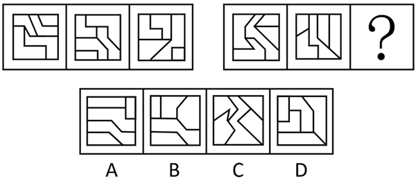
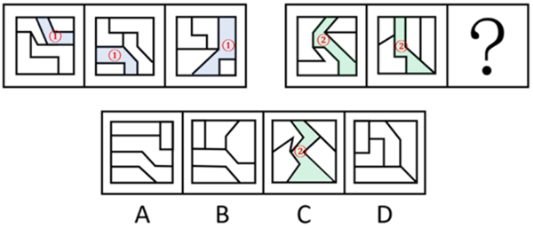
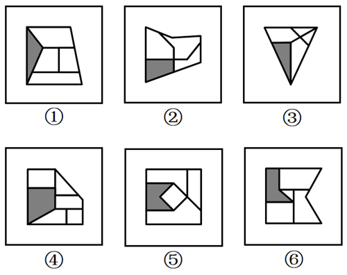

# 2026年贵州省公务员录用考试《行测》题（网友回忆版）

> 判断推理 · 30 题 · 贵州 2026

## 第 1 题　qid 16069886 · 图形推理

从所给的四个选项中，选择最合适的一个填入问号处，使之呈现一定规律性：

- **A**. A
- **B**. B　✅
- **C**. C
- **D**. D

**答案**：B

**官方解析**

元素组成相同，但无明显位置规律，也无明显属性规律，考虑数量规律。观察发现，题干图形均存在大面积黑块，且黑块有明显分堆，优先考虑黑白块的部分数。第一组图形中，黑块部分数依次为1、2、3，第二组前两幅图形的黑块部分数依次为1、2，故“？”处图形的黑块部分数应为3，只有B项符合。
故正确答案为B。

---

## 第 2 题　qid 16070143 · 图形推理

从所给的四个选项中，选择最合适的一个填入问号处，使之呈现一定的规律性：

- **A**. A
- **B**. B
- **C**. C　✅
- **D**. D

**答案**：C

**官方解析**

解析一：元素组成不同，且无明显属性规律，考虑数量规律。观察发现，题干图形分割明显，考虑面数量，但没规律；继续观察发现，题干图形均由多个面拼接而成，考虑图形间关系。第一组图中，面①将其中1个面与另外3个面完全分隔开，且同侧的3个面相交；第二组图形中，面②将与之相交的4个面两两分隔开，且同侧的2个面相交，只有C项符合。

解析二：元素组成不同，且无明显属性规律，考虑数量规律。观察发现，题干图形分割明显，考虑面数量，但没规律；继续观察发现，只考虑内部线条的情况下，第一组图内部的线条为两部分，且两部分的笔画数分别为1和3；第二组图内部的线条为两部分，且两部分的笔画数分别为2和2，只有C项符合。

故正确答案为C。

---

## 第 3 题　qid 16069844 · 图形推理

左图为两个正方体组合而成的长方体，则这两个正方体的外表面展开图分别是：

- **A**. ①和②　✅
- **B**. ③和④
- **C**. ①和④
- **D**. ②和③

**答案**：A

**官方解析**

将题干两个正方体的面标上字母序号，并在立体图形和外表面展开图的“小正方形”面（面e和面g）中以“小正方形”与外框的公共顶点为起始点，顺时针画边标号，如下图所示：

图①中，标出“小正方形”面中对应的边1和边2后发现，二者与题干右侧正方体中面g的边1和边2对应一致，故图①可能是题干右侧正方体的外表面展开图；

图②中，标出“小正方形”面中对应的边2后发现，该公共边与题干左侧正方体中面e的边2对应一致，故图②可能是题干左侧正方体的外表面展开图；

图③中，标出“小正方形”面中对应的边1和边2后发现，二者与题干右侧正方体中面g的边1和边2对应不一致，故图③不可能是题干右侧正方体的外表面展开图，且与题干左侧正方体中面e的边2也对应不一致，故图③不可能是题干左侧正方体的外表面展开图；

图④中，标出“小正方形”面中对应的边1和边2后发现，二者与题干右侧正方体中面g的边1和边2对应不一致，故图④不可能是题干右侧正方体的外表面展开图，且与题干左侧正方体中面e的边2也对应不一致，故图④不可能是题干左侧正方体的外表面展开图。

综上，两个正方体的外表面展开图可能是①和②，对应A项。

故正确答案为A。

---

## 第 4 题　qid 16070043 · 图形推理

把下面的六个图形分为两类，使每一类图形都有各自的共同特征或规律，分类正确的一项是：

- **A**. ①②③，④⑤⑥
- **B**. ①③④，②⑤⑥　✅
- **C**. ①②⑥，③④⑤
- **D**. ①④⑤，②③⑥

**答案**：B

**官方解析**

本题为分组分类题目。元素组成不同，且无明显属性规律，考虑数量规律。观察发现，题干每幅图形均出现灰色多边形，考虑数灰色多边形的边数量。题干图形的灰色多边形的边数量依次为3、4、3、4、5、5，单独数边数无法分为两组。继续观察发现，题干每幅图形中白色面较多，考虑白色面的数量。题干图形中白色面的数量依次为4、3、4、5、4、4，单独看白色面的数量无规律，考虑灰色图形的边数与白色面的数量之间做运算。图①③④的白色面的数量比灰色多边形的边数多1，图②⑤⑥的白色面的数量比灰色多边形的边数少1，即图①③④为一组，图②⑤⑥为一组。
故正确答案为B。

---

## 第 5 题　qid 16069800 · 图形推理

以下哪两个图形交换位置之后，整个图形序列将呈现一定的规律性？

- **A**. ②和③
- **B**. ③和④
- **C**. ④和⑤
- **D**. ⑤和⑥　✅

**答案**：D

**官方解析**

解析一：元素组成不同，且无明显属性规律，考虑数量规律。观察发现，题干每幅图形的内部线条均与外框相交，且内部线条与外框的交点数均为3。继续观察发现，图①到图④的3个框上交点每次沿顺时针方向移动一个边，交换图⑤和图⑥后，六个图形交点移动规律连贯，对应D项。
解析二：元素组成不同，且无明显属性规律，考虑数量规律。观察发现，题干每幅图都是一个六边形被内部线条分割成3个面，其中有且只有一个面与外边框有3条边重合，观察这3条重合边，图①到图④的3条重合边每次沿顺时针方向移动一个边，交换图⑤和图⑥后，六个图形的3条重合边移动规律连贯，对应D项。
故正确答案为D。

---

## 第 6 题　qid 16070128 · 图形推理

左下图为14个白色、2个灰色和2个黑色正方体组成的多面体的左视图和主视图，问哪一项可能是其正确的俯视图？（    ）

- **A**. A　✅
- **B**. B
- **C**. C
- **D**. D

**答案**：A

**官方解析**

本题考查三视图。根据主视图可知，该多面体的右上方没有正方体；根据左视图可知，该多面体的中后方没有正方体；根据所有选项俯视图可知，该多面体的左前方没有正方体，此时对于3×3×3形式的大立方体来说，该多面体应缺失9个小正方体。又已知该多面体有14个白色、2个灰色和2个黑色共计18个小正方体，故该多面体的其他位置均应存在小正方体。

结合左视图、主视图，可以确定符合要求的立体图形如下图所示。

立体图形对应的俯视图如下图所示，对应A项。

故正确答案为A。

---

## 第 7 题　qid 16070026 · 定义判断

情绪方言是特定文化或亚文化群体中形成的社会性情绪表达系统，其通过共享的符号规则、行为模式及认知框架，在群体内部传递、识别并规范情绪体验，具有地域性、传承性，且能与其他文化群体的情绪表达模式形成显著区分。
根据上述定义，下列不属于情绪方言的是（    ）。

- **A**. 北极圈某游牧部落的成员通过凝视积雪反光角度的细微变化，传递对猎物的敬畏等复杂情绪
- **B**. 某沙漠贸易群体在扎营时，用靴尖绘制族群特定沙纹图案表达情绪，如螺旋表交易诚意，折线表怀疑等
- **C**. 某海岛社群在集体捕鱼前吟唱特定旋律，代表对海洋风险的集体忧虑，而外来者常误以为是普通劳作号子
- **D**. 某公司业务分淡季、旺季，公司员工也逐渐形成了喝浓缩咖啡代表旺季工作压力大，喝奶茶代表淡季工作舒心的职场亚文化默契　✅

**答案**：D

**官方解析**

第一步：找出定义关键词。
“特定文化或亚文化群体中形成的社会性情绪表达系统”、“通过共享的符号规则、行为模式及认知框架，在群体内部传递、识别并规范情绪体验”、“具有地域性、传承性，且能与其他文化群体的情绪表达模式形成显著区分”。
第二步：逐一分析选项。
A项：北极圈某游牧部落的成员通过凝视积雪反光角度的细微变化传递复杂情绪，属于特定地域文化群体的符号化情绪表达，具有鲜明传承性和文化区分性，符合“特定文化或亚文化群体中形成的社会性情绪表达系统”、“通过共享的符号规则、行为模式及认知框架，在群体内部传递、识别并规范情绪体验”、“具有地域性、传承性，且能与其他文化群体的情绪表达模式形成显著区分”，符合定义，排除；
B项：某沙漠贸易群体用特定沙纹图案表达情绪，是群体内部共享的符号系统，具有地域性、传承性和文化特异性，符合“特定文化或亚文化群体中形成的社会性情绪表达系统”、“通过共享的符号规则、行为模式及认知框架，在群体内部传递、识别并规范情绪体验”、“具有地域性、传承性，且能与其他文化群体的情绪表达模式形成显著区分”，符合定义，排除；
C项：某海岛社群以吟唱特定旋律传递集体忧虑，是群体内部传承的情绪表达模式，外来者难以理解，体现文化区分性，符合“特定文化或亚文化群体中形成的社会性情绪表达系统”、“通过共享的符号规则、行为模式及认知框架，在群体内部传递、识别并规范情绪体验”、“具有地域性、传承性，且能与其他文化群体的情绪表达模式形成显著区分”，符合定义，排除；
D项：某公司员工以饮品习惯隐喻工作压力，虽是职场亚文化中的情绪默契，但缺乏地域性、传承性及显著的文化区分特征，更接近临时性、情境化的职场习惯，不符合“具有地域性、传承性，且能与其他文化群体的情绪表达模式形成显著区分”，不符合定义，当选。
本题为选非题，故正确答案为D。

---

## 第 8 题　qid 16070062 · 定义判断

环境福利绩效是衡量经济活动主体在实现经济目标过程中，对生态环境带来积极影响程度的综合指标。它涵盖资源利用效率、污染减排成效、生态系统保护成果等多个维度，评估在获取经济收益的同时，为生态环境创造的福利增值，旨在全面反映经济活动对环境改善的贡献，以推动可持续发展模式的构建。
根据上述定义，下列不属于环境福利绩效的是（    ）。

- **A**. 某大型企业在塌陷区铺设光伏板，年发电4.8亿度，与此同时还雇佣了300名失业矿工担任运维人员
- **B**. 某企业车队将车辆全部更换为纯电动车，虽然因购车支出挤占培训经费3亿元，但同时可降低碳排放15%
- **C**. 某市划拨经费改造透水路面等生态设施，大大降低了内涝发生率，同时减少排水管网维修支出1.2亿元/年　✅
- **D**. 某钢铁厂将余热接入市政供暖，替代燃煤锅炉，减少PM2.5排放41%，覆盖区域冬季呼吸道疾病就诊量下降29%

**答案**：C

**官方解析**

第一步：找出定义关键词。
“在实现经济目标过程中”、“对生态环境带来积极影响”。
第二步：逐一分析选项。
A项：某大型企业在塌陷区铺设光伏板以此发电，符合“在实现经济目标过程中”，光伏是清洁能源，减少了化石能源的使用，同时塌陷区得到开发利用，符合“对生态环境带来积极影响”，符合定义，排除；
B项：某企业车队将车辆全部更换为纯电动车，符合“在实现经济目标过程中”，降低碳排放15%，符合“对生态环境带来积极影响”，符合定义，排除；
C项：某市划拨经费改造透水路面等生态设施，属于城市公共基础设施与生态治理工程，并非经济活动主体追求经济目标的行为，不符合“在实现经济目标过程中”，不符合定义，当选；
D项：某钢铁厂将余热接入市政供暖，符合“在实现经济目标过程中”，减少PM2.5排放41%，符合“对生态环境带来积极影响”，符合定义，排除。
本题为选非题，故正确答案为C。

---

## 第 9 题　qid 16069983 · 定义判断

差错导向是指个体对错误本身以及应对错误方式的主观看法，差错掩盖导向指个体出于自我形象或短期利益的维护而产生对负面评价或惩罚的恐惧，倾向于通过否认、隐藏或推卸责任等方式掩盖错误，避免他人察觉。差错学习导向指个体以开放的心态将错误视为改进机会，主动反思错误原因、总结经验并积极调整行为以实现自我提升。
根据上述定义，下列属于差错学习导向的是（    ）。

- **A**. 某餐厅食材变质导致多名顾客食物中毒，餐厅经理把原因归结为“厨师与采购沟通不足，导致食材新鲜度不达标”
- **B**. 某三甲医院建立“无惩罚差错上报系统”，医护人员可匿名分享失误案例以供全院学习　✅
- **C**. 小赵在考试失利后大量刷题，但拒绝分析错题原因导致相同知识点反复出错
- **D**. 某企业宣称“已从用户数据泄露事件中汲取教训”，但并未升级安全系统

**答案**：B

**官方解析**

第一步：找出定义关键词。
差错导向：“个体对错误本身以及应对错误方式”、“主观看法”；
差错掩盖导向：“个体出于自我形象或短期利益的维护”、“对负面评价或惩罚的恐惧”、“通过否认、隐藏或推卸责任等方式掩盖错误”、“避免他人察觉”；
差错学习导向：“个体以开放的心态将错误视为改进机会”、“主动反思并积极调整行为”、“以实现自我提升”。
第二步：逐一分析选项。
A项：餐厅经理将中毒事件简单归咎于沟通不足，未主动反思问题根源、未总结经验、未采取改进措施，不符合“主动反思并积极调整行为”、“以实现自我提升”，不符合“差错学习导向”定义，排除；
B项：医院建立无惩罚差错上报系统，医护人员可匿名分享失误案例以供学习，符合“个体以开放的心态将错误视为改进机会”、“主动反思并积极调整行为”、“以实现自我提升”，符合“差错学习导向”定义，当选；
C项：小赵拒绝分析错题原因，不符合“主动反思并积极调整行为”，不符合“差错学习导向”定义，排除；
D项：企业未升级安全系统，不符合“主动反思并积极调整行为”，不符合“差错学习导向”定义，排除。
故正确答案为B。

---

## 第 10 题　qid 17467577 · 定义判断

敌对型自恋是以持久敌意和系统性贬低他人为核心特征的人格特质，个体在防御性动机和工具性动机的双重驱动下通过主动否定或压制他人来维护自我优越感。
根据上述定义，下列不属于敌对型自恋的是：

- **A**. 小周因为同事指出其科研成果存在重大缺陷，情绪一时崩溃，对同事大发脾气　✅
- **B**. 部门主管老周因对下属提案所涉领域不熟悉，在会议上频繁打断下属发言，并公开嘲讽其“缺乏专业素养”
- **C**. 小赵在小组讨论中，只要有人提出不同意见，他就立刻反驳，认为别人的想法都很愚蠢，只有自己的才是正确的
- **D**. 小刘本以为自己是当之无愧的项目负责人，但领导却让小王负责该项目，小刘为此多次在关键环节设置障碍，导致小王无法按时完成项目

**答案**：A

**官方解析**

第一步：找出定义关键词。
“通过主动否定或压制他人来维护自我优越感”。
第二步：逐一分析选项。
A项：该项中小周因为同事指出其研究的问题而对同事大发脾气，是被他人否定后的情绪反应，不符合“通过主动否定或压制他人来维护自我优越感”，不符合定义，当选；
B项：该项中老周因对下属提案所涉领域不熟悉，在会议上频繁打断下属发言，并公开嘲讽，说明老周主动否定下属来维护其作为主管的优越感，符合“通过主动否定或压制他人来维护自我优越感”，符合定义，排除；
C项：该项中小赵对他人提出的问题均进行反驳，认为只有自己是正确的，说明小赵主动压制他人来维护自身优越感，符合“通过主动否定或压制他人来维护自我优越感”，符合定义，排除；
D项：该项中小刘因领导让小王负责项目，便多次设置障碍，导致小王无法按时完成项目，说明小刘通过压制小王来维护自己本该是负责人的优越感，符合“通过主动否定或压制他人来维护自我优越感”，符合定义，排除。
本题为选非题，故正确答案为A。

---

## 第 11 题　qid 16069992 · 定义判断

人口粘性是以人口迁移惰性与地理空间稳定性为核心特征的社会地理现象，指特定区域内居民因资源依赖、社会交往、文化认同或制度约束等因素，形成对原居地的长期驻留倾向，抑制人口外迁动力，从而维持或强化区域人口规模与结构稳定性。
根据上述定义，下列属于人口粘性的是（    ）。

- **A**. 老刘退休后搬迁至深圳和子女一起生活，但每年清明节都会返乡扫墓
- **B**. 在上海打工的赵某十年来一直租住在房租低廉的城中村，虽然日均通勤3小时，但仍不打算迁离
- **C**. 山东农户李某每年冬季赴海南种植反季瓜菜，春季返乡务农，虽然每年往返，但多了一份额外收入
- **D**. 煤矿工人孙某因国企改制获得矿区住房产权，子女教育依托企业附属学校，尽管薪资偏低仍拒绝南下务工　✅

**答案**：D

**官方解析**

第一步：找出定义关键词。
“资源依赖、社会交往、文化认同或制度约束”、“对原居地的长期驻留倾向”。
第二步：逐一分析选项。
A项：老刘退休后搬去深圳，每年清明节返乡扫墓，说明老刘已经搬走、定居外地，只是偶尔回去，不符合“对原居地的长期驻留倾向”，不符合定义，排除；
B项：赵某在上海城中村租房，说明赵某并非长期驻留原居地，不符合“对原居地的长期驻留倾向”，不符合定义，排除；
C项：李某冬季去海南，春季回山东务农，说明李某并非长期驻留原居地，不符合“对原居地的长期驻留倾向”，不符合定义，排除；
D项：孙某有矿区住房产权、子女在企业附属学校上学，薪资低也不南下，说明是对矿区住房产权及子女企业附属学校有资源依赖，符合“资源依赖、社会交往、文化认同或制度约束”，且薪资偏低也拒绝南下，说明确实存在长期驻留倾向，符合“对原居地的长期驻留倾向”，符合定义，当选。
故正确答案为D。

---

## 第 12 题　qid 16069989 · 定义判断

语法惊异是指刻意违反语法规则以触发认知冲突与情感共鸣，在特定语境中制造“预期与现实”的认知落差，从而引发短暂而强烈的惊异体验的语言创新机制。这种体验不但能清除既有认知干扰，又能通过唤起兴趣促进认知重构，最终实现语言表达的戏剧化效果或语义增殖。
根据上述定义，下列不属于语法惊异的是（    ）。

- **A**. “梦，涂鸦了现实的画布”将“梦”比作人进行涂鸦，带来新奇感受　✅
- **B**. 广告文案“好喝到哭，这奶茶！”打破常规语序，强化情感强度，制造消费冲动
- **C**. 社交媒体中流行“被幸福”等表达，将“被”强行与抽象名词组合，制造反讽效果
- **D**. “风，温柔了田野”赋予“温柔”动作意味，使风的形象更加生动鲜活，不再是抽象的自然现象

**答案**：A

**官方解析**

第一步：找出定义关键词。
“刻意违反语法规则”、“以触发认知冲突与情感共鸣”。
第二步：逐一分析选项。
A项：“梦，涂鸦了现实的画布”将“梦”比作人，使用了拟人的修辞手法，但并未违反语法规则，“梦”是主语，“涂鸦”是谓语，“画布”是宾语，句子整体遵循“主谓宾”的常规语法规则，不符合“刻意违反语法规则”，不符合定义，当选；
B项：“好喝到哭，这奶茶！”将主语“这奶茶”后置，违反“主谓宾”的常规语序（常规语序应为“这奶茶好喝到哭！”），强化情感强度，制造消费冲动，符合“刻意违反语法规则”、“以触发认知冲突与情感共鸣”，符合定义，排除；
C项：“被幸福”将“被”强行与抽象名词“幸福”组合（“被”通常用于被动句，后接及物动词，如“被爱”，“幸福”是抽象名词，不能作“被”的宾语），制造反讽效果，符合“刻意违反语法规则”、“以触发认知冲突与情感共鸣”，符合定义，排除；
D项：“风，温柔了田野”将形容词“温柔”用作动词，带宾语“田野”（违反“形容词不能带宾语”的语法规则），使风的形象更加生动鲜活，符合“刻意违反语法规则”、“以触发认知冲突与情感共鸣”，符合定义，排除。
本题为选非题，故正确答案为A。

---

## 第 13 题　qid 16069977 · 定义判断

推理句是基于已知信息、知识或前提，通过逻辑推导得出结论的语句，属于逻辑思维在语言中的体现，它凭借合理的推理规则，从给定条件推导出可能性或必然性的结果，其结论的成立依赖于前提的真实性及逻辑有效性，核心功能在于论证观点或预测可能性，因果句是指通过显性逻辑连接词或隐性语义关联，明确表达一个事件导致另一个事件的发生，前后分句间存在客观的事理关联，其核心功能在于解释现象成因或行为动机。
根据上述定义，下列属于因果句的有几项？
①因为合同明确约定违约条款，所以甲方就应承担赔偿责任
②因为玉米价格持续下跌，所以农民明年可能改种大豆
③因为服务器散热系统故障，所以网站瘫痪3小时
④因为听到外面雨声很大，所以地面肯定湿了

- **A**. 1　✅
- **B**. 2
- **C**. 3
- **D**. 4

**答案**：A

**官方解析**

第一步：找出定义关键词。
推理句：“基于已知信息、知识或前提”、“通过逻辑推导得出结论的语句”、“它凭借合理的推理规则，从给定条件推导出可能性或必然性的结果”、“其结论的成立依赖于前提的真实性及逻辑有效性，核心功能在于论证观点或预测可能性”；
因果句：“通过显性逻辑连接词或隐性语义关联，明确表达一个事件导致另一个事件的发生”、“前后分句间存在客观的事理关联”、“其核心功能在于解释现象成因或行为动机”。
第二步：逐一进行分析。
①因为合同明确约定违约条款，所以甲方就应承担赔偿责任，“就应”表示“应该”出现某个结果，符合“它凭借合理的推理规则，从给定条件推导出可能性或必然性的结果”，属于推理句，不符合“明确表达一个事件导致另一个事件的发生”，也不符合“前后分句间存在客观的事理关联”，符合推理句定义，不符合因果句定义；
②因为玉米价格持续下跌，所以农民明年可能改种大豆，是基于经验的预测，符合“它凭借合理的推理规则，从给定条件推导出可能性或必然性的结果”、“其结论的成立依赖于前提的真实性及逻辑有效性，核心功能在于论证观点或预测可能性”，符合推理句定义，不符合因果句定义；
③因为服务器散热系统故障，所以网站瘫痪3小时，“服务器散热系统故障”直接导致“网站瘫痪3小时”的发生，符合“通过显性逻辑连接词或隐性语义关联，明确表达一个事件导致另一个事件的发生”、“前后分句间存在客观的事理关联”、“其核心功能在于解释现象成因或行为动机”，符合因果句定义；
④因为听到外面雨声很大，所以地面肯定湿了，是基于经验的预测，符合“它凭借合理的推理规则，从给定条件推导出可能性或必然性的结果”、“其结论的成立依赖于前提的真实性及逻辑有效性，核心功能在于论证观点或预测可能性”，符合推理句定义，不符合因果句定义。
综上，属于因果句的只有③，共1项。
故正确答案为A。

---

## 第 14 题　qid 16069973 · 定义判断

分权时序是指政府或组织在权力分配过程中，依据特定逻辑，分阶段、按顺序逐步下放权力的策略，其核心逻辑是通过“时序规划”降低分权风险，确保权力下放与承接能力、管理成熟度相匹配。
根据上述定义，下列属于分权时序的是：

- **A**. 某企业市场部根据产品推广计划安排不同地区的促销活动时间
- **B**. 某政府部门在公共设施建设中，根据项目进度和资金安排分阶段推进不同区域的设施建设
- **C**. 某公司研发团队在产品研发过程中，根据项目进度安排团队不同成员的工作任务和时间顺序
- **D**. 某矿区开展生态修复项目时，地方政府优先赋予矿区环境监管权，但未同步下放排污费征收权　✅

**答案**：D

**官方解析**

第一步：找出定义关键词。
“政府或组织在权力分配过程中”、“分阶段、按顺序逐步下放权力”。
第二步：逐一分析选项。
A项：某企业市场部根据产品推广计划安排不同地区的促销活动时间，属于工作时间安排，没有体现权力分配与下放权力，不符合“政府或组织在权力分配过程中”、“分阶段、按顺序逐步下放权力”，不符合定义，排除；
B项：某政府部门根据项目进度和资金安排分阶段推进公共设施建设，属于项目建设推进，没有体现权力分配与下放权力，不符合“政府或组织在权力分配过程中”、“分阶段、按顺序逐步下放权力”，不符合定义，排除；
C项：某公司研发团队根据项目进度安排成员工作任务和时间顺序，属于工作分工与进度安排，没有体现权力分配与下放权力，不符合“政府或组织在权力分配过程中”、“分阶段、按顺序逐步下放权力”，不符合定义，排除；
D项：地方政府优先赋予矿区环境监管权，未同步下放排污费征收权，体现权力分配与下放权力，符合“政府或组织在权力分配过程中”、“分阶段、按顺序逐步下放权力”，符合定义，当选。
故正确答案为D。

---

## 第 15 题　qid 16069769 · 类比推理

江山：画卷

- **A**. 琴弦：心声
- **B**. 节气：农事
- **C**. 火药：军事
- **D**. 春雨：甘露　✅

**答案**：D

**官方解析**

第一步：判断题干词语间逻辑关系。
江山可以被比喻为画卷，二者为比喻象征义。
第二步：判断选项词语间逻辑关系。
A项：琴弦是传递心声的工具，二者不是比喻象征义，与题干逻辑关系不一致，排除；
B项：农事活动依据节气，二者为依据对应关系，与题干逻辑关系不一致，排除；
C项：火药可用于军事领域，二者为应用领域对应关系，与题干逻辑关系不一致，排除；
D项：春雨可以被比喻为甘露，二者为比喻象征义，与题干逻辑关系一致，当选。
故正确答案为D。

---

## 第 16 题　qid 17467571 · 类比推理

探空火箭：探索太空

- **A**. 基因编辑：筛选胚胎
- **B**. 人工智能：提升效率　✅
- **C**. 法律规范：经济调控
- **D**. 疫苗接种：公共卫生

**答案**：B

**官方解析**

第一步：判断题干词语间逻辑关系。
探空火箭可以用来探索太空，二者是功能对应关系。
第二步：判断选项词语间逻辑关系。
A项：基因编辑是指通过基因编辑技术对生物体基因组特定目标进行修饰的过程，其主要功能是修复或纠正基因，筛选胚胎是指通过对体外培养的胚胎进行基因检测，筛选出正常胚胎以降低遗传病风险，二者不是功能对应关系，与题干逻辑关系不一致，排除；
B项：人工智能可以用来提升效率，二者是功能对应关系，与题干逻辑关系一致，当选；
C项：法律规范不是用来经济调控的，二者不是功能对应关系，与题干逻辑关系不一致，排除；
D项：疫苗接种是公共卫生领域的一方面，二者不是功能对应关系，与题干逻辑关系不一致，排除。
故正确答案为B。

---

## 第 17 题　qid 17467572 · 类比推理

暴雨：洪水预警：加高堤坝

- **A**. 地震：余震监测：稳固房屋　✅
- **B**. 旱灾：人工降雨：水库蓄水
- **C**. 台风：航线取消：航班延误
- **D**. 寒潮：供暖启动：道路结冰

**答案**：A

**官方解析**

第一步：判断题干词语间逻辑关系。
洪水预警是暴雨发生以后的监控手段，加高堤坝是防灾措施。
第二步：判断选项词语间逻辑关系。
A项：余震监测是地震发生以后的监控手段，稳固房屋是防灾措施，与题干逻辑关系一致，当选；
B项：人工降雨不是旱灾发生以后的监控手段，与题干逻辑关系不一致，排除；
C项：航线取消不是台风发生以后的监控手段，与题干逻辑关系不一致，排除；
D项：供暖启动不是寒潮发生以后的监控手段，与题干逻辑关系不一致，排除。
故正确答案为A。

---

## 第 18 题　qid 16069764 · 类比推理

输液泵：病房：精准给药

- **A**. 雷达站：机场：情报传输
- **B**. 变压器：电网：电压调节
- **C**. 消防栓：街道：应急供水　✅
- **D**. 服务器：硬盘：数据存储

**答案**：C

**官方解析**

第一步：判断题干词语间逻辑关系。
输液泵是作用于输液导管以控制输液速度、严格控制输液量和药量的机械或电子装置，输液泵可在病房内使用，具有精准给药的功能，前两词是事物与地点的对应关系，第一词与第三词是功能的对应关系。
第二步：判断选项词语间逻辑关系。
A项：雷达站可放置在机场内，但其作用是通过探测来保障飞行安全和进行空中交通管制，并非传输情报，第一词与第三词并非功能的对应关系，与题干逻辑关系不一致，排除；
B项：变压器是电网中不可或缺的核心设备，前两词是组成关系，与题干逻辑关系不一致，排除；
C项：消防栓可放在街道中，且消防栓在特定条件下，具有应急供水的功能，前两词是事物与地点的对应关系，第一词与第三词是功能的对应关系，与题干逻辑关系一致，当选；
D项：服务器是在网络环境中提供计算能力并运行软件应用程序的特定IT设备，硬盘是服务器的重要组成部分，前两词是组成关系，与题干逻辑关系不一致，排除。
故正确答案为C。

---

## 第 19 题　qid 16070025 · 类比推理

鸟蛋：鸟巢：树木

- **A**. 书签：书本：书架　✅
- **B**. 月亮：地球：太阳
- **C**. 信件：信封：邮寄
- **D**. 细胞：器官：动物

**答案**：A

**官方解析**

第一步：判断题干词语间逻辑关系。
鸟巢是鸟用来孵化鸟蛋的地方，树木则是搭建鸟巢的地方，第一词和第二词、第二词和第三词均是地点对应。
第二步：判断选项词语间逻辑关系。
A项：书签放置在书本中，书本放置在书架上，第一词和第二词、第二词和第三词均是地点对应，与题干逻辑关系一致，当选；
B项：月亮、地球、太阳是三个不同的星体，三者是并列关系，与题干逻辑关系不一致，排除；
C项：信件放置在信封中，但邮寄信封是动宾短语，与题干逻辑关系不一致，排除；
D项：细胞是器官的组成部分，器官是动物的组成部分，第一词和第二词、第二词和第三词均是组成关系，与题干逻辑关系不一致，排除。
故正确答案为A。

---

## 第 20 题　qid 17467576 · 类比推理

（    ） 对于 翰墨丹青 相当于 （    ） 对于 霓裳羽衣

- **A**. 画家；绣娘　✅
- **B**. 画室；舞台
- **C**. 绘画；服饰
- **D**. 笔墨；布料

**答案**：A

**官方解析**

逐一代入选项。
A项：画家可以画出翰墨丹青，二者为职业与创作内容的对应关系；绣娘可以做出霓裳羽衣，二者为职业与创作内容的对应关系，前后逻辑关系一致，当选；
B项：画室是创作翰墨丹青的场所，二者为创作场所与创作内容的对应关系；舞台是展示霓裳羽衣的场所，二者为展示场所与展示内容的对应关系，前后逻辑关系不一致，排除；
C项：翰墨丹青是绘画的雅称；霓裳羽衣是服饰的一种，二者为种属关系，前后逻辑关系不一致，排除；
D项：笔墨是创作翰墨丹青的工具，二者为工具对应关系；布料是制作霓裳羽衣的原料，二者为原材料与成品的对应关系，前后逻辑关系不一致，排除。
故正确答案为A。

---

## 第 21 题　qid 16070051 · 类比推理

移动支付 对于 （    ） 相当于 （    ） 对于 资源优化

- **A**. 手机操作；平台运营
- **B**. 远程购物；通讯网络
- **C**. 便捷交易；共享单车　✅
- **D**. 电子支付；汽车租赁

**答案**：C

**官方解析**

逐一代入选项。
A项：移动支付需要通过手机操作实现，二者为条件对应关系；平台运营实现了资源优化，二者为方式与结果对应关系，前后逻辑关系不一致，排除；
B项：远程购物需要通过移动支付实现，二者为条件对应关系；通讯网络与资源优化没有必然关联，前后逻辑关系不一致，排除；
C项：移动支付实现了便捷交易，共享单车实现了资源优化，二者均为方式与结果对应关系，前后逻辑关系一致，当选；
D项：移动支付是电子支付的一种，二者为种属关系；汽车租赁实现了资源优化，二者为方式与结果对应关系，前后逻辑关系不一致，排除。
故正确答案为C。

---

## 第 22 题　qid 16069773 · 类比推理

（    ） 对于 轨道 相当于 候鸟 对于 （    ）

- **A**. 卫星；迁徙路线　✅
- **B**. 车道；大雁
- **C**. 汽车；湿地公园
- **D**. 马路；丹顶鹤

**答案**：A

**官方解析**

逐一代入选项。
A项：卫星沿着轨道运行，二者是主体与运动轨迹的对应关系；候鸟沿着迁徙路线飞行，二者是主体与运动轨迹的对应关系，前后逻辑关系一致，当选；
B项：车道和轨道是两种不同的道路设施，二者是并列关系；大雁是一种候鸟，二者是种属关系，前后逻辑关系不一致，排除；
C项：某些特殊的轨道汽车可以在轨道上行驶，二者是主体与运动轨迹的对应关系；湿地公园是候鸟的栖息地，二者是地点的对应关系，前后逻辑关系不一致，排除；
D项：马路和轨道是两种不同的道路设施，二者是并列关系；丹顶鹤是一种候鸟，二者是种属关系，前后逻辑关系不一致，排除。
故正确答案为A。

---

## 第 23 题　qid 16070050 · 逻辑判断

最新研究发现，M国人口超过60万的28个主要城市都在下沉，下沉速度最快的N市近40%的区域每年下沉超过5毫米，还有些区域每年下沉幅度甚至高达5厘米。研究人员将地下水抽取数据与地面沉降数据比较分析后确认，为满足不断增长的人口用水和工商业用水需要大量开采地下水，是造成城市下沉的原因。
以下哪项如果为真，最能支持上述研究人员观点？

- **A**. 大量开采地下水会导致土壤结构变化并影响上层土体稳定性
- **B**. 地下水水位下降使土体失去足够支撑力，进而引起地面沉降
- **C**. 大量抽取地下水会造成地下水水位下降，进而引发地面沉降　✅
- **D**. 在一定范围内，地下水开采量与地面沉降速率呈正相关关系

**答案**：C

**官方解析**

第一步：找出论点和论据。
论点：为满足不断增长的人口用水和工商业用水需要大量开采地下水，是造成城市下沉的原因。
论据：最新研究发现，M国人口超过60万的28个主要城市都在下沉，下沉速度最快的N市近40%的区域每年下沉超过5毫米，还有些区域每年下沉幅度甚至高达5厘米。研究人员将地下水抽取数据与地面沉降数据比较分析后确认，大量开采地下水会造成城市下沉。
本题论点和论据均在讨论地下水抽取和城市下沉的关系，二者话题一致，加强优先考虑补充论据。
第二步：逐一分析选项。
A项：指出大量开采地下水会导致土壤结构变化并影响上层土体稳定性，论点讨论的是大量开采地下水会造成城市下沉，不明确土壤结构变化和上层土体稳定性与城市下沉的关系，不明确选项，无法加强，排除；
B项：指出地下水水位下降引起地面沉降，论点讨论的是大量开采地下水会造成城市下沉，不明确地下水水位下降是否是因为大量开采地下水，不明确选项，无法加强，排除；
C项：指出大量抽取地下水会造成地下水水位下降，进而引发地面沉降，解释了为什么大量开采地下水会造成城市下沉，补充论据，可以加强，当选； 
D项：指出在一定范围内，地下水开采量与地面沉降速率呈正相关关系，论点讨论的是大量开采地下水会造成城市下沉，呈正相关关系不代表有因果关系，不明确选项，排除。
故正确答案为C。

---

## 第 24 题　qid 16069810 · 逻辑判断

一项随机对照研究以某地区90余名36~66岁的肥胖人群作为研究对象，实验组每天早餐前喝220克酸奶，对照组喝相同量的牛奶。该实验持续24周，结果发现，与对照组相比，实验组受试者的身体脂肪平均减少了2.26公斤。研究者认为，喝酸奶可以降低体脂率。
以下哪项如果为真，最能削弱题干中研究者的结论？

- **A**. 市场上的许多酸奶产品添加了糖分以提升口感，但也增加了热量摄入
- **B**. 实验期间除规律饮食外，实验组有人每天保持了一定强度的有氧锻炼　✅
- **C**. 酸奶富含钙质及蛋白质等营养成分，餐前半小时喝酸奶可减轻饥饿感
- **D**. 酸奶中的益生菌对于改善消化功能有显著效果，有助于身体新陈代谢

**答案**：B

**官方解析**

第一步：找出论点和论据。
论点：喝酸奶可以降低体脂率。
论据：一项随机对照研究以某地区90余名36~66岁的肥胖人群作为研究对象，实验组每天早餐前喝220克酸奶，对照组喝相同量的牛奶。该实验持续24周，结果发现，与对照组相比，实验组受试者的身体脂肪平均减少了2.26公斤。
本题论点说的是“喝酸奶”可以“降低体脂率”，论据通过实验证明“喝酸奶”可以“减少身体脂肪”，二者话题一致，削弱可以考虑削弱论点，且论点中存在因果关系，削弱还可以考虑他因削弱和因果倒置。
第二步：逐一分析选项。
A项：选项指出市场上的许多酸奶因添加糖分会增加热量摄入，但不清楚实验中所选酸奶的糖分情况，且并未直接削弱实验组喝酸奶可以降低体脂率的结论，无法削弱，排除；
B项：选项指出实验组除规律饮食外，部分人每天还保持了一定强度的有氧锻炼，说明实验组的这部分人也可能是通过有氧锻炼而降低了体脂率，他因削弱，可以削弱，当选；
C项：选项指出在餐前喝酸奶可以减轻饥饿感，解释了为什么喝酸奶可以降低体脂率，为加强项，无法削弱，排除；
D项：选项指出酸奶有助于改善消化功能和身体的新陈代谢，解释了为什么喝酸奶可以降低体脂率，为加强项，无法削弱，排除。
故正确答案为B。

---

## 第 25 题　qid 16069781 · 逻辑判断

继黄金、白银价格大幅拉涨后，近日期货市场上铂金价格也出现了上涨。作为有色金属，铂、钯等铂族金属可吸收氢气，是汽车尾气催化剂以及氢能等新兴应用场景的关键原材料。有专家认为，此轮铂金行情看涨并非短期情绪驱动，铂金价格将持续走高。
以下除哪一项外，均能支持上述专家的观点？

- **A**. 由于国际市场的需要，未来燃油汽车产业和清洁能源行业对铂金的需求会持续扩大
- **B**. 在美元信用走弱的趋势下，交易市场基于稳定预期，会将投资目光转向黄金、白银、铂金等贵金属
- **C**. 铂金具有化学稳定性、催化活性和生物相容性，一直以来被广泛应用于航空航天、生物医药等现代高科技产业　✅
- **D**. N国拥有全球70%以上铂金产量，但该国近期面临电力短缺、矿体老化和运营成本上升等情况，导致全球铂金供应不足进一步加剧

**答案**：C

**官方解析**

第一步：找出论点和论据。
论点：此轮铂金行情看涨并非短期情绪驱动，铂金价格将持续走高。
论据：近日期货市场上铂金价格也出现了上涨。作为有色金属，铂、钯等铂族金属可吸收氢气，是汽车尾气催化剂以及氢能等新兴应用场景的关键原材料。
本题论点与论据都在说铂族金属是新兴应用场景的关键原材料，所以后续价格会持续走高，论点和论据话题一致，加强优先考虑补充论据，即解释原因或举例子，且本题为选非题，将可以加强的选项排除即可。
第二步：逐一分析选项。
A项：该项讨论的是燃油汽车产业和清洁能源行业对铂金的需求会持续扩大，而需求扩大会带来铂金价格的持续走高，补充论据，可以加强，排除；
B项：该项讨论的是美元信用走弱，使得资金流向黄金、白银、铂金等贵金属，资金流入铂族金属时会增加铂族金属的需求，而需求增加会带来铂金价格的持续走高，补充论据，可以加强，排除；
C项：该项讨论的是铂金因化学稳定性、催化活性等，一直被广泛应用于航空航天、生物医药等高科技产业，只能表明其用途广泛，并未提到其未来需求增加或供给减少，不能证明其价格是否会持续走高，为不明确项，无法加强，当选；
D项：该项讨论的是N国铂金产量占全球70%以上，但其面临电力短缺、矿体老化、运营成本上升等情况导致全球铂金供应不足加剧，说明铂金供给减少，而供给减少会带来铂金价格的持续走高，补充论据，可以加强，排除。
本题为选非题，故正确答案为C。

---

## 第 26 题　qid 16069861 · 逻辑判断

冻雨是冬季常见的灾害性天气之一，它落地凝结成冰，给生产生活带来不小威胁。Z地区冻雨分布呈现“西部多、东部少，中部多、南北少”的鲜明特点。对于该地区冻雨分布的特点，有气象学家认为，这与当地地形有关。Z地区的西部、中部分布着大片高海拔的山区，而东部、南北部则分布着低海拔的河谷和平缓地带。高海拔的山区气温更低，为冻雨形成提供了充分的温度条件；而在低海拔的河谷和平缓地带冻雨出现概率低、范围小。因此有气象学家认为，Z地区冻雨分布特点是由当地的地形决定的。
以下哪项如果为真，最能削弱上述论证？

- **A**. 受大气环流及地形等影响，Z地区气候多样且不稳定，灾害性天气种类较多，干旱、凌冻、冰雹等频度大
- **B**. 除了地势西高东低外，Z地区还有大面积的丘陵地带，通过地形抬升作用促进了水汽的积聚和冷却，从而增加了冻雨发生的可能性
- **C**. 气温低和降水是形成冻雨的条件，雨滴在下降过程中以过冷水滴的形式存在，这样当它们到达地面时，就出现了冻结的情况，即冻雨
- **D**. 冬季，来自北方的冷气团与来自东南的暖湿气流在Z地区交汇，形成难以消散的准静止锋，它与地形共同作用形成了当地冻雨分布的特点　✅

**答案**：D

**官方解析**

第一步：找出论点和论据。
论点：Z地区冻雨分布特点是由当地的地形决定的。
论据：Z地区冻雨分布呈现“西部多、东部少，中部多、南北少”的鲜明特点。Z地区的西部、中部分布着大片高海拔的山区，而东部、南北部则分布着低海拔的河谷和平缓地带。高海拔的山区气温更低，为冻雨形成提供了充分的温度条件；而在低海拔的河谷和平缓地带冻雨出现概率低、范围小。
本题论点和论据均围绕Z地区冻雨分布特点与地形的关系展开，话题一致，削弱优先考虑削弱论点。
第二步：逐一分析选项。
A项：该项指出Z地区受大气环流及地形等影响，气候多样且不稳定，灾害性天气种类较多，但没有涉及这些因素对冻雨分布特点的具体影响，与论点讨论的冻雨分布特点是否由地形决定无关，为无关项，无法削弱，排除；
B项：该项指出Z地区的丘陵地带通过地形抬升作用增加了冻雨发生的可能性，强调了地形对冻雨分布的促进作用，可以加强，无法削弱，排除；
C项：该项指出气温低与冻雨的形成有关，肯定了论据“高海拔的山区气温更低，为冻雨形成提供了充分的温度条件”，可以加强，无法削弱，排除；
D项：该项指出冬季来自北方的冷气团与来自东南的暖湿气流在Z地区交汇形成难以消散的准静止锋，是准静止锋与地形共同作用形成了当地冻雨分布的特点，说明Z地区冻雨分布特点并非仅由地形决定，直接削弱了论点，可以削弱，当选。
故正确答案为D。

---

## 第 27 题　qid 16070061 · 逻辑判断

当下许多人工智能大模型产品如雨后春笋般涌现，人们的阅读场景正经历着颠覆性变革。现在只需将要阅读的作品上传至人工智能大模型产品，就能快速得到大纲目录、核心摘要等内容，还可以根据读者不同的指令对作品进行各种视角的“解读式阅读”。因此，对于平时没时间做深度阅读的人而言，借助人工智能工具能替代“阅读”。
以下哪项如果为真，最能质疑上述观点？

- **A**. 阅读是人类文化传承和发展最重要的方式，其文化力量更是无可替代的　✅
- **B**. 用人工智能技术辅助阅读时可以高效整合大量相关内容，既省时又全面
- **C**. 单纯依赖人工智能快速提供答案，很容易让人忽略系统性学习的重要性
- **D**. 当下人工智能产品所生成的内容中有些概念、知识其实是拼凑、虚构的

**答案**：A

**官方解析**

第一步：找出论点和论据。
论点：对于平时没时间做深度阅读的人而言，借助人工智能工具能替代“阅读”。
论据：现在只需将要阅读的作品上传至人工智能大模型产品，就能快速得到大纲目录、核心摘要等内容，还可以根据读者不同的指令对作品进行各种视角的“解读式阅读”。
本题论点和论据都在讨论人工智能工具能否替代“阅读”，二者话题一致，削弱优先考虑否定论点。
第二步：逐一分析选项。
A项：指出阅读是人类文化传承和发展最重要的方式，其文化力量更是无可替代的，说明无法借助人工智能工具替代“阅读”，削弱论点，可以削弱，保留；
B项：指出人工智能技术辅助阅读的好处，解释了借助人工智能工具能替代“阅读”的原因，为加强项，无法削弱，排除；
C项：指出单纯依赖人工智能快速提供答案的坏处，但论点讨论的是借助人工智能工具能替代“阅读”，话题不一致，无法削弱，排除；
D项：指出当下人工智能产品所生成的内容中有些概念、知识其实是拼凑、虚构的，说明人工智能生成的有些内容可能不可靠，无法借助人工智能工具替代“阅读”，削弱论点，可以削弱，保留。
对比A、D两项，题干论点强调的是“替代”，A项指出了阅读的无可替代性，即使人工智能工具总结的都是正确的，也替代不了“阅读”，因为“阅读”是一个重要的思维发展的过程和方式，所以A项的削弱力度更强。
故正确答案为A。

---

## 第 28 题　qid 16069793 · 逻辑判断

近期的一项研究发现，氢排放会间接加剧全球变暖，1990年至2020年累积的氢排放为工业化后的全球平均气温上升“贡献”了0.02摄氏度。氢气间接加剧全球变暖的主要原因是它会消耗大气中能够分解温室气体甲烷的天然净化物质，大气中的氢气越多，这类天然净化物质就越少，从而延长甲烷在大气中的留存时间，加剧升温。此外，另有研究发现，近三十年人类活动在整体规模、强度与对全球影响范围上显著增强。由此可见，人类活动加剧了全球变暖。
上述论证的成立，必须基于以下哪一前提？

- **A**. 人类活动排放的大量二氧化碳是推动全球变暖的元凶
- **B**. 1990年至2020年间，全球氢气排放量的增加主要由于人类活动　✅
- **C**. 氢气与这类天然净化物质的反应会生成臭氧、水蒸气等温室气体
- **D**. 氢气排放会对人类的工业、农业等活动产生直接或间接不利影响

**答案**：B

**官方解析**

第一步：找出论点和论据。
论点：人类活动加剧了全球变暖。
论据：氢排放会间接加剧全球变暖，1990年至2020年累积的氢排放为工业化后的全球平均气温上升“贡献”了0.02摄氏度。氢气间接加剧全球变暖的主要原因是它会消耗大气中能够分解温室气体甲烷的天然净化物质，大气中的氢气越多，这类天然净化物质就越少，从而延长甲烷在大气中的留存时间，加剧升温。此外，另有研究发现，近三十年人类活动在整体规模、强度与对全球影响范围上显著增强。
本题论点讨论的是人类活动加剧了全球变暖，论据讨论的是氢排放加剧全球变暖，且近三十年人类活动增强。论点和论据有话题不一致的地方，加强可考虑搭桥，即建立“人类活动”与“氢排放”之间的联系。
第二步：逐一分析选项。
A项：该项说人类活动排放的大量二氧化碳是推动全球变暖的元凶，补充论据说明人类活动加剧了全球变暖，可以加强，保留；
B项：该项说1990年至2020年间（即近三十年），全球氢气排放量的增加主要由于人类活动，建立了“人类活动”与“氢排放”之间的联系，搭桥项，可以加强，保留；
C项：该项说氢气会通过反应生成温室气体，但没有提及人类活动，无法说明是否是人类活动加剧了全球变暖，话题不一致，无法加强，排除；
D项：该项说氢气排放会对人类活动产生影响，没有提及全球变暖，与论点讨论的人类活动加剧全球变暖话题不一致，无法加强，排除。
对比A、B两项，B项搭桥的加强力度大于A项补充论据，当选。
故正确答案为B。

---

## 第 29 题　qid 16070140 · 逻辑判断

近年来，不少高校在课程论文、毕业论文中明确列出AI工具的“可用清单”与“禁用边界”，要求学生声明是否使用AI。国际主流学术期刊与出版机构也相继更新投稿须知，强调AI不得署名为作者，要求披露AI使用情况，并重申作者对论文内容的最终责任。面对AI的迅猛发展，这些规范回应迅速，态度审慎，体现了学术共同体对伦理风险的高度重视。因此，这些AI使用规范的出台，有利于防止学术不端的出现。
以下哪项如果为真，最能削弱上述论证？

- **A**. 无论是教学科研，还是论文写作与数据处理，在当前的学术界，AI的使用已经成为常态
- **B**. 除了作者自我披露，目前不存在可靠的AI检测工具来检测是否使用以及在多大程度上使用了AI　✅
- **C**. 在学术实践中，AI不只被用于代写等极端场景，还参与到梳理论证结构、优化逻辑衔接、润色语言表达等各个环节
- **D**. 上述规则只是在形式上作了更新，但其核心依然延续了传统学术不端治理的路径，即划定允许与禁止的边界并加以惩戒

**答案**：B

**官方解析**

第一步：找出论点和论据。
论点：这些AI使用规范的出台，有利于防止学术不端的出现。
论据：不少高校在课程论文、毕业论文中明确列出AI工具的“可用清单”与“禁用边界”，要求学生声明是否使用AI。国际主流学术期刊与出版机构也相继更新投稿须知，强调AI不得署名为作者，要求披露AI使用情况，并重申作者对论文内容的最终责任。面对AI的迅猛发展，这些规范回应迅速，态度审慎，体现了学术共同体对伦理风险的高度重视。
本题论点与论据均在讨论AI使用规范与防止学术不端的关系，二者话题一致，削弱可以优先考虑削弱论点。 
第二步：逐一分析选项。
A项：指出学术界AI使用已成为常态，只能说明用的多，无法说明AI使用规范能否防止学术不端，无关选项，无法削弱，排除；
B项：指出除了作者自我披露，目前不存在可靠的AI检测工具来检测是否使用以及在多大程度上使用了AI，说明是否使用AI只能靠作者的自我披露，并没有有效的监测方式，那么想学术不端的人可以用了AI却不声明，AI使用规范就失去了作用，进而无法防止学术不端行为，削弱论点，可以削弱，当选；
C项：指出AI用途广泛，无法说明AI使用规范能否防止学术不端，无关选项，无法削弱，排除；
D项：指出AI使用规范只在形式上作了更新，其核心依然延续了传统学术不端治理的路径，只能说明AI使用规范与传统方式一致，但这无法说明AI使用规范能否防止学术不端，无法削弱，排除。
故正确答案为B。

---

## 第 30 题　qid 16069788 · 逻辑判断

S岛位于太平洋，考古证据表明，S岛上的P族人在政治上并没有统一，因此学界对于岛上数百座石像是否由一个首领协调建造观点不一。岛上只有一个提供石像所用火山岩的采石场，近期研究人员使用无人机和高科技测绘设备，创建了采石场的首张三维地图，其中包含大量未完成的石像。研究人员发现，采石场被划分为30个工作区，每个区域似乎都是独立的。研究人员据此认为，S岛上的石像是由许多不同的部落制作的。
以下哪项如果为真，最能支持上述结论?

- **A**. 研究中发现，未完成的石像在采石场的各个工作区中均有分布，且石像的完成进度不同
- **B**. 在与P族人同时代其他地区的部落中，也有很多部落没有统一的首领，处在去中心化的阶段
- **C**. 据史料记载，S岛上曾经出现过多个部落共存的局面，各部落之间还会爆发不同规模的领地冲突
- **D**. 研究人员在S岛上找到了426个代表不同完成阶段的石像，发现它们采用了不同的雕刻技术，特征也不一样　✅

**答案**：D

**官方解析**

第一步：找出论点和论据。
论点：S岛上的石像是由许多不同的部落制作的。
论据：岛上只有一个提供石像所用火山岩的采石场，近期研究人员使用无人机和高科技测绘设备，创建了采石场的首张三维地图，其中包含大量未完成的石像。研究人员发现，采石场被划分为30个工作区，每个区域似乎都是独立的。
本题论点在讨论“石像”和“不同部落”，论据在讨论“石像”和“独立区域”，其中“不同部落”和“独立区域”关系密切，所以论点和论据二者话题一致，加强考虑补充论据。
第二步：逐一分析选项。
A项：选项说的是未完成的石像在采石场的各个工作区中均有分布，论点讨论的是S岛上的石像是由谁制作的，二者话题不一致，不能加强，排除；
B项：选项说的是与P族人同时代其他地区的部落首领的情况，论点讨论的是S岛上的石像是由谁制作的，二者话题不一致，不能加强，排除；
C项：选项说的是S岛多个部落共存的情况，论点讨论的是S岛上的石像是由谁制作的，二者话题不一致，不能加强，排除；
D项：选项说的是426个石像采用了不同的雕刻技术，特征也不一样，补充论据，说明S岛上的石像的确是由许多不同的部落制作的，可以加强，当选。
故正确答案为D。

---
