# 2026年辽宁省公务员录用考试《行测》题（网友回忆版）

> 判断推理 · 30 题 · 辽宁 2026

## 第 1 题　qid 15833789 · 图形推理

从所给的四个选项中，选择最合适的一个填入问号处，使之呈现一定的规律性：

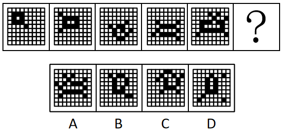

- **A**. A　✅
- **B**. B
- **C**. C
- **D**. D

**答案**：A

**官方解析**

元素组成不同，且无明显属性规律，考虑数量规律。观察发现，题干每幅图黑块包围的白块数量依次递增，故“？”处的白块数应为6，排除B、D两项；继续观察发现，其余没有包围白块的黑块数依次递增，故“？”处应选择一个没有包围白块的黑块数为6的图形，只有A项符合。

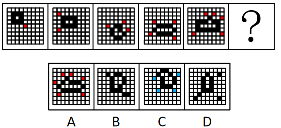

故正确答案为A。

---

## 第 2 题　qid 15833787 · 图形推理

把下面的六个图形分为两类，使每一类图形都有各自的共同特征或规律，分类正确的一项是：

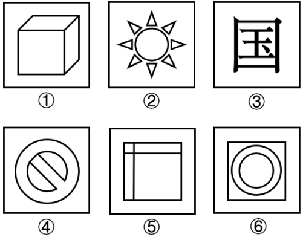

- **A**. ①②③，④⑤⑥
- **B**. ①③④，②⑤⑥
- **C**. ①④⑤，②③⑥　✅
- **D**. ①②⑥，③④⑤

**答案**：C

**官方解析**

本题为分组分类题目。元素组成不同，且属性规律无答案，考虑数量规律。观察发现，图④、图⑥为圆相切的变形图，图①、图⑤为“田”字变形图，考虑笔画数。图①④⑤为两笔画图形，图②③⑥笔画数依次为9、8（汉字笔画数）、3，为非两笔画图形。即①④⑤一组，②③⑥一组。
故正确答案为C。

---

## 第 3 题　qid 15833719 · 图形推理

从所给的四个选项中，选择最合适的一个填入问号处，使之呈现一定的规律性：

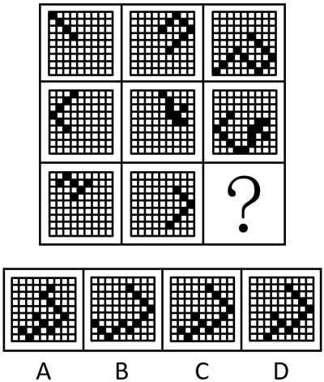

- **A**. A
- **B**. B
- **C**. C　✅
- **D**. D

**答案**：C

**官方解析**

元素组成相似，优先考虑样式规律。九宫格优先看横行，观察发现，第一行图形中，图一和图二先相加，再将相加后的图形向下翻转得到图三；经验证，第二行符合此规律；第三行应用此规律，只有C项符合。
故正确答案为C。

---

## 第 4 题　qid 15833644 · 图形推理

从所给的四个选项中，选择最合适的一个填入问号处，使之呈现一定的规律性：

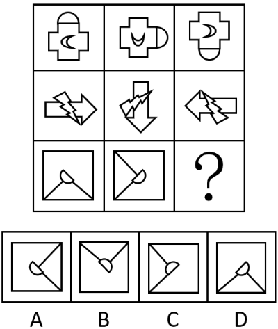

- **A**. A
- **B**. B　✅
- **C**. C
- **D**. D

**答案**：B

**官方解析**

元素组成相同，优先考虑位置规律。九宫格优先横向看，第一行中，内部的图形依次逆时针旋转，外圈的图形依次顺时针旋转，第二行中，上层的图形依次逆时针旋转，下层的图形依次顺时针旋转。第三行应用此规律，内部的半圆依次逆时针旋转，其余线条依次顺时针旋转，对应B项。 

故正确答案为B。

---

## 第 5 题　qid 15833781 · 图形推理

把下面的六个图形分为两类，使每一类图形都有各自的共同特征或规律，分类正确的一项是：

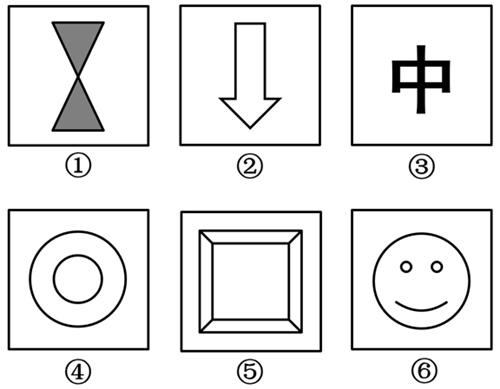

- **A**. ①②③，④⑤⑥
- **B**. ①③④，②⑤⑥
- **C**. ①④⑤，②③⑥　✅
- **D**. ①②⑥，③④⑤

**答案**：C

**官方解析**

本题为分组分类题目。元素组成不同，优先考虑属性规律。观察发现，题干图形均较为规整，考虑对称性。图①④⑤均为既轴对称又中心对称的图形，图②③⑥均为仅轴对称图形，即图①④⑤为一组，图②③⑥为一组。
故正确答案为C。

---

## 第 6 题　qid 15833785 · 图形推理

左图为3个白色正方体和4个灰色正方体粘接而成的多面体，将其从任一方向剖开，下面哪一项不可能是该立体图形的截面？

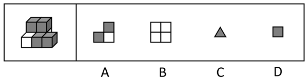

- **A**. A
- **B**. B　✅
- **C**. C
- **D**. D

**答案**：B

**官方解析**

本题考查截面图，如下图所示，A、C、D三项均可截出，只有B项无法截出。

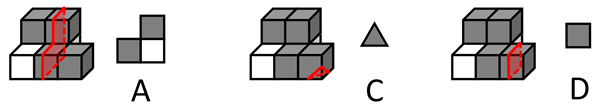

本题为选非题，故正确答案为B。

---

## 第 7 题　qid 15833795 · 图形推理

从所给的四个选项中，选择最合适的一个填入问号处，使之呈现一定的规律性：

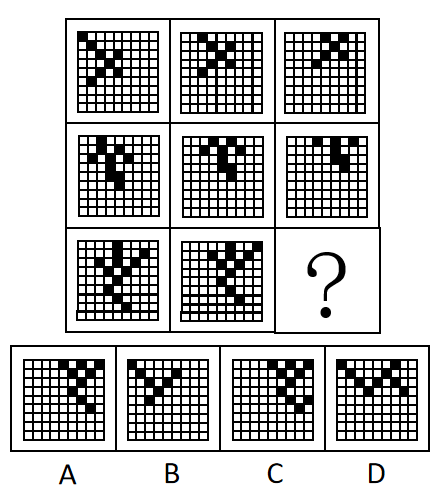

- **A**. A　✅
- **B**. B
- **C**. C
- **D**. D

**答案**：A

**官方解析**

元素组成相似，但无明显样式规律，考虑位置规律。九宫格优先看横行，观察发现，第一行图形中，黑块均向右上角平移一格，且去除移出框外的黑块；经验证，第二行符合此规律；第三行应用此规律，对应A项。
故正确答案为A。

---

## 第 8 题　qid 15833758 · 图形推理

左图的立体图形，将其展开后，右边哪一项可能是该立体图形的展开图？

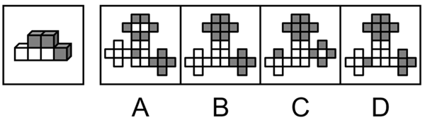

- **A**. A
- **B**. B　✅
- **C**. C
- **D**. D

**答案**：B

**官方解析**

本题考查多面体的空间重构。

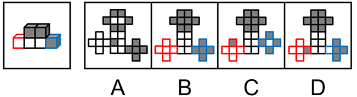

观察发现，若将题干多面体展开成平面图，应该合计有13个黑色方块面、11个白色方块面。A项展开图中有12个黑色方块面、12个白色方块面，排除；对比B、C、D三项，发现仅左右两侧的“十字形”结构不同，该“十字形”结构共5个方块面，说明展开图中左右两侧的“十字形”结构，折叠后分别对应立体图形左右两侧的单独突出小方块。观察题干立体图形，左侧单独突出的小方块为纯白色，对应展开图左侧“十字形”的5个方块面也应为纯白色；右侧单独突出的小方块为纯黑色，对应展开图右侧“十字形”的5个方块面也应为纯黑色，排除C、D两项。

故正确答案为B。

---

## 第 9 题　qid 15833767 · 逻辑判断

动词可以分为以下几类：断言类，表示说话人对某事做出一定程度上的表态，对话语所表达的命题内容做出真假判断；指令类，表示说话人不同程度地指使听话人做某事；承诺类，指说话人对未来的行为做出不同程度的承诺；表达类，指说话人在表达话语命题内容的同时所表达的某种心理状态；宣告类，指话语所表达的命题内容与客观现实之间的一致。
根据上述内容，下列选项表述错误的是：

- **A**. “否认”是断言类，“要求”是指令类
- **B**. “保证”是承诺类，“宣布”是宣告类
- **C**. “请求”“敦促”“命令”都是指令类
- **D**. “道歉”“夸耀”“通知”都是表达类　✅

**答案**：D

**官方解析**

第一步：找出定义关键词。
断言类：“表态”、“真假判断”；
指令类：“指使”；
承诺类：“对未来的行为做出承诺”；
表达类：“表达某种心理状态”；
宣告类：“话语所表达的命题内容与客观现实之间的一致”。
第二步：逐一分析选项。
A项：“否认”指不承认，符合“表态”、“真假判断”，属于断言类；“要求”指提出具体愿望或条件，希望得到满足或实现，符合“指使”，属于指令类，说法正确，排除；
B项：“保证”指确保既定的要求和标准，不打折扣，符合“对未来的行为做出承诺”，属于承诺类；“宣布”指向听众宣读某个决定、信息，符合“话语所表达的命题内容与客观现实之间的一致”，属于宣告类，说法正确，排除；
C项：“请求”指提出要求，希望得到满足，“敦促”指催促，“命令”指上级对下级有所指示，均符合“指使”，均属于指令类，说法正确，排除；
D项：“道歉”指表示歉意，特指认错，“夸耀”指向他人显示自己的长处或优势，均符合“表达某种心理状态”，均属于表达类；“通知”指把事项告诉人知道，符合“话语所表达的命题内容与客观现实之间的一致”，属于宣告类，并非表达类，说法错误，当选。
本题为选非题，故正确答案为D。

---

## 第 10 题　qid 15833645 · 类比推理

半公开信息源是指需要特定权限或身份认证等才可以获得相应信息的信息源。半公开信息源只能在一定范围内公开、共享、使用，大多数是在机构内部。
根据上述内容，不属于半公开信息源的是：

- **A**. 党政机关不公开发行的内部刊物
- **B**. 公司内网发布的公司内部财务状况报告
- **C**. 高校内部传达的有关重点实验室管理的文件
- **D**. 研究所内部仅涉密人员知晓的科学技术秘密　✅

**答案**：D

**官方解析**

第一步：找出定义关键词。
“需要特定权限或身份认证等才可以获得相应信息”、“只能在一定范围内公开、共享、使用”。
第二步：逐一分析选项。
A项：党政机关不公开发行的内部刊物，仅对党政机关内部的工作人员公开，符合“需要特定权限或身份认证等才可以获得相应信息”、“只能在一定范围内公开、共享、使用”，符合定义，排除；
B项：公司内网发布的公司内部财务状况报告，仅对公司内部的工作人员公开，符合“需要特定权限或身份认证等才可以获得相应信息”、“只能在一定范围内公开、共享、使用”，符合定义，排除；
C项：高校内部传达的有关重点实验室管理的文件，仅对高校内部相关人员公开，符合“需要特定权限或身份认证等才可以获得相应信息”、“只能在一定范围内公开、共享、使用”，符合定义，排除；
D项：研究所内部仅涉密人员知晓的科学技术秘密，该科学技术秘密为涉密信息，需要严格保密，不能公开、共享，不符合“只能在一定范围内公开、共享、使用”，不符合定义，当选。
本题为选非题，故正确答案为D。

---

## 第 11 题　qid 15833791 · 逻辑判断

竞技运动情景中的运动决策是运动员做出反应的过程。在竞技运动情景中主要存在两种类型的决策，分别是认知决策和直觉决策。认知决策是指以逻辑思维为基础的决策，类似于一般情景中的活动，通过概率或决策策略进行。直觉决策是指以运动直觉为基础，是在快速运动、时间压力大或结果不确定的复杂运动情景中，运动员作出具有快速、直接、或然性特点的决策。
下列哪个选项属于认知决策？

- **A**. 在棒球比赛中，球一出手，击球员就能通过球的缝线旋转模式瞬间判断出这是快速球还是曲球
- **B**. 篮球比赛中，外线球员接到球后，将球传给背身单打能力强的内线球员，助其篮下投篮得分　✅
- **C**. 在拳击比赛中，拳击手凭借对攻防节奏的感知，瞬间做出低头、偷袭或后退等闪避动作，以避开对方的重拳
- **D**. 在足球比赛中场时，足球教练根据对方球队的防守特点和对方球员状态制定下一轮进攻战术，并布置给队员

**答案**：B

**官方解析**

第一步：找出定义关键词。
认知决策：“运动员以逻辑思维为基础的决策”、“通过概率或决策策略进行”；
直觉决策：“运动员以运动直觉为基础”、“在快速运动、时间压力大或结果不确定的复杂运动情景中”、“快速、直接、或然性特点”。
第二步：逐一分析选项。
A项：棒球比赛中，球一出手，击球员瞬间判断出球的类型，但并未做出相应的决策，不符合“运动员以逻辑思维为基础的决策”， 不符合“认知决策”定义，排除；
B项：篮球比赛中，外线球员接到球后传给背身单打能力强的内线球员，说明在接到球之后，外线球员做出了一定的判断，符合“运动员以逻辑思维为基础的决策”、“通过概率或决策策略进行”，符合“认知决策”定义，当选；
C项：拳击比赛中，拳击手瞬间做出低头、偷袭或后退等闪避动作，符合“以运动直觉为基础”、“在快速运动、时间压力大或结果不确定的复杂运动情景中”、“快速、直接、或然性特点”，符合“直觉决策”定义，不符合“认知决策”定义，排除；
D项：足球比赛中场时，教练根据对方防守特点和球员状态制定下一轮进攻战术，教练不是“运动员”，不符合“运动员以逻辑思维为基础的决策”，排除。
故正确答案为B。

---

## 第 12 题　qid 15833704 · 定义判断

在统计学中，总体是客观存在的，具有某种共同性质的许多个别事物构成的整体，构成总体的个别事物叫总体单位。总体和总体单位都是客观存在的事物，是统计研究的客体。
根据上述定义，若要了解某省高校仪器设备情况，则总体单位是：

- **A**. 该省每一所高校
- **B**. 该省高校的全部仪器设备
- **C**. 该省高校的每一台仪器设备　✅
- **D**. 该省每一所高校的全部仪器设备

**答案**：C

**官方解析**

第一步：找出定义关键词。
总体：“具有某种共同性质的许多个别事物构成的整体”；
总体单位：“构成总体的个别事物”。
第二步：逐一分析选项。
A项：想要了解某省高校仪器设备情况，“该省高校的全部仪器设备”为总体，构成总体的个别事物并非高校，因此该省每一所高校，不符合“构成总体的个别事物”，不符合定义，排除；
B项：该省高校的“全部”仪器设备，不属于个别事物，不符合“构成总体的个别事物”，不符合定义，排除；
C项：想要了解某省高校仪器设备情况，“该省高校的全部仪器设备”为总体，“该省高校的每一台仪器设备”是组成“该省高校的全部仪器设备”的个别事物，符合“构成总体的个别事物”，符合定义，当选；
D项：该省每一所高校的“全部”仪器设备，不属于个别事物，不符合“构成总体的个别事物”，不符合定义，排除。
故正确答案为C。

---

## 第 13 题　qid 15833642 · 定义判断

注意力经济是指商家最大限度地吸引用户或消费者的注意力，通过培养潜在的消费群体，以期获得最大的未来商业利益的经济模式。
根据上述定义，不涉及注意力经济的是：

- **A**. 某汽车品牌在新品发布前，连续在社交媒体平台发布“新品悬念海报”，每天公布一个产品核心功能亮点，积累潜在购买用户
- **B**. 某用户在社交平台晒出的自家萌娃的一则短视频吸引了大量关注，视频中萌娃的同款玩具在购物平台爆火　✅
- **C**. 某超市为处理临期食品，不定期在门口设置“特价区”，通过低价吸引周边居民抢购
- **D**. 某美妆品牌在短视频平台发起“素颜”挑战，邀约网红达人分享使用该品牌的素颜霜的前后对比视频，引导用户了解信息

**答案**：B

**官方解析**

第一步：找出定义关键词。
“商家最大限度地吸引用户或消费者的注意力”、“培养潜在的消费群体，以期获得最大的未来商业利益的经济模式”。
第二步：逐一分析选项。
A项：某汽车品牌发布“新品悬念海报”用来吸引、积累潜在购买用户，符合“商家最大限度地吸引用户或消费者的注意力”、“培养潜在的消费群体，以期获得最大的未来商业利益的经济模式”，符合定义，排除；
B项：某用户晒萌娃视频被广泛关注，主体并非是商家，不符合“商家最大限度地吸引用户或消费者的注意力”、“培养潜在的消费群体，以期获得最大的未来商业利益的经济模式”，不符合定义，当选；
C项：某超市设置特价区，用低价吸引居民来购物，符合“商家最大限度地吸引用户或消费者的注意力”、“培养潜在的消费群体，以期获得最大的未来商业利益的经济模式”，符合定义，排除；
D项：某美妆品牌发起挑战并邀请网红达人使用该品牌产品后分享视频，引导用户了解信息，符合“商家最大限度地吸引用户或消费者的注意力”、“培养潜在的消费群体，以期获得最大的未来商业利益的经济模式”，符合定义，排除。
本题为选非题，故正确答案为B。

---

## 第 14 题　qid 15833779 · 定义判断

射孔弹按弹体承压结构分为有枪身射孔弹和无枪身射孔弹。射孔弹型号命名表示方法如下所示：

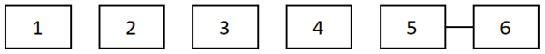

说明：1—射孔弹的工作压力（无枪身射孔弹适用，有枪身射孔弹此项空缺），单位为兆帕（MPa）；2—射孔弹穿孔性能，用DP表示深穿透射孔弹，用BH表示大孔径射孔弹，用GH表示大孔径深穿透射孔弹，用EH表示等孔径射孔弹；3—药型罩开口直径，单位为毫米（mm）；4—主炸药类型；5—射孔弹单发装药量，单位为克（g）；6—产品改进型号。

根据上述定义，对于型号为BH36RDX33-1的射孔弹，下列说法错误的是：

- **A**. 为大孔径射孔弹
- **B**. 主炸药类型为RD　✅
- **C**. 为有枪身射孔弹
- **D**. 单发装药量为33克

**答案**：B

**官方解析**

第一步：找出定义关键词。
1：“射孔弹的工作压力（无枪身射孔弹适用，有枪身射孔弹此项空缺）”；
2：“射孔弹穿孔性能，用DP表示深穿透射孔弹，用BH表示大孔径射孔弹，用GH表示大孔径深穿透射孔弹，用EH表示等孔径射孔弹”；
3：“药型罩开口直径”；
4：“主炸药类型”；
5：“射孔弹单发装药量”；
6：“产品改进型号”。
第二步：逐一分析选项。
A项：该射孔弹型号为BH36RDX33-1，BH符合“2”中的“用BH表示大孔径射孔弹”，符合定义，排除；
B项：该射孔弹型号为BH36RDX33-1，BH符合“2”中的“用BH表示大孔径射孔弹”，36则对应“3”中的“药型罩开口直径”，故RDX对应“4”中的“主炸药类型”，所以该射孔弹的主炸药类型为RDX，不符合定义，当选；
C项：该射孔弹型号为BH36RDX33-1，开头直接用BH表示大孔径射孔弹，说明该射孔弹无工作压力，符合“1”中的“有枪身射孔弹此项空缺”，所以该射孔弹为有枪身射孔弹，符合定义，排除；
D项：该射孔弹型号为BH36RDX33-1，结合上述选项分析，33对应“5”中的“射孔弹单发装药量”，符合定义，排除。
本题为选非题，故正确答案为B。

---

## 第 15 题　qid 15833646 · 定义判断

自我异化是指个体在与外部世界的互动中，逐渐丧失主体性、自主性和本质属性，被自身创造的对象或异己力量所控制、支配，最终导致自我与自身、他人、社会以及本质相分离的状态。
下列不属于自我异化的是：

- **A**. 沉迷剧本杀、桌游等沉浸式游戏，削弱了对现实生活的参与感
- **B**. 过度依赖线上社交，削弱了现实中与亲人、朋友等的情感联系
- **C**. 网络空间中的多重虚拟身份造成难以区分现实身份与网络身份
- **D**. 由长期加班导致的身体疲惫，使得自己无法集中精神处理工作中的问题　✅

**答案**：D

**官方解析**

第一步：找出定义关键词。
“个体在与外部世界的互动中”、“逐渐丧失主体性、自主性和本质属性，被自身创造的对象或异己力所控制、支配”、“导致自我与自身、他人、社会以及本质相分离的状态”。
第二步：逐一分析选项。
A项：沉迷剧本杀、桌游等沉浸式游戏，削弱了对现实生活的参与感，说明在游戏的虚拟情境中受游戏规则和设定所控制，并投入了大量时间，忽视真实生活，符合“个体在与外部世界的互动中”、“逐渐丧失主体性、自主性和本质属性，被自身创造的对象或异己力所控制、支配”、“导致自我与自身、他人、社会以及本质相分离的状态”，符合定义，排除；
B项：过度依赖线上社交，削弱现实中与亲友联系，说明个体在网络环境中逐渐疏离真实人际关系，符合“个体在与外部世界的互动中”、“导致自我与自身、他人、社会以及本质相分离的状态”，符合定义，排除；
C项：网络空间多重虚拟身份造成难以区分现实身份与网络身份，说明个体在多重身份中迷失，导致主体性混乱，符合“个体在与外部世界的互动中”、“逐渐丧失主体性、自主性和本质属性，被自身创造的对象或异己力所控制、支配”、“导致自我与自身、他人、社会以及本质相分离的状态”，符合定义，排除；
D项：由长期加班导致的身体疲惫，使得自己无法集中精神处理工作中的问题，加班往往是外在压力的结果，不是人被“自身创造的对象或异己力”控制，不符合“逐渐丧失主体性、自主性和本质属性，被自身创造的对象或异己力所控制、支配”，不符合定义，当选。
本题为选非题，故正确答案为D。

---

## 第 16 题　qid 15833656 · 定义判断

包装色彩效应是指商品包装色彩对消费者心理的影响，其主要表现为两方面：（1）吸引与诱发作用，即容易引起消费者的联想，诱发消费者的情感，并在一定程度上左右消费者对商品的印象。（2）强化商品的特征，提高商品色彩效应。
根据上述定义，下列体现包装色彩效应的是：

- **A**. 将白色商品装在底衬较暗的盒子里会更醒目　✅
- **B**. 深色衣服会比浅色衣服给人更暖和的感觉
- **C**. 方形和矩形包装给人以稳重可靠的感觉
- **D**. 黑色或深色的电子产品可能会令人感觉更高级

**答案**：A

**官方解析**

第一步：找出定义关键词。
“商品包装色彩对消费者心理的影响”、“引起消费者的联想，诱发情感并左右对商品的印象”、“强化商品的特征”。
第二步：逐一分析选项。
A项：将白色商品装在底衬暗的盒子里，让商品更加醒目，是利用包装的色彩来强化商品白色的特征，从而让消费者更容易看到，符合“商品包装色彩对消费者心理的影响”、“强化商品的特征”，符合定义，当选；
B项：深色的衣服给人更暖和的感觉，但深色是衣物本身的颜色，并非包装的颜色，不符合“商品包装色彩对消费者心理的影响”，不符合定义，排除；
C项：方形和矩形的包装给人稳重可靠的感觉，仅涉及包装的形状，并未提及包装的颜色，不符合“商品包装色彩对消费者心理的影响”，不符合定义，排除；
D项：黑色或深色的电子产品会让人感觉更高级，其中黑色和深色只是电子产品本身的颜色，并非包装的颜色，不符合“商品包装色彩对消费者心理的影响”，不符合定义，排除。
故正确答案为A。

---

## 第 17 题　qid 15833778 · 类比推理

与“因特网：国际互联网”在逻辑关系上最相近的是：

- **A**. 拙荆：妻子
- **B**. 瑶琴：古琴
- **C**. 姑爷：女婿
- **D**. 巴士：公共汽车　✅

**答案**：D

**官方解析**

第一步：判断题干词语间逻辑关系。
“因特网”即“国际互联网”，二者为全同关系，且“因特网”为音译词。
第二步：判断选项词语间逻辑关系。
A项：“拙荆”是对“妻子”的谦称，二者为全同关系，但“拙荆”不是音译词，与题干逻辑关系不一致，排除；
B项：“瑶琴”是“古琴”的别称，二者为全同关系，但“瑶琴”不是音译词，与题干逻辑关系不一致，排除；
C项：“姑爷”是对“女婿”的口语化称谓，二者为全同关系，但“姑爷”不是音译词，与题干逻辑关系不一致，排除；
D项：“巴士”即“公共汽车”，二者为全同关系，且“巴士”为音译词，与题干逻辑关系一致，当选。
故正确答案为D。

---

## 第 18 题　qid 15833777 · 类比推理

与“制片主任：剧组人员”在逻辑关系上最相近的是：

- **A**. 科长：科员
- **B**. 花瓣：花束
- **C**. 语文书：教科书　✅
- **D**. 发电机：发电机组

**答案**：C

**官方解析**

第一步：判断题干词语间逻辑关系。
制片主任是剧组人员的一种，二者为种属关系。
第二步：判断选项词语间逻辑关系。
A项：科长与科员是两个不同的职位，二者为并列关系，与题干逻辑关系不一致，排除；
B项：花瓣是花束的组成部分，二者为组成关系，与题干逻辑关系不一致，排除；
C项：语文书是教科书的一种，二者为种属关系，与题干逻辑关系一致，当选；
D项：发电机是发电机组的组成部分，二者为组成关系，与题干逻辑关系不一致，排除。
故正确答案为C。

---

## 第 19 题　qid 15833705 · 类比推理

有机物：氯气：化合物

- **A**. 冲压液压机：挤压液压机：液压机
- **B**. 流动负债：流动资产：流动资金
- **C**. 落叶阔叶林：温带常绿林：落叶林　✅
- **D**. 化学能武器：橡胶子弹：动能武器

**答案**：C

**官方解析**

第一步：判断题干词语间逻辑关系。
有机物是有机化合物的简称，属于化合物，第一词与第三词构成种属关系；氯气是单质，不属于化合物，第二词与第三词构成反向种属关系。
第二步：判断选项词语间逻辑关系。
A项：冲压液压机与挤压液压机均属于液压机，前两词与第三词均构成种属关系，与题干逻辑关系不一致，排除；
B项：流动资金=流动资产-流动负债，三者为对应关系，与题干逻辑关系不一致，排除；
C项：落叶阔叶林是温带最常见的森林类型，属于落叶林，第一词与第三词构成种属关系；温带常绿林是由终年保持绿叶的树种组成的森林植被体系，不属于落叶林，第二词与第三词构成反向种属关系，与题干逻辑关系一致，当选；
D项：化学能武器与动能武器是按造成杀伤的能量来源划分的两类武器，第一词与第三词构成并列关系，与题干逻辑关系不一致，排除。
故正确答案为C。

---

## 第 20 题　qid 15833655 · 类比推理

教师人数：生师比：学生人数

- **A**. 产品总数：合格率：合格产品数　✅
- **B**. 溶剂质量：浓度：溶质质量
- **C**. 租金：租售比：售价
- **D**. 税额：利润率：利润总额

**答案**：A

**官方解析**

第一步：判断题干词语间逻辑关系。

生师比，三词为分子分母比率的对应关系。

第二步：判断选项词语间逻辑关系。

A项：合格率，与题干逻辑关系一致，当选；

B项：浓度，与题干逻辑关系不一致，排除；

C项：租售比=租金÷售价，第一词和第三词顺序与题干相反，与题干逻辑关系不一致，排除；

D项：税额与利润率、利润总额无关系，与题干逻辑关系不一致，排除。

故正确答案为A。

---

## 第 21 题　qid 15833657 · 类比推理

算法偏见 对于（    ）相当于（    ）对于 动脉堵塞

- **A**. 歧视：静脉堵塞
- **B**. 信息茧房：心梗
- **C**. 数据污染：肺功能
- **D**. 不公平：血栓脱落　✅

**答案**：D

**官方解析**

逐一代入选项。
A项：算法偏见会导致歧视，二者为因果关系，静脉堵塞和动脉堵塞为并列关系，前后逻辑关系不一致，排除；
B项：算法偏见会导致信息茧房，二者为因果关系，动脉堵塞会导致心梗，二者为因果关系，但前后顺序不一致，前后逻辑关系不一致，排除；
C项：数据污染指在数据采集、传输、存储等环节中，因人为失误、系统误差、恶意篡改或噪声干扰，导致数据出现错误、失真、缺失、重复、偏差或被无关信息干扰，使其质量下降、失去真实性与可用性的现象，数据污染会导致算法偏见，二者为因果关系，肺功能和动脉堵塞无明显逻辑关系，前后逻辑关系不一致，排除；
D项：算法偏见易导致不公平，血栓脱落易导致动脉堵塞，前后均为因果关系，前后逻辑关系一致，当选。
故正确答案为D。

---

## 第 22 题　qid 15833786 · 定义判断

如果用圆圈表示概念的外延，下列符合上述概念外延关系的是：

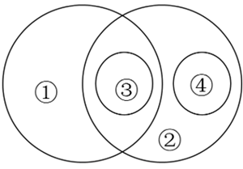

- **A**. 陶瓷器皿（①）耐热性强，易于清洗，陶瓷餐具（③）是餐桌上常见的餐具（②），很多茶具（④）也是用陶瓷制成的
- **B**. 弦鸣乐器（①）通过琴弦振动发声，气鸣乐器（②）依赖气流振动发声，中国传统乐器（③）既有弦鸣乐器也有气鸣乐器，唢呐（④）即是一种气鸣乐器
- **C**. 热带植物（①）适应高温高湿的环境。在热带地区，常绿乔木（②）较多，可可树（③）即是其中之一，冷杉（④）也是一种常绿乔木，但其主要生长在亚寒带地区　✅
- **D**. 法学（①）和历史学（②）分别属于社会科学和人文科学的范畴，法律史学（③）是法学和历史学的交叉学科。它不同于刑法等部门法学（④），主要研究法律的产生及其演变规律

**答案**：C

**官方解析**

第一步：判断题干元素间逻辑关系。
根据题干图形可知，①和②是交叉关系；③属于①，③和①是种属关系；④不属于①，④和①是反向种属关系；③属于②，③和②是种属关系；④属于②，④和②是种属关系；③和④是并列关系。
第二步：判断选项词语间逻辑关系。
A项：“陶瓷器皿”（①）与“茶具”（④）是交叉关系，与题干逻辑关系不一致，排除；
B项：“弦鸣乐器”（①）与“气鸣乐器”（②）是并列关系，与题干逻辑关系不一致，排除；
C项：“热带植物”（①）与“常绿乔木”（②）是交叉关系，“可可树”（③）属于“热带植物”（①），③和①是种属关系，“冷杉”（④）不属于“热带植物”（①），④和①是反向种属关系，“可可树”（③）属于“常绿乔木”（②），③和②是种属关系，“冷杉”（④）属于“常绿乔木”（②），④和②是种属关系，“可可树”（③）和“冷杉”（④）是并列关系，与题干逻辑关系一致，当选；
D项：“部门法学”（④）属于“法学”（①），④和①是种属关系，与题干逻辑关系不一致，排除。
故正确答案为C。

---

## 第 23 题　qid 15833772 · 逻辑判断

一直以来，科学界认为微计算机断层扫描（micro-CT）技术是非破坏性的，不会对化石造成损伤。研究人员使用标准设置的micro-CT扫描仪，对动物骨骼、牙齿（包括现代样本和化石）进行扫描，重点测定扫描前后胶原蛋白的含量变化。研究显示，尽管扫描后样本的放射性碳年龄未受影响，但胶原蛋白含量显著下降35%。研究人员认为，这意味着micro-CT技术会对化石承载信息造成不可逆损伤。
以下哪项如果为真，最能支持上述论证？

- **A**. 胶原蛋白作为化石研究的关键物质，在放射性碳测年等技术中不可或缺　✅
- **B**. 对于不规则形状或大尺寸化石，使用micro-CT技术扫描过程较为繁琐
- **C**. 已发展出更先进的对化石进行非破坏性扫描技术，可替代micro-CT技术
- **D**. micro-CT技术会使化石在电子自旋共振测年中出现“加速老化”的现象

**答案**：A

**官方解析**

第一步：找出论点和论据。
论点：micro-CT技术会对化石承载信息造成不可逆损伤。
论据：尽管扫描后样本的放射性碳年龄未受影响，但胶原蛋白含量显著下降35%。
本题论点说的是“micro-CT技术”对“化石承载信息”的影响，论据说的是“micro-CT技术”使得“胶原蛋白”含量下降，二者话题不一致，加强优先考虑搭桥，即建立“胶原蛋白”和“化石承载信息”之间的关系。
第二步：逐一分析选项。
A项：选项指出胶原蛋白是化石研究的关键物质，在放射性碳测年等技术中不可或缺，即建立了“胶原蛋白”和“化石承载信息”之间的关系，搭桥项，可以加强，保留；
B项：选项指出micro-CT技术在部分场景下扫描过程繁琐，与论点话题不一致，无关选项，无法加强，排除；
C项：选项指出存在更先进的扫描技术，但不清楚micro-CT技术是否会对化石承载信息造成不可逆损伤，无法加强，排除；
D项：选项指出micro-CT技术会使化石加速老化，说明micro-CT技术可能会对化石承载信息造成损伤，补充论据，可以加强，保留。
比较A、D两项，A项为搭桥项，D项为补充论据，搭桥的力度更大，因此择优选择A项。
故正确答案为A。

---

## 第 24 题　qid 15833780 · 逻辑判断

历史和实践充分证明，只有高质量精神生产与高质量精神消费都搞好，才能提升人民群众的精神世界。一方面，精神生产决定精神消费，充分享有高质量的精神产品是人民群众进行高质量精神消费的必要前提，也是使人民群众精神获得感成色更足、幸福感品位更高、安全感更可持续的重要条件。另一方面，精神消费反作用于精神生产，高质量的精神消费有利于激发人民群众更深层次的精神需求，并推动更高质量的精神生产。
由此一定可以推出的是：

- **A**. 有了高质量的精神消费，说明有了高质量的精神产品　✅
- **B**. 有了高质量的精神消费，就能激发人民群众更深层次的精神需求
- **C**. 高质量精神生产与高质量精神消费都搞好了，人民群众的精神世界就能提升
- **D**. 没有高质量的精神产品，就不能使人民群众精神获得感成色更足、幸福感品位更高、安全感更可持续

**答案**：A

**官方解析**

第一步：翻译题干。

①提升人民群众的精神世界高质量精神生产搞好 且 高质量精神消费搞好；

②人民群众进行高质量精神消费充分享有高质量的精神产品。

第二步：逐一分析选项。

A项：翻译为：有了高质量的精神消费有了高质量的精神产品，是对②的肯前，肯前必肯后，可以推出，当选；

B项：翻译为：有了高质量的精神消费激发人民群众更深层次的精神需求，题干中二者无推出关系，无法推出，排除；

C项：翻译为：高质量精神生产搞好 且 高质量精神消费搞好提升人民群众的精神世界，是对①的肯后，肯后得不到确定性结论，无法推出，排除；

D项：翻译为：高质量的精神产品使人民群众精神获得感成色更足、幸福感品位更高、安全感更可持续，题干中二者无推出关系，无法推出，排除。

故正确答案为A。

---

## 第 25 题　qid 15833783 · 逻辑判断

近期某国北部地区暴雨不断，较常年同期偏多近三成。对此，有专家表示，北部地区强降水过程与副热带高气压带活动紧密相关，这主要是因为西太平洋副热带高压势力偏强且位置偏北，其边缘的暖湿气流向北部地区输送大量水汽，为强降水提供了充足的水汽条件。
以下哪项如果为真，最能削弱上述专家的论证？

- **A**. 副热带高气压带大气不稳定性强，导致降水对流性特征突出，局部地区降雨量大、持续时间长
- **B**. 自20世纪90年代后，科学家根据气候模式就预测出，随着气候变暖，全球极端降水的强度将有可能增大
- **C**. 历史数据显示，每当西太平洋副热带高压位置偏北且势力偏强时，该国北部地区的降水量往往显著高于常年同期
- **D**. 此次极端强降雨主要发生在北方山区，山地对降水有明显的增幅效应，在副热带高压和地形的共同作用下形成了强降雨　✅

**答案**：D

**官方解析**

第一步：找出论点和论据。
论点：北部地区强降水过程与副热带高气压带活动紧密相关。
论据：西太平洋副热带高压势力偏强且位置偏北，其边缘的暖湿气流向北部地区输送大量水汽，为强降水提供了充足的水汽条件。
本题论点和论据均在讨论北部地区强降水与副热带高压之间的关系，二者话题一致，且论点中存在因果关系，削弱可以考虑削弱论点、因果倒置和他因削弱。
第二步：逐一分析选项。
A项：指出副热带高气压带大气不稳定性强，导致局部地区降雨量大、持续时间长，解释了副热带高气压带活动导致北部地区强降水的原因，加强选项，无法削弱，排除；
B项：指出随着气候变暖，全球极端降水的强度将有可能增大，与论点讨论的副热带高气压带活动是否导致北部地区强降水无关，无关选项，无法削弱，排除；
C项：指出副热带高压位置偏北且势力偏强时，北部地区的降水量显著高于常年同期，用历史数据印证专家观点，加强选项，无法削弱，排除；
D项：指出北方山区的山地对降水有明显的增幅效应，在副热带高压和地形的共同作用下形成了强降雨，说明降雨的形成并非主要因为副热带高压作用，是副热带高压和地形的共同作用，直接削弱论点，可以削弱，当选。
故正确答案为D。

---

## 第 26 题　qid 15833671 · 逻辑判断

为定位人脑特定区域的功能，在一项新研究中，研究人员使用了损伤缺陷映射法。他们对247名患者进行了研究，发现大脑左或右额叶存在单侧局灶性脑损伤。此外，81名健康个体作为对照组。研究人员使用两种方法评估患者推理能力：一种是语言类比推理任务，参与者需找出单词关系解决问题；另一种是非语言演绎推理任务，参与者需使用图片、形状或数字找出逻辑模式解决问题。测试后，研究人员认为右前脑区域在推理中发挥关键作用。
上述论证的成立需要补充以下哪项作为前提？

- **A**. 这项研究所采用的损伤缺陷映射法，是目前医学界定位人脑功能的最有效方法
- **B**. 若大脑右前区受损，空间认知与方向感、直觉和整体感知能力都会受影响
- **C**. 无论在哪项测试中，大脑右或左额叶受损的患者都比对照组健康个体得分低
- **D**. 与大脑其他区域受损的患者相比，右前额叶受损患者在这两种测试中的表现更差　✅

**答案**：D

**官方解析**

第一步：找出论点和论据。
论点：右前脑区域在推理中发挥关键作用。
论据：研究人员对247名患者进行了研究，发现大脑左或右额叶存在单侧局灶性脑损伤。此外，81名健康个体作为对照组。研究人员使用两种方法评估患者推理能力：一种是语言类比推理任务，参与者需找出单词关系解决问题；另一种是非语言演绎推理任务，参与者需使用图片、形状或数字找出逻辑模式解决问题。
本题论点和论据都在讨论人脑特定区域损伤和推理能力之间的关系，二者话题一致，且提问方式为“前提”，优先考虑必要条件。
第二步：逐一分析选项。
A项：这项研究采用的是目前最有效的方法，而论点讨论的是右前脑区域在推理中发挥关键作用，不需要“最有效”作前提，只要“有效”就行，不是论点成立的必要条件，排除；
B项：大脑右前区受损影响空间认知与方向感、直觉和整体感知能力，而论点讨论的是右前脑区域在推理中发挥关键作用，话题不一致，不是论点成立的必要条件，排除；
C项：左右额叶受损的患者都比健康个体得分低，无法证明右前脑区域在推理中发挥关键作用，不是论点成立的必要条件，排除；
D项：右前额叶受损患者比其他区域受损患者表现更差，将该项否定代入，如果右前额叶受损患者不比其他区域受损患者表现更差，那么说明右前脑区域在推理中没有发挥关键作用，说明否定该项后论点不能成立，则该项是论点成立的必要条件，当选。
故正确答案为D。

---

## 第 27 题　qid 15833669 · 逻辑判断

有研究表明，20世纪80年代以来，沙漠新月形沙丘的移动速度持续下降。对于沙丘移动速度下降的原因，有学者认为是风速下降导致的，因为从理论上说，风速下降能减弱风蚀作用，减缓沙丘移动，并降低沙尘暴频率，但也有学者反对上述观点，他们认为输沙率持续减弱才是沙丘移动速度下降的真正原因。从分析来看，近40年来沙尘在沙丘不同部位的迁移和堆积速度有显著降低的趋势，单位时间内能够搬运的沙粒数量减少。
以下哪项如果为真，最能削弱第二种观点？

- **A**. 气候变暖导致全球风速都有下降的趋势
- **B**. 沙漠地区风速下降是输沙率持续减弱的原因　✅
- **C**. 风速下降能够减弱风蚀作用，并降低沙尘暴频率
- **D**. 输沙率减弱意味着沙丘被侵蚀的部分无法得到足够补充

**答案**：B

**官方解析**

第一步：找出论点和论据。
论点：沙丘移动速度下降并不是风速下降导致的，输沙率持续减弱才是沙丘移动速度下降的真正原因。
论据：从分析来看，近40年来沙尘在沙丘不同部位的迁移和堆积速度有显著降低的趋势，单位时间内能够搬运的沙粒数量减少。
本题论点和论据都在说沙丘不同部位的迁移和堆积速度有显著降低的趋势，所以输沙率持续减弱才是沙丘移动速度下降的真正原因，论点与论据话题一致，削弱优先考虑削弱论点，即指出输沙率持续减弱不是沙丘移动速度下降的真正原因。
第二步：逐一分析选项。
A项：指出气候变暖导致全球风速都有下降的趋势，而论点讨论的是沙丘移动速度下降的原因，话题不一致，无法削弱，排除；
B项：指出沙漠地区风速下降是输沙率持续减弱的原因，说明沙丘移动速度下降的真正原因不是输沙率持续减弱，而是风速下降，削弱论点，可以削弱，保留；
C项：指出风速下降能够减弱风蚀作用，并降低沙尘暴频率，是对于第一种观点分析部分的重复，加强了第一种观点，间接否定了第二种观点，可以削弱，保留；
D项：指出输沙率减弱意味着沙丘被侵蚀的部分无法得到足够补充，而论点讨论的是沙丘移动速度下降的原因，话题不一致，无法削弱，排除。
对比B、C两项，B项是对于第二种观点中的内容直接削弱，话题更为紧密，而C项仅为第一种观点分析部分的重复，所以B项的削弱力度要强于C项，当选。
故正确答案为B。

---

## 第 28 题　qid 15833782 · 逻辑判断

某研究团队将某市受蟑螂侵害的多单元公寓分为两组：一组没有除蟑螂，一组接受专业的灭蟑螂服务。经过对比最开始、三个月和六个月后的沉降灰尘、空气灰尘样本与昆虫样本，研究人员发现：出现蟑螂但从未接受灭蟑螂服务的公寓自始至终都保持很高的过敏原及内毒素水平；相比之下，大多数经过灭蟑处理的公寓再没出现过蟑螂，过敏原和内毒素水平均显著下降。因此，研究团队认为，灭蟑螂或有助于防过敏。
以下哪项如果为真，最能支持上述研究团队的论证？

- **A**. 过敏原和内毒素可以悬浮在空气中
- **B**. 已有研究表明，蟑螂会通过粪便排放出大量内毒素　✅
- **C**. 两组公寓最开始检测到的过敏原及内毒素水平基本一致
- **D**. 已有迹象表明，过敏原与内毒素的相互作用可能加重哮喘

**答案**：B

**官方解析**

第一步：找出论点和论据。
论点：灭蟑螂或有助于防过敏。
论据：出现蟑螂但从未接受灭蟑螂服务的公寓自始至终都保持很高的过敏原及内毒素水平；相比之下，大多数经过灭蟑处理的公寓再没出现过蟑螂，过敏原和内毒素水平均显著下降。
本题论点和论据均在强调蟑螂和过敏之间的关系，二者话题一致，加强优先考虑补充论据。
第二步：逐一分析选项。
A项：指出过敏原和内毒素可悬浮在空气中，仅说明其存在形式，并没有说明灭蟑螂是否有助于防过敏，为无关项，无法加强，排除；
B项：指出了蟑螂会排放内毒素，说明蟑螂与内毒素之间确实存在关联，补充论据，可以加强，当选；
C项：指出两组公寓初始的过敏原、内毒素水平基本一致，但题干研究的是不同时间段单个公寓与其自身情况的比较，不需要保持两组公寓初始情况一致，没有B项好，排除；
D项：说明过敏原和内毒素会加重哮喘，仅仅是阐述过敏原与内毒素相互作用的危害，但对于灭蟑螂能否防过敏却并不明确，无法加强，排除。
故正确答案为B。

---

## 第 29 题　qid 15833711 · 逻辑判断

黄斑变性是导致老年人失明常见的原因之一。在一项临床试验中，6名几乎完全失明的患者在接受眼部干细胞移植治疗后，突然又能辨认出视力表上的字母了。因此，研究人员认为移植干细胞能让黄斑变性失明的人重见光明。
以下哪项如果为真，无法支持上述论证？

- **A**. 黄斑变性疾病的自然病程通常会导致视力进一步丧失
- **B**. 在当前研究中，移植的干细胞活性能保持多久是未知的　✅
- **C**. 在当前研究中，移植的干细胞材料保持稳定，未出现炎症或排异反应
- **D**. 移植的干细胞能替代已死亡的细胞，并与其上方的感光细胞重新建立通信

**答案**：B

**官方解析**

第一步：找出论点和论据。
论点：移植干细胞能让黄斑变性失明的人重见光明。
论据：在一项临床试验中，6名几乎完全失明的患者在接受眼部干细胞移植治疗后，突然又能辨认出视力表上的字母了。
本题论点讨论的是移植干细胞对黄斑变性失明患者视力恢复的作用，论据是部分患者接受干细胞移植后的视力改善情况，论点和论据话题一致，加强优先考虑补充论据。本题为选非题，排除可以加强的选项即可。
第二步：逐一分析选项。
A项：该项指出黄斑变性疾病的自然病程通常会导致视力进一步丧失，这意味着在正常疾病发展情况下，患者视力会更差，但接受干细胞移植后的患者却能辨认视力表字母，通过对比突出了干细胞移植对视力的积极影响，补充论据，可以加强，排除；
B项：该项指出在当前研究中，移植的干细胞活性能保持多久是未知的，由于不确定干细胞活性的持续时间，就无法确定其能否持续有效地帮助患者重见光明，不明确选项，无法加强，当选；
C项：该项指出在当前研究中，移植的干细胞材料保持稳定，未出现炎症或排异反应，这为干细胞移植成功发挥恢复视力的作用提供了保障，因为稳定且无不良反应有助于干细胞正常发挥功能，补充论据，可以加强，排除；
D项：该项指出移植的干细胞能替代已死亡的细胞，并与其上方的感光细胞重新建立通信，从原理层面解释了干细胞移植为什么能让患者重见光明，补充论据，可以加强，排除。
本题为选非题，故正确答案为B。

---

## 第 30 题　qid 15833733 · 逻辑判断

某学校组织开展象棋、围棋、五子棋比赛的初赛，初赛为淘汰赛，且每人仅比赛一场，获胜者即可进入复赛，甲班中张、李、王、赵报名参加了比赛。已知：
（1）如果张进入象棋复赛，那么赵进入五子棋复赛；
（2）只有李进入围棋复赛，王才不会进入象棋复赛；
（3）除非赵没进入五子棋复赛，否则李不进入围棋复赛。
由此可以推出（    ）。

- **A**. 张进入象棋复赛，或者王进入象棋复赛
- **B**. 张进入象棋复赛，或者王没进入象棋复赛
- **C**. 张没进入象棋复赛，或者王进入象棋复赛　✅
- **D**. 张没进入象棋复赛，或者王没进入象棋复赛

**答案**：C

**官方解析**

第一步：翻译题干。

（1）张进入象棋复赛赵进入五子棋复赛；

（2）王进入象棋复赛李进入围棋复赛；

（3）李进入围棋复赛赵进入五子棋复赛；

（4）初赛为淘汰赛，且每人仅比赛一场，获胜者即可进入复赛。

第二步：根据题干条件进行推理。

题干没有确定信息，但条件和选项中反复出现了“象棋复赛”，可以优先考虑从此入手进行推理。将条件（2）（3）逆否后与条件（1）进行串联，可得：张进入象棋复赛赵进入五子棋复赛李进入围棋复赛王进入象棋复赛。即张进入象棋复赛王进入象棋复赛，根据，可得：张没进入象棋复赛或者王进入象棋复赛，对应C项。

故正确答案为C。

---
