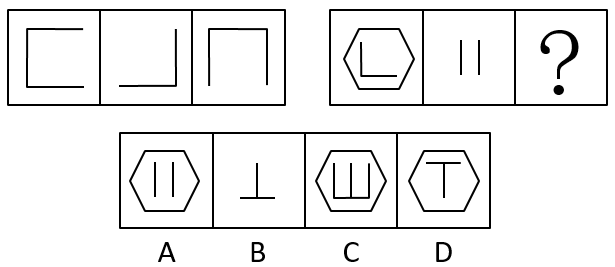
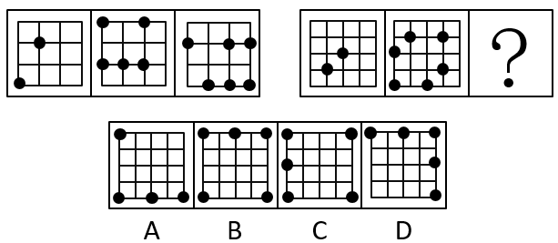

# 天津市2020年度定向34所重点高校招录选调生《综合能力测试》

> 判断推理 · 10 题 · 选调 2020

## 第 1 题　qid 2461701 · 图形推理

从所给四个选项中，选择最合适的一个填入问号处，使之呈现一定规律性：

- **A**. A
- **B**. B
- **C**. C
- **D**. D　✅

**答案**：D

**官方解析**

观察发现，第一组图箭头方向依次顺时针旋转90，且圆圈个数在递增，箭头个数在递减；第二组图应用此规律，三角形整体顺时针旋转90，排除A、B两项，继续观察发现，第一个图三角形内部是三个圆圈三条短线，第三个图三角形内部是一个圆圈一条短线，故？处应该选择两个圆圈两条短线，只有D项符合。

故正确答案为D。

---

## 第 2 题　qid 2461704 · 图形推理

从所给四个选项中，选择最合适的一个填入问号处，使之呈现一定规律性：

- **A**. A
- **B**. B
- **C**. C　✅
- **D**. D

**答案**：C

**官方解析**

元素组成相似，优先考虑样式规律。第一组图中，图一和图二求异可以得到图三；第二组图应用此规律，图一和图二求异，只有C项符合。
故正确答案为C。

---

## 第 3 题　qid 2461711 · 图形推理

从所给四个选项中，选择最合适的一个填入问号处，使之呈现一定规律性：

- **A**. A
- **B**. B
- **C**. C
- **D**. D　✅

**答案**：D

**官方解析**

观察图形发现，出现了多个小黑点，小黑点整齐分布，优先考虑小黑点的位置。第一组图中所有的小黑点位置均不重合，故第二组图应用此规律，？处的图形的小黑点应与前两幅图形之间不存在重合，只有D项符合。
故正确答案为D。

---

## 第 4 题　qid 2461716 · 图形推理

从所给四个选项中，选择最合适的一个填入问号处，使之呈现一定规律性：

- **A**. A　✅
- **B**. B
- **C**. C
- **D**. D

**答案**：A

**官方解析**

元素组成不同，优先考虑属性规律，出现等腰三角形优先考虑对称性，第一组图形的对称轴数量为：2、1、3，第二组图形的对称轴数量为3、2、？，观察发现，第二组图形的对称轴数量分别比第一组的对称轴数量多1条，故？处图形的对称轴数量应为4条，只有A项符合。
故正确答案为A。

---

## 第 5 题　qid 2461720 · 图形推理

从所给四个选项中，选择最合适的一个填入问号处，使之呈现一定规律性：

- **A**. A
- **B**. B
- **C**. C
- **D**. D　✅

**答案**：D

**官方解析**

解析一：元素组成不同，且无明显属性规律，优先考虑数量规律。题干出现全曲线图形和单一曲线，考虑曲线数，第一组图中每幅图的曲线数分别为1、2、0，相加之和为3，第二组应用此规律，前两幅图的曲线数分别为0、3，故问号处图形的曲线数应为0，只有A项符合。
故正确答案为A。
解析二：元素组成不同，且无明显属性规律，优先考虑数量规律。题干图形存在明显的封闭空间，优先考虑面数量。第一组图中，面的数量都是1，面数量相加为3，第二组图遵循相同规律，前两幅图面数量均为0，故？处图形的面数量应为3，只有D项符合。
故正确答案为D。
注：该题中图形出现圆、月亮全曲线图形及多条单一曲线组成的图形，数曲线特征明显，故粉笔更倾向根据曲线数量的和择优选择A项，争议题大家了解基本解题思路即可。

---

## 第 6 题　qid 2461724 · 逻辑判断

当前，对党内腐败现象要进行适当的舆论抨击。但要实事求是，不要以偏概全，也不能无中生有。惩治腐败一靠教育，二靠监督，三靠法治，四靠干部自身廉洁奉公，这是反腐倡廉的根本，如果编串话来讽刺党内的腐败现象，党员不解释，不正确引导，反而跟着编说，非但不能增强反腐败斗争的力度，而且让人觉得腐败是普遍的。可见：

- **A**. 腐败是个别现象，不是普遍现象。
- **B**. 某一些舆论对腐败现象报道有失实的现象。　✅
- **C**. 对广大干部进行反腐败教育还不够。
- **D**. 反腐力度还不够。

**答案**：B

**官方解析**

日常结论题，根据题干信息逐一分析选项。
A项：题干仅提到对腐败现象要进行适当的舆论抨击，没有提到腐败现象的多少，无中生有，无法推出，排除；
B项：题干中第二句话出现转折词“但”，转折之后是重点，即对党内腐败现象的舆论抨击要实事求是，不要以偏概全，也不能无中生有，说明目前对腐败的报道确实有一些失实现象，可以推出，当选；
C项：题干第二句话中提到惩治腐败靠教育，并未提到反腐败教育还不够，无中生有，无法推出，排除；
D项：题干并未涉及反腐力度是否足够，无中生有，无法推出，排除。
故正确答案为B。

---

## 第 7 题　qid 2461728 · 逻辑判断

亮亮、明明、强强参加今年高考，都准备报考军事院校。考完后在一起议论自己考试的可能结果，并且各自对自己发表了自己的想法。
亮亮说：“嘻嘻，我肯定能考上重点军事院校。”
明明说：“唉！我肯定考不上重点军事院校了。”
强强说：“啊哈！要是不论重点不重点，我考上肯定是没有问题的。”
高考成绩公布后，三位同学中考上重点军事院校、一般军事院校、没有考上军事院校各一人。此外，三位同学中有一位同学当初预测是正确的，另外两位同学的预测正好相反。由此，可以推断出：

- **A**. 亮亮没考上军事院校，明明考上一般军事院校，强强考上重点军事院校
- **B**. 亮亮没考上军事院校，明明考上重点军事院校，强强考上一般军事院校　✅
- **C**. 亮亮考上一般军事院校，明明没考上军事院校，强强考上重点军事院校
- **D**. 亮亮考上一般军事院校，明明考上重点军事院校，强强没考上军事院校

**答案**：B

**官方解析**

本题考虑代入法。
A项：代入A项，此时亮亮说假话、明明和强强都说真话，与题干条件矛盾，排除；
B项：代入B项，此时亮亮和明明说假话、强强说真话，符合题干条件，当选；
C项：代入C项，此时亮亮说假话、明明和强强都说真话，与题干条件矛盾，排除；
D项：代入D项，此时亮亮、明明和强强都说假话，与题干条件矛盾，排除。
故正确答案为B。

---

## 第 8 题　qid 2461733 · 逻辑判断

2015年，国际环境组织有一份报告称，每年约有200万人死于雾霾中PM2.5所引发的疾病。假如当前以牺牲环境为代价的经济发展方式不改变，到2035年死亡人数将会突破500万人，其中，超过发生于发展中国家。而空气污染所带来的影响已经导致全球GDP下降了。并且，环境污染对世界最贫穷国家影响最大，到2035年将使这些国家GDP平均下降约。据此，可以判断下列哪个选项正确？

- **A**. 空气污染对全球经济发展产生不小的影响　✅
- **B**. 发展速度较快的国家受环境污染的影响非常小
- **C**. 到2035年将有500多万人因雾霾中PM2.5所带来的疾病丧生
- **D**. 以牺牲环境为代价的经济发展方式导致全球变暖

**答案**：A

**官方解析**

日常结论题，根据题干信息逐一分析选项。

A项：根据题干可知，空气污染所带来的影响已经导致全球GDP下降了，可以推出空气污染对全球经济发展产生了不小的影响，当选；

B项：题干中指出，环境污染对世界最贫穷国家影响最大，但未提及对发展速度较快的国家影响如何，无中生有，排除；

C项：题干中指出，假如当前以牺牲环境为代价的经济方式不改变，到2035年死亡人数将会突破500万人，牺牲环境的方式并不等同于雾霾中的PM2.5，偷换概念，排除；

D项：题干中并未提及以牺牲环境为代价的经济发展方式导致全球变暖，无中生有，排除。

故正确答案为A。

---

## 第 9 题　qid 2461734 · 逻辑判断

若赵强同学大学毕业于2010年以后，那么他就必须修过《西方哲学概论》这门课程。从以下哪个选项能推出这一判断？

- **A**. 所有2010年后毕业的大学生都必须修《西方哲学概论》　✅
- **B**. 2010年前没有一个大学生修过《西方哲学概论》
- **C**. 在2010年以前，大学课程中《西方哲学概论》不是必修课
- **D**. 选修过《西方哲学概论》的学生都是2010年后毕业的

**答案**：A

**官方解析**

第一步：翻译题干。

①毕业于2010年以后修过《西方哲学概论》。

第二步：逐一分析选项。

A项：选项翻译为“2010年后毕业修过《西方哲学概论》”，与①一致，可以推出，当选；

B项：选项翻译为“2010年前的大学生修过《西方哲学概论》”，是对①的否前，无法推出确定结论，排除；

C项：“2010年以前”是对条件①的否前，无法确定《西方哲学概论》是否为必修课，无法推出，排除；

D项：选项翻译为“修过《西方哲学概论》2010年后毕业”，是对①的肯后，无法推出确定结论，排除。

故正确答案为A。

---

## 第 10 题　qid 2461735 · 逻辑判断

在一次国际象棋比赛中，参加决赛选手的姓氏是赵、钱、孙、李、周、吴6位选手。观众席上甲、乙、丙对谁将获得冠军进行了预测。乙认为，冠军不是赵就是钱。丙认为冠军绝对不是孙。甲却认为，李和吴不可能取得冠军。比赛结束后发现，这三个观众只有一个人的预测是正确的。那么，获得此次国际象棋比赛冠军的是：

- **A**. 钱
- **B**. 孙　✅
- **C**. 周
- **D**. 赵

**答案**：B

**官方解析**

第一步：找关系。

甲：李且吴；乙：不是赵就是钱；丙：孙。分析三个人的预测发现，没有矛盾和反对关系，考虑采用代入法。

第二步：逐一验证选项。

A项：冠军为钱，可以确定甲的猜测为真，乙的猜测为真，丙的猜测为真，不符合“只有一个人的预测是正确的”，排除；

B项：冠军为孙，可以确定甲的猜测为真，乙的猜测为假，丙的猜测为假，符合题干条件，当选；

C项：冠军为周，可以确定甲的猜测为真，乙的猜测为假，丙的猜测为真，不符合“只有一个人的预测是正确的”，排除；

D项：冠军为赵，可以确定甲的猜测为真，乙的猜测为真，丙的猜测为真，不符合“只有一个人的预测是正确的”，排除。

故正确答案为B。

---
