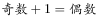
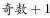
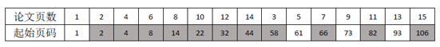
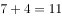
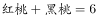
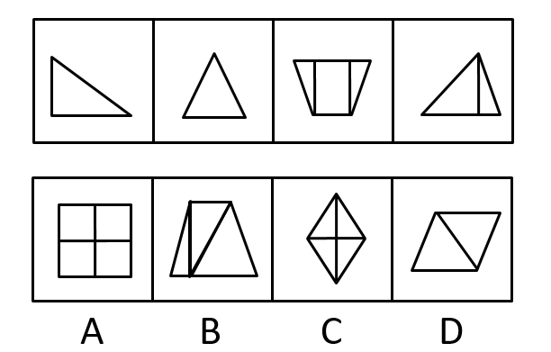
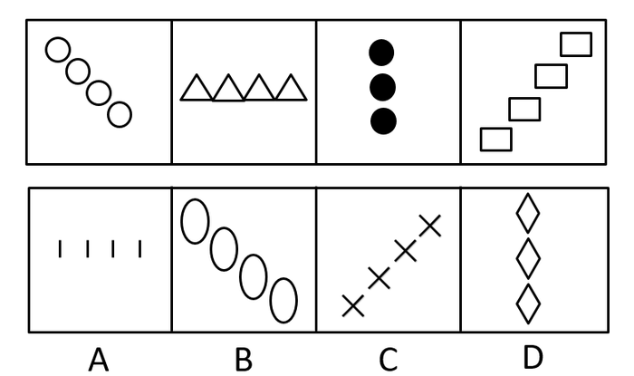
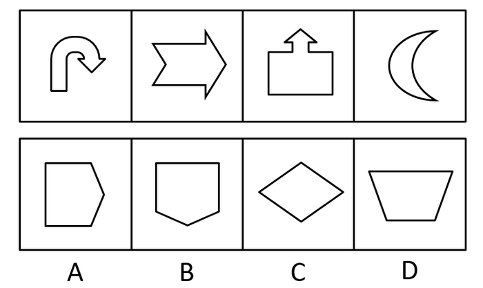
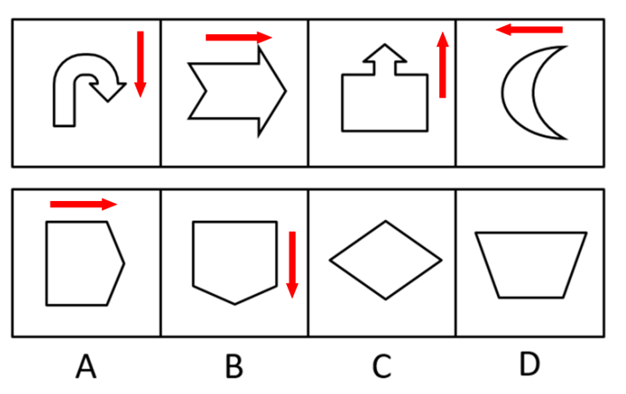

# 天津市选调2018年应届优秀大学毕业生到基层培养锻炼考试题（网友回忆版）

> 判断推理 · 15 题 · 天津 2018

## 第 1 题　qid 2377390 · 类比推理

军装：士兵

- **A**. 套装：女人
- **B**. 服装：场合
- **C**. 警服：警察　✅
- **D**. 制服：邮递员

**答案**：C

**官方解析**

第一步：判断题干词语间的逻辑关系。
军装是士兵特有的服装，两者为特定服装与特定职业的关系。
第二步：判断选项词语间的逻辑关系。
A项：套装不是女人的特定服装，男人也可以套装，与题干逻辑关系不一致，排除；
B项：服装可以根据场合进行分类，与题干逻辑关系不一致，排除；
C项：警服是警察特有的服装，两者为特定服装与特定职业的关系，与题干逻辑关系一致，当选；
D项：制服不是邮递员的特定的服装，除邮递员外的其他职业也可以穿制服，与题干逻辑关系不一致，排除。
故正确答案为C。

---

## 第 2 题　qid 2166015 · 类比推理

跳跃：动作

- **A**. 富豪：奢侈
- **B**. 风俗：习惯　✅
- **C**. 大楼：木屋
- **D**. 蜡笔：图画

**答案**：B

**官方解析**

第一步：判断题干词语间的逻辑关系。
跳跃是动作的一种，两者为种属关系。
第二步：判断选项词语间的逻辑关系。
A项：富豪不是奢侈的一种，与题干逻辑关系不一致，排除；
B项：风俗是习惯的一种，两者为种属关系，与题干逻辑关系一致，当选；
C项：大楼与木屋是并列关系，与题干逻辑关系不一致，排除；
D项：蜡笔不是图画的一种，是图画工具的一种，与题干逻辑关系不一致，排除。
故正确答案为B。

---

## 第 3 题　qid 2166016 · 类比推理

焊接工：护目镜

- **A**. 水生物：鲸鱼
- **B**. 技工：扳手
- **C**. 妇女：泼妇
- **D**. 骑士：盾牌　✅

**答案**：D

**官方解析**

第一步：判断题干词语间的逻辑关系。
护目镜是焊接工工作的辅助工具，起到保护作用，两者属于对应关系。
第二步：判断选项词语间的逻辑关系。
A项：鲸鱼是水生物的一种，两者属于种属关系，与题干逻辑关系不一致，排除；
B项：扳手是技工工作的主要工具，并非起到保护作用，与题干逻辑关系不一致，排除；
C项：泼妇是妇女的一种，两者属于种属关系，与题干逻辑关系不一致，排除；
D项：盾牌是骑士作战时的辅助工具，起到保护作用，与题干逻辑关系一致，当选。
故正确答案为D。

---

## 第 4 题　qid 2166017 · 类比推理

紫竹：植物学家

- **A**. 电影：影迷
- **B**. 页岩：地质学者　✅
- **C**. 昆虫学家：昆虫
- **D**. 瓷砖：镶嵌

**答案**：B

**官方解析**

第一步：判断题干词语间的逻辑关系。
紫竹是植物学家研究的对象，两者属于对应关系。
第二步：判断选项词语间的逻辑关系。
A项：影迷是喜欢看电影而入迷的人，且影迷不是一种职业，与题干逻辑关系不一致，排除；
B项：页岩是地质学者研究的对象，两者属于对应关系，与题干逻辑关系一致，当选；
C项：昆虫是昆虫学家研究的对象，但两者顺序反了，与题干逻辑关系不一致，排除；
D项：瓷砖是被镶嵌于附着面上，两者并非研究对象与人物的对应关系，与题干逻辑关系不一致，排除。
故正确答案为B。

---

## 第 5 题　qid 2166018 · 类比推理

义务警员：警察

- **A**. 小偷：扒手
- **B**. 踏板：自行车
- **C**. 肖像：装饰　✅
- **D**. 刑罚：死刑

**答案**：C

**官方解析**

第一步：判断题干词语间的逻辑关系。
义务警员不是警察，但是具有警察的职能，二者是对应关系。
第二步：判断选项词语间的逻辑关系。
A项：扒手是小偷的别称，二者是全同关系，与题干逻辑关系不一致，排除；
B项：踏板属于自行车的一部分，二者是组成关系，与题干逻辑关系不一致，排除；
C项：肖像不是装饰，但是具有装饰的功能，二者是对应关系，与题干逻辑关系一致，当选；
D项：死刑是刑罚的一种，二者是种属关系，与题干逻辑关系不一致，排除。
故正确答案为C。

---

## 第 6 题　qid 2166019 · 逻辑判断

有一天，甲、乙、丙、丁、戊五个外国商人坐在一起聊天。甲说：“我们五人中有一个人在撒谎”；乙说：“我们五人中有两个人在撒谎”；丙说：“我们五人中有三个人在撒谎”；丁说：“我们五人中有四个人在撒谎”；戊说：“我们五个人全都在撒谎”。由此，可推出他们之中说真话的是：

- **A**. 甲和戊
- **B**. 丁　✅
- **C**. 乙和丙
- **D**. 戊

**答案**：B

**官方解析**

第一步：翻译题干信息。
甲：有一个人在撒谎，其他四个说的是真话；
乙：有两个人在撒谎，其他三个说的是真话；
丙：有三个人在撒谎，其他两个说的是真话；
丁：有四个人在撒谎，有一个说的是真话；
戊：五个人都在撒谎。
甲乙丙丁戊说的话真假存在相关性，假设甲说的是真话，那么乙丙丁戊说的都是假话，与甲矛盾，排除A项；假设乙说的是真话，那么甲丙丁戊说的都是假话，与乙矛盾，排除C项；假设戊说的是真话，那么甲乙丙丁说的都是假话，与戊矛盾，排除D项；只有当丁说的是真话，那么甲乙丙戊说的都是假话，与丁相符，B项当选。
故正确答案为B。

---

## 第 7 题　qid 2166020 · 逻辑判断

在一次摩托车比赛中，有五位运动员的名次可能是这样的（每个名次只能一人)：①赵爱武第二，钱堂江第三；②钱堂江第一，孙达胜第四；③李积红第三，周关群第五；④赵爱武第二，孙达胜第四；⑤周关群第一，李积红第二。比赛结果证明，上述猜测中各有一句是正确的。
由此可知，冠军是谁?

- **A**. 赵爱武　✅
- **B**. 钱堂江
- **C**. 孙达胜
- **D**. 李积红

**答案**：A

**官方解析**

根据题干信息：上述猜想中各有一句是正确的，假设②中钱堂江第一为真，那么②中孙达胜第四为假，所以⑤中周关群第一为假，李积红第二为真。④中孙达胜第四为假，赵爱武第二为真。与⑤中李积红第二为真矛盾。故假设钱堂江第一错误，排除B项。那么②中孙达胜第四为真，推出④中孙达胜第四为真，赵爱武第二为假。①中钱堂江第三为真，③中李积红第三为假，周关群第五为真，推出⑤中李积红第二为真，那么剩下的赵爱武为第一。
故正确答案为A。

---

## 第 8 题　qid 2166021 · 逻辑判断

桌上放着红桃、黑桃和梅花三种牌，共二十张。①桌上至少有一种花色的牌少于6张；②桌上至少有一种花色的牌多于6张；③桌上任意两种花色的牌的总数不超过19张。
以上论述中正确的是：

- **A**. ①②
- **B**. ②③　✅
- **C**. ①③
- **D**. ①②③

**答案**：B

**官方解析**

根据题干信息：先将20张平分为三种花色，每种花色至少分的六张，所以②正确，①错误，排除A、C、D三项，因为存在三种花色，每种花色至少有一张，所以③正确。
故正确答案为B。

---

## 第 9 题　qid 2166022 · 逻辑判断

某机关要编辑论文集，共收录十五篇论文，各篇论文的页数分别是一页，二页，三页······十四页，十五页稿纸。如果将这些论文按某种顺序装订成册，并统一编上页码，则每篇文章的第一页是偶数页码的最多篇数是：

- **A**. 5篇
- **B**. 6篇
- **C**. 7篇
- **D**. 8篇　✅

**答案**：D

**官方解析**

由于，所以如果某篇论文前面一共有奇数页论文，则该论文第一页为偶数页码。根据题干“将这些论文按某种顺序装订成册”，若按照1页、2页、3页、……、15页的顺序编排，由于，，则如上表所示，论文页数为2页、3页、6页、7页、10页、11页、14页、15页的这8篇论文之前的总论文页数之和均为奇数，由于，故有8篇论文的第一页为偶数页码。

故正确答案为D。

粉笔说明：

这其实是一道数学题目，而这道题命题人关于“将这些论文按某种顺序装订成册”的表述并不严谨，按照他设置的答案，“某些顺序”其实指的是“1-15”的顺序，否则最正确的解题思路应该如下所示：

要保证每篇文章的第一页是偶数页码的篇数最多，则应该页码1放1页的论文，后面放上全部的偶数页的论文（依次为2页、4页、6页、……、14页），此时有7篇论文第一页为偶数页码。随后只能再放剩余奇数页的论文（3页、5页、7页、……、15页），按照顺序排好以后发现是呈“第一页是奇数偶数”交替的规律，则3页、7页、11页、15页4篇论文第一页也为偶数页码。

所以按某种顺序装订成册，第一页是偶数页码的篇数最多为篇。故本题实际上没有正确答案。

---

## 第 10 题　qid 2166023 · 逻辑判断

四个人正在打桥牌。已知其中一个人手上的13张牌四种花色样样都有，且各种花色的牌的张数不一样，红桃和方块合起来有5张，红桃和黑桃合起来有6张，梅花有3张。问此人手上哪种花色最少？

- **A**. 黑桃
- **B**. 方块
- **C**. 梅花
- **D**. 红桃　✅

**答案**：D

**官方解析**

根据题干已知信息可知此人手中有13张牌，且梅花有3张，即可得到①。又根据题干已知②，③。将②式和③式相加减去①式可得红桃数量为1张。且此人手上每个花色的牌都有，因此花色数量最少的为红桃。

故正确答案为D。

---

## 第 11 题　qid 2166024 · 图形推理

<b>从所给的四个选项中选择最适合的一项，使之呈现一定的规律性：</b>

- **A**. A
- **B**. B
- **C**. C
- **D**. D　✅

**答案**：D

**官方解析**

元素组成不同，属性无明显规律，考虑数量规律。点、线、面在数量上不构成规律性，考虑数角。由于每个图形都有锐角，考虑数锐角个数，题干依次为2、3、4、5、？，因此，应该选择一个锐角数是6个的图形，只有D选项符合。
故正确答案为D。
注：一般考数角的题都是不重复数的，但是题干图4的锐角重复数了，此题不常规，以后数角还是优先不重复数。

---

## 第 12 题　qid 2166025 · 图形推理

<b>从所给的四个选项中选择最适合的一项，使其与以下四幅图呈现一定的规律性：</b>

- **A**. A
- **B**. B　✅
- **C**. C
- **D**. D

**答案**：B

**官方解析**

元素组成相似，相同线条重复出现，优先考虑样式规律中的加减同异。观察发现，图一与图三去同求异得到图四，那么图二应该和图四去同求异得到答案，即B项。
故正确答案为B。

---

## 第 13 题　qid 2166026 · 图形推理

<b>从所给的四个选项中选择最适合的一项，使之呈现一定的规律性：</b>

- **A**. A
- **B**. B
- **C**. C　✅
- **D**. D

**答案**：C

**官方解析**

元素组成不同，数量特征明显，考虑数量规律，题干元素的个数分别是2、2、3、4、？，单独看数量不成规律，考虑做运算，前两图数量相加，减1等于下一幅图，故？处应该填入数量为6，只有C项符合。
故正确答案为C。

---

## 第 14 题　qid 2166027 · 图形推理

<b>从所给的四个选项中选择最适合的一项，使之呈现一定的规律性：</b>

- **A**. A
- **B**. B
- **C**. C　✅
- **D**. D

**答案**：C

**官方解析**

元素组成不同，且无属性规律。观察发现，每个图形都是由同一种小元素组成，考虑小元素数量，4，4，3，4无数量规律。将每个图形中的小元素相连，发现都在一条直线上，并且选项中每个图形也符合这一规律，于是将每个图形小元素的组成看成一条直线发现，相邻两个图形，呈逆时针旋转的规律，移动角度为45度，90度，135度，故？处应逆时针旋转180度，只有C项满足。
故正确答案为C。

---

## 第 15 题　qid 2166028 · 图形推理

<b>从所给的四个选项中选择最适合的一项，使之呈现一定的规律性：</b>

- **A**. A
- **B**. B　✅
- **C**. C
- **D**. D

**答案**：B

**官方解析**

图形元素组成不同，但属性与数量没有明显规律。观察发现，题干图形出现较多箭头，且前三幅图箭头指向明显，分别指向下、右、上，第四幅图存在变形，可将月亮左侧突出的弧线看成指向左边的箭头，所以题干图形的规律为箭头指向依次逆时针旋转（如下图所示），故问号处应选择箭头指向为下的图形，只有B项满足规律。

故正确答案为B。

---
