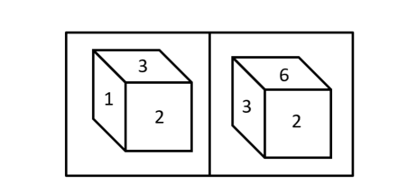
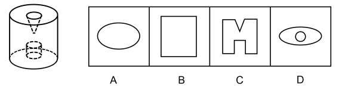
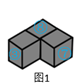
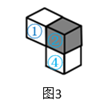

# 广东省2019年选调优秀大学毕业生笔试 思维能力测验（网友回忆版）

> 判断推理 · 30 题 · 广东 2019

## 第 1 题　qid 2262041 · 类比推理

人才是第一资源，科技创新必须依靠人才实力。因此，谁拥有了一流创新人才，谁就能在科技创新的竞争中取得优势。
以下与上述推理在结构上最为相似的是（  ）。

- **A**. 所有高楼大厦都要打好地基。只要打好地基，就能建成高楼大厦　✅
- **B**. 一切反动派都是纸老虎。所以，我们能够打败反动派
- **C**. 伤心总是难免的。因此，人难免伤心
- **D**. 个人的成长需要依靠自身的努力。只有努力才能获得个人成长

**答案**：A

**官方解析**

第一步：分析题干推理形式。

科技创新人才。因此，人才科技创新，属于肯定箭头后推肯定箭头前的形式。

第二步：逐一分析选项。

A项：翻译为：高楼大厦打好基础，打好基础高楼大厦，推理形式为肯后推肯前，与题干推理形式相同，当选；

B项：翻译为：反动派纸老虎，我们能打败反动派，与题干推理形式不同，排除；

C项：没有逻辑关键词，不能翻译，与题干推理形式不同，排除；

D项：翻译为：成长努力，成长努力，推理形式为肯前推肯后，与题干推理形式不同，排除。

故正确答案为A。

---

## 第 2 题　qid 2262043 · 逻辑判断

新时代对党员干部提出了更高的要求。在现实中，由于一些党员干部理论学习不足，“本领恐慌”问题越来越突出。因此，只要广大党员干部切实加强理论学习，就可以避免出现“本领恐慌”。
上述论证最可能的潜在假设是（  ）。

- **A**. 解决“本领恐慌”问题必须依靠党员干部自身努力
- **B**. 理论学习不足是出现“本领恐慌”的唯一原因　✅
- **C**. 广大党员干部都存在理论学习不足的问题
- **D**. 只有加强学习才能达到新时代的更高要求

**答案**：B

**官方解析**

第一步：找出论点和论据。
论点：只要广大党员干部切实加强理论学习，就可以避免出现“本领恐慌”。
论据：在现实中，由于一些党员干部理论学习不足，“本领恐慌”问题越来越突出。
第二步：逐一分析选项。
A项：论点说的是通过党员干部加强理论学习能不能避免出现“本领恐慌”，该项说的是依靠干部自身努力，干部自身努力是否指的是加强理论学习，以及结果是否能避免出现“本领恐慌”并不明确，不是论证成立的假设，排除；
B项：理论学习不足是出现“本领恐慌”的唯一原因，说明只要解决了唯一原因就可以解决问题，那么只要广大党员干部切实加强理论学习，就可以避免出现“本领恐慌”，是论证成立的假设，当选；
C项：论点说的是通过党员干部加强理论学习能不能避免出现“本领恐慌”，该项说的是党员干部是否存在理论学习不足的问题，话题不一致，不是论证成立的假设，排除；
D项：该项说的是加强学习能达到新时代的更高要求，但是能不能避免出现“本领恐慌”是不明确的，不是论证成立的假设，排除。
故正确答案为B。

---

## 第 3 题　qid 2262047 · 逻辑判断

目前，我国民用航空市场还不够发达，民航飞行时长与一些发达国家有较大差距。不过，随着我国经济的发展与人民生活水平的提高，人民群众的旅游需求日益增长。因此，我国民用航空市场潜力巨大。
上述论证最可能基于的潜在假设是（  ）。

- **A**. 我国旅游需求仍有较大的增长空间
- **B**. 旅游需求的增长能够有效推动民用航空市场的发展　✅
- **C**. 我国民航飞行时长将达到与发达国家相当的水平
- **D**. 经济的发展与人民生活水平的提高有关

**答案**：B

**官方解析**

第一步：找出论点和论据。
论点：我国民用航空市场潜力巨大。
论据：随着我国经济的发展与人民生活水平的提高，人民群众的旅游需求日益增长。
第二步：逐一分析选项。
A项：论点说的是我国民用航空市场的未来发展问题，该项说的是我国旅游需求有较大的增长空间，话题不一致，不是论证成立的假设，排除；
B项：旅游需求的增长能够有效推动民用航空市场的发展，现在我国人民群众的旅游需求一直在增长，说明就可以有效推动我国民用航空市场的发展，建立论据和论点之间的联系，搭桥项，当选；
C项：我国民航飞行时长将达到与发达国家相当的水平，飞行时长增多是否能说明民用航空市场如何，是不明确的，不是论证成立的假设，排除；
D项：论点说的是我国民用航空市场的未来发展问题，该项说的是经济的发展和人民生活水平的提高之间的关系，话题不一致，不是论证成立的假设，排除。
故正确答案为B。

---

## 第 4 题　qid 2262058 · 逻辑判断

2017年抑郁症调查报告显示，中国约有的人患有抑郁症。因此，如果2030年中国人口达到15亿，届时，抑郁症患者人数约为4500万。

上述论证最可能基于的潜在假设是（  ）。

- **A**. 中国人口数量将持续增加
- **B**. 中国人口结构将保持稳定
- **C**. 到2030年，中国人口中抑郁症患者的比例保持不变　✅
- **D**. 到2030年，仍未研发出能够有效防治抑郁症的药物

**答案**：C

**官方解析**

第一步：找出论点和论据。

论点：如果2030年中国人口达到15亿，届时，抑郁症患者人数约为4500万。

论据：2017年抑郁症调查报告显示，中国约有的人患有抑郁症。

第二步：逐一分析选项。

A项：论点说的是2030年中国抑郁症患者会达到4500万人，该项说的是中国人口数量将持续增加，并没有涉及抑郁症患者人数如何变化，话题不一致，不是论证成立的假设，排除；

B项：论点说的是2030年中国抑郁症患者会达到4500万人，该项说的是中国人口结构将保持稳定，并不是抑郁症患者结构，话题不一致，不是论证成立的假设，排除；

C项：论点中2030年抑郁症患者的人数4500万占中国人口15亿的，与2017年中国人口中抑郁症患者的比例一致，因此到2030年，中国人口中抑郁症患者的比例保持不变，是论证成立的假设，当选；

D项：论点说的是2030年中国抑郁症患者会达到4500万人，该项说的是仍未研发出能够有效防治抑郁症的药物，话题不一致，不是论证成立的假设，排除。

故正确答案为C。

---

## 第 5 题　qid 2262037 · 逻辑判断

去年，某市共发生道路安全交通事故764起，死亡456人。据估算，只有不到的交通工具配备了急救医疗包。如果有更多的交通工具配备急救医疗包，那么道路安全交通事故死亡人数会大大减少。

以下选项最能够指出上述论证缺陷的是（  ）。

- **A**. 忽视了遭遇交通事故立即死亡的案例
- **B**. 忽略了绝大多数交通工具从来没有发生过交通事故
- **C**. 默认了未配备急救医疗包是导致交通事故死亡的主要原因　✅
- **D**. 暗含了配备急救医疗包能有效避免交通事故的发生

**答案**：C

**官方解析**

第一步：找出论点和论据。

论点：如果有更多的交通工具配备急救医疗包，那么道路安全交通事故死亡人数会大大减少。

论据：去年，某市共发生道路安全交通事故764起，死亡456人。据估算，只有不到的交通工具配备了急救医疗包。

第二步：逐一分析选项。

A项：题干说因为只有不到的交通工具配备了急救医疗包，所以得到如果配备更多的急救医疗包，道路安全交通事故死亡人数就会大大减少，并没有否认交通事故中有立即死亡的案例，无法指出论证缺陷，排除；

B项：题干讨论的是在发生交通事故的交通工具中，增加急救医疗包能不能使死亡人数减少，和没有发生过交通事故的交通工具无关，无法指出论证缺陷，排除；

C项：题干说因为只有不到的交通工具配备了急救医疗包，所以得到如果配备更多的急救医疗包，道路安全交通事故死亡人数就会大大减少，在论证过程中默认了未配备急救医疗包就是导致交通事故死亡的主要原因，可以指出论证缺陷，当选；

D项：题干讨论的是配备更多的急救医疗包，道路安全交通事故死亡人数就会大大减少，和是否能够有效避免交通事故的发生无关，无法指出论证缺陷，排除。

故正确答案为C。

---

## 第 6 题　qid 2262048 · 类比推理

《茶经》的作者是陆羽。它是世界上最早的研究茶的著作。因此，陆羽创作了世界上最早的研究茶的著作。
以下与上述推理在结构上最为相似的是（  ）。

- **A**. 地动仪的发明者是张衡。它是测量地震的仪器。因此，如果没有张衡就没有地动仪
- **B**. 班固是《汉书》的作者之一。《汉书》具有重大的史学价值。因此，班固是一位伟大的历史学家
- **C**. 贝多芬创作了《命运交响曲》。它是一部优秀的作品。因此，贝多芬创作了很多优秀的交响曲
- **D**. 天王星的发现者是威廉·赫歇尔。它是太阳系由内向外的第七颗行星。因此，威廉·赫歇尔发现了太阳系由内向外的第七颗行星　✅

**答案**：D

**官方解析**

第一步：分析题干推理形式。
《茶经》（A）→陆羽（B），《茶经》（A）→最早的研究茶的著作（C），因此，陆羽（B）→最早的研究茶的著作（C）。
第二步：逐一分析选项。
A项：地动仪（A）→张衡（B），地动仪（A）→测量地震的仪器（C），因此，没有张衡（-B）→没有地动仪（-A），与题干推理结构不同，排除；
B项：班固（A）→《汉书》（B），《汉书》（B）→有史学价值（C），因此，班固（A）→历史学家（D），与题干推理结构不同，排除； 
C项：贝多芬（A）→《命运交响曲》（B），《命运交响曲》（B）→优秀的作品（C），因此，贝多芬（A）→很多优秀的交响曲（很多C），与题干推理结构不同，排除；
D项：天王星（A）→威廉·赫歇尔（B），天王星（A）→第七颗行星（C），因此，威廉·赫歇尔（B）→第七颗行星（C），与题干推理结构相同，当选。
故正确答案为D。

---

## 第 7 题　qid 2262054 · 逻辑判断

员工的业务能力，对企业来说是至关重要的。某企业对符合招聘条件的应聘者进行面试筛选后发现，通过了面试并工作了一段时间的员工业务能力都很强。所以，完全有理由相信该企业使用的面试筛选方法是非常有效的。
以下最能说明上述推论漏洞的是（  ）。

- **A**. 未说明员工的业务能力对企业至关重要的原因
- **B**. 假设了即使依据一个实例，也可以得出一般性的结论
- **C**. 忽视了应聘者即使业务能力很强，也无法保证其今后表现
- **D**. 忽视了只有业务能力强的人才能满足该企业的招聘条件　✅

**答案**：D

**官方解析**

第一步：找出论点和论据。
论点：完全有理由相信该企业使用的面试筛选方法是非常有效的。
论据：某企业对符合招聘条件的应聘者进行面试筛选后发现，通过了面试并工作了一段时间的员工业务能力都很强。
第二步：逐一分析选项。
A项：该项讨论的是员工的业务能力对企业的重要性，而题干讨论的是企业的面试筛选方法是否有效，话题不一致，无法指出论证缺陷，排除；
B项：该项指出假设了即使依据一个实例，也可以得出一般性的结论，但题干说的是“都”，而不是一个实例，无法指出论证缺陷，排除；
C项：该项指出应聘者业务能力强和今后表现无关，而题干讨论的是企业的面试筛选方法是否有效，话题不一致，无法指出论证缺陷，排除；
D项：该项指出只有业务能力强的人才能满足该企业的招聘条件，说明进入该企业工作的人才本身业务能力就很强，而不是筛选方法有效，可以指出论证缺陷，当选。
故正确答案为D。

---

## 第 8 题　qid 2262055 · 逻辑判断

养老机器人是指以老年人为服务对象，具有照料、监测、互动等功能的智能机器人。当前，养老机器人产品同质化严重，制约了养老机器人产业的发展，如果这一问题能够解决，那么养老机器人产业将迎来春天。
以下选项最好地总结了上述论证缺陷的是（  ）。

- **A**. 暗示了养老机器人产业正处于严冬
- **B**. 假设了产品同质化问题具有解决的可能性
- **C**. 忽视了养老机器人产业可能存在其他制约因素　✅
- **D**. 暗示了产品质量决定着产业的发展前景

**答案**：C

**官方解析**

第一步：找出论点和论据。
论点：如果养老机器人产品同质化的问题能够解决，那么养老机器人产业将迎来春天。
论据：无
第二步：逐一分析选项。
A项：该项指出养老机器人产业正处于寒冬，而论点指出养老机器人产品同质化的问题能够解决，那么养老机器人产业将迎来春天，话题不一致，无法指出论证缺陷，排除；
B项：该项指出产品同质化问题可以解决，而题干讨论养老机器人产品同质化的问题能够解决，话题不一致，无法指出论证缺陷，排除；
C项：该项指出忽视了养老机器人产业可能存在其他制约因素，说明即使解决了养老机器人产品同质化的问题，养老机器人产业也不一定迎来春天，可以指出论证缺陷，当选；
D项：该项指出产品质量决定着产业的发展前景，而题干讨论养老机器人产品同质化的问题能够解决，话题不一致，无法指出论证缺陷，排除。
故正确答案为C。

---

## 第 9 题　qid 2262027 · 逻辑判断

一项针对11岁青少年的研究发现，生活在绿化程度较低的社区的青少年空间工作记忆能力较差，生活在绿化程度较高的社区的青少年空间工作记忆能力较强。据此，有人建议青少年应该居住在绿化程度较高的地方。
以下最能质疑上述建议的是（  ）。

- **A**. 青少年在10岁到14岁间的空间工作记忆能力较差
- **B**. 生活在绿化程度低的城市的成年人空间工作记忆能力较强
- **C**. 社区绿地数量多有利于促进青少年的大脑发育
- **D**. 绿化程度较高社区的家庭通常更注重青少年空间工作记忆能力的培养　✅

**答案**：D

**官方解析**

第一步：找出论点和论据。
论点：有人建议青少年应该居住在绿化程度较高的地方。
论据：一项针对11岁青少年的研究发现，生活在绿化程度较低的社区的青少年空间工作记忆能力较差，生活在绿化程度较高的社区的青少年空间工作记忆能力较强。
论点和论据均在讨论“居住在绿化程度较高的地方能增强空间工作记忆能力”，话题一致，削弱优先考虑否定论点，并且论点内暗含因果关系，也可以考虑因果倒置和他因削弱。
第二步：逐一分析选项。
A项：该项指出青少年在10岁到14岁间的空间工作记忆能力较差，是对于这一年龄段的普遍特征的描述，不能说明青少年空间工作记忆能力与绿化程度的关系，不能削弱，排除；
B项：题干讨论生活在绿化程度较低的社区对于青少年的影响，该项指出对于成年人的影响，讨论主体不一致，不能削弱，排除；
C项：该项说明社区绿地数量多对青少年大脑发育有利，但对大脑发育有利和空间工作记忆能力之间的关系不明确，无法削弱，排除；
D项：该项指出绿化程度较高社区的家庭，更加注重青少年空间工作记忆能力的培养，说明可能是因为注重培养，而不是因为居住在绿化程度较高的地方使工作记忆能力强，为他因削弱，可以削弱，当选。
故正确答案为D。

---

## 第 10 题　qid 2262033 · 类比推理

空气中的氧是地球上生物赖以生存的基础。近日，有科学家研究发现，火星地下咸水含有充足的分子氧，足以支持好氧微生物存活，这表明火星上的生物有可能存在于地下。
上述推论最可能基于的假设是（  ）。

- **A**. 火星地下咸水资源充足
- **B**. 火星地表不适合生命生存
- **C**. 氧是生物存在的必要条件　✅
- **D**. 地球生物与火星生物构造不同

**答案**：C

**官方解析**

第一步：找出论点和论据。
论点：火星上的生物有可能存在于地下。
论据：有科学家研究发现，火星地下咸水含有充足的分子氧，足以支持好氧微生物存活。
第二步：逐一分析选项。
A项：论点说的是火星上的生物有可能存在于地下，该项说的是火星地下咸水资源充足，不是论证成立的假设，排除；
B项：论点说的是火星上的生物有可能存在于地下，该项说的是火星地表不适合生命生存，不是论证成立的假设，排除； 
C项：题干论据说的是火星地下咸水有氧，论点说的是火星地下有生物，该项说的是氧是生物存在的必要条件，建立了论点和论据之间的联系，是论证成立的假设，当选；
D项：论点说的是火星上的生物有可能存在于地下，该项说的是地球生物与火星生物构造不同，不确定火星上的生物生存是否需要氧，属于不明确选项，不是论证成立的假设，排除。
故正确答案为C。

---

## 第 11 题　qid 2262036 · 类比推理

如果日出前出现鲜红的朝霞，那么今天会下雨。今天下雨了，所以今天日出前出现了鲜红的朝霞。
以下与上述推理在结构上最为相似的是（  ）。

- **A**. 如果冬天有瑞雪，那么来年一定会丰收。今年丰收了，所以去年冬天有瑞雪　✅
- **B**. 长时间下雨，突然起了大雾，大雾过后必定是晴天。大雾过后出现了晴天，是因为大雾前长时间下雨
- **C**. 如果立秋这天下雨，接下来百天内不会有霜冻。立秋之后出现了霜冻，那么立秋这天下雨了
- **D**. 如果今天早上露水多，那么明天就会是晴天。今天早上没有露水，明天一定不会是晴天

**答案**：A

**官方解析**

第一步：分析题干推理形式。

日出前出现鲜红的朝霞今天会下雨，后一句为，今天下雨了今天日出前出现了鲜红的朝霞。属于肯后推肯前的形式。

第二步：逐一分析选项。

A项：冬天有瑞雪来年一定会丰收，后一句为，今年丰收了去年冬天有瑞雪。属于肯后推肯前，与题干推理形式相同，当选；

B项：长时间下雨起了大雾大雾过后是晴天，后一句为，大雾前长时间下雨大雾过后出现晴天。属于肯前推肯后，与题干推理形式不同，排除；

C项：立秋这天下雨接下来百天内不会有霜冻，后一句为，立秋之后出现了霜冻立秋这天下雨了。属于否后推肯前，与题干推理形式不同，排除；

D项：今天早上露水多明天就会是晴天，后一句为，今天早上没有露水明天一定不会是晴天。属于否前推否后，与题干推理形式不同，排除。

故正确答案为A。

---

## 第 12 题　qid 2262038 · 逻辑判断

玻璃幕墙是一种美观新颖的建筑墙体形式，但是不少公众担心它会存在破碎隐患。其实只要选用合格的材料，就能将玻璃幕墙的破碎隐患降到微乎其微。所以，对于大部分玻璃幕墙，公众不必担心它们的破碎隐患。
上述论证最可能的潜在假设是（  ）。

- **A**. 破碎隐患是玻璃幕墙最主要的安全隐患
- **B**. 大部分的玻璃幕墙都选用了合格的材料　✅
- **C**. 公众能够识别制造玻璃幕墙所需的材料
- **D**. 公众了解合格材料能减少玻璃幕墙的破碎隐患

**答案**：B

**官方解析**

第一步：找出论点和论据。
论点：对于大部分玻璃幕墙，公众不必担心它们的破碎隐患。
论据：只要选用合格的材料，就能将玻璃幕墙的破碎隐患降到微乎其微。
第二步：逐一分析选项。
A项：该项说的是破碎隐患是玻璃幕墙最主要的安全隐患，但是需不需要为这个隐患担心不清楚，不是论证成立的假设，排除；
B项：题干论据说的选用合格的材料，玻璃幕墙的破碎隐患能降到微乎其微，该项说的是大部分的玻璃幕墙都选用了合格的材料，那么自然不必担心他们的破碎隐患，建立了论点和论据之间的联系，是论证成立的假设，当选； 
C项：论点说的是对于大部分玻璃幕墙，公众不必担心它们的破碎隐患，该项说的是公众能够识别制造玻璃幕墙所需的材料，但是公众到底需不需要担心不清楚，不是论证成立的假设，排除；
D项：论点说的是对于大部分玻璃幕墙，公众不必担心它们的破碎隐患，该项说的是公众了解合格材料能减少玻璃幕墙的破碎隐患，不清楚玻璃幕墙选用的是不是合格材料，也不清楚公众需不需要担心，不是论证成立的假设，排除。
故正确答案为B。

---

## 第 13 题　qid 2261999 · 逻辑判断

近日，有研究小组成功地改进了手机回收中的关键环节，减少了手机回收利用过程中对环境造成的污染。由于不必再为废旧手机产生环境污染而担忧，人们将会更为频繁地购买和更换新手机。
以下选项最能够指出上述论证缺陷的是（  ）。

- **A**. 假设了该研究小组的研究成果能够很快投入使用
- **B**. 暗含了人们在考虑购买和更换新手机时比较关注环保因素　✅
- **C**. 假设了回收废旧手机能够获得经济利益
- **D**. 忽视了人们在购买新手机后，一般不会立刻丢弃旧手机

**答案**：B

**官方解析**

第一步：找出论点和论据。
论点：人们将会更为频繁地购买和更换新手机。
论据：不必再为废旧手机产生环境污染而担忧。
第二步：逐一分析选项。
A项：论点说的是人们将会更为频繁地购买和更换新手机，该项说的是研究成果能否很快投入使用，无法指出论证缺陷，排除；
B项：人们在考虑购买和更换新手机时比较关注环保因素，那么当不用为环境担忧时，人们就会频繁的更换手机，暗含了论据和论点之间的关系，可以指出论证缺陷，当选；
C项：论点说的是人们将会更为频繁地购买和更换新手机，该项说的是回收废旧手机能够获得经济利益，无法指出论证缺陷，排除；
D项：论点说的是人们将会更为频繁地购买和更换新手机，该项说的是人们在购买新手机后是否会立刻丢弃旧手机，无法指出论证缺陷，排除。
故正确答案为B。

---

## 第 14 题　qid 2262012 · 类比推理

21世纪是信息大爆炸的时代，随着互联网和移动智能设备的普及，人们获得信息越来越多，越来越容易。有理由相信，这样的条件为我们提供了更多了解真相的机会，也表示我们离事物的真相越来越近。
上述推论最可能基于的假设是（  ）。

- **A**. 过多的信息会对人们的生活造成干扰
- **B**. 信息加工过程对每个人来说存在差别
- **C**. 互联网上充斥着大量虚假信息
- **D**. 信息是了解事物真相的基础　✅

**答案**：D

**官方解析**

第一步：找出论点和论据。
论点：这样的条件为我们提供了更多了解真相的机会，也表示我们离事物的真相越来越近。
论据：21世纪是信息大爆炸的时代，随着互联网和移动智能设备的普及，人们获得信息越来越多，越来越容易。
第二步：逐一分析选项。
A项：论点说的是提供了更多了解真相的机会，该项说的是过多的信息会对人们的生活造成干扰，不是论证成立的假设，排除；
B项：论点说的是提供了更多了解真相的机会，该项说的是信息加工过程对每个人存在差别，不是论证成立的假设，排除；
C项：互联网上充斥着大量虚假信息，指出互联网上的信息不一定是真实的，说明我们没有更多了解真相的机会，不会离真相越来越近，有一定的削弱作用，不是论证成立的假设，排除；
D项：信息是了解事物真相的基础，那么我们现在获得的信息越多，也就有了更多了解真相的机会，建立了论点和论据之间的联系，是论证成立的假设，当选。
故正确答案为D。

---

## 第 15 题　qid 2262016 · 逻辑判断

几名顾客在某餐厅用餐后，出现了呕吐腹痛等症状。事件发生后，相关部门立刻将剩下的食物送去检验。结果表明，送检食物中的有害细菌含量不超标。所以，在该餐厅用餐不是他们出现呕吐腹痛等症状的原因。
以下选项最能够指出上述论证缺陷的是（  ）。

- **A**. 暗含了呕吐腹痛等症状并不一定在食物中毒时才会出现
- **B**. 忽视了其他顾客可能在一段时间后才出现呕吐腹痛等症状
- **C**. 忽视了这些出现呕吐腹痛等症状的顾客的消化能力较常人更弱
- **D**. 假设了只有食物中的有害细菌才会导致呕吐腹痛等症状　✅

**答案**：D

**官方解析**

第一步：找出论点和论据。
论点：在该餐厅用餐不是他们出现呕吐腹痛等症状的原因。
论据：送检食物中的有害细菌含量不超标。
第二步：逐一分析选项。
A项：论点说的是在该餐厅用餐不是他们出现呕吐腹痛等症状的原因，该项说的是呕吐腹痛等症状并不一定在食物中毒时才会出现，无法指出论证缺陷，排除；
B项：论点说的是在该餐厅用餐不是他们出现呕吐腹痛等症状的原因，该项说的是忽视了什么时间出现症状，无法指出论证缺陷，排除；
C项：论点说的是在该餐厅用餐不是他们出现呕吐腹痛等症状的原因，该项说的是忽视了这些出现症状的顾客的消化能力更弱，无法指出论证缺陷，排除；
D项：只有食物中的有害细菌才会导致呕吐腹痛等症状，送检食物中的有害细菌含量不超标，那么餐厅用餐就不是呕吐腹痛的原因，暗含了论据和论点之间的关系，可以指出论证缺陷，当选。
故正确答案为D。

---

## 第 16 题　qid 2262021 · 类比推理

据调查，以上的在校大学生更看重手表的装饰效果，而不是实用性。因此，国产手表生产商只要生产更多符合潮流的“好看”的手表，就能极大提高手表销量。

上述推论最可能基于的假设是（  ）。

- **A**. 在校大学生是国产手表的主要目标消费群体　✅
- **B**. 国产手表在实用性方面已处于国际先进水平
- **C**. 现在的青年已不仅仅局限于购买经典款手表
- **D**. 潜在消费群体对于手表的产地没有特殊偏好

**答案**：A

**官方解析**

第一步：找出论点和论据。

论点：国产手表生产商只要生产更多符合潮流的“好看”的手表，就能极大提高手表销量。

论据：以上的在校大学生更看重手表的装饰效果，而不是实用性。

第二步：逐一分析选项。

A项：论点说的是“好看”的手表销量好，论据说的是在校大学生看中手表的装饰效果，该项通过在校大学生是国产手表的主要目标消费群体，在论据和论点之间建立了联系，是论证成立的假设，当选；

B项：该项说的是国产手表实用性方面很先进，而论点说的是“好看”的手表销量好，无关选项，不是论证成立的假设，排除；

C项：现在的青年不仅仅局限于购买经典款手表，但不明确是否买“好看”的手表，不明确选项，不是论证成立的假设，排除；

D项：该项说的是手表产地，而论点说的是“好看”的手表销量好，无关选项，不是论证成立的假设，排除。

故正确答案为A。 

---

## 第 17 题　qid 2262052 · 逻辑判断

如果领导干部在单位中扮演“和事佬”的角色，不愿指出下属错误、不愿得罪人，将严重影响单位工作的正常开展。所以，领导干部必须公开指出下属错误并进行严厉的批评。
以下选项最好地总结了上述论证缺陷的是（  ）。

- **A**. 假设了“和事佬”现象大量存在
- **B**. 暗含了“和事佬”现象危害严重
- **C**. 忽视了指出下属错误的其他方式　✅
- **D**. 忽视了不同单位的不同情况

**答案**：C

**官方解析**

第一步：找出论点和论据。
论点：领导干部必须公开指出下属错误并进行严厉的批评。
论据：如果领导干部在单位中扮演“和事佬”的角色，不愿指出下属错误、不愿得罪人，将严重影响单位工作的正常开展。
第二步：逐一分析选项。
A项：该项说的是“和事佬”大量存在，与题干说的领导干部需要用哪种方式指出下属错误无关，无法指出论证缺陷，排除；
B项：该项说的是“和事佬”现象危害严重，与题干说的领导干部需要用哪种方式指出下属错误无关，无法指出论证缺陷，排除；
C项：该项指出忽视了指出下属错误的其他方式，说明不当和事佬，也不是必须要公开指出下属的错误，还存在其他方式，可以指出论证缺陷，当选； 
D项：该项说的是不同单位的不同情况，但不明确领导干部指出下属错误的方式是否存在不同，无法指出论证缺陷，排除。
故正确答案为C。

---

## 第 18 题　qid 2262057 · 逻辑判断

长期以来，一些地方由于过分强调发展经济，形成了“唯GDP论英雄”的错误政绩观。因而，为避免唯GDP的政绩观造成恶果，有必要彻底取消地方政府的GDP考核。
以下选项最能够指出上述论证缺陷的是（  ）。

- **A**. 忽视了取消GDP考核的危害
- **B**. 忽视了唯GDP政绩观的积极作用
- **C**. 暗含了所有地方政府都形成了唯GDP的政绩观
- **D**. 默认了GDP考核是导致唯GDP政绩观的根本原因　✅

**答案**：D

**官方解析**

第一步：找出论点和论据。
论点：为避免唯GDP的政绩观造成恶果，有必要彻底取消地方政府的GDP考核。
论据：一些地方过分强调发展经济，形成了“唯GDP论英雄”的错误政绩观。
第二步：逐一分析选项。
A项：论点说如何避免唯GDP的政绩观造成恶果，该项说忽视了取消GDP考核的危害，话题不一致，无法指出论证缺陷，排除；
B项：论点说的是如何避免唯GDP的政绩观造成恶果，该项说的是唯GDP政绩观的积极作用，话题不一致，无法指出论证缺陷，排除；
C项：论点说的是如何避免唯GDP的政绩观造成恶果，而该项指出暗含了所有地方政府都形成了唯GDP的政绩观，这和是否彻底的取消考核无关，无法指出论证缺陷，排除；
D项：题干通过一些地方形成了“唯GDP论英雄”的错误政绩观，得出论点彻底取消地方政府的GDP考核，该项指出题干其实是在“默认了GDP考核是导致唯GDP政绩观的根本原因”的基础上论证的，即默认了唯GDP政绩观和GDP考核之间的关系，可以指出论证缺陷，当选。
故正确答案为D。

---

## 第 19 题　qid 2262059 · 类比推理

市场的力量是有限的，仅仅依靠市场，并不能生产出优质的知识产品。可以说，想要生产出优质的知识产品，还必须依靠非市场力量加大对科研的投入。
以下与上述推理在结构上最为相似的是（    ）。

- **A**. 计算机专业的学生不一定会修电脑。其他专业的学生也可能会修电脑
- **B**. 只是加强锻炼还无法拥有健康的体魄。想拥有健康体魄就不能仅靠锻炼
- **C**. 如果只吃肉类，就不能膳食均衡。因此，想要达到膳食均衡就不能吃肉
- **D**. 如果只注重智育，学生就无法全面发展。所以有必要对德育、体育等其他方面的教育加强重视　✅

**答案**：D

**官方解析**

第一步：分析题干推理形式。

只靠市场知识产品；得出：知识产品科研投入。

第二步：逐一分析选项。

A项：计算机专业学生不一定会修电脑；得出：其他专业学生可能会修电脑，与题干推理形式不同，排除；

B项：只锻炼健康体魄；得出：健康体魄只锻炼，与题干推理形式不同，排除；

C项：只吃肉膳食均衡；得出：膳食均衡吃肉，与题干推理形式不同，排除；

D项：只注重智育全面发展；得出：全面发展重视其他方面，与题干推理形式相同，当选。

故正确答案为D。

---

## 第 20 题　qid 2262060 · 逻辑判断

广告模特的选择，会在很大程度上影响一个商业广告的投放效果。最新研究结果表明，那些面带微笑的广告模特，反而会给人们更“酷”的感觉；而一些面无表情的广告模特虽然俊美，却会令潜在消费者对该产品印象不佳。因此，专家建议，拍摄广告时应更多地选择面带微笑的模特。
下列各项最好地总结了上述论证缺陷的是（  ）。

- **A**. 忽视了模特的知名度等因素会影响商业广告的效果
- **B**. 暗含了模特的外在形象会影响人们对广告的印象
- **C**. 忽视了俊美的模特可能会使广告更容易吸引人们的关注
- **D**. 假设了更能给消费者“酷”的感觉的广告效果更好　✅

**答案**：D

**官方解析**

第一步：找出论点和论据。
论点：拍摄广告时应更多地选择面带微笑的模特。
论据：那些面带微笑的广告模特，反而会给人们更“酷”的感觉；而一些面无表情的广告模特虽然俊美，却会令潜在消费者对该产品印象不佳。
第二步：逐一分析选项。
A项：解释了模特的知名度等因素会影响商业广告的效果，可以指出论证缺陷，保留；
B项：解释了为什么要根据广告模特的外在形象来选择模特，可以指出论证缺陷，保留；
C项：指出面无表情俊美的模特会更吸引人们关注，而题干说的是面无表情的广告模特虽然俊美，却会令潜在消费者对该产品印象不佳，无法指出论证缺陷，排除；
D项：解释了为什么要选择面带微笑的模特，因为该模特反而会给人们更“酷”的感觉，广告效果好，可以指出论证缺陷，保留。
对比A、B、D，A选项中只说到“模特的知名度”和“影响广告效果”，B选项中只说到“模特的外在形象”和“影响广告印象”，而D选项明确说到“酷”的感觉，和“感觉广告效果更好”，因此D选项更好。
故正确答案为D。

---

## 第 21 题　qid 2262061 · 类比推理

评价一部电影的优劣，主要看其票房表现。一般来说票房高的电影，都是好的电影。
以下与上述推理在结构上最为相似的是（  ）。

- **A**. 科研工作者的成就，主要在于其取得的研究成果。有丰富的科学研究成果的科研工作者都是有成就的　✅
- **B**. 评价产品质量好坏的一个重要标准是其耐用性。这块手表的质量非常好，因为小刘几乎每天都戴
- **C**. 企业看重员工为其创造的价值。小李因为拾金不昧为企业赢得社会声誉，被评为最佳员工
- **D**. 工作方法是否科学主要在于能否解决问题。只要采用了科学的工作方法，问题就能够尽快解决

**答案**：A

**官方解析**

第一步：分析题干推理形式。
电影优劣主要看票房，票房高→电影好。
第二步：逐一分析选项。
A项：研究者的成就主要看研究成果，研究成果高→有成就，与题干推理形式相同，当选；
B项：产品质量好坏主要看耐用性，每天戴→质量好，每天戴并不能体现耐用性强，与题干推理形式不同，排除；
C项：企业看法主要看员工创造的价值，赢得社会声誉→最佳员工，与题干推理形式不同，排除；
D项：工作方法是否科学主要看解决问题；采用科学的工作方法→尽快解决问题，与题干推理形式不同，排除。
故正确答案为A。

---

## 第 22 题　qid 2261995 · 逻辑判断

随着社会发展，以及疾病谱、生态环境、生活方式等的不断变化，我国面临多重疾病威胁并存、多种健康影响因素交织的复杂局面。这一局面将会严重影响人们的健康。
以下选项中最能削弱上述论断的是（  ）。

- **A**. 近年来我国主要疾病发病率持续降低　✅
- **B**. 调查研究表明，这一局面难以在短时间内改变
- **C**. 人们的健康会受到多方面因素的综合影响
- **D**. 这一局面已经持续了很长时间

**答案**：A

**官方解析**

第一步：找出论点和论据。
论点：我国面临多重疾病威胁并存、多种健康影响因素交织的复杂局面，这一局面将会严重影响人们的健康。
论据：无。
第二步：逐一分析选项。
A项：该项讨论主要疾病发病率持续降低，说明疾病对健康的威胁变小了，可以削弱，当选；
B项：该项讨论这一局面改变的时间问题，而题干说的是这一局面对人们健康的影响，话题不一致，无法削弱，排除；
C项：该项指出人们健康会受到多方面因素的综合影响，但是受哪些方面因素的影响不明确，无法削弱，排除；
D项：该项讨论这一局面的持续时间长，而题干说的是这一局面对人们健康的影响，话题不一致，无法削弱，排除。
故正确答案为A。

---

## 第 23 题　qid 2262004 · 类比推理

我国经济正处于结构转型升级的重要时期，人口老龄化压力也日益增大。开发老年人力资源，对缓解人口老龄化的压力、促进经济结构转型升级具有十分重要的现实意义。因此，我国应当积极开发老年人力资源。
下列选项中，与上述论证在结构上最为相似的是（  ）。

- **A**. 中国人口迁移存在农村劳动力向城市转移的特点。农村劳动力向城市转移是农业劳动力饱和的必然结果，因此我国的农业劳动力已经饱和
- **B**. 产业空心化是指物质生产部门由高度发达的地区转移到欠发达地区的过程。某地许多工厂转移到了周边地区，因此该地是发达地区
- **C**. 税收减免是应对经济下行的有效举措。当前，我国经济面临一定的下行压力，因此，采取适当的减税措施能有效应对这一压力　✅
- **D**. “一带一路”是一项长远规划，很多工程尚处于规划阶段。因此，“一带一路仅仅是援助计划”的评判为时过早

**答案**：C

**官方解析**

第一步：分析题干论证结构。
题干出现老龄化问题，要解决老龄化问题应该是开发老年人力资源，与“老年人”相关的问题，最后由开发“老年人”解决的归纳推理。
第二步：逐一分析选项。
A项：出现了人口迁移的问题，但是没有提及如何解决，与题干论证结构不一致，排除；
B项：出现了产业空心化的问题，但是没有提及如何解决，与题干论证结构不一致，排除；
C项：出现了经济下行的问题，要解决经济下行的问题应该是采取减免税收的举措，是从与“经济”相关的问题，最后利用“经济”解决的归纳推理，与题干逻辑关系一致，当选；
D项：出现了对于“一带一路仅仅是援助计划”评判的问题，但是没有提及如何解决，与题干论证结构不一致，排除。
故正确答案为C。

---

## 第 24 题　qid 2262013 · 类比推理

汽车无人驾驶技术发展至今，还未实现大规模推广应用。其主要原因是无人驾驶技术还存在安全问题，一旦随着技术的发展解决了这一问题，汽车无人驾驶技术就能很快普及。
以下与上述推理形式最为相似的是（  ）。

- **A**. 没有高强度的训练，就无法取得优异的比赛成绩。比赛成绩不理想，肯定是因为训练强度不够
- **B**. 没有充分理论基础研究，就无法解决实际问题。现在理论基础研究多了，有更多的实际问题将得以解决　✅
- **C**. 恶性竞争主要是由于企业缺乏核心竞争力，因此，要建立良好的市场秩序，就需要企业发展属于自己的竞争优势
- **D**. 法治与德治相辅相成，法律的有效实施有赖于道德的支撑和滋养，法律是准绳，道德是基石，缺一不可

**答案**：B

**官方解析**

第一步：分析题干推理形式。

安全问题无人驾驶技术普及，后半句为，安全问题无人驾驶技术普及。属于否前推否后的形式。

第二步：逐一分析选项。

A项：高强度训练优异成绩，后半句为，高强度训练（训练强度不够）优异成绩（成绩不理想）。属于肯前推肯后，与题干推理形式不同，排除；

B项：充分基础理论研究解决实际问题，后半句为，充分基础理论研究解决实际问题。属于否前推否后，与题干推理形式相同，当选；

C项：核心竞争力恶性竞争，后半句为，建立良好的市场秩序（恶性竞争）发展竞争优势。属于否后推否前，与题干推理形式不同，排除；

D项：法律的有效实施道德支撑和滋养，与题干推理形式不同，排除。

故正确答案为B。

---

## 第 25 题　qid 2262017 · 逻辑判断

一项针对老年人的跟踪调查发现，存在牙缺失、牙敏感等口腔问题的被调查者体弱多病的几率明显高于其他被调查者。因此，糟糕的口腔健康问题是令老年人身体格外虚弱的重要原因之一。
以下选项中最能削弱上述论断的是（  ）。

- **A**. 身体虚弱容易诱发口腔健康问题　✅
- **B**. 此研究的跟踪调查时间仅有3年
- **C**. 一些口腔状况糟糕的老人身体并不虚弱
- **D**. 该调查的研究对象未包含青少年及中年人

**答案**：A

**官方解析**

第一步：找出论点和论据。
论点：糟糕的口腔健康问题是令老年人身体格外虚弱的重要原因之一。
论据：一项针对老年人的跟踪调查发现，存在牙缺失、牙敏感等口腔问题的被调查者体弱多病的几率明显高于其他被调查者。
第二步：逐一分析选项。
A项：该项说的是身体虚弱容易诱发口腔健康问题，而论点说的是口腔健康问题是老年人身体虚弱的原因，该项是对论点的因果倒置，可以削弱，保留；
B项：跟踪调查时间仅有3年，不明确3年的时间得到的跟踪调查数据是否准确，不明确项，不能削弱，排除；
C项：一些口腔状况糟糕的老人说明身体并不虚弱，举反例削弱了论点，可以削弱，保留；
D项：该项说的是研究对象不包括青少年及中年人，题干讨论的主体就是老年人，说明实验对象的选择是合理的，可以加强，排除。
对比A、C两项，A项说明论点因果倒置，直接否定了论点，而C项只是举部分反例进行削弱，力度有限，所以A项削弱力度更强。
故正确答案为A。

---

## 第 26 题　qid 2261986 · 逻辑判断

一项调查表明，有38.6的人表示记得一两岁时的经历，更有13.4的人可以描述出自己1岁以前的家庭情景。然而，针对这些幼时记忆的分析发现，其中40不可能是实际发生过的事情。实际上，这些2岁前的幼时记忆都是人们根据家庭照片和他人叙述而虚构出来的“伪记忆”。

根据以上表述，下列判断一定正确的是（  ）。

- **A**. 
2岁前的孩子不具有记忆能力

- **B**. 
在这些2岁前的幼时记忆中，有60是实际发生过的

- **C**. 
成人容易在与儿时玩伴交谈时虚构出共同的“伪记忆”

- **D**. 
有些人可以通过家庭照片和他人叙述描述自己早期的家庭情景
　✅

**答案**：D

**官方解析**

日常结论题，根据题干信息逐一分析选项。

A项：题干中没有涉及2岁前的孩子有没有记忆能力，题干只是在说有一些记忆是虚构出来的，无中生有，排除；

B项：题干只是说其中40不可能是实际发生过的事情，但剩下的60不能确定是否实际发生，无中生有，排除；

C项：题干中指出幼时记忆会根据他人叙述而虚构出来“伪记忆”，但具体是什么年龄，是否是成人，题干并没有提到，无中生有，排除；

D项：根据第一句可知，的确有一部分人可以描述自己早期的家庭情景，又根据最后一句可知，这些记忆都是人们根据家庭照片和他人叙述而虚构出来的，所以能够推出，有些人可以通过家庭照片和他人叙述描述自己早期的家庭情景，当选。

故正确答案为D。

---

## 第 27 题　qid 2261987 · 类比推理

如果全球变暖的趋势持续下去，各类粮食作物的害虫会变得更为活跃，而对于绝大多数害虫而言，温带地区是其主要栖息地，因此在全球变暖背景下，温带粮食产区受到的影响将会更为严重。
下列选项中，与上述论证在结构上最为相似的是（    ）。

- **A**. 液氮可能造成严重的皮肤和胃肠道损伤。分子料理的流行增加了液氮的使用量，因此可能有更多的人因液氮而受伤
- **B**. 假药、劣药不仅危害患者，还会增加整个卫生系统的负担。低收入国家的假药、劣药十分猖獗，因此这些国家的卫生系统负担往往更重
- **C**. 咖啡能够让参加考试的学生感觉更清醒，更有活力与自信，最终考试成绩也会有所提高。因此，建议考试前适当喝点咖啡
- **D**. 紧张和焦虑会影响人们的记忆能力。在科研过程中，学者尤其需要依赖记忆能力，因此过度紧张和焦虑对学者们的科研能力影响较大　✅

**答案**：D

**官方解析**

第一步：分析题干论证结构。
题干是从“全球变暖”影响“害虫”，“害虫”影响“温带粮食产区”，得出“全球变暖”影响“温带粮食产区”的结论，故题干的推理形式为a影响b，b影响c，所以a影响c。
第二步：逐一分析选项。
A项：从“液氮”造成“皮肤和胃肠道损伤”，“分子料理”影响“液氮”，得出“液氮”造成“人损伤”，故该项的推理形式为a影响b，c影响a，所以a影响d，与题干论证结构不一致，排除；
B项：从“假药、劣药”造成“卫生系统负担增加”，“低收入国家的假药、劣药猖獗”，得出“低收入国家”的“卫生系统负担严重”，故该项的推理形式为a影响b，c影响a，所以c影响b，与题干论证结构不一致，排除；
C项：“咖啡”使得“学生更清醒”，进而“更有活力与自信”，“最终考试成绩有所提高”，得出“建议考试适当喝点咖啡”，故该项的推理形式为a影响b，进而影响c，进而影响d，所以给出建议，与题干论证结构不一致，排除；
D项：从“紧张和焦虑‘影响’人们的记忆能力”，学者需要依赖记忆能力，说明“记忆能力会影响学者”，得出“紧张和焦虑”影响“学者”，故该项的推理形式为a影响b，b影响c，所以a影响c，与题干论证结构一致，当选。
故正确答案为D。

---

## 第 28 题　qid 2262015 · 图形推理

下图是从不同角度观察同一个正方体得到的图像。该正方体的六个面分别被标记为1到6。则不可能相对的两个面是（  ）。

- **A**. 1和6
- **B**. 2和5
- **C**. 3和4
- **D**. 4和5　✅

**答案**：D

**官方解析**

本题为空间重构题，观察题干给出的图形，发现面1、面2、面3是两两相邻，面2、面3、面6是两两相邻，由于六面体中相对面不能同时出现，所以1和6是相对面，排除A项；剩下的两个面4、5分别与面2、3可以是相对面，所以面2和面5可以是相对面，面3和面4可以是相对面，排除B、C项；面4和面5是相邻面，不可能是相对面，故正确答案为D。

---

## 第 29 题　qid 2261985 · 图形推理

从一个圆柱体中挖去一个圆柱体和一个圆锥体，得到的立体图形如左图所示。则右边不可能是它的截面的是（  ）。

- **A**. A
- **B**. B
- **C**. C
- **D**. D　✅

**答案**：D

**官方解析**

本题考查剖面图。

A项：沿着圆柱的中间拦腰斜着切出，如图所示，故排除；

B项：从上向下竖直切出，如下图所示，故排除；

C项：在圆柱的正中间从上向下竖直切出，如下图所示，故排除；

D项：不能切出，因为如果外侧要切出椭圆，只能从斜着切，但中间切不出一个正圆，当选。

本题为选非题，故正确答案为D。

---

## 第 30 题　qid 2262006 · 图形推理

下列各项中不可能是如图所示立方体组成部分的是（  ）。

- **A**. A
- **B**. B
- **C**. C　✅
- **D**. D

**答案**：C

**官方解析**

本题考查立体拼合。题干正六面体中包含8个小方块，将小方块依次标号，能通过题干图形看到7个小方块，如下图所示，看不到的小方块为⑧号。

A项：如下图所示，两个小黑块可能对应题干中的③号和⑦号，看不到的小黑块为⑧号，有可能是题干的组成部分，排除；

B项：如下图所示，两个小黑块可能对应题干中的⑥号和⑦号，看不到的小黑块为⑧号，有可能是题干的组成部分，排除；

C项：根据题干所给图形，不可能存在两个小白块相连，不可能是如图所示立方体组成部分，当选；

D项：如下图所示，可以对应题干中的①号、②号和④号小方块，是题干图形的组成部分，排除；

本题为选非题，故正确答案为C。

---
