# 广东省2019年选调优秀大学毕业生笔试 综合行政能力测验题（网友回忆版）

> 判断推理 · 10 题 · 广东 2019

## 第 1 题　qid 2261901 · 图形推理

如图所示，一个杯中放有石蜡做的空心圆球和正方体，圆球的质量和直径，与正方体的质量、边长相同，如果在杯中缓慢倒入纯净水，则先漂浮起来的是（  ）。

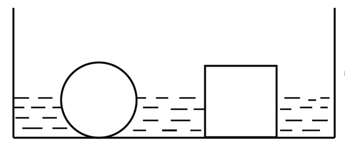

- **A**. 圆球
- **B**. 正方体　✅
- **C**. 二者同时
- **D**. 无法判断

**答案**：B

**官方解析**

杯中的空心圆和空心正方体要想漂浮起来，浮力必须等于重力。由于两个物体质量相同，所以重力相同，因此漂浮所需要的浮力就相等。根据浮力公式，，对于不同物体，其中为固定不变，故两个物体想要漂浮起来所需的也相等。

观察图形可知，由于圆球的直径和正方形的边长相等，因此缓慢倒入水时，在水位相同的情况下，正方体排水体积要大于圆球，故正方体会先达到漂浮所需的，即正方形会先漂浮起来。

故正确答案为B。

---

## 第 2 题　qid 2261907 · 逻辑判断

已知一个30度的斜坡，摩擦系数为0.5。甲乙两人一起冲到斜坡上同一位置，甲比乙重。如果没有任何外力扶持，之后可能发生的情况是（  ）。

- **A**. 两人均开始下滑，两人下滑速度一样　✅
- **B**. 两人均开始下滑，甲下滑速度比乙快
- **C**. 两人均开始下滑，甲下滑速度比乙慢
- **D**. 两人可以在斜坡上保持静止

**答案**：A

**官方解析**

做受力分析，先单独分析甲，斜面上的甲受到竖直向下的重力，将重力沿着斜面方向和垂直于斜面方向分解，沿着斜面方向的分力，垂直于斜面方向的分力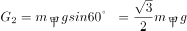，因此给斜面的压力为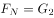。由于摩擦系数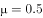，所以斜面能提供的动摩擦力为，小于沿斜面向下的分力，所以甲会沿斜面下滑。

下滑时，斜面方向甲受到沿斜面向下的和沿斜面方向向上的，斜面方向合力，所以加速度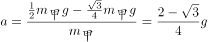。

由于加速度与质量无关，所以两人下滑加速度相同，下滑速度相同。

故正确答案为A。

---

## 第 3 题　qid 2261911 · 类比推理

某人利用石英砂、活性炭、蓬松棉和纱布制作了一个简易净水器。下列说法正确的是（  ）。

- **A**. 该净水器可以有效去除重金属元素
- **B**. 该净水器可以将自来水变为纯净水
- **C**. 该净水器可以降低自来水的硬度
- **D**. 蓬松棉应置于离出水口最近的地方　✅

**答案**：D

**官方解析**

简易净水器的原理是利用纱布与石英砂过滤较大颗粒的不溶性物质，活性炭吸附有色有味的物质，蓬松棉吸附颗粒很小的不溶性物质的性质来净化水源。因此不能去除溶解在水中的金属离子，故不能降低水的硬度，不能将自来水变为纯净水，A、B、C三项说法有误。

简易净水器一般示意图如下，蓬松棉位于出水口最近的地方，D项正确。

故正确答案为D。

---

## 第 4 题　qid 2261917 · 逻辑判断

如图所示，电路两端的电压保持不变，当滑动变阻器的滑动触头P向左移动，电阻变大时，三个灯泡亮度的变化情况是（  ）。

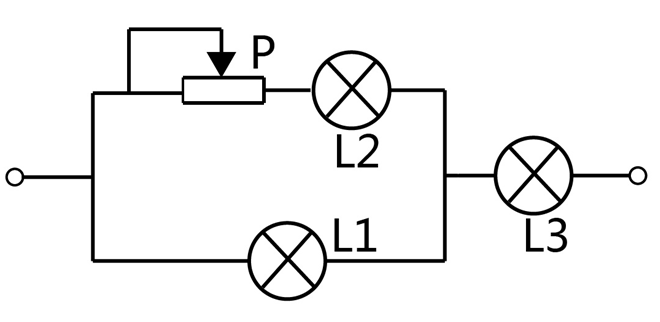

- **A**. L1变亮，L2变亮，L3变暗
- **B**. L1变亮，L2变暗，L3变暗　✅
- **C**. L1变暗，L2变暗，L3变暗
- **D**. L1变暗，L2变暗，L3变亮

**答案**：B

**官方解析**

本题考虑灯泡亮度，考虑电功率P。分析电路，滑动变阻器向左滑动阻值变大，故整个电路阻值变大。根据，整个电路（干路）电流变小，L3在干路中，通过L3电流为干路电流，根据，L3电流变小则变暗。

又因为整个电路电流变小，L3的电流变小而自身电阻不变，分到的电压U3变小。由于电路两端电压保持不变，则L2与滑动变阻器和L1组成的并联电路分到的电压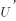变大。L1电压变大，自身电阻不变则电流变大，L1变亮。

L3电流变小，L1分到的电流变大，则根据并联电路电流规律，L2电流变小，故L2变暗。

故正确答案为B。

---

## 第 5 题　qid 2261922 · 类比推理

桌面上有三个相同的烧杯，第一个是空烧杯，第二个烧杯内装有100ml的水，第三个烧杯内装有200ml的水。用玻璃棒敲击烧杯的边沿，发现三个烧杯被敲击的声音都不相同。则下列说法正确的是（  ）。

- **A**. 敲击第一个烧杯的音调最高　✅
- **B**. 敲击第二个烧杯的音调最高
- **C**. 敲击第三个烧杯的音调最高
- **D**. 敲击三烧杯的音调是一样的

**答案**：A

**官方解析**

音调与物体振动相关，用玻璃棒敲打烧杯时，水柱高度越高则振动越慢，频率较低，音调就较低；反之，水柱高度越低振动越快，频率较高，音调较高。
本题中因为烧杯相同，所以水柱底面积相同，故水柱高度取决于注入的水量。
因此注水量越少的烧杯，其音调越高，而第一个烧杯注水量最少，故敲击第一个烧杯的音调最高。
故正确答案为A。

---

## 第 6 题　qid 2261949 · 逻辑判断

物质的用途与性质密切相关。下列说法正确的是（  ）。

- **A**. 铝能用作电线，是因为它的化学性质不活泼
- **B**. 液氧可用于火箭发射，是因为氧气具有可燃性
- **C**. 生石灰可作干燥剂，是因为其具有很强的吸附能力
- **D**. 汽油可以去除衣服上的油污，是因为汽油可以溶解油污　✅

**答案**：D

**官方解析**

A项：铝能被用作电线，是利用了铝的导电性和延展性，并非化学性质不活泼，错误；
B项：液氧可用作火箭发射，是因为氧气具有助燃性，且氧气不具有可燃性，错误；
C项：生石灰可作干燥剂，是因为其能与水发生化学反应，而非吸附能力，错误；
D项：汽油可以去除衣服上的油污，是因为油污易溶于汽油，即汽油可以溶解油污，正确；
故正确答案为D。

---

## 第 7 题　qid 2261952 · 类比推理

如图所示，一束太阳光从空气中倾斜射入玻璃体，玻璃体实心无色，a、b、c、d代表四条不同颜色的光线，则它们可能依次是（  ）。

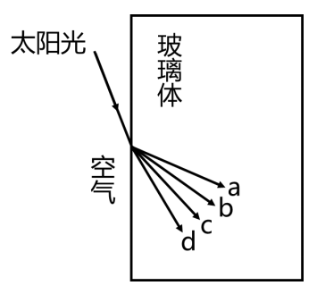

- **A**. 红光、紫光、蓝光、绿光
- **B**. 绿光、红光、蓝光、紫光
- **C**. 紫光、蓝光、绿光、红光　✅
- **D**. 绿光、紫光、红光、蓝光

**答案**：C

**官方解析**

供选答案中，四种光线红、绿、蓝、紫的频率为红绿蓝紫，故其折射率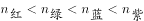，而光在折射时，折射率越大则偏折程度越大，结合传播图可知折射光线从上到下的顺序为紫光、蓝光、绿光和红光，C项正确。

故正确答案为C。

---

## 第 8 题　qid 2261954 · 逻辑判断

如图所示，两根绝缘细线悬挂着带有同种电荷的小球a和b。因静电力，两根绝缘细线张开，分别与垂直方向成夹角α和β，且静止时两球处于同一水平面。如果夹角α大于夹角β，则下列结论正确的是（  ）。

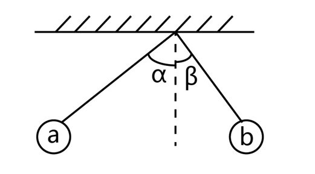

- **A**. 小球a带电荷量比小球b多
- **B**. 小球b受到拉力比小球a小
- **C**. 小球b的质量比小球a大　✅
- **D**. 同时剪断两根细线，小球a先落地

**答案**：C

**官方解析**

A项：力的作用是相互的，两小球对彼此的库仑力大小相等，方向相反，但a球的电荷量和b球的电荷量大小无法判断，错误；

B项：根据平衡条件有： ， ，由于β&lt;α，所以，错误；

C项：对小球受力分析，小球受到重力、库仑力与拉力，两小球的库仑力大小相等，方向相反，根据平衡条件有：⁡ ，⁡ ，由于β&lt;α，所以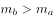，小球b的质量比小球a大，正确；

D项：同时剪断后，两小球竖直方向上均作自由落体运动，且最初两球处于同一水平面，初速度均为0加速度相同，则任一时刻的速度也相同，故同时落地，错误。

故正确答案为C。

---

## 第 9 题　qid 2261955 · 类比推理

如图所示，天平左右两端的烧杯中有等量稀盐酸，并处于平衡状态。现在天平左右两端的烧杯中，分别加入相同质量的锌块与铜块，结果发现天平右侧缓缓下降，主要的原因是（  ）。

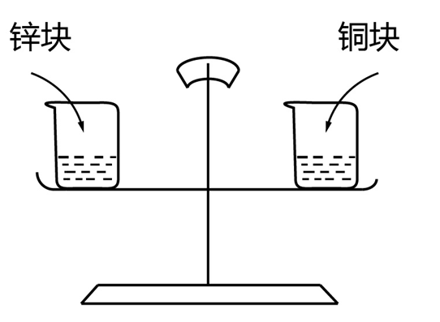

- **A**. 相同质量的铜块与锌块大小不同
- **B**. 铜块与稀盐酸反应产生了氯化铜
- **C**. 锌块与稀盐酸反应产生了氢气　✅
- **D**. 化学反应产生了大量水蒸气

**答案**：C

**官方解析**

A项：铜块与锌块质量相同，产生的重力相同，放在天平两端，不影响平衡，错误；

B项：根据金属活泼性可知，锌在氢前，氢在铜前，铜的活泼性在氢之后，不能够与稀盐酸反应，错误；

C项：锌块与稀盐酸反应会产生氢气，其反应化学方程式为：，生成气体进入空气，导致天平左侧质量减少，正确；

D项：锌块与稀盐酸的化学反应中只产生了氢气。水蒸气是由于化学反应放热，导致水蒸发形成的，而蒸发属于物理变化，说法错误。

故正确答案为C。

---

## 第 10 题　qid 2261956 · 类比推理

一个小球在竖直平面内的光滑圆环轨道上做圆周运动，小球经过圆环最高点时刚好不脱离圆环。通过最高点时，小球（  ）。

- **A**. 没有受到向心力
- **B**. 向心力等于重力　✅
- **C**. 没有向心加速度
- **D**. 线速度为0

**答案**：B

**官方解析**

根据小球在光滑圆环轨道上做圆周运动在最高点时恰好不脱离，故轨道对小球的压力为零，假设圆环半径为，根据牛顿第二定律得，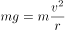，小球所受的向心力等于小球的重力，A错误，B正确；向心加速度，C错误；线速度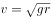，D错误。

故正确答案为B。

---
