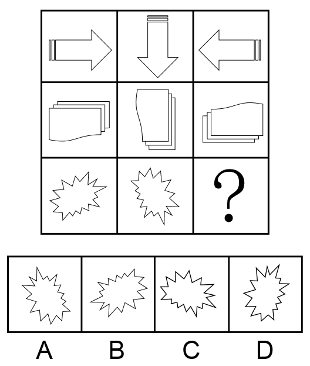
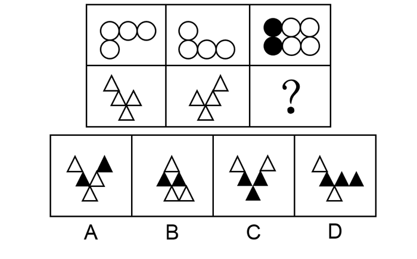
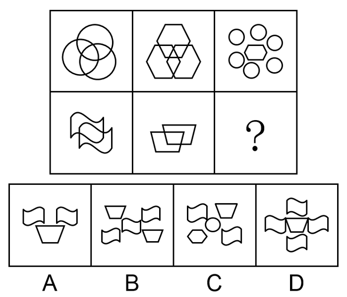

# 江西省2018年市县两级法院、检察院统一考录公务员笔试《行测》题（网友回忆版）

> 判断推理 · 35 题 · 江西 2018

## 第 1 题　qid 2256355 · 图形推理

从所给的4个选项中，选择最适合的一个填入问号处，使之呈现一定的规律性：

- **A**. A
- **B**. B　✅
- **C**. C
- **D**. D

**答案**：B

**官方解析**

本题为九宫格题目。

元素组成相同，考虑位置规律。九宫格优先横着看，第一行，图1到图2，顺时针旋转，图2到图3，顺时针旋转，第二行验证规律，符合规律。第三行应用规律，图2旋转到“？”处，只有B项符合。

故正确答案为B。

---

## 第 2 题　qid 2256359 · 图形推理

从所给4个选项中，选择最适合的一个填入问号处，使之呈现一定的规律性：

- **A**. A　✅
- **B**. B
- **C**. C
- **D**. D

**答案**：A

**官方解析**

元素组成不同，无明显属性规律，考虑数量规律。题干图形出现了很多“窟窿”，考虑数面。观察第一组图发现面数量分别是1、3、5，呈依次递增2的规律；第二组图应用类似的规律，前两个图的面数量是5、3，所以“？”选有1个面的图形，只有A项符合。
故正确答案为A。

---

## 第 3 题　qid 2256361 · 图形推理

从所给4个选项中，选择最适合的一个填入问号处，使之呈现一定的规律性：

- **A**. A
- **B**. B
- **C**. C　✅
- **D**. D

**答案**：C

**官方解析**

元素组成相似，考虑样式规律。九宫格优先横行看，第一行，图1和图2相加，保留不同的部分，相同部分标记为黑色，第二行应用规律，图1和图2相加，保留最上面一行左右两端不同的三角形且把最下方相同三角形标记为黑色后，只有C符合。
故正确答案为C。

---

## 第 4 题　qid 2256363 · 图形推理

从所给4个选项中，选择最适合的一个填入问号处，使之呈现一定的规律性：

- **A**. A
- **B**. B
- **C**. C
- **D**. D　✅

**答案**：D

**官方解析**

元素组成相似，相同元素重复出现，考虑遍历。观察图形，题干每幅图均有一个阴影图形出现，故？处也要找一个有阴影面的图形，只有D符合。
故正确答案为D。

---

## 第 5 题　qid 2256365 · 图形推理

从所给4个选项中，选择最适合的一个填入问号处，使之呈现一定的规律性：

- **A**. A　✅
- **B**. B
- **C**. C
- **D**. D

**答案**：A

**官方解析**

元素组成不同，无明显属性规律，考虑数量规律。观察发现，题干图形中窟窿比较多，考虑数面。第一行面数量都是7，第二行前两个图形面数量都是3，故？处找一个3个面的图形，只有A项符合。
故正确答案为A。

---

## 第 6 题　qid 2256340 · 定义判断

“CIS”是英文Corporate Identity System的缩写，意即“企业形象识别系统”，又有人称为企业形象设计系统。它将企业经营活动以及运作此经营活动的企业经营理念或经营哲学等企业文化，运用视觉沟通技术，以视觉化、规范化、系统化的形式，通过传播媒介传达给企业的相关者，包括企业员工、社会大众、政府机关等团体和个人，以塑造良好的企业形象，使他们对企业产生一致的认同和价值感，以赢取社会大众及消费群的肯定，从而达成产品销售的目的，为企业带来更好的经营绩效。
根据上述定义，下列对“CIS”理解错误的是：

- **A**. 企业形象识别系统是为树立企业形象服务的，是企业形象塑造的唯一途径和手段，目的在于推销产品　✅
- **B**. 企业形象识别系统主要由企业理念识别系统、企业行为识别系统和企业视觉识别系统三部分内容组成
- **C**. 企业的各种行为只有在企业理念的指导下规范统一，并有特色，才能被公众识别、认知、接受认可
- **D**. 企业信息只有符合公众的心理倾向、价值观念及其需要，才能被公众认同并接受

**答案**：A

**官方解析**

第一步：找出定义关键词。
“将企业经营活动以及运作此经营活动的企业经营理念或经营哲学等企业文化”、“运用视觉沟通技术”、“通过传播媒介传达给企业的相关者”、“以赢取社会大众及消费群的肯定”。
第二步：逐一分析选项。
A项：企业形象识别系统应是企业形象塑造的一种途径和手段，根据上述定义无法得出是否是唯一途径，该项理解错误，当选；
B项：“将企业经营活动以及运作此经营活动的企业经营理念或经营哲学等企业文化”是企业理念识别系统，“通过传播媒介传达给企业的相关者”是企业行为识别系统，“运用视觉沟通技术”是企业视觉识别系统，该项理解正确，排除；
C项：在企业理念的指导下规范统一，并有特色是大众识别、认知、接受认可的前提条件，是 “以赢取社会大众及消费群的肯定”而做出的行为，该项理解正确，排除；
D项：企业信息只有符合公众的心理倾向、价值观念及其需要，是被公众认同并接受的前提条件，是 “以赢取社会大众及消费群的肯定”而做出的行为，该项理解正确，排除。
本题为选非题，故正确答案为A。

---

## 第 7 题　qid 2256341 · 定义判断

绿色贸易壁垒是指为保护生态环境而直接或间接采取的限制甚至禁止贸易的措施。绿色贸易壁垒通常是进出口国为保护本国生态环境和公众健康而设置的各种保护措施、法规和标准等，也是对进出口贸易产生影响的一种技术性贸易壁垒。它是国际贸易中的一种以保护有限资源、环境和人类健康为名，通过蓄意制定一系列苛刻的、高于国际公认或绝大多数国家不能接受的环保标准，限制或禁止外国商品的进口，从而达到贸易保护目的而设置的贸易壁垒。
根据上述定义，下列对绿色贸易壁垒理解错误的是：

- **A**. 绿色贸易壁垒是以保护世界资源、环境和人类健康为名，行贸易限制和制裁措施之实，具有名义上的合理性
- **B**. 绿色贸易壁垒措施以一系列国际国内公开立法作为依据和基础，具有形式上的合法性
- **C**. 绿色贸易壁垒在具体实施和操作时，很容易被某些发达国家用来对来自于世界各国的产品随心所欲地加以刁难和抵制，保护措施具有不确定性和可塑性　✅
- **D**. 绿色贸易壁垒的各种检验标准不仅极为严格，而且繁琐复杂，使出口国难以应付和适应，保护方式具有极强的隐蔽性

**答案**：C

**官方解析**

第一步：找出定义关键词。
“是进出口国为保护本国生态环境和公众健康而设置的各种保护措施、法规和标准等”、“是国际贸易中的一种以保护有限资源、环境和人类健康为名”、“蓄意制定一系列苛刻的、高于国际公认或绝大多数国家不能接受的环保标准”、“限制或禁止外国商品的进口”。
第二步：逐一分析选项。
A项：以保护世界资源、环境和人类健康为名，符合“是国际贸易中的一种以保护有限资源、环境和人类健康为名”，行贸易限制和制裁措施之实，符合“限制或禁止外国商品的进口”，该项理解正确，排除；
B项：以一系列国际国内公开立法作为依据和基础，符合“是进出口国为保护本国生态环境和公众健康而设置的各种保护措施、法规和标准等”,且该立法是“以是国际贸易中的一种以保护有限资源、环境和人类健康为名”，所以具有形式上的合法性，该项理解正确，排除；
C项：绿色贸易壁垒很容易被某些发达国家用来对来自世界各国的产品进行刁难和抵制，根据题干定义可知绿色贸易壁垒是绝大多数的国家无法接受的环保标准，所以无法得出是用来对世界各国的刁难，该项理解错误，当选；
D项：绿色贸易壁垒的各种检验标准不仅极为严格，而且繁琐复杂，符合“蓄意制定一系列苛刻的、高于国际公认或绝大多数国家不能接受的环保标准”，该项理解正确，排除。
本题为选非题，故正确答案为C。

---

## 第 8 题　qid 2256344 · 定义判断

附带民事诉讼是指公安司法机关在解决被告人刑事责任的同时，附带解决由遭受物质损失的被害人或者人民检察院提起的，由于犯罪嫌疑人、被告人的犯罪行为所引起的物质损失的赔偿而进行的诉讼。国家机关工作人员在行使职权时，侵犯他人人身、财产权利构成犯罪，被害人或者其法定代理人、近亲属提起附带民事诉讼的，人民法院不予受理，但应当告知其可以依法申请国家赔偿。
根据上述定义，下列法院可以受理被害人提起的附带民事诉讼的是：

- **A**. 抢劫案，要求被告人赔偿被抢走并变卖的金项链
- **B**. 寻衅滋事案，要求被告人赔偿所造成的物质损失　✅
- **C**. 虐待被监管人案，要求被告人赔偿因体罚虐待致身体损害所产生的医疗费
- **D**. 故意伤害案，要求被告人赔偿因硫酸毁容所造成的精神损失

**答案**：B

**官方解析**

第一步：找出定义关键词。
“被告人刑事责任”、“附带解决遭受物质损失的被害人或者人民检察院提起”、“由于犯罪嫌疑人、被告人的犯罪行为所引起的物质损失的赔偿”、“国家工作人员行使职权时侵犯他人人身、财产权利”、“被害人或法定代理人、近亲属提起附带民事诉讼的，人民法院不予受理”。
第二步：逐一分析选项。
A项：抢劫案，符合“刑事责任”，要求被告人赔偿被抢走变卖的金项链，不符合“附带解决遭受物质损失的被害人或者人民检察院提起诉讼”，抢走的金项链本来就是抢劫案本身的物质损失，不属于附带的损失，不符合定义，排除；
B项：寻衅滋事案，符合“刑事责任”，要求被告人赔偿所造成的物质损失，符合“由于犯罪嫌疑人、被告人的犯罪行为所引起的物质损失的赔偿”，符合定义，当选；
C项：虐待被监管人案，符合“刑事责任”，但这是国家工作人员在行使职权时，侵犯他人人身的情况，符合“人民法院不予受理”的条件，不符合定义，排除；
D项：故意伤害案，符合“刑事责任”，但要求赔偿的是精神损失，不符合“物质损失的赔偿”，不符合定义，排除。
故正确答案为B。

---

## 第 9 题　qid 2256347 · 定义判断

证明责任是指当事人对自己提出的诉讼请求所依据的事实或者反驳对方诉讼请求所依据的事实，应当提供证据加以证明，但法律另有规定的除外。在作出判决前，当事人未能提供证据或者证据不足以证明其事实主张的，由负有举证证明责任的当事人承担不利的后果。
根据上述定义，下列对证明责任理解错误的是：

- **A**. 只有在待证事实处于真伪不明情况下，证明责任的后果才会出现
- **B**. 对案件中的同一事实，只有一方当事人负有证明责任
- **C**. 当事人对其主张的某一事实没有提供证据证明，必将承担败诉的后果　✅
- **D**. 证明责任的结果责任不会在原、被告间相互转移

**答案**：C

**官方解析**

第一步：找出定义关键词。
“当事人对自己提出的诉讼请求或反驳对方诉讼请求所依据的事实”、“提供证据证明”、“作出判决前当事人未能提供证据或证据不足”、“负有举证证明责任的当事人承担不利后果”。
第二步：逐一分析选项。
A项：待证事实处于真伪不明情况下，符合“当事人未能提供证据或者证据不足”，此时会出现证明责任的后果，符合“负有举证证明责任的当事人承担不利后果”，该项理解正确，排除；
B项：对于案件中的同一事实，最后承担不利后果的“只有负有举证证明责任的当事人”，而不是双方，所以只有一方当事人负有证明责任，该项理解正确，排除；
C项：当事人对其主张的某一事实没有提供证据证明，符合“当事人未能提供证据或证据不足”，必将承担败诉后果，不符合“负有举证证明责任的当事人承担不利后果”，不利后果并非意味着一定会败诉，该项理解不正确，当选；
D项：根据“负有举证证明责任的当事人承担不利后果”可以得出，证明责任的结果责任不会在原、被告间相互转移，该项理解正确，排除。
本题为选非题，故正确答案为C。

---

## 第 10 题　qid 2256357 · 定义判断

受贿罪是指国家工作人员利用职务上的便利，索取他人财物，或者非法收受他人财物，为他人谋取利益的行为。
根据上述定义，下列说法正确的是：

- **A**. 甲系教育局局长，2015年赵某为解决女儿就近上学问题，多次找到甲，希望甲帮帮忙。甲考虑到赵某的实际情况，便违规给他批了条子，但未向赵某提出任何不法要求。2018年甲退休后欲自己开办公司，就向赵某提出：3年前自己帮助了赵，希望赵给2万元作为甲自己公司的启动资金。赵推脱不过，只好给钱。甲应当构成受贿罪
- **B**. 乙(女)因涉嫌诈骗而被公安机关收审，龚某负责审理这个案子。乙想龚某帮助她，即以身相许，尔后龚某便利用自己的职权设法使乙逃避了法律制裁。龚某不构成受贿罪　✅
- **C**. 丙为了在一项市政工程投标中中标而给某副市长李某5万元钱，希望其在评标时多多关照。李某收过钱，点了点头。但事后，丙的投标未获通过。李某虽然收受他人财物，但由于没有为他人谋取利益，所以不构成受贿罪
- **D**. 丁的妻子在乡村小学教书，丁试图通过关系将其妻调往县城，就请县公安局长胡某给教育局长黄某打招呼，果然事成。事后，丁给胡某2万元钱，胡将其中1万元给黄某，剩余部分自己收下。本案中，黄某构成受贿罪，胡某构成介绍贿赂罪，丁构成行贿罪

**答案**：B

**官方解析**

第一步：找出定义关键词。
“国家工作人员利用职务上的便利”、“索取他人财物或非法收受他人财物，为他人谋取利益”。
第二步：逐一分析选项。
A项：甲违规给赵某批了条子，但未向赵某提出任何不法要求，不符合“索取他人财物或非法收受他人财物”，且甲收受赵某钱财是退休后开办自己的公司,不符合“国家工作人员利用职务上的便利”，所以不构成受贿罪，该项说法不正确，排除；
B项：龚某利用自己的职权使乙逃避了法律制裁，乙以身相许，人不是财物，不符合“索取他人财物或非法收受他人财物，为他人谋取利益”，所以不构成受贿罪，该项说法正确，当选；
C项：副市长李某收受了丙的5万元钱，符合“国家工作人员利用职务上的便利”，“索取他人财物或非法收受他人财物，为他人谋取利益”，虽然丙投标没有通过，但是李某已经收受了贿赂，所以构成受贿罪，该项说法不正确，排除；
D项：黄某收钱把丁某妻子调往县城，符合“国家工作人员利用职务上的便利”，也符合“索取他人财物或非法收受他人财物，为他人谋取利益”，所以黄某构成受贿罪，但胡某构成斡旋受贿罪，并非介绍受贿罪，该项说法不正确，排除。
故正确答案为B。

---

## 第 11 题　qid 2256362 · 定义判断

委任性规则是指没有明确规定行为规则的内容，只是规定了某种概括性的指示，授权或委托某一机关或某一机构加以具体规定的法律规则。
根据上述定义，下列属于委任性规则的是：

- **A**. 我国《医疗事故处理条例》第62条规定：“军队医疗机构的医疗事故处理办法，由中国人民解放军卫生主管部门会同国务院卫生行政部门依据本条例制定。”　✅
- **B**. 我国《产品质量法》第69条规定：“以暴力、威胁方法阻碍产品质量监督部门或者工商行政管理部门的工作人员依法执行职务的，依法追究刑事责任；拒绝、阻碍未使用暴力、威胁方法的，由公安机关依照治安管理处罚条例的规定处罚。”
- **C**. 我国《国家赔偿法》第38条规定：“人民法院在民事诉讼、行政诉讼过程中，违法采取对妨害诉讼的强制措施、保全措施或者对判决、裁定及其他生效法律文书执行错误，造成损害的，赔偿请求人要求赔偿的程序，适用本法刑事赔偿程序的规定。”
- **D**. 我国《合同法》第175条规定：“当事人约定易货交易，转移标的物的所有权的，参照买卖合同的有关规定。”

**答案**：A

**官方解析**

第一步：找出定义关键词。
“没有明确规定行为规则的内容，只是规定了某种概括性的指示”、“授权或委托某一机关或某一机构加以具体规定”。
第二步：逐一分析选项。
A项：军队医疗机构的医疗事故处理办法，由中国人民解放军卫生主管部门会同国务院卫生行政部门依据本条例制定，符合“没有明确规定行为规则的内容，只是规定了某种概括性的指示”，也符合“授权或委托某一机关或某一机构加以具体规定”，符合定义，当选；
B项：“依法”追究刑事责任，由公安机关依照“治安管理处罚条例”的规定处罚，说明是有明确规定的，不符合“没有明确规定行为规则的内容，只是规定了某种概括性的指示”，不符合定义，排除；
C项：适用“本法”刑事赔偿程序的规定，说明是有明确规定的，不符合“没有明确规定行为规则的内容，只是规定了某种概括性的指示”，不符合定义，排除；
D项：参照买卖合同的“有关规定”，说明是有明确规定的，不符合“没有明确规定行为规则的内容，只是规定了某种概括性的指示”，不符合定义，排除。
故正确答案为A。

---

## 第 12 题　qid 2256364 · 定义判断

政府监管是市场经济条件下政府为实现某些公共政策目标，对微观经济主体进行的规范与制约，主要通过对特定产业和微观经济活动主体的进入、退出、资质、价格及涉及国民健康、生命安全、可持续发展等行为进行监督、管理来实现。
根据上述定义，下列属于政府监管范围的是：

- **A**. 甲农民根据对市场的预测确定饲养猪的规模
- **B**. 乙工厂生产的某种饮料可能含有超标的有害物质　✅
- **C**. 丙企业根据市场行情的变化及时调整产品价格
- **D**. 丁劳动者将政府发放的失业救济金用于购买股票

**答案**：B

**官方解析**

第一步：找出定义关键词。
“政府为实现某些公共政策目标对微观经济主体进行的规范与制约”、“通过对特定产业和微观经济活动主体的进入、退出、资质、价格及涉及国民健康、生命安全、可持续发展等行为”、“进行监督、管理来实现”。
第二步：逐一分析选项。
A项：甲农民根据对市场的预测确定饲养猪的规模，此行为并不涉及“国民健康、生命安全、可持续发展等行为”，并不需要政府对其行为进行规范与制约，不符合定义，排除；
B项：乙工厂生产的某种饮料可能含有超标的有害物质，会威胁人民群众的人身健康，涉及“国民健康、生命安全”，需要政府对其进行规范与制约，符合定义，当选；
C项：丙企业根据市场行情的变化及时调整产品价格，只是企业自身的行为，不涉及“国民健康、生命安全、可持续发展等行为”，并不需要政府对其行为进行规范与制约，不符合定义，排除；
D项：丁劳动者将政府发放的失业救济金用于购买股票，只是个人的选择，不涉及“国民健康、生命安全、可持续发展等行为”，不需要政府对其行为进行规范与制约，不符合定义，排除。
故正确答案为B。

---

## 第 13 题　qid 2256366 · 定义判断

社会保障制度是指在政府的管理之下，以国家为主体，依据一定的法律和规定，通过国民收入的再分配，以社会保障基金为依托，对公民在暂时或者永久性失去劳动能力以及由于各种原因生活发生困难时给予物质帮助，用以保障居民的最基本的生活需要的社会安全制度。
根据上述定义，下列属于社会保障制度的是：

- **A**. 残疾人甲某在民政局的帮助下申请了优惠贷款，开办了自己的工厂，为许多下岗职工提供了再就业的机会
- **B**. 乙市领导在地震发生后探望了灾区人民，并指示有关部门为他们送去了食品、衣物及彩电等物资，希望他们能渡过难关
- **C**. 女职工丙某被单位解聘，失业期间领取了失业救济金　✅
- **D**. “希望工程”资助的偏远山区小学生免费午餐项目

**答案**：C

**官方解析**

第一步：找出定义关键词。
“以国家为主体”、“以社会保障基金为依托”、“对公民在暂时或者永久性失去劳动能力以及由于各种原因生活发生困难时给予物质帮助”、“保障居民的最基本的生活需要”。
第二步：逐一分析选项。
A项：残疾人甲某在民政局的帮助下申请了优惠贷款，这个贷款属不属于“社会保障基金”不明确，且甲某开办工厂为下岗职工提供再就业机会，不符合“以国家为主体”，不符合定义，排除；
B项：乙市领导指示有关部门为受灾群众送物资，确实可以为灾区群众提供帮助，但是这些救灾物资并未说明是否“以社会保障基金为依托”，不符合定义，排除；
C项：女职工丙某被单位解聘，符合“公民在暂时或者永久性失去劳动能力”，失业期间领取了失业救济金，符合“以国家为主体”、“以社会保障基金为依托”及“生活发生困难时给予物质帮助”，符合定义，当选；
D项：“希望工程”资助的偏远山区小学生免费午餐项目，未说明“以国家为主体”，且所用资金是否“以社会保障基金为依托”也不明确，不符合定义，排除。
故正确答案为C。

---

## 第 14 题　qid 2256368 · 定义判断

货币政策也就是金融政策，是指中国人民银行为实现其特定的经济目标而采用的各种控制和调节货币供应量和信用量的方针、政策和措施的总称。货币政策的实质是国家对货币的供应根据不同时期的经济发展情况而采取“紧”“松”或“适度”等不同的政策趋向。
根据上述定义，下列说法错误的是：

- **A**. 货币政策调节的对象是货币供应量，即全社会总的购买力，具体表现形式为流通中的现金和个人、企事业单位在银行的存款
- **B**. 货币政策包括信贷政策、利率政策和外汇政策
- **C**. 中央银行应根据不同的情况选择具体的货币政策目标
- **D**. 如果经济中出现例如投资增长过快、信贷增长过快、国际国内经济失衡、通货膨胀等要么属于货币领域的问题，要么跟货币有直接或者间接关系的问题，那么就应该采取宽松的货币政策以促进经济的良性运行　✅

**答案**：D

**官方解析**

第一步：找出定义关键词。
“中国人民银行为实现目标而采用的各种控制和调节货币供应量和信用量的方针、政策和措施的总称”、“实质是国家对货币的供应根据不同时期的经济发展情况二采区不同的政策趋向”。
第二步：逐一分析选项。
A项：根据定义第一句可知，货币政策是控制和调节货币供应量和信用量的方针、政策和措施的总称，故货币政策调节的对象为货币供应量，符合定义，排除；
B项：涉及相关专业知识，货币政策包括信贷政策、利率政策和外汇政策三大部分，符合定义，排除；
C项：根据第二句可知，国家对货币的供应根据不同时期的经济发展情况而采取不同的政策趋向，所以中央银行会根据不同的情况来选择不同的货币政策目标，符合定义，排除；
D项：投资增长过快、信贷增长过快、国际国内经济失衡、通货膨胀，说明市场经济过热，应采用货币紧缩的政策促进良性运行，而非宽松的货币政策，不符合定义，当选。
本题为选非题，故正确答案为D。
备注：本题定义已知信息过少，无法推出更多信息，部分选项需结合相关专业知识进行判断。

---

## 第 15 题　qid 2256370 · 定义判断

居民纳税人是指在中国境内有住所或者无住所而在境内居住满一年的个人。在居住期间内临时离境的，即在一个纳税年度中一次离境不超过30日或多次离境累计不超过90日的，不扣减日数，连续计算。
根据上述定义，下列案例说法正确的是：
詹姆斯是英国人，2016年3月12日来华工作，2017年3月15日回国，2017年4月2日返回中国，2017年11月15日至2017年11月30日期间，因工作需要去了美国，2017年12月1日返回中国，后于2018年10月20日离华回国，则该纳税人：

- **A**. 2016年度为我国居民纳税人，2017年度为我国非居民纳税人
- **B**. 2016年度为我国非居民纳税人，2017年度为我国居民纳税人　✅
- **C**. 2016年度和2017年度均为我国非居民纳税人
- **D**. 2016年度和2017年度均为我国居民纳税人

**答案**：B

**官方解析**

第一步：找出定义关键词。
“中国境内有住所或者无住所而在境内居住满一年的个人”、“在一个纳税年度中一次离境不超过30日或多次离境累计不超过90日的，不扣减日数，连续计算”。
第二步：分析案例。
詹姆斯是英国人，他在中国境内没有住所，我国的纳税年度为1月1日-12月31日。
2016年，他3月12日来华工作，未在中国境内居住满一年，故2016年度为我国非居民纳税人；
2017年，3月15日离开中国，4月2日返回中国，共离开18天，11月15日至11月30日去了美国，12月1号回到中国，共离开16天，多次离境累计未超过90天，故2017年度为我国居民纳税人；
2018年，10月20日离华回国，未在中国境内住满一年，故2018年为我国非居民纳税人。
故正确答案为B。

---

## 第 16 题　qid 2256373 · 类比推理

《法律与道德》：美：庞德

- **A**. 《论法的精神》：法：孟德斯鸠　✅
- **B**. 《社会契约论》：英：卢梭
- **C**. 《君主论》：英：约翰·洛克
- **D**. 《政府论》：意大利：尼克罗·马基亚维利

**答案**：A

**官方解析**

第一步：判断题干词语间逻辑关系。
《法律与道德》是庞德的著作，庞德是美国人，题干是著作、国籍、作者的对应关系。
第二步：判断选项词语间逻辑关系。
A项：《论法的精神》是法国孟德斯鸠的著作，与题干逻辑关系一致，当选；
B项：《社会契约论》是卢梭的著作，但是卢梭是法国人，不是英国人，与题干逻辑关系不一致，排除；
C项：《君主论》是意大利尼可罗·马基亚维利创作的著作，与约翰·洛克无关，与题干逻辑关系不一致，排除；
D项：《政府论》是英国约翰·洛克的著作，与尼克罗·马基亚维利无关，与题干逻辑关系不一致，排除。
故正确答案为A。

---

## 第 17 题　qid 2256377 · 类比推理

招摇撞骗：违法犯罪：锒铛入狱

- **A**. 班门弄斧：东施效颦：贻笑大方
- **B**. 强买强卖：欺人太甚：众叛亲离
- **C**. 兢兢业业：厚积薄发：一鸣惊人
- **D**. 见死不救：违背道德：良心谴责　✅

**答案**：D

**官方解析**

第一步：判断题干词语间逻辑关系。
招摇撞骗是一种违法犯罪行为，前两个词是种属关系，违法犯罪会导致锒铛入狱，二者是因果关系。
第二步：判断选项词语间逻辑关系。
A项：班门弄斧比喻在行家面前卖弄本领，常用于自谦，东施效颦比喻模仿别人，不但模仿不好，反而出丑。二者不是种属关系，与题干逻辑关系不一致，排除；
B项：强买强卖是一种违法犯罪的行为，欺人太甚比喻做事太过火，让人无法忍受，二者不是种属关系，与题干逻辑关系不一致，排除；
C项：兢兢业业形容做事小心谨慎，认真踏实，厚积薄发形容只有准备充分才能办好事情，二者不是种属关系，与题干逻辑关系不一致，排除；
D项：见死不救是一种违背道德的行为，二者是种属关系，违背道德会导致良心谴责，二者是因果关系，与题干逻辑关系一致，当选。
故正确答案为D。

---

## 第 18 题　qid 2256379 · 类比推理

制度 对于 （    ） 相当于 （    ） 对于 实施

- **A**. 建设  执行
- **B**. 章程  管理
- **C**. 完善  政策　✅
- **D**. 欠缺  延缓

**答案**：C

**官方解析**

逐一代入选项。
A项：制度与建设，二者没有明显关系，执行和实施，二者也没有明显关系，前后逻辑关系不一致，排除；
B项：章程，泛指各种制度，二者是种属关系，实施管理，二者是动宾关系，前后逻辑关系不一致，排除；
C项：完善制度，二者是动宾关系，实施政策，二者是动宾关系，前后逻辑关系一致，当选；
D项：欠缺制度，二者为动宾关系，延缓实施，二者为动宾关系，但顺序颠倒，前后逻辑关系不一致，排除。
故正确答案为C。

---

## 第 19 题　qid 2256334 · 类比推理

历史：明智

- **A**. 国家：政策
- **B**. 小说：诗歌
- **C**. 制度：学问
- **D**. 法律：约束　✅

**答案**：D

**官方解析**

第一步：判断题干词语间逻辑关系。
历史可以明智，二者是功能对应关系。
第二步：判断选项词语间逻辑关系。
A项：国家可以制定政策，二者不是功能对应关系，与题干逻辑关系不一致，排除；
B项：小说和诗歌是两种不同的文体，二者是并列关系，与题干逻辑关系不一致，排除；
C项：制度一般指要求大家共同遵守的办事规程或行动准则，学问一般指知识，二者没有明显的逻辑关系，与题干逻辑关系不一致，排除；
D项：法律可以约束，二者是功能对应关系，与题干逻辑关系一致，当选。
故正确答案为D。

---

## 第 20 题　qid 2256338 · 类比推理

背水一战：《史记·淮阴侯列传》

- **A**. 乐此不疲：《汉书》
- **B**. 揭竿而起：《过秦论》　✅
- **C**. 朝秦暮楚：《论语》
- **D**. 阳春白雪：《离骚》

**答案**：B

**官方解析**

第一步：判断题干词语间逻辑关系。
背水一战为历史典故，出自《史记·淮阴侯列传》，是典故和出处的对应关系。
第二步：判断选项词语间逻辑关系。
A项：乐此不疲为历史典故，出自《后汉书》而不是《汉书》，与题干逻辑关系不一致，排除；
B项：揭竿而起为历史典故，出自《过秦论》，是典故和出处的对应关系，与题干逻辑关系一致，当选；
C项：朝秦暮楚为历史典故，出自《鸡肋集·北渚亭赋》而不是《论语》，与题干逻辑关系不一致，排除；
D项：阳春白雪原指战国时代楚国的一种较高级的歌曲，后用来比喻高深的不通俗的文学艺术，不是历史典故，《离骚》也不是其出处，与题干逻辑关系不一致，排除。
故正确答案为B。

---

## 第 21 题　qid 2256342 · 类比推理

（    ） 对于 司汤达 相当于 《高老头》 对于 （    ）

- **A**. 《红与黑》；巴尔扎克　✅
- **B**. 《雾都孤儿》；雨果
- **C**. 《傲慢与偏见》；狄更斯
- **D**. 《战争与和平》；奥斯丁

**答案**：A

**官方解析**

逐一代入选项。
A项：《红与黑》的作者为司汤达，《高老头》的作者为巴尔扎克，二者为作品与作者的对应关系，前后逻辑关系一致，当选；
B项：《雾都孤儿》的作者为查尔斯·狄更斯，《高老头》的作者为巴尔扎克，前后逻辑关系不一致，排除；
C项：《傲慢与偏见》的作者为简·奥斯汀，《高老头》的作者为巴尔扎克，前后逻辑关系不一致，排除；
D项：《战争与和平》的作者是列夫·托尔斯泰，《高老头》的作者为巴尔扎克，前后逻辑关系不一致，排除。
故正确答案为A。

---

## 第 22 题　qid 2256346 · 逻辑判断

祸兮福之所倚，福兮祸之所伏：老子

- **A**. 官无常贵，民无终贱：庄子
- **B**. 彼窃钩者诛，窃国者为诸侯：韩非子
- **C**. 劳心者治人，劳力者治于人：孟子　✅
- **D**. 刑过不避大臣，赏善不遗匹夫：墨子

**答案**：C

**官方解析**

第一步：判断题干词语间逻辑关系。
“祸兮福之所倚，福兮祸之所伏”出自于老子所著的《老子》，二者为对应关系。
第二步：判断选项词语间逻辑关系。
A项：“官无常贵，民无终贱”出自于墨子弟子所著的《墨子》，与庄子无明显逻辑关系，与题干逻辑关系不一致，排除；
B项：“彼窃钩者诛，窃国者为诸侯”出自于庄子及后人所著的《庄子》，与韩非子无明显逻辑关系，与题干逻辑关系不一致，排除；
C项：“劳心者治人，劳力者治于人”出自于孟子及其弟子所著的《孟子》，二者为对应关系，与题干逻辑关系一致，当选；
D项：“刑过不避大臣，赏善不遗匹夫”出自于韩非子后人所著的《韩非子》，与墨子无明显逻辑关系，与题干逻辑关系不一致，排除。
故正确答案为C。

---

## 第 23 题　qid 2256349 · 类比推理

快：速度：慢

- **A**. 强：飓风：弱
- **B**. 手动：汽车：自动
- **C**. 远：距离：近　✅
- **D**. 好：吸烟：坏

**答案**：C

**官方解析**

第一步：判断题干词语间逻辑关系。
快和慢都可以形容速度，且快和慢是反义关系。
第二步：判断选项词语间逻辑关系。
A项：强和弱都可以形容飓风，且强和弱是反义关系，与题干逻辑关系一致，保留；
B项：手动和自动都可以形容汽车，但手动和自动不是反义关系，与题干逻辑关系不一致，排除；
C项：远和近都可以形容距离，且远和近是反义关系，与题干逻辑关系一致，保留；
D项：虽然好和坏是反义关系，但通常吸烟只被认为是“坏”的，与题干逻辑关系不一致，排除。
对比A、C两项，速度是一个物理量，其快慢可以直接用数值的大小来衡量，A项中飓风是一种自然现象，其强弱只能通过风速、气压、风力这些物理量的数值大小来衡量，而C项中距离的远近也可以直接用数值的大小来衡量，因此C项与题干逻辑关系更一致。
故正确答案为C。

---

## 第 24 题　qid 2256351 · 类比推理

山东：青岛

- **A**. 湖南：长沙
- **B**. 浙江：宁波　✅
- **C**. 辽宁：沈阳
- **D**. 江西：萍乡

**答案**：B

**官方解析**

第一步：判断题干词语间逻辑关系。
青岛隶属于山东省，但不是山东省的省会，并且青岛是山东省副省级市。
第二步：判断选项词语间逻辑关系。
A项：长沙隶属于湖南省，但是湖南省的省会，与题干逻辑关系不一致，排除；
B项：宁波隶属于浙江省，但不是浙江省的省会，并且宁波是浙江省副省级市，与题干逻辑关系一致，当选；
C项：沈阳隶属于辽宁省，但是辽宁省的省会，与题干逻辑关系不一致，排除；
D项：萍乡隶属于江西省，但不是江西省的省会，并且萍乡是江西省地级市，与题干逻辑关系不一致，排除。
故正确答案为B。

---

## 第 25 题　qid 2256367 · 类比推理

月季：玫瑰：蔷薇

- **A**. 牛郎：织女：天狼　✅
- **B**. 日月：星辰：宇宙
- **C**. 江河：湖泊：海洋
- **D**. 瓜子：核桃：大豆

**答案**：A

**官方解析**

第一步：判断题干词语间逻辑关系。
月季、玫瑰和蔷薇是蔷薇科的三种花，三者是并列关系。
第二步：判断选项词语间逻辑关系。
A项：牛郎、织女、天狼是恒星的三种，三者是并列关系，与题干逻辑关系一致，当选；
B项：日月和星辰是宇宙的组成部分，三者不是并列关系，与题干逻辑关系不一致，排除；
C项：江河、湖泊、海洋，三者是并列关系，但江与河、海与洋也分别是并列关系，与题干逻辑关系不一致，排除；
D项：核桃和大豆是具体的植物，但瓜子是指将瓜的种子炒熟了的食品，不是具体的植物，三者不是并列关系，与题干逻辑关系不一致，排除。
故正确答案为A。

---

## 第 26 题　qid 2256369 · 逻辑判断

孟子曰：“离娄之明，公输子之巧，不以规矩，不能成方圆；师旷之聪，不以六律，不能正五音；尧舜之道，不以仁政，不能平治天下。今有仁心仁闻而民不被其泽，不可法于后世者，不行先王之道也。故曰，徒善不足以为政，徒法不能以自行。”
下列选项与“不以规矩，不能成方圆”的逻辑推论不符的是：

- **A**. 只有遵循合理的道德行为规范，社会才能正常运转
- **B**. 若遵循合理的道德行为规范，社会则能正常运转　✅
- **C**. 除非遵循合理的道德行为规范，否则社会不能正常运转
- **D**. 凡是能够正常运转的社会，它都应该是遵循合理的道德行为规范的

**答案**：B

**官方解析**

第一步：翻译题干。

成方圆规矩。

第二步：逐一分析选项。

A项：翻译为正常运转遵循合理的道德行为规范。正常运转的含义与成方圆相近，遵循合理的道德规范的含义与规矩相近，所以A项和题干逻辑推论相符，排除；

B项：翻译为遵循合理的道德行为规范正常运转。遵循合理的道德规范的含义与规矩相近，正常运转的含义与成方圆相近，所以B项和题干逻辑推论不相符，当选；

C项：翻译为正常运转遵循合理的道德行为规范。正常运转的含义与成方圆相近，遵循合理的道德规范的含义与规矩相近，所以C项和题干逻辑推论相符，排除；

D项：翻译为正常运转遵循合理的道德行为规范。正常运转的含义与成方圆相近，遵循合理的道德规范的含义与规矩相近，所以D项和题干逻辑推论相符，排除。

本题为选非题，故正确答案为B。

---

## 第 27 题　qid 2256376 · 类比推理

某公共政策研究院主持召开的研讨会议题包括“民主政治与贤能政治”“发展中国家的政治秩序”“发达国家的市场与政府”“发展中国家的市场与政府”“技术进步与社会变迁”“中国的法治与秩序”“圆桌讨论：经验与教训”等7个内容。
议程规定：
（1）每天讨论的内容数量不超过3个
（2）“发展中国家的市场与政府”必须安排在第二天讨论
（3）“民主政治与贤能政治”“技术进步与社会变迁”必须安排在同一天
（4）“发展中国家的市场与政府”的讨论安排在“发展中国家的政治秩序”之后，但是在“发达国家的市场与政府”之前
（5）“发达国家的市场与政府”的讨论安排在“民主政治与贤能政治”之前，但是在“中国的法治与秩序”之后
若第二天讨论一个内容，则一定在第一天讨论的是：

- **A**. 民主政治与贤能政治
- **B**. 发展中国家的政治秩序　✅
- **C**. 发达国家的市场与政府
- **D**. 发展中国家的市场与政府

**答案**：B

**官方解析**

根据题干信息进行推理。
根据提问中的条件，第二天讨论一个内容，结合条件（2），“发展中国家的市场与政府”必须安排在第二天讨论，可以得出第二天讨论的只有“发展中国家的市场与政府”；根据条件（4），“发展中国家的市场与政府”的讨论安排在“发展中国家的政治秩序”之后，得出“发展中国家的政治秩序”在安排在第二天的“发展中国家的市场与政府”之前，所以它只能安排在第一天。
故正确答案为B。

---

## 第 28 题　qid 2256322 · 逻辑判断

法律格言说“不知自己之权利，即不知法律”。由此可以推知：

- **A**. 不知道法律的人不享有权利
- **B**. 任何人只要知道自己的权利，就等于知道整个法律体系
- **C**. 权利人所拥有的权利，既是事实问题也是法律问题　✅
- **D**. 权利构成法律上所规定的一切内容，在此意义上，权利即法律，法律亦权利

**答案**：C

**官方解析**

日常结论题，根据题干信息逐一分析选项。
A项：题干中没有提到是否享有权利，无中生有，排除；
B项：题干中讨论的是法律，选项中讨论的是法律体系，偷换概念，排除；
C项：题干中强调不知道自己的权利就是不知道法律，说明权利是被法律所规定的，法律中说明了人们实际可以干什么，所以权利人所拥有的权利成为了一个事实问题，可以推出，当选；
D项：选项中强调权利构成法律上所规定的一切内容，表述过于绝对，且题干没有提到权利就是法律，无法推出，排除。
故正确答案为C。

---

## 第 29 题　qid 2256324 · 类比推理

一天晚上，某餐厅经理被人杀死了，警察对四名嫌疑犯进行了审讯。四个人都只讲了四句话，并且都有一句是假话。
甲说：“我从来就没有去过那家餐厅；我没有杀人；我对这个案件一无所知；星期六我和丁一起在电影院度过。”
乙说：“我没有杀人；我在案发那天与丁闹翻了；我不认识甲；甲是无罪的。”
丙说：“乙是罪犯；丁和甲那天根本没有去过电影院；我是无辜的；是甲和乙一起杀了餐厅经理。”
丁说：“我没有杀人；案发那天我和甲在电影院；我以前从未见过丙；丙说甲和乙杀人的这句话是谎言。”
请问，杀人凶手是：

- **A**. 甲
- **B**. 乙　✅
- **C**. 丙
- **D**. 丁

**答案**：B

**官方解析**

分析题干信息。
根据选项信息可知，杀人凶手仅有一人，即凶手只是甲、乙、丙、丁四人其中之一。分析题干信息可知，丙其中一句说“甲和乙一起杀了餐厅经理”，与凶手只是一个人相违背，说明丙这句话说错了，结合题干信息，四个人都讲了四句话，并且有一句是假话，丙该句为假，说明丙其他的话均为真话，则丙所说的乙是罪犯为真。
故正确答案为B。

---

## 第 30 题　qid 2256326 · 类比推理

有一盗窃案件，据侦查系二人作案。并初步认定甲乙丙丁戊五人是嫌疑犯。而且查知以下情况：（1）甲、丁二人中至少有一人是罪犯；（2）如果丁是罪犯，戊一定是罪犯；（3）只有在丙参与时，乙才能作案；（4）如果乙不是罪犯，那么甲也不是罪犯；（5）丙没有作案时间。
请问，罪犯是：

- **A**. 乙和丙
- **B**. 丁和戊　✅
- **C**. 甲和乙
- **D**. 甲和戊

**答案**：B

**官方解析**

第一步：分析题干。

（1）甲 或 丁；

（2）丁戊；

（3）乙丙；

（4）乙甲；

（5）丙。

第二步：根据题干信息进行推理。

从确定信息入手，根据（5）丙没有作案时间，得出丙不是罪犯；根据（3）的逆否，得出乙不是罪犯；根据（4），得出甲不是罪犯；根据（1），或关系否一推一，得出丁是罪犯；根据（2），得出戊也是罪犯。

故正确答案为B。

---

## 第 31 题　qid 2256328 · 逻辑判断

《中华人民共和国刑法修正案（八）》和修改后的《中华人民共和国道路交通安全法》将醉酒后驾驶机动车的行为以“危险驾驶罪”入刑，可判处六个月以下拘役。那么，醉驾入刑的实施情况到底如何？据有关统计发现，2011年5月1日至2016年10月1日，S区检察院共起诉1103宗1105人醉驾案件。醉驾的状况得到一定程度的遏制。尽管后果很严重，但仍有少数驾驶员抱着“少喝一点没关系”、“应该不会被查”的侥幸心理铤而走险。这说明，醉驾入刑的查处力度不够，不足以对所有驾驶员产生震慑力。以下哪项如果为真，最能削弱上述论证？

- **A**. 醉驾入刑实施后，S区上路行驶的机动车数量有了大的增长
- **B**. 严格实施醉驾入刑，将不可避免地提高S区交警执法成本
- **C**. 醉驾入刑实施后，对违法者的惩罚力度有所增大
- **D**. 醉驾入刑实施后，S区每天都有交警上路严查酒驾　✅

**答案**：D

**官方解析**

第一步：找出论点和论据。
论点：醉驾入刑的查处力度不够，不足以对所有驾驶员产生震慑力。
论据：尽管后果很严重，但仍有少数驾驶员抱着“少喝一点没关系”、“应该不会被查”的侥幸心理铤而走险。
第二步：逐一分析选项。
A项：该项说的是醉驾入刑实施后，机动车数量增加了，与论点讨论的醉驾入刑的查处力度无关，无法削弱，排除；
B项：该项说的是实施醉驾入刑提高了执法成本，查处力度如何没有提及，无关项，排除；
C项：该项说的是查到之后的惩罚力度增加了，而论点讨论的是查处力度，也就是检查的力度是否有加强，话题不一致，无法削弱，排除； 
D项：醉驾入刑实施后，S区每天都有交警上路严查酒驾，说明我们的查处力度是增加了，足够检查出酒驾的司机，直接削弱论点，当选。
故正确答案为D。

---

## 第 32 题　qid 2256331 · 逻辑判断

通过调查得知，并非所有的影视明星都有偷税、逃税行为。如果上述调查的结论是真实的，则以下哪项一定为真？

- **A**. 所有的影视明星都没有偷税、逃税行为
- **B**. 多数影视明星都有偷税、逃税行为
- **C**. 并非有的影视明星有偷税、逃税行为
- **D**. 有的影视明星确实没有偷税、逃税行为　✅

**答案**：D

**官方解析**

第一步：翻译题干。

并非所有的影视明星都有偷税、逃税行为，等价于：有的影视明星没有偷税、漏税行为。翻译为：有的影视明星偷税、漏税行为。

第二步：逐一分析选项。

A项：翻译为影视明星偷税、漏税行为，根据“有的影视明星”不能推出“所有影视明星”的结论，排除；

B项：翻译为多数影视明星偷税、漏税行为，根据“有的影视明星”不能推出“多数影视明星”的结论，排除；

C项：该项等价于：影视明星偷税、漏税行为，根据“有的影视明星”不能推出“所有影视明星”的结论，排除；

D项：翻译为有的影视明星偷税、漏税行为，跟题干表述相同，当选。

故正确答案为D。

---

## 第 33 题　qid 2256332 · 逻辑判断

某市的公务员招考是公正的，则以下两个条件必须满足：第一，有健全的公开透明的招考规则；第二，能力差异是允许的，但必须同时确保考生符合录用资格和每个考生事实上都有公平竞争的机会。
根据题干的条件，最能够得出的结论是：

- **A**. 某市有健全的公开透明的招考规则，同时又在确保考生符合录用资格的条件下，允许能力差异的存在，并且绝大多数考生事实上都有公平竞争的机会。因此，某市招考公务员是公正的
- **B**. 某市有健全的公开透明的招考规则，但这是以能力差异为代价的。因此，某市招考公务员是不公正的
- **C**. 某市招考公务员允许能力差异，但所有人都由此获益，并且每个考生都事实上都有公平竞争的权利。因此，某市招考公务员是公正的
- **D**. 某市公务员招考虽然不存在能力差异，但这是以招考规则不健全不公开不透明为代价的。因此，某市招考公务员是不公正的　✅

**答案**：D

**官方解析**

第一步：翻译题干。

公务员招考公正健全的公开透明的招考规则且允许能力差异、考生符合录用规则有公平竞争的机会

第二步：逐一分析选项。

A项：翻译为健全的公开透明的招考规则且允许能力差异、考生符合录用规则、绝大多数的考生有公平竞争机会公正，题干没有关于“绝大多数考生的表述”，无法推出，排除；

B项：翻译为有能力差异 且健全的公开透明的招考规则公正，没有提到考生符合录用规则有公平竞争的机会，而且即使肯定考生符合录用规则有公平竞争的机会，也是对题干的肯后，肯后推不出确定性的结论，排除；

C项：所有人都由此获益在题干中未提及，无中生有，排除；

D项：翻译为能力差异、健全的公开透明的招考规则公正，是对题干的否后，否后必否前，当选。

故正确答案为D。

---

## 第 34 题　qid 2256336 · 类比推理

小张、小王、小李、小刘、小陈是某学校学生会候选成员，其中小张、小王、小李对此次竞选的结果预测如下：
小张：如果小陈没有当选，则我也不会当选
小王：我和小刘、小陈三人要么都当选，要么都不当选
小李：如果我当选，则小王也当选
竞选结果出来后，发现三个人的预测都是错误的，则最终有（  ）个人当选。

- **A**. 1
- **B**. 2
- **C**. 3　✅
- **D**. 4

**答案**：C

**官方解析**

第一步：翻译题干。

① 张：陈张

② 王：要么王、刘、陈都当选，要么王、刘、陈都不当选

③ 李：李王

第二步：逐一分析选项。

结合题干最后一句，三个人的预测都是错误的，即张、王、李三人观点的矛盾命题是正确的，即：

①（陈-张），即张 且 -陈；

②王、刘、陈 不是都当选，也不是都不当选；

③（李王），即李 且 王。

由①和③可知，张、李当选，陈、王不当选，再根据②“王、刘、陈 不是都当选，也不是都不当选”可知刘当选。即张、李、刘三人当选。

故正确答案为C。

---

## 第 35 题　qid 2256339 · 逻辑判断

阿里巴巴董事局主席马云认为，“互联网不是一种技术，是一种思想。如果你把互联网当思想看，你自然而然会把你的组织、产品、文化都带进去，你要彻底重新思考你的公司。今天很多人都说网上营销好，但是营销好了，麻烦也就开始了，你整个组织、人才、思考、战略都要进行调整。你以为是你的胃口太好，但换一只胃，你的肝也出问题，脾也出问题，因为所有内部的体系是连在一起的。这世界没有传统的企业，只有传统的思想。”
以下哪项为真，最能支持马云的观点？

- **A**. 只要掌握了互联网技术，就不会成为传统企业
- **B**. 互联网企业发展不需要技术，只需要思想
- **C**. 互联网企业相对传统企业来说更难管理
- **D**. 互联网企业需要具备互联网思维，才有可能摆脱束缚，发展壮大　✅

**答案**：D

**官方解析**

第一步：找出论点和论据。
论点：互联网不是一种技术，是一种思想。
论据：如果你把互联网当思想看，你自然而然会把你的组织、产品、文化都带进去，你要彻底重新思考你的公司。所有内部的体系是连在一起的。
第二步：逐一分析选项。
A项：论点讨论的是互联网不是一种技术，该项讲述的是要掌握互联网技术，互联网是技术，削弱论点，无法加强，排除；
B项：该项讨论的是互联网企业发展只需要思想，但并没有说明互联网是否是一种思想，无法加强，排除；
C项：该项讨论的是互联网企业和传统企业的管理难度之间的比较，论点谈论的是互联网是一种思想，话题不一致，无法加强，排除； 
D项：该项讲述的是互联网企业想要发展，需要具备互联网思维，这说明互联网思维很重要，具有该思维的企业才可以发展，补充论据，可以加强，当选。
故正确答案为D。

---
