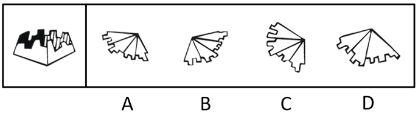
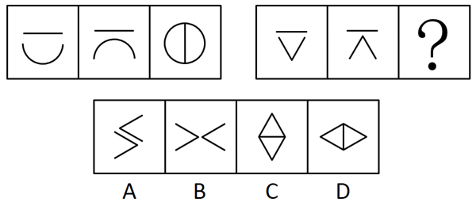
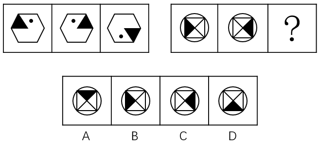
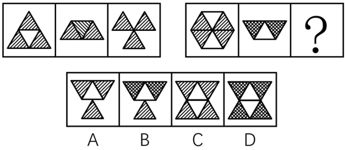

# 河南省2019年统一考试录用司法所公务员《行测》题（网友回忆版）

> 判断推理 · 40 题 · 河南 2019

## 第 1 题　qid 2452815 · 图形推理

下列选项中，折叠后可以与所给图形结合在一起，成为一个整体的是：

- **A**. A
- **B**. B　✅
- **C**. C
- **D**. D

**答案**：B

**官方解析**

本题考查立体拼合。根据题干给出的立体图形侧面有四个面，要与该图形结合，必须也有四个面与其拼合，而D选项有三个面，可以排除；继续观察发现，题干黑色面比较特殊，只有它有一个凹进去的“”图形，根据凹凸对应原则，选项当中的图形也得只有一个面有一个凸出来的“”图形与之拼合；排除A项，剩下BC两个选项，仔细观察原图形的豁口，只有B项折叠起来能与之重合。

故正确答案为B。

---

## 第 2 题　qid 2452817 · 图形推理

从所给的四个选项中，选择最合适的一个填入问号处，使之呈现一定的规律性：

- **A**. A
- **B**. B　✅
- **C**. C
- **D**. D

**答案**：B

**官方解析**

元素组成不同，且无明显属性规律，考虑数量规律。题干图形出现明显的多边形以及单一曲线，考虑数线条数。九宫格优先横着观察，三行图形依次由1，2，3，4，5，6，7，8，“？”条线组成。故“？”处应该选择由9条线组成的
图形，对应B选项。
故正确答案为B。

---

## 第 3 题　qid 2452820 · 图形推理

从所给的四个选项中，选择最合适的一个填入问号处，使之呈现一定的规律性：

- **A**. A　✅
- **B**. B
- **C**. C
- **D**. D

**答案**：A

**官方解析**

元素组成不同，且无明显属性规律，考虑数量规律。题干图形出现明显的黑块，并且黑块数量依次是“2、3、4、5、？”。故“？”处应该选择一个有6个黑块的图形，对应A选项。
故正确答案为A。

---

## 第 4 题　qid 2452823 · 图形推理

从所给的四个选项中，选择最合适的一个填入问号处，使之呈现一定的规律性：

- **A**. A
- **B**. B
- **C**. C
- **D**. D　✅

**答案**：D

**官方解析**

题干图形都是由两个图形组成，优先考虑图形间关系。观察发现每个图形当中的两个图形相交形成黑色阴影，并且每个图形中的黑色阴影部分与其中一个图案的形状相同，只有D项符合这一规律。
故正确答案为D。

---

## 第 5 题　qid 2452824 · 图形推理

从所给的四个选项中，选择最合适的一个填入问号处，使之呈现一定的规律性：

- **A**. A
- **B**. B
- **C**. C
- **D**. D　✅

**答案**：D

**官方解析**

元素组成相似，优先考虑样式规律。第一组图形中，图1和图2上面的横线先求同，再旋转，下面的弧线先顺时针转，再相加，得到图3。第二组图形运用此规律，图1与图2上面的横线先求同，再旋转，下面的折线先顺时针转，再相加，得到图3，故只有D项符合此规律。

故正确答案为D。

---

## 第 6 题　qid 2452825 · 图形推理

从所给的四个选项中，选择最合适的一个填入问号处，使之呈现一定的规律性：

- **A**. A
- **B**. B
- **C**. C　✅
- **D**. D

**答案**：C

**官方解析**

元素组成相同，优先考虑位置规律。第一组图形中，图1左右翻转得到图2，图2上下翻转得到图3。第二组图形运用此规律，图1左右翻转得到图2，图2上下翻转得到图3，故只有C项符合此规律。
故正确答案为C。

---

## 第 7 题　qid 2452826 · 图形推理

从所给的四个选项中，选择最合适的一个填入问号处，使之呈现一定的规律性：

- **A**. A
- **B**. B　✅
- **C**. C
- **D**. D

**答案**：B

**官方解析**

元素组成不同，且无明显属性规律，优先考虑数量规律。图形均为汉字，优先考虑笔画数。第一组图笔画数依次为7、8、9。第二组图形运用此规律，第二组图笔画数依次为4、5、？，因此问号处应选择6笔画的汉字。四个选项汉字的笔画数分别为5、6、7、7，只有B选项符合规律。
故正确答案为B。

---

## 第 8 题　qid 2452827 · 图形推理

从所给的四个选项中，选择最合适的一个填入问号处，使之呈现一定的规律性：

- **A**. A
- **B**. B
- **C**. C
- **D**. D　✅

**答案**：D

**官方解析**

元素组成不同，且无明显属性规律，优先考虑数量规律。观察题干图形发现出现生活化图形、空白区域明显，考虑数面。题干所有图形面的数量均为1，四个选项面的数量分别为0、0、2、1，只有D选项符合规律。
故正确答案为D。

---

## 第 9 题　qid 2452828 · 图形推理

从所给的四个选项中，选择最合适的一个填入问号处，使之呈现一定的规律性：

- **A**. A
- **B**. B
- **C**. C　✅
- **D**. D

**答案**：C

**官方解析**

本题为两组图题目，在第一组图，图1上半部分的阴影三角形向下翻转得到图2，继续向下翻转得到图3，第二组图依照此规律变化，图1上半部分的两个阴影三角形和一个白色三角形先向下翻转得到图2，此部分继续向下翻转，白色三角形相连接形成菱形，阴影三角形的阴影部分应分开为线条状，符合此规律的只有C选项。
故正确答案为C。

---

## 第 10 题　qid 2452829 · 图形推理

从所给的四个选项中，选择最合适的一个填入问号处，使之呈现一定的规律性：

- **A**. A
- **B**. B　✅
- **C**. C
- **D**. D

**答案**：B

**官方解析**

元素组成不同，且无明显属性规律，优先考虑数量规律。第一组图中出现单一直线以及多边形，优先考虑数直线，第一组图中直线的数量依次是1、2、4；第二组中出现的均为曲线图形，考虑数曲线，曲线数量依次是1、2，故问号处曲线出现应为4条，A项3条，B项4条，C项2条，D项2条，只有B项符合要求。
故正确答案为B。

---

## 第 11 题　qid 2452830 · 定义判断

名人效应是名人的出现所达成的引人注意、扩大影响的效应，或人们模仿名人的心理现象的统称。
根据上述定义，下面不属于名人效应的是：

- **A**. 某连续剧因著名演员主演而大获好评，后来该主演在本剧中所穿服饰开始热卖
- **B**. 某产品邀请了某体育明星代言后产品销量直线上升
- **C**. 某著名作家在公园举行新书签名会，吸引了大批游客
- **D**. 某市长就本市环境污染问题接受各大报社记者的采访　✅

**答案**：D

**官方解析**

第一步：找出定义关键词。
“名人的出现所达成的引人注意、扩大影响的效应”、“人们模仿名人的心理现象”。
第二步：逐一分析选项。
A项：著名演员获得好评之后，在剧中所穿的服饰也开始热卖，符合“名人的出现所达成的引人注意、扩大影响的效应”、“人们模仿名人的心理现象”，符合定义，排除； 
B项：体育明星代言产品导致销量直线上升，符合“名人的出现所达成的引人注意、扩大影响的效应”、“人们模仿名人的心理现象”，符合定义，排除；
C项：著名作家在公园举行新书签名会，吸引游客前往，符合“名人的出现所达成的引人注意、扩大影响的效应”、“人们模仿名人的心理现象”，符合定义，排除；
D项：市长因环境问题接受记者的采访，不符合“名人的出现所达成的引人注意、扩大影响的效应”、“人们模仿名人的心理现象”，不符合定义，当选。
本题为选非题，故正确答案为D。

---

## 第 12 题　qid 2452831 · 定义判断

应激性是指生物对外来刺激(如温度、声音)在短时间内所做出的反应。
根据上述定义，以下属于应激性的是：

- **A**. 篮球触地后高高弹起
- **B**. 含羞草被碰触后叶子收缩　✅
- **C**. 鲜牛奶常温放置24小时后发酸
- **D**. 纸张遇到明火燃烧

**答案**：B

**官方解析**

第一步：找出定义关键词。
“生物对外来刺激(如温度、声音)在短时间内所做出的反应”。
第二步：逐一分析选项。
A项：篮球触碰地面之后会高高弹起，篮球不是生物，不符合“生物对外来刺激(如温度、声音)在短时间内所做出的反应”，不符合定义，排除； 
B项：含羞草被碰触后叶子收缩，符合“生物对外来刺激(如温度、声音)在短时间内所做出的反应”，符合定义，当选；
C项：鲜牛奶放置24小时后发酸，鲜牛奶不是生物，不符合“生物对外来刺激(如温度、声音)在短时间内所做出的反应”，不符合定义，排除；
D项：纸遇到火会燃烧，纸不是生物，不符合“生物对外来刺激(如温度、声音)在短时间内所做出的反应”，不符合定义，排除。
故正确答案为B。

---

## 第 13 题　qid 2452832 · 定义判断

表演艺术是一种通过演唱、演奏等方式来塑造形象、传达情感的艺术形式，一般指舞台上的现场表演。
根据上述定义，下面属于表演艺术的是：

- **A**. 魔术师大卫•科波菲尔的魔术“大变活人”　✅
- **B**. 科幻电影《美国队长2》
- **C**. 健身房的瑜伽练习课
- **D**. 社区部分妇女自行组织的广场舞

**答案**：A

**官方解析**

第一步：找出定义关键词。
“通过演唱、演奏等方式来塑造形象、传达情感的艺术形式”、“一般指舞台上的现场表演”。
第二步：逐一分析选项。
A项：魔术符合“通过演唱、演奏等方式来塑造形象、传达情感的艺术形式”并且魔术“大变活人”是在舞台上表演的，满足“一般指舞台上的现场表演”，符合定义，当选； 
B项：科幻电影《美国队长2》是将人物表演利用胶卷、录像带或数字媒体将影像和声音捕捉起来，再加上后期的编辑工作而成，不满足“一般指舞台上的现场表演”，不符合定义，排除；
C项：健身房的瑜伽练习课，不满足“通过演唱、演奏等方式来塑造形象、传达情感的艺术形式”也不满足“一般指舞台上的现场表演”，不符合定义，排除；
D项：社区部分妇女自行组织的广场舞没有塑造形象，不满足“通过演唱、演奏等方式来塑造形象、传达情感的艺术形式”也不满足“一般指舞台上的现场表演”，不符合定义，排除。
故正确答案为A。

---

## 第 14 题　qid 2452833 · 定义判断

所谓形象工程指某些领导干部为了个人或小团体的目的和利益，不顾群众需要和当地实际，不惜利用手中权力而搞出的劳民伤财、浮华无效却有可能为自己和小团体标榜政绩的工程。
下列属于形象工程的是：

- **A**. 某市领导干部为农村儿童建立希望基金会
- **B**. 某经理私自为集团快速建立了豪华大厦
- **C**. 某领导以发展旅游为名在贫困乡建大型度假村　✅
- **D**. 某市领导决定对当地古建筑工程进行修复

**答案**：C

**官方解析**

第一步：找出定义关键词。
“某些领导干部”、“为了个人或小团体的目的和利益”、“不顾群众需要和当地实际，不惜利用手中权力而搞出的劳民伤财、浮华无效却有可能为自己和小团体标榜政绩的工程”。
第二步：逐一分析选项。
A项：为儿童建立希望基金会，是为了当地群众的利益，不满足“为了个人或小团体的目的和利益”，也不满足“不顾群众需要和当地实际，不惜利用手中权力而搞出的劳民伤财、浮华无效却有可能为自己和小团体标榜政绩的工程”，不符合定义，排除； 
B项：某经理，不满足“某些领导干部”，建立豪华大厦也不会提升政绩，不满足“不顾群众需要和当地实际，不惜利用手中权力而搞出的劳民伤财、浮华无效却有可能为自己和小团体标榜政绩的工程”，不符合定义，排除；
C项：某领导，满足“某些领导干部”，以发展旅游为名在贫困乡建大型度假村满足“为了个人或小团体的目的和利益”，也满足“不顾群众需要和当地实际，不惜利用手中权力而搞出的劳民伤财、浮华无效却有可能为自己和小团体标榜政绩的工程”，符合定义，当选；
D项：某市领导，满足“某些领导干部”，但是对当地古建筑工程进行修复不是浮华无效的，不满足 “不顾群众需要和当地实际，不惜利用手中权力而搞出的劳民伤财、浮华无效却有可能为自己和小团体标榜政绩的工程” ，不符合定义，排除。
故正确答案为C。

---

## 第 15 题　qid 2452834 · 定义判断

正当防卫是指对正在进行不法侵害行为的人，采取的制止不法侵害的行为，对不法侵害人造成一定限度损害的，属于正当防卫，不负刑事责任。
下列属于正当防卫的是：

- **A**. 小偷进入朋友家中准备盗窃，被朋友的母亲阻止后迅速离开
- **B**. 盗匪拦路抢劫，但是发现被拦者是自己的亲戚，不得已而放弃
- **C**. 杀人犯杀害自己仇人时，仇人拿刀与之展开搏斗　✅
- **D**. 盗匪抢劫正在逃亡的杀人犯，双方发生争执

**答案**：C

**官方解析**

第一步：找出定义关键词。
“对正在进行不法侵害行为的人”、“采取的制止不法侵害的行为，对不法侵害人造成一定限度损害的”。
第二步：逐一分析选项。
A项：小偷进入朋友家中准备盗窃，被朋友的母亲阻止后离开，没有对不法侵害人造成损害，不满足“采取的制止不法侵害的行为，对不法侵害人造成一定限度损害的”，不符合定义，排除；
B项：盗匪不得已而放弃抢劫，说明并没有开始抢劫，不满足“对正在进行不法侵害行为的人”，不符合定义，排除；
C项：杀人犯杀害自己仇人时满足“正在进行不法侵害行为的人”，仇人拿刀与之展开搏斗满足“采取的制止不法侵害的行为，对不法侵害人造成一定限度损害的”，符合定义，当选；
D项：盗匪抢劫正在逃亡的杀人犯满足“正在进行不法侵害行为的人”，但双方发生争执不知道有没有制止不法侵害，不满足“采取的制止不法侵害的行为，对不法侵害人造成一定限度损害的”，不符合定义，排除。
故正确答案为C。

---

## 第 16 题　qid 2452835 · 定义判断

紧缩货币政策指中央银行为实现既定的经济目标运用各种工具调节货币供应量和利率，进而影响宏观经济的方针和措施的总和。紧缩货币政策最终希望取得稳定物价，促进经济增长，实现充分就业和平衡国际收支的效果。
根据上述定义，以下涉及到紧缩货币政策的是：

- **A**. 某商业银行面临资金紧缺的严重问题，为减少风险，对于投资审批程序更加严格
- **B**. 欧洲各国的领导人普遍表示应该采取谨慎的货币政策以应对日益严峻的金融危机
- **C**. 中央银行通过调整准备金率以控制商业银行贷款，从而减少银行呆坏账的风险　✅
- **D**. 渣打银行推出无抵押信用贷款，有效地解决了中小企业缺乏抵押物的问题

**答案**：C

**官方解析**

第一步：找出定义关键词。
“中央银行为实现既定的经济目标”、“运用各种工具调节货币供应量和利率”、“进而影响宏观经济的方针和措施的总和”。
第二步：逐一分析选项。
A项：某商业银行不是中央银行，不满足“中央银行为实现既定的经济目标”，不符合定义，排除； 
B项：欧洲各国的领导人不是中央银行，不满足“中央银行为实现既定的经济目标”，应该采取也并没有正在去做，不满足“运用各种工具调节货币供应量和利率”，不符合定义，排除；
C项：中央银行通过调整准备金率以控制商业银行贷款满足“中央银行为实现既定的经济目标”，也满足“运用各种工具调节货币供应量和利率”，符合定义，当选；
D项：渣打银行不是中央银行，不满足“中央银行为实现既定的经济目标”，不符合定义，排除。
故正确答案为C。

---

## 第 17 题　qid 2452838 · 定义判断

海绵城市是新一代城市雨洪管理概念，是指城市在适应环境变化和应对雨水带来的自然灾害等方面具有良好的“弹性”，也可称之为“水弹性城市”。
下列不属于海绵城市的是：

- **A**. 光明新区先后建立发达的地下管网系统
- **B**. 德国城市高效排水排污
- **C**. 瑞士在全国大力推行“雨水工程”
- **D**. 洛杉矶的雨水一直是流入河道，后流向大海　✅

**答案**：D

**官方解析**

第一步：找出定义关键词。
“城市在适应环境变化和应对雨水带来的自然灾害等方面具有良好的弹性”。
第二步：逐一分析选项。
A项：发达的地下管网系统，体现出应对雨水的“弹性”，符合“城市在适应环境变化和应对雨水带来的自然灾害等方面具有良好的弹性”，符合定义，排除； 
B项：高效排水排污，“高效”体现出应对雨水的“弹性”，符合“城市在适应环境变化和应对雨水带来的自然灾害等方面具有良好的弹性”，符合定义，排除； 
C项：推行“雨水工程”，体现出应对雨水的“弹性”，符合“城市在适应环境变化和应对雨水带来的自然灾害等方面具有良好的弹性”，符合定义，排除； 
D项：雨水一直是流入河道，后流向大海，就是最简单的排水，没有体现应对雨水的“弹性”，不符合“城市在适应环境变化和应对雨水带来的自然灾害等方面具有良好的弹性”，不符合定义，当选。
本题为选非题，故正确答案为D。

---

## 第 18 题　qid 2452841 · 定义判断

“互联网政务”服务实现部门间数据共享，让居民和企业少跑腿、好办事、不添堵，简除烦苛，禁察非法，使人民群众有更平等的机会和更大的创造空间。

下列<u>不属于</u>互联网政务服务的是：

- **A**. 小明去政府办理农村合作医疗保险要求只需携带公民身份证
- **B**. 小明去政府单位跑一个窗口就将其所要办理的事情办好
- **C**. 小明身在外地不需要回到户口所在地就可以办理身份证
- **D**. 小明去政府机构办理业务感觉服务比以前好很多　✅

**答案**：D

**官方解析**

第一步：找出定义关键词。
“数据共享”、“让居民和企业少跑腿、好办事、不添堵，简除烦苛，禁察非法”
第二步：逐一分析选项。
A项：办理农村合作医疗保险要求只需携带公民身份证，简化流程，符合“让居民和企业少跑腿、好办事、不添堵，简除烦苛，禁察非法”，符合定义，排除； 
B项：去政府单位跑一个窗口就将其所要办理的事情办好，一键式办理，符合“让居民和企业少跑腿、好办事、不添堵，简除烦苛，禁察非法”，符合定义，排除； 
C项：不需要回到户口所在地就可以办理身份证，便民利民，符合“让居民和企业少跑腿、好办事、不添堵，简除烦苛，禁察非法”，符合定义，排除；
D项：感觉服务比以前好很多，强调的是服务态度的转变，不符合“让居民和企业少跑腿、好办事、不添堵，简除烦苛，禁察非法”，不符合定义，当选。
本题为选非题，故正确答案为D。

---

## 第 19 题　qid 2452844 · 定义判断

共享税是由中央和地方政府按一定方式分享收入的一类税收。共享税的分享方式主要有附加式、分征式、比例分成式等。我国的共享税有增值税、资源税、个人所得税、企业所得税和证券交易税。
下列属于共享税的是：

- **A**. 每次通过海关交的关税
- **B**. 消费金额较大时所交的消费税
- **C**. 铁道部门集中缴纳的营业税
- **D**. 公司财务申购材料缴纳的增值税　✅

**答案**：D

**官方解析**

第一步：找出定义关键词。
“共享税有增值税、资源税、个人所得税、企业所得税和证券交易税”，题干给了5种税种，可以考虑一一对应。
第二步：逐一分析选项。
A项：关税，不符合“共享税有增值税、资源税、个人所得税、企业所得税和证券交易税”，不符合定义，排除； 
B项：消费税，不符合“共享税有增值税、资源税、个人所得税、企业所得税和证券交易税”，不符合定义，排除； 
C项：营业税，不符合“共享税有增值税、资源税、个人所得税、企业所得税和证券交易税”，不符合定义，排除； 
D项：增值税，符合“共享税有增值税、资源税、个人所得税、企业所得税和证券交易税”5种之一，符合定义，当选。
故正确答案为D。

---

## 第 20 题　qid 2452847 · 定义判断

缺点逆用法是指针对人或事物中的缺点，考虑如何将这些缺点进行转换，使之成为可被利用的优点，从而解决问题的方法。
根据上述定义，下面属于缺点逆用法的是：

- **A**. 电流通过导体时会产生热量，如不进行散热则会损害电路元件。人们利用电流的这种特点，将产生的热量传导到毛毯上，生产出了电热毯　✅
- **B**. 公司新生产的模具被曝含有致癌物质，公司高层决定紧急召开会议讨论如何进行产品召回
- **C**. 最近部分市民投诉出租车拒载现象较多，针对此现象，出租车公司决定对司机重新进行业务培训并加重对拒载司机的处罚
- **D**. 小明有先天性的口吃，为了练好发声，他每天口含着石子练习

**答案**：A

**官方解析**

第一步：找出定义关键词。
“考虑如何将这些缺点进行转换，使之成为可被利用的优点，从而解决问题”
第二步：逐一分析选项。
A项：电流的热量如果不进行散热会损害电路元件，符合“缺点”，利用电流的这种特点，将产生的热量传导到毛毯上，生产出了电热毯，符合“把缺点进行转换，使之成为可被利用的优点，从而解决问题”，符合定义，当选；
B项：公司召回致癌产品，只是“召回”，不符合“把缺点进行转换，使之成为可被利用的优点，从而解决问题”，不符合定义，排除；
C项：对拒载司机进行处罚，只是解决市民的投诉，不符合“把缺点进行转换，使之成为可被利用的优点，从而解决问题”，不符合定义，排除；
D项：每天口含着石子练习，只是在克服缺点，不符合“把缺点进行转换，使之成为可被利用的优点，从而解决问题”，不符合定义，排除；
故正确答案为A。

---

## 第 21 题　qid 2452850 · 类比推理

青蛙：害虫

- **A**. 老师：学生
- **B**. 老鹰：老鼠　✅
- **C**. 蜻蜓：蝴蝶
- **D**. 牛奶：奶牛

**答案**：B

**官方解析**

第一步：判断题干词语间逻辑关系。
青蛙吃害虫，二者为捕食者与被捕食者的对应关系。
第二步：判断选项词语间逻辑关系。
A项：老师教导学生，二者为职业与作用对象的对应关系，与题干逻辑关系不一致，排除；
B项：老鹰吃老鼠，二者为捕食者与被捕食者的对应关系，与题干逻辑关系一致，当选；
C项：蜻蜓和蝴蝶都是动物，二者为并列关系，与题干逻辑关系不一致，排除；
D项：奶牛可以产出牛奶，二者为产出物的对应关系，与题干逻辑关系不一致，排除。
故正确答案为B。

---

## 第 22 题　qid 2452852 · 类比推理

绿萝：植物

- **A**. 金属：铝
- **B**. 铁锤：铁锹
- **C**. 动物：斑马
- **D**. 蝴蝶：昆虫　✅

**答案**：D

**官方解析**

第一步：判断题干词语间逻辑关系。
绿萝是植物的一种，二者为种属关系。
第二步：判断选项词语间逻辑关系。
A项：铝是金属的一种，二者为种属关系，但两词顺序与题干相反，与题干逻辑关系不一致，排除；
B项：铁锤和铁锹是两种工具，二者为并列关系，与题干逻辑关系不一致，排除；
C项：斑马是动物的一种，二者为种属关系，但两词顺序与题干相反，与题干逻辑关系不一致，排除；
D项：蝴蝶是昆虫的一种，二者为种属关系，与题干逻辑关系一致，当选。
故正确答案为D。

---

## 第 23 题　qid 2452854 · 类比推理

焦作：云台山

- **A**. 香港：紫荆花
- **B**. 华山：渭南
- **C**. 云南：洱海
- **D**. 杭州：西湖　✅

**答案**：D

**官方解析**

第一步：判断题干词语间逻辑关系。
云台山是焦作市的景点之一，二者为城市与景点的对应关系。
第二步：判断选项词语间逻辑关系。
A项：紫荆花是香港的市花，二者为城市与市花的对应关系，与题干逻辑关系不一致，排除；
B项：华山是渭南市的景点之一，二者为城市与景点的对应关系，但两词顺序与题干相反，与题干逻辑关系不一致，排除；
C项：洱海是云南省的景点之一，二者为省份与景点的对应关系，与题干逻辑关系不一致，排除；
D项：西湖是杭州市的景点之一，二者为城市与景点的对应关系，与题干逻辑关系一致，当选。
故正确答案为D。

---

## 第 24 题　qid 2452856 · 类比推理

英国：伦敦

- **A**. 宇宙：火星
- **B**. 青海：甘肃
- **C**. 香港：九龙　✅
- **D**. 釜山：韩国

**答案**：C

**官方解析**

第一步：判断题干词语间逻辑关系。
伦敦是英国的组成部分，二者为组成关系。
第二步：判断选项词语间逻辑关系。
A项：火星是宇宙的组成部分，二者为组成关系，与题干逻辑关系一致，保留；
B项：青海和甘肃是我国的两个省份，二者为并列关系，与题干逻辑关系不一致，排除；
C项：九龙是香港的组成部分，二者为组成关系，与题干逻辑关系一致，保留；
D项：釜山是韩国的组成部分，但两词顺序与题干相反，与题干逻辑关系不一致，排除。
比较A、C两项，题干中伦敦是英国的首都，是英国的政治、经济、文化、金融中心；而九龙是中国香港的三大区域之一，是除了香港岛以外市区的主要组成部分，C项与题干的关系更近，因此排除A项。
故正确答案为C。

---

## 第 25 题　qid 2452859 · 类比推理

吐鲁番：葡萄

- **A**. 北京：普通话
- **B**. 新疆：哈密瓜　✅
- **C**. 解放军：建军节
- **D**. 房地产：开发商

**答案**：B

**官方解析**

第一步：判断题干词语间逻辑关系。
葡萄是吐鲁番的特产，二者为地点与特产之间的对应关系。
第二步：判断选项词语间逻辑关系。
A项：普通话是以北京语音为标准音，以北方话（官话）为基础方言，以典范的现代白话文著作为语法规范的通用语，并非北京的特产，与题干逻辑关系不一致，排除；
B项：哈密瓜是新疆的特产，二者为地点与特产之间的对应关系，与题干逻辑关系一致，当选；
C项：建军节是解放军建军纪念日，二者为节日对应关系，与题干逻辑关系不一致，排除；
D项：有的开发商开发经营房地产，二者并非地点与特产之间的对应关系，与题干逻辑关系不一致，排除。
故正确答案为B。

---

## 第 26 题　qid 2452836 · 类比推理

篮球：运动

- **A**. 敲诈：犯罪　✅
- **B**. 作者：鲁迅
- **C**. 历史：近代史
- **D**. 金钱：权利

**答案**：A

**官方解析**

第一步：判断题干词语间逻辑关系。
篮球是一种运动，二者为包容关系中的种属关系。
第二步：判断选项词语间逻辑关系。
A项：敲诈是一种犯罪，二者为种属关系，与题干逻辑关系一致，当选；
B项：作者一般指文学、艺术和科学作品的创作者，鲁迅是一名作者，二者为种属关系，但词语顺序不同，与题干逻辑关系不一致，排除；
C项：历史按照时间可分为史前史、古代史、近代史、现代史等，近代史是一段历史，二者为种属关系，但词语顺序不同，与题干逻辑关系不一致，排除；
D项：金钱可能会给人带来权利，二者为对应关系，与题干逻辑关系不一致，排除。
故正确答案为A。

---

## 第 27 题　qid 2452839 · 类比推理

《西游记》：吴承恩

- **A**. 《三国志》：罗贯中
- **B**. 《三国演义》：施耐庵
- **C**. 《警世通言》：冯梦龙　✅
- **D**. 《绿野仙踪》：蒲松龄

**答案**：C

**官方解析**

第一步：判断题干词语间逻辑关系。
《西游记》的作者是吴承恩，二者为作品与作者的对应关系。
第二步：判断选项词语间逻辑关系。
A项：《三国志》的作者是西晋史学家陈寿，不是罗贯中，与题干逻辑关系不一致，排除；
B项：《三国演义》的作者是罗贯中，施耐庵是《水浒传》的作者，与题干逻辑关系不一致，排除；
C项：《警世通言》的作者是冯梦龙，二者为作品与作者的对应关系，与题干逻辑关系一致，当选；
D项：《绿野仙踪》的作者是美国作家弗兰克·鲍姆，蒲松龄是《聊斋志异》的作者，与题干逻辑关系不一致，排除。
故正确答案为C。

---

## 第 28 题　qid 2452843 · 类比推理

周瑜：曹操

- **A**. 杜甫：柳永
- **B**. 动物：食物
- **C**. 火车：叉车
- **D**. 吴国：魏国　✅

**答案**：D

**官方解析**

第一步：判断题干词语间逻辑关系。
周瑜与曹操均是东汉末年的历史人物，二者为并列关系中的反对关系。
第二步：判断选项词语间逻辑关系。
A项：杜甫是唐代诗人，柳永北宋词人，二者是并列关系中的反对关系，与题干逻辑关系一致，保留；
B项：有的动物是食物，有的食物是动物，有的动物不是食物，有的食物不是动物，二者为交叉关系，与题干逻辑关系不一致，排除；
C项：叉车是一种工业搬运车辆，是汽车的一种，而汽车与火车为并列关系，叉车与火车并非并列关系，与题干逻辑关系不一致，排除；
D项：吴国与魏国是三国时期的两个国家，二者为并列关系中的反对关系，与题干逻辑关系一致，保留。
对比A、D两个选项，A项中的两个历史人物所处的朝代并不相同，而D项的两个国家都处于三国时期，所处朝代相同，并且题干中的周瑜和曹操刚好一个是吴国人、一个是魏国人，竖着看可以构成历史人物和所处朝代的对应关系，因此，D选项与题干的逻辑关系更相近，对比择优后选择D项。
故正确答案为D。

---

## 第 29 题　qid 2452846 · 类比推理

麦当劳：美国

- **A**. 肯德基：德国
- **B**. 三星：韩国　✅
- **C**. 夏普：英国
- **D**. 哈根达斯：日本

**答案**：B

**官方解析**

第一步：判断题干词语间逻辑关系。
麦当劳是美国的品牌，创立于美国，二者为创立地点的对应关系。
第二步：判断选项词语间逻辑关系。
A项：肯德基不是创立于德国，而是创立于美国，与题干逻辑关系不一致，排除；
B项：三星是韩国的品牌，创立于韩国，二者为创立地点的对应关系，与题干逻辑关系一致，当选；
C项：夏普不是创立于英国，而是创立于日本，与题干逻辑关系不一致，排除；
D项：哈根达斯不是创立于日本，而是创立于美国，与题干逻辑关系不一致，排除。
故正确答案为B。

---

## 第 30 题　qid 2452849 · 类比推理

逗号：中止

- **A**. 句号：引用
- **B**. 解释：冒号
- **C**. 回车：换行　✅
- **D**. 并列：分隔号

**答案**：C

**官方解析**

第一步：判断题干词语间逻辑关系。
逗号是用来中止的，具有中止的功能，二者为功能上的对应关系。
第二步：判断选项词语间逻辑关系。
A项：句号的功能不是引用，而是表示结束，与题干逻辑关系不一致，排除；
B项：冒号是用来解释的，具有解释的功能，但两词顺序与题干相反，与题干逻辑关系不一致，排除；
C项：回车是用来换行的，具有换行的功能，与题干逻辑关系一致，当选；
D项：分隔号可以用来表示并列，但两词顺序与题干相反，与题干逻辑关系不一致，排除。
故正确答案为C。

---

## 第 31 题　qid 2452857 · 逻辑判断

在电影“泰坦尼克号”里，我们看到了一幅幅充满人性，感人至深的温暖画面：白发苍苍的老船长庄严宣布：“让妇女儿童优先离船”。最后他平静地与“泰坦尼克号”一同沉没……
根据白发苍苍老船长的话，下列推理正确的是：

- **A**. 她是儿童，所以可以优先离船　✅
- **B**. 优先离船的都是妇女儿童
- **C**. 她优先离船，所以她是妇女
- **D**. 不是妇女儿童不可以优先离船

**答案**：A

**官方解析**

第一步：翻译题干。

题干关于老船长的话，可以理解为：如果是妇女或儿童，那么可以优先离船，所以可以翻译为：①妇女或儿童优先离船。

第二步：逐一分析选项。

A项：儿童是对①的肯前，肯前必肯后，当选；

B项：优先离船是对①的肯后，但肯后得不到确定性的结论，排除；

C项：优先离船是对①的肯后，但肯后得不到确定性的结论，排除；

D项：优先离船是对①的肯后，但肯后得不到确定性的结论，排除。

故正确答案为A。

---

## 第 32 题　qid 2452860 · 类比推理

“犯罪的不都是无固定收入人群”这一命题可以理解为：

- **A**. 所有犯罪的都不是无固定收入人群
- **B**. 所有犯罪的都是无固定收入人群
- **C**. 有的犯罪的不是无固定收入人群　✅
- **D**. 所有的无固定收入人群是犯罪的

**答案**：C

**官方解析**

第一步：翻译题干。

题干“不都是”理解成“有的不”，所以题干可以翻译为：

①有的犯罪无固定收入人群

第二步：逐一分析选项。

A项：翻译为犯罪无固定收入人群，有的不能推所有，推不出，排除；

B项：翻译为犯罪无固定收入人群，与题干矛盾，推不出，排除；

C项：翻译为有的犯罪无固定收入人群，与题干一致，当选；

D项：翻译为无固定收入人群犯罪，有的不能逆否，无法推出，排除。

故正确答案为C。

---

## 第 33 题　qid 2452862 · 逻辑判断

许多成功的演员都是表演系专业毕业的，也有很多演员是草根出身，通过一些机遇走上了演艺之路，但没有一个不努力提升自己演艺水平的演员能够获得成功。
如果以上陈述为真，那么以下选项一定为真的是：

- **A**. 没有草根出身的演员会不努力提升自己演艺水平
- **B**. 所有不成功的演员都不努力去提升自己演艺水平
- **C**. 演员越努力提升自己演艺水平就越可能获得成功　✅
- **D**. 表演系专业毕业的演员会努力提升自己演艺水平

**答案**：C

**官方解析**

第一步：翻译题干。

①有的成功演员表演系毕业；

②有的演员草根；

③成功努力提升自己演艺水平；

①换位后和③可得：④有的表演系毕业成功演员努力提升自己演艺水平。

第二步：逐一分析选项。

A项：翻译为草根努力提升自己演艺水平，草根与努力之间不构成推出关系，排除；

B项：翻译为—成功努力提升自己演艺水平，对③的否前，否前推不出必然性结论，排除；

C项：翻译为越努力提升自己演艺水平越可能成功，是对③的肯后，肯后得不到必然性结论，选项中说的是可能获得成功，当选；

D项：翻译为表演系专业努力提升自己演艺水平，根据①③只能推出有的表演系毕业努力提升自己演艺水平，无法推出所有，排除。

故正确答案为C。

---

## 第 34 题　qid 2452863 · 类比推理

舞蹈课上，学生紫梦来迟了，老师问她：“怎么又迟到了？”根据此所述，则该教师提问的预设是：

- **A**. 学生紫梦不喜欢上舞蹈课
- **B**. 学生紫梦上课迟到是有意的
- **C**. 以前上舞蹈课学生紫梦也迟到过　✅
- **D**. 这节舞蹈课上没有其他同学迟到

**答案**：C

**官方解析**

第一步：找出论点和论据。
论点：学生紫梦又迟到了。
论据：无。
本题只有论点无论据，问法为预设，优先考虑必要条件的加强方式。
第二步：逐一分析选项。
A项：喜欢上舞蹈课也不意味着一定不迟到，并且跟“又一次”没有关系，无法成为预设，排除；
B项：老师的问法中看不出紫梦是不是故意这个主观意识，而且“有意”和“又一次”没有关系，无法成为预设，排除；
C项：如果以前上舞蹈课学生紫梦没迟到过，老师就不会问“又一次”，所以是老师所言的必要条件，当选；
D项：老师针对于紫梦发问，与其他同学是否迟到无关，排除。
故正确答案为C。

---

## 第 35 题　qid 2452864 · 类比推理

有员工没参加单位举行的学习宣传《习近平谈治国理政》(第二卷)座谈会。甲、乙、丙、丁中有一人没有参加，其他三人都参加了。单位负责人在询问时，他们做了如下的回答。
甲：乙没有来。
乙：我不但参加了，而且还谈了感想。
丙：我晚来了一会儿，但一直到座谈会结束才走。
丁：如果丙来了，那就是我没来。
如果他们中只有一个人说谎，则以下成立的是：

- **A**. 甲没有参加
- **B**. 乙没有参加
- **C**. 丙没有参加
- **D**. 丁没有参加　✅

**答案**：D

**官方解析**

本题属于真假推理题。
第一步：找出题干矛盾命题。
甲说“乙没有来”和乙说“我不但参加了，而且还谈了感想”是矛盾关系，必有一真一假。
第二步：看其余。
已知只有一个人说谎，说明其余人说的都是真的。丙说“我晚来了一会儿”，说明丙参加了。丁说“如果丙来了，那就是我没来”，因丙参加为真，说明丁没有参加。
故正确答案为D。

---

## 第 36 题　qid 2452866 · 类比推理

中国要真正成为世界大国中的执牛耳者，首先就要向海洋要发展空间。翻看历史上所有的大国崛起，无不是在浩瀚的海洋中完成自我蜕变的。然而作为当今世界唯一的超级大国美国，却始终打着自己的小九九。它几乎不能容忍一个意识形态和自己不同的国家崛起于太平洋的另外一端，从而击碎自己积累两百年的霸主地位。在现实中，美国就和某些国家串联起来，创造出旨在围堵中国的“太平洋岛链”，这成了中国这只雄鸡暂时难以摆脱的海路桎梏。

根据这段文字，无法推出的是：

- **A**. 发展海洋空间对中国具有重要意义
- **B**. 美国和中国的意识形态完全不同
- **C**. 美国的全球地位有利于中国的发展　✅
- **D**. 美国的小九九就是阻碍中国的发展

**答案**：C

**官方解析**

日常结论题，根据题干信息逐一分析选项。
A项：根据前两句话可知，中国要成为大国中的执牛耳者，就要向海洋要发展空间。大国崛起离不开浩瀚的海洋，可以看出海洋对于中国的重要意义，可以推出，排除；
B项：题干中指出美国几乎不能容忍一个意识形态和自己不同的国家崛起于太平洋的另外一端，这里说的就是中国，所以中美意识形态完全不同，可以推出，排除；
C项：题干中指明美国在围堵中国的“太平洋岛链”且设置海路桎梏，说明是不利于中国发展的，推不出来有利于中国发展，当选；
D项：题干中美国精神上无法容忍中国崛起，现实中处处设置桎梏，都暴露出它的小九九（目的）就是阻碍中国发展，可以推出，排除。
本题为选非题，故正确答案为C。

---

## 第 37 题　qid 2452868 · 逻辑判断

现代法治社会，公民缴纳税款，本该获得对应的公共服务，其中就包括良好的大气环境。如果公众缴税之后，还需要单独缴纳空气污染费，那么就涉嫌重复收费。即便因为特殊原因非要征收，相关部门必须让这笔资金的使用足够透明，才能开征这一收费。但目前来看，XX市收取空气污染费本身都无理无据，又如何指望其将钱花到刀刃上，而不是成为其小金库和第二、甚至第N财政？
根据这段文字，可以推出的是：

- **A**. 良好的大气环境是法治社会公民应享的公共服务　✅
- **B**. 现代法治社会一定不能收取空气污染费
- **C**. 公开透明是法治社会征收空气污染费的唯一条件
- **D**. 现代法治社会所有民众都缴纳了税款

**答案**：A

**官方解析**

日常结论题，根据题干信息逐一分析选项。
A项：根据第一句话，“现代法治社会，公民缴纳税款，本该获得对应的公共服务，其中就包括良好的大气环境”可以推出：良好的大气环境是法治社会公民应享的公共服务，可以推出，当选；
B项：根据第三句话“即便因为特殊原因非要征收，相关部门必须让这笔资金的使用足够透明，才能开征这一收费” 可以推出：特殊原因且资金使用透明的情况下可以收取空气污染费，无法推出，排除；
C项：题干第三句话只提到了，公开透明是法治社会征收空气污染费的必要条件，并未提到是否是唯一条件，无法推出，排除；
D项：题干中并未提到现代法治社会所有民众是否都缴纳了税款，无法推出，排除。
故正确答案为A。

---

## 第 38 题　qid 2452870 · 类比推理

某种意义上说，公开发表论文的确是个人研究水平的一种证明。上个世纪有关方面主张把发表论文列为职称评审的依据之一，初衷固然不错。此一制度设计，在一段时期内也确实有积极的作用。但是，旧的制度不可能永远管用，新的体系必须在现实情况的变化中建立和刷新，否则我们就得为因循守旧付出代价。
根据这段文字，不能推出的是：

- **A**. 论文发表是个人科研能力的证明
- **B**. 我国现行的职称评审制度需要改革
- **C**. 我国职称评审条件之一是要发表论文
- **D**. 我国现行职称评审制度设计不合理　✅

**答案**：D

**官方解析**

日常结论题，根据题干信息逐一分析选项。
A项：根据第一句话“某种意义上说，公开发表论文的确是个人研究水平的一种证明”可以推出，排除；
B项：根据第四句话“但是，旧的制度不可能永远管用，新的体系必须在现实情况的变化中建立和刷新，否则我们就得为因循守旧付出代价”可以推出：我国需要改革现有的制度，可以推出，排除；
C项：根据题干第二、三句话“上个世纪有关方面主张把发表论文列为职称评审的依据之一，初衷固然不错，此一制度设计，在一段时期内也确实有积极的作用”，说明我国存在发表论文是职称评审条件之一的情况，可以推出，排除；
D项：题干中并未提到我国现行职称评审制度设计不合理，无法推出，当选。
本题为选非题，故正确答案为D。

---

## 第 39 题　qid 2452872 · 逻辑判断

大学生热衷于考证，所有的指向都是便于就业，多一个证便多一个找到相对满意工作的机会，出发点很简单也很直接，也说明了人才市场的某种需求的取向，已经给大学生们注入了无声的动力。那么，所谓的考证达人，或者大学生们逢证必考，呈现出来盲目，事实上不是单纯意义的盲目了，反映出来的仍然是大学生群体性就业的焦虑。
根据这段文字，可以推出的是：

- **A**. 大学生考证越多，越容易找到份好工作
- **B**. 大学生考证越多，越说明其市场需求大
- **C**. 大学生逢证必考，反映了其就业的焦虑　✅
- **D**. 大学生热衷考证，主要证明其为考证达人

**答案**：C

**官方解析**

日常结论题，根据题干信息逐一分析选项。
A项：题干第一句话“多一个证便多一个找到相对满意工作的机会”可知，证多工作机会就多，但不代表越容易找到好工作，无法推出，排除；
B项：题干第一句话说的是“人才市场的某种需求的取向”，而不是市场需求大，无法推出，排除；
C项：题干最后一句话“大学生们逢证必考，呈现出来盲目，事实上不是单纯意义的盲目了，反映出来的仍然是大学生群体性就业的焦虑”，可以推出，当选；
D项：题干第一句话“大学生热衷于考证，所有的指向都是便于就业”可知，大学生考证主要是为了便于就业，而不是为了证明自己是考证达人，无法推出，排除。
故正确答案为C。

---

## 第 40 题　qid 2452874 · 类比推理

国家统计局到某单位开展反腐倡廉公众满意度调查，该单位包括局长在内共有373名员工。有关这373名员工，以下三个断定中只有一个是真的：（1）有人满意；（2）有人不满意；（3）局长不满意。根据这段文字，以下为真的是：

- **A**. 373名员工都满意　✅
- **B**. 373名员工都不满意
- **C**. 有1名员工不满意
- **D**. 无法确定该单位满意人数

**答案**：A

**官方解析**

本题属于真假推理题。
第一步：找关系。
本题中（1）有人满意和（2）有人不满意是反对关系，二者必有一真。已知三个断定中只有一个是真的，则这句真话一定在这组反对关系中，那么（3）局长不满意为假。
第二步：看其余。
由（3）局长不满意为假，可知局长是满意的。由局长满意可以推出有人满意，因此（1）为真，而（1）和（2）只有一真，那么（2）有人不满意为假，因此他的矛盾命题所有人都满意为真。只有A项符合。
故正确答案为A。

---
