# 2016年3月四川省选调优秀大学生到基层工作考试 行政职业能力测验试卷（精选）

> 资料分析 · 10 题 · 四川 2016

## 材料 1

        2013年，全国林产品出口644.55亿美元，同比增长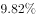，增幅比上年增加3.18个百分点，占全国商品出口额的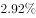。林产品进口640.88亿美元，同比增加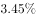，增幅比上年增加8.58个百分点，占全国商品进口额的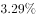。其中，非木质林产品出口162.3亿美元，同比增加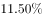，进口288.80亿美元，同比下降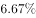。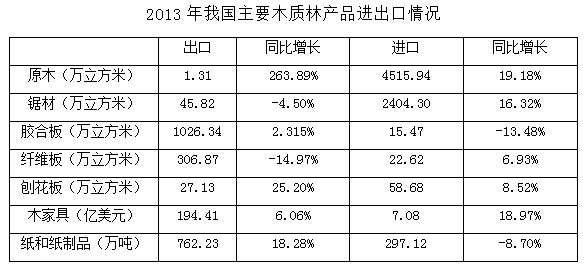

### 第 1 题　qid 2263114 · 综合

2013年全国商品进出口总额约为多少亿美元？

- **A**. 1285
- **B**. 10891
- **C**. 25140
- **D**. 41553　✅

**答案**：D

**官方解析**

根据题干“2013年全国商品进出口总额”，结合材料“占全国商品出口额的2.92%、占全国商品进口额的”，可判定此题为现期比重问题。定位文字材料，“2013年，全国林产品出口644.55亿美元，占全国商品出口额的，林产品进口640.88亿美元，占全国商品进口额的”。根据总量，2013年全国商品进出口额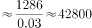亿美元，与D项最接近。

故正确答案为D。

---

### 第 2 题　qid 2263117 · 比重

2013年木质林出口额占林产品出口总额的比重约为：

- **A**. 
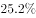

- **B**. 

- **C**. 
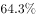

- **D**. 

　✅

**答案**：D

**官方解析**

根据题干“2013年······占······的比重”，结合材料时间为2013年，可判定此题为现期比重问题。定位文字材料可得，“2013年全国林产品出口644.55亿美元，其中非木质林产品出口162.3亿美元”。可得木质林出口额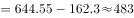亿美元，故2013年木质林出口额占林产品出口总额的比重为 ，与D项最接近。

故正确答案为D。

---

### 第 3 题　qid 2263118 · 增长

下列木质林产品中，2013年出口量同比增长最大的是：

- **A**. 原木
- **B**. 胶合板　✅
- **C**. 纤维板
- **D**. 刨花板

**答案**：B

**官方解析**

根据题干“······同比增长最大”，可判定本题为增长量比较问题。定位表格可得各项数据2013年具体出口量及增长率，根据增长量计算公式，，计算各项增长量进行比较即可。

A项：定位表格可得，2013年原木出口量1.31万立方米，同比增长。则增长量万立方米；

B项：定位表格可得，2013年胶合板出口量1026.34万立方米，同比增长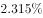。则增长量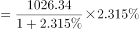万立方米；

C项：定位表格可得，2013年纤维板出口量306.87万立方米，同比增长。增长量为负数，排除；

D项：定位表格可得，2013年刨花板出口量27.13万立方米，同比增长。则增长量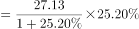万立方米。

比较可知，2013年出口量增长最多的为胶合板。

故正确答案为B。

---

### 第 4 题　qid 2263119 · 增长

下列木质林产品中，2013年进出口差值的绝对量比上年有所缩小的是：

- **A**. 原木
- **B**. 锯材
- **C**. 刨花板　✅
- **D**. 纸和纸制品

**答案**：C

**官方解析**

根据题干“···进出口差值的绝对量比上年有所缩小”，可判定本题为基期和差问题。

A项：定位表格可得，2013年原木出口量1.31万立方米，同比增长，进口量4515.94万立方米，同比增长。现期差绝对值为，基期差为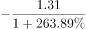，现期差大于基期差，即差值比上年扩大，排除；

B项：定位表格可得，2013年锯材出口量45.82万立方米，同比增长，进口量2404.30万立方米，同比增长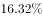。现期差绝对值为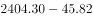，基期差为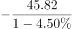，其中，，则，现期差大于基期差，即差值比上年扩大，排除；

C项：定位表格可得，2013年刨花板出口量27.13万立方米，同比增长。进口量58.68万立方米，同比增长。现期差绝对值为，基期差为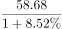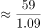。现期差小于基期差，即差值比上年缩小，正确；

D项：定位表格可得，2013年纸和纸制品出口量762.23万吨，同比增长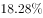，进口量297.12万吨，同比增长。现期差绝对值为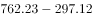，基期差为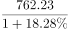，其中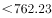，，则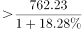，现期差大于基期差，即差值比上年扩大，排除。

故正确答案为C。

---

### 第 5 题　qid 2263120 · 综合

下列说法中与上述资料相符的是：

- **A**. 
2011年我国林产品进出口实现贸易顺差

- **B**. 
2013年木质林产品出口额同比增速超过

- **C**. 
2013年胶合板、纤维板和刨花板的出口总量低于上年
　✅
- **D**. 
2013年木家具进口额占木质林产品进口额的比重超过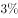

**答案**：C

**官方解析**

A项：定位文字材料可得，2013年全国林产品出口644.55亿美元，同比增长，增幅比上年增加3.18个百分点，则2012年增长率。林产品进口640.88亿美元，同比增加，增幅比上年增加8.58个百分点，则2012年增长率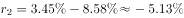。根据间隔增长率公式可得，2013年相较于2011年，林产品出口增长率为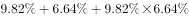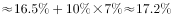。进口增长率为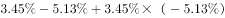。则2011年出口量为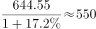，进口量为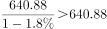，出口小于进口为逆差，错误；

B项：定位文字材料可得，2013年全国林产品出口644.55亿美元，同比增长，其中非木质林产品出口162.3亿美元，同比增加。根据混合口诀“混合居中但不中，偏向基数较大的”可知，2013年木质林产品出口额同比增速，错误；

C项：定位表格可得，2013年胶合板出口1026.34万立方米，同比增长，纤维板出口306.87万立方米，同比增长，刨花板出口27.13万立方米，同比增长。三者同比增长量分别为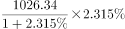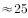万立方米、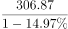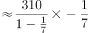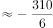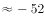万立方米、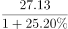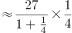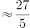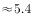万立方米。根据可得，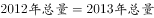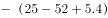，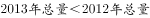，正确；

D项：定位文字材料可得，2013年全国林产品进口640.88亿美元，其中，非木质林产品进口288.80亿美元。则木质林产品进口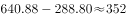亿美元。定位表格可得，2013年木家具进口额7.08亿美元，则2013年木家具进口额占木质林产品进口额的比重为，错误。

故正确答案为C。

---

## 材料 2

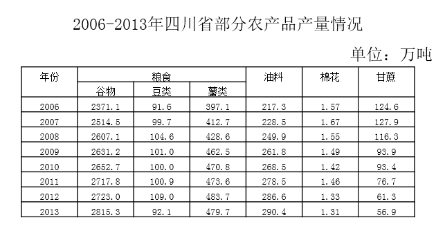

### 第 6 题　qid 2263124 · 综合

2006-2013年，四川省粮食总产量从哪一年开始突破3000万吨？

- **A**. 2006年
- **B**. 2007年　✅
- **C**. 2008年
- **D**. 2009年

**答案**：B

**官方解析**

定位表格材料可得，2006年四川省粮食总产量为。2007年粮食总产量为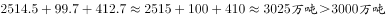，故从2007年开始粮食总产量突破3000万吨。

故正确答案为B。

---

### 第 7 题　qid 2263126 · 增长

下列四项中，2013年产量同比下降幅度最大的是：

- **A**. 豆类　✅
- **B**. 薯类
- **C**. 棉花
- **D**. 甘蔗

**答案**：A

**官方解析**

根据题干“…同比下降幅度最大”，可判定本题为增长率比较问题。定位表格材料可得，2012、2013年各项产量具体数值，根据增长率计算公式，计算出各项增长率进行比较即可。

A项：定位表格材料可得，2012年豆类产量109.0万吨，2013年产量92.1万吨。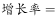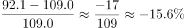；

B项：定位表格材料可得，2012年薯类产量483.7万吨，2013年产量479.7万吨。

C项：定位表格材料可得，2012年棉花产量1.33万吨，2013年产量1.31万吨。

D项：定位表格材料可得，2012年甘蔗产量61.3万吨，2013年产量56.9万吨。

比较可知，下降幅度最大的为豆类。

故正确答案为A。

---

### 第 8 题　qid 2263127 · 增长

下列年份中，油料产量同比增速最快的是哪一年?

- **A**. 2007年
- **B**. 2008年　✅
- **C**. 2009年
- **D**. 2010年

**答案**：B

**官方解析**

根据题干“······同比增速最快”，可判定本题为增长率比较问题。定位表格材料可得，2006-2013年油料产量具体数值，根据增长率计算公式增长率，计算出各年增长率进行比较即可。

A项2007年：定位表格材料可得，2006年油料产量217.3万吨，2007年产量228.5万吨。增长率；

B项2008年：定位表格材料可得，2007年油料产量228.5万吨，2008年产量249.9万吨。增长率；

C项2009年：定位表格材料可得，2008年油料产量249.9万吨，2009年产量261.8万吨。增长率；

D项2010年：定位表格材料可得，2009年油料产量261.8万吨，2010年产量268.5万吨。增长率。

比较可知，同比增速最快的是2008年。

故正确答案为B。

---

### 第 9 题　qid 2263129 · 比重

2013年谷物占粮食总产量的比重与上年相比：

- **A**. 降低了5个百分点
- **B**. 降低了1个百分点
- **C**. 提高了1个百分点　✅
- **D**. 提高了5个百分点

**答案**：C

**官方解析**

根据题干“2013年······占······的比重与上年相比”，可判定本题为两期比重比较问题。定位表格可得，2012年谷物产量2723.0万吨，豆类109.0万吨，薯类483.7万吨，2013年谷物产量2815.3万吨，豆类92.1万吨，薯类479.7万吨。2012年谷物占比为，2013年占比为。，即提高1个百分点。

故正确答案为C。

---

### 第 10 题　qid 2263131 · 综合

关于2006-2013年间四川省部分农产品产量情况，下列说法正确的是：

- **A**. 棉花和甘蔗产量的变化趋势相同
- **B**. 薯类产量最高的年份油料产量也最高
- **C**. 2013年比2006年产量增幅最大的是谷物
- **D**. 谷物产量始终是豆类和薯类产量之和的4倍以上　✅

**答案**：D

**官方解析**

A项：定位表格可得，2011年棉花产量同比上升，甘蔗产量同比下降，两者变化趋势不同，错误；

B项：定位表格可得，薯类产量最高的年份为2012年，油料产量最高的年份为2013年，并不相同，错误；

C项：定位表格可得，2006年谷物产量2371.1万吨，豆类产量91.6万吨，薯类产量397.1万吨，油料产量217.3万吨，棉花产量1.57万吨，甘蔗产量124.6万吨。2013年谷物产量2815.3万吨，豆类产量92.1万吨，薯类产量479.7万吨，油料产量290.4万吨，棉花产量1.31万吨，甘蔗产量56.9万吨。其中豆类产量近乎相等，棉花、甘蔗为负增长，因此只需比较剩余三者。根据可得，谷物增长率为；薯类增长率为，，可知谷物增幅不是最大的，错误；

D项：定位表格可得，2006年谷物产量2371.1万吨，豆类产量91.6万吨，薯类产量397.1万吨。，同理可得，每年谷物产量均高于豆类和薯类产量之和的4倍，正确。

故正确答案为D。

---
