# 2016年423联考《行测》题（江西卷）

> 资料分析 · 20 题 · 江西 2016

## 材料 1

根据以下资料，回答下列问题。

        2015年1-3月，国有企业营业总收入103155.5亿元，同比下降。其中，中央企业收入63191.3亿元，同比下降。地方国有企业收入39964.2亿元，同比下降。

        1-3月，国有企业营业总成本100345.5亿元，同比下降，其中销售费用、管理费用和财务费用同比分别下降、增长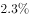和增长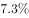。其中，中央企业成本60216.5亿元，同比下降；地方国有企业成本40129亿元，同比下降。

        1-3月，国有企业利润总额4997.3亿元，同比下降。国有企业应交税金9383亿元，同比增长。

        3月末，国有企业资产总额1054875.4亿元，同比增长；负债总额685766.3亿元，同比增长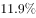；所有者权益合计369109.1亿元，同比增长。其中，中央企业资产总额554658.3亿元，同比增长；负债总额363304亿元，同比增长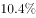；所有者权益为191354.4亿元，同比增长。地方国有企业资产总额500217.1亿元，同比增长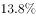；负债总额322462.3亿元，同比增长；所有者权益为177754.7亿元，同比增长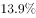。

### 第 1 题　qid 1796340 · 综合

2014年1-3月，国有企业营业总收入最接近：

- **A**. 10.5万亿元
- **B**. 11万亿元　✅
- **C**. 11.5万亿元
- **D**. 12万亿元

**答案**：B

**官方解析**

根据题干中“2014年1~3月”，可以判断本题为基期计算问题。定位文字材料第一段，2015年1~3月，国有企业营业总收入103155.5亿元，同比下降。代入基期公式：=。

故正确答案为B。

---

### 第 2 题　qid 1796336 · 增长

2015年1-3月，在销售费用、管理费用和财务费用中，占国有企业营业总成本的比重同比上升的有几项？

- **A**. 0
- **B**. 1
- **C**. 2
- **D**. 3　✅

**答案**：D

**官方解析**

根据题干中“2015年1-3月······占国有企业营业总成本的比重”，可以判定本题为两期比重问题。只需比较部分量的增长率a和整体量的增长率b，为上升。定位文字材料第二段，销售费用的增长率（下降）、管理费用的增长率（增长）及财务费用的增长率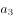（增长）均大于国有企业营业总成本的增长率b（下降），即比重上升；因此，比重上升的有3项。

故正确答案为D。

---

### 第 3 题　qid 1796334 · 比重

2015年3月末，中央企业所有者权益占国有企业总体比重比上年同期约：

- **A**. 下降了0.7个百分点　✅
- **B**. 下降了1.5个百分点
- **C**. 上升了0.7个百分点
- **D**. 上升了1.5个百分点

**答案**：A

**官方解析**

根据题干中“2015年3月”“比上年同期”“占比重”，可以判定本题为两期比重问题。定位文字材料第四段，可以得到中央企业所有者权益为191354.4亿元，同比增长；国有企业所有者权益合计369109.1亿元，同比增长。代入两期比重公式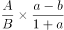，先判断上升还是下降，由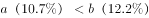可判断为下降，排除C、D两项。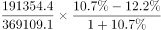&lt;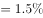，故答案应小于，只有A项满足。

故正确答案为A。

---

### 第 4 题　qid 1796338 · 综合

2015年3月末，中央企业的资产负债率（负债总额÷资产总额）约在以下哪个范围内？

- **A**. 
以下

- **B**. 
-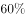

- **C**. 
-
　✅
- **D**. 
以上 

**答案**：C

**官方解析**

根据题干中“2015年3月末······资产负债率（）”，可以判断本题为比值计算问题。参看第四段材料，中央企业负债总额363304亿元，资产总额554658.3亿元，代入资产负债率公式：

。因此在~范围内。

故正确答案为C。

---

### 第 5 题　qid 1796342 · 综合

能够从上述资料中推出的是：

- **A**. 2015年1-3月，中央和地方国有企业营业成本均低于同期营业收入
- **B**. 2014年1-3月，国有企业应交税金占同期营业总收入的一成以上
- **C**. 2015年3月末，国有企业资产总额同比增长不到12万亿元　✅
- **D**. 2015年3月末，地方国有企业资产负债率高于上年同期水平

**答案**：C

**官方解析**

A项，定位文字材料第一段和第二段，2015年1-3月，，成本低于收入；，成本高于收入，错误；

B项，定位文字材料第一段和第三段，2014年1~3月国有企业应交税金占同期营业总收入的比重，不足一成，错误；

C项，定位文字材料第四段，2015年3月末，国有企业资产总额同比增长量=万亿元，正确；

D项，定位文字材料第四段，地方国有企业资产负债率（）是否高于上年同期水平，需要比较负债总额的增长率a与资产总额的增长率b，而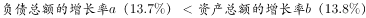，故地方国有企业资产负债率低于上年同期水平，错误。

故正确答案为C。

---

## 材料 2

        2015年2月，我国快递业务量完成8.2亿件，同比增长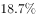；业务收入完成136.0亿元，同比增长。消费者对快递业务进行的申诉中，有效申诉（确定企业责任的）占总申诉量的，为消费者挽回经济损失229.8万元。

        2015年2月，全国每百万件快递业务中，有效申诉量为23.4件，对企业1的每百万件有效申诉量为75.13件，环比增长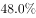，对企业2的每百万件有效申诉量为32.56件，环比增长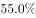，对企业3的每百万件有效申诉量为31.86件，环比增长，对企业4的每百万件有效申诉量为17.81件，环比增长。

### 第 6 题　qid 1797912 · 平均数

2015年2月，平均每笔快递业务的收入在以下哪个范围之内？

- **A**. 低于17元　✅
- **B**. 17～19元
- **C**. 19～21元
- **D**. 高于21元

**答案**：A

**官方解析**

由题干“2015年2月”判断现期，“平均每笔快递业务收入”判断平均数问题，故本题为现期平均数计算问题。定位文字材料第一段“2015年2月份，我国快递业务量完成8.2亿件，业务收入完成136.0亿元”可得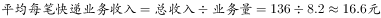。

故正确答案为A。

---

### 第 7 题　qid 1797914 · 综合

2015年2月，消费者对快递业务的全部申诉量约为：

- **A**. 1.96万件　✅
- **B**. 2.36万件
- **C**. 1.96亿件
- **D**. 2.36亿件

**答案**：A

**官方解析**

由题干“2015年2月”判断现期，“消费者对快递业务的全部申诉量”和文字材料第一段“占全部申诉量的”判断本题为现期比重中总量的计算问题。定位文字材料第一段“2015年2月份，快递业务量完成8.2亿件”和文字材料第二段“2015年2月，全国每百万件快递业务中有效申诉量为23.4件”可得，，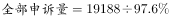，略大于1.9万件，与A项最接近。

故正确答案为A。

---

### 第 8 题　qid 1797916 · 综合

将4家企业按2015年1月每百万件快递业务丢失损毁的有效申诉量从高到低排序，正确的是：

- **A**. 企业2，企业1，企业3，企业4
- **B**. 企业1，企业2，企业3，企业4
- **C**. 企业2，企业1，企业4，企业3
- **D**. 企业1，企业2，企业4，企业3　✅

**答案**：D

**官方解析**

由题干“2015年1月由高到低排序”判断本题为环比基期比较问题，定位第一张表格可得四个企业2015年2月每百万件快递业务丢失损毁有效申诉量现期值，定位第二张表格可得四个企业的环比增速，故企业1、2、3、4的环比基期分别为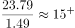、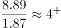、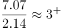、，可得企业1最高，企业3最低，只有D项满足。

故正确答案为D。

---

### 第 9 题　qid 1797918 · 比重

2015年2月4家企业中，有几家企业的投递服务有效申诉量占该企业当月有效申诉量的比重高于上月水平：

- **A**. 1家
- **B**. 2家　✅
- **C**. 3家
- **D**. 4家

**答案**：B

**官方解析**

由题干“2015年2月比重高于上月水平”判断本题为环比两期比重比较问题。定位文字材料第二段可得四个企业的总有效申诉量的环比增长率分比为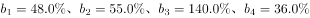；定位第二个表格材料第四列可得四个企业的投递业务有效申诉量环比增长率分别为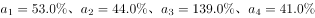。根据两期比重比较公式可得a&gt;b比重上升，可得上述企业中只有，故有2家企业比重上升。

故正确答案为B。

---

### 第 10 题　qid 1797920 · 综合

能够从上述材料推出的是：

- **A**. 2014年2月，全国快递业务完成量为8亿多件
- **B**. 2015年2月，全国每百万件快递业务中，非有效申诉不到1件　✅
- **C**. 2015年2月，四家企业的每百万件快递业务有效申诉量都高于全国水平
- **D**. 2015年2月，企业1的每百万快递业务延误有效申诉量超过任何企业的2倍

**答案**：B

**官方解析**

由题干“能够推出的是”判断本题为综合分析问题。

A项：定位文字材料第一段可得“2015年2月份，快递业务量完成8.2亿件，同比增长”，故2014年2月应为   ，错误；

B项：2015年2月有效申诉量为19188件，，故。根据第一段文字材料可得，故每百万件快递业务中，非有效申诉量，正确；

C项：定位文字材料第二段可得“每百万件快递业务有效申诉量”、、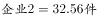、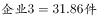、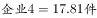，可以看出企业4小于全国平均水平，错误；

D项：定位第一个表格材料，可得，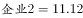，，错误。

故正确答案为B。

---

## 材料 3

### 第 11 题　qid 1796202 · 综合

2015年一季度全国租赁贸易进出口总额较上一季度约：

- **A**. 
增长了

- **B**. 
降低了
　✅
- **C**. 
增长了

- **D**. 
降低了

**答案**：B

**官方解析**

题干要求求出2015年一季度相比上一季度（2014年四季度）的环比增速，可判定此题为一般增长率的计算问题。定位图表可得，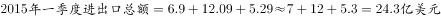；。环比增速=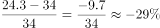，即降低了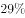，与B项最为接近。

故正确答案为B。

---

### 第 12 题　qid 1796210 · 综合

能够从上述资料中推出的是：

- **A**. 2015年4月全国租赁贸易进出口额比2013年4月翻了一番
- **B**. 2015年1~4月月均全国租赁贸易进出口额超过8亿美元
- **C**. 2013年8~9月全国租赁贸易进出口额超过20亿美元　✅
- **D**. 表中全国租赁贸易进出口额同比下降的月份占总数的三分之一

**答案**：C

**官方解析**

A项：由图形材料可知2015年4月，全国租赁贸易进出口额6.94亿美元，而2014年4月全国租赁贸易进出口额3.39亿美元，同比增长，那么2015年4月全国租赁贸易进出口额是2013年4月的，而非翻一番（2倍），错误；

B项：由图形材料可知2015年1-4月，全国租赁贸易进出口总额分别为6.90、12.09、5.29、6.94亿美元，求平均可得，错误；

C项：由图形材料可知2014年8月和9月，全国租赁贸易进出口额分别为8.57、14.58亿美元，同比增长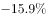、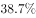，则2013年8—9月的全国租赁贸易进出口额为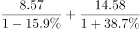亿美元，正确；

D项：由图形材料可得，全国租赁贸易进出口额同比下降的月份为2014年4月、8月、11月及2015年3月，共4个月，而2014年4月-2015年4月共13个月，故占比不到三分之一，错误。

故正确答案为C。

---

### 第 13 题　qid 1796220 · 增长

下列月份中，全国租赁贸易进出口总额环比增速最快的是：

- **A**. 2014年5月
- **B**. 2014年9月
- **C**. 2014年12月　✅
- **D**. 2015年2月

**答案**：C

**官方解析**

由题干“各月环比增速最快的是”可知，本题为一般增长率的比较问题，可直接比较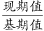的分数大小关系，分数最大则增速最快。根据图形可知各月份进出口总额，故各项环比增速分别为：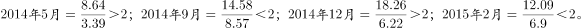。

其中B、D两项明显小于2，排除。，与相比，分子小、分母大，故A项分数较小，则C项较大。

故正确答案为C。

---

### 第 14 题　qid 1796228 · 增长

2014年5月~2015年4月间，全国租赁贸易进出口总额及同比增速均高于上月的月份有几个？

- **A**. 5
- **B**. 6　✅
- **C**. 7
- **D**. 8

**答案**：B

**官方解析**

定位图形材料，全国租赁贸易进出口总额及增长率均高于上月的有2014年5、7、9、12月和2015年2、4月，总共6个月。
故正确答案为B。

---

### 第 15 题　qid 1796248 · 综合

2014年下半年全国租赁贸易进出口总额约为多少亿美元？

- **A**. 55
- **B**. 62
- **C**. 67　✅
- **D**. 74

**答案**：C

**官方解析**

根据图形可知2014年4月－2015年4月各月租赁贸易进出口总额，题干求2014年下半年进出口总额，可判定此题为简单加减计算问题。2014年下半年（7-12月），与C项最接近。

故正确答案为C。

---

## 材料 4

 

### 第 16 题　qid 1796142 · 综合

2014年1~10月我国货物运输总量为多少亿吨？

- **A**. 340.2
- **B**. 353.9　✅
- **C**. 366.5
- **D**. 393.2

**答案**：B

**官方解析**

定位表格，2014年1~11月货物运输总量为393.2亿吨，11月为39.3亿吨，故求2014年1~10月货物运输总量，可判定此题为简单加减计算问题。2014年1~10月我国货物运输总量=393.2-39.3=353.9亿吨。
故正确答案为B。

---

### 第 17 题　qid 1796152 · 比重

2013年11月我国货物周转总量中，水运周转量占比在以下哪个范围之内？

- **A**. 低于40%
- **B**. 40%~50%　✅
- **C**. 50%~60%
- **D**. 高于60%

**答案**：B

**官方解析**

由题干“2013年11月份......水运周转量占比”可知，本题为基期比重问题。定位表格材料，查找数据代入为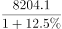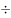，即，略小于，因此水运周转量占比为~。

故正确答案为B。

---

### 第 18 题　qid 1796162 · 综合

关于2014年1~11月我国货物运输状况，能够从上述资料中推出的是：

- **A**. 月均货物运输量约为33亿吨
- **B**. 每吨货物平均运输距离为500多公里
- **C**. 铁路货运量占总体比重低于其货物周转量占总体比重　✅
- **D**. 公路货物周转量同比增量高于水运货物周转量同比增量

**答案**：C

**官方解析**

由题干“能够从上述资料中推出的是”，可知本题为综合分析问题，找出正确选项。

A项，2014年1—11月货物运输总量为393.2亿吨，可知月均货物运输量=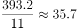亿吨，错误；

B项，每吨货物平均运输距离==，错误；

C项，铁路货运量占总体比重=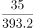&lt;10%，铁路货物周转量占总体比重=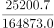&gt;10%，因此铁路货运量占总体比重低于其货物周转量占总体比重，正确；

D项，定位表格货物周转量中公路和水运，2014年1—11月公路货物周转量为55448亿吨公里，增长率为9.8%，2014年1—11月水运货物周转量为84056亿吨公里，增长率为16%，可知水运现期量和增长率均大于公路，根据“大大则大”，水运货物周转量同比增量高于公路货物周转量同比增量，错误。

故正确答案为C。

---

### 第 19 题　qid 1796168 · 综合

2013年1~10月我国货物运输总量最大的领域是：

- **A**. 水运
- **B**. 民航
- **C**. 铁路
- **D**. 公路　✅

**答案**：D

**官方解析**

由题干“2013年1—10月我国货运运输总量最大的领域”可知，本题是基期比较问题，比较各领域1—10月基期货物运输总量即可。观察表格可知，各领域1—11月和11月同比增速相差不大，故本题可直接比较1—10月现期值。铁路运输总量为35.0-3.2=31.8亿吨，公路运输总量为303.6-30.7=272.9亿吨，水路运输总量为54.5-5.4=49.1亿吨，民航运输总量为538.0-55.5=482.5万吨，可明显看出公路272.9亿吨最大。（注意单位换算，1亿吨=10000万吨）
故正确答案为D。

---

### 第 20 题　qid 1796176 · 比重

哪些运输方式在2014年11月的货物运输量占当月货物运输总量的比重超过上年同期水平？

- **A**. 仅铁路
- **B**. 仅公路
- **C**. 铁路和民航
- **D**. 公路和水运　✅

**答案**：D

**官方解析**

由题干“比重超过上年同期水平”可知，本题为两期比重问题，仅需比较a与b的大小关系即可，当a＞b时，比重高于上年同期水平。由表格可知，11月货物运输总量同比增速b=7.1%，铁路同比增速=-6.5%，公路同比增速=8.6%，水运同比增速=7.6%，民航同比增速=3.4%，同比增速高于7.1%的有公路和水运两项。

故正确答案为D。

---
