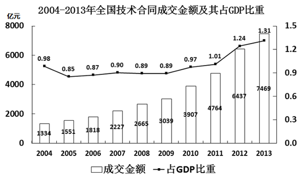
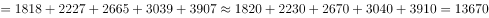
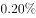
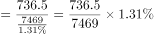
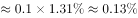
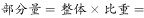
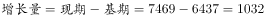
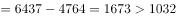

# 2016年上海市公务员录用考试《行测》题（A类）

> 资料分析 · 5 题 · 上海 2016

## 材料 1

 

### 第 1 题　qid 1758918 · 增长

2005-2013年，全国技术合同成交金额增速超过GDP增速的年份有（  ）个。

- **A**. 3
- **B**. 4
- **C**. 5
- **D**. 6　✅

**答案**：D

**官方解析**

根据题干“······增速超过······增速的年份有几个”，结合图1中技术合同成交金额占GDP的比重的数据，可判定本题为两期比重比较问题。根据两期比重比较的结论，当时，比重上升，即比重高于上年水平。定位图1，2005-2013年中，比重高于前一年的分别有：2006、2007、2010、2011、2012、2013年，共有6年。

故正确答案为D。

---

### 第 2 题　qid 1758920 · 综合

“十一五”期间（2006-2010年），全国技术合同成交总金额（  ）。

- **A**. 低于1万亿元
- **B**. 在1～1.5万亿元之间　✅
- **C**. 在1.5～2万亿元之间
- **D**. 高于2万亿元

**答案**：B

**官方解析**

定位图1柱状图，“十一五”期间（2006-2010年）成交总额亿元，即1.367万亿元，符合B项范围。

故正确答案为B。

---

### 第 3 题　qid 1758922 · 综合

2013年新能源与高效节能技术合同成交金额约占当年GDP的（  ）。

- **A**. 

- **B**. 

- **C**. 

　✅
- **D**. 

**答案**：C

**官方解析**

根据题干“2013年······占······”， 可判定本题为现期比重计算问题。定位图2饼状图，2013年新能源与高效节能技术合同金额为736.5亿元，定位图1，2013年全国技术合同成交金额为7469亿元，占GDP的比重为，则2013年的GDP，则题目所求。

故正确答案为C。

---

### 第 4 题　qid 1758924 · 综合

2013年有（  ）个技术领域的技术合同成交金额高于2012年技术合同成交总金额的。

- **A**. 6　✅
- **B**. 4
- **C**. 3
- **D**. 2

**答案**：A

**官方解析**

根据题干“2013年······高于······总金额的的领域有几个”，可判定本题为现期比重计算问题。定位图1柱状图，2012年技术合同成交总金额为6437亿元，则亿元。

定位图2饼状图，可得“环境保护与资源综合利用技术、城市建设与社会发展、新能源与高效节能、先进制造技术、现代交通、电子信息技术”共6项的成交金额大于643.7亿元，满足条件。

故正确答案为A。

---

### 第 5 题　qid 1758926 · 综合

能够从上述资料中推出的是（    ）。

- **A**. 
2005年-2013年，技术合同成交金额同比增量最大的是2013年

- **B**. 
2004年-2013年，技术合同成交金额占GDP比重最高和最低的年份相差4年

- **C**. 
有5个技术领域2013年的技术合同成交金额不足当年电子信息技术合同成交金额的两成

- **D**. 
2013年现代交通技术合同成交金额占当年技术合同成交总金额的比重不到
　✅

**答案**：D

**官方解析**

A项：定位图1柱状图，2013年亿元，2012年增长量亿元，故2013年的增长量不是最大的，错误；

B项：定位图1折线图，占GDP比重最高的年份和最低的年份分别为2013年和2005年，相差8年，错误；

C项：定位图2饼状图，电子信息技术合同成交额为1946.5亿元，其两成为亿元，则成交金额小于389亿元有“其他、农业技术、新材料及其应用、核应用技术”，而“其他”中包含几个技术领域未知，故不能确定2013年技术合同成交金额不足当年电子信息技术合同成交金额的两成的技术领域有5个，错误；

D项：定位图2饼状图，2013年现代交通的成交金额为968.3亿元，定位图1柱状图，2013年技术成交金额为7469亿元，则所求比重，正确。

故正确答案为D。

---
