# 2016年上海市公务员录用考试《行测》题（B类）

> 资料分析 · 15 题 · 上海 2016

## 材料 1

 

### 第 1 题　qid 1758918 · 增长

2005-2013年，全国技术合同成交金额增速超过GDP增速的年份有（  ）个。

- **A**. 3
- **B**. 4
- **C**. 5
- **D**. 6　✅

**答案**：D

**官方解析**

根据题干“······增速超过······增速的年份有几个”，结合图1中技术合同成交金额占GDP的比重的数据，可判定本题为两期比重比较问题。根据两期比重比较的结论，当时，比重上升，即比重高于上年水平。定位图1，2005-2013年中，比重高于前一年的分别有：2006、2007、2010、2011、2012、2013年，共有6年。

故正确答案为D。

---

### 第 2 题　qid 1758920 · 综合

“十一五”期间（2006-2010年），全国技术合同成交总金额（  ）。

- **A**. 低于1万亿元
- **B**. 在1～1.5万亿元之间　✅
- **C**. 在1.5～2万亿元之间
- **D**. 高于2万亿元

**答案**：B

**官方解析**

定位图1柱状图，“十一五”期间（2006-2010年）成交总额亿元，即1.367万亿元，符合B项范围。

故正确答案为B。

---

### 第 3 题　qid 1758922 · 综合

2013年新能源与高效节能技术合同成交金额约占当年GDP的（  ）。

- **A**. 

- **B**. 

- **C**. 

　✅
- **D**. 

**答案**：C

**官方解析**

根据题干“2013年······占······”， 可判定本题为现期比重计算问题。定位图2饼状图，2013年新能源与高效节能技术合同金额为736.5亿元，定位图1，2013年全国技术合同成交金额为7469亿元，占GDP的比重为，则2013年的GDP，则题目所求。

故正确答案为C。

---

### 第 4 题　qid 1758924 · 综合

2013年有（  ）个技术领域的技术合同成交金额高于2012年技术合同成交总金额的。

- **A**. 6　✅
- **B**. 4
- **C**. 3
- **D**. 2

**答案**：A

**官方解析**

根据题干“2013年······高于······总金额的的领域有几个”，可判定本题为现期比重计算问题。定位图1柱状图，2012年技术合同成交总金额为6437亿元，则亿元。

定位图2饼状图，可得“环境保护与资源综合利用技术、城市建设与社会发展、新能源与高效节能、先进制造技术、现代交通、电子信息技术”共6项的成交金额大于643.7亿元，满足条件。

故正确答案为A。

---

### 第 5 题　qid 1758926 · 综合

能够从上述资料中推出的是（    ）。

- **A**. 
2005年-2013年，技术合同成交金额同比增量最大的是2013年

- **B**. 
2004年-2013年，技术合同成交金额占GDP比重最高和最低的年份相差4年

- **C**. 
有5个技术领域2013年的技术合同成交金额不足当年电子信息技术合同成交金额的两成

- **D**. 
2013年现代交通技术合同成交金额占当年技术合同成交总金额的比重不到
　✅

**答案**：D

**官方解析**

A项：定位图1柱状图，2013年亿元，2012年增长量亿元，故2013年的增长量不是最大的，错误；

B项：定位图1折线图，占GDP比重最高的年份和最低的年份分别为2013年和2005年，相差8年，错误；

C项：定位图2饼状图，电子信息技术合同成交额为1946.5亿元，其两成为亿元，则成交金额小于389亿元有“其他、农业技术、新材料及其应用、核应用技术”，而“其他”中包含几个技术领域未知，故不能确定2013年技术合同成交金额不足当年电子信息技术合同成交金额的两成的技术领域有5个，错误；

D项：定位图2饼状图，2013年现代交通的成交金额为968.3亿元，定位图1柱状图，2013年技术成交金额为7469亿元，则所求比重，正确。

故正确答案为D。

---

## 材料 2

 

### 第 6 题　qid 1758928 · 比重

城镇化率是指城镇人口占总人口的比重，2012年我国的城镇化率约为（    ）。

- **A**. 

- **B**. 
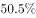

- **C**. 
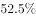
　✅
- **D**. 

**答案**：C

**官方解析**

根据题干“城镇化率是指······占······比重，2012年的城镇化率为······”，可判定本题为现期比重计算问题。定位柱状图1，2012我国城镇人口71182万人，农村人口64222万人，则城镇化率，与C项最接近。

故正确答案为C。

---

### 第 7 题　qid 1758930 · 平均数

如所有数据均为年末数据，则“十一五”期间（2006-2010年），我国平均每年约新增（    ）人口。

- **A**. 不到500万
- **B**. 500多万
- **C**. 600多万　✅
- **D**. 700万以上

**答案**：C

**官方解析**

根据题干“‘十一五’期间，平均每年新增······人口”，结合选项带单位，可判定为年均增长量计算问题。定位柱状图1，2005年的人口总数为（）万人，2010年的总人口为（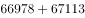）万人，则年均增长量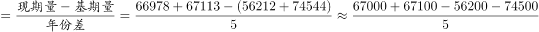，符合C项取值范围。

故正确答案为C。

---

### 第 8 题　qid 1758932 · 综合

2011年，我国的城镇化率处于（    ）类国家的水平。

- **A**. 高收入国家
- **B**. 上中等收入国家
- **C**. 中等收入国家　✅
- **D**. 低收入国家

**答案**：C

**官方解析**

根据题干“2011年我国的城镇化率”，可判定本题为现期比重计算问题。定位图1柱状图，2011年我国的城镇化率。定位表2最后一列，与中等收入国家的城镇化率水平最接近。

故正确答案为C。

---

### 第 9 题　qid 1758934 · 增长

1990-2010年，下列各国中（  ）每万人中城镇人口数量增长最多。

- **A**. 美国
- **B**. 巴西　✅
- **C**. 印度
- **D**. 韩国

**答案**：B

**官方解析**

根据题干“每万人中城镇人口数量增长最多的国家”，结合表格2给出各国的城镇化率，且已知城镇化率为城镇人口在总人口中所占的比重，可判定本题为现期比重问题。每万人中城镇人口数量增长越多的国家，其城镇化率增长就越多。定位表格2,1990-2010年，各国城镇化率的增长幅度如下：

美国：；

巴西：；

印度：；

韩国：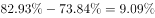。

综上对比可得，巴西的增长最多。

故正确答案为B。

---

### 第 10 题　qid 1758936 · 综合

根据所给资料，下列表述正确的是（  ）。

- **A**. 
2010年起，我国城镇化率首次超过

- **B**. 
韩国城镇化率增量最高是在上世纪80年代
　✅
- **C**. 
1970-2010年，德国的城镇化率每年均比上一年有所增长

- **D**. 
中等收入国家2010年的城镇化率高于上中等收入国家10年前的水平

**答案**：B

**官方解析**

A项：定位图1柱状图，若城镇化率超过，则城镇人口大于乡村人口，观察发现2010年城镇人口数小于乡村人口数，错误；

B项：定位表格2最后一行，1970-1980年，韩国城镇化率增量；1980-1990年，其城镇化率增量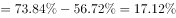；1990-2000年，其城镇化率增量=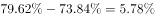；2000-2010年，其城镇化率增量=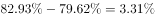，故可判断1980-1990年城镇化率增量最大，正确；

C项定位表格2，观察德国的城镇化率变化趋势，可发现2000年城镇化率为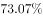低于1990年的城镇化率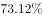，错误；

D项：定位表格2，中等收入国家2010年的城镇化率为，上中等收入国家2000年城镇化率为，前者小于后者，错误。

故正确答案为B。

---

## 材料 3

        2013年全国水稻种植面积达4.55亿亩，比上年增加260多万亩。但由于强降雨及洪涝灾害，总产量较上年减少62万吨，总产量为20361万吨。下图反映的是20082012年我国水稻每亩的产值情况及水稻生产的主要成本构成情况。

注：产值合计等于总成本与净利润之和。

### 第 11 题　qid 1758938 · 增长

2013年我国水稻种植面积比2012年增长约（  ）。

- **A**. 

- **B**. 

　✅
- **C**. 

- **D**. 

**答案**：B

**官方解析**

根据题干“2013年······比2012年增长······”，结合选项为百分数，可判定本题为一般增长率计算问题。定位文字材料第一段，“2013年全国水稻种植面积达4.55亿亩，比上年增加260多万亩”，则所求增长率。 

故正确答案为B。

---

### 第 12 题　qid 1758940 · 综合

2013年我国水稻的亩产约为（    ）千克。

- **A**. 448　✅
- **B**. 455
- **C**. 433
- **D**. 463

**答案**：A

**官方解析**

根据题干“2013年······亩产为······”，可判定本题为现期平均数问题。定位文字材料第一段，“2013年全国水稻种植面积达4.55亿亩······总产量为20361万吨”，则题目所求亩产量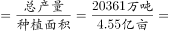千克，与A项最接近。

故正确答案为A。

---

### 第 13 题　qid 1758942 · 综合

2012年生产水稻的人工成本占总成本的百分比约为（    ）。

- **A**. 

- **B**. 

　✅
- **C**. 

- **D**. 

**答案**：B

**官方解析**

根据题干“2012年······占······的百分比为”，可判定本题为现期比重问题。定位表格材料倒数第二列，2012年水稻生产人工成本为426.62元/亩，定位柱状图，2012年产值合计为1340.83元/亩，净利润为285.73元/亩，因为产值合计等于总成本与净利润之和，则2012年的元/亩，则占比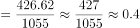，与B项最接近。

故正确答案为B。

---

### 第 14 题　qid 1758944 · 增长

将水稻生产的主要成本按2008-2012年年均增速从高到低排序，下列位次与项目对应正确的是（    ）。

- **A**. 第1：土地
- **B**. 第3：种子
- **C**. 第4：农药
- **D**. 第6：化肥　✅

**答案**：D

**官方解析**

根据题干“2008-2012年年均增速从高到低······”，可判定本题为年均增长率的比较问题。根据年均增长率公式，因年份差n相同，则要想比较r的大小，只需比较的大小即可。定位表格，分别为：种子、化肥、农药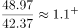、机械作业费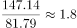、人工成本、土地成本，综上可得，化肥的值最小，即其年均增速最小。

故正确答案为D。

---

### 第 15 题　qid 1758946 · 综合

关于2008-2012年每亩水稻生产的主要成本，下列说法正确的是（    ）。

- **A**. 
从每亩水稻生产成本构成上看，2011-2012年增幅最大的是机械作业费

- **B**. 
2008-2012年，表中各项成本的变化趋势是相同的

- **C**. 
2012年，表中排名前三项的成本总和未超过总成本的

- **D**. 
每亩水稻的生产成本中，种子成本始终是最小的
　✅

**答案**：D

**官方解析**

A项：定位表格2，根据增长率，则机械作业费增长率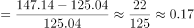，人工成本增长率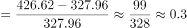，后者大于前者，错误；

B项：定位表格2，要想变化趋势相同，则2008-2012年，每项均呈现增长或者减少趋势，观察发现，在2008-2010期间，种子的成本呈递增趋势，而农药成本呈现先递减后递增的趋势，错误；

C项：定位表格2最后一列，2012年表中排名前三项分别为：人工成本、土地成本、机械作业费，成本之和为元/亩，定位柱状图1，2012年产值合计为1340.83元/亩，净利润为285.73元/亩，因为产值合计等于总成本与净利润之和，则2012年的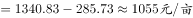，则排名前三的成本总和占总成本的比重=，大于，错误；

D项：定位表格2，纵向观察表中2008-2012年每一年成本的数据，比较发现种子的成本确实是最小的，正确。

故正确答案为D。

---
