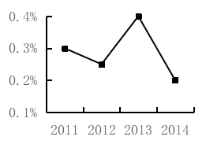
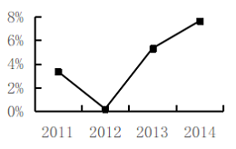

# 2016年上海市行政执法类考试《行测》试题（网友回忆版）

> 资料分析 · 2 题 · 上海 2016

## 材料 1

        2012年，测绘地理信息系统完成测绘服务总值74.92亿元，同比增长15.6%。测绘地理信息系统人均测绘服务总值（人均测绘服务总值）达到292509元，增长17.4%。

### 第 1 题　qid 5703430 · 增长

2007-2012年间，测绘服务总值同比增速最快的年份，其服务总值比上一年约增加了        亿元。

- **A**. 9
- **B**. 10
- **C**. 12
- **D**. 14　✅

**答案**：D

**官方解析**

根据题干“······比上一年约增加了······亿元”，可判定本题为增长量计算问题。定位统计图1可知，2007-2012年间，测绘服务总值同比增速最快的年份是2011年。根据公式：增长量=现期量-基期量，则2011年测绘服务总值的同比增量=64.79-50.74=14.05亿元，与D项最接近。
故正确答案为D。

---

## 材料 2

### 第 2 题　qid 5703514 · 增长

以下        项折线图能准确反映2011-2014年浙江省25-50岁人口同比增速的变化趋势。

- **A**. 

- **B**. 

　✅
- **C**. 

- **D**. 

**答案**：B

**官方解析**

根据题干“······能准确反映······同比增速的变化趋势”，可判定本题为一般增长率问题。定位统计表1可得：2010-2014年，浙江省25-50岁人口数量。根据公式：增长率，可得2011年浙江省25-50岁人口数量同比增速为，观察选项，只有B项满足。

故正确答案为B。

---
