# 2016年北京市公务员录用考试《行测》题

> 资料分析 · 21 题 · 北京 2016

## 材料 1

### 第 1 题　qid 1752588 · 增长

2006—2013年间，有几年的科技人力资源总量较前一年增长超过500万人？

- **A**. 2　✅
- **B**. 3
- **C**. 4
- **D**. 5

**答案**：A

**官方解析**

根据题干“有几年···增长超过500万人”，可判定本题为增长量计算问题。定位图形材料可知：2006年增长，2007年增长，2008年增长，2009年增长，2010年增长，2011年增长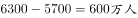，2012年增长，2013年增长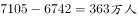。只有2010、2011年满足增长大于500万人，故2006—2013年间，有2年的科技人力资源总量较前一年增长超过500万人。

故正确答案为A。

---

### 第 2 题　qid 1752592 · 增长

下列时间段中，哪个时间段内每万人口中的科技人力资源数年均增速最慢？

- **A**. 2005—2010年
- **B**. 2006—2011年
- **C**. 2007—2012年
- **D**. 2008—2013年　✅

**答案**：D

**官方解析**

根据题干“···年均增速最慢”，可判定本题为年均增长率比较问题。定位图形材料可知：每万人口中科技人力资源数，2005年268人、2006年292人、2007年321人、2008年354人、2009年389人、2010年425人、2011年468人、2012年498人、2013年522人。根据公式：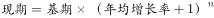，因为各时段间隔年份相同则比较年均增长率大小直接比较现期与基期比值大小即可。

A，2005—2010年：；

B，2006—2011年：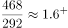；

C，2007—2012年：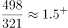；

D，2008—2013年：。根据上述计算可知2008—2013年的年均增速最小。故2008—2013年这个时间段内每万人口中的科技人力资源数年均增速最慢。

故正确答案为D。

---

### 第 3 题　qid 1752596 · 平均数

如图中反映的均为年末数据，则“十一五”（2006—2010年）期间平均每年本科及以上学历科技人力资源增加约多少万人？

- **A**. 150
- **B**. 180　✅
- **C**. 200
- **D**. 440

**答案**：B

**官方解析**

根据题干“平均每年···增加约多少万人”，可判定本题为年均增长量计算问题。定位图形材料可知：本科及以上学历科技人力资源总量2005年1460万人、2010年2353万人。根据年均增长量=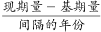（五年规划基期往前推一年），则“十一五”（2006—2010年）期间平均每年本科及以上学历科技人力资源增加约万人。

故正确答案为B。

---

### 第 4 题　qid 1752600 · 比重

与2007年相比，2012年本科及以上学历者占科技人力资源总数的比重约：

- **A**. 上升了20个百分点
- **B**. 上升了2个百分点
- **C**. 下降了20个百分点
- **D**. 下降了2个百分点　✅

**答案**：D

**官方解析**

根据题干“与2007年相比，2012年···占···的比重约变化多少个百分点”，可判定本题为两期比重计算问题。定位图形材料可知：2007年科技人力资源总量4240万人，本科及以上学历科技人力资源总量1810万人；2012年科技人力资源总量6742万人，本科及以上学历科技人力资源总量2745万人。所以本科及以上学历者占科技人力资源比重：2007年为，2012年为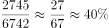，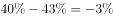，即比重下降3个百分点，与D项最为接近。

故正确答案为D。

---

### 第 5 题　qid 1752606 · 综合

能够从上述资料中推出的是：

- **A**. 2013年每万人口中科技人力资源数同比增速低于上年水平　✅
- **B**. 2013年科技人力资源总量同比增量为2006年以来的最低值
- **C**. 2013年本科及以上学历科技人力资源数比7年前翻了一番
- **D**. 2007年全国人口数超过13.5亿人

**答案**：A

**官方解析**

A项，定位图形材料可知：每万人口中科技人力资源数2011年468人、2012年498人、2013年522人。根据公式：，每万人口中科技人力资源数增速2013年为，2012年为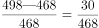，2012年的分子大分母小则2012年的增长率大，即2013年每万人口中科技人力资源数同比增速低于上年水平，正确。

B项，定位图形材料可知：科技人力资源总量2005年3510万人、2006年3840万人、2012年6742万人、2013年7105万人。所以，2013年的科技人力资源总量同比增量是万人，2006年的科技人力资源总量同比增量为万人，低于2013年。故2013年科技人力资源总量同比增量不是2006年以来的最低值，错误。

C项，定位图形材料可知：本科及以上学历科技人力资源数2013年为2943万人，7年前即2006年为1620万人。因为，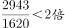，故2013年本科及以上学历科技人力资源数比7年前翻了不足一番，错误。

D项，定位图形材料可知：2007年科技人力资源总量为4240万人，每万人口中科技人力资源数为321人。则总人口数为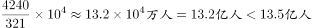，故2007年全国人口数没有超过13.5亿人，错误。

故正确答案为A。

---

## 材料 2

       2015年1—6月民间固定资产投资154438亿元，占全国固定资产投资的比重为，比1—5月下降0.3个百分点。

       分产业看，2015年1—6月第一产业民间固定资产投资4992亿元，同比增长；第二产业77298亿元，增长；第三产业72148亿元，增长。

       第二产业中，工业民间固定资产投资76464亿元，同比增长，增速比1—5月份回落0.4个百分点，其中采矿业3092亿元，下降，降幅比1—5月收窄2.1个百分点；制造业69519亿元，增长，增速回落0.6个百分点；电力、热力、燃气及水生产和供应业3853亿元，增长，增速回落1.4个百分点。

### 第 6 题　qid 1752610 · 综合

2014年1—6月全国固定资产投资约多少万亿元？

- **A**. 14
- **B**. 16
- **C**. 21　✅
- **D**. 24

**答案**：C

**官方解析**

根据题干“2014年1—6月全国固定资产投资约多少万亿元”，结合材料时间2015年1—6月，可判定本题为基期计算问题。定位文字材料第一段，“2015年1—6月民间固定资产投资154438亿元，占全国固定资产投资的比重为”；定位图形材料可知：2015年1—6月全国固定资产投资同比增速为。根据公式：，则2015年1—6月的全国固定资产投资为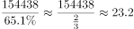万亿元。根据公式：，则2014年1—6月的全国固定资产投资约为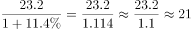万亿元。

故正确答案为C。

---

### 第 7 题　qid 1752612 · 增长

2015年1—6月民间固定资产投资同比增速比上年同期回落多少个百分点？

- **A**. 4.3
- **B**. 5.9
- **C**. 6.7
- **D**. 8.7　✅

**答案**：D

**官方解析**

定位图形材料可知：民间固定资产投资增速2015年1—6月为，2014年1—6月为。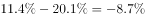，故2015年1—6月民间固定资产投资同比增速比上年同期回落8.7个百分点。

故正确答案为D。

---

### 第 8 题　qid 1752616 · 比重

2015年上半年，三次产业中民间固定资产投资额占全国固定资产投资总额比重高于上年同期水平的有：

- **A**. 第一产业　✅
- **B**. 第二产业
- **C**. 第二产业和第三产业
- **D**. 第一产业和第三产业

**答案**：A

**官方解析**

根据题干“2015年上半年，······占······比重高于上年同期水平”，可判定本题为两期比重比较问题。定位文字材料第二段可知：2015年上半年民间固定资产投资额增长率，第一产业为，第二产业为，第三产业为；定位图形材料可知：2015年上半年全国固定资产投资总额同比增速为。根据两期比重比较技巧：若部分增长率（）大于总体的增长率（），则比重高于上年。观察可得仅第一产业民间固定投资额增长率（）大于全国固定资产投资总额增长率（）。故2015年上半年，三次产业中民间固定资产投资额占全国固定资产投资总额比重高于上年同期水平的只有第一产业。

故正确答案为A。

---

### 第 9 题　qid 1752622 · 综合

与2013年上半年相比，2015年上半年全国固定资产投资约上升了：

- **A**. 

- **B**. 

- **C**. 

- **D**. 

　✅

**答案**：D

**官方解析**

根据题干“与2013年上半年相比，2015年上半年······约上升了”，结合选项为百分数，可判定本题为间隔增长率计算问题。定位图形材料可知：全国固定资产投资增长率2015年上半年为,2014上半年为。根据间隔增长率公式：，可得与2013年上半年相比，2015年上半年全国固定资产投资约上升了，只有D项满足。

故正确答案为D。

---

### 第 10 题　qid 1752634 · 综合

根据资料，下列说法正确的是：

- **A**. 
2015年3—6月，各月的全国固定资产累计投资额同比增速逐月递减

- **B**. 
2015年6月民间固定资产投资占全国固定资产投资的比重小于
　✅
- **C**. 
2015年1—4月民间固定资产投资同比增速比1—3月回落1.5个百分点

- **D**. 
2015年1—5月采矿业民间固定资产投资同比增速比制造业低1.3个百分点

**答案**：B

**官方解析**

A项，定位图形材料可知：2015年全国固定资产投资额1—3月增长率为，1—4月增长率为，1—5月增长率为，1—6月增长率为。可以看出5月的全国固定资产累计投资额同比增速（即1-5月增长率）与6月的累计增速均为，故2015年3—6月，各月的全国固定资产累计投资额同比增速非逐月递减，错误。

B项，定位文字材料第一段可知：民间固定资产投资占全国固定资产投资的比重2015年1—6月为，比1—5月下降0.3个百分点。故1—5月民间固定资产投资占全国固定资产投资的比重为。根据混合比重居中的结论：混合后的比重在中间，则2015年6月比重一定小于，正确。

C项，定位图形材料可知：民间固定资产投资2015年1—4月增速为，1—3月增速为。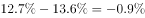，故2015年1—4月民间固定资产投资同比增速比1—3月回落0.9个百分点，错误。

D项，定位文字材料第三段，“其中采矿业3092亿元，下降，降幅比1—5月收窄2.1个百分点；制造业69519亿元，增长，增速回落0.6个百分点”。故2015年1—5月采矿业民间固定资产投资降幅为，制造业增幅为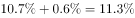，则2015年1—5月采矿业民间固定资产投资同比增速比制造业低，错误。

故正确答案为B。

---

## 材料 3

        2015年1-5月，B区规模以上文化创意产业完成收入46.2亿元，比上年同期增长10.8%，比1-4月增幅收窄0.8个百分点，从业人员平均人数1.3万人，比上年同期下降2.4%。

        1-5月，B区规模以上文化创意产业实现利润总额-0.4亿元，亏损额比1-4月略有扩张，亏损额同比略有收窄。其中，新闻出版亏损额进一步扩大，实现利润总额-0.3亿元，比上年同期亏损额增加0.2亿元；软件、网络及计算机服务受个别企业业务整合的影响，降幅较大，实现利润0.2亿元，同比下降81.3%；其他辅助服务亏损额大幅收窄，实现利润-0.1亿元，亏损额同比减少1.1亿元。

        截止到5月底，B区规模以上文化创意产业规模较小，法人单位只有84家，仅占全市的1.0%；大型企业匮乏，收入达亿元企业只有8家，中小型企业居多。

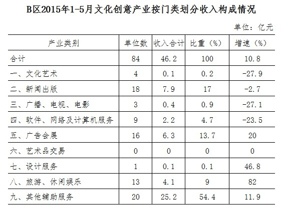

### 第 11 题　qid 1752640 · 平均数

2015年1-5月B区规模以上文化创意产业从业人员人均完成收入约比上年同期增长：

- **A**. 2.5%
- **B**. 8.4%
- **C**. 10.8%
- **D**. 13.4%　✅

**答案**：D

**官方解析**

根据题干“2015年1-5月······人均完成收入约比上年同期增长”，结合选项为百分数，可判定本题为平均数增长率计问题。定位文字材料第一段可得：2015年1-5月，B区规模以上文化创意产业完成收入46.2亿元（A），比上年同期增长（a）；从业人员平均人数1.3万人（B），比上年同期下降（b）。根据公式：平均数的增长率=，可得题目所求为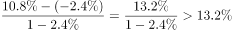，只有D项满足。

故正确答案为D。

---

### 第 12 题　qid 1752642 · 平均数

该区规模以上文化创意产业中，以下哪个领域2015年1-5月平均每个单位创造的收入为各选项中最低？

- **A**. 新闻出版
- **B**. 广告会展
- **C**. 软件、网络及计算机服务　✅
- **D**. 旅游、休闲娱乐

**答案**：C

**官方解析**

根据题干“······2015年1-5月平均······最低”，结合材料时间为2015年1-5月，可判定本题为现期平均数问题。定位统计表可知选项各领域2015年1-5月单位数及收入合计。根据公式：平均数，则各选项平均每个单位创造的收入分别为：

新闻出版：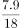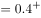亿元；

广告会展：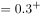亿元；

软件、网络及计算机服务：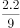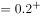亿元；

旅游、休闲娱乐：亿元。

比较可知，软件、网络及计算机服务平均每个单位创造的收入为各选项中最低。

故正确答案为C。

---

### 第 13 题　qid 1752646 · 综合

2014年1-5月B区其他辅助服务产业亏损约是新闻出版业的多少倍？

- **A**. 0.3
- **B**. 2.4
- **C**. 5.5
- **D**. 12.0　✅

**答案**：D

**官方解析**

根据题干“2014年1-5月······是······的多少倍”，结合材料时间2015年1-5月，可判定本题为基期倍数问题。定位文字材料第二段可得：2025年1-5月，新闻出版亏损额进一步扩大，实现利润总额-0.3亿元，比上年同期亏损额增加0.2亿元；其他辅助服务亏损额大幅收窄，实现利润-0.1亿元，亏损额同比减少1.1亿元。则2014年1-5月B区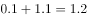亿元，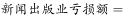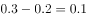亿元。故2014年1-5月B区其他辅助服务产业亏损额约是新闻出版业的倍。

故正确答案为D。

---

### 第 14 题　qid 1752650 · 增长

文化创意产业九大领域中，2015年1-5月收入增速最快的三个领域共有多少家单位？

- **A**. 16
- **B**. 30　✅
- **C**. 39
- **D**. 54

**答案**：B

**官方解析**

定位统计表可得：2015年1-5月收入增速最快的三个领域为旅游、休闲娱乐（）、设计服务（）和广告会展（），它们的单位数依次为13、1、16。故文化创意产业九大领域中，2015年1—5月收入增速最快的三个领域共有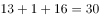家单位。

故正确答案为B。

---

### 第 15 题　qid 1752654 · 综合

根据上述材料，下列推断中正确的一项是

- **A**. 2015年1-5月该区广告会展业收入同比增长了1亿多元　✅
- **B**. 2015年5月底全市规模以上文化创意产业法人单位超过9000家
- **C**. 2015年1-5月该区收入超过亿元的企业中有的来自广播、电视、电影业
- **D**. 2015年5月该区平均每家规模以上文化创意产业法人单位拥有200多名从业人员

**答案**：A

**官方解析**

A项，定位统计表可得：2015年1-5月该区广告会展收入6.3亿元，增长率为。根据公式：，可得2015年1-5月该区广告会展业收入同比增长了亿元，正确；

B项，定位文字材料第三段可得：“截止到5月底，B区规模以上文化创意产业规模较小，法人单位只有84家，仅占全市的”。根据公式：，2015年5月底全市规模以上文化创意产业法人单位=，错误；

C项，定位统计表可得：2015年1-5月，该区广播、电视、电影业收入合计0.4亿元，未超过亿元，故2015年1-5月该区收入超过亿元的企业不可能来自广播、电视、电影业，错误；

D项，定位文字材料第三段可得：截止到5月底，B区规模以上文化创意产业规模较小，法人单位只有84家。但材料并未给出5月份该区规模以上文化创意产业从业人数，故无法求得2015年5月该区平均每家单位从业人员数量，错误。

故正确答案为A。

---

## 材料 4

        2015年7月，D市共监测电视、广播、平面和重点网络媒体首页页面广告297207条次，涉嫌违法广告594条次，广告涉嫌违法率为0.20%，比6月下降0.07个百分点。

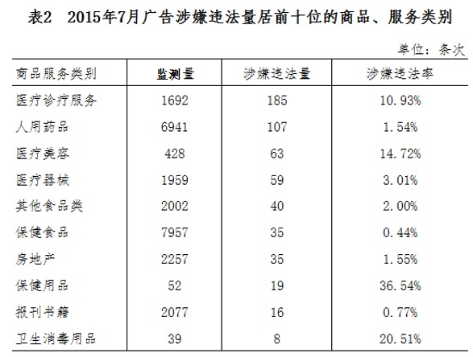

### 第 16 题　qid 1752658 · 平均数

2015年7月，平均每日监测到平面媒体涉嫌违法广告约多少条次？

- **A**. 16　✅
- **B**. 17
- **C**. 19
- **D**. 20

**答案**：A

**官方解析**

根据题干“2015年7月，平均···约多少条次”，结合材料时间2015年7月，可判定本题为现期平均数计算问题。定位表格材料1可知：2015年7月，平面媒体涉嫌违法量为496条次。常识可知7月份为31天，则平均每日为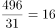条次。

故正确答案为A。

---

### 第 17 题　qid 1752662 · 综合

表1中“？”处应当填写的数字是（  ）。

- **A**. 0.005%
- **B**. 0.02%　✅
- **C**. 0.04%
- **D**. 0.08%

**答案**：B

**官方解析**

根据题干“表1中‘？’处应当填写的数字是”，结合材料“？”处表示2015年7月广播涉嫌违法率即涉嫌违法量占监测量的比重，可判定本题为现期比重计算问题。定位表格材料1可知：2015年7月广播监测量为63299条次，涉嫌违法量为10条次。因为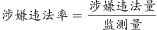，故“？”=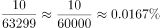，与B最接近。

故正确答案为B。

---

### 第 18 题　qid 1752664 · 综合

在2015年7月广告涉嫌违法量居前十位的商品、服务类别中，有几类的涉嫌违法率高于10%？（  ）

- **A**. 1
- **B**. 2
- **C**. 3
- **D**. 4　✅

**答案**：D

**官方解析**

定位表格材料2可知：涉嫌违法率高于的有医疗诊疗服务（）、医疗美容（）、保健用品（）、卫生消毒用品（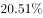），共4类。

故正确答案为D。

---

### 第 19 题　qid 1752666 · 综合

2015年7月广告涉嫌违法量居前十位的商品、服务类别中，监测量最多的3个类别涉嫌违法量之和约占所有广告总涉嫌违法量的（  ）。

- **A**. 一成左右
- **B**. 两成左右
- **C**. 三成左右　✅
- **D**. 四成左右

**答案**：C

**官方解析**

根据题干“2015年7月······占所有广告总涉嫌违法量的”，结合材料时间2015年7月，可判定本题为现期比重计算问题。定位表格材料2可知：监测量最多的3个类别为保健食品（7957条次），涉嫌违法量为35条次；人用药品（6941条次），涉嫌违法量为107条次；房地产（2257条次），涉嫌违法量为35条次。故2015年7月广告涉嫌违法量居前十位的商品、服务类别中，监测量最多的3个类别涉嫌违法量之和约占所有广告总涉嫌违法量的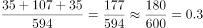，即三成左右。

故正确答案为C。

---

### 第 20 题　qid 1752672 · 综合

能够从上述资料中推出的是（  ）。

- **A**. 2015年6月，广告涉嫌违法率为0.13%
- **B**. 2015年7月，电视广告监测量占广告总监测量的四成多
- **C**. 2015年7月，大部分涉嫌违法的医疗诊疗服务广告出现在非电视媒体中　✅
- **D**. 2015年7月，表2中监测量最低的商品、服务类别广告涉嫌违法率约为监测量最高者的14倍

**答案**：C

**官方解析**

A项，定位文字材料第一段，“2015年7月，D市共监测······广告涉嫌违法率为0.20%，比6月下降0.07个百分点”。故2015年6月，广告涉嫌违法率为，错误；

B项，定位文字材料第一段，“2015年7月，D市共监测电视、广播、平面和重点网络媒体首页页面广告297207条次”；定位表格材料1可知：2015年7月，D市电视监测量为157860条次。故2015年7月，电视广告监测量占广告总监测量的比值为

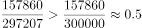，即约五成，错误；

C项，定位表格材料1、2可知：2015年7月，电视广告涉嫌违法量为88条次，涉嫌违法的医疗诊疗服务广告为185条次。，所以即使电视广告的违法量全部为医疗诊疗服务广告，占比也不到一半。故2015年7月，大部分涉嫌违法的医疗诊疗服务广告出现在非电视媒体中，正确；

D项，定位表格材料2可知：2015年7月，表2中监测量最低的商品、服务类别为卫生消毒用品（39条次），涉嫌违法率为；监测量最高者为保健食品（7957条次），涉嫌违法率为。故2015年7月，表2中监测量最低的商品、服务类别广告涉嫌违法率约为监测量最高者的倍，错误。

故正确答案为C。

---

### 第 21 题　qid 1752502 · 倍数

甲和乙两个公司2014年的营业额相同。2015年乙公司受店铺改造工程影响，营业额比上年下降300万元。而甲公司则引入电商业务，营业额比上年增长600万元，正好是乙公司2015年营业额的3倍。则2014年两家公司的营业额之和为多少万元？

- **A**. 900
- **B**. 1200
- **C**. 1500　✅
- **D**. 1800

**答案**：C

**官方解析**

设2014年两家公司营业额均为x万元，由题意可得万元，解得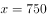，则2014年两家公司营业额之和为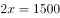万元。

故正确答案为C。

---
