# 2016年吉林省公务员录用考试《行测》题（乙级）

> 资料分析 · 10 题 · 吉林 2016

## 材料 1

        A市统计局在该市范围内做了一项调查，抽取了5000名18到70周岁且在2015年有过网购经历的居民，结果显示：受访者2015年人均网购次数为19.4次。从分组情况看，有三类人群使用网购相对频繁：一是年轻群体，35岁以下的受访者人均网购次数为25.5次；二是较高学历群体，文化程度为大学本科及以上学历和大专学历的受访者人均网购次数分别是27.3次和21.8次；三是中高收入群体，个人月收入为10000元以上和5000到10000元的受访者人均网购次数分别是31.0次和26.0次。此外，女性受访者人均网购次数为21.1次，比男性受访者高出3.8次。2015年该市网购9类主要商品和服务的受访者占比情况如下图。

### 第 1 题　qid 2022276 · 综合

2015年，在A市中，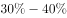受访者网购的商品和服务项目是：

- **A**. 化妆品、缴费充值类　✅
- **B**. 保健类、汽车用品类
- **C**. 缴费充值类、旅游类
- **D**. 化妆品、电子产品类

**答案**：A

**官方解析**

定位图形材料，占比在之间的商品和服务项目只有化妆品类和缴费充值类。

故正确答案为A。

---

### 第 2 题　qid 2022282 · 比重

受访者中男性所占比例约为：

- **A**. 
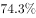

- **B**. 

- **C**. 

- **D**. 

　✅

**答案**：D

**官方解析**

题干所求为“男性所占比例”，材料给出人均网购次数和男、女各自的平均网购次数，故本题为比值计算问题。定位文字材料，“受访者2015年人均网购次数为19.4次”，“女性受访者人均网购次数为21.1次，比男性受访者高出3.8次”，所以男性网购次数为次，利用线段法求解男女比为，男性占1.7份，女性占2.1份，所以男性占总人数的比例为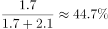。

故正确答案为D。

---

### 第 3 题　qid 2022286 · 综合

受访者中，在2015年网购化妆品的人数约为网购旅游服务人数的：

- **A**. 1.0倍
- **B**. 1.5倍
- **C**. 2.3倍　✅
- **D**. 2.5倍

**答案**：C

**官方解析**

题干所求为“2015年······是······的多少倍”，可知本题为现期倍数计算问题。定位图形材料，2015年网购化妆品的人数占总数的，网购旅游服务人数占总数的，总人数一定，所以2015年网购化妆品的人数是网购旅游服务人数的倍。

故正确答案为C。

---

### 第 4 题　qid 2022288 · 平均数

下列群体中，2015年人均网购次数最少的是：

- **A**. 35岁以下的受访者
- **B**. 男性受访者　✅
- **C**. 个人月收入为10000元以上的受访者
- **D**. 大专学历的受访者

**答案**：B

**官方解析**

A项：35岁以下的受访者人均网购次数为25.5次；

B项：定位文字材料，“女性受访者人均网购次数为21.1次，比男性受访者高出3.8次”，所以男性网购次数为次；

C项：个人月收入为10000元以上的受访者人均网购次数为31.0次；

D项：大专学历的受访者人均网购次数为21.8次。

所以最少的是男性受访者。

故正确答案为B。

---

### 第 5 题　qid 2022292 · 综合

不能从上述资料推出的一项是：

- **A**. 受访者中在2015年网购了缴费充值服务的人数是1840人
- **B**. 2015年该市男性受访者人均网购次数为17.3次
- **C**. 2015年该市网购服饰类、保健类的受访者占受访者之比的差是28.4个百分点
- **D**. 2015年该市大专及以上学历受访者的人均网购次数是24.6次　✅

**答案**：D

**官方解析**

A项：2015年网购了缴费充值服务的人数占总数的，总人数为5000人，所以网购了缴费充值服务的人数为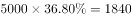人，正确；

B项：定位文字材料，“女性受访者人均网购次数为21.1次，比男性受访者高出3.8次”，所以男性网购次数为次，正确；

C项：2015年该市网购服饰类的受访者占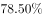，保健类的占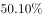，两者差为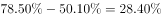，即28.4个百分点，正确；

D项：文字材料给出大专学历受访者和本科及以上受访者的人均网购次数，但是没有给出具体人数，所以无法推出两者合并后的人均网购次数，错误。

本题为选非题，故正确答案为D。

---

## 材料 2

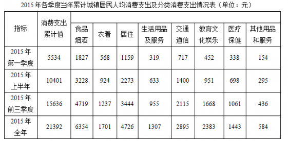

### 第 6 题　qid 2022294 · 平均数

2015年，城镇居民人均消费支出最少的季度是：

- **A**. 第一季度
- **B**. 第二季度　✅
- **C**. 第三季度
- **D**. 第四季度

**答案**：B

**官方解析**

定位图表可得，2015年各季度城镇居民人均消费支出分别为：

第一季度：5534；第二季度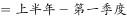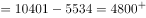；第三季度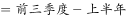；第四季度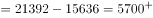。支出最少的季度为第二季度，B项当选。

故正确答案为B。

---

### 第 7 题　qid 2022296 · 平均数

2015年第一季度，八类消费中占城镇居民人均消费支出比重超过的有：

- **A**. 1个
- **B**. 2个
- **C**. 3个
- **D**. 4个　✅

**答案**：D

**官方解析**

定位表格，2015年第一季度城镇居民人均支出为5534元，其为553.4元，则仅需在表格八类消费中找出支出超过553.4元的即可。观察可得，食品烟酒、衣着、居住及交通通信四项满足。

故正确答案为D。

---

### 第 8 题　qid 2022298 · 综合

2015年第二季度，四类消费支出从小到大的排序是：

- **A**. 生活用品及服务    医疗保健    教育文化娱乐    衣着
- **B**. 生活用品及服务    衣着    医疗保健    教育文化娱乐　✅
- **C**. 衣着    生活用品及服务    医疗保健    教育文化娱乐
- **D**. 生活用品及服务    衣着   教育文化娱乐    医疗保健

**答案**：B

**官方解析**

定位图表，第二季度生活用品及服务的消费支出元；衣着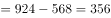元；医疗保健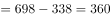元；教育文化娱乐元。支出最小的为生活用品及服务，最大的为教育文化娱乐，满足从小到大的排序为B项。

故正确答案为B。

---

### 第 9 题　qid 2022300 · 平均数

2015年，消费支出占城镇居民人均消费支出比重四个季度持续下降的一类是：

- **A**. 食品烟酒消费支出占比　✅
- **B**. 居住消费支出占比
- **C**. 交通通信消费支出占比
- **D**. 教育文化娱乐消费支出占比

**答案**：A

**官方解析**

题干所求为“各项比重占人均消费支出比重持续下降的一类”，又因为材料所给数据为各季度累计情况，可判定此题为混合比重问题。通过一季度和上半年数据，可快速比较一季度和二季度的升降关系，排除选项。

定位表格可得：

A项：食品烟酒消费支出第一季度比重，上半年比重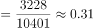，第一季度和第二季度混合为上半年，混合比重大小居中，第一季度比重＞上半年比重，所以上半年比重＞第二季度比重，故第一季度比重＞第二季度比重，符合下降；

B项：居住消费支出第一季度比重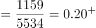，上半年比重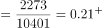，同理，第一季度比重＜上半年比重，所以第一季度比重＜第二季度比重，第二季度比重上升，排除；

C项：交通通信消费支出第一季度比重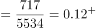，上半年比重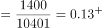，同理，第一季度比重＜上半年比重，所以第一季度比重＜第二季度比重，第二季度比重上升，排除；

D项：教育文化娱乐消费支出第一季度比重，上半年比重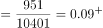，同理，第一季度比重＜上半年比重，所以第一季度比重＜第二季度比重，第二季度比重上升，排除。

通过第一季度与第二季度比较，可以排除B、C、D三项。

故正确答案为A。

---

### 第 10 题　qid 2022302 · 综合

2015年，能够从上述资料推出的是：

- **A**. 
全年生活用品及服务不到居住消费支出的三分之一 
　✅
- **B**. 
医疗保健消费支出第一季度最高，第四季度最低

- **C**. 
教育支出四个季度平均增速慢于交通通信消费支出 

- **D**. 
全年居住消费支出不到食品烟酒消费支出的

**答案**：A

**官方解析**

根据图表，找出说法正确的一项。

A项：，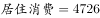，，则生活用品及服务低于居住消费的，说法正确；

B项：医疗保健消费，第一季度为338元，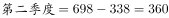。第一季度并非最高，说法错误；

C项：选项中的主体为“教育支出”，表中主体为“教育文化娱乐”，主体不同，无法推出，说法错误；

D项：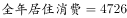，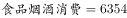，，全年居住消费支出高于食品烟酒消费支出的，说法错误。

故正确答案为A。

---
