# 2016年吉林省公务员录用考试《行测》题（甲级）

> 资料分析 · 10 题 · 吉林 2016

## 材料 1

        2016年8月份，全国一般公共预算收入9894亿元，同比增长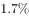。其中，中央一般公共预算收入4797亿元，同比增长，同口径下降；地方一般公共预算本级收入5097亿元，同比增长1%，同口径增长。全国一般公共预算收入中的税收收入7680亿元，同比增长，非税收入2214亿元，同比增长。

        2016年1-8月累计，全国一般公共预算收入110178亿元，同比增长。其中，中央一般公共预算收入49711亿元，同比增长，同口径增长；地方一般公共预算本级收入60467亿元，同比增长，同口径增长。全国一般公共预算收入中的税收收入92637亿元，同比增长。

### 第 1 题　qid 2021888 · 增长

以下同比增速最快的是：

- **A**. 2016年8月份全国一般公共预算收入同比增速
- **B**. 2016年1-8月累计全国一般公共预算收入同比增速　✅
- **C**. 2016年1-8月累计中央一般公共预算收入同比增速
- **D**. 2016年8月份中央一般公共预算收入同比增速

**答案**：B

**官方解析**

定位文字材料可知，2016年8月份全国一般公共预算收入同比增速；2016年1-8月累计全国一般公共预算收入同比增速；2016年1-8月累计中央一般公共预算收入同比增速；2016年8月份中央一般公共预算收入同比增速。增速最快的为2016年1-8月累计全国一般公共预算收入。

故正确答案为B。

---

### 第 2 题　qid 2021892 · 比重

2016年8月，全国一般公共预算收入占1-8月累计数比重约为：

- **A**. 8%
- **B**. 11%
- **C**. 10%
- **D**. 9%　✅

**答案**：D

**官方解析**

由题干“2016年8月······占······比重”，可知本题为现期比重问题。定位文字材料，2016年8月份，全国一般公共预算收入9894亿元；2016年1-8月累计，全国一般公共预算收入110178亿元。由现期比重公式可知，占比为。

故正确答案为D。

---

### 第 3 题　qid 2021896 · 综合

2015年1-7月，中央一般公共预算收入约为：

- **A**. 4.2万亿元
- **B**. 4.8万亿元
- **C**. 4.5万亿元
- **D**. 4.3万亿元　✅

**答案**：D

**官方解析**

由题干“2015年1-7月，中央一般公共预算收入”，同时材料给出了2016年8月和1-8月中央一般公共预算收入，据此可知本题为基期和差问题。定位材料可知，2016年8月中央一般公共预算收入为4797亿元，同比增长；2016年1-8月累计中央一般公共预算收入49711亿元，同比增长。由基期计算公式可得，2015年1-7月中央一般公共预算收入约为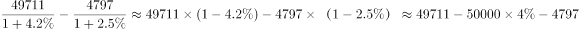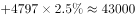亿元。

故正确答案为D。

---

### 第 4 题　qid 2021904 · 增长

2016年1-8月累计，全国一般公共预算收入中非税收入同比：

- **A**. 
增长

- **B**. 
下降

- **C**. 
下降
　✅
- **D**. 
增长 

**答案**：C

**官方解析**

由题干“全国一般公共预算收入中非税收入同比”，同时选项为百分数，可知本题为混合增长率计算问题。定位材料可知，2016年1-8月累计，全国一般公共预算收入110178，同比增长6%；税收收入92637，同比增长7.3%。非税收入为。由混合增长率公式可知，一般用现期量近似代替基期量，量之比为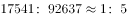，距离之比为x：（7.3%-6%）=x：1.3%，距离与量成反比，则5：1= x：1.3%，x=6.5%，6%-6.5%=-0.5%，故同比下降0.5%，与C项最接近。

故正确答案为C。

---

### 第 5 题　qid 2021916 · 综合

能够从上述资料推出的是：

- **A**. 
2016年1-7月，地方一般公共预算本级收入同比增速小于

- **B**. 
2016年1-8月，非税收入占全国一般公共预算收入比重同比增加

- **C**. 
2016年1-8月，月平均全国一般公共预算收入超过8月份
　✅
- **D**. 
2015年8月，全国一般公共预算收入中非税收入不到2000亿元

**答案**：C

**官方解析**

A项：2016年8月份，地方一般公共预算本级收入同比增长；2016年1-8月累计，地方一般公共预算本级收入同比增长。由混合增长率居中原则可知，2016年1-7月，地方一般公共预算本级收入同比增速大于，错误；

B项：2016年1-8月，全国一般公共预算收入同比增长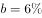，税收收入同比增长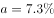，由两期比重公式可知，，故税收收入占比同比增加，则非税收收入占比同比减少，错误；

C项：2016年1-8月累计，全国一般公共预算收入110178亿元，则月平均为，大于8月份的9894，正确；

D项：定位材料首段末句，2016年8月非税收入2214亿元，同比增长，由基期计算公式可知，2015年8月非税收入为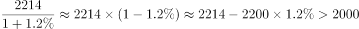，错误。

故正确答案为C。

---

## 材料 2

        国家信息中心近日发布的《中国信息社会发展报告2015》显示，2015年全国信息社会指数达到0.4351。从四个重点领域看，数字生活发展最快，2015年全国数字生活指数达到0.5038，同比增长。

### 第 6 题　qid 2021918 · 综合

2011-2015年间，中国各领域信息社会指数中出现起伏变化的是：

- **A**. 全国信息经济指数
- **B**. 数字生活指数
- **C**. 全国信息社会指数
- **D**. 在线政府指数　✅

**答案**：D

**官方解析**

定位表格可知，2011-2015年间，A项全国信息经济指数持续升高，B项数字生活指数持续升高，C项全国信息社会指数持续升高，D项在线政府指数先下降后升高。只有D项数据出现起伏变化。
故正确答案为D。

---

### 第 7 题　qid 2021920 · 增长

2015年与2011年相比，我国数字生活指数提高了近：

- **A**. 1.5倍
- **B**. 0.7倍　✅
- **C**. 1.7倍
- **D**. 0.5倍

**答案**：B

**官方解析**

由题干“提高了”且选项无单位可知，本题考查增长率计算问题。定位表格，2015年数字生活指数为0.5038，2011年数字生活指数为0.3015。依据增长率计算公式，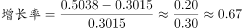，与B项最接近。

故正确答案为B。

---

### 第 8 题　qid 2021922 · 综合

图中数据显示，东中西部各领域信息社会指数差距最大的是：

- **A**. 信息经济指数
- **B**. 网络社会指数
- **C**. 数字生活指数　✅
- **D**. 在线政府指数

**答案**：C

**官方解析**

各领域中，均是东部地区指数最大，西部地区指数最小。故直接用东部-西部就得出差距。

信息经济指数：；网络社会指数：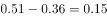；在线政府指数：；数字生活指数：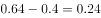。差距最大的是数字生活指数。

故正确答案为C。

---

### 第 9 题　qid 2021926 · 综合

资料显示，2015年西部地区各类指数与全国水平相差的最大值是：

- **A**. 0.1038　✅
- **B**. 0.0833
- **C**. 0.1362
- **D**. 0.0938

**答案**：A

**官方解析**

信息社会指数：；信息经济指数：；网络社会指数：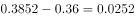；在线政府指数；数字生活指数：。差距最大的是数字生活指数，差距为0.1038。

故正确答案为A。

---

### 第 10 题　qid 2021928 · 综合

下列说法错误的是：

- **A**. 2011-2015年间，从四个重点领域看，发展最慢的是在线政府指数
- **B**. 2015年信息社会指数及四大领域指数变化中中部地区处于中等水平
- **C**. 2011-2015年间，从四个重点领域看，数字生活发展最快
- **D**. 2015年，在信息社会指数及各领域变化中东部地区低于全国平均水平　✅

**答案**：D

**官方解析**

A项：定位表格材料，在线政府指数的增长量最小（0.0419），而其基期量最大，所以发展最慢的是在线政府指数，正确；

B项：定位图表中部地区的，中部地区各指数均小于东部地区，大于等于西部地区，所以中部处于中等水平，正确；

C项：发展最快即增速最大，定位表格材料，给出了四个重点领域（全国信息经济指数、网络社会发展指数、在线政府指数、数字生活指数）2011、2015年的数据。根据增长率可得四个领域增速分别为：全国信息经济指数：；网络社会发展指数：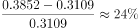；在线政府指数：；数字生活指数：，因此数字生活发展最快，正确；

D项：对比表格最后一行数据和图表中东部数据，东部地区的信息社会指数及各领域指数均高于全国，错误。

本题为选非题，故正确答案为D。

---
