# 2016年四川省公务员录用考试《行测》题（下半年）

> 资料分析 · 15 题 · 四川 2016

## 材料 1

        2015年，某市非公有制经济实现增加值348.12亿元，比上年净增加23.69亿元，非公有制经济增加值占GDP的比重为。其中，民营经济增加值335.24亿元，外商经济增加值11.84亿元，港澳台经济增加值1.04亿元，分别比“十一五”末（2010年）增长、和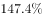。

        2015年，非公有制经济第一、二、三产业结构之比由上年的调整为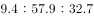。与“十一五”末相比，第一、三产业比重下降了3.9和3.5个百分点，第二产业比重上升了7.4个百分点。在第二产业中，工业增加值占非公有制经济增加值比重为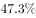，比“十一五”末提高7.8个百分点。

### 第 1 题　qid 2030120 · 平均数

2011—2015年间，该市非公有制经济增加值增长多于2005—2010年平均值的年份有多少个？

- **A**. 2
- **B**. 3
- **C**. 4
- **D**. 5　✅

**答案**：D

**官方解析**

根据“2011—2015年间，······增长多于2005—2010年平均值的年份”判断本题为增长量比较问题。2011—2015年的非公有制经济增加值的增长量分别为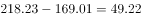亿元，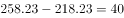亿元，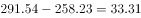亿元，亿元，亿元。2005—2010年，2011—2015这5年的增长量都高于2005—2010年平均值。

故正确答案为D。

---

### 第 2 题　qid 2030124 · 比重

2015年，该市外商经济增加值占GDP的比重约为：

- **A**. 

- **B**. 

　✅
- **C**. 

- **D**. 

**答案**：B

**官方解析**

根据“2015年，该市外商经济增加值占GDP的比重”判断本题为现期比重问题。定位材料第一段，“2015年，某市非公有制经济实现增加值348.12亿元非公有制经济增加值占GDP的比重为外商经济增加值11.84亿元。”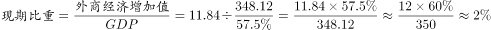。

故正确答案为B。

---

### 第 3 题　qid 2030130 · 比重

与2010年相比，2014年该市非公有制经济中第三产业比重：

- **A**. 上升了3.4个百分点
- **B**. 上升了3.6个百分点
- **C**. 下降了3.4个百分点　✅
- **D**. 下降了3.6个百分点

**答案**：C

**官方解析**

根据“与2010年相比，2014年······比重”，选项为上升/下降了+百分点，判断本题为两期比重问题。定位材料第二段，2014年，非公有制经济第一、二、三产业结构之比为。2015年三大产业结构之比为，与“十一五”末相比，第三产业比重下降了3.5个百分点，，即下降了3.4个百分点。

故正确答案为C。

---

### 第 4 题　qid 2030132 · 增长

以下各时间段中，该市非公有制经济增加值年均增速最快的是：

- **A**. 1990—1995年　✅
- **B**. 1995—2000年
- **C**. 2000—2005年
- **D**. 2005—2010年

**答案**：A

**官方解析**

根据“······年均增速最快的是”判断本题为年均增长率比较问题。年均增长率：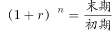。定位图表，直接比较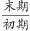。A项：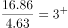；B项：；C项：；D项：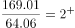。1990—1995年的年均增速最快。

故正确答案为A。

---

### 第 5 题　qid 2030136 · 增长

关于该市非公有制经济增加值发展状况，能够从上述资料中推出的是：

- **A**. 2015年该市非公有制经济的经济增加值是30年前的200倍以上
- **B**. 2015年该市工业增加值占第二产业非公有制经济增加值比重超过八成　✅
- **C**. 2010年该市非公有制经济中第三产业比重比第一产业高23.7个百分点
- **D**. 2010—2015年，该市港澳台经济增加值年均增量高于民营经济增加值

**答案**：B

**官方解析**

A项：定位材料第一段及图表，2015年该市非公有制经济的经济增加值为348.12亿元，1985年为1.78亿元。，所以不到200倍，错误；

B项：定位材料第二段，工业增加值占非公有制经济增加值比重为，第二产业占非公有制经济增加值比重为。则，超过八成，正确；

C项：定位材料第二段，2015年，第一、三产业占比分别为，，与“十一五”末相比，比重下降3.9和3.5个百分点。，错误；

D项：定位材料第一段，2015年民营经济增加值335.24亿元，港澳台经济增加值1.04亿元，分别比2010年增长、。年份相同，直接比较总的增长量。民营经济的总增长量为亿元，港澳台的总增长量为。民营经济增长量大于港澳台经济增长量，错误。

故正确答案为B。

---

## 材料 2

日利用率：飞机在一日内平均提供的生产飞行小时数

客座率：承运的旅客数量与飞机可提供的座位数之比

### 第 6 题　qid 2030138 · 综合

2015年，飞机日利用率最高和客座率最高的月份之间相隔多少个月？

- **A**. 5个月　✅
- **B**. 6个月
- **C**. 7个月
- **D**. 8个月

**答案**：A

**官方解析**

根据柱状图可知，2015年飞机日利用率最高的月份为2月，客座率最高的月份为8月，之间相隔5个月。
故正确答案为A。

---

### 第 7 题　qid 2030140 · 平均数

2015年，平均每架民航飞机月飞行时间超过300小时的月份有多少个？

- **A**. 1个
- **B**. 2个　✅
- **C**. 3个
- **D**. 4个

**答案**：B

**官方解析**

根据题干中的“平均每架民航飞机月飞行时间”，且，可判定此题为现期计算问题。其中1、3、5、7、8、10、12月为31天，2月为28天，其余均为30天。要使平均每架民航飞机月飞行时间超过300小时，即日利用率在天数为31的月份大于，天数为30的月份大于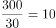，2月大于。满足条件的有7月与8月两个月份。

故正确答案为B。

---

### 第 8 题　qid 2030142 · 平均数

某航班由400个座位的B747-400飞机执飞，其每天飞行的客座率都与当月所有航班的平均客座率相同。则2015年1月该航班共有多少个空位未卖出？

- **A**. 不到1500个
- **B**. 1500个~2100个之间
- **C**. 2100个~2700个之间
- **D**. 超过2700个　✅

**答案**：D

**官方解析**

根据题干中的“其每天飞行的客座率都与当月所有航班的平均客座率相同”，可判定此题为现期比重问题。根据柱状图可知，2015年1月的客座率为，且该航班为400个座位，则该月未卖出的空位为。

故正确答案为D。

---

### 第 9 题　qid 2030144 · 增长

2015年2—12月间，飞机日利用率与上月相比增幅排名第三的月份，客座率增幅在所有月份中排名：

- **A**. 第四
- **B**. 第三
- **C**. 第二　✅
- **D**. 第一

**答案**：C

**官方解析**

由图可知，飞机日利用率与上月相比增幅排名前三依次为2月【】、7月【】、8月【】]；8月的客座率增幅为（），仅次于2月的增幅（），排名第二。

故正确答案为C。

---

### 第 10 题　qid 2030148 · 综合

能够从上述资料中推出的是：

- **A**. 
2015年下半年，日利用率与上月相比上升的月份数少于下降的月份数
　✅
- **B**. 
承运旅客数量超过航班提供座位总数的月份，航班日利用率均超过9.5小时

- **C**. 
如2015年各月民航飞机数不变，则第四季度平均日利用率在小时之间

- **D**. 
一架每天飞行且日利用率与当月均值相同的飞机，11月的总飞行时间和12月相同

**答案**：A

**官方解析**

A项：根据柱状图可知，2015年下半年日利用率与上月相比上升的月份有2个，下降的3个，满足上升数少于下降数，正确；

B项：承运旅客数量超过航班提供座位总数的月份即客座率大于，根据柱状图可知，4月日利用率未超过9.5，错误；

C项：第四季度为10月（31天）、11月（30天）、12月（31天），根据柱状图可知，其日利用率分别为9.3、9.1、9.1，根据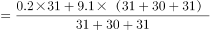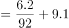，错误；

D项：，根据柱状图可知，11月、12月日利率均为9.1，但天数分别为30、31天，所以总飞行时间两月不相同，错误。

故正确答案为A。

---

## 材料 3

        2015年，某省对农民工在本市（区、县）创业的意愿进行了调查，共完成有效样本3000个，调查结果如下：

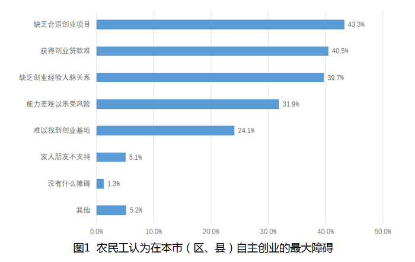

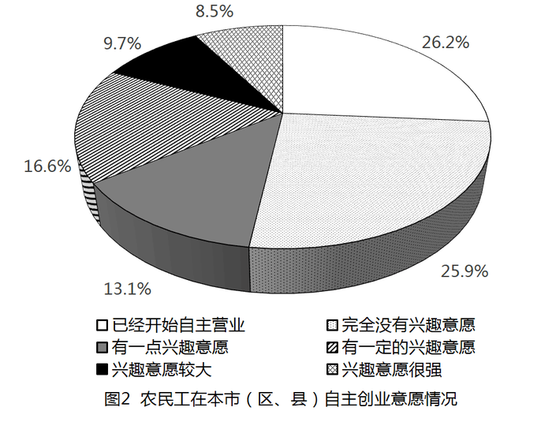

### 第 11 题　qid 2030154 · 综合

在被调查的农民工中，自主创业兴趣意愿很强的农民工人数约为多少人？

- **A**. 220
- **B**. 240
- **C**. 255　✅
- **D**. 275

**答案**：C

**官方解析**

结合文字材料与饼状图可知，本次调查样本为3000人，其中自主创业兴趣意愿很强的农民工所占比重为，故求相应的人数可判定本题为现期比重中部分量的计算问题。根据公式：，自主创业兴趣意愿很强的。

故正确答案为C。

---

### 第 12 题　qid 2030158 · 平均数

2014年该省平均每家农民工回乡创办的企业当年实现产值与上年的情况相比，约：

- **A**. 
下降了

- **B**. 
下降了
　✅
- **C**. 
上升了

- **D**. 
上升了

**答案**：B

**官方解析**

题干所求为“平均每家创办的企业实现产值”的同比增长率，故可判定本题为平均数的增长率计算问题。根据表格材料可得，2014年平均每家创办的，2013年。根据公式可得，2014年，即下降了。

故正确答案为B。

---

### 第 13 题　qid 2030160 · 平均数

以下折线图中，能准确反映2011—2014年间该省平均每创办一个企业所需的创业者人数的变化关系的是：

- **A**. A
- **B**. B　✅
- **C**. C
- **D**. D

**答案**：B

**官方解析**

题干需求出“2011-2014年平均每创办一个企业所需要的人数的变化趋势”，故可将本题转化为平均数的比较问题。定位表格，2011-2014年平均每创办一个企业所需要的人数分别为：、、、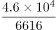。首先比较2011与2012年，前者分母超过后者分母的2倍，而分子远小于2倍，分母变大，分数变小，后者要大，即2012年数据大，即前两年为上升趋势，排除A、D选项。其次比较2013与2014年，2013年人数直除首位可商8，2014年人数直除首位只能商6，故2013年数据大，2013至2014年为下降趋势，B项满足，当选。

故正确答案为B。

---

### 第 14 题　qid 2030164 · 综合

根据调查结果，哪项举措最有可能有效提升农民工回乡创业的意愿？

- **A**. 设立农民工创业孵化基地
- **B**. 开设课堂让成功创业者传授经验
- **C**. 开放农民工创业贷款绿色通道
- **D**. 大量开放适合农民工的创业项目　✅

**答案**：D

**官方解析**

根据图1可知，在农民工自主创业的障碍中，缺乏合适的创业项目所占比重最高，故最有可能有效提升农民工回乡创业意愿的举措为大量开放适合农民工的创业项目，D项正确。
故正确答案为D。

---

### 第 15 题　qid 2030170 · 综合

能从上述资料中推出的是：

- **A**. 超过1000名被调查者已经开始自主营业
- **B**. 不到100名调查者的家人及朋友不支持被调查者创业
- **C**. 2011年该省平均每个农民工回乡创办企业的产值超过200万元
- **D**. 2013年该省平均每名回乡农民工创业者当年创业实现的产值是上一年的两倍以上　✅

**答案**：D

**官方解析**

A项：结合文字材料与饼状图，已经开始自主营业的，错误；

B项：结合文字材料与柱状图，家人朋友不支持的调查者，错误；

C项：根据表格可得，2011年平均每个农民工回乡创办企业的，错误；

D项：根据表格，2013年平均每名农民工回乡创业实现的，2012年平均每名农民工回乡创业实现的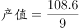。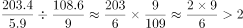，故两倍以上说法正确。

故正确答案为D。

---
