# 2016年国家公务员录用考试《行测》题（地市级）

> 资料分析 · 20 题 · 国考 2016

## 材料 1

一、根据以下资料，回答111～115题。

        2014年全国棉花播种面积4219.1千公顷，比2013年减少2.9％。棉花总产量616.1万吨，比2013年减产2.2％。

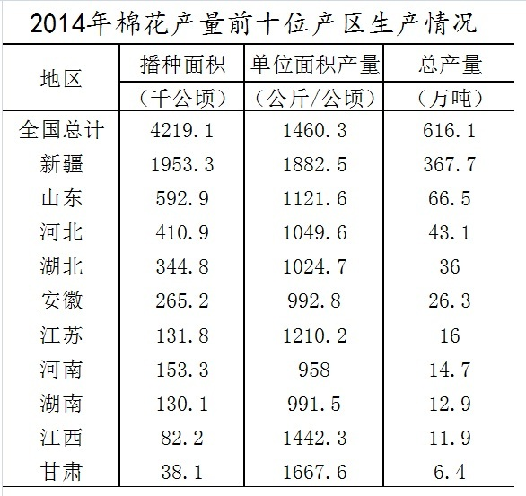

### 第 1 题　qid 1746792 · 增长

2014年全国棉花单位面积产量比上年约：

- **A**. 提高了5.1%
- **B**. 提高了0.7%　✅
- **C**. 降低了5.1%
- **D**. 降低了0.7%

**答案**：B

**官方解析**

单位面积产量=总产量÷播种面积，故总产量为分子A、播种面积为分母B。定位材料文字部分可得A的增速a=－2.2%，B的增速b=－2.9%。代入平均数增长率公式：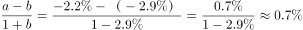。

故正确答案为B。

---

### 第 2 题　qid 1746796 · 比重

2014年棉花总产量最高的省（区）播种面积占全国棉花播种面积的比重约为：

- **A**. 52%
- **B**. 60%
- **C**. 40%
- **D**. 46%　✅

**答案**：D

**官方解析**

定位材料表格部分可得，2014年棉花总产量最高的省份为新疆省，其播种面积为1953.3千公顷，占全国播种面积的比重=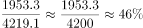。

故正确答案为D。

---

### 第 3 题　qid 1746800 · 平均数

表中有几个省（区）2014年棉花单位面积产量不低于全国平均水平的80%?

- **A**. 2
- **B**. 3
- **C**. 4　✅
- **D**. 5

**答案**：C

**官方解析**

定位材料表格部分可得，2014年全国棉花单位面积产量的80%=1460.3×0.8≈1168公斤/公顷，表中十个省份中：1882.5、1210.2、1442.3、1667.6公斤/公顷，共4个省份不低于1168公斤/公顷。
故正确答案为C。

---

### 第 4 题　qid 1746806 · 平均数

如果2014年安徽省的棉花单位面积产量能够达到全国平均水平，那么其棉花总产量将达到约多少万吨？

- **A**. 30
- **B**. 26
- **C**. 39　✅
- **D**. 35

**答案**：C

**官方解析**

方法一：定位材料表格部分可得2014年安徽省棉花播种面积为265.2千公顷，按照全国平均单位面积产量1460.3公斤/公顷计算，总产量万吨。

方法二：2014年全国平均单位面积产量1460.3公斤/公顷，安徽的单位面积产量992.8公斤/公顷，全国约是安徽的1.5倍，因此，如果2014年安徽省的棉花单位面积产量达到全国平均水平，则其棉花总量应该是原来的1.5倍，即万吨，与C项最接近。

故正确答案为C。

---

### 第 5 题　qid 1746812 · 综合

关于2014年棉花生产情况，能够从上述资料中推出的是：

- **A**. 山东棉花总产量和单位面积产量均为全国第二
- **B**. 河南棉花播种面积和单位面积产量均高于湖南
- **C**. 全国播种面积比2013年多126千公顷
- **D**. 新疆棉花产量占全国总产量的一半以上　✅

**答案**：D

**官方解析**

A项：根据表格数据，14年山东棉花总产量66.5万吨，第二；山东棉花单位面积产量1121.6公斤/公顷，小于新疆、江苏等，非第二，错误；

B项：14年棉花播种面积，河南（153.3千公顷）&gt;湖南（130.1千公顷）；14年单位面积产量河南（958.0公斤/公顷）&lt;湖南（991.5公斤/公顷），错误；

C项：14年全国棉花播种播种面积增长为－2.9%，故14年棉花播种面积应小于13年，错误；

D项：14年新疆棉花总产量占全国的比重=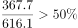，正确。

故正确答案为D。

---

## 材料 2

        2014年末全国共有公共图书馆3117个，比上年末增加5个。年末全国公共图书馆从业人员56071人。

 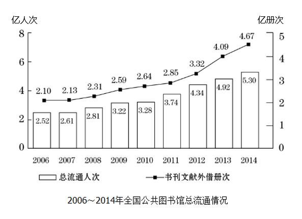

        2014年末全国公共图书馆实际使用房屋建筑面积1231.60万平方米，比上年末增长6.3%；图书总藏量79092万册，比上年末增长5.6％；电子图书50674万册，比上年末增长34.2%；阅览室座席数85.55万个，比上年末增长5.7%。

### 第 6 题　qid 1746814 · 平均数

2014年，全国平均每个公共图书馆月均流通人次约为：

- **A**. 1万多　✅
- **B**. 不到1万
- **C**. 2万多
- **D**. 3万多

**答案**：A

**官方解析**

由题干“2014年······平均······月均”，且材料中时间为2014年，可判定此题为现期平均数问题。定位图形材料，2014年，总流通人次5.3亿人次；定位文字材料第一段，2014年末全国共有公共图书馆3117个。则2014年平均每个公共图书馆。

故正确答案为A。

---

### 第 7 题　qid 1746816 · 增长

2014年，公共图书馆电子图书藏量增长册数约是图书总藏量增长册数的多少倍？

- **A**. 3　✅
- **B**. 2
- **C**. 8
- **D**. 5

**答案**：A

**官方解析**

由题干“2014年······是······多少倍”，且材料时间为2014年，可判定此题为现期倍数问题。定位文字材料第二段，图书总藏量79092万册，比上年末增长5.6％；电子图书50674万册，比上年末增长34.2%。代入增长量计算公式：增长量=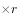。

2014年公共图书电子图书藏量增长册数=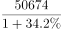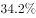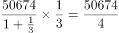；

图书总藏量增长册数=。

则电子图书藏量增长册数是图书总藏量增长册数的倍。

故正确答案为A。

---

### 第 8 题　qid 1746818 · 平均数

2012～2014年，平均每流通人次约产生多少册次的书刊文献外借？

- **A**. 1.0
- **B**. 0.8　✅
- **C**. 0.6
- **D**. 0.4

**答案**：B

**官方解析**

由题干“2012～2014年，平均每······”，可判定此题为现期平均数问题。定位图形材料，2012-2014年平均每流通人次产生的书刊文献外借册次=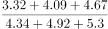。

故正确答案为B。

---

### 第 9 题　qid 1746820 · 增长

2008～2014年，人均公共图书藏量同比增速快于上年的年份有几个？

- **A**. 2
- **B**. 4
- **C**. 3　✅
- **D**. 5

**答案**：C

**官方解析**

由题干“同比增速快于上年的年份有几个”，判断本题为增长率比较问题。定位图形材料，代入增长率计算公式：。

2007年，人均公共图书藏量增速=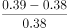=；

2008年，人均公共图书藏量增速=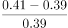=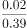；

2009年，人均公共图书藏量增速==；

2010年，人均公共图书藏量增速==；

2011年，人均公共图书藏量增速=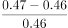=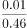；

2012年，人均公共图书藏量增速=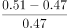=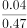；

2013年，人均公共图书藏量增速==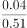；

2014年，人均公共图书藏量增速=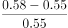=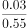；

经两两比较，2008年〉2007年，2009年〉2008年，2012年〉2011年，共3年。

故正确答案为C。

---

### 第 10 题　qid 1746822 · 综合

能够从上述资料中推出的是：

- **A**. “十一五”期间全国公共图书馆总流通人次超过15亿
- **B**. 2014年，平均每个公共图书馆拥有二十多个阅览室座席
- **C**. 2008~2014年间，每年平均每万人公共图书馆建筑面积同比增速均低于12%　✅
- **D**. 2008年，平均每万人公共图书馆建筑面积增量和人均公共图书藏量增量均低于2011年

**答案**：C

**官方解析**

A项：“十一五”期间，即2006年~2010年，定位图形材料，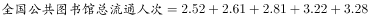，错误。

B项：定位文字材料一、二段可知，2014年平均每个公共图书馆拥有阅览室坐席=个，错误。

C项：定位图形材料，2008年~2014年平均每万人公共图书馆建筑面积同比增速分别为：

2008年:；2009年: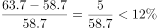；2010年：；2011年：；2012年：；2013年：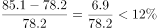；2014年：；正确。

D项：定位图形材料，2008年平均每万人公共图书馆建筑面积增量=58.7-56.1=2.6平方米，2011年平均每万人公共图书馆建筑面积增量=73.8-67.1=6.7平方米，2008年低于2011年。

2008年人均公共图书藏量增量=0.41-0.39=0.02册，2011年人均公共图书藏量增量=0.47-0.46=0.01册，2008年高于2011年，错误。

故正确答案为C。

---

## 材料 3

        截至2014年12月底，全国实有各类市场主体6932.22万户，比上年末增长，增速较上年同期增加4.02个百分点；注册资本（金）129.23万亿元，比上年末增长。其中，企业1819.28万户，个体工商户4984.06万户，农民专业合作社128.88万户。

        2014年，全国新登记注册市场主体1292.5万户，比上年同期增加160.97万户；注册资本（金）20.66万亿元，比上年同期增加9.66万亿元。其中，企业365.1万户，个体工商户896.45万户，农民专业合作社30.95万户。

        2014年，新登记注册现代服务业企业114.10万户，同比增长。其中，信息传输、软件和信息技术服务业14.67万户，同比增长；科学研究和技术服务业26.26万户，同比增长；文化、体育和娱乐业6.59万户，同比增长；教育业0.68万户，同比增长。

        2014年，新登记注册外商投资企业3.84万户，同比增长。投资总额2763.31亿美元，同比增长；注册资本1796.39亿美元，同比增长。

### 第 11 题　qid 1746780 · 综合

截至2012年12月底，全国实有各类市场主体户数最接近以下哪个数字？

- **A**. 6100万
- **B**. 5500万　✅
- **C**. 5100万
- **D**. 4500万

**答案**：B

**官方解析**

由材料“截至2014年12月底，全国实有各类市场主体6932.22万户，比上年末增长，增速较上年同期增加4.02个百分点”得，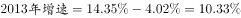。根据间隔增长率计算公式，2014年比2012年的增长率。则2012年全国实有各类市场主体万，与B项最接近。

故正确答案为B。

---

### 第 12 题　qid 1746784 · 比重

2014年，全国新登记注册市场主体中个体工商户所占比重约为：

- **A**. 

- **B**. 

　✅
- **C**. 

- **D**. 

**答案**：B

**官方解析**

由题干“2014年······所占比重”且材料时间为2014年，可判定此题为现期比重问题。定位文字材料第二段，“2014年，全国新登记注册市场主体1292.5万户”，其中，“个体工商户896.45万户”。可计算出2014年，全国新登记注册市场主体中个体工商户所占比重为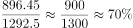，与B项最接近。

故正确答案为B。

---

### 第 13 题　qid 1746786 · 增长

2014年，以下哪个现代服务业新登记注册企业的户数同比增速最快？

- **A**. 科学研究和技术服务业
- **B**. 教育业
- **C**. 文化、体育和娱乐业
- **D**. 信息传输、软件和信息技术服务业　✅

**答案**：D

**官方解析**

定位文字材料第三段，现代服务业新登记注册企业的户数中，科学研究和技术服务业同比增长，教育业同比增长，文化、体育和娱乐业同比增长，信息传输、软件和信息技术服务业同比增长，因此，同比增速最快的是信息传输、软件和信息技术服务业。

故正确答案为D。

---

### 第 14 题　qid 1746788 · 平均数

2014年，新登记注册外商投资企业户均注册资本约比上年同期增长：

- **A**. 

　✅
- **B**. 

- **C**. 

- **D**. 

**答案**：A

**官方解析**

由题干“······户均······增长”，选项为百分数，可判定此题为平均数增长率计算问题。定位文字材料第四段，“2014年，新登记注册外商投资企业3.84万户，同比增长”，“注册资本1796.39亿美元，同比增长”。记2014年新登记注册外商投资企业注册资本为A，增速为a，外商投资企业户数为B，增速为b。代入平均数增长率公式，与A项最接近。

故正确答案为A。

---

### 第 15 题　qid 1746794 · 综合

能够从上述资料中推出的是：

- **A**. 2014年新登记注册现代服务业企业大部分属于教育行业
- **B**. 2014年末超过三分之一的农民专业合作社成立不满一年
- **C**. 2013年全国实有各类市场主体注册资本（金）不足100万亿元
- **D**. 2013年新登记注册科学研究和技术服务业企业不到20万户　✅

**答案**：D

**官方解析**

A项：2014年，新登记注册现代服务业企业114.10万户，教育业0.68万户，教育业占比较小，教育不占主要地位，错误。

B项：2014年12月底，农民专业合作社128.88万户，新登记注册农民专业合作社30.95万户，则成立不满一年的农民专业合作社比例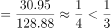，错误。

C项：2014年12月底，全国实有各类市场主体注册资本（金）129.23万亿元，比上年末增长，则2013年全国实有各类市场主体注册资本（金）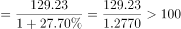万亿元，错误。

D项：2014年科学研究和技术服务业26.26万户，同比增长，则2013年科学研究和技术服务业万户，首位只能商1，因此不到20万户，正确。

故正确答案为D。

---

## 材料 4

        2014年全国社会物流总额213.5万亿元，同比增长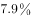，比上年回落1.6个百分点。

        2014年全国社会物流总费用10.6万亿元，同比增长。其中，运输费用5.6万亿元，同比增长；保管费用3.7万亿元，同比增长；管理费用1.3万亿元，同比增长。

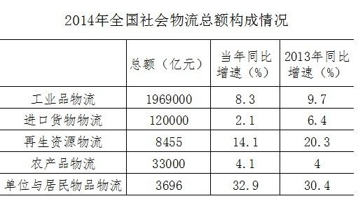

### 第 16 题　qid 1746798 · 平均数

2014年每实现100万元的社会物流额，其运输费用平均约为多少万元？

- **A**. 5.6
- **B**. 10.6
- **C**. 2.6　✅
- **D**. 5.0

**答案**：C

**官方解析**

由题干“2014年每······平均”，且材料时间为2014年，判断题型为现期平均数问题。定位文字材料第一段可得2014年全国社会物流总额为213.5万亿元，定位文字材料第二段可得物流总费用中运输费用为5.6万亿元，则平均每元社会物流额的运输费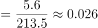元，故每实现100万元的社会物流额，其运输费用为2.6万元。

故正确答案为C。

---

### 第 17 题　qid 1746802 · 比重

2013、2014年占全国社会物流总额比重均高于上一年水平的分类包括：

- **A**. 再生资源物流、单位与居民物品物流、农产品物流
- **B**. 工业品物流、再生资源物流、单位与居民物品物流　✅
- **C**. 进口货物物流、农产品物流、单位与居民物品物流
- **D**. 工业品物流、进口货物物流、农产品物流

**答案**：B

**官方解析**

由题干“2013、2014年占······比重均高于上一年”，可判定此题为两期比重比较问题。根据两期比重比较公式：，可得，比重高于上一年。定位材料图形部分可得2014年全国社会物流总额增长率为，2013年为，定位表格部分可得2014年增速：工业品物流、再生资源物流、单位与居民物品物流，均大于；2013年增速：工业品物流、再生资源物流、单位与居民物品物流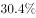，均大于。

故正确答案为B。

---

### 第 18 题　qid 1746804 · 综合

2014年全国社会物流总额最高的季度是：

- **A**. 第一季度
- **B**. 第二季度
- **C**. 第三季度　✅
- **D**. 第四季度

**答案**：C

**官方解析**

定位材料图形部分：2014年第一季度全国社会物流总额47.8万亿元；万亿元；万亿元；万亿元，可得第三季度最高。

故正确答案为C。

---

### 第 19 题　qid 1746808 · 综合

2012年上半年全国社会物流总额约为多少万亿元？

- **A**. 75
- **B**. 86　✅
- **C**. 93
- **D**. 102

**答案**：B

**官方解析**

由题干所求“2012年上半年”，结合材料2014年，可判定此题为间隔基期计算问题。定位图形材料可得，2014年上半年（第二季度累计）全国物流总额为101.5万亿元、2014年上半年增长率为、2013年上半年增长率为，则由间隔增长率公式可得2014年上半年比2012年上半年的。则2012年上半年全国物流总额为万亿元，与B项最接近。

故正确答案为B。

---

### 第 20 题　qid 1746810 · 综合

能够从上述资料中推出的是：

- **A**. 2013年第三季度社会物流总额同比增速高于第四季度　✅
- **B**. 2014年每万元社会物流总额的平均管理费用低于上年水平
- **C**. 2014年农产品物流额在社会物流总额中的比重高于一成
- **D**. 2014年单位与居民物品物流额超过2012年的两倍

**答案**：A

**官方解析**

A项：观察图形，根据混合增长率居中的原则，2013年前三季度增长率为，前二季度为，故第三季度增长率大于；前四季度增长率为，前三季度为，故第四季度增长率为；所以第三季度增长率高于第四季度增长率，正确。

B项：计算每万元社会物流总额的平均管理费用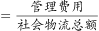，定位材料文字部分可得：2014年管理费用（分子）和社会物流总额（分母）增长率都为，根据两期平均数比较定性分析，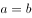，两期平均数不变，可得2014年应等于2013年，错误。

C项：定位材料表格部分可得2014年农产品物流额占社会物流总额的比重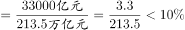即低于一成，错误。

D项：定位材料表格部分，根据间隔增长率公式可得2014年单位与居民物流对2012年增长率为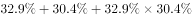，间隔倍数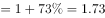倍，故单位与居民物品物流额2014年小于2012年的2倍，错误。

故正确答案为A。

---
