# 2016年山东省公务员录用考试《行测》题

> 资料分析 · 21 题 · 山东 2016

## 材料 1

根据所给资料，回答101~105题。

### 第 1 题　qid 1797576 · 综合

居民基本养老保险基金中的支出户资产总额比居民基本医疗保险基金中的支出户资产总额约高多少亿元？

- **A**. 62　✅
- **B**. 72
- **C**. 504
- **D**. 585

**答案**：A

**官方解析**

定位图表第四行第三列、第五列，居民基本养老保险基金中的支出户资产总额为145亿元，居民基本医疗保险基金中的支出户资产总额为83亿元，则前者比后者高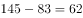亿元。

故正确答案为A。

---

### 第 2 题　qid 1797582 · 比重

若将城镇职工基本养老保险基金中财政专户存款资产总额的10%转入协议存款，则协议存款总额占社会保险基金资产总额的比重将增加约多少个百分点？

- **A**. 2
- **B**. 5　✅
- **C**. 8
- **D**. 12

**答案**：B

**官方解析**

定位表格第三行可知，2013年城镇职工基本养老保险中的财政专户存款为24218亿元。若其转入协议存款，协议存款总额占社会保险基金资产总额所增加的比重即为城镇职工基本养老保险财政专户存款占社会保险基金资产总额的比重。故所求即为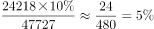。（本题为现期比重问题，比重的分母应为社会保险基金资产总额47727亿元，而不是城镇职工基本养老保险基金资产总额29930亿元，所以错选C项是因为分母数据没有找对。）

故正确答案为B。

---

### 第 3 题　qid 1797526 · 综合

根据基金资产总额从高到低，以下顺序正确的是：

- **A**. 失业保险    生育保险    居民基本养老保险
- **B**. 居民基本医疗保险    工伤保险    失业保险
- **C**. 失业保险    居民基本养老保险    居民基本医疗保险　✅
- **D**. 城镇职工基本医疗保险    工伤保险    居民基本养老保险

**答案**：C

**官方解析**

本题为排序类。定位表格，查找数据，代入各选项。
A项：居民基本养老保险3124亿元大于生育保险518亿元，错误。
B项：工伤保险1004亿元小于失业保险3726亿元，错误。
C项：失业保险3726亿元大于居民基本养老保险3124亿元，大于居民基本医疗保险1077亿元，正确。
D项：工伤保险1004亿元小于居民基本养老保险3124亿元，错误。
故正确答案为C。

---

### 第 4 题　qid 1797532 · 比重

以下哪个图形能够正确反映债券投资总额中各基金的占比情况？

- **A**. 

　✅
- **B**. 

- **C**. 

- **D**. 

**答案**：A

**官方解析**

根据题干中“债券投资总额中各基金的占比情况”，可判定本题为现期比重问题。定位表格，债券投资各项分别为54亿元、26亿元、15亿元、4亿元、16亿元、1亿元，总额为116亿元，最大的模块占比为，排除C、D两项，居民基本养老保险26亿元占最大模块将近一半，城镇职工基本医疗保险和失业保险两个模块相近，占比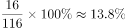，A项最接近。

故正确答案为A。

---

### 第 5 题　qid 1797586 · 综合

能够从上述资料推出的是：

- **A**. 除居民养老保险基金外，其他社保基金均无协议存款投资
- **B**. 城镇职工基本医疗保险基金资产总额是居民基本医疗保险基金的8倍多
- **C**. 城镇职工基本医疗保险基金的资产项目类型数少于其他社会保险基金
- **D**. 城镇职工基本养老保险基金资产总额高于表中其他各项基金总额之和　✅

**答案**：D

**官方解析**

A项，定位表格可知，除城镇职工基本养老保险基金外，其他各项基金均无协议存款投资，错误； 

B项，定位表格可知，城镇职工基本医疗保险基金总额为8348亿元，居民基本医疗保险基金总额为1077亿元，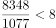，错误；

C项，定位表格可知，城镇职工基本医疗保险基金的资产项目数比居民基本医疗保险基金的多，错误；

D项，定位表格可知，城镇职工基本养老保险基金总额为29930亿元，总金额为47727亿元，则其他各项基金总额之和为亿元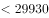亿元，正确。

故正确答案为D。

---

## 材料 2

根据所绘资料，回答106~110题。

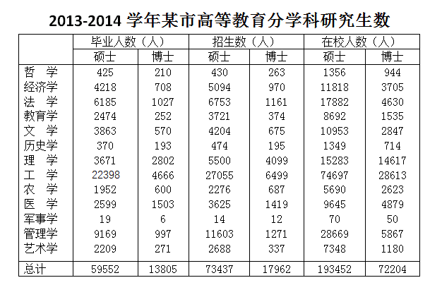

### 第 6 题　qid 1797596 · 比重

2013~2014学年该市毕业的研究生中，工学研究生所占比例约为：

- **A**. 32%
- **B**. 37%　✅
- **C**. 42%
- **D**. 47%

**答案**：B

**官方解析**

根据题干中“工学研究生所占比例约为”，可判定本题为现期比重的计算问题。定位表格，工学研究生毕业生人数为人，总毕业生人数为人，则工学研究生所占比例为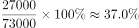。

故正确答案为B。

---

### 第 7 题　qid 1797600 · 综合

在校博士生人数超过在校研究生人数25%的学科有几个：

- **A**. 7　✅
- **B**. 6
- **C**. 5
- **D**. 4

**答案**：A

**官方解析**

根据题干“在校博士生人数超过在校研究生人数的学科有几个”，可判定本题为现期比重问题。在校博士生人数超过在校研究生人数，相当于在校博士生人数的4倍大于在校研究生人数，即在校博士生人数的3倍大于在校硕士生人数。定位表格资料，满足的有哲学、历史学、理学、工学、农学、医学、军事学，共7个。（本题易错点在于“在校研究生人数应包含在校博士生人数和在校硕士生人数”。）

故正确答案为A。

---

### 第 8 题　qid 1797604 · 比重

硕士生与博士生招生人数比例与其毕业人数比例相差最大的学科是：

- **A**. 哲学
- **B**. 文学
- **C**. 军事学　✅
- **D**. 艺术学

**答案**：C

**官方解析**

根据题干中“硕士生与博士生招生人数比例与其毕业人数比例相差最大的学科”，可判定本题为比值比较问题。定位表格，哲学硕博招生人数、毕业人数基本持平；文学硕博招生人数比例为，毕业生人数比例为；军事学硕博招生人数比例为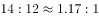，毕业生人数比例为；艺术学硕博招生比例为，毕业生人数比例为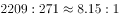，观察可得，差距最大的学科为军事学。

故正确答案为C。

---

### 第 9 题　qid 1797608 · 综合

在校研究生人数排名第三的学科，其研究生招生人数是毕业人数的多少倍？

- **A**. 1.0
- **B**. 1.2
- **C**. 1.5　✅
- **D**. 1.8

**答案**：C

**官方解析**

根据题干中“研究生招生人数是毕业人数的多少倍”，可判定本题为现期倍数问题。定位表格，在校研究生人数排名第三的是理学，其研究生招生人数为人，毕业生人数为人，招生人数是毕业生人数的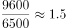倍。

故正确答案为C。

---

### 第 10 题　qid 1797612 · 综合

能够从上述资料推出的是：

- **A**. 文、史、哲三专业共招录1200多名博士研究生
- **B**. 博士招生人数超过1000人的有4个学科
- **C**. 管理学科各项统计指标均高于经济学科　✅
- **D**. 表中各专业博士研究生毕业人数均低于招生人数

**答案**：C

**官方解析**

A项：定位表格，文、史、哲三专业招录博士生人数为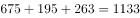人人，错误。

B项：定位表格，博士招生人数超过1000人的有法学、理学、工学、医学、管理学共5个学科，错误。

C项：定位表格，管理学科硕士研究生与博士研究生的招生人数、毕业人数、在校人数均高于经济学科，正确。

D项：定位表格，医学博士生毕业人数大于招生人数，错误。

故正确答案为C。

---

## 材料 3

根据所给资料回答111~115题。

        2014年，某地区生态移民人均可支配收入5084元，其中县内移民人均可支配收入4933元，县外移民人均可支配收入5253元，2014年该地区生态移民人均可支配收入比农村居民人均可支配收入低3326元，比该地区山区九县农村居民人均可支配收入低1099元。

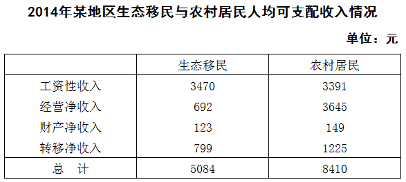

### 第 11 题　qid 1797622 · 综合

2014年，该地区生态移民中，县内移民与县外移民人数之比与以下哪一项最接近？

- **A**. 8：5
- **B**. 10：9　✅
- **C**. 5：8
- **D**. 9：10

**答案**：B

**官方解析**

根据题干“县内移民与县外移民人数之比”，可判断本题为比值计算问题。定位文字资料，2014年，该地区生态移民人均可支配收入5084元，其中县内移民人均可支配收入4933元，县外移民人均可支配收入5253元，利用线段法可知，距离比为人数的反比，故县内与县外之比为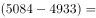，B项满足。

故正确答案为B。

---

### 第 12 题　qid 1797626 · 平均数

2014年，该地区生态移民经营净收入占人均可支配收入的比重比农村居民低多少个百分点？

- **A**. 0.6
- **B**. 1.1
- **C**. 15.7
- **D**. 29.7　✅

**答案**：D

**官方解析**

根据题干中的“占······比重”以及资料时间为2014年，可判定为现期比重问题。定位表1，2014年该地区生态移民经营净收入692元，人均可支配收入总计5084元；农村居民经营净收入3645元，人均可支配收入总计8410元。则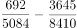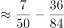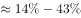，即生态移民经营净收入所占人均可支配收入的比重比农村居民低29个百分点，D项最接近。

故正确答案为D。

---

### 第 13 题　qid 1797630 · 综合

2014年，该地区农村居民在食品烟酒、衣着、居住三项消费上支出约占总消费支出的：

- **A**. 

- **B**. 

　✅
- **C**. 

- **D**. 

**答案**：B

**官方解析**

根据题干出现“占”，资料时间为2014 年，可以判定为现期比重问题。定位表2可得，2014年该地区农村居民食品烟酒支出2296元，衣着支出602元，居住支出1388元，总生活消费支出7676元，故三者所占总生活消费支出的比重为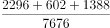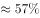，B项最接近。

故正确答案为B。

---

### 第 14 题　qid 1797634 · 平均数

2014年该地区农村居民人均生活消费支出与生态移民人均生活消费支出金额相差在300元以上的有几项？

- **A**. 3
- **B**. 4　✅
- **C**. 5
- **D**. 6

**答案**：B

**官方解析**

定位表2可知该地区生态移民与农村居民的人均生活消费支出状况，简单计算可得，差额在300元以上的有居住、交通通信、教育文化娱乐、医疗保健，共4项。
故正确答案为B。

---

### 第 15 题　qid 1797636 · 综合

能够从上述资料推出的是：

- **A**. 2014年该地区生态移民各项人均可支配收入均低于农村居民
- **B**. 2014年该地区山区九县农村居民人均可支配收入在4000元左右
- **C**. 2014年该地区生态移民人均交通通信支出占人均总生活消费支出的10%以上　✅
- **D**. 2014年该地区农村居民人均可支配收入比人均总生活消费支出高1000多元

**答案**：C

**官方解析**

A项：定位表1，2014年该地区生态移民工资性收入为3470元，大于农村居民工资性收入3391元，错误。

B项：定位文字材料，2014年该地区生态移民人均可支配收入5084元，比山区九县农村居民人均可支配收入低1099元，则山区九县农村居民人均可支配收入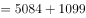元，错误。

C项：定位表2，2014年该地区生态移民人均交通通信消费支出为526元，总支出为5090元，所占比重为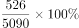，正确。

D项：由表1可知2014年该地区农村居民人均可支配收入为8410元，由表2可知农村居民人均总生活消费支出为7676元，前者比后者高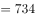，错误。

故正确答案为C。

---

## 材料 4

        2015年一季度，某省省级及以上园区（以下简称园区）实现主营业务收入7062.85亿元，同比增长11%，实现主导产业主营业务收入4369.54亿元，同比增长10.4%。 

        一季度，全省园区拥有企业30975家，比上年同期增加3221家，其中本年新增企业311家，期末从业人数264.23万人，同比增长9.2%。其中，工业企业期末从业人数209.17万人，同比增长9.9%。

        一季度，全省园区高新技术产业期末从业人数90.92万人，同比增长8.3%，实现高新技术产业产值2815.19亿元，同比增长8.1%。

        一季度，全省园区共实现利润279.54亿元，同比增长11.1%。上缴税金223.87亿元，同比增长14.1%。

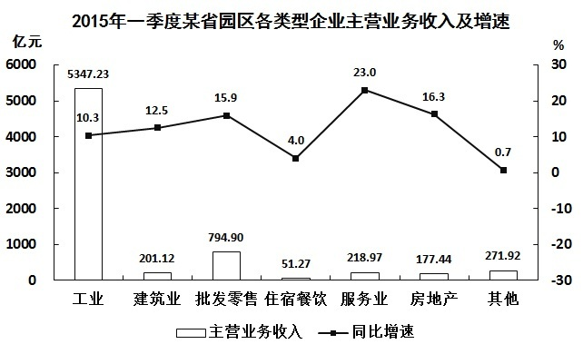

### 第 16 题　qid 1797638 · 平均数

2015年一季度，该省园区平均每家企业实现主营业务收入约多少万元？

- **A**. 1140
- **B**. 2280　✅
- **C**. 3420
- **D**. 4560

**答案**：B

**官方解析**

根据题干中“2015 年一季度······平均每家企业”可知本题为现期平均数问题。定位文字资料第一段和第二段开头可知，2015年一季度，该省园区实现主营业务收入7062.85亿元，园区拥有企业30975家，则平均每家企业实现主营业务收入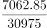（亿元），直除首位商2，B项最接近。

故正确答案为B。

---

### 第 17 题　qid 1797640 · 比重

2015年一季度，该省园区企业上缴税金占主营业务收入的比重比上年同期：

- **A**. 上升了0.1个百分点　✅
- **B**. 上升了3.1个百分点
- **C**. 下降了0.1个百分点
- **D**. 下降了3.1个百分点

**答案**：A

**官方解析**

根据题干“2015年一季度······占······的比重比上年同期”，可判定本题为两期比重问题。定位文字资料第一段和第四段可知，2015年一季度，该省园区实现主营业务收入7062.85亿元，同比增长，上缴税金223.87亿元，同比增长。由两期比重结论可知，由于，故比重应为上升，排除C、D两项，又因为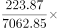，所以上升的百分点应小于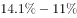，只有A项满足。

故正确答案为A。

---

### 第 18 题　qid 1797642 · 增长

2015年一季度，该省园区工业企业主营业务收入同比增量约是增速最快的企业类型的多少倍？

- **A**. 5
- **B**. 12　✅
- **C**. 22
- **D**. 253

**答案**：B

**官方解析**

根据题干中“2015年一季度······是······的多少倍”可知本题为现期倍数问题。由图形资料可知，增长最快的企业为服务业，其实现主营业务收入218.97亿元，同比增长，工业实现主营业务收入5347.23亿元，同比增长。工业实现增长量是服务业的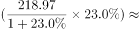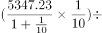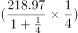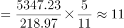倍，B项最接近。

故正确答案为B。

---

### 第 19 题　qid 1797644 · 综合

关于2015年一季度该省园区企业的以下信息，能够从上述资料中直接推出的是：

- **A**. 平均每月新增从业人员数
- **B**. 平均每家工业企业从业人员数
- **C**. 平均每万元主营业务收入实现利润额　✅
- **D**. 平均每家高新技术产业企业实现产值

**答案**：C

**官方解析**

A项，文字材料第二段只给出了期末从业人数和同比增长率，并没有给出2014年第四季度期末从业人数，故无法求得2015年一季度平均每月新增就业人员数，错误。

B项，文字材料第二段只给出2015年一季度工业企业期末从业人员数，并未给出工业企业的个数，故无法推出平均每家工业企业从业人数，错误。

C项，由文字材料第一、第四段分别可得到主营业务收入为7062.85亿元、利润总额279.54亿元，故平均每万元主营业务收入实现利润额为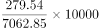元，能够推出，正确。

D项，文字资料第三段只给出了高新技术产业产值，并未给出高新技术产业企业数，故无法推出平均每家高新技术产业企业实现产值，错误。

故正确答案为C。

---

### 第 20 题　qid 1797646 · 综合

关于2015年一季度该省园区企业营业状况，能够从上述资料推出的是：

- **A**. 主导产业主营业务收入占总体主营业务收入比重同比上升
- **B**. 平均每月新增企业约26家
- **C**. 图中主营业务收入增速快于园区主营业务收入总体增速的行业有3个
- **D**. 主营业务收入最低的行业主营业务收入占园区总体的比重低于1%　✅

**答案**：D

**官方解析**

A项，由文字材料第一段可知主导产业主营业务收入同比增速为，小于主营业务收入的同比增速的，故前者占后者的比重同比下降，错误。

B项，由文字材料第二段可知，一季度新增企业311家，则平均每月新增企业家，错误。

C项，主营业务收入总体增速为，由图形可知，高于此值的有建筑业、批发零售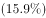、服务业和房地产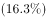，共4个，错误。

D项，由图形可知，主营业务收入最低的行业是住宿餐饮，为51.27亿元，所占比重为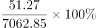，正确。

故正确答案为D。

---

### 第 21 题　qid 1797434 · 比重

某公司甲、乙和丙三个销售部在2014年的销售额分别占公司总销售额的40%、35%和25%，其在2015年的销售额分别比上年增长了20%、300万元和16%，而总销售额增长了1800万元。问甲销售部的销售额比上年增长的数量比丙销售部高多少万元？

- **A**. 200
- **B**. 300
- **C**. 400
- **D**. 500　✅

**答案**：D

**官方解析**

本题考查和差倍比问题。设2014年总销售额为万元，则甲销售部的销售额为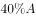万元，丙销售部的销售额为万元，则2015年甲销售部的销售额比上年增长了万元；丙销售部比上年增长了万元。根据题意可列式：，即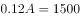，则甲销售部的销售额比上年增长的数量比丙销售部高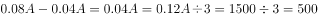万元。

故正确答案为D。

---
