# 2016年山东省选调应届优秀高校毕业生到基层工作考试《行测》试卷（精选）

> 资料分析 · 10 题 · 选调 2016

## 材料 1

        山东省2010年至2014年的粮食、棉花、油料总产量（单位：万吨）和单产（单位：千克／公顷）如下表： 

### 第 1 题　qid 2633377 · 平均数

五年来山东省棉花产量平均增量是：

- **A**. 1.475
- **B**. -1.475　✅
- **C**. 1.18
- **D**. -1.18

**答案**：B

**官方解析**

由问题 “······平均增量是”，可判定本题为年均增长量问题。定位表格可得：2014年棉花总产量为66.5万吨，2010年棉花总产量为72.4万吨，代入年均增长量公式：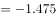万吨。

故正确答案为B。

备注：虽然题干表述是“五年来”，但实际上2010-2014年的年份差是4年。

---

### 第 2 题　qid 2633379 · 增长

2010年至2014年山东省粮食总产量的增速最快的是（    ）年。

- **A**. 2011　✅
- **B**. 2012
- **C**. 2013
- **D**. 2014

**答案**：A

**官方解析**

根据题干 “······增速最快的是”，可判定本题为一般增长率比较问题。定位表格，2010年至2014年，山东省粮食总产量分别为：4335.7、4426.3、4511.4、4528.2、4596.6万吨。根据公式，。各年份增速如下：

2011年，；2012年，；2013年，；2014年，；比较可得2011年分子最大分母最小，故分数最大，则增速最快的是2011年。

故正确答案为A。

---

### 第 3 题　qid 2262820 · 综合

2010年至2014年山东省油料总产量和单产的趋势图是（  ）。

- **A**. 

- **B**. 

- **C**. 

　✅
- **D**. 

**答案**：C

**官方解析**

定位表格材料可知2010年至2014年山东省油料总产量的变化趋势为下降、上升、下降、下降；单量的变化趋势为上升、上升、下降、下降，符合题意的为C项。（注：总量为系列1，单量为系列2）
故正确答案为C。

---

### 第 4 题　qid 2262821 · 综合

2014年山东省粮食种植面积在粮棉油总种植面积中约占（  ）成。

- **A**. 六
- **B**. 七
- **C**. 八　✅
- **D**. 九

**答案**：C

**官方解析**

由题意“2014年山东省粮食种植面积在粮棉油总种植面积中约占”判定此题为现期比重问题，定位表格材料可知2014年山东省粮食种植面积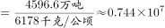 公顷，棉花种植面积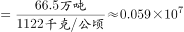 公顷，油料种植面积公顷，则2014年山东省粮食种植面积占粮棉油总种植面积的比重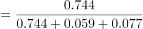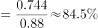，最接近于八成。

故正确答案为C。

---

### 第 5 题　qid 2262822 · 综合

下列说法不准确的是（  ）。

- **A**. 自2010年至2014年山东省粮食总产量逐年增加
- **B**. 粮食单产增速最快的一年是2012年　✅
- **C**. 棉花单产增速最快的一年是2014年
- **D**. 油料单产增速最快的一年是2012年

**答案**：B

**官方解析**

A项：2010-2014年，粮食总产量依次是4335.7万吨、4426.3万吨、4511.4万吨、4528.2万吨、4596.6万吨，逐年增加，正确；

B项：2011年粮食单产增速：；2012年粮食单产增速：；2013年与2014年粮食单产均下降，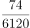与相比，分子大分母小，则，因此增速最快的是2011年。错误；

C项：2011年棉花单产增速：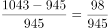，2012年与2013年棉花单产均为下降，2014年：，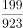与相比，分子大分母小，则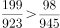，因此增速最快的是2014年。正确；

D项：2011年油料单产增速：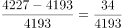，2012年油料单产增速：，2013年与2014年油料单产均下降，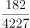与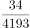相比，分母差不多，分子明显前者大，则，因此增速最快的是2012年。正确。

本题为选非题，故正确答案为B。

---

## 材料 2

        根据国家统计局最新发布的数据，2016年2月份，全国工业生产者出厂价格环比下降，同比下降。工业生产者购进价格环比下降，同比下降。1-2月平均，工业生产者出厂价格同比下降，工业生产者购进价格同比下降。

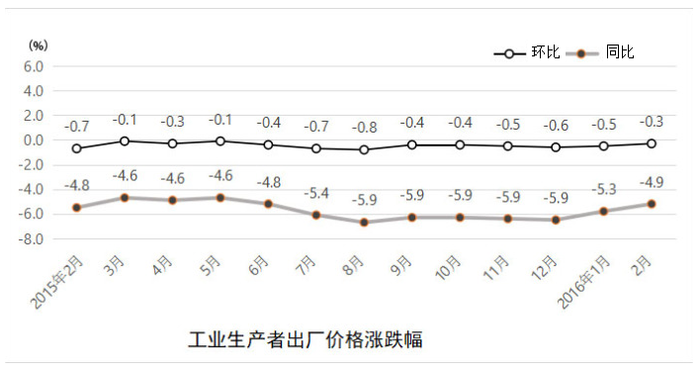

 

1.工业生产者价格同比变动情况 

        工业生产者出厂价格中，生产资料价格同比下降，影响全国工业生产者出厂价格总水平下降约4.8个百分点。其中，采掘工业价格下降，原材料工业价格下降，加工工业价格下降。生活资料价格同比下降，影响全国工业生产者出厂价格总水平下降约0.1个百分点。其中，食品价格上涨，衣着价格上涨，一般日用品价格下降，耐用消费品价格下降。

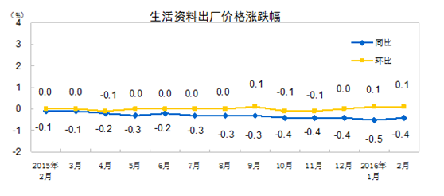

        据测算，在2月份-的全国工业生产者出厂价格总水平同比降幅中，去年价格变动的翘尾因素约为-4.1个百分点，新涨价因素约为-0.8个百分点。

        工业生产者购进价格中，黑色金属材料类价格同比下降，燃料动力类价格下降，有色金属材料及电线类价格下降，化工原料类价格下降。

2.工业生产者价格环比变动情况

        工业生产者出厂价格中，生产资料价格环比下降，影响全国工业生产者出厂价格总水平下降约0.3个百分点。其中，采掘工业价格下降，原材料工业价格下降，加工工业价格下降。生活资料价格环比上涨。其中，食品价格上涨，衣着价格持平，一般日用品价格上涨，耐用消费品价格下降。

        工业生产者购进价格中，燃料动力类价格环比下降，黑色金属材料类价格下降，有色金属材料及电线类价格上涨，农副产品类价格上涨。

### 第 6 题　qid 2262865 · 平均数

2015年2月份到2016年2月份生活资料出厂价格平均环比是（  ）。

- **A**. 
下降

- **B**. 
上升

- **C**. 
保持不变
　✅
- **D**. 
不能确定

**答案**：C

**官方解析**

由题意“2015年2月份到2016年2月份生活资料出厂价格平均环比”判定此题为一般增长率问题，定位图形三可知2015年2月份到2016年2月份生活资料出厂价格各月的环比中有三个为，三个为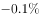，其余均为0，即平均数为0，所以2015年2月份到2016年2月份生活资料出厂价格平均环比保持不变。

故正确答案为C。

---

### 第 7 题　qid 2262870 · 增长

如果在2016年3月份生产资料出厂价格同比与2015年3月份有相同的变化量，那么可以预测2016年3月份的生产资料出厂价格同比是（  ）。

- **A**. 
下降
　✅
- **B**. 
下降

- **C**. 
下降

- **D**. 
下降

**答案**：A

**官方解析**

由题意“如果在2016年3月份生产资料出厂价格同比与2015年3月份有相同的变化量，那么可以预测2016年3月份的生产资料出厂价格同比是”判定此题为一般增长率问题，设2015年3月生产资料的出厂价格为A，定位图形四可知，2016年3月生产资料出厂价格的同比增长率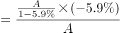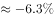，与A项最接近。

故正确答案为A。

---

### 第 8 题　qid 2262880 · 增长

从2015年2月份到2016年2月份，工业生产者出厂价格和工业生产者购进价格同比变化的极差分别是（  ）。

- **A**. 
，

- **B**. 
，
　✅
- **C**. 
，

- **D**. 
，

**答案**：B

**官方解析**

定位图一、图二可知，工业生产者出厂价格同比极差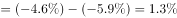，工业生产者购进价格同比极差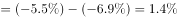。

故正确答案为B。

---

### 第 9 题　qid 2262886 · 增长

在2016年2月份工业生产者出厂价格同比下降中，新涨价因素所占的比例是（  ）。

- **A**. 

- **B**. 

- **C**. 

- **D**. 
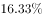
　✅

**答案**：D

**官方解析**

由题意“在2016年2月份工业生产者出厂价格同比下降中，新涨价因素所占的比例”判定此题为现期比重问题，定位文字材料第二段“在2月份的全国工业生产者出厂价格总水平同比降幅中，去年价格变动的翘尾因素约为-4.1个百分点，新涨价因素约为-0.8个百分点。”可知在2016年2月份工业生产者出厂价格同比下降中，新涨价因素所占的比例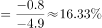。

故正确答案为D。

---

### 第 10 题　qid 2262887 · 综合

2016年2月份工业生产者出厂价格环比与生产资料出厂价格环比及生活资料出厂价格环比的关系分别是（  ）。

- **A**. 正相关和负相关　✅
- **B**. 正相关和正相关
- **C**. 负相关和正相关
- **D**. 负相关和负相关

**答案**：A

**官方解析**

定位图形材料一可知2016年2月份工业生产者出厂价格环比为，即2016年2月份工业生产者出厂价格环比下降，定位图形材料四可知2016年2月份生产资料出厂价格环比为，即2016年2月份生产资料出厂价格环比下降，定位图形材料三可知2016年2月份生活资料出厂价格环比为，即2016年2月份生活资料出厂价格环比上升，所以2016年2月份工业生产者出厂价格环比与生产资料出厂价格环比的关系为正相关，2016年2月份工业生产者出厂价格环比与生活资料出厂价格环比的关系为负相关。

故正确答案为A。

---
