# 2016年广东省公务员录用考试《行测》题（乡镇）

> 资料分析 · 15 题 · 广东 2016

## 材料 1

根据下列资料，回答86~90题：

        从2014年起，我省在粤东西北地区以县（市、区）为单位遴选首批14个省级新农村连片示范建设工程，三年将建成42个省级新农村示范片（不含珠三角地区）。根据工作进度安排，示范片建设一年初见成效，两年基本实现目标。与此同时，珠三角地区每年选取6个片区开展示范片建设，为期三年。

        截至2015年年底，全省第一、二批40个示范片（含珠三角6市）启动建设项目2693个（粤东西北1539个，珠三角1154个），竣工项目1711个（粤东西北821个，珠三角890个），累计投入各类资金40亿元（粤东西北16.6亿元，珠三角23.4亿元）。

        示范片村庄规划编制：首批示范片的64个行政村和375个自然村，已完成村庄规划编制。第二批示范片的59个行政村和386个自然村中，已完成村庄规划编制的行政村55个，自然村307个，分别占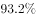和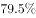。

        示范片村庄环境卫生：首批示范片中已完成环境卫生整治的自然村357个，占。第二批391个自然村中，310个自然村已完成环境卫生整治，占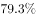。

        示范片自来水建设：首批示范片中有326个自然村实现通自来水，占。第二批391个自然村中，有的自然村实现通自来水。

        村巷道硬底化建设：首批示范片中完成村巷道硬底化建设的自然村有256个，占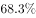。第二批中有的自然村完成村巷道硬底化建设。

        群众参与共谋共建情况：首批示范片375个自然村中，成立村民理事会的占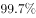。第二批391个自然村中，成立村民理事会的占。

### 第 1 题　qid 1796626 · 综合

在第一、二批40个示范片（含珠三角6市）已竣工的项目中，粤东西北地区约占了（  ）。

- **A**. 47%
- **B**. 48%　✅
- **C**. 49%
- **D**. 50%

**答案**：B

**官方解析**

由题目问“粤东西北地区约占了多少”判定本题为现期比重计算问题，从材料第二段可知“全省第一、二批40个示范片（含珠三角6市）竣工项目1711个，粤东西北821个”，则其所占比重为 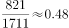，即所占比重约为48%。

故正确答案为B。

---

### 第 2 题　qid 1796630 · 综合

第二批示范片的自然村中，实现通自来水的约有（  ）个。

- **A**. 256
- **B**. 262　✅
- **C**. 267
- **D**. 273

**答案**：B

**官方解析**

由题目问“实现通自来水的有多少个”，结合材料第五段“第二批391个自然村中，有67.0%的自然村实现通自来水”，已知比重与整体的量求部分的量，判定本题为现期比重计算问题，则其个数为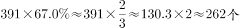

故正确答案为B。

---

### 第 3 题　qid 1796636 · 综合

首批示范片的自然村中，完成率最高的是（  ）。

- **A**. 村庄环境卫生
- **B**. 自来水建设
- **C**. 村巷道硬底化建设
- **D**. 群众参与共谋共建情况　✅

**答案**：D

**官方解析**

由题目问“完成率最高的是”，结合材料第四、五、六、七段分别给出各项完成率的数值，判定本题为排序类问题。分别查找可得村庄环境卫生完成率为95.2%，自来水建设完成率为86.9%，村巷道硬底化建设完成率为68.3%，群众参与共谋共建情况成立理事会的占99.7%，比较可得，首批示范片的自然村中，完成率最高的是群众参与共谋共建情况。
故正确答案为D。

---

### 第 4 题　qid 1796640 · 综合

第一、二批示范片的自然村中，完成率差距最大的是（    ）。

- **A**. 村庄规划编制　✅
- **B**. 村庄环境卫生
- **C**. 自来水建设
- **D**. 群众参与共谋共建情况

**答案**：A

**官方解析**

由题目问“完成率差距最大的是”，结合材料分别给出第一、二批示范片自然村各项的完成率，判定本题为简单加减计算问题。则各项完成率在第一、二批示范片中的差距分别为：村庄规划编制：100%-79.5%=20.5%，村庄环境卫生：95.2%-79.3%=15.9%，自来水建设：86.9%-67%=19.9%，群众参与共谋共建情况：99.7%-98.2%=1.5%，完成率差距最大的是村庄规划编制。
故正确答案为A。

---

### 第 5 题　qid 1796644 · 综合

下列说法有误的是（    ）。

- **A**. 第一、二批示范片建设中粤东西北启动的项目比珠三角多
- **B**. 第一、二批示范片建设中粤东西北的项目竣工率低于珠三角的项目竣工率
- **C**. 第二批示范片成立村民理事会的自然村比第一批少　✅
- **D**. 第一批示范片完成村庄规划编制的行政村比第二批多

**答案**：C

**官方解析**

A项：由材料第二段可知全省第一、二批40个示范片（含珠三角6市）启动建设项目中，粤东西北1539个，珠三角占1154个，前者大于后者，A项正确；

B项：由材料第二段可知全省第一、二批40个示范片（含珠三角6市）启动建设项目中，粤东西北1539个，珠三角占1154个，竣工项目中，粤东西北占821个，珠三角占890个，粤东西北启动项目比珠三角多，竣工项目比珠三角少，则其竣工率必小于珠三角，B项正确；

C项：由材料最后一段可知第一、二批自然村数量与成立村民理事会的占比，则第一批成立村民理事会的自然村个数为 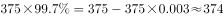个，第二批成立村民理事会的自然村个数为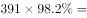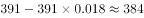个，后者大于前者，C项错误；

D项：由材料第三段可知，第一批示范片完成村庄规划编制的行政村个数为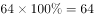个，第二批示范片完成村庄规划编制的行政村个数为55个，前者大于后者，D项正确。

本题为选非题，故正确答案为C。

---

## 材料 2

根据下列资料，回答91~95题：

        2010—2014年我国新型农村合作医疗情况

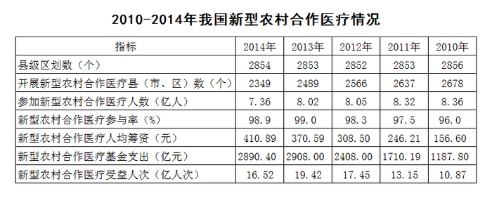

### 第 6 题　qid 1796650 · 增长

2011—2014年，新型农村合作医疗基金支出同比增长幅度最高的是（    ）年。

- **A**. 2011　✅
- **B**. 2012
- **C**. 2013
- **D**. 2014

**答案**：A

**官方解析**

由“同比增长幅度最高”可知，本题为一般增长率的比较问题。定位表格可得2010-2014年新型农村合作医疗基金支出的具体值，则各项增速约为：

A项：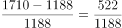；B项：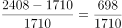C项：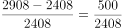；D项同比下降，排除。

对比B、C两项，C项分子小、分母大，则分数较小，排除C项；对比A、B两项，分子增长约，分母增长约，分母增速更快，分数变小，则A项更大。

故正确答案为A。

 

---

### 第 7 题　qid 1796652 · 比重

2010—2014年，开展新型农村合作医疗的县（市、区）数量占县级区划数90%以上的年份有（    ）个。

- **A**. 1
- **B**. 2　✅
- **C**. 3
- **D**. 4

**答案**：B

**官方解析**

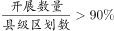，即开展数量＞县级区划数×0.9=县级区划数-县级区划数×0.1，即开展数量＞县级区划数-县级区划数×0.1。定位表格可得2010-2014年我国新型农村合作医疗县级区划数与开展数，则

2014年：2349＜2854-285；

2013年：2489＜2853-285；

2012年：2566＜2852-285；

2011年：2637＞2853-285；

2010年：2678＞2856-286；

满足条件的有2011与2010年两年。

故正确答案为B。

---

### 第 8 题　qid 1796654 · 增长

2011—2014年，新型农村合作医疗受益人次增长率最高的是（    ）年。

- **A**. 2011
- **B**. 2012　✅
- **C**. 2013
- **D**. 2014

**答案**：B

**官方解析**

由“增长率最高的是”可知，本题为一般增长率的比较问题。定位表格可得2010-2014年新型农村合作医疗受益人次的具体值，则各项增速约为：

A项：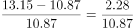；B项：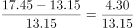；C项：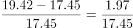；D项同比下降，排除。直除可得，A项首位商2，B项首位商3，C项首位商1，则B项最大。

故正确答案为B。

---

### 第 9 题　qid 1796656 · 综合

2010—2014年，参加新型农村合作医疗人数最多的一年比人数最少的一年多了（  ）亿。

- **A**. 0.31
- **B**. 0.34
- **C**. 0.65
- **D**. 1　✅

**答案**：D

**官方解析**

定位表格可得，2010-2014年参加新型农村合作医疗人数最多的一年为2010年，8.36亿人；最少的一年为2014年，7.36亿人。故二者之差=8.36-7.36=1亿人。
故正确答案为D。

---

### 第 10 题　qid 1796658 · 综合

下列说法有误的是（    ）。

- **A**. 新型农村合作医疗基金支出逐年增加　✅
- **B**. 参加新型农村合作医疗人数最少的一年也是人均筹资最多的一年
- **C**. 新型农村合作医疗参与率最高的是2013年
- **D**. 参加新型农村合作医疗人数最多的是2010年

**答案**：A

**官方解析**

根据表格材料逐项分析，找出说法错误的一项。
A项：新型农村合作医疗基金支出在2014年出现下降，说法错误；
B项：根据表格可知，人数最少的与人均筹资最多的均为2014年，说法正确；
C项：新型农村合作医疗参与率最高的为2013年，说法正确；
D项：参加新型农村合作医疗人数最多的是2010年，说法正确。
本题为选非题，故正确答案为A。

---

## 材料 3

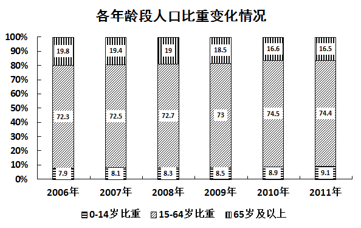

### 第 11 题　qid 1796548 · 平均数

2006年至2011年期间，平均每年增加的人数为（    ）万人。

- **A**. 531.3
- **B**. 657.4　✅
- **C**. 752.4
- **D**. 839.2

**答案**：B

**官方解析**

根据题干中“平均每年增加的人数”，可以判定本题为年均增长量问题。定位图形材料1，可以得到2011年总人口为134735万人，2006年总人口为131448万人。2006年至2011年期间，平均每年增加的人数为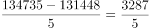，首位商6。 

故正确答案为B。

---

### 第 12 题　qid 1796584 · 增长

按2011年的人口自然增长率计算，预计2012年的人口约为（    ）万人。

- **A**. 135382　✅
- **B**. 135409
- **C**. 141129
- **D**. 141202

**答案**：A

**官方解析**

根据题干中“预计2012年的人口”，可以判定本题为现期计算问题。定位图形材料1，可以得到2011年总人口为134735万人，自然增长率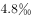。根据公式：现期量=基期量×（1+增长率），2012年的人口约为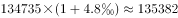。

故正确答案为A。

---

### 第 13 题　qid 1796544 · 综合

2011年的总人口中，“65岁及以上”的人口比“0-14岁”的人口大约多（    ）万人。

- **A**. 7910
- **B**. 8850
- **C**. 9320
- **D**. 9970　✅

**答案**：D

**官方解析**

根据题干中“2011年，‘65岁及以上’的人口比‘0-14岁’的人口”，可以判断本题为现期比重计算问题。定位图形材料1，可以得到2011年总人口为134735万人。图形材料2，可以得到“0-14岁”的比重为9.1%，“65岁及以上”的比重为16.5%。2011年“65岁及以上”的人口比“0-14岁”的人口多134735×（16.5%-9.1%）=134735×7.4%≈134735×≈9980万人，与D项最接近。

故正确答案为D。

---

### 第 14 题　qid 1796564 · 综合

以下说法错误的是（    ）。

- **A**. 2007年至2010年，每年比上年增加的人口数量一直递减
- **B**. 人口自然增长率不断下降并趋于平缓
- **C**. 人口自然增长越来越少，相比2010年，2011年的人口增长几乎停滞　✅
- **D**. 2009年的人口自然增长率下降得最快

**答案**：C

**官方解析**

根据题干“以下说法错误的是”，可以判断为综合分析题。
A项，定位图形材料1，
2007年增加的人口数量为132129-131448=681万人；
2008年增加的人口数量为132802-132129=673万人；
2009年增加的人口数量为133450-132802=648万人；
2010年增加的人口数量为134091-133450=641万人；
可以看出，每年比上年增加的人口数量一直递减。A项正确。
B项，定位图形材料1的折线，人口自然增长率不断下降并趋于平缓。B项正确。
C项，定位图形材料1，2011年的自然增长率与2010年的一致，但是人口数量还是增长。C项错误。
D项，定位图形材料1，
2007年的人口自然增长率下降5.3-5.2=0.1；
2008年的人口自然增长率下降5.2-5.1=0.1；
2009年的人口自然增长率下降5.1-4.9=0.2；
2010年的人口自然增长率下降4.9-4.8=0.1；
2011年的人口自然增长率下降率为0。
可以看出2009年是下降最快的。D项正确。
本题为选非题，故正确答案为C。
备注：此题可跳过A项，看BC项，选出答案，D项不看。

---

### 第 15 题　qid 1796572 · 综合

根据资料，我们可以得知（    ）。

- **A**. 65岁及以上人口数量越来越多
- **B**. 0-14岁人口占总人口的比重越来越大　✅
- **C**. 除了2011年，15-64岁人口数量每年都在增长
- **D**. 65岁及以上人口占总人口的比重越来越大

**答案**：B

**官方解析**

根据题干“根据材料，我们可以得知”，可以判断为综合分析题。
A项，定位图形材料1可以得到人口数量，图形材料2可以得到65岁及以上的人口比重。此题需要每一年的人口总量和比重相乘，计算复杂，考虑跳过；
B项，定位图形材料2，最下面的数字即为0-14岁比重，可以看出比重越来越大，B项正确；
C项，定位图形材料1可以得到人口数量，图形材料2可以得到15-64岁的人口比重。两者相乘即为每年15-64岁人口数量。图1中的人口数量在逐年增加，图2中的比重也在增长，两者相乘结果也在增长。而2010年15-64岁人口数量为134091×74.5%；2011年15-64岁人口数量为134735×74.4%；两数相乘，比重差不多大，人口总量大则乘积大。可知，2006-2011年每年都在增长。C项错误；
D项，定位图形材料2，2006年65岁及以上人口比重为19.8%；2007年65岁及以上人口比重为19.4%；可以看出比重并非越来越大。D项错误。
故正确答案为B。

---
