# 2016年广东省公务员录用考试《行测》题（县级以上）

> 资料分析 · 15 题 · 广东 2016

## 材料 1

### 第 1 题　qid 1796548 · 平均数

2006年至2011年期间，平均每年增加的人数为（    ）万人。

- **A**. 531.3
- **B**. 657.4　✅
- **C**. 752.4
- **D**. 839.2

**答案**：B

**官方解析**

根据题干中“平均每年增加的人数”，可以判定本题为年均增长量问题。定位图形材料1，可以得到2011年总人口为134735万人，2006年总人口为131448万人。2006年至2011年期间，平均每年增加的人数为，首位商6。 

故正确答案为B。

---

### 第 2 题　qid 1796584 · 增长

按2011年的人口自然增长率计算，预计2012年的人口约为（    ）万人。

- **A**. 135382　✅
- **B**. 135409
- **C**. 141129
- **D**. 141202

**答案**：A

**官方解析**

根据题干中“预计2012年的人口”，可以判定本题为现期计算问题。定位图形材料1，可以得到2011年总人口为134735万人，自然增长率。根据公式：现期量=基期量×（1+增长率），2012年的人口约为。

故正确答案为A。

---

### 第 3 题　qid 1796544 · 综合

2011年的总人口中，“65岁及以上”的人口比“0-14岁”的人口大约多（    ）万人。

- **A**. 7910
- **B**. 8850
- **C**. 9320
- **D**. 9970　✅

**答案**：D

**官方解析**

根据题干中“2011年，‘65岁及以上’的人口比‘0-14岁’的人口”，可以判断本题为现期比重计算问题。定位图形材料1，可以得到2011年总人口为134735万人。图形材料2，可以得到“0-14岁”的比重为9.1%，“65岁及以上”的比重为16.5%。2011年“65岁及以上”的人口比“0-14岁”的人口多134735×（16.5%-9.1%）=134735×7.4%≈134735×≈9980万人，与D项最接近。

故正确答案为D。

---

### 第 4 题　qid 1796564 · 综合

以下说法错误的是（    ）。

- **A**. 2007年至2010年，每年比上年增加的人口数量一直递减
- **B**. 人口自然增长率不断下降并趋于平缓
- **C**. 人口自然增长越来越少，相比2010年，2011年的人口增长几乎停滞　✅
- **D**. 2009年的人口自然增长率下降得最快

**答案**：C

**官方解析**

根据题干“以下说法错误的是”，可以判断为综合分析题。
A项，定位图形材料1，
2007年增加的人口数量为132129-131448=681万人；
2008年增加的人口数量为132802-132129=673万人；
2009年增加的人口数量为133450-132802=648万人；
2010年增加的人口数量为134091-133450=641万人；
可以看出，每年比上年增加的人口数量一直递减。A项正确。
B项，定位图形材料1的折线，人口自然增长率不断下降并趋于平缓。B项正确。
C项，定位图形材料1，2011年的自然增长率与2010年的一致，但是人口数量还是增长。C项错误。
D项，定位图形材料1，
2007年的人口自然增长率下降5.3-5.2=0.1；
2008年的人口自然增长率下降5.2-5.1=0.1；
2009年的人口自然增长率下降5.1-4.9=0.2；
2010年的人口自然增长率下降4.9-4.8=0.1；
2011年的人口自然增长率下降率为0。
可以看出2009年是下降最快的。D项正确。
本题为选非题，故正确答案为C。
备注：此题可跳过A项，看BC项，选出答案，D项不看。

---

### 第 5 题　qid 1796572 · 综合

根据资料，我们可以得知（    ）。

- **A**. 65岁及以上人口数量越来越多
- **B**. 0-14岁人口占总人口的比重越来越大　✅
- **C**. 除了2011年，15-64岁人口数量每年都在增长
- **D**. 65岁及以上人口占总人口的比重越来越大

**答案**：B

**官方解析**

根据题干“根据材料，我们可以得知”，可以判断为综合分析题。
A项，定位图形材料1可以得到人口数量，图形材料2可以得到65岁及以上的人口比重。此题需要每一年的人口总量和比重相乘，计算复杂，考虑跳过；
B项，定位图形材料2，最下面的数字即为0-14岁比重，可以看出比重越来越大，B项正确；
C项，定位图形材料1可以得到人口数量，图形材料2可以得到15-64岁的人口比重。两者相乘即为每年15-64岁人口数量。图1中的人口数量在逐年增加，图2中的比重也在增长，两者相乘结果也在增长。而2010年15-64岁人口数量为134091×74.5%；2011年15-64岁人口数量为134735×74.4%；两数相乘，比重差不多大，人口总量大则乘积大。可知，2006-2011年每年都在增长。C项错误；
D项，定位图形材料2，2006年65岁及以上人口比重为19.8%；2007年65岁及以上人口比重为19.4%；可以看出比重并非越来越大。D项错误。
故正确答案为B。

---

## 材料 2

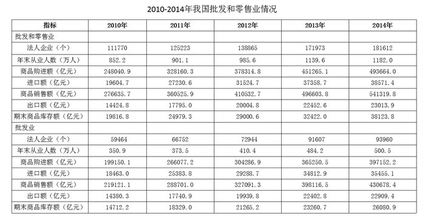

### 第 6 题　qid 2031584 · 综合

2013年，批发业法人企业比零售业多（    ）个。

- **A**. 7023
- **B**. 7158
- **C**. 8281
- **D**. 11241　✅

**答案**：D

**官方解析**

定位表格可知，2013年批发和零售业法人企业171973个，批发业91607个，则批发业法人企业比零售业多 且尾数为1。

故正确答案为D。

---

### 第 7 题　qid 2031586 · 综合

零售业期末商品库存额最多的年份是（    ）年。

- **A**. 2011
- **B**. 2012
- **C**. 2013
- **D**. 2014　✅

**答案**：D

**官方解析**

定位表格可知，2011年—2014年批发和零售业期末商品库存额分别为24979.3亿元、29000.6亿元、32422亿元、38123.8亿元，2011年—2014年批发业期末商品库存额分别为18329.0亿元、21265.2亿元、23260.7亿元、26080.9亿元，作差后即可得出，2011年—2014年零售业期末商品库存额分别约为6500亿元、7800亿元、9100亿元、12000亿元，最大值为2014年。
故正确答案为D。

---

### 第 8 题　qid 2031590 · 增长

与2013年相比，下列指标在2014年增长额最小的是（    ）。

- **A**. 批发业出口额　✅
- **B**. 批发业进口额
- **C**. 零售业商品购进额
- **D**. 零售业商品销售额

**答案**：A

**官方解析**

根据“2014年增长额最小的是”，判断本题为增长量比较问题。定位表格，2014年，批发业出口额增长量为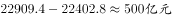，批发业进口额增长量为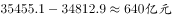，零售业商品购进额增长量为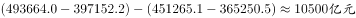，零售业商品销售额增长量为，则增长额最小的为批发业出口额。

故正确答案为A。

---

### 第 9 题　qid 2031592 · 综合

以下各项中两个指标之间差额最大的是（    ）。

- **A**. 2014年批发业期末商品库存额与零售业期末商品库存额
- **B**. 2013年批发业进口额与出口额
- **C**. 2012年批发和零售业商品销售额与商品购进额　✅
- **D**. 2011年批发和零售业进口额与出口额

**答案**：C

**官方解析**

定位表格，A项差额为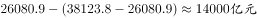，B项差额为，C项差额为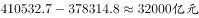，D项差额为，则差额最大为2012年批发和零售业商品销售额与商品购进额。

故正确答案为C。 

---

### 第 10 题　qid 2031596 · 综合

以下说法正确的是（    ）。

- **A**. 2010-2013年，批发业每年年末从业人数均多于零售业
- **B**. 2010-2014年，零售业出口额逐年上升
- **C**. 相比2010年，2013年的零售业进口额翻了一番　✅
- **D**. 2011-2014，批发业期末商品库存额增幅逐年收窄

**答案**：C

**官方解析**

A项：定位表格，以2010年为例，批发业年末从业人数为350.9万人，批发和零售业年末从业人数为852.2万人，批发业与零售业人数差额为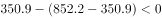，错误；

B项：定位表格，2012年零售业出口额为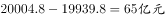，2013年零售业出口额为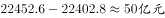，不满足逐年上升，错误；

C项：定位表格，2010年零售业进口额为，2013年零售业进口额为，倍数为，约翻一番，正确；

D项：定位表格，以2013年为例，批发业期末商品库存额的增幅为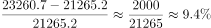，2014年批发业期末商品库存额的增幅为，所以2014年增幅没有收窄，错误。

故正确答案为C。

---

## 材料 3

        2000年、2005年、2010年我国普通高中专任教师总人数分别为756850人、1299460人、1518194人。其中，女性人数分别为273110人、558625人、723566人。

        从年龄结构看，2000年、2005年、2010年31-35岁普通高中专任教师总人数分别为185873人、265509人、322829人，其中，女性人数分别为68346人、117838人、164175人；36-40岁普通高中专任教师总人数分别为117242人、248837人、272313人，其中，女性人数分别为35751人、95566人、122953人；41-45岁普通高中专任教师总人数分别为55522人、137235人、239616人，其中，女性人数分别为15728人、42931人、93641人。

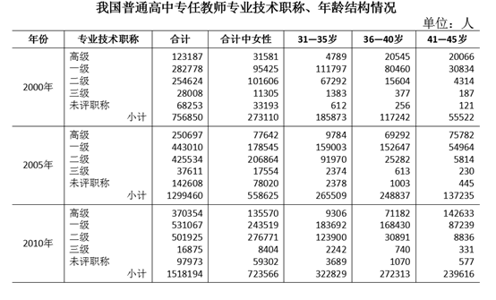

### 第 11 题　qid 2031604 · 综合

2000年，我国31-45岁普通高中专任教师中，共有（    ）人未评职称。

- **A**. 68253
- **B**. 33193
- **C**. 989　✅
- **D**. 612

**答案**：C

**官方解析**

定位表格可得，2000年，我国普通高中专任教师在31-35、36-40、41-45岁中未评职称人数分别为：612人、256人、121人，则31-45岁中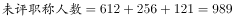人。

注意：也可根据结果尾数为9，或结果大于612且不大于10000来快速选出答案。

故正确答案为C。

---

### 第 12 题　qid 2031606 · 平均数

2005年，我国31-45岁的普通高中专任教师的平均年龄可能会是（    ）岁。

- **A**. 34
- **B**. 37　✅
- **C**. 40
- **D**. 41

**答案**：B

**官方解析**

由问题所求，“2005年，我国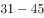岁的普通高中专任教师的平均年龄”可判定此题为平均数问题。问题所求“可能会是（ ）岁”，需要计算平均数取值范围。定位表格可得，2005年，普通高中专任教师在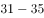岁、岁、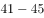岁的人数分别为265509人、248837人、137235人，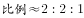。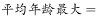岁，平均年龄最小为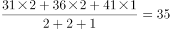岁，所以平均年龄的取值范围为岁，只有B项满足。

故正确答案为B。

---

### 第 13 题　qid 2031608 · 综合

2010年，我国41-45岁的普通高中专任教师中，至少约有（    ）万人在2000年还不是普通高中专任教师。

- **A**. 5　✅
- **B**. 8
- **C**. 18
- **D**. 16

**答案**：A

**官方解析**

求2010年41-45岁的普通高中专任教师中在2000年还不是普通高中专任教师的人数最小值，即要使2010年41-45岁的普通高中专任教师在2000年31-35岁时已经是普通高中专任教师的人数最多，最多的情况为2000年31-35岁的普通高中专任教师在2010年41-45岁时仍然全部是普通高中专任教师。定位表格可得，2000年31-35岁的普通高中专任教师为185873人，2010年41-45岁的普通高中专任教师为239616人。，A项最接近。

故正确答案为A。

---

### 第 14 题　qid 2031610 · 比重

我国普通高中专任教师中，以下年龄组女性所占比重最大的是（    ）。

- **A**. 2005年的36-40岁
- **B**. 2010年的31-35岁　✅
- **C**. 2010年的36-40岁
- **D**. 2010年的41-45岁

**答案**：B

**官方解析**

由问题所求“······以下年龄组女性所占比重最大的是”，材料已知所有时间的数据，可判定此题为现期比重问题，定位表格可得，

A项：2005年的36-40岁总人数=248837人，女性人数=95566人，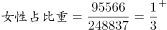；

B项：2010年的31-35岁总人数=322829人，女性人数=164175人，；

C项：2010年的36-40岁总人数=272313人，女性人数=122953人，；

D项：2010年的41-45岁总人数=239616人，女性人数=93641人，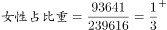。

B项比重值最大。

故正确答案为B。

---

### 第 15 题　qid 2031616 · 综合

以下说法正确的是（    ）。

- **A**. 
我国普通高中专任教师中，女性教师人数在2005年达到顶峰后逐年减少

- **B**. 
2005年我国36-40岁一级普通高中专任教师中有6万多人在2010年评上了高级教师

- **C**. 
2000-2010年我国普通高中专任教师人数以每年约速度增长

- **D**. 
2010年我国未评职称的普通高中专任教师占专任教师总人数的比重，比2000年下降了近3个百分点
　✅

**答案**：D

**官方解析**

A项：定位表格可得，2005年女性教师人数为558625人，2010年为723566人，

方法一：没有2006-2009年的数据，所以条件不足，无法确定是否逐年减少；

方法二：仅看2010年和2005年人数是增加的，故不可能在2005年以后逐年减少，说法错误；

B项：定位表格可得，2005年的36-40岁高级教师为69292人,在2010年为41-45岁，对应高级教师为142633人，二者差值即新增加高级教师人数，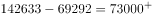人，故新评上的高级教师人数至少应为7万多人，说法错误；

C项：定位表格可得，2000年普通高中专任教师人数为756850人，2010年为1518194人，则2010年比2000年的，若以每年约速度增长，则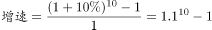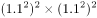，故年均增长率应小于，说法错误；

D项：定位表格可得，2010年，普通高中专任教师人，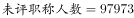人，；2000年，普通高中专任教师人，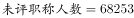人，，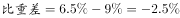，下降了近3个百分点，说法正确。

故正确答案为D。

注：B项，因材料中没有提及评级方式，若可以跨级评职称，则新评上高级教师的不一定是原来的一级老师，无法计算确切数值，选项仍然错误。

---
