# 2016年广州市公务员录用考试《行测》题

> 资料分析 · 16 题 · 广州市考 2016

## 材料 1

       2012年，A国取得了的经济增长速度，超过世界平均水平近1倍。2012年，A国的进出口总额为3816.5亿美元，同比增长；其中出口1900亿美元，同比降低，进口1916.5亿美元，同比增长。

       2012年，A国吸引的外国直接投资接近200亿美元，全球排名第17位，较上年上升4位。来自A国的官方投资统计机构的数据显示，2012年吸引外资前五的行业分别是采矿业、金属机械及电子业、交通通信业、化工制药业和机动车及运输设备制造业；排名前五名的国家分别是新加坡(49亿美元)、日本（25亿美元）、韩国（19亿美元）、美国（12亿美元）和毛里求斯（11亿美元）。

       2012年，B国GDP为2828亿美元，经济增长速度比上年略有降低，但依然超过。2012年，B国的进出口总额1790.1亿美元，比上年降低了；其中进口358.7亿美元，同比降低，出口1431.4亿美元，同比增长。B国的贸易顺差由上年的608.9亿美元，增长到2012年的1072.7亿美元，增长了，其中进口较上年减少272.2亿美元，占贸易顺差的。一方面，B国不断采取措施，改善国内投资环境，吸引外资进入；另一方面，B国在电力、电信、交通运输、法律法规执行力、政治局势和安全等方面存在许多不足，因此，B国的外资流入表现出波动大且增长迅速的特征。2011年，B国外资净流入为89.2亿美元，比上一年增长，比2004年增长了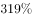；在2004—2011年，最高增长率达到了，最低的增长率为，波动幅度大。

       2012年，C国的经济增长达到。该国国际贸易的增速快于国内经济的增速，进出口总额为7857.3亿美元，同比增长，其中出口3859.3亿美元，同比增长，进口3998亿美元，同比增长。

       2012年，C国的对外投资和吸引外资呈现出两种截然不同的趋势。数据显示，2012年，C国对外投资额约为260亿美元，世界排名由上年的第28位上升到2012年的第15位。2012年，C国吸引外国直接投资126.6亿美元，同比减少，为近12年来最低。从投资来源国来看，来自美国的占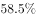，日本占，加拿大占，德国占，荷兰占。

### 第 1 题　qid 2062828 · 综合

2012年，A国机动车及运输设备制造业吸引外国直接投资最多不可能超过（    ）亿美元。

- **A**. 40　✅
- **B**. 30
- **C**. 20
- **D**. 10

**答案**：A

**官方解析**

根据“2012年，……投资最多不可能超过（    ）亿美元”，判断本题为现期计算问题。定位材料第二段，2012年，A国吸引的外国直接投资接近200亿美元，2012年吸引外资前五的行业分别是采矿业、金属机械及电子业、交通通信业、化工制药业和机动车及运输设备制造业；则机动车及运输设备制造业不可能超过。

故正确答案为A。

---

### 第 2 题　qid 2062830 · 增长

A、B、C三个国家2012年的进出口各项指标中，（    ）的同比增长率最高。

- **A**. A国的进口额
- **B**. B国的出口额
- **C**. B国的贸易顺差额　✅
- **D**. C国的出口额

**答案**：C

**官方解析**

根据“······同比增长率最高”，判断本题为增长率比较问题。定位材料，A国的进口额同比增长，B国出口额同比增长，B国的贸易顺差额同比增长，C国出口额同比增长。因此B国的贸易顺差额同比增长率最高，C项正确。

故正确答案为C。

---

### 第 3 题　qid 2062832 · 综合

2011年，C国吸引的外国直接投资约等于（    ）。

- **A**. 2012年A国进口增量的2倍
- **B**. 2011年B国外资净流入额
- **C**. 2012年韩国对A国直接投资的10倍　✅
- **D**. 2012年C国进出口贸易差额

**答案**：C

**官方解析**

根据“2011年，C国吸引的外国直接投资约等于”以及选项中为各项数据，判断本题为基期比较问题。定位材料，2012年，C国吸引外国直接投资126.6亿美元，同比减少。2011年C国吸引外国直接投资为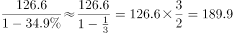亿美元。A项数据为：亿美元；B项数据为89.2亿美元；C项数据为：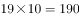亿美元；D项数据为：亿美元。C项数据最接近。

故正确答案为C。

---

### 第 4 题　qid 2062834 · 综合

下列图形与2004年至2011年B国外资净流入状况最为相符的是（    ）。

- **A**. 

- **B**. 
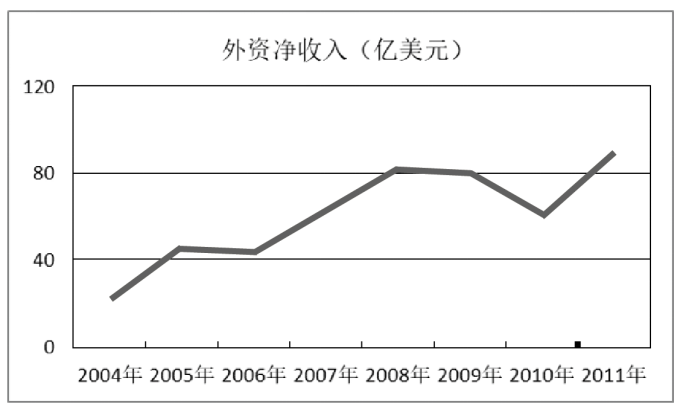
　✅
- **C**. 

- **D**. 

**答案**：B

**官方解析**

根据题目所求为“2004年至2011年B国外资净流入状况”，结合材料所给时间为2012年、2011年，判断本题为基期计算问题。定位材料第三段，2011年，B国外资净流入为89.2亿美元，比上一年增长，比2004年增长了。

观察选项，A、C两项，2011年数值都只是略大于80亿美元，实际值为89.2亿美元，排除A、C两项；

代入公式：，可得：2004年B国外资净流入为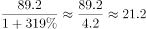亿美元，观察选项，排除D项（2004年：约40亿美元）。

故正确答案为B。

备注：B项的2004年数值在图中显示要比21.2大一些，易被排除，误选C项。而2010年B国外资净流入为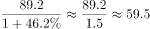亿美元，C项仅约为40亿美元，错误。当选项不足够严谨时，粉笔建议做题用对比择优的思维，C项明显偏离更多，综合考虑，建议选B项。

---

### 第 5 题　qid 2062836 · 综合

以下说法错误的是（    ）。

- **A**. 2012年，A国的进口增长速度快于经济和出口的增长速度
- **B**. 2012年，C国的经济增长速度要慢于世界经济增长速度　✅
- **C**. 2012年，日本对C国的直接投资额低于其对A国的直接投资额
- **D**. 2012年，B国贸易顺差的扩大主要是由于进口大幅下降造成的

**答案**：B

**官方解析**

A项：定位第一段材料，A国进口同比增长，出口同比降低为，经济增长速度为，进口同比增长率最高，正确；

B项：定位第一段材料和第四段，世界经济增长速度为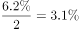，C国的经济增速为。C国的经济增长速度要快于世界经济增长速度，错误；

C项：定位第一段材料和最后一段材料，2012年，日本对A国投资25亿美元，对C国投资额为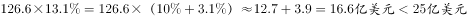，正确；

D项：定位材料第三段，B国的贸易顺差由上年的608.9亿美元，增长到2012年的1072.7亿美元，增长了，其中进口较上年减少272.2亿美元，占贸易顺差的，正确。

本题为选非题，故正确答案为B。

---

## 材料 2

       2015年，H市全社会用电量1405.55亿千瓦时，比上年增长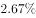。全年各产业和生活用电情况分别为：第一产业用电量7.35亿千瓦时，比上年增长；第二产业用电量800.37亿千瓦时，比上年增长；第三产业用电量412.34亿千瓦时，比上年增长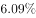；生活用电量由城镇居民用电量与乡村居民用电量构成，共计185.49亿千瓦时，比上年增长，其中，城镇居民用电量增长，乡村居民用电量增长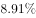。

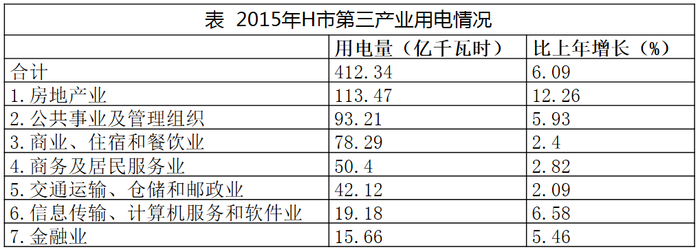

### 第 6 题　qid 2062838 · 综合

2015年，H市五个高耗能行业用电量约占规模以上工业用电量的( )。

- **A**. 

- **B**. 

　✅
- **C**. 
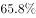

- **D**. 

**答案**：B

**官方解析**

根据“2015年······占······”，判断本题为现期比重问题。定位表1，五个高耗能行业用电量分别为44.18亿千瓦时，99.8亿千瓦时，16.23亿千瓦时，153.17亿千瓦时，110.15亿千瓦时，规模以上工业用电量为706.95亿千瓦时。所求，B项最接近。

故正确答案为B。

---

### 第 7 题　qid 2062840 · 综合

2015年H市以下行业中，用电量最大的是( )。

- **A**. 黑色金属冶炼及压延加工业　✅
- **B**. 房地产业
- **C**. 公共事业及管理组织
- **D**. 电力、热力的生产和供应业

**答案**：A

**官方解析**

定位两个表格，黑色金属冶炼及压延加工业为153.17亿千瓦时，房地产业为113.47亿千瓦时，公共事业及管理组织为93.21亿千瓦时，电力、热力的生产和供应业为110.15亿千瓦时。用电量最大的是黑色金属冶炼及压延加工业。
故正确答案为A。

---

### 第 8 题　qid 2062842 · 增长

2015 年，H市各产业和生活用电同比增量最大的是( )。

- **A**. 第一产业用电
- **B**. 第二产业用电
- **C**. 第三产业用电　✅
- **D**. 生活用电

**答案**：C

**官方解析**

根据“2015年······同比增量最大的是”，判断本题为增长量比较问题。定位文字材料，第一产业用电量7.35亿千瓦时，比上年增长；第二产业用电量800.37亿千瓦时，比上年增长；第三产业用电量412.34亿千瓦时，比上年增长；生活用电量共计185.49亿千瓦时，比上年增长。根据增长量公式，第一产业：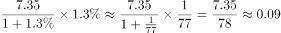亿千瓦时；第二产业：亿千瓦时；第三产业：亿千瓦时；生活用电：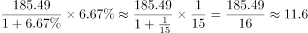亿千瓦时。

因此第三产业用电同比增量最大。

故正确答案为C。

---

### 第 9 题　qid 2062844 · 综合

以下数据不能从材料中得到的是：

- **A**. 2014年，城镇居民和乡村居民用电量之比
- **B**. 2014年，化学原料及化学制品制造业用电量占第二产业用电量的比例
- **C**. 2014年，第三产业用电量同比上年的增长率　✅
- **D**. 2014年，第二产业用电量与第三产业用电量的比值

**答案**：C

**官方解析**

根据选项所求数据均为2014年数据，而材料中数据为2015年，判断本题为基期计算问题。A项：定位文字材料，生活用电量比上年增长，其中，城镇居民用电量增长，乡村居民用电量增长。根据线段法，2014年，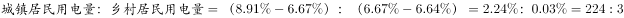，A项可求，排除；

B项：定位文字第一段和表1数据，第二产业用电量800.37亿千瓦时，比上年增长；化学原料及化学制品制造业用电量为99.8亿千瓦时，比上年增长。现期量和增长率都有，根据基期比重公式，B项可求，排除；

C项：定位文字材料，第三产业用电量412.34亿千瓦时，比上年增长；关于第三产业并无其他数据，C项不可求，当选；

D项：定位文字材料，第二产业用电量800.37亿千瓦时，比上年增长；第三产业用电量412.34亿千瓦时，比上年增长；根据基期公式，2014年第二产业和第三产业都可以求出，D项可求，排除。

本题为选非题，故正确答案为C。

---

### 第 10 题　qid 2062846 · 综合

以下关于2015年H市用电情况的说法，不正确的是：

- **A**. 第一产业用电量还不到全市用电量的百分之一
- **B**. 第三产业用电量增长主要源于房地产业用电量的增长
- **C**. 房地产业和公共事业及管理组织用电量占第三产业用电量一半以上
- **D**. 规模以上工业用电量微降主要源于非金属矿物制品业用电量大幅下降　✅

**答案**：D

**官方解析**

A项：定位文字材料，2015年，H市全社会用电量1405.55亿千瓦时，第一产业用电量7.35亿千瓦时，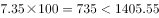，第一产业用电量不到全市用电量的百分之一，A项正确，排除；

B项：定位表2，第三产业中，房地产业的现期量和增长率都是最大，因此第三产业用电量增长主要源于房地产业用电量的增长，B项正确，排除；

C项：定位表2，房地产业用电量113.47亿千瓦时，公共事业及管理组织用电量93.21亿千瓦时。二者占第三产业的比重=，C项正确，排除；

D项：定位表1，在规模以上工业用电量中，最大的是黑色金属冶炼及压延加工业为153.17亿千瓦时，其同比下降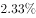，则减少量为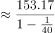亿千瓦时；非金属矿物制品业用电量为16.23亿千瓦时，同比下降，则减少量为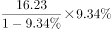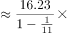亿千瓦时，显然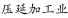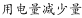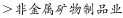。因此规模以上工业用电量微降并非主要源于非金属矿物制品业用电量大幅下降，D项错误，当选。

本题为选非题，故正确答案为D。

---

## 材料 3

为了衡量农民工在市民化过程中政府的公共支出，某研究中心对C市、Z市、W市、J市四个城市进行了调研测算。

### 第 11 题　qid 2062848 · 平均数

四个城市中，农民工市民化所需的民政部门的其他社会保障人均公共成本最高的是：

- **A**. C市
- **B**. Z市
- **C**. W市
- **D**. J市　✅

**答案**：D

**官方解析**

定位表格材料第4项，J市农民工市民化所需的民政部门的其他社会保障人均公共成本为元；Z市为元；W市为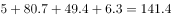元；C市为元。因此农民工市民化所需的民政部门的其他社会保障人均公共成本最高的是J市。

故正确答案为D。

---

### 第 12 题　qid 2062850 · 平均数

四个城市中，农民工市民化的基本养老保险人均公共成本最低的城市，其市民化的义务教育人均公共成本位列：

- **A**. 第一　✅
- **B**. 第二
- **C**. 第三
- **D**. 第四

**答案**：A

**官方解析**

根据“市民化的义务教育人均公共成本”为平均数，判断本题为现期平均数的比较。定位表格第3项，农民工市民化的基本养老保险人均公共成本最低的城市是W市，因为都是小学生、中学生、校舍3项，平均数比较直接比较3项总和即可。W市农民工市民化的义务教育人均公共成本为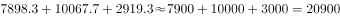元；J市为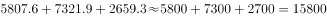元；Z市为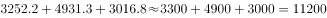元；C市为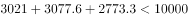元。因此W市位列第一。

故正确答案为A。

---

### 第 13 题　qid 2062852 · 平均数

农民工市民化的基本养老保险和住房两项人均公共成本最高的城市与最低的城市，相差约( )元。

- **A**. 8000
- **B**. 9000
- **C**. 10000
- **D**. 11000　✅

**答案**：D

**官方解析**

定位表格第3项和第6项，农民工市民化的基本养老保险和住房两项人均公共成本分别为：；；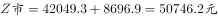；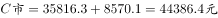。最高的城市与最低的城市之差为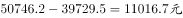。D项最接近。

故正确答案为D。

---

### 第 14 题　qid 2062854 · 平均数

如果将农民工市民化所需的九年义务教育阶段人均公共成本摊分到每一年，则Z市的该成本接近该市( )。

- **A**. 5年的市民化所需城市管理人均公共成本费用　✅
- **B**. 15年的市民化所需低保人均公共成本费用
- **C**. 10年的市民化所需居民合作医疗保险人均公共成本费用
- **D**. 30年的市民化所需医疗等救助人均公共成本费用

**答案**：A

**官方解析**

根据所求为Z市的九年义务教育人均公共成本与其他指标的比较，判断本题为现期计算问题。Z市农民工市民化所需的九年义务教育阶段每年所需人均公共成本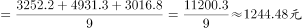。A项为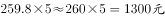；B项为；C项为；D项为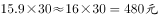。因此所求数据接近A项。

故正确答案为A。

---

### 第 15 题　qid 2062856 · 综合

以下说法错误的是：

- **A**. Z市与C市农民工市民化的住房人均公共成本最为接近，而城市管理费用人均公共成本相差最多
- **B**. 仅有C市未对农民工市民化中的孤寡老人付出公共成本，却付出了妇幼保健等公共成本　✅
- **C**. W市的农民工市民化所需的居民合作医疗保险人均公共成本虽然在四个城市中位居中下，但医疗等救助人均公共成本却是最高的
- **D**. J市的农民工市民化所需居民合作医疗保险和妇幼保健两项人均公共成本是四个城市中最高的

**答案**：B

**官方解析**

A项：定位表格最后两项，农民工市民化城市管理费用人均公共成本最小的是Z市，最大的是C市，因此这二者相差最大。农民工市民化住房人均公共成本最小的是Z市和C市，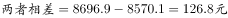。Z市与W市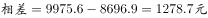，相差最小的是Z市与C市，A项正确，排除；

B项：定位表格第4项，W市也未对农民工市民化中的孤寡老人付出公共成本，却付出了妇幼保健等公共成本，B项错误，当选；

C项：定位表格第2、4项，W市的农民工市民化所需居民合作医疗保险人均公共成本在四个城市中位列第三，但其医疗等救助人均公共成本为49.4元/年，是四个城市中最高的，C项正确，排除；

D项：定位表格第2、4项，J市的农民工市民化所需居民合作医疗保险人均公共成本为118元/年，妇幼保健等人均公共成本为46.1元/年，均是四个城市中最高的，D项正确，排除。

本题为选非题，故正确答案为B。

---

### 第 16 题　qid 2062764 · 综合

某五金加工厂一周加工的五金零件的统计表破损了，如图所示，表中缺少几个数字。根据这张统计表，星期五加工的零件数比星期六（    ）。

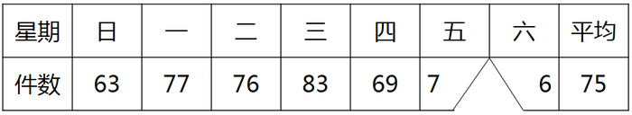

- **A**. 多25件
- **B**. 少15件　✅
- **C**. 多5件
- **D**. 少5件

**答案**：B

**官方解析**

表格数据为一周内加工零件的统计表，设星期五为，星期六为。则有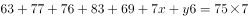，得，利用尾数计算，可知，星期五加工71件。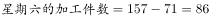，则星期五加工的零件数比星期六少。

故正确答案为B。

---
