# 2016年江苏省公务员录用考试《行测》题（A类）

> 资料分析 · 20 题 · 江苏 2016

## 材料 1

根据以下资料，回答116-120题

        2015年1-7月，我国机电产品出口额44359.4亿元，同比增长1.2%，占出口总额的57.2%，其中，电器及电子产品出口19373.1亿元，同比增长4.1%，机械设备出口12865.6亿元，同比下降6.6%，同期，服装出口5709.9亿元，同比下降6.4%，纺织品出口3825.5亿元，同比下降1.7%，鞋类出口1901.7亿元，同比下降1.9%，家具出口1883.7亿元，同比增长7.6%，塑料制品出口553.7万吨，出口额1293.3亿元，出口量同比增长2.9%，出口额同比增长2.3%；箱包及类似容器出口166.9万吨，出口额998.9亿元，出口量同比下降3.8%，出口额同比增长8.0%；玩具出口465.0亿元，同比增长11.0%。

        上述7大类劳动密集型出口额合计同比下降1.3%，此外，肥料出口1957.3万吨，出口额366.1亿元，出口量同比增长54.7%，出口额同比增长62.7%；钢材出口6213.2万吨，出口额2319.5亿元，出口量同比增长26.6%，出口额同比下降2.6%；汽车出口44.5万辆，出口额411.0亿元，出口量同比下降13.6%，出口额同比下降4.5%。

### 第 1 题　qid 1789622 · 综合

2015年1-7月，我国出口总额为：

- **A**. 63534.0亿元
- **B**. 77551.4亿元　✅
- **C**. 82907.1亿元
- **D**. 95772.7亿元

**答案**：B

**官方解析**

根据“求2015年1-7月的出口总额”可判定此题为现期量的计算问题。定位材料第一段，2015年1-7月我国机电产品出口额44359.4亿元，占出口总额的57.2，故出口总额==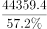≈，直除首位商7，只有B项满足。

故正确答案为B。

---

### 第 2 题　qid 1789626 · 增长

2015年1-7月，我国下列商品出口额同比下降最多的是：

- **A**. 机械设备　✅
- **B**. 服装
- **C**. 钢材
- **D**. 汽车

**答案**：A

**官方解析**

因需求出四项商品出口额同比下降最多的一项，故可判定此题为增长量的比较问题。结合材料所给信息，可得四项商品在2015年1—7月的同比下降额分别为：

A项（机械设备）：亿元。

B项（服装）：亿元。

C项（钢材）：亿元。

D项（汽车）：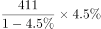亿元。

四项中，分母部分近似相等，可根据分子部分的大小关系判定数值大小。很明显，A项12866×6.6数值最大，即下降最多。

故正确答案为A。

---

### 第 3 题　qid 1789632 · 增长

2015年1-7月，我国下列出口商品平均价格同比上涨最多的是：

- **A**. 塑料制品
- **B**. 箱包及类似容器
- **C**. 肥料
- **D**. 汽车　✅

**答案**：D

**官方解析**

因需求出四项商品中平均价格同比上涨最多的一项，故可判定此题为平均数的增长量比较问题。可首先判断商品平均价格同比上升或下降，其次比较上升的数值。

定位材料代入平均数的增长量计算公式可得，A、B、C、D四项商品的平均价格同比增长量约为：

A项（塑料制品）：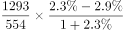，为负值，排除。

B项（箱包及类似容器）：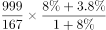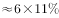。

C项（肥料）：。

D项（汽车）：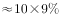。

对比可得，D项数值最大，平均价格同比上涨最多。

故正确答案为D。

---

### 第 4 题　qid 1789636 · 综合

2015年1-7月，我国服装、纺织品、家具、鞋类、塑料制品、箱包及类似容器、玩具出口额合计为：

- **A**. 13576.1亿元
- **B**. 14087.2亿元
- **C**. 16078.0亿元　✅
- **D**. 18079.3亿元

**答案**：C

**官方解析**

根据求七项商品的出口额总和，可判定本题为现期量的和差计算问题。定位资料第一段，2015年1-7月我国服装、纺织品、鞋类、家具、塑料制品、箱包及类似容器、玩具出口额分别为5709.9亿元、3825.5亿元、1901.7亿元、1883.7亿元、1293.3亿元、998.9亿元、465.0亿元，故七项商品的出口总额=（亿元），选项和条件精度相同，可以用尾数法，根据计算尾数得0，只有C项满足。

故正确答案为C。

---

### 第 5 题　qid 1789638 · 综合

下列判断不正确的是：

- **A**. 
2014年1—7月，我国玩具出口额少于422亿元

- **B**. 
2015年1—7月，我国肥料出口量和出口额同比增长均超过50

- **C**. 
2015年1—7月，我国7大类劳动密集型产品中，多数出口额同比有所增长

- **D**. 
2015年1—7月，我国电器及电子产品和机械设备出口额同比平均增长1.3
　✅

**答案**：D

**官方解析**

通过材料逐一分析题目选项，找出判断不正确的一项。

A项：2015年1-7月玩具出口465.0亿元，同比增长11.0，则2014年1-7月出口额=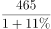，正确；

B项：2015年1-7月肥料出口量同比增长54.7，出口额同比增长62.7，均超过50，正确；

C项：在7大类劳动密集型产品中，出口额同比增长的有家具、塑料制品、箱包及类似容器和玩具4类，超过一半，正确；

D项：定位材料第一段可知，电器及电子产品出口额19373.1亿元，同比增长4.1；机械设备出口额12865.6亿元，同比下降6.6。根据混合增长率知识点，平均增长率应该介于4.1和6.6之间，且更接近4.1。而1.3与4.1的差大于1.3与6.6的差，故1.3实际上更偏向于6.6，错误。

本题为选非题，故正确答案为D。

---

## 材料 2

        为了解城镇棚户区改造情况，国家统计局社情民意调查中心2015年选取20个省（市、区）城镇棚户区的10100位居民进行了调查，调查显示，对于棚户区配套公共服务设施改造状况，受访棚户区居民中23.4%表示满意，40.2%表示基本满意，具体调查结果见下表：

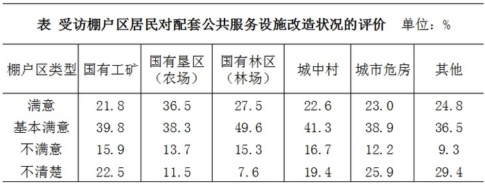

### 第 6 题　qid 1789642 · 比重

各类棚户区中，表示“满意”“基本满意”的受访居民之和占本类棚户区受访居民总数的比重最高的是：

- **A**. 国有林区（林场）　✅
- **B**. 国有垦区（农场）
- **C**. 国有工矿
- **D**. 城中村

**答案**：A

**官方解析**

由题目问“满意”“基本满意”的受访居民之和占本类棚户区受访居民总数的比重最高，判定本题为现期比重问题。各类棚户区评价均由“满意”“基本满意”“不满意”“不清楚”构成，则国有林区（林场）、国有垦区（农场）、国有工矿、城中村的“满意”“基本满意”的比重分别为、、、，则国有林区（林场）中表示“满意”“基本满意”的受访居民之和占本类棚户区受访居民总数的比重最高。 故正确答案为A。

---

### 第 7 题　qid 1789644 · 综合

表示“满意”“基本满意”的受访棚户区居民数之和比表示“不满意”“不清楚”的居民数之和多：

- **A**. 2508
- **B**. 2617
- **C**. 2747　✅
- **D**. 3676

**答案**：C

**官方解析**

由题目已知受访居民总数为10100位居民及受访棚户区居民中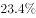表示“满意”，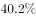表示“基本满意”，判定本题为现期比重计算问题。“不满意”和“不清楚”共占比，则题目所求为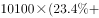。

故正确答案为C。

---

### 第 8 题　qid 1789646 · 综合

各棚户区类型中，表示“满意”的受访居民数比表示“不满意”的多1倍及以上的棚户区类型有：

- **A**. 1个
- **B**. 2个　✅
- **C**. 3个
- **D**. 4个

**答案**：B

**官方解析**

由题目问“满意”的受访居民数与“不满意”之间的倍数关系，判定本题为现期倍数问题，定位表格，各棚户区类型中，国有垦区（农场）：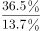＞2，其他：＞2，只有这两种类型的棚户区表示“满意”的受访居民数比表示“不满意”的多1倍及以上。

故正确答案为B。

---

### 第 9 题　qid 1789648 · 比重

各类棚户区中，表示“不清楚”的受访居民数占本类棚户区受访居民总数的比重最多相差：

- **A**. 12.7个百分点
- **B**. 16.9个百分点
- **C**. 21.8个百分点　✅
- **D**. 29.4个百分点

**答案**：C

**官方解析**

由题目问各类型棚户区中，表示“不清楚”的受访居民数占本类棚户区受访居民总数的比重的差，且表格中已知各类型中其所占比重，故可判定本题为简单加减计算问题，由表格可知，比重最大的为29.4，最小的为7.6，故最多相差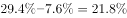。

故正确答案为C。

---

### 第 10 题　qid 1789650 · 综合

下列判断正确的是：

- **A**. 
各类棚户区受访居民给出的评价中，占比最少的均是“不满意”

- **B**. 
各类棚户区都有65以上的受访居民表示“满意”“基本满意”

- **C**. 
国有垦区（农场）与国有林区（林场）的受访棚户区居民之和少于5050人
　✅
- **D**. 
各类棚户区受访居民中，表示“基本满意”的人数均多于“不满意”“不清楚”的居民之和

**答案**：C

**官方解析**

A项：国有垦区（农场）和国有林区（林场）中，占比最少的是“不清楚”，并非“不满意”，错误； B项：国有工矿棚户区类型中，其表示“满意”“基本满意”受访居民所占比重为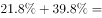，错误； C项：线段法：国有垦区（农场）与国有林区（林场）的满意度至少为27.5，与总体满意度23.4的距离为4.1。而其他类型的满意度与23.4的距离均小于4.1。根据距离与量成反比可知，国有垦区（农场）满意度+国有林区（林场）满意度其他四种类型满意度之和，故二者之和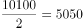，正确； D项：“其他”棚户区类型中，表示“基本满意”的占比36.5，表示“不满意”和“不清楚”共占比，前者小于后者，错误。 故正确答案为C。

---

## 材料 3

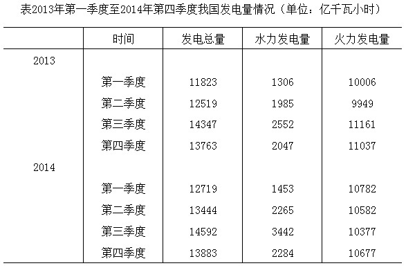

        2015年1—6月我国火力、水力发电量及其增长情况

### 第 11 题　qid 1789652 · 综合

2015年1-6月我国火力发电量少于上年同期的月度个数是（    ）

- **A**. 3
- **B**. 4
- **C**. 5　✅
- **D**. 6

**答案**：C

**官方解析**

由题目问少于上年同期的月度个数，即增长率小于零的个数，可判定本题为直接找数问题，根据折线图可知，2月、3月、4月、5月、6月火力发电量同比增长率均小于零，即有5个月发电量同比减少。
故正确答案为C。

---

### 第 12 题　qid 1789628 · 增长

2014年我国季度发电量同比增长最慢的是：

- **A**. 第一季度
- **B**. 第二季度
- **C**. 第三季度
- **D**. 第四季度　✅

**答案**：D

**官方解析**

由题目所问“同比增长最慢”是哪一季度，判定本题为一般增长率比较问题。定位表格材料，2014年4个季度的同比增长率分别为：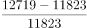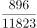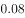、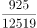、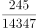、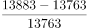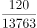，故增长最慢的是第四季度。

故正确答案为D。

---

### 第 13 题　qid 1789630 · 增长

2015年第二季度我国火力发电量比上年同期少：

- **A**. 232亿千瓦小时
- **B**. 240亿千瓦小时
- **C**. 340亿千瓦小时
- **D**. 365亿千瓦小时　✅

**答案**：D

**官方解析**

由题目所问“发电量比上年同期少”，可判定本题为增长量计算问题。因选项和条件精度相同，可采用尾数法。2014年第二季度我国火力发电量亿千瓦小时，由图中数据可得2015年第二季度火力发电量=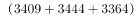亿千瓦小时。二者之差=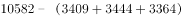，计算尾数得5，只有D项满足。

故正确答案为D。

---

### 第 14 题　qid 1789634 · 增长

如果2015年7月-11月我国水力发电量的月平均增速与2015年2月-6月保持相同，则2015年11月我国水力发电量可达：

- **A**. 1390亿千瓦小时
- **B**. 1870亿千瓦小时　✅
- **C**. 2063亿千瓦小时
- **D**. 2239亿千瓦小时

**答案**：B

**官方解析**

由题干给定“月平均增速”求现期，判定为年均增长率问题，定位图中数据，假设2015年7月-11月的月均增长速度为，则565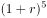，则2015年11月我国水力发电量为=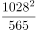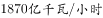。

故正确答案为B。

---

### 第 15 题　qid 1789640 · 综合

下列判断不正确的是：

- **A**. 
2014年有三个季度的水力发电量占发电总量的比重不超过

- **B**. 
2013年—2014年我国各季度火力发电量占发电总量的比重均超过

- **C**. 
2015年上半年我国水力与火力发电量各月同比增长的方向均相反
　✅
- **D**. 
2013年第二季度到2015年第二季度我国水力发电量有四个季度环比减少

**答案**：C

**官方解析**

A项：2014年一、二、三、四季度水力发电量占发电总量的比重分别为：、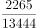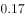、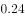、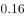，即2014年一、二、四季度比重不超过，正确；

B项：2013年各个季度火力发电占总发电量的比重分别为：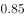、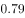、、；2014年各个季度火力发电占总发电量的比重分别为：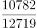、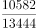、、，即2013年-2014年我国各季度火力发电量占发电总，正确；

C项：2015年1月，水力和火力发电量同比增长率均大于零，二者方向相同，错误；

D项：由表格材料可知，2015年一、二季度水力发电量分别为：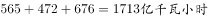、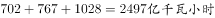，则2015年第一季度水力发电量小于2014年第四季度，共有四个季度环比减少，分别为2013年第四季度、2014年第一季度、2014年第四季度、2015年第一季度，正确。

本题为选非题，故正确答案为C。

---

## 材料 4

        2015年6月某市统计局对应届毕业生的抽样调查显示：有593名受访者打算创业，占28.6%。其中，大专生打算创业的比重比平均水平高7.0个百分点，本科生打算创业的比重比平均水平低3.9个百分点，31.4%的研究生打算创业，有34.5%的受访男生打算创业，比女生高11.2个百分点。

        在没有创业打算的受访者应届毕业生中，因缺乏启动资金，缺乏社会经验，缺乏创业方向等原因不打算创业的情况见图1，有创业打算的受访应届毕业生能承担的创业资金额度情况见图2.

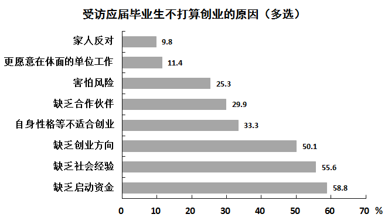

### 第 16 题　qid 1789662 · 综合

本次调查中，没有创业打算的毕业生人数约是有创业打算的毕业生人数的：

- **A**. 1.5倍
- **B**. 1.9倍
- **C**. 2.5倍　✅
- **D**. 2.8倍

**答案**：C

**官方解析**

根据题目求二者的倍数关系可判定此题为倍数计算问题。定位文字材料第一段，本次调查中，有创业打算的毕业生人数占比28.6，则没有创业打算的毕业生人数占比71.4，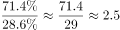。

故正确答案为C。

---

### 第 17 题　qid 1789664 · 比重

本次调查中，本科毕业生打算创业的比重比大专生低：

- **A**. 3.1个百分点
- **B**. 3.9个百分点
- **C**. 7.0个百分点
- **D**. 10.9个百分点　✅

**答案**：D

**官方解析**

根据题目求二者比重之差，可判定此题为简单加减计算问题。定位文字材料第一段可知，本科毕业生打算创业的比重为，大专生打算创业的比重为，故大专比重本科比重。

故正确答案为D。

---

### 第 18 题　qid 1789666 · 综合

本次调查中，因缺乏启动资金而不打算创业的毕业生有：

- **A**. 349人
- **B**. 870人　✅
- **C**. 1219人
- **D**. 1480人

**答案**：B

**官方解析**

根据资料和题目，可以判定本题为现期比重问题。定位文字资料第一段，本次调查中，有创业打算的毕业生有593名，占28.6，故没有创业打算的毕业生人数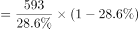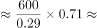。再由条形图可知，因缺乏启动资金而放弃创业的人数占到58.8，故因缺乏启动资金而放弃创业的人数，与B项最接近。

故正确答案为B。

---

### 第 19 题　qid 1789668 · 综合

本次调查中有创业打算的毕业生能承担的创业资金额度低于10万元的人数是：

- **A**. 344　✅
- **B**. 268
- **C**. 249
- **D**. 193

**答案**：A

**官方解析**

根据材料和题目已知求相应人数，可判定此题为现期比重问题。定位饼形图可以得出，能承担创业资金额度低于10万元的毕业生所占比重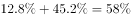。调查中共有593人打算创业。故所求人数人，与A项最接近。

故正确答案为A。

---

### 第 20 题　qid 1789670 · 综合

关于本次调查，下列判断正确的是：

- **A**. 受访男生人数比女生少　✅
- **B**. 有25.3%的受访者因害怕风险而不打算创业
- **C**. 至少有168名受访者因更愿意在体面的单位上班而不打算创业
- **D**. 有超过1成的打算创业的毕业生能承担50万元以上的创业资金额度

**答案**：A

**官方解析**

通过材料逐一分析题目选项，找出说法正确的一项。

A项：定位文字材料第一段，的男生打算创业，比女生高11.2个百分点，则的女生打算创业。男女总共打算创业的人数占总人数的，根据线段法可知，距离之比等于人数的反比，故男女人数比例为5.3：5.9，女生人数大于男生人数，正确；

B项：根据柱形图可知，在没有创业打算的受访者中有25.3%是因为害怕风险，而并非所有的受访者，主体错误；

C项：更愿意在体面单位上班的人数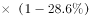，“至少”表述不当，错误；

D项：定位饼状图可知，能够承担50万以上创业资金的毕业生所占比重为，不足一成，错误。

故正确答案为A。

---
